## 1. 不会冒泡的事件有哪些？

**参考答案：**

在 JavaScript 和浏览器中，绝大多数事件都会按照 DOM 事件流模型冒泡，即事件会从目标元素开始向上冒泡到它的父元素，并最终到达 `document` 元素。然而，也有一些事件是不会冒泡的。这些事件通常直接在目标元素上触发，并不会向上传播。

以下是一些不会冒泡的事件的示例：

1. `focus`：当元素获得焦点时触发，例如通过键盘或鼠标点击。这是一个不会冒泡的事件。

2. `blur`：当元素失去焦点时触发。这也是一个不会冒泡的事件。

3. `focusin`：与 `focus` 类似，但会在元素或其父元素上触发（冒泡），因此这个事件是特例。

4. `focusout`：与 `blur` 类似，但会在元素或其父元素上触发（冒泡），因此这个事件是特例。

5. `load`：当图像、音频、视频或其他资源加载完成时触发。例如，在 `img` 元素上触发的 `load` 事件不会冒泡。

6. `unload`：当页面即将被导航离开时触发。这通常用于执行清理工作，也不会冒泡。

7. `stop`：通常与 `media` 元素相关，例如 `audio` 或 `video` 元素。这是在媒体播放停止时触发的事件。

8. `readystatechange`：当 `document` 的 `readyState` 改变时触发。这通常在页面加载时使用。

9. `scroll`：当元素滚动时触发。这个事件在某些浏览器中可能会冒泡。

这些事件通常直接在目标元素上触发，并且不会传播到父元素上。&#x20;


***

## 2. mouseEnter 和 mouseOver 有什么区别？


**参考答案：**

`mouseenter` 和 `mouseover` 是两个用于处理鼠标进入元素时的事件，但它们在一些关键点上有所不同：

1. 事件冒泡：

   * `mouseenter`：这个事件在鼠标指针首次进入特定元素（或其子元素）时触发。当鼠标进入元素时，会触发该元素的 `mouseenter` 事件，但不会在元素的子元素上冒泡。因此，该事件通常用于检测鼠标首次进入元素时的动作。

   * `mouseover`：这个事件在鼠标指针移动到某个元素上时触发，不论它是直接在这个元素上触发还是在其子元素上触发。当鼠标进入一个元素时，它会在该元素上触发 `mouseover` 事件，然后冒泡到父元素。

2. 事件触发范围：

   * `mouseenter`：当鼠标进入元素自身时触发，只在目标元素上触发，不会因为鼠标移动到其子元素上而再次触发。

   * `mouseover`：不仅在目标元素上触发，也在其子元素上触发。所以，如果鼠标从一个子元素移动到另一个子元素，这些元素的父元素会触发多个 `mouseover` 事件。

3. 事件对象的属性：

   * `mouseenter`：事件对象通常会有 `relatedTarget` 属性，它指向鼠标移动前的那个元素。如果 `relatedTarget` 指向目标元素或为 `null`，那么事件就不会触发。

   * `mouseover`：事件对象也会有 `relatedTarget` 属性，通常指向从中离开的那个元素。


使用场景

* `mouseenter` 更适合用来检测鼠标首次进入某个元素时的行为。

* `mouseover` 更适合用来检测鼠标在元素或其子元素之间移动时的行为，因为它冒泡。

在实际使用时，如果你只想在鼠标首次进入元素时触发某些行为（比如显示一个提示），可以使用 `mouseenter`；如果你希望在鼠标移动到某个元素或其子元素上时都触发某些行为（比如动态改变样式），可以使用 `mouseover`。


***

## 3. MessageChannel 是什么，有什么使用场景？


**参考答案：**

`MessageChannel` 是一个 JavaScript API，用于在两个独立的执行环境（如 Web Workers 或者不同的 browsing contexts）之间建立双向通信的通道。`MessageChannel` 提供了两个通信端点（`port1` 和 `port2`），可以在两个不同的执行环境之间传递消息，并通过事件监听的方式来处理这些消息。

使用场景包括但不限于：

1. Web Workers 通信：在 Web 开发中，`MessageChannel` 通常用于在主线程和 Web Worker 之间建立通信通道，以便主线程与 Worker 之间传递消息和数据。

2. 不同浏览上下文（browsing context）之间的通信：在现代浏览器中，多个标签页、iframe 或者其他类型的 browsing context 可以通过 `MessageChannel` 实现通信。

3. SharedWorker 通信：`MessageChannel` 可以用于在主线程和 Shared Worker 之间建立通信通道。

4. 服务端和客户端之间的通信：`MessageChannel` 可以用于客户端（如浏览器）与服务端（如 WebSocket 服务器）之间的通信，特别是在与 WebSocket 或其他类似技术结合使用时。

5. 异步任务处理：在某些场景中，使用 `MessageChannel` 可以更方便地处理异步任务，因为它提供了独立于主线程的通信通道。


使用示例

下面是一个简单的示例，展示如何使用 `MessageChannel` 在主线程和 Web Worker 之间建立通信通道：

```javascript
// 创建 MessageChannel
const channel = new MessageChannel();
const port1 = channel.port1;
const port2 = channel.port2;

// 在主线程中
const worker = new Worker('worker.js');
worker.postMessage({ port: port2 }, [port2]);

port1.onmessage = function(event) {
  console.log('Received message from worker:', event.data);
};

// 发送消息给 worker
port1.postMessage('Hello, Worker!');
```

在上面的示例中，我们创建了一个 `MessageChannel`，并通过 `port1` 和 `port2` 进行通信。我们将 `port2` 发送给 Web Worker，`port1` 留在主线程。然后，主线程可以通过监听 `port1` 的 `onmessage` 事件来接收来自 Web Worker 的消息，并通过 `port1.postMessage()` 向 Web Worker 发送消息。


***

## 4. async、await 实现原理


**参考答案：**

JavaScript 异步编程回顾

由于 JavaScript 是单线程执行模型，因此必须支持异步编程才能提高运行效率。异步编程的语法目标是让异步过程写起来像同步过程。

1. 回调函数

回调函数，就是把任务的第二段单独写在一个函数里面，等到重新执行这个任务的时候，就直接调用这个函数。

```javascript
const fs = require('fs')
fs.readFile('/etc/passwd', (err, data) => {
  if (err) {
    console.error(err)
    return
  }
  console.log(data.toString())
})
```

回调函数最大的问题是容易形成回调地狱，即多个回调函数嵌套，降低代码可读性，增加逻辑的复杂性，容易出错。

```javascript
fs.readFile(fileA, function (err, data) {
  fs.readFile(fileB, function (err, data) {
    // ...
  })
})
```

* Promise

为解决回调函数的不足，社区创造出 Promise。

```javascript
const fs = require('fs')

const readFileWithPromise = file => {
  return new Promise((resolve, reject) => {
    fs.readFile(file, (err, data) => {
      if (err) {
        reject(err)
      } else {
        resolve(data)
      }
    })
  })
}

readFileWithPromise('/etc/passwd')
  .then(data => {
    console.log(data.toString())
    return readFileWithPromise('/etc/profile')
  })
  .then(data => {
    console.log(data.toString())
  })
  .catch(err => {
    console.log(err)
  })
```

简单的 Promise 实现，窥探下本质

Promise 实际上是利用编程技巧将回调函数的横向加载，改成纵向加载，达到链式调用的效果，避免回调地狱。最大问题是代码冗余，原来的任务被 Promise 包装了一下，不管什么操作，一眼看去都是一堆 then，原来的语义变得很不清楚。

* async、await

为了解决 Promise 的问题，async、await 在 ES8 中被提了出来，是目前为止最好的解决方案

```javascript
const fs = require('fs')
async function readFile() {
  try {    
    var f1 = await readFileWithPromise('/etc/passwd')
    console.log(f1.toString())
    var f2 = await readFileWithPromise('/etc/profile')
    console.log(f2.toString())
  } catch (err) {
    console.log(err)
  }
}\
```

async、await 函数写起来跟同步函数一样，条件是需要接收 Promise 或原始类型的值。异步编程的最终目标是转换成人类最容易理解的形式。


async、await

分析 async、await 实现原理之前，先介绍下预备知识

1. generator

generator 函数是协程在 ES6 的实现。协程简单来说就是多个线程互相协作，完成异步任务。

整个 generator 函数就是一个封装的异步任务，异步操作需要暂停的地方，都用 yield 语句注明。generator 函数的执行方法如下：

```javascript
function* gen(x) {
  console.log('start')
  const y = yield x * 2
  return y
}

const g = gen(1)
g.next()   // start { value: 2, done: false }
g.next(4)  // { value: 4, done: true }
```

* `gen()` 不会立即执行，而是一上来就暂停，返回一个 `Iterator` 对象（具体可以参考 [Iterator遍历器](https://link.juejin.cn/?target=https%3A%2F%2Fgithub.com%2Fwangfupeng1988%2Fjs-async-tutorial%2Fblob%2Fmaster%2Fpart4-generator%2F02-iterator.md) ）

* 每次 `g.next()` 都会打破暂停状态去执行，直到遇到下一个 `yield` 或者 `return`

* 遇到 `yield` 时，会执行 `yield` 后面的表达式，并返回执行之后的值，然后再次进入暂停状态，此时 `done: false` 。

* `next` 函数可以接受参数，作为上个阶段异步任务的返回结果，被函数体内的变量接收

* 遇到 `return` 时，会返回值，执行结束，即 `done: true`

* 每次 `g.next()` 的返回值永远都是 `{value: ... , done: ...}` 的形式

- thunk函数

JavaScript 中的 thunk 函数（译为转换程序）简单来说就是把带有回调函数的多参数函数转换成只接收回调函数的单参数版本

```javascript
const fs = require('fs')
const thunkify = fn => (...rest) => callback => fn(...rest, callback)
const thunk = thunkify(fs.readFile)
const readFileThunk = thunk('/etc/passwd', 'utf8')
readFileThunk((err, data) => {
   // ...
})
```

单纯的 thunk 函数并没有很大的用处， 大牛们想到了和 generator 结合：

```javascript
function* readFileThunkWithGen() {
  try {
    const content1 = yield readFileThunk('/etc/passwd', 'utf8')
    console.log(content1)
    const content2 = yield readFileThunk('/etc/profile', 'utf8')
    console.log(content2)
    return 'done'
  } catch (err) {
    console.error(err)
    return 'fail'
  }  
}

const g = readFileThunkWithGen()
g.next().value((err, data) => {
  if (err) {
    return g.throw(err).value
  }
  g.next(data.toString()).value((err, data) => {
    if (err) {
      return g.throw(err).value
    }
    g.next(data.toString())
  })
})
```

thunk 函数的真正作用是统一多参数函数的调用方式，在 next 调用时把控制权交还给 generator，使 generator 函数可以使用递归方式自启动流程

```javascript
const run = generator => {
  const g = generator()
  const next = (err, ...rest) => {
    if (err) {
      return g.throw(err).value
    }
    const result = g.next(rest.length > 1 ? rest : rest[0])
    if (result.done) {
      return result.value
    }
    result.value(next)
  }
  next()
}
run(readFileThunkWithGen)
```

有了自启动的加持之后，generator 函数内就可以写"同步"的代码了。generator 函数也可以与 Promise 结合：

```javascript
function* readFileWithGen() {
  try {    
    const content1 = yield readFileWithPromise('/etc/passwd', 'utf8')
    console.log(content1)
    const content2 = yield readFileWithPromise('/etc/profile', 'utf8')
    console.log(content2)
    return 'done'
  } catch (err) {
    console.error(err)
    return 'fail'
  }
}

const run = generator => {
  return new Promise((resolve, reject) => {
    const g = generator()
    const next = res => {
      const result = g.next(res)
      if (result.done) {
        return resolve(result.value)
      }
      result.value
        .then(
          next,
          err => reject(gen.throw(err).value)
        )
    }
    next()
  })
}

run(readFileWithGen)
  .then(res => console.log(res))
  .catch(err => console.log(err))
```

generator 可以暂停执行，很容易让它和异步操作产生联系，因为我们在处理异步操作时，在等待的时候可以暂停当前任务，把程序控制权交还给其他程序，当异步任务有返回时，在回调中再把控制权交还给之前的任务。generator 实际上并没有改变 JavaScript 单线程、使用回调处理异步任务的本质。

* co 函数库

每次执行 generator 函数时自己写启动器比较麻烦。 [co函数库](https://github.com/tj/co) 是一个 generator 函数的自启动执行器，使用条件是 generator 函数的 yield 命令后面，只能是 thunk 函数或 Promise 对象，co 函数执行完返回一个 Promise 对象。

```javascript
const co = require('co')
co(readFileWithGen).then(res => console.log(res)) // 'done'
co(readFileThunkWithGen).then(res => console.log(res)) // 'done'
```

co 函数库的源码实现其实就是把上面两种情况做了综合:

```javascript
// 做了简化，与源码基本一致
const co = (generator, ...rest) => {
  const ctx = this
  return new Promise((resolve, reject) => {
    const gen = generator.call(ctx, ...rest)
    if (!gen || typeof gen.next !== 'function') {
      return resolve(gen)
    } 
    
    const onFulfilled = res => {
      let ret
      try {
        ret = gen.next(res)
      } catch (e) {
        return reject(e)
      }
      next(ret)
    }    

    const onRejected = err => {
      let ret
      try {
        ret = gen.throw(err)
      } catch (e) {
        return reject(e)
      }
      next(ret)
    }

    const next = result => {
      if (result.done) {
        return resolve(result.value)
      }
      toPromise(result.value).then(onFulfilled, onRejected)
    }

    onFulfilled()
  })  
}

const toPromise = value => {
  if (isPromise(value)) return value
  if ('function' == typeof value) {
    return new Promise((resolve, reject) => {
      value((err, ...rest) => {
        if (err) {
          return reject(err)
        }
        resolve(rest.length > 1 ? rest : rest[0])
      })
    })
  }
}
```

* 理解 async、await

一句话，async、await 是 co 库的官方实现。也可以看作自带启动器的 generator 函数的语法糖。不同的是，async、await 只支持 Promise 和原始类型的值，不支持 thunk 函数。

```javascript
// generator with co
co(function* () {
  try {    
    const content1 = yield readFileWithPromise('/etc/passwd', 'utf8')
    console.log(content1)
    const content2 = yield readFileWithPromise('/etc/profile', 'utf8')
    console.log(content2)
    return 'done'
  } catch (err) {
    console.error(err)
    return 'fail'
  }
})

// async await
async function readfile() {
  try {
    const content1 = await readFileWithPromise('/etc/passwd', 'utf8')
    console.log(content1)
    const content2 = await readFileWithPromise('/etc/profile', 'utf8')
    console.log(content2)
    return 'done'
  } catch (err) {
    throw(err)
  }
}
readfile().then(
  res => console.log(res),
  err => console.error(err)
)
```

总结

不论以上哪种方式，都没有改变 JavaScript 单线程、使用回调处理异步任务的本质。人类总是追求最简单易于理解的编程方式。


***

## 5. Proxy 能够监听到对象中的对象的引用吗？


**参考答案：**

`Proxy`可以监听到对象中的对象的引用。

当使用`Proxy`包装一个对象时，可以为该对象的任何属性创建一个拦截器，包括属性值为对象的情况。

下面展示了如何使用`Proxy`来监听对象中对象引用的变化：

```javascript
const obj = {
  nestedObj: { foo: 'bar' }
}

const handler = {
  get(target, prop, receiver) {
    const value = Reflect.get(target, prop, receiver)
    if (typeof value === 'object' && value !== null) {
      return new Proxy(value, handler)
    }
    console.log('get', prop, target[prop])
    return value
  },
  set(target, property, value) {
    target[property] = value
    console.log(`Setting property '${property}' to '${value}'`)
    return true
  }
}

const proxyObj = new Proxy(obj, handler)
proxyObj.nestedObj.foo = 'baz'  // 输出: Setting property 'foo' to 'baz'
```

我们通过`Proxy`创建了一个代理对象`proxyObj`，它包装了原始的`obj`。然后，我们对`proxyObj`中的`nestedObj.foo`进行赋值操作，这会触发`set`拦截器，并打印相应的信息。

通过使用适当的拦截器函数，可以实现对对象中对象引用的监听和修改。这使得我们可以在需要时执行自定义的操作，例如记录更改、验证或触发其他事件等。


***

## 6. 如何让 var \[a, b] = {a: 1, b: 2} 解构赋值成功？


**参考答案：**

迭代协议

题目问怎么能让var \[a,b] = {a:1,b:2} 成立，那么我们首先要运行一下，看看它是怎么个不成立法。

```javascript
const obj = {
    a:'1',
    b:'2',
}

const [a,b] = obj
```

运行之后打开控制台可以发现报错信息，它告诉我们obj这个对象是不可迭代的，那么我们想办法把obj变成可迭代的是不是就能解决这个问题，这要怎么做呢？想要搞明白这点我们需要先了解一下可迭代协议。


可迭代协议的概念（ MDN ）

> 可迭代协议允许 JavaScript 对象定义或定制它们的迭代行为，例如，在一个 `for..of` 结构中，哪些值可以被遍历到。一些内置类型同时是[内置的可迭代对象](https://developer.mozilla.org/zh-CN/docs/Web/JavaScript/Reference/Iteration_protocols#%E5%86%85%E7%BD%AE%E7%9A%84%E5%8F%AF%E8%BF%AD%E4%BB%A3%E5%AF%B9%E8%B1%A1)，并且有默认的迭代行为，比如 `Array` 或者 `Map`，而其他内置类型则不是（比如 `Object`）。
>
> 要成为可迭代对象，该对象必须实现 `@@iterator` 方法，这意味着对象（或者它[原型链](https://developer.mozilla.org/zh-CN/docs/Web/JavaScript/Inheritance_and_the_prototype_chain)上的某个对象）必须有一个键为 `@@iterator` 的属性，可通过常量 `Symbol.iterator` 访问该属性：
>
> `[Symbol.iterator]`
>
> 一个无参数的函数，其返回值为一个符合[迭代器协议](https://developer.mozilla.org/zh-CN/docs/Web/JavaScript/Reference/Iteration_protocols#%E8%BF%AD%E4%BB%A3%E5%99%A8%E5%8D%8F%E8%AE%AE)的对象。
>
> 当一个对象需要被迭代的时候（比如被置入一个 `for...of` 循环时），首先，会不带参数调用它的 `@@iterator` 方法，然后使用此方法返回的迭代器获得要迭代的值。

说人话就是，要想让obj成为一个可迭代的对象，就需要它实现 `@@iterator` 方法，具体表现为对象身上要有一个名为`[Symbol.iterator]` 的方法。而数组和Map则是一开始就有这个方法，所以它们是可迭代的。而对象身上则没有这个默认行为，所以不可迭代。真的是这样吗？我们创建一个数组，看看数组身上到底有没有`[Symbol.iterator]` 方法。

```javascript
const array = [1,2,3]
console.log(array)
```

点开原型查看

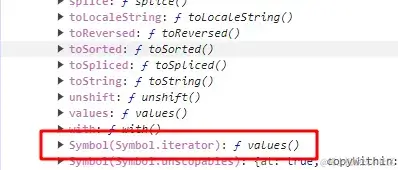

发现真的有一个Symbol.iterator()方法，该方法会返回一个迭代器对象。我们来调用一下

```javascript
const array = [1,2,3]
const iterator = array[Symbol.iterator]()
console.log(iterator)
console.log(iterator.next())
console.log(iterator.next())
console.log(iterator.next())
console.log(iterator.next())
```

打印iterator对象后发现在它的原型上有一个next()方法，调用next()方法，会得到一个对象value就是当前迭代的值，done则代表当前迭代器是否已经迭代完成。


数组 解构 的本质

```javascript
const array = [1,2,3]
var [a,b,c] = array
// 本质上是
const iterator = array[Symbol.iterator]()
var a = iterator.next().value
var b = iterator.next().value
var c = iterator.next().value
```

解决方法

到此为止我们可知，要想满足迭代协议需要对象身上有一个名为`[Symbol.iterator]`的方法。再使用for..of或者解构赋值的时候会隐式的调用这个方法，得到一个迭代对象，通过迭代对象的next方法判断当前是否完成迭代和具体迭代的值。

也就是说我们要在obj上添加`[Symbol.iterator]`方法并且完成next方法的逻辑

最终代码如下：

```javascript
 const obj = {
    a: '1',
    b: '2',
    [Symbol.iterator]() {
        let index = 0
        const keys = Object.keys(this)
        return {
            next() {
                if (index < keys.length) {
                    return {
                        done: false,
                        value: obj[keys[index++]]
                    }
                }
                return {done:true,value:undefined}
            }
        }
    }
}

const [a, b] = obj
```

当然，我们也可以用for...of去循环遍历这个对象，我看谁再说for...of不能遍历对象(doge)

```javascript
for(let i of obj){
    console.log(i)
}
// 1
// 2
```


***

## 7. 下面代码会输出什么？

```javascript
foo();
var foo;
function foo(){
  console.log(1);
}
foo = function(){
  console.log(2);
}
```

**参考答案：**

答案是：1

> 函数声明和变量声明都会被提升，但是有一个值得注意的细节，那就是，函数会首先提升，然后才是变量！

根据 JavaScript 的变量和函数提升规则，上述代码在执行时会被解析成以下形式：

```javascript
function foo(){
  console.log(1);
}

var foo; // 变量声明被提升至顶部

foo(); // 输出 1

foo = function(){
  console.log(2);
}
```

以下是代码的执行过程：

1. 首先，函数 `foo` 的函数声明被提升到作用域的顶部。所以，在调用 `foo()` 之前，函数 `foo` 已经可用。

2.然后，变量 `foo` 被声明，并且由于它已经被函数 `foo` 的定义所覆盖，因此这个变量声明没有改变函数 `foo` 的值。

1. 接下来，函数 `foo` 被调用，输出结果为 `1`。

2. 最后，变量 `foo` 被重新赋值为一个新的函数表达式，该函数输出结果为 `2`。

所以，最终输出结果为：

```plaintext
```


***

## 8. 描述下列代码的执行结果

```javascript
foo(typeof a);
function foo(p) {
  console.log(this);
  console.log(p);
  console.log(typeof b);
  let b = 0;
}
```


**参考答案：**

在这段代码中，我们首先遇到了一个函数声明 `foo`，然后在 `foo` 函数内部，有三个语句:

1. `console.log(this);`: 打印函数 `foo` 的执行上下文中的 `this` 值。由于 `foo` 是在全局环境中声明的，因此 `this` 指向全局对象（在浏览器环境下通常是 `window` 对象）。

2. `console.log(p);`: 打印参数 `p` 的类型。这个参数的值是在调用 `foo` 函数时传入的，因此这里会输出传入的参数类型。

3. `console.log(typeof b);`: 打印变量 `b` 的类型。由于变量 `b` 是在后面的代码中使用 `let` 声明的，因此在这之前对 `b` 的访问会导致暂时性死区（Temporal Dead Zone，TDZ）的错误。因此这里会输出 `ReferenceError: Cannot access 'b' before initialization`。

因此，这段代码的输出会是类似以下内容的内容：

```plaintext
Window // （全局执行上下文中的 this）
undefined // （foo 函数的参数类型）
ReferenceError: Cannot access 'b' before initialization // （在 b 声明之前访问 b 会导致 ReferenceError）
```


***

## 9. 什么是作用域链？


**参考答案：**

作用域链（Scope Chain）是 JavaScript 中用于查找变量和函数的一种机制。每个 JavaScript 函数都会创建一个作用域链。

作用域链是由当前执行环境（Execution Context）中的变量对象（Variable Object）以及其父级执行环境的变量对象组成的。当代码在一个执行环境中执行时，如果需要访问一个变量或者函数，JavaScript 引擎会首先在当前执行环境的变量对象中查找，如果找不到，它会沿着作用域链向上一级的执行环境中查找，直到找到对应的变量或者函数，或者达到全局执行环境为止。

作用域链的形成是由函数定义时的位置来决定的，而不是函数调用时的位置。这意味着函数的作用域链是在函数定义时确定的，而不是在函数调用时确定的。

作用域链的重要性在于它决定了变量和函数的访问权限。一个变量或者函数能否在当前执行环境中被访问到，取决于它是否在当前执行环境的作用域链上。


***

## 10. bind、call、apply 有什么区别？如何实现一个bind?


**参考答案：**

一、作用

`call `、`apply `、`bind `作用是改变函数执行时的上下文，简而言之就是改变函数运行时的`this`指向

那么什么情况下需要改变`this`的指向呢？下面举个例子

```javascript
var name1="lucy";
var obj={
    name1:"martin",
    say:function () {
        console.log(this.name1);
    }
};
obj.say(); //martin，this指向obj对象
setTimeout(obj.say,0); //lucy，this指向window对象
```

从上面可以看到，正常情况`say`方法输出`martin`

但是我们把`say`放在`setTimeout`方法中，在定时器中是作为回调函数来执行的，因此回到主栈执行时是在全局执行上下文的环境中执行的，这时候`this`指向`window`，所以输出`luck`

> PS: 此处需要注意，如果外层改成 `const name1="lucy";`，那么`setTimeout(obj.say,0);`的输出会是 undefined，因为 var 声明的变量会挂载在 window 上，而 let 和 const 声明的变量不会挂载到 window 上。

我们实际需要的是`this`指向`obj`对象，这时候就需要该改变`this`指向了

```javascript
setTimeout(obj.say.bind(obj),0); //martin，this指向obj对象
```


二、区别

下面再来看看`apply`、`call`、`bind`的使用

apply

`apply`接受两个参数，第一个参数是`this`的指向，第二个参数是函数接受的参数，以数组的形式传入

改变`this`指向后原函数会立即执行，且此方法只是临时改变`this`指向一次

```javascript
function fn(...args){
    console.log(this,args);
}
let obj = {
    myname:"张三"
}

fn.apply(obj,[1,2]); // this会变成传入的obj，传入的参数必须是一个数组；
fn(1,2) // this指向window
```

当第一个参数为`null`、`undefined`的时候，默认指向`window`(在浏览器中)

```javascript
fn.apply(null,[1,2]); // this指向window
fn.apply(undefined,[1,2]); // this指向window
```


call

`call`方法的第一个参数也是`this`的指向，后面传入的是一个参数列表

跟`apply`一样，改变`this`指向后原函数会立即执行，且此方法只是临时改变`this`指向一次

```javascript
function fn(...args){
    console.log(this,args);
}
let obj = {
    myname:"张三"
}

fn.call(obj,1,2); // this会变成传入的obj，传入的参数不是数组；
fn(1,2) // this指向window
```

同样的，当第一个参数为`null`、`undefined`的时候，默认指向`window`(在浏览器中)

```javascript
fn.call(null,1,2]); // this指向window
fn.call(undefined,1,2); // this指向window
```


bind

bind方法和call很相似，第一参数也是`this`的指向，后面传入的也是一个参数列表(但是这个参数列表可以分多次传入)

改变`this`指向后不会立即执行，而是返回一个永久改变`this`指向的函数

```javascript
function fn(...args){
    console.log(this,args);
}
let obj = {
    myname:"张三"
}

const bindFn = fn.bind(obj); // this 也会变成传入的obj ，bind不是立即执行需要执行一次
bindFn(1,2) // this指向obj
fn(1,2) // this指向window
```

小结

从上面可以看到，`apply`、`call`、`bind`三者的区别在于：

* 三者都可以改变函数的`this`对象指向

* 三者第一个参数都是`this`要指向的对象，如果如果没有这个参数或参数为`undefined`或`null`，则默认指向全局`window`

* 三者都可以传参，但是`apply`是数组，而`call`是参数列表，且`apply`和`call`是一次性传入参数，而`bind`可以分为多次传入

* `bind `是返回绑定this之后的函数，`apply `、`call` 则是立即执行


三、实现

实现`bind`的步骤，我们可以分解成为三部分：

* 修改`this`指向

* 动态传递参数

```javascript
// 方式一：只在bind中传递函数参数
fn.bind(obj,1,2)()

// 方式二：在bind中传递函数参数，也在返回函数中传递参数
fn.bind(obj,1)(2)
```

* 兼容`new`关键字

整体实现代码如下：

```javascript
Function.prototype.myBind = function (context) {
    // 判断调用对象是否为函数
    if (typeof this !== "function") {
        throw new TypeError("Error");
    }

    // 获取参数
    const args = [...arguments].slice(1),
          fn = this;

    return function Fn() {

        // 根据调用方式，传入不同绑定值
        return fn.apply(this instanceof Fn ? this : context, args.concat(...arguments)); 
    }
}
```


***

## 11. common.js和es6中模块引入的区别？


**参考答案：**

CommonJS 和 ES6 模块系统在语法和行为上有显著的区别：

CommonJS

CommonJS 是一种模块系统，主要用于 Node.js 环境。它使用 `require` 函数来引入模块，并使用 `module.exports` 来导出模块。

语法

* 导出模块：

```javascript
// moduleA.js
const name = 'John';
module.exports = name;

// 或者导出一个对象
const person = { name: 'John', age: 30 };
module.exports = person;
```

* 引入模块：

```javascript
// main.js
const name = require('./moduleA');
console.log(name); // 'John'

// 引入对象
const person = require('./moduleA');
console.log(person.name); // 'John'
console.log(person.age);  // 30
```

特点

1. 动态引入： `require` 可以在函数体内、条件语句中动态引入模块。

```javascript
if (condition) {
    const moduleA = require('./moduleA');
}
```

* 同步加载： `require` 是同步的，模块在执行 `require` 时会立即加载并返回结果。

* 导出的是值的拷贝： 但对于对象和数组等引用类型，修改引用类型的属性会在所有引用中反映出来。

```javascript
const obj = require('./moduleA');
obj.newProp = 'new';
console.log(require('./moduleA').newProp); // 'new'
```


ES6 模块

ES6 模块系统是 ECMAScript 标准的一部分，使用 `import` 和 `export` 语法来定义模块，广泛用于现代前端开发以及一些支持 ES6 的服务器环境。


语法

* 导出模块：

```javascript
// moduleA.js
export const name = 'John';

// 导出默认值
const person = { name: 'John', age: 30 };
export default person;
```

* 引入模块：

```javascript
// main.js
import { name } from './moduleA';
console.log(name); // 'John'

// 引入默认导出
import person from './moduleA';
console.log(person.name); // 'John'
console.log(person.age);  // 30
```

特点

1. 静态引入： `import` 必须在文件的顶部声明，不能在函数体内或条件语句中使用。这使得 ES6 模块可以在编译时确定依赖关系和优化。

```javascript
// 错误的用法
if (condition) {
    import { name } from './moduleA';
}
```

* 异步加载： 浏览器中的 ES6 模块是异步加载的，这意味着它们不会阻塞页面的其他加载过程。

* 导出的是值的引用： 导出值的引用意味着当导出模块中的值发生变化时，所有引用该值的地方都会反映出这些变化。

```javascript
// moduleA.js
export let count = 1;
setTimeout(() => { count += 1; }, 1000);

// main.js
import { count } from './moduleA';
setTimeout(() => { console.log(count); }, 2000); // 2
```

兼容性和转换

* CommonJS 和 ES6 模块的互操作性： 在 Node.js 环境中，可以使用工具如 Babel 或 Webpack 将 ES6 模块转换为 CommonJS 模块，从而实现兼容性。

* 双向兼容： 使用工具链（如 Babel、Webpack）可以同时支持 CommonJS 和 ES6 模块语法，并在构建过程中根据目标环境进行转换。


总结

* 语法区别： CommonJS 使用 `require` 和 `module.exports`，而 ES6 模块使用 `import` 和 `export`。

* 加载方式： CommonJS 是同步加载，ES6 模块是静态分析和异步加载。

* 使用场景： CommonJS 主要用于 Node.js 环境，而 ES6 模块是 ECMAScript 标准的一部分，更适合现代前端开发。

选择使用哪种模块系统取决于项目需求和运行环境。对于现代前端开发，推荐使用 ES6 模块。对于 Node.js 项目，传统上使用 CommonJS，但也可以逐渐迁移到 ES6 模块。


***

## 12. 说说 vue3 中的响应式设计原理


**参考答案：**

Vue 3 中的响应式原理可谓是非常之重要，通过学习 Vue3 的响应式原理，不仅能让我们学习到 Vue.js 的一些设计模式和思想，还能帮助我们提高项目开发效率和代码调试能力。


一、Vue 3 响应式使用

1. Vue 3 中的使用

当我们在学习 Vue 3 的时候，可以通过一个简单示例，看看什么是 Vue 3 中的响应式：

```javascript
<!-- HTML 内容 -->
<div id="app">
    <div>Price: \{{price\}}</div>
    <div>Total: \{{price * quantity\}}</div>
    <div>getTotal: \{{getTotal\}}</div>
</div>
```

```javascript
const app = Vue.createApp({ // ① 创建 APP 实例
    data() {
        return {
            price: 10,
            quantity: 2
        }
    },
    computed: {
        getTotal() {
            return this.price * this.quantity * 1.1
        }
    }
})
app.mount('#app')  // ② 挂载 APP 实例
```

通过创建 APP 实例和挂载 APP 实例即可，这时可以看到页面中分别显示对应数值：&#x20;


当我们修改 `price` 或 `quantity` 值的时候，页面上引用它们的地方，内容也能正常展示变化后的结果。这时，我们会好奇为何数据发生变化后，相关的数据也会跟着变化，那么我们接着往下看。

1. 实现单个值的响应式

在普通 JS 代码执行中，并不会有响应式变化，比如在控制台执行下面代码：

```javascript
let price = 10, quantity = 2;
const total = price * quantity;
console.log(`total: ${total}`); // total: 20
price = 20;
console.log(`total: ${total}`); // total: 20
```

从这可以看出，在修改 `price` 变量的值后， `total` 的值并没有发生改变。

那么如何修改上面代码，让 `total` 能够自动更新呢？我们其实可以将修改 `total` 值的方法保存起来，等到与 `total` 值相关的变量（如 `price` 或 `quantity` 变量的值）发生变化时，触发该方法，更新 `total` 即可。我们可以这么实现：

```javascript
let price = 10, quantity = 2, total = 0;
const dep = new Set(); // ① 
const effect = () => { total = price * quantity };
const track = () => { dep.add(effect) };  // ②
const trigger = () => { dep.forEach( effect => effect() )};  // ③

track();
console.log(`total: ${total}`); // total: 0
trigger();
console.log(`total: ${total}`); // total: 20
price = 20;
trigger();
console.log(`total: ${total}`); // total: 40
```

上面代码通过 3 个步骤，实现对 `total` 数据进行响应式变化：

① 初始化一个 `Set` 类型的 `dep` 变量，用来存放需要执行的副作用（ `effect` 函数），这边是修改 `total` 值的方法；

② 创建 `track()` 函数，用来将需要执行的副作用保存到 `dep` 变量中（也称收集副作用）；

③ 创建 `trigger()` 函数，用来执行 `dep` 变量中的所有副作用；

在每次修改 `price` 或 `quantity` 后，调用 `trigger()` 函数执行所有副作用后， `total` 值将自动更新为最新值。


3\. 实现单个对象的响应式

通常，我们的对象具有多个属性，并且每个属性都需要自己的 `dep`。我们如何存储这些？比如：

```javascript
let product = { price: 10, quantity: 2 };
```

从前面介绍我们知道，我们将所有副作用保存在一个 `Set` 集合中，而该集合不会有重复项，这里我们引入一个 `Map` 类型集合（即 `depsMap` ），其 `key` 为对象的属性（如： `price` 属性）， `value` 为前面保存副作用的 `Set` 集合（如： `dep` 对象），大致结构如下图：


实现代码：

```javascript
let product = { price: 10, quantity: 2 }, total = 0;
const depsMap = new Map(); // ① 
const effect = () => { total = product.price * product.quantity };
const track = key => {     // ②
  let dep = depsMap.get(key);
  if(!dep) {
    depsMap.set(key, (dep = new Set()));
  }
  dep.add(effect);
}

const trigger = key => {  // ③
  let dep = depsMap.get(key);
  if(dep) {
    dep.forEach( effect => effect() );
  }
};

track('price');
console.log(`total: ${total}`); // total: 0
effect();
console.log(`total: ${total}`); // total: 20
product.price = 20;
trigger('price');
console.log(`total: ${total}`); // total: 40
```

上面代码通过 3 个步骤，实现对 `total` 数据进行响应式变化：

① 初始化一个 `Map` 类型的 `depsMap` 变量，用来保存每个需要响应式变化的对象属性（`key` 为对象的属性， `value` 为前面 `Set` 集合）；

② 创建 `track()` 函数，用来将需要执行的副作用保存到 `depsMap` 变量中对应的对象属性下（也称收集副作用）；

③ 创建 `trigger()` 函数，用来执行 `dep` 变量中指定对象属性的所有副作用；

这样就实现监听对象的响应式变化，在 `product` 对象中的属性值发生变化， `total` 值也会跟着更新。


4.实现多个对象的响应式

如果我们有多个响应式数据，比如同时需要观察对象 `a` 和对象 `b` 的数据，那么又要如何跟踪每个响应变化的对象？

这里我们引入一个 [WeakMap 类型](https://developer.mozilla.org/zh-CN/docs/Web/JavaScript/Reference/Global_Objects/WeakMap)的对象，将需要观察的对象作为 `key` ，值为前面用来保存对象属性的 Map 变量。代码如下：

```javascript
let product = { price: 10, quantity: 2 }, total = 0;
const targetMap = new WeakMap();     // ① 初始化 targetMap，保存观察对象
const effect = () => { total = product.price * product.quantity };
const track = (target, key) => {     // ② 收集依赖
  let depsMap = targetMap.get(target);
  if(!depsMap){
    targetMap.set(target, (depsMap = new Map()));
  }
  let dep = depsMap.get(key);
  if(!dep) {
    depsMap.set(key, (dep = new Set()));
  }
  dep.add(effect);
}

const trigger = (target, key) => {  // ③ 执行指定对象的指定属性的所有副作用
  const depsMap = targetMap.get(target);
  if(!depsMap) return;
    let dep = depsMap.get(key);
  if(dep) {
    dep.forEach( effect => effect() );
  }
};

track(product, 'price');
console.log(`total: ${total}`); // total: 0
effect();
console.log(`total: ${total}`); // total: 20
product.price = 20;
trigger(product, 'price');
console.log(`total: ${total}`); // total: 40
```

上面代码通过 3 个步骤，实现对 `total` 数据进行响应式变化：

① 初始化一个 `WeakMap` 类型的 `targetMap` 变量，用来要观察每个响应式对象；

② 创建 `track()` 函数，用来将需要执行的副作用保存到指定对象（ `target` ）的依赖中（也称收集副作用）；

③ 创建 `trigger()` 函数，用来执行指定对象（ `target` ）中指定属性（ `key` ）的所有副作用；

这样就实现监听对象的响应式变化，在 `product` 对象中的属性值发生变化， `total` 值也会跟着更新。


二、Proxy 和 Reflect

在上一节内容中，介绍了如何在数据发生变化后，自动更新数据，但存在的问题是，每次需要手动通过触发 `track()` 函数搜集依赖，通过 `trigger()` 函数执行所有副作用，达到数据更新目的。

这一节将来解决这个问题，实现这两个函数自动调用。

1. 如何实现自动操作

这里我们引入 JS 对象访问器的概念，解决办法如下：

* 在读取（GET 操作）数据时，自动执行 `track()` 函数自动收集依赖；

* 在修改（SET 操作）数据时，自动执行 `trigger()` 函数执行所有副作用；

那么如何拦截 GET 和 SET 操作？接下来看看 Vue2 和 Vue3 是如何实现的：

* 在 Vue2 中，使用 ES5 的 [`Object.defineProperty()`](https://developer.mozilla.org/zh-CN/docs/Web/JavaScript/Reference/Global_Objects/Object/defineProperty) 函数实现；

* 在 Vue3 中，使用 ES6 的 [`Proxy`](https://developer.mozilla.org/zh-CN/docs/Web/JavaScript/Reference/Global_Objects/Proxy) 和 [`Reflect`](https://developer.mozilla.org/zh-CN/docs/Web/JavaScript/Reference/Global_Objects/Reflect) API 实现；

需要注意的是：Vue3 使用的 `Proxy` 和 `Reflect` API 并不支持 IE。

[`Object.defineProperty()`](https://developer.mozilla.org/zh-CN/docs/Web/JavaScript/Reference/Global_Objects/Object/defineProperty) 函数这边就不多做介绍，可以阅读文档，下文将主要介绍 [`Proxy`](https://developer.mozilla.org/zh-CN/docs/Web/JavaScript/Reference/Global_Objects/Proxy) 和 [`Reflect`](https://developer.mozilla.org/zh-CN/docs/Web/JavaScript/Reference/Global_Objects/Reflect) API。

* 如何使用 Reflect

通常我们有三种方法读取一个对象的属性：

1. 使用 `.` 操作符：`leo.name` ；

2. 使用 `[]` ： `leo['name']` ；

3. 使用 `Reflect` API： `Reflect.get(leo, 'name')` 。

这三种方式输出结果相同。

* 如何使用 Proxy

Proxy 对象用于创建一个对象的代理，从而实现基本操作的拦截和自定义（如属性查找、赋值、枚举、函数调用等）。语法如下：

```javascript
const p = new Proxy(target, handler)
```

参数如下：

* target : 要使用 Proxy 包装的目标对象（可以是任何类型的对象，包括原生数组，函数，甚至另一个代理）。

* handler : 一个通常以函数作为属性的对象，各属性中的函数分别定义了在执行各种操作时代理 `p` 的行为。

我们通过官方文档，体验一下 [Proxy API](https://developer.mozilla.org/zh-CN/docs/Web/JavaScript/Reference/Global_Objects/Proxy)：

```javascript
let product = { price: 10, quantity: 2 };
let proxiedProduct = new Proxy(product, {
    get(target, key){
      console.log('正在读取的数据：',key);
    return target[key];
  }
})
console.log(proxiedProduct.price); 
// 正在读取的数据： price
// 10
```

这样就保证我们每次在读取 `proxiedProduct.price` 都会执行到其中代理的 get 处理函数。

然后结合 Reflect 使用，只需修改 get 函数：

```javascript
    get(target, key, receiver){
      console.log('正在读取的数据：',key);
    return Reflect.get(target, key, receiver);
  }
```

输出结果还是一样。

接下来增加 set 函数，来拦截对象的修改操作：

```javascript
let product = { price: 10, quantity: 2 };
let proxiedProduct = new Proxy(product, {
  get(target, key, receiver){
    console.log('正在读取的数据：',key);
    return Reflect.get(target, key, receiver);
  },
  set(target, key, value, receiver){
    console.log('正在修改的数据：', key, ',值为：', value);
    return Reflect.set(target, key, value, receiver);
  }
})
proxiedProduct.price = 20;
console.log(proxiedProduct.price); 
// 正在修改的数据： price ,值为： 20
// 正在读取的数据： price
// 20
```

这样便完成 get 和 set 函数来拦截对象的读取和修改的操作。为了方便对比 Vue 3 源码，我们将上面代码抽象一层，使它看起来更像 Vue3 源码：

```javascript
function reactive(target){
  const handler = {  // ① 封装统一处理函数对象
    get(target, key, receiver){
      console.log('正在读取的数据：',key);
      return Reflect.get(target, key, receiver);
    },
    set(target, key, value, receiver){
      console.log('正在修改的数据：', key, ',值为：', value);
      return Reflect.set(target, key, value, receiver);
    }
  }
  
  return new Proxy(target, handler); // ② 统一调用 Proxy API
}

let product = reactive({price: 10, quantity: 2}); // ③ 将对象转换为响应式对象
product.price = 20;
console.log(product.price); 
// 正在修改的数据： price ,值为： 20
// 正在读取的数据： price
// 20
```

这样输出结果仍然不变。

4.修改 track 和 trigger 函数

通过上面代码，我们已经实现一个简单 `reactive()` 函数，用来将普通对象转换为响应式对象。但是还缺少自动执行 `track()` 函数和 `trigger()` 函数，接下来修改上面代码：

```javascript
const targetMap = new WeakMap();
let total = 0;
const effect = () => { total = product.price * product.quantity };
const track = (target, key) => { 
  let depsMap = targetMap.get(target);
  if(!depsMap){
    targetMap.set(target, (depsMap = new Map()));
  }
  let dep = depsMap.get(key);
  if(!dep) {
    depsMap.set(key, (dep = new Set()));
  }
  dep.add(effect);
}

const trigger = (target, key) => {
  const depsMap = targetMap.get(target);
  if(!depsMap) return;
    let dep = depsMap.get(key);
  if(dep) {
    dep.forEach( effect => effect() );
  }
};

const reactive = (target) => {
  const handler = {
    get(target, key, receiver){
      console.log('正在读取的数据：',key);
      const result = Reflect.get(target, key, receiver);
      track(target, key);  // 自动调用 track 方法收集依赖
      return result;
    },
    set(target, key, value, receiver){
      console.log('正在修改的数据：', key, ',值为：', value);
      const oldValue = target[key];
      const result = Reflect.set(target, key, value, receiver);
      if(oldValue != result){
         trigger(target, key);  // 自动调用 trigger 方法执行依赖
      }
      return result;
    }
  }
  
  return new Proxy(target, handler);
}

let product = reactive({price: 10, quantity: 2}); 
effect();
console.log(total); 
product.price = 20;
console.log(total); 
// 正在读取的数据： price
// 正在读取的数据： quantity
// 20
// 正在修改的数据： price ,值为： 20
// 正在读取的数据： price
// 正在读取的数据： quantity
// 40
```


三、activeEffect 和 ref

在上一节代码中，还存在一个问题： `track` 函数中的依赖（ `effect` 函数）是外部定义的，当依赖发生变化， `track` 函数收集依赖时都要手动修改其依赖的方法名。

比如现在的依赖为 `foo` 函数，就要修改 `track` 函数的逻辑，可能是这样：

```javascript
const foo = () => { /**/ };
const track = (target, key) => {     // ②
  // ...
  dep.add(foo);
}
```

那么如何解决这个问题呢？

1. 引入 activeEffect 变量

接下来引入 `activeEffect` 变量，来保存当前运行的 effect 函数。

```javascript
let activeEffect = null;
const effect = eff => {
  activeEffect = eff; // 1. 将 eff 函数赋值给 activeEffect
  activeEffect();     // 2. 执行 activeEffect
  activeEffect = null;// 3. 重置 activeEffect
}
```

然后在 `track` 函数中将 `activeEffect` 变量作为依赖：

```javascript
const track = (target, key) => {
    if (activeEffect) {  // 1. 判断当前是否有 activeEffect
        let depsMap = targetMap.get(target);
        if (!depsMap) {
            targetMap.set(target, (depsMap = new Map()));
        }
        let dep = depsMap.get(key);
        if (!dep) {
            depsMap.set(key, (dep = new Set()));
        }
        dep.add(activeEffect);  // 2. 添加 activeEffect 依赖
    }
}
```

使用方式修改为：

```javascript
effect(() => {
    total = product.price * product.quantity
});
```

这样就可以解决手动修改依赖的问题，这也是 Vue3 解决该问题的方法。完善一下测试代码后，如下：

```javascript
const targetMap = new WeakMap();
let activeEffect = null; // 引入 activeEffect 变量

const effect = eff => {
  activeEffect = eff; // 1. 将副作用赋值给 activeEffect
  activeEffect();     // 2. 执行 activeEffect
  activeEffect = null;// 3. 重置 activeEffect
}

const track = (target, key) => {
    if (activeEffect) {  // 1. 判断当前是否有 activeEffect
        let depsMap = targetMap.get(target);
        if (!depsMap) {
            targetMap.set(target, (depsMap = new Map()));
        }
        let dep = depsMap.get(key);
        if (!dep) {
            depsMap.set(key, (dep = new Set()));
        }
        dep.add(activeEffect);  // 2. 添加 activeEffect 依赖
    }
}

const trigger = (target, key) => {
    const depsMap = targetMap.get(target);
    if (!depsMap) return;
    let dep = depsMap.get(key);
    if (dep) {
        dep.forEach(effect => effect());
    }
};

const reactive = (target) => {
    const handler = {
        get(target, key, receiver) {
            const result = Reflect.get(target, key, receiver);
            track(target, key);
            return result;
        },
        set(target, key, value, receiver) {
            const oldValue = target[key];
            const result = Reflect.set(target, key, value, receiver);
            if (oldValue != result) {
                trigger(target, key);
            }
            return result;
        }
    }

    return new Proxy(target, handler);
}

let product = reactive({ price: 10, quantity: 2 });
let total = 0, salePrice = 0;
// 修改 effect 使用方式，将副作用作为参数传给 effect 方法
effect(() => {
    total = product.price * product.quantity
});
effect(() => {
    salePrice = product.price * 0.9
});
console.log(total, salePrice);  // 20 9
product.quantity = 5;
console.log(total, salePrice);  // 50 9
product.price = 20;
console.log(total, salePrice);  // 100 18
```

思考一下，如果把第一个 `effect` 函数中 `product.price` 换成 `salePrice` 会如何：

```javascript
effect(() => {
    total = salePrice * product.quantity
});
effect(() => {
    salePrice = product.price * 0.9
});
console.log(total, salePrice);  // 0 9
product.quantity = 5;
console.log(total, salePrice);  // 45 9
product.price = 20;
console.log(total, salePrice);  // 45 18
```

得到的结果完全不同，因为 `salePrice` 并不是响应式变化，而是需要调用第二个 `effect` 函数才会变化，也就是 `product.price` 变量值发生变化。


2.引入 ref 方法

熟悉 Vue3 Composition API 的朋友可能会想到 Ref，它接收一个值，并返回一个响应式可变的[ Ref 对象](https://v3.cn.vuejs.org/api/refs-api.html)，其值可以通过 `value` 属性获取。

> ref：接受一个内部值并返回一个响应式且可变的 ref 对象。ref 对象具有指向内部值的单个 property .value。

官网的使用示例如下：

```javascript
const count = ref(0)
console.log(count.value) // 0

count.value++
console.log(count.value) // 1
```

我们有 2 种方法实现 ref 函数：

1. 使用 `reactive` 函数

```javascript
const ref = intialValue => reactive({value: intialValue});
```

这样是可以的，虽然 Vue3 不是这么实现。

2.使用对象的属性访问器（计算属性）

属性方式包括：[getter](https://developer.mozilla.org/zh-CN/docs/Web/JavaScript/Reference/Functions/get) 和 [setter](https://developer.mozilla.org/zh-CN/docs/Web/JavaScript/Reference/Functions/set)。

```javascript
const ref = raw => {
  const r = {
    get value(){
      track(r, 'value');
      return raw;
    },
    
    set value(newVal){
            raw = newVal;
      trigger(r, 'value');
    }
  }
  return r;
}
```

使用方式如下：

```javascript
let product = reactive({ price: 10, quantity: 2 });
let total = 0, salePrice = ref(0);
effect(() => {
    salePrice.value = product.price * 0.9
});
effect(() => {
    total = salePrice.value * product.quantity
});
console.log(total, salePrice.value); // 18 9
product.quantity = 5;
console.log(total, salePrice.value); // 45 9
product.price = 20;
console.log(total, salePrice.value); // 90 18
```

在 Vue3 中 ref 实现的核心也是如此。


四、实现简易 Computed 方法

用过 Vue 的同学可能会好奇，上面的 `salePrice` 和 `total` 变量为什么不使用 `computed` 方法呢？

没错，这个可以的，接下来一起实现个简单的 `computed` 方法。

```javascript
const computed = getter => {
    let result = ref();
    effect(() => result.value = getter());
    return result;
}

let product = reactive({ price: 10, quantity: 2 });
let salePrice = computed(() => {
    return product.price * 0.9;
})
let total = computed(() => {
    return salePrice.value * product.quantity;
})

console.log(total.value, salePrice.value);
product.quantity = 5;
console.log(total.value, salePrice.value);
product.price = 20;
console.log(total.value, salePrice.value);
```

这里我们将一个函数作为参数传入 `computed` 方法，`computed` 方法内通过 `ref` 方法构建一个 ref 对象，然后通过 `effct` 方法，将 `getter` 方法返回值作为 `computed` 方法的返回值。

这样我们实现了个简单的 `computed` 方法，执行效果和前面一样。


五、源码学习建议

1. 构建 reactivity.cjs.js

这一节介绍如何去从[ Vue 3 仓库](https://github.com/vuejs/vue-next)打包一个 Reactivity 包来学习和使用。

准备流程如下：

1. 从[ Vue 3 仓库](https://github.com/vuejs/vue-next)下载最新 Vue3 源码；

```javascript
git clone https://github.com/vuejs/vue-next.git
```

* 安装依赖：

```javascript
yarn install
```

* 构建 Reactivity 代码：

```javascript
yarn build reactivity
```

* 复制 reactivity.cjs.js 到你的学习 demo 目录：

* 学习 demo 中引入：

```javascript
const { reactive, computed, effect } = require("./reactivity.cjs.js");
```

2.Vue3 Reactivity 文件目录

在源码的 `packages/reactivity/src`目录下，有以下几个主要文件：

1. effect.ts：用来定义 `effect` / `track` / `trigger` ；

2. baseHandlers.ts：定义 Proxy 处理器（ get 和 set）；

3. reactive.ts：定义 `reactive` 方法并创建 ES6 Proxy；

4. ref.ts：定义 reactive 的 ref 使用的对象访问器；

5. computed.ts：定义计算属性的方法；


***

## 13. script标签放在header里和放在body底部里有什么区别？


**参考答案：**

将 `<script>` 标签放在`<head>`和 `<body>` 底部，会对页面的加载和性能产生不同的影响：


`<script>` 标签放在 `<head>` 部分

优点：

1. 预加载： 浏览器在渲染页面之前，会先下载和解析所有在 `<head>` 部分的脚本文件。这样可以确保脚本在页面加载过程中随时可以被调用。

2. 全局可用性： 一些脚本，特别是需要在页面一加载就运行的脚本，适合放在 `<head>` 中。

缺点：

1. 阻塞渲染： 浏览器在遇到 `<script>` 标签时会暂停 HTML 的解析和渲染，直到脚本下载并执行完毕。这可能会导致页面加载变慢，尤其是当脚本文件较大或者需要从远程服务器下载时。

2. 页面白屏时间延长： 用户可能会看到页面在加载过程中有一段时间的白屏，直到脚本加载完成。


`<script>` 标签放在 `<body>` 底部

优点：

1. 非阻塞渲染： 将 `<script>` 标签放在 `<body>` 底部意味着浏览器可以优先下载和渲染 HTML 内容，这样用户可以更快地看到页面内容。

2. 更好的用户体验： 用户不会因为等待脚本加载而长时间看到空白页面。页面内容会先显示出来，然后再执行脚本，这提高了页面的响应速度和用户体验。

缺点：

1. 延迟脚本执行： 如果某些脚本需要在页面加载之前运行（如某些初始化脚本），放在 `<body>` 底部可能会导致这些脚本运行延迟，影响功能。


现代优化技术

1\. `defer` 属性： 在 `<head>` 部分使用 `<script>` 标签时，可以添加 `defer` 属性。这个属性会告诉浏览器异步下载脚本，但在页面解析完成后再执行脚本。这样既可以保持脚本全局可用，又不会阻塞页面渲染。

```javascript
<script src="script.js" defer></script>
```

2\. `async` 属性： `async` 属性也用于异步加载脚本，但它会在脚本下载完成后立即执行，不考虑页面的解析进度。这对某些独立的、不会依赖于其他脚本或 DOM 结构的脚本很有用。

```javascript
<script src="script.js" async></script>
```

总结

* `<head>` 部分： 适合需要立即执行的脚本，但可能阻塞页面渲染。

* `<body>` 底部： 适合一般脚本，能提高页面加载性能和用户体验。

* 使用 `defer` 或 `async`： 现代浏览器支持这些属性，可以同时兼顾性能和功能需求。


***

## 14. 下面代码中，点击 “+3” 按钮后，age 的值是什么？

```javascript
import { useState } from 'react';

export default function Counter() {
  const [age, setAge] = useState(42);
  function increment() {
    setAge(age + 1); 
  }
  return (
    <>
      <h1>Your age: {age}</h1>
      <button onClick={() => {
        increment();
        increment();
        increment();
      \}}>+3</button>
    </>
  );
}
```


**参考答案：**

点击 +3 时，可能只更新为 43。

这是因为 `setAge(age + 1)` 即使多次调用，也不会立即更新组件状态，而是会进行合并，最终只触发一次重新渲染。

如果要实现调用三次就增加 3 ，可以将 `increment` 改为函数式更新：

```javascript
function increment() {
    setAge(a => a + 1); // 函数式更新
}
```


***

## 15. Vue中，created和mounted两个钩子之间调用时间差值受什么影响？


**参考答案：**

`created` 和 `mounted` 这两个生命周期钩子，分别在实例创建和挂载的不同阶段被调用。

它们之间的时间差值主要受以下几个因素的影响：

1. 模板编译时间：

   * 当实例被创建时，Vue 会编译模板（或将模板转换为渲染函数），这个过程在 `created` 钩子之前完成。如果模板非常复杂或包含大量指令、组件，这个过程会更耗时，从而延长 `created` 和 `mounted` 之间的时间差。

2. 虚拟 DOM 渲染时间：

   * 在 `mounted` 钩子调用之前，Vue 会将虚拟 DOM 渲染为实际的 DOM 元素。渲染复杂的组件树或处理大量数据绑定会增加这段时间。

3. 异步操作：

   * 如果在 `created` 钩子中发起了异步操作（如 API 请求），这些操作本身不会直接影响 `created` 和 `mounted` 的时间差，但如果这些操作涉及数据更新，可能会间接增加挂载时间。

4. 浏览器性能：

   * 浏览器的性能和设备的硬件配置也会影响模板编译和 DOM 渲染的速度，从而影响这两个钩子之间的时间差。

5. 其他钩子执行时间：

   * 在 `beforeCreate`、`created`、`beforeMount` 等钩子中执行的代码也会影响到 `mounted` 钩子的触发时间。如果这些钩子中有大量计算或耗时操作，也会增加时间差。

总结起来，`created` 和 `mounted` 之间的时间差主要受到模板编译、虚拟 DOM 渲染的复杂性、异步操作、浏览器性能及其他生命周期钩子中执行代码的影响。在编写 Vue 应用时，优化这些方面可以减少 `created` 和 `mounted` 之间的时间差，提高应用性能。


***

## 16. vue中，推荐在哪个生命周期发起请求？


**参考答案：**

推荐在 `mounted` 生命周期钩子中发起请求。这样做有几个重要的理由：

1. 确保 DOM 已经被渲染：

   * `mounted` 钩子在组件的 DOM 已经被插入文档之后调用。这意味着你可以确保所有的 DOM 元素都已经存在，如果你的请求结果需要直接操作或依赖这些 DOM 元素，那么在 `mounted` 中发起请求是安全的。

2. 避免不必要的请求：

   * 在 `created` 钩子中发起请求有时会导致在组件还没有挂载时请求数据。如果组件在请求完成之前被销毁，可能会引发内存泄漏或不必要的资源浪费。因此，等待组件挂载完成再发起请求可以减少这些潜在问题。

3. 处理组件状态：

   * 在 `mounted` 钩子中发起请求，能够确保你有机会在请求开始前处理组件的状态（例如设置加载状态），并且在请求完成后更新组件的状态（例如显示数据或处理错误）。

尽管 `mounted` 是推荐的生命周期钩子，但也有一些特定场景可能需要在 `created` 钩子中发起请求，例如：

* SSR（服务器端渲染）：在服务器端渲染中，Vue 实例的 `mounted` 钩子不会被调用，因为 DOM 并不会被真正挂载。在这种情况下，你可能需要在 `created` 钩子中发起请求。

* 依赖数据初始化：如果组件在挂载之前就需要某些数据来初始化，可以在 `created` 钩子中发起请求，以确保数据在组件挂载时已经可用。


代码示例

```javascript
export default {
  data() {
    return {
      items: [],
      loading: false,
      error: null
    };
  },
  mounted() {
    this.fetchData();
  },
  methods: {
    async fetchData() {
      this.loading = true;
      try {
        const response = await axios.get('/api/items');
        this.items = response.data;
      } catch (error) {
        this.error = error;
      } finally {
        this.loading = false;
      }
    }
  }
};
```

***

## 17. 为什么Node在使用es module时必须加上文件扩展名?


**参考答案：**

这个事情分两部分说。

第一个问题是，我们需要用代码内容以外的信息（比如文件扩展名来确定一段代码是否是es module。

这件事情的根子是在TC39，在设计es module时就无法从语法上严格区分一段代码到底是es module还是传统的script（注意 commonjs 本质上仍然是传统script）。

有人可能会问，难道不是有`import`、`export`语句就是es module啊？ 从开发者的理解上来说，确实是这样。但问题是，没有`import`、`export`语句也不代表就不是es module。

曾经node社区在TC39的代表提出提案（[tc39/proposal-UnambiguousJavaScriptGrammar](https://github.com/tc39/proposal-UnambiguousJavaScriptGrammar)）来通过语法区分。可能的方案有几种：

1. 类似`"use strict"`，我们可以通过引入`"use module"`指令来解决。
   【优点：容易理解，也很容易实现，没有额外的解析成本；缺点：对于大多数已经有`export`语句的模块来说，有点脱裤子放屁。】

2. 通过`export`语句是否存在来分辨，对于本身不需要`export`的模块，开发者通过加入`export {}`（这是语法上允许的export语句，虽然啥都不导出）来标记其为es module。
   【优点：对于大多数模块来说不需要额外标记；缺点：由于`export`语句并不必然在代码头部，所以解析器需要预扫描`export`语句，决定是否是es module。】

3. 引入某种新的语法来标记。
   【优缺点：类似1】

但是这些方案在TC39讨论时都没法通过。并且可以判断，将来也不可能再引入。

> PS：提醒，TypeScript就是使用 方案2 来确定是否是es module的。】

因为不能通过代码内容本身来判断是否是es module，那就需要某种外部信息。

对于Web平台来说，是通过`<script type=module>`来标明的（也延伸到其他标签，比如需要单独的`<link rel=modulepreload>`；也延伸到其他API，如`new Worker(path, {type: 'module'})`需要额外参数标明是es module）。

对于node.js这样的命令行来说，就要通过文件扩展名（`.mjs`）来标明，或者通过`package.json`文件中的`"type": "module"`字段来标明。

***

第二个问题是，我们需要用完整的路径（包含文件扩展名）来导入，即`import "./my-module.mjs"`而不是`import "./my-module"`。

Node.js下的commonjs模块的resolve规则是按照服务器端脚本系统来设计的，它基于一个假设，即文件系统访问的成本是很小的（不过马后炮来说，今天的大型应用里，大量细碎小模块的resolve成本常常已经不能忽略），因此只要用起来方便，resolve规则复杂一点是ok的。

所以node.js的模块解析机制有复杂的fallback机制。比如对于`require('./my-module')` ，会先寻找该脚本同目录的`my-module`（不带有扩展名）文件，如果找不到则寻找`my-module.js`文件，如果再找不到则寻找`my-module/index.js`文件。

但如此的fallback如果无脑照搬到浏览器端，就会是多次的network roundtrip，这成本肯定是不能接受的。因此在浏览器端，`import`语句中引用的模块，就是一个标准的url，在没有其他额外处理（服务器端根据请求的url返回对应的文件，是可做类似node.js的fallback机制的）的情况下，通常也会包含完整的文件扩展名。

当年node.js加入commonjs模块时，它并不需要考虑和浏览器的一致性。即使后来前端的构建打包工具或一些前端加载器、框架等支持了commonjs模块，也是反过来去兼容node.js的。但今天node.js要加入es module，就需要考虑和浏览器的一致性。

最后，浏览器端import模块要注意的不仅是扩展名，还包括不能直接使用「裸名字」，即不能直接`import "my-module"`。如果要使用的话，需要通过import maps来预先定义。Node.js下虽然可以像`require`那样直接用`import "my-module"`，但也加入了类似import maps的机制。

【补充】

之前遗漏了一个重要差异，对于`import "./file.js"`，Web平台总是将`file.js`作为es module进行解析的，而node.js则总是依据前述外部信息对`file.js`进行解析。如后缀名为`.js`即默认按照commonjs进行解析，除非`package.json`中设定了`"type": "module"`。（node.js中commonjs模块如何当成一个es module使用，是另一个大问题，此处不赘述。）

理论上说，`file.js`不包含`export`、`import`等只允许在es module中出现的语句，也不包含一些在es module中被禁用的特性，则`file.js`既可以按照es module解析，也可以按照传统script解析。Web平台就是如此，这就要求确定一个脚本资源时（比如缓存时），不是url唯一的，而是还需要纳入解析目标（parse goal）。（当然，本来就不是url唯一，需要考虑mime type的，但es module也仍然使用`text/javascript`的mime type。）

而node.js因为要考虑既有的commonjs资产，就决定要同时支持es module和commonjs，因此对于`import "./file.js"`就不可能总是按照es module解析。另一方面node.js的模块缓存一直以来也是基于url唯一的（文件系统没有mime type）。


***

## 18. package.json 文件中的 devDependencies 和 dependencies 对象有什么区别？


**参考答案：**

前端项目的 `package.json` 文件中，`dependencies` 和 `devDependencies` 对象都用于指定项目所依赖的软件包，但它们在项目的开发和生产环境中的使用有所不同。

1. dependencies：

   * `dependencies` 是指定项目在生产环境中运行所需要的依赖项。

   * 这些依赖项通常包括运行时需要的库、框架、工具等。

   * 当你通过 `npm install` 或 `npm ci` 安装依赖时，默认会安装 `dependencies` 中的包。

   * 这些依赖项会被打包和部署到生产环境中，因此它们对于项目的运行是必需的。

2. devDependencies：

   * `devDependencies` 是指定在开发过程中所需要的依赖项。

   * 这些依赖项通常包括开发、测试、构建、部署等过程中所需的工具、库等。

   * 例如，测试框架、构建工具、代码检查工具等通常属于 `devDependencies`。

   * 当你在开发环境中使用 `npm install` 安装依赖时，只会安装 `dependencies` 中的包。要安装 `devDependencies` 中的包，你需要额外使用 `npm install --dev` 或 `npm install --only=dev` 等命令。

   * 这些依赖项不会被打包到生产环境中，因为它们只在开发过程中需要，对于实际部署和运行项目并不需要。

总的来说，`dependencies` 中的依赖项是项目运行所必需的，而 `devDependencies` 中的依赖项则是在开发过程中需要的辅助工具和库。


***

## 19. React Portals 有什么用？


**参考答案：**

React Portals 是 React 提供的一种机制，用于将子组件渲染到父组件 DOM 层次结构之外的位置。它在处理一些特殊情况下的 UI 布局或交互时非常有用。以下是一些使用 React Portals 的常见情况：

1. 在模态框中使用： 当你需要在应用的根 DOM 结构之外显示模态框（对话框）时，React Portals 可以帮助你将模态框的内容渲染到根 DOM 之外的地方，而不影响布局。

2. 处理 z-index 问题： 在一些复杂的布局中，可能存在 z-index 的层级关系导致组件无法按照预期的方式叠加显示。使用 React Portals 可以将组件渲染到具有更高 z-index 的容器中，以解决这些问题。

3. 在全局位置显示组件： 如果你希望某个组件在页面的固定位置显示，而不受父组件的定位影响，React Portals 可以将该组件渲染到 body 或其他容器中。

4. 在动画中使用： 当你需要在页面中的某个位置执行动画时，React Portals 可以帮助你将动画的内容渲染到离该位置更近的 DOM 结构中，以提高动画性能。

使用 React Portals 的基本步骤如下：

```javascript
import React from 'react';
import ReactDOM from 'react-dom';

function MyPortalComponent() {
  return ReactDOM.createPortal(
    // 子组件的内容
    <div>
      This is rendered using a portal!
    </div>,
    // 渲染目标的 DOM 元素
    document.getElementById('portal-root')
  );
}

// 在应用的根组件中渲染 MyPortalComponent
function App() {
  return (
    <div>
      {/* 此处的内容在正常的 DOM 结构中 */}
      <p>This is a normal component.</p>

      {/* 使用 React Portals 渲染到 'portal-root' 元素外 */}
      <MyPortalComponent />
    </div>
  );
}

export default App;
```

在上面的例子中，`MyPortalComponent` 中的内容会被渲染到具有 id 为 'portal-root' 的 DOM 元素外。


***

## 20. react 和 react-dom 是什么关系？


**参考答案：**

`react` 和 `react-dom` 是 React 库的两个主要部分，它们分别负责处理不同的事务。它们之间的关系可以理解为：

1. `react`： 这是 React 库的核心部分，包含了 React 的核心功能，如组件、状态、生命周期等。它提供了构建用户界面所需的基本构建块。当你编写 React 组件时，你实际上是在使用 `react` 包。

2. `react-dom`： 这是 React 专门为 DOM 环境提供的包，它包含了与浏览器 DOM 相关的功能。`react-dom` 提供了用于在浏览器中渲染 React 组件的方法，包括 `ReactDOM.render`。在 Web 开发中，`react-dom` 被用于将 React 应用渲染到浏览器的 DOM 中。

基本上，`react` 和 `react-dom` 是为了分离 React 的核心功能，以便更好地处理不同的环境和平台。这种分离使得 React 更加灵活，可以适应不同的渲染目标，而不仅仅局限于浏览器环境。

在使用 React 开发 Web 应用时，通常会同时安装和引入这两个包：

```javascript
npm install react react-dom
```

然后在代码中引入：

```javascript
import React from 'react';
import ReactDOM from 'react-dom';

const App = () => {
  return <h1>Hello, React!</h1>;
};

ReactDOM.render(<App />, document.getElementById('root'));
```

在上面的例子中，`react` 库提供了 `App` 组件的定义，而 `react-dom` 库提供了 `ReactDOM.render` 方法，用于将组件渲染到 HTML 页面中。这种分工让 React 在不同平台上能够更灵活地适应各种渲染目标。


***

## 21. MessageChannel 是什么，有什么使用场景？

**参考答案：**

`MessageChannel` 是一个 JavaScript API，用于在两个独立的执行环境（如 Web Workers 或者不同的 browsing contexts）之间建立双向通信的通道。`MessageChannel` 提供了两个通信端点（`port1` 和 `port2`），可以在两个不同的执行环境之间传递消息，并通过事件监听的方式来处理这些消息。

使用场景包括但不限于：

1. Web Workers 通信：在 Web 开发中，`MessageChannel` 通常用于在主线程和 Web Worker 之间建立通信通道，以便主线程与 Worker 之间传递消息和数据。

2. 不同浏览上下文（browsing context）之间的通信：在现代浏览器中，多个标签页、iframe 或者其他类型的 browsing context 可以通过 `MessageChannel` 实现通信。

3. SharedWorker 通信：`MessageChannel` 可以用于在主线程和 Shared Worker 之间建立通信通道。

4. 服务端和客户端之间的通信：`MessageChannel` 可以用于客户端（如浏览器）与服务端（如 WebSocket 服务器）之间的通信，特别是在与 WebSocket 或其他类似技术结合使用时。

5. 异步任务处理：在某些场景中，使用 `MessageChannel` 可以更方便地处理异步任务，因为它提供了独立于主线程的通信通道。


使用示例

下面是一个简单的示例，展示如何使用 `MessageChannel` 在主线程和 Web Worker 之间建立通信通道：

```javascript
// 创建 MessageChannel
const channel = new MessageChannel();
const port1 = channel.port1;
const port2 = channel.port2;

// 在主线程中
const worker = new Worker('worker.js');
worker.postMessage({ port: port2 }, [port2]);

port1.onmessage = function(event) {
  console.log('Received message from worker:', event.data);
};

// 发送消息给 worker
port1.postMessage('Hello, Worker!');
```

在上面的示例中，我们创建了一个 `MessageChannel`，并通过 `port1` 和 `port2` 进行通信。我们将 `port2` 发送给 Web Worker，`port1` 留在主线程。然后，主线程可以通过监听 `port1` 的 `onmessage` 事件来接收来自 Web Worker 的消息，并通过 `port1.postMessage()` 向 Web Worker 发送消息。


***

## 22. React 中为什么不直接使用 requestIdleCallback？


**参考答案：**

在React中，使用`requestIdleCallback`直接可能会导致一些问题，因此React并没有直接采用这个API。`requestIdleCallback`是一个浏览器提供的API，用于在浏览器空闲时执行任务，但在React中，有一些特殊的考虑：

1. 一致性问题： `requestIdleCallback`的执行时机不是完全可控的，这可能导致在不同环境中表现不一致。React希望提供一致的行为，以确保开发者在不同浏览器和设备上获得可预测的性能表现。

2. 实时性问题： React通常希望能够响应用户输入并立即更新UI，而`requestIdleCallback`执行的时机不一定能够满足实时性的需求。这可能导致用户体验上的问题，特别是在需要快速响应的场景中。

3. 调度器控制： React内部有一个任务调度器，负责管理和调度任务的执行。直接使用`requestIdleCallback`可能破坏React的任务调度策略，导致不可预测的结果。

为了解决这些问题，React引入了`Scheduler`模块，该模块允许React更好地控制任务的调度和执行。React可以根据自身的需要在不同优先级下安排任务，并确保在保证实时性的同时，提供一致的性能表现。

虽然`requestIdleCallback`是一个有趣的浏览器API，但在React这样的复杂UI库中，需要更高度的控制和一致性，因此React选择了自己实现任务调度和执行的机制。


***

## 23. 为什么 react 需要 fiber 架构，而 Vue 却不需要？


**参考答案：**

React引入Fiber架构的主要原因是为了实现更好的异步渲染和更高效的任务调度。Fiber架构使得React能够更细粒度地控制和中断渲染过程，以便更好地响应用户交互、实现懒加载等功能。Vue在设计上采用了不同的策略，因此并不需要类似于Fiber的架构。

以下是一些原因解释为什么React选择了Fiber架构，而Vue没有类似的架构：

1. 异步渲染和任务优先级： React的Fiber架构使得实现异步渲染和任务优先级变得更加容易。这对于复杂的用户界面和大规模应用中的性能优化非常重要。React可以通过中断和恢复渲染过程，根据任务的优先级调度渲染工作，从而更好地响应用户输入和满足实时性要求。

2. 更好的中断和恢复机制： Fiber架构提供了一种更灵活的中断和恢复机制，允许React在渲染过程中暂停、中断，然后根据优先级恢复。这使得React能够更好地处理复杂的渲染逻辑，并在需要时放弃低优先级的工作。

3. 增量更新： Fiber允许React实现增量更新，即只更新变化的部分而不必重新渲染整个组件树。这对于提高渲染性能和减少不必要的工作非常有帮助。

Vue在设计上采用了一种不同的响应式系统和渲染机制，不需要像React那样进行复杂的中断和任务调度。Vue的设计目标可能更注重简洁性和开发体验，而React的目标之一是提供更灵活和强大的性能优化工具。每个框架在设计上都有权衡和取舍，选择适合其目标和使用场景的策略。


***

## 24. 子组件是一个 Portal，发生点击事件能冒泡到父组件吗？


**参考答案：**

React 的 Portal 通过 React 的 context 和事件冒泡的机制工作。

在理解这个问题之前，首先要了解一些基本知识：

1. React Context：React 使用 context 来存储组件树的一些信息，比如事件处理程序。当组件使用 Portal 时，Portal 在 React 内部仍然保持在父组件树中，即使在 DOM 上渲染到其他地方。也就是说，Portal 的 context 依然从其父组件继承而来。

2. DOM 事件冒泡：DOM 中的事件（例如点击事件）通常会从触发事件的元素开始，然后逐步向上冒泡到父元素，直到 document 元素。在这个过程中，事件会按照 DOM 树的层级一层层地向上传递。

3. React 的事件代理：React 使用事件代理模式将所有事件都代理到顶层（`document` 或者 `root` DOM 节点）进行处理。这意味着当在子组件中触发一个事件时，无论子组件是否使用了 Portal，React 都会将事件传递到其父组件，然后逐级往上冒泡，直到到达代理事件的顶层。

在 React 中，当一个子组件使用 Portal 将其内容渲染到其他 DOM 节点时，尽管在 DOM 结构上子组件不再是父组件的直接子节点，但在 React 的组件树中，子组件仍然是父组件的子节点。这意味着 React 在监听和处理事件时，会沿着组件树的路径（而不是 DOM 树的路径）冒泡事件。因此，子组件中触发的事件仍然会冒泡到父组件。

总结：Portal 在 DOM 结构上将子组件渲染到其他位置，但在 React 的组件树中，它仍然是父组件的子组件。这使得事件可以从子组件沿着组件树冒泡到父组件。


***

## 25. async、await 实现原理


**参考答案：**

JavaScript 异步编程回顾

由于 JavaScript 是单线程执行模型，因此必须支持异步编程才能提高运行效率。异步编程的语法目标是让异步过程写起来像同步过程。

1. 回调函数

回调函数，就是把任务的第二段单独写在一个函数里面，等到重新执行这个任务的时候，就直接调用这个函数。

```javascript
const fs = require('fs')
fs.readFile('/etc/passwd', (err, data) => {
  if (err) {
    console.error(err)
    return
  }
  console.log(data.toString())
})
```

回调函数最大的问题是容易形成回调地狱，即多个回调函数嵌套，降低代码可读性，增加逻辑的复杂性，容易出错。

```javascript
fs.readFile(fileA, function (err, data) {
  fs.readFile(fileB, function (err, data) {
    // ...
  })
})
```

* Promise

为解决回调函数的不足，社区创造出 Promise。

```javascript
const fs = require('fs')

const readFileWithPromise = file => {
  return new Promise((resolve, reject) => {
    fs.readFile(file, (err, data) => {
      if (err) {
        reject(err)
      } else {
        resolve(data)
      }
    })
  })
}

readFileWithPromise('/etc/passwd')
  .then(data => {
    console.log(data.toString())
    return readFileWithPromise('/etc/profile')
  })
  .then(data => {
    console.log(data.toString())
  })
  .catch(err => {
    console.log(err)
  })
```

简单的 Promise 实现，窥探下本质

Promise 实际上是利用编程技巧将回调函数的横向加载，改成纵向加载，达到链式调用的效果，避免回调地狱。最大问题是代码冗余，原来的任务被 Promise 包装了一下，不管什么操作，一眼看去都是一堆 then，原来的语义变得很不清楚。

* async、await

为了解决 Promise 的问题，async、await 在 ES8 中被提了出来，是目前为止最好的解决方案

```javascript
const fs = require('fs')
async function readFile() {
  try {    
    var f1 = await readFileWithPromise('/etc/passwd')
    console.log(f1.toString())
    var f2 = await readFileWithPromise('/etc/profile')
    console.log(f2.toString())
  } catch (err) {
    console.log(err)
  }
}\
```

async、await 函数写起来跟同步函数一样，条件是需要接收 Promise 或原始类型的值。异步编程的最终目标是转换成人类最容易理解的形式。


async、await

分析 async、await 实现原理之前，先介绍下预备知识

1. generator

generator 函数是协程在 ES6 的实现。协程简单来说就是多个线程互相协作，完成异步任务。

整个 generator 函数就是一个封装的异步任务，异步操作需要暂停的地方，都用 yield 语句注明。generator 函数的执行方法如下：

```javascript
function* gen(x) {
  console.log('start')
  const y = yield x * 2
  return y
}

const g = gen(1)
g.next()   // start { value: 2, done: false }
g.next(4)  // { value: 4, done: true }
```

* `gen()` 不会立即执行，而是一上来就暂停，返回一个 `Iterator` 对象（具体可以参考 [Iterator遍历器](https://link.juejin.cn/?target=https%3A%2F%2Fgithub.com%2Fwangfupeng1988%2Fjs-async-tutorial%2Fblob%2Fmaster%2Fpart4-generator%2F02-iterator.md) ）

* 每次 `g.next()` 都会打破暂停状态去执行，直到遇到下一个 `yield` 或者 `return`

* 遇到 `yield` 时，会执行 `yield` 后面的表达式，并返回执行之后的值，然后再次进入暂停状态，此时 `done: false` 。

* `next` 函数可以接受参数，作为上个阶段异步任务的返回结果，被函数体内的变量接收

* 遇到 `return` 时，会返回值，执行结束，即 `done: true`

* 每次 `g.next()` 的返回值永远都是 `{value: ... , done: ...}` 的形式

- thunk函数

JavaScript 中的 thunk 函数（译为转换程序）简单来说就是把带有回调函数的多参数函数转换成只接收回调函数的单参数版本

```javascript
const fs = require('fs')
const thunkify = fn => (...rest) => callback => fn(...rest, callback)
const thunk = thunkify(fs.readFile)
const readFileThunk = thunk('/etc/passwd', 'utf8')
readFileThunk((err, data) => {
   // ...
})
```

单纯的 thunk 函数并没有很大的用处， 大牛们想到了和 generator 结合：

```javascript
function* readFileThunkWithGen() {
  try {
    const content1 = yield readFileThunk('/etc/passwd', 'utf8')
    console.log(content1)
    const content2 = yield readFileThunk('/etc/profile', 'utf8')
    console.log(content2)
    return 'done'
  } catch (err) {
    console.error(err)
    return 'fail'
  }  
}

const g = readFileThunkWithGen()
g.next().value((err, data) => {
  if (err) {
    return g.throw(err).value
  }
  g.next(data.toString()).value((err, data) => {
    if (err) {
      return g.throw(err).value
    }
    g.next(data.toString())
  })
})
```

thunk 函数的真正作用是统一多参数函数的调用方式，在 next 调用时把控制权交还给 generator，使 generator 函数可以使用递归方式自启动流程

```javascript
const run = generator => {
  const g = generator()
  const next = (err, ...rest) => {
    if (err) {
      return g.throw(err).value
    }
    const result = g.next(rest.length > 1 ? rest : rest[0])
    if (result.done) {
      return result.value
    }
    result.value(next)
  }
  next()
}
run(readFileThunkWithGen)
```

有了自启动的加持之后，generator 函数内就可以写"同步"的代码了。generator 函数也可以与 Promise 结合：

```javascript
function* readFileWithGen() {
  try {    
    const content1 = yield readFileWithPromise('/etc/passwd', 'utf8')
    console.log(content1)
    const content2 = yield readFileWithPromise('/etc/profile', 'utf8')
    console.log(content2)
    return 'done'
  } catch (err) {
    console.error(err)
    return 'fail'
  }
}

const run = generator => {
  return new Promise((resolve, reject) => {
    const g = generator()
    const next = res => {
      const result = g.next(res)
      if (result.done) {
        return resolve(result.value)
      }
      result.value
        .then(
          next,
          err => reject(gen.throw(err).value)
        )
    }
    next()
  })
}

run(readFileWithGen)
  .then(res => console.log(res))
  .catch(err => console.log(err))
```

generator 可以暂停执行，很容易让它和异步操作产生联系，因为我们在处理异步操作时，在等待的时候可以暂停当前任务，把程序控制权交还给其他程序，当异步任务有返回时，在回调中再把控制权交还给之前的任务。generator 实际上并没有改变 JavaScript 单线程、使用回调处理异步任务的本质。

* co 函数库

每次执行 generator 函数时自己写启动器比较麻烦。 [co函数库](https://github.com/tj/co) 是一个 generator 函数的自启动执行器，使用条件是 generator 函数的 yield 命令后面，只能是 thunk 函数或 Promise 对象，co 函数执行完返回一个 Promise 对象。

```javascript
const co = require('co')
co(readFileWithGen).then(res => console.log(res)) // 'done'
co(readFileThunkWithGen).then(res => console.log(res)) // 'done'
```

co 函数库的源码实现其实就是把上面两种情况做了综合:

```javascript
// 做了简化，与源码基本一致
const co = (generator, ...rest) => {
  const ctx = this
  return new Promise((resolve, reject) => {
    const gen = generator.call(ctx, ...rest)
    if (!gen || typeof gen.next !== 'function') {
      return resolve(gen)
    } 
    
    const onFulfilled = res => {
      let ret
      try {
        ret = gen.next(res)
      } catch (e) {
        return reject(e)
      }
      next(ret)
    }    

    const onRejected = err => {
      let ret
      try {
        ret = gen.throw(err)
      } catch (e) {
        return reject(e)
      }
      next(ret)
    }

    const next = result => {
      if (result.done) {
        return resolve(result.value)
      }
      toPromise(result.value).then(onFulfilled, onRejected)
    }

    onFulfilled()
  })  
}

const toPromise = value => {
  if (isPromise(value)) return value
  if ('function' == typeof value) {
    return new Promise((resolve, reject) => {
      value((err, ...rest) => {
        if (err) {
          return reject(err)
        }
        resolve(rest.length > 1 ? rest : rest[0])
      })
    })
  }
}
```

* 理解 async、await

一句话，async、await 是 co 库的官方实现。也可以看作自带启动器的 generator 函数的语法糖。不同的是，async、await 只支持 Promise 和原始类型的值，不支持 thunk 函数。

```javascript
// generator with co
co(function* () {
  try {    
    const content1 = yield readFileWithPromise('/etc/passwd', 'utf8')
    console.log(content1)
    const content2 = yield readFileWithPromise('/etc/profile', 'utf8')
    console.log(content2)
    return 'done'
  } catch (err) {
    console.error(err)
    return 'fail'
  }
})

// async await
async function readfile() {
  try {
    const content1 = await readFileWithPromise('/etc/passwd', 'utf8')
    console.log(content1)
    const content2 = await readFileWithPromise('/etc/profile', 'utf8')
    console.log(content2)
    return 'done'
  } catch (err) {
    throw(err)
  }
}
readfile().then(
  res => console.log(res),
  err => console.error(err)
)
```

总结

不论以上哪种方式，都没有改变 JavaScript 单线程、使用回调处理异步任务的本质。人类总是追求最简单易于理解的编程方式。


***

## 26. 前端性能优化指标有哪些？怎么进行性能检测？


**参考答案：**

1. 概述

`web`性能说简单点就是网站打开速度快不快，页面中的动画够不够流畅，表单提交的速度是否够快，列表滚动页面切换是否卡顿。性能优化就是让网站变得快。

在`MDN`上对`web`性能的定义是网站或应用程序的客观度量和可感知的用户体验。比如减少页面加载时间(减少文件体积，减少`HTTP`请求，使用预加载)，让网站尽快可用(懒加载或者分片加载)，平滑的交互性(使用`CSS`替代`JS`动画，减少`UI`重绘)，感知表现(加载动画，`loading`等给用户感觉快)，性能测定(性能指标，性能测试，性能监控以便持续优化，毕竟性能优化是个持续的过程)。

页面性能关乎到用户的留存，网站的转换率，用户体验和网站的传播，甚至影响搜索排名遭到用户投诉，当然也会影响开发的效率。

* 性能指标

进行性能优化之前首先要知道要在哪些方面做性能优化。

首先需要了解性能指标，多快的速度才算快呢？可以使用专业的工具可量化的评估出网站或应用的性能表现。

立足于网站页面响应的生命周期，分析出造成较差性能表现的原因，最后进行技术改造，可行性分析等具体的优化措施，持续迭代优化就可以了。

事实上性能是相对的，他并不是绝对的概念。对于一个用户而言在不同的网络环境下访问页面的速度可能是不同的。即使相同的网站在懒加载的情况下也会显得快。

在讨论性能的时候精确地，可量化的指标是很重要的。但是仅仅因为一个度量标准是基于客观准备并且可以定量的度量的，并不一定意味这些度量是有用的。对于`Web`开发人员来说，如何恒量一个`Web`页面的性能一直都是一个难题。

最初，开发人员使用`Time to To Byte`。`DomContentLoaded`和`Load`这些恒量文档加载进度的指标，但他们不能直接反应用户视觉体验。

为了恒量用户视觉体验，Web标准中定义了一些性能指标。这些性能指标被各大浏览器标准化实现，例如`First Paint`和`First Contentful Paint`。

还有一些由Web孵化器社区组提出的性能指标，如`Largest COntentful Paint`, `Time to Interactive`, `First Input Delay`, `First CPU Idle`。

另外还有`Google`提出的`First Meaningful Paint`, `Speed Index`。

百度提出的`First Screen Paint`。

这些指标之间并不是毫无关联，而是在以用户为中心的目标中不断演进出来的，有的已经不再建议使用，有的被各种测试工具实现，有的则可以作为通用标准可用于生产环境测量的API。

* RAIL性能模型

`RAIL`是`Response`，`Animation`，`Idle`和`Load`的首字母缩写，是一种由`Google Chrome`团队于`2015年`提出的性能模型，用于提升浏览器的用户体验和性能。

`RAIL`模型的理念是以用户为中心，最终目标并不是让你的网站在任何特定设备上都能运行很快，而是使用户满意。

`Response`: 应该尽可能快速的响应用户的操作，应在在`100ms`以内响应用户输入。

`Animation`: 在展示动画的时候，每一帧应该以`16ms`进行渲染，这样可以保持动画效果的一致性，并且避免卡顿。

`Idle`: 当使用`js`主线程的时候，应该把任务划分到执行时间小于`50ms`的片段中去，这样可以释放线程以进行用户交互。`50ms`为单位是为了保证用户在发生操作的`100ms`内做出响应。

要使网站响应迅速，动画流畅，通常都需要较长的处理时间，但以用户为中心来看待性能问题，就会发现并非所有工作都需要在响应和加载阶段完成，完全可以利用浏览器的空闲时间处理可延迟的任务，只要让用户感受不到延迟即可。利用空闲时间处理延迟可减少预加载的数据大小，以保证网站或应用快速完成加载。

`Load`: 应该在小于`1s`的时间内加载完成你的网站，并可以进行用户交互。根据网络条件和硬件的不同，用户对性能延迟的理解也有所不同，在`3G`网络需要花费更多的时间，`5s`是一个更现实的目标。

基于用户体验的性能指标其中包括一下几个比较重要的性能指标。

* FCP (First Contentful Paint)

首次内容绘制，浏览器首次绘制来自`DOM`的内容的时间，内容必须包括文本，图片，非白色的`canvas`或`svg`，也包括带有正在加载中的`web`字体文本。这是用户第一次看到的内容。

1. LCP (Largest Contentful Paint)

最大内容绘制，可视区域中最大的内容元素呈现到屏幕上的时间，用以估算页面的主要内容对用户的可见时间。`img`图片，`video`元素的封面，通过`url`加载到的背景，文本节点等，为了提供更好的用户体验，网站应该在`2.5s`以内或者更短的时间最大内容绘制。

* FID (First Input Delay)

首次输入延迟，从用户第一次与页面进行交互到浏览器实际能够响应该交互的时间，输入延迟是因为浏览器的主线程正忙于做其他事情，所以不能响应用户，发生这种情况的一个常见原因是浏览器正忙于解析和执行应用程序加载的大量计算的`JavaScript`。

* TTI (Time to Interactive)

网页第一次完全达到可交互状态的时间点，浏览器已经可以持续的响应用户的输入，完全达到可交互的状态的时间是在最后一个长任务完成的时间，并且在随后的`5s`内网络和主线程是空闲的。从定义上来看，中文名称叫持续可交互时间或可流畅交互时间更合适。

* TBT (Total Block Time)

总阻塞时间，度量了`FCP`和`TTI`之间的总时间，在该时间范围内，主线程被阻塞足够长的时间以防止输入响应。只要存在长任务，该主线程就会被视为阻塞，该任务在主线程上运行超过`50`毫秒。

线程阻塞是因为浏览器无法中断正在进行的任务，因此如果用户确实在较长的任务中间与页面进行交互，则浏览器必须等待任务完成才能响应。

* CLS (Cumulative Layout Shift)

累计布局位移，`CLS`会测量在页面整个生命周期中发生的每个意外的布局移位的所有单独布局移位分数的总和，他是一种保证页面的视觉稳定性从而提升用户体验的指标方案。

用人话来说就是当点击页面中的某个元素的时候，突然布局变了，手指点到了其它位置。比如想点击页面的链接，突然出现了一个`banner`。这种情况可能是因为尺寸未知的图像或者视频。

* Web Vitals

这也是谷歌指定的`web`性能指标标准, 谷歌认为之前的标准太复杂，指标太多了，在`2020`年重新进行了梳理，简化到了三个。加载性能`LCP`，交互性`FID`，视觉稳定性`CLS`。只需要做好这三个，网站的性能基本上就可以了。

测量`Web Vitals`的工具有很多，比如`Lighthouse`，`web-vitals`，浏览器插件`web vitals`。

1. Web-Vitals

```javascript
// npm install web-vitals -g

import { getLCP, getFID, getCLS } from 'web-vitals';

getCLS(conole.log)
getFID(conole.log)
getCLS(conole.log)
```

* 浏览器插件

谷歌浏览器可以直接在插件市场中查找并且安装`web vitals`。安装完成之后浏览器的右上角会多出插件标志，点击就会显示页面的性能指标。


5.性能测试

性能检测是作为性能优化过程中的一环，他的目的通常是给后续优化工作提供指导方向，参考基线以及千户对比的依据。性能检测并不是一次性执行结束后就完成的工作，他会在检测，记录和改进的迭代过程中不断重复。来协助网站的性能优化不断接近期望的效果。

1.Lighthouse（灯塔）

`Lighthouse`是谷歌开发并开源的`web`性能测试工具，用于改进网络应用的质量，可以将其作为一个`Chrome`扩展程序运行，或从命令行运行。只需要为其提供一个需要审查的地址，`Lighthouse`就会对页面进行一连串的测试，生成一个有关页面性能的报告。

在浏览器的调试工具中默认就存在`lighthouse`选项，只需要切换至`lighthouse`，在右侧的选项区选中需要的选项。点击生成报告。

可以看到淘宝的首屏时间是`0.6s`，可交互时间是`1.5s`，总阻塞时间是`10ms`。最大绘制时间是`1s`。通过这些指标就可以看到在哪方面存在性能瓶颈。

在下方会对渲染进行拍照截图，如果空白页面较多也能体现网站白屏时间过长。下面还会给一些优化建议。比如某些资源过大，加载时间过长等，当然这些建议不并一定都是对的，只是一些建议。

最后是测试环境信息，不能制作一种环境的测试，要多环境测试。

2.WebPageTest

在线`web`性能测试工具(`https://www.webpagetest.org`), 提供多地点测试。他只能测试已经发布了的网站。输入需要测试的网页地址，点击`start test`按钮就开始测试了，可以选择测试地理位置，测试的浏览器等。


6.Chrome DevTools

&#x20; 1.浏览器的任务管理器

可以查看当前`Chrome`浏览器中，所有进程关于`GPU`，网络和内存空间的使用情况，这些进程包括当前打开的各个标签页，安装的各种扩展插件，以及`GPU`，网络，渲染等浏览器的默认进程，通过监控这些数据，可以定位可能存在内存泄露或网络资源加载异常的问题进程。

更多工具 `->` 任务管理器

&#x20; 2.Network网络分析

`Network`面板是一个常被用到的工具，通过它可以获取到网站所有资源的请求情况，包括加载时间，尺寸大小，优先级设置以及`HTTP`缓存等信息。可以帮助开发者发现可能由于未进行有效压缩而导致资源尺寸过大的问题，未配置缓存策略导致二次请求加载时间过长的问题。

&#x20; 3\. Coverage

监控并统计出网站应用运行过程中代码执行的覆盖率情况。

统计的对象是`JavaScript`脚本文件与`css`样式文件，统计结果主要包括文件的字节大小，执行过程中已覆盖的代码字节数，可视化的覆盖率条形图。

根据执行结果可以发现到底哪些尺寸较大的代码文件覆盖率较低，这就意味着这些代码文件中可能存在较多的无用代码。

`Ctrl + shift + p `搜索 `coverage` 就会显示出来。

&#x20; 4.Memory 面板

主要用于分析内存占用情况，如果出现内存泄露，那么就可能带来网站崩溃的后果。

为了更细致和准确的监控应用网站当前的内存使用情况，`Chrome`浏览器提供`Memory`面板，可以快速生成当前的堆内存快照。

&#x20; 5.Performance

使用`Performance`面板主要对网站应用的运行时性能表现进行检测和分析，包括页面的每秒帧数，`CPU`的消耗和各种请求花费的时间。

&#x20; 6.FPS

另一个非常方便的工具是`FPS`计数，可以在页面运行时提供对`FPS`的实时估计。

`Ctrl + Shift + P` 输入 `fps` 选择显示渲染。就会在浏览器中出现监控面板。

&#x20; 7.性能优化路径

说前端优化之前先从这样一个问题开始说起。当浏览器地址栏输入`url`按下回车，整个过程都发生了什么。性能优化基本也是围绕这个过程展开的。

首先浏览器接收到`URL`，到网络请求线程的开启，一个完整的`HTTP`请求发出，服务器接收到请求并转到具体的处理服务，前后台之间的`HTTP`交互和涉及的缓存机制，浏览器接收到数据包的关键渲染路径，`js`引擎的解析过程。大致就是这样一个过程。

下面来详细说说。

浏览器接收到输入的`URL`到开启网络请求线程，这个阶段是在浏览器内部完成的。那么什么是线程什么是进程呢？

简单来说，进程就是一个程序运行的实例，操作系统会为进程创建独立的内存，用来存放运行所需的代码和数据，而线程是进程的组成部分，每个进程至少有一个主线程及可能的若干子线程，这些线程由所需的进程进行启动和管理。

由于多个线程可以共享操作系统为其所属的同一个进程所分配的资源，所以多线程的并行处理能有效提高程序的运行效率。

只要某个线程执行出错，将会导致整个程序崩溃。进程与进程之间相互隔离，这保证了当一个进程挂起或崩溃的情况发生时并不会影响其他进程的正常运行，虽然每个进程只能访问系统分配给自己的资源，但可以通弄过`IPC`机制进行进程间通信。

进程所占用的资源会在其关闭后由操作系统回收，即使进程中存在某个线程产生的内存泄露，当进程退出时相关的内存资源也会被回收。线程之间可以共享所属进程的数据。

早期浏览器都是单进程的，其中的页面渲染，呈现，网络请求都通过线程来实现。前面说了只要一个线程崩溃就会导致整个进程崩溃。如果你上网较早应该有过这样的体会，一个网站卡死了整个浏览器都卡死了。单进程的浏览器存在很多的隐患，比如页面流畅度，安全性，稳定性都比较低。

后来`Chrome`推出了多进程浏览器，一个浏览器只有一个主进程，负责菜单栏，标题栏等页面显示，文件访问，前进后退以及子进程管理。除主进程外还有`GPU`进程，插件进程，网络进程，渲染进程。

渲染进程也称为浏览器内核，默认会为每个标签页开辟一个独立的渲染进程，负责将`HTML`，`CSS`，`JavaScript`等资源转为可交互的页面，其中包含多个子线程，`js`引擎线程，`GUI`渲染线程，事件触发线程，定时触发器线程，异步`http`请求线程等。当打开一个标签页输入URL后所发起的网络请求就是从这个进程开始的，处于安全的考虑渲染进程存在于沙箱中。打开`Chrome`的任务管理器可以从中发现这些进程。

建立`HTTP`请求这个阶段主要分为两部分，`DNS`解析和通信链路的建立。简单来说首先发起请求的客户端浏览器要明确知道所要访问的服务器地址，然后建立通往该服务器地址的路径。

1. DNS解析

`DNS`解析说白了就是根据`host`域名找到具体的`IP`地址，中间会经历很多的环节。

首先会查找浏览器的缓存，如果找不到就去查找系统自身的`DNS`缓存，在没有就去查找系统的`hosts`文件，再找不到就去本地域名服务器提供商查询根域名服务器，如果还是找不到就去查找`com`顶级域名服务器，最后会去权限域名服务器查找，都没有找到就返回报错信息。这就是`DNS`查找的过程，其中任何一个环节慢了都会影响后续的操作。

* 网络模型

在通过`DNS`解析到目标服务器`IP`地址后，就可以建立网络连接进行资源的访问。在这个过程中涉及到网络架构模型，国际标准化组织提出了一些网络架构的模型，`OSI`、`TCP/IP`。

`OSI`是七层架构，包括应用层，表示层，会话层，传输层，网络层，数据链路层，物理层。`TCP/IP`简化到了四层，应用层，传输层，网络层，数据链路层。同样每一层慢了对性能都有影响。

* TCP

经过网络模型之后就要建立`TCP`链接，主要是为了通过`http`对数据进行请求和发送。

由于`TCP`是面向有链接的通信协议，所以在传输数据之前需要建立好客户端与服务间的链接，即通常所说的三次握手。

* 前后端数据交互

当`TCP`链接建立好以后，便可通过`HTTP`等协议进行前后端的通信，但在实际的应用中，并非浏览器与确定`IP`地址的服务器之间直接通信，往往会在中间加入反向代理服务器。

* 反向代理服务器

反向代理服务器根据客户的请求，从后端服务器上获取资源后提供给客户端，反向代理通过会做下面一些事，比如负载均衡，安全防火墙，加密及`SSL`加速，数据压缩，解决跨域，静态资源缓存。

* 后端处理流程

请求经过反向代理服务器收到请求后，首先会有一层统一的验证环节，如跨域验证，安全拦截等，如果发现是不规则的请求则直接返回相应的拒绝报文。

通过验证后才会进入具体的后天程序代码执行阶段，如具体的计算数据库的操作等。

完成计算之后，后台会以一个`HTTP`响应数据包的形式发送回请求的前端，解说此次请求。

* HTTP相关协议特性

`HTTP`是建立在传输层`TCP`协议上的应用层协议，在`TCP`层面上存在长链接和短连接的区别。

所谓长链接就是在客户端与服务器端简历`TCP`连接上可以连续发送数据包，但需要双方发送心跳检查包来维持这个链接。

短连接就是当客户端需要向服务器发送请求时，会在网络层`IP`协议之上建立一次链接，当请求发送并收到响应后，则断开此链接。

`HTTP1.0`时默认使用短连接。

`HTTP1.1`时默认使用长链接，但是长链接存在并发数，如果请求过多仍旧需要等待。常用的做法是将域名进行拆分，对小图标进行合并。

`HTTP2.0`之后便可以在一个`TCP`链接上请求多个资源，分割成更小的帧请求的性能再次提成。

* 浏览器缓存

基于`HTTP`的缓存分为强缓存和协商缓存。

强缓存就是当浏览器判断出本地缓存未过期时，直接取本地缓存，无需发起请求，此时的状态为`200 from cache`，在`HTTP1.1`版本后通过头部的`cache-control max-age`属性值规定的过期时长来判断缓存是否失效，这比之前使用`expires`过期时间更准确并且安全。

协商缓存则需要浏览器发起`HTTP`请求，来判断浏览器本地缓存的文件是否改变。

* 关键渲染路径

当经历了网络请求过程，从服务器获取到了所访问的页面文件之后，浏览器便要开始渲染服务器响应回来的内容。

首先浏览器会通过解析`HTML`和`CSS`文件来构建`DOM`和`CSSOM`。

浏览器接收读取到`HTML`文件，其实是根绝文件指定编码的原始字节，首先需要将字节转换为字符串，再将字符串转换为`W3C`标准规定的令牌结构，令牌就是`HTML`中不同标签代表不同含义的一组规则结构。然后经过词法分析将令牌转化为定义了属性和规则值的对象，最后将这些标签根据`HTML`表示的父子关系，连接成树形结构。

`DOM`树表示文档标记的属性和关系，但未包含其中各元素经过渲染后的外观呈现，这边是接下来`CSSOM`的职责了，与将`HTML`文件解析为文档对象模型的过程类似，`CSS`文件也会首先经历从字节到字符串，然后令牌化及词法分析后构建为层叠样式表对象模型。

这两个对象模型的构建过程是会花费时间的，可以通过浏览器的开发者工具性能选项卡查看到对应过程的耗时情况。

得到文档对象模型和层叠样式表对象之后就要进行绘制，呈现之前浏览器需要将文档对象模型和样式模型合并到一起最终形成一颗渲染树。这棵树中只包含可见的节点，比如`display`为`node`的节点就是不包含的。

从所生成的`DOM`树的根节点开始向下遍历每个子节点，忽略所有不可见的节点，因为不可见的节点不会出现在渲染树中。

在`CSSOM`中为每个可见的子节点找到对应的规则并应用。

布局节点根据所得到的渲染树，计算他们在试图设备中的具体位置和大小，这一步输出的是一个盒模型。绘制节点将每个节点的具体绘制方案转化为屏幕上的实际像素。

构建渲染树，布局，及绘制过程所需要的时间取决于实际文档的大小。文档过大，浏览器需要处理的任务就越多样式也复杂，绘制需要的时间就越长。所以关键渲染路径执行快慢，将直接影响首屏加载时间的性能指标。

当首屏渲染完成胡，用户在和网站的交互过程中，有可能通过`JavaScript`代码提供的用户操作接口更改渲染树的结构。一旦`DOM`结构发生改变，这个渲染过程就会重新执行一遍。

关键渲染路径的优化不仅是首屏性能，还有交互性能。


***

## 27. Proxy 能够监听到对象中的对象的引用吗？


**参考答案：**

`Proxy`可以监听到对象中的对象的引用。

当使用`Proxy`包装一个对象时，可以为该对象的任何属性创建一个拦截器，包括属性值为对象的情况。

下面展示了如何使用`Proxy`来监听对象中对象引用的变化：

```javascript
const obj = {
  nestedObj: { foo: 'bar' }
}

const handler = {
  get(target, prop, receiver) {
    const value = Reflect.get(target, prop, receiver)
    if (typeof value === 'object' && value !== null) {
      return new Proxy(value, handler)
    }
    console.log('get', prop, target[prop])
    return value
  },
  set(target, property, value) {
    target[property] = value
    console.log(`Setting property '${property}' to '${value}'`)
    return true
  }
}

const proxyObj = new Proxy(obj, handler)
proxyObj.nestedObj.foo = 'baz'  // 输出: Setting property 'foo' to 'baz'
```

我们通过`Proxy`创建了一个代理对象`proxyObj`，它包装了原始的`obj`。然后，我们对`proxyObj`中的`nestedObj.foo`进行赋值操作，这会触发`set`拦截器，并打印相应的信息。

通过使用适当的拦截器函数，可以实现对对象中对象引用的监听和修改。这使得我们可以在需要时执行自定义的操作，例如记录更改、验证或触发其他事件等。


***

## 28. css 中的 animation、transition、transform 有什么区别？


**参考答案：**

在 CSS 中，`animation`、`transition` 和 `transform` 是用来创建动画效果的关键属性，它们各自具有不同的作用和特点。

1. animation：

   * `animation` 属性允许创建一个在指定时间内播放的动画效果，可以包括多个关键帧。

   * 通过指定关键帧动画的名称、持续时间、动画方式（timing function）、延迟时间、播放次数等来控制动画的效果。

   * `animation` 属性可以实现更复杂的动画效果，例如循环动画、无限次播放等。

2. transition：

   * `transition` 属性用于指定在元素状态改变时，要以何种方式过渡到新状态。

   * 通过指定过渡的属性、持续时间、动画方式（timing function）、延迟时间等来控制过渡效果。

   * `transition` 属性适用于元素从一种状态平滑过渡到另一种状态，例如颜色、大小、位置等属性的变化。

3. transform：

   * `transform` 属性用于对元素进行变形，例如平移、旋转、缩放、倾斜等。

   * 通过 `transform` 属性，可以改变元素的变形属性来创建动画效果。

   * `transform` 属性通常与 `transition` 或 `animation` 结合使用，使得变形动画更加平滑。

总结：

* `animation` 属性用于创建复杂的动画序列

* `transition` 属性用于在状态变化时平滑过渡

* `transform` 属性用于对元素进行变形

这三种属性通常结合使用，以实现丰富的动画效果。


***

## 29. 使用Promise实现红绿灯交替重复亮

红灯3秒亮一次，绿灯2秒亮一次，黄灯1秒亮一次；如何让三个灯不断交替重复亮灯？

要求：用Promise实现

三个亮灯函数已经存在：

```javascript
function red() {
    console.log('red');
}
function green() {
    console.log('green');
}
function yellow() {
    console.log('yellow');
}
```

**参考答案：**

```javascript
function red() {
  console.log("red");
}
function green() {
  console.log("green");
}
function yellow() {
  console.log("yellow");
}
const light = function (timer, cb) {
  return new Promise(resolve => {
    cb()
    setTimeout(() => {
      resolve()
    }, timer)
  })
}
const step = function () {
  Promise.resolve().then(() => {
    return light(3000, red)
  }).then(() => {
    return light(2000, green)
  }).then(() => {
    return light(1000, yellow)
  }).then(() => {
    return step()
  })
}

step();
```


***

## 30. 如何让 var \[a, b] = {a: 1, b: 2} 解构赋值成功？

**参考答案：**

迭代协议

题目问怎么能让var \[a,b] = {a:1,b:2} 成立，那么我们首先要运行一下，看看它是怎么个不成立法。

```javascript
const obj = {
    a:'1',
    b:'2',
}

const [a,b] = obj
```

运行之后打开控制台可以发现报错信息，它告诉我们obj这个对象是不可迭代的，那么我们想办法把obj变成可迭代的是不是就能解决这个问题，这要怎么做呢？想要搞明白这点我们需要先了解一下可迭代协议。

可迭代协议的概念（ MDN ）

> 可迭代协议允许 JavaScript 对象定义或定制它们的迭代行为，例如，在一个 `for..of` 结构中，哪些值可以被遍历到。一些内置类型同时是[内置的可迭代对象](https://developer.mozilla.org/zh-CN/docs/Web/JavaScript/Reference/Iteration_protocols#%E5%86%85%E7%BD%AE%E7%9A%84%E5%8F%AF%E8%BF%AD%E4%BB%A3%E5%AF%B9%E8%B1%A1)，并且有默认的迭代行为，比如 `Array` 或者 `Map`，而其他内置类型则不是（比如 `Object`）。
>
> 要成为可迭代对象，该对象必须实现 `@@iterator` 方法，这意味着对象（或者它[原型链](https://developer.mozilla.org/zh-CN/docs/Web/JavaScript/Inheritance_and_the_prototype_chain)上的某个对象）必须有一个键为 `@@iterator` 的属性，可通过常量 `Symbol.iterator` 访问该属性：
>
> `[Symbol.iterator]`
>
> 一个无参数的函数，其返回值为一个符合[迭代器协议](https://developer.mozilla.org/zh-CN/docs/Web/JavaScript/Reference/Iteration_protocols#%E8%BF%AD%E4%BB%A3%E5%99%A8%E5%8D%8F%E8%AE%AE)的对象。
>
> 当一个对象需要被迭代的时候（比如被置入一个 `for...of` 循环时），首先，会不带参数调用它的 `@@iterator` 方法，然后使用此方法返回的迭代器获得要迭代的值。

说人话就是，要想让obj成为一个可迭代的对象，就需要它实现 `@@iterator` 方法，具体表现为对象身上要有一个名为`[Symbol.iterator]` 的方法。而数组和Map则是一开始就有这个方法，所以它们是可迭代的。而对象身上则没有这个默认行为，所以不可迭代。真的是这样吗？我们创建一个数组，看看数组身上到底有没有`[Symbol.iterator]` 方法。

```javascript
const array = [1,2,3]
console.log(array)
```

发现真的有一个Symbol.iterator()方法，该方法会返回一个迭代器对象。我们来调用一下

```javascript
const array = [1,2,3]
const iterator = array[Symbol.iterator]()
console.log(iterator)
console.log(iterator.next())
console.log(iterator.next())
console.log(iterator.next())
console.log(iterator.next())
```

打印iterator对象后发现在它的原型上有一个next()方法，调用next()方法，会得到一个对象value就是当前迭代的值，done则代表当前迭代器是否已经迭代完成。

数组 解构 的本质

```javascript
const array = [1,2,3]
var [a,b,c] = array
// 本质上是
const iterator = array[Symbol.iterator]()
var a = iterator.next().value
var b = iterator.next().value
var c = iterator.next().value
```


解决方法

到此为止我们可知，要想满足迭代协议需要对象身上有一个名为`[Symbol.iterator]`的方法。再使用for..of或者解构赋值的时候会隐式的调用这个方法，得到一个迭代对象，通过迭代对象的next方法判断当前是否完成迭代和具体迭代的值。

也就是说我们要在obj上添加`[Symbol.iterator]`方法并且完成next方法的逻辑

最终代码如下：

```javascript
 const obj = {
    a: '1',
    b: '2',
    [Symbol.iterator]() {
        let index = 0
        const keys = Object.keys(this)
        return {
            next() {
                if (index < keys.length) {
                    return {
                        done: false,
                        value: obj[keys[index++]]
                    }
                }
                return {done:true,value:undefined}
            }
        }
    }
}

const [a, b] = obj
```

当然，我们也可以用for...of去循环遍历这个对象，我看谁再说for...of不能遍历对象(doge)

```javascript
for(let i of obj){
    console.log(i)
}
// 1
// 2
```


***

## 31. React 为什么要废弃 componentWillMount、componentWillReceiveProps、componentWillUpdate 这三个生命周期钩子？它们有哪些问题呢？React 又是如何解决的呢？


**参考答案：**

React 在 16.3 版本中：

* 将 `componentWillMount`、`componentWillReceiveProps`、`componentWillUpdate` 三个生命周期钩子加上了 `UNSAFE` 前缀，变为 `UNSAFE_componentWillMount`、`UNSAFE_componentWillReceiveProps` 和 `UNSAFE_componentWillUpdate`。

* 并引入了一个新的生命周期钩子：`getDerivedStateFromProps`。

并在 17.0 以及之后的版本中：

* 删除了 `componentWillMount`、`componentWillReceiveProps`、`componentWillUpdate` 这三个生命周期钩子。

* 不过 `UNSAFE_componentWillMount`、`UNSAFE_componentWillReceiveProps` 和 `UNSAFE_componentWillUpdate` 还是可以用的。

我们知道 React 的更新流程分为：render 阶段和 commit 阶段。

`componentWillMount`、`componentWillReceiveProps`、`componentWillUpdate` 这三个生命周期钩子都是在 render 阶段执行的。

在 fiber 架构被应用之前，render 阶段是不能被打断的。当页面逐渐复杂之后，就有可能会阻塞页面的渲染，于是 React 推出了 fiber 架构。在应用 fiber 架构之后，低优先级任务的 render 阶段可以被高优先级任务打断。

而这导致的问题就是：在 render 阶段执行的生命周期函数可能被执行多次。

componentWillMount、componentWillReceiveProps、componentWillUpdate 这三个生命周期钩子，如果我们在其中执行一些具有副作用的操作，例如发送网络请求，就有可能导致一个同样的网络请求被执行多次，这显然不是我们想看到的。

而 React 又没法强迫开发者不去这样做，因为怎么样使用 React 是开发者的自由，所以 React 就新增了一个静态的生命周期 `getDerivedStateFromProps`，来解决这个问题。

用一个静态函数 `getDerivedStateFromProps `来取代被废弃的几个生命周期函数，这样开发者就无法通过 this 获取到组件的实例，也不能发送网络请求以及调用 this.setState。它就是强制开发者在 render 之前只做无副作用的操作，间接强制我们无法进行这些不合理不规范的操作，从而避免对生命周期的滥用。


***

## 32. 说说React render方法的原理？在什么时候会被触发？


**参考答案：**

一、原理

首先，`render`函数在`react`中有两种形式：

在类组件中，指的是`render`方法：

```javascript
class Foo extends React.Component {
    render() {
        return <h1> Foo </h1>;
    }
}
```

在函数组件中，指的是函数组件本身：

```javascript
function Foo() {
    return <h1> Foo </h1>;
}
```

在`render`中，我们会编写`jsx`，`jsx`通过`babel`编译后就会转化成我们熟悉的`js`格式，如下：

```javascript
return (
  <div className='cn'>
    <Header> hello </Header>
    <div> start </div>
    Right Reserve
  </div>
)
```

`babel`编译后：

```javascript
return (
  React.createElement(
    'div',
    {
      className : 'cn'
    },
    React.createElement(
      Header,
      null,
      'hello'
    ),
    React.createElement(
      'div',
      null,
      'start'
    ),
    'Right Reserve'
  )
)
```

从名字上来看，`createElement`方法用来创建元素的。

在`react`中，这个元素就是虚拟`DOM`树的节点，接收三个参数：

* type：标签

* attributes：标签属性，若无则为null

* children：标签的子节点

这些虚拟`DOM`树最终会渲染成真实`DOM`

在`render`过程中，`React` 将新调用的 `render `函数返回的树与旧版本的树进行比较，这一步是决定如何更新 `DOM` 的必要步骤，然后进行 `diff` 比较，更新 `DOM `树


二、触发时机

`render`的执行时机主要分成了两部分：

* 类组件调用 setState 修改状态

```javascript
class Foo extends React.Component {
  state = { count: 0 };

  increment = () => {
    const { count } = this.state;

    const newCount = count < 10 ? count + 1 : count;

    this.setState({ count: newCount });
  };

  render() {
    const { count } = this.state;
    console.log("Foo render");

    return (
      <div>
        <h1> {count} </h1>
        <button onClick={this.increment}>Increment</button>
      </div>
    );
  }
}
```

点击按钮，则调用`setState`方法，无论`count`是否发生变化，控制台都会输出`Foo render`，这就证明`render`执行了

* 函数组件通过`useState hook`修改状态

```javascript
function Foo() {
  const [count, setCount] = useState(0);

  function increment() {
    const newCount = count < 10 ? count + 1 : count;
    setCount(newCount);
  }

  console.log("Foo render");
  
  return (
    <div>
      <h1> {count} </h1>
      <button onClick={increment}>Increment</button>
    </div>
  );
}
```

函数组件通过`useState`这种形式更新数据，当数组的值不发生改变了，就不会触发`render`

* 类组件重新渲染

```javascript
class App extends React.Component {
  state = { name: "App" };
  render() {
    return (
      <div className="App">
        <Foo />
        <button onClick={() => this.setState({ name: "App" })}>
          Change name
        </button>
      </div>
    );
  }
}

function Foo() {
  console.log("Foo render");

  return (
    <div>
      <h1> Foo </h1>
    </div>
  );
}
```

只要点击了 `App` 组件内的 `Change name` 按钮，不管 `Foo` 具体实现是什么，都会被重新`render`渲染

* 函数组件重新渲染

```javascript
function App(){
    const [name,setName] = useState('App')

    return (
        <div className="App">
            <Foo />
            <button onClick={() => setName("aaa")}>
                { name }
            </button>
      </div>
    )
}

function Foo() {
  console.log("Foo render");

  return (
    <div>
      <h1> Foo </h1>
    </div>
  );
}
```

可以发现，使用`useState`来更新状态的时候，只有首次会触发`Foo render`，后面并不会导致`Foo render`

三、总结

`render`函数里面可以编写`JSX`，转化成`createElement`这种形式，用于生成虚拟`DOM`，最终转化成真实`DOM`

在` React` 中，类组件只要执行了 `setState` 方法，就一定会触发 `render` 函数执行，函数组件使用`useState`更改状态不一定导致重新`render`

组件的` props` 改变了，不一定触发 `render` 函数的执行，但是如果 `props` 的值来自于父组件或者祖先组件的 `state`

在这种情况下，父组件或者祖先组件的 `state` 发生了改变，就会导致子组件的重新渲染

所以，一旦执行了`setState`就会执行`render`方法，`useState` 会判断当前值有无发生改变确定是否执行`render`方法，一旦父组件发生渲染，子组件也会渲染

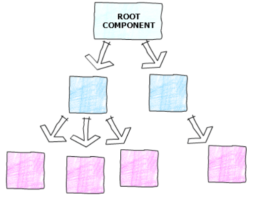


***

## 33. 下面代码会输出什么？

```javascript
foo();
var foo;
function foo(){
  console.log(1);
}
foo = function(){
  console.log(2);
}
```


**参考答案：**

答案是：1

> 函数声明和变量声明都会被提升，但是有一个值得注意的细节，那就是，函数会首先提升，然后才是变量！

根据 JavaScript 的变量和函数提升规则，上述代码在执行时会被解析成以下形式：

```javascript
function foo(){
  console.log(1);
}

var foo; // 变量声明被提升至顶部

foo(); // 输出 1

foo = function(){
  console.log(2);
}
```

以下是代码的执行过程：

1. 首先，函数 `foo` 的函数声明被提升到作用域的顶部。所以，在调用 `foo()` 之前，函数 `foo` 已经可用。

2.然后，变量 `foo` 被声明，并且由于它已经被函数 `foo` 的定义所覆盖，因此这个变量声明没有改变函数 `foo` 的值。

1. 接下来，函数 `foo` 被调用，输出结果为 `1`。

2. 最后，变量 `foo` 被重新赋值为一个新的函数表达式，该函数输出结果为 `2`。

所以，最终输出结果为：

```plaintext
1
```


***

## 34. 什么是 DOM 和 BOM？


**参考答案：**

DOM（Document Object Model）和 BOM（Browser Object Model）是 JavaScript 中常用的两个概念，用于描述浏览器中的不同对象模型。

1. DOM（Document Object Model）:

   * DOM 是表示 HTML 和 XML 文档的标准的对象模型。它将文档中的每个组件（如元素、属性、文本等）都看作是一个对象，开发者可以使用 JavaScript 来操作这些对象，从而动态地改变页面的内容、结构和样式。

   * DOM 以树状结构组织文档的内容，其中树的根节点是 `document` 对象，它代表整个文档。`document` 对象有各种方法和属性，可以用来访问和修改文档的内容和结构。

2. BOM（Browser Object Model）:

   * BOM 是表示浏览器窗口及其各个组件的对象模型。它提供了一组对象，用于访问和控制浏览器窗口及其各个部分，如地址栏、历史记录等。

   * BOM 的核心对象是 `window` 对象，它表示浏览器窗口，并且是 JavaScript 中的全局对象。`window` 对象提供了许多属性和方法，用于控制浏览器窗口的各个方面，如页面导航、定时器、对话框等。

   * BOM 还提供了其他一些对象，如 `navigator`（提供浏览器相关信息）、`location`（提供当前文档的 URL 信息）、`history`（提供浏览器历史记录）、`screen`（提供屏幕信息）等。

总的来说，DOM 是用于访问和操作网页文档的对象模型，而 BOM 是用于控制浏览器窗口及其各个组件的对象模型。在 JavaScript 编程中，开发者通常会同时使用 DOM 和 BOM 来完成各种任务，如操作网页元素、导航控制、事件处理等。


***

## 35. 描述下列代码的执行结果

```javascript
foo(typeof a);
function foo(p) {
  console.log(this);
  console.log(p);
  console.log(typeof b);
  let b = 0;
}
```


**参考答案：**

在这段代码中，我们首先遇到了一个函数声明 `foo`，然后在 `foo` 函数内部，有三个语句:

1. `console.log(this);`: 打印函数 `foo` 的执行上下文中的 `this` 值。由于 `foo` 是在全局环境中声明的，因此 `this` 指向全局对象（在浏览器环境下通常是 `window` 对象）。

2. `console.log(p);`: 打印参数 `p` 的类型。这个参数的值是在调用 `foo` 函数时传入的，因此这里会输出传入的参数类型。

3. `console.log(typeof b);`: 打印变量 `b` 的类型。由于变量 `b` 是在后面的代码中使用 `let` 声明的，因此在这之前对 `b` 的访问会导致暂时性死区（Temporal Dead Zone，TDZ）的错误。因此这里会输出 `ReferenceError: Cannot access 'b' before initialization`。

因此，这段代码的输出会是类似以下内容的内容：

```plaintext
Window // （全局执行上下文中的 this）
undefined // （foo 函数的参数类型）
ReferenceError: Cannot access 'b' before initialization // （在 b 声明之前访问 b 会导致 ReferenceError）
```


***

## 36. 什么是作用域链？


**参考答案：**

作用域链（Scope Chain）是 JavaScript 中用于查找变量和函数的一种机制。每个 JavaScript 函数都会创建一个作用域链。

作用域链是由当前执行环境（Execution Context）中的变量对象（Variable Object）以及其父级执行环境的变量对象组成的。当代码在一个执行环境中执行时，如果需要访问一个变量或者函数，JavaScript 引擎会首先在当前执行环境的变量对象中查找，如果找不到，它会沿着作用域链向上一级的执行环境中查找，直到找到对应的变量或者函数，或者达到全局执行环境为止。

作用域链的形成是由函数定义时的位置来决定的，而不是函数调用时的位置。这意味着函数的作用域链是在函数定义时确定的，而不是在函数调用时确定的。

作用域链的重要性在于它决定了变量和函数的访问权限。一个变量或者函数能否在当前执行环境中被访问到，取决于它是否在当前执行环境的作用域链上。

***

## 37. bind、call、apply 有什么区别？如何实现一个bind?


**参考答案：**

一、作用

`call `、`apply `、`bind `作用是改变函数执行时的上下文，简而言之就是改变函数运行时的`this`指向

那么什么情况下需要改变`this`的指向呢？下面举个例子

```javascript
var name="lucy";
var obj={
    name:"martin",
    say:function () {
        console.log(this.name);
    }
};
obj.say(); //martin，this指向obj对象
setTimeout(obj.say,0); //lucy，this指向window对象
```

从上面可以看到，正常情况`say`方法输出`martin`

但是我们把`say`放在`setTimeout`方法中，在定时器中是作为回调函数来执行的，因此回到主栈执行时是在全局执行上下文的环境中执行的，这时候`this`指向`window`，所以输出`luck`

> PS: 此处需要注意，如果外层改成 `const name="lucy";`，那么`setTimeout(obj.say,0);`的输出会是 undefined，因为 var 声明的变量会挂载在 window 上，而 let 和 const 声明的变量不会挂载到 window 上。

我们实际需要的是`this`指向`obj`对象，这时候就需要该改变`this`指向了

```javascript
setTimeout(obj.say.bind(obj),0); //martin，this指向obj对象
```


二、区别

下面再来看看`apply`、`call`、`bind`的使用

apply

`apply`接受两个参数，第一个参数是`this`的指向，第二个参数是函数接受的参数，以数组的形式传入

改变`this`指向后原函数会立即执行，且此方法只是临时改变`this`指向一次

```javascript
function fn(...args){
    console.log(this,args);
}
let obj = {
    myname:"张三"
}

fn.apply(obj,[1,2]); // this会变成传入的obj，传入的参数必须是一个数组；
fn(1,2) // this指向window
```

当第一个参数为`null`、`undefined`的时候，默认指向`window`(在浏览器中)

```javascript
fn.apply(null,[1,2]); // this指向window
fn.apply(undefined,[1,2]); // this指向window
```


call

`call`方法的第一个参数也是`this`的指向，后面传入的是一个参数列表

跟`apply`一样，改变`this`指向后原函数会立即执行，且此方法只是临时改变`this`指向一次

```javascript
function fn(...args){
    console.log(this,args);
}
let obj = {
    myname:"张三"
}

fn.call(obj,1,2); // this会变成传入的obj，传入的参数不是数组；
fn(1,2) // this指向window
```

同样的，当第一个参数为`null`、`undefined`的时候，默认指向`window`(在浏览器中)

```javascript
fn.call(null,1,2]); // this指向window
fn.call(undefined,1,2); // this指向window
```


bind

bind方法和call很相似，第一参数也是`this`的指向，后面传入的也是一个参数列表(但是这个参数列表可以分多次传入)

改变`this`指向后不会立即执行，而是返回一个永久改变`this`指向的函数

```javascript
function fn(...args){
    console.log(this,args);
}
let obj = {
    myname:"张三"
}

const bindFn = fn.bind(obj); // this 也会变成传入的obj ，bind不是立即执行需要执行一次
bindFn(1,2) // this指向obj
fn(1,2) // this指向window
```

小结

从上面可以看到，`apply`、`call`、`bind`三者的区别在于：

* 三者都可以改变函数的`this`对象指向

* 三者第一个参数都是`this`要指向的对象，如果如果没有这个参数或参数为`undefined`或`null`，则默认指向全局`window`

* 三者都可以传参，但是`apply`是数组，而`call`是参数列表，且`apply`和`call`是一次性传入参数，而`bind`可以分为多次传入

* `bind `是返回绑定this之后的函数，`apply `、`call` 则是立即执行


三、实现

实现`bind`的步骤，我们可以分解成为三部分：

* 修改`this`指向

* 动态传递参数

```javascript
// 方式一：只在bind中传递函数参数
fn.bind(obj,1,2)()

// 方式二：在bind中传递函数参数，也在返回函数中传递参数
fn.bind(obj,1)(2)
```

* 兼容`new`关键字

整体实现代码如下：

```javascript
Function.prototype.myBind = function (context) {
    // 判断调用对象是否为函数
    if (typeof this !== "function") {
        throw new TypeError("Error");
    }

    // 获取参数
    const args = [...arguments].slice(1),
          fn = this;

    return function Fn() {

        // 根据调用方式，传入不同绑定值
        return fn.apply(this instanceof Fn ? new fn(...arguments) : context, args.concat(...arguments)); 
    }
}
```

***


## 38. 简单描述从输入网址到页面显示的过程


**参考答案：**

很多大公司面试喜欢问这样一道面试题，输入URL到看见页面发生了什么？

简单来说，共有以下几个过程：

* DNS解析

* 发起TCP连接

* 发送HTTP请求

* 服务器处理请求并返回HTTP报文

* 浏览器解析渲染页面

* 连接结束

下面我们来看看具体的细节。


DNS解析

DNS解析实际上就是寻找你所需要的资源的过程。假设你输入`www.baidu.com`，而这个网址并不是百度的真实地址，互联网中每一台机器都有唯一标识的IP地址，这个才是关键，但是它不好记，乱七八糟一串数字谁记得住啊，所以就需要一个网址和IP地址的转换，也就是DNS解析。

DNS解析其实是一个递归的过程。

输入`www.google.com`网址后，首先在本地的域名服务器中查找，没找到去根域名服务器查找，没有再去com顶级域名服务器查找，，如此的类推下去，直到找到IP地址，然后把它记录在本地，供下次使用。大致过程就是.-> .com ->google.com. -> www.google.com.。 (最后这个.对应的就是根域名服务器，默认情况下所有的网址的最后一位都是.，为了方便用户，通常都会省略，浏览器在请求DNS的时候会自动加上)


DNS优化

既然已经懂得了解析的具体过程，我们可以看到上述一共经过了N个过程，每个过程有一定的消耗和时间的等待，因此我们得想办法解决一下这个问题！

* DNS缓存

DNS存在着多级缓存，从离浏览器的距离排序的话，有以下几种: 浏览器缓存，系统缓存，路由器缓存，ISP服务器缓存，根域名服务器缓存，顶级域名服务器缓存，主域名服务器缓存。

* DNS负载均衡

比如访问baidu.com的时候，每次响应的并非是同一个服务器（IP地址不同），一般大公司都有成百上千台服务器来支撑访问。DNS可以返回一个合适的机器的IP给用户，例如可以根据每台机器的负载量，该机器离用户地理位置的距离等等，这种过程就是DNS负载均衡。


发起TCP连接

TCP提供一种可靠的传输，这个过程涉及到三次握手，四次挥手。

三次握手

* 第一次握手：

客户端发送syn包(Seq=x)到服务器，并进入SYN\_SEND状态，等待服务器确认；

* 第二次握手：

服务器收到syn包，必须确认客户的SYN（ack=x+1），同时自己也发送一个SYN包（Seq=y），即SYN+ACK包，此时服务器进入SYN\_RECV状态；

* 第三次握手：

客户端收到服务器的SYN＋ACK包，向服务器发送确认包ACK(ack=y+1)，此包发送完毕，客户端和服务器进入ESTABLISHED状态，完成三次握手。

握手过程中传送的包里不包含数据，三次握手完毕后，客户端与服务器才正式开始传送数据。理想状态下，TCP连接一旦建立，在通信双方中的任何一方主动关闭连接之前，TCP 连接都将被一直保持下去。


四次挥手

数据传输完毕后，双方都可释放连接。最开始的时候，客户端和服务器都是处于ESTABLISHED状态，假设客户端主动关闭，服务器被动关闭。

* 第一次挥手：

客户端发送一个FIN，用来关闭客户端到服务器的数据传送，也就是客户端告诉服务器：我已经不 会再给你发数据了(当然，在fin包之前发送出去的数据，如果没有收到对应的ack确认报文，客户端依然会重发这些数据)，但是，此时客户端还可以接受数据。

FIN=1，其序列号为seq=u（等于前面已经传送过来的数据的最后一个字节的序号加1），此时，客户端进入FIN-WAIT-1（终止等待1）状态。 TCP规定，FIN报文段即使不携带数据，也要消耗一个序号。

* 第二次挥手：

服务器收到FIN包后，发送一个ACK给对方并且带上自己的序列号seq，确认序号为收到序号+1（与SYN相同，一个FIN占用一个序号）。此时，服务端就进入了CLOSE-WAIT（关闭等待）状态。TCP服务器通知高层的应用进程，客户端向服务器的方向就释放了，这时候处于半关闭状态，即客户端已经没有数据要发送了，但是服务器若发送数据，客户端依然要接受。这个状态还要持续一段时间，也就是整个CLOSE-WAIT状态持续的时间。

此时，客户端就进入FIN-WAIT-2（终止等待2）状态，等待服务器发送连接释放报文（在这之前还需要接受服务器发送的最后的数据）。

* 第三次挥手：

服务器发送一个FIN，用来关闭服务器到客户端的数据传送，也就是告诉客户端，我的数据也发送完了，不会再给你发数据了。由于在半关闭状态，服务器很可能又发送了一些数据，假定此时的序列号为seq=w，此时，服务器就进入了LAST-ACK（最后确认）状态，等待客户端的确认。

* 第四次挥手：

主动关闭方收到FIN后，发送一个ACK给被动关闭方，确认序号为收到序号+1，此时，客户端就进入了TIME-WAIT（时间等待）状态。注意此时TCP连接还没有释放，必须经过2∗MSL（最长报文段寿命）的时间后，当客户端撤销相应的TCB后，才进入CLOSED状态。

服务器只要收到了客户端发出的确认，立即进入CLOSED状态。同样，撤销TCB后，就结束了这次的TCP连接。可以看到，服务器结束TCP连接的时间要比客户端早一些。

至此，完成四次挥手。


发送HTTP请求

发送HTTP请求，就是构建HTTP请求报文，并通过TCP协议，发送到服务器指定端口。

请求报文由`请求行`，`请求报头`，`请求正文`组成。


服务器处理请求并返回HTTP报文

对TCP连接进行处理，对HTTP协议进行解析，并按照报文格式进一步封装成HTTP Request对象，供上层使用。这一部分工作一般是由Web服务器去进行，比如Tomcat, Nginx和Apache等Web服务器。

HTTP报文也分成三段：`状态码`，`响应报头`和`响应报文`。


浏览器解析渲染页面


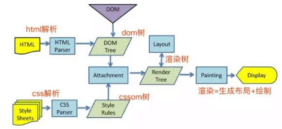

这个图就是Webkit解析渲染页面的过程。

* 解析HTML形成DOM树

* 解析CSS形成CSSOM 树

* 合并DOM树和CSSOM树形成渲染树

* 浏览器开始渲染并绘制页面


***

## 39. SPA（单页应用）首屏加载速度慢怎么解决？

**参考答案：**

一、什么是首屏加载

首屏时间（First Contentful Paint），指的是浏览器从响应用户输入网址地址，到首屏内容渲染完成的时间，此时整个网页不一定要全部渲染完成，但需要展示当前视窗需要的内容

首屏加载可以说是用户体验中最重要的环节

关于计算首屏时间

利用`performance.timing`提供的数据：

通过`DOMContentLoad`或者`performance`来计算出首屏时间

```javascript
// 方案一：
document.addEventListener('DOMContentLoaded', (event) => {
    console.log('first contentful painting');
});
// 方案二：
performance.getEntriesByName("first-contentful-paint")[0].startTime

// performance.getEntriesByName("first-contentful-paint")[0]
// 会返回一个 PerformancePaintTiming的实例，结构如下：
{
  name: "first-contentful-paint",
  entryType: "paint",
  startTime: 507.80000002123415,
  duration: 0,
};
```


二、加载慢的原因

在页面渲染的过程，导致加载速度慢的因素可能如下：

* 网络延时问题

* 资源文件体积是否过大

* 资源是否重复发送请求去加载了

* 加载脚本的时候，渲染内容堵塞了


三、解决方案

常见的几种SPA首屏优化方式

* 减小入口文件积

* 静态资源本地缓存

* UI框架按需加载

* 图片资源的压缩

* 组件重复打包

* 开启GZip压缩

* 使用SSR

减小入口文件体积

常用的手段是路由懒加载，把不同路由对应的组件分割成不同的代码块，待路由被请求的时候会单独打包路由，使得入口文件变小，加载速度大大增加


在`vue-router`配置路由的时候，采用动态加载路由的形式

```javascript
routes:[ 
    path: 'Blogs',
    name: 'ShowBlogs',
    component: () => import('./components/ShowBlogs.vue')
]
```

以函数的形式加载路由，这样就可以把各自的路由文件分别打包，只有在解析给定的路由时，才会加载路由组件


静态资源本地缓存

后端返回资源问题：

* 采用`HTTP`缓存，设置`Cache-Control`，`Last-Modified`，`Etag`等响应头

* 采用`Service Worker`离线缓存

前端合理利用`localStorage`


UI框架按需加载

在日常使用`UI`框架，例如`element-UI`、或者`antd`，我们通常会直接引用整个`UI`库

```javascript
import ElementUI from 'element-ui'
Vue.use(ElementUI)
```

但实际上我用到的组件只有按钮，分页，表格，输入与警告 所以我们要按需引用

```javascript
import { Button, Input, Pagination, Table, TableColumn, MessageBox } from 'element-ui';
Vue.use(Button)
Vue.use(Input)
Vue.use(Pagination)
```


组件重复打包

假设`A.js`文件是一个常用的库，现在有多个路由使用了`A.js`文件，这就造成了重复下载

解决方案：在`webpack`的`config`文件中，修改`CommonsChunkPlugin`的配置

```javascript
minChunks: 3
```

`minChunks`为3表示会把使用3次及以上的包抽离出来，放进公共依赖文件，避免了重复加载组件


图片资源的压缩

图片资源虽然不在编码过程中，但它却是对页面性能影响最大的因素

对于所有的图片资源，我们可以进行适当的压缩

对页面上使用到的`icon`，可以使用在线字体图标，或者雪碧图，将众多小图标合并到同一张图上，用以减轻`http`请求压力。


开启GZip压缩

拆完包之后，我们再用`gzip`做一下压缩 安装`compression-webpack-plugin`

```javascript
cnmp i compression-webpack-plugin -D
```

在`vue.congig.js`中引入并修改`webpack`配置

```javascript
const CompressionPlugin = require('compression-webpack-plugin')

configureWebpack: (config) => {
        if (process.env.NODE_ENV === 'production') {
            // 为生产环境修改配置...
            config.mode = 'production'
            return {
                plugins: [new CompressionPlugin({
                    test: /\.js$|\.html$|\.css/, //匹配文件名
                    threshold: 10240, //对超过10k的数据进行压缩
                    deleteOriginalAssets: false //是否删除原文件
                })]
            }
        }
```

在服务器我们也要做相应的配置 如果发送请求的浏览器支持`gzip`，就发送给它`gzip`格式的文件 我的服务器是用`express`框架搭建的 只要安装一下`compression`就能使用

```plaintext
const compression = require('compression')
app.use(compression())  // 在其他中间件使用之前调用
```

使用SSR

SSR（Server side ），也就是服务端渲染，组件或页面通过服务器生成html字符串，再发送到浏览器

从头搭建一个服务端渲染是很复杂的，`vue`应用建议使用`Nuxt.js`实现服务端渲染


小结：

减少首屏渲染时间的方法有很多，总的来讲可以分成两大部分 ：资源加载优化 和 页面渲染优化

下图是更为全面的首屏优化的方案

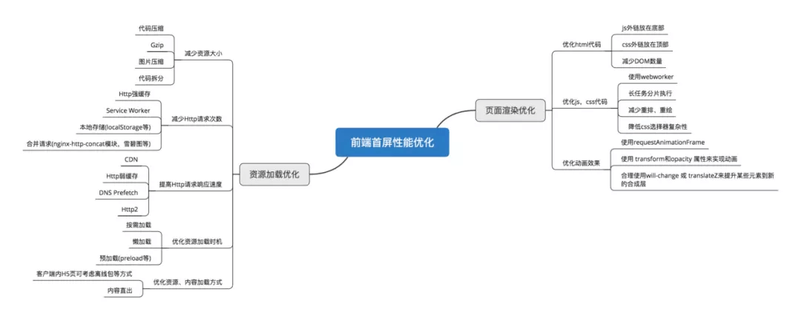

大家可以根据自己项目的情况选择各种方式进行首屏渲染的优化


***

## 40. RESTful 接口规范是什么？


**参考答案：**

RESTful 接口规范是一种设计 Web 服务接口的风格和规范，遵循 REST（Representational State Transfer）架构。它的设计原则包括以下几点：

1. 资源（Resources）：将系统中的所有事物视为资源，每个资源都有一个唯一的标识符（通常是 URL），用于对其进行操作。

2. 统一接口（Uniform Interface）：接口设计应该简单一致，包括以下几个方面：

   * 使用标准的 HTTP 方法（GET、POST、PUT、DELETE 等）来对资源进行操作。

   * 使用标准的 HTTP 状态码（如 200、404、500）来表示请求结果。

   * 使用资源的 URL 来唯一标识资源。

   * 使用适当的 MIME 类型（如 JSON、XML）来传输数据。

3. 状态无关（Stateless）：每个请求都应该包含足够的信息，服务器不需要保存客户端的状态。这样可以使系统更加简单、可伸缩性更好。

4. 客户端 - 服务器分离（Client-Server Separation）：客户端和服务器之间的交互应该通过标准化的接口进行，使得客户端和服务器可以独立地进行演化。

5. 可缓存性（Cacheability）：对于经常不变的数据，应该使用合适的缓存机制，提高系统的性能和可伸缩性。

6. 按需代码（Code on Demand）（可选）：服务器可以向客户端传输可执行代码，以提供更丰富的功能。

遵循 RESTful 接口规范能够使得系统具有良好的可维护性、可伸缩性和性能，并且更容易与其他系统进行集成。


***

## 41. 利用字符重复出现的次数，编写一种方法，实现基本的字符串压缩功能。比如，字符串aabcccccaaa会变为a2b1c5a3

**参考答案：**

下面是实现示例：

```javascript
function compressString(str) {
  let compressed = '';
  let count = 1;

  for (let i = 0; i < str.length; i++) {
    if (str[i] === str[i + 1]) {
      // 如果当前字符与下一个字符相同，增加计数器
      count++;
    } else {
      // 否则，将当前字符及其计数器追加到结果中
      compressed += str[i] + count;
      count = 1; // 重置计数器
    }
  }

  // 返回较短的字符串（原始字符串或压缩后的字符串）
  return compressed.length < str.length ? compressed : str;
}

// 示例用法
console.log(compressString('aabcccccaaa')); // 输出 "a2b1c5a3"
console.log(compressString('abcdefg')); // 输出 "abcdefg" （未发生压缩）
```


***

## 42. 说说new操作符具体干了什么？


**参考答案：**

一、是什么

在`JavaScript`中，`new`操作符用于创建一个给定构造函数的实例对象

例子

```javascript
function Person(name, age){
    this.name = name;
    this.age = age;
}
Person.prototype.sayName = function () {
    console.log(this.name)
}
const person1 = new Person('Tom', 20)
console.log(person1)  // Person {name: "Tom", age: 20}
person1.sayName() // 'Tom'
```

从上面可以看到：

* `new` 通过构造函数 `Person` 创建出来的实例可以访问到构造函数中的属性

* `new` 通过构造函数 `Person` 创建出来的实例可以访问到构造函数原型链中的属性（即实例与构造函数通过原型链连接了起来）

现在在构建函数中显式加上返回值，并且这个返回值是一个原始类型

```javascript
function Test(name) {
  this.name = name
  return 1
}
const t = new Test('xxx')
console.log(t.name) // 'xxx'
```

可以发现，构造函数中返回一个原始值，然而这个返回值并没有作用

下面在构造函数中返回一个对象

```javascript
function Test(name) {
  this.name = name
  console.log(this) // Test { name: 'xxx' }
  return { age: 26 }
}
const t = new Test('xxx')
console.log(t) // { age: 26 }
console.log(t.name) // 'undefined'
```

从上面可以发现，构造函数如果返回值为一个对象，那么这个返回值会被正常使用


二、流程

从上面介绍中，我们可以看到`new`关键字主要做了以下的工作：

* 创建一个新的对象`obj`

* 将对象与构建函数通过原型链连接起来

* 将构建函数中的`this`绑定到新建的对象`obj`上

* 根据构建函数返回类型作判断，如果是原始值则被忽略，如果是返回对象，需要正常处理

举个例子：

```javascript
function Person(name, age){
    this.name = name;
    this.age = age;
}
Person.prototype.sayName = function () {
    console.log(this.name)
}
const person1 = new Person('Tom', 20)
console.log(person1)  // Person {name: "Tom", age: 20}
person1.sayName() // 'Tom'
```

三、手写new操作符

现在我们已经清楚地掌握了`new`的执行过程

那么我们就动手来实现一下`new`

```javascript
function mynew(Func, ...args) {
    // 1.创建一个新对象
    const obj = {}
    // 2.新对象原型指向构造函数原型对象
    obj.__proto__ = Func.prototype
    // 3.将构建函数的this指向新对象
    let result = Func.apply(obj, args)
    // 4.根据返回值判断
    return result instanceof Object ? result : obj
}
```

测试一下

```javascript
function mynew(func, ...args) {
    const obj = {}
    obj.__proto__ = func.prototype
    let result = func.apply(obj, args)
    return result instanceof Object ? result : obj
}
function Person(name, age) {
    this.name = name;
    this.age = age;
}
Person.prototype.say = function () {
    console.log(this.name)
}

let p = mynew(Person, "huihui", 123)
console.log(p) // Person {name: "huihui", age: 123}
p.say() // huihui
```

可以发现，代码虽然很短，但是能够模拟实现`new`


***

## 43. webpack 5 的主要升级点有哪些？


**参考答案：**

* 持久缓存（Persistent Caching）： Webpack 5引入了更好的持久缓存机制，利用了更稳定的HashedModuleIdsPlugin和NamedChunksPlugin，以改善构建性能。

* Tree-shaking 改进： Webpack 5对Tree-shaking进行了改进，提供了更好的代码优化，以便删除未使用的代码。

* 支持 WebAssembly（WASM）： Webpack 5 对 WebAssembly 提供了原生的支持，使得在项目中使用 WebAssembly 更加方便。

* 支持 ES6 模块导入（Dynamic Import）： Webpack 5对动态导入语法（import()）提供了更好的支持，可以更轻松地进行代码分割。

* 模块联邦（Module Federation）： 这是Webpack 5中的一项重大功能，允许将多个独立的Webpack构建连接在一起，实现模块共享，从而更好地支持微服务架构。

* 缓存组（Caching Groups）： 新的缓存组概念被引入，可以更细粒度地控制模块的缓存策略。

* 内置代码分割优化（optimization.splitChunks）： Webpack 5通过optimization.splitChunks进行了重新设计，提供了更灵活的配置选项，使得代码分割更为强大和易用。

* 默认配置优化： Webpack 5 默认配置中的一些优化，使得开箱即用的性能更好。

* 提高构建性能： Webpack 5引入了一些性能优化，包括更快的持久化缓存、更快的构建速度等。

* 移除废弃特性： 作为更新，Webpack 5移除了一些过时的特性和API，因此在升级时需要注意潜在的破坏性变化。

*

***

## 44. try...catch 可以捕获到异步代码中的错误吗？


**参考答案：**

不能。

以下面代码为例：

```javascript
try {
  setTimeout(() => {
    throw new Error('err')
  }, 200);
} catch (err) {
  console.log(err);
}
```

setTimeout是一个异步函数，它的回调函数会在指定的延时后被放入事件队列，等待当前执行栈清空后才执行。因此，当setTimeout的回调函数执行并抛出错误时，try...catch已经执行完毕，无法捕捉到异步回调中的错误。

对于异步代码，需要结合 Promise 、async/await 或者事件监听器等机制来处理错误。


***

## 45. 需要在本地实现一个聊天室，多个tab页相互通信，不能用websocket，你会怎么做？


**参考答案：**

可以考虑使用以下方法：

1. 使用LocalStorage：这个存储API可在浏览器的不同标签页之间共享数据。当一个标签页发送消息时，将消息存储在LocalStorage中。其他标签页可以监听该存储区的变化，并读取最新的消息内容来实现通信效果。

```javascript
// 监听变化
window.addEventListener("storage", (e) => {
    // todo ...
});
```

* 使用Broadcast Channel API：Broadcast Channel API 可以在浏览器的不同上下文（包括不同的标签页）之间进行双向通信。当一个标签页发送消息到广播频道时，其他标签页可以通过监听相同的广播频道来接收和响应消息。

* 使用SharedWorker：SharedWorker 是一种在多个浏览器上下文之间共享脚本执行的机制，它可以在不同的标签页之间进行通信。可以创建一个SharedWorker，然后在各个标签页中连接到该SharedWorker，使它们能够共享数据和通信。

以上方法都可以实现在本地多个标签页之间进行通信，但需要根据具体需求和项目情况选择适合的解决方案。需要注意的是，这些方法只适用于本地通信，无法实现跨网络的实时通信效果，若需要实现更复杂的聊天室功能，WebSocket仍是更常用的选择。


***

## 46. 说说你对低代码的了解


**参考答案：**

低代码的热潮在几年前就火过，从阿里钉钉跨平台协作方式，再到飞书上的审批流程，以及目前我们接触到的表单审批、投票的模板，这些都是关于低代码的实现方式。随着企业数字化转型和云计算的不断发展，低代码平台又一次成为热门话题被越来越多的人讨论。


低代码平台概述

低代码开发平台，英文全称“Low-Code Development Platform”，简称 LCDP，是通过少量代码或零代码就可以快速生成新应用，实现业务应用的快速交付的应用平台。广义上的低代码平台包括低代码和零代码，它们都属于 APaaS（应用平台即服务）。

低代码这一概念首次出现于 20 世纪 80 年代

第一阶段是探索期，主要是基于 20 世纪 80 年代就有美国公司和实验室开始研究程序可视化编程这个领域，做出了4GL “第四代编程语言”，后来衍生成 VPL（Visual Programming Language可视化编程语言）。

第二阶段是发展期，2014年，由研究机构 Forrester Research 正式提出了“低代码/无代码”的概念。

第三阶段是爆发期，2018年，荷兰公司Mendix以7亿美元被西门子收购、美国低代码独角兽企业 Outsystem 获得1.5亿美元的融资。此次收购事件以及融资事件的发生将低代码市场带入资本方的视野，低代码市场开始进入爆发期。

低代码平台代替了程序员开发数千行具有复杂代码和语法的行。它的作用是让开发人员以及业务人员，通过“拖拉拽”的方式使用平台，来创建完整的应用程序。同时突破了传统业务之间沟通的复杂度和交付时间周期长的特点，能够持续进行开发。


低代码、无代码

低代码平台包括低代码和无代码，二者区别如下：

* 无代码：主要面向业务人员，零开发经验的业务人员通过拖拽等方式，无需编写代码，即可快速搭建各种应用。无代码更适合单点场景的应用，平台应用性高于低代码。

* 低代码：主要面向开发人员，通过自动代码生成和可视化编程，只需要少量代码，即可快速搭建各种应用。低代码的市场占有率高，适合复杂场景交互应用的搭建。平台灵活性高于无代码。

但本质上低代码与无代码都能够降低开发门槛、快速响应业务需求、提升开发效率。

接下来我们来看看具体的低代码平台技术路线。


低代码平台的技术路线

因低代码平台源自于集成开发环境（Integrated Development Environment，IDE）的可视化、模块化与集成化特点，同时根据目标人群对象的使用，大体分为两条线路：第一条为业务复用型，主要包含应用开发平台、智能表格、SAAS 聚合，特点是数据与逻辑完全分离、各自独立的模型驱动，适合开发人员。第二条为开发工具型，主要包含在线 IDE、DSL 开发框架、组件代码库，特点是数据与储存结构合一的表单驱动，适合业务人员使用。


适合开发人员的技术路线

我们首先来看下适用于开发人员的技术路线模型驱动。由模型驱动对软件所涉及到的功能进行建模，然后以应用开发平台为核心，承载各种开发工具和复杂逻辑，并将其可视化。然后辅以少量代码，就能够作为技术中台核心帮助开发者快速产出一整套系符合企业需求的系统。

开发人员通过图中左右两边进行操作，左边是一些特定组件，拖到中间的画布里面。图中的板块都是相互独立的，需要通过右边的语法把它们进行关联，再生成所需要的场景化应用，这是模型驱动的一种方式。


适合业务人员的技术路线

该路线是非IT模式，以表单驱动数据为核心，通过拖拽构建数据表方式展开业务分析设计。以做到完全去IDE化，像搭积木一样按流程构建程序逻辑。适合完全零基础人员，比如人事行政进行资料归档、OA审批，销售人员客户管理等。

左边是拖拽组件，中间是画布，右边是编辑属性。我们通过左边拖拽表单将事件排列在上面，进行简单的数据收集。右边是对表单进行数据处理，比如标题、宽度、必填线等设置。适合业务人员去操作填写数据表格，快速生成自己想要的数据收集，这是表单驱动的一种方式。

对于这类技术路线的产品，又拍云在2020年曾经开发过一套，我们接下来通过又拍云低代码产品来看一下表单驱动的具体应用场景。


低代码可视化拖拽平台的应用

该产品使用拖拉拽的方式，生成所需要的表单。生成表单后，显示面板会把表单数组包括的 json 数据拿出，再通过它识别组件的顺序进行编译后展示。


编辑器实现思路

该产品的编辑器实现思路如下：

首先，使用数组 componentData 维护编辑器中的数据。

其次，将组件通过拖拽事件，拖拽到画布上进行移动布局。当然一个组件要设为可拖拽，那就需要为它添加 draggable 属性，而且在将组件列表中的组件拖拽到画布中时还会经历两个关键事件：

* dragstart 事件

* drop 事件

dragstart 事件，它在拖拽刚开始时触发，主要用于将拖拽的组件信息传递给布，下图是示例代码：

drop 事件，在拖拽结束时触发，主要作用是用于接收拖拽的组件信息，示例代码如下图：

之后使用 push() 方法将新的组件数据添加到 componentData。比如又拍云使用的 VLE 框架就是通过属性来识别我们想要的组件。具体为组件 V-item 是文本数据宽，可以通过其对应的属性值进行上下数据绑定，把数据填到结成数组里面。

组件数据如下：

最后，我们使用 v-for 指令遍历 componentData，主要通过 is 属性来识别出真正要渲染的是哪个组件，将每个组件逐个渲染到画布。例如要渲染的组件数据是 { component: 'v-text' }，则  会被转换为 。

编辑器渲染的核心代码如下所示：

全部完成后我们来看一下整体，如果将画布设为相对定位 position: relative，然后将每个组件设为绝对定位 position: absolute，只要通过监听三个事件就可以进行移动，这三个事件分别为：

* Mousedown 事件，在组件上按下鼠标时，记录组件当前的位置，即 css 中的 left 和 top。

* Mousemove 事件，每次鼠标移动时，都用当前最新的 left 和 top 减去最开始的 left 和 top，从而计算出移动距离，再改变组件位置。

* Mouseup 事件，鼠标抬起时结束移动。

以上就是编译器的整体实现思路。


浅谈低代码平台的未来

根据咨询机构 Gartner 的市场分析来看，2023 年全球超过 50% 的大中型企业将把低代码应用平台作为主要的占领应用平台之一。预计到2024年，低代码应用程序开发将占总应用开发的65%以上。这就引出了两个问题：传统的软件开发会被取代吗？低代码是未来的趋势吗？

实际上，低代码开发并不会取代传统的软件开发，但它将改变在某些领域中的软件开发，改变那些重复低效的业务，这意味着公司不需要为这种业务招聘大量的开发人员，而是安排更多的专业软件开发人员面向客户的需求以及复杂和独特的软件开发问题。

尽管相较于原生的开发模式，低代码开发平台能够显著提升开发效率，尤其适合业务变化快、预算有限、开发时间紧迫的企业应用场景；但是低代码平台也有明显的局限性，至少就目前来说，它主要用于搭建企业软件。因为此类软件架构是有一定规律的，但娱乐、社交等软件开发比较深层交互的东西低代码还是无法实现的。


***

## 47. 说说WebSocket和HTTP的区别


**参考答案：**

HTTP协议

`HTTP`是单向的，客户端发送请求，服务器发送响应。举例来说，当客户端向服务器发送请求时，该请求以`HTTP`或`HTTPS`的形式发送，在接收到请求后，服务器会将响应发送给客户端。

每个请求都与一个对应的响应相关联，在发送响应后客户端与服务器的连接会被关闭。每个`HTTP`或`HTTPS`请求每次都会新建与服务器的连接，并且在获得响应后，连接将自行终止。 `HTTP`是在`TCP`之上运行的无状态协议，`TCP`是一种面向连接的协议，它使用三向握手方法保证数据包传输的传递并重新传输丢失的数据包。

`HTTP`可以运行在任何可靠的面向连接的协议（例如`TCP`，`SCTP`）的上层。当客户端将`HTTP`请求发送到服务器时，客户端和服务器之间将打开`TCP`连接，并且在收到响应后，`TCP`连接将终止，每个`HTTP`请求都会建立单独的`TCP`连接到服务器，例如如果客户端向服务器发送10个请求，则将打开10个单独的`HTTP`连接。并在获得响应后关闭。

理解上面这段关于 `HTTP`的描述时我觉得还要了解一下`HTTP`长连接的概念，以及`HTTP`与`TCP`的关系，简单概括一下就是：

* `HTTP`协议的长连接和短连接，实质上是`TCP`协议的长连接和短连接。

* 每个`HTTP`连接完成后，其对应的`TCP`连接并不是每次都会关闭。从 `HTTP/1.1`起，默认使用长连接，用以保持连接特性。使用长连接的`HTTP`协议，会在响应头有加入这个头部字段：`Connection:keep-alive`

* 在使用长连接的情况下，当一个网页打开完成后，客户端和服务器之间用于传输`HTTP`数据的`TCP`连接不会关闭，如果客户端再次访问这个服务器上的网页，会继续使用这一条已经建立的连接。`Keep-Alive`不会永久保持连接，它有一个保持时间，可以在不同的服务器软件（如`Apache`，`Nginx`，`Nginx`中这个默认时间是 75s）中设定这个时间。实现长连接要客户端和服务端都支持长连接。

* `HTTP`属于应用层协议，在传输层使用`TCP`协议，在网络层使用`IP`协议。`IP`协议主要解决网络路由和寻址问题，`TCP`协议主要解决如何在`IP`层之上可靠的传递数据包，使在网络上的另一端收到发端发出的所有包，并且顺序与发出顺序一致。`TCP`有可靠，面向连接的特点。

HTTP消息信息是用`ASCII`编码的，每个`HTTP`请求消息均包含`HTTP`协议版本（`HTTP/1.1`，`HTTP/2`），`HTTP`方法（`GET`/`POST`等），`HTTP`标头（`Content-Type`，`Content-Length`），主机信息等。以及包含要传输到服务器的实际消息的正文（请求主体）。`HTTP`标头的大小从200字节到2`KB`不等，`HTTP`标头的常见大小是700-800字节。当`Web`应用程序在客户端使用更多`cookie`和其他工具扩展代理的存储功能时，它将减少`HTTP`标头的荷载。


WebSocket协议

`WebSocket`是双向的，在客户端-服务器通信的场景中使用的全双工协议，与`HTTP`不同，它以`ws://`或`wss://`开头。它是一个有状态协议，这意味着客户端和服务器之间的连接将保持活动状态，直到被任何一方（客户端或服务器）终止。在通过客户端和服务器中的任何一方关闭连接之后，连接将从两端终止。

让我们以客户端-服务器通信为例，每当我们启动客户端和服务器之间的连接时，客户端-服务器进行握手随后创建一个新的连接，该连接将保持活动状态，直到被他们中的任何一方终止。建立连接并保持活动状态后，客户端和服务器将使用相同的连接通道进行通信，直到连接终止。

新建的连接被称为`WebSocket`。一旦通信链接建立和连接打开后，消息交换将以双向模式进行，客户端-服务器之间的连接会持续存在。如果其中任何一方（客户端服务器）宕掉或主动关闭连接，则双方均将关闭连接。套接字的工作方式与`HTTP`的工作方式略有不同，状态代码`101`表示`WebSocket`中的交换协议。


何时使用WebSocket

* 即时`Web`应用程序：即时`Web`应用程序使用一个`Web`套接字在客户端显示数据，这些数据由后端服务器连续发送。在`WebSocke`t中，数据被连续推送/传输到已经打开的同一连接中，这就是为什么`WebSocket`更快并提高了应用程序性能的原因。 例如在交易网站或比特币交易中，这是最不稳定的事情，它用于显示价格波动，数据被后端服务器使用Web套接字通道连续推送到客户端。

* 游戏应用程序：在游戏应用程序中，你可能会注意到，服务器会持续接收数据，而不会刷新用户界面。屏幕上的用户界面会自动刷新，而且不需要建立新的连接，因此在`WebSocket`游戏应用程序中非常有帮助。

* 聊天应用程序：聊天应用程序仅使用`WebSocket`建立一次连接，便能在订阅户之间交换，发布和广播消息。它重复使用相同的`WebSocket`连接，用于发送和接收消息以及一对一的消息传输。


不能使用WebSocket的场景

如果我们需要通过网络传输的任何实时更新或连续数据流，则可以使用`WebSocket`。如果我们要获取旧数据，或者只想获取一次数据供应用程序使用，则应该使用`HTTP`协议，不需要很频繁或仅获取一次的数据可以通过简单的`HTTP`请求查询，因此在这种情况下最好不要使用`WebSocket`。

注意：如果仅加载一次数据，则`RESTful` `Web`服务足以从服务器获取数据。


***

## 48. 说下Vite的原理


**参考答案：**

背景

这里的背景介绍会从与`Vite`紧密相关的两个概念的发展史说起，一个是`JavaScript`的模块化标准，另一个是前端构建工具。


共存的模块化标准

为什么`JavaScript`会有多种共存的模块化标准？因为js在设计之初并没有模块化的概念，随着前端业务复杂度不断提高，模块化越来越受到开发者的重视，社区开始涌现多种模块化解决方案，它们相互借鉴，也争议不断，形成多个派系，从`CommonJS`开始，到`ES6`正式推出`ES Modules`规范结束，所有争论，终成历史，`ES Modules`也成为前端重要的基础设施。

* CommonJS：现主要用于Node.js（Node@13.2.0开始支持直接使用ES Module）

* AMD：`require.js` 依赖前置，市场存量不建议使用

* CMD：`sea.js` 就近执行，市场存量不建议使用

* ES Module：ES语言规范，标准，趋势，未来

对模块化发展史感兴趣的可以看下[《前端模块化开发那点历史》@玉伯](https://github.com/seajs/seajs/issues/588)，而`Vite`的核心正是依靠浏览器对ES Module规范的实现。


发展中的构建工具

近些年前端工程化发展迅速，各种构建工具层出不穷，目前`Webpack`仍然占据统治地位，npm 每周下载量达到两千多万次。下面是我按 npm 发版时间线列出的开发者比较熟知的一些构建工具。


当前工程化痛点

现在常用的构建工具如`Webpack`，主要是通过抓取-编译-构建整个应用的代码（也就是常说的打包过程），生成一份编译、优化后能良好兼容各个浏览器的的生产环境代码。在开发环境流程也基本相同，需要先将整个应用构建打包后，再把打包后的代码交给`dev server`（开发服务器）。

`Webpack`等构建工具的诞生给前端开发带来了极大的便利，但随着前端业务的复杂化，js代码量呈指数增长，打包构建时间越来越久，`dev server`（开发服务器）性能遇到瓶颈：

* 缓慢的服务启动： 大型项目中`dev server`启动时间达到几十秒甚至几分钟。

* 缓慢的HMR热更新： 即使采用了 HMR 模式，其热更新速度也会随着应用规模的增长而显著下降，已达到性能瓶颈，无多少优化空间。

缓慢的开发环境，大大降低了开发者的幸福感，在以上背景下`Vite`应运而生。


什么是Vite？

基于esbuild与Rollup，依靠浏览器自身ESM编译功能， 实现极致开发体验的新一代构建工具！

概念

先介绍以下文中会经常提到的一些基础概念：

* 依赖： 指开发不会变动的部分(npm包、UI组件库)，esbuild进行预构建。

* 源码： 浏览器不能直接执行的非js代码(.jsx、.css、.vue等)，vite只在浏览器请求相关源码的时候进行转换，以提供ESM源码。


开发环境

* 利用浏览器原生的`ES Module`编译能力，省略费时的编译环节，直给浏览器开发环境源码，`dev server`只提供轻量服务。

* 浏览器执行ESM的`import`时，会向`dev server`发起该模块的`ajax`请求，服务器对源码做简单处理后返回给浏览器。

* `Vite`中HMR是在原生 ESM 上执行的。当编辑一个文件时，Vite 只需要精确地使已编辑的模块失活，使得无论应用大小如何，HMR 始终能保持快速更新。

* 使用`esbuild`处理项目依赖，`esbuild`使用go编写，比一般`node.js`编写的编译器快几个数量级。


生产环境

* 集成`Rollup`打包生产环境代码，依赖其成熟稳定的生态与更简洁的插件机制。


处理流程对比

`Webpack`通过先将整个应用打包，再将打包后代码提供给`dev server`，开发者才能开始开发。

`Vite`直接将源码交给浏览器，实现`dev server`秒开，浏览器显示页面需要相关模块时，再向`dev server`发起请求，服务器简单处理后，将该模块返回给浏览器，实现真正意义的按需加载。


基本用法

创建vite项目

```javascript
$ npm create vite@latest
```

选取模板

`Vite` 内置6种常用模板与对应的TS版本，可满足前端大部分开发场景，可以点击下列表格中模板直接在 [StackBlitz](https://vite.new/) 中在线试用，还有其他更多的 [社区维护模板](https://github.com/vitejs/awesome-vite#templates)可以使用。

启动

```json
{
  "scripts": {
    "dev": "vite", // 启动开发服务器，别名：`vite dev`，`vite serve`
    "build": "vite build", // 为生产环境构建产物
    "preview": "vite preview" // 本地预览生产构建产物
  }
}
```

实现原理

ESbuild 编译

`esbuild` 使用go编写，cpu密集下更具性能优势，编译速度更快，以下摘自官网的构建速度对比：
浏览器：“开始了吗？”
服务器：“已经结束了。”
开发者：“好快，好喜欢！！”


依赖预构建

* 模块化兼容： 如开头背景所写，现仍共存多种模块化标准代码，`Vite`在预构建阶段将依赖中各种其他模块化规范(CommonJS、UMD)转换 成ESM，以提供给浏览器。

* 性能优化： npm包中大量的ESM代码，大量的`import`请求，会造成网络拥塞。`Vite`使用`esbuild`，将有大量内部模块的ESM关系转换成单个模块，以减少 `import`模块请求次数。


按需加载

* 服务器只在接受到import请求的时候，才会编译对应的文件，将ESM源码返回给浏览器，实现真正的按需加载。


缓存

* HTTP缓存： 充分利用`http`缓存做优化，依赖（不会变动的代码）部分用max-age,immutable 强缓存，源码部分用304协商缓存，提升页面打开速度。

* 文件系统缓存： `Vite`在预构建阶段，将构建后的依赖缓存到`node_modules/.vite` ，相关配置更改时，或手动控制时才会重新构建，以提升预构建速度。


重写模块路径

浏览器`import`只能引入相对/绝对路径，而开发代码经常使用`npm`包名直接引入`node_module`中的模块，需要做路径转换后交给浏览器。

* `es-module-lexer` 扫描 import 语法

* `magic-string` 重写模块的引入路径

```javascript
// 开发代码
import { createApp } from 'vue'

// 转换后
import { createApp } from '/node_modules/vue/dist/vue.js'
```

源码分析

与`Webpack-dev-server`类似`Vite`同样使用`WebSocket`与客户端建立连接，实现热更新，源码实现基本可分为两部分，源码位置在:

* `vite/packages/vite/src/client` client（用于客户端）

* `vite/packages/vite/src/node` server（用于开发服务器）

client 代码会在启动服务时注入到客户端，用于客户端对于`WebSocket`消息的处理（如更新页面某个模块、刷新页面）；server 代码是服务端逻辑，用于处理代码的构建与页面模块的请求。

简单看了下源码（vite@2.7.2），核心功能主要是以下几个方法（以下为源码截取，部分逻辑做了删减）：

1. 命令行启动服务`npm run dev`后，源码执行`cli.ts`，调用`createServer`方法，创建http服务，监听开发服务器端口。

```javascript
// 源码位置 vite/packages/vite/src/node/cli.ts
const { createServer } = await import('./server')
try {
    const server = await createServer({
        root,
        base: options.base,
        ...
    })
    if (!server.httpServer) {
        throw new Error('HTTP server not available')
    }
    await server.listen()
}
```

* `createServer`方法的执行做了很多工作，如整合配置项、创建http服务（早期通过koa创建）、创建`WebSocket`服务、创建源码的文件监听、插件执行、optimize优化等。下面注释中标出。

```javascript
// 源码位置 vite/packages/vite/src/node/server/index.ts
export async function createServer(
    inlineConfig: InlineConfig = {}
): Promise<ViteDevServer> {
    // Vite 配置整合
    const config = await resolveConfig(inlineConfig, 'serve', 'development')
    const root = config.root
    const serverConfig = config.server

    // 创建http服务
    const httpServer = await resolveHttpServer(serverConfig, middlewares, httpsOptions)

    // 创建ws服务
    const ws = createWebSocketServer(httpServer, config, httpsOptions)

    // 创建watcher，设置代码文件监听
    const watcher = chokidar.watch(path.resolve(root), {
        ignored: [
            '**/node_modules/**',
            '**/.git/**',
            ...(Array.isArray(ignored) ? ignored : [ignored])
        ],
        ...watchOptions
    }) as FSWatcher

    // 创建server对象
    const server: ViteDevServer = {
        config,
        middlewares,
        httpServer,
        watcher,
        ws,
        moduleGraph,
        listen,
        ...
    }

    // 文件监听变动，websocket向前端通信
    watcher.on('change', async (file) => {
        ...
        handleHMRUpdate()
    })

    // 非常多的 middleware
    middlewares.use(...)
    
    // optimize
    const runOptimize = async () => {...}

    return server
}
```

* 使用[chokidar](https://www.npmjs.com/package/chokidar)监听文件变化，绑定监听事件。

```javascript
// 源码位置 vite/packages/vite/src/node/server/index.ts
  const watcher = chokidar.watch(path.resolve(root), {
    ignored: [
      '**/node_modules/**',
      '**/.git/**',
      ...(Array.isArray(ignored) ? ignored : [ignored])
    ],
    ignoreInitial: true,
    ignorePermissionErrors: true,
    disableGlobbing: true,
    ...watchOptions
  }) as FSWatcher
```

* 通过 [ws](https://www.npmjs.com/package/ws) 来创建`WebSocket`服务，用于监听到文件变化时触发热更新，向客户端发送消息。

```javascript
// 源码位置 vite/packages/vite/src/node/server/ws.ts
export function createWebSocketServer(...){
    let wss: WebSocket
    const hmr = isObject(config.server.hmr) && config.server.hmr
    const wsServer = (hmr && hmr.server) || server

    if (wsServer) {
        wss = new WebSocket({ noServer: true })
        wsServer.on('upgrade', (req, socket, head) => {
            // 服务就绪
            if (req.headers['sec-websocket-protocol'] === HMR_HEADER) {
                wss.handleUpgrade(req, socket as Socket, head, (ws) => {
                    wss.emit('connection', ws, req)
                })
            }
        })
    } else {
        ...
    }
    // 服务准备就绪，就能在浏览器控制台看到熟悉的打印 [vite] connected.
    wss.on('connection', (socket) => {
        socket.send(JSON.stringify({ type: 'connected' }))
        ...
    })
    // 失败
    wss.on('error', (e: Error & { code: string }) => {
        ...
    })
    // 返回ws对象
    return {
        on: wss.on.bind(wss),
        off: wss.off.bind(wss),
        // 向客户端发送信息
        // 多个客户端同时触发
        send(payload: HMRPayload) {
            const stringified = JSON.stringify(payload)
            wss.clients.forEach((client) => {
                // readyState 1 means the connection is open
                client.send(stringified)
            })
        }
    }
}
```

* 在服务启动时会向浏览器注入代码，用于处理客户端接收到的`WebSocket`消息，如重新发起模块请求、刷新页面。

```javascript
//源码位置 vite/packages/vite/src/client/client.ts
async function handleMessage(payload: HMRPayload) {
  switch (payload.type) {
    case 'connected':
      console.log(`[vite] connected.`)
      break
    case 'update':
      notifyListeners('vite:beforeUpdate', payload)
      ...
      break
    case 'custom': {
      notifyListeners(payload.event as CustomEventName<any>, payload.data)
      ...
      break
    }
    case 'full-reload':
      notifyListeners('vite:beforeFullReload', payload)
      ...
      break
    case 'prune':
      notifyListeners('vite:beforePrune', payload)
      ...
      break
    case 'error': {
      notifyListeners('vite:error', payload)
      ...
      break
    }
    default: {
      const check: never = payload
      return check
    }
  }
}
```

优势

* 快！快！非常快！！

* 高度集成，开箱即用。

* 基于ESM急速热更新，无需打包编译。

* 基于`esbuild`的依赖预处理，比`Webpack`等node编写的编译器快几个数量级。

* 兼容`Rollup`庞大的插件机制，插件开发更简洁。

* 不与`Vue`绑定，支持`React`等其他框架，独立的构建工具。

* 内置SSR支持。

* 天然支持TS。


不足

* `Vue`仍为第一优先支持，量身定做的编译插件，对`React`的支持不如`Vue`强大。

* 虽然已经推出2.0正式版，已经可以用于正式线上生产，但目前市场上实践少。

* 生产环境集成`Rollup`打包，与开发环境最终执行的代码不一致。


与 webpack 对比

由于`Vite`主打的是开发环境的极致体验，生产环境集成`Rollup`，这里的对比主要是`Webpack-dev-server`与`Vite-dev-server`的对比：

* 到目前很长时间以来`Webpack`在前端工程领域占统治地位，`Vite`推出以来备受关注，社区活跃，GitHub star 数量激增，目前达到

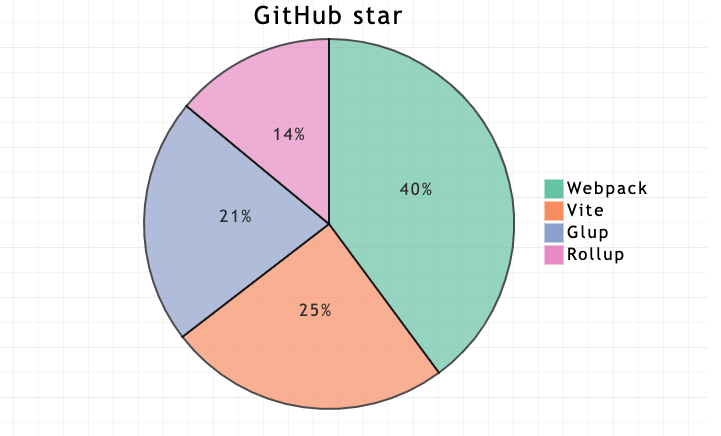

* `Webpack`配置丰富使用极为灵活但上手成本高，`Vite`开箱即用配置高度集成

* `Webpack`启动服务需打包构建，速度慢，`Vite`免编译可秒开

* `Webpack`热更新需打包构建，速度慢，`Vite`毫秒响应

* `Webpack`成熟稳定、资源丰富、大量实践案例，`Vite`实践较少

* `Vite`使用`esbuild`编译，构建速度比`webpack`快几个数量级


兼容性

* 默认目标浏览器是在`script`标签上支持原生 ESM 和 原生 ESM 动态导入

* 可使用官方插件 `@vitejs/plugin-legacy`，转义成传统版本和相对应的`polyfill`


未来探索

* 传统构建工具性能已到瓶颈，主打开发体验的`Vite`，可能会受到欢迎。

* 主流浏览器基本支持ESM，ESM将成为主流。

* `Vite`在`Vue3.0`代替`vue-cli`，作为官方脚手架，会大大提高使用量。

* `Vite2.0`推出后，已可以在实际项目中使用`Vite`。

* 如果觉得直接使用`Vite`太冒险，又确实有`dev server`速度慢的问题需要解决，可以尝试用`Vite`单独搭建一套`dev server`


相关资源

官方插件

除了支持现有的`Rollup`插件系统外，官方提供了四个最关键的插件

* `@vitejs/plugin-vue` 提供 Vue3 单文件组件支持

* `@vitejs/plugin-vue-jsx` 提供 Vue3 JSX 支持（专用的 Babel 转换插件）

* `@vitejs/plugin-react` 提供完整的 React 支持

* `@vitejs/plugin-legacy` 为打包后的文件提供传统浏览器兼容性支持


***

## 49. e.target 和 e.currentTarget 有什么区别？


**参考答案：**

冒泡 & 捕获

当你触发一个元素的事件的时候，该事件从该元素的祖先元素传递下去，此过程为`捕获`，而到达此元素之后，又会向其祖先元素传播上去，此过程为`冒泡`

```javascript
    <div id="a">
      <div id="b">
        <div id="c">
          <div id="d">哈哈哈哈哈</div>
        </div>
      </div>
    </div>
```

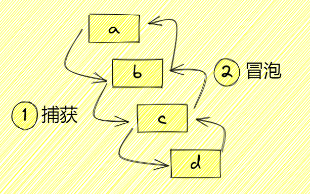

addEventListener

`addEventListener`是为元素绑定事件的方法，他接收三个参数：

* 第一个参数：绑定的事件名

* 第二个参数：执行的函数

* 第三个参数：

  * false：默认，代表冒泡时绑定

  * true：代表捕获时绑定


target & currentTarget

false

我们给四个div元素绑定事件，且`addEventListener`第三个参数不设置，则默认设置为`false`

```javascript
const a = document.getElementById('a')
const b = document.getElementById('b')
const c = document.getElementById('c')
const d = document.getElementById('d')
a.addEventListener('click', (e) => {
  const {
    target,
    currentTarget
  } = e
  console.log(`target是${target.id}`)
  console.log(`currentTarget是${currentTarget.id}`)
})
b.addEventListener('click', (e) => {
  const {
    target,
    currentTarget
  } = e
  console.log(`target是${target.id}`)
  console.log(`currentTarget是${currentTarget.id}`)
})
c.addEventListener('click', (e) => {
  const {
    target,
    currentTarget
  } = e
  console.log(`target是${target.id}`)
  console.log(`currentTarget是${currentTarget.id}`)
})
d.addEventListener('click', (e) => {
  const {
    target,
    currentTarget
  } = e
  console.log(`target是${target.id}`)
  console.log(`currentTarget是${currentTarget.id}`)
})
```

现在我们点击，看看输出的东西，可以看出触发的是d，而执行的元素是冒泡的顺序

```javascript
target是d currentTarget是d
target是d currentTarget是c
target是d currentTarget是b
target是d currentTarget是a
```

true

我们把四个事件第三个参数都设置为`true`，我们看看输出结果，可以看出触发的是d，而执行的元素是捕获的顺序

```javascript
target是d currentTarget是a
target是d currentTarget是b
target是d currentTarget是c
target是d currentTarget是d
```

区别

我们可以总结出：

* `e.target`：触发事件的元素

* `e.currentTarget`：绑定事件的元素


***

## 50. 说说你对计算机网络模型的理解


**参考答案：**

一、体系结构

计算机网络的各层及其协议的集合被称为网络的体系结构，按照不同的维度，其常被分为七层、五层、四层网络结构：

1.1 七层网络模型

开放式系统互联模型（Open System Interconnection Model，简称为 OSI 模型）是一种概念模型，由国际标准化组织提出，并试图成为计算机在世界范围内互连为网络的标准框架，它具有七层网络结构。

1.2 四层网络模型

互联网协议套件（Internet Protocol Suite，IPS）是多个网络传输协议的集合，它为网际网络的基础通信提供架构支撑。由于该协议族中最核心的两个协议分别为 TCP（传输控制协议）和 IP（网际协议），因此它也被称为 TCP/IP 协议族（TCP/IP Protocol Suite 或 TCP/IP Protocols），简称 TCP/IP，它具有四层网络结构 。

1.3 五层网络模型

OSI 七层网络模型由国际标准化组织进行制定，它是正统意义上的国际标准。但其实现过于复杂，且制定周期过长，在其整套标准推出之前，TCP/IP 模型已经在全球范围内被广泛使用，所以 TCP/IP 模型才是事实上的国际标准。TCP/IP 模型定义了应用层、传输层、网际层、网络接口层这四层网络结构，但并没有给出网络接口层的具体内容，因此在学习和开发中，通常将网络接口层替换为 OSI 七层模型中的数据链路层和物理层来进行理解，这就是五层网络模型：

1. 应用层 (application layer)：直接为应用进程提供服务。应用层协议定义的是应用进程间通讯和交互的规则，不同的应用有着不同的应用层协议，如 HTTP协议（万维网服务）、FTP协议（文件传输）、SMTP协议（电子邮件）、DNS（域名查询）等。

2. 传输层 (transport layer)：有时也译为运输层，它负责为两台主机中的进程提供通信服务。该层主要有以下两种协议：

   * 传输控制协议 (Transmission Control Protocol，TCP)：提供面向连接的、可靠的数据传输服务，数据传输的基本单位是报文段（segment）；

   * 用户数据报协议 (User Datagram Protocol，UDP)：提供无连接的、尽最大努力的数据传输服务，但不保证数据传输的可靠性，数据传输的基本单位是用户数据报。

3. 网络层 (internet layer)：有时也译为网际层，它负责为两台主机提供通信服务，并通过选择合适的路由将数据传递到目标主机。

4. 数据链路层 (data link layer)：负责将网络层交下来的 IP 数据报封装成帧，并在链路的两个相邻节点间传送帧，每一帧都包含数据和必要的控制信息（如同步信息、地址信息、差错控制等）。

5. 物理层 (physical Layer)：确保数据可以在各种物理媒介上进行传输，为数据的传输提供可靠的环境。


二、物理层

物理层考虑的是如何在各种媒介上传输数据，它定义了与传输媒介相关的接口特性，如：

* 机械特性：指明接口所用的接线器的形状和尺寸、引线数目和排列、固定和锁定装置等。

* 电气特性：指明在接口电缆的各条线上出现的电压的范围。

* 功能特性：指明某条线上出现的某一电平的电压的意义。

* 规程特性：指明对于不同功能的各种可能事件的出现顺序。

2.1 传输媒介

物理层并不指具体的传输媒介，相反物理层希望能够尽量屏蔽不同媒介间的差异。这些传输媒介可以分为以下两类：

* 导引型传输媒介：信号被导引沿着固体媒介进行传播，如双绞线、同轴电缆、光缆。

* 非导引型传输媒介：信号在自由空间内进行传播，如短波通信、微波通信。

2.2 信道分类

信道是指信息传输的基本通道，它可以分为以下三类：

* 单工信道：只能有一个方向的通信而没有反方向的通信；

* 半双工信道：通信的双方都能发送信息，但双方不能同时发送或接收信息。

* 全双工信道：通信的双方可以同时发送和接收信息。

2.3 信道复用

信道复用是信息传输当中最常使用的技术，用于提高信息传输的效率，根据采用技术的不同，可以分为以下几类：

* 频分复用

频分复用（FDM，Frequency Division Multiplexing）是将用于传输信道的总带宽划分成若干个子频带（或称子信道），每个子信道传输一路信号：

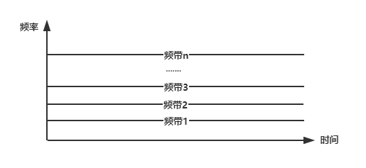

2. 时分复用

时分复用（TDM，Time Division Multiplexing) 是指采用同一物理连接的不同时段来传输不同的信号：

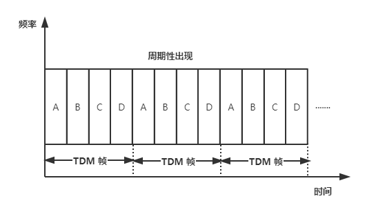

如上图所示，在一个时分复用帧中，不同用户的信号周期性出现，如果某个用户处于闲置状态，则其对应的帧上也会出现空闲：

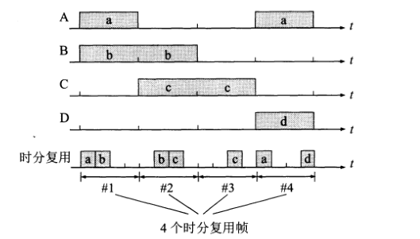

为了解决时分复用的这个缺点就产生了统计时分复用。

3.统计时分复用

在统计时分复用（Statistic TDM）模式下，各用户将数据发送到集中器的输入缓存中，然后由集中器进行顺序扫描并放入到 STDM 帧中：

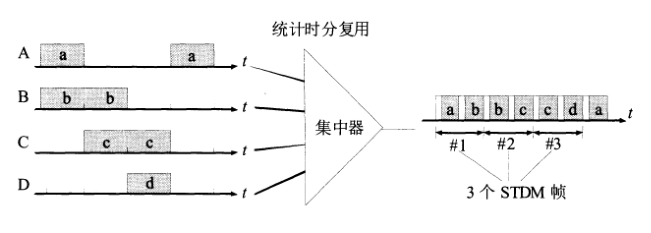

4. 波分复用

波分复用（WDM，Wavelength Division Multiplexing）是将两种或多种不同波长的光载波信号在发送端经复用器汇合在一起，并耦合到光线路的同一根光纤中进行传输；在接收端，经分用器将各种波长的光载波分离，然后由光解调器作进一步处理以恢复原信号：

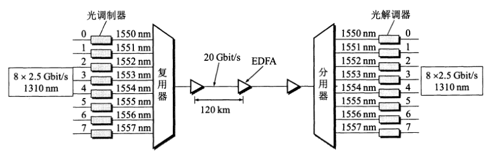

5.码分复用

码分复用（CDM，Code Division Multiplexing）是靠不同的编码来区分各路原始信号的一种复用方式。


三、数据链路层

3.1 基本功能

1. 封装成帧

数据链路层会将网络层传递下来的数据拆分为多段，并在每段数据前后分别添加首部和尾部，以构成一个完成的帧，帧是链路层传输的基本数据单元。帧首部用控制字符 `SOH` 表示，帧尾部用控制字符 `EOT` 表示：

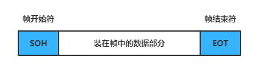

* 透明传输

透明传输是指不论何种数据都应当能够在链路上进行安全地传输。由于我们采用控制字符来封装帧，当传输数据中出现了控制字符时，就会导致无法正确区分出帧头帧尾，此时需要使用转移字符 `ESC` 来进行转义：

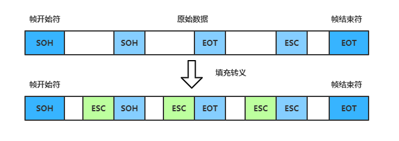

* 差错检测

由于现实环境中的通信链路都是不理想的，因此比特在传输过程中可能会产生差错：1 可能会变成 0，而 0 也可能变成 1，这称为比特差错。在一段时间内，传输错误的比特占所传输比特总数的比率称为误码率。为了解决这个问题，数据链路层将待发送的数据分为多组，并采用循环冗余校验（CRC，Cyclic Redundancy Check）技术为每组数据生成冗余校验码，之后将每组数据和其校验码共同构成一帧后再发送出去。


3.2 PPP 协议

点到点协议（PPP，Point to Point Protocol）是目前使用最为广泛的数据链路层协议，主要用于建立点对点的连接来传输数据单元。它由以下三部分组成：

* 一个将 IP 数据报封装到串行链路的方法；

* 链路控制协议 (LCP) ：一种扩展链路控制协议，用于建立、配置、测试和管理数据链路连接。

* 网络控制协议 (NCP) ：协商该链路上所传输的数据包格式与类型，建立、配置不同的网络层协议。


3.3 Mac 地址

MAC 地址（Media Access Control Address），直译为媒体存取控制地址，也称为局域网地址（LAN Address）或物理地址（Physical Address）。MAC 地址用于在网络中唯一标识一个网卡，一台设备若有多个网卡，则每个网卡都会有一个唯一的 MAC 地址。链路层通过 Mac 地址来识别需要发送数据的目标节点。

MAC地址为 48 位的（6 个字节），通常表示为 12 个 16 进制数，每两个 16 进制数之间用冒号隔开，如 `08：00：20：0A：8C：6D`，前 3 字节为组织机构唯一标识（OUI，Organizationally Unique Identifier），由 IEEE 的注册管理机构统一分配给硬件生产厂家，以确保在全球范围内的唯一；后 3 字节由厂家自行分配。

3.4 局域网

局域网（LAN，Local Area Network）是连接住宅、学校、实验室、大学校园或办公大楼等有限区域内计算机的网络。 按照 IEEE802 标准，局域网体系结构分为三层，即物理层，媒体链路控制层（MAC），逻辑链路控制层（LLC）。实际上是两层，该标准将数据链路层拆分为更具体的媒体链路控制层和逻辑链路控制层。


3.5 以太网

以太网（Ethernet）是目前使用范围最广的局域网，以常用的以太网 v2 标准为例，其帧格式如下：


其中 Mac Header 分别记录了目的地的 Mac 地址和来源地的 Mac 地址。


四、网络层

4.1 网际协议 IP

网际协议（Internet Protocol）是网络层中最重要的协议，也是 TCP\IP 两大核心协议之一，所有需要互联的计算机网络都需要遵循该协议，以便能够将不同网络在全世界范围内连接起来。该层传输的基本数据单元是 IP 数据报，其格式如下：

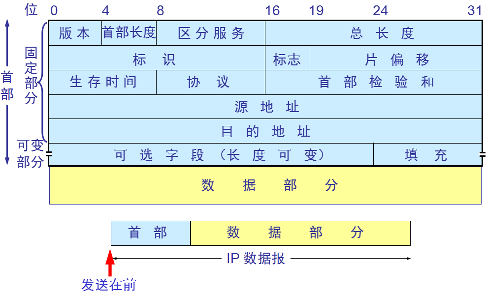

各字段的含义如下：

* 版本：占 4 位，指 IP 协议的版本（IPv4 或 IPv6）。

* 首部长度：占 4 位，可表示的最大十进制数是 15 。

* 区分服务：只有在使用区分服务时，该字段才有用，一般情况下不会用到。

* 总长度：指首部长度和数据长度之和，单位为字节。该字段为 16 位，因此数据报最大长度为 65535 个字节，由于数据链路层规定了一个帧中数据字段的最大长度 MTU（Maximum Transfer Unit，最大传送单元），以以太网为例，该值为 1500，所以当数据报长度超过 MTU 时，需要对数据进行分片。

* 标识：占 16 位，由 IP 软件内部的计数器维护，每产生一个数据报，计数器就加 1，用于发生分片时，将相同数据报标识的分片重组为原数据报。

* 标志：占 3 位，目前只有两位有意义：

  * 最低位 MF（More Fragment）：为 1 时表示后面还有分片，为 0 时表示该数据报分片已经是最后一个；

  * 中间位 DF（Don't Fragment）：代表不能分片，只有将其设为 1 时，才允许分片。

* 片偏移：占 13 位，标识该片在原数据报中的偏移位置。

* 生存时间：TTL，每经过一个路由器，其值就会减 1，当值为 0 时，就将该数据报丢弃。这样做是为了避免数据报目的地址不存在时，数据报一直在网络中无限制转发。

* 协议：占 8 位，指明数据报携带的数据所使用的协议。

* 首部校验和：占 16 位，其只校验数据报的首部，不包括数据部分。

* 源地址：占 32 位，数据来源的 IP 地址；

* 目的地址：占 32 位，目的地的 IP 地址。


4.2 ARP 协议

IP 数据报中的源地址和目标地址均是 IP 地址，而数据链路层的帧中的源地址和目标地址均是 Mac 地址，那么怎样根据 IP 地址获得 Mac 地址？这就需要使用到 ARP 协议。互联网络中的每台主机都有一个 ARP 缓存表，存储了本局域网内各主机和路由器的 IP 地址与 Mac 地址的映射关系，示例如下：

主机名称

IP地址

MAC地址

A

192.168.38.10

00-AA-00-62-D2-02

B

192.168.38.11

00-BB-00-62-C2-02

C

192.168.38.12

00-CC-00-62-C2-02

D

192.168.38.13

00-DD-00-62-C2-02

E

192.168.38.14

00-EE-00-62-C2-02

> 你也可以使用 `arp -a` 来查看你本机的 ARP 缓存表 。

拥有 ARP 表后，数据链路层中帧的发送过程如下：

* 主机 A 发送数据前， 会先查看自己的 ARP 表中是否有目标 IP 对应的 Mac 地址，如果有则将其封装到帧里，然后发送；

* 如果没有找到，主机 A 则会以广播的方式向同一网段内的所有主机发出对该 IP 地址的询问；

* 对应 IP 地址的主机接收到这个消息后以单播的方式将对应的 Mac 地址回复给主机 A 。


4.3 IP 地址分类

IP 地址由 ICANN（The Internet Corporation for Assigned Names and Numbers，互联网名称与数字地址分配机构）进行分配，它是一个在全世界范围内唯一的 32 位标识符，最早的 IP 地址采用两级分类，只由 `网络号 + 主机号` 组成，分为以下五类：

A，B，C 三类是最常使用的类型，其类别位分别为 0，10，110 。需要注意的是另外并非所有 IP 地址都可用来分配，限制如下：

网络号限制：

* 网络号全为 0 的 IP 地址是保留地址，代表 “本网络”（B，C 两类地址的网络号开头都是 1，所以不存在全 0 的情况）；

* 网络号为 127（即 01111111）也是保留地址，作为回环测试使用（同上，B 和 C 两类地址也不存在该情况）；

* B 类地址 128.0.0.0 （网络号为 10000000 00000000）不能用于分配；

* C 类地址 192.0.0.0 （网络号为 11000000 00000000）不能用于分配；

主机号限制：

* 全 0 主机号表示该 IP 地址是本主机所连接到的单个网络地址，如 IP 地址为 5.6.7.8 的主机所在的网络地址就是 5.0.0.0，该地址不能用于分配；

* 全 1 主机号表示该网络上的所有主机，因此也不能被分配。

综上所述，每种网络类型所能分配到 IP 地址的情况如下：

网络类别

最大可分配的网络数

第一个可分配的网络号

最后一个可分配的网络号

每个网络的最大主机数

A

126（27-2）

1

126

16 777 215（224-2）

B

16 383（214-1）

128.1

191.255

65 534（216-2）

C

2 097 151（221-1）

192.0.1

223.255.255

254（28-2）

从该表我们可以看出来，两级 IP 地址灵活性不足，且利用率较低，假设你现在的公司有 4 个机房（每个机房 20 台主机），出于信息安全的考虑，每个机房的网络需要彼此隔离，在两级 IP 的架构下你就只能申请 4 个 C 类地址，此时你浪费的 IP 数量为 `(254-20)*4` ，为解决两级 IP 地址灵活性不足问题，就产生了三级 IP 地址，即划分子网。此时你只需要申请一个 C 类地址，然后将其划分为 4 个子网。


4.4 划分子网

划分子网方案诞生与 1985 年，它从主机号借用若干位作为子网号，从而将 IP 地址划分为三级：网络号 + 子网号 + 主机号。假设网络地址为 192.168.10.0，利用子网掩码 255.255.255.224 对其进行划分子网，此时可以划分为四个子网：

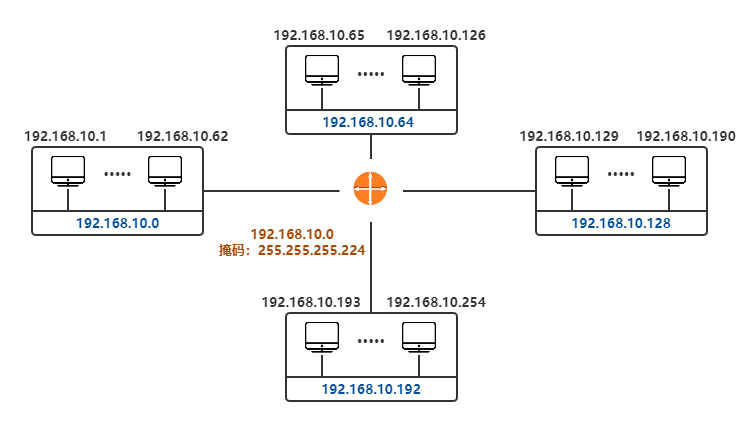

由于子网对外是不可见的，所以需要使用子网掩码来辅助路由，假设目标 IP 地址为 192.168.10.198，想要正确到达该地址，必须先正确到达网络地址 192.168.10.192 。网络地址，子网掩码和主机 IP 之间的关系如下：

```plaintext
IP 地址：192.168.10.198             二进制IP地址：11000000.10101000.00001010.11000110
子网掩码：255.255.255.224           二进制掩码：11111111.11111111.11111111.11100000
网络地址：192.168.10.192            按位逻辑与运算结果为：11000000.10101000.00001010.11000000
```

现代互联网标准规定：所有网络都必须使用子网掩码，同时路由器的路由表中也必须包含子网掩码这一项。因为路由表包含了 IP 地址和子网掩码，所以通过位运算就能很快计算出网络地址。

最后，如果一个网络不划分子网掩码，则其子网掩码取默认值，各类 IP 地址默认的掩码如下：

类别

子网掩码的二进制数值

子网掩码的十进制数值

A

11111111 00000000 00000000 00000000

255.0.0.0

B

11111111 11111111 00000000 00000000

255.255.0.0

C

11111111 11111111 11111111 00000000

255.255.255.0


4.5 构成超网

无类别域间路由（CIDR，Classless Inter-Domain Routing）是一个给用户分配 IP 地址以及在互联网上有效地路由 IP 数据报的地址归类方法。它消除了传统的 A 类，B 类 和 C 类地址以及划分子网的概念，采用无分类的两级编址：

```plaintext
IP地址 ::= {<网络前缀>,<主机号>}
```

并使用斜线记法进行表示：

128.14.35.7 / 20 = 10000000 00001110 00100011 00000111

此时表示前 20 位都是网络前缀，该地址所处的地址块中的最小地址和最大地址则分别为：

十进制

二进制

最小地址

128.14.32.0

10000000 00001110 00100000 00000000

最大地址

128.14.47.255

10000000 00001110 00101111 11111111

每个地址块可以使用地址块中的最小地址和网络前缀的位数进行指定，例如上面的地址块可以记为 128.14.32.0 / 20 ，也可以简称为 `/20地址块` 。为更方便的进行路由选择，CIDR 使用 32 位的地址掩码，斜线后面的数字同时表示地址掩码中 1 的个数，例如 `/20地址块` 的地址掩码为 11111111 11111111 11110000 00000000 。

由于一个 CIDR 地址块可以包含多个地址，所以路由表就利用 CIDR 地址块来查找目标网络，这种地址聚合常称为路由聚合，也称为构成超网。通过路由聚合，可以极大减少路由表中项目的数量，从而提高网络的整体性能。


4.6 ICMP 和 IGMP

在网络层，除了上面介绍的 IP 协议和 ARP 协议外，最常使用的还有以下两个协议：

* 互联网控制消息协议 (ICMP，Internet Control Message Protocol)：为了提高 IP 数据报的交付率，ICMP 允许主机或路由器报告差错情况和提供异常报告给发送者，以便发送者进行补偿行为。

* 网路群组管理协议 (IGMP，Internet Group Management Protocol) ：是用于管理网路协议多播组成员的一种通信协议。IP 主机和相邻的路由器可以利用 IGMP 来建立多播组的组成员。


4.7 专用地址

RFC 1918 中指明了一些专用地址（Private Address），这些地址只能用于一个机构的内部通信，但不能用于和互联网上的主机进行通信。在互联网中的所有路由器，对目的地址是专用地址的数据报一律不进行转发。下面是三个专用的地址块：

* 10.0.0.0 -- 10.255.255.255（或记为 10.0.0.0/8 ，又称为 24 位块）；

* 172.16.0.0 -- 172.31.255.255（或记为 172.16.0.0/12 ，又称为 20 位块）；

* 192.168.0.0 -- 192.168.255.255（或记为 192.168.0.0/16 ，又称为 16 位块）。

因为不同机构可以采用相同的专用地址，因此其也被称为可重用地址。


4.8 VPN

如果一个机构内使用的是由专用地址构成的专用网，但该机构的部门却分布在不同的、远距离的地理位置上，此时可以利用公共的互联网作为本机构内各专用网之间的通信载体，这样的专用网称为虚拟专用网（Virtual Private Network）。此时通过公共互联网的数据可以使用 IPSec（IP Security）协议加密来保证安全性。


4.8 NAT

当某台主机获取到的地址是专用地址时，其是无法和外部互联网进行通讯的，如果想要和外部互联网进行通讯，可以采用 NAT（Network Address Translation，网络地址转换）技术来实现。该方法需要在专用网连接到互联网的路由器上安装 NAT 软件，NAT 路由器需要至少一个有效的全球 IP 地址，当使用专用地址的主机在和外界进行通信时，NAT 路由器会将其转换为全球 IP 地址。

由上面的原理也可以看出，具有 n 个全球 IP 地址的路由器最多只允许 n 台主机同时接入到互联网。 为了解决这个问题，现在常用的 NAT 转换表会把传输层的端口号也利用上。

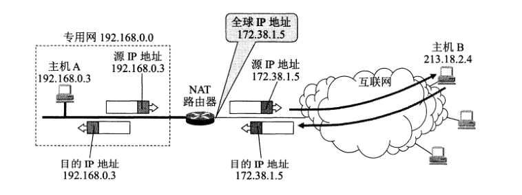

4.9 IPv6

上面我们介绍过 IPv4 的长度为 32 位，因此所有可分配的 IP 地址大约为 42 亿个，到 2011 年 2 月，所有可分配地址均已耗尽，因此产生了 IPv6，IPv6 的地址长度为 128 位，采用十六进制表示。


五、传输层

传输层负责为两台主机中的进程提供通信服务，它使用 16 位的端口号来标识端口，当两个计算机中的进程要进行通讯时，除了要知道对方的 IP 地址外，还需要知道对方的端口。该层主要有以下两个协议：用户数据报协议（UDP，User Datagram Protocol）和传输控制协议（TCP，Transmission Control Protocol）：


5.1 UDP

用户数据报协议 UDP 具有以下特点：

* UDP 是无连接的；

* UDP 提供尽最大努力的交付服务，但不保证交付的可靠性；

* UDP 是面向报文的；

* UDP 没有拥塞控制，因此网络出现拥塞不会使源主机的发送速率降低；

* UDP 支持一对一、一对多、多对一和多对多的交互通信；

* UDP 的首部开销较小，只有 8 个字节，远小于 TCP 的 20 个字节。首部共由四个字段组成，每个字段两个字节：

  * 源端口号：在需要对方回信时选用，不需要时可用全 0 表示；

  * 目标端口号；

  * 长度：UDP 用户数报的总长度；

  * 校验和：检测 UDP 用户数据报在传输中是否有错，如果有错则丢弃。

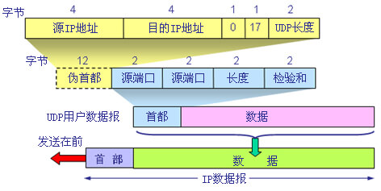

5.2 TCP 简介

传输控制协议 TCP 具有以下特点：

* TCP 是面向连接的；

* TCP 提供可靠的交付服务；

* TCP 提供全双工的通信，两端都设有缓存，用来临时存放通信数据；

* 面向字节流，这里的流指的是流入或流出进程的字节序列；

* 每一条 TCP 连接唯一地被通信两端的两个端点所确定，即：

```plaintext
TCP 连接 ::= {socket1,socket2} = {(IP1,port1),(IP2,port2)}  
```

5.3 TCP 报文首部

TCP 虽然是面向字节流的，但其传输的基本数据单元则是报文段。一个 TCP 报文段分为首部和数据两部分，TCP 首部的前 20 个字节是固定的，后面有 4n 字节是根据需要而增加的选项（n 为整数），具体格式如下：

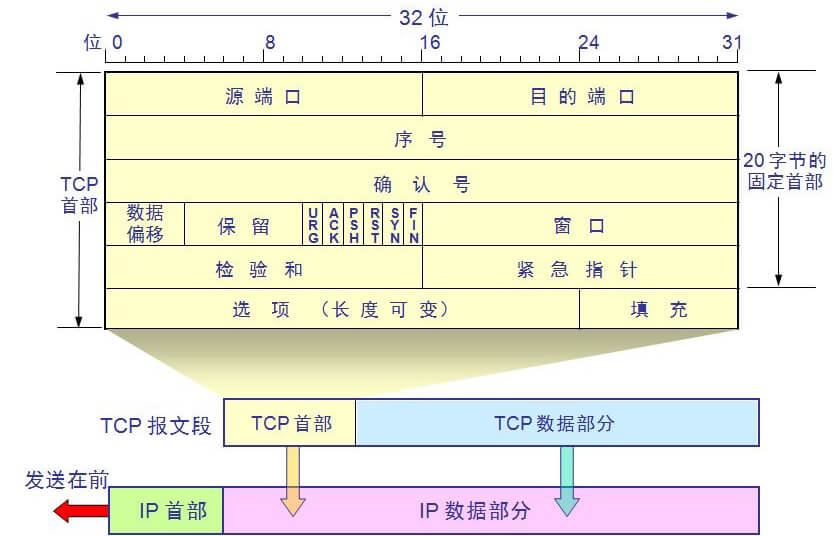

各字段的含义如下：

1. 源端口和目的端口：各占 2 个字节。

2. 序号：占 4 字节，序号范围为 \[ 0 , 232 - 1 ] ，序号增加到 232 - 1 后又会回到 0 。在一个 TCP 连接中，传送的字节流中的每一个字节都要按顺序进行编号。

3. 确认号：占 4 字节，表示期望收到对方下一个报文段的第一个数据字节的序号。例如 B 收到 A 的报文，序号值为 501 ，数据长度为 200 字节（序号 501 \~ 700），此时表明 B 正确收到了序号 700 及其之前的所有数据，因此 B 在发送给 A 的确认报文段中确认号的值为 701。

4. 数据偏移：占 4 位，其所能表达的最大数字是 15 。数据偏移表示该数据报中数据的起始位置，由于数据报是由 首部+数据 组成，所以实际上就是指报文段的首部长度。数据偏移的单位是 32 位字（即以 4 字节长为单位），所以数据偏移的最大长度是 60 （15\*4）字节，即 TCP 报文段的首部长度不能超过 60 字节，对应的选项长度不能超过 40 字节。

5. 保留：占 6 位，保留为今后使用，目前应置为 0 。

6. 六个控制位：其作用分别如下：

   * 紧急 URG (URGent)：当值为 1 时，表明紧急指针字段有效，代表此报文中有紧急数据，应尽快传送，而无需按原来的排队顺序传送。

   * 确认 ACK (ACKnowledgment)：当值为 1 时，确认号有效；值为 0 时，确认号无效。TCP 规定，在连接建立后所有传送的报文段都必须把 ACK 置为 1。

   * 推送 PSH (Push)：当值为 1 时，表示接受方应该将数据立即交付给应用进程，而不是等待缓存填满后再向上交付。

   * 复位 RST (Reset)：当值为 1 时，表明 TCP 连接出现严重差错，必须立即释放，然后再重新建立连接；也可以用来拒绝一个非法的报文段或拒绝打开一个连接。

   * 同步 SYN (SYNchronization)：在连接建立时用来同步序号。当 SYN = 1 而 ACK = 0 时，表明这是一个连接请求报文段；对方若同意建立连接，则应在响应的报文段中使 SYN = 1 和 ACK = 1 。

   * 终止 FIN (FINis)：当值为 1 时，表明此报文段发送方的数据已发送完毕，并要求释放连接。

7. 窗口：占 2 字节，取值范围为 \[ 0 , 216 - 1 ] 之间的整数。窗口字段保持动态变化，用于指明接收方允许发送方发送的数据量。

8. 校验和：占 2 字节，校验的字段范围包括首部和数据。

9. 紧急指针：占 2 字节，仅在 URG = 1 时才有意义，用于指明紧急数据的结束位置，位于结束位置之后的就是普通数据。

10. 选项：长度可变，最长可达 40 字节。可用的选项有：最大报文段长度 ，窗口扩大选项、时间戳选项等。


5.4 三次握手

TCP 建立连接的过程叫做握手，握手需要在客户和服务器之间交换三个 TCP 报文段，具体如下：

1. 服务器进程 B 首先创建传输控制模块 TCB，然后进入 LISTEN（收听）状态，准备接受客户端的连接请求；

2. 客户端进程 A 首先创建传输控制模块 TCB，然后发出连接请求报文段，此时同步位 `SYN = 1` ，同时选择一个初始序号 `seq = x` ，之后进入 SYN-SENT（同步已发送）状态；

3. B 收到连接请求报文段后，如果同意建立连接，则发送确认报文段，此时 SYN 和 ACK 都置为 1，确认号 `ack = x + 1` ，并为自己选择一个初始序号 `seq =y` ，之后进入 SYN-RCVD（同步收到）状态；

4. A 收到来自 B 的确认后，发出最后的确认，确认报文段的 ACK 为 1，确认号 `ack = y + 1`，序号 `seq = x + 1`。TCP 标准规定，ACK 报文段可以携带数据也可以不携带，如果不携带则该序号不被消耗，下一个数据报文段的序号仍然是 `seq = x + 1`。之后 A 进入 ESTABLISHED（已连接）状态；

5. 当 B 收到 A 的确认后，也进入 ESTABLISHED 状态。


5.5 四次挥手

数据传输结束后，通信的双方都可以释放连接，具体过程如下：

1. 假设应用进程 A 先主动关闭连接，此时需要发送连接释放报文段：首部终止控制位 FIN 为 1，序号 `seq = u`，其中 u 等于前面传送过的数据的最后一个字节的序号加 1 。之后 A 进入 FIN-WAIT-1（终止等待 1）状态；

2. 应用进程 B 收到连接释放报文段后立即发出确认，确认号 `ack = u + 1`，序号 `seq = v` ，其中 v 等于前面传送过的数据的最后一个字节的序号加 1 。之后 B 进入 CLOSE-WAIT（关闭等待）状态，并通知高层应用进程。此时 TCP 连接处于半关闭状态，即 A 已经没有数据需要发送，但如果 B 发送数据，A 仍要接收；

3. A 收到来自 B 的确认后就进入 FIN-WAIT-2（终止等待 2）状态，等待 B 发出连接释放报文段；

4. 若高层应用进程已经没有数据要发送，则通知 B 释放 TCP 连接。此时 B 发出释放连接报文段：首部终止控制位 FIN 为 1，序号 `seq = w`（在半关闭状态下 B 可能又发送了一些数据），另外还需要重复上次已经发送过的确认号 `ack = u + 1`。之后 B 进入 LAST-ACK（最后确认）状态；

5. A 收到 B 的连接释放报文段后，发出最后确认：ACK 为 1，确认号 `ack = w + 1`，序号 `seq = u + 1`，然后进入 TIME-WAIT（有时间限制的等待）状态；

6. B 收到来自 A 的最后确认后进入 CLOSED（关闭）状态；

7. A 经过 2 倍的 MSL（Maximum Segment Lifetime，最长报文段寿命）后，才进入 CLOSED 状态。

RFC 793 建议 MSL 设置为 2 分钟，现在的网络环境已经有了质的提升，该值可以按需缩短。A 之所以要等待两倍的 MSL 时间后才进入 CLOSED 状态，主要基于以下两个原因：

* 为了保证 A 发送的最后一个 ACK 报文段能够到达 B。如果 B 没有收到该最后确认，则会进行超时重发 FIN+ACK 报文段，A 在 2MSL 等待时间内会响应该报文段并重发最后确认；

* 确保本次连接内产生的所有报文段都从网络消失，进而确保下一个新的连接中不会出现旧的连接请求报文段。


5.6 可靠传输的原理

* 停止等待协议

想要实现可靠性传输，最基本的可以使用停止等待协议：每发送完一个数据单元就停止发送，并等待对方的确认。

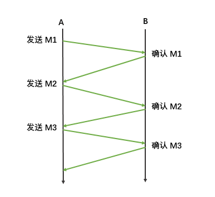

此时面临两个问题：

* 如果 A 给 B 发送数据的过程中出现了丢失，此时 B 无法收到数据，自然也不会返回确认，那么程序就会一直等待；

* 如果 B 给 A 发送确认的过程中出现了丢失或经过很长时间才到达 A，那么程序也会持续等待。

针对第一个问题，解决方案是如果在给定的时间内没有收到确认，则进行超时重传：

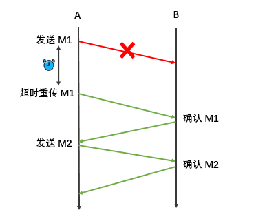

针对第二个问题，其解决方案依然是超时重传，具体细分为以下两种情况：

* 如果 B 收到了 M1，只是返回的确认丢失了，当超时重传后，B 需要丢弃重复收到的 M1；

* 如果 B 的返回确认没有丢失，只是超过了重传时间后才到达 A，此时 A 可能会收到两次确认，一次是补传得到确认，一次是原有的延迟到达的确认，A 需要丢弃延时到达的确认，不做任何处理：

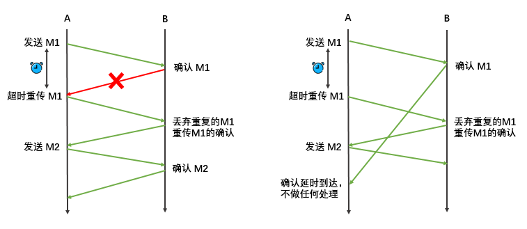

在基本的停止等待协议中，一次只发送一个数据单元，此时信道利用率非常低，为了解决这个问题，可以采用流水线传输，一次发送多个数据单元：

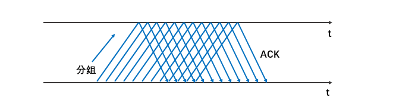

当使用流水线传输时，为保证可靠性，需要配合使用连续 ARQ 协议和滑动窗口协议。

2.连续 ARQ 协议

连续ARQ（Automatic Repeat reQuest）协议指发送方维持着一个一定大小的发送窗口，位于发送窗口内的所有分组都可连续发送出去，中途不需要等待对方的确认，发送方在每收到一个确认时就把发送窗口向前滑动一个分组的位置：

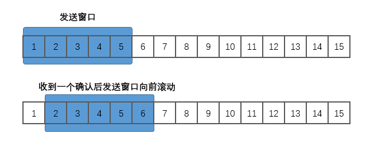

通常接收方一般都是采用累积确认的方式。此时接收方不必对收到的分组逐个发送确认，而是在收到几个分组后，对按序到达的最后一个分组发送确认，它表示：这个分组及其之前的所有分组都已正确到达。


5.7 TCP 的可靠传输

TCP 的滑动窗口以字节为单位，并采用以下方法来计算超时重传时间 RTO（Retransmission Time Out）：

```plaintext
RTO = RTT_S + 4 × RTT_D
```

其中 RTTS 表示加权平均往返时间，计算方式如下：

```plaintext
新的 RTT_S = (1-α) × 旧的 RTT_S +  α × 新的 RTT 值
```

* RTT （Round Trip Time）代表报文段的往返时间，它记录一个报文段从发出去到收到确认的时间长度；

* 第一次测量时， RTTS 的值就等于 RTT 的值，之后的 RTTS 则采用上面的公式进行计算；

* 其中 0 ≤ α＜1 ，RFC 6298 推荐其值取 0.125 。

RTTD 是 RTT 偏差的加权平均值，计算方式如下：

```plaintext
新的 RTT_D = (1-β) × 旧的 RTT_D +  β × |RTT_S - 新的 RTT 值|
```

* 第一次测量时，RTTD 的值就等于 RTT 值的一半，之后的 RTTD 则采用上面的公式进行计算；

* β 值是一个小于 1 的系数，RFC 6298 推荐其值取 0.25 。


5.8 流量控制

流量控制（flow control）是指控制发送方的发送速率，以便接收方来得及接收。假设 A 向 B 发送数据，在连接建立时，B 会将自己接收窗口（rwnd，receiver window）的大小告诉 A ，而 A 需要保证发送窗口的大小不能超过 B 接收窗口的大小，通过该机制就可以实现对发送方的流量控制。


5.9 拥塞控制

网络拥塞（congestion）是指传输的数据量超过节点承受能力而导致传输能力下降的情况。而拥塞控制就是防止过多的数据注入到网络中而造成路由器和链路过载。TCP 采用四种算法来进行拥塞控制，分别是：慢启动（slow start）、拥塞避免（congestion avoidance）、快重传（fast retransmit）和快恢复（fast recovery）：

1. 慢启动

慢开始和拥塞避免都是基于窗口的拥塞控制：发送方会维持一个名为拥塞窗口 cwnd（congestion window）的状态变量，其值取决于网络的拥塞程度，并会动态变化，同时发送方会让自己的发送窗口等于拥塞窗口。

慢启动的思路如下：由于不知道网络的负载能力，所以最好的选择就是逐步探测，即由小到大成倍地增大发送窗口，也就是说，由小到大成倍地增大拥塞窗口的值。

* 拥塞避免

拥塞避免算法的思路是让拥塞窗口 cwnd 缓慢地增大：每经过一个往返时间 RTT 就把发送方的拥塞窗口 cwnd 加 1，而不是像慢启动阶段那样加倍地增长。慢启动和拥塞避免通常是配合使用，以保证启动速度，一开始使用慢启动进行成倍增长，当达到某一个阈值 ssthresh 后采用拥塞避免进行稳步尝试：

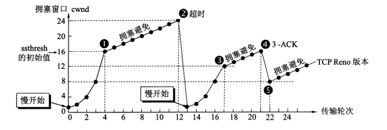

* 快重传和快恢复

快重传算法要求接收方不要等待自己发送数据时才进捎带确认，而是要立即发送确认，即使收到了失序报文段也要立即发出对已收到的报文段的重复确认。示例如下：

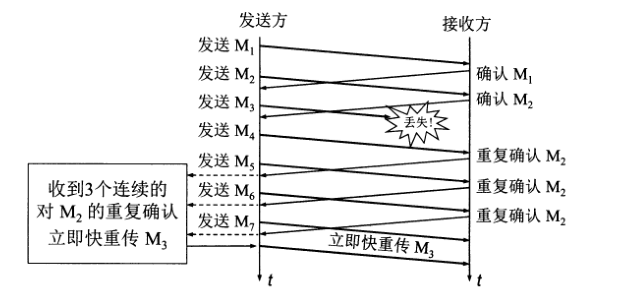

如上图所示，当 M3 丢失时，之后发送 M4 ， M5 ， M6 时收到的都是对于 M2 的重复确认，此时发送方就可以知道 M3 已经丢失，需要立即进行重传。由于此时只是个别报文出现了丢失，而不是网络拥塞，所以执行快恢复：发送方调整 ssthresh = cwnd / 2，并设置 cwnd = ssthresh = 8 （图中点5），并开始执行拥塞避免算法。


六、应用层

6.1 域名系统 DNS

目前我们都是使用易于理解的域名来访问互联网应用，但传输层需要的则是 IP 地址，因此需要使用域名系统（DNS，Domain Name System）来进行域名与 IP 地址之间的转换 。

域名是一个逻辑上的概念，分为多级域名，其中最基础的是根域名，其次是顶级域名，顶级域名共分为四类：

* 国家顶级域名 nTLD：如 cn 表示中国，us 表示美国；

* 通用顶级域名 gTLD：如 com 表示公司企业，org 表示非盈利性组织，net 表示网络服务机构；

* 基础结构域名：又称为反向域名，用于反向域名解析，该顶级域名只有一个 arpa；

* 新顶级域名 New gTLD：ICANN 机构在 2011 年 6 月 20 日批准新顶级域名，允许任何满足条件的公司或机构进行申请。

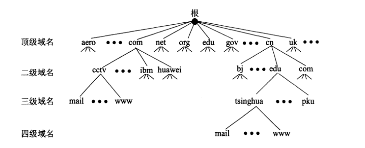

6.2 文件传输协议 FTP

文件传输协议（FTP，File Transfer Protocol）是用于在网络上进行文件传输的一套标准协议，允许客户指明文件的类型和格式，并获得文件的存储权限。FTP 的服务器进程由两大部分组成：

* 一个主进程：负责接收新的请求；

* 若干个从属进程：负责处理单个请求。

因此一个 FTP 服务器进程可以同时为多个客户端进程提供服务。


6.3 远程终端协议 TELNET

Telnet 协议是 Internet 远程登录服务的标准协议和主要方式，它为用户提供了在本地计算机上访问远程主机的能力。Telnet 能将用户的击键传到远程主机，同时也能将远程主机的输出通过 TCP 连接返回到用户屏幕，这种服务是透明的，用户感觉键盘和显示器好像都是直接连在远程主机上，因此 Telnet 又称为终端仿真协议。


6.4 万维网 WWW

万维网是一个分布式的超媒体系统，它是超文本系统的扩展。它包含以下重要概念：

1. 统一资源定位符 URL

用于定位互联网上资源的位置和访问这些资源的方法，其格式如下：

```plaintext
<协议>://<主机>:<端口>/<路径>
```

* 超文本传送协议 HTTP

HTTP 协议定义了浏览器如何向万维网请求文档，以及服务器如何把文档传送给浏览器。

* 超文本标记语言 HTML

超文本标记语言 HTML 是一种标识性的语言，包括一系列标签，这些标签可以用于说明文字、图形、动画、声音、表格、链接等各种类型的资源，并能将网络文档格式进行统一。


6.5 动态主机配置协议 DHCP

通常连接到互联网的计算机的协议软件都需要配置多个项目，如 IP 地址，子网掩码，默认路由器的 IP 地址以及域名服务器的 IP 地址等等，为了省去配置的麻烦，现在互联网普遍采用动态主机配置协议 DHCP（Dynamic Host Configuration Protocol），它提供了一种即插即用联网的机制。此时你只需要采用默认的配置即可，如下所示：

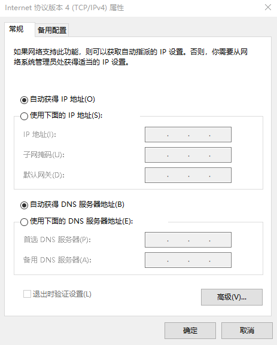

此时需要进行联网的主机在启动时候会广播发现报文（DHCP DISCOVER），其目的地址为 255.255.255.255（即受限广播地址），此时本地网络上的所有主机都能接收到这个广播报文，但只有 DHCP 服务器才会通过提供报文（DHCP OFFER）对此广播进行响应。DHCP 服务器先在其数据库中查找该计算机的配置信息，若找到，则直接返回；若找不到，则从服务器的 IP 地址池取一个地址分配给该计算机。

通常不是每个网络都有 DHCP 服务器，但每个网络都至少有一个 DHCP 中继代理（通常是路由器），它配置了 DHCP 服务器的 IP 地址信息。当 DHCP 中继代理收到主机 A 的发现报文后，就以单播的方式向 DHCP 服务器进行转发；并等待其回复后，再转发回主机 A 。

DHCP 服务器分配给 DHCP 客户的 IP 地址是临时性的，只能在一段时间内使用，该时间称为租用期，由 DHCP 服务器进行设置。


***

## 51. Map 和 Set 的用法以及区别


**参考答案：**

首先了解一下 Map

Map 是一组键值对的结构，和 JSON 对象类似。

(1) Map数据结构如下

这里我们可以看到的是Map的数据结构是一个键值对的结构

(2) key 不仅可以是字符串还可以是对象

```plaintext
var obj ={name:"小如",age:9}
let map = new Map()
map.set(obj,"111")
```

(3) Map常用语法如下

```plaintext
//初始化
Map
需要一个二维数组(请看 Map 数据结构)，或者直接初始化一个空
Map
 
let map = new Map();
//添加key和value值
map.set('Amy','女')
map.set('liuQi','男')
//是否存在key，存在返回true,反之为false
map.has('Amy') //true
map.has('amy') //false
//根据key获取value
map.get('Amy') //女
//删除 key为Amy的value
map.delete('Amy')
map.get('Amy') //undefined  删除成功
```

(4) 一个key只能对应一个value，多次对一个key放入value，后面的值会把前面的值覆盖掉

```plaintext
var map =new Map
map.set('Amy',"女")
map.set('Amy',"男")
console.log(map) 
```

再来了解一下 Set

Set 对象类似于数组，且成员的值都是唯一的

(1) 打印出的数据结构如下

这里打印出来是一个对象

(2) 最常用来去重使用，去重方法有很多但是都没有它运行的快。

```plaintext
var arr=[1,3,4,2,5,1,4]
// 这里原本是一个对象用了es6的语法 转化成了数组，就是转化数组之前已经过滤掉了重复的元素了
var arr2=[...new Set(arr)] //[1,3,4,2,5]
```

(3) Set常用语法如下

```plaintext
//初始化一个Set ，需要一个Array数组，要么空Set
var set = new Set([1,2,3,5,6]) 
console.log(set)  // {1, 2, 3, 5, 6}
//添加元素到Set中
set.add(7) //{1, 2, 3, 5, 6, 7}
//删除Set中的元素
set.delete(3) // {1, 2, 5, 6, 7}
//检测是否含有此元素，有为true，没有则为false
set.has(2) //true
```

总结Map和Set的区别

(1) 这两种方法具有极快的查找速度;那么下面我们来对比一下Map，Set，Array 的执行时间

```plaintext
//首先初始化数据
var lng=100
var arr =new Array(lng).fill(2)
var set =new Set(arr)
let map =new Map()
for(var i=0;i<lng;i++){
arr[i]=i
map.set(i,arr[i])
}
// Array
console.time()
for(var j=0;j<lng;j++){
arr.includes(j)
}
console.timeEnd()  //default: 0.01220703125 ms
// Set
console.time()
for(var j=0;j<lng;j++){
set.has(j)
}
console.timeEnd()  // default: 0.005859375 ms
// Map
console.time()
for(var j=0;j<lng;j++){
map.has(j)
}
console.timeEnd()
// default: 0.007080078125 ms
```

通过以上几种方法我们可以看到，Set执行时间最短，那么查找速度最快，当然了Set 和 Map的查找速度都很快想差不大，所以说这两种方法具有极快的查找速度。

(2) 初始化需要的值不一样，Map需要的是一个二维数组，而Set 需要的是一维 Array 数组

(3) Map 和 Set 都不允许键重复

(4) Map的键是不能修改，但是键对应的值是可以修改的；Set不能通过迭代器来改变Set的值，因为Set的值就是键。

(5) Map 是键值对的存在，值也不作为健；而 Set 没有 value 只有 key，value 就是 key；


***

## 52. 最大子序和

给你一个整数数组 `nums` ，请你找出一个具有最大和的连续子数组（子数组最少包含一个元素），返回其最大和。

子数组 是数组中的一个连续部分。

示例 1：

输入： nums = \[-2,1,-3,4,-1,2,1,-5,4] 输出： 6 解释： 连续子数组 \[4,-1,2,1] 的和最大，为 6 。

示例 2：

输入： nums = \[1] 输出： 1

示例 3：

输入： nums = \[5,4,-1,7,8] 输出： 23

提示：

* `1 <= nums.length <= 105`

* `-104 <= nums[i] <= 104`

\*\*进阶：\*\*如果你已经实现复杂度为 `O(n)` 的解法，尝试使用更为精妙的 分治法 求解。

```javascript
/**
 * @param {number[]} nums
 * @return {number}
 */
var maxSubArray = function(nums) {

};
```

**参考答案：**

方法一：动态规划

思路和算法

假设 `nums` 数组的长度是 `n`，下标从 `0` 到 `n-1`。

我们用 `f(i)` 代表以第 `i` 个数结尾的「连续子数组的最大和」，那么很显然我们要求的答案就是：


因此我们只需要求出每个位置的 `f(i)`，然后返回 `f` 数组中的最大值即可。那么我们如何求 `f(i)` 呢？我们可以考虑 `nums[i]` 单独成为一段还是加入 `f(i-1)` 对应的那一段，这取决于 `nums[i]` 和 `f(i-1) + nums[i]` 的大小，我们希望获得一个比较大的，于是可以写出这样的动态规划转移方程：


不难给出一个时间复杂度 `O(n)`、空间复杂度 `O(n)` 的实现，即用一个 `f` 数组来保存 `f(i)` 的值，用一个循环求出所有 `f(i)`。考虑到 `f(i)` 只和 `f(i-1)` 相关，于是我们可以只用一个变量 `pre` 来维护对于当前 `f(i)` 的 `f(i-1)` 的值是多少，从而让空间复杂度降低到 `O(1)`，这有点类似「滚动数组」的思想。

代码

```javascript
var maxSubArray = function(nums) {
    let pre = 0, maxAns = nums[0];
    nums.forEach((x) => {
        pre = Math.max(pre + x, x);
        maxAns = Math.max(maxAns, pre);
    });
    return maxAns;
};
```

复杂度

* 时间复杂度：`O(n)`，其中 `n` 为 `nums` 数组的长度。我们只需要遍历一遍数组即可求得答案。

* 空间复杂度：`O(1)`。我们只需要常数空间存放若干变量。


方法二：分治

思路和算法

这个分治方法类似于「线段树求解最长公共上升子序列问题」的 `pushUp` 操作。

我们定义一个操作 `get(a, l, r)` 表示查询 `a` 序列 `[l,r]` 区间内的最大子段和，那么最终我们要求的答案就是 `get(nums, 0, nums.size() - 1)`。如何分治实现这个操作呢？对于一个区间 `[l,r]`，我们取 `m = (l + r)/2`，对区间 `[l,m]` 和 `[m+1,r]` 分治求解。当递归逐层深入直到区间长度缩小为 `1` 的时候，递归「开始回升」。这个时候我们考虑如何通过 `[l,m]` 区间的信息和 `[m+1,r]` 区间的信息合并成区间 `[l,r]` 的信息。最关键的两个问题是：

* 我们要维护区间的哪些信息呢？

* 我们如何合并这些信息呢？

对于一个区间 `[l,r]`，我们可以维护四个量：

* `lSum` 表示 `[l,r]` 内以 `l` 为左端点的最大子段和

* `rSum` 表示 `[l,r]` 内以 `r` 为右端点的最大子段和

* `mSum` 表示 `[l,r]` 内的最大子段和

* `iSum` 表示 `[l,r]` 的区间和

以下简称 `[l,m]` 为 `[l,r]` 的「左子区间」，`[m+1,r]` 为 `[l,r]` 的「右子区间」。我们考虑如何维护这些量呢（如何通过左右子区间的信息合并得到 `[l,r]` 的信息）？对于长度为 `1` 的区间 `[i, i]`，四个量的值都和 `nums}[i]` 相等。对于长度大于 `1` 的区间：

* 首先最好维护的是 `iSum`，区间 `[l,r]` 的 `iSum` 就等于「左子区间」的 `iSum` 加上「右子区间」的 `iSum`。

* 对于 `[l,r]` 的 `lSum`，存在两种可能，它要么等于「左子区间」的 `lSum`，要么等于「左子区间」的 `iSum` 加上「右子区间」的 `lSum`，二者取大。

* 对于 `[l,r]` 的 `rSum`，同理，它要么等于「右子区间」的 `rSum`，要么等于「右子区间」的 `iSum` 加上「左子区间」的 `rSum`，二者取大。

* 当计算好上面的三个量之后，就很好计算 `[l,r]` 的 `mSum` 了。我们可以考虑 `[l,r]` 的 `mSum` 对应的区间是否跨越 `m`——它可能不跨越 `m`，也就是说 `[l,r]` 的 `mSum` 可能是「左子区间」的 `mSum` 和 「右子区间」的 `mSum` 中的一个；它也可能跨越 `m`，可能是「左子区间」的 `rSum` 和 「右子区间」的 `lSum` 求和。三者取大。

这样问题就得到了解决。

代码

```javascript
function Status(l, r, m, i) {
    this.lSum = l;
    this.rSum = r;
    this.mSum = m;
    this.iSum = i;
}

const pushUp = (l, r) => {
    const iSum = l.iSum + r.iSum;
    const lSum = Math.max(l.lSum, l.iSum + r.lSum);
    const rSum = Math.max(r.rSum, r.iSum + l.rSum);
    const mSum = Math.max(Math.max(l.mSum, r.mSum), l.rSum + r.lSum);
    return new Status(lSum, rSum, mSum, iSum);
}

const getInfo = (a, l, r) => {
    if (l === r) {
        return new Status(a[l], a[l], a[l], a[l]);
    }
    const m = (l + r) >> 1;
    const lSub = getInfo(a, l, m);
    const rSub = getInfo(a, m + 1, r);
    return pushUp(lSub, rSub);
}

var maxSubArray = function(nums) {
    return getInfo(nums, 0, nums.length - 1).mSum;
};
```

复杂度分析

假设序列 `a` 的长度为 `n`。

* 时间复杂度：假设我们把递归的过程看作是一颗二叉树的先序遍历，那么这颗二叉树的深度的渐进上界为 `O(log n)`，这里的总时间相当于遍历这颗二叉树的所有节点，故总时间的渐进上界是 `O(\sum_{i=1}^{\log n} 2^{i-1})=O(n)`，故渐进时间复杂度为 `O(n)`。

* 空间复杂度：递归会使用 `O(log n)` 的栈空间，故渐进空间复杂度为 `O(log n)`。


题外话

「方法二」相较于「方法一」来说，时间复杂度相同，但是因为使用了递归，并且维护了四个信息的结构体，运行的时间略长，空间复杂度也不如方法一优秀，而且难以理解。那么这种方法存在的意义是什么呢？

对于这道题而言，确实是如此的。但是仔细观察「方法二」，它不仅可以解决区间 `[0, n-1]`，还可以用于解决任意的子区间 `[l,r]` 的问题。如果我们把 `[0, n-1]` 分治下去出现的所有子区间的信息都用堆式存储的方式记忆化下来，即建成一颗真正的树之后，我们就可以在 `O(log n)` 的时间内求到任意区间内的答案，我们甚至可以修改序列中的值，做一些简单的维护，之后仍然可以在 `O(log n)` 的时间内求到任意区间内的答案，对于大规模查询的情况下，这种方法的优势便体现了出来。这棵树就是上文提及的一种神奇的数据结构——线段树。


***

## 53. 说说 https 的握手过程


**参考答案：**

https的详细握手过程

https在七层协议里面属于应用层，他基于tcp协议，所以，https握手的过程，一定先经过tcp的三次握手，tcp链接建立好之后，才进入https的对称密钥协商过程，对称密钥协商好之后，就开始正常的收发数据流程。

接下来拿实际网络数据包来解释https的整个详细的握手过程

打开wireshark抓包工具，并随手打开命令行，输入了如下一行命令

```plaintext
curl https://www.baidu.com
```

上面其实涉及到两个问题：

1.为什么是wireshark，而不是fiddler 或者 charles

> fiddler 和charles主要是用于抓取应用层协议https/http等上层的应用数据，都是建立链接成功后的数据，而wireshark是可以抓取所有协议的数据包（直接读取网卡数据）,我们的目的是抓取https建立链接成功前的过程，所以我们选择wireshark

2.为什么是用curl， 而不是在浏览器打开[https://www.baidu.com](https://www.baidu.com/)

> curl是只发送一个请求，如果是用浏览器打开百度，那百度页面里面的各种资源也会发送请求，容易造成很多不必要的数据包

好，重点来了，开始上图：

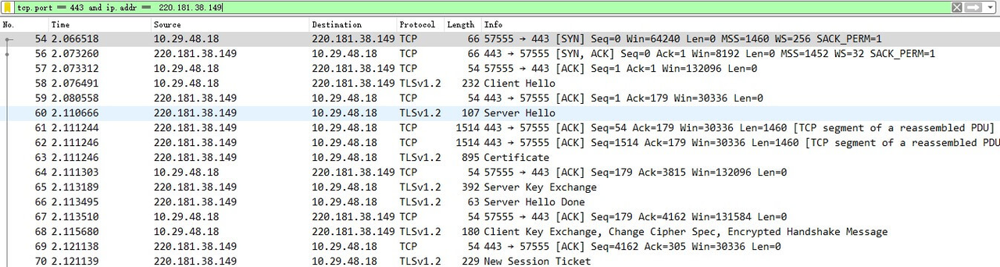


遇到凡事不要慌，接下来待我给你慢慢道来（ack消息属于tcp协议里面的确认报文，不做解释）


第一步


第二步：客户端发送client\_hello


> 解释说明：客户端发送client\_hello，包含以下内容（请自行对照上图） 1. 包含TLS版本信息 2. 随机数（用于后续的密钥协商）random\_C 3. 加密套件候选列表 4. 压缩算法候选列表 5. 扩展字段 6. 其他


第三步：服务端发送server\_hello


> 解释说明：服务端收到客户端的client\_hello之后，发送server\_hello，并返回协商的信息结果 1. 选择使用的TLS协议版本 version 2. 选择的加密套件 cipher suite 3. 选择的压缩算法 compression method 4. 随机数 random\_S 5. 其他


第四步：服务端发送证书


> 解释说明：服务端发送完server\_hello后，紧接着开始发送自己的证书（不清楚证书是什么的，可以移步到[上一篇文章](https://juejin.cn/post/6845166890675863559)），从图可知：因包含证书的报文长度是3761，所以此报文在tcp这块做了分段，分了3个报文把证书发送完了
>
> 问自己： 1. 分段的标准是什么？ 2. 什么时候叫分段，什么时候叫分片？ 3. 什么是MTU，什么是MSS


第五步：服务端发送Server Key Exchange


第六步：服务端发送Server Hello Done


> 解释说明:通知客户端 server\_hello 信息发送结束


第七步：客户端发送.client\_key\_exchange+change\_cipher\_spec+encrypted\_handshake\_message


> 解释说明: 1. client\_key\_exchange，合法性验证通过之后，向服务器发送自己的公钥参数，这里客户端实际上已经计算出了密钥 2. change\_cipher\_spec，客户端通知服务器后续的通信都采用协商的通信密钥和加密算法进行加密通信 3. encrypted\_handshake\_message，主要是用来测试密钥的有效性和一致性

第八步：服务端发送New Session Ticket


> 解释说明:服务器给客户端一个会话，用处就是在一段时间之内（超时时间到来之前），双方都以协商的密钥进行通信。

第九步：服务端发送change\_cipher\_spec


> 解释说明:服务端解密客户端发送的参数，然后按照同样的算法计算出协商密钥，并通过客户端发送的encrypted\_handshake\_message验证有效性，验证通过，发送该报文，告知客户端，以后可以拿协商的密钥来通信了

第十步：服务端发送encrypted\_handshake\_message


> 解释说明:目的同样是测试密钥的有效性，客户端发送该报文是为了验证服务端能正常解密，客户端能正常加密，相反：服务端发送该报文是为了验证客户端能正常解密，服务端能正常加密

第十一步：完成密钥协商，开始发送数据


> 解释说明：数据同样是分段发送的

第十二步：完成数据发送，4次tcp挥手


> 解释说明：红框的意思是：客户端或服务器发送的，意味着加密通信因为某些原因需要中断，警告对方不要再发送敏感的数据,服务端数据发送完成也会有此数据包，可不关注


***

## 54. HTTP2中，多路复用的原理是什么？


**参考答案：**

HTTP/2是一个二进制协议，其基于“帧”的结构设计，改进了很多HTTP/1.1痛点问题。


什么是多路复用？

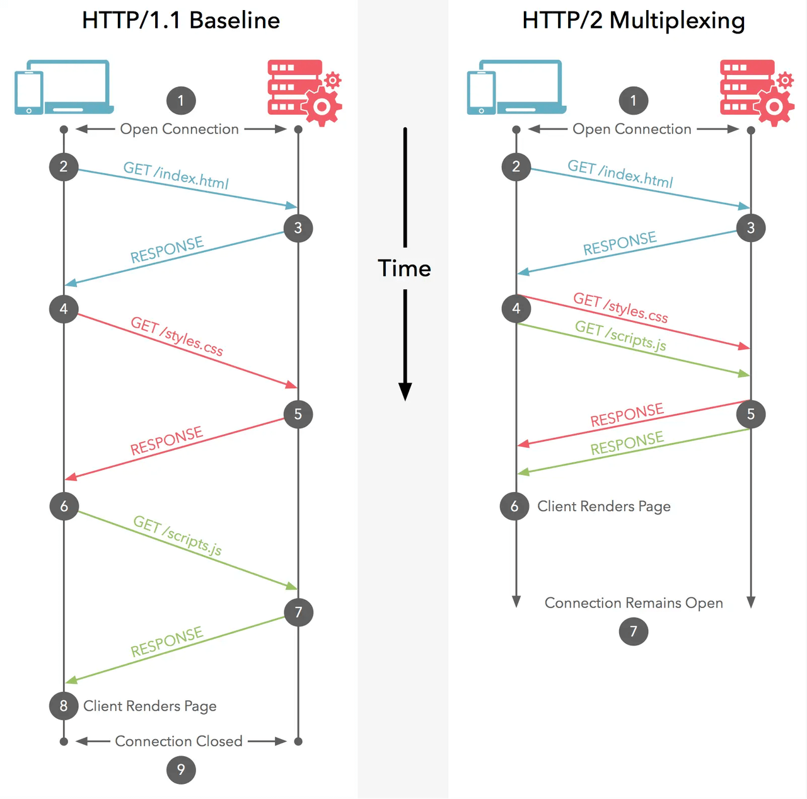

HTTP/1.1协议的请求-响应模型大家都是熟悉的，我们用“HTTP消息”来表示一个请求-响应的过程，那么HTTP/1.1中的消息是“管道串形化”的：只有等一个消息完成之后，才能进行下一条消息；而HTTP/2中多个消息交织在了一起，这无疑提高了“通信”的效率。这就是多路复用：在一个HTTP的连接上，多路“HTTP消息”同时工作。


为什么 `HTTP/1.1` 不能实现“多路复用”？

简单回答就是：`HTTP/2` 是基于二进制“帧”的协议，HTTP/1.1是基于“文本分割”解析的协议。

`HTTP/1.1` 发送请求消息的文本格式：以换行符分割每一条 `key:value` 的内容，解析这种数据用不着什么高科技，相反的，解析这种数据往往速度慢且容易出错。“服务端”需要不断的读入字节，直到遇到分隔符（这里指换行符，代码中可能使用/n或者/r/n表示），这种解析方式是可行的，并且 `HTTP/1.1` 已经被广泛使用了二十多年，这事已经做过无数次了，问题一直都是存在的：

* 一次只能处理一个请求或响应，因为这种以分隔符分割消息的数据，在完成之前不能停止解析。

* 解析这种数据无法预知需要多少内存，这会带给“服务端”很大的压力，因为它不知道要把一行要解析的内容读到多大的“缓冲区”中，在保证解析效率和速度的前提下：内存该如何分配？


HTTP/2帧结构设计和多路复用实现

前边提到：HTTP/2设计是基于“二进制帧”进行设计的，这种设计无疑是一种“高超的艺术”，因为它实现了一个目的：一切可预知，一切可控。

帧是一个数据单元，实现了对消息的封装。下面是HTTP/2的帧结构：

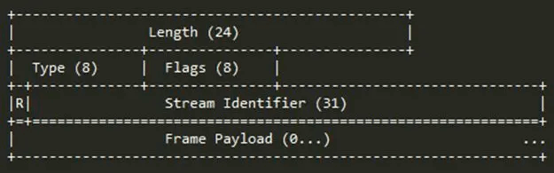

帧的字节中保存了不同的信息，前9个字节对于每个帧都是一致的，“服务器”解析HTTP/2的数据帧时只需要解析这些字节，就能准确的知道整个帧期望多少字节数来进行处理信息。

如果使用HTTP/1.1的话，你需要发送完上一个请求，才能发送下一个；由于HTTP/2是分帧的，请求和响应可以交错甚至可以复用。 为了能够发送不同的“数据信息”，通过帧数据传递不同的内容，HTTP/2中定义了10种不同类型的帧。

有了以上对HTTP/2帧的了解，我们就可以解释多路复用是怎样实现的了，不过在这之前我们先来了解“流”的概念：HTTP/2连接上独立的、双向的帧序列交换。流ID（帧首部的6-9字节）用来标识帧所属的流

下面两张图分别表示了HTTP/2协议上POST请求数据流“复用”的过程，很容易看的明白：


***

## 55. 说说你对“三次握手”、“四次挥手”的理解


**参考答案：**

我们都知道TCP是面向连接的，`三次握手`就是用来建立连接的，`四次握手`就是用来断开连接的。


三次握手


我们来看一下三次握手的过程：

* 一开始，客户端和服务端都处于 `CLOSED` 状态。客户端主动打开连接，服务端被动打卡连接，结束`CLOSED` z状态，开始监听，进入 `LISTEN `状态。

一次握手

* 客户端会随机初始化序号（`client_isn`），将此序号置于 TCP 首部的「序号」字段中，同时把 `SYN` 标志位置为 `1` ，表示 `SYN` 报文。接着把第一个 SYN 报文发送给服务端，表示向服务端发起连接，该报文不包含应用层数据，之后客户端处于 `SYN-SENT` 状态。

二次握手

* 服务端收到客户端的 `SYN` 报文后，首先服务端也随机初始化自己的序号（`server_isn`），将此序号填入 TCP 首部的「序号」字段中，其次把 TCP 首部的「确认应答号」字段填入 `client_isn + 1`, 接着把 `SYN` 和 `ACK` 标志位置为 `1`。最后把该报文发给客户端，该报文也不包含应用层数据，之后服务端处于 `SYN-RCVD` 状态。

三次握手

* 客户端收到服务端报文后，还要向服务端回应最后一个应答报文，首先该应答报文 TCP 首部 `ACK` 标志位置为 `1` ，其次「确认应答号」字段填入 `server_isn + 1` ，最后把报文发送给服务端，这次报文可以携带客户到服务器的数据，之后客户端处于 `ESTABLISHED` 状态。

好了，经过三次握手的过程，客户端和服务端之间的确定连接正常，接下来进入`ESTABLISHED`状态，服务端和客户端就可以快乐地通信了。

这里有个小细节，第三次握手是可以携带数据的，这是面试常问的点。

> 那么为什么要三次握手呢？两次不行吗？

* 为了防止服务器端开启一些无用的连接增加服务器开销

* 防止已失效的连接请求报文段突然又传送到了服务端，因而产生错误。

由于网络传输是有延时的(要通过网络光纤和各种中间代理服务器)，在传输的过程中，比如客户端发起了 SYN=1 的第一次握手。

如果服务器端就直接创建了这个连接并返回包含 SYN、ACK 和 Seq 等内容的数据包给客户端，这个数据包因为网络传输的原因丢失了，丢失之后客户端就一直没有接收到服务器返回的数据包。

如果没有第三次握手告诉服务器端客户端收的到服务器端传输的数据的话，服务器端是不知道客户端有没有接收到服务器端返回的信息的。服务端就认为这个连接是可用的，端口就一直开着，等到客户端因超时重新发出请求时，服务器就会重新开启一个端口连接。

这样一来，就会有很多无效的连接端口白白地开着，导致资源的浪费。

这个过程可理解为：


还有一种情况是已经失效的客户端发出的请求信息，由于某种原因传输到了服务器端，服务器端以为是客户端发出的有效请求，接收后产生错误。


所以我们需要“第三次握手”来确认这个过程：

通过第三次握手的数据告诉服务端，客户端有没有收到服务器“第二次握手”时传过去的数据，以及这个连接的序号是不是有效的。若发送的这个数据是“`收到且没有问题`”的信息，接收后服务器就正常建立 TCP 连接，否则建立 TCP 连接失败，服务器关闭连接端口。由此减少服务器开销和接收到失效请求发生的错误。


四次挥手

还是先上图：

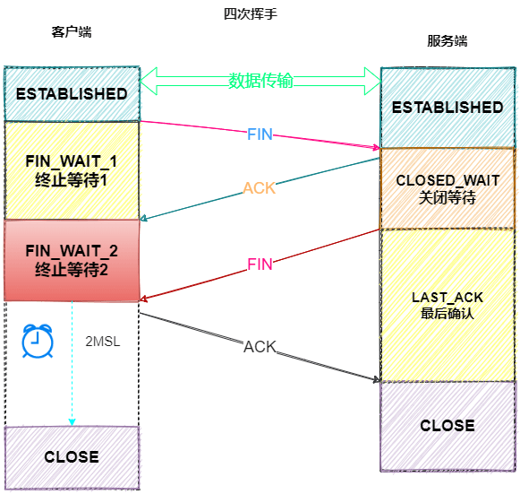

聚散终有时，TCP 断开连接是通过四次挥手方式。

`双方`都可以主动断开连接，断开连接后主机中的「资源」将被释放。

上图是客户端主动关闭连接 ：

一次挥手

* 客户端打算关闭连接，此时会发送一个 TCP 首部 `FIN` 标志位被置为 `1` 的报文，也即 `FIN` 报文，之后客户端进入 `FIN_WAIT_1` 状态。

二次挥手

* 服务端收到该报文后，就向客户端发送 `ACK` 应答报文，接着服务端进入 `CLOSED_WAIT` 状态。

三次挥手

* 客户端收到服务端的 `ACK` 应答报文后，之后进入 `FIN_WAIT_2` 状态。等待服务端处理完数据后，也向客户端发送 `FIN` 报文，之后服务端进入 `LAST_ACK` 状态。

四次挥手

* 客户端收到服务端的 `FIN` 报文后，回一个 `ACK` 应答报文，之后进入 `TIME_WAIT` 状态

* 服务器收到了 `ACK` 应答报文后，就进入了 `CLOSED` 状态，至此服务端已经完成连接的关闭。

* 客户端在经过 `2MSL` 一段时间后，自动进入 `CLOSED` 状态，至此客户端也完成连接的关闭。

你可以看到，每个方向都需要一个 FIN 和一个 ACK，因此通常被称为四次挥手。

> 为什么要挥手四次？

再来回顾下四次挥手双方发 `FIN` 包的过程，就能理解为什么需要四次了。

* 关闭连接时，客户端向服务端发送 `FIN` 时，仅仅表示客户端不再发送数据了但是还能接收数据。

* 服务器收到客户端的 `FIN` 报文时，先回一个 `ACK` 应答报文，而服务端可能还有数据需要处理和发送，等服务端不再发送数据时，才发送 `FIN` 报文给客户端来表示同意现在关闭连接。

从上面过程可知，服务端通常需要等待完成数据的发送和处理，所以服务端的 `ACK` 和 `FIN` 一般都会分开发送，从而比三次握手导致多了一次。

> 为什么客户端在TIME-WAIT阶段要等2MSL？

为的是确认服务器端是否收到客户端发出的 ACK 确认报文，当客户端发出最后的 ACK 确认报文时，并不能确定服务器端能够收到该段报文。

所以客户端在发送完 ACK 确认报文之后，会设置一个时长为 2MSL 的计时器。

MSL 指的是 Maximum Segment Lifetime：一段 TCP 报文在传输过程中的最大生命周期。

2MSL 即是服务器端发出为 FIN 报文和客户端发出的 ACK 确认报文所能保持有效的最大时长。

服务器端在 1MSL 内没有收到客户端发出的 ACK 确认报文，就会再次向客户端发出 FIN 报文：

* 如果客户端在 2MSL 内，再次收到了来自服务器端的 FIN 报文，说明服务器端由于各种原因没有接收到客户端发出的 ACK 确认报文。

客户端再次向服务器端发出 ACK 确认报文，计时器重置，重新开始 2MSL 的计时。

* 否则客户端在 2MSL 内没有再次收到来自服务器端的 FIN 报文，说明服务器端正常接收了 ACK 确认报文，客户端可以进入 CLOSED 阶段，完成“四次挥手”。

所以，客户端要经历时长为 2SML 的 TIME-WAIT 阶段;这也是为什么客户端比服务器端晚进入 CLOSED 阶段的原因。


***

## 56. 如何确保你的构造函数只能被new调用，而不能被普通调用？


**参考答案：**

明确函数的双重用途

`JavaScript` 中的函数一般有两种使用方式:

* 当作构造函数使用: `new Func()`

* 当作普通函数使用: `Func()`

但 `JavaScript` 内部并没有区分两者的方式，我们人为规定构造函数名首字母要大写作为区分。也就是说，构造函数被当成普通函数调用不会有报错提示。

下面来举个例子:

```javascript
// 定义构造函数 Person
function Person(firstName, lastName) {
    this.firstName = firstName;
    this.lastName = lastName;
    this.fullName = this.firstName + this.lastName;
}
// 使用 new 调用
console.log(new Person("创客", "学院"));
// 当作普通函数调用
console.log(Person("创客", "学院"))
```

通过输出结果可以发现，定义的构造函数被当作普通函数来调用，没有任何错误提示。


使用 instanceof 实现

instanceof 基础知识

`instanceof` 运算符用于检测构造函数的 `prototype` 属性是否出现在某个实例对象的原型链上。

使用语法:

```javascript
object instanceof constructor
```

我们可以使用 `instanceof` 检测某个对象是不是另一个对象的实例，例如 `new Person() instanceof Person --> true`


new 绑定/ 默认绑定

* 通过 `new` 来调用构造函数，会生成一个新对象，并且把这个新对象绑定为调用函数的 `this` 。

* 如果普通调用函数，非严格模式 `this` 指向 `window`，严格模式指向 `undefined`

```javascript
function Test() {
    console.log(this)
}
// Window {...}
console.log(Test())
// Test {}
console.log(new Test())
```

使用 `new` 调用函数和普通调用函数最大的区别在于函数内部 `this` 指向不同: `new` 调用后 `this` 指向实例，普通调用则会指向 `window`。

`instanceof` 可以检测某个对象是不是另一个对象的实例。如果为 `new` 调用， `this` 指向实例，this instanceof 构造函数 返回值为 `true` ，普通调用返回值为 `false`。

代码实现

```javascript
function Person(firstName, lastName) {
    // this instanceof Person
    // 如果返回值为 false，说明为普通调用
    // 返回类型错误信息——当前构造函数需要使用 new 调用
    if (!(this instanceof Person)) {
        throw new TypeError('Function constructor A cannot be invoked without "new"')
    }
    this.firstName = firstName;
    this.lastName = lastName;
    this.fullName = this.firstName + this.lastName;
}
// 当作普通函数调用
// Uncaught TypeError: Function constructor A cannot be invoked without "new"
console.log(Person("战场", "小包"));
```

通过输出结果，我们可以发现，定义的 `Person` 构造函数已经无法被普通调用了。撒花\~\~\~

但这种方案并不是完美的，存在一点小小的瑕疵。我们可以通过伪造实例的方法骗过构造函数里的判断。

具体实现: `JavaScript` 提供的 `apply/call` 方法可以修改 `this` 指向，如果调用时将 `this` 指向修改为 `Person` 实例，就可以成功骗过上面的语法。

```javascript
// 输出结果 undefined
console.log(Person.call(new Person(), "战场", "小包"));
```

这点瑕疵虽说无伤大雅，但经过小包的学习，`ES6` 中提供了更好的方案。


new.target

`JavaScript` 官方也发现了这个让人棘手的问题，因此 `ES6` 中提供了 `new.target` 属性。

《ECMAScript 6 入门》中讲到: `ES6` 为 `new` 命令引入了一个 `new.target` 属性，该属性一般用在构造函数之中，返回 `new` 命令作用于的那个构造函数。如果构造函数不是通过 `new` 命令或 `Reflect.construct()` 调用的，`new.target` 会返回 `undefined` ，因此这个属性可以用来确定构造函数是怎么调用的。

`new.target` 就是为确定构造函数的调用方式而生的，太符合这个场景了，我们来试一下 `new.target` 的用法。

```javascript
function Person() {
    console.log(new.target);
}
// new: Person {}
console.log("new: ",new Person())
// not new: undefined
console.log("not new:", Person())
```

所以我们就可以使用 `new.target` 来非常简单的实现对构造函数的限制。

```javascript
function Person() {
    if (!(new.target)) {
        throw new TypeError('Function constructor A cannot be invoked without "new"')
    }
}
// Uncaught TypeError: Function constructor A cannot be invoked without "new"
console.log("not new:", Person())
```

使用ES6 Class

类也具备限制构造函数只能用 `new` 调用的作用。

`ES6` 提供 `Class` 作为构造函数的语法糖，来实现语义化更好的面向对象编程，并且对 `Class` 进行了规定：类的构造器必须使用 new 来调用。

因此后续在进行面向对象编程时，强烈推荐使用 `ES6` 的 `Class`。 `Class` 修复了很多 `ES5` 面向对象编程的缺陷，例如类中的所有方法都是不可枚举的；类的所有方法都无法被当作构造函数使用等。

```javascript
class Person {
    constructor (name) {
        this.name = name;
    }
}
// Uncaught TypeError: Class constructor Person cannot be invoked without 'new'
console.log(Person())
```

学到这里我就不由得好奇了，既然 `Class` 必须使用 `new` 来调用，那提供 `new.target` 属性的意义在哪里？


new.target 实现抽象类

首先来看一下 `new.target` 在类中使用会返回什么？

```javascript
class Person {
    constructor (name) {
        this.name = name;
        console.log(new.target)
    }
}
new Person()
```

`Class` 内部调用 `new.target`，会返回当前 `Class`。

《ECMAScript 6 入门》中又讲到: 需要注意的是，子类继承父类时，`new.target`会返回子类。继承中的 `new.target` 好像有不一样的花样，我们来试一下。

```javascript
class Animal {
    constructor (type, name, age) {
        this.type = type;
        this.name = name;
        this.age = age;
        console.log(new.target)
    }
}
// extends 是 Class 中实现继承的关键字
class Dog extends Animal {
    constructor(name, age) {
        super("dog", "baobao", "1")
    }
}
const dog = new Dog()
```

通过上面案例，我们可以发现子类调用和父类调用的返回结果是不同的，我们利用这个特性，就可以实现父类不可调用而子类可以调用的情况——面向对象中的抽象类


抽象类实现

什么是抽象类那？我们以动物世界为例。

我们定义了一个动物类 `Animal`，并且通过这个类来创建动物，动物是个抽象概念，当你提到动物类时，你并不知道我会创建什么动物。只有将动物实体化，比如说猫，狗，猪啊，这才是具体的动物，并且每个动物的行为都会有所不同。因此我们不应该通过创建 `Animal` 实例来生成动物，`Animal` 只是动物抽象概念的集合。

`Animal` 就是一个抽象类，我们不应该通过它来生成动物，而是通过它的子类，例如 `Dog、Cat` 等来生成对应的 `dog/cat` 实例。

`new.target` 子类调用和父类调用的返回值是不同的，所以我们可以借助 `new.target` 实现抽象类

> 抽象类也可以理解为不能独立使用、必须继承后才能使用的类。

```javascript
class Animal {
    constructor (type, name, age) {
        if (new.target === Animal) {
            throw new TypeError("abstract class cannot new")
        }
        this.type = type;
        this.name = name;
        this.age = age;
    }
}
// extends 是 Class 中实现继承的关键字
class Dog extends Animal {
    constructor(name, age) {
        super("dog", "baobao", "1")
    }
}
// Uncaught TypeError: abstract class cannot new
const dog = new Animal("dog", "baobao", 18)
```

总结

本文介绍了三种限制构造函数只能被 `new` 调用的方案

* 借助 `instanceof` 和 `new` 绑定的原理，适用于低版本浏览器

* 借助 `new.target` 属性，可与 `class` 配合定义抽象类

* 面向对象编程使用 `ES6 class`——最佳方案


***

## 57. 为什么推荐将静态资源放到cdn上？


**参考答案：**

静态资源是什么

静态资源

静态资源是指在不同请求中访问到的数据都相同的静态文件。例如：图片、视频、网站中的文件（html、css、js）、软件安装包、apk文件、压缩包文件等。

动态资源

动态资源是指在不同请求中访问到的数据不相同的动态内容。例如：网站中的文件（asp、jsp、php、perl、cgi）、API接口、数据库交互请求等。


CDN是什么

内容分发网络，Content Delivery Network或Content Ddistribute Network，简称CDN，是建立并覆盖在承载网之上，由分布在不同区域的边缘节点服务器群组成的分布式网络。

CDN加速的本质是缓存加速。将服务器上存储的静态内容缓存在CDN节点上，当访问这些静态内容时，无需访问服务器源站，就近访问CDN节点即可获取相同内容，从而达到加速的效果，同时减轻服务器源站的压力。

CDN应用广泛，解决因分布、带宽、服务器性能带来的访问延迟问题，适用于站点加速、点播、直播等场景。使用户可就近取得所需内容，解决 Internet网络拥挤的状况，提高用户访问网站的响应速度和成功率。

由于访问动态内容时，每次都需要访问服务器，由服务器动态生成实时的数据并返回。因此CDN的缓存加速不适用于加速动态内容，CDN无法缓存实时变化的动态内容。对于动态内容请求，CDN节点只能转发回服务器源站，没有加速效果。


CDN的作用

1. 加速网站的访问

2. 为了实现跨运营商、跨地域的全网覆盖

互联不互通、区域ISP地域局限、出口带宽受限制等种种因素都造成了网站的区域性无法访问。CDN加速可以覆盖全球的线路，通过和运营商合作，部署IDC资源，在全国骨干节点商，合理部署CDN边缘分发存储节点，充分利用带宽资源，平衡源站流量。

* 为了保障你的网站安全

CDN的负载均衡和分布式存储技术，可以加强网站的可靠性，相当无无形中给你的网站添加了一把保护伞，应对绝大部分的互联网攻击事件。防攻击系统也能避免网站遭到恶意攻击。

* 为了异地备援

当某个服务器发生意外故障时，系统将会调用其他临近的健康服务器节点进行服务，进而提供接近100%的可靠性，这就让你的网站可以做到永不宕机。

* 为了节约成本投入

使用CDN加速可以实现网站的全国铺设，你根据不用考虑购买服务器与后续的托管运维，服务器之间镜像同步，也不用为了管理维护技术人员而烦恼，节省了人力、精力和财力。

* 为了让你更专注业务本身

CDN加速厂商一般都会提供一站式服务，业务不仅限于CDN，还有配套的云存储、大数据服务、视频云服务等，而且一般会提供7x24运维监控支持，保证网络随时畅通，你可以放心使用。并且将更多的精力投入到发展自身的核心业务之上。


CDN工作原理

* 当用户点击网站页面上的内容URL，经过本地DNS系统解析，DNS系统会最终将域名的解析权交给CNAME指向的CDN专用DNS服务器。

* CDN的DNS服务器将CDN的全局负载均衡设备IP地址返回用户。

* 用户向CDN的全局负载均衡设备发起内容URL访问请求。

* CDN全局负载均衡设备根据用户IP地址，以及用户请求的内容URL，选择一台用户所属区域的区域负载均衡设备，告诉用户向这台设备发起请求。

* 区域负载均衡设备会为用户选择一台合适的缓存服务器提供服务，选择的依据包括：根据用户IP地址，判断哪一台服务器距用户最近；根据用户所请求的URL中携带的内容名称，判断哪一台服务器上有用户所需内容；查询各个服务器当前的负载情况，判断哪一台服务器尚有服务能力。基于以上这些条件的综合分析之后，区域负载均衡设备会向全局负载均衡设备返回一台缓存服务器的IP地址。

* 全局负载均衡设备把服务器的IP地址返回给用户。

* 用户向缓存服务器发起请求，缓存服务器响应用户请求，将用户所需内容传送到用户终端。如果这台缓存服务器上并没有用户想要的内容，而区域均衡设备依然将它分配给了用户，那么这台服务器就要向它的上一级缓存服务器请求内容，直至追溯到网站的源服务器将内容拉到本地。

DNS服务器根据用户IP地址，将域名解析成相应节点的缓存服务器IP地址，实现用户就近访问。使用CDN服务的网站，只需将其域名解析权交给CDN的GSLB设备，将需要分发的内容注入CDN，就可以实现内容加速了。


当没有CDN时

今天我们看到的网站系统基本上都是基于B/S架构的。B/S架构，即Browser-Server（浏览器 服务器）架构。

用户通过浏览器等方式访问网站的过程：

* 用户在自己的浏览器中输入要访问的网站域名。

* 浏览器向本地DNS服务器请求对该域名的解析。

* 本地DNS服务器中如果缓存有这个域名的解析结果，则直接响应用户的解析请求。

* 本地DNS服务器中如果没有关于这个域名的解析结果的缓存，则以递归方式向整个DNS系统请求解析，获得应答后将结果反馈给浏览器。

* 浏览器得到域名解析结果，就是该域名相应的服务设备的IP地址。

* 浏览器向服务器请求内容。

* 服务器将用户请求内容传送给浏览器。

***

## 58. 说说React事件和原生事件的执行顺序


**参考答案：**

我们知道，`React`在内部对事件做了统一的处理，合成事件是一个比较大的概念

为什么要有合成事件

1. 在传统的事件里，不同的浏览器需要兼容不同的写法，在合成事件中`React`提供统一的事件对象，抹平了浏览器的兼容性差异

2. `React`通过顶层监听的形式，通过事件委托的方式来统一管理所有的事件，可以在事件上区分事件优先级，优化用户体验

`React`在合成事件上对于`16`版本和`17`版本的合成事件有很大不同，我们也会简单聊聊区别。


概念

事件委托

事件委托的意思就是可以通过给父元素绑定事件委托，通过事件对象的`target`属性可以获取到当前触发目标阶段的`dom`元素，来进行统一管理

比如写原生`dom`循环渲染的时候，我们要给每一个子元素都添加`dom`事件，这种情况最简单的方式就是通过事件委托在父元素做一次委托，通过`target`属性判断区分做不同的操作

事件监听

事件监听主要用到了`addEventListener`这个函数，具体怎么用可以[点击](https://developer.mozilla.org/zh-CN/docs/Web/API/EventTarget/addEventListener)进行查看 事件监听和事件绑定的最大区别就是事件监听可以给一个事件监听多个函数操作，而事件绑定只有一次

```javascript
// 可以监听多个，不会被覆盖
eventTarget.addEventListener('click', () => {});
eventTarget.addEventListener('click', () => {});

eventTarget.onclick = function () {};
eventTarget.onclick = function () {}; // 第二个会把第一个覆盖
```

事件执行顺序

```javascript
<div>
  <span>点我</span>
</div>
```

当我们点击`span`标签的时候会经过这么三个过程，在路径内的元素绑定的事件都会进行触发

> 捕获阶段 => 目标阶段 => 冒泡阶段


合成事件

在看之前先看一下这几个问题

* 原生事件和合成事件的执行顺序是什么？

* 合成事件在什么阶段下会被执行？

* 阻止原生事件的冒泡，会影响到合成事件的执行吗？

* 阻止合成事件的冒泡，会影响到原生事件的执行吗？

下面一个例子说清楚，

```javascript
import React, { useRef, useEffect } from "react";
import "./styles.css";

const logFunc = (target, isSynthesizer, isCapture = false) => {
    const info = `${isSynthesizer ? "合成" : "原生"}事件，${
        isCapture ? "捕获" : "冒泡"}阶段，${target}元素执行了`;
    
    console.log(info);
};

const batchManageEvent = (targets, funcs, isRemove = false) => {
    targets.forEach((target, targetIndex) => {
        funcs[targetIndex].forEach((func, funcIndex) => {
            target[isRemove ? "removeEventListener" : "addEventListener"](
                "click",
                func,
                !funcIndex
            );
        });
    });
};

export default function App() {
    const divDom = useRef();
    const h1Dom = useRef();
    useEffect(() => {
    
        const docClickCapFunc = () => logFunc("document", false, true);
        const divClickCapFunc = () => logFunc("div", false, true);
        const h1ClickCapFunc = () => logFunc("h1", false, true);
        const docClickFunc = () => logFunc("document", false);
        const divClickFunc = () => logFunc("div", false);
        const h1ClickFunc = () => logFunc("h1", false);

        batchManageEvent(
            [document, divDom.current, h1Dom.current],
            [
                [docClickCapFunc, docClickFunc],
                [divClickCapFunc, divClickFunc],
                [h1ClickCapFunc, h1ClickFunc]
            ]
        );

        return () => {
            batchManageEvent(
                   [document, divDom.current, h1Dom.current],
                [
                    [docClickCapFunc, docClickFunc],
                    [divClickCapFunc, divClickFunc],
                    [h1ClickCapFunc, h1ClickFunc]
                ],
                true
            );
        };
    }, []);

    return (
        <div
          ref={divDom}
          className="App1"
          onClickCapture={() => logFunc("div", true, true)}
          onClick={() => logFunc("div", true)}
        >
          <h1
            ref={h1Dom}
            onClickCapture={() => logFunc("h1", true, true)}
            onClick={() => logFunc("h1", true)}
          >
            Hello CodeSandbox
          </h1>
        </div>
    );
}
```

看这个例子，当我们点击`h1`的时候

会先执行原生事件事件流，当执行到`document`的冒泡阶段的时候做了个拦截，在这个阶段开始执行合成事件

知道上面的概念，那我们回答开始阶段的后面两个问题

当我们把上面的`demo`的原生`div`的`stopPropagation()`  方法调用阻止捕获和冒泡阶段中当前事件的进一步传播，会阻止后续的所有事件执行

```javascript
// ...
const divClickCapFunc = (e) => {
    e.stopPropagation(); // 增加原生捕获阶段的阻止事件
    logFunc("div", false, true);
};
// ...
```

我们可以看到，当阻止之后，我们点击`h1`，事件流运行到`div`的捕获阶段就不触发了，后续的所有的包括合成事件也都不会触发

那当我们给合成事件的事件流中断了会发生什么呢？

可以看到运行到捕获阶段的`div`之后被阻止传播了，后续的所有合成事件都不会执行了，但是原生的`document`冒泡还是会执行完。


模拟阶段

```javascript
<!DOCTYPE html>
<html lang="en">
  <head>
    <meta charset="utf-8" />
    <meta name="viewport" content="width=device-width, initial-scale=1.0, maximum-scale=1.0, maximum-scale=1, user-scalable=no" />
    <meta name="theme-color" content="#000000" />
    <meta name="description" content="Web site created using create-react-app" />
    <link href="favicon.ico" type="image/x-icon" rel="icon" />
    <title>浅谈React合成事件</title>
  </head>
  <body>
    <div id="wrapper">
      <h1 id="content">hello</h1>
    </div>
  </body>
  <script>
    const logFunc = (target, isSynthesizer, isCapture = false) => {
      const info = `${isSynthesizer ? '合成' : '原生'}事件，${isCapture ? '捕获' : '冒泡'}阶段，${target}元素执行了`;
      console.log(info);
    };
    // document的派发事件函数
    const dispatchEvent = currentDom => {
      let current = currentDom;
      let eventCallbacks = []; // 存储冒泡事件回调函数
      let eventCaptureCallbacks = []; // 存储冒泡事件回调函数
      // 收集事件流一路上的所有回调函数
      while (current) {
        if (current.onClick) {
          eventCallbacks.push(current.onClick);
        }
        if (current.onClickCapture) {
          // 捕获阶段由外到内，所以需要把回调函数放到数组的最前面
          eventCaptureCallbacks.unshift(current.onClickCapture);
        }
        current = current.parentNode;
      }
      // 执行调用
      eventCaptureCallbacks.forEach(callback => callback());
      eventCallbacks.forEach(callback => callback());
    };
    const wrapperDom = document.getElementById('wrapper');
    const contentDom = document.getElementById('content');

    // 一路上注册原生事件
    document.addEventListener('click', () => logFunc('document', false, true), true);
    wrapperDom.addEventListener('click', () => logFunc('div', false, true), true);
    contentDom.addEventListener('click', () => logFunc('h1', false, true), true);
    contentDom.addEventListener('click', () => logFunc('h1', false));
    wrapperDom.addEventListener('click', () => logFunc('div', false));
    document.addEventListener('click', e => {
      dispatchEvent(e.target); // 这里收集一路上的事件进行派发
      logFunc('document', false);
    });

    // 模拟合成事件
    wrapperDom.onClick = () => logFunc('div', true);
    wrapperDom.onClickCapture = () => logFunc('div', true, true);
    contentDom.onClick = () => logFunc('h1', true);
    contentDom.onClickCapture = () => logFunc('h1', true, true);
  </script>
</html>
```

点击`h1`可以看到一路上的注册的所有事件已经执行了

`React16`给`document`上加的统一的拦截判发事件会在一定情况下出问题，下面举个例子简单说明一下


16案例

```javascript
import React, { useEffect, useState } from 'react';
import './styles.css';

const Modal = ({ onClose }) => {
  useEffect(() => {
    document.addEventListener('click', onClose);
    return () => {
      document.removeEventListener('click', onClose);
    };
  }, [onClose]);
  return (
    <div
      style=\{{ width: 300, height: 300, backgroundColor: 'red' \}}
      onClick={e => {
        e.stopPropagation();
        // e.nativeEvent.stopImmediatePropagation();
      \}}
    >
      Modal
    </div>
  );
};

function App() {
  const [visible, setVisible] = useState(false);
  return (
    <div className="App">
      <button
        onClick={() => {
          setVisible(true);
        \}}
      >
        点我弹出modal
      </button>
      {visible && <Modal onClose={() => setVisible(false)} />}
    </div>
  );
}
export default App;
```

写完之后点击按钮`Modal`被弹出来, 但是点击`modal`里面的内容`modal`就隐藏了，添加阻止事件流函数还是不行

原因就是点击之后，事件冒泡到`document`上，同时也执行了他身上挂载的方法，解决办法就是给点击事件添加 `e.nativeEvent.stopImmediatePropagation();`

`stopImmediatePropagation`和`stopPropagation`的区别就是，前者会阻止当前节点下所有的事件监听的函数，后者不会

那`react17`及之后做了什么改变呢


16和17的区别

在`17`版本中，`React`把事件节点绑定函数绑定在了`render`的根节点上，避免了上述的问题,

用上面的`demo`的在线案例把版本改成17之后，可以发现事件的执行顺序变了


模拟17版本

```javascript
<!DOCTYPE html>
<html lang="en">
  <head>
    <meta charset="utf-8" />
    <meta name="viewport" content="width=device-width, initial-scale=1.0, maximum-scale=1.0, maximum-scale=1, user-scalable=no" />
    <meta name="theme-color" content="#000000" />
    <meta name="description" content="Web site created using create-react-app" />
    <link href="favicon.ico" type="image/x-icon" rel="icon" />
    <title>浅谈React合成事件</title>
  </head>
  <body>
    <div id="root">
      <div id="wrapper">
        <h1 id="content">hello</h1>
      </div>
    </div>
  </body>
  <script>
    const logFunc = (target, isSynthesizer, isCapture = false) => {
      const info = `${isSynthesizer ? '合成' : '原生'}事件，${isCapture ? '捕获' : '冒泡'}阶段，${target}元素执行了`;
      console.log(info);
    };
    // document的派发事件函数
    const dispatchEvent = (currentDom, useCapture = false) => {
      let current = currentDom;
      let eventCallbacks = []; // 存储冒泡事件回调函数
      const eventTypeName = useCapture ? 'onClickCapture' : 'onClick'; // 冒泡事件或者捕获事件的名称
      const actionName = useCapture ? 'unshift' : 'push';
      while (current) {
        if (current[eventTypeName]) {
          eventCallbacks[actionName](current[eventTypeName]);
        }
        current = current.parentNode;
      }
      eventCallbacks.forEach(callback => callback());
    };
    const wrapperDom = document.getElementById('wrapper');
    const contentDom = document.getElementById('content');
    const root = document.getElementById('root');

    // 一路上注册原生事件
    document.addEventListener('click', () => logFunc('document', false, true), true);
    root.addEventListener(
      'click',
      e => {
        dispatchEvent(e.target, true);
        logFunc('root', false, true);
      },
      true
    );
    wrapperDom.addEventListener('click', () => logFunc('div', false, true), true);
    contentDom.addEventListener('click', () => logFunc('h1', false, true), true);
    contentDom.addEventListener('click', () => logFunc('h1', false));
    wrapperDom.addEventListener('click', () => logFunc('div', false));
    root.addEventListener('click', e => {
      dispatchEvent(e.target); // 这里收集一路上的事件进行派发
      logFunc('root', false);
    });
    document.addEventListener('click', () => logFunc('document', false));
    // 模拟合成事件
    wrapperDom.onClick = () => logFunc('div', true);
    wrapperDom.onClickCapture = () => logFunc('div', true, true);
    contentDom.onClick = () => logFunc('h1', true);
    contentDom.onClickCapture = () => logFunc('h1', true, true);
  </script>
</html>
```

区别就是在外层增加了一个`root`模拟根节点，修改了`dispatchEvent`的逻辑

可以看到，效果已经和`17`版本的一样了

回看`16demo`，切换版本到`17`，当我们切换到`17`的时候，用`stopPropagation`就可以解决问题了, 原因就是他在`root`节点上绑定的事件冒泡函数，`stopPropagation`切断了事件流，不会流向到`document`身上了


总结

* `16`版本先执行原生事件，当冒泡到`document`时，统一执行合成事件，

* `17`版本在原生事件执行前先执行合成事件捕获阶段，原生事件执行完毕执行冒泡阶段的合成事件,通过根节点来管理所有的事件

原生的阻止事件流会阻断合成事件的执行，合成事件阻止后也会影响到后续的原生执行

***

## 59. Vue2.0为什么不能检查数组的变化，该怎么解决？


**参考答案：**

前言

我们都知道，Vue2.0对于响应式数据的实现有一些不足：

* 无法检测数组/对象的新增

* 无法检测通过索引改变数组的操作。


分析

* 无法检测数组/对象的新增？

Vue检测数据的变动是通过Object.defineProperty实现的，所以无法监听数组的添加操作是可以理解的，因为是在构造函数中就已经为所有属性做了这个检测绑定操作。

* 无法检测通过索引改变数组的操作。即vm.items\[indexOfItem] = newValue？

[官方文档](https://cn.vuejs.org/v2/guide/list.html#%E6%B3%A8%E6%84%8F%E4%BA%8B%E9%A1%B9)中对于这两点都是简要的概括为“由于JavaScript的限制”无法实现，而Object.defineProperty是实现检测数据改变的方案，这个限制是指Object.defineProperty


思考

vm.items\[indexOfItem] = newValue真的不能被监听么？

> Vue对数组的7个变异方法（push、pop、shift、unshift、splice、sort、reverse）实现了响应式。这里就不做测试了。我们测试一下通过索引改变数组的操作，能不能被监听到。
>
> 遍历数组，用Object.defineProperty对每一项进行监测

```javascript
function defineReactive(data, key, value) {
         Object.defineProperty(data, key, {
                 enumerable: true,
                 configurable: true,
                 get: function defineGet() {
                         console.log(`get key: ${key} value: ${value}`)
                         return value
                 },
                 set: function defineSet(newVal) {
                         console.log(`set key: ${key} value: ${newVal}`)
                         value = newVal
                 }
         })
}
 
function observe(data) {
        Object.keys(data).forEach(function(key) {
                defineReactive(data, key, data[key])
        })
}
 
let arr = [1, 2, 3]
observe(arr)
```


测试说明

通过索引改变arr\[1]，我们发现触发了set，也就是Object.defineProperty是可以检测到通过索引改变数组的操作的，那Vue2.0为什么没有实现呢？是尤大能力不行？这肯定毋庸置疑。那他为什么不实现呢？

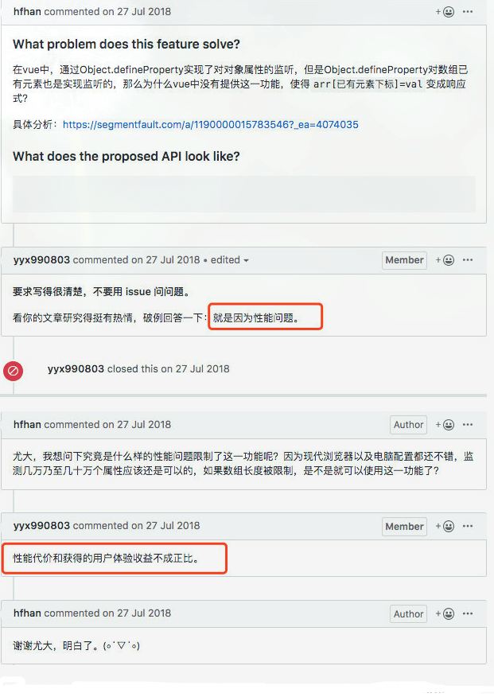

小结：是出于对性能原因的考虑，没有去实现它。而不是不能实现。

对于对象而言，每一次的数据变更都会对对象的属性进行一次枚举，一般对象本身的属性数量有限，所以对于遍历枚举等方式产生的性能损耗可以忽略不计，但是对于数组而言呢？数组包含的元素量是可能达到成千上万，假设对于每一次数组元素的更新都触发了枚举/遍历，其带来的性能损耗将与获得的用户体验不成正比，故vue无法检测数组的变动。

不过Vue3.0用proxy代替了defineProperty之后就解决了这个问题。


解决方案

数组

1. this.$set(array, index, data)

```javascript
//这是个深度的修改，某些情况下可能导致你不希望的结果，因此最好还是慎用
this.dataArr = this.originArr
this.$set(this.dataArr, 0, {data: '修改第一个元素'})
console.log(this.dataArr)        
console.log(this.originArr)  //同样的 源数组也会被修改 在某些情况下会导致你不希望的结果 
```

* splice

```javascript
//因为splice会被监听有响应式，而splice又可以做到增删改。
```

* 利用临时变量进行中转

```javascript
let tempArr = [...this.targetArr]
tempArr[0] = {data: 'test'}
this.targetArr = tempArr
```

对象

1. this.$set(obj, key ,value) - 可实现增、改

2. watch时添加`deep：true`深度监听，只能监听到属性值的变化，新增、删除属性无法监听

```javascript
this.$watch('blog', this.getCatalog, {
    deep: true
    // immediate: true // 是否第一次触发
  });
```

* watch时直接监听某个key

```javascript
watch: {
  'obj.name'(curVal, oldVal) {
    // TODO
  }
}
```


***

## 60. 说说Vue 页面渲染流程


**参考答案：**

前言

在 `Vue` 核心中除了响应式原理外，视图渲染也是重中之重。我们都知道每次更新数据，都会走视图渲染的逻辑，而这当中牵扯的逻辑也是十分繁琐。

本文主要解析的是初始化视图渲染流程，你将会了解到从挂载组件开始，`Vue` 是如何构建 `VNode`，又是如何将 `VNode` 转为真实节点并挂载到页面。


挂载组件($mount)

`Vue` 是一个构造函数，通过 `new` 关键字进行实例化。

```javascript
// src/core/instance/index.js
function Vue (options) {
  if (process.env.NODE_ENV !== 'production' &&
    !(this instanceof Vue)
  ) {
    warn('Vue is a constructor and should be called with the `new` keyword')
  }
  this._init(options)
}
```

在实例化时，会调用 `_init` 进行初始化。

```javascript
// src/core/instance/init.js
Vue.prototype._init = function (options?: Object) {
    const vm: Component = this
    // ...
    if (vm.$options.el) {
      vm.$mount(vm.$options.el)
    }
  }
```

`_init` 内会调用 `$mount` 来挂载组件，而 `$mount` 方法实际调用的是 `mountComponent`。

```javascript
// src/core/instance/lifecycle.js
export function mountComponent (
  vm: Component,
  el: ?Element,
  hydrating?: boolean
): Component {
  vm.$el = el
  // ...
  callHook(vm, 'beforeMount')

  let updateComponent
  /* istanbul ignore if */
  if (process.env.NODE_ENV !== 'production' && config.performance && mark) {
    // ...
  } else {
    updateComponent = () => {
      vm._update(vm._render(), hydrating)  // 渲染页面函数
    }
  }

  // we set this to vm._watcher inside the watcher's constructor
  // since the watcher's initial patch may call $forceUpdate (e.g. inside child
  // component's mounted hook), which relies on vm._watcher being already defined
  new Watcher(vm, updateComponent, noop, { //  渲染watcher
    before () {
      if (vm._isMounted && !vm._isDestroyed) {
        callHook(vm, 'beforeUpdate')
      }
    }
  }, true /* isRenderWatcher */)
  hydrating = false

  // manually mounted instance, call mounted on self
  // mounted is called for render-created child components in its inserted hook
  if (vm.$vnode == null) {
    vm._isMounted = true
    callHook(vm, 'mounted')
  }
  return vm
}
```

`mountComponent` 除了调用一些生命周期的钩子函数外，最主要是 `updateComponent`，它就是负责渲染视图的核心方法，其只有一行核心代码：

```javascript
vm._update(vm._render(), hydrating)
```

`vm._render` 创建并返回 `VNode`，`vm._update` 接受 `VNode` 将其转为真实节点。

`updateComponent` 会被传入 `渲染Watcher`，每当数据变化触发 `Watcher` 更新就会执行该函数，重新渲染视图。`updateComponent` 在传入 `渲染Watcher` 后会被执行一次进行初始化页面渲染。

所以我们着重分析的是 `vm._render` 和 `vm._update` 两个方法，这也是本文主要了解的原理——`Vue` 视图渲染流程。


构建VNode(\_render)

首先是 `_render` 方法，它用来构建组件的 `VNode`。

```javascript
// src/core/instance/render.js
Vue.prototype._render = function () {
    const { render, _parentVnode } = vm.$options
    vnode = render.call(vm._renderProxy, vm.$createElement)
    return vnode
}
```

`_render` 内部会执行 `render` 方法并返回构建好的 `VNode`。`render` 一般是模板编译后生成的方法，也有可能是用户自定义。

```javascript
// src/core/instance/render.js
export function initRender (vm) {
    vm._c = (a, b, c, d) => createElement(vm, a, b, c, d, false)
    vm.$createElement = (a, b, c, d) => createElement(vm, a, b, c, d, true)
}
```

`initRender` 在初始化就会执行为实例上绑定两个方法，分别是 `vm._c` 和 `vm.$createElement`。它们两者都是调用 `createElement` 方法，它是创建 `VNode` 的核心方法，最后一个参数用于区别是否为用户自定义。

`vm._c` 应用场景是在编译生成的 `render` 函数中调用，`vm.$createElement` 则用于用户自定义 `render` 函数的场景。就像上面 `render` 在调用时会传入参数 `vm.$createElement`，我们在自定义 `render` 函数接收到的参数就是它。


createElement

```javascript
// src/core/vdom/create-elemenet.js
export function createElement (
  context: Component,
  tag: any,
  data: any,
  children: any,
  normalizationType: any,
  alwaysNormalize: boolean
): VNode | Array<VNode> {
  if (Array.isArray(data) || isPrimitive(data)) {
    normalizationType = children
    children = data
    data = undefined
  }
  if (isTrue(alwaysNormalize)) {
    normalizationType = ALWAYS_NORMALIZE
  }
  return _createElement(context, tag, data, children, normalizationType)
}
```

`createElement` 方法实际上是对 `_createElement` 方法的封装，它允许传入的参数更加灵活。

```javascript
export function _createElement (
  context: Component,
  tag?: string | Class<Component> | Function | Object,
  data?: VNodeData,
  children?: any,
  normalizationType?: number
): VNode | Array<VNode> {
  if (isDef(data) && isDef(data.is)) {
    tag = data.is
  }
  if (!tag) {
    // in case of component :is set to falsy value
    return createEmptyVNode()
  }
  // support single function children as default scoped slot
  if (Array.isArray(children) &&
    typeof children[0] === 'function'
  ) {
    data = data || {}
    data.scopedSlots = { default: children[0] }
    children.length = 0
  }
  if (normalizationType === ALWAYS_NORMALIZE) {
    children = normalizeChildren(children)
  } else if (normalizationType === SIMPLE_NORMALIZE) {
    children = simpleNormalizeChildren(children)
  }
  let vnode, ns
  if (typeof tag === 'string') {
    let Ctor
    ns = (context.$vnode && context.$vnode.ns) || config.getTagNamespace(tag)
    if (config.isReservedTag(tag)) {
      // platform built-in elements
      vnode = new VNode(
        config.parsePlatformTagName(tag), data, children,
        undefined, undefined, context
      )
    } else if (isDef(Ctor = resolveAsset(context.$options, 'components', tag))) {
      // component
      vnode = createComponent(Ctor, data, context, children, tag)
    } else {
      // unknown or unlisted namespaced elements
      // check at runtime because it may get assigned a namespace when its
      // parent normalizes children
      vnode = new VNode(
        tag, data, children,
        undefined, undefined, context
      )
    }
  } else {
    // direct component options / constructor
    vnode = createComponent(tag, data, context, children)
  }
  if (Array.isArray(vnode)) {
    return vnode
  } else if (isDef(vnode)) {
    if (isDef(ns)) applyNS(vnode, ns)
    if (isDef(data)) registerDeepBindings(data)
    return vnode
  } else {
    return createEmptyVNode()
  }
}
```

`_createElement` 参数中会接收 `children`，它表示当前 `VNode` 的子节点，因为它是任意类型的，所以接下来需要将其规范为标准的 `VNode` 数组；

```javascript
// 这里规范化 children
if (normalizationType === ALWAYS_NORMALIZE) {
  children = normalizeChildren(children)
} else if (normalizationType === SIMPLE_NORMALIZE) {
  children = simpleNormalizeChildren(children)
}
```

`simpleNormalizeChildren` 和 `normalizeChildren` 均用于规范化 `children`。由 `normalizationType` 判断 `render` 函数是编译生成的还是用户自定义的。

```javascript
// 1. When the children contains components - because a functional component
// may return an Array instead of a single root. In this case, just a simple
// normalization is needed - if any child is an Array, we flatten the whole
// thing with Array.prototype.concat. It is guaranteed to be only 1-level deep
// because functional components already normalize their own children.
export function simpleNormalizeChildren (children: any) {
  for (let i = 0; i < children.length; i++) {
    if (Array.isArray(children[i])) {
      return Array.prototype.concat.apply([], children)
    }
  }
  return children
}

// 2. When the children contains constructs that always generated nested Arrays,
// e.g. <template>, <slot>, v-for, or when the children is provided by user
// with hand-written render functions / JSX. In such cases a full normalization
// is needed to cater to all possible types of children values.
export function normalizeChildren (children: any): ?Array<VNode> {
  return isPrimitive(children)
    ? [createTextVNode(children)]
    : Array.isArray(children)
      ? normalizeArrayChildren(children)
      : undefined
}
```

`simpleNormalizeChildren` 方法调用场景是 render 函数当函数是编译生成的。`normalizeChildren` 方法的调用场景主要是 render 函数是用户手写的。

经过对 `children` 的规范化，`children` 变成了一个类型为 `VNode` 的数组。之后就是创建 `VNode` 的逻辑。

```javascript
// src/core/vdom/patch.js
let vnode, ns
if (typeof tag === 'string') {
  let Ctor
  ns = (context.$vnode && context.$vnode.ns) || config.getTagNamespace(tag)
  if (config.isReservedTag(tag)) {
    // platform built-in elements
    vnode = new VNode(
      config.parsePlatformTagName(tag), data, children,
      undefined, undefined, context
    )
  } else if (isDef(Ctor = resolveAsset(context.$options, 'components', tag))) {
    // component
    vnode = createComponent(Ctor, data, context, children, tag)
  } else {
    // unknown or unlisted namespaced elements
    // check at runtime because it may get assigned a namespace when its
    // parent normalizes children
    vnode = new VNode(
      tag, data, children,
      undefined, undefined, context
    )
  }
} else {
  // direct component options / constructor
  vnode = createComponent(tag, data, context, children)
}
```

如果 `tag` 是 `string` 类型，则接着判断如果是内置的一些节点，创建一个普通 `VNode`；如果是为已注册的组件名，则通过 `createComponent` 创建一个组件类型的 `VNode`；否则创建一个未知的标签的 `VNode`。

如果 `tag` 不是 `string` 类型，那就是 `Component` 类型, 则直接调用 `createComponent` 创建一个组件类型的 `VNode` 节点。

最后 `_createElement` 会返回一个 `VNode`，也就是调用 `vm._render` 时创建得到的`VNode`。之后 `VNode` 会传递给 `vm._update` 函数，用于生成真实dom。


生成真实dom(\_update)

```javascript
// src/core/instance/lifecycle.js
Vue.prototype._update = function (vnode: VNode, hydrating?: boolean) {
  const vm: Component = this
  const prevEl = vm.$el
  const prevVnode = vm._vnode
  const prevActiveInstance = activeInstance
  activeInstance = vm
  vm._vnode = vnode
  // Vue.prototype.__patch__ is injected in entry points
  // based on the rendering backend used.
  if (!prevVnode) {
    // initial render
    vm.$el = vm.__patch__(vm.$el, vnode, hydrating, false /* removeOnly */)
  } else {
    // updates
    vm.$el = vm.__patch__(prevVnode, vnode)
  }
  activeInstance = prevActiveInstance
  // update __vue__ reference
  if (prevEl) {
    prevEl.__vue__ = null
  }
  if (vm.$el) {
    vm.$el.__vue__ = vm
  }
  // if parent is an HOC, update its $el as well
  if (vm.$vnode && vm.$parent && vm.$vnode === vm.$parent._vnode) {
    vm.$parent.$el = vm.$el
  }
  // updated hook is called by the scheduler to ensure that children are
  // updated in a parent's updated hook.
}
```

`_update` 里最核心的方法就是 `vm.__patch__` 方法，不同平台的 `patch` 方法的定义会稍有不同，在 web 平台中它是这样定义的:

```javascript
// src/platforms/web/runtime/index.js
import { patch } from './patch'
// install platform patch function
Vue.prototype.__patch__ = inBrowser ? patch : noop
```

可以看到 `patch` 实际调用的是 `patch` 方法。

```javascript
// src/platforms/web/runtime/patch.js
import * as nodeOps from 'web/runtime/node-ops'
import { createPatchFunction } from 'core/vdom/patch'
import baseModules from 'core/vdom/modules/index'
import platformModules from 'web/runtime/modules/index'

// the directive module should be applied last, after all
// built-in modules have been applied.
const modules = platformModules.concat(baseModules)

export const patch: Function = createPatchFunction({ nodeOps, modules })
```

而 `patch` 方法是由 `createPatchFunction` 方法创建返回出来的函数。

```javascript
// src/core/vdom/patch.js
const hooks = ['create', 'activate', 'update', 'remove', 'destroy']

export function createPatchFunction (backend) {
  let i, j
  const cbs = {}
  const { modules, nodeOps } = backend

  for (i = 0; i < hooks.length; ++i) {
    cbs[hooks[i]] = []
    for (j = 0; j < modules.length; ++j) {
      if (isDef(modules[j][hooks[i]])) {
        cbs[hooks[i]].push(modules[j][hooks[i]])
      }
    }
  }
  
  // ...
  return function patch (oldVnode, vnode, hydrating, removeOnly){}
}
```

这里有两个比较重要的对象 `nodeOps` 和 `modules`。`nodeOps` 是封装的原生dom操作方法，在生成真实节点树的过程中，dom相关操作都是调用 `nodeOps` 内的方法。

`modules` 是待执行的钩子函数。在进入函数时，会将不同模块的钩子函数分类放置到 `cbs` 中，其中包括自定义指令钩子函数，ref 钩子函数。在 `patch` 阶段，会根据操作节点的行为取出对应类型进行调用。


Patch

```javascript
// initial render
vm.$el = vm.__patch__(vm.$el, vnode, hydrating, false /* removeOnly */)
```

在首次渲染时，`vm.$el` 对应的是根节点 dom 对象，也就是我们熟知的 id 为 app 的 div。它作为 `oldVNode` 参数传入 `patch`：

```javascript
return function patch (oldVnode, vnode, hydrating, removeOnly) {
  if (isUndef(vnode)) {
    if (isDef(oldVnode)) invokeDestroyHook(oldVnode)
    return
  }

  let isInitialPatch = false
  const insertedVnodeQueue = []

  if (isUndef(oldVnode)) {
    // empty mount (likely as component), create new root element
    isInitialPatch = true
    createElm(vnode, insertedVnodeQueue)
  } else {
    const isRealElement = isDef(oldVnode.nodeType)
    if (!isRealElement && sameVnode(oldVnode, vnode)) {
      // patch existing root node
      patchVnode(oldVnode, vnode, insertedVnodeQueue, null, null, removeOnly)
    } else {
      if (isRealElement) {
        // mounting to a real element
        // check if this is server-rendered content and if we can perform
        // a successful hydration.
        if (oldVnode.nodeType === 1 && oldVnode.hasAttribute(SSR_ATTR)) {
          oldVnode.removeAttribute(SSR_ATTR)
          hydrating = true
        }
        if (isTrue(hydrating)) {
          if (hydrate(oldVnode, vnode, insertedVnodeQueue)) {
            invokeInsertHook(vnode, insertedVnodeQueue, true)
            return oldVnode
          } else if (process.env.NODE_ENV !== 'production') {
            warn(
              'The client-side rendered virtual DOM tree is not matching ' +
              'server-rendered content. This is likely caused by incorrect ' +
              'HTML markup, for example nesting block-level elements inside ' +
              '<p>, or missing <tbody>. Bailing hydration and performing ' +
              'full client-side render.'
            )
          }
        }
        // either not server-rendered, or hydration failed.
        // create an empty node and replace it
        oldVnode = emptyNodeAt(oldVnode)
      }

      // replacing existing element
      const oldElm = oldVnode.elm
      const parentElm = nodeOps.parentNode(oldElm)

      // create new node
      createElm(
        vnode,
        insertedVnodeQueue,
        // extremely rare edge case: do not insert if old element is in a
        // leaving transition. Only happens when combining transition +
        // keep-alive + HOCs. (#4590)
        oldElm._leaveCb ? null : parentElm,
        nodeOps.nextSibling(oldElm)
      )

      // update parent placeholder node element, recursively
      if (isDef(vnode.parent)) {
        let ancestor = vnode.parent
        const patchable = isPatchable(vnode)
        while (ancestor) {
          for (let i = 0; i < cbs.destroy.length; ++i) {
            cbs.destroy[i](ancestor)
          }
          ancestor.elm = vnode.elm
          if (patchable) {
            for (let i = 0; i < cbs.create.length; ++i) {
              cbs.create[i](emptyNode, ancestor)
            }
            // #6513
            // invoke insert hooks that may have been merged by create hooks.
            // e.g. for directives that uses the "inserted" hook.
            const insert = ancestor.data.hook.insert
            if (insert.merged) {
              // start at index 1 to avoid re-invoking component mounted hook
              for (let i = 1; i < insert.fns.length; i++) {
                insert.fns[i]()
              }
            }
          } else {
            registerRef(ancestor)
          }
          ancestor = ancestor.parent
        }
      }

      // destroy old node
      if (isDef(parentElm)) {
        removeVnodes([oldVnode], 0, 0)
      } else if (isDef(oldVnode.tag)) {
        invokeDestroyHook(oldVnode)
      }
    }
  }

  invokeInsertHook(vnode, insertedVnodeQueue, isInitialPatch)
  return vnode.elm
}
```

通过检查属性 `nodeType`（真实节点才有的属性）， 判断 `oldVnode` 是否为真实节点。

```javascript
const isRealElement = isDef(oldVnode.nodeType)
if (isRealElement) {
  // ...
  oldVnode = emptyNodeAt(oldVnode)
}
```

很明显第一次的 `isRealElement` 是为 `true`，因此会调用 `emptyNodeAt` 将其转为 `VNode`：

```javascript
function emptyNodeAt (elm) {
  return new VNode(nodeOps.tagName(elm).toLowerCase(), {}, [], undefined, elm)
}
```

接着会调用 `createElm` 方法，它就是将 `VNode` 转为真实dom 的核心方法：

```javascript
function createElm (
  vnode,
  insertedVnodeQueue,
  parentElm,
  refElm,
  nested,
  ownerArray,
  index
) {
  if (isDef(vnode.elm) && isDef(ownerArray)) {
    // This vnode was used in a previous render!
    // now it's used as a new node, overwriting its elm would cause
    // potential patch errors down the road when it's used as an insertion
    // reference node. Instead, we clone the node on-demand before creating
    // associated DOM element for it.
    vnode = ownerArray[index] = cloneVNode(vnode)
  }

  vnode.isRootInsert = !nested // for transition enter check
  if (createComponent(vnode, insertedVnodeQueue, parentElm, refElm)) {
    return
  }

  const data = vnode.data
  const children = vnode.children
  const tag = vnode.tag
  if (isDef(tag)) {
    vnode.elm = vnode.ns
      ? nodeOps.createElementNS(vnode.ns, tag)
      : nodeOps.createElement(tag, vnode)
    setScope(vnode)

    /* istanbul ignore if */
    if (__WEEX__) {
      // ...
    } else {
      createChildren(vnode, children, insertedVnodeQueue)
      if (isDef(data)) {
        invokeCreateHooks(vnode, insertedVnodeQueue)
      }
      insert(parentElm, vnode.elm, refElm)
    }

    if (process.env.NODE_ENV !== 'production' && data && data.pre) {
      creatingElmInVPre--
    }
  } else if (isTrue(vnode.isComment)) {
    vnode.elm = nodeOps.createComment(vnode.text)
    insert(parentElm, vnode.elm, refElm)
  } else {
    vnode.elm = nodeOps.createTextNode(vnode.text)
    insert(parentElm, vnode.elm, refElm)
  }
}
```

一开始会调用 `createComponent` 尝试创建组件类型的节点，如果成功会返回 `true`。在创建过程中也会调用 `$mount` 进行组件范围内的挂载，所以走的还是 `patch` 这套流程。

```javascript
if (createComponent(vnode, insertedVnodeQueue, parentElm, refElm)) {
  return
}
```

如果没有完成创建，代表该 `VNode` 对应的是真实节点，往下继续创建真实节点的逻辑。

```javascript
vnode.elm = vnode.ns
    ? nodeOps.createElementNS(vnode.ns, tag)
    : nodeOps.createElement(tag, vnode)
```

根据 `tag` 创建对应类型真实节点，赋值给 `vnode.elm`，它作为父节点容器，创建的子节点会被放到里面。

然后调用 `createChildren` 创建子节点：

```javascript
function createChildren (vnode, children, insertedVnodeQueue) {
  if (Array.isArray(children)) {
    if (process.env.NODE_ENV !== 'production') {
      checkDuplicateKeys(children)
    }
    for (let i = 0; i < children.length; ++i) {
      createElm(children[i], insertedVnodeQueue, vnode.elm, null, true, children, i)
    }
  } else if (isPrimitive(vnode.text)) {
    nodeOps.appendChild(vnode.elm, nodeOps.createTextNode(String(vnode.text)))
  }
}
```

内部进行遍历子节点数组，再次调用 `createElm` 创建节点，而上面创建的 `vnode.elm` 作为父节点传入。如此循环，直到没有子节点，就会创建文本节点插入到 `vnode.elm` 中。

执行完成后出来，会调用 `invokeCreateHooks`，它负责执行 dom 操作时的 `create` 钩子函数，同时将 `VNode` 加入到 `insertedVnodeQueue` 中：

```javascript
function invokeCreateHooks (vnode, insertedVnodeQueue) {
  for (let i = 0; i < cbs.create.length; ++i) {
    cbs.create[i](emptyNode, vnode)
  }
  i = vnode.data.hook // Reuse variable
  if (isDef(i)) {
    if (isDef(i.create)) i.create(emptyNode, vnode)
    if (isDef(i.insert)) insertedVnodeQueue.push(vnode)
  }
}
```

最后一步就是调用 `insert` 方法将节点插入到父节点：

```javascript
function insert (parent, elm, ref) {
  if (isDef(parent)) {
    if (isDef(ref)) {
      if (nodeOps.parentNode(ref) === parent) {
        nodeOps.insertBefore(parent, elm, ref)
      }
    } else {
      nodeOps.appendChild(parent, elm)
    }
  }
}
```

可以看到 `Vue` 是通过递归调用 `createElm` 来创建节点树的。同时也说明最深的子节点会先调用 `insert` 插入节点。所以整个节点树的插入顺序是“先子后父”。插入节点方法就是原生dom的方法 `insertBefore` 和 `appendChild`。

```javascript
if (isDef(parentElm)) {
  removeVnodes([oldVnode], 0, 0)
}
```

`createElm` 流程走完后，构建完成的节点树已经插入到页面上了。其实 `Vue` 在初始化渲染页面时，并不是把原来的根节点 `app` 给真正替换掉，而是在其后面插入一个新的节点，接着再把旧节点给移除掉。

所以在 `createElm` 之后会调用 `removeVnodes` 来移除旧节点，它里面同样是调用的原生dom方法 `removeChild`。

```javascript
invokeInsertHook(vnode, insertedVnodeQueue, isInitialPatch)
```

```javascript
function invokeInsertHook (vnode, queue, initial) {
  // delay insert hooks for component root nodes, invoke them after the
  // element is really inserted
  if (isTrue(initial) && isDef(vnode.parent)) {
    vnode.parent.data.pendingInsert = queue
  } else {
    for (let i = 0; i < queue.length; ++i) {
      queue[i].data.hook.insert(queue[i])
    }
  }
}
```

在 `patch` 的最后就是调用 `invokeInsertHook` 方法，触发节点插入的钩子函数。

至此整个页面渲染的流程完毕\~


总结

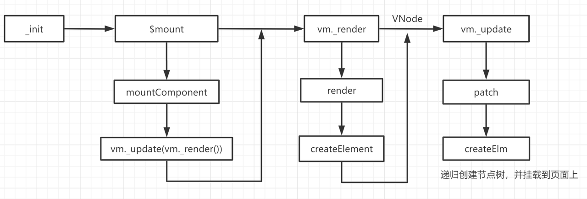

初始化调用 `$mount` 挂载组件。

`_render` 开始构建 `VNode`，核心方法为 `createElement`，一般会创建普通的 `VNode` ，遇到组件就创建组件类型的 `VNode`，否则就是未知标签的 `VNode`，构建完成传递给 `_update`。

`patch` 阶段根据 `VNode` 创建真实节点树，核心方法为 `createElm`，首先遇到组件类型的 `VNode`，内部会执行 `$mount`，再走一遍相同的流程。普通节点类型则创建一个真实节点，如果它有子节点开始递归调用 `createElm`，使用 `insert` 插入子节点，直到没有子节点就填充内容节点。最后递归完成后，同样也是使用 `insert` 将整个节点树插入到页面中，再将旧的根节点移除。


***

## 61. ES5怎么实现继承


**参考答案：**

前言

继承这个概念在面向对象编程思想里面十分重要，也是面试必考的考点之一。

javascript的继承主要是依托其原型与原型链的概念来实现的。

> ECMAscript将原型链作为实现继承的主要方法。

先来看看ES6的实现

ES6提供了Class关键字来实现类的定义，Class 可以通过extends关键字实现继承，让子类继承父类的属性和方法。

咱们重点讲一下ES5的四种常用的实现方式。


ES5实现的四种方式

1.原型链继承

原型链继承的原理很简单，直接让子类的原型对象指向父类实例，当子类实例找不到对应的属性和方法时，就会往它的原型对象，也就是父类实例上找，从而实现对父类的属性和方法的继承

```javascript
function Person() {
    this.name = 'Back_kk';
}
Person.prototype.getName = function() {
    return this.name;
}
function Student() {}
Student.prototype = new Person();
// 根据原型链的规则,顺便绑定一下constructor, 这一步不影响继承, 只是在用到constructor时会需要
// 原型的实例等于自身
Student.prototype.constructor = Student;

const student = new Student();
console.log(student.name); // Back_kk
console.log(student.getName()); // Back_kk
```

缺陷

1. 由于所有Student实例原型都指向同一个Person实例, 因此对某个Student实例的来自父类的引用类型变量修改会影响所有的Student实例

例如：

```javascript
function Person() {
    this.obj = {
        name: 'Back_kk',
        age: 18
    };
}
function Student() {}
Student.prototype = new Person();
// 根据原型链的规则,顺便绑定一下constructor, 这一步不影响继承, 只是在用到constructor时会需要
// 原型的实例等于自身
Student.prototype.constructor = Student;

const student1 = new Student();
student1.obj.name = '佩奇';
const student2 = new Student();
console.log(student2.obj.name); // 佩奇
```

2.在创建子类实例时无法向父类构造传参, 即没有实现super()的功能

> 那么能不能实现super()功能呢？大家有兴趣可以思考下。


2.构造函数继承

构造函数继承，即在子类的构造函数中执行父类的构造函数，并为其绑定子类的this，让父类的构造函数把成员属性和方法都挂到子类的this上去，这样既能避免实例之间共享一个原型实例，又能向父类构造方法传参。

```javascript
function Person(name) {
    this.name = name
}
Person.prototype.getName = function() {
    return this.name;
}
function Student() {
    Person.apply(this, arguments);
}

const student = new Student('Back_kk');
console.log(student.name); // Back_kk
```

缺陷

* 继承不到父类原型上的属性和方法

* Students类实际上是调用Person类来生成的实例

能否交加修改让其获取到Person原型上的属性和方法呢？

```javascript
function Person(name) {
    this.name = name
}
Person.prototype.getName = function() {
    return this.name;
}
function Student() {
    // 这里偷偷用了ES6的解构，不影响大局不要在意哈
   return new Person(...arguments);
}
const student = new Student('Back_kk');
console.log(student); // Back_kk
```

这是这样顾此失彼，student的构造方法变成了Person,这显然违背了我们的初衷。


3.组合式继承

组合是继承结合了原型集成和构造函数继承的特点。

```javascript
function Person(name) {
    this.name = name;
}
Person.prototype.getName = function() {
    return this.name;
}
function Student() {
    // 构造函数继承
    Person.apply(this, arguments)
}
// 原型式继承
Student.prototype = new Person();

// 原型的实例等于自身
Student.prototype.constructor = Student;

const student = new Student('Back_kk');
console.log(student.name); // Back_kk
console.log(student.getName()); // Back_kk
```

缺陷

* 每次创建子类实例都执行了两次构造函数(Person.apply和new Person())，虽然这并不影响对父类的继承，但子类创建实例时，原型中会存在两份相同的属性和方法，这并不优雅。


4.寄生式组合继承

解决构造函数被执行两次的问题, 我们将指向父类实例改为指向父类原型, 减去一次构造函数的执行。

```javascript
function Person(name) {
    this.name = name;
}
Person.prototype.getName = function() {
    return this.name;
}
function Student() {
    // 构造函数继承
    Person.apply(this, arguments)
}
// 原型式继承
// Student.prototype = new Person();
Student.prototype = Object.create(Person.prototype);

// 原型的实例等于自身
Student.prototype.constructor = Student;

const student = new Student('Back_kk');
console.log(student.name); // Back_kk
console.log(student.getName()); // Back_kk
```

这是目前ES5中比较成熟的继承方式了。


总结

* 说到js继承，最开始想到的应该是是原型链继承，通过把子类实例的原型指向父类实例来继承父类的属性和方法，但原型链继承的缺陷在于对子类实例继承的引用类型的修改会影响到所有的实例对象以及无法向父类的构造方法传参。

* 构造函数继承, 通过在子类构造函数中调用父类构造函数并传入子类this来获取父类的属性和方法，但构造函数继承也存在缺陷，构造函数继承不能继承到父类原型链上的属性和方法。

* 后面有了组合式继承，但也有了新的问题，每次都会执行两次父类的构造方法，最终有了寄生式组合式继承。


***

## 62. 请简述 == 的机制

**参考答案：**

大家知道，==是JavaScript中比较复杂的一个运算符。它的运算规则奇怪，容易让人犯错，从而成为JavaScript中“最糟糕的特性”之一。

在仔细阅读了ECMAScript规范的基础上，我画了一张图，我想通过它你会彻底地搞清楚关于==的一切。同时，我也试图通过此文向大家证明==并不是那么糟糕的东西，它很容易掌握，甚至看起来很合理。

先上图：

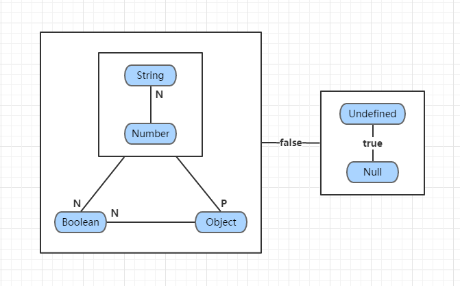

图1 ==运算规则的图形化表示

规范毕竟是给JavaScript运行环境的开发人员看的(比如V8引擎的开发人员们)，而不是给语言的使用者看的。而上图正是将规范中复杂的描述翻译成了更容易看懂的形式。

在详细介绍图1中的每个部分前，我们来复习一下JS中关于类型的知识：

1. JS中的值有两种类型：原始类型(Primitive)、对象类型(Object)。

2. 原始类型包括：Undefined、Null、Boolean、Number和String等五种。

3. Undefined类型和Null类型的都只有一个值，即undefined和null；Boolean类型有两个值：true和false；Number类型的值有很多很多；String类型的值理论上有无数个。

4. 所有对象都有valueOf()和toString()方法，它们继承自Object，当然也可能被子类重写。

现在考虑表达式：

```javascript
x == y
```

其中x和y是上述六种类型中某一种类型的值。

当x和y的类型相同时，x == y可以转化为x === y，而后者是很简单的(唯一需要注意的可能是NaN)，所以下面我们只考虑x和y的类型不同的情况。


一. 有和无

在图1中，JavaScript值的六种类型用蓝底色的矩形表示。它们首先被分成了两组：

* String、Number、Boolean和Object (对应左侧的大矩形框)

* Undefined和Null (对应右侧的矩形框)

分组的依据是什么？我们来看一下，右侧的Undefined和Null是用来表示不确定、无或者空的，而右侧的四种类型都是确定的、有和非空。我们可以这样说：

> 左侧是一个存在的世界，右侧是一个空的世界。

所以，左右两个世界中的任意值做==比较的结果都是false是很合理的。(见图1中连接两个矩形的水平线上标的false)


二. 空和空

JavaScript中的undefined和null是另一个经常让我们崩溃的地方。通常它被认为是一个设计缺陷，这一点我们不去深究。不过我曾听说，JavaScript的作者最初是这样想的：

> 假如你打算把一个变量赋予对象类型的值，但是现在还没有赋值，那么你可以用null表示此时的状态(证据之一就是typeof null 的结果是'object')；相反，假如你打算把一个变量赋予原始类型的值，但是现在还没有赋值，那么你可以用undefined表示此时的状态。

不管这个传闻是否可信，它们两者做==比较的结果是true是很合理的。(见图1中右侧垂直线上标的true)

在进行下一步之前，我们先来说一下图1中的两个符号：大写字母N和P。这两个符号并不是PN结中正和负的意思。而是：

* N表示ToNumber操作，即将操作数转为数字。它是规范中的抽象操作，但我们可以用JS中的Number()函数来等价替代。

* P表示ToPrimitive操作，即将操作数转为原始类型的值。它也是规范中的抽象操作，同样也可以翻译成等价的JS代码。不过稍微复杂一些，简单说来，对于一个对象obj：

> ToPrimitive(obj)等价于：先计算obj.valueOf()，如果结果为原始值，则返回此结果；否则，计算obj.toString()，如果结果是原始值，则返回此结果；否则，抛出异常。

注：此处有个例外，即Date类型的对象，它会先调用toString()方法，后调用valueOf()方法。

在图1中，标有N或P的线表示：当它连接的两种类型的数据做==运算时，标有N或P的那一边的操作数要先执行ToNumber或ToPrimitive变换。


三. 真与假

从图1可以看出，当布尔值与其他类型的值作比较时，布尔值会转化为数字，具体来说

```javascript
true -> 1
false -> 0
```

这一点也不需浪费过多口舌。想一下在C语言中，根本没有布尔类型，通常用来表示逻辑真假的正是整数1和0。


四. 字符的序列

在图1中，我们把String和Number类型分成了一组。为什么呢？在六种类型中，String和Number都是字符的序列(至少在字面上如此)。字符串是所有合法的字符的序列，而数字可以看成是符合特定条件的字符的序列。所以，数字可以看成字符串的一个子集。

根据图1，在字符串和数字做==运算时，需要使用ToNumber操作，把字符串转化为数字。假设x是字符串，y是数字，那么：

```javascript
x == y -> Number(x) == y
```

那么字符串转化为数字的规则是怎样的呢？规范中描述得很复杂，但是大致说来，就是把字符串两边的空白字符去掉，然后把两边的引号去掉，看它能否组成一个合法的数字。如果是，转化结果就是这个数字；否则，结果是NaN。例如：

```javascript
Number('123') // 结果123
Number('1.2e3') // 结果1200
Number('123abc') // 结果NaN
Number('123\v\f') // 结果123
```

当然也有例外，比如空白字符串转化为数字的结果是0。即

```javascript
Number('') // 结果0
Number('\v\f') // 结果0
```

五. 单纯与复杂

原始类型是一种单纯的类型，它们直接了当、容易理解。然而缺点是表达能力有限，难以扩展，所以就有了对象。对象是属性的集合，而属性本身又可以是对象。所以对象可以被构造得任意复杂，足以表示各种各样的事物。

但是，有时候事情复杂了也不是好事。比如一篇冗长的论文，并不是每个人都有时间、有耐心或有必要从头到尾读一遍，通常只了解其中心思想就够了。于是论文就有了关键字、概述。JavaScript中的对象也一样，我们需要有一种手段了解它的主要特征，于是对象就有了toString()和valueOf()方法。

> toString()方法用来得到对象的一段文字描述；而valueOf()方法用来得到对象的特征值。

当然，这只是我自己的理解。顾名思义，toString()方法倾向于返回一个字符串。那么valueOf()方法呢？根据规范中的描述，它倾向于返回一个数字——尽管内置类型中，valueOf()方法返回数字的只有Number和Date。

根据图1，当一个对象与一个非对象比较时，需要将对象转化为原始类型(虽然与布尔类型比较时，需要先将布尔类型变成数字类型，但是接下来还是要将对象类型变成原始类型)。这也是合理的，毕竟==是不严格的相等比较，我们只需要取出对象的主要特征来参与运算，次要特征放在一边就行了。


六. 万物皆数

我们回过头来看一下图1。里面标有N或P的那几条连线是没有方向的。假如我们在这些线上标上箭头，使得连线从标有N或P的那一端指向另一端，那么会得到(不考虑undefined和null)：

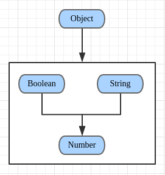

图2 ==运算过程中类型转化的趋势

发现什么了吗？对，在运算过程中，所有类型的值都有一种向数字类型转化的趋势。毕竟曾经有名言曰：

> 万物皆数。


七. 举个例子

前面废话太多了，这里还是举个例子，来证明图1确实是方便有效可以指导实践的。

例，计算下面表达式的值：

```javascript
[''] == false
```

首先，两个操作数分别是对象类型、布尔类型。根据图1，需要将布尔类型转为数字类型，而false转为数字的结果是0，所以表达式变为：

```javascript
[''] == 0
```

两个操作数变成了对象类型、数字类型。根据图1，需要将对象类型转为原始类型：

* 首先调用\[].valueOf()，由于数组的valueOf()方法返回自身，所以结果不是原始类型，继续调用\[].toString()。

* 对于数组来说，toString()方法的算法，是将每个元素都转为字符串类型，然后用逗号','依次连接起来，所以最终结果是空字符串''，它是一个原始类型的值。

此时，表达式变为：

```javascript
'' == 0
```

两个操作数变成了字符串类型、数字类型。根据图1，需要将字符串类型转为数字类型，前面说了空字符串变成数字是0。于是表达式变为：

```javascript
0 == 0
```

到此为止，两个操作数的类型终于相同了，结果明显是true。

从这个例子可以看出，要想掌握==运算的规则，除了牢记图1外，还需要记住那些内置对象的toString()和valueOf()方法的规则。包括Object、Array、Date、Number、String、Boolean等，幸好这没有什么难度。


八. 再次变形

其实，图一还不够完美。为什么呢？因为对象与字符串/数字比较时都由对象来转型，但是与同样是原始类型的布尔类型比较时却需要布尔类型转型。实际上，只要稍稍分析一下，全部让对象来转为原始类型也是等价的。所以我们得到了最终的更加完美的图形：


图3 更完美的==运算规则的图形化表示

有一个地方可能让你疑惑：为什么Boolean与String之间标了两个N？虽然按照规则应该是由Boolean转为数字，但是下一步String就要转为数字了，所以干脆不如两边同时转成数字。


九. 总结一下

前面说得很乱，根据我们得到的最终的图3，我们总结一下==运算的规则：

* undefined == null，结果是true。且它俩与所有其他值比较的结果都是false。

* String == Boolean，需要两个操作数同时转为Number。

* String/Boolean == Number，需要String/Boolean转为Number。

* Object == Primitive，需要Object转为Primitive(具体通过valueOf和toString方法)。

瞧见没有，一共只有4条规则！是不是很清晰、很简单。

***

## 63. 怎么做移动端的样式适配？


**参考答案：**

以下是一些常见的移动端样式适配方法：

1. 响应式设计（Responsive Design）：

   * 使用CSS媒体查询（Media Queries）来根据设备的特征（如屏幕宽度、高度、方向等）应用不同的样式。

   * 通过设置百分比宽度、最大宽度或相对单位（比如 rem）来确保元素相对于其容器的大小进行自适应。

   ```javascript
    @media only screen and (max-width: 768px) {
     /* 在小屏幕上的样式 */
   }

   @media only screen and (min-width: 769px) and (max-width: 1024px) {
     /* 在中等屏幕上的样式 */
   }

   @media only screen and (min-width: 1025px) {
     /* 在大屏幕上的样式 */
   }
   ```

2. 弹性布局（Flexbox）和网格布局（Grid）：

   * 使用弹性布局和网格布局可以更方便地创建灵活的布局，使页面元素能够根据屏幕大小自动调整位置。

   ```javascript
   .container {
     display: flex;
     flex-wrap: wrap;
   }

   .item {
     flex: 1;
   }
   ```

3. 移动端优先（Mobile-first）：

   * 首先定义移动端的样式，然后使用媒体查询逐渐添加更大屏幕上的样式，以确保基本功能在小屏幕上也能正常工作。

   ```javascript
   /* 移动端样式 */
   body {
     font-size: 14px;
   }

   /* 大屏幕样式 */
   @media only screen and (min-width: 768px) {
     body {
       font-size: 16px;
     }
   }
   ```

4. 图片和多媒体适配：

   * 使用`max-width: 100%`确保图片和多媒体在小屏幕上不会溢出其容器。

   * 使用`picture`元素或`srcset`属性提供不同尺寸的图片。

   ```javascript
   img {
     max-width: 100%;
     height: auto;
   }
   ```

5. 交互友好：

   * 使用合适的尺寸和间距，确保链接、按钮等可点击元素在触摸屏上易于点击。

   ```javascript
   /* 适当的触摸区域大小 */
   a, button {
     padding: 10px;
   }
   ```

6. 测试和调试：

   * 在不同设备和浏览器上测试你的样式，确保页面在各种情况下都有良好的表现。

   * 使用浏览器开发者工具检查元素并模拟不同设备的情况。


***

## 64. arguments 这种类数组，如何遍历类数组？

类数组对象

所谓的类数组对象:

> 拥有一个 length 属性和若干索引属性的对象

举个例子：

```javascript
var array = ['name', 'age', 'sex'];

var arrayLike = {
    0: 'name',
    1: 'age',
    2: 'sex',
    length: 3
}
```

即便如此，为什么叫做类数组对象呢？

那让我们从读写、获取长度、遍历三个方面看看这两个对象。

读写

```javascript
console.log(array[0]); // name
console.log(arrayLike[0]); // name

array[0] = 'new name';
arrayLike[0] = 'new name';
```

长度

```javascript
console.log(array.length); // 3
console.log(arrayLike.length); // 3
```

遍历

```javascript
for(var i = 0, len = array.length; i < len; i++) {
   ……
}
for(var i = 0, len = arrayLike.length; i < len; i++) {
    ……
}
```

是不是很像？

那类数组对象可以使用数组的方法吗？比如：

```javascript
arrayLike.push('4');
```

然而上述代码会报错: arrayLike.push is not a function

所以终归还是类数组呐……

调用数组方法

如果类数组就是任性的想用数组的方法怎么办呢？

既然无法直接调用，我们可以用 Function.call 间接调用:

```javascript
var arrayLike = {0: 'name', 1: 'age', 2: 'sex', length: 3 }

Array.prototype.join.call(arrayLike, '&'); // name&age&sex

Array.prototype.slice.call(arrayLike, 0); // ["name", "age", "sex"] 
// slice可以做到类数组转数组

Array.prototype.map.call(arrayLike, function(item){
    return item.toUpperCase();
}); 
// ["NAME", "AGE", "SEX"]
```

类数组转数组

在上面的例子中已经提到了一种类数组转数组的方法，再补充三个：

```javascript
var arrayLike = {0: 'name', 1: 'age', 2: 'sex', length: 3 }
// 1. slice
Array.prototype.slice.call(arrayLike); // ["name", "age", "sex"] 
// 2. splice
Array.prototype.splice.call(arrayLike, 0); // ["name", "age", "sex"] 
// 3. ES6 Array.from
Array.from(arrayLike); // ["name", "age", "sex"] 
// 4. apply
Array.prototype.concat.apply([], arrayLike)
```

那么为什么会讲到类数组对象呢？以及类数组有什么应用吗？

要说到类数组对象，Arguments 对象就是一个类数组对象。在客户端 JavaScript 中，一些 DOM 方法(document.getElementsByTagName()等)也返回类数组对象。

Arguments对象

接下来重点讲讲 Arguments 对象。

Arguments 对象只定义在函数体中，包括了函数的参数和其他属性。在函数体中，arguments 指代该函数的 Arguments 对象。

举个例子：

```javascript
function foo(name, age, sex) {
    console.log(arguments);
}

foo('name', 'age', 'sex')
```

打印结果如下：

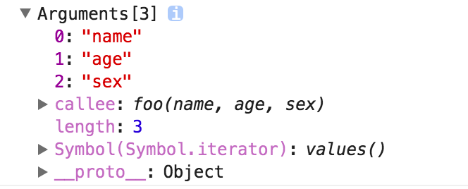

我们可以看到除了类数组的索引属性和length属性之外，还有一个callee属性，接下来我们一个一个介绍。

length属性

Arguments对象的length属性，表示实参的长度，举个例子：

```javascript
function foo(b, c, d){
    console.log("实参的长度为：" + arguments.length)
}

console.log("形参的长度为：" + foo.length)

foo(1)

// 形参的长度为：3
// 实参的长度为：1
```

callee属性

Arguments 对象的 callee 属性，通过它可以调用函数自身。

讲个闭包经典面试题使用 callee 的解决方法：

```javascript
var data = [];

for (var i = 0; i < 3; i++) {
    (data[i] = function () {
       console.log(arguments.callee.i) 
    }).i = i;
}

data[0]();
data[1]();
data[2]();

// 0
// 1
// 2
```

接下来讲讲 arguments 对象的几个注意要点：

arguments 和对应参数的绑定

```javascript
function foo(name, age, sex, hobbit) {

    console.log(name, arguments[0]); // name name

    // 改变形参
    name = 'new name';

    console.log(name, arguments[0]); // new name new name

    // 改变arguments
    arguments[1] = 'new age';

    console.log(age, arguments[1]); // new age new age

    // 测试未传入的是否会绑定
    console.log(sex); // undefined

    sex = 'new sex';

    console.log(sex, arguments[2]); // new sex undefined

    arguments[3] = 'new hobbit';

    console.log(hobbit, arguments[3]); // undefined new hobbit

}

foo('name', 'age')
```

传入的参数，实参和 arguments 的值会共享，当没有传入时，实参与 arguments 值不会共享

除此之外，以上是在非严格模式下，如果是在严格模式下，实参和 arguments 是不会共享的。

传递参数

将参数从一个函数传递到另一个函数

```javascript
// 使用 apply 将 foo 的参数传递给 bar
function foo() {
    bar.apply(this, arguments);
}
function bar(a, b, c) {
   console.log(a, b, c);
}

foo(1, 2, 3)
```

强大的ES6

使用ES6的 ... 运算符，我们可以轻松转成数组。

```javascript
function func(...arguments) {
    console.log(arguments); // [1, 2, 3]
}

func(1, 2, 3);
```

应用

arguments的应用其实很多，在下个系列，也就是 JavaScript 专题系列中，我们会在 jQuery 的 extend 实现、函数柯里化、递归等场景看见 arguments 的身影。这篇文章就不具体展开了。

如果要总结这些场景的话，暂时能想到的包括：

1. 参数不定长

2. 函数柯里化

3. 递归调用

4. 函数重载 ...


***

## 65. 遍历数组的方式有哪些？


**参考答案：**

数组遍历的方法

for

标准的for循环语句，也是最传统的循环语句

```javascript
var arr = [1,2,3,4,5]
for(var i=0;i<arr.length;i++){
  console.log(arr[i])
}
```

最简单的一种遍历方式，也是使用频率最高的，性能较好，但还能优化

优化版for循环语句

```javascript
var arr = [1,2,3,4,5]
for(var i=0,len=arr.length;i<len;i++){
  console.log(arr[i])
}
```

使用临时变量，将长度缓存起来，避免重复获取数组长度，尤其是当数组长度较大时优化效果才会更加明显。

这种方法基本上是所有循环遍历方法中性能最高的一种

forEach

普通forEach

对数组中的每一元素运行给定的函数,没有返回值，常用来遍历元素

```javascript
var arr5 = [10,20,30]
var result5 = arr5.forEach((item,index,arr)=>{
    console.log(item)
})
console.log(result5)
/*
10
20
30
undefined   该方法没有返回值
*/
```

数组自带的foreach循环，使用频率较高，实际上性能比普通for循环弱

原型forEach

由于foreach是Array型自带的，对于一些非这种类型的，无法直接使用(如NodeList)，所以才有了这个变种，使用这个变种可以让类似的数组拥有foreach功能。

```javascript
const nodes = document.querySelectorAll('div')
Array.prototype.forEach.call(nodes,(item,index,arr)=>{
  console.log(item)
})
```

实际性能要比普通foreach弱

for...in

任意顺序遍历一个对象的除[Symbol](https://developer.mozilla.org/en-US/docs/Web/JavaScript/Reference/Global_Objects/Symbol)以外的[可枚举](https://developer.mozilla.org/zh-CN/docs/Web/JavaScript/Enumerability_and_ownership_of_properties)属性，包括继承的可枚举属性。

一般常用来遍历对象，包括非整数类型的名称和继承的那些原型链上面的属性也能被遍历。像 Array和 Object使用内置构造函数所创建的对象都会继承自Object.prototype和String.prototype的不可枚举属性就不能遍历了.

```javascript
var arr = [1,2,3,4,5]
for(var i in arr){
  console.log(i,arr[i])
}  //这里的i是对象属性，也就是数组的下标
/**
0 1
1 2
2 3
3 4
4 5 **/
```

大部分人都喜欢用这个方法，但它的性能却不怎么好

for...of（不能遍历对象）

> 在可迭代对象（具有 iterator 接口）（Array，Map，Set，String，arguments）上创建一个迭代循环，调用自定义迭代钩子，并为每个不同属性的值执行语句，不能遍历对象

```javascript
let arr=["前端","面试题宝典","真好用"];
    for (let item of arr){
        console.log(item)
    }

//遍历对象
let person={name:"前端面试题宝典",age:18,city:"上海"}
for (let item of person){
  console.log(item)
}
// 我们发现它是不可以的 我们可以搭配Object.keys使用
for(let item of Object.keys(person)){
    console.log(person[item])
}
// 南玖 18 上海
```

这种方式是es6里面用到的，性能要好于forin，但仍然比不上普通for循环

map

> map: 只能遍历数组，不能中断，返回值是修改后的数组。

```javascript
let arr=[1,2,3];
const res = arr.map(item=>{
  return item+1
})
console.log(res) //[2,3,4]
console.log(arr) // [1,2,3]
```

every

对数组中的每一运行给定的函数，如果该函数对每一项都返回true,则该函数返回true

```javascript
var arr = [10,30,25,64,18,3,9]
var result = arr.every((item,index,arr)=>{
      return item>3
})
console.log(result)  //false
```

some

对数组中的每一运行给定的函数，如果该函数有一项返回true,就返回true，所有项返回false才返回false

```javascript
var arr2 = [10,20,32,45,36,94,75]
var result2 = arr2.some((item,index,arr)=>{
    return item<10
})
console.log(result2)  //false
```

reduce

`reduce()`方法对数组中的每个元素执行一个由你提供的reducer函数（升序执行），将其结果汇总为单个返回值

```javascript
const array = [1,2,3,4]
const reducer = (accumulator, currentValue) => accumulator + currentValue;

// 1 + 2 + 3 + 4
console.log(array1.reduce(reducer));
```

filter

对数组中的每一运行给定的函数，会返回满足该函数的项组成的数组

```javascript
// filter  返回满足要求的数组项组成的新数组
var arr3 = [3,6,7,12,20,64,35]
var result3 = arr3.filter((item,index,arr)=>{
    return item > 3
})
console.log(result3)  //[6,7,12,20,64,35]
```

性能测试

工具测试

使用工具测试[性能分析](http://tools.jb51.net/aideddesign/js_bianli)结果如下图所示

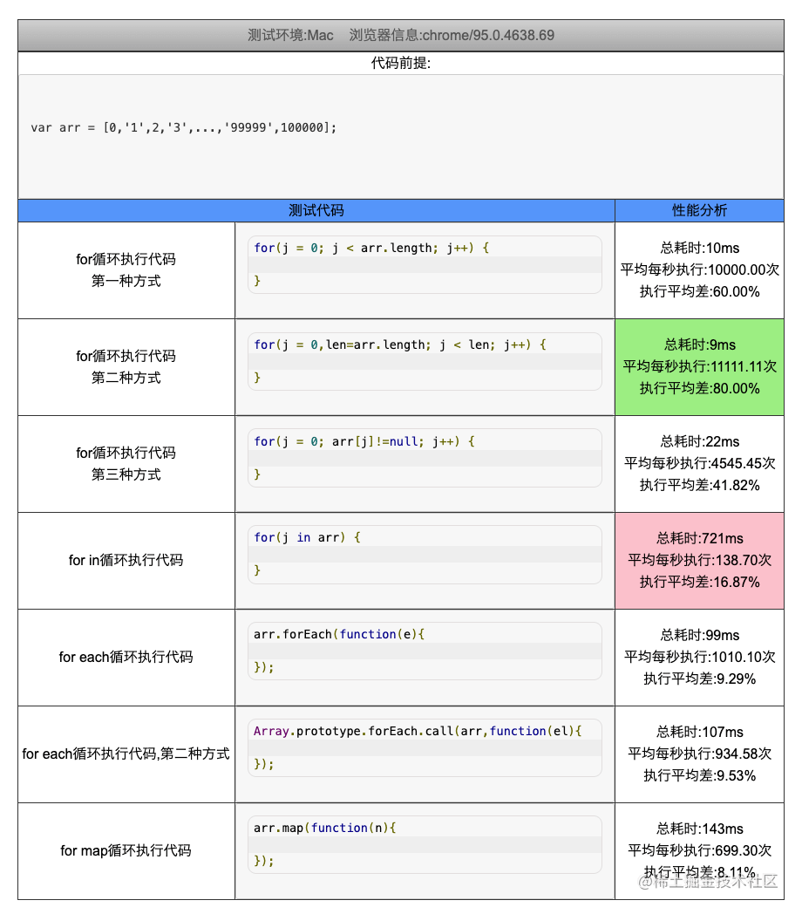

手动测试

我们也可以自己用代码测试：

```javascript
//测试函数
function clecTime(fn,fnName){
        const start = new Date().getTime()
        if(fn) fn()
        const end = new Date().getTime()
        console.log(`${fnName}执行耗时:${end-start}ms`)
}

function forfn(){
  let a = []
  for(var i=0;i<arr.length;i++){
    // console.log(i)
    a.push(arr[i])
  }
}
clecTime(forfn, 'for')   //for执行耗时:106ms

function forlenfn(){
  let a = []
  for(var i=0,len=arr.length;i<len;i++){
    a.push(arr[i])
  }
}
clecTime(forlenfn, 'for len')   //for len执行耗时:95ms

function forEachfn(){
  let a = []
  arr.forEach(item=>{
    a.push[item]
  })
}
clecTime(forEachfn, 'forEach')   //forEach执行耗时:201ms

function forinfn(){
  let a = []
  for(var i in arr){
    a.push(arr[i])
  }
}
clecTime(forinfn, 'forin') //forin执行耗时:2584ms (离谱)

function foroffn(){
  let a = []
  for(var i of arr){
    a.push(i)
  }
}
clecTime(foroffn, 'forof') //forof执行耗时:221ms

//  ...其余可自行测试
```

结果分析

经过工具与手动测试发现，结果基本一致，数组遍历各个方法的速度：传统的for循环最快，for-in最慢

> for-len `>` for `>` for-of `>` forEach `>` map `>` for-in

javascript原生遍历方法的建议用法：

* 用`for`循环遍历数组

* 用`for...in`遍历对象

* 用`for...of`遍历类数组对象（ES6）

* 用`Object.keys()`获取对象属性名的集合

为何for… in会慢？

因为`for … in`语法是第一个能够迭代对象键的JavaScript语句，循环对象键（{}）与在数组（\[]）上进行循环不同，引擎会执行一些额外的工作来跟踪已经迭代的属性。因此不建议使用`for...in`来遍历数组


***

## 66. setTimeout 延时写成0，一般可以什么场景下使用？

**参考答案：**

将`setTimeout`的延时参数设置为0通常用于创建一个宏任务，使用0延时仍然会导致一些延迟，但它比较接近于立即执行。

以下是一些通常会使用0延时的情况：

1. UI渲染后的回调：当我们需要在当前事件循环结束后，等待浏览器完成UI渲染后再执行回调函数时，可以使用0延时。这样可以确保回调在界面更新之后执行，以避免阻塞UI线程。

2. 异步操作处理：有时我们需要将某些操作推迟到下一个事件循环周期，以便让其他异步操作优先执行。通过将操作放置在0延时的`setTimeout`回调中，可以使其成为下一个事件循环周期的微任务，并确保在其他异步操作之后执行。

3. 性能优化：在某些情况下，将操作延迟到下一个事件循环周期可以提高性能。例如，在处理大量数据或循环迭代时，通过将每个迭代步骤延迟到0延时的`setTimeout`中，可以分批处理，减少单次操作的执行时间，从而避免长时间的JavaScript执行阻塞。

4.

***

## 67. 怎么预防用户快速连续点击，造成数据多次提交？


**参考答案：**

为了防止重复提交，前端一般会在第一次提交的结果返回前，将提交按钮禁用。

实现的方法有很多种：

* css设置 `pointer-events` 为 `none`

* 增加变量控制，当变量满足条件时才执行点击事件的后续代码（比如给按钮的点击事件增加防抖）

* 如果按钮使用 button 标签实现，可以使用 `disabled` 属性

* 加遮罩层，比如一个全屏的loading，避免触发按钮的点击事件

* ...


***

## 68. 说说下面代码的输出结果

```plaintext
Promise.resolve().then(() => {
  console.log(0)
  return Promise.resolve(4)
}).then((res) => {
  console.log(res)
})
Promise.resolve().then(() => {
  console.log(1)
}).then(() => {
  console.log(2)
}).then(() => {
  console.log(3)
}).then(() => {
  console.log(5)
}).then(() =>{
  console.log(6)
})
```

**参考答案：**

输出结果是：

```plaintext
0
1
2
3
4
5
6
```

1、分析

一般遇到`Promise.resolve()`时，相当于`new Promise(resolve => {resolve()})`都是同步完成的，不会消耗微任务。 但以下情况时，需要注意，我们先看三组代码：

```javascript
//代码1
new Promise(resolve => {
    resolve(Promise.resolve(4));//resolve了一个Promise
})
.then((res) => {
    console.log(res)
})
```

```javascript
//代码2
Promise.resolve().then(() => {
    return Promise.resolve(4);//return了一个Promise
})
.then((res) => {
    console.log(res)
})
```

```javascript
//代码3
Promise.resolve().then(() => {
    return 4;//return了一个Number类型的4
})
.then((res) => {
    console.log(res)
})
```

这三个输出结果，打印出来的都是数字4。

我们可以看出不同，代码3是我们最常见的情况。代码3里打印的res是`4`，和上边`return`的是同样的数据类型。那么代码1和代码2的res为什么不是`Object`类型的`Promise{<fulfilled>: 4}`呢？

在一般情况下：

```javascript
Promise.resolve().then(() => {
    return 4;
})
```

这段代码中，`Promise.resolve().then`是一个构造函数,`() => {return 4;}`是这个函数的参数，这个函数调用，最后返回一个值为`4`的`Promise`(即`new Promise(resolve => resolve(4)`).

而在

```javascript
new Promise(resolve => {
    resolve(Promise.resolve(4));//resolve了一个Promise
})
```

```javascript
Promise.resolve().then(() => {
    return Promise.resolve(4);//return了一个Promise
})
```

中，因为js在遇到`resolve`或者`return`一个`Promise`对象时，会先求得这个`Promise`对象的值，也就是这个`Promise`的状态为`fulfilled`或`rejected`的值(假如这个值是`'a'`)，再用这个值作为返回的新的`Promised`的值，这个新的`Promsie`(就是`new Promise(resolve => resolve('a')`)作为下级链式调用的`Promise`。

2、结论

在chrome内部实现的Promise和标准的Promise/A+规范存在差异。浏览器内部实现的区别。我们可以理解为，resolve或者return遇到一个Promise对象时，得到这个Promise的值之后，会把这个值用微任务包装起来，在return值向外传递(因为后边没有.then()了，所以是向父级的外层传递)时，会产生第二个微任务。

所以代码

```javascript
//代码1
new Promise(resolve => {
    resolve(Promise.resolve(4));//resolve了一个Promise
})
.then((res) => {
    console.log(res)
})
```

可以理解为

```javascript
new Promise(resolve => {
    resolve(4);
})
.then()
.then()
.then((res) => {
    console.log(res)
})
```

对应的，代码

```javascript
//代码2
Promise.resolve().then(() => {
    return Promise.resolve(4);//return了一个Promise
})
.then((res) => {
    console.log(res)
})
```

可以理解为

```javascript
Promise.resolve()
.then(() => {
    return 4;
})
.then()
.then()
.then((res) => {
    console.log(res)
})
```

这样理解的，核心就是会比正常的return一个非Promise的值时，多两个微任务.then().then()

另外的

```javascript
Promise.resolve().then(() => {
    return Promise.resolve(Promise.resolve(Promise.resolve(4)))
})
.then(res => {
    console.log(res);
})
```

像这样的`return Promise.resolve(Promise.resolve(Promise.resolve(4)))`嵌套多层`Promise`，其实和`Promise.resolve(4)`是一样的，并不会多产生微任务。因为这两段代码的`Promsie`状态变为`fulfilled`的过程并不需要等待。而是拿到它的值之后，在向后运行的时候，会产生微任务。

但如果是

```javascript
Promise.resolve().then(() => {
    return new Promise(resolve => {
            resolve(4)
    })
    .then(res => {
            return 4.1
    })
    .then(res => {
            return 4.2
    })
})
.then(res => {
    console.log(res);
})
```

这时`.then(res => { console.log(res); })`想要运行，需要等待前边return 的Promise状态变为`fulfilled`才行，

```javascript
new Promise(resolve => {
        resolve(4)
})
.then(res => {
        return 4.1
})
.then(res => {
        return 4.2
})
```

本身是会注册两个微任务的，而拿到它的值之后，在向后运行的时候，又会产生两个任务(包装值一次，return传递一次)。

3、回顾

我们再来看这个题目

```javascript
Promise.resolve().then(() => {
    console.log(0);
    return Promise.resolve(4);
}).then((res) => {
    console.log(res)
})

Promise.resolve().then(() => {
    console.log(1);
}).then(() => {
    console.log(2);
}).then(() => {
    console.log(3);
}).then(() => {
    console.log(5);
}).then(() =>{
    console.log(6);
})
```

按照上边的分析，可以对应转化为

```javascript
Promise.resolve().then(() => {
    console.log(0);
    return 4;
})
.then()
.then()
.then((res) => {
    console.log(res)
})

Promise.resolve().then(() => {
    console.log(1);
}).then(() => {
    console.log(2);
}).then(() => {
    console.log(3);
}).then(() => {
    console.log(5);
}).then(() =>{
    console.log(6);
})
```

所以运行结果是0,1,2,3,4,5,6


***

## 69. 怎么实现大型文件上传？


**参考答案：**

大文件快速上传的方案，其实无非就是将 文件变小，也就是通过 压缩文件资源 或者 文件资源分块 后再上传。

具体来说，可以考虑以下几种方法：

1. 分片上传（Chunked Upload）：将大文件拆分成小的文件块(chunk)，然后通过多个并行的请求依次上传这些文件块。服务器接收到每个文件块后进行存储，最后合并所有文件块以还原原始文件。这种方法可以降低单个请求的负载，并允许在网络中断或上传失败时可以从断点续传。

2. 流式上传（Streaming Upload）：客户端使用流方式逐步读取文件的内容，并将数据流通过 POST 请求发送给服务器。服务器端能够逐步接收并处理这些数据流，而无需等待完整的文件上传完成。这种方法适用于较大的文件，减少了内存占用和传输延迟。

3. 使用专门的文件上传服务：有一些第三方服务可供使用，例如云存储服务（如 Amazon S3、Google Cloud Storage）、文件传输协议（如 FTP、SFTP）等。这些服务通常提供了高可靠性、可扩展性和安全性，并且针对大文件上传进行了优化。

4. 压缩文件上传：如果可能，可以在客户端先对文件进行压缩，然后再进行上传。压缩后的文件大小更小，可以减少上传时间和网络带宽消耗。

5. 并发上传：通过多个并行的请求同时上传文件的不同部分，以加快整个上传过程。这需要服务器端支持并发上传并正确处理分片或部分文件的合并。

6. 断点续传：记录上传进度和状态，以便在网络中断或上传失败后能够从上次中断的位置继续上传。可以使用客户端或服务器端的断点续传机制来实现。

补充知识点

问题 1：谁负责资源分块？谁负责资源整合？

当然这个问题也很简单，肯定是前端负责分块，服务端负责整合.

问题 2：前端怎么对资源进行分块？

首先是选择上传的文件资源，接着就可以得到对应的文件对象 File，而 File.prototype.slice 方法可以实现资源的分块，当然也有人说是 Blob.prototype.slice 方法，因为 `Blob.prototype.slice === File.prototype.slice`.

问题 3：服务端怎么知道什么时候要整合资源？如何保证资源整合的有序性？

由于前端会将资源分块，然后单独发送请求，也就是说，原来 1 个文件对应 1 个上传请求，现在可能会变成 1 个文件对应 n 个上传请求，所以前端可以基于 Promise.all 将这多个接口整合，上传完成在发送一个合并的请求，通知服务端进行合并。

合并时可通过 nodejs 中的读写流（readStream/writeStream），将所有切片的流通过管道（pipe）输入最终文件的流中。

在发送请求资源时，前端会定好每个文件对应的序号，并将当前分块、序号以及文件 hash 等信息一起发送给服务端，服务端在进行合并时，通过序号进行依次合并即可。

问题 4：如果某个分块的上传请求失败了，怎么办？

一旦服务端某个上传请求失败，会返回当前分块失败的信息，其中会包含文件名称、文件 hash、分块大小以及分块序号等，前端拿到这些信息后可以进行重传，同时考虑此时是否需要将 Promise.all 替换为 Promise.allSettled 更方便。


***

## 70. JavaScript 中如何取消请求


**参考答案：**

JavaScript 实现异步请求就靠浏览器提供的两个 API —— XMLHttpRequest 和 Fetch。我们平常用的较多的是 Promise 请求库 axios，它基于 XMLHttpRequest。

本篇带来 XMLHttpRequest、Fetch 和 axios 分别是怎样“取消请求”的。

取消 XMLHttpRequest 请求

当请求已经发送了，可以使用 XMLHttpRequest.abort() 方法取消发送，代码示例如下：

```javascript
const xhr = new XMLHttpRequest();
xhr.open('GET', '<http://127.0.0.1:3000/api/get>', true);
xhr.send();
setTimeout(() => {
         xhr.abort();
}, 1000);
```

取消请求，[readyState](https://developer.mozilla.org/en-US/docs/Web/API/XMLHttpRequest/readyState) 会变成 `XMLHttpRequest.UNSENT`(0)；请求的 xhr.[status](https://developer.mozilla.org/en-US/docs/Web/API/XMLHttpRequest/status) 会被设为 0 ；

不如在 Chrome DevTools Network 中，看看正常请求和取消请求的对比图：


取消 Fetch 请求

取消 Fetch 请求，需要用到 [AbortController](https://developer.mozilla.org/en-US/docs/Web/API/AbortController) API。我们可以构造一个 controller 实例：`const controller = new AbortController()` , controller 它有一个只读属性 [AbortController.signal](https://developer.mozilla.org/en-US/docs/Web/API/AbortSignal)，可以作为参数传入到 fetch 中，用于将控制器与获取请求相关联；

代码示例如下：

```javascript
const controller = new AbortController();
void (async function () {
    const response = await fetch('<http://127.0.0.1:3000/api/get>', {
        signal: controller.signal,
    });
    const data = await response.json();
})();

setTimeout(() => {
    controller.abort();
}, 1000);
```

浏览器控制台对比图：

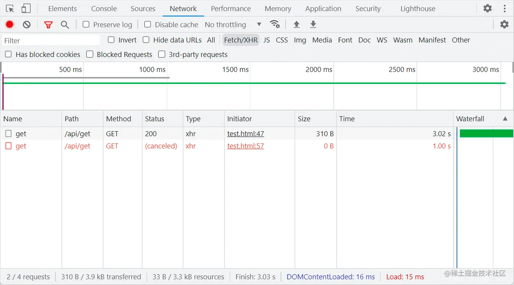

我们其实可以在 controller.abort() 传入“取消请求的原因”参数，然后进行 try...catch 捕获

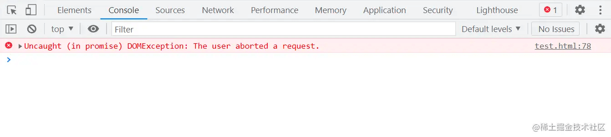

取消 axios 请求

axios 同样支持 [AbortController](https://developer.mozilla.org/en-US/docs/Web/API/AbortController)

```javascript
const controller = new AbortController();
const API_URL = '<http://127.0.0.1:3000/api/get>';
void (async function () {
    const response = await axios.get(API_URL, {
        signal: controller.signal,
    });
    const { data } = response;
})();
setTimeout(() => {
    controller.abort();
}, 1000);
```

控制台截图：

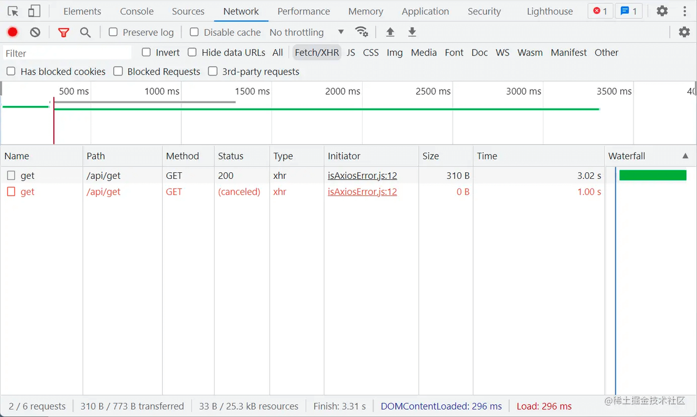

错误捕获：

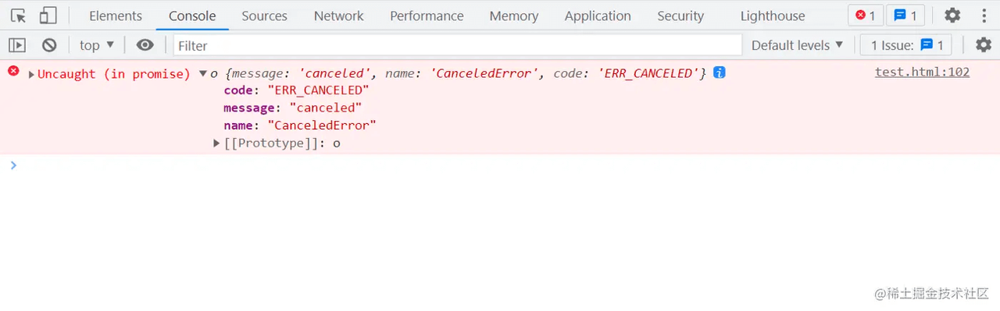

注意：axios 之前用于取消请求的 CancelToken 方法已经被弃用，更多请见文档 [axios-http.com/docs/cancel…](https://axios-http.com/docs/cancellation)；


***

## 71. 说说你的ES6-ES12的了解


**参考答案：**

ES6（2015）

1. 类（class）

```javascript
class Man {
  constructor(name) {
    this.name = '小豪';
  }
  console() {
    console.log(this.name);
  }
}
const man = new Man('小豪');
man.console(); // 小豪
```

* 模块化(ES Module)

```javascript
// 模块 A 导出一个方法
export const sub = (a, b) => a + b;
// 模块 B 导入使用
import { sub } from './A';
console.log(sub(1, 2)); // 3
```

* 箭头（Arrow）函数

```javascript
const func = (a, b) => a + b;
func(1, 2); // 3
```

* 函数参数默认值

```javascript
function foo(age = 25,){ // ...}
```

* 模板字符串

```javascript
const name = '小豪';
const str = `Your name is ${name}`;
```

* 解构赋值

```javascript
let a = 1, b= 2;
[a, b] = [b, a]; // a 2  b 1
```

* 延展操作符

```javascript
let a = [...'hello world']; // ["h", "e", "l", "l", "o", " ", "w", "o", "r", "l", "d"]
```

* 对象属性简写

```javascript
const name='小豪',
const obj = { name };
```

* Promise

```javascript
Promise.resolve().then(() => { console.log(2); });
console.log(1);
// 先打印 1 ，再打印 2
```

* let和const

```javascript
let name = '小豪'；
const arr = [];
```

ES7（2016）

1. Array.prototype.includes()

```javascript
[1].includes(1); // true
```

* 指数操作符

```javascript
2**10; // 1024
```

ES8（2017）

1. async/await

异步终极解决方案

```javascript
async getData(){
    const res = await api.getTableData(); // await 异步任务
    // do something    
}
```

* Object.values()

```javascript
Object.values({a: 1, b: 2, c: 3}); // [1, 2, 3]
```

* Object.entries()

```javascript
Object.entries({a: 1, b: 2, c: 3}); // [["a", 1], ["b", 2], ["c", 3]]
```

* String padding

```javascript
// padStart
'hello'.padStart(10); // "     hello"
// padEnd
'hello'.padEnd(10) "hello     "
```

* 函数参数列表结尾允许逗号

* Object.getOwnPropertyDescriptors()

> 获取一个对象的所有自身属性的描述符,如果没有任何自身属性，则返回空对象。

* SharedArrayBuffer对象

> SharedArrayBuffer 对象用来表示一个通用的，固定长度的原始二进制数据缓冲区，

```javascript
/**
 * 
 * @param {*} length 所创建的数组缓冲区的大小，以字节(byte)为单位。  
 * @returns {SharedArrayBuffer} 一个大小指定的新 SharedArrayBuffer 对象。其内容被初始化为 0。
 */
new SharedArrayBuffer(10)
```

* Atomics对象

> Atomics 对象提供了一组静态方法用来对 SharedArrayBuffer 对象进行原子操作。

ES9（2018）

1. 异步迭代

await可以和for...of循环一起使用，以串行的方式运行异步操作

```javascript
async function process(array) {
  for await (let i of array) {
    // doSomething(i);
  }
}
```

* Promise.finally()

```javascript
Promise.resolve().then().catch(e => e).finally();
```

* Rest/Spread 属性

```javascript
const values = [1, 2, 3, 5, 6];
console.log( Math.max(...values) ); // 6
```

* 正则表达式命名捕获组

```javascript
const reg = /(?<year>[0-9]{4})-(?<month>[0-9]{2})-(?<day>[0-9]{2})/;
const match = reg.exec('2021-02-23');
```

* 正则表达式反向断言

```javascript
(?=p)、(?<=p)  p 前面(位置)、p 后面(位置)
(?!p)、(?<!p>) 除了 p 前面(位置)、除了 p 后面(位置)
```

* 正则表达式dotAll模式

> 正则表达式中点.匹配除回车外的任何单字符，标记s改变这种行为，允许行终止符的出现

```javascript
/hello.world/.test('hello\nworld');  // false
```

ES10（2019）

1. Array.flat()和Array.flatMap()

flat()

```javascript
[1, 2, [3, 4]].flat(Infinity); // [1, 2, 3, 4]
```

flatMap()

```javascript
[1, 2, 3, 4].flatMap(a => [a**2]); // [1, 4, 9, 16]
```

* String.trimStart()和String.trimEnd()

去除字符串首尾空白字符

* String.prototype.matchAll

> matchAll（）为所有匹配的匹配对象返回一个迭代器

```javascript
const raw_arr = 'test1  test2  test3'.matchAll((/t(e)(st(\d?))/g));
const arr = [...raw_arr];
```

* Symbol.prototype.description

> 只读属性，回 Symbol 对象的可选描述的字符串。

```javascript
Symbol('description').description; // 'description'
```

* Object.fromEntries()

> 返回一个给定对象自身可枚举属性的键值对数组

```javascript
// 通过 Object.fromEntries， 可以将 Map 转化为 Object:
const map = new Map([ ['foo', 'bar'], ['baz', 42] ]);
console.log(Object.fromEntries(map)); // { foo: "bar", baz: 42 }
```

* 可选 Catch

ES11（2020）

1. Nullish coalescing Operator(空值处理)

表达式在 ?? 的左侧 运算符求值为undefined或null，返回其右侧。

```javascript
let user = {
    u1: 0,
    u2: false,
    u3: null,
    u4: undefined
    u5: '',
}
let u2 = user.u2 ?? '用户2'  // false
let u3 = user.u3 ?? '用户3'  // 用户3
let u4 = user.u4 ?? '用户4'  // 用户4
let u5 = user.u5 ?? '用户5'  // ''
```

* Optional chaining（可选链）

?.用户检测不确定的中间节点

```javascript
let user = {}
let u1 = user.childer.name // TypeError: Cannot read property 'name' of undefined
let u1 = user.childer?.name // undefined
```

* Promise.allSettled

> 返回一个在所有给定的promise已被决议或被拒绝后决议的promise，并带有一个对象数组，每个对象表示对应的promise结果

```javascript
const promise1 = Promise.resolve(3);
const promise2 = 42;
const promise3 = new Promise((resolve, reject) => reject('我是失败的Promise_1'));
const promise4 = new Promise((resolve, reject) => reject('我是失败的Promise_2'));
const promiseList = [promise1,promise2,promise3, promise4]
Promise.allSettled(promiseList)
.then(values=>{
  console.log(values)
});
```

* import()

按需导入

* 新基本数据类型BigInt

> 任意精度的整数

* globalThis

- 浏览器：window

- worker：self

- node：global

ES12（2021）

1. replaceAll

> 返回一个全新的字符串，所有符合匹配规则的字符都将被替换掉

```javascript
const str = 'hello world';
str.replaceAll('l', ''); // "heo word"
```

* Promise.any

> Promise.any() 接收一个Promise可迭代对象，只要其中的一个 promise 成功，就返回那个已经成功的 promise 。如果可迭代对象中没有一个 promise 成功（即所有的 promises 都失败/拒绝），就返回一个失败的 promise

```javascript
const promise1 = new Promise((resolve, reject) => reject('我是失败的Promise_1'));
const promise2 = new Promise((resolve, reject) => reject('我是失败的Promise_2'));
const promiseList = [promise1, promise2];
Promise.any(promiseList)
.then(values=>{
  console.log(values);
})
.catch(e=>{
  console.log(e);
});
```

* WeakRefs

> 使用WeakRefs的Class类创建对对象的弱引用(对对象的弱引用是指当该对象应该被GC回收时不会阻止GC的回收行为)

* 逻辑运算符和赋值表达式

> 逻辑运算符和赋值表达式，新特性结合了逻辑运算符（&&，||，??）和赋值表达式而JavaScript已存在的 复合赋值运算符有：

```javascript
a ||= b
//等价于
a = a || (a = b)

a &&= b
//等价于
a = a && (a = b)

a ??= b
//等价于
a = a ?? (a = b)
```

* 数字分隔符

> 数字分隔符，可以在数字之间创建可视化分隔符，通过\_下划线来分割数字，使数字更具可读性

```javascript
const money = 1_000_000_000;
//等价于
const money = 1000000000;

1_000_000_000 === 1000000000; // true
```


***

## 72. 用js实现二叉树的定义和基本操作


**参考答案：**

树是计算机科学中经常用到的一种数据结构。树是一种非线性的数据结构，以分层的方式存储数据。树被用来存储具有层级关系的数据，比如文件系统中的文件；树还被用来存储有序列表。

二叉树具有诸多优点。相对于链表来说，二叉树在进行查找时速度非常快，而相对于数组来说，为二叉树添加或删除元素也非常快。

二叉树

二叉树是一种特殊的树，表现在它的子节点个数不超过两个。且二叉树的子树有左右之分，其次序不能任意颠倒。

在实现二叉树时，采用的存储结构为链式存储结构，链式结构的意思是采用一个链表来存储一颗二叉树，二叉树中每一个节点用链表的一个节点来存储，在二叉树中，节点结构至少有三个域：数据域data，左指针域left，右指针域right，如下图所示：


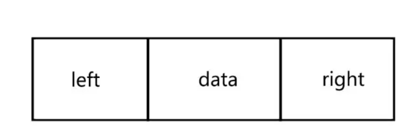

二叉链表的存储结构描述如下：

```javascript
class Node{
    constructor(data, left, right){
        this.data = data;
        this.left = left;
        this.right = right;
        this.count = 1;
    }
}
```

与图1不同之处在于多了一个count变量，这个变量的作用在于，在向二叉排序树中插入节点时，如果发现有已经有相同的节点值了，就放弃插入，但是将该节点的count变量加一，这是为了后面实现统计文本中不同的单词数量而设计的。

使用不同的存储结构，实现二叉树的链表的算法也不同。因此接下来的算法全都基于当前所选的存储结构。

其次，将要实现的并不是普通的二叉树，而是二叉排序树，其定义为：

> 二叉排序树或者是一棵空树，或者是具有下列性质的二叉树：
>
> （1）若左子树不空，则左子树上所有结点的值均小于它的根结点的值；
>
> （2）若右子树不空，则右子树上所有结点的值均大于它的根结点的值；
>
> （3）左、右子树也分别为二叉排序树；
>
> （4）没有键值相等的节点。

二叉排序树

在二叉排序树的实现了一些基本操作：插入节点，删除节点，寻找节点，以及获取最小值和最大值。

代码框架：

```javascript
class BSTree {
    constructor() {
        this.root = null;
    }

    // 删除一个节点
    _removeNode(node, data) {
       
    }

    // 删除给定的数据节点
    remove(data) {
        this.root = this._removeNode(this.root, data);
    }

    // 向二叉树中插入节点
    insert(data) {
        
    }

    // 寻找给定数据的节点
    find(data) {
        
    }

    // 获得最小值的节点
    getMinNode(node = this.root) {
        
    }

    // 获得最大值的节点
    getMaxNode(node = this.root) {
        
    }
}
```

实现二叉排序树的各种方法

首先是insert(data)方法，从总体上来说，插入操作可以分为两步，新建值为data的节点，然后在二叉排序树中找到合适的位置插入即可。

建立以data为值的新的节点比较容易，只要

```javascript
let newNode = new Node(data, null, null);
```

即可，关键就在于如何找到正确的插入位置。

这里使用parentNode来记录当前节点的父节点，初始时，该变量为null，当前节点为currNode，初始时为该二叉树的根节点。

* 如果在插入时，root节点为空，则直接将新节点赋给root节点即可。

* 如果新的节点值小于当前节点值，说明待插入的位置应在在当前节点的左子树上，那么在大于时，就应该在当前节点的右子树上。进而更新当前节点所指向的节点，直到当前节点为空时，说明找到了正确的插入位置。

insert()的具体代码如下：

```javascript
    // 向二叉树中插入节点
    insert(data) {
        let newNode = new Node(data, null, null);

        if (this.root == null) {
            this.root = newNode;
        } else {
            let currNode = this.root;
            let parentNode = null;

            while (true) {
                parentNode = currNode;

                if (newNode.data < currNode.data) {
                    currNode = currNode.left;  // 更新当前指点的指向

                    if (!currNode) {  // 当前节点为空时，说明找到了正确的插入位置
                        parentNode.left = newNode;
                        break;
                    }
                } else if (newNode.data > currNode.data) {
                    currNode = currNode.right;   // 更新当前指点的指向

                    if (!currNode) {  // // 当前节点为空时，说明找到了正确的插入位置
                        parentNode.right = newNode;
                        break;
                    }
                } else if (newNode.data == currNode.data) {
                    // 如果给定的数据再次出现，就更新计数值
                    currNode.count++;
                    break;
                }
            }
        }
    }
    
```

寻找最小值函数getMinNode()，该方法较为简单，因为是一个二叉排序树，所以最小值永远在最左边的分支上，故而一直沿着左分支走到头就是最小值了。

```javascript
   // 获得最小值的节点
    getMinNode(node = this.root) {
        let currNode = node;
        while (currNode.left) {
            currNode = currNode.left;
        }
        return currNode;
    }
```

最大值也是同样的道理：

```javascript
   // 获得最大值的节点
    getMaxNode(node = this.root) {
        let currNode = node;
        while (currNode.right) {
            currNode = currNode.right;
        }
        return currNode;
    }
```

find()方法，在二叉树排序树中寻找给定的数据，比较简单：

```javascript
    // 寻找给定数据的节点
    find(data) {
        let currNode = this.root;
        while (currNode) {
            if (currNode.data == data) {
                return currNode;
            } else if (data < currNode.data) {
                currNode = currNode.left;
            } else {
                currNode = currNode.right;
            }
        }
        return null;
    }
```

接下来时较为复杂一些的remove()方法，由于删除节点操作使用到了递归的操作，所以单独定义了一个函数：

```javascript
_removeNode(node, data){}
```

这里在\_removeNode()的方法中实现真正的删除操作。该函数的功能是删除以data为值的节点，函数名称前面有个下划线表示不应该在实例中调用此函数。

这里在remove()方法中调用了这个函数：

```javascript
remove(data){
    this.root = this._removeNode(this.root, data);
}
```

在删除节点时，一共可以分为三种情况：

1. 待删除的节点是叶子节点。

2. 待删除的节点没有左子节点，或者没有右子节点。

3. 待删除的节点的左右子节点均存在。

当待删除的节点时叶子节点时，这种情况比较简单，直接将待删除的节点置空返回即可。

当待删除的节点没有左子节点时，返回该节点的右孩子节点，并删除该节点。待删除节点没有右节点时类似处理。

比较麻烦的是最后一种情况，待删除的节点的左右子节点均存在时，可以有两种做法：要么查找待删除节点左子树上的最大值，要么查找其右子树上的最小值。

这里使用查找其右子树上的最小值的方法。在找到待删除节点的右子树上的最小值后，创建一个临时节点，将临时节点上的值复制到待删除节点，然后再删除临时节点。

```javascript
    // 删除一个节点
    _removeNode(node, data) {
        if (node == null) {
            return null;
        }
        if (data == node.data) {
            // 叶子节点
            if (node.left == null && node.right == null) {
                return null;
            }

            // 没有左节点的节点
            if (node.left == null) return node.right;


            //没有右节点的节点
            if (node.right == null) return node.left;
     

            // 有两个节点的节点
            /*  
             做法：
                找到待删除节点的右子树上的最小值创建一个临时节点。
                将临时节点上的值复制到待删除节点，然后再删除临时节点
            */

            // 寻找右子树上的最小值
            let tmpNode = this.getMinNode(node.right);
            node.data = tmpNode.data;
            node.right = this._removeNode(node.right, tmpNode.data);
            return node;
        } else if (data < node.data) {  // 待删除节点在左子树上
            node.left = this._removeNode(node.left, data);
            return node;
        } else {  // 待删除节点在右子树上
            node.right = this._removeNode(node.right, data);
            return node;
        }
    }
    
```

该函数使用了递归的操作来删除一个节点，如果传入待删除的数据值正好等于传入的节点的数据值时，就开始判断是上面提到的3中情况的那一种。如果待删除数据值小于当前节点数据值，则说明待删除的数据在当前节点的左子树上，反之在右子树上。

测试

由于准备将二叉排序树的遍历操作写在下一篇中，所以担心方法可能写错了的小伙伴可能展示无法测试所写的插入和删除操作正确与否。先用写的获取最大值和最小值来测试下吧。

```javascript
let myTree = new BSTree();

myTree.insert(20);
myTree.insert(13);
myTree.insert(7);
myTree.insert(9);
myTree.insert(15);
myTree.insert(14);
myTree.insert(42);
myTree.insert(22);
myTree.insert(21);
myTree.insert(24);
myTree.insert(57);

```

新建后的二叉排序树如下图所示：


获取最大值试一下：

```javascript
console.log(myTree.getMaxNode());  // Node {data: 57, left: null, right: null, count: 1}
```

可以看到值为57的节点确实没有左右子树。

最小值：

```javascript
console.log(myTree.getMinNode());  // Node {data: 7, left: null, right: Node, count: 1}
```

可以看到值为7的节点只有右子树，与上图所示相同。

删除节点7，模拟下删除时有右子节点的情况：

```javascript
myTree.remove(7);
console.log(myTree.getMinNode());  // Node {data: 9, left: null, right: null, count: 1}
```

可见值为9的节点取代了原来值为7的节点的位置。

删除节点42，模拟下删除时左右子树均存在的情况：

```javascript
myTree.remove(42);
console.log(myTree.getMaxNode());  // Node {data: 57, left: Node, right: null, count: 1}
```

在删除值为42的节点时，使用的方法时寻找其右子树上的最大值，为57。将待删除的节点的值修改为57，然后在其右子树上删除值为57的节点即可。

根据返回的结果来看，删除后最大值为57，其右子树为空。可见是正确的。


***

## 73. 前端跨页面通信，你知道哪些方法？


**参考答案：**

在前端中，有几种方法可用于实现跨页面通信：

1. LocalStorage 或 SessionStorage：这两个 Web 存储 API 可以在不同页面之间共享数据。一个页面可以将数据存储在本地存储中，另一个页面则可以读取该数据并进行相应处理。通过监听 storage 事件，可以实现数据的实时更新。

2. Cookies：使用 Cookies 也可以在不同页面之间传递数据。通过设置和读取 Cookie 值，可以在同一域名下的不同页面之间交换信息。

3. PostMessage：`window.postMessage()` 方法允许从一个窗口向另一个窗口发送消息，并在目标窗口上触发 message 事件。通过指定目标窗口的 origin，可以确保只有特定窗口能够接收和处理消息。

4. Broadcast Channel：Broadcast Channel API 允许在同一浏览器下的不同上下文（例如，在不同标签页或 iframe 中）之间进行双向通信。它提供了一个类似于发布-订阅模式的机制，通过创建一个广播频道，并在不同上下文中加入该频道，可以实现消息的广播和接收。

5. SharedWorker：SharedWorker 是一个可由多个窗口或标签页共享的 Web Worker，它可以在不同页面之间进行跨页面通信。通过 SharedWorker，多个页面可以通过 postMessage 进行双向通信，并共享数据和执行操作。

6. IndexedDB：IndexedDB 是浏览器提供的一个客户端数据库，可以在不同页面之间存储和共享数据。通过在一个页面中写入数据，另一个页面可以读取该数据。

7. WebSockets：WebSockets 提供了全双工的、双向通信通道，可以在客户端和服务器之间进行实时通信。通过建立 WebSocket 连接，可以在不同页面之间通过服务器传递数据并实现实时更新。

这些方法各有特点，适用于不同的场景。根据具体需求和使用环境，选择合适的跨页面通信方法可以实现数据传递和协作。


***

## 74. map 和 forEach 有什么区别？


**参考答案：**

定义

我们首先来看一看MDN上对Map和ForEach的定义：

* `forEach()`: 针对每一个元素执行提供的函数(executes a provided function once for each array element)。

* `map()`: 创建一个新的数组，其中每一个元素由调用数组中的每一个元素执行提供的函数得来(creates a new array with the results of calling a provided function on every element in the calling array)。

到底有什么区别呢？`forEach()`方法不会返回执行结果，而是`undefined`。也就是说，`forEach()`会修改原来的数组。而`map()`方法会得到一个新的数组并返回。

示例

下方提供了一个数组，如果我们想将其中的每一个元素翻倍，我们可以使用`map`和`forEach`来达到目的。

```javascript
let arr = [1, 2, 3, 4, 5];
```

forEach

注意，`forEach`是不会返回有意义的值的。 我们在回调函数中直接修改`arr`的值。

```javascript
arr.forEach((num, index) => {
    return arr[index] = num * 2;
});
```

执行结果如下：

```javascript
// arr = [2, 4, 6, 8, 10]
```

map

```javascript
let doubled = arr.map(num => {
    return num * 2;
});
```

执行结果如下：

```javascript
// doubled = [2, 4, 6, 8, 10]
```

执行速度对比

jsPref是一个非常好的网站用来比较不同的JavaScript函数的执行速度。

这里是`forEach()`和`map()`的测试结果：

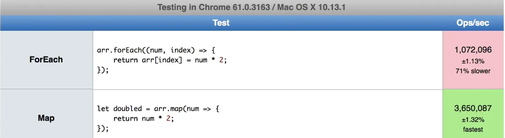

可以看到，在我到电脑上`forEach()`的执行速度比`map()`慢了70%。每个人的浏览器的执行结果会不一样。你可以使用下面的链接来测试一下: [Map vs. forEach - jsPref](https://jsperf.com/map-vs-foreach-speed-test)。

函数式角度的理解

如果你习惯使用函数是编程，那么肯定喜欢使用`map()`。因为`forEach()`会改变原始的数组的值，而`map()`会返回一个全新的数组，原本的数组不受到影响。

哪个更好呢？

取决于你想要做什么。

`forEach`适合于你并不打算改变数据的时候，而只是想用数据做一些事情 -- 比如存入数据库或则打印出来。

```javascript
let arr = ['a', 'b', 'c', 'd'];
arr.forEach((letter) => {
    console.log(letter);
});
// a
// b
// c
// d
```

`map()`适用于你要改变数据值的时候。不仅仅在于它更快，而且返回一个新的数组。这样的优点在于你可以使用复合(composition)(map(), filter(), reduce()等组合使用)来玩出更多的花样。

```javascript
let arr = [1, 2, 3, 4, 5];
let arr2 = arr.map(num => num * 2).filter(num => num > 5);
// arr2 = [6, 8, 10]
```

我们首先使用map将每一个元素乘以2，然后紧接着筛选出那些大于5的元素。最终结果赋值给`arr2`。

核心要点

* 能用`forEach()`做到的，`map()`同样可以。反过来也是如此。

* `map()`会分配内存空间存储新数组并返回，`forEach()`不会返回数据。

* `forEach()`允许`callback`更改原始数组的元素。`map()`返回新的数组。


***

## 75. 写出一个函数trans，将数字转换成汉语的输出，输入为不超过10000亿的数字。

```javascript
trans(123456) —— 十二万三千四百五十六
trans（100010001）—— 一亿零一万零一
```

**参考答案：**

```javascript
function NumToChina(n) {
  n = n.toString();
  let numbers = ['零', '一', '二', '三', '四', '五', '六', '七', '八', '九'];
  if (n === '0') return numbers[0];
  let units = ['', '十', '百', '千'];
  let len = n.length;
  let res = '';
  for (let i = 0; i < len; i++) {
    let num = Number(n[i]);
    if (num != 0) {
      if (n[i - 1] === '0') res = res + numbers[0];
      res = res + numbers[num] + units[len - i - 1];
    }
  }
  if (len == 2 && n[0] == '1') res = res.slice(1);
  return res;
}

function numTo(n) {
  const isLose = n < 0;
  n = Math.abs(n).toString();
  let res = [];
  let len = n.length;
  for (let i = len; i > 0; i -= 4) {
    res.push(NumToChina(n.slice(Math.max(0, i - 4), i)));
  }
  const units = ['', '万', '亿'];
  for (let i = 0; i < res.length; i++) {
    if (res[i] == '') continue;
    res[i] = res[i] + units[i];
  }
  isLose && res.push('负');
  return res.reverse().join('');
}
numTo(12345);
```

以下是原答案：

```javascript
/**
 * 阿拉伯数字转中文数字,
 * 如果传入数字时则最多处理到21位，超过21位js会自动将数字表示成科学计数法，导致精度丢失和处理出错
 * 传入数字字符串则没有限制
 * @param {number|string} digit
 */
function toZhDigit(digit) {
  digit = typeof digit === 'number' ? String(digit) : digit;
  const zh = ['零', '一', '二', '三', '四', '五', '六', '七', '八', '九'];
  const unit = ['千', '百', '十', ''];
  const quot = ['万', '亿', '兆', '京', '垓', '秭', '穰', '沟', '涧', '正', '载', '极', '恒河沙', '阿僧祗', '那由他', '不可思议', '无量', '大数'];

  let breakLen = Math.ceil(digit.length / 4);
  let notBreakSegment = digit.length % 4 || 4;
  let segment;
  let zeroFlag = [], allZeroFlag = [];
  let result = '';

  while (breakLen > 0) {
    if (!result) { // 第一次执行
      segment = digit.slice(0, notBreakSegment);
      let segmentLen = segment.length;
      for (let i = 0; i < segmentLen; i++) {
        if (segment[i] != 0) {
          if (zeroFlag.length > 0) {
            result += '零' + zh[segment[i]] + unit[4 - segmentLen + i];
            // 判断是否需要加上 quot 单位
            if (i === segmentLen - 1 && breakLen > 1) {
              result += quot[breakLen - 2];
            }
            zeroFlag.length = 0;
          } else {
            result += zh[segment[i]] + unit[4 - segmentLen + i];
            if (i === segmentLen - 1 && breakLen > 1) {
              result += quot[breakLen - 2];
            }
          }
        } else {
          // 处理为 0 的情形
          if (segmentLen == 1) {
            result += zh[segment[i]];
            break;
          }
          zeroFlag.push(segment[i]);
          continue;
        }
      }
    } else {
      segment = digit.slice(notBreakSegment, notBreakSegment + 4);
      notBreakSegment += 4;

      for (let j = 0; j < segment.length; j++) {
        if (segment[j] != 0) {
          if (zeroFlag.length > 0) {
            // 第一次执行zeroFlag长度不为0，说明上一个分区最后有0待处理
            if (j === 0) {
              result += quot[breakLen - 1] + zh[segment[j]] + unit[j];
            } else {
              result += '零' + zh[segment[j]] + unit[j];
            }
            zeroFlag.length = 0;
          } else {
            result += zh[segment[j]] + unit[j];
          }
          // 判断是否需要加上 quot 单位
          if (j === segment.length - 1 && breakLen > 1) {
            result += quot[breakLen - 2];
          }
        } else {
          // 第一次执行如果zeroFlag长度不为0, 且上一划分不全为0
          if (j === 0 && zeroFlag.length > 0 && allZeroFlag.length === 0) {
            result += quot[breakLen - 1];
            zeroFlag.length = 0;
            zeroFlag.push(segment[j]);
          } else if (allZeroFlag.length > 0) {
            // 执行到最后
            if (breakLen == 1) {
              result += '';
            } else {
              zeroFlag.length = 0;
            }
          } else {
            zeroFlag.push(segment[j]);
          }

          if (j === segment.length - 1 && zeroFlag.length === 4 && breakLen !== 1) {
            // 如果执行到末尾
            if (breakLen === 1) {
              allZeroFlag.length = 0;
              zeroFlag.length = 0;
              result += quot[breakLen - 1];
            } else {
              allZeroFlag.push(segment[j]);
            }
          }
          continue;
        }
      }

    --breakLen;
  }

  return result;
}
```

从左至右，先把数字按万分位分组，每组加上对应的单位(万，亿, ...)，然后每个分组进行迭代。

breakLen表示能够分成多少个分组，notBreakSegment表示当前已处理过的分组长度。

while循环中有一个if判断，如果不存在result，则说明是第一次处理，那么在处理上是有些不同的。

* 首先，在segment的赋值上，第一次是从0开始，取notBreakSegment的长度，后面每迭代一次notBreakSegment都要在上一个值上加4

* 其次，第一次处理不用判断上一个分组是否全为0的情形，这里zeroFlag表示每一个分组内存在0的个数，allZeroFalg表示当前分组前面出现的全为0的分组的个数。

* 此外，在第一次执行时，还处理了只传入为0的情形。

每次处理segment\[i]时，都要先判断当前值是否为0，为0时则直接记录到zeroFlag，然后进入下一次迭代，如果不为0，首先得判断上一个数字是否为0, 然后还得根据上一个0是否位于上一个分组的末位，来添加quot，最后还需要清空标志位。如果当前分组全为0，则标记allZeroFlag，所以在下一个分组处理时，还需要判断上一个分组是否全为0。


***

## 76. 怎么把函数中的 arguments 转成数组？


**参考答案：**

函数中的 arguments 是一个对象，不是一个数组，严格来说它是一个类数组对象。

1、调用数组的原型方法来转换

```javascript
var foo = function(a,b){
        var arr = Array.prototype.slice.call(arguments);
        console.log(arr)
}
foo(1,2) //(2) [1, 2]
```

2、使用ES6的新语法 `Array.from()` 来转换

`Array.from` 方法用于将两类对象转为真正的数组：类似数组的对象和可遍历对象（包括Set和Map）。

```javascript
var foo = function(a,b){
        var arr = Array.from(arguments);
        console.log(arr)
}
foo(1,2) // (2) [1, 2]
```

3、使用 for

使用 for 循环挨个将 arguments 对象中的内容复制给新数组中

```javascript
function toArray(){
    var args = []; 
    for (var i = 1; i < arguments.length; i++) { 
        args.push(arguments[i]); 
    } 
    return args;
}
```

4、利用 ES6 中的 rest 参数转换

```javascript
let a = (…args) => args;
```


***

## 77. 虚拟dom渲染到页面的时候，框架会做哪些处理？


**参考答案：**

当虚拟DOM渲染到页面时，框架通常会执行以下动作：

1. Diff算法：框架会将新的虚拟DOM与旧的虚拟DOM进行对比，找出它们之间的差异。这个过程被称为Diff算法。Diff算法的目标是通过最小化操作次数来更新真实DOM，以提高性能。

2. 创建和更新DOM节点：根据Diff算法的结果，框架会创建或更新需要改变的DOM节点。如果一个节点在新的虚拟DOM中存在但在旧的虚拟DOM中不存在，框架会创建该节点并添加到页面上。如果一个节点在新的虚拟DOM和旧的虚拟DOM中都存在，但其属性或子节点发生变化，框架会更新相应的DOM节点。这样可以确保只有实际需要更改的部分才会重新渲染，减少不必要的操作。

3. 处理事件绑定：框架会重新绑定事件处理程序，以便在更新后正确响应用户交互。这包括添加、更新或删除事件监听器。

4. 卸载节点：如果一个节点在新的虚拟DOM中不存在但在旧的虚拟DOM中存在，框架会从页面上移除该节点。这可以防止内存泄漏和资源浪费。

5. 触发生命周期钩子：在渲染到页面后，框架会触发相应的生命周期钩子函数（如Vue中的`mounted`），以便开发人员可以在适当的时机执行自定义操作。

虚拟DOM渲染到页面时，框架会根据Diff算法的结果进行DOM的创建、更新和删除操作。这样可以最小化对真实DOM的改动，提高性能，并确保页面与新的虚拟DOM保持同步。此外，框架还会处理事件绑定和触发生命周期钩子函数，以便提供更多的开发扩展能力和灵活性。


***

## 78. async/await、generator、promise 这三者的关联和区别是什么?


**参考答案：**

`promise`与`async/await` 函数都是用来解决`JavaScript`中的异步问题，从最开始的回调函数处理异步，到`Promise`处理异步，到`Generator`处理异步，再到`Async/await`处理异步，每一次的技术更新都使得`JavaScript`处理异步的方式更加优雅。

从目前来看，`Async/await`被认为是异步处理的终极解决方案，让JS的异步处理越来越像同步任务。

关联

* async/await：是建立在Generator函数的语法糖，可以更方便地实现异步编程。async 函数返回一个 Promise 对象，await 表达式会阻塞代码执行，直到 Promise 对象状态变为 resolved。

* Promise：是一种异步编程模型，可以将回调函数嵌套的代码转换为链式调用。Promise 由 pending、fulfilled 和 rejected 三种状态，分别代表进行中、已完成和已失败。

* Generator：是一种迭代器，可以通过 yield 表达式暂停代码执行，并通过 next() 方法恢复执行。Generator 可以配合 Promise 实现异步流程控制。

区别

* async/await：是 ES8 引入的新特性，可以让异步编程看起来像同步编程，更加易读易写。async/await 只能用于函数内部，不能用于顶层代码（例如全局作用域）。（PS：高版本的Node中，可以在顶层使用 await）

* Promise：是 ES6 引入的新特性，使用 then() 方法和 catch() 方法注册回调函数，实现异步编程。Promise 可以使用 race() 方法和 all() 方法处理多个异步操作。

* Generator：是 ES6 引入的新特性，可以通过 yield 表达式暂停和恢复代码执行，实现异步流程控制。Generator 需要手动执行 next() 方法，才能继续执行下一步操作。


***

## 79. AST语法树是什么？


**参考答案：**

AST是抽象语法树（Abstract Syntax Tree）的缩写，它是一种用于表示程序源代码结构的树状数据结构。AST可以将源代码解析为一个由节点组成的树形结构，每个节点代表着代码中的一个特定语法结构或语义概念。

在编译过程中，AST扮演了重要的角色。它被用于分析、转换和生成代码。以下是一些常见的使用情况：

1. 解析和验证：通过解析源代码，将其转换为AST之后，可以对代码进行验证和静态分析。这包括检查语法错误、类型错误、变量引用等，并发现潜在的问题或优化机会。

2. 优化和转换：AST可以用于执行各种优化操作，例如消除冗余代码、提取共享表达式、内联函数调用等。它还能够进行代码转换，例如将ES6代码转换为ES5兼容的代码、将模板编译为渲染函数等。

3. 生成代码：从AST中可以再次生成目标代码，如JavaScript、HTML、CSS等。这使得可以将源代码翻译为其他语言、在不同平台上执行代码等。

AST通常是由多个节点组成的树状结构，每个节点代表一个语法单位或表达式。节点之间的关系通过父子关系或兄弟关系来表示程序的结构。在不同的编程语言和工具中，AST可能有不同的表示方式和节点类型。

通过使用AST，开发人员可以更好地理解和分析代码的结构，从而进行静态分析、优化和转换等操作。它也为很多编程工具提供了基础，如编译器、静态代码分析工具和IDE等。


***

## 80. 如何让 Proxy 去监听基本数据类型？


**参考答案：**

`Proxy`无法直接监听基本数据类型（如字符串、数字、布尔值等），因为它们是不可变的。`Proxy`只能在对象级别上进行操作，而不是基本数据类型。

当我们尝试使用`Proxy`包装基本数据类型时，会得到一个`TypeError`错误，因为基本数据类型不具有属性和方法。

以下展示了尝试在基本数据类型上应用`Proxy`时会发生的错误：

```javascript
const value = 'Hello';

const handler = {
  set(target, property, value) {
    console.log(`Setting property '${property}' to '${value}'`);
    target[property] = value;
    return true;
  }
};

const proxyValue = new Proxy(value, handler); // TypeError: Cannot create proxy with a non-object as target
```

如果要监听基本数据类型的更改，最好使用其他方式，例如通过触发事件或调用回调函数来通知更改。可以创建一个自定义的数据包装器，将基本数据类型包装在对象中，并在该对象上实现监听逻辑。这样，可以在包装器对象上添加`Proxy`以监听其属性的更改。

以下是一个示例，演示如何使用自定义的数据包装器来监听基本数据类型的更改：

```javascript
function ValueWrapper(value) {
  this.value = value;
  this.onChange = null;
}

ValueWrapper.prototype.setValue = function(newValue) {
  this.value = newValue;
  if (typeof this.onChange === 'function') {
    this.onChange(this.value);
  }
};

const wrapper = new ValueWrapper('Hello');

const handler = {
  set(target, property, value) {
    console.log(`Setting property '${property}' to '${value}'`);
    target[property] = value;
    if (typeof target.onChange === 'function') {
      target.onChange(target.value);
    }
    return true;
  }
};

const proxyWrapper = new Proxy(wrapper, handler);

proxyWrapper.onChange = newValue => {
  console.log(`Value changed: ${newValue}`);
};

proxyWrapper.setValue('Hi'); // 输出: Setting property 'value' to 'Hi', Value changed: Hi
```

在上述示例中，我们创建了一个`ValueWrapper`对象作为数据包装器，并在其原型上定义了`setValue`方法来设置值并触发更改事件。然后，我们使用`Proxy`对该包装器对象进行拦截，以监听`value`属性的更改，并在适当时调用回调函数 `onChange`。

通过这种方式，可以实现对基本数据类型的更改进行监听和响应。


***

## 81. 如果空数组调用reduce会发生什么？

**参考答案：**

当空数组调用`reduce()`方法时，如果没有提供初始值参数，则会抛出一个`TypeError`错误。这是因为在空数组上调用`reduce()`方法时，无法得到初始累积值。

例如：

```javascript
const emptyArray = [];
const result = emptyArray.reduce((accumulator, currentValue) => accumulator + currentValue);
// TypeError: Reduce of empty array with no initial value
```

要解决这个问题，可以提供一个初始值参数作为`reduce()`的第二个参数。这样，在空数组的情况下，将使用该初始值作为结果返回。

以下是对空数组使用`reduce()`并提供初始值的示例：

```javascript
const emptyArray = [];
const initialValue = 0;
const result = emptyArray.reduce((accumulator, currentValue) => accumulator + currentValue, initialValue);

console.log(result); // 输出: 0
```

在上述代码中，我们通过将初始值设置为0，确保了在空数组的情况下也能正确返回结果。

***

## 82. 数组中的reduce方法有用过吗，说说它的具体用途？


**参考答案：**

`reduce()`方法在JavaScript中是一个高阶函数，用于对数组中的每个元素进行累积操作，最终返回一个单一的值。

具体来说，`reduce()`方法接受两个参数：回调函数和可选的初始值。回调函数在每个数组元素上被调用，并且可以接受四个参数：累积值（上一次回调函数的返回值或初始值）、当前值、当前索引和原始数组。

`reduce()`方法的执行过程如下：

1. 如果提供了初始值，则将其作为累积值（accumulator），否则使用数组的第一个元素作为初始累积值。

2. 对于数组中的每个元素，都调用回调函数，并传递当前累积值、当前值、当前索引和原始数组作为参数。

3. 回调函数返回的值作为下一次调用的累积值。

4. 最终，`reduce()`方法返回最后一次调用回调函数的返回值。

以下是一个示例，演示了如何使用`reduce()`方法计算数组中所有元素的总和：

```javascript
const numbers = [1, 2, 3, 4, 5];
const sum = numbers.reduce((accumulator, currentValue) => accumulator + currentValue);

console.log(sum); // 输出: 15
```

在上述代码中，使用`reduce()`方法对`numbers`数组中的每个元素进行累加操作，并将结果存储在`sum`变量中。

`reduce()`方法非常强大，可以用于解决各种累积计算问题，如求和、求平均值、查找最大/最小值等。

它提供了一种简洁而灵活的方式来处理数组数据，并生成一个单一的结果。


***

## 83. 改变this指向的方法有哪些？


**参考答案：**

有以下几种常用的方法可以改变`this`的指向：

1. 使用`bind()`方法：`bind()`方法会创建一个新的函数，并将其内部的`this`绑定到指定的对象。例如：

```javascript
function sayHello() {
  console.log("Hello, " + this.name);
}

const person = { name: "John" };
const boundFunction = sayHello.bind(person);
boundFunction(); // 输出: Hello, John
```

* 使用箭头函数（Arrow Function）：箭头函数没有自己的`this`，它会继承外部作用域的`this`。因此，在箭头函数中使用`this`时，它会指向定义时所在的上下文。例如：

```javascript
const obj = {
  name: "Alice",
  sayHello: function() {
    setTimeout(() => {
      console.log("Hello, " + this.name);
    }, 1000);
  }
};

obj.sayHello(); // 输出: Hello, Alice
```

* 使用`call()`或`apply()`方法：`call()`和`apply()`方法可以立即调用函数，并显式指定函数内部的`this`值。它们之间的区别在于参数的传递方式。例如：

```javascript
function sayHello() {
  console.log("Hello, " + this.name);
}

const person = { name: "John" };
sayHello.call(person); // 输出: Hello, John

// 或者使用 apply()
sayHello.apply(person); // 输出: Hello, John
```

***

## 84. addEventListener 第三个参数

addEventListener 语法

```plaintext
addEventListener(type, listener); 
addEventListener(type, listener, options); 
addEventListener(type, listener, useCapture); 
```

`type`表示监听[事件类型](https://developer.mozilla.org/zh-CN/docs/Web/Events)的大小写敏感的字符串。

`listener`当所监听的事件类型触发时，会接收到一个事件通知（实现了 [`Event`](https://developer.mozilla.org/zh-CN/docs/Web/API/Event) 接口的对象）对象。`listener` 必须是一个实现了 [`EventListener`](https://developer.mozilla.org/zh-CN/docs/Web/API/EventTarget/addEventListener) 接口的对象，或者是一个[函数](https://developer.mozilla.org/zh-CN/docs/Web/JavaScript/Guide/Functions)。有关回调本身的详细信息，请参阅[事件监听回调](https://developer.mozilla.org/zh-CN/docs/Web/API/EventTarget/addEventListener#%E4%BA%8B%E4%BB%B6%E7%9B%91%E5%90%AC%E5%9B%9E%E8%B0%83)


`options` 可选一个指定有关 `listener` 属性的可选参数对象。可用的选项如下：

* `capture` 可选一个布尔值，表示 `listener` 会在该类型的事件捕获阶段传播到该 `EventTarget` 时触发。

* `once` 可选一个布尔值，表示 `listener` 在添加之后最多只调用一次。如果为 `true`，`listener` 会在其被调用之后自动移除。

* `passive` 可选一个布尔值，设置为 `true` 时，表示 `listener` 永远不会调用 `preventDefault()`。如果 listener 仍然调用了这个函数，客户端将会忽略它并抛出一个控制台警告。查看[使用 passive 改善滚屏性能](https://developer.mozilla.org/zh-CN/docs/Web/API/EventTarget/addEventListener#%E4%BD%BF%E7%94%A8_passive_%E6%94%B9%E5%96%84%E6%BB%9A%E5%B1%8F%E6%80%A7%E8%83%BD)以了解更多。

* `signal` 可选[`AbortSignal`](https://developer.mozilla.org/zh-CN/docs/Web/API/AbortSignal)，该 `AbortSignal` 的 [`abort()`](https://developer.mozilla.org/zh-CN/docs/Web/API/AbortController/abort) 方法被调用时，监听器会被移除。

`useCapture` 可选一个布尔值，表示在 DOM 树中注册了 `listener` 的元素，是否要先于它下面的 `EventTarget` 调用该 `listener`。当 useCapture（设为 true）时，沿着 DOM 树向上冒泡的事件不会触发 listener。当一个元素嵌套了另一个元素，并且两个元素都对同一事件注册了一个处理函数时，所发生的事件冒泡和事件捕获是两种不同的事件传播方式。事件传播模式决定了元素以哪个顺序接收事件。进一步的解释可以查看 [DOM Level 3 事件](https://www.w3.org/TR/DOM-Level-3-Events/#event-flow)及 [JavaScript 事件顺序](https://www.quirksmode.org/js/events_order.html#link4)文档。如果没有指定，`useCapture` 默认为 `false`。


备注： 对于事件目标上的事件监听器来说，事件会处于“目标阶段”，而不是冒泡阶段或者捕获阶段。捕获阶段的事件监听器会在任何非捕获阶段的事件监听器之前被调用。


***

## 85. 是否有使用过空值合并运算符（??），举几个可以使用的场景。


**参考答案：**

空值合并操作符（??） 是一个逻辑操作符，当左侧的操作数为 null 或者 undefined 时，返回其右侧操作数，否则返回左侧操作数。

与逻辑或操作符（||） 不同，逻辑或操作符会在左侧操作数为假值时返回右侧操作数。也就是说，如果使用 || 来为某些变量设置默认值，可能会遇到意料之外的行为。比如为假值（例如，'' 或 0）时。见下面的例子。

```javascript
const foo = null ?? 'default string';  
console.log(foo);  
// expected output: "default string"  
  
const baz = 0 ?? 42;  
console.log(baz);  
// expected output: 0  
```

示例场景

使用空值合并操作符

在这个例子中，我们使用空值合并操作符为常量提供默认值，保证常量不为 null 或者 undefined。

```javascript
const nullValue = null;  
const emptyText = ""; // 空字符串，是一个假值，Boolean("") === false  
const someNumber = 42;  
  
const valA = nullValue ?? "valA 的默认值";  
const valB = emptyText ?? "valB 的默认值";  
const valC = someNumber ?? 0;  
  
console.log(valA); // "valA 的默认值"  
console.log(valB); // ""（空字符串虽然是假值，但不是 null 或者 undefined）  
console.log(valC); // 42  
```

为变量赋默认值

以前，如果想为一个变量赋默认值，通常的做法是使用逻辑或操作符（||）：

```javascript


let foo;  
  
//  foo is never assigned any value so it is still undefined  
let someDummyText = foo || 'Hello!';  
```

然而，由于 || 是一个布尔逻辑运算符，左侧的操作数会被强制转换成布尔值用于求值。任何假值（0， ''， NaN， null， undefined）都不会被返回。这导致如果你使用0，''或NaN作为有效值，就会出现不可预料的后果。

```javascript
let count = 0;  
let text = "";  
  
let qty = count || 42;  
let message = text || "hi!";  
console.log(qty);     // 42，而不是 0  
console.log(message); // "hi!"，而不是 ""  
```

空值合并操作符可以避免这种陷阱，其只在第一个操作数为null 或 undefined 时（而不是其它假值）返回第二个操作数：

```plaintext
let myText = ''; // An empty string (which is also a falsy value)  
  
let notFalsyText = myText || 'Hello world';  
console.log(notFalsyText); // Hello world  
  
let preservingFalsy = myText ?? 'Hi neighborhood';  
console.log(preservingFalsy); // '' (as myText is neither undefined nor null)  
```

### 短路

与 OR 和 AND 逻辑操作符相似，当左表达式不为 null 或 undefined 时，不会对右表达式进行求值。

```javascript
function A() { console.log('函数 A 被调用了'); return undefined; }  
function B() { console.log('函数 B 被调用了'); return false; }  
function C() { console.log('函数 C 被调用了'); return "foo"; }  
  
console.log( A() ?? C() );  
// 依次打印 "函数 A 被调用了"、"函数 C 被调用了"、"foo"  
// A() 返回了 undefined，所以操作符两边的表达式都被执行了  
  
console.log( B() ?? C() );  
// 依次打印 "函数 B 被调用了"、"false"  
// B() 返回了 false（既不是 null 也不是 undefined）  
// 所以右侧表达式没有被执行  
```


***

## 86. 下面代码的输出是什么？

```javascript
const obj = {
 fn1: () => console.log(this),
 fn2: function() {console.log(this)}
}

obj.fn1();
obj.fn2();

const x = new obj.fn1();
const y = new obj.fn2();
```

**参考答案：**

在上面的代码中，obj 对象包含两个方法 fn1 和 fn2。fn1 使用箭头函数定义，而 fn2 使用普通函数定义。

对于箭头函数，它没有自己的 this 值，也就是说它会捕获上下文中的 this 值，因此 fn1 中的 this 指向的是全局对象 window（或者 undefined，如果运行环境是严格模式）。因此，当我们调用 obj.fn1() 时，输出结果为 window（或 undefined）。

对于普通函数，它的 this 值是在运行时动态绑定的。因此，当我们调用 obj.fn2() 时，输出结果为 obj 对象本身。

接下来，代码中分别使用 new 运算符创建了 obj.fn1 和 obj.fn2 的实例 x 和 y。

\*\*由于箭头函数没有自己的 this 值，所以尝试使用 new 运算符创建实例会导致 TypeError 错误。\*\*也就是 `new obj.fn1() `会报错。

而对于普通函数，new 运算符可以正确地创建实例，并且 this 值指向新创建的实例对象。但因为上面执行 `new obj.fn1() `时 js 已经报错，`new obj.fn2(); `并不会执行。


***

## 87. 导致 JavaScript 中 this 指向混乱的原因是什么?


**参考答案：**

JavaScript 中 this 指向混乱的原因主要有以下几点：

1. 函数调用方式不同：JavaScript 中函数的调用方式有多种，包括普通函数调用、方法调用、构造函数调用和箭头函数等。不同的调用方式会导致 this 的指向不同。

2. 丢失绑定：当一个函数被单独调用时，即没有任何对象或上下文与之相关联时，this 将指向全局对象（在浏览器环境中通常是 `window` 对象）。这种情况下，如果函数内部使用了 this，则可能会出现意外结果。

3. 隐式绑定丢失：当一个方法从对象中切割出来并作为独立函数调用时，隐式绑定将会丢失，导致 this 不再指向原对象。这往往发生在将对象方法作为回调函数传递给其他函数的情况下。

4. 显式绑定问题：使用 `.call()`、`.apply()` 或 `.bind()` 方法可以显式地绑定函数的 this，但如果不小心使用或错误地使用这些方法，也可能导致 this 指向混乱。

5. 箭头函数中的 this：箭头函数没有自己的 this 绑定机制，它会从外围作用域继承 this。这意味着箭头函数中的 this 与其定义时的上下文相关联，而不是调用时的上下文。

6. 异步操作中的 this：在异步函数或回调函数中，this 的指向可能会发生变化，因为它们的执行上下文可能会改变。

为了避免 this 指向混乱的问题，可以采取以下措施：

* 使用箭头函数，它能够继承外部作用域的 this。

* 使用 `.bind()`、`.call()` 或 `.apply()` 方法显式地绑定函数的 this。

* 使用闭包将需要引用的 this 缓存起来。

* 在方法调用时确保上下文正确。


***

## 88. cookie 的有效时间设置为 0 会怎么样


**参考答案：**

Cookie过期时间设置为0，表示跟随系统默认，其销毁与Session销毁时间相同，会在浏览器关闭后删除。


***

## 89. Javscript数组的常用方法有哪些？


**参考答案：**

以下是一些常见的JavaScript数组方法：

1. `push()`: 在数组末尾添加一个或多个元素，并返回新数组的长度。

2. `pop()`: 移除并返回数组末尾的元素。

3. `unshift()`: 在数组开头添加一个或多个元素，并返回新数组的长度。

4. `shift()`: 移除并返回数组开头的元素。

5. `concat()`: 合并两个或更多数组，并返回新的合并后的数组，不会修改原始数组。

6. `slice()`: 从数组中提取指定位置的元素，返回一个新的数组，不会修改原始数组。

7. `splice()`: 从指定位置删除或替换元素，可修改原始数组。

8. `indexOf()`: 查找指定元素在数组中的索引，如果不存在则返回-1。

9. `lastIndexOf()`: 从数组末尾开始查找指定元素在数组中的索引，如果不存在则返回-1。

10. `includes()`: 检查数组是否包含指定元素，返回一个布尔值。

11. `join()`: 将数组中的所有元素转为字符串，并使用指定的分隔符连接它们。

12. `reverse()`: 颠倒数组中元素的顺序，会修改原始数组。

13. `sort()`: 对数组中的元素进行排序，默认按照字母顺序排序，会修改原始数组。

14. `filter()`: 创建一个新数组，其中包含符合条件的所有元素。

15. `map()`: 创建一个新数组，其中包含对原始数组中的每个元素进行操作后的结果。

16. `reduce()`: 将数组中的元素进行累积操作，返回一个单一的值。

17. `forEach()`: 对数组中的每个元素执行提供的函数。


***

## 90. 下面代码的输出是什么？

```javascript
console.log(typeof typeof typeof null);
console.log(typeof console.log(1));
```


**参考答案：**

第一行代码输出结果为 "string"。解释如下：

1. typeof null 返回 "object"，因为在JavaScript中，null 被认为是一个空对象引用。

2. typeof "object" 返回 "string"。

3. typeof "string" 返回 "string"。

因此，最终结果为 "string"。

第二行代码先输出 1，然后输出结果为 "undefined"。解释如下：

1. console.log(1) 输出 1。

2. console.log 函数没有返回值，因此返回 undefined。

3. typeof undefined 返回 "undefined"。

因此，最终结果为：

```plaintext
string
1
undefined
```


***

## 91. 前端的页面截图怎么实现？


**参考答案：**

前端实现页面截图主要有以下几种方式：

1. 使用浏览器自带的截图功能：在 Chrome 浏览器中，可以通过右键菜单或者快捷键 Ctrl + Shift + P 打开“命令菜单”，然后输入“截图”并选择相应选项即可。

2. 使用第三方插件或工具：例如 Awesome Screenshot、Nimbus Screenshot 等浏览器插件，或者 html2canvas、dom-to-image 等 JavaScript 库。

3. 使用 Canvas 绘制：通过 Canvas API 可以绘制出页面内容，并将其导出为图片格式。具体实现可以参考 Fabric.js、Puppeteer 等库。

4. 使用服务器端渲染：对于需要生成动态内容或者需要进行复杂操作的页面，可以使用服务器端渲染技术（如 Node.js 或 PHP）来生成网页截图。

以上这些方法各有优缺点。

* 使用浏览器截图功能简单便捷，但是可能无法自定义截图范围和格式；

* 使用第三方插件或工具需要安装额外的软件，而且可能存在安全风险；

* 使用 Canvas 绘制需要掌握一定的 Canvas 编程知识，而且可能会影响性能；

* 使用服务器端渲染则需要对服务器编程有一定的了解。

*

***

## 92. canvas 和 webgl 有什么区别？


**参考答案：**

Canvas和WebGL都是用于在Web浏览器中绘制图形和动画的技术，但它们在实现和功能上有一些区别：

1. 渲染方式：

   * Canvas：Canvas使用2D渲染上下文（2D context）来绘制图形和图像。它基于像素的绘图系统，通过JavaScript脚本控制渲染过程。

   * WebGL：WebGL（Web Graphics Library）是基于OpenGL ES标准的JavaScript API，它可以利用GPU进行硬件加速的3D图形渲染。WebGL使用着色器（shaders）编程，允许更复杂和高性能的图形渲染。

2. 功能和复杂性：

   * Canvas：Canvas提供了简单的2D图形绘制功能，包括绘制基本形状、路径、文本和图像等。它适用于绘制简单的图形和动画。

   * WebGL：WebGL提供了强大的3D图形渲染功能，包括高级的着色器编程、纹理映射、深度缓冲、光照效果等。它适用于创建复杂的3D图形、游戏和交互式可视化。

3. 编程难度：

   * Canvas：使用Canvas进行2D图形绘制相对简单，仅需基本的JavaScript知识和绘图API的了解即可开始绘制。

   * WebGL：WebGL的编程相对复杂，需要了解着色器编程和3D图形渲染的概念。使用WebGL需要掌握OpenGL ES或类似的图形编程知识。

选择Canvas还是WebGL取决于具体的需求。如果只需要简单的2D图形和动画，Canvas是一个不错的选择。但如果需要更高级的3D图形渲染和性能，或者开发复杂的游戏或可视化应用程序，那么WebGL可能更适合。


***

## 93. 如果要实现一个类似“谷歌图片”的系统，你会有哪些方面的考虑？


**参考答案：**

可以从以下几个方面考虑：

1. 设计界面和交互：首先需要设计一个美观、易用的用户界面，包括搜索框、图片展示区、分页、筛选器等。同时还需要设计一些交互细节，例如图片加载过程中的占位符、无结果时的提示信息、图片缩放和拖拽等。

2. 数据获取和处理：接下来需要考虑如何获取和处理图片数据。可以使用爬虫技术从其他网站抓取图片，也可以通过图片 API 或者图库合作获得。在获取到图片之后，还需要对其进行处理，例如压缩、裁剪、优化等。

3. 存储和管理图片：为了提高图片的访问速度和稳定性，需要将图片存储在 CDN 或者对象存储服务上，并建立相应的管理系统，包括上传、删除、修改、备份等功能。

4. 图片搜索和智能推荐：为了提高搜索体验和用户满意度，可以开发一些算法和模型，对图片进行分类、标记和关联，从而实现更精确的搜索和智能推荐功能。

5. 安全和隐私保护：在实现图片搜索和分享的同时，也需要注意安全和隐私保护。可以采用图像识别技术对涉黄、涉暴等不良内容进行过滤，防止违规图片的发布和传播。同时还需要保护用户隐私，避免非法获取和使用用户个人信息。


***

## 94. 前端路由 `a -> b -> c`这样前进，也可以返回 `c -> b -> a`，用什么数据结构来存比较高效


**参考答案：**

在前端路由中，常用的存储方式是栈（Stack）数据结构。栈是一种线性数据结构，具有后进先出（LIFO）的特点，即最后入栈的元素最先弹出栈。

当用户访问一个新页面时，可以将当前页面路由信息压入栈中。例如，在访问页面 a 时，可以将 a 的路由信息存储在栈顶。当用户访问 b 页面时，再将 b 的路由信息压入栈中，此时 a 的路由信息就被挤到了栈底。以此类推，当用户访问 c 页面时，c 的路由信息被压入栈顶，a 和 b 的路由信息都被挤到了栈底。

如果用户想要返回上一个页面，可以从栈顶弹出最后一个路由信息，并显示对应的页面。例如，在 c 页面返回 b 页面时，可以从栈顶弹出 c 的路由信息，然后显示 b 页面。此时，a 和 b 的路由信息还保留在栈中。如果用户再次返回上一个页面，则从栈顶弹出 b 的路由信息，然后显示 a 页面。此时，只有 a 的路由信息剩余在栈中。

使用栈数据结构来存储前端路由信息具有以下优点：

* 简单直观：栈数据结构易于理解和实现，符合前端路由的基本需求。

* 高效快速：在栈中压入和弹出元素都是 O(1) 的时间复杂度，不会对页面加载和响应产生太大的影响。

* 可扩展性：栈数据结构可以很容易地扩展到支持浏览器的前进和后退按钮。

在使用栈数据结构来存储前端路由信息时，还需要考虑如何处理浏览器刷新、从历史记录中跳转等特殊情况，并进行相应的错误处理。


***

## 95. 说说下面代码的输出是什么？

```javascript
function Foo(){
    Foo.a = function(){
        console.log(1);
    }
    this.a = function(){
        console.log(2)
    }
}

Foo.prototype.a = function(){
    console.log(3);
}

Foo.a = function(){
    console.log(4);
}

Foo.a();
let obj = new Foo();
obj.a();
Foo.a();
```


**参考答案：**

运行以上代码，输出结果为：

```plaintext
4
2
1
```

解析如下：

1. 首先，调用 Foo.a() 方法，输出 4。这是因为 Foo.a 是一个静态方法，直接在函数对象上定义的，所以可以通过函数名直接调用执行。

2. 然后，创建一个 Foo 类型的实例 obj，调用 obj.a() 方法，输出 2。这是因为在构造函数 Foo 中，使用 this.a 定义了实例属性 a，会覆盖原型中的同名属性。

3. 最后，再次调用 Foo.a() 方法，输出 1。虽然在上面已经定义了一个静态方法 Foo.a，但是在构造函数 Foo 中又重新定义了一个同名属性，导致静态方法被覆盖了，所以此时输出的是在构造函数中定义的方法。


***

## 96. 说说下面代码的执行过程

```javascript
var a=3;
2 function c(){
3    alert(a);
4 }
5 (function(){
6  var a=4;
7  c();
8 })();
```


**参考答案：**

这段代码的执行过程如下：

1. 定义变量 a 并赋值为 3。

2. 定义一个函数 c，该函数弹出一个对话框显示变量 a 的值。

3. 定义一个立即执行函数，并在其中定义变量 a 并赋值为 4。

4. 在立即执行函数中调用函数 c。

5. 函数 c 弹出一个对话框显示变量 a 的值，此时输出结果为 3。

原因是在立即执行函数中定义的变量 a 只在该函数作用域内有效，并没有改变全局作用域中的变量 a 的值，而函数 c 中使用的变量 a 是从全局作用域中查找的，因此输出的是全局作用域中的变量 a 的值。


***

## 97. 浏览器有哪几种缓存，各种缓存的优先级是什么样的？

**参考答案：**

在浏览器中，有以下几种常见的缓存：

1. 强制缓存：通过设置 Cache-Control 和 Expires 等响应头实现，可以让浏览器直接从本地缓存中读取资源而不发起请求。

2. 协商缓存：通过设置 Last-Modified 和 ETag 等响应头实现，可以让浏览器发送条件请求，询问服务器是否有更新的资源。如果服务器返回 304 Not Modified 响应，则表示客户端本地缓存仍然有效，可直接使用缓存的资源。

3. Service Worker 缓存：Service Worker 是一种特殊的 JS 脚本，可以拦截网络请求并返回缓存的响应，以实现离线访问和更快的加载速度等功能。

4. Web Storage 缓存：包括 localStorage 和 sessionStorage。localStorage 用于存储用户在网站上的永久性数据，而 sessionStorage 则用于存储用户会话过程中的临时数据。

这些缓存的优先级如下：

1. Service Worker 缓存：由于其可以完全控制网络请求，因此具有最高的优先级，即使是强制缓存也可以被它所覆盖。

2. 强制缓存：如果存在强制缓存，并且缓存没有过期，则直接使用缓存，不需要向服务器发送请求。

3. 协商缓存：如果强制缓存未命中，但协商缓存可用，则会向服务器发送条件请求，询问资源是否更新。如果服务器返回 304 Not Modified 响应，则直接使用缓存。

4. Web Storage 缓存：Web Storage 缓存的优先级最低，只有在网络不可用或者其他缓存都未命中时才会生效。


***

## 98. Promise 的 finally 怎么实现的？


**参考答案：**

Promise.prototype.finally 方法是 ES2018 引入的一个方法，用于在 Promise 执行结束后无论成功与否都会执行的操作。在实际应用中，finally 方法通常用于释放资源、清理代码或更新 UI 界面等操作。

以下是一个简单的实现方式：

```javascript
Promise.prototype.finally = function(callback) {
  const P = this.constructor;
  return this.then(
    value => P.resolve(callback()).then(() => value),
    reason => P.resolve(callback()).then(() => { throw reason })
  );
}
```

我们定义了一个名为 finally 的函数，它使用了 Promise 原型链的方式实现了 finally 方法。该函数接收一个回调函数作为参数，并返回一个新的 Promise 对象。如果原始 Promise 成功，则会先调用 callback 函数，然后将结果传递给下一个 Promise；如果失败，则会先调用 callback 函数，然后将错误信息抛出。

可以看到，在实现中，我们首先通过 this.constructor 获取当前 Promise 实例的构造函数，然后分别处理 Promise 的 resolved 和 rejected 状态的情况。在 resolved 状态时，我们先调用 callback 函数，然后将结果传递给新创建的 Promise 对象；在 rejected 状态时，我们也是先调用 callback 函数，然后将错误信息抛出。

这样，我们就完成了 Promise.prototype.finally 方法的实现。


***

## 99. Promise then 第二个参数和catch的区别是什么？


**参考答案：**

Promise 的 then 方法和 catch 方法都是用于处理 Promise 的 rejected 状态的情况。它们的区别在于：

1. then 方法的第二个参数

如果 Promise 的状态变为 rejected，then 方法的第二个参数会被调用。该参数是一个函数，可以接收一个参数，即 Promise 返回的错误信息。

例如：

```javascript
function asyncFunction() {
  return new Promise((resolve, reject) => {
    setTimeout(() => {
      reject(new Error('Something went wrong'));
    }, 1000);
  });
}

asyncFunction()
  .then(
    result => console.log(result), 
    error => console.error(error)
  );
```

在上述代码中，当 Promise 被 reject 时，then 方法的第二个参数会被调用，并打印出错误信息。

1. catch 方法

catch 方法相当于 then 方法的第二个参数，也是用于处理 Promise 的 rejected 状态的情况。不同之处在于，catch 方法可以链式调用，而不需要在每次调用 then 方法时都传递第二个参数。

例如：

```javascript
function asyncFunction() {
  return new Promise((resolve, reject) => {
    setTimeout(() => {
      reject(new Error('Something went wrong'));
    }, 1000);
  });
}

asyncFunction()
  .then(result => console.log(result))
  .catch(error => console.error(error));
```

在上述代码中，当 Promise 被 reject 时，catch 方法会被调用，并打印出错误信息。

因此，then 方法的第二个参数和 catch 方法都是用于处理 Promise 的 rejected 状态的情况，但前者需要在每次调用 then 方法时都传递第二个参数，而后者则可以链式调用。


***


## 100. 下面代码的输出是什么？

```javascript
var name = '123';

var obj = {
 name: '456',
 print: function() {
  function a() {
    console.log(this.name);
  }
  a();
 }
}

obj.print();
```

**参考答案：**

上述代码输出结果为 "123"。解释如下：

1. 在全局作用域中声明了变量 name，值为字符串 "123"。

2. 声明一个对象 obj，包含属性 name 和方法 print，其中 name 属性的值为字符串 "456"，print 方法中定义了函数 a。

3. 当执行 obj.print() 时，会调用 print 方法，并在其中定义了函数 a。

4. 函数 a 中调用 console.log(this.name) 方法。由于此时 this 指向全局对象（即 window 对象），因此执行 this.name 等价于执行 window.name。

5. 根据步骤1，window.name 的值为字符串 "123"，因此最终输出结果为 "123"。

需要注意的是，在JavaScript中，this 的值取决于函数在何处被调用。如果该函数是作为对象的方法进行调用的，则 this 指向该对象；否则，this 指向全局对象。在本例中，虽然函数 a 被定义在 print 方法中，但是它并没有作为 obj 的方法进行调用，因此 this 指向全局对象。


***

## 101. generator 是怎么做到中断和恢复的？


**参考答案：**

Generator 是一种特殊的函数类型，可以在函数执行过程中暂停和恢复执行。它通过使用 yield 表达式来实现中断和恢复执行的功能。

当 Generator 函数被调用时，它并不会立即执行，而是返回一个迭代器对象。每次调用迭代器对象的 next() 方法时，Generator 函数会从上一次执行的位置继续执行，直到遇到下一个 yield 表达式或函数结束。此时，Generator 函数将返回一个包含当前值和执行状态的对象，其中 value 属性表示 yield 表达式的结果，done 属性表示是否执行完毕。

例如，下面是一个简单的 Generator 函数示例：

```plaintext
function* myGenerator() {
  console.log('Step 1');
  yield;
  console.log('Step 2');
  yield;
  console.log('Step 3');
}
const gen = myGenerator();
gen.next(); // 输出 Step 1
gen.next(); // 输出 Step 2
gen.next(); // 输出 Step 3
```

在这个示例中，myGenerator() 函数包含三个 yield 表达式，每次调用迭代器对象的 next() 方法都会从上一次执行的位置继续执行，直到遇到下一个 yield 表达式或函数结束。

当执行第一个 gen.next() 方法时，输出 Step 1，并暂停执行，将控制权交回给调用者。当再次调用 gen.next() 方法时，继续执行后面的代码，输出 Step 2，并再次暂停执行。最后，再次调用 gen.next() 方法时，完成函数的执行，输出 Step 3，并返回一个包含 value 和 done 属性的对象。

通过使用 yield 表达式和迭代器对象，Generator 函数可以实现中断和恢复执行的功能，从而提供更灵活、更高效的 JavaScript 编程方式。


***

## 102. 为什么要区分宏任务和微任务？它们的执行优先级是什么？


**参考答案：**

宏任务（macrotask）和微任务（microtask）的区分主要是为了解决 JavaScript 引擎中不同任务之间的执行优先级问题。

宏任务通常包括以下几种：

* setTimeout 和 setInterval 定时器

* DOM 事件处理程序

* AJAX 请求的回调函数

* script 标签的加载和执行

对于宏任务，JavaScript 引擎会将其添加到任务队列（task queue）中，在当前任务执行完毕后按顺序依次执行。

而微任务通常包括以下几种：

* Promise 的 then 方法和 catch 方法

* async/await 中的 await 表达式

* MutationObserver 监听器

对于微任务，JavaScript 引擎也会将其添加到任务队列中，但是微任务的执行在当前宏任务执行结束后立即进行，也就是说微任务具有更高的执行优先级，可以优先于下一个宏任务执行。

通过区分宏任务和微任务，我们可以更好地控制任务的执行顺序，提高应用程序的性能和响应速度。例如，在处理一些异步操作时，可以使用 Promise 来代替普通的回调函数，并通过 then 方法和 catch 方法来实现更灵活、更高效的任务处理方式。同时，在编写代码时需要注意，尽量避免在宏任务中进行耗时操作，以免影响其他任务的执行。

总之，宏任务和微任务的区分是为了更好地协调任务的执行优先级，提高 JavaScript 的运行效率和代码的可读性。


***

## 103. 说说你对 webpack5 模块联邦的了解？


**参考答案：**

Webpack 5 的模块联邦（`Module Federation`）是一种新的技术，可以实现多个独立 Webpack 构建之间的共享模块和代码。它通过让每个构建的应用程序能够使用其他应用程序中的模块来提高代码共享和复用的效率。

Module Federation 基于 webpack 的远程容器特性。它允许将一个应用程序的某些模块打包为一个独立的、可远程加载的 bundle，并在运行时动态地加载这些模块。这样，在另一个应用程序中就可以通过远程容器加载这些模块，并直接使用它们。这种方式可以避免重复打包和加载相同的模块或库，提高了应用程序的性能和效率。

Module Federation 的主要优势包括：

1. 多个应用程序之间可以共享代码和模块，从而减少重复代码量。

2. 应用程序可以更加灵活地划分为更小的子应用程序，从而降低应用程序的复杂度。

3. 可以避免在应用程序之间传递大量数据，从而提高应用程序的性能和效率。

4. 可以支持应用程序的动态加载和升级，从而实现更好的版本管理和迭代。

总之，Webpack 5 的模块联邦是一项重要的技术创新，可以帮助开发者更好地共享和复用代码、降低应用程序的复杂度，并提高应用程序的性能和效率。


***

## 104. Web Worker 是什么？


**参考答案：**

Web Worker 是 HTML5 标准中提供的一项技术，它可以让 JavaScript 脚本在后台线程运行，从而避免阻塞 UI 线程。Web Worker 可以创建一个独立的线程来执行脚本，从而使得主线程可以专注于用户交互和响应。

Web Worker 的主要特点包括：

1. 独立线程：Web Worker 可以在独立的线程中运行 JavaScript 代码，从而避免了在主线程中运行耗时任务的风险。

2. 沙箱环境：Web Worker 运行的 JavaScript 代码在一个受限的沙箱环境中，不能访问与主线程共享的 DOM、全局变量等资源，从而保证了数据安全性和代码稳定性。

3. 事件通信：Web Worker 可以通过事件来与主线程进行通信，从而实现线程间的数据传递和同步操作。

使用 Web Worker 可以改善因大量 JS 计算导致的卡顿问题，增强页面的稳定性和用户体验。

Web Worker 不仅可以在浏览器中运行，还可以在 Node.js 中运行，在实际应用和开发中都有广泛的应用。


***

## 105. 说说你对 ToPrimitive 的理解


**参考答案：**

ToPrimitive 是一个抽象操作，用于将一个值转换为原始值（primitive value），即字符串、数字或布尔值。

在 JavaScript 中，当需要将一个非原始值用作原始值时，会自动调用 `ToPrimitive` 操作。例如，在使用加法运算符时，如果其中一个操作数不是原始值，则会将其转换为原始值，这就是通过调用 `ToPrimitive` 来实现的。

ToPrimitive 操作的实现方式如下：

* 如果该值已经是原始类型，则直接返回该值。

* 如果该值是对象，则按照以下步骤进行转换：

  * 调用 valueOf() 方法并返回结果，如果结果是原始类型则直接返回该结果。

  * 调用 toString() 方法并返回结果，如果结果是原始类型则直接返回该结果。

* 如果都不是原始类型，则抛出 TypeError 异常。

示例：

```javascript
let obj = {
  [Symbol.toPrimitive](hint) {
    switch (hint) {
      case 'number':
        return 123;
      case 'string':
        return 'str';
      case 'default':
        return 'default';
      default:
        throw new Error();
     }
   }
};

2 * obj // 246
3 + obj // '3default'
obj == 'default' // true
String(obj) // 'str'
```


***

## 106. 如果要设计一个转盘组件，你会考虑哪些方面？有哪些是需要和业务方确认的技术细节？另外，如何从前端的角度进行防刷？


**参考答案：**

设计一个转盘组件需要考虑以下几个方面：

1. 功能需求：明确组件的功能需求，例如抽奖逻辑、转盘样式和动画效果等。

2. 技术选型：选择合适的技术实现该组件，例如 CSS3 动画或 Canvas 绘图等。

3. 数据处理：处理与后端交互的数据流程和数据结构，例如抽奖机会计数、奖品种类和数量等。

4. 用户体验：优化用户体验，例如加载速度、响应时间、错误提示和动画效果等。

5. 安全性：确保组件的安全性，例如防止刷奖、重复领奖和作弊等。

需要与业务方协调好的技术细节包括：

1. 抽奖规则：确定抽奖规则和奖品设置，并与业务方协商奖品库存、中奖概率和兑换方式等。

2. 后端接口：制定与后端交互的接口规范，包括请求参数、返回结果和接口安全验证等。

3. 防刷策略：与业务方协商防刷策略，例如限制 IP 访问频率、验证码验证和前端 JS 加密等。

4. 奖品发放：与业务方协商奖品发放方式和时机，例如邮寄地址、核验身份和奖品兑换码等。

对于前端如何防刷，可以考虑以下几种方法：

1. 限制抽奖次数：记录用户的抽奖次数，并且在达到限制条件时禁止继续抽奖。

2. IP 地址验证：通过前端或后端对用户的 IP 地址进行验证，以确保每个 IP 地址只能抽奖一次。

3. 验证码验证：使用验证码来防止机器人或恶意程序的攻击。

4. 前端 JS 加密：使用前端 JS 对关键信息进行加密，防止信息被篡改或伪造。为了增强安全性，也可以使用 HTTPS 协议来保障数据传输的安全性。

需要注意的是，以上方法并不能完全杜绝作弊行为，但可以大大降低作弊的可能性，从而提高组件的可靠性和安全性。

***

## 107. 说说下面代码执行后的输出是什么？

```javascript
var b = 10;
(function b(){
    b = 20;
    console.log(b);
})();
```

**参考答案：**

先看浏览器中的执行结果：

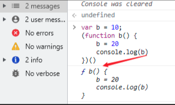

解析

* 代码预解析时，会将var b进行变量提升，此时b没有被赋值(b=undefined) (这里有人会说这里明明有个函数表达式呀，为什么没有进入变量提升，因为IIFE自带有词法作用域(我们常理解得作用域))

* 发现没有可以变量提升得时候将b赋值为10，此时会将b 赋值为10(b=10)

* 碰到了立即执行函数，会执行其内边的函数 function b()

* IIFE作用域中定义b = function b(){}

* 碰到了b = 20，会顺着作用域链寻找是否存在b，发现IIFE作用域中存在b，将IIFE作用域中的b赋值为20(b=20)(因为函数表达式特性，标识符无法被修改，所以这里执行失败)

* 执行console.log(b)，此时的b会找IIFE中的作用域看看是否存在b，发现其内边存在，将其返回


***

## 108. 怎么使用 Math.max、Math.min 获取数组中的最值？


**参考答案：**

`Math.min()`和`Math.max()`用法比较类似：

> console.log(Math.min(1, 5, 2, 7, 3)); // 输出：1

但它们不接受数组作为参数。

如果想使用数组作为参数，有以下两个方法：

* apply

```javascript
const arr = [1, 5, 2, 7, 3];
console.log(Math.min.apply(null, arr)); // 输出：1
```

* 扩展运算符

```javascript
const arr = [3, 5, 1, 6, 2, 8];

const maxVal = Math.max(...arr); // 获取数组中的最大值
```


***

## 109. 怎么实现虚拟列表？


**参考答案：**

虚拟列表是一种优化长列表渲染性能的技术，它只渲染可见区域内的部分内容，从而大幅降低了页面渲染的复杂度。

具体而言，实现虚拟列表需要以下步骤：

* 计算可见区域：首先需要计算出当前可见区域内的列表项数量和位置。

* 渲染可见区域：只渲染当前可见区域内的列表项，而不是整个列表。

* 动态调整列表高度：由于只渲染了部分列表项，因此需要动态调整列表容器的高度，以确保滚动条可以正确地显示并且用户可以滚动整个列表。

* 延迟加载非可见区域：当用户滚动列表时，需要根据当前滚动位置动态加载非可见区域的列表项，以便在用户滚动到该区域时能够及时显示。

在实现虚拟列表的过程中，还可以使用一些技术来优化渲染性能，包括：

* 虚拟 DOM：使用虚拟 DOM 技术可以减少每次重新渲染时需要操作真实 DOM 的次数，从而提高渲染性能。

* 懒加载：懒加载可以延迟加载非可见区域的列表项，从而减少不必要的网络请求和资源占用。

* 缓存：缓存可以在滚动时快速复用已经渲染的列表项，从而减少重新渲染的次数。

* 预测算法：使用预测算法可以根据当前滚动位置和滚动速度来预测用户可能查看的区域，并提前加载该区域的列表项，以提高用户体验。

总之，实现虚拟列表需要计算可见区域、渲染可见区域、动态调整列表高度和延迟加载非可见区域等步骤，并且需要使用一些技术来优化渲染性能。虚拟列表可以大幅提高长列表的渲染性能，并提高用户体验。


***

## 110. 说说对 requestIdleCallback 的理解


**参考答案：**

`requestIdleCallback` 是一个浏览器 API，它允许我们在浏览器空闲时执行一些任务，以提高网页的性能和响应速度。

通常情况下，JavaScript 代码会占用主线程，从而阻塞了其他的任务。当页面需要进行一些复杂计算、渲染大量的DOM元素等操作时，就会导致用户的交互体验变得缓慢和卡顿。

`requestIdleCallback` 的作用就是将一些非关键性的任务从主线程中分离出来，等到浏览器闲置时再执行。这样就可以避免占用主线程，提高页面的响应速度和流畅度。

使用 `requestIdleCallback` 需要传入一个回调函数，该函数会在浏览器空闲时被调用。回调函数的参数是一个 IdleDeadline 对象，它包含有关浏览器还剩余多少时间可供执行任务的信息。根据该对象的时间戳信息，开发人员可以自行决定是否继续执行任务或推迟执行。

`requestIdleCallback` 可以帮助我们优化 Web 应用程序的性能和响应速度，减少资源的浪费。


***

## 111. 以下等式是成立的吗：1\_000\_000 === 1000000 ？


**参考答案：**

`1_000_000 === 1000000` 的结果为 true

`1_000_000` 中使用了 `_`，这是数字分隔符规范(Numeric Separators)，也就是允许在数字值中使用下划线来提高数值的可读性。

如果我们尝试写十亿这样的值，可以通过用下划线分隔数字来提高可读性。

```javascript
let a = 1000000000000; 
let b = 1_000_000_000_000; 
console.log(a===b); // true
```

数字分隔符规范不仅支持整数，还支持各种数字格式：

```javascript
// Decimal 
let dec = 1_000_000.220_720; 

// Binary 
let bin = 0b1010_0001_1000_0101; 

// Octal 
let oct = 0o1234_5670; 

// Hexadecimal 
let hex = 0xA0_B0_C0; 

// BigInt 
let bint = 9_223_372_036_854_775_807n;
```


***

## 112. 页面加载的过程中，JS 文件是不是一定会阻塞 DOM 和 CSSOM 的构建？


**参考答案：**

答案：不一定

JavaScript阻塞DOM和CSSOM的构建的情况主要集中在以下两个方面：

* JavaScript文件被放置在head标签内部

当JavaScript文件被放置在head标签内部时，浏览器会先加载JavaScript文件并执行它，然后才会继续解析HTML文档。因此，如果JavaScript文件过大或服务器响应时间过长，就会导致页面一直处于等待状态，进而影响DOM和CSSOM的构建。

* JavaScript代码修改了DOM结构

在JavaScript代码执行时，如果对DOM结构进行了修改，那么浏览器需要重新计算布局（reflow）和重绘（repaint），这个过程会较为耗时，并且会阻塞DOM和CSSOM的构建。

除此之外，还有一些情况下JavaScript并不会阻塞DOM和CSSOM的构建：

* 通过设置 script 标签的 async 、defer 属性避免阻塞DOM和CSSOM的构建

  * async：异步加载JavaScript文件，脚本的下载和执行将与其他工作同时进行（例如从服务器请求其他资源、渲染页面等），而不必等到脚本下载完成才开始这些操作。因此，在使用 async 属性时，脚本的加载和执行是异步的，并且不保证脚本在页面中的顺序。

  * defer属性 ：属性也告诉浏览器立即下载脚本文件，但有一个重要的区别：当文档解析时，脚本不会执行，直到文档解析完成后才执行。这意味着脚本将按照它们在页面上出现的顺序执行，并且在执行之前，整个文档已经被解析完毕了。

* Web Workers ：Web Workers 是一种运行在后台线程的JavaScript脚本，它不会阻塞DOM和CSSOM的构建，并且可以利用多核CPU提高JavaScript代码执行速度。

总结

在一定情况下，JavaScript的执行会阻塞DOM和CSSOM的构建。

但是，在实际应用中，我们可以通过设置 script 标签的 async、defer 属性、使用Web Workers等方式来避免这个问题。


***

## 113. var、let、const之间有什么区别？

**参考答案：**

var

在ES5中，顶层对象的属性和全局变量是等价的，用`var`声明的变量既是全局变量，也是顶层变量

注意：顶层对象，在浏览器环境指的是`window`对象，在 `Node` 指的是`global`对象

```javascript
var a = 10;
console.log(window.a) // 10
```

使用`var`声明的变量存在变量提升的情况

```javascript
console.log(a) // undefined
var a = 20
```

在编译阶段，编译器会将其变成以下执行

```javascript
var a
console.log(a)
a = 20
```

使用`var`，我们能够对一个变量进行多次声明，后面声明的变量会覆盖前面的变量声明

```javascript
var a = 20 
var a = 30
console.log(a) // 30
```

在函数中使用使用`var`声明变量时候，该变量是局部的

```javascript
var a = 20
function change(){
    var a = 30
}
change()
console.log(a) // 20 
```

而如果在函数内不使用`var`，该变量是全局的

```javascript
var a = 20
function change(){
   a = 30
}
change()
console.log(a) // 30 
```

二、let

`let`是`ES6`新增的命令，用来声明变量

用法类似于`var`，但是所声明的变量，只在`let`命令所在的代码块内有效

```javascript
{
    let a = 20
}
console.log(a) // ReferenceError: a is not defined.
```

不存在变量提升

```javascript
console.log(a) // 报错ReferenceError
let a = 2
```

这表示在声明它之前，变量`a`是不存在的，这时如果用到它，就会抛出一个错误

只要块级作用域内存在`let`命令，这个区域就不再受外部影响

```javascript
var a = 123
if (true) {
    a = 'abc' // ReferenceError
    let a;
}
```

使用`let`声明变量前，该变量都不可用，也就是大家常说的“暂时性死区”

最后，`let`不允许在相同作用域中重复声明

```javascript
let a = 20
let a = 30
// Uncaught SyntaxError: Identifier 'a' has already been declared
```

注意的是相同作用域，下面这种情况是不会报错的

```javascript
let a = 20
{
    let a = 30
}
```

因此，我们不能在函数内部重新声明参数

```javascript
function func(arg) {
  let arg;
}
func()
// Uncaught SyntaxError: Identifier 'arg' has already been declared
```

三、const

`const`声明一个只读的常量，一旦声明，常量的值就不能改变

```javascript
const a = 1
a = 3
// TypeError: Assignment to constant variable.
```

这意味着，`const`一旦声明变量，就必须立即初始化，不能留到以后赋值

```javascript
const a;
// SyntaxError: Missing initializer in const declaration
```

如果之前用`var`或`let`声明过变量，再用`const`声明同样会报错

```javascript
var a = 20
let b = 20
const a = 30
const b = 30
// 都会报错
```

`const`实际上保证的并不是变量的值不得改动，而是变量指向的那个内存地址所保存的数据不得改动

对于简单类型的数据，值就保存在变量指向的那个内存地址，因此等同于常量

对于复杂类型的数据，变量指向的内存地址，保存的只是一个指向实际数据的指针，`const`只能保证这个指针是固定的，并不能确保改变量的结构不变

```javascript
const foo = {};

// 为 foo 添加一个属性，可以成功
foo.prop = 123;
foo.prop // 123

// 将 foo 指向另一个对象，就会报错
foo = {}; // TypeError: "foo" is read-only
```

其它情况，`const`与`let`一致

四、区别

`var`、`let`、`const`三者区别可以围绕下面五点展开：

* 变量提升

* 暂时性死区

* 块级作用域

* 重复声明

* 修改声明的变量

* 使用

变量提升

`var `声明的变量存在变量提升，即变量可以在声明之前调用，值为`undefined`

// 2023.4.25 更新

`let`和`const`不存在变量提升，即它们所声明的变量一定要在声明后使用，否则报错

let / const 不存在变量提升是不完全正确的，只能说由于暂时性死区的存在使得我们无法直观感受到变量提升的效果。

let 和 const 定义的变量都会被提升，但是不会被初始化，不能被引用，不会像var定义的变量那样，初始值为undefined。

当进入let变量的作用域时，会立即给它创建存储空间，但是不会对它进行初始化。

变量的赋值可以分为三个阶段：

* 创建变量，在内存中开辟空间

* 初始化变量，将变量初始化为undefined

* 真正赋值

关于let、var和function：

* let 的「创建」过程被提升了，但是初始化没有提升。

* var 的「创建」和「初始化」都被提升了。

* function 的「创建」「初始化」和「赋值」都被提升了。

```javascript
// var
console.log(a)  // undefined
var a = 10

// let 
console.log(b)  // Cannot access 'b' before initialization
let b = 10

// const
console.log(c)  // Cannot access 'c' before initialization
const c = 10
```

暂时性死区

`var`不存在暂时性死区

`let`和`const`存在暂时性死区，只有等到声明变量的那一行代码出现，才可以获取和使用该变量

```javascript
// var
console.log(a)  // undefined
var a = 10

// let
console.log(b)  // Cannot access 'b' before initialization
let b = 10

// const
console.log(c)  // Cannot access 'c' before initialization
const c = 10
```

块级作用域

`var`不存在块级作用域

`let`和`const`存在块级作用域

```javascript
// var
{
    var a = 20
}
console.log(a)  // 20

// let
{
    let b = 20
}
console.log(b)  // Uncaught ReferenceError: b is not defined

// const
{
    const c = 20
}
console.log(c)  // Uncaught ReferenceError: c is not defined
```

重复声明

`var`允许重复声明变量

`let`和`const`在同一作用域不允许重复声明变量

```javascript
// var
var a = 10
var a = 20 // 20

// let
let b = 10
let b = 20 // Identifier 'b' has already been declared

// const
const c = 10
const c = 20 // Identifier 'c' has already been declared
```

修改声明的变量

`var`和`let`可以

`const`声明一个只读的常量。一旦声明，常量的值就不能改变

```javascript
// var
var a = 10
a = 20
console.log(a)  // 20

//let
let b = 10
b = 20
console.log(b)  // 20

// const
const c = 10
c = 20
console.log(c) // Uncaught TypeError: Assignment to constant variable
```

使用

能用`const`的情况尽量使用`const`，其他情况下大多数使用`let`，避免使用`var`

***

## 114. 说说你对轮询的理解


**参考答案：**

什么是轮询？

轮询是指在一定的时间间隔内，定时向服务器发送请求，获取最新数据的过程。轮询通常用于从服务器获取实时更新的数据。

轮询和长轮询有什么区别？

轮询是在固定的时间间隔内向服务器发送请求，即使服务器没有数据更新也会继续发送请求。而长轮询是先发送一个请求，服务器如果没有数据更新，则不会立即返回，而是将请求挂起，直到有数据更新时再返回结果。

前端轮询的实现方式有哪些？

前端轮询的实现方式有两种：基于定时器的轮询和基于递归的轮询。基于定时器的轮询使用 setInterval() 方法来定时发送请求，而基于递归的轮询则使用 setTimeout() 方法来控制下一次请求的时间。

轮询有什么缺点？

轮询会产生大量的无效请求，浪费带宽和服务器资源，并且对服务器的压力比较大。同时，在短时间内频繁地发送请求可能会被服务器视为恶意行为，导致 IP 被封禁等问题。

如何避免轮询的缺点？

为了避免轮询的缺点，可以使用 WebSocket、SSE（Server-Sent Events）等技术来实现实时数据更新。

WebSocket 是一种双向通信协议，能够实现服务器与客户端之间的实时通信；而 SSE 则是一种基于 HTTP 的单向通信协议，可以实现服务器向客户端推送实时数据。

这些技术都能够减少无效请求，提高数据传输效率，并且对服务器资源的消耗也比较小。


***

## 115. ES6有哪些新特性？


**参考答案：**

关于ES6和JavaScript的关系

1、ES6是对于ES2015+的俗称，也可以说是通常叫法，那么，ES6是什么呢？

ES 全称是ECMAScript，它是JavaScript基础构建的一种语言，JavaScript正是建立在ECMAScript语言的基础规范中建立使用的，那么，ECMAScript的使用，对于JavaScript至关重要！

在我的理解中，ECMAScript是一种语言层面的东西，它只是定义了JavaScript以及在它基础之上建立的其他语言的语法规范，而JavaScript的语言，更关于一种平台性质在其中。

JavaScript包括 ECMAScript、DOM、BOM三个组成部分，DOM和BOM是web API提供的接口或者是JavaScript和浏览器之间进行交互的部分，实质就是操纵文档元素，进行展示布局，而ECMAScript在JavaScript中其中语法的作用，它不会去跟文档有直接的关系，但是他的数据处理完成后会通过web API展示在文档中。

ES6新特性的分类

新特性主要归为四大类：

* 解决原有语法上的一些不足

比如let 和 const 的块级作用域

* 对原有语法进行增强

比如解构、展开、参数默认值、模板字符串

* 全新的对象、全新的方法、全新的功能

比如promise、proxy、object的assign、is

* 全新的数据类型和数据结构

比如symbol、set、map

下面具体进行介绍

1. let、const 块级作用域以及和 var 的区别

* let、const 声明的变量，在 for，if 语句中，会形成块级作用域，块级作用域内的变量，不能被作用域外部使用

* let、const 声明变量不再会有声明提升，在变量声明之前使用运行时会报错

```javascript
//块级作用域一级块级作用域的使用
if (true) {
  const param = 'param in if block'
  console.log(param) //param in if block
}
console.log(param) //块级作用域外访问内部定义的变量，ReferenceError: param is not defined
```

* 块级作用域声明变量，会出现“暂时性死区”，块级作用域声明变量前使用变量，将会报错

```javascript
// 暂时性死区
const i = 100
if (i) {
  console.log(i) //ReferenceError: Cannot access 'i' before initialization
  const i = 1000
}
```

* const 声明的是一个常量，声明必须初始化

```javascript


    // const常量声明必须初始化
    const i;
    i = 10;
    console.log(i) //SyntaxError: Missing initializer in const declaration
```

* 如果 const 声明的是基本类型常量，初始化之后不能修改；引用类型的常量，可以修改其成员变量；

```javascript
// 基本类型常量不能修改，引用类型常量能修改属性
const str = 'str'
str = 'str1' //TypeError: Assignment to constant variable.

const arr = [1, 2, 3]
arr[0] = 100
console.log(arr[0]) //100
```

* 和 var 的区别

无法复制加载中的内容

2.解构-快速提取数组/对象中的元素

* 数组解构

* 单独解构-根据数组索引，将数组解构成单独的元素

```javascript
const arr = [1, 2, 3]

const [a, b, c] = arr
console.log(a, b, c) //1,2,3
const [, , d] = arr
console.log(d) //3
```

* 默认值，解构时可以给变量设置默认值，数组没有这个元素的话

```javascript
const arr = [1, 2, 3]

const [, , , defaultVal = '4'] = arr
console.log('设置默认值', defaultVal)
```

* 剩余解构-用 "...+变量名" 解构剩余参数到新数组，只能用一次

```javascript
const arr = [1, 2, 3]

const [e, ...rest] = arr
console.log(rest) //[2, 3]
```

* 实例应用

```javascript
// 拆分字符串
const str = 'xiaobai/18/200'
const strArr = str.split('/')
const [, age] = strArr
console.log(age) //18
```

* 对象解构

* 单个/多个解构-跟数组解构差不多

```javascript
const obj = { name: 'xiaohui', age: 18, height: undefined }
const { name, age } = obj
console.log(name, age) // 'xiaohui', 18
```

* 解构+重命名-给解构出来的变量重命名

```javascript
const obj = { name: 'xiaohui', age: 18, height: undefined }
const { name: objName } = obj
console.log(objName)
```

* 默认值-给解构变量设置默认值

```javascript
const obj = { name: 'xiaohui', age: 18, height: undefined }
const { next = 'default' } = obj
console.log(next)
```

3.模板字符串

用法：使用\`\`将字符串包裹起来

功能：可以换行、插值、使用标签函数进行字符串操作

示例：

* 换行/插值

```javascript
//换行
const str = `fdsjak
    fdsa`
console.log(str)

// 插值
const strs = `random: ${Math.random()}`
console.log(strs)
```

* 标签函数-可以对模板字符串的字符串和插值进行处理和过滤等操作

```javascript
/**
 * 字符串模板函数
 * @param {array} strs 以插值为分隔符组成的字符串数组
 * @param {string} name 插值的value，有多少个就会传入多少个
 */
const tagFunc = (strs, name, gender) => {
  const [str1, str2, str3] = strs
  const genderParsed = gender == '1' ? '男' : '女'
  // 可以在此做过滤，字符串处理，多语言等操作
  return str1 + name + str2 + str3 + genderParsed
}

// 带标签的模板字符串,
const person = {
  name: 'xiaohui',
  gender: 1,
}
// 返回值为标签函数的返回值
const result = tagFunc`my name is ${person.name}.gender is ${person.gender}`
console.log(result) //my name is xiaohui.gender is 男
```

* 字符串扩展方法

- includes-是否包含

- startsWith-是否以什么开始

- endsWith-是否以什么结束

```javascript
const str = 'abcd'

console.log(str.includes('e')) //false
console.log(str.startsWith('a')) //true
console.log(str.endsWith('a')) //false
```

5.参数默认值&剩余参数

* 给函数形参设置默认值

```javascript
// 带默认参数的形参一般放在后面，减少传参导致的错误几率
const defaultParams = function (name, age = 0) {
  return [age, name]
}
console.log(defaultParams(1))
```

* 使用...rest 形式设置剩余形参，支持无限参数

```javascript
// 剩余参数，转化成数组
const restParams = function (...args) {
  console.log(args.toString()) //1, 2, 3, 4, 5
}

restParams(1, 2, 3, 4, 5)
```

6.展开数组

使用...将数组展开

```javascript
const arr = [1, 2, 3]

console.log(...arr)
// 等价于es5中以下写法
console.log.apply(console, arr)
```

7.箭头函数

特性&优势：

* 1、简化了函数的写法

* 2、没有 this 机制，this 继承自上一个函数的上下文，如果上一层没有函数，则指向 window

* 3、作为异步回调函数时，可解决 this 指向问题

```javascript
const inc = (n) => n + 1
console.log(inc(100))

const obj = {
  name: 'aa',
  func() {
    setTimeout(() => {
      console.log(this.name) //aa
    }, 0)
    setTimeout(function () {
      console.log(this.name) //undefined
    }, 0)
  },
}
obj.func()
```

8.对象字面量增强

* 同名属性可以省略 key:value 形式，直接 key，

* 函数可以省略 key：value 形式

* 可以直接 func(),

* 可以使用计算属性，比如：{\[Math.random()]: value}

```javascript
/**
 * 1、增强了对象字面量：
 * 1，同名属性可以省略key:value形式，直接key，
 * 2，函数可以省略key：value形式
 * 3，可以直接func(),
 * 4，可以使用计算属性，比如：{[Math.random()]: value}
 */
const arr = [1, 2, 3]
const obj = {
  arr,
  func() {
    console.log(this.arr)
  },
  [Math.random()]: arr,
}

console.log(obj)
```

9.Object.assign(target1, target2, targetN)-复制/合并对象

```javascript
/**
 * Object.assign(target1, target2, ...targetn)
 * 后面的属性向前面的属性合并
 * 如果target1是空对象，可以创建一个全新对象，而不是对象引用
 */
const obj1 = {
  a: 1,
  b: 2,
}
const obj2 = {
  a: 1,
  b: 2,
}

const obj3 = Object.assign({}, obj1)
obj3.a = 5
console.log(obj3, obj2, obj1)
```

10.Object.is(value1, value2)

作用：比较两个值是否相等

特性：

* 没有隐式转换

* 可以比较+0,-0、NaN

```javascript
console.log(NaN === NaN) //false
console.log(Object.is(NaN, NaN)) //true
console.log(0 === -0) // true
console.log(Object.is(0, -0)) //false
console.log(Object.is(1, 1)) //true
```

11.Proxy(object, handler)

作用：

* 代理一个对象的所有，包括读写操作和各种操作的监听

用法：

```javascript
const P = {
  n: 'p',
  a: 19,
}

const proxy = new Proxy(P, {
  get(target, property) {
    console.log(target, property)
    return property in target ? target[property] : null
  },
  defineProperty(target, property, attrs) {
    console.log(target, property, attrs)
    //   throw new Error('不允许修改')
  },
  deleteProperty(target, property) {
    console.log(target, property)
    delete target[property]
  },
  set(target, property, value) {
    target[property] = value
  },
})

proxy.c = 100
console.log('pp', P)
```

与 Object.definePropert 对比

优势：

* 拥有很多 defineProperty 没有的属性方法，比如：

  * handler.getPrototypeOf() ---Object.getPrototypeOf 方法的监听器

  * handler.setPrototypeOf() ---Object.setPrototypeOf 方法的监听器。

  * handler.isExtensible() ---Object.isExtensible 方法的监听器。

  * handler.preventExtensions() ---Object.preventExtensions 方法的监听器。

  * handler.getOwnPropertyDescriptor() ---Object.getOwnPropertyDescriptor 方法的监听器。

  * handler.defineProperty() ---Object.defineProperty 方法的监听器。

  * handler.has() ---in 操作符的监听器。

  * handler.get() ---属性读取操作的监听器。

  * handler.set() ---属性设置操作的监听器。

  * handler.deleteProperty() ---delete 操作符的监听器

  * handler.ownKeys() ---Object.getOwnPropertyNames 方法和 Object.getOwnPropertySymbols 方法的监听器。

  * handler.apply() ---函数调用操作的监听器。

  * handler.construct() ---new 操作符的监听器。

* 对数组的监视更方便

* 以非侵入的访视监管对象的读写

## 116. Reflect是什么？


**参考答案：**

集成 Object 操作的所有方法，统一、方便，具体方法如下：

用于对对象的统一操作，集成 Object 相关的所有方法

1、apply：类似 Function.prototype.apply

2、Reflect.construct()

对构造函数进行 new 操作，相当于执行 new target(...args)。

3、Reflect.defineProperty()

和 Object.defineProperty() 类似。

4、Reflect.deleteProperty()

作为函数的 delete 操作符，相当于执行 delete target\[name]。

5、Reflect.get()

获取对象身上某个属性的值，类似于 target\[name]。

6、Reflect.getOwnPropertyDescriptor()

类似于 Object.getOwnPropertyDescriptor()。

7、Reflect.getPrototypeOf()

类似于 Object.getPrototypeOf(), 获取目标对象的原型。

8、Reflect.has()

判断一个对象是否存在某个属性，和 in 运算符 的功能完全相同。

9、Reflect.isExtensible()

类似于 Object.isExtensible().判断对象是否可扩展，可以添加额外属性

Object.seal(封闭对象)， Object.freeze（冻结对象）是不可扩展的

10、Reflect.ownKeys()

返回一个包含所有自身属性（不包含继承属性）的数组。(类似于 Object.keys(), 但不会受 enumerable 影响).

11、Reflect.preventExtensions()

类似于 Object.preventExtensions()。返回一个 Boolean。

12、Reflect.set()

将值分配给属性的函数。返回一个 Boolean，如果更新成功，则返回 true, 反之返回 false。

13、Reflect.setPrototypeOf()

类似于 Object.setPrototypeOf()。

示例：

```javascript
const obj = {
  name: 'reflect',
}
Reflect.preventExtensions(obj) //禁止扩展
console.log(Reflect.set(obj, 'age', 'xiaobai')) //false
console.log(obj) //{ name: 'reflect' }
console.log(Reflect.isExtensible(obj, 'name')) //false
console.log(Reflect.ownKeys(obj)) //[ 'name' ]
```

13.Promise

作用：解决异步编程中回调嵌套过深问题

14.class&静态方法&继承

定义

* 使用 class 关键字定义类

```javascript
class Person {
  constructor(props) {
    this.props = props
  }
}
```

方法

* 实例方法，需要实例化之后才能调用，this 指向实例

* 静态方法，用 static 修饰符修饰，可以直接通过类名调用，不需要实例化，this 不指向实例，而是指向当前类

```javascript
class Person {
  constructor(props) {
    this.props = props
  }
  // 实例方法
  eat() {}
  // 静态方法
  static run() {}
}
// 调用静态方法
Person.run()
const person = new Person('props')
// 调用实例方法
person.eat()
```

继承：子类使用 extends 关键字实现继承，可以继承父类所有属性

```javascript
class Student extends Person {
  constructor(props) {
    super(props)
  }
  printProps() {
    console.log(this.props)
  }
}

const student = new Student('student')
student.printProps()
```

15.Set

说明：

Set 是一种类似于数组的数据结构

特性：

* 元素唯一性，不允许重复元素

* 使用 add 增加重复元素，将会被忽略

用途：

* 数组去重

* 数据存储

```javascript
const arr = [1, 3, 1, 1, 1]
const set = new Set(arr)
set.add(1).add(1)
console.log(set.size) //2
const newArr = Array.from(set)
console.log(newArr) //[ 1, 3 ]
```

16.Map

说明：

类似 Object，以 key、value 形式存储数据

区别：

Map 键不会隐式转换成字符串，而是保持原有类型

实例：

```javascript
const map = new Map()
map.set(1, 1)
map.set('name', 'map')
map.set(obj, obj)
console.log(map.get(1)) //1
/**
        1 1
        name map
        { '1': 1, true: true, a: 'a' } { '1': 1, true: true, a: 'a' }
     */
map.forEach((val, key) => {
  console.log(key, val)
})
```

17.Symbol

说明：

JavaScript 第六种原始数据类型，用来定义一个唯一的变量

作用：

* 创建唯一的变量，解决对象键名重复问题

* 为对象、类、函数等创建私有属性

* 修改对象的 toString 标签

* 为对象添加迭代器属性

如何获取对象的 symbol 属性？

* Object.getOwnPropertySymbols(object)

实例

```javascript
// 对象属性重名问题；
const objSymbol = {
  [Symbol()]: 1,
  [Symbol()]: 2,
}
console.log(objSymbol)

// 2、为对象、类、函数等创建私有属性
const name = Symbol()
const obj2 = {
  [name]: 'symbol',
  testPrivate() {
    console.log(this[name])
  },
}

obj2.testPrivate()
// 定义toString标签；
console.log(obj2.toString())
obj2[Symbol.toStringTag] = 'xx'
console.log(obj2.toString()) //[object xx]
```

18.for...of...

用途：

已统一的方式，遍历所有引用数据类型

特性：

可以随时使用 break 终止遍历，而 forEach 不行

实例：

```javascript
// 基本用法
// 遍历数组
const arr = [1, 2, 3, 4]
for (const item of arr) {
  if (item > 3) {
    break
  }
  if (item > 2) {
    console.log(item)
  }
}

// 遍历set
const set = new Set()
set.add('foo').add('bar')
for (const item of set) {
  console.log('set for of', item)
}
// 遍历map
const map = new Map()
map.set('foo', 'one').set('bar', 'two')
for (const [key, val] of map) {
  console.log('for of map', key, val)
}
//迭代对象
const obj = {
  name: 'xiaohui',
  age: '10',
  store: [1, 2, 3],
  // 实现可迭代的接口
  [Symbol.iterator]: function () {
    const params = [this.name, this.age, this.store]
    let index = 0
    return {
      next() {
        const ret = {
          value: params[index],
          done: index >= params.length,
        }
        index++
        return ret
      },
    }
  },
}

for (const item of obj) {
  console.log('obj for of', item)
}
```

19\. 迭代器模式

作用：通过 Symbol.interator 对外提供统一的接口，获取内部的数据

外部可以通过 for...of...去迭代内部的数据

```javascript
const tods = {
  life: ['eat', 'sleep'],
  learn: ['js', 'dart'],
  // 增加的任务
  work: ['sale', 'customer'],
  [Symbol.iterator]: function () {
    const all = []
    Object.keys(this).forEach((key) => {
      all.push(...this[key])
    })
    let index = 0
    return {
      next() {
        const ret = {
          value: all[index],
          done: index >= all.length,
        }
        index++
        return ret
      },
    }
  },
}

for (const item of tods) {
  console.log(item)
}
```

20.Generator 生成器

* Generator

* 函数前添加 \*，生成一个生成器

* 一般配合 yield 关键字使用

* 最大特点，惰性执行，调 next 才会往下执行

* 主要用来解决异步回调过深的问题

```javascript
// 生成迭代器方法
//  生成器Generator的应用

function* createIdGenerator() {
  let id = 1
  while (id < 3) yield id++
}
const createId = createIdGenerator()
console.log(createId.next()) //{ value: 1, done: false }
console.log(createId.next()) //{ value: 2, done: false }
console.log(createId.next()) //{ value: undefined, done: true }

const todos = {
  life: ['eat', 'sleep', 'baba'],
  learn: ['es5', 'es6', 'design pattern'],
  work: ['b', 'c', 'framework'],
  [Symbol.iterator]: function* () {
    const all = [...this.life, ...this.learn, ...this.work]
    for (const i of all) {
      yield i
    }
  },
}
for (const item of todos) {
  console.log(item)
}
```

21.includes 函数-es2016

判断数组是否包含某个元素，包含 NaN，解决 indexOf 无法查找 NaN 问题

```javascript
//  includes函数
const arr = ['foo', 'bar', 'baz', NaN]
console.log(arr.includes(NaN)) //true
console.log(arr.indexOf(NaN)) //-11
```

22.运算符-es2016

指数运算

```javascript
// 指数运算符 **
// es5中2十次方
console.log(Math.pow(2, 10))
// es6中2十次方
console.log(2 ** 10)
```

23.values 函数-es2017

将对象的值以数组的形式返回

```javascript
const obj = {
  foo: 1,
  bar: 2,
  baz: 3,
}

console.log(Object.values(obj)) //[ 1, 2, 3 ]
```

24.entries 函数-es2017

将对象以键值对二维数组返回，使之可以使用 for...of...遍历

```javascript
const obj = {
  foo: 1,
  bar: 2,
  baz: 3,
}
console.log(Object.entries(obj))
const entry = Object.entries(obj)
for (const [key, value] of entry) {
  console.log(key, value)
}
```

25.Object.getOwnPropertyDescriptors(obj)-es2017

获取对象的描述信息

可以通过获得的描述信息，配合 Object.defineProperties 来完整复制对象，包含 get，set 方法

```javascript
// getOwnPropertyDescriptors

// 普通get方法
const objGet = {
  foo: 1,
  bar: 2,
  get getCount() {
    return this.foo + this.bar
  },
}
// assign方法会把getCount当做普通属性复制，从而getCount为3，修改bar不管用
const objGet1 = Object.assign({}, objGet)
objGet1.bar = 3
console.log(objGet1.getCount) //3
// descriptors
const descriptors = Object.getOwnPropertyDescriptors(objGet)
console.log('des', descriptors)
// 通过descriptors来复制对象，可以完整复制对象，包含get，set
const objGet2 = Object.defineProperties({}, descriptors)
objGet2.bar = 3
console.log(objGet2.getCount) //4
```

26.padStart, padEnd 函数-es2017

在字符串前，或者后面追加指定字符串

参数：

targetLenght: 填充后的目标长度

padString:填充的字符串

规则：

1、填充的字符串超过目标长度，会在规定长度时被截断

2、填充字符串太短会以空格填充

3、padString 未传值，以空格填充

作用：

一般用来对齐字符串输出

```javascript


    /**
     *  foo.................|1
        barbar..............|2
        bazbazbaz...........|3
     */
    console.log(`${key.padEnd(20, '.')}${value.toString().padStart(2, '|')}`)
```

***

## 117. cookie、localStorage和sessionStorage 三者之间有什么区别


**参考答案：**

生命周期

* cookie：可设置失效时间，没有设置的话，默认是关闭浏览器后失效

* localStorage：除非被手动清除，否则将会永久保存。

* sessionStorage： 仅在当前网页会话下有效，关闭页面或浏览器后就会被清除。

存放数据大小

* cookie：4KB左右

* localStorage和sessionStorage：可以保存5MB的信息。

http请求

* cookie：每次都会携带在HTTP头中，如果使用cookie保存过多数据会带来性能问题

* localStorage和sessionStorage：仅在客户端（即浏览器）中保存，不参与和服务器的通信

易用性

* cookie：需要程序员自己封装，原生的 Cookie API 不友好

* localStorage和sessionStorage：原生 API 可以接受，亦可再次封装来对Object和Array有更好的支持

应用场景

从安全性来说，因为每次http请求都会携带cookie信息，这样无形中浪费了带宽，所以cookie应该尽可能少的使用，另外cookie还需要指定作用域，不可以跨域调用（当前页面只能读取页面所在域的 `cookie`，即 `document.cookie` ），限制比较多。但是用来识别用户登录来说，cookie还是比storage更好用的。其他情况下，可以使用storage，就用storage。

storage在存储数据的大小上面秒杀了cookie，现在基本上很少使用cookie了。

localStorage和sessionStorage唯一的差别一个是永久保存在浏览器里面，一个是关闭网页就清除了信息。localStorage可以用来夸页面传递参数，sessionStorage用来保存一些临时的数据，防止用户刷新页面之后丢失了一些参数。


***

## 118. null 和 undefined 有什么区别？


**参考答案：**

首先 Undefined 和 Null 都是基本数据类型，这两个基本数据类型分别都只有一个值，就是 undefined 和 null。

undefined 代表的含义是未定义，null 代表的含义是空对象。一般变量声明了但还没有定义的时候会返回 undefined，null主要用于赋值给一些可能会返回对象的变量，作为初始化。

undefined 在 JavaScript 中不是一个保留字，这意味着可以使用 undefined 来作为一个变量名，但是这样的做法是非常危险的，它会影响对 undefined 值的判断。我们可以通过一些方法获得安全的 undefined 值，比如说 void 0。

当对这两种类型使用 typeof 进行判断时，Null 类型化会返回 “object”，这是一个历史遗留的问题。当使用双等号对两种类型的值进行比较时会返回 true，使用三个等号时会返回 false。

```javascript
typeof null; // "object" (not "null" for legacy reasons)
typeof undefined; // "undefined"
null === undefined; // false
null == undefined; // true
null === null; // true
null == null; // true
!null; // true
Number.isNaN(1 + null); // false
Number.isNaN(1 + undefined); // true
```


***

## 119. 【Promise第21题】下面代码的输出是什么？

```javascript
Promise.reject('err!!!')
  .then((res) => {
    console.log('success', res)
  }, (err) => {
    console.log('error', err)
  }).catch(err => {
    console.log('catch', err)
  })
```


**参考答案：**

解析

.then函数中的两个参数。

第一个参数是用来处理Promise成功的函数，第二个则是处理失败的函数。

也就是说Promise.resolve('xxx')的值会进入成功的函数，Promise.reject('xxx')的值会进入失败的函数。

答案

```plaintext
'error' 'err!!!'
```


***

## 120. 给某个资源的链接，如 https://www.baidu.com/index.html ，请实现一个方法，获取该资源的后缀，如 html


**参考答案：**

本题主要考察字符串相关的方法，实现比较简单，下面列举两个实现方法。

```javascript
var fileName = "https://www.baidu.com/index.html";

function getFileExtension(url){
        if(typeof url !== 'string'){
            return ''
    }
    
    // 方法一
    return url.substring(url.lastIndexOf('.') + 1);
    
    // 方法二
    //return url.split('.').pop().toLowerCase();
}
```


***

## 121. js函数有哪几种声明方式？有什么区别？


**参考答案：**

有 `表达式` 和 `声明式` 两种函数声明方式

* 函数的声明式写法为：`function test(){}`，这种写法会导致函数提升，所有通过`function`关键字声明的变量都会被解释器优先编译，不管声明在什么位置都可以调用它，但是它本身并不会被执行。

```javascript
test(); // 测试
function test() {
  console.log("测试");
}
test(); // 测试
```

* 函数的表达式写法为：`var test = function(){}`，这种写法不会导致函数提升，必须先声明后调用，不然就会报错。

```javascript
test(); // 报错：TypeError: test is not a function
var test = function() {
  console.log("测试");
};
```

二者的区别

```javascript
//函数声明式
function greeting(){
      console.log("hello world");  
}
//函数表达式
var greeting = function(){
    console.log("hello world"); 

```

1. 函数声明式变量会声明提前 函数表达式变量不会声明提前

2. 函数声明中的`函数名`是必需的，而函数表达式中的`函数名则是可选的`。

3. 函数表达式可以在定义的时候直接在表达式后面加()执行，而函数声明则不可以。

```javascript
function fun(){  
   console.log('我是一个函数声明式')  
}();   //unexpected token  

var foo = function (){  
    console.log('我是一个函数表达式')  
}();   //我是一个函数表达式  
```

* 自执行函数即使带有函数名，它里面的函数还是属于函数表达式。

```javascript
(function fun(){  
    console.log('我是一个函数表达式')  
})()  //我是一个函数表达式  
```

因为函数只是整个自执行函数的一部分。


***

## 122. 如何把一个对象变成可迭代对象？


**参考答案：**

可迭代对象（Iterable object）是数组的泛化，这个概念是在说任何对象都可以被定制为可在 `for..of` 循环中使用的对象。

也就是说，可以应用 `for..of` 的对象被称为 `可迭代对象`。

迭代器

在 JavaScript 中，迭代器是一个对象，它定义一个序列，并在终止时可能返回一个返回值。

更具体地说，迭代器是通过使用 `next()` 方法实现 `Iterator protocol` 的任何一个对象，该方法返回具有两个属性的对象：

* `value`，这是序列中的 `next` 值

* `done`，如果已经迭代到序列中的最后一个值，则它为 `true`

如果 `value` 和 `done` 一起存在，则它是迭代器的返回值。

一旦创建，迭代器对象可以通过重复调用 `next() `显式地迭代。

迭代一个迭代器被称为消耗了这个迭代器，因为它通常只能执行一次。

在产生终止值之后，对 `next()` 的额外调用应该继续返回 `{done: true}`。

Javascript 中最常见的迭代器是 Array 迭代器，它只是按顺序返回关联数组中的每个值。

虽然很容易想象所有迭代器都可以表示为数组，但事实并非如此。数组必须完整分配，但迭代器仅在必要时使用，因此可以表示无限大小的序列，例如 0 和无穷大之间的整数范围。

这是一个可以做到这一点的例子。它允许创建一个简单的范围迭代器，它定义了从开始（包括）到结束（独占）间隔步长的整数序列。它的最终返回值是它创建的序列的大小，由变量 iterationCount 跟踪。

```javascript
let index = 0
const bears = ['ice', 'panda', 'grizzly']

let iterator = {
  next() {
    if (index < bears.length) {
      return { done: false, value: bears[index++] }
    }

    return { done: true, value: undefined }
  }
}

console.log(iterator.next()) //{ done: false, value: 'ice' }
console.log(iterator.next()) //{ done: false, value: 'panda' }
console.log(iterator.next()) //{ done: false, value: 'grizzly' }
console.log(iterator.next()) //{ done: true, value: undefined }
```

实现可迭代对象

如果一个对象拥有 `[Symbol.iterator]` 方法，并且该方法返回一个迭代器对象，这样的对象即可称为`可迭代对象`。

```javascript
let info = {
  bears: ['ice', 'panda', 'grizzly'],
  [Symbol.iterator]: function() {
    let index = 0
    let _iterator = {
       //这里一定要箭头函数，或者手动保存上层作用域的this
       next: () => {
        if (index < this.bears.length) {
          return { done: false, value: this.bears[index++] }
        }
  
        return { done: true, value: undefined }
      }
    }

    return _iterator
  }
}

let iter = info[Symbol.iterator]()
console.log(iter.next())
console.log(iter.next())
console.log(iter.next())
console.log(iter.next())

//符合可迭代对象协议 就可以利用 for of 遍历
for (let bear of info) {
  console.log(bear)
}
//ice panda grizzly
```


***

## 123. 说说你对“立即执行函数”的理解


**参考答案：**

什么是立即执行函数？

JS立即执行函数模式是一种语法，可以让你的函数在定义后立即被执行，这种模式本质上就是函数表达式（命名的或者匿名的），在创建后立即执行。

立即执行函数的两种常见写法：

* 匿名函数包裹在一个括号运算符中，后面跟一个小括号

```javascript
(function(){
    //...
})()
```

* 匿名函数后面跟一个小括号，整个包裹在一个括号运算符中

```javascript
(function(){
    //...
}())
```

()，！，+，-，=等运算符都能起到立即执行的作用，这些运算符的作用就是将匿名函数或函数声明转换为函数表达式。

注意：

* 函数体后面要有小括号()

* 函数体必须是函数表达式而不能是函数声明

例：

```javascript
(function (test) {    //使用()运算符,输出123
    console.log(test);
})(123);

(function (test) {    //使用()运算符,输出123
    console.log(test);
}(123));

!function (test) {    //使用!运算符,输出123
    console.log(test);
}(123);
var fn = function (test) {  //使用=运算符,输出123
    console.log(test);
}(123);
```

好处：

* 不必为函数命名，避免了污染全局变量

* 立即执行函数内部形成了一个单独的作用域，可以封装一些外部无法读取的私有变量

* 封装变量

总之：立即执行函数会形成一个单独的作用域，可以封装一些临时变量或者局部变量，避免污染全局变量。


***

## 124. 说说你对模块化方案的理解，比如 CommonJS、AMD、CMD、ES Module 分别是什么？


**参考答案：**

`时间轴：CommonJS --> AMD --> CMD --> ES Module`

CommonJS

* 常用于：`服务器端`，`node`，`webpack`

* 特点：`同步/运行时加载`，`磁盘读取速度快`

* 语法：

```javascript
// 1. 导出：通过module.exports或exports来暴露模块  
module.exports = {  
  attr1,  
  attr2  
}  
exports.attr = xx  
```

注意
不可以`exports = xxx`，这样写会无效，因为更改了exports的地址，而 `exports` 是 `module.exports` 的引用指向的是同一个内存，模块最后导出的是 `module.exports`

```javascript
// 2. 引用：require('x')  
const xx = require('xx') // 整体重命名  
const { attr } = require('xx') // 解构某一个导出
```

AMD

* 常用于：不常用，`CommonJs的浏览器端实现`

* 特点：

  * `异步加载`：因为面向浏览器端，为了不影响渲染肯定是异步加载

  * `依赖前置`：所有的依赖必须写在最初的依赖数组中，速度快，但是会浪费资源，预先加载了所有依赖不管你是否用到

* 语法：

```javascript
// 1. 导出：通过define来定义模块  
// 如果该模块还依赖其他模块，则将模块的路径填入第一个参数的数组中  
define(['x'], function(x){  
  function foo(){  
      return x.fn() + 1  
  }  
  return {  
      foo: foo  
  };  
});  
// 2. 引用  
require(['a'], function (a){  
  a.foo()  
});
```

CMD

* 常用于：不常用，`根据CommonJs和AMD实现，优化了加载方式`

* 特点：

  * `异步加载`

  * `按需加载/依赖就近`：用到了再引用依赖，方便了开发，缺点是速度和性能较差

* 语法：

```javascript
// 1. 导出：通过define来定义模块  
// 如果该模块还依赖其他模块，在用到的地方引用即可  
define(function(){  
  function foo(){  
      var x = require('x')  
      return x.fn() + 1  
  }  
  return {  
      foo: foo  
  };  
});  
// 2. 引用  
var x = require('a');  
a.foo();
```

ES module

* 常用于：`目前浏览器端的默认标准`

* 特点：`静态编译：` 在编译的时候就能确定依赖关系，以及输入和输出的变量

* 语法：

```javascript
// 1. 导出：通过export 或 export default 输出模块  
// 写法1: 边声明，边导出  
export var m = 1;  
export function m() {};  
export class M {};  

// 写法2：导出一个接口 export {}，形似导出对象但不是, 本质上是引用集合，最常用的导出方法  

export {  
  attr1,  
  attr2  
}  

// 写法3：默认导出  

export default fn  

// 2. 引用  
import { x } from 'test.js' // 导出模块中对应的值，必须知道值在模块中导出时的名字  
import { x as myx } from 'test.js' // 改名字  
import x from 'test.js' // 默认导出的引用方式  
```

注意

1. `export default`在同一个文件中只可存在一个（一个模块只能有一个默认输出）

2. 一个模块中可以同时使用export default 和 export

```javascript
// 模块 test.js
var info = {  
  name: 'name',  
  age: 18  
}  
export default info  
export var name= '海洋饼干'  
export var age = 18  

// 引用  
import person, {name, age as myAge} from 'test.js'  
console.log(person); // { name: 'name', age: 18 }  
console.log(name+ '=' + myAge); // 海洋饼干=18
```


***

## 125. 谈谈你对浏览器中进程和线程的理解


**参考答案：**

浏览器是多进程的

它主要包括以下进程：

* Browser 进程：浏览器的主进程，唯一，负责创建和销毁其它进程、网络资源的下载与管理、浏览器界面的展示、前进后退等。

* GPU 进程：用于 3D 绘制等，最多一个。

* 第三方插件进程：每种类型的插件对应一个进程，仅当使用该插件时才创建。

* 浏览器渲染进程（浏览器内核）：内部是多线程的，每打开一个新网页就会创建一个进程，主要用于页面渲染，脚本执行，事件处理等。

渲染进程（浏览器内核）

浏览器的渲染进程是多线程的，页面的渲染，JavaScript 的执行，事件的循环，都在这个进程内进行：

* GUI 渲染线程：负责渲染浏览器界面，当界面需要重绘（Repaint）或由于某种操作引发回流(Reflow)时，该线程就会执行。

* JavaScript 引擎线程：也称为 JavaScript 内核，负责处理 Javascript 脚本程序、解析 Javascript 脚本、运行代码等。（例如 V8 引擎）

* 事件触发线程：用来控制浏览器事件循环，注意这不归 JavaScript 引擎线程管，当事件被触发时，该线程会把事件添加到待处理队列的队尾，等待 JavaScript 引擎的处理。

1. 定时触发器线程：传说中的 setInterval 与 setTimeout 所在线程，注意，W3C 在 HTML 标准中规定，规定要求 setTimeout 中低于 4ms 的时间间隔算为 4ms 。（PS：最小间隔4ms的说法是不准确的，或者说是有前提条件的，请看HTML标准：`If nesting level is greater than 5, and timeout is less than 4, then set timeout to 4.`，也就是说，循环嵌套超过5层的，并且延迟不到4ms，才会变成4ms）

* 异步 http 请求线程：在 XMLHttpRequest 连接后通过浏览器新开一个线程请求，将检测到状态变更时，如果设置有回调函数，异步线程就产生状态变更事件，将这个回调再放入事件队列中。再由 JavaScript 引擎执行。

注意，GUI 渲染线程与 JavaScript 引擎线程是互斥的，当 JavaScript 引擎执行时 GUI 线程会被挂起（相当于被冻结了），GUI 更新会被保存在一个队列中等到 JavaScript 引擎空闲时立即被执行。所以如果 JavaScript 执行的时间过长，这样就会造成页面的渲染不连贯，导致页面渲染加载阻塞。

单线程的 JavaScript

所谓单线程，是指在 JavaScript 引擎中负责解释和执行 JavaScript 代码的线程唯一，同一时间上只能执行一件任务。

***

## 126. 怎么解决canvas中获取跨域图片数据的问题？


**参考答案：**

背景

在一张图片添加相关文字，然后转化为base64数据，上传至服务器。当代码上线写完部署到测试环境，控制台报出如下错题：

```plaintext
Uncaught (in promise) DOMException: Failed to execute 'toDataURL' on 'HTMLCanvasElement': Tainted canvases may not be exported
```

这是因为页面在请求图片时产生跨域情况，canvas认为该图片数据为污染的数据，是不安全的数据，无法导出base64数据。

为什么 canvas 认为跨域图片数据为 污染的数据

当请求跨域图片数据，而未满足跨域请求资源的条件时。如果canvas使用未经跨域允许的图片的原始数据，这些是不可信的数据，可能会暴露页面的数据。

请求图片资源 - 同域

Request Headers带有cookie。图片数据是被canvas信任的。

请求图片资源 - 跨域

默认情况下，直接请求跨域图片。因为不符合跨域请求资源的条件，图片数据是不被canvas信任的。

为了解决图片跨域资源共享的问题， \ 元素提供了支持的属性：crossOrigin，该属性一共有两个值可选：anonymous 和 use-credentials，下面列举了两者的使用场景，以及满足的条件。

无法复制加载中的内容

代码示例

```javascript
// page origin is https://a.com

const canvas = document.createElement('canvas');
const context = canvas.getContext('2d');

const img = new Image();
img.crossOrigin = 'anonymous';
img.onload = function () {
   context.drawImage(this, 0, 0);
   context.getImageData(0, 0, img.width, img.height);
};
img.src = 'https://b.com/a.png';
```

另外，跨域图片能正常裁剪（图片未转化成base64），应该满足三个条件：

* img元素中设置crossorigin属性

* 图片允许跨域，设置响应头Access-Control-Allow-Origin

* 使用js方式请求图片资源, 需要避免使用缓存，设置url后加上时间戳，或者http头设置Cache-Control为no-cache

主要原因是：

* 如果使用跨域的资源画到canvas中，并且资源没有使用CORS去请求，canvas会被认为是被污染了, canvas可以正常展示，但是没办法使用toDataURL()或者toBlob()导出数据，见Allowing cross-origin use of images and canvas。 所以通过在img标签上设置crossorigin，启用CORS，属性值为anonymous，在CORS请求时不会发送认证信息,见HTML attribute: crossorigin。

* 在启用CORS请求跨域资源时，资源必须允许跨域，才能正常返回，最简单的方式设置响应头Access-Control-Allow-Origin

* 图片已经通过img标签加载过，浏览器默认会缓存下来，下次使用js方式再去请求，直接返回缓存的图片，如果缓存中的图片不是通过CORS 请求或者响应头中不存在Access-Control-Allow-Origin，都会导致报错。


***

## 127. 说说你对 Iterator, Generator 和 Async/Await 的理解


**参考答案：**

这里重点理解他们三者分别是什么，有什么区别，以及分别适用什么场景

Iterator

Iterator是最简单最好理解的。

简单的说，我们常用的 `for of` 循环，都是通过调用被循环对象的一个特殊函数 `Iterator` 来实现的，但是以前这个函数是隐藏的我们无法访问， 从 `Symbol` 引入之后，我们就可以通过 `Symbol.iterator` 来直接读写这个特殊函数。

对于循环语句来说，他并不关心被循环的对象到底是什么，他只负责调用 `data[Symbol.iterator]` 函数，然后根据返回值来进行循环。所以任何对象只要提供了标准的 Iterator 接口即可被循环，比如我们现在来创造一个自定义的数据：

```plaintext
var students = {}
students[Symbol.iterator] = function() {
  let index = 1;
  return { next() {
    return {done: index>100, value: index++} }
  }
}
for(var i of students) { console.log(i); }
```

除了这种方式外，我们也可以通过 `Generator` 来实现一个 `Iterator` 接口。

Generator 基本语法

Generator 是ES6引入的新语法，Generator是一个可以暂停和继续执行的函数。简单的用法，可以当做一个Iterator来用，进行一些遍历操作。复杂一些的用法，他可以在内部保存一些状态，成为一个状态机。

Generator 基本语法包含两部分：

* 函数名前要加一个星号

* 函数内部用 `yield` 关键字返回值

下面是一个简单的示例：

```javascript
function * count() {
  yield 1
  yield 2
  return 3
}
var c = count()
console.log(c.next()) // { value: 1, done: false }
console.log(c.next()) // { value: 2, done: false }
console.log(c.next()) // { value: 3, done: true }
console.log(c.next()) // { value: undefined, done: true }
```

由于Generator也存在 `Symbol.iterator` 接口，所以他也可以被 `for` 循环调用：

```javascript
function * count() {
  yield 1
  yield 2
  return 3
}
var c = count()
for (i of c) console.log(i) // 1, 2
```

不过这里要注意一个不同点，调用 `next` 的时候能得到 `3` ，但是用 `for` 则会忽略最后的 `return` 语句。 也就是 `for` 循环会忽略 `generator` 中的 `return` 语句.

另外 `yeild*` 语法可以用来在 `Generator` 中调用另一个 `Generator`，参见 [yield\* MDN](https://developer.mozilla.org/en-US/docs/Web/JavaScript/Reference/Operators/yield%2A)

Generator VS Iterator

Generator 可以看做是一个更加灵活的 `Iterator` ，他们之间是可以互相替代的，但是， `Generator` 由于可以通过 `yield` 随时暂停，因此可以很方便进行流程控制和状态管理，而 `Iterator` 就可能需要你写更多的代码进行相同的操作：

比如 Stack Overflow 上的这个中序遍历代码：

```javascript
function* traverseTree(node) {
    if (node == null) return;
    yield* traverseTree(node.left);
    yield node.value;
    yield* traverseTree(node.right);
}
```

同样的功能用 `iterator` 实现就会变得麻烦很多。

Generator 也是实现简单的状态机的最佳选择，因为他是在函数内部进行 `yield` 操作，因此不会丢失当前状态：

```javascript
function * clock () {
  yield 'tick'
  yield 'tock'
}
```

同样的功能如果普通的函数，因为每次都是调用这个函数，所以函数内部并不能保存状态，因此就需要在函数外面用一个变量来保存当前状态：

```javascript
let tick = false
function clock() {
  tick = !tick
  return tick ? 'tick' : 'tock'
}
```

其实Babel编译 `Generator` 的时候，也是用了一个 `Context` 来保存当前状态的，可以看看Babel编译后的代码，其中的 `_context` 就是当前状态，这里通过 `_context.next` 的值来控制调用 `next` 的时候应该进入到哪一个流程：

```javascript


var _marked = /*#__PURE__*/regeneratorRuntime.mark(clock);

function clock() {
  return regeneratorRuntime.wrap(function clock$(_context) {
    while (1) {
      switch (_context.prev = _context.next) {
        case 0:
          _context.next = 2;
          return 'tick';

        case 2:
          _context.next = 4;
          return 'tock';

        case 4:
        case 'end':
          return _context.stop();
      }
    }
  }, _marked, this);
}
```

当然，如果是很复杂的，非线性状态变化的状态机，我还是会倾向于用一个类来实现。

Generator 异步操作

Generator 的设计，可以很方便执行异步操作，现在我们需要写一个小函数，可以取到用户信息然后打印出来，我们用generator来写就是这样的：

```javascript
function * fetchUser () {
  const user = yield ajax()
  console.log(user)
}
```

但是，generator本身并不会自动进行 `next` 操作，也就是，我们如果此时这样调用并不能打印出用户信息:

```javascript
const f = fetchUser()
```

因为`Generator` 本身只是一个状态机，他需要由调用者来改变他的状态，所以我们需要额外加一段控制代码来控制 `fetchUser` 进行状态转换:

```javascript


function * fetchUser () {
  const user = yield ajax()
  console.log(user)
}

const f = fetchUser()

// 加入的控制代码
const result = f.next()
result.value.then((d) => {
  f.next(d)
})
```

但是写了这些代码之后， `Generator` 的实现就变得非常不优雅了，如果我们内部有多个异步操作，控制代码就会变得很长。我们可以选择 co 库来帮我们做这个操作。

Async/Await

我最开始接触到 Async/Await 的时候把它当成了一个 `promise` 的语法糖，但是经过我们对 `Generator` 的理解后，明白了其实他就是 `Generator` 的一个语法糖：

* `async` 对应的是 `*`

* `await` 对应的是 `yield`

他只是自动帮我们进行了 `Generator` 的流程控制而已。

和上面的获取用户信息实现一样的功能的话，基本语法如下：

```javascript
async function fetchUser() {
  const user = await ajax()
  console.log(user)
}
```

因为有自动的流程控制，所以我们不用手动在ajax成功的时候手动调用 `next`。相比于 `Promise` 或者 `Generator` 的实现，代码要明显更加优雅。

如果有兴趣的话，可以参考一下 `Babel` 是如何编译 `Async/Await` 的，简单的说，代码分成了两部分，一部分是编译了一个 `Generator`，另一部分是通过 promise 实现了generator的流程控制。

对于如下代码:

```javascript
async function count () {
  let a = await 1;
  let b = await 2;
  return a+b
}
```

编译后的代码：

```javascript
var count = function () {
  // 下面这部分是 generator 的一个实现
  var _ref = _asyncToGenerator( /*#__PURE__*/regeneratorRuntime.mark(function _callee() {
    var a, b;
    return regeneratorRuntime.wrap(function _callee$(_context) {
      while (1) {
        switch (_context.prev = _context.next) {
          case 0:
            _context.next = 2;
            return 1;

            // 省略...
        }
      }
    }, _callee, this);
  }));

  return function count() {
    return _ref.apply(this, arguments);
  };
}();

// 下面这部分是用 promise 实现了流程控制。
function _asyncToGenerator(fn) { return function () { var gen = fn.apply(this, arguments); return new Promise(function (resolve, reject) { function step(key, arg) { try { var info = gen[key](arg); var value = info.value; } catch (error) { reject(error); return; } if (info.done) { resolve(value); } else { return Promise.resolve(value).then(function (value) { step("next", value); }, function (err) { step("throw", err); }); } } return step("next"); }); }; }
```

所以我们可以大约这么认为： async/await == generator + promise

async/await 并发

我们的代码在执行到await的时候会等待结果返回才执行下一行，这样如果我们有很多需要异步执行的操作就会变成一个串行的流程，可能会导致非常慢。

比如如下代码，我们需要遍历获取redis中存储的100个用户的信息：

```javascript
const users=[]
for (var i=0;i<ids.length;i++) {
  users.push(await db.get(ids))
}
```

由于每次数据库读取操作都要消耗时间，这个接口将会变得非常慢。如果我们把它变成一个并行的操作，将会极大提升效率：

```javascript
const users = await Promise.all(ids.map(async (id) => await db.get(id)))
```

总结

* `Iterator` 是一个循环接口，任何实现了此接口的数据都可以被 `for of` 循环遍历

* `Generator` 是一个可以暂停和继续执行的函数，他可以完全实现 `Iterator` 的功能，并且由于可以保存上下文，他非常适合实现简单的状态机。另外通过一些流程控制代码的配合，可以比较容易进行异步操作。

* `Async/Await` 就是generator进行异步操作的语法糖。而这个语法糖反而是被使用最广泛的，比如著名的 `Koa`


***

## 128. 请对以下数组，根据 `born` 的值降序排列

```javascript
const singers = [
  { name: 'Steven Tyler', band: 'Aerosmith', born: 1948 },
  { name: 'Karen Carpenter', band: 'The Carpenters', born: 1950 },
  { name: 'Kurt Cobain', band: 'Nirvana', born: 1967 },
  { name: 'Stevie Nicks', band: 'Fleetwood Mac', born: 1948 },
];
```

**参考答案：**

`Array.prototype.sort()` 方法用原地算法对数组的元素进行排序，并返回数组。在很多排序场景下推荐使用。

语法：

> arr.sort(\[compareFunction])

这道题在实现上也比较简单，我们直接看实现方法：

```javascript
function compare(a, b) {
  return a.born < b.born ? 1: -1 
}

singers.sort(compare);

// 也可以进行简写
singers.sort((a,b) => b.born - a.born)
```


***

## 129. 前端怎么实现跨域请求？


什么是跨域？

**1.什么是同源策略及其限制内容？**

同源策略是一种约定，它是浏览器最核心也最基本的安全功能，如果缺少了同源策略，浏览器很容易受到XSS、CSRF等攻击。所谓同源是指"协议+域名+端口"三者相同，即便两个不同的域名指向同一个ip地址，也非同源。

同源策略限制内容有：

* Cookie、LocalStorage、IndexedDB 等存储性内容

* DOM 节点

* AJAX 请求发送后，结果被浏览器拦截了

但是有三个标签是允许跨域加载资源：

* ``

* `<link href=XXX>`

* `<script src=XXX>`

**2.常见跨域场景**

当协议、子域名、主域名、端口号中任意一个不相同时，都算作不同域。不同域之间相互请求资源，就算作“跨域”。

特别说明两点：

* 第一：如果是协议和端口造成的跨域问题“前台”是无能为力的。

* 第二：在跨域问题上，仅仅是通过“URL的首部”来识别而不会根据域名对应的IP地址是否相同来判断。“URL的首部”可以理解为“协议, 域名和端口必须匹配”。

跨域并不是请求发不出去，请求能发出去，服务端能收到请求并正常返回结果，只是结果被浏览器拦截了。你可能会疑问明明通过表单的方式可以发起跨域请求，为什么 Ajax 就不会?因为归根结底，跨域是为了阻止用户读取到另一个域名下的内容，Ajax 可以获取响应，浏览器认为这不安全，所以拦截了响应。但是表单并不会获取新的内容，所以可以发起跨域请求。同时也说明了跨域并不能完全阻止 CSRF，因为请求毕竟是发出去了。

***

跨域有哪些方案？

这里只介绍几种开发中用的比较多的，几乎用不到的比如：

* document.domain + iframe：适用主域名相同，子域名不同的跨域场景

* window.name + iframe：利用name值最长可以 2M ，并用不同页面或不同域名加载后依然存在的特性

* location.hash + iframe：适用通过 C 页面来实现 A 页面与 B 页面通信的场景

就不过多展开了

1\. CORS

CORS 通信过程都是浏览器自动完成，需要浏览器(都支持)和服务器都支持，所以关键在只要服务器支持，就可以跨域通信，CORS请求分两类，`简单请求`和`非简单请求`

另外CORS请求默认不包含Cookie以及HTTP认证信息，如果需要包含Cookie，需要满足几个条件：

* 服务器指定了 `Access-Control-Allow-Credentials: true`

* 开发者须在请求中打开withCredentials属性: `xhr.withCredentials = true`

* `Access-Control-Allow-Origin不要设为星号`，指定明确的与请求网页一致的域名，这样就不会把其他域名的Cookie上传

简单请求

需要同时满足两个条件，就属于简单请求：

* 请求方法是：`HEAD`、`GET`、`POST`，三者之一

* 请求头信息不超过以下几个字段：

  * Accept

  * Accept-Language

  * Content-Language

  * Last-Event-Id

  * Content-Type：值为三者之一application/x-www/form/urlencoded、multipart/form-data、text/plain

需要这些条件是为了兼容表单，因为历史上表单一直可以跨域

浏览器直接发出CORS请求，具体来说就是在头信息中增加Origin字段，表示请求来源来自哪个域(协议+域名+端口)，服务器根据这个值决定是否同意请求。如果同意，返回的响应会多出以下响应头信息

```javascript
Access-Control-Allow-Origin: http://juejin.com // 和 Orign 一致  这个字段是必须的
Access-Control-Allow-Credentials: true // 表示是否允许发送 Cookie  这个字段是可选的
Access-Control-Expose-Headers: FooBar // 指定返回其他字段的值   这个字段是可选的
Content-Type: text/html; charset=utf-8 // 表示文档类型
```

在简单请求中服务器至少需要设置：`Access-Control-Allow-Origin` 字段

非简单请求

比如 PUT 或 DELETE 请求，或 Content-Type 为 application/json ，就是非简单请求。

非简单 CORS 请求，正式请求前会发一次 OPTIONS 类型的查询请求，称为`预检请求`，询问服务器是否支持网页所在域名的请求，以及可以使用哪些头信息字段。只有收到肯定的答复，才会发起正式XMLHttpRequest请求，否则报错

预检请求的方法是OPTIONS，它的头信息中有几个字段

* Origin: 表示请求来自哪个域，这个字段是必须的

* Access-Control-Request-Method：列出CORS请求会用到哪些HTTP方法，这个字段是必须的

* Access-Control-Request-Headers： 指定CORS请求会额外发送的头信息字段，用逗号隔开

OPTIONS请求次数过多也会损耗性能，所以要尽量减少OPTIONS请求，可以让服务器在请求返回头部添加

```javascript
Access-Control-Max-Age: Number // 数字 单位是秒
```

表示预检请求的返回结果可以被缓存多久，在这个时间范围内再请求就不需要预检了。不过这个缓存只对完全一样的URL才会生效

**2.Nginx代理跨域**

配置一个代理服务器向服务器请求，再将数据返回给客户端，实质和CORS跨域原理一样，需要配置请求响应头Access-Control-Allow-Origin等字段

```javascript
server { 
    listen 81; server_name www.domain1.com; 
    location / { 
        proxy_pass http://xxxx1:8080; // 反向代理 
        proxy_cookie_domain www.xxxx1.com www.xxxx2.com; // 修改cookie里域名 
        index index.html index.htm; 
        // 当用webpack-dev-server等中间件代理接口访问nignx时，此时无浏览器参与，故没有同源限制，下面的跨域配置可不启用 
        add_header Access-Control-Allow-Origin http://www.xxxx2.com; // 当前端只跨域不带cookie时，可为* 
        add_header Access-Control-Allow-Credentials true; 
    } 
}
```

**3.Node中间件代理跨域**

在 Vue 中 vue.config.js 中配置

```javascript
module.export = {
    ...
    devServer: {
        proxy: {
            [ process.env.VUE_APP_BASE_API ]: {
                target: \'http://xxxx\',//代理跨域目标接口
                ws: true,
                changeOrigin: true,
                pathRewrite: {
                    [ \'^\' + process.env.VUE_APP_BASE_API ] : \'\'
                }
            }
        }
    }
}
```

Node + express

```javascript
const express = require(\'express\')
const proxy = require(\'http-proxy-middleware\')
const app = express()
app.use(\'/\', proxy({ 
    // 代理跨域目标接口 
    target: \'http://xxxx:8080\', 
    changeOrigin: true, 
    // 修改响应头信息，实现跨域并允许带cookie 
    onProxyRes: function(proxyRes, req, res) { 
        res.header(\'Access-Control-Allow-Origin\', \'http://xxxx\')
        res.header(\'Access-Control-Allow-Credentials\', \'true\')
    }, 
    // 修改响应信息中的cookie域名 
    cookieDomainRewrite: \'www.domain1.com\' // 可以为false，表示不修改
})); 
app.listen(3000); 
```

**4.WebSocket**

WebSocket是HTML5标准中的一种通信协议，以`ws://`(非加密)和`wss://`(加密)作为协议前缀，该协议不实行同源政策，只要服务器支持就行

因为WebSocket请求头信息中有Origin字段，表示请求源来自哪个域，服务器可以根据这个字段判断是否允许本次通信，如果在白名单内，就可以通信

**5.postMessage**

postMessage是HTML5标准中的API，它可以给我们解决如下问题：

* 页面和新打开的窗口间数据传递

* 多窗口之间数据传递

* 页面与嵌套的 iframe 之间数据传递

* 上面三个场景之间的`跨域传递`

postMessage 接受两个参数，用法如下：

* 参数一：发送的数据

* 参数二：你要发送给谁就写谁的地址`(协议 + 域名 +端口`)，也可以设置为`*`，表示任意窗口，为`/`表示与当前窗口同源的窗口

**6.JSONP**

原理就是通过添加一个\<script>标签，向服务器请求JSON数据，这样不受同源政策限制。服务器收到请求后，将数据放在一个callback回调函数中传回来。比如axios。

不过`只支持GET请求`且`不安全`，可能遇到XSS攻击，不过它的好处是可以向老浏览器或不支持CORS的网站请求数据

```javascript
    let script = document.createElement('script')
    script.type = 'text/javascript'
    script.src = 'http://juejin.com/xxx?callback=handleCallback'
    document.body.appendChild(script)
    
    function handleCallback(res){
        console.log(res)
    }
```

服务器返回并立即执行

```javascript
handleCallback({ code: 200, msg: 'success', data: [] })
```

**跨域时 Cookie 要做何处理？**

***

指的就是对第三方使用 Cookie 的设置，在 Cookie 信息中添加 `SameSite` 属性

```javascript
Set-Cookie: widget_session=123456; SameSite=None; Secure
```

SameSite 有三个值：

* `strict`：严格模式，完全禁止使用Cookie

* `lax`：宽松模式，允许部分情况使用Cookie，`跨域的都行`，a标签跳转，link标签，GET提交的表单

* `none`：任何情况下都会发送Cookie，但必须同时设置Secure属性，意思是需要安全上下文，Cookie `只能通过https发送`，否则无效

Chrome 80之前默认值是none，之后是lax

不过在最新的 `Chrome91` 版本中这个`已经被移除`了，所以在 91之前的版本依然可以使用

如果 Chrome 或 Edge 版本大于91小于94的话，可以通过[Chromium支持的command-line flag](https://peter.sh/experiments/chromium-command-line-switches/)

* 右键 Chrome 或 Edge 浏览器，选择属性

* 在目标(Target)属性末尾加上

```javascript
 --disable-features=SameSiteByDefaultCookies,CookiesWithoutSameSiteMustBeSecure
```

并且官方说的到 94 版本会连 comman-line 也会移除

官方的说法是任由开发者控制这两个选项，容易被攻击


***

## 130. 如何判断某个字符串长度（要求支持表情）？


**参考答案：**

大家看到题目，可能首先想到的是 `str.length` 获取字符串的长度。

其实 JS 中的字符串长度是个奇怪的设定，很多编程语言，获取字符串的长度是得到字节长度，比如一个正常的汉字是两个字节，但在 js 中，'汉'.length 是 1 。看上去很方便，殊不知，这个特性埋下的坑。

比如：

```plaintext
😀 : '😀'.length 得到的是 2
𠮷 : '𠮷''.length 得到的也是 2
```

ES6 里添加了一个东西叫字符串迭代器，还添加了一个东西叫 unicode 正则模式，它们也不能直接统计字符数，而是可以把字符串拆成一个字符的数组，你可以间接的计算出字符个数。

使用字符串的Iterator统计长度，如下例子：

```javascript
const testStr = '123 ' 
 
for(let c of testStr) { 
  console.log(c) 
} 
// 1 
// 2 
// 3 
//   
console.log([...testStr].length) 
// 4 
```

使用 `Array.from` 替换，并且封装一下：

```javascript
function unicodeLength(str) {
    return Array.from(str).length
}
```


***

## 131. 编程实现温度转换，已知温度转换的关系式是：华氏度＝32＋摄氏度×1.8，现在要求输入摄氏度，输出对应的华氏度，小数保留两位


**参考答案：**

```javascript
function convertTemperature(centigrade){
   if(typeof centigrade !== 'number'){
           throw new Error('Wrong parameter type!')
   }

   return (32 + centigrade * 1.8).toFixed(2)
}
```

***


## 132. 版本号排序

有一组版本号如下`['0.1.1', '2.3.3', '0.302.1', '4.2', '4.3.5', '4.3.4.5']`。

现在需要对其进行排序，排序的结果为 `['4.3.5','4.3.4.5','2.3.3','0.302.1','0.1.1']`


**参考答案：**

本题目的实现有很多不同的思路，在这里先给大家介绍一种非常简洁，也非常有意思的实现方案：

```javascript
const arr=['0.1.1', '2.3.3', '0.302.1', '4.2', '4.3.5', '4.3.4.5'];
arr.sort((a,b)=>a>b?-1:1);
console.log(arr); // ['4.3.5','4.3.4.5','2.3.3','0.302.1','0.1.1']
```

**为什么字符串比较能够轻松的实现排序？**

***

在JavaScript中，字符串之间无疑也是可以比较的。猜猜看下面这段代码输出的结果是什么？

```javascript
console.log('5'>'1')
console.log('5'>'10')
```

答案是`true`、`true`。

**比较字符串是比较它们的 Unicode 值**

这是因为在两个字符串进行比较时，是使用基于标准字典的 Unicode 值来进行比较的。通过`String.prototype.codePointAt()`方法我们能拿到字符串的 Unicode 值。所以`'5'>'1'`的结果是`true`;

而当字符串长度大于1的时候比较则是逐位进行，因此`'5'>'10'`进行比较时，首先比较第一位也就是`'5'>'1'`，如果有结果则返回，没有结果则继续比较第二位。所以`'5'>'10'`的结果与`'5'>'1'`相同，也是`true`。

回过头来看问题，就不难理解了：`.`的 Unicode 值为 46，`0`的 Unicode 值为 48，其它数字在此基础上递增。所以在比较的时候`10.1`是要大于`1.1`的。

**字符串比较法适用范围很小**

上文解释了为什么题目中的 case 能够通过字符串比较来实现。但是机智如你一定会发现，这种比较是存在问题的：如果修改题目中的arr如下:

```javascript
const arr=[
    '0.5.1',
    '0.1.1',
    '2.3.3',
    '0.302.1',
    '4.2',
    '4.3.5',
    '4.3.4.5'
];
```

那字符串比较法会出错：期望中版本号`'0.302.1'`应该大于`'0.5.1'`，但实际比较的结果则是相反的，原因就在于逐位比较。

所以字符串比较这个技巧需要限定条件为各个版本号均为1位数字，它得出的结果才是准备的，而常见的版本号并不符合这个条件。那么有没有适用性更强又简洁的比较方式呢？

**“大数”加权法**

***

**比较npm规则版本号**

假设版本号遵循 npm 语义化规则，即版本号由`MAJOR.MINOR.PATCH`几个部分组成：：

```javascript
const arr=['2.3.3', '4.3.4', '0.3.1'];
```

通过如下公式得出待比较的目标版本号：

> MAJOR\*p2 + MINOR\*p + PATCH

代码如下：

```javascript
const p = 1000;
const gen = (arr) => 
    arr.split('.').reduce(reducer,0);

const reducer = (acc,value,index) => 
    acc+(+value)*Math.pow(p,arr.length-index-1);

arr.sort((a,b)=> gen(a)>gen(b)?-1:1);

console.log(arr)
```

其中`p`为常量，它的取值要大于`MAJOR/MINOR/PATCH`三者中最大值至少一个量级。譬如待比较的版本号为`1.0.1`、`'0.302.1'`，此时如果`p`取值为 10 那么计算出来的结果显然会不符合预期。而`p`取`1000`就能够避免各个子版本加权之后产生污染。

同理，有类似规则的版本号（如`'1.0.1.12'`）都可以通过上述方法进行排序。

**更多的版本号**

如果版本号数组如下:

```javascript
const arr=[
    '1.1',
    '2.3.3',
    '4.3.5',
    '0.3.1',
    '0.302.1',
    '4.20.0',
    '4.3.5.1',
    '1.2.3.4.5'
];
```

上述数组不但不遵循`MAJOR.MINOR.PATCH规`则，其长度也没有明显的规则，这时该如何比较呢？

可以在固定规则比较的方法基础上进行扩展，首先需要获取到版本号数组中子版本号最多有几位`maxLen`。这里我们通过`Math.max()`获取：

```javascript
const maxLen = Math.max(
    ...arr.map((item)=>item.split('.').length)
);
```

拿到`maxLen`之后即可改写 reducer 方法:

```javascript
const reducer = (acc,value,index) => 
    acc+(+value)*Math.pow(p,maxLen-index-1);

const gen = (arr) =>
    arr.split('.').reduce(reducer,0);

arr.sort((a,b)=> gen(a)>gen(b)?-1:1);

console.log(arr)
```

上述方法足够用于常规版本号的比较了。但是我们知道，JavaScript 的 number 类型为双精度64位浮点类型，如果`maxLen`特别大、每一位的值又很大（比如某个子版本号用时间戳来标记），那么上述方法则存在溢出而导致比较结果不准确的问题。

不过`BigInt`提案已经进入stage3规范，它能够表示任意大的整数。可以预见的是，在不久的将来我们无需考虑版本号取值范围带来的影响。

**循环比较法**

***

相对字符串比较法和大数加权法，循环比较法的适用性更强。思路仍然是逐位比较子版本号：如果当前版本号相同则比较下一位；如果版本号位数不相等而前几位值一致则认为位数多的版本号大。

代码如下：

```javascript
arr.sort((a, b) => {
    let i = 0;
    const arr1 = a.split('.');
    const arr2 = b.split('.');

    while (true) {
        const s1 = arr1[i];
        const s2 = arr2[i++];

        if (s1 === undefined || s2 === undefined) {
            return arr2.length - arr1.length;
        }

        if (s1 === s2) continue;

        return s2 - s1;
    }
});

console.log(arr)
```

**思考**

***

我们总结并且对比了几种用来比较版本号的方法，在不同的场景可以选择合适的方式：

* 字符串比较法

* 大数加权法

* 循环比较法

***


## 133. Map 和 WeakMap 有什么区别？


**参考答案：**

**Map**

**1.传统对象结构**

Map本质上是一个键值对的集合。和传统对象结构相比，传统对象只能用字符串作为键名，这在使用上造成了很大的限制。

```javascript
const data = {}
//element为节点对象
const element = document.querySelector('.node')
console.log(element)  //输出div.node对象
console.log(element.toString())
//用点操作符不能有空格，所以采用中括号的形式给对象赋值
data[element] = 'objectData'
//输出objectData，说明在对象中存在[object HTMLDivElement]键名
console.log(data['[object HTMLDivElement]'])
```

上面带代码中，我们创建了一个对象并将一个节点对象作为它的键名，并进行了代码测试，首先验证了获取到的element节点为一个对象，再确定了经过toString方法转化后的结果，以这个值为键名成功的输出了value值objectData。

上面的代码证明了传统对象的键名会通过toString方法转化为字符串类型

注意：在我们访问对象成员的时，键名有空格时不能采用点访问，例如data.ab c 这是错误的。我们可以用data\['ab c']的形式访问

**2.Map结构**

Map类似于对象，但是键名不限于字符串，可以说Object结构提供键值对应，Map提供值值对应，因此采用Map结构会优于传统对象。

```javascript
const dataMap = new Map()
const element = document.querySelector('.node')
dataMap.set(element,'objectData')
console.log(dataMap.get(element))
console.log(dataMap)
```

上面的代码中我们获取值时直接传入了element对象，成功将对象作为键名，弥补了传统对象的不足。

**3.Map的特点**

1. Map默认情况下不包含任何键，所有键都是自己添加进去的。不同于Object原型链上有一写默认的键。

2. Map的键可以时任何类型数据，就连函数都可以。

3. Map的键值对个数可以轻易通过size属性获取，Object需要手动计算。

4. Map在频繁增删键值对的场景下性能比Object更好。

**4.什么时候用Map**

1. 想要添加的键值名和Object上的默认键值名冲突，又不想改名，用Map。

2. 需要String和Symbol以外的数据类型做键值时，用Map。

3. 键值对很多，有时需要计算数量，用Map。

4. 需要频繁地增删键值对时，用Map。

**WeakMap**

**什么是WeakMap**

WeakMap是ES6中新增的一种集合类型，叫做'弱映射'。它和Map是兄弟关系，与Map的区别在于这个弱字，API还是Map那套API

**WeakMap的特性**

**1.WeakMap只能将对象作为键名**

只接受对象作为键名(null除外)，不接受其它类型的值作为键名。

**2.WeakMap的键名引用的对象是弱引用**

首先我们需要知道什么是强引用什么是弱引用

**强引用**

```javascript
const e1 = document.getElementById('foo')
const e2 = document.getElementById('bar')
const arr = [
    [e1,'foo'],
    [e2,'bar'],
];
```

上面的代码中e1和e2是两个对象，通过arr数组对这两个对象添加一些文字说明。但是这样就形成了arr对e1和e2的引用，而这种引用又是强引用。它的区别就体现在这。当我们不再需要这两个对象时，我们必须手动删除这个引用，接触arr对两个对象的引用关系，否则垃圾回收机制不会释放e1和e2占用的内存。因为arr仍然存在着对对象的引用。

```javascript
arr[0] = null;
arr[1] = null;
```

**弱引用**

是指不能确保其引用的对象不会被垃圾回收器回收的引用。一个对象若只被弱引用所引用，则被认为是不可访问的，并因此可能在任何时刻被回收。

也就是说当我们创建一个弱引用的对象时，我们就可以静静地等待其被垃圾回收器回收。

总的来说，局势WeakMap保持了对键名所引用对象的弱引用，即垃圾回收机制不将该引用考虑在内。只要所引用的对象的其它引用都被清除，垃圾回收机制就会释放该对象所占用的内存。也就是说，一旦不再需要，WeakMap里面的键名对象和所对应的键值对会自动消失，不需要手动删除引用。

**3.不可遍历**

正因为WeakMap对键名引用的对象是弱引用关系 ，因此WeakMap内部成员是会取决于垃圾回收机制有没有执行，运行前后成员个数很可能是不一样的，而垃圾回收机制的执行又是不可预测的，因此不可遍历。

**Map和WeakMap区别**

* Map的键可以是任意类型，WeakMap只接受对象作为键，不接受其它类型的值作为键

* Map的键实际上是跟内存地址绑定的，只要内存地址不一样，就视为两个键；WeakMap的键是弱引用，键所指向的对象是可以被垃圾回收，此时键是无效的。

* Map可以被遍历，WeakMap不能被遍历


***

## 134. Object与Map有什么区别？


**参考答案：**

**概念**

* Object

在ECMAScript中，`Object`是一个特殊的对象。它本身是一个顶级对象，同时还是一个构造函数，可以通过它（如：`new Object()`）来创建一个对象。我们可以认为JavaScript中所有的对象都是`Object`的一个实例，对象可以用字面量的方法const obj = {}即可声明。

* Map

`Object`本质上是键值对的集合（Hash 结构），但是传统上只能用字符串当作键，这给它的使用带来了很大的限制。

为了解决这个问题，`ES6` 提供了 `Map` 数据结构。它类似于对象，也是键值对的集合，但是“键”的范围不限于字符串，各种类型的值（包括对象）都可以当作键。

也就是说，Object 结构提供了“字符串—值”的对应，Map 结构提供了“值—值”的对应，是一种更完善的 `Hash` 结构实现。如果你需要“键值对”的数据结构，Map 比 Object 更合适。

通过 `const m = new Map();` 即可得到一个map实例。

**访问**

map: 通过map.get(key)方法去属性, 不存在则返回undefined

object: 通过obj.a或者obj\['a']去访问一个属性, 不存在则返回undefined

**赋值**

map: 通过map.set去设置一个值，key可以是任意类型

object: 通过object.a = 1或者object\['a'] = 1，去赋值，key只能是字符串，数字或symbol

**删除**

map: 通过map.delete去删除一个值，试图删除一个不存在的属性会返回false

object: 通过delete操作符才能删除对象的一个属性，诡异的是，即使对象不存在该属性，删除也返回true，当然可以通过Reflect.deleteProperty(target, prop) 删除不存在的属性还是会返回true。

```plaintext
var obj = {}; // undefined
delete obj.a // true
```

**大小**

map: 通过map.size即可快速获取到内部元素的总个数

object: 需要通过Object.keys的转换才能将其转换为数组，再通过数组的length方法去获得或者使用Reflect.ownKeys(obj)也可以获取到keys的集合

**迭代**

map: 拥有迭代器，可以通过`for-of`、`forEach`去直接迭代元素，而且遍历顺序是确定的

object: 并没有实现迭代器，需要自行实现，不实现只能通过for-in循环去迭代，遍历顺序是不确定的

**使用场景**

1. 如果只需要简单的存储key-value的数据，并且key不需要存储复杂类型的，直接用对象

2. 如果该对象必须通过JSON转换的，则只能用对象，目前暂不支持Map

3. map的阅读性更好，所有操作都是通过api形式去调用，更有编程体验


***

## 135. 一个滚动公告组件，如何在鼠标滑入时停止播放，在鼠标离开时继续等待滑入时的剩余等待时间后播放？


**参考答案：**

轮播图的定时滚动，一般是使用 setInterval 实现。

可以监听轮播图的 `mouseover` 和 `mouseout` 事件，如果 `mouseover` 被触发，就清除定时轮播，并记录下一次轮播的剩余等待时间`xs`，如果 `mouseout` 被触发，就在 `xs` 的时间后立即进行切换，并且开启定时轮播。

当然其中的细节还比较多，比如 `mouseover` 的过程中手动切换了轮播图该怎么处理等等。


***

## 136. 非递归遍历二叉树


**参考答案：**

二叉树使用递归实现前中后序遍历是非常容易的，本文给出非递归实现前中后序遍历的方法，核心的思想是使用一个栈，通过迭代来模拟递归的实现过程。

下面实现中root代表二叉树根节点，每个节点都具有left,right两个指针，分别指向当前节点左右子树，一个val属性代表当前节点的值

**前序遍历（preorderTraversal）**

***

```javascript
const preorderTraversal = function(root) {
    const stack = [], res = []
    root && stack.push(root)
    // 使用一个栈stack，每次首先输出栈顶元素，也就是当前二叉树根节点，之后依次输出二叉树的左孩子和右孩子
    while(stack.length > 0) {
        let cur = stack.pop()
        res.push(cur.val)
        // 先入栈的元素后输出，所以先入栈当前节点右孩子，再入栈左孩子
        cur.right && stack.push(cur.right)
        cur.left && stack.push(cur.left)
    }
    return res
};
```

**中序遍历（inorderTraversal）**

**第一种方法**

```javascript
const inorderTraversal = function(root) {
    const res = [], stack = []
    while(root || stack.length) {
        // 中序遍历，首先迭代左孩子，左孩子依次入栈
        if(root.left) {
            stack.push(root)
            root = root.left
        // 如果左孩子为空了，输出节点，去右孩子中迭代，
        } else if(root.right) {
            res.push(root.val)
            root = root.right
        // 如果左右孩子都为空了，输出当前节点，栈顶元素出栈，也就是回退到上一层，此时置空节点左孩子，防止while循环重复进入
        } else if(!root.left && !root.right) {
            res.push(root.val)
            root = stack.pop()
            root && (root.left = null)
        }
    }
    return res
};
```

**第二种方法（第一种优化）**

我们在上一种方法里，条件判断`root.left`,`root.right`,其实我们可以只考虑当前节点node，这样我们只需要判断node是否存在，简化代码

```javascript
 const inorderTraversal = function(root) {
    const res = [], stack = []
    let node = root;
    while (stack.length > 0 || node !== null) {
        // 这里用当前节点node是否存在，简化代码，
        if (node) {
            stack.push(node);
            node = node.left
        } else {
            node = stack.pop();
            res.push(node.val);
            node = node.right;
        }
    }
    return res;
};
```

**后序遍历（postorderTraversal）**

**第一种方法**

```javascript
// 1, 先依次遍历左孩子, 在栈中依次记录，当左孩子为空时，遍历到叶子节点 //跳回上一层节点, 为防止while循环重复进入，将上一层左孩子置为空
// 2, 接着遍历右孩子, 在栈中依次记录值，当右孩子为空时, 遍历到叶子节点
// 跳回上一层节点, 为防止while循环重复进入，将上一层右孩子置为空
const postorderTraversal = function(root) {
    let res = [], stack = []
    while (root || stack.length) {
        if (root.left) {
            stack.push(root)
            root = root.left
        } else if (root.right) {
            stack.push(root)
            root = root.right
        } else {
            res.push(root.val)
            root = stack.pop()
            if (root && root.left) root.left = null
            else if (root && root.right) root.right = null
        }
    }
    return res
};
```

**第二种方法（逆序思维）**

再回头看看前序遍历的代码，实际上后序遍历和前序遍历是一个逆序过程

```javascript
// 结果数组中依次进入的是节点的左孩子，右孩子，节点本身，注意使用的是
// unshift，与前序遍历push不同，每次数组头部添加元素，实际上就是前序 遍历的逆序过程
const postorderTraversal = function(root) {
    const res = [], stack = []
    while (root || stack.length) {
        res.unshift(root.val)
        root.left && stack.push(root.left)
        root.right && stack.push(root.right)
        root = stack.pop()
    }
    return res
};
```

**第三种方法（逆序思维的另一种写法）**

```javascript
// 和前序遍历区别在于，结果数组res中入栈顺序是当前节点，右孩子，左孩子，最后
// 使用js数组reverse方法反转（逆序），使得输出顺序变为左孩子，右孩子，当前节点，实现后序遍历
const postorderTraversal = function(root) {
    let stack = [], res = []
    root && stack.push(root)
    while(stack.length > 0) {
        let cur = stack.pop()
        res.push(cur.val)
        cur.left && stack.push(cur.left)
        cur.right && stack.push(cur.right)
    }
    return res.reverse()
};
```

本文详细介绍了二叉树前中后序遍历的非递归实现，核心是借助一个栈stack,使用迭代的方式模拟递归过程


***

## 137. 导致页面加载白屏时间长的原因有哪些，怎么进行优化？

**一、白屏时间**

白屏时间：即用户点击一个链接或打开浏览器输入URL地址后，从屏幕空白到显示第一个画面的时间。

**二、白屏时间的重要性**

当用户点开一个链接或者是直接在浏览器中输入URL开始进行访问时，就开始等待页面的展示。页面渲染的时间越短，用户等待的时间就越短，用户感知到页面的速度就越快。这样可以极大的提升用户的体验，减少用户的跳出，提升页面的留存率。

**三、白屏的过程**

从输入url，到页面的画面展示的过程

1、首先，在浏览器地址栏中输入url

2、浏览器先查看浏览器缓存-系统缓存-路由器缓存，如果缓存中有，会直接在屏幕中显示页面内容。若没有，则跳到第三步操作。

3、在发送http请求前，需要域名解析(DNS解析)，解析获取相应的IP地址。

4、浏览器向服务器发起tcp连接，与浏览器建立tcp三次握手。

5、握手成功后，浏览器向服务器发送http请求，请求数据包。

6、服务器处理收到的请求，将数据返回至浏览器

7、浏览器收到HTTP响应

8、读取页面内容，浏览器渲染，解析html源码

9、生成Dom树、解析css样式、js交互,渲染显示页面

浏览器下载HTML后，首先解析头部代码，进行样式表下载，然后继续向下解析HTML代码，构建DOM树，同时进行样式下载。当DOM树构建完成后，立即开始构造CSSOM树。理想情况下，样式表下载速度够快，DOM树和CSSOM树进入一个并行的过程，当两棵树构建完毕，构建渲染树，然后进行绘制。

Tips:浏览器安全解析策略对解析HTML造成的影响：

当解析HTML时遇到内联JS代码，会阻塞DOM树的构建，会先执行完JS代码;当CSS样式文件没有下载完成时，浏览器解析HTML遇到了内联JS代码，此时，浏览器暂停JS脚本执行，暂停HTML解析。直到CSS文件下载完成，完成CSSOM树构建，重新恢复原来的解析。

JavaScript 会阻塞 DOM 生成，而样式文件又会阻塞 JavaScript 的执行，所以在实际的工程中需要重点关注 JavaScript 文件和样式表文件，使用不当会影响到页面性能的。

**四、白屏-性能优化**

**1.DNS解析优化**

针对DNS Lookup环节，我们可以针对性的进行DNS解析优化。

* DNS缓存优化

* DNS预加载策略

* 稳定可靠的DNS服务器

**2.TCP网络链路优化**

多花点钱吧

**3.服务端处理优化**

服务端的处理优化，是一个非常庞大的话题，会涉及到如Redis缓存、数据库存储优化或是系统内的各种中间件以及Gzip压缩等…

**4.浏览器下载、解析、渲染页面优化**

根据浏览器对页面的下载、解析、渲染过程，可以考虑一下的优化处理：

* 尽可能的精简HTML的代码和结构

* 尽可能的优化CSS文件和结构

* 一定要合理的放置JS代码，尽量不要使用内联的JS代码

* 将渲染首屏内容所需的关键CSS内联到HTML中，能使CSS更快速地下载。在HTML下载完成之后就能渲染了，页面渲染的时间提前，从而缩短首屏渲染时间；

* 延迟首屏不需要的图片加载，而优先加载首屏所需图片（offsetTop\<clientHeight）

```javascript
document.documentElement.clientHeight//获取屏幕可视区域的高度
element.offsetTop//获取元素相对于文档顶部的高度
```

因为JavaScript 会阻塞 DOM 生成，而样式文件又会阻塞 JavaScript 的执行，所以在实际的工程中需要重点关注 JavaScript 文件和样式表文件，使用不当会影响到页面性能的。


***

## 138. 说说你对 pnpm 的了解


**参考答案：**

pnpm 的官方文档是这样说的:

> Fast, disk space efficient package manager

pnpm 本质上就是一个包管理器，这一点跟 npm/yarn 没有区别，但它作为杀手锏的两个优势在于:

* 包安装速度极快；

* 磁盘空间利用非常高效。

pnpm 与 npm/yarn 相似，也是一个包管理器，但与他们不同的是，作者设计了一套理论上更完善的依赖结构以及高效的文件复用，来解决 npm/yarn 未打算解决或还不够完善的问题。

**嵌套 + 扁平 + pnpm-lock.yaml**

打开通过 pnpm 安装的项目 node\_modules 文件夹，你会发现几乎只会有当前 package.json 中所声明的各个依赖（的软连接），而 "真正" 的模块文件，存在于 node\_modules/.pnpm，由 模块名@版本号 形式的文件夹扁平化存储（解决依赖重复安装）。

这样的设计，很好的避免了项目中 跨声明访问 的问题，因为当前项目 node\_modules 只有声明的依赖可以访问。

而 pnpm-lock.yaml 文件如同 yarn.lock、package-lock.json 一样，可以为项目提供一份各个依赖稳定的版本信息。

**硬链接与更高效的复用**

与 yarn 的 PnP模式 效果类似，为了提升文件存储效率以及降低文件IO开销，node\_modules/.pnpm 中存储的文件其实是 pnpm 实际缓存文件的 硬链接，从而避免了多个项目带来多份相同文件引起的空间浪费问题。

pnpm 还额外的使用了 内容寻址的文件系统 来存储依赖文件。当遇到两个版本的 a模块 依赖，但两个版本之前只有一个文件存在差异时，pnpm 只会新增一个差异文件，最大化的提升文件存储效率。


***

## 139. 如果使用 Math.random() 计算中奖概率会有什么问题吗？


**参考答案：**

**一、引言**

我们日常开发经常会用到随机数，基本上我接触下来，都是使用 `Math.random()` 生成的。

例如生成随机ID：

````javascript
document.body.id = ('_' + Math.random()).replace('0.', '');
``

请问这样实现有没有问题？

回答：没有问题。

例如随机排序：

```js
[1, 2, 3, 4, 5].sort(_ => Math.random() - .5);
````

请问这样实现有没有问题？

回答：没有问题。

但是，如果你希望实现加密操作，例如生成密钥，尤其是在 Node.js 服务层，则 `Math.random()` 就有问题了，会有潜在的安全风险，需要使用 `crypto.getRandomValues()` 方法。

**二、Math.random的安全风险**

提到 `Math.random()` 的安全风险，有开发人员会说因为 `Math.random()` 返回的是伪随机数。

这个解释似是而非，和伪随机数没有关系，`getRandomValues()` 方法返回的也是伪随机数。

还有人说因为 `Math.random()` 返回的随机值范围不是均匀的，这个回答就不是似是而非了，而是大错特错。

那究竟为何是不安全的呢？

这个就要讲讲 `Math.random()` 方法的底层实现了，这里有[一篇文章](https://www.anquanke.com/post/id/231799)有深入介绍，我简述下其中的要点。

`Math.random()` 函数返回一个范围0-1的伪随机浮点数，其在 V8 中的实现原理是这样的：

为了保证足够的性能，`Math.random()` 随机数并不是实时生成的，而是直接生成一组随机数（64个），并放在缓存中。

当这一组随机数取完之后再重新生成一批，放在缓存中。

由于 `Math.random()` 的底层算法是公开的（xorshift128+ 算法），V8 源码可见，因此，是可以使用其他语言模拟的，这就导致，如果攻击者知道了当前随机生成器的状态，那就可以知道缓存中的所有随机数，那就很容易匹配与破解。

例如抽奖活动，使用 `Math.random()` 进行随机，那么就可以估算出一段时间内所有的中奖结果，从而带来非常严重且致命的损失。

此时应该使用 `getRandomValues()` 方法。

**三、了解getRandomValues方法**

`Crypto.getRandomValues()` 方法返回的也是伪随机数，不是真随机，按照 MDN 的说法，是为了性能考虑，没有使用真随机。

实际上，按照我的认识，所有可以使用算法生成的随机数都可以看成是伪随机数，真随机数应该是存在自然界，例如粒子的起伏，声音的噪点，分子的分布等。

和 `Math.random()` 方法的区别在于，`getRandomValues()` 方法的随机种子生成器更加的无序，例如系统层面的无序源（有些硬件自带随机种子）。

然后不同浏览器下 `getRandomValues()` 方法生成的随机数可能是有区别的。

以及 `getRandomValues()` 方法的底层实现是没有缓存的，随机数都是实时生成的，因此，性能上是要比 `Math.random()` 差的，因此，如果是高并发的场景，同时随机数仅仅是用做随机，与安全和金钱不相关，请使用 `Math.random()` 而不是 `getRandomValues()`。

就 Web 前端而言，必须要使用 `getRandomValues()` 方法的场景很少，不过由于纯前端几乎不存在所谓的高并发，因此，你使用 `getRandomValues()` 方法也是可以的，有装逼的作用。

**语法和使用**

```javascript
let randNumber = self.crypto.getRandomValues(new Uint32Array(1))[0];
// 一串随机整数，通常10位
console.log(randNumber);
```

语法为：

```javascript
crypto.getRandomValues(typedArray)
```

支持的参数 `typedArray` 表示整数型的类型数组，包括：Int8Array, Uint8Array, Int16Array, Uint16Array, Int32Array 或者 Uint32Array。

返回值回是所有被替换为随机数的新的数组。

不过 `getRandomValues()` 方法名称有些长，不利于记忆和敏捷使用，我们可以改造下，例如：

```javascript
Math.randomValue = function () {
    return self.crypto.getRandomValues(new Uint32Array(1))[0];
};
```

这样我们就可以使用 `Math.randomValue()` 方法返回足够安全的随机值了。


***

## 140. 如何判断页面是通过PC端还是移动端访问？


**参考答案：**

**一、navigator.userAgent**

***

最简单的方法就是分析浏览器的 user agent 字符串，它包含了设备信息。

JS 通过`navigator.userAgent`属性拿到这个字符串，只要里面包含`mobi`、`android`、`iphone`等关键字，就可以认定是移动设备。

```javascript


if (/Mobi|Android|iPhone/i.test(navigator.userAgent)) {
  // 当前设备是移动设备
}
 
// 另一种写法
if (
  navigator.userAgent.match(/Mobi/i) ||
  navigator.userAgent.match(/Android/i) ||
  navigator.userAgent.match(/iPhone/i)
) {
  // 当前设备是移动设备
}
 
```

这种方法的优点是简单方便，缺点是不可靠，因为用户可以修改这个字符串，让手机浏览器伪装成桌面浏览器。

Chromium 系的浏览器，还有一个`navigator.userAgentData`属性，也是类似的作用。不同之处是它将 user agent 字符串解析为一个对象，该对象的`mobile`属性，返回一个布尔值，表示用户是否使用移动设备。

```javascript
const isMobile = navigator.userAgentData.mobile;  
```

注意，苹果的 Safari 浏览器和 Firefox 浏览器都不支持这个属性，具体情况可以查看 [Caniuse 网站](https://caniuse.com/mdn-api%5Fnavigator%5Fuseragentdata)。

此外，还有一个已经废除的[navigator.platform属性](https://stackoverflow.com/questions/19877924/what-is-the-list-of-possible-values-for-navigator-platform-as-of-today)，所有浏览器都支持，所以也可以用。它返回一个字符串，表示用户的操作系统。

```javascript
 
if (/Android|iPhone|iPad|iPod/i.test(navigator.platform)) {
 // 当前设备是移动设备
} 
```

**二、window.screen，window.innerWidth**

***

另一种方法是通过屏幕宽度，判断是否为手机。

`window.screen`对象返回用户设备的屏幕信息，该对象的`width`属性是屏幕宽度（单位为像素）。

```javascript


if (window.screen.width < 500) {
 // 当前设备是移动设备 
}
```

上面示例中，如果屏幕宽度`window.screen.width`小于500像素，就认为是手机。

这个方法的缺点在于，如果手机横屏使用，就识别不了。

另一个属性`window.innerWidth`返回浏览器窗口里面的网页可见部分的宽度，比较适合指定网页在不同宽度下的样式。

```javascript
const getBrowserWidth = function() {
 if (window.innerWidth < 768) {
   return "xs";
 } else if (window.innerWidth < 991) {
   return "sm";
 } else if (window.innerWidth < 1199) {
   return "md";
 } else {
   return "lg";
 }
};
```

**三、window.orientation**

***

第三种方法是侦测屏幕方向，手机屏幕可以随时改变方向（横屏或竖屏），桌面设备做不到。

`window.orientation`属性用于获取屏幕的当前方向，只有移动设备才有这个属性，桌面设备会返回`undefined`。

```javascript


if (typeof window.orientation !== 'undefined') {
 // 当前设备是移动设备 
}
```

注意，iPhone 的 Safari 浏览器不支持该属性。

**四、touch 事件**

***

第四种方法是，手机浏览器的 DOM 元素可以通过`ontouchstart`属性，为`touch`事件指定监听函数。桌面设备没有这个属性。

```javascript


function isMobile() { 
 return ('ontouchstart' in document.documentElement); 
}

// 另一种写法
function isMobile() {
try {
   document.createEvent("TouchEvent"); return true;
 } catch(e) {
   return false; 
 }
}
```

**五、window.matchMedia()**

***

最后一种方法是结合 CSS 来判断。

CSS 通过 media query（媒介查询）为网页指定响应式样式。如果某个针对手机的 media query 语句生效了，就可以认为当前设备是移动设备。

`window.matchMedia()`方法接受一个 CSS 的 media query 语句作为参数，判断这个语句是否生效。

```javascript

let isMobile = window.matchMedia("only screen and (max-width: 760px)").matches;

```

上面示例中，`window.matchMedia()`的参数是一个 CSS 查询语句，表示只对屏幕宽度不超过 700 像素的设备生效。它返回一个对象，该对象的`matches`属性是一个布尔值。如果是`true`，就表示查询生效，当前设备是手机。

除了通过屏幕宽度判断，还可以通过指针的精确性判断。

```javascript

let isMobile = window.matchMedia("(any-pointer:coarse)").matches;

```

上面示例中，`any-pointer:coarse`表示所有指针里面，只要有一个指针是不精确的，就符合查询条件。

**六、工具包**

***

除了上面这些方法，也可以使用别人写好的工具包。这里推荐 [react-device-detect](https://www.npmjs.com/package/react-device-detect)，它支持多种粒度的设备侦测。

```javascript


import {isMobile} from 'react-device-detect';

if (isMobile) {
 // 当前设备是移动设备
}        
```


## 141. 怎么使用 js 动态生成海报？


**参考答案：**

**方案一：DOM->canvas->image**

***

将目标 DOM 节点绘制到 canvas 画布，然后利用 canvas 相关的 API 以图片形式导出。

可简单标记为绘制阶段和导出阶段两个步骤：

* 绘制阶段：选择希望绘制的 DOM 节点，根据 DOM 的 `nodeType` 属性调用 `canvas` 对象的对应 API，将目标 DOM 节点绘制到 `canvas` 画布（例如对于 img 标签的绘制使用 drawImage 方法)。

* 导出阶段：通过 canvas 的 `toDataURL` 或 `getImageData` 等对外接口，最终实现画布内容的导出。

**方案二：DOM->svg->canvas->image**

***

将 html 作为 svg 的外联元素，利用 svg 的 API 导出为图片

**方案三：使用NodeJS 调用浏览器方法**

***

在后端生成海报，比如可以使用nodeJS，通过 `puppter` 等库，调用浏览器的 page 对象，基于 page.screenshots 截图并保存到磁盘。


***

## 142. 怎么把十进制的 0.2 转换成二进制？


**参考答案：**

进制转换是比较基础的，如果大家熟悉 js 的 API ，那么会首先想到这两个方法：

* 十进制转二进制：num.toString(2)

* 二进制转十进制：parseInt(num, 2)

所以答案就是 `(0.2).toString(2)`，可以简写为 `0.2.toString(2)`


***

## 143. map和 filter 有什么区别？


**参考答案：**

**参数**

***

首先，map和filter函数的参数，是完全相同的

> array.map(function(currentValue,index,arr), thisValue)
>
> array.filter(function(currentValue,index,arr), thisValue)

* currentValue：数组元素；

* index：索引

* arr：原数组；

* thisValue：作为该执行回调时使用，传递给函数，用作 "this" 的值

**用途**

***

但是在用途上，它们是有区别的：

1. map方法返回的新数组是原数组的映射，何为映射？就是和原数组的长度相同，数值做相应处理。

2. filter方法返回的值是过滤原数组后的新数组，和原数组长度不同，数值不变。

**示例：**

```plaintext
let arr = ["1","2","3"];
let a = arr.map((item,index,a) =>{
    return item + 1
});
console.log(a);//["11", "21", "31"]
let b = arr.filter((item,index,a) =>{
    return item > 1
})
console.log(b);//["2", "3"]
```

另外，filter可过滤NaN、null、undefined、0

```javascript
let arr = [NaN,null,undefined,"0",0,1,2,3];
let newArr = arr.filter(item => item);
console.log(newArr);//["0", 1, 2, 3]
```


***

## 144. 如何获取页面的滚动距离值？


**参考答案：**

在获取页面滚动距离的高度时候，往往有不同的获取方式，而且不同的属性浏览器支持稍有差别：

*pageYOffset*：属window对象，IE9+、Firefox、Chrome、Opera均支持该方式获取页面滚动敢赌值，并且会忽略DOCTYPE定义规则。

```javascript
window.pageYOffset
```

*scrollY*：属于window对象，Firefox、Chrome、Opera均支持，IE不支持，忽略DOCTYPE定义规则。

```javascript
window.scrollY
```

页面如果未定义DOCTYPE文档头，所有浏览器都支持docume.body.scrollTop属性获取滚动高度。

```javascript
document.body.scrollTop
```

如果页面定义了DOCTYPE文档头，那么HTML元素上的scrollT属性在IE、Firefox、Opera（presto内核）下都可以获取滚动高度值，而在Chrome和Safari下其值为0。

```javascript
document.documentElement.scrollTop; //Chrome,Safari下为0
```

此在获取页面滚动高度的时候优先考虑使用 window.pageYOffset 然后在使用scrollTop。

```javascript
 var _scrollLeft = window.scrollX || window.pageXOffset || document.documentElement.scrollLeft 
 var _scrollTop = window.scrollY || window.pageYOffset || document.documentElement.scrollTop
```


***

## 145. 如何顺序执行10个异步任务？


**参考答案：**

**解法1：for 循环 + await**

***

简单的 for 循环是依次进行循环的，不像 Array.forEach，Array.map 方法是并发执行的，利用这一特点加 async / await 很容易写出下面这样的代码：

```javascript
(async () => {
  const sleep = delay => {
    return new Promise((resolve, reject) => {
      setTimeout(_ => resolve(), delay)
    })
  }
  
  const task = (i) => {
    return new Promise(async (resolve, reject) => {
      await sleep(500)
      console.log(`now is ${i}`)
      ++i
      resolve(i)
    })
  }
  
  let param = 0
  for (let i = 0; i < 4; i++) {
    param = await task(param)
  }  
})()
```

输出：

```plaintext
now is 0
now is 1
now is 2
now is 3
```

**解法2：Array.prototype.reduce**

***

关于 Array.prototype.reduce 方法相信大部分小伙伴初见时都是用来数组求和。

reduce有`初始值`，`积累值`，以及`当前值`的概念。其中 `积累值`可以看作是前一个值，通过返回`积累值`又可以看作是 下一个值。使用reduce来解决问题的代码为：

```javascript
const sleep = delay => {
  return new Promise((resolve, reject) => {
    setTimeout(_ => resolve(), delay)
  })
}

const task = (i) => {
  return new Promise(async (resolve, reject) => {
    await sleep(500)
    console.log(`now is ${i}`)
    ++i
    resolve(i)
  })
}

[task, task, task, task].reduce(async (prev, task) => {
  const res = await prev
  return task(res)
}, 0)
```

输出：

```plaintext
now is 0
now is 1
now is 2
now is 3
```

可以这样理解 `prev` 和 `task`：

* prev：前一个 异步任务（promise）

* task：当前的异步任务

当前的异步任务需要上一个异步任务的结果作参数，故很显然要 await prev。


***

## 146. 遍历一个任意长度的list中的元素并依次创建异步任务，如何获取所有任务的执行结果？


**参考答案：**

看到这个题目，大家首先想到的是 `Promise.all` 或者 `Promise.allSettled`。

* `Promise.all`

`Promise.all` 需要传入一个数组，数组中的元素都是 `Promise` 对象。当这些对象都执行成功时，则 all 对应的 promise 也成功，且执行 then 中的成功回调。如果有一个失败了，则 all 对应的 `promise` 失败，且失败时只能获得第一个失败 `Promise` 的数据。

```javascript
const p1 = new Promise((resolve, reject) => {
  resolve('成功了')
})
const p2 = Promise.resolve('success')
const p3 = Promise.reject('失败')

Promise.all([p1, p2]).then((result) => {
  console.log(result)  //["成功了", "success"]
}).catch((error) => {
  //未被调用
})

Promise.all([p1, p3, p2]).then((result) => {
  //未被调用
}).catch((error) => {
  console.log(error)  //"失败"
});
```

* `Promise.allSettled`

`Promise.allSettled()` 可用于并行执行独立的异步操作，并收集这些操作的结果。

`Promise.allSettled()` 方法返回一个在所有给定的 promise 都已经 fulfilled 或 rejected 后的 promise，并带有一个对象数组，每个对象表示对应的 promise 结果。

```javascript
Promise.allSettled([p1, p2, p3])
.then(values => {
    console.log(values)
})
```


***

## 147. 实现以下转换，合并连续的数字

\[1,2,3,4,6,7,9,13,15]=>\['1->4','6->7','9','13','15']


**参考答案：**

本题是一道比较简单的数组处理题目，主要有两个处理步骤：

* 将超过一个的连续数字元素，合并成 `x->y`，比如 \[1,2,3,4] 转成 `['1->4']`

* 将非连续的数字元素，转成字符串

具体的实现代码如下：

```javascript
function shortenArray(arr) {
  // 处理边界
  if (!Array.isArray(arr) || arr.length <= 1) {
    return arr;
  }

  // 记录结果
  const result = [];

  // 记录连续数字的开始位置
  let start = 0;
  // 记录连续数字的结束位置
  let last = 0;

  function pushArr(arrStart, arrEnd) {
    if (arrStart === arrEnd) {
      result.push(arr[arrStart].toString());
    } else {
      result.push(`${arr[arrStart]}->${arr[arrEnd]}`);
    }
  }

  // 一次循环获取结果
  for (let i = 1; i < arr.length; i++) {
    const temp = arr[i];
    if (arr[last] + 1 === temp) {
      last = i;
    } else {
      pushArr(start, last);
      start = i;
      last = i;
    }
  }

  // 处理剩余数据
  pushArr(start, last);

  return result;
}

shortenArray([1, 2, 3, 4, 6, 7, 9, 13, 15]); // ['1->4','6->7','9','13','15']
```


***

## 148. JQuery中的$(document).ready与window.onload有什么区别？


**参考答案：**

**定义**

再说两者之前先简单说明一下window与document的区别：

* window

  1. window对象表示浏览器中打开的窗口。

  2. window对象可以省略，如:`window.console.log()`等价于`console.log()`

* document

  1. document对象是window对象的一部分,如：`document.body` 等价于 `window.document.body`

  2. 浏览器的html文档成为document对象

**$(document).ready()**

从字面的意思上理解，就是文档准备好了，也就是浏览器已经加载并解析完整个html文档，DOM树已经建立起来了,然后执行此函数。

原生的JavaScript写法如下：

```plaintext
document.ready=function(){
 alert("ready"); 
}
```

**jQuery中的写法如下：**

```plaintext
$(document).ready(function(){
 alert("ready");
});
//或者简写为
$(function(){
 alert("ready");
});
```

**$(window).load**

在网页中所有元素(包括页面中图片、css文件等所有关联文件)完全加载到浏览器后才执行。

原生JavaScript中的写法如下

```plaintext
window.onload = function(){
 alert("onload"); 
};
```

jQuery中的写法如下：

```plaintext
$(window).load(function(){
 alert("onload");
});
```

**ready与load执行顺序**

***

先来看一下DOM文档加载的步骤：

```plaintext
    1.解析HTML结构
    2.加载外部脚本和样式表文件
    3.解析并执行脚本代码
    4.构造HTML DOM模型 //ready
    5.加载图片等外部文件
    6.页面加载完毕 //load
```

从上面的步骤中可以看出，ready在第4步完成之后就执行了，但是load要在第6步完成之后才执行。

**两者区别**

**1.执行时间**

* `$(window).load()`必须等到页面内包括图片的所有元素加载完毕后才能执行（比如图片和媒体资源，它们的加载速度远慢于DOM的加载速度）加载完成之后才执行。

* `$(document).ready()`是DOM结构绘制完毕后就执行，不必等到加载完毕。但这并不代表页面的所有数据已经全部加载完成，一些大的图片有会在建立DOM树之后很长一段时间才行加载完成

以浏览器装载文档为例，在页面加载完毕后，浏览器会通过 Javascript为DOM元素添加事件。在常规的Javascript 代码中，通常使用 window.onload 方法，而在 Jquery 中，使用的是 `$(document).ready()` 方法。 `$(document).ready()`方法是事件模块中最重要一个函数，可以极大的提高 Web 应用程序的速度。

**2.编写个数不同**

* `$(window).load`不能同时编写多个，如果有多个`$(window).load()`，那么只有最后一个`$(window).load()`里面的函数或者代码才会执行，之前的`$(window).load()`都将被覆盖。

* `$(document).ready()`可以同时编写多个，并且都可以得到执行。

示例如下：

以下代码无法正确执行,结果只输出第二个,:

```plaintext
$(window).load(function(){
    alert(“text1”); 
}); 
$(window).load(function(){
    alert(“text2”); 
}); 
```

`$(document).ready()`能同时编写多个,以下代码正确执行，结果两次都输出：

```plaintext
$(document).ready(function(){
    alert(“Hello World”); 
}); 
$(document).ready(function(){
    alert(“Hello again”); 
}); 
```

**3.简化写法**

* `$(window).load`没有简化写法

* `$(document).ready(function(){})`可以简写成`$(function(){})`或者`$().ready(function(){})`

**4.执行的效率不同**

* 如要在dom的元素节点中添加onclick属性节点，这时用`$(document).ready()`就要比用`$(window).load()`的效率高

* 但是在某些时候还必须得用`$(window).load()`才行，比如按钮图片出现后添加事件


***

## 149. 实现一个数字转中文的方法

**参考答案：**

```javascript
//阿拉伯数字转中文数字
function NoToChinese(num) {
    if (!/^\d*(\.\d*)?$/.test(num)) {
        alert("Number is wrong!");
        return "Number is wrong!";
    }
    var AA = new Array("零", "一", "二", "三", "四", "五", "六", "七", "八", "九");
    var BB = new Array("", "十", "百", "千", "万", "亿", "点", "");
    var a = ("" + num).replace(/(^0*)/g, "").split("."),
        k = 0,
        re = "";
    for (var i = a[0].length - 1; i >= 0; i--) {
        switch (k) {
            case 0:
                re = BB[7] + re;
                break;
            case 4:
                if (!new RegExp("0{4}\\d{" + (a[0].length - i - 1) + "}$").test(a[0]))
                    re = BB[4] + re;
                break;
            case 8:
                re = BB[5] + re;
                BB[7] = BB[5];
                k = 0;
                break;
        }
        if (k % 4 == 2 && a[0].charAt(i + 2) != 0 && a[0].charAt(i + 1) == 0) re = AA[0] + re;
        if (a[0].charAt(i) != 0) re = AA[a[0].charAt(i)] + BB[k % 4] + re;
        k++;
    }
    if (a.length > 1) //加上小数部分(如果有小数部分) 
    {
        re += BB[6];
        for (var i = 0; i < a[1].length; i++) re += AA[a[1].charAt(i)];
    }
    return re;
};
```


***

## 150. 如何让Promise.all在抛出异常后依然有效


**参考答案：**

在处理多个并发请求时，我们一般会用`Promise.all()`方法。

该方法指当所有在可迭代参数中的 `promises` 已完成，或者第一个传递的 promise（指 reject）失败时，返回 promise。

但是当其中任何一个被拒绝的话。`Promise.all([..])`就会立即被拒绝，并丢弃来自其他所有promis的全部结果。

也就是说，`promise.all` 中任何一个 `promise` 出现错误的时候都会执行reject，导致其它正常返回的数据也无法使用。

如何让Promise.all在抛出异常后依然有效呢？

**方案一**

***

在promise.all队列中，使用map每一个过滤每一个promise任务，其中任意一个报错后，return一个返回值，确保promise能正常执行走到.then中。

```javascript
var p1 = new Promise((resolve, reject) => {
        resolve('p1');
});
var p2 = new Promise((resolve, reject) => {
        resolve('p2');
});
var p3 = new Promise((resolve, reject) => {
        reject('p3');
});
Promise.all([p1, p2, p3].map(p => p.catch(e => '出错后返回的值' )))
  .then(values => {
    console.log(values);
  }).catch(err => {
    console.log(err);
  })
```

**方案二**

***

使用 `Promise.allSettled` 替代 `Promise.all()`。

> `Promise.allSettled()`方法返回一个promise，该promise在所有给定的promise已被解析或被拒绝后解析，并且每个对象都描述每个promise的结果。


***

## 151. 什么是同步和异步？


**参考答案：**

`JS` 是一门单线程的编程语言，这就意味着一个时间里只能处理一件事，也就是说JS引擎一次只能在一个线程里处理一条语句。

虽然单线程简化了编程代码，因为这样咱们不必太担心并发引出的问题，这也意味着在阻塞主线程的情况下执行长时间的操作，如网络请求。

想象一下从API请求一些数据，根据具体的情况，服务器需要一些时间来处理请求，同时阻塞主线程，使网页长时间处于无响应的状态。这就是引入异步 JS 的原因。使用异步 (如 回调函数、`promise`、`async/await`),可以不用阻塞主线程的情况下长时间执行网络请求。

了解异步的工作方式之前，咱们先来看看同步是怎么样工作的。

**同步 JS 是如何工作的？**

***

在深入研究异步`JS`之前，先来了解同步 `JS` 代码在 `JavaScript` 引擎中执行情况。例如：

```javascript
    const second = () => {
      console.log('Hello there!');
    }
    
    const first = () => {
      console.log('Hi there!');
      second();
      console.log('The End');
    }
    
    first();

复制代码
```

要理解上述代码如何在 `JS` 引擎中执行，咱们必须理解什么是执行上下文和调用栈(也称为执行堆栈)。

函数代码在函数执行上下文中执行，全局代码在全局执行上下文中执行。每个函数都有自己的执行上下文。

**调用栈**

调用堆栈顾名思义是一个具有`LIFO`(后进先出)结构的堆栈，用于存储在代码执行期间创建的所有执行上下文。

`JS` 只有一个调用栈，因为它是一种单线程编程语言。调用堆栈具有 `LIFO` 结构，这意味着项目只能从堆栈顶部添加或删除。

回到上面的代码，尝试理解代该码是如何在`JS`引擎中执行。

```javascript
const second = () => {
  console.log('Hello there!');
}
const first = () => {
  console.log('Hi there!');
  second();
  console.log('The End');
}
first();
复制代码
```

**这里发生了什么?**

当执行此代码时，将创建一个全局执行上下文(由main()表示)并将其推到调用堆栈的顶部。当遇到对`first()`的调用时，它会被推送到堆栈的顶部。

接下来,`console.log('Hi there!')`被推送到堆栈的顶部，当它完成时，它会从堆栈中弹出。之后，我们调用`second()`，因此`second()`函数被推到堆栈的顶部。

`console.log('Hello there!')`被推送到堆栈顶部，并在完成时弹出堆栈。`second()` 函数结束，因此它从堆栈中弹出。

`console.log(“the End”)`被推到堆栈的顶部，并在完成时删除。之后，`first()`函数完成，因此从堆栈中删除它。

程序在这一点上完成了它的执行，所以全局执行上下文(main())从堆栈中弹出。

**异步 JS 是如何工作的?**

***

现在咱们已经对调用堆栈和同步`JAS`的工作原理有了基本的了解，回到异步`JS`上。

**阻塞是什么?**

假设咱们正在以同步的方式进行图像处理或网络请求。例如：

```javascript
const processImage = (image) => {
  /**
  * doing some operations on image
  **/
  console.log('Image processed');
}
const networkRequest = (url) => {
  /**
  * requesting network resource
  **/
  return someData;
}
const greeting = () => {
  console.log('Hello World');
}
processImage(logo.jpg);
networkRequest('www.somerandomurl.com');
greeting();
复制代码
```

做图像处理和网络请求需要时间，当`processImage()`函数被调用时，它会根据图像的大小花费一些时间。

`processImage()` 函数完成后，将从堆栈中删除它。然后调用 `networkRequest()` 函数并将其推入堆栈。同样，它也需要一些时间来完成执行。

最后，当`networkRequest()`函数完成时，调用`greeting()`函数。

因此，咱们必须等待函数如`processImage()`或`networkRequest()`完成。这意味着这些函数阻塞了调用堆栈或主线程。因此，在执行上述代码时，咱们不能执行任何其他操作，这是不理想的。

**解决办法是什么?**

最简单的解决方案是异步回调，各位使用异步回调使代码非阻塞。例如:

```javascript
const networkRequest = () => {
  setTimeout(() => {
    console.log('Async Code');
  }, 2000);
};
console.log('Hello World');
networkRequest();
复制代码
```

这里使用了`setTimeout`方法来模拟网络请求。请记住`setTimeout`不是`JS`引擎的一部分，它是Web Api的一部分。

为了理解这段代码是如何执行的，咱们必须理解更多的概念，比如事件轮询和回调队列(或消息队列)。

事件轮询、web api和消息队列不是`JavaScript`引擎的一部分，而是浏览器的`JavaScript`运行时环境或Nodejs JavaScript运行时环境的一部分(对于Nodejs)。在Nodejs中，web api被c/c++ api所替代。

现在让我们回到上面的代码，看看它是如何异步执行的。

```javascript
const networkRequest = () => {
  setTimeout(() => {
    console.log('Async Code');
  }, 2000);
};

console.log('Hello World');

networkRequest();

console.log('The End');
复制代码
```

当上述代码在浏览器中加载时，`console.log(' Hello World ')` 被推送到堆栈中，并在完成后弹出堆栈。接下来，将遇到对 `networkRequest()` 的调用，因此将它推到堆栈的顶部。

下一个 `setTimeout()` 函数被调用，因此它被推到堆栈的顶部。`setTimeout()`有两个参数:

1. 回调和

2. 以毫秒(ms)为单位的时间。

`setTimeout()` 方法在web api环境中启动一个2s的计时器。此时，`setTimeout()`已经完成，并从堆栈中弹出。`cosole.log(“the end”)` 被推送到堆栈中，在完成后执行并从堆栈中删除。

同时，计时器已经过期，现在回调被推送到消息队列。但是回调不会立即执行，这就是事件轮询开始的地方。

**事件轮询**

***

事件轮询的工作是监听调用堆栈，并确定调用堆栈是否为空。如果调用堆栈是空的，它将检查消息队列，看看是否有任何挂起的回调等待执行。

在这种情况下，消息队列包含一个回调，此时调用堆栈为空。因此，事件轮询将回调推到堆栈的顶部。

然后是 `console.log(“Async Code”)` 被推送到堆栈顶部，执行并从堆栈中弹出。此时，回调已经完成，因此从堆栈中删除它，程序最终完成。

消息队列还包含来自DOM事件(如单击事件和键盘事件)的回调。例如:

```javascript
document.querySelector('.btn').addEventListener('click',(event) => {
  console.log('Button Clicked');
});
复制代码
```

对于DOM事件，事件侦听器位于web api环境中，等待某个事件(在本例中单击event)发生，当该事件发生时，回调函数被放置在等待执行的消息队列中。

同样，事件轮询检查调用堆栈是否为空，并在调用堆栈为空并执行回调时将事件回调推送到堆栈。

**延迟函数执行**

***

咱们还可以使用`setTimeout`来延迟函数的执行，直到堆栈清空为止。例如

```javascript
const bar = () => {
  console.log('bar');
}
const baz = () => {
  console.log('baz');
}
const foo = () => {
  console.log('foo');
  setTimeout(bar, 0);
  baz();
}
foo();
复制代码
```

打印结果：

```plaintext
foo
baz
bar
复制代码
```

当这段代码运行时，第一个函数`foo()`被调用，在`foo`内部我们调用`console.log('foo')`，然后`setTimeout()`被调用，`bar()`作为回调函数和时`0`秒计时器。

现在，如果咱们没有使用 `setTimeout`,` bar()` 函数将立即执行，但是使用 `setTimeout` 和`0`秒计时器，将`bar`的执行延迟到堆栈为空的时候。

`0`秒后，`bar()`回调被放入等待执行的消息队列中，但是它只会在堆栈完全空的时候执行，也就是在`baz`和`foo`函数完成之后。

**ES6 任务队列**

***

我们已经了解了异步回调和DOM事件是如何执行的，它们使用消息队列存储等待执行所有回调。

ES6引入了任务队列的概念，任务队列是 `JS` 中的 `promise` 所使用的。消息队列和任务队列的区别在于，任务队列的优先级高于消息队列，这意味着任务队列中的`promise` 作业将在消息队列中的回调之前执行，例如：

```javascript
const bar = () => {
  console.log('bar');
};

const baz = () => {
  console.log('baz');
};

const foo = () => {
  console.log('foo');
  setTimeout(bar, 0);
  new Promise((resolve, reject) => {
    resolve('Promise resolved');
  }).then(res => console.log(res))
    .catch(err => console.log(err));
  baz();
};

foo();
复制代码
```

打印结果：

```plaintext
foo
baz
Promised resolved
bar
复制代码
```

咱们可以看到 `promise` 在 `setTimeout` 之前执行，因为 `promise` 响应存储在任务队列中，任务队列的优先级高于消息队列。


***

## 152. 介绍一下 setTimeout 的运行机制

**setTimeout简介**

***

setTimeout()函数：用来指定某个函数或某段代码在多少毫秒之后执行。它返回一个整数，表示定时器timer的编号，可以用来取消该定时器。

先看个简单的例子：

```javascript
console.log(1);
setTimeout(function () {
    console.log(2);
}, 0);
console.log(3);
```

问：最后的打印顺序是什么？（如果不了解js的运行机制就会答错）

正确答案：`1 3 2`

解析：无论setTimeout的执行时间是0还是1000，结果都是先输出3后输出2，这就是面试官常常考查的js运行机制的问题，接下来我们要引入一个概念，JavaScript 是单线程的。

**JavaScript 单线程**

***

JavasScript引擎是基于事件驱动和单线程执行的，JS引擎一直等待着任务队列中任务的到来，然后加以处理，浏览器无论什么时候都只有一个JS线程在运行程序，即主线程。那么单线程的JavasScript是怎么实现“非阻塞执行”呢？是通过任务队列。

所有任务可以分成两种，一种是同步任务（synchronous），另一种是异步任务（asynchronous）。

单线程就意味着，所有任务需要排队，前一个任务结束，才会执行后一个任务。如果前一个任务耗时很长，后一个任务就不得不一直等着。但是如果有些任务很慢时（比如Ajax操作从网络读取数据），我还是要等结果在执行后一个任务吗？于是，有了一种异步任务。

同步任务指的是，在主线程上排队执行的任务，只有前一个任务执行完毕，才能执行后一个任务；而异步任务指的是，不进入主线程、而进入"任务队列"（task queue）的任务，只有主线程执行完毕，主线程去通知"任务队列"，某个异步任务可以执行了，该任务才会进入主线程执行。

所以js的运行机制如下：

1. 所有同步任务都在主线程上执行，形成一个执行栈（Call Stack）

2. 主线程之外，还存在一个"任务队列"（task queue）。只要异步任务有了运行结果，就在"任务队列"之中放置一个事件

3. 一旦"执行栈"中的所有同步任务执行完毕，系统就会读取"任务队列"，看看里面有哪些事件。那些对应的异步任务，于是结束等待状态，进入执行栈，开始执行。

4. 主线程不断重复上面的第三步。

**setTimeout运行机制**

***

setTimeout 和 setInterval的运行机制，其实就是将指定的代码移出本次执行，等到下一轮 Event Loop 时，再检查是否到了指定时间。如果到了，就执行对应的代码；如果不到，就等到再下一轮 Event Loop 时重新判断。

这意味着，setTimeout指定的代码，必须等到本次执行的所有同步代码都执行完，才会执行。


***

## 153. \['1','2','3'].map(parseInt) 的返回值是什么？


**参考答案：**

首先整个题目考校的是两个函数，和一个字符串转数字的概念

1. 数组的`map`函数，接受三个参数，当前值，当前索引，当前数组。

2. parseInt接受两个参数，需要转换的字符串，基数（基数取值范围2\~36）

```javascript
var new_array = arr.map(function callback(currentValue, index, array) {  
 // Return element for new_array  
})  
parseInt(string, radix)
```

3.根据上面的两个函数的解释，我们可以发现实际上，上面的`['1','2','3'].map(parseInt)` 其实就是等价于下面的代码。

```javascript
['1','2','3'].map((item, index) => {  
    return parseInt(item, index)  
})  
//  parseInt('1', 0)  1  
//  parseInt('2', 1)  NaN  
//  parseInt('3', 2)  NaN
```

4.如果我们需要返回1，2，3需要怎么办？

```javascript
function parseIntFun(item) {  
    return parseInt(item, 10)  
}  
['1','2','3'].map(parseIntFun)  
//  parseInt('1', 10)  1  
//  parseInt('2', 10)  2  
//  parseInt('3', 10)  3
```

综上所述，返回值是 \[1,NaN,NaN]


***

## 154. 怎么预防按钮的重复点击？


**参考答案：**

先看看在那些场景会导致重复请求：

1. 手速快，不小心双击操作按钮。

2. 很小心的点击了一次按钮，因为请求响应比较慢，页面没有任何提示，怀疑上次点击没生效，再次点击操作按钮。

3. 很小心的点击了一次按钮，因为请求响应比较慢，页面没有任何提示，刷新页面，再次点击操作按钮。

**前端方案**

***

我们可以对症下药：

1. 控制按钮，在短时间内被多次点击，第一次以后的点击无效。

2. 控制按钮，在点击按钮触发的请求响应之前，再次点击无效。

3. 配置特殊的URL，然后控制这些URL请求的最小时间间隔。如果再次请求跟前一次请求间隔很小，弹窗二次提示，是否继续操作。

**防止无意识重复点击按钮**

给按钮添加控制，在`control` 毫秒内，第一次点击事件之后的点击事件不执行。

```javascript
<template>
    <button @click="handleClick"></button>
</templage>
<script>
export default {
    methods: {
        handleClick(event) {
            if (this.disabled) return;
            if (this.notAllowed) return;
            // 点击完多少秒不能继续点
            this.notAllowed = true;
            setTimeout(()=>{
                this.notAllowed = false;
            }, this.control)
            this.$emit('click', event, this);
        }
    }
}
</script>
```

当然时间间隔可以设置，默认为300毫秒。我们无意识的重复点击一般在300毫秒以内。

**按钮点击立马禁用，等响应回来才能继续点击**

触发点击的button实例传入fetch配置，代码如下：

```javascript
doQuery: function (button) {
    this.FesApi.fetch(`generalcard/query`, {
        sub_card_type: this.query.sub_card_type,
        code_type: this.query.code_type,
        title: this.query.title,
        card_id: this.query.card_id,
        page_info: {
            pageSize: this.paginationOption.page_info.pageSize,
            currentPage: this.paginationOption.page_info.currentPage
        }
    }, {
        //看这里，加上下面一行代码就行。。so easy
        button: button
    }).then(rst => {
        // 成功处理
    });
}
```

在fetch函数内部，设置button的`disabled=true`，当响应回来时，设置`disabled=false`代码如下：

```javascript
const action = function (url, data, option) {
    // 如果传了button
    if (option.button) {
        option.button.currentDisabled = true;
    }
    // 记录日志
    const log = requsetLog.creatLog(url, data);

    return param(url, data, option)
        .then(success, fail)
        .then((response) => {
            requsetLog.changeLogStatus(log, 'success');
            if (option && option.button) {
                option.button.currentDisabled = false;
            }
            return response;
        })
        .catch((error) => {
            requsetLog.changeLogStatus(log, 'fail');
            if (option && option.button) {
                option.button.currentDisabled = false;
            }
            error.message && window.Toast.error(error.message);
            throw error;
        });
};
```

**从根本入手，一招击杀**

当页面刷新，页面状态重置，此时再次点击按钮，会判定为初次点击，而且按钮状态恢复可点击。我们可以设置哪些请求地址是重要的，它们请求间隔不能过小。如果过小，页面弹出覆层询问用户时候继续执行。

设置代码如下：

```javascript
this.FesApi.setImportant({
    'generalcard/action': {
        control: 10000,
        message: '您在十秒内重复发起手工清算操作，是否继续？'
    }
})
```

而实现代码如下：

```javascript
api.fetch = function (url, data, option) {
    if (requsetLog.importantApi[url]) {
        const logs = requsetLog.getLogByURL(url, data);
        if (logs.length > 0) {
            const compareLog = logs[logs.length - 1];
            if (compareLog.status === 'compare') {
                requsetLog.creatLog(url, data, 'notAllowed');
                return {
                    then: () => {}
                };
            }
            const importantApiOption = requsetLog.importantApi[url];
            const control = importantApiOption.control || 10000;
            const message = importantApiOption.message || util.format('fesMessages.importInterfaceTip', { s: control / 1000 });
            if (new Date().getTime() - compareLog.timestamp < control) {
                const oldStatus = compareLog.status;
                requsetLog.changeLogStatus(compareLog, 'compare');
                return new Promise(((resolve, reject) => {
                    window.Message.confirm(util.format('fesMessages.tip'), message).then((index) => {
                        if (compareLog.status === 'compare') {
                            requsetLog.changeLogStatus(compareLog, oldStatus);
                        }
                        if (index === 0) {
                            resolve(action(url, data, option));
                        } else {
                            reject(new Error('不允许相同操作间隔过小'));
                        }
                    });
                }));
            }
            return action(url, data, option);
        }
        return action(url, data, option);
    }
    return action(url, data, option);
};
```

攻击者可以绕过正常流程，模拟发起多次请求，所以仅仅在前端页面做好预防重复请求工作是不够的。后台接口需要设计得更健壮，具有幂等性。


***

## 155. 说说你对JS的模块化方案的了解


**参考答案：**

**前言**

***

JavaScript 语言诞生至今，模块规范化之路曲曲折折。社区先后出现了各种解决方案，包括 AMD、CMD、CommonJS 等，而后 ECMA 组织在 JavaScript 语言标准层面，增加了模块功能（因为该功能是在 ES2015 版本引入的，所以在下文中将之称为 ES6 module）。

今天我们就来聊聊，为什么会出现这些不同的模块规范，它们在所处的历史节点解决了哪些问题？

**何谓模块化？**

***

或根据功能、或根据数据、或根据业务，将一个大程序拆分成互相依赖的小文件，再用简单的方式拼装起来。

**全局变量**

***

**演示项目**

为了更好的理解各个模块规范，先增加一个简单的项目用于演示。

```javascript
# 项目目录:
├─ js              # js文件夹
│  ├─ main.js      # 入口
│  ├─ config.js    # 项目配置
│  └─ utils.js     # 工具
└─  index.html     # 页面html
```

**Window**

在刀耕火种的前端原始社会，JS 文件之间的通信基本完全依靠`window`对象（借助 HTML、CSS 或后端等情况除外）。

```javascript
// config.js
var api = 'https://github.com/ronffy';
var config = {
  api: api,
}

// utils.js
var utils = {
  request() {
    console.log(window.config.api);
  }
}

// main.js
window.utils.request();
```

```javascript
<!-- index.html -->
<!DOCTYPE html>
<html lang="en">
<head>
  <meta charset="UTF-8">
  <meta name="viewport" content="width=device-width, initial-scale=1.0">
  <title>小贼先生：【深度全面】JS模块规范进化论</title>
</head>
<body>

  <!-- 所有 script 标签必须保证顺序正确，否则会依赖报错 -->
  <script src="./js/config.js"></script>
  <script src="./js/utils.js"></script>
  <script src="./js/main.js"></script>
</body>
</html>
```

**IIFE**

浏览器环境下，在全局作用域声明的变量都是全局变量。全局变量存在命名冲突、占用内存无法被回收、代码可读性低等诸多问题。

这时，IIFE（匿名立即执行函数）出现了：

```javascript
;(function () {
  ...
}());
```

用IIFE重构 config.js：

```javascript
;(function (root) {
  var api = 'https://github.com/ronffy';
  var config = {
    api: api,
  };
  root.config = config;
}(window));
```

IIFE的出现，使全局变量的声明数量得到了有效的控制。

**命名空间**

依靠`window`对象承载数据的方式是“不可靠”的，如`window.config.api`，如果`window.config`不存在，则`window.config.api`就会报错，所以为了避免这样的错误，代码里会大量的充斥`var api = window.config && window.config.api;`这样的代码。

这时，`namespace`登场了，简约版本的`namespace`函数的实现（只为演示，不要用于生产）：

```javascript
function namespace(tpl, value) {
  return tpl.split('.').reduce((pre, curr, i) => {
    return (pre[curr] = i === tpl.split('.').length - 1
      ? (value || pre[curr])
      : (pre[curr] || {}))
  }, window);
}
```

用`namespace`设置`window.app.a.b`的值：

```javascript
namespace('app.a.b', 3); // window.app.a.b 值为 3
```

用`namespace`获取`window.app.a.b`的值：

```javascript
var b = namespace('app.a.b');  // b 的值为 3
 
var d = namespace('app.a.c.d'); // d 的值为 undefined 
```

`app.a.c`值为`undefined`，但因为使用了`namespace`, 所以`app.a.c.d`不会报错，变量`d`的值为`undefined`。

**AMD/CMD**

***

随着前端业务增重，代码越来越复杂，靠全局变量通信的方式开始捉襟见肘，前端急需一种更清晰、更简单的处理代码依赖的方式，将 JS 模块化的实现及规范陆续出现，其中被应用较广的模块规范有 AMD 和 CMD。

面对一种模块化方案，我们首先要了解的是：1. 如何导出接口；2. 如何导入接口。

**AMD**

> 异步模块定义规范（AMD）制定了定义模块的规则，这样模块和模块的依赖可以被异步加载。这和浏览器的异步加载模块的环境刚好适应（浏览器同步加载模块会导致性能、可用性、调试和跨域访问等问题）。

本规范只定义了一个函数`define`，它是全局变量。

```javascript
/**
 * @param {string} id 模块名称
 * @param {string[]} dependencies 模块所依赖模块的数组
 * @param {function} factory 模块初始化要执行的函数或对象
 * @return {any} 模块导出的接口
 */
function define(id?, dependencies?, factory): any
```

**RequireJS**

AMD 是一种异步模块规范，RequireJS 是 AMD 规范的实现。

接下来，我们用 RequireJS 重构上面的项目。

在原项目 js 文件夹下增加 require.js 文件：

```javascript
# 项目目录:
├─ js                # js文件夹
│  ├─ ...
│  └─ require.js     # RequireJS 的 JS 库
└─  ...
```

```javascript
// config.js
define(function() {
  var api = 'https://github.com/ronffy';
  var config = {
    api: api,
  };
  return config;
});

// utils.js
define(['./config'], function(config) {
  var utils = {
    request() {
      console.log(config.api);
    }
  };
  return utils;
});

// main.js
require(['./utils'], function(utils) {
  utils.request();
});
```

```javascript
<!-- index.html  -->
<!-- ...省略其他 -->
<body>

  <script data-main="./js/main" src="./js/require.js"></script>
</body>
</html>
```

可以看到，使用 RequireJS 后，每个文件都可以作为一个模块来管理，通信方式也是以模块的形式，这样既可以清晰的管理模块依赖，又可以避免声明全局变量。

特别说明：

先有 RequireJS，后有 AMD 规范，随着 RequireJS 的推广和普及，AMD 规范才被创建出来。

**CMD和AMD**

* CMD 和 AMD 一样，都是 JS 的模块化规范，也主要应用于浏览器端。

* AMD 是 RequireJS 在的推广和普及过程中被创造出来。

* CMD 是 SeaJS 在的推广和普及过程中被创造出来。

二者的的主要区别是 CMD 推崇依赖就近，AMD 推崇依赖前置：

```javascript
// AMD
// 依赖必须一开始就写好
define(['./utils'], function(utils) {
  utils.request();
});

// CMD
define(function(require) {
  // 依赖可以就近书写
  var utils = require('./utils');
  utils.request();
});
```

AMD 也支持依赖就近，但 RequireJS 作者和官方文档都是优先推荐依赖前置写法。

考虑到目前主流项目中对 AMD 和 CMD 的使用越来越少，大家对 AMD 和 CMD 有大致的认识就好，此处不再过多赘述。

随着 ES6 模块规范的出现，AMD/CMD 终将成为过去，但毋庸置疑的是，AMD/CMD 的出现，是前端模块化进程中重要的一步。

**CommonJS**

***

前面说了， AMD、CMD 主要用于浏览器端，随着 node 诞生，服务器端的模块规范 CommonJS 被创建出来。

还是以上面介绍到的 `config.js、utils.js、main.js` 为例，看看 CommonJS 的写法:

```javascript
// config.js
var api = 'https://github.com/ronffy';
var config = {
  api: api,
};
module.exports = config;

// utils.js
var config = require('./config');
var utils = {
  request() {
    console.log(config.api);
  }
};
module.exports = utils;

// main.js
var utils = require('./utils');
utils.request();
console.log(global.api)
```

执行`node main.js`，`https://github.com/ronffy`被打印了出来。

在 main.js 中打印`global.api`，打印结果是`undefined`。node 用`global`管理全局变量，与浏览器的`window`类似。与浏览器不同的是，浏览器中顶层作用域是全局作用域，在顶层作用域中声明的变量都是全局变量，而 node 中顶层作用域不是全局作用域，所以在顶层作用域中声明的变量非全局变量。

**module.exports和exports**

我们在看 node 代码时，应该会发现，关于接口导出，有的地方使用`module.exports`，而有的地方使用`exports`，这两个有什么区别呢?

CommonJS 规范仅定义了`exports`，但`exports`存在一些问题（下面会说到），所以`module.exports`被创造了出来，它被称为 CommonJS2 。

每一个文件都是一个模块，每个模块都有一个`module`对象，这个`module`对象的`exports`属性用来导出接口，外部模块导入当前模块时，使用的也是`module`对象，这些都是 node 基于 CommonJS2 规范做的处理。

```javascript
// a.js
var s = 'i am ronffy'
module.exports = s;
console.log(module);
```

执行`node a.js`，看看打印的`module`对象：

```javascript
{
  exports: 'i am ronffy',
  id: '.',                                // 模块id
  filename: '/Users/apple/Desktop/a.js',  // 文件路径名称
  loaded: false,                          // 模块是否加载完成
  parent: null,                           // 父级模块
  children: [],                           // 子级模块
  paths: [ /* ... */ ],                   // 执行 node a.js 后 node 搜索模块的路径
}
```

其他模块导入该模块时：

```javascript
// b.js
var a = require('./a.js'); // a --> i am ronffy
```

当在 a.js 里这样写时：

```javascript
// a.js
var s = 'i am ronffy'
exports = s;
```

a.js 模块的`module.exports`是一个空对象。

```javascript
// b.js
var a = require('./a.js'); // a --> {}
```

把`module.exports`和`exports`放到“明面”上来写，可能就更清楚了：

```javascript
var module = {
  exports: {}
}
var exports = module.exports;
console.log(module.exports === exports); // true

var s = 'i am ronffy'
exports = s; // module.exports 不受影响
console.log(module.exports === exports); // false
```

模块初始化时，`exports`和`module.exports`指向同一块内存，`exports`被重新赋值后，就切断了跟原内存地址的关系。

所以，`exports`要这样使用：

```javascript
// a.js
exports.s = 'i am ronffy';

// b.js
var a = require('./a.js');
console.log(a.s); // i am ronffy
```

CommonJS 和 CommonJS2 经常被混淆概念，一般大家经常提到的 CommonJS 其实是指 CommonJS2，本文也是如此，不过不管怎样，大家知晓它们的区别和如何应用就好。

**CommonJS与AMD**

CommonJS 和 AMD 都是运行时加载，换言之：都是在运行时确定模块之间的依赖关系。

二者有何不同点：

1. CommonJS 是服务器端模块规范，AMD 是浏览器端模块规范。

2. CommonJS 加载模块是同步的，即执行`var a = require('./a.js');`时，在 a.js 文件加载完成后，才执行后面的代码。AMD 加载模块是异步的，所有依赖加载完成后以回调函数的形式执行代码。

3. \[如下代码]`fs`和`chalk`都是模块，不同的是，`fs`是 node 内置模块，`chalk`是一个 npm 包。这两种情况在 CommonJS 中才有，AMD 不支持。

```javascript
var fs = require('fs');
var chalk = require('chalk');
```

**UMD**

***

> Universal Module Definition.

存在这么多模块规范，如果产出一个模块给其他人用，希望支持全局变量的形式，也符合 AMD 规范，还能符合 CommonJS 规范，能这么全能吗？

是的，可以如此全能，UMD 闪亮登场。

UMD 是一种通用模块定义规范，代码大概这样(假如我们的模块名称是 myLibName):

```javascript
!function (root, factory) {
  if (typeof exports === 'object' && typeof module === 'object') {
    // CommonJS2
    module.exports = factory()
    // define.amd 用来判断项目是否应用 require.js。
    // 更多 define.amd 介绍，请[查看文档](https://github.com/amdjs/amdjs-api/wiki/AMD#defineamd-property-)
  } else if (typeof define === 'function' && define.amd) {
    // AMD
    define([], factory)
  } else if (typeof exports === 'object') {
    // CommonJS
    exports.myLibName = factory()
  } else {
    // 全局变量
    root.myLibName = factory()
  }
}(window, function () {
  // 模块初始化要执行的代码
});
```

UMD 解决了 JS 模块跨模块规范、跨平台使用的问题，它是非常好的解决方案。

**ES6 module**

***

AMD 、 CMD 等都是在原有JS语法的基础上二次封装的一些方法来解决模块化的方案，ES6 module（在很多地方被简写为 ESM）是语言层面的规范，ES6 module 旨在为浏览器和服务器提供通用的模块解决方案。长远来看，未来无论是基于 JS 的 WEB 端，还是基于 node 的服务器端或桌面应用，模块规范都会统一使用 ES6 module。

**兼容性**

目前，无论是浏览器端还是 node ，都没有完全原生支持 ES6 module，如果使用 ES6 module ，可借助 [babel](https://link.segmentfault.com/?enc=OURkG%2BIY5AFtYQSvk2oXpA%3D%3D.lln5vToJ82eedPfkBshKMEyE0fom4DKUYQxzvphPFmo%3D) 等编译器。本文只讨论 ES6 module 语法，故不对 babel 或 typescript 等可编译 ES6 的方式展开讨论。

**导出接口**

CommonJS 中顶层作用域不是全局作用域，同样的，ES6 module 中，一个文件就是一个模块，文件的顶层作用域也不是全局作用域。导出接口使用`export`关键字，导入接口使用`import`关键字。

`export`导出接口有以下方式：

**方式1**

```javascript
export const prefix = 'https://github.com';
export const api = `${prefix}/ronffy`;
```

**方式2**

```javascript
const prefix = 'https://github.com';
const api = `${prefix}/ronffy`;
export {
  prefix,
  api,
}
```

方式1和方式2只是写法不同，结果是一样的，都是把`prefix`和`api`分别导出。

**方式3（默认导出）**

```javascript
// foo.js
export default function foo() {}

// 等同于：
function foo() {}
export {
  foo as default
}
```

`export default`用来导出模块默认的接口，它等同于导出一个名为`default`的接口。配合`export`使用的`as`关键字用来在导出接口时为接口重命名。

**方式4（先导入再导出简写）**

```javascript
export { api } from './config.js';

// 等同于：
import { api } from './config.js';
export {
  api
}
```

如果需要在一个模块中先导入一个接口，再导出，可以使用`export ... from 'module'`这样的简便写法。

**导入模块接口**

ES6 module 使用`import`导入模块接口。

导出接口的模块代码1：

```javascript
// config.js
const prefix = 'https://github.com';
const api = `${prefix}/ronffy`;
export {
  prefix,
  api,
}
```

接口已经导出，如何导入呢：

**方式1**

```javascript
import { api } from './config.js';

// or
// 配合`import`使用的`as`关键字用来为导入的接口重命名。
import { api as myApi } from './config.js';
```

**方式2（整体导入）**

```javascript
import * as config from './config.js';
const api = config.api;
```

将 config.js 模块导出的所有接口都挂载在`config`对象上。

**方式3（默认导出的导入）**

```javascript
// foo.js
export const conut = 0;
export default function myFoo() {}

// index.js
// 默认导入的接口此处刻意命名为cusFoo，旨在说明该命名可完全自定义。
import cusFoo, { count } from './foo.js';

// 等同于：
import { default as cusFoo, count } from './foo.js';
```

`export default`导出的接口，可以使用`import name from 'module'`导入。这种方式，使导入默认接口很便捷。

**方式4（整体加载）**

import './config.js';

这样会加载整个 config.js 模块，但未导入该模块的任何接口。

**方式5（动态加载模块）**

上面介绍了 ES6 module 各种导入接口的方式，但有一种场景未被涵盖：动态加载模块。比如用户点击某个按钮后才弹出弹窗，弹窗里功能涉及的模块的代码量比较重，所以这些相关模块如果在页面初始化时就加载，实在浪费资源，`import()`可以解决这个问题，从语言层面实现模块代码的按需加载。

ES6 module 在处理以上几种导入模块接口的方式时都是编译时处理，所以`import`和`export`命令只能用在模块的顶层，以下方式都会报错：

```javascript
// 报错
if (/* ... */) {
  import { api } from './config.js'; 
}

// 报错
function foo() {
  import { api } from './config.js'; 
}

// 报错
const modulePath = './utils' + '/api.js';
import modulePath;
```

使用`import()`实现按需加载：

```javascript
function foo() {
  import('./config.js')
    .then(({ api }) => {

    });
}

const modulePath = './utils' + '/api.js';
import(modulePath);
```

特别说明：
该功能的提议目前处于 TC39 流程的第4阶段。更多说明，请查看[TC39/proposal-dynamic-import](https://link.segmentfault.com/?enc=u61kJdRaczxbmqQREX%2FCUw%3D%3D.j9rCDxYgxXMW%2FmIMJvWZqURrkN38%2FXqha2fZM6a3RRy61j%2BPqOJa7i5wATeqRqGR)。

**CommonJS 和 ES6 module**

CommonJS 和 AMD 是运行时加载，在运行时确定模块的依赖关系。

ES6 module 是在编译时（`import()`是运行时加载）处理模块依赖关系，。

**CommonJS**

CommonJS 在导入模块时，会加载该模块，所谓“CommonJS 是运行时加载”，正因代码在运行完成后生成`module.exports`的缘故。当然，CommonJS 对模块做了缓存处理，某个模块即使被多次多处导入，也只加载一次。

```javascript
// o.js
let num = 0;
function getNum() {
  return num;
}
function setNum(n) {
  num = n;
}
console.log('o init');
module.exports = {
  num,
  getNum,
  setNum,
}

// a.js
const o = require('./o.js');
o.setNum(1);

// b.js
const o = require('./o.js');
// 注意：此处只是演示，项目里不要这样修改模块
o.num = 2;

// main.js
const o = require('./o.js');

require('./a.js');
console.log('a o.num:', o.num);

require('./b.js');
console.log('b o.num:', o.num);
console.log('b o.getNum:', o.getNum());
```

命令行执行`node main.js`，打印结果如下：

```javascript
1. `o init`  
_模块即使被其他多个模块导入，也只会加载一次，并且在代码运行完成后将接口赋值到`module.exports`属性上。_
2. `a o.num: 0`  
_模块在加载完成后，模块内部的变量变化不会反应到模块的`module.exports`。_
3. `b o.num: 2`  
_对导入模块的直接修改会反应到该模块的`module.exports`。_
4. `b o.getNum: 1`  
_模块在加载完成后即形成一个闭包。_
```

**ES6 module**

```javascript
// o.js
let num = 0;
function getNum() {
  return num;
}
function setNum(n) {
  num = n;
}
console.log('o init');
export {
  num,
  getNum,
  setNum,
}

// main.js
import { num, getNum, setNum } from './o.js';

console.log('o.num:', num);
setNum(1);

console.log('o.num:', num);
console.log('o.getNum:', getNum());
```

我们增加一个 index.js 用于在 node 端支持 ES6 module：

```javascript
// index.js
require("@babel/register")({
  presets: ["@babel/preset-env"]
});

module.exports = require('./main.js')
```

命令行执行`npm install @babel/core @babel/register @babel/preset-env -D`安装 ES6 相关 npm 包。

命令行执行`node index.js`，打印结果如下：

```javascript
1. `o init`  
_模块即使被其他多个模块导入，也只会加载一次。_
2. `o.num: 0`
3. `o.num: 1`  
_编译时确定模块依赖的 ES6 module，通过`import`导入的接口只是值的引用，所以`num`才会有两次不同打印结果。_
4. `o.getNum: 1`
```

对于打印结果3，知晓其结果，在项目中注意这一点就好。这块会涉及到“Module Records（模块记录）”、“module instance（模快实例）” “linking（链接）”等诸多概念和原理，大家可查看[ES modules: A cartoon deep-dive](https://link.segmentfault.com/?enc=hJYZAxC5vGU2b7y9DswrNw%3D%3D.GLzrq10c45xH5q5ft4hV%2FfypqEagM9x1KX5sfe6PEYfk0n%2BDoqMPVqv23r5OHj1%2FPPpkj7AY0cgIX1dO%2B%2BNsMtCuUx27jMNt9Dq1LUmiBgs%3D)进行深入的研究，本文不再展开。

ES6 module 是编译时加载（或叫做“静态加载”），利用这一点，可以对代码做很多之前无法完成的优化：

1. 在开发阶段就可以做导入和导出模块相关的代码检查。

2. 结合 Webpack、Babel 等工具可以在打包阶段移除上下文中未引用的代码（dead-code），这种技术被称作“tree shaking”，可以极大的减小代码体积、缩短程序运行时间、提升程序性能。


***

## 156. 说说你对 new.target 的理解


**参考答案：**

`new.target`属性允许你检测函数或构造方法是否是通过new运算符被调用的。

在通过new运算符被初始化的函数或构造方法中，`new.target`返回一个指向构造方法或函数的引用。在普通的函数调用中，`new.target` 的值是undefined。

我们可以使用它来检测，一个函数是否是作为构造函数通过new被调用的。

```javascript
function Foo() {
  if (!new.target) throw "Foo() must be called with new";
  console.log("Foo instantiated with new");
}

Foo(); // throws "Foo() must be called with new"
new Foo(); // logs "Foo instantiated with new"
```


***

## 157. 写一个返回数据类型的函数，要求自定义的类实例化的对象返回定义的类名


**参考答案：**

Javascript是一门动态类型的语言，一个变量从声明到最后使用，可能经过了很多个函数，而数据类型也会发生改变，那么，对一个变量的数据类型判断就显得尤为重要。

**获取数据类型**

***

我们先来看下怎么获取一个数据的类型。

**typeof是否能正确判断类型？**

***

由于由于历史原因，在判断原始类型时，`typeof null`会等于`object`。而且对于对象（Object）、数组（Array）来说，都会转换成`object`。例子如下：

```javascript
    typeof 1 // 'number'
    typeof "1" // 'string'
    typeof null // 'object'
    typeof undefined // 'undefined'
    
    typeof [] // 'object'
    typeof {} // 'object'
    typeof function() {} // 'function'
```

所以我们可以发现，typeof可以判断基本数据类型，但是难以判断除了函数以外的复杂数据类型。于是我们可以使用第二种方法，通常用来判断复杂数据类型，也可以用来判断基本数据类型。

对于返回值为`object`，有三种情况：

* 值为null

* 值为object

* 值为array

对于null，我们可以直接用===来进行判断，那么数组和对象呢？不急，我们接着说。

**instanceof是否能正确判断类型？**

***

`instanceof`是通过原型链来判断的，但是对于对象来说，`Array`也会被转换成`Object`，而且也不能区分基本类型`string`和`boolean`。可以左边放你要判断的内容，右边放类型来进行JS类型判断，只能用来判断复杂数据类型,因为instanceof 是用于检测构造函数（右边）的 prototype 属性是否出现在某个实例对象（左边）的原型链上。例如：

```javascript
    function Func() {}
    const func = new Func()
    console.log(func instanceof Func) // true
    
    const obj = {}
    const arr = []
    obj instanceof Object // true
    arr instanceof Object // true
    arr instanceof Array // true
    
    const str = "abc"
    const str2 = new String("abc")
    str instanceof String // false
    str2 instanceof String // true
```

单独使用`instanceof`好像也是不行的，但是我们对于typeof已经得出结论，不能区分数组和对象，那么，我们结合下`instanceof`，来写一个完整的判断逻辑

```javascript
    function myTypeof(data) {
        const type = typeof data
        if (data === null) {
            return 'null'
        }
        if (type !== 'object') {
            return type
        }
        if (data instanceof Array) {
            return 'array'
        }
        return 'object'
    }
```

**Constructor**

***

constructor 判断方法跟instanceof相似,但是constructor检测Object与instanceof不一样,constructor还可以处理基本数据类型的检测,不仅仅是对象类型。

注意:

1. null和undefined没有constructor;

2. 判断数字时使用(),比如 (123).constructor,如果写成123.constructor会报错

3. constructor在类继承时会出错,因为Object被覆盖掉了,检测结果就不对了

```javascript
    function A() {};
    function B() {};
    A.prototype = new B();
    console.log(A.constructor === B)  // false

    var C = new A();
    console.log(C.constructor === B)  // true
    console.log(C.constructor === A)  // false 

    C.constructor = A;
    console.log(C.constructor === A);  // true
    console.log(C.constructor === B);  // false
```

**Array.isArray()**

***

Array.isArray() 用于确定传递的值是否是一个 Array。如果对象是 Array ，则返回true，否则为false。

```javascript
    Array.isArray([1, 2, 3]); // true
    Array.isArray({foo: 123}); // false
    Array.isArray("foobar"); // false
    Array.isArray(undefined); // false
```

**正则判断**

***

我们可以把对象和数组转成一个字符串，这样就可以做格式判断，从而得到最终的类型。

```javascript
    function myTypeof(data) {
        const str = JSON.stringify(data)
        if (/^{.*}$/.test(data)) {
            return 'object'
        }
        if (/^\[.*\]$/.test(data)) {
            return 'array'
        }
    }
```

**Object.prototype.toString.call()**

***

上面我们通过`typeof`和`instanceof`实现了一版类型判断，那么是否有其他渠道，使我们的代码更加简洁吗？答案就是使用`Object.prototype.toString.call()`。

每个对象都有一个`toString()`方法，当要将对象表示为文本值或以预期字符串的方式引用对象时，会自动调用该方法。默认情况下，从`Object`派生的每个对象都会继承`toString()`方法。如果此方法未在自定义对象中被覆盖，则`toString()`返回`[Object type]`，其中`type`是对象类型。所以就有以下例子：

```javascript
    Object.prototype.toString.call(new Date()) // [object Date]
    Object.prototype.toString.call("1") // [object String]
    Object.prototype.toString.call(1) // [object Numer]
    Object.prototype.toString.call(undefined) // [object Undefined]
    Object.prototype.toString.call(null) // [object Null]
```

所以综合上述知识点，我们可以封装出以下通用类型判断方法：

```javascript
    function myTypeof(data) {
        var toString = Object.prototype.toString;
        var dataType = data instanceof Element ? "Element" : toString.call(data).replace(/\[object\s(.+)\]/, "$1")
        return dataType
    };

    myTypeof("a") // String
    myTypeof(1) // Number
    myTypeof(window) // Window
    myTypeof(document.querySelector("h1")) // Element
```

**获取实例化对象的类名**

***

题目中的第二个要求，是对于自定义的类实例化的对象，需要返回定义的类名。

这个也比较简单，我们对于上述获取的 Object 类型的数据，直接使用 `xx.constructor.name` 即可获取到这个数据对应的类名。

**最终实现**

***

```javascript
function myTypeof(data) {
    var toString = Object.prototype.toString;
    var dataType = data instanceof Element ? "Element" : toString.call(data).replace(/\[object\s(.+)\]/, "$1")

    if(dataType === 'Object'){
        return data.constructor.name
    }

    return dataType
};
```


***

## 158. 连续 bind()多次，输出的值是什么？

```javascript
var bar = function(){
    console.log(this.x);
}
var foo = {
    x:3
}
var sed = {
    x:4
}
var func = bar.bind(foo).bind(sed);
func(); //?
 
var fiv = {
    x:5
}
var func = bar.bind(foo).bind(sed).bind(fiv);
func(); //?
```

**参考答案：**

两次都输出 3。

在Javascript中，多次 `bind()` 是无效的。

更深层次的原因， `bind()` 的实现，相当于使用函数在内部包了一个 `call` / `apply` ，第二次 `bind()` 相当于再包住第一次 `bind()` ,故第二次以后的 `bind` 是无法生效的。


***

## 159. new fn与new fn()有什么区别吗？


**参考答案：**

用 `new` 创建构造函数的实例时，通常情况下 `new` 的构造函数后面需要带括号（譬如：`new Parent()`）。

有些情况下`new`的构造函数后带括号和不带括号的情况一致，譬如：

```javascript
function Parent(){
  this.num = 1;
}
console.log(new Parent());//输出Parent对象：{num:1}
console.log(new Parent);//输出Parent对象：{num:1}
```

但有些情况下new的构造函数后带括号和不带括号的情况并不一致，譬如：

```javascript
function Parent(){
  this.num = 1;
}
console.log(new Parent().num);//1
console.log(new Parent.num);//报错
```

结果分析：

从报错信息来看，`new Parent.num`执行顺序是这样的：先执行`Parent.num`，此时返回结果为`undefined`；后执行`new`，因`new`后面必须跟构造函数，所以`new undefined`会报错。

`new Parent().num`相当于`(new Parent()).num`，所以结果返回1。

从结果来看，`new Parent.num`代码相当于`new (Parent.num)；`，`new Parent().num`相当于`(new Parent()).num`。由此看来 `new` 的构造函数后跟括号优先级会提升。


***

## 160. ajax、axios、fetch有什么区别？


**参考答案：**

**（1）AJAX**

***

Ajax 即“AsynchronousJavascriptAndXML”（异步 JavaScript 和 XML），是指一种创建交互式网页应用的网页开发技术。它是一种在无需重新加载整个网页的情况下，能够更新部分网页的技术。通过在后台与服务器进行少量数据交换，Ajax 可以使网页实现异步更新。这意味着可以在不重新加载整个网页的情况下，对网页的某部分进行更新。传统的网页（不使用 Ajax）如果需要更新内容，必须重载整个网页页面。其缺点如下：

* 本身是针对MVC编程，不符合前端MVVM的浪潮

* 基于原生XHR开发，XHR本身的架构不清晰

* 不符合关注分离（Separation of Concerns）的原则

* 配置和调用方式非常混乱，而且基于事件的异步模型不友好。

**（2）Fetch**

***

fetch号称是AJAX的替代品，是在ES6出现的，使用了ES6中的promise对象。Fetch是基于promise设计的。Fetch的代码结构比起ajax简单多。fetch不是ajax的进一步封装，而是原生js，没有使用XMLHttpRequest对象。

fetch的优点：

* 语法简洁，更加语义化

* 基于标准 Promise 实现，支持 async/await

* 更加底层，提供的API丰富（request, response）

* 脱离了XHR，是ES规范里新的实现方式

fetch的缺点：

* fetch只对网络请求报错，对400，500都当做成功的请求，服务器返回 400，500 错误码时并不会 reject，只有网络错误这些导致请求不能完成时，fetch 才会被 reject。

* fetch默认不会带cookie，需要添加配置项： fetch(url, {credentials: 'include'})

* fetch不支持abort，不支持超时控制，使用setTimeout及Promise.reject的实现的超时控制并不能阻止请求过程继续在后台运行，造成了流量的浪费

* fetch没有办法原生监测请求的进度，而XHR可以

**（3）Axios**

***

Axios 是一种基于Promise封装的HTTP客户端，其特点如下：

* 浏览器端发起XMLHttpRequests请求

* node端发起http请求

* 支持Promise API

* 监听请求和返回

* 对请求和返回进行转化

* 取消请求

* 自动转换json数据

* 客户端支持抵御XSRF攻击


***

## 161. postMessage 有哪些使用场景？

**参考答案：**

**window.postMessage 定义**

***

`window.postMessage()` 方法可以安全地实现跨源通信。`window.postMessage()` 方法提供了一种受控机制来规避此限制，只要正确的使用，这种方法就很安全

**用途**

***

可用于两个不同的Ifrom（不同源） 之间的通讯

[**语法**](https://developer.mozilla.org/zh-CN/docs/Web/API/Window/postMessage#syntax)

***

```plaintext
otherWindow.postMessage(message, targetOrigin, [transfer]);
```

**参数说明**

***

* `data`

* 从其他 window 中传递过来的对象。

* `origin`

* 调用 `postMessage` 时消息发送方窗口的 [origin](https://developer.mozilla.org/en-US/docs/Origin) . 这个字符串由 协议、“://“、域名、“ : 端口号”拼接而成。例如 “`https://example.org` (隐含端口 `443`)”、“`http://example.net` (隐含端口 `80`)”、“`http://example.com:8080`”。请注意，这个origin不能保证是该窗口的当前或未来origin，因为postMessage被调用后可能被导航到不同的位置。

* `source`

* 对发送消息的[窗口](https://developer.mozilla.org/en-US/docs/Web/API/Window)对象的引用; 您可以使用此来在具有不同origin的两个窗口之间建立双向通信。

**例子**

***

**子框架传递信息**

```javascript
<script>

// 子框架向父框架发送信息

function goParentIfromPostMessage(msg,parentUrl){

    var parentUrl = window.parent.location.origin;

        window.onload=function(){

        window.parent.postMessage(msg,parentUrl);

        }
    }
 }
 
    goParentIfromPostMessage('msgStr',parentIfromUrl)

</script>
```

**父框架接收端**

```javascript
<script>

        window.addEventListener('message',function(e){

            console.log(e.origin,e.data);

            console.log(e.data);

        })

</script>
```

这样即可以实现简单的框架跨域通信，但是会有一些安全问题

[**安全问题**](https://developer.mozilla.org/zh-CN/docs/Web/API/Window/postMessage#security_concerns)

***

如果您不希望从其他网站接收message，请不要为message事件添加任何事件侦听器。 这是一个完全万无一失的方式来避免安全问题。

如果您确实希望从其他网站接收message，请始终使用origin和source属性验证发件人的身份。 任何窗口（包括例如http://evil.example.com）都可以向任何其他窗口发送消息，并且您不能保证未知发件人不会发送恶意消息。 但是，验证身份后，您仍然应该始终验证接收到的消息的语法。 否则，您信任只发送受信任邮件的网站中的安全漏洞可能会在您的网站中打开跨网站脚本漏洞。

* *当您使用postMessage将数据发送到其他窗口时，始终指定精确的目标origin，而不是。*&#x6076;意网站可以在您不知情的情况下更改窗口的位置，因此它可以拦截使用postMessage发送的数据。

[**示例**](https://developer.mozilla.org/zh-CN/docs/Web/API/Window/postMessage#example)

```javascript
/*
 * A窗口的域名是<http://example.com:8080>，以下是A窗口的script标签下的代码：
 */

var popup = window.open(...popup details...);

// 如果弹出框没有被阻止且加载完成

// 这行语句没有发送信息出去，即使假设当前页面没有改变location（因为targetOrigin设置不对）
popup.postMessage("The user is 'bob' and the password is 'secret'",
                  "https://secure.example.net");

// 假设当前页面没有改变location，这条语句会成功添加message到发送队列中去（targetOrigin设置对了）
popup.postMessage("hello there!", "http://example.org");

function receiveMessage(event)
{
  // 我们能相信信息的发送者吗?  (也许这个发送者和我们最初打开的不是同一个页面).
  if (event.origin !== "http://example.org")
    return;

  // event.source 是我们通过window.open打开的弹出页面 popup
  // event.data 是 popup发送给当前页面的消息 "hi there yourself!  the secret response is: rheeeeet!"
}
window.addEventListener("message", receiveMessage, false);
```

```javascript
/*
 * 弹出页 popup 域名是<http://example.org>，以下是script标签中的代码:
 */

//当A页面postMessage被调用后，这个function被addEventListener调用
function receiveMessage(event)
{
  // 我们能信任信息来源吗？
  if (event.origin !== "http://example.com:8080")
    return;

  // event.source 就当前弹出页的来源页面
  // event.data 是 "hello there!"

  // 假设你已经验证了所受到信息的origin (任何时候你都应该这样做), 一个很方便的方式就是把event.source
  // 作为回信的对象，并且把event.origin作为targetOrigin
  event.source.postMessage("hi there yourself!  the secret response " +
                           "is: rheeeeet!",
                           event.origin);
}

window.addEventListener("message", receiveMessage, false);
```


***

## 162. async/await 怎么进行错误处理？


**参考答案：**

一般情况下 async/await 在错误处理方面，主要使用 try/catch，像这样

```javascript
const fetchData = () => {
    return new Promise((resolve, reject) => {
        setTimeout(() => {
            resolve('fetch data is me')
        }, 1000)
    })
}

(async () => {
    try {
        const data = await fetchData()
        console.log('data is ->', data)
    } catch(err) {
        console.log('err is ->', err)
    }
})()
```

这么看，感觉倒是没什么问题，如果是这样呢？有多个异步操作，需要对每个异步返回的 error 错误状态进行不同的处理，以下是示例代码

```javascript
const fetchDataA = () => {
    return new Promise((resolve, reject) => {
        setTimeout(() => {
            resolve('fetch data is A')
        }, 1000)
    })
}

const fetchDataB = () => {
    return new Promise((resolve, reject) => {
        setTimeout(() => {
            resolve('fetch data is B')
        }, 1000)
    })
}

const fetchDataC = () => {
    return new Promise((resolve, reject) => {
        setTimeout(() => {
            resolve('fetch data is C')
        }, 1000)
    })
}

(async () => {
    try {
        const dataA = await fetchDataA()
        console.log('dataA is ->', dataA)
    } catch(err) {
        console.log('err is ->', err)
    }

    try {
        const dataB = await fetchDataB()
        console.log('dataB is ->', dataB)
    } catch(err) {
        console.log('err is ->', err)
    }

    try {
        const dataC = await fetchDataC()
        console.log('dataC is ->', dataC)
    } catch(err) {
        console.log('err is ->', err)
    }
})()
```

这样写代码里充斥着 try/catch，有代码洁癖的你能忍受的了吗？这时可能会想到只用一个 try/catch。

```javascript
// ... 这里 fetch 函数省略

(async () => {
    try {
        const dataA = await fetchDataA()
        console.log('dataA is ->', dataA)
        const dataB = await fetchDataB()
        console.log('dataB is ->', dataB)
        const dataC = await fetchDataC()
        console.log('dataC is ->', dataC)
    } catch(err) {
        console.log('err is ->', err)
        // 难道要定义 err 类型，然后判断吗？？
        /**
         * if (err.type === 'dataA') {
         *  console.log('dataA err is', err)
         * }
         * ......
         * */
    }
})()
```

如果是这样写只会增加编码的复杂度，而且要多写代码，这个时候就应该想想怎么优雅的解决，async/await 本质就是 promise 的语法糖，既然是 promise 那么就可以使用 then 函数了

```javascript
(async () => {
    const fetchData = () => {
        return new Promise((resolve, reject) => {
            setTimeout(() => {
                resolve('fetch data is me')
            }, 1000)
        })
    }

    const data = await fetchData().then(data => data ).catch(err => err)
    console.log(data)
})()
```

在上面写法中，如果 fetchData 返回 resolve 正确结果时，data 是我们要的结果，如果是 reject 了，发生错误了，那么 data 是错误结果，这显然是行不通的，再对其完善。

```javascript
(async () => {
    const fetchData = () => {
        return new Promise((resolve, reject) => {
            setTimeout(() => {
                resolve('fetch data is me')
            }, 1000)
        })
    }

    const [err, data] = await fetchData().then(data => [null, data] ).catch(err => [err, null])
    console.log('err', err)
    console.log('data', data)
    // err null
    // data fetch data is me
})()
```

这样是不是好很多了呢，但是问题又来了，不能每个 await 都写这么长，写着也不方便也不优雅，再优化一下

```javascript
(async () => {
    const fetchData = () => {
        return new Promise((resolve, reject) => {
            setTimeout(() => {
                resolve('fetch data is me')
            }, 1000)
        })
    }

    // 抽离成公共方法
    const awaitWrap = (promise) => {
        return promise
            .then(data => [null, data])
            .catch(err => [err, null])
    }

    const [err, data] = await awaitWrap(fetchData())
    console.log('err', err)
    console.log('data', data)
    // err null
    // data fetch data is me
})()
```

将对 await 处理的方法抽离成公共的方法，在使用 await 调用 awaitWrap 这样的方法是不是更优雅了呢。如果使用 typescript 实现大概是这个样子

```javascript
function awaitWrap<T, U = any>(promise: Promise<T>): Promise<[U | null, T | null]> {
    return promise
        .then<[null, T]>((data: T) => [null, data])
        .catch<[U, null]>(err => [err, null])
}
```


***

## 163. 将数组的length设置为0，取第一个元素会返回什么？


**参考答案：**

设置 `length = 0` 会清空数组，所以会返回 `undefined`


***

## 164. CSS动画和JS实现的动画分别有哪些优缺点？


**参考答案：**

**CSS动画**

***

**优点**

* 浏览器可以对动画进行优化

* 代码相对简单,性能调优方向固定

* 对于帧速表现不好的低版本浏览器，`CSS3`可以做到自然降级，而`JS`则需要撰写额外代码

**缺点**

* 运行过程控制较弱,无法附加事件绑定回调函数

* 代码冗长，想用`CSS`实现稍微复杂一点动画,最后`CSS`代码都会变得非常笨重

**JS动画**

***

**优点**

* 控制能力很强, 可以在动画播放过程中对动画进行控制：开始、暂停、回放、终止、取消都是可以做到的。

* 动画效果比`css3`动画丰富,有些动画效果，比如曲线运动,冲击闪烁,视差滚动效果，只有`js`动画才能完成

* `CSS3`有兼容性问题，而`JS`大多时候没有兼容性问题

**缺点**

* 代码的复杂度高于`CSS`动画

* `JavaScript`在浏览器的主线程中运行，而主线程中还有其它需要运行的`JavaScript`脚本、样式计算、布局、绘制任务等,对其干扰导致线程可能出现阻塞，从而造成丢帧的情况


***

## 165. 前端实现动画有哪些方式？


**参考答案：**

前端常用的动画实现方式有以下种：

1. css3的`transition` 属性

2. css3的`animation` 属性

3. 原生JS动画

4. 使用`canvas`绘制动画

5. SVG动画

6. Jquery的`animate`函数

7. 使用gif图片

**1.css3的`transition`**

***

`transition`属性：

用来设置样式的属性值是如何从一种状态平滑过渡到另外一种状态

语法：

```javascript
transition: property duration timing-function delay;
```

`transition`是一种简写属性,它可以拆分为四个过渡属性。你可以 `transition: 值1，值2，值3，值4` 这样写，也可以：`transition-property: 值1;`，`transition-duration:值2;`，`transition-timing-function:值2;`，`transition-delay:值4;`这样写。

演示代码：

```html
<div></div>
```

```javascript
div{
  width:50px;
  height: 50px;
  background-color: pink;
}

div:hover{
  width:200px;
}
```

效果图：


由上图可看出：鼠标移入移出时,`width`状态的变化是瞬间完成的。

添加`transition: 1s;`后

```javascript
div{
  width:50px;
  height: 50px;
  background-color: pink;
  transition: 1s;
}
div:hover{
  width:200px;
}
```

效果图：


`transition: 1s;` 设置了`width`属性状态变化的过渡时间为1秒。

`transition`属性默认为：`transition: all 0 ease 0;`

`transition:1s;` 等价于 `transition: all 1s ease 0;`

**2.css3的`animation`**

***

`animation`属性：比较类似于 flash 中的逐帧动画。学习过 `flash`的同学知道，这种逐帧动画是由关键帧组成，很多个关键帧连续的播放就组成了动画在 `CSS3` 中是由属性`keyframes`来完成逐帧动画的。

`animation`属性与`transition`属性的区别：

* `transition`只需指定动画的开始和结束状态，整个动画的过程是由特定的函数控制,你不用管它。

* `animation`可以对动画过程中的各个关键帧进行设置

演示代码：

```javascript
<div></div>
```

```javascript
div{
        width:50px;
        height:50px;
        background-color: pink;
}
div:hover{
        animation: change1 5s;
}
@keyframes change1{
        25%  {width:130px;background-color: red;}
        50%  {width:170px;background-color: blue;}
        75%  {width:210px;background-color: green;}
        100% {width:250px;background-color: yellow;}
}
```

**3.原生`JS`动画**

***

其主要思想是通过setInterval或setTimeout方法的回调函数来持续调用改变某个元素的CSS样式以达到元素样式变化的效果。

javascript 实现动画通常会导致页面频繁性重排重绘，消耗性能，一般应该在桌面端浏览器。在移动端上使用会有明显的卡顿。

```javascript
<!DOCTYPE html>
<html lang="en">
<head>
    <meta charset="UTF-8">
    <style type="text/css">
        #rect {
            width: 200px;
            height: 200px;
            background: #ccc;
        }
    </style>
</head>
<body>
    <div id="rect"></div>
    <script>
        let elem = document.getElementById('rect');
        let left = 0;
        let timer = setInterval(function(){
            if(left<window.innerWidth-200){
                elem.style.marginLeft = left+'px';
                left ++;
            }else {
                clearInterval(timer);
            }
        },16);
    </script>
</body>
</html>
```

上面的例子中，我们设置的setInterval时间间隔是16ms。一般认为人眼能辨识的流畅动画为每秒60帧，这里16ms比(1000ms/60)帧略小一些，但是一般可仍为该动画是流畅的。

在很多移动端动画性能优化时，一般使用16ms来进行节流处理连续触发的浏览器事件。例如对touchmove、scroll事件进行节流等。通过这种方式减少持续事件的触发频率，可以大大提升动画的流畅性。

**4.使用`canvas`绘制动画**

***

canvas作为H5新增元素，是借助Web API来实现动画的。

```javascript
<!DOCTYPE html>
<html lang="en">
<head>
    <meta charset="UTF-8">
    <title>Document</title>
    <style>
    *{
        margin:0;
        padding:0;
    }
    </style>
</head>
<body>
    <canvas id="canvas" width="700" height="550"></canvas>
    <script type="text/javascript">
        let canvas = document.getElementById("canvas");
        let ctx = canvas.getContext("2d");
        let left = 0;
        let timer = setInterval(function(){
            ctx.clearRect(0,0,700,550);
            ctx.beginPath();
            ctx.fillStyle = "#ccc";
            ctx.fillRect(left,0,100,100);
            ctx.stroke();
            if(left>700){
                clearInterval(timer);
            }
            left += 1;
        },16);
    </script>
</body>
</html>
```

注释：通过getContext()获取元素的绘制对象，通过clearRect不断清空画布并在新的位置上使用fillStyle绘制新矩形内容实现页面动画效果。

Canvas主要优势是可以应对页面中多个动画元素渲染较慢的情况，完全通过javascript来渲染控制动画的执行。可用于实现较复杂动画。

**5.SVG 动画**

***

SVG是一种基于XML的图像格式，非常类似于HTML的工作方式。它为许多熟悉的几何形状定义了不同的元素，这些元素可以在标记中组合以产生二维图形。

同样高清的质地，矢量图不畏惧放大，体积小。

这里要说明一点就是，因为 SVG 中保存的是点、线、面的信息，与分辨率和图形大小无关，只是跟图像的复杂程度有关，所以图像文件所占的存储空间通常会比 png 小。

SVG动画的优势：

* 优化 SEO 和无障碍的利器，因为 SVG 图像是使用XML(可扩展标记语言【英语：Extensible Markup Language，简称：XML】标记指计算机所能理解的信息符号，通过此种标记，计算机之间可以处理包含各种信息的文章等)来标记构建的，浏览器通过绘制每个点和线来打印它们，而不是用预定义的像素填充某些空间。这确保 SVG 图像可以适应不同的屏幕大小和分辨率。

* 由于是在 XML 中定义的，SVG 图像比 JPG 或 PNG 图像更灵活，而且我们可以使用 CSS 和 JavaScript 与它们进行交互。SVG 图像设置可以包含 CSS 和 JavaScript。在 react、vue 这种数据驱动视图的框架下，对于 SVG 操作就更加如鱼得水了。（下文会跟大家分享一些小的 SVG 动画在我们项目中的实践）

* 在运用层面上，SVG 提供了一些图像编辑效果，比如屏蔽和剪裁、应用过滤器等等。并且 SVG 只是文本，因此可以使用 GZip 对其进行有效压缩。

**6.Jquery的`animate()`方法**

***

* `animate()` 方法执行 `CSS` 属性集的自定义动画。

* 该方法通过 CSS 样式将元素从一个状态改变为另一个状态。

* CSS属性值是逐渐改变的，这样就可以创建动画效果。

* 只有数字值可创建动画（比如 "`margin:30px`"）。字符串值无法创建动画（比如 "`background-color:red`"）。

**代码演示：**

***


```javascript
<button id="btn1">使用动画放大高度</button>
<button id="btn2">重置高度</button>
<div id="box" style="background:#98bf21;height:100px;width:100px;margin:6px;">
</div>
```

```javascript
$(document).ready(function(){
    $("#btn1").click(function(){
        $("#box").animate({height:"300px"});
    });
    $("#btn2").click(function(){
        $("#box").animate({height:"100px"});
    });
});
```

**7.使用`gif`图片**

***

gif图想必大家都接触过，前端使用也非常简单。

**总结：**

***

* 代码复杂度方面简单动画：`css`代码实现会简单一些，`js`复杂一些。 复杂动画的话：`css`代码就会变得冗长，`js`实现起来更优。

* 动画运行时，对动画的控制程度上 `js` 比较灵活，能控制动画暂停，取消，终止等`css`动画不能添加事件，只能设置固定节点进行什么样的过渡动画。

* 兼容方面 `css` 有浏览器兼容问题`js`大多情况下是没有的。

* 性能方面 `css`动画相对于优一些，`css` 动画通过`GUI`解析`js`动画需要经过`js`引擎代码解析，然后再进行 `GUI` 解析渲染。


***

## 166. const声明了数组，还能push元素吗，为什么？


**参考答案：**

可以

数组是引用类型，const声明的引用类型变量，不可以变的是变量引用始终指向某个对象，不能指向其他对象，但是所指向的某个对象本身是可以变的


***

## 167. 如何区分数组和对象？


**参考答案：**

**方法1 ：通过 ES6 中的 Array.isArray 来识别**

***

```plaintext
console.log(Array.isArray([]))//true
console.log(Array.isArray({}))//false
```

**方法2 ：通过 instanceof 来识别**

***

```plaintext
console.log([] instanceof Array)//true
console.log({} instanceof Array)//false
```

**方法3 ：通过调用 constructor 来识别**

***

```plaintext
console.log([].constructor)//[Function: Array]
console.log({}.constructor)//[Function: Object]
```

**方法4 ：通过 Object.prototype.toString.call 方法来识别**

***

```plaintext
console.log(Object.prototype.toString.call([]))//[object Array]  
console.log(Object.prototype.toString.call({}))//[object Object]   
```


***

## 168. 岛屿数量

给你一个由 `'1'`（陆地）和 `'0'`（水）组成的的二维网格，请你计算网格中岛屿的数量。

岛屿总是被水包围，并且每座岛屿只能由水平方向和/或竖直方向上相邻的陆地连接形成。

此外，你可以假设该网格的四条边均被水包围。

示例 1：

输入：

```javascript
grid = [
  ["1","1","1","1","0"],
  ["1","1","0","1","0"],
  ["1","1","0","0","0"],
  ["0","0","0","0","0"]
]
```

输出： 1

示例 2：

输入：

```javascript
grid = [
  ["1","1","0","0","0"],
  ["1","1","0","0","0"],
  ["0","0","1","0","0"],
  ["0","0","0","1","1"]
]
```

输出： 3

提示：

* `m == grid.length`

* `n == grid[i].length`

* `1 <= m, n <= 300`

* `grid[i][j]` 的值为 `'0'` 或 `'1'`

```javascript
/**
 * @param {character[][]} grid
 * @return {number}
 */
var numIslands = function(grid) {

};
```


**参考答案：**

**方法一：深度优先搜索**

***

我们可以将二维网格看成一个无向图，竖直或水平相邻的 11 之间有边相连。

为了求出岛屿的数量，我们可以扫描整个二维网格。如果一个位置为 11，则以其为起始节点开始进行深度优先搜索。在深度优先搜索的过程中，每个搜索到的 11 都会被重新标记为 00。

最终岛屿的数量就是我们进行深度优先搜索的次数。

```javascript
const numIslands = (grid) => {
  let count = 0
  for (let i = 0; i < grid.length; i++) {
    for (let j = 0; j < grid[0].length; j++) {
      if (grid[i][j] === '1') {
        count++
        turnZero(i, j, grid)
      }
    }
  }
  return count
}
function turnZero(i, j, grid) {
  if (i < 0 || i >= grid.length || j < 0 
       || j >= grid[0].length || grid[i][j] === '0') return
  grid[i][j] = '0'
  turnZero(i, j + 1, grid)
  turnZero(i, j - 1, grid)
  turnZero(i + 1, j, grid)
  turnZero(i - 1, j, grid)
}
```

复杂度分析

* 时间复杂度：O(MN)，其中 M 和 N 分别为行数和列数。

* 空间复杂度：O(MN)，在最坏情况下，整个网格均为陆地，深度优先搜索的深度达到 MN。

**方法二：广度优先搜索**

***

同样地，我们也可以使用广度优先搜索代替深度优先搜索。

为了求出岛屿的数量，我们可以扫描整个二维网格。如果一个位置为 11，则将其加入队列，开始进行广度优先搜索。在广度优先搜索的过程中，每个搜索到的 11 都会被重新标记为 00。直到队列为空，搜索结束。

最终岛屿的数量就是我们进行广度优先搜索的次数。

```javascript
const numIslands = (grid) => {
  let count = 0
  let queue = []
  for (let i = 0; i < grid.length; i++) {
    for (let j = 0; j < grid[0].length; j++) {
      if (grid[i][j] === '1') {
        count++
        grid[i][j] = '0' // 做标记，避免重复遍历
        queue.push([i, j])
        turnZero(queue, grid)
      }
    }
  }
  return count
}
function turnZero(queue, grid) {
  const dirs = [[0, 1], [1, 0], [0, -1], [-1, 0]]
  while (queue.length) {
    const cur = queue.shift()
    for (const dir of dirs) {
      const x = cur[0] + dir[0]
      const y = cur[1] + dir[1]
      if (x < 0 || x >= grid.length || y < 0 || y >= grid[0].length || grid[x][y] !== '1') {
        continue
      }
      grid[x][y] = '0'
      queue.push([x, y])
    }
  }
}
```

复杂度分析

* 时间复杂度：O(MN)，其中 M 和 N 分别为行数和列数。

* 空间复杂度：O(min(M,N))，在最坏情况下，整个网格均为陆地，队列的大小可以达到 min(M,N)。

**方法三：并查集**

***

同样地，我们也可以使用并查集代替搜索。

为了求出岛屿的数量，我们可以扫描整个二维网格。如果一个位置为 1，则将其与相邻四个方向上的 1 在并查集中进行合并。

最终岛屿的数量就是并查集中连通分量的数目。

```javascript
/**
 * @param {character[][]} grid
 * @return {number}
 */
var numIslands = function(grid) {
    const Y = grid.length;
    const X = grid[0].length;
    const uf = new UnionFind();

    for(let i = 0; i < Y; i++) {
        for(let j = 0; j < X; j++) {
            if(grid[i][j] == 1) uf.makeSet([i, j]);
        }
    }

    for(let i = 0; i < Y; i++) {
        for(let j = 0; j < X; j++) {
            if (grid[i][j] == 1) {
                console.log(i , j)
                if ((i + 1 < Y) && (grid[i + 1][j] == 1)) uf.union([i, j], [i + 1, j]); // 右侧
                if ((j + 1 < X) && (grid[i][j + 1] == 1)) uf.union([i, j], [i, j + 1]); // 下侧
            }
        }
    }

    return uf.getCount();
};
class UnionFind {
    constructor() {
        this.parents = {};
        this.count = 0;
    }
    makeSet(x) {
        this.parents[x] = x + '';
        this.count++;
    }
    findSet(x) { // 路径压缩，查x的根节点
        while (this.parents[x] !== (x + '')) {
            x = this.parents[x];
        }
        return x + '';
    }
    union(x, y) {
        this.link(this.findSet(x), this.findSet(y));
    }
    link(x, y) {
        if (x === y) return;
        this.parents[x] = y;
        this.count--;
    }
    getCount() {
        return this.count;
    }
}
```

复杂度分析

* 时间复杂度：O(MN×α(MN))，其中 MM 和 NN 分别为行数和列数。注意当使用路径压缩（见 find 函数）和按秩合并（见数组 rank）实现并查集时，单次操作的时间复杂度为 α(MN)，其中 α(x) 为反阿克曼函数，当自变量 xx 的值在人类可观测的范围内（宇宙中粒子的数量）时，函数 α(x) 的值不会超过 5，因此也可以看成是常数时间复杂度。

* 空间复杂度：O(MN)，这是并查集需要使用的空间。


***

## 169. 以下代码的输出是什么？

```javascript
var name = 'window'
const obj = {
    name: 'obj',
    sayName:function() {
        console.log(this.name)
    },
}
obj.sayMyName = () => {
    console.log(this.name)
}
const fn1 = obj.sayName
const fn2 = obj.sayMyName
fn1() 
obj.sayName() 
fn2() 
obj.sayMyName() 
```


**参考答案：**

依次输出：

```plaintext
window
obj
window
window
```

本次主要考察对this指向的理解，题目比较简单，不做具体的分析。


***

## 170. 给一个dom同时绑定两个点击事件，一个用捕获，一个用冒泡，说下会执行几次事件，然后会先执行冒泡还是捕获？


**参考答案：**

addEventListener绑定几次就执行几次

先捕获，后冒泡


***

## 171. promise.catch后面的.then还会执行吗？


**参考答案：**

答案： 会继续执行。

虽然Promise是开发过程中使用非常频繁的一个技术点，但是它的一些细节可能很多人都没有去关注过。我们都知道`.then`, `.catch`, `.finally`都可以链式调用，其本质上是因为返回了一个新的Promise实例。

catch的语法形式如下：

```javascript
p.catch(onRejected);
```

`.catch`只会处理`rejected`的情况，并且也会返回一个新的`Promise`实例。

`.catch(onRejected)`与`then(undefined, onRejected)`在表现上是一致的。

事实上，catch(onRejected)从内部调用了then(undefined, onRejected)。

* 如果`.catch(onRejected)`的`onRejected`回调中返回了一个状态为`rejected`的`Promise`实例，那么`.catch`返回的`Promise`实例的状态也将变成`rejected`。

* 如果`.catch(onRejected)`的`onRejected`回调中抛出了异常，那么`.catch`返回的`Promise`实例的状态也将变成`rejected`。

* 其他情况下，`.catch`返回的`Promise`实例的状态将是`fulfilled`。


***

## 172. 如何获取到一个实例对象的原型对象？


**参考答案：**

* 从 `构造函数` 获得 原型对象：

```plaintext
构造函数.prototype
```

* 从 `对象实例` 获得 `父级原型对象`：

```plaintext
方法一： 对象实例.
__proto__
        【 有兼容性问题，不建议使用】
方法二：Object.getPrototypeOf( 对象实例 )
```


***

## 173. 使用js实现二分查找


**参考答案：**

二分查找，也称为折半查找，是指在有序的数组里找出指定的值，返回该值在数组中的索引。

查找步骤如下：

1. 从有序数组的最中间元素开始查找，如果该元素正好是指定查找的值，则查找过程结束。否则进行下一步;

2. 如果指定要查找的元素大于或者小于中间元素，则在数组大于或小于中间元素的那一半区域查找，然后重复第一步的操作;

3. 重复以上过程，直到找到目标元素的索引，查找成功;或者直到子数组为空，查找失败。

优点是比较次数少，查找速度快，平均性能好； 其缺点是要求待查表为有序表，且插入删除困难。因此，折半查找方法适用于不经常变动而查找频繁的有序列表。

**实现方式**

***

**非递归**

```javascript
//arr:数组;key:查找的元素
function search(arr, key) {
    //初始索引开始位置和结束位置
    var start = 0,
        end = arr.length - 1;
    while(start <= end) {
        //取上限和下限中间的索引
        var mid = parseInt((end + start) /2);
        if(key == arr[mid]) {
            //如果找到则直接返回
            return mid;
        } else if(key > arr[mid]) {
            //如果key是大于数组中间索引的值则将索引开始位置设置为中间索引+1
            start = mid + 1;
        } else {
            //如果key是小于数组中间索引的值则将索引结束位置设置为中间索引-1
            end = mid -1;
        }
    }
    //如果在循环内没有找到查找的key(start<=end)的情况则返回-1
    return -1;
}
var arr = [0,13,21,35,46,52,68,77,89,94];
search(arr, 68); //6
search(arr, 1); //-1
```

**递归**

```javascript
//arr:数组;key:查找的元素;start:开始索引;end:结束索引
function search2(arr,key,start,end){
    //首先判断当前起始索引是否大于结束索引,如果大于说明没有找到元素返回-1
    if(start > end) {
        return -1;
    }
    //如果手动调用不写start和end参数会当做第一次运行默认值
    //三元表达式:如果不写end参数则为undefined说明第一次调用所以结束索引为arr.length-1
    //如果是递归调用则使用传进来的参数end值
    var end= end===undefined ? arr.length-1 : end;
    //如果 || 前面的为真则赋值start,如果为假则赋值后面的0
    //所以end变量没有写var end = end || arr.length-1;这样如果递归调用时候传参end为0时会被转化为false,导致赋值给arr.length-1造成无限循环溢出;
    var start=start || 0;
    //取中间的索引
    var mid=parseInt((start+end)/2);
    if(key==arr[mid]){
        //如果找到则直接返回
        return mid;
    }else if(key<arr[mid]){
        //如果key小于则递归调用自身,将结束索引设置为中间索引-1
        return search2(arr,key,start,mid-1);
    }else{
        //如果key大于则递归调用自身,将起始索引设置为中间索引+1
        return search2(arr,key,mid+1,end);
    }
}
var arr = [0,13,21,35,46,52,68,77,89,94];
search2(arr, 77); //7
search2(arr, 99); //-1
```


***

## 174. flexible.js实现移动端适配的原理是什么？

**参考答案：**

> flexible.js 官方已不再维护，目前推行 vw 适配方案，本答案只是为了分析它的原理。

flexible.js存在的目的，是为了让网页在各终端上的展示效果就像缩放设计稿图片一样，在不同屏幕上等比缩放，每一个元素与整体比例保持不变，真实还原设计稿。

**基本原理**

***

设页面宽度为P（单位px）

设计稿宽度为750px

设html基准值为X（单位px）

***

首先将页面分为100份，份的单位为F

设1F的像素值为A（单位px/F）

那么：

P = 100F \* A

A = P/100F

当P为750时，A=7.5px/F，即一份为7.5px

有没有感觉这个A有点熟悉，没错它就是X，上面份的单位F其实就是rem。

（html font-size的基准值单位虽然写为px，但其实是px/F，这点你知道就可以了）

现在懂了吧。

rem的原理就是份，我们根据设计稿得到元素的份，写到代码中的也是份，现在只要动态改变html的基准值，就能够在不同屏幕下适配，从而还原设计稿尺寸了。

所以flexible.js的原理主要是：

window.onresize = function() { html.size = P/100 + 'px' }

当然针对高清屏，它还会设置“viewport scale”，以缩放页面，解决类似高清屏下无法实现1px边框等问题。

需要注意的是，基准值其实是个动态值，只是在写代码时，我们是按照设计稿宽度计算的基准值写的rem，即以设计稿为标准进行屏幕适配的（将设计稿用代码还原成UI界面），但在实际运行时，页面宽度是动态的，所以基准值也是动态的哦。

**源码解析**

***

flexible.js 的源码并不多，总共不到 50 行：

```javascript
// 首先是一个立即执行函数，执行时传入的参数是window和document
(function flexible (window, document) {
  var docEl = document.documentElement // 返回文档的root元素
  var dpr = window.devicePixelRatio || 1 
  // 获取设备的dpr，即当前设置下物理像素与虚拟像素的比值

  // 调整body标签的fontSize，fontSize = (12 * dpr) + 'px'
  // 设置默认字体大小，默认的字体大小继承自body
  function setBodyFontSize () {
    if (document.body) {
      document.body.style.fontSize = (12 * dpr) + 'px'
    } else {
      document.addEventListener('DOMContentLoaded', setBodyFontSize)
    }
  }
  setBodyFontSize();

  // set 1rem = viewWidth / 10
  // 设置root元素的fontSize = 其clientWidth / 10 + ‘px’
  function setRemUnit () {
    var rem = docEl.clientWidth / 10
    docEl.style.fontSize = rem + 'px'
  }

  setRemUnit()

  // 当页面展示或重新设置大小的时候，触发重新
  window.addEventListener('resize', setRemUnit)
  window.addEventListener('pageshow', function (e) {
    if (e.persisted) {
      setRemUnit()
    }
  })

  // 检测0.5px的支持，支持则root元素的class中有hairlines
  if (dpr >= 2) {
    var fakeBody = document.createElement('body')
    var testElement = document.createElement('div')
    testElement.style.border = '.5px solid transparent'
    fakeBody.appendChild(testElement)
    docEl.appendChild(fakeBody)
    if (testElement.offsetHeight === 1) {
      docEl.classList.add('hairlines')
    }
    docEl.removeChild(fakeBody)
  }
}(window, document))
```


***

## 175. jquery的链式调用是怎么实现的？


**参考答案：**

我们都知道 jQuery 可以链式调用，比如：

```javascript
$("div").eq(0).css("width", "200px").show();
```

链式调用的核心就在于调用完的方法将自身实例返回。

**实现一个简单的链式调用**

***

```javascript
// 定义一个对象
class listFunc {
 // 初始化
  constructor(val) {
    this.arr = [...val];
    return this;
  }
  // 打印这个数组
  get() {
    console.log(this.arr);
    return this;
  }
  // 向数组尾部添加数据
  push(val) {
    console.log(this.arr);
    this.arr.push(val);
    return this;
  }
  // 删除尾部数据
  pop() {
    console.log(this.arr);
    this.arr.pop();
    return this;
  }
}
const list = new listFunc([1, 2, 3]);
list.get().pop().push('ldq')
```


***

## 176. 如何实现浏览器内多个标签页之间的通信？


**参考答案：**

**Broadcast Channel**

***

顾名思义，“广播频道”，官方文档里的解释为“用于同源不同页面之间完成通信的功能”，在其中某个页面发送的消息会被其他页面监听到。

注意“同源”二字，该方法无法完成跨域的数据传输。

**localStorage**

***

localStorage是浏览器多个标签共用的存储空间，所以可以用来实现多标签之间的通信(ps：session是会话级的存储空间，每个标签页都是单独的）。

**SharedWorker**

***

SharedWorker可以被多个window共同使用，但必须保证这些标签页都是同源的(相同的协议，主机和端口号)

**WebSocket通讯**

全双工（full-duplex）通信自然可以实现多个标签之间的通信

**定时器setInterval+cookie**

***

* 在页面A设置一个使用setInterval定时器不断刷新，检查Cookies的值是否发生变化，如果变化就进行刷新的操作。

* 由于Cookies是在同域可读的，所以在页面B审核的时候改变Cookies的值，页面A自然是可以拿到的。

这样做确实可以实现我想要的功能，但是这样的方法相当浪费资源。虽然在这个性能过盛的时代，浪费不浪费也感觉不出来，但是这种实现方案，确实不够优雅。

**postMessage**

***

两个需要交互的tab页面具有依赖关系。

如 A页面中通过JavaScript的window.open打开B页面，或者B页面通过iframe嵌入至A页面，此种情形最简单，可以通过HTML5的 window.postMessage API完成通信，由于postMessage函数是绑定在 window 全局对象下，因此通信的页面中必须有一个页面（如A页面）可以获取另一个页面（如B页面）的window对象，这样才可以完成单向通信；B页面无需获取A页面的window对象，如果需要B页面对A页面的通信，只需要在B页面侦听message事件，获取事件中传递的source对象，该对象即为A页面window对象的引用：

```javascript
//B页面
window.addEventListner('message',(e)=>{
    let {data,source,origin} = e;
    source.postMessage('message echo','/');
});
```

postMessage的第一个参数为消息实体，它是一个结构化对象，即可以通过“JSON.stringify和JSON.parse”函数还原的对象；第二个参数为消息发送范围选择器，设置为“/”意味着只发送消息给同源的页面，设置为“\*”则发送全部页面。


***

## 177. 我现在有一个canvas，上面随机布着一些黑块，请实现方法，计算canvas上有多少个黑块。


**参考答案：**

这一题可以转化成图的联通分量问题。通过getImageData获得像素数组，从头到尾遍历一遍，就可以判断每个像素是否是黑色。同时，准备一个width \* height大小的二维数组，这个数组的每个元素是1/0。如果是黑色，二维数组对应元素就置1；否则置0。

然后问题就被转换成了图的连通分量问题。可以通过深度优先遍历或者并查集来实现。


***

## 178. 背包问题

有 N 件物品和一个容量是 V 的背包。每件物品有且只有一件。

第 i 件物品的体积是 v\[i] ，价值是 w\[i] 。

求解将哪些物品装入背包，可使这些物品的总体积不超过背包容量，且总价值最大。

示例 1：

```plaintext
输入: N = 3, V = 4, v = [4,2,3], w = [4,2,3]
输出: 4
解释: 只选第一件物品，可使价值最大。
```

示例 2：

```plaintext
输入: N = 3, V = 5, v = [4,2,3], w = [4,2,3]
输出: 5
解释: 不选第一件物品，选择第二件和第三件物品，可使价值最大。
```

全排列

给定一个不含重复数字的数组 nums ，返回其 所有可能的全排列 。你可以 按任意顺序 返回答案。

示例 1：

```plaintext
输入：nums = [1,2,3]
输出：[[1,2,3],[1,3,2],[2,1,3],[2,3,1],[3,1,2],[3,2,1]]
```

示例 2：

```plaintext
输入：nums = [0,1]
输出：[[0,1],[1,0]]
```

示例 3：

```plaintext
输入：nums = [1]
输出：[[1]]
```

提示：

* 1 <= nums.length <= 6

* -10 <= nums\[i] <= 10

* nums 中的所有整数 互不相同

```javascript
/**
 * @param {number[]} nums
 * @return {number[][]}
 */
var permute = function(nums) {

};
```


***

## 179. 写一个 repeat 方法，实现字符串的复制拼接


**参考答案：**

实现的方法有很多，以下介绍几种。

**方法一**

空数组 join

```javascript
function repeat(target, n) {
  return (new Array(n + 1)).join(target);
}
```

**方法二**

改良方法1，省去创建数组这一步，提高性能。之所以创建一个带 length 属性的对象，是因为要调用数组的原型方法，需要指定 call 第一个参数为类数组对象。

```javascript
function repeat(target, n) {
  return Array.prototype.join.call({
    length: n + 1
  }, target);
}
```

**方法三**

改良方法 2，利用闭包缓存 join，避免重复创建对象、寻找方法。

```javascript
var repeat = (function () {
  var join = Array.prototype.join, obj = {};
  return function(target, n) {
    obj.length = n + 1;
    return join.call(obj, target);
  };
})();
```

**方法四**

使用二分法，减少操作次数

```javascript
function repeat(target, n) {
  var s = target, total = [];
  while (n > 0) {
    if (n % 2 === 1) {
      total[total.length] = s;
    }
    if (n === 1) {
      break;
    }

    s += s;
    n = n >> 1; // Math.floor(n / 2);
  }
  return total.join('');
}
```

**方法五**

方法 4 的变种，免去创建数组与使用 join。缺点是循环中创建的字符串比要求的长。

```javascript
function repeat(target, n) {
  var s = target, c = s.length * n;
  do {
    s += s;
  } while (n = n >> 1)
  s = s.substring(0, c);
  return s;
}
```

**方法六**

方法 4 的改良。

```javascript
function repeat(target, n) {
  var s = target, total = "";
  while (n > 0) {
    if (n % 2 === 1) {
      total += s;
    }
    if (n === 1) {
      break;
    }
    s += s;
    n = n >> 1;
  }
  return total;
}
```


***

## 180. 使用Promise实现：限制异步操作的并发个数，并尽可能快的完成全部

有8个图片资源的url，已经存储在数组urls中。

urls类似于`['https://image1.png', 'https://image2.png', ....]`

而且已经有一个函数`function loadImg`，输入一个url链接，返回一个Promise，该Promise在图片下载完成的时候resolve，下载失败则reject。

但有一个要求，任何时刻同时下载的链接数量不可以超过3个。

请写一段代码实现这个需求，要求尽可能快速地将所有图片下载完成。

```javascript
var urls = [
  "https://hexo-blog-1256114407.cos.ap-shenzhen-fsi.myqcloud.com/AboutMe-painting1.png",
  "https://hexo-blog-1256114407.cos.ap-shenzhen-fsi.myqcloud.com/AboutMe-painting2.png",
  "https://hexo-blog-1256114407.cos.ap-shenzhen-fsi.myqcloud.com/AboutMe-painting3.png",
  "https://hexo-blog-1256114407.cos.ap-shenzhen-fsi.myqcloud.com/AboutMe-painting4.png",
  "https://hexo-blog-1256114407.cos.ap-shenzhen-fsi.myqcloud.com/AboutMe-painting5.png",
  "https://hexo-blog-1256114407.cos.ap-shenzhen-fsi.myqcloud.com/bpmn6.png",
  "https://hexo-blog-1256114407.cos.ap-shenzhen-fsi.myqcloud.com/bpmn7.png",
  "https://hexo-blog-1256114407.cos.ap-shenzhen-fsi.myqcloud.com/bpmn8.png",
];
function loadImg(url) {
  return new Promise((resolve, reject) => {
    const img = new Image();
    img.onload = function() {
      console.log("一张图片加载完成");
      resolve(img);
    };
    img.onerror = function() {
            reject(new Error('Could not load image at' + url));
    };
    img.src = url;
  });
```


**参考答案：**

既然题目的要求是保证每次并发请求的数量为3，那么我们可以先请求urls中的前面三个(下标为0,1,2)，并且请求的时候使用`Promise.race()`来同时请求，三个中有一个先完成了，我们就把这个当前数组中已经完成的那一项(第1项)换成还没有请求的那一项(urls中下标为3)。

直到urls已经遍历完了，然后将最后三个没有完成的请求(也就是状态没有改变的Promise)用`Promise.all()`来加载它们。

```javascript
function limitLoad(urls, handler, limit) {
  let sequence = [].concat(urls); // 复制urls
  // 这一步是为了初始化 promises 这个"容器"
  let promises = sequence.splice(0, limit).map((url, index) => {
    return handler(url).then(() => {
      // 返回下标是为了知道数组中是哪一项最先完成
      return index;
    });
  });
  // 注意这里要将整个变量过程返回，这样得到的就是一个Promise，可以在外面链式调用
  return sequence
    .reduce((pCollect, url) => {
      return pCollect
        .then(() => {
          return Promise.race(promises); // 返回已经完成的下标
        })
        .then(fastestIndex => { // 获取到已经完成的下标
                // 将"容器"内已经完成的那一项替换
          promises[fastestIndex] = handler(url).then(
            () => {
              return fastestIndex; // 要继续将这个下标返回，以便下一次变量
            }
          );
        })
        .catch(err => {
          console.error(err);
        });
    }, Promise.resolve()) // 初始化传入
    .then(() => { // 最后三个用.all来调用
      return Promise.all(promises);
    });
}
limitLoad(urls, loadImg, 3)
  .then(res => {
    console.log("图片全部加载完毕");
    console.log(res);
  })
  .catch(err => {
    console.error(err);
  });
```


***

## 181. 使用Promise封装一个异步加载图片的方法


**参考答案：**

这个比较简单，只需要在图片的onload函数中，使用resolve返回一下就可以了。

```javascript
function loadImg(url) {
  return new Promise((resolve, reject) => {
    const img = new Image();
    img.onload = function() {
      resolve(img);
    };
    img.onerror = function() {
            reject(new Error('Could not load image at' + url));
    };
    img.src = url;
  });
```


***

## 182. 实现mergePromise函数

实现mergePromise函数，把传进去的数组按顺序先后执行，并且把返回的数据先后放到数组data中。

```javascript
const time = (timer) => {
  return new Promise(resolve => {
    setTimeout(() => {
      resolve()
    }, timer)
  })
}
const ajax1 = () => time(2000).then(() => {
  console.log(1);
  return 1
})
const ajax2 = () => time(1000).then(() => {
  console.log(2);
  return 2
})
const ajax3 = () => time(1000).then(() => {
  console.log(3);
  return 3
})

function mergePromise () {
  // 在这里写代码
}

mergePromise([ajax1, ajax2, ajax3]).then(data => {
  console.log("done");
  console.log(data); // data 为 [1, 2, 3]
});

// 要求分别输出
// 1
// 2
// 3
// done
// [1, 2, 3]
```


**参考答案：**

这道题有点类似于Promise.all()，不过.all()不需要管执行顺序，只需要并发执行就行了。但是这里需要等上一个执行完毕之后才能执行下一个。

解题思路：

* 定义一个数组data用于保存所有异步操作的结果

* 初始化一个`const promise = Promise.resolve()`，然后循环遍历数组，在promise后面添加执行ajax任务，同时要将添加的结果重新赋值到promise上。

```javascript
function mergePromise (ajaxArray) {
  // 存放每个ajax的结果
  const data = [];
  let promise = Promise.resolve();
  ajaxArray.forEach(ajax => {
          // 第一次的then为了用来调用ajax
          // 第二次的then是为了获取ajax的结果
    promise = promise.then(ajax).then(res => {
      data.push(res);
      return data; // 把每次的结果返回
    })
  })
  // 最后得到的promise它的值就是data
  return promise;
}
```


***

## 183. 【Promise第40题】下面代码的输出是什么？

```javascript
const p1 = new Promise((resolve) => {
  setTimeout(() => {
    resolve('resolve3');
    console.log('timer1')
  }, 0)
  resolve('resovle1');
  resolve('resolve2');
}).then(res => {
  console.log(res)
  setTimeout(() => {
    console.log(p1)
  }, 1000)
}).finally(res => {
  console.log('finally', res)
})
```


**参考答案：**

**解析**

***

* Promise的状态一旦改变就无法改变

* finally不管Promise的状态是`resolved`还是`rejected`都会执行，且它的回调函数是接收不到Promise的结果的，所以finally()中的res是一个迷惑项。

* 最后一个定时器打印出的p1其实是`.finally`的返回值，我们知道`.finally`的返回值如果在没有抛出错误的情况下默认会是上一个Promise的返回值，而这道题中`.finally`上一个Promise是`.then()`，但是这个`.then()`并没有返回值，所以p1打印出来的Promise的值会是`undefined`，如果你在定时器的下面加上一个`return 1`，则值就会变成1。

**结果**

***

```plaintext
'resolve1'
'finally' undefined
'timer1'
Promise{<resolved>: undefined}
```


***

## 184. 【Promise第39题】下面代码的输出是什么？

```javascript
const async1 = async () => {
  console.log('async1');
  setTimeout(() => {
    console.log('timer1')
  }, 2000)
  await new Promise(resolve => {
    console.log('promise1')
  })
  console.log('async1 end')
  return 'async1 success'
} 
console.log('script start');
async1().then(res => console.log(res));
console.log('script end');
Promise.resolve(1)
  .then(2)
  .then(Promise.resolve(3))
  .catch(4)
  .then(res => console.log(res))
setTimeout(() => {
  console.log('timer2')
}, 1000)
```

**参考答案：**

**解析**

***

需要注意的点：

* async函数中await的`new Promise`要是没有返回值的话则不执行后面的内容

* .then函数中的参数期待的是函数，如果不是函数的话会发生透传

* 注意定时器的延迟时间

**结果**

***

```plaintext
'script start'
'async1'
'promise1'
'script end'
1
'timer2'
'timer1'
```


***

## 185. 【Promise第38题】下面代码的输出是什么？

```javascript
const first = () => (new Promise((resolve, reject) => {
    console.log(3);
    let p = new Promise((resolve, reject) => {
        console.log(7);
        setTimeout(() => {
            console.log(5);
            resolve(6);
            console.log(p)
        }, 0)
        resolve(1);
    });
    resolve(2);
    p.then((arg) => {
        console.log(arg);
    });
}));
first().then((arg) => {
    console.log(arg);
});
console.log(4);
```


**参考答案：**

**解析**

***

第一段代码定义的是一个函数，所以我们得看看它是在哪执行的，发现它在4之前，所以可以来看看first函数里面的内容了。

* 函数first返回的是一个`new Promise()`，因此先执行里面的同步代码3

* 接着又遇到了一个`new Promise()`，直接执行里面的同步代码7

* 执行完7之后，在p中，遇到了一个定时器，先将它放到下一个宏任务队列里不管它，接着向下走

* 碰到了`resolve(1)`，这里就把p的状态改为了resolved，且返回值为1，不过这里也先不执行

* 跳出p，碰到了`resolve(2)`，这里的`resolve(2)`，表示的是把first函数返回的那个Promise的状态改了，也先不管它。

* 然后碰到了`p.then`，将它加入本次循环的微任务列表，等待执行

* 跳出first函数，遇到了`first().then()`，将它加入本次循环的微任务列表(p.then的后面执行)

* 然后执行同步代码4

* 本轮的同步代码全部执行完毕，查找微任务列表，发现`p.then`和`first().then()`，依次执行，打印出1和2

* 本轮任务执行完毕了，发现还有一个定时器没有跑完，接着执行这个定时器里的内容，执行同步代码5

* 然后又遇到了一个resolve(6)，它是放在p里的，但是p的状态在之前已经发生过改变了，因此这里就不会再改变，也就是说resolve(6)相当于没任何用处，因此打印出来的p为`Promise{<resolved>: 1}`。

**结果**

***

```plaintext
3
7
4
1
2
5
Promise{<resolved>: 1}
```


***

## 186. 【Promise第37题】下面代码的输出是什么？

```javascript
async function async1 () {
  try {
    await Promise.reject('error!!!')
  } catch(e) {
    console.log(e)
  }
  console.log('async1');
  return Promise.resolve('async1 success')
}
async1().then(res => console.log(res))
console.log('script start')
```


**参考答案：**

```plaintext
'script start'
'error!!!'
'async1'
'async1 success'
```


***

## 187. 【Promise第36题】下面代码的输出是什么？

```javascript
async function async1 () {
  await async2();
  console.log('async1');
  return 'async1 success'
}
async function async2 () {
  return new Promise((resolve, reject) => {
    console.log('async2')
    reject('error')
  })
}
async1().then(res => console.log(res))
```


**参考答案：**

```plaintext
'async2'
Uncaught (in promise) error
```


***

## 188. 【Promise第35题】下面代码的输出是什么？

```javascript
async function testSometing() {
  console.log("执行testSometing");
  return "testSometing";
}

async function testAsync() {
  console.log("执行testAsync");
  return Promise.resolve("hello async");
}

async function test() {
  console.log("test start...");
  const v1 = await testSometing();
  console.log(v1);
  const v2 = await testAsync();
  console.log(v2);
  console.log(v1, v2);
}

test();

var promise = new Promise(resolve => {
  console.log("promise start...");
  resolve("promise");
});
promise.then(val => console.log(val));

console.log("test end...");
```

**参考答案：**

这儿直接给出答案：

```plaintext
'test start...'
'执行testSometing'
'promise start...'
'test end...'
'testSometing'
'执行testAsync'
'promise'
'hello async'
'testSometing' 'hello async'
```


***

## 189. 【Promise第34题】下面代码的输出是什么？

```javascript
async function async1() {
  console.log("async1 start");
  await async2();
  console.log("async1 end");
}

async function async2() {
  console.log("async2");
}

console.log("script start");

setTimeout(function() {
  console.log("setTimeout");
}, 0);

async1();

new Promise(function(resolve) {
  console.log("promise1");
  resolve();
}).then(function() {
  console.log("promise2");
});
console.log('script end')
```

**参考答案：**

经过前面的题目解析，相信这道题可以很容易得出结果。

**结果**

***

```plaintext
'script start'
'async1 start'
'async2'
'promise1'
'script end'
'async1 end'
'promise2'
'setTimeout'
```


***

## 190. 【Promise第33题】下面代码的输出是什么？

```javascript
async function async1 () {
  console.log('async1 start');
  await new Promise(resolve => {
    console.log('promise1')
    resolve('promise resolve')
  })
  console.log('async1 success');
  return 'async1 end'
}
console.log('srcipt start')
async1().then(res => {
  console.log(res)
})
new Promise(resolve => {
  console.log('promise2')
  setTimeout(() => {
    console.log('timer')
  })
})
```

**参考答案：**

**解析**

***

这道题也不难，不过有一点需要注意的，在async1中的`new Promise` resovle的值，和`async1().then()`里的值是没有关系的，很多小伙伴可能看到`resovle('promise resolve')`就会误以为是`async1().then()`中的返回值。

**结果**

***

```plaintext
'script start'
'async1 start'
'promise1'
'promise2'
'async1 success'
'async1 end'
'timer'
```


***

## 191. 【Promise第32题】下面代码的输出是什么？

```javascript
async function async1 () {
  console.log('async1 start');
  await new Promise(resolve => {
    console.log('promise1')
  })
  console.log('async1 success');
  return 'async1 end'
}
console.log('srcipt start')
async1().then(res => console.log(res))
console.log('srcipt end')
```


**参考答案：**

**解析**

***

在async1中await后面的Promise是没有返回值的，也就是它的状态始终是pending状态，因此相当于一直在await，await，await却始终没有响应...

所以在await之后的内容是不会执行的，也包括async1后面的 .then。

**结果**

***

```plaintext
'script start'
'async1 start'
'promise1'
'script end'
```


***

## 192. 【Promise第31题】下面代码的输出是什么？

```javascript
async function fn () {
  // return await 1234
  // 等同于
  return 123
}
fn().then(res => console.log(res))
```


**参考答案：**

**解析**

***

正常情况下，async中的await命令是一个Promise对象，返回该对象的结果。

但如果不是Promise对象的话，就会直接返回对应的值，相当于Promise.resolve()

**结果**

***

```plaintext
123
```


***

## 193. 【Promise第30题】下面代码的输出是什么？

```javascript
async function async1() {
  console.log("async1 start");
  await async2();
  console.log("async1 end");
  setTimeout(() => {
    console.log('timer1')
  }, 0)
}
async function async2() {
  setTimeout(() => {
    console.log('timer2')
  }, 0)
  console.log("async2");
}
async1();
setTimeout(() => {
  console.log('timer3')
}, 0)
console.log("start")
```


**参考答案：**

解析

定时器谁先执行，你只需要关注谁先被调用的以及延迟时间是多少，这道题中延迟时间都是0，所以只要关注谁先被调用的。

***


结果

```plaintext
'async1 start'
'async2'
'start'
'async1 end'
'timer2'
'timer3'
'timer1'
```


***

## 194. 【Promise第29题】下面代码的输出是什么？

```javascript
async function async1() {
  console.log("async1 start");
  await async2();
  console.log("async1 end");
}
async function async2() {
  setTimeout(() => {
    console.log('timer')
  }, 0)
  console.log("async2");
}
async1();
console.log("start")
```


**参考答案：**

解析

定时器始终还是最后执行的，它被放到下一条宏任务的延迟队列中。

***


结果

```plaintext
'async1 start'
'async2'
'start'
'async1 end'
'timer'
```


***

## 195. 【Promise第28题】下面代码的输出是什么？

```javascript
async function async1() {
  console.log("async1 start");
  await async2();
  console.log("async1 end");
}
async function async2() {
  console.log("async2");
}
async1();
console.log('start')
```

**参考答案：**

解析

* 首先一进来是创建了两个函数的，我们先不看函数的创建位置，而是看它的调用位置

* 发现async1函数被调用了，然后去看看调用的内容

* 执行函数中的同步代码async1 start，之后碰到了await，它会阻塞async1后面代码的执行，因此会先去执行async2中的同步代码async2，然后跳出async1

* 跳出async1函数后，执行同步代码start

* 在一轮宏任务全部执行完之后，再来执行刚刚await后面的内容async1 end。

在这里，你可以理解为「紧跟着await后面的语句相当于放到了new Promise中，下一行及之后的语句相当于放在Promise.then中」。

***


结果

```plaintext
'async1 start'
'async2'
'start'
'async1 end'
```


***

## 196. 【Promise第27题】下面代码的输出是什么？

```javascript


function runAsync(x) {
  const p = new Promise(r =>
    setTimeout(() => r(x, console.log(x)), 1000)
  );
  return p;
}
function runReject(x) {
  const p = new Promise((res, rej) =>
    setTimeout(() => rej(`Error: ${x}`, console.log(x)), 1000 * x)
  );
  return p;
}
Promise.race([runReject(0), runAsync(1), runAsync(2), runAsync(3)])
  .then(res => console.log("result: ", res))
  .catch(err => console.log(err));
```


**参考答案：**

解析

.race()的作用也是接收一组异步任务，然后并行执行异步任务，只保留取第一个执行完成的异步操作的结果，其他的方法仍在执行，不过执行结果会被抛弃。

***

结果

```plaintext
0
'Error: 0'
1
2
3
```


***

## 197. 【Promise第26题】下面代码的输出是什么？

```javascript
function runAsync (x) {
  const p = new Promise(r => setTimeout(() => r(x, console.log(x)), 1000))
  return p
}
function runReject (x) {
  const p = new Promise((res, rej) => setTimeout(() => rej(`Error: ${x}`, console.log(x)), 1000 * x))
  return p
}
Promise.all([runAsync(1), runReject(4), runAsync(3), runReject(2)])
  .then(res => console.log(res))
  .catch(err => console.log(err))
```


**参考答案：**

解析

.catch是会捕获最先的那个异常，在这道题目中最先的异常就是runReject(2)的结果。

***


结果

```plaintext
// 1s后输出
1
3
// 2s后输出
2
Error: 2
// 4s后输出
4
```


***

## 198. 【Promise第25题】下面代码的输出是什么？

```javascript
function runAsync (x) {
    const p = new Promise(r => setTimeout(() => r(x, console.log(x)), 1000))
    return p
}
Promise.all([runAsync(1), runAsync(2), runAsync(3)])
  .then(res => console.log(res))
```

**参考答案：**

解析

.all()的作用是接收一组异步任务，然后并行执行异步任务，并且在所有异步操作执行完后才执行回调。


答案

```plaintext
1
2
3
[1, 2, 3]
```


***

## 199. 【Promise第24题】下面代码的输出是什么？

```javascript
function promise1 () {
  let p = new Promise((resolve) => {
    console.log('promise1');
    resolve('1')
  })
  return p;
}
function promise2 () {
  return new Promise((resolve, reject) => {
    reject('error')
  })
}
promise1()
  .then(res => console.log(res))
  .catch(err => console.log(err))
  .finally(() => console.log('finally1'))

promise2()
  .then(res => console.log(res))
  .catch(err => console.log(err))
  .finally(() => console.log('finally2'))
```


**参考答案：**

执行过程

* 首先定义了两个函数`promise1`和`promise2`，先不管接着往下看。

* `promise1`函数先被调用了，然后执行里面`new Promise`的同步代码打印出`promise1`

* 之后遇到了`resolve(1)`，将`p`的状态改为了`resolved`并将结果保存下来。

* 此时`promise1`内的函数内容已经执行完了，跳出该函数

* 碰到了`promise1().then()`，由于`promise1`的状态已经发生了改变且为`resolved`。因此将·promise1().then()·这条微任务加入本轮的微任务列表(这是第一个微任务)

* 这时候要注意了，代码并不会接着往链式调用的下面走，也就是不会先将`.finally`加入微任务列表，那是因为`.then`本身就是一个微任务，它链式后面的内容必须得等当前这个微任务执行完才会执行，因此这里我们先不管`.finally()`

* 再往下走碰到了`promise2()`函数，其中返回的`new Promise`中并没有同步代码需要执行，所以执行`reject('error')`的时候将`promise2`函数中的`Promise`的状态变为了`rejected`

* 跳出`promise2`函数，遇到了`promise2().catch()`，将其加入当前的微任务队列(这是第二个微任务)，且链式调用后面的内容得等该任务执行完后才执行，和`.then()`一样。

* 本轮的宏任务全部执行完了，来看看微任务列表，存在`promise1().then()`，执行它，打印出1，然后遇到了`.finally()`这个微任务将它加入微任务列表(这是第三个微任务)等待执行

* 再执行`promise2().catch()`打印出`error`，执行完后将`finally2`加入微任务加入微任务列表(这是第四个微任务)

* 本轮又全部执行完了，但是微任务列表还有两个新的微任务没有执行完，因此依次执行`finally1`和`finally2`。

***

结果

```plaintext
'promise1'
'1'
'error'
'finally1'
'finally2'
```


***

## 200. 【Promise第23题】下面代码的输出是什么？

```javascript
Promise.resolve('1')
  .then(res => {
    console.log(res)
  })
  .finally(() => {
    console.log('finally')
  })
Promise.resolve('2')
  .finally(() => {
    console.log('finally2')
          return '我是finally2返回的值'
  })
  .then(res => {
    console.log('finally2后面的then函数', res)
  })
```


**参考答案：**

解析

.finally()，这个功能一般不太用在面试中，不过如果碰到了你也应该知道该如何处理。

其实只要记住它三个很重要的知识点就可以了：

* .finally()方法不管Promise对象最后的状态如何都会执行

* .finally()方法的回调函数不接受任何的参数，也就是说你在.finally()函数中是没法知道Promise最终的状态是resolved还是rejected的

* 它最终返回的默认会是一个上一次的Promise对象值，不过如果抛出的是一个异常则返回异常的Promise对象。

上面的代码中，这两个Promise的.finally都会执行，且就算finally2返回了新的值，它后面的then()函数接收到的结果却还是'2'。

***

结果

```plaintext
'1'
'finally2'
'finally'
'finally2后面的then函数' '2'
```


***

## 201. 【Promise第22题】下面代码的输出是什么？

```javascript
Promise.resolve()
  .then(function success (res) {
    throw new Error('error!!!')
  }, function fail1 (err) {
    console.log('fail1', err)
  }).catch(function fail2 (err) {
    console.log('fail2', err)
  })
```

**参考答案：**

解析

由于Promise调用的是resolve()，因此.then()执行的应该是success()函数，可是success()函数抛出的是一个错误，它会被后面的catch()给捕获到，而不是被fail1函数捕获。

***

结果

```plaintext
fail2 Error: error!!!
    at success
```


***

## 202. 【Promise第20题】下面代码的输出是什么？

```javascript
Promise.resolve(1)
  .then(2)
  .then(Promise.resolve(3))
  .then(console.log)
```


**参考答案：**

解析

.then 或者 .catch 的参数期望是函数，传入非函数则会发生值透传。

第一个then和第二个then中传入的都不是函数，一个是数字类型，一个是对象类型，因此发生了透传，将resolve(1) 的值直接传到最后一个then里。

***

结果

```plaintext
1
```


***

## 203. 【Promise第19题】下面代码的输出是什么？

```javascript
const promise = Promise.resolve().then(() => {
  return promise;
})
promise.catch(console.err)
```

**参考答案：**

解析

.then 或 .catch 返回的值不能是 promise 本身，否则会造成死循环，因此结果会报错。

***

结果

```plaintext
Uncaught (in promise) TypeError: Chaining cycle detected for promise #<Promise>
```


***

## 204. 【Promise第18题】下面代码的输出是什么？

```javascript
Promise.resolve().then(() => {
  return new Error('error!!!')
}).then(res => {
  console.log("then: ", res)
}).catch(err => {
  console.log("catch: ", err)
})
```


**参考答案：**

解析

返回任意一个非 promise 的值都会被包裹成 promise 对象，因此这里的`return new Error('error!!!')`也被包裹成了`return Promise.resolve(new Error('error!!!'))`。

***

结果

```plaintext
"then: " "Error: error!!!"
```

此题中，当然如果想抛出一个错误的话，可以用下面的任意一种：

```javascript
return Promise.reject(new Error('error!!!'));
2// or
3throw new Error('error!!!'
```


***

## 205. 【Promise第17题】下面代码的输出是什么？

```javascript
const promise = new Promise((resolve, reject) => {
  setTimeout(() => {
    console.log('timer')
    resolve('success')
  }, 1000)
})
const start = Date.now();
promise.then(res => {
  console.log(res, Date.now() - start)
})
promise.then(res => {
  console.log(res, Date.now() - start)
})
```


**参考答案：**

解析

如果执行足够快的话，也可能两个都是1001。

Promise 的 .then 或者 .catch 可以被调用多次，但这里 Promise 构造函数只执行一次。或者说 promise 内部状态一经改变，并且有了一个值，那么后续每次调用 .then 或者 .catch 都会直接拿到该值。

***

结果

```plaintext
'timer'
'success' 1001
'success' 1002
```


***

## 206. 【Promise第16题】下面代码的输出是什么？

```javascript
Promise.reject(1)
  .then(res => {
    console.log(res);
    return 2;
  })
  .catch(err => {
    console.log(err);
    return 3
  })
  .then(res => {
    console.log(res);
  });
```


**参考答案：**

解析

因为reject(1)，此时走的是catch，且第二个then中的res得到的就是catch中的返回值。

***

结果

```plaintext
1
3
```


***

## 207. 【Promise第15题】下面代码的输出是什么？

```javascript
Promise.resolve(1)
  .then(res => {
    console.log(res);
    return 2;
  })
  .catch(err => {
    return 3;
  })
  .then(res => {
    console.log(res);
  });
```


**参考答案：**

解析

Promise可以链式调用，不过promise 每次调用 .then 或者 .catch 都会返回一个新的 promise，从而实现了链式调用, 它并不像一般我们任务的链式调用一样return this。

上面的输出结果之所以依次打印出1和2，那是因为resolve(1)之后走的是第一个then方法，并没有走catch里，所以第二个then中的res得到的实际上是第一个then的返回值。

且return 2会被包装成resolve(2)。

***

结果

```plaintext
1
2
```


***

## 208. 【Promise第14题】下面代码的输出是什么？

```javascript
const promise = new Promise((resolve, reject) => {
  reject("error");
  resolve("success2");
});
promise
.then(res => {
    console.log("then1: ", res);
  }).then(res => {
    console.log("then2: ", res);
  }).catch(err => {
    console.log("catch: ", err);
  }).then(res => {
    console.log("then3: ", res);
  })
```


**参考答案：**

解析

catch不管被连接到哪里，都能捕获上层未捕捉过的错误。

至于then3也会被执行，那是因为catch()也会返回一个Promise，且由于这个Promise没有返回值，所以打印出来的是undefined。

***

结果

```plaintext
"catch: " "error"
"then3: " undefined
```


***

## 209. 【Promise第13题】下面代码的输出是什么？

```javascript
const promise = new Promise((resolve, reject) => {
  resolve("success1");
  reject("error");
  resolve("success2");
});
promise
.then(res => {
    console.log("then: ", res);
  }).catch(err => {
    console.log("catch: ", err);
  })
```


**参考答案：**

解析

构造函数中的 resolve 或 reject 只有第一次执行有效，多次调用没有任何作用 ，Promise的状态一经改变就不能再改变。

***

结果

```plaintext
"then: success1"
```


***

## 210. 【Promise第12题】下面代码的输出是什么？

```javascript
const promise1 = new Promise((resolve, reject) => {
  setTimeout(() => {
    resolve("success");
    console.log("timer1");
  }, 1000);
  console.log("promise1里的内容");
});
const promise2 = promise1.then(() => {
  throw new Error("error!!!");
});
console.log("promise1", promise1);
console.log("promise2", promise2);
setTimeout(() => {
  console.log("timer2");
  console.log("promise1", promise1);
  console.log("promise2", promise2);
}, 2000);
```


**参考答案：**

和之前的题目比较类似，不做详细分析

```plaintext
'promise1里的内容'
'promise1' Promise{<pending>}
'promise2' Promise{<pending>}
'timer1'
test5.html:102 Uncaught (in promise) Error: error!!! at test.html:102
'timer2'
'promise1' Promise{<resolved>: "success"}
'promise2' Promise{<rejected>: Error: error!!!}
```


***

## 211. 【Promise第11题】下面代码的输出是什么？

```javascript
const promise1 = new Promise((resolve, reject) => {
  setTimeout(() => {
    resolve('success')
  }, 1000)
})
const promise2 = promise1.then(() => {
  throw new Error('error!!!')
})
console.log('promise1', promise1)
console.log('promise2', promise2)
setTimeout(() => {
  console.log('promise1', promise1)
  console.log('promise2', promise2)
}, 2000)
```

**参考答案：**

过程分析

* 从上至下，先执行第一个new Promise中的函数，碰到setTimeout将它加入下一个宏任务列表

* 跳出new Promise，碰到promise1.then这个微任务，但其状态还是为pending，这里理解为先不执行

* promise2是一个新的状态为pending的Promise

* 执行同步代码console.log('promise1')，且打印出的promise1的状态为pending

* 执行同步代码console.log('promise2')，且打印出的promise2的状态为pending

* 碰到第二个定时器，将其放入下一个宏任务列表

* 第一轮宏任务执行结束，并且没有微任务需要执行，因此执行第二轮宏任务

* 先执行第一个定时器里的内容，将promise1的状态改为resolved且保存结果并将之前的promise1.then推入微任务队列

* 该定时器中没有其它的同步代码可执行，因此执行本轮的微任务队列，也就是promise1.then，它抛出了一个错误，且将promise2的状态设置为了rejected

* 第一个定时器执行完毕，开始执行第二个定时器中的内容

* 打印出'promise1'，且此时promise1的状态为resolved

* 打印出'promise2'，且此时promise2的状态为rejected

***

结果

```plaintext
'promise1' Promise{<pending>}
'promise2' Promise{<pending>}
test5.html:102 Uncaught (in promise) Error: error!!! at test.html:102
'promise1' Promise{<resolved>: "success"}
'promise2' Promise{<rejected>: Error: error!!!}
```


***

## 212. 【Promise第10题】下面代码的输出是什么？

```javascript
Promise.resolve().then(() => {
  console.log('promise1');
  const timer2 = setTimeout(() => {
    console.log('timer2')
  }, 0)
});
const timer1 = setTimeout(() => {
  console.log('timer1')
  Promise.resolve().then(() => {
    console.log('promise2')
  })
}, 0)
console.log('start');
```

**参考答案：**

过程分析

* 刚开始整个脚本作为第一次宏任务来执行，我们将它标记为宏1，从上至下执行

* 遇到Promise.resolve().then这个微任务，将then中的内容加入第一次的微任务队列标记为微1

* 遇到定时器timer1，将它加入下一次宏任务的延迟列表，标记为宏2，等待执行(先不管里面是什么内容)

* 执行宏1中的同步代码start

* 第一次宏任务(宏1)执行完毕，检查第一次的微任务队列(微1)，发现有一个promise.then这个微任务需要执行

* 执行打印出微1中同步代码promise1，然后发现定时器timer2，将它加入宏2的后面，标记为宏3

* 第一次微任务队列(微1)执行完毕，执行第二次宏任务(宏2)，首先执行同步代码timer1

* 然后遇到了promise2这个微任务，将它加入此次循环的微任务队列，标记为微2

* 宏2中没有同步代码可执行了，查找本次循环的微任务队列(微2)，发现了promise2，执行它

* 第二轮执行完毕，执行宏3，打印出timer2

***

结果

```plaintext
'start'
'promise1'
'timer1'
'promise2'
'timer2'
```


***

## 213. 【Promise第九题】下面两段代码分别输出什么？

代码一：

```javascript
setTimeout(() => {
  console.log('timer1');
  setTimeout(() => {
    console.log('timer3')
  }, 0)
}, 0)
setTimeout(() => {
  console.log('timer2')
}, 0)
console.log('start')
```

代码二：

```javascript
setTimeout(() => {
  console.log('timer1');
  Promise.resolve().then(() => {
    console.log('promise')
  })
}, 0)
setTimeout(() => {
  console.log('timer2')
}, 0)
console.log('start')
```

**参考答案：**

代码一输出：

```plaintext
'start'
'timer1'
'timer2'
'timer3'
```

代码二输出：

```plaintext
'start'
'timer1'
'promise'
'timer2'
```

这两个例子，看着好像只是把第一个定时器中的内容换了一下而已。

一个是为定时器timer3，一个是为Promise.then

但是如果是定时器timer3的话，它会在timer2后执行，而Promise.then却是在timer2之前执行。

你可以这样理解，Promise.then是微任务，它会被加入到本轮中的微任务列表，而定时器timer3是宏任务，它会被加入到下一轮的宏任务中。


***

## 214. 【Promise第八题】下面代码的输出是什么？

```javascript
const promise = new Promise((resolve, reject) => {
  console.log(1);
  setTimeout(() => {
    console.log("timerStart");
    resolve("success");
    console.log("timerEnd");
  }, 0);
  console.log(2);
});
promise.then((res) => {
  console.log(res);
});
console.log(4);
```


**参考答案：**

解析

* 从上至下，先遇到new Promise，执行该构造函数中的代码1

* 然后碰到了定时器，将这个定时器中的函数放到下一个宏任务的延迟队列中等待执行

* 执行同步代码2

* 跳出promise函数，遇到promise.then，但其状态还是为pending，这里理解为先不执行

* 执行同步代码4

* 一轮循环过后，进入第二次宏任务，发现延迟队列中有setTimeout定时器，执行它

* 首先执行timerStart，然后遇到了resolve，将promise的状态改为resolved且保存结果并将之前的promise.then推入微任务队列

* 继续执行同步代码timerEnd

* 宏任务全部执行完毕，查找微任务队列，发现promise.then这个微任务，执行它。

***

结果

```plaintext
1
2
4
"timerStart"
"timerEnd"
"success"
```


***

## 215. 【Promise第七题】下面代码的输出是什么？

```javascript
console.log('start')
setTimeout(() => {
  console.log('time')
})
Promise.resolve().then(() => {
  console.log('resolve')
})
console.log('end')
```


**参考答案：**

解析

* 刚开始整个脚本作为一个宏任务来执行，对于同步代码直接压入执行栈进行执行，因此先打印出start和end。

* setTimout作为一个宏任务被放入宏任务队列(下一个)

* Promise.then作为一个微任务被放入微任务队列

* 本次宏任务执行完，检查微任务，发现Promise.then，执行它

* 接下来进入下一个宏任务，发现setTimeout，执行。

***

结果

```plaintext
'start'
'end'
'resolve'
'time'
```

***

## 216. 【Promise第六题】下面代码的输出是什么？

```javascript
const fn = () =>
  new Promise((resolve, reject) => {
    console.log(1);
    resolve("success");
  });
console.log("start");
fn().then(res => {
  console.log(res);
});
```


**参考答案：**

解析

start就在1之前打印出来了，因为fn函数是之后执行的。

注意：不要看到new Promise()，就以为执行它的第一个参数函数，我们还需要注意它是不是被包裹在函数当中，如果是的话，只有在函数调用的时候才会执行。

***

答案

```plaintext
"start"
1
"success"
```


***

## 217. 【Promise第二题】下面代码的输出是什么？

```javascript
const promise = new Promise((resolve, reject) => {
  console.log(1);
  resolve('success')
  console.log(2);
});
promise.then(() => {
  console.log(3);
});
console.log(4);
```


**参考答案：**

过程分析

* 从上至下，先遇到`new Promise`，执行其中的同步代码1

* 再遇到`resolve('success')`， 将promise的状态改为了resolved并且将值保存下来

* 继续执行同步代码2

* 跳出promise，往下执行，碰到`promise.then`这个微任务，将其加入微任务队列

* 执行同步代码4

* 本轮宏任务全部执行完毕，检查微任务队列，发现`promise.then`这个微任务且状态为resolved，执行它。

***

结果

```plaintext
1 2 4 3
```


***

## 218. 【Promise第五题】下面代码的输出是什么？

```javascript
const fn = () => (new Promise((resolve, reject) => {
  console.log(1);
  resolve('success')
}))
fn().then(res => {
  console.log(res)
})
console.log('start')
```


**参考答案：**

分析

fn函数直接返回了一个new Promise的，而且fn函数的调用是在start之前，所以它里面的内容应该会先执行。

***

结果

```plaintext
1
'start'
'success'
```


***

## 219. 【Promise第四题】下面代码的输出是什么？

```javascript
const promise1 = new Promise((resolve, reject) => {
  console.log('promise1')
  resolve('resolve1')
})
const promise2 = promise1.then(res => {
  console.log(res)
})
console.log('1', promise1);
console.log('2', promise2);
```


**参考答案：**

过程分析

* 从上至下，先遇到new Promise，执行该构造函数中的代码promise1

* 碰到resolve函数, 将promise1的状态改变为resolved, 并将结果保存下来

* 碰到promise1.then这个微任务，将它放入微任务队列

* promise2是一个新的状态为pending的Promise

* 执行同步代码1， 同时打印出promise1的状态是resolved

* 执行同步代码2，同时打印出promise2的状态是pending

* 宏任务执行完毕，查找微任务队列，发现promise1.then这个微任务且状态为resolved，执行它。

***

结果

```plaintext
'promise1'
'1' Promise{<resolved>: 'resolve1'}
'2' Promise{<pending>}
'resolve1'
```


***

## 220. 【Promise第三题】下面代码的输出是什么？

```javascript
const promise = new Promise((resolve, reject) => {
  console.log(1);
  console.log(2);
});
promise.then(() => {
  console.log(3);
});
console.log(4);
```


**参考答案：**

过程分析

* 和【Promise第二题】相似，只不过在promise中并没有resolve或者reject

* 因此promise.then并不会执行，它只有在被改变了状态之后才会执行。

***

结果：

```plaintext
1 2 4
```


***

## 221. 【Promise第一题】下面代码的输出是什么？

```javascript
const promise1 = new Promise((resolve, reject) => {
  console.log('promise1')
})
console.log('1', promise1);
```


**参考答案：**

过程分析：

* 从上至下，先遇到new Promise，执行该构造函数中的代码promise1

* 然后执行同步代码1，此时promise1没有被resolve或者reject，因此状态还是pending

***

结果

```plaintext
'promise1'
'1' Promise{<pending>}
```


***

## 222. 说说你对以下几个页面生命周期事件的理解：DOMContentLoaded，load，beforeunload，unload


**参考答案：**

HTML 页面的生命周期包含三个重要事件：

* DOMContentLoaded —— 浏览器已完全加载 HTML，并构建了 DOM 树，但像 \ 和样式表之类的外部资源可能尚未加载完成。

* load —— 浏览器不仅加载完成了 HTML，还加载完成了所有外部资源：图片，样式等。

* beforeunload/unload —— 当用户正在离开页面时。

每个事件都是有用的：

* DOMContentLoaded 事件 —— DOM 已经就绪，因此处理程序可以查找 DOM 节点，并初始化接口。

* load 事件 —— 外部资源已加载完成，样式已被应用，图片大小也已知了。

* beforeunload 事件 —— 用户正在离开：我们可以检查用户是否保存了更改，并询问他是否真的要离开。

* unload 事件 —— 用户几乎已经离开了，但是我们仍然可以启动一些操作，例如发送统计数据。

DOMContentLoaded 和脚本

当浏览器处理一个 HTML 文档，并在文档中遇到 \<script> 标签时，就会在继续构建 DOM 之前运行它。这是一种防范措施，因为脚本可能想要修改 DOM，甚至对其执行 document.write 操作，所以 DOMContentLoaded 必须等待脚本执行结束。

因此，DOMContentLoaded 肯定在下面的这些脚本执行结束之后发生。

此规则有两个例外：

* 具有 async 特性（attribute）的脚本不会阻塞 DOMContentLoaded，稍后 我们会讲到。

* 使用 document.createElement('script') 动态生成并添加到网页的脚本也不会阻塞 DOMContentLoaded。

***

DOMContentLoaded 和样式

外部样式表不会影响 DOM，因此 DOMContentLoaded 不会等待它们。

但这里有一个陷阱。如果在样式后面有一个脚本，那么该脚本必须等待样式表加载完成。原因是，脚本可能想要获取元素的坐标和其他与样式相关的属性。因此，它必须等待样式加载完成。

当 DOMContentLoaded 等待脚本时，它现在也在等待脚本前面的样式。

***

浏览器内建的自动填充

Firefox，Chrome 和 Opera 都会在 DOMContentLoaded 中自动填充表单。

例如，如果页面有一个带有登录名和密码的表单，并且浏览器记住了这些值，那么在 DOMContentLoaded 上，浏览器会尝试自动填充它们（如果得到了用户允许）。

因此，如果 DOMContentLoaded 被需要加载很长时间的脚本延迟触发，那么自动填充也会等待。你可能在某些网站上看到过（如果你使用浏览器自动填充）—— 登录名/密码字段不会立即自动填充，而是在页面被完全加载前会延迟填充。这实际上是 DOMContentLoaded 事件之前的延迟。

***

window.onload

当整个页面，包括样式、图片和其他资源被加载完成时，会触发 window 对象上的 load 事件。可以通过 onload 属性获取此事件。

***

window.onunload

当访问者离开页面时，window 对象上的 unload 事件就会被触发。我们可以在那里做一些不涉及延迟的操作，例如关闭相关的弹出窗口。

有一个值得注意的特殊情况是发送分析数据。

假设我们收集有关页面使用情况的数据：鼠标点击，滚动，被查看的页面区域等。

自然地，当用户要离开的时候，我们希望通过 unload 事件将数据保存到我们的服务器上。

有一个特殊的 navigator.sendBeacon(url, data) 方法可以满足这种需求，详见规范 [https://w3c.github.io/beacon/。](https://w3c.github.io/beacon/%E3%80%82)

它在后台发送数据，转换到另外一个页面不会有延迟：浏览器离开页面，但仍然在执行 sendBeacon。

当 sendBeacon 请求完成时，浏览器可能已经离开了文档，所以就无法获取服务器响应（对于分析数据来说通常为空）。

还有一个 keep-alive 标志，该标志用于在 fetch 方法中为通用的网络请求执行此类“离开页面后”的请求。你可以在 Fetch API 一章中找到更多相关信息。

如果我们要取消跳转到另一页面的操作，在这里做不到。但是我们可以使用另一个事件 —— onbeforeunload。

***

window.onbeforeunload

如果访问者触发了离开页面的导航（navigation）或试图关闭窗口，beforeunload 处理程序将要求进行更多确认。

如果我们要取消事件，浏览器会询问用户是否确定。

***

总结

页面生命周期事件：

* 当 DOM 准备就绪时，document 上的 DOMContentLoaded 事件就会被触发。在这个阶段，我们可以将 JavaScript 应用于元素。

  * 诸如 `<script>...</script>` 或 `<script src="..."></script>` 之类的脚本会阻塞 DOMContentLoaded，浏览器将等待它们执行结束。

  * 图片和其他资源仍然可以继续被加载。

* 当页面和所有资源都加载完成时，window 上的 load 事件就会被触发。我们很少使用它，因为通常无需等待那么长时间。

* 当用户想要离开页面时，window 上的 beforeunload 事件就会被触发。如果我们取消这个事件，浏览器就会询问我们是否真的要离开（例如，我们有未保存的更改）。

* 当用户最终离开时，window 上的 unload 事件就会被触发。在处理程序中，我们只能执行不涉及延迟或询问用户的简单操作。正是由于这个限制，它很少被使用。我们可以使用 navigator.sendBeacon 来发送网络请求。


***

## 223. 使用js生成1-10000的数组


**参考答案：**

实现的方法很多，除了使用循环（for,while,forEach等）外，最简单的是使用`Array.from`

```javascript
// 方法一
Array.from(new Array(10001).keys()).slice(1)

// 方法二
Array.from({length:10000},(node,i)=> i+1)
```


***

## 224. 怎么实现一个扫描二维码登录PC网站的需求？


**参考答案：**

二维码登录本质

二维码登录本质上也是一种登录认证方式。既然是登录认证，要做的也就两件事情：

* 告诉系统我是谁

* 向系统证明我是谁

扫描二维码登录的一般步骤

* 扫码前，手机端应用是已登录状态，PC端显示一个二维码，等待扫描

* 手机端打开应用，扫描PC端的二维码，扫描后，会提示"已扫描，请在手机端点击确认"

* 用户在手机端点击确认，确认后PC端登录就成功了

具体流程

生成二维码

* PC端向服务端发起请求，告诉服务端，我要生成用户登录的二维码，并且把PC端设备信息也传递给服务端

* 服务端收到请求后，它生成二维码ID，并将二维码ID与PC端设备信息进行绑定

* 然后把二维码ID返回给PC端

* PC端收到二维码ID后，生成二维码(二维码中肯定包含了ID)

* 为了及时知道二维码的状态，客户端在展现二维码后，PC端不断的轮询服务端，比如每隔一秒就轮询一次，请求服务端告诉当前二维码的状态及相关信息，或者直接使用websocket，等待在服务端完成登录后进行通知

扫描二维码

* 用户用手机去扫描PC端的二维码，通过二维码内容取到其中的二维码ID

* 再调用服务端API将移动端的身份信息与二维码ID一起发送给服务端

* 服务端接收到后，它可以将身份信息与二维码ID进行绑定，生成临时token。然后返回给手机端

* 因为PC端一直在轮询二维码状态，所以这时候二维码状态发生了改变，它就可以在界面上把二维码状态更新为已扫描

状态确认

* 手机端在接收到临时token后会弹出确认登录界面，用户点击确认时，手机端携带临时token用来调用服务端的接口，告诉服务端，我已经确认

* 服务端收到确认后，根据二维码ID绑定的设备信息与账号信息，生成用户PC端登录的token

* 这时候PC端的轮询接口，它就可以得知二维码的状态已经变成了"已确认"。并且从服务端可以获取到用户登录的token

* 到这里，登录就成功了，后端PC端就可以用token去访问服务端的资源了


***

## 225. js中的undefined和 ReferenceError: xxx is not defined 有什么区别？


**参考答案：**

* ReferenceError：当尝试引用一个未定义的变量/函数时，就会抛出ReferenceError。

* undefined：当一个变量声明后，没有被赋值，那么它就是undefined类型。


***

## 226. Math.ceil()、Math.round()、Math.floor()三者的区别是什么？


**参考答案：**

* Math.ceil()上取整

* Math.round() 四舍五入

* Math.floor()下取整

***

## 227. 解释下如下代码的意图：Array.prototype.slice.apply(arguments)


**参考答案：**

arguments 为类数组对象，并不是真正的数组。

slice可以实现数组的浅拷贝。

由于 arguments不是真正的数组，所以没有slice方法，通过apply可以调用数组对象的slice方法，从而将arguments 类数组转换为数组。

***

## 228. 直接在script标签中写 export 为什么会报错？


**参考答案：**

现代浏览器可以支持用 script 标签引入模块或者脚本，如果要引入模块，必须给 script 标签添加 type=“module”。如果引入脚本，则不需要 type。

***

## 229. js 中的倒计时，怎么实现纠正偏差？


**参考答案：**

在前端实现中我们一般通过 setTimeout 和 setInterval 方法来实现一个倒计时效果。但是使用这些方法会存在时间偏差的问题，这是由于 js 的程序执行机制造成的，setTimeout 和 setInterval 的作用是隔一段时间将回调事件加入到事件队列中，因此事件并不是立即执行的，它会等到当前执行栈为空的时候再取出事件执行，因此事件等待执行的时间就是造成误差的原因。

一般解决倒计时中的误差的有这样两种办法：

（1）第一种是通过前端定时向服务器发送请求获取最新的时间差，以此来校准倒计时时间。

（2）第二种方法是前端根据偏差时间来自动调整间隔时间的方式来实现的。这一种方式首先是以 setTimeout 递归的方式来实现倒计时，然后通过一个变量来记录已经倒计时的秒数。每一次函数调用的时候，首先将变量加一，然后根据这个变量和每次的间隔时间，我们就可以计算出此时无偏差时应该显示的时间。然后将当前的真实时间与这个时间相减，这样我们就可以得到时间的偏差大小，因此我们在设置下一个定时器的间隔大小的时候，我们就从间隔时间中减去这个偏差大小，以此来实现由于程序执行所造成的时间误差的纠正。

***

## 230. Math.ceil 和 Math.floor 有什么区别？


**参考答案：**

Math.ceil() ： 向上取整，函数返回一个大于或等于给定数字的最小整数。

Math.floor() ： 向下取整，函数返回一个小于或等于给定数字的最大整数。

***

## 231. 怎么使用 setTimeout 实现 setInterval？


**参考答案：**

setInterval 的作用是每隔一段指定时间执行一个函数，但是这个执行不是真的到了时间立即执行，它真正的作用是每隔一段时间将事件加入事件队列中去，只有当当前的执行栈为空的时候，才能去从事件队列中取出事件执行。所以可能会出现这样的情况，就是当前执行栈执行的时间很长，导致事件队列里边积累多个定时器加入的事件，当执行栈结束的时候，这些事件会依次执行，因此就不能到间隔一段时间执行的效果。

针对 setInterval 的这个缺点，我们可以使用 setTimeout 递归调用来模拟 setInterval，这样我们就确保了只有一个事件结束了，我们才会触发下一个定时器事件，这样解决了 setInterval 的问题。

```javascript
// 思路是使用递归函数，不断地去执行 setTimeout 从而达到 setInterval 的效果

function mySetInterval(fn, timeout) {
  // 控制器，控制定时器是否继续执行
  var timer = {
    flag: true
  };

  // 设置递归函数，模拟定时器执行。
  function interval() {
    if (timer.flag) {
      fn();
      setTimeout(interval, timeout);
    }
  }

  // 启动定时器
  setTimeout(interval, timeout);

  // 返回控制器
  return timer;
}
```

***

## 232. 怎么使用 js 实现拖拽功能？


**参考答案：**

一个元素的拖拽过程，我们可以分为三个步骤:

1. 第一步是鼠标按下目标元素

2. 第二步是鼠标保持按下的状态移动鼠标

3. 第三步是鼠标抬起，拖拽过程结束

这三步分别对应了三个事件，mousedown 事件，mousemove 事件和 mouseup 事件。只有在鼠标按下的状态移动鼠标我们才会执行拖拽事件，因此我们需要在 mousedown 事件中设置一个状态来标识鼠标已经按下，然后在 mouseup 事件中再取消这个状态。在 mousedown 事件中我们首先应该判断，目标元素是否为拖拽元素，如果是拖拽元素，我们就设置状态并且保存这个时候鼠标的位置。然后在 mousemove 事件中，我们通过判断鼠标现在的位置和以前位置的相对移动，来确定拖拽元素在移动中的坐标。最后 mouseup 事件触发后，清除状态，结束拖拽事件。


***

## 233. Js 动画与 CSS 动画区别及相应实现


**参考答案：**

* CSS3 的动画的优点

  * 在性能上会稍微好一些，浏览器会对 CSS3 的动画做一些优化

  * 代码相对简单

* 缺点

  * 在动画控制上不够灵活

  * 兼容性不好

JavaScript 的动画正好弥补了这两个缺点，控制能力很强，可以单帧的控制、变换，同时写得好完全可以兼容 IE6，并且功能强大。对于一些复杂控制的动画，使用 javascript 会比较靠谱。而在实现一些小的交互动效的时候，就多考虑考虑 CSS 吧


***

## 234. 异步编程有哪些实现方式？


**参考答案：**

js 中的异步机制可以分为以下几种：

第一种最常见的是使用回调函数的方式，使用回调函数的方式有一个缺点是，多个回调函数嵌套的时候会造成回调函数地狱，上下两层的回调函数间的代码耦合度太高，不利于代码的可维护。

第二种是 Promise 的方式，使用 Promise 的方式可以将嵌套的回调函数作为链式调用。但是使用这种方法，有时会造成多个 then 的链式调用，可能会造成代码的语义不够明确。

第三种是使用 generator 的方式，它可以在函数的执行过程中，将函数的执行权转移出去，在函数外部我们还可以将执行权转移回来。当我们遇到异步函数执行的时候，将函数执行权转移出去，当异步函数执行完毕的时候我们再将执行权给转移回来。因此我们在 generator 内部对于异步操作的方式，可以以同步的顺序来书写。使用这种方式我们需要考虑的问题是何时将函数的控制权转移回来，因此我们需要有一个自动执行 generator 的机制，比如说 co 模块等方式来实现 generator 的自动执行。

第四种是使用 async 函数的形式，async 函数是 generator 和 promise 实现的一个自动执行的语法糖，它内部自带执行器，当函数内部执行到一个 await 语句的时候，如果语句返回一个 promise 对象，那么函数将会等待 promise 对象的状态变为 resolve 后再继续向下执行。因此我们可以将异步逻辑，转化为同步的顺序来书写，并且这个函数可以自动执行。


***

## 235. offsetWidth/offsetHeight,clientWidth/clientHeight 与 scrollWidth/scrollHeight 的区别？


**参考答案：**

clientWidth/clientHeight 返回的是元素的内部宽度，它的值只包含 content + padding，如果有滚动条，不包含滚动条。

clientTop 返回的是上边框的宽度。

clientLeft 返回的左边框的宽度。

offsetWidth/offsetHeight 返回的是元素的布局宽度，它的值包含 content + padding + border 包含了滚动条。

offsetTop 返回的是当前元素相对于其 offsetParent 元素的顶部的距离。

offsetLeft 返回的是当前元素相对于其 offsetParent 元素的左部的距离。

scrollWidth/scrollHeight 返回值包含 content + padding + 溢出内容的尺寸。

scrollTop 属性返回的是一个元素的内容垂直滚动的像素数。

scrollLeft 属性返回的是元素滚动条到元素左边的距离。


***

## 236. toPrecision 和 toFixed 和 Math.round 有什么区别？


**参考答案：**

* toPrecision 用于处理精度，精度是从左至右第一个不为 0 的数开始数起。

* toFixed 是对小数点后指定位数取整，从小数点开始数起。

* Math.round 是将一个数字四舍五入到一个整数。


***

## 237. 什么是 Polyfill ？


**参考答案：**

Polyfill 指的是用于实现浏览器并不支持的原生 API 的代码。

比如说 `querySelectorAll` 是很多现代浏览器都支持的原生 Web API，但是有些古老的浏览器并不支持，那么假设有人写了一段代码来实现这个功能使这些浏览器也支持了这个功能，那么这就可以成为一个 Polyfill。


***

## 238. 怎么检测浏览器版本？


**参考答案：**

检测浏览器版本一共有两种方式：

一种是检测 `window.navigator.userAgent` 的值，但这种方式很不可靠，因为 `userAgent` 可以被改写，并且早期的浏览器如 ie，会通过伪装自己的 userAgent 的值为 Mozilla 来躲过服务器的检测。

第二种方式是功能检测，根据每个浏览器独有的特性来进行判断，如 ie 下独有的 `ActiveXObject`。


***

## 239. 什么是“前端路由”？什么时候适合使用“前端路由”？“前端路由”有哪些优点和缺点？


**参考答案：**

什么是前端路由？

前端路由就是把不同路由对应不同的内容或页面的任务交给前端来做，之前是通过服务端根据 url 的不同返回不同的页面实现的。

什么时候使用前端路由？

在单页面应用，大部分页面结构不变，只改变部分内容的使用

前端路由有什么优点和缺点？

优点：用户体验好，不需要每次都从服务器全部获取，快速展现给用户

缺点：单页面无法记住之前滚动的位置，无法在前进，后退的时候记住滚动的位置

实现方式

前端路由一共有两种实现方式，一种是通过 hash 的方式，一种是通过使用 pushState 的方式。


***

## 240. 什么是点击穿透，怎么解决？


**参考答案：**

在发生触摸动作约300ms之后，移动端会模拟产生click动作，它底下的具有点击特性的元素也会被触发，这种现象称为点击穿透。

常见场景

1. 情景一：蒙层点击穿透问题，点击蒙层（mask）上的关闭按钮，蒙层消失后发现触发了按钮下面元素的click事件。

2. 情景二：跨页面点击穿透问题：如果按钮下面恰好是一个有href属性的a标签，那么页面就会发生跳转。

3. 情景三：另一种跨页面点击穿透问题：这次没有mask了，直接点击页内按钮跳转至新页，然后发现新页面中对应位置元素的click事件被触发了。

4. 情景四：不过概率很低，就是新页面中对应位置元素恰好是a标签，然后就发生连续跳转了。

发生的条件

* 上层元素监听了触摸事件，触摸之后该层元素消失

* 下层元素具有点击特性（监听了click事件或默认的特性（a标签、input、button标签））

解决点击穿透的方法

1. 方法一：书写规范问题，不要混用touch和click。既然touch之后300ms会触发click，只用touch或者只用click就自然不会存在问题了。

2. 方法二：吃掉（或者说是消费掉）touch之后的click，依旧用tap，只是在可能发生点击穿透的情形做额外的处理，拿个东西来挡住、或者tap后延迟350毫秒再隐藏mask、pointer-events、在下面元素的事件处理器里做检测（配合全局flag）等。


***

## 241. 移动端的点击事件的有延迟，时间是多久，为什么会有？ 怎么解决这个延时？


**参考答案：**

移动端点击有 300ms 的延迟是因为移动端会有双击缩放的这个操作，因此浏览器在 click 之后要等待 300ms，看用户有没有下一次点击，来判断这次操作是不是双击。

有三种办法来解决这个问题：

* 通过 meta 标签禁用网页的缩放。

* 通过 meta 标签将网页的 viewport 设置为 ideal viewport。

* 调用一些 js 库，比如 FastClick

click 延时问题还可能引起点击穿透的问题，就是如果我们在一个元素上注册了 touchStart 的监听事件，这个事件会将这个元素隐藏掉，我们发现当这个元素隐藏后，触发了这个元素下的一个元素的点击事件，这就是点击穿透。


***

## 242. 如何判断当前脚本运行在浏览器还是 node 环境中？


**参考答案：**

```javascript
this === window ? 'browser' : 'node';
```

通过判断 Global 对象是否为 window，如果不为 window，当前脚本没有运行在浏览器中。


***

## 243. \['10', '10', '10', '10', '10'].map(parseInt)


**参考答案：**

parseInt

`parseInt()` 函数解析一个字符串参数，并返回一个指定基数的整数 (数学系统的基础)。

> const intValue = parseInt(string\[, radix]);

* `string` 要被解析的值。如果参数不是一个字符串，则将其转换为字符串(使用 ToString 抽象操作)。字符串开头的空白符将会被忽略。

* `radix` 一个介于2和36之间的整数(数学系统的基础)，表示上述字符串的基数。默认为10。

* `返回值` 返回一个整数或NaN

map

`map()` 方法创建一个新数组，其结果是该数组中的每个元素都调用一个提供的函数后返回的结果。

```javascript
var new_array = arr.map(function callback(currentValue[,index[, array]]) {
 // Return element for new_array
 }[, thisArg])
```

可以看到callback回调函数需要三个参数, 我们通常只使用第一个参数 (其他两个参数是可选的)。

* currentValue 是callback 数组中正在处理的当前元素。

* index可选, 是callback 数组中正在处理的当前元素的索引。

* array可选, 是callback map 方法被调用的数组。

* 另外还有thisArg可选, 执行 callback 函数时使用的this 值

```javascript
const arr = [1, 2, 3];
arr.map((num) => num + 1); // [2, 3, 4]
```

题目分析

回到真实的事例上：

```go
['1', '2', '3'].map(parseInt)
```

对于每个迭代map, parseInt()传递两个参数: 字符串和基数。

所以实际执行的的代码是：

```javascript
['1', '2', '3'].map((item, index) => {
    return parseInt(item, index)
})
```

即返回的值分别为：

```javascript
parseInt('1', 0) // 1
parseInt('2', 1) // NaN
parseInt('3', 2) // NaN, 3 不是二进制
```

所以：

```go
['1', '2', '3'].map(parseInt)
// 1, NaN, NaN
```

再回到我们的题目，很明显答案应该是：

```go
['10','10','10','10','10'].map(parseInt);
// [10, NaN, 2, 3, 4]
```


***

## 244. JavaScript中的错误有哪几种类型？


**参考答案：**

JavaScript中的错误类型

* Error

* EvalError

* RangeError

* ReferenceError

* SyntaxError

* TypeError

* URIError

Error

`Error`是最基本的错误类型，其他的错误类型都继承自该类型。因此，所有错误的类型共享了一组相同的属性。 这个类型的错误很少见。一般使用开发人员自定义抛出的错误。

EvalError

这个错误会在使用`eval()`函数发生异常时候抛出。两种情况会出错：

```javascript
new eval();
eval = foo;
```

上面两个的意思结合就是没有直接调用`eval`函数，而是`new`或者是重新赋值 这个错误基本上不会遇到，因为`eval`函数本来用的就不多。不过需要注意的是，`eval`是一个关键字。

RangeError

这个错误会在数值超出相应范围时触发。比如使用`new Array()`的时候传递一个负数或者是超过数组最大长度（4,294,967,295）的数，比如Number.MAX\_VALUE，Number.MIN\_VALUE。注意递归爆炸也有这个错误。

ReferenceError

这个错误一般就是出现在变量找不到的情况，比如：

```javascript
var a = b;
Uncaught ReferenceError: b is not defined
```

这时候就需要检查一下一个变量了

SyntaxError

当Javascript语言解析代码时,Javascript引擎发现了不符合语法规范的tokens或token顺序时抛出SyntaxError。

TypeError

这个错误在JavaScript中是经常遇到的，不管是初学者还是老手。在变量中保存着以外的类型时，或者在访问不存在的方法时。都会导致这种错误。但是归根结底还是由于在执行特定于类型的操作时，变量的类型并不符合要求所致。比如：

```plaintext
var o = new 10;
a.style.widht = "10px";
```

关于设置样式这个东西，新手会遇到很多，一般这都是由获取不到元素导致的。

URIError

在使用encodeURI或者decodeURI因为URL格式不正确时，就会导致URIError错误。这种错误也很少见。


***

## 245. 什么是“事件代理”


**参考答案：**

事件代理（Event Delegation）也称之为事件委托。是JavaScript中常用绑定事件的常用技巧。

顾名思义，“事件代理”即是把原本需要绑定在子元素的响应事件委托给父元素，让父元素担当事件监听的职务。

事件代理的原理是DOM元素的事件冒泡。

一个事件触发后，会在子元素和父元素之间传播（propagation）。这种传播分成三个阶段。

* 捕获阶段：从window对象传导到目标节点（上层传到底层）称为“捕获阶段”（capture phase），捕获阶段不会响应任何事件；

* 目标阶段：在目标节点上触发，称为“目标阶段”

* 冒泡阶段：从目标节点传导回window对象（从底层传回上层），称为“冒泡阶段”（bubbling phase）。事件代理即是利用事件冒泡的机制把里层所需要响应的事件绑定到外层。

事件委托的优点：

* 可以大量节省内存占用，减少事件注册。

比如在ul上代理所有li的click事件就非常棒

```bash
<ul id="list">
  <li>item 1</li>
  <li>item 2</li>
  <li>item 3</li>
  ......
  <li>item n</li>
</ul>
```

如上面代码所示，如果给每个li列表项都绑定一个函数，那对内存的消耗是非常大的，因此较好的解决办法就是将li元素的点击事件绑定到它的父元素ul身上，执行事件的时候再去匹配判断目标元素。

* 可以实现当新增子对象时无需再次对其绑定（动态绑定事件）

假设上述的例子中列表项li就几个，我们给每个列表项都绑定了事件；

在很多时候，我们需要通过 AJAX 或者用户操作动态的增加或者删除列表项li元素，那么在每一次改变的时候都需要重新给新增的元素绑定事件，给即将删去的元素解绑事件；

如果用了事件委托就没有这种麻烦了，因为事件是绑定在父层的，和目标元素的增减是没有关系的，执行到目标元素是在真正响应执行事件函数的过程中去匹配的；所以使用事件在动态绑定事件的情况下是可以减少很多重复工作的。

使用事件委托注意事项：使用“事件委托”时，并不是说把事件委托给的元素越靠近顶层就越好。事件冒泡的过程也需要耗时，越靠近顶层，事件的”事件传播链”越长，也就越耗时。如果DOM嵌套结构很深，事件冒泡通过大量祖先元素会导致性能损失。


***

## 246. Promise.all 和 Promise.allSettled 有什么区别？


**参考答案：**

一句话概括`Promise.allSettled`和`Promise.all`的最大不同：`Promise.allSettled`永远不会被reject。

Promise.all的痛点

当需要处理多个Promise并行时，大多数情况下Promise.all用起来是非常顺手的，比如下面这样

```javascript
const delay = n => new Promise(resolve => setTimeout(resolve, n));

const promises = [
  delay(100).then(() => 1),
  delay(200).then(() => 2),
  ]

Promise.all(promises).then(values=>console.log(values))
// 最终输出： [1, 2]
```

可是，是一旦有一个promise出现了异常，被reject了，情况就会变的麻烦。

```javascript
const promises = [
  delay(100).then(() => 1),
  delay(200).then(() => 2),
  Promise.reject(3)
  ]

Promise.all(promises).then(values=>console.log(values))
// 最终输出： Uncaught (in promise) 3

Promise.all(promises)
.then(values=>console.log(values))
.catch(err=>console.log(err))
// 加入catch语句后，最终输出：3
```

尽管能用catch捕获其中的异常，但你会发现其他执行成功的Promise的消息都丢失了，仿佛石沉大海一般。

要么全部成功，要么全部重来，这是Promise.all本身的强硬逻辑，也是痛点的来源，不能说它错，但这的确给Promise.allSettled留下了立足的空间。

Promise.allSettled

假如使用Promise.allSettled来处理这段逻辑会怎样呢?

```javascript
const promises = [
  delay(100).then(() => 1),
  delay(200).then(() => 2),
  Promise.reject(3)
  ]

Promise.allSettled(promises).then(values=>console.log(values))
// 最终输出： 
//    [
//      {status: "fulfilled", value: 1},
//      {status: "fulfilled", value: 2},
//      {status: "rejected", value: 3},
//    ]
```

可以看到所有promise的数据都被包含在then语句中，且每个promise的返回值多了一个status字段，表示当前promise的状态，没有任何一个promise的信息被丢失。

因此，当用Promise.allSettled时，我们只需专注在then语句里，当有promise被异常打断时，我们依然能妥善处理那些已经成功了的promise，不必全部重来。


***

## 247. JS中怎么阻止事件冒泡和默认事件？


**参考答案：**

event.stopPropagation()方法

这是阻止事件的冒泡方法，不让事件向 document 上蔓延，但是默认事件任然会执行，当你掉用这个方法的时候，如果点击一个连接，这个连接仍然会被打开，

event.preventDefault()方法

这是阻止默认事件的方法，比如在a标签的绑定事件上调用此方法，链接则不会被打开，但是会发生冒泡，冒泡会传递到上一层的父元素；

return false

这个方法比较暴力，他会同时阻止事件冒泡也会阻止默认事件；写上此代码，连接不会被打开，事件也不会传递到上一层的父元素；可以理解为return false就等于同时调用了event.stopPropagation()和event.preventDefault()

***


## 248. 谈谈你对事件冒泡和捕获的理解


**参考答案：**

事件冒泡和事件捕获分别由微软和网景公司提出，这两个概念都是为了解决页面中事件流（事件发生顺序）的问题。

```bash
<div id="outer">
    <p id="inner">Click me!</p>
</div>
```

上面的代码当中一个div元素当中有一个p子元素，如果两个元素都有一个click的处理函数，那么我们怎么才能知道哪一个函数会首先被触发呢？

事件冒泡

微软提出了名为事件冒泡(event bubbling)的事件流。事件冒泡可以形象地比喻为把一颗石头投入水中，泡泡会一直从水底冒出水面。也就是说，事件会从最内层的元素开始发生，一直向上传播，直到document对象。

因此在事件冒泡的概念下在p元素上发生click事件的顺序应该是p -> div -> body -> html -> document

事件捕获

网景提出另一种事件流名为事件捕获(event capturing)。与事件冒泡相反，事件会从最外层开始发生，直到最具体的元素。

因此在事件捕获的概念下在p元素上发生click事件的顺序应该是document -> html -> body -> div -> p

addEventListener的第三个参数

网景 和 微软 曾经的战争还是比较火热的，当时， 网景主张捕获方式，微软主张冒泡方式。后来 w3c 采用折中的方式，平息了战火，制定了统一的标准——先捕获再冒泡。

addEventListener的第三个参数就是为冒泡和捕获准备的。

addEventListener有三个参数：

```sql
element.addEventListener(event, function, useCapture)
```

* 第一个参数是需要绑定的事件

* 第二个参数是触发事件后要执行的函数

* 第三个参数默认值是false，表示在事件冒泡阶段调用事件处理函数;如果参数为true，则表示在事件捕获阶段调用处理函数。


***


## 249. js中如何判断一个值是否是数组类型？


**参考答案：**

instanceof

```javascript
const arr= [];
arr instanceof Array; // true
```

Array.isArray

```javascript
const arr = []
Array.isArray(arr) // true

const obj = {}
Array.isArray(obj) // false
```

Object.prototype.isPrototypeOf

使用Object的原型方法isPrototypeOf，判断两个对象的原型是否一样, isPrototypeOf() 方法用于测试一个对象是否存在于另一个对象的原型链上。

```javascript
const arr = [];
Object.prototype.isPrototypeOf(arr, Array.prototype); // true
```

Object.getPrototypeOf

Object.getPrototypeOf() 方法返回指定对象的原型（内部\[\[Prototype]]属性的值）。

```javascript
const arr = []
Object.getPrototypeOf(arr) === Array.prototype // true
```

Object.prototype.toString

借用Object原型的call或者apply方法，调用toString()是否为\[object Array]

```javascript
const arr = []
Object.prototype.toString.call(arr) === '[object Array]' // true

const obj = {}
Object.prototype.toString.call(obj) // "[object Object]"
```

***


## 250. 浏览器为什么要有跨域限制？


**参考答案：**

因为存在浏览器同源策略，所以才会有跨域问题。那么浏览器是出于何种原因会有跨域的限制呢。其实不难想到，跨域限制主要的目的就是为了用户的上网安全。

如果浏览器没有同源策略，会存在什么样的安全问题呢。下面从 DOM 同源策略和 XMLHttpRequest 同源策略来举例说明：

如果没有 DOM 同源策略，也就是说不同域的 iframe 之间可以相互访问，那么黑客可以这样进行攻击：

* 做一个假网站，里面用 iframe 嵌套一个银行网站 http://mybank.com。

* 把 iframe 宽高啥的调整到页面全部，这样用户进来除了域名，别的部分和银行的网站没有任何差别。

* 这时如果用户输入账号密码，我们的主网站可以跨域访问到 [http://mybank.com](http://mybank.com/) 的 dom 节点，就可以拿到用户的账户密码了。

如果没有 XMLHttpRequest 同源策略，那么黑客可以进行 CSRF（跨站请求伪造） 攻击：

* 用户登录了自己的银行页面 http://mybank.com，http://mybank.com 向用户的 cookie 中添加用户标识。

* 用户浏览了恶意页面 http://evil.com，执行了页面中的恶意 AJAX 请求代码。

* [http://evil.com](http://evil.com/) 向 [http://mybank.com](http://mybank.com/) 发起 AJAX HTTP 请求，请求会默认把 [http://mybank.com](http://mybank.com/) 对应 cookie 也同时发送过去。

* 银行页面从发送的 cookie 中提取用户标识，验证用户无误，response 中返回请求数据。此时数据就泄露了。

* 而且由于 Ajax 在后台执行，用户无法感知这一过程。

因此，有了浏览器同源策略，我们才能更安全的上网。

***

## 251. 浏览器的同源策略是什么？


**参考答案：**

同源策略（Same origin policy）是一种约定，它是浏览器最核心也最基本的安全功能，如果缺少了同源策略，则浏览器的正常功能可能都会受到影响。可以说 Web 是构建在同源策略基础之上的，浏览器只是针对同源策略的一种实现。

它的核心就在于它认为自任何站点装载的信赖内容是不安全的。当被浏览器半信半疑的脚本运行在沙箱时，它们应该只被允许访问来自同一站点的资源，而不是那些来自其它站点可能怀有恶意的资源。

所谓同源是指：域名、协议、端口相同。

另外，同源策略又分为以下两种：

* DOM 同源策略：禁止对不同源页面 DOM 进行操作。这里主要场景是 iframe 跨域的情况，不同域名的 iframe 是限制互相访问的。

* XMLHttpRequest 同源策略：禁止使用 XHR 对象向不同源的服务器地址发起 HTTP 请求。

***


## 252. 浏览器的垃圾回收机制有哪些？


**参考答案：**

JS会在创建变量时自动分配内存，在不使用的时候会自动周期性的释放内存，释放的过程就叫 "垃圾回收"。

一方面自动分配内存减轻了开发者的负担，开发者不用过多的去关注内存使用，但是另一方面，正是因为因为是自动回收，所以如果不清楚回收的机制，会很容易造成混乱，而混乱就很容易造成"内存泄漏"。

由于是自动回收，所以就存在一个 "内存是否需要被回收的" 的问题，但是这个问题的判定在程序中意味着无法通过某个算法去准确完整的解决，后面探讨的回收机制只能有限的去解决一般的问题。

回收算法

垃圾回收对是否需要回收的问题主要依赖于对变量的判定是否可访问，由此衍生出两种主要的回收算法：

* 标记清理

* 引用计数

标记清理

标记清理是js最常用的回收策略，2012年后所有浏览器都使用了这种策略，此后的对回收策略的改进也是基于这个策略的改进。其策略是：

* 变量进入上下文，也可理解为作用域，会加上标记，证明其存在于该上下文；

* 将所有在上下文中的变量以及上下文中被访问引用的变量标记去掉，表明这些变量活跃有用；

* 在此之后再被加上标记的变量标记为准备删除的变量，因为上下文中的变量已经无法访问它们；

* 执行内存清理，销毁带标记的所有非活跃值并回收之前被占用的内存；

局限：

* 由于是从根对象(全局对象)开始查找，对于那些无法从根对象查询到的对象都将被清除

* 回收后会形成内存碎片，影响后面申请大的连续内存空间

引用计数

引用计数策略相对而言不常用，因为弊端较多。其思路是对每个值记录它被引用的次数，通过最后对次数的判断(引用数为0)来决定是否保留，具体的规则有：

* 声明一个变量，赋予它一个引用值时，计数+1；

* 同一个值被赋予另外一个变量时，引用+1；

* 保存对该值引用的变量被其他值覆盖，引用-1；

* 引用为0，回收内存；

局限：

最重要的问题就是，循环引用 的问题

```javascript
function refProblem () {
    let a = new Object();
    let b = new Object();
    a.c = b;
    b.c = a;  //互相引用
}
```

根据之前提到的规则，两个都互相引用了，引用计数不为0，所以两个变量都无法回收。如果频繁的调用改函数，则会造成很严重的内存泄漏。

***

## 253. xml和json有什么区别？


**参考答案：**

JSON

> JSON（JavaScript Object Notation）是一种轻量级的数据交换格式，它完全独立于语言。它基于JavaScript编程语言，易于理解和生成。

示例：

```json
{"Student":[ 
    { "Name":"Vivek", "age":"20" }, 
    { "Name":"Suraj", "age":"19" }, 
    { "Name":"John", "age":"21" }, 
    { "Name":"Peter", "age":"22" } 
]}
```

XML

XML（可扩展标记语言）旨在传输数据，而不是显示数据。这是W3C的推荐。可扩展标记语言（XML）是一种标记语言，它定义了一组规则，用于以人类可读和机器可读的格式编码文档。XML的设计目标侧重于Internet上的简单性，通用性和可用性。它是一种文本数据格式，通过Unicode为不同的人类语言提供强大的支持。尽管XML的设计侧重于文档，但该语言被广泛用于表示任意数据结构，例如Web服务中使用的那些数据结构。

示例：

```javascript
<Students> 
    <Student> 
        <Name>Vivek</Name> <age>20</age> 
    </Student> 
    <Student> 
        <Name>Suraj</Name> <age>19</age> 
    </Student> 
    <Student> 
        <Name>John</Name> <age>21</age> 
    </Student> 
    <Student> 
        <Name>Peter</Name> <age>22</age> 
    </Student> 
</Students>
```

这两者都是自描述的，可以被许多编程语言解析和使用。

JSON和XML之间的区别

以下是JSON和XML之间的一些区别：

1、JSON是JavaScript Object Notation；XML是可扩展标记语言。

2、JSON是基于JavaScript语言；XML源自SGML。

3、JSON是一种表示对象的方式；XML是一种标记语言，使用标记结构来表示数据项。

4、JSON不提供对命名空间的任何支持；XML支持名称空间。

5、JSON支持数组；XML不支持数组。

6、XML的文件相对难以阅读和解释；与XML相比，JSON的文件非常易于阅读。

7、JSON不使用结束标记；XML有开始和结束标签。

8、JSON的安全性较低；XML比JSON更安全。

9、JSON不支持注释；XML支持注释。

10、JSON仅支持UTF-8编码；XML支持各种编码。

***

## 254. document.write和innerHTML有什么区别


**参考答案：**

* document.write是直接写入到页面的内容流，如果在写之前没有调用document.open, 浏览器会自动调用open。每次写完关闭之后重新调用该函数，会导致页面被重写。

* innerHTML则是DOM页面元素的一个属性，代表该元素的html内容。你可以精确到某一个具体的元素来进行更改。如果想修改document的内容，则需要修改document.documentElement.innerElement。

* innerHTML将内容写入某个DOM节点，不会导致页面全部重绘

* innerHTML很多情况下都优于document.write，其原因在于其允许更精确的控制要刷新页面的那一个部分。


***

## 255. 使用原生js给一个按钮绑定两个onclick事件


**参考答案：**

```javascript
//事件监听 绑定多个事件
var btn = document.getElementById("btn");

btn.addEventListener("click",hello1);
btn.addEventListener("click",hello2);

function hello1(){
 alert("hello 1");
}
function hello2(){
 alert("hello 2");
}
```


***

## 256. 123\['toString'].length + 123 的输出值是多少？


**参考答案：**

function的length

```javascript
function fn1 (name) {}

function fn2 (name = '林三心') {}

function fn3 (name, age = 22) {}

function fn4 (name, age = 22, gender) {}

function fn5(name = '林三心', age, gender) { }

console.log(fn1.length) // 1
console.log(fn2.length) // 0
console.log(fn3.length) // 1
console.log(fn4.length) // 1
console.log(fn5.length) // 0
```

function的length，就是第一个具有默认值之前的参数个数。

在函数的形参中，还有剩余参数这个东西，那如果具有剩余参数，会是怎么算呢？

```plaintext
function fn1(name, ...args) {}
console.log(fn1.length) // 1
```

可以看出，剩余参数是不算进length的计算之中的。

所以，123\['toString'].length + 123 = ?的答案是124

总结

length 是函数对象的一个属性值，指该函数有多少个必须要传入的参数，即形参的个数。形参的数量不包括剩余参数个数，仅包括第一个具有默认值之前的参数个数

***


## 257. for...in和for...of有什么区别？


**参考答案：**

for…of 是ES6新增的遍历方式，允许遍历一个含有iterator接口的数据结构（数组、对象等）并且返回各项的值，和ES3中的for…in的区别如下：

* for…of 遍历获取的是对象的键值，for…in 获取的是对象的键名；

* for… in 会遍历对象的整个原型链，性能非常差不推荐使用，而 for … of 只遍历当前对象不会遍历原型链；

* 对于数组的遍历，for…in 会返回数组中所有可枚举的属性(包括原型链上可枚举的属性)，for…of 只返回数组的下标对应的属性值；

总结： for...in 循环主要是为了遍历对象而生，不适用于遍历数组；for...of 循环可以用来遍历数组、类数组对象，字符串、Set、Map 以及 Generator 对象。


***

## 258. 什么是类数组对象？


**参考答案：**

一个拥有 length 属性和若干索引属性的对象就可以被称为类数组对象，类数组对象和数组类似，但是不能调用数组的方法。常见的类数组对象有 arguments 和 DOM 方法的返回结果，还有一个函数也可以被看作是类数组对象，因为它含有 length 属性值，代表可接收的参数个数。

常见的类数组转换为数组的方法有这样几种：

（1）通过 call 调用数组的 slice 方法来实现转换

```javascript
Array.prototype.slice.call(arrayLike);
```

（2）通过 call 调用数组的 splice 方法来实现转换

```javascript
Array.prototype.splice.call(arrayLike, 0);
```

（3）通过 apply 调用数组的 concat 方法来实现转

```javascript
Array.prototype.concat.apply([], arrayLike);
```

（4）通过 Array.from 方法来实现转换

```javascript
Array.from(arrayLike);
```


***

## 259. JavaScript脚本延迟加载的方式有哪些？


**参考答案：**

延迟加载就是等页面加载完成之后再加载 JavaScript 文件。 js 延迟加载有助于提高页面加载速度。

一般有以下几种方式：

* defer 属性： 给 js 脚本添加 defer 属性，这个属性会让脚本的加载与文档的解析同步解析，然后在文档解析完成后再执行这个脚本文件，这样的话就能使页面的渲染不被阻塞。多个设置了 defer 属性的脚本按规范来说最后是顺序执行的，但是在一些浏览器中可能不是这样。

* async 属性： 给 js 脚本添加 async 属性，这个属性会使脚本异步加载，不会阻塞页面的解析过程，但是当脚本加载完成后立即执行 js 脚本，这个时候如果文档没有解析完成的话同样会阻塞。多个 async 属性的脚本的执行顺序是不可预测的，一般不会按照代码的顺序依次执行。

* 动态创建 DOM 方式： 动态创建 DOM 标签的方式，可以对文档的加载事件进行监听，当文档加载完成后再动态的创建 script 标签来引入 js 脚本。

* 使用 setTimeout 延迟方法： 设置一个定时器来延迟加载js脚本文件

* 让 JS 最后加载： 将 js 脚本放在文档的底部，来使 js 脚本尽可能的在最后来加载执行。


***

## 260. 箭头函数的 this 指向哪⾥？


**参考答案：**

箭头函数不同于传统JavaScript中的函数，箭头函数并没有属于⾃⼰的this，它所谓的this是捕获其所在上下⽂的 this 值，作为⾃⼰的 this 值，并且由于没有属于⾃⼰的this，所以是不会被new调⽤的，这个所谓的this也不会被改变。

可以⽤Babel理解⼀下箭头函数:

```javascript
// ES6 
const obj = { 
  getArrow() { 
    return () => { 
      console.log(this === obj); 
    }; 
  } 
}
```

转化后：

```javascript
// ES5，由 Babel 转译
var obj = { 
   getArrow: function getArrow() { 
     var _this = this; 
     return function () { 
        console.log(_this === obj); 
     }; 
   } 
};
```


***

## 261. 如果new一个箭头函数会怎么样？


**参考答案：**

箭头函数是ES6中的提出来的，它没有prototype，也没有自己的this指向，更不可以使用arguments参数，所以不能New一个箭头函数。

new操作符的实现步骤如下：

1、创建一个空的简单JavaScript对象（即{}）；

2、为步骤1新创建的对象添加属性\_\_proto\_\_，将该属性链接至构造函数的原型对象 ；

3、将步骤1新创建的对象作为this的上下文 ；

4、如果该函数没有返回对象，则返回this。

所以，上面的第二、三步，箭头函数都是没有办法执行的。


***

## 262. object.assign和扩展运算法是深拷贝还是浅拷贝，两者区别是什么？


**参考答案：**

* 扩展运算符

```javascript
let outObj = {
  inObj: {a: 1, b: 2}
}
let newObj = {...outObj}
newObj.inObj.a = 2
console.log(outObj) // {inObj: {a: 2, b: 2\}}
```

* Object.assign()

```javascript
let outObj = {
  inObj: {a: 1, b: 2}
}
let newObj = Object.assign({}, outObj)
newObj.inObj.a = 2
console.log(outObj) // {inObj: {a: 2, b: 2\}}
```

可以看到，两者都是浅拷贝。

Object.assign()方法接收的第一个参数作为目标对象，后面的所有参数作为源对象。然后把所有的源对象合并到目标对象中。它会修改了一个对象，因此会触发 ES6 setter。

扩展操作符（…）使用它时，数组或对象中的每一个值都会被拷贝到一个新的数组或对象中。它不复制继承的属性或类的属性，但是它会复制ES6的 symbols 属性。


***

## 263. typeof NaN 的结果是什么？


**参考答案：**

NaN 指“不是一个数字”（not a number），NaN 是一个“警戒值”（sentinel value，有特殊用途的常规值），用于指出数字类型中的错误情况，即“执行数学运算没有成功，这是失败后返回的结果”。

```javascript
typeof NaN; // "number"
```

NaN 是一个特殊值，它和自身不相等，是唯一一个非自反（自反，reflexive，即 x === x 不成立）的值。而 NaN !== NaN 为 true。


***

## 264. 数据类型检测的方式有哪些？


**参考答案：**

（1）typeof

```javascript
console.log(typeof 2);               // number
console.log(typeof true);            // boolean
console.log(typeof 'str');           // string
console.log(typeof []);              // object    
console.log(typeof function(){});    // function
console.log(typeof {});              // object
console.log(typeof undefined);       // undefined
console.log(typeof null);            // object
```

其中数组、对象、null都会被判断为object，其他判断都正确。

（2）instanceof

instanceof可以正确判断对象的类型，其内部运行机制是判断在其原型链中能否找到该类型的原型。

```javascript
console.log(2 instanceof Number);                    // false
console.log(true instanceof Boolean);                // false 
console.log('str' instanceof String);                // false 
 
console.log([] instanceof Array);                    // true
console.log(function(){} instanceof Function);       // true
console.log({} instanceof Object);                   // true
```

可以看到，instanceof只能正确判断引用数据类型，而不能判断基本数据类型。instanceof 运算符可以用来测试一个对象在其原型链中是否存在一个构造函数的 prototype 属性。

（3）constructor

```javascript
console.log((2).constructor === Number); // true
console.log((true).constructor === Boolean); // true
console.log(('str').constructor === String); // true
console.log(([]).constructor === Array); // true
console.log((function() {}).constructor === Function); // true
console.log(({}).constructor === Object); // true
```

constructor有两个作用，一是判断数据的类型，二是对象实例通过 constrcutor 对象访问它的构造函数。需要注意，如果创建一个对象来改变它的原型，constructor就不能用来判断数据类型了：

```javascript
function Fn(){};
 
Fn.prototype = new Array();
 
var f = new Fn();
 
console.log(f.constructor===Fn);    // false
console.log(f.constructor===Array); // true
```

（4）Object.prototype.toString.call()

Object.prototype.toString.call() 使用 Object 对象的原型方法 toString 来判断数据类型：

```javascript
var a = Object.prototype.toString;
 
console.log(a.call(2));
console.log(a.call(true));
console.log(a.call('str'));
console.log(a.call([]));
console.log(a.call(function(){}));
console.log(a.call({}));
console.log(a.call(undefined));
console.log(a.call(null));
```

同样是检测对象obj调用toString方法，obj.toString()的结果和Object.prototype.toString.call(obj)的结果不一样，这是为什么？

这是因为toString是Object的原型方法，而Array、function等类型作为Object的实例，都重写了toString方法。不同的对象类型调用toString方法时，根据原型链的知识，调用的是对应的重写之后的toString方法（function类型返回内容为函数体的字符串，Array类型返回元素组成的字符串…），而不会去调用Object上原型toString方法（返回对象的具体类型），所以采用obj.toString()不能得到其对象类型，只能将obj转换为字符串类型；因此，在想要得到对象的具体类型时，应该调用Object原型上的toString方法。


***

## 265. Object.is() 与比较操作符 “===”、“==” 的区别？


**参考答案：**

* 使用双等号（==）进行相等判断时，如果两边的类型不一致，则会进行强制类型转化后再进行比较。

* 使用三等号（===）进行相等判断时，如果两边的类型不一致时，不会做强制类型准换，直接返回 false。

* 使用 Object.is 来进行相等判断时，一般情况下和三等号的判断相同，它处理了一些特殊的情况，比如 -0 和 +0 不再相等，两个 NaN 是相等的。


***

## 266. isNaN 和 Number.isNaN 函数有什么区别？


**参考答案：**

NaN

全局属性 NaN 的值表示不是一个数字（Not-A-Number）。

在 JavaScript 中，NaN 最特殊的地方就是，我们不能使用相等运算符（== (en-US) 和 === (en-US)）来判断一个值是否是 NaN，因为 NaN == NaN 和 NaN === NaN 都会返回 false。因此，必须要有一个判断值是否是 NaN 的方法。

方法简介

* 函数 isNaN 接收参数后，会尝试将这个参数转换为数值，任何不能被转换为数值的的值都会返回 true，因此非数字值传入也会返回 true ，会影响 NaN 的判断。

* 函数 Number.isNaN 会首先判断传入参数是否为数字，如果是数字再继续判断是否为 NaN ，不会进行数据类型的转换，这种方法对于 NaN 的判断更为准确。

总结

和全局函数 isNaN() 相比，Number.isNaN() 不会自行将参数转换成数字，只有在参数是值为 NaN 的数字时，才会返回 true。

Number.isNaN() 方法确定传递的值是否为NaN，并且检查其类型是否为Number。它是原来的全局isNaN() 的更稳妥的版本。


***

## 267. 使用Promise实现每隔1秒输出1,2,3


**参考答案：**

这道题比较简单的一种做法是可以用Promise配合着reduce不停的在promise后面叠加.then，请看下面的代码：

```javascript
const arr = [1, 2, 3]
arr.reduce((p, x) => {
  return p.then(() => {
    return new Promise(r => {
      setTimeout(() => r(console.log(x)), 1000)
    })
  })
}, Promise.resolve())
```

还可以更简单一点写：

```javascript
const arr = [1, 2, 3]
arr.reduce((p, x) => p.then(() => new Promise(r => setTimeout(() => r(console.log(x)), 1000))), Promise.resolve())
```


***

## 268. Promise中的值穿透是什么？


**参考答案：**

解释：.then 或者 .catch 的参数期望是函数，传入非函数则会发生值穿透。

当then中传入的不是函数，则这个then返回的promise的data，将会保存上一个的promise.data。这就是发生值穿透的原因。而且每一个无效的then所返回的promise的状态都为resolved。

```javascript
Promise.resolve(1)
      .then(2) // 注意这里
      .then(Promise.resolve(3))
      .then(console.log)
```

上面代码的输出是 `1`


***

## 269. 如何使用js计算一个html页面有多少种标签？


**参考答案：**

分析

这道题看似简单，但是是一个很有价值的一道题目。它包含了很多重要的知识：

* 如何获取所有DOM节点

* 伪数组如何转为数组

* 去重

解答

* 获取所有的DOM节点。

```javascript
document.querySelectorAll('*')
```

此时得到的是一个NodeList集合，我们需要将其转化为数组，然后对其筛选。

* 转化为数组

```javascript
[...document.querySelectorAll('*')]
```

一个拓展运算符就轻松搞定。

* 获取数组每个元素的标签名

```javascript
[...document.querySelectorAll('*')].map(ele => ele.tagName)
```

使用一个map方法，将我们需要的结果映射到一个新数组。

* 去重

```javascript
new Set([...document.querySelectorAll('*')].map(ele=> ele.tagName)).size
```

我们使用ES6中的Set对象，把数组作为构造函数的参数，就实现了去重，再使用Set对象的size方法就可以得到有多少种HTML元素了。


***

## 270. bind() 连续调用多次，this的绑定值是什么呢？

```javascript
var bar = function(){
    console.log(this.x);
}
var foo = {
    x:3
}
var sed = {
    x:4
}
var func = bar.bind(foo).bind(sed);
func(); //?
  
var fiv = {
    x:5
}
var func = bar.bind(foo).bind(sed).bind(fiv);
func(); //?
```


***

## 271. 介绍一下 tree shaking 及其工作原理


**参考答案：**

> Tree shaking 是一种通过清除多余代码方式来优化项目打包体积的技术，专业术语叫 Dead code elimination。

tree shaking如何工作的呢？

虽然 tree shaking 的概念在 1990 就提出了，但直到 ES6 的 `ES6-style` 模块出现后才真正被利用起来。

在ES6以前，我们可以使用CommonJS引入模块：require()，这种引入是动态的，也意味着我们可以基于条件来导入需要的代码：

```javascript
let dynamicModule;
// 动态导入
if (condition) {
  myDynamicModule = require("foo");
} else {
  myDynamicModule = require("bar");
}
```

但是CommonJS规范无法确定在实际运行前需要或者不需要某些模块，所以CommonJS不适合tree-shaking机制。在 ES6 中，引入了完全静态的导入语法：import。这也意味着下面的导入是不可行的：

```javascript
// 不可行，ES6 的import是完全静态的
if (condition) {
  myDynamicModule = require("foo");
} else {
  myDynamicModule = require("bar");
}
```

我们只能通过导入所有的包后再进行条件获取。如下：

```plaintext
import foo from "foo";
import bar from "bar";
if (condition) {
  // foo.xxxx
} else {
  // bar.xxx
}
```

ES6的import语法可以完美使用tree shaking，因为可以在代码不运行的情况下就能分析出不需要的代码。

看完上面的分析，你可能还是有点懵，这里我简单做下总结：因为tree shaking只能在静态modules下工作。ECMAScript 6 模块加载是静态的,因此整个依赖树可以被静态地推导出解析语法树。所以在 ES6 中使用 tree shaking 是非常容易的。

tree shaking的原理是什么?

看完上面的分析，相信这里你可以很容易的得出题目的答案了：

* ES6 Module引入进行静态分析，故而编译的时候正确判断到底加载了那些模块

* 静态分析程序流，判断那些模块和变量未被使用或者引用，进而删除对应代码


***

## 272. base64编码图片，为什么会让数据量变大？


**参考答案：**

Base64编码的思想是是采用64个基本的ASCII码字符对数据进行重新编码。它将需要编码的数据拆分成字节数组。以3个字节为一组。按顺序排列24位数据，再把这24位数据分成4组，即每组6位。再在每组的的最高位前补两个0凑足一个字节。这样就把一个3字节为一组的数据重新编码成了4个字节。当所要编码的数据的字节数不是3的整倍数，也就是说在分组时最后一组不够3个字节。这时在最后一组填充1到2个0字节。并在最后编码完成后在结尾添加1到2个"="。

（ 注BASE64字符表：ABCDEFGHIJKLMNOPQRSTUVWXYZabcdefghijklmnopqrstuvwxyz0123456789+/）

从以上编码规则可以得知，通过Base64编码，原来的3个字节编码后将成为4个字节，即字节增加了33.3%，数据量相应变大。所以20M的数据通过Base64编码后大小大概为20M\*133.3%=26.67M。


***

## 273. 谈谈对 window.requestAnimationFrame 的理解


**参考答案：**

window.requestAnimationFrame() 告诉浏览器——你希望执行一个动画，并且要求浏览器在下次重绘之前调用指定的回调函数更新动画。该方法需要传入一个回调函数作为参数，该回调函数会在浏览器下一次重绘之前执行。

与setTimeout相比，requestAnimationFrame最大的优势是由系统来决定回调函数的执行时机。具体一点讲，如果屏幕刷新率是60Hz,那么回调函数就每16.7ms被执行一次，如果刷新率是75Hz，那么这个时间间隔就变成了1000/75=13.3ms，换句话说就是，requestAnimationFrame的步伐跟着系统的刷新步伐走。它能保证回调函数在屏幕每一次的刷新间隔中只被执行一次，这样就不会引起丢帧现象，也不会导致动画出现卡顿的问题。

这个API的调用很简单，如下所示：

```javascript
const element = document.getElementById('some-element-you-want-to-animate');
let start;

function step(timestamp) {
  if (start === undefined)
    start = timestamp;
  const elapsed = timestamp - start;

  //这里使用`Math.min()`确保元素刚好停在200px的位置。
  element.style.transform = 'translateX(' + Math.min(0.1 * elapsed, 200) + 'px)';

  if (elapsed < 2000) { // 在两秒后停止动画
    window.requestAnimationFrame(step);
  }
}

window.requestAnimationFrame(step);
```

除此之外，requestAnimationFrame还有以下两个优势：

* CPU节能：使用setTimeout实现的动画，当页面被隐藏或最小化时，setTimeout 仍然在后台执行动画任务，由于此时页面处于不可见或不可用状态，刷新动画是没有意义的，完全是浪费CPU资源。而requestAnimationFrame则完全不同，当页面处理未激活的状态下，该页面的屏幕刷新任务也会被系统暂停，因此跟着系统步伐走的requestAnimationFrame也会停止渲染，当页面被激活时，动画就从上次停留的地方继续执行，有效节省了CPU开销。

* 函数节流：在高频率事件(resize,scroll等)中，为了防止在一个刷新间隔内发生多次函数执行，使用requestAnimationFrame可保证每个刷新间隔内，函数只被执行一次，这样既能保证流畅性，也能更好的节省函数执行的开销。一个刷新间隔内函数执行多次时没有意义的，因为显示器每16.7ms刷新一次，多次绘制并不会在屏幕上体现出来。


***

## 274. 谈谈 Object.defineProperty 与 Proxy 的区别


**参考答案：**

在 Vue2.x 的版本中，双向绑定是基于 Object.defineProperty 方式实现的。而 Vue3.x 版本中，使用了 ES6 中的 Proxy 代理的方式实现。

Object.defineProperty(obj, prop, descriptor)

使用 Object.defineProperty 会产生三个主要的问题：

* 不能监听数组的变化

在 Vue2.x 中解决数组监听的方法是将能够改变原数组的方法进行重写实现（比如：push、 pop、shift、unshift、splice、sort、reverse），举例：

```javascript
// 我们重写 push 方法
const originalPush = Array.prototype.push

Array.prototype.push = function() {
  // 我们在这个位置就可以进行 数据劫持 了
  console.log('数组被改变了')

  originalPush.apply(this, arguments)
}
```

* 必须遍历对象的每个属性

可以通过 Object.keys() 来实现

* 必须深层遍历嵌套的对象

通过递归深层遍历嵌套对象，然后通过 Object.keys() 来实现对每个属性的劫持

Proxy

* Proxy 针对的整个对象，Object.defineProperty 针对单个属性，这就解决了 需要对对象进行深度递归（支持嵌套的复杂对象劫持）实现对每个属性劫持的问题

```javascript
// 定义一个复杂对象
const obj = {
    obj: {
        children: {
            a: 1
        }
    }
}

const objProxy = new Proxy(obj, {
    get(target, property, receiver){
        console.log('-- target --')
        return Reflect.get(target, property, receiver)
    },

    set(target, property, value, receiver) {
        console.log('-- set --')
        return Reflect.set(target, property, value, receiver)
    }
})

console.log(objProxy.obj) // 输出 '-- target --'
console.log(objProxy.a = 2) // 输出 '-- set --'
```

* Proxy 解决了 Object.defineProperty 无法劫持数组的问题

```javascript
const ary = [1, 2, 3]

const aryProxy = new Proxy(ary, {
    get(target, property, receiver){
        console.log('-- target --')
        return Reflect.get(target, property, receiver)
    },
    set(target, property, value, receiver) {
        console.log('-- set --')
        return Reflect.set(target, property, value, receiver)
    }
})

console.log(aryProxy[0]) // 输出 '-- target --'
console.log(aryProxy.push(1)) // 输出 '-- set --'
```


***

## 275. html文档渲染过程，css文件和js文件的下载，是否会阻塞渲染？


**参考答案：**

浏览器内有多个进程，其中渲染进程被称为浏览器内核，负责页面渲染和执行 JS 脚本等。渲染进程负责浏览器的解析和渲染，内部有 JS 引擎线程、 GUI 渲染线程、事件循环管理线程、定时器线程、HTTP 线程。

JS 引擎线程负责执行 JS 脚本，GUI 渲染线程负责页面的解析和渲染，两者是互斥的，也就是执行 JS 的时候页面是停止解析和渲染的。这是因为如果在页面渲染的同时 JS 引擎修改了页面元素，比如清空页面，会造成后续页面渲染的不必要和错误。而由于 JS 经常要操作 DOM ，就要涉及 JS 引擎线程和 GUI 渲染线程的通信，而线程间通信代价是非常昂贵的，这也是造成 JS 操作 DOM 效率不高的原因。

浏览器的 HTML/CSS 的解析和渲染都属于 GUI渲染线程，所以和 JS 引擎线程是互斥、阻塞的。下面从代码实际运行的角度分析浏览器解析和渲染的顺序，以及互相间的阻塞关系。

CSS 阻塞

* css 文件的下载和解析不会影响 DOM 的解析，但是会阻塞 DOM 的渲染。因为 CSSOM Tree 要和 DOM Tree 合成 Render Tree 才能绘制页面。下面的 test1 在 css 下载并解析完成前是默认样式， test2 在 css 下载并解析完成之前不会显示：

```javascript
<button class="btn btn-primary">test1</button>
<link rel="stylesheet" href="https://cdn.jsdelivr.net/npm/bootstrap@4.4.1/dist/css/bootstrap.min.css">
<div>test2</div>
```

* css 文件没下载并解析完成之前，后续的 js 脚本不能执行。下面的 alert('ok') 在 css 下载并解析完成之前不会弹出来：

```javascript
<link rel="stylesheet" href="https://cdn.jsdelivr.net/npm/bootstrap@4.4.1/dist/css/bootstrap.min.css">
<script>
    alert('ok')
</script>
```

* css 文件的下载不会阻塞前面的 js 脚本执行。下面的 alert('ok') 会在 css 下载完成前弹出：

```javascript
<script>
    alert('ok')
</script>
<link rel="stylesheet" href="https://cdn.jsdelivr.net/npm/bootstrap@4.4.1/dist/css/bootstrap.min.css">
```

所以在需要提前执行不操作 dom 元素的 js 时，不妨把 js 放到 css 文件之前。

js 阻塞

js 文件的下载和解析会阻塞 GUI 渲染进程，也就是会阻塞 DOM 和 CSS 的解析和渲染。

js 文件没下载并解析完成之前，后续的 HTML 和 CSS 无法解析：

```javascript
<script src="https://code.jquery.com/jquery-3.4.1.js"></script>
<div>test</div>
```

* js 文件的下载不会阻塞前面 HTML 和 CSS 的解析：

```javascript
<div>test</div>
<script src="https://code.jquery.com/jquery-3.4.1.js"></script>
```

需要注意的点

* 第一，GUI 渲染线程会尽可能早的将内容呈现到屏幕上，并不会等到所有的 HTML 都解析完成之后再去构建和布局 Render Tree，而是解析完一部分内容就显示一部分内容，同时，可能还在通过网络下载其余内容。下面 test1 会在 js 文件下载完成前渲染完成，而 test2 则会在 js 文件下载并执行完之后渲染：

```javascript
  <div>test1</div>
  <script src="https://code.jquery.com/jquery-3.4.1.js"></script>
  <div>test2</div>
```

* 第二，文件的下载是不会被阻塞的，不管是 css 还是 js 文件，浏览器的主线程会在页面解析前开启下载，所以就算在外部脚本执行前删除脚本，脚本也还是会下载。

```javascript
<body>
  <script>
    document.body.remove()
  </script>  
  <link rel="stylesheet" href="https://cdn.jsdelivr.net/npm/bootstrap@4.4.1/dist/css/bootstrap.min.css">
  <script src="https://code.jquery.com/jquery-3.4.1.js"></script>
</body>
```


***

## 276. 为什么JavaScript是单线程？


**参考答案：**

JavaScript语言的一大特点就是单线程，也就是说，同一个时间只能做一件事。那么，为什么JavaScript不能有多个线程呢？这样能提高效率啊。

JavaScript的单线程，与它的用途有关。作为浏览器脚本语言，JavaScript的主要用途是与用户互动，以及操作DOM。这决定了它只能是单线程，否则会带来很复杂的同步问题。比如，假定JavaScript同时有两个线程，一个线程在某个DOM节点上添加内容，另一个线程删除了这个节点，这时浏览器应该以哪个线程为准？

所以，为了避免复杂性，从一诞生，JavaScript就是单线程，这已经成了这门语言的核心特征，将来也不会改变。

为了利用多核CPU的计算能力，HTML5提出Web Worker标准，允许JavaScript脚本创建多个线程，但是子线程完全受主线程控制，且不得操作DOM。所以，这个新标准并没有改变JavaScript单线程的本质。


***

## 277. 说说你对 Object.defineProperty 的理解


**参考答案：**

Object.defineProperty() 方法会直接在一个对象上定义一个新属性，或者修改一个对象的现有属性，并返回此对象。

该方法接受三个参数，第一个参数是 obj：要定义属性的对象，第二个参数是 prop：要定义或修改的属性的名称或 Symbol，第三个参数是 descriptor：要定义或修改的属性描述符。

```javascript
const obj = {};
Object.defineProperty(obj, "property", { value: 18 });
console.log(obj.property); // 18
```

虽然我们可以直接添加属性和值，但是使用这种方式，我们能进行更多的配置。

函数的第三个参数 descriptor 所表示的属性描述符有两种形式：数据描述符和存取描述符。数据描述符是一个具有值的属性，该值可以是可写的，也可以是不可写的。存取描述符是由 getter 函数和 setter 函数所描述的属性。一个描述符只能是这两者其中之一；不能同时是两者。

这两种同时拥有下列两种键值：

* configurable：是否可以删除目标属性或是否可以再次修改属性的特性（writable, configurable, enumerable）。设置为true可以被删除或可以重新设置特性；设置为false，不能被可以被删除或不可以重新设置特性。默认为false。

* enumerable：当且仅当该属性的 enumerable 键值为 true 时，该属性才会出现在对象的枚举属性中。默认为 false。

```javascript
const obj = { property: 24 };
Object.defineProperty(obj, "property", { configurable: true });
delete obj["property"]; // true
obj; // {}
// 改变状态
const obj = { property: 24 };
Object.defineProperty(obj, "property", { configurable: false });
delete obj["property"]; // false
obj; // {'property': 24}
```

```javascript
const obj = { property1: 24, property2: 34, property3: 54 };
Object.defineProperty(obj, "property1", { enumerable: true });
for (i in obj) {
  console.log(i);
}
// property1
// property2
// property3
// 改状态

Object.defineProperty(obj, "property1", { enumerable: false });
for (i in obj) {
  console.log(i);
}
// property2
// property3
```

数据描述符还具有以下可选键值：

* value：该属性对应的值。可以是任何有效的 JavaScript 值（数值，对象，函数等）。默认为 undefined。

* writable：当且仅当该属性的 writable 键值为 true 时，属性的值，也就是上面的 value，才能被赋值运算符改变。默认为 false。

```javascript
const obj = {};
Object.defineProperty(obj, "property1", { value: 18 });
obj; // {'property1': 18}
```

```javascript
const obj = {};
Object.defineProperty(obj, "property1", { value: 18, writable: false });
obj.property1 = 24;
obj; // {'property1': 18}

// 改变状态
const obj = {};
Object.defineProperty(obj, "property1", { value: 18, writable: true });
obj.property1 = 24;
obj; // {'property1': 24}
```

存取描述符还具有以下可选键值：

* get：属性的 getter 函数，如果没有 getter，则为 undefined。当访问该属性时，会调用此函数。执行时不传入任何参数，但是会传入 this 对象（由于继承关系，这里的 this 并不一定是定义该属性的对象）。该函数的返回值会被用作属性的值。默认为 undefined。

* set：属性的 setter 函数，如果没有 setter，则为 undefined。当属性值被修改时，会调用此函数。该方法接受一个参数（也就是被赋予的新值），会传入赋值时的 this 对象。默认为 undefined。

```javascript
const obj = {};
Object.defineProperty(obj, "property1", {
  get(value) {
    return value;
  },
  set(newValue) {
    value = newValue;
  },
});
```

***

## 278. ES6中的 Reflect 对象有什么用？


**参考答案：**

Reflect 对象不是构造函数，所以创建时不是用 new 来进行创建。

在 ES6 中增加这个对象的目的：

* 将 Object 对象的一些明显属于语言内部的方法（比如 Object.defineProperty），放到 Reflect 对象上。现阶段，某些方法同时在 Object 和 Reflect 对象上部署，未来的新方法将只部署在 Reflect 对象上。也就是说，从 Reflect 对象上可以拿到语言内部的方法。

* 修改某些 Object 方法的返回结果，让其变得更合理。比如，Object.defineProperty(obj, name, desc)在无法定义属性时，会抛出一个错误，而 Reflect.defineProperty(obj, name, desc)则会返回 false。

* 让 Object 操作都变成函数行为。某些 Object 操作是命令式，比如 name in obj 和 delete obj\[name]，而 Reflect.has(obj, name)和 Reflect.deleteProperty(obj, name)让它们变成了函数行为。

* Reflect 对象的方法与 Proxy 对象的方法一一对应，只要是 Proxy 对象的方法，就能在 Reflect 对象上找到对应的方法。这就让 Proxy 对象可以方便地调用对应的 Reflect 方法，完成默认行为，作为修改行为的基础。也就是说，不管 Proxy 怎么修改默认行为，你总可以在 Reflect 上获取默认行为。

```javascript
var loggedObj = new Proxy(obj, {
  get(target, name) {
    console.log("get", target, name);
    return Reflect.get(target, name);
  },
  deleteProperty(target, name) {
    console.log("delete" + name);
    return Reflect.deleteProperty(target, name);
  },
  has(target, name) {
    console.log("has" + name);
    return Reflect.has(target, name);
  },
});
```

上面代码中，每一个 Proxy 对象的拦截操作（get、delete、has），内部都调用对应的 Reflect 方法，保证原生行为能够正常执行。添加的工作，就是将每一个操作输出一行日志。

***

## 279. 什么是尾调用优化和尾递归？


**参考答案：**

什么是尾调用？

尾调用的概念非常简单，一句话就能说清楚，就是指某个函数的最后一步是调用另一个函数。

```javascript
function f(x){
  return g(x);
}
```

上面代码中，函数f的最后一步是调用函数g，这就叫尾调用。

以下两种情况，都不属于尾调用。

```javascript
// 情况一
function f(x){
  let y = g(x);
  return y;
}

// 情况二
function f(x){
  return g(x) + 1;
}
```

上面代码中，情况一是调用函数g之后，还有别的操作，所以不属于尾调用，即使语义完全一样。情况二也属于调用后还有操作，即使写在一行内。

尾调用不一定出现在函数尾部，只要是最后一步操作即可。

```plaintext
function f(x) {
  if (x > 0) {
    return m(x)
  }
  return n(x);
}
```

上面代码中，函数m和n都属于尾调用，因为它们都是函数f的最后一步操作。

尾调用优化

尾调用之所以与其他调用不同，就在于它的特殊的调用位置。

我们知道，函数调用会在内存形成一个"调用记录"，又称"调用帧"（call frame），保存调用位置和内部变量等信息。如果在函数A的内部调用函数B，那么在A的调用记录上方，还会形成一个B的调用记录。等到B运行结束，将结果返回到A，B的调用记录才会消失。如果函数B内部还调用函数C，那就还有一个C的调用记录栈，以此类推。所有的调用记录，就形成一个"调用栈"（call stack）。

尾调用由于是函数的最后一步操作，所以不需要保留外层函数的调用记录，因为调用位置、内部变量等信息都不会再用到了，只要直接用内层函数的调用记录，取代外层函数的调用记录就可以了。

```javascript
function f() {
  let m = 1;
  let n = 2;
  return g(m + n);
}
f();

// 等同于
function f() {
  return g(3);
}
f();

// 等同于
g(3);
```

上面代码中，如果函数g不是尾调用，函数f就需要保存内部变量m和n的值、g的调用位置等信息。但由于调用g之后，函数f就结束了，所以执行到最后一步，完全可以删除 f() 的调用记录，只保留 g(3) 的调用记录。

这就叫做"尾调用优化"（Tail call optimization），即只保留内层函数的调用记录。如果所有函数都是尾调用，那么完全可以做到每次执行时，调用记录只有一项，这将大大节省内存。这就是"尾调用优化"的意义。

尾递归

函数调用自身，称为递归。如果尾调用自身，就称为尾递归。

递归非常耗费内存，因为需要同时保存成千上百个调用记录，很容易发生"栈溢出"错误（stack overflow）。但对于尾递归来说，由于只存在一个调用记录，所以永远不会发生"栈溢出"错误。

```javascript
function factorial(n) {
  if (n === 1) return 1;
  return n * factorial(n - 1);
}

factorial(5) // 120
```

上面代码是一个阶乘函数，计算n的阶乘，最多需要保存n个调用记录，复杂度 O(n) 。

如果改写成尾递归，只保留一个调用记录，复杂度 O(1) 。

```javascript
function factorial(n, total) {
  if (n === 1) return total;
  return factorial(n - 1, n * total);
}

factorial(5, 1) // 120
```

"尾调用优化"对递归操作意义重大，所以一些函数式编程语言将其写入了语言规格。ES6也是如此，第一次明确规定，所有 ECMAScript 的实现，都必须部署"尾调用优化"。这就是说，在 ES6 中，只要使用尾递归，就不会发生栈溢出，相对节省内存。


***

## 280. 简单介绍下 ES6 中的 Iterator 迭代器


**参考答案：**

想必大家使用过for循环、while循环等，遍历Array获取其中的值，那其他数据结构如何通过遍历获取呢？或者这样说，是否可以提供一个统一的访问机制？来访问Object、Map、Set等。

轮到Iterator迭代器出场，Iterator迭代器就是为了解决这个问题，它提供统一的接口，为不同的数据结构提供统一的访问机制。(目前Map、Set、Array支持Iterator)。

顾名思义，Iterator迭代器的出现就是为了迭代而生，为不同的集合：Object、Array、Map、Set，提供了一个统一的接口（这里接口可以简单的理解为方法，就是遍历方法）。像我们常用的for...of就是依赖与Iterator迭代器。

在这里顺便提一嘴，我理解到的遍历、迭代的关系：遍历就是访问数据结构的所有元素，而迭代是遍历的一种形式。

```javascript
// 阮一峰 ECMAScript 6 入门
// 模拟next方法返回值
var it = makeIterator(['a', 'b']);

it.next() // { value: "a", done: false }
it.next() // { value: "b", done: false }
it.next() // { value: undefined, done: true }

function makeIterator(array) {
  var nextIndex = 0;
  return {
    next: function() {
      return nextIndex < array.length ?
        {value: array[nextIndex++], done: false} :
        {value: undefined, done: true}
    }
  }
}
```

上面的makeIterator函数，它就是一个迭代器生成函数，作用就是返回一个迭代器对象。对数组执行这个函数，就会返回该数组的迭代器对象it。

通过调用next函数，返回value和done两个属性；value属性返回当前位置的成员，done属性是一个布尔值，表示遍历是否结束，即是否还有必要再一次调用next方法；当done为true时，即遍历完成。

小结：Iterator迭代器就是一个接口方法，它为不同的数据结构提供了一个统一的访问机制；使得数据结构的成员能够按某种次序排列，并逐个被访问。

Iterator规范

在上面的代码中，迭代器对象it包含一个next() 方法，调用next()方法，返回两个属性：布尔值done和值value，value的类型无限制。

迭代器对象包含的属性我们知道了，那么在日常开发中，我们如何让一个对象成为一个可迭代对象呢？（可迭代对象即支持迭代器规范的对象）

要成为可迭代对象， 一个对象必须实现@@iterator方法。这意味着对象（或者它原型链上的某个对象）必须有一个键为@@iterator的属性，可通过常量 Symbol.iterator 访问该属性。

```javascript
let myIterable = {
    a: 1,
    b: 2,
    c: 3
}
myIterable[Symbol.iterator] = function() {
  let self = this;
  let arr = Object.keys(self);
  let index = 0;
  return {
    next() {
      return index < arr.length ? {value: self[arr[index++]], done: false} : {value: undefined, done: true};
    }
  }
}

var it = myIterable[Symbol.iterator]();

it.next();

for(const i of myIterable) {
  console.log(i);
}
```

将myIterable对象添加Symbol.iterator属性，同时在返回的next方法中，添加两个属性，既让它成为了一个可迭代对象。（其实如果真的有这样的需求，可以考虑使用Map）。

小结：Iterator规范————Iterator迭代器包含一个next()方法，方法调用返回返回两个属性：done和value；通过定义一个对象的Symbol.iterator属性，即可将此对象修改为迭代器对象，支持for...of遍历。


***

## 281. js对象中，可枚举性（enumerable）是什么？


**参考答案：**

可枚举性（enumerable）用来控制所描述的属性，是否将被包括在for...in循环之中（除非属性名是一个Symbol）。具体来说，如果一个属性的enumerable为false，下面三个操作不会取到该属性。

* for..in循环

* Object.keys方法

* JSON.stringify方法

```javascript
var o = { a: 1, b: 2 };

o.c = 3;
Object.defineProperty(o, "d", {
  value: 4,
  enumerable: false,
});

o.d;
// 4

for (var key in o) console.log(o[key]);
// 1
// 2
// 3

Object.keys(o); // ["a", "b", "c"]

JSON.stringify(o); // => "{a:1,b:2,c:3}"
```

上面代码中，d属性的enumerable为false，所以一般的遍历操作都无法获取该属性，使得它有点像“秘密”属性，但还是可以直接获取它的值。

至于for...in循环和Object.keys方法的区别，在于前者包括对象继承自原型对象的属性，而后者只包括对象本身的属性。如果需要获取对象自身的所有属性，不管enumerable的值，可以使用Object.getOwnPropertyNames方法。

可枚举属性是指那些内部 “可枚举” 标志设置为 true 的属性。对于通过直接的赋值和属性初始化的属性，该标识值默认为即为 true。但是对于通过 Object.defineProperty 等定义的属性，该标识值默认为 false。


***

## 282. forEach 中能否使用 await ？


**参考答案：**

```javascript
function test() {
  let arr = [3, 2, 1];
  arr.forEach(async (item) => {
    const res = await fetch(item);
    console.log(res);
  });
  console.log("end");
}

function fetch(x) {
  return new Promise((resolve, reject) => {
    setTimeout(() => {
      resolve(x);
    }, 500 * x);
  });
}

test();
```

上面代码的输出结果是：

```javascript
end
1
2
3
```

为什么

其实原因很简单，那就是 forEach 只支持同步代码。

我们可以参考下 Polyfill 版本的 forEach，简化以后类似就是这样的伪代码

```javascript
while (index < arr.length) {
        callback(item, index)   //也就是我们传入的回调函数
}
```

从上述代码中我们可以发现，forEach 只是简单的执行了下回调函数而已，并不会去处理异步的情况。 并且即使你在 callback 中使用 break 也并不能结束遍历。

怎么解决

一般来说解决的办法有2种：

* for...of

因为 for...of 内部处理的机制和 forEach 不同，forEach 是直接调用回调函数，for...of 是通过迭代器的方式去遍历。

```javascript
async function test() {
  let arr = [3, 2, 1];
  for (const item of arr) {
    const res = await fetch(item);
    console.log(res);
  }
  console.log("end");
}
```

* for循环

```javascript
async function test() {
  let arr = [3, 2, 1];
  for (var i = 0; i < arr.length; i++) {
    const res = await fetch(arr[i]);
    console.log(res);
  }
  console.log("end");
}

function fetch(x) {
  return new Promise((resolve, reject) => {
    setTimeout(() => {
      resolve(x);
    }, 500 * x);
  });
}

test();
```


***

## 283. 如何中断Promise？


**参考答案：**

Promise 有个缺点就是一旦创建就无法取消，所以本质上 Promise 是无法被终止的，但我们在开发过程中可能会遇到下面两个需求：

* 中断调用链

就是在某个 then/catch 执行之后，不想让后续的链式调用继续执行了。

```plaintext
somePromise
  .then(() => {})
  .then(() => {
    // 终止 Promise 链，让下面的 then、catch 和 finally 都不执行
  })
  .then(() => console.log('then'))
  .catch(() => console.log('catch'))
  .finally(() => console.log('finally'))
```

一种方法是在then中直接抛错, 这样就不会执行后面的then, 直接跳到catch方法打印err(但此方法并没有实际中断)。但如果链路中对错误进行了捕获，后面的then函数还是会继续执行。

Promise的then方法接收两个参数：

```javascript
Promise.prototype.then(onFulfilled, onRejected)
```

若onFulfilled或onRejected是一个函数，当函数返回一个新Promise对象时，原Promise对象的状态将跟新对象保持一致，详见Promises/A+标准。

因此，当新对象保持“pending”状态时，原Promise链将会中止执行。

```javascript
Promise.resolve().then(() => {
    console.log('then 1')
    return new Promise(() => {})
}).then(() => {
    console.log('then 2')
}).then(() => {
    console.log('then 3')
}).catch((err) => {
    console.log(err)
})
```

* 中断Promise

注意这里是中断而不是终止，因为 Promise 无法终止，这个中断的意思是：在合适的时候，把 pending 状态的 promise 给 reject 掉。例如一个常见的应用场景就是希望给网络请求设置超时时间，一旦超时就就中断，我们这里用定时器模拟一个网络请求，随机 3 秒之内返回。

```javascript
function timeoutWrapper(p, timeout = 2000) {
  const wait = new Promise((resolve, reject) => {
    setTimeout(() => {
      reject('请求超时')
    }, timeout)
  })
  return Promise.race([p, wait])
}
```


***


## 284. 堆与栈有什么区别？


**参考答案：**

堆（Heap）与栈（Stack）是开发人员必须面对的两个概念，在理解这两个概念时，需要放到具体的场景下，因为不同场景下，堆与栈代表不同的含义。一般情况下，有两层含义：

* 程序内存布局场景下，堆与栈表示两种内存管理方式；

* 数据结构场景下，堆与栈表示两种常用的数据结构。

程序内存分区中的堆与栈

栈简介

栈由操作系统自动分配释放 ，用于存放函数的参数值、局部变量等，其操作方式类似于数据结构中的栈。

其中函数中定义的局部变量按照先后定义的顺序依次压入栈中，也就是说相邻变量的地址之间不会存在其它变量。栈的内存地址生长方向与堆相反，由高到底，所以后定义的变量地址低于先定义的变量，比如上面代码中变量 s 的地址小于变量 b 的地址，p2 地址小于 s 的地址。栈中存储的数据的生命周期随着函数的执行完成而结束。

堆简介

堆由开发人员分配和释放， 若开发人员不释放，程序结束时由 OS 回收，分配方式类似于链表。

堆的内存地址生长方向与栈相反，由低到高，但需要注意的是，后申请的内存空间并不一定在先申请的内存空间的后面，即 p2 指向的地址并不一定大于 p1 所指向的内存地址，原因是先申请的内存空间一旦被释放，后申请的内存空间则会利用先前被释放的内存，从而导致先后分配的内存空间在地址上不存在先后关系。堆中存储的数据若未释放，则其生命周期等同于程序的生命周期。

关于堆上内存空间的分配过程，首先应该知道操作系统有一个记录空闲内存地址的链表，当系统收到程序的申请时，会遍历该链表，寻找第一个空间大于所申请空间的堆节点，然后将该节点从空闲节点链表中删除，并将该节点的空间分配给程序。另外，对于大多数系统，会在这块内存空间中的首地址处记录本次分配的大小，这样，代码中的delete语句才能正确地释放本内存空间。由于找到的堆节点的大小不一定正好等于申请的大小，系统会自动地将多余的那部分重新放入空闲链表。

堆与栈区别

堆与栈实际上是操作系统对进程占用的内存空间的两种管理方式，主要有如下几种区别：

（1）管理方式不同。栈由操作系统自动分配释放，无需我们手动控制；堆的申请和释放工作由程序员控制，容易产生内存泄漏；

（2）空间大小不同。每个进程拥有的栈的大小要远远小于堆的大小。理论上，程序员可申请的堆大小为虚拟内存的大小，进程栈的大小 64bits 的 Windows 默认 1MB，64bits 的 Linux 默认 10MB；

（3）生长方向不同。堆的生长方向向上，内存地址由低到高；栈的生长方向向下，内存地址由高到低。

（4）分配方式不同。堆都是动态分配的，没有静态分配的堆。栈有2种分配方式：静态分配和动态分配。静态分配是由操作系统完成的，比如局部变量的分配。动态分配由alloca函数进行分配，但是栈的动态分配和堆是不同的，他的动态分配是由操作系统进行释放，无需我们手工实现。

（5）分配效率不同。栈由操作系统自动分配，会在硬件层级对栈提供支持：分配专门的寄存器存放栈的地址，压栈出栈都有专门的指令执行，这就决定了栈的效率比较高。堆则是由C/C++提供的库函数或运算符来完成申请与管理，实现机制较为复杂，频繁的内存申请容易产生内存碎片。显然，堆的效率比栈要低得多。

（6）存放内容不同。栈存放的内容，函数返回地址、相关参数、局部变量和寄存器内容等。当主函数调用另外一个函数的时候，要对当前函数执行断点进行保存，需要使用栈来实现，首先入栈的是主函数下一条语句的地址，即扩展指针寄存器的内容（EIP），然后是当前栈帧的底部地址，即扩展基址指针寄存器内容（EBP），再然后是被调函数的实参等，一般情况下是按照从右向左的顺序入栈，之后是被调函数的局部变量，注意静态变量是存放在数据段或者BSS段，是不入栈的。出栈的顺序正好相反，最终栈顶指向主函数下一条语句的地址，主程序又从该地址开始执行。堆，一般情况堆顶使用一个字节的空间来存放堆的大小，而堆中具体存放内容是由程序员来填充的。

从以上可以看到，堆和栈相比，由于大量malloc()/free()或new/delete的使用，容易造成大量的内存碎片，并且可能引发用户态和核心态的切换，效率较低。栈相比于堆，在程序中应用较为广泛，最常见的是函数的调用过程由栈来实现，函数返回地址、EBP、实参和局部变量都采用栈的方式存放。虽然栈有众多的好处，但是由于和堆相比不是那么灵活，有时候分配大量的内存空间，主要还是用堆。

无论是堆还是栈，在内存使用时都要防止非法越界，越界导致的非法内存访问可能会摧毁程序的堆、栈数据，轻则导致程序运行处于不确定状态，获取不到预期结果，重则导致程序异常崩溃，这些都是我们编程时与内存打交道时应该注意的问题。

数据结构中的堆与栈

数据结构中，堆与栈是两个常见的数据结构，理解二者的定义、用法与区别，能够利用堆与栈解决很多实际问题。

栈简介

栈是一种运算受限的线性表，其限制是指只仅允许在表的一端进行插入和删除操作，这一端被称为栈顶（Top），相对地，把另一端称为栈底（Bottom）。把新元素放到栈顶元素的上面，使之成为新的栈顶元素称作进栈、入栈或压栈（Push）；把栈顶元素删除，使其相邻的元素成为新的栈顶元素称作出栈或退栈（Pop）。这种受限的运算使栈拥有“先进后出”的特性（First In Last Out），简称FILO。

栈分顺序栈和链式栈两种。栈是一种线性结构，所以可以使用数组或链表（单向链表、双向链表或循环链表）作为底层数据结构。使用数组实现的栈叫做顺序栈，使用链表实现的栈叫做链式栈，二者的区别是顺序栈中的元素地址连续，链式栈中的元素地址不连续。

栈的基本操作包括初始化、判断栈是否为空、入栈、出栈以及获取栈顶元素等。

堆简介

堆是一种常用的树形结构，是一种特殊的完全二叉树，当且仅当满足所有节点的值总是不大于或不小于其父节点的值的完全二叉树被称之为堆。堆的这一特性称之为堆序性。因此，在一个堆中，根节点是最大（或最小）节点。如果根节点最小，称之为小顶堆（或小根堆），如果根节点最大，称之为大顶堆（或大根堆）。堆的左右孩子没有大小的顺序。

堆的存储一般都用数组来存储堆，i节点的父节点下标就为( i – 1 ) / 2 (i – 1) / 2(i–1)/2。它的左右子节点下标分别为 2 ∗ i + 1 2 \* i + 12∗i+1 和 2 ∗ i + 2 2 \* i + 22∗i+2。如第0个节点左右子节点下标分别为1和2。


***

## 285. “严格模式”是什么？


**参考答案：**

除了正常运行模式，ECMAscript 5添加了第二种运行模式："严格模式"（strict mode）。顾名思义，这种模式使得Javascript在更严格的条件下运行。

设立"严格模式"的目的，主要有以下几个：

* 消除Javascript语法的一些不合理、不严谨之处，减少一些怪异行为;
  消除代码运行的一些不安全之处，保证代码运行的安全；
  提高编译器效率，增加运行速度；
  为未来新版本的Javascript做好铺垫。

"严格模式"体现了Javascript更合理、更安全、更严谨的发展方向，包括IE 10在内的主流浏览器，都已经支持它，许多大项目已经开始全面拥抱它。

另一方面，同样的代码，在"严格模式"中，可能会有不一样的运行结果；一些在"正常模式"下可以运行的语句，在"严格模式"下将不能运行。掌握这些内容，有助于更细致深入地理解Javascript，让你变成一个更好的程序员。


***

## 286. Object.create 和 new 有什么区别？


**参考答案：**

js中创建对象的方式一般有两种Object.create和new

```javascript
const Base = function(){};
const o1 = Object.create(Base);
const o2 = new Base();
```

在讲述两者区别之前，我们需要知道：

* 构造函数Foo的原型属性Foo.prototype指向了原型对象。

* 原型对象保存着实例共享的方法，有一个指针constructor指回构造函数。

* js中只有函数有 prototype 属性，所有的对象只有 proto 隐式属性。

那这样到底有什么不一样呢？

Object.create

先来看看 `Object.create` 的实现方式

```javascript
Object.create =  function (o) {
    var F = function () {};
    F.prototype = o;
    return new F();
};
```

可以看出来。Object.create是内部定义一个对象，并且让F.prototype对象 赋值为引进的对象/函数 o，并return出一个新的对象。

new

再看看 `const o2 = new Base()` 的时候，new做了什么。

```javascript
var o1 = new Object();
o1.[[Prototype]] = Base.prototype;
Base.call(o1);
```

new做法是新建一个obj对象o1，并且让o1的\_\_proto\_\_指向了Base.prototype对象。并且使用 call 进行强转作用环境。从而实现了实例的创建。

区别

看似是一样的。我们对原来的代码进行改进一下。

```javascript
var Base = function () {
    this.a = 2
}
var o1 = new Base();
var o2 = Object.create(Base);
console.log(o1.a); // 2
console.log(o2.a); // undefined
```

可以看到Object.create 失去了原来对象的属性的访问。

再进行下改造：

```javascript
var Base = function () {
    this.a = 2
}
Base.prototype.a = 3;
var o1 = new Base();
var o2 = Object.create(Base);
console.log(o1.a); // 2
console.log(o2.a); // undefined
```


***

## 287. 为什么部分请求中，参数需要使用 encodeURIComponent 进行转码？


**参考答案：**

一般来说，URL只能使用英文字母、阿拉伯数字和某些标点符号，不能使用其他文字和符号。

这是因为网络标准RFC 1738做了硬性规定：

> "...Only alphanumerics \[0-9a-zA-Z], the special characters "$-\_.+!\*'()," \[not including the quotes - ed], and reserved characters used for their reserved purposes may be used unencoded within a URL."

这意味着，如果URL中有汉字，就必须编码后使用。但是麻烦的是，RFC 1738没有规定具体的编码方法，而是交给应用程序（浏览器）自己决定。这导致"URL编码"成为了一个混乱的领域。

不同的操作系统、不同的浏览器、不同的网页字符集，将导致完全不同的编码结果。如果程序员要把每一种结果都考虑进去，是不是太恐怖了？有没有办法，能够保证客户端只用一种编码方法向服务器发出请求？

就是使用Javascript先对URL编码，然后再向服务器提交，不要给浏览器插手的机会。因为Javascript的输出总是一致的，所以就保证了服务器得到的数据是格式统一的。

Javascript语言用于编码的函数，一共有三个，最古老的一个就是escape()。虽然这个函数现在已经不提倡使用了，但是由于历史原因，很多地方还在使用它，所以有必要先从它讲起。

它的具体规则是，除了ASCII字母、数字、标点符号"@ \* \_ + - . /"以外，对其他所有字符进行编码。

encodeURI()是Javascript中真正用来对URL编码的函数。

它着眼于对整个URL进行编码，因此除了常见的符号以外，对其他一些在网址中有特殊含义的符号"; / ? : @ & = + $ , #"，也不进行编码。编码后，它输出符号的utf-8形式，并且在每个字节前加上%。

最后一个Javascript编码函数是encodeURIComponent()。与encodeURI()的区别是，它用于对URL的组成部分进行个别编码，而不用于对整个URL进行编码。

因此，"; / ? : @ & = + $ , #"，这些在encodeURI()中不被编码的符号，在encodeURIComponent()中统统会被编码。至于具体的编码方法，两者是一样。

它对应的解码函数是decodeURIComponent()。


***

## 288. JS代码中的use strict是什么意思？


**参考答案：**

use strict是一种ECMAscript5添加的(严格）运行模式，这种模式使得Javascript 在更严格的条件下运行。

设立"严格模式"的目的，主要有以下几个:

* 消除Javascript语法的一些不合理、不严谨之处，减少一些怪异行为;消除代码运行的一些不安全之处，保证代码运行的安全;

* 提高编译器效率，增加运行速度;

* 为未来新版本的Javascript 做好铺垫。

区别:

* 禁止使用with语句。

* 禁止this关键字指向全局对象。

* 对象不能有重名的属性。


***

## 289. 什么是变量提升


**参考答案：**

函数在运行的时候，会首先创建执行上下文，然后将执行上下文入栈，然后当此执行上下文处于栈顶时，开始运行执行上下文。

在创建执行上下文的过程中会做三件事：创建变量对象，创建作用域链，确定 this 指向，其中创建变量对象的过程中，首先会为 arguments 创建一个属性，值为 arguments，然后会扫码 function 函数声明，创建一个同名属性，值为函数的引用，接着会扫码 var 变量声明，创建一个同名属性，值为 undefined，这就是变量提升。


***

## 290. 箭头函数和普通函数有啥区别？箭头函数能当构造函数吗？


**参考答案：**

什么是箭头函数？

ES6中允许使用箭头=>来定义箭头函数，具体语法，我们来看一个简单的例子：

```javascript
// 箭头函数
let fun = (name) => {
    // 函数体
    return `Hello ${name} !`;
};

// 等同于
let fun = function (name) {
    // 函数体
    return `Hello ${name} !`;
};
```

可以看出，定义箭头函在数语法上要比普通函数简洁得多。箭头函数省去了function关键字，采用箭头=>来定义函数。函数的参数放在=>前面的括号中，函数体跟在=>后的花括号中。

箭头函数与普通函数的区别

1、语法更加简洁、清晰

从上面的基本语法示例中可以看出，箭头函数的定义要比普通函数定义简洁、清晰得多，很快捷。

2、箭头函数不会创建自己的this（重要！！深入理解！！）

我们先来看看MDN上对箭头函数this的解释。

> 箭头函数不会创建自己的this，所以它没有自己的this，它只会从自己的作用域链的上一层继承this。

箭头函数没有自己的this，它会捕获自己在定义时（注意，是定义时，不是调用时）所处的外层执行环境的this，并继承这个this值。所以，箭头函数中this的指向在它被定义的时候就已经确定了，之后永远不会改变。

3、箭头函数继承而来的this指向永远不变（重要！！深入理解！！）

上面的例子，就完全可以说明箭头函数继承而来的this指向永远不变。对象obj的方法b是使用箭头函数定义的，这个函数中的this就永远指向它定义时所处的全局执行环境中的this，即便这个函数是作为对象obj的方法调用，this依旧指向Window对象。

4、.call()/.apply()/.bind()无法改变箭头函数中this的指向

.call()/.apply()/.bind()方法可以用来动态修改函数执行时this的指向，但由于箭头函数的this定义时就已经确定且永远不会改变。所以使用这些方法永远也改变不了箭头函数this的指向，虽然这么做代码不会报错。

5、箭头函数不能作为构造函数使用

我们先了解一下构造函数的new都做了些什么？简单来说，分为四步：

① JS内部首先会先生成一个对象； ② 再把函数中的this指向该对象； ③ 然后执行构造函数中的语句； ④ 最终返回该对象实例。

但是！！因为箭头函数没有自己的this，它的this其实是继承了外层执行环境中的this，且this指向永远不会随在哪里调用、被谁调用而改变，所以箭头函数不能作为构造函数使用，或者说构造函数不能定义成箭头函数，否则用new调用时会报错！

6、箭头函数没有自己的arguments

箭头函数没有自己的arguments对象。在箭头函数中访问arguments实际上获得的是外层局部（函数）执行环境中的值。

7、箭头函数没有原型prototype

```javascript
let sayHi = () => {
    console.log('Hello World !')
};
console.log(sayHi.prototype); // undefined
```

8、箭头函数不能用作Generator函数，不能使用yeild关键字


***

## 291. WebSocket 中的心跳是为了解决什么问题？


**参考答案：**

* 为了定时发送消息，使连接不超时自动断线，避免后端设了超时时间自动断线。所以需要定时发送消息给后端，让后端服务器知道连接还在通消息不能断。

* 为了检测在正常连接的状态下，后端是否正常。如果我们发了一个定时检测给后端，后端按照约定要下发一个检测消息给前端，这样才是正常的。如果后端没有正常下发，就要根据设定的超时进行重连。


***

## 292. 说说对 WebSocket 的了解


**参考答案：**

什么是WebSocket

HTML5开始提供的一种浏览器与服务器进行全双工通讯的网络技术，属于应用层协议。它基于TCP传输协议，并复用HTTP的握手通道。

优点

说到优点，这里的对比参照物是HTTP协议，概括地说就是：支持双向通信，更灵活，更高效，可扩展性更好。

* 支持双向通信，实时性更强。

* 更好的二进制支持。

* 较少的控制开销。连接创建后，ws客户端、服务端进行数据交换时，协议控制的数据包头部较小。在不包含头部的情况下，服务端到客户端的包头只有2\~10字节（取决于数据包长度），客户端到服务端的的话，需要加上额外的4字节的掩码。而HTTP协议每次通信都需要携带完整的头部。

* 支持扩展。ws协议定义了扩展，用户可以扩展协议，或者实现自定义的子协议。（比如支持自定义压缩算法等）


***

## 293. Service worker是什么？


**参考答案：**

service worker是PWA的重要组成部分，W3C 组织早在 2014 年 5 月就提出过 Service Worker 这样的一个 HTML5 API ，主要用来做持久的离线缓存，也是Web Worker的升级版。

Service worker (简称 SW) 是一个注册在指定源和路径下的事件驱动 Worker。它采用 JavaScript 控制关联的页面或者网站，拦截并修改访问和资源请求，细粒度地缓存资源。你可以完全控制应用在特定情形（最常见的情形是网络不可用）下的表现。


***

## 294. 什么是 PWA？


**参考答案：**

PWA的中文名叫做渐进式网页应用，早在2014年， W3C 公布过 Service Worker 的相关草案，但是其在生产环境被 Chrome 支持是在 2015 年。因此，如果我们把 PWA 的关键技术之一 Service Worker 的出现作为 PWA 的诞生时间，那就应该是 2015 年。

自 2015 年以来，PWA 相关的技术不断升级优化，在用户体验和用户留存两方面都提供了非常好的解决方案。PWA 可以将 Web 和 App 各自的优势融合在一起：渐进式、可响应、可离线、实现类似 App 的交互、即时更新、安全、可以被搜索引擎检索、可推送、可安装、可链接。

需要特别说明的是，PWA 不是特指某一项技术，而是应用了多项技术的 Web App。其核心技术包括 App Manifest、Service Worker、Web Push，等等。


***

## 295. 如何判断一个对象是不是空对象？


**参考答案：**

```javascript
// 方法1
Object.keys(obj).length === 0

// 方法2
JSON.stringify(obj) === '{}'
```


***

## 296. NaN 是什么，用 typeof 会输出什么？


**参考答案：**

NaN：Not a Number，表示非数字

typeof NaN === 'number'


***

## 297. async/await 和 Promise 有什么关系？


**参考答案：**

Promise

> Promise 对象是一个代理对象（代理一个值），被代理的值在Promise对象创建时可能是未知的。它允许你为异步操作的成功和失败分别绑定相应的处理方法（handlers）。 这让异步方法可以像同步方法那样返回值，但并不是立即返回最终执行结果，而是一个能代表未来出现的结果的promise对象

async/await

es2017的新语法，async/await就是generator + promise的语法糖

async/await 和 Promise 的关系非常的巧妙，await必须在async内使用，并装饰一个Promise对象，async返回的也是一个Promise对象。

async/await中的return/throw会代理自己返回的Promise的resolve/reject，而一个Promise的resolve/reject会使得await得到返回值或抛出异常。

* 如果方法内无await节点

  * return 一个字面量则会得到一个{PromiseStatus: resolved}的Promise。

  * throw 一个Error则会得到一个{PromiseStatus: rejected}的Promise。

* 如果方法内有await节点

  * async会返回一个{PromiseStatus: pending}的Promise（发生切换，异步等待Promise的执行结果）。

  * Promise的resolve会使得await的代码节点获得相应的返回结果，并继续向下执行。

  * Promise的reject 会使得await的代码节点自动抛出相应的异常，终止向下继续执行。


***

## 298. Promise中，resolve后面的语句是否还会执行？


**参考答案：**

会被执行。如果不需要执行，需要在 resolve 语句前加上 return。


***

## 299. 写一个 LRU 缓存函数


**参考答案：**

关于缓存，有个常见的例子是，当用户访问不同站点时，浏览器需要缓存在对应站点的一些信息，这样当下次访问同一个站点的时候，就可以使访问速度变快（因为一部分数据可以直接从缓存读取）。 但是想想内存空间是有限的，所以必须有一些规则来管理缓存的使用，而LRU（Least Recently Used） Cache就是其中之一，直接翻译就是“最不经常使用的数据，重要性是最低的，应该优先删除”。

需求分析

假设我们要实现一个简化版的这个功能，先整理下需求：

* 需要提供put方法，用于写入不同的缓存数据，假设每条数据形式是{'域名','info'},例如{'[https://segmentfault.com](https://segmentfault.com/)': '一些关键信息'}（如果是同一站点重复写入，就覆盖）;

* 当缓存达到上限时， 调用put写入缓存之前, 要删除最近最少使用的数据；

* 提供get方法，用于读取缓存数据，同时需要把被读取的数据，移动到最近使用数据 ；

* 考虑到读取性能，希望get操作的复杂度是O(1)（简单理解就是，读取缓存时不能去遍历所有数据）

数据选型

首先题目里很明显的提到了，需要能够标记数据的插入或使用顺序， 所以肯定不能简单使用object实现，需要借助数组，或者es6的Map和Set实现(Map和Set数据遍历是有序的，遍历顺序即插入顺序)；

其次需要实现O(1)复杂度，那就也无法用单纯使用数组来实现，所以可以考虑的只有Map和Set，那么最后再考虑下数据重复性的问题，会发现这道题不太需要考虑这个场景，所以我们可以先使用Map来实现。

由于Map的特性是：新插入的数据排在后面，旧数据放在前面， 所以我们只要专注于维持这个逻辑就好了:

* 如果遇到要删除数据，则优先从前面删除, 因为最前面的必定是最不常用数据；

* 如果读取某条数据，则应该把数据放到末尾，保证该数据变为最近使用数据；

算法实现

接下来就可以一步步是实现代码了，首先是最基本的 构造函数:

```javascript
// 第一步代码
class LRUCache {
    constructor(n){
        this.size = n; // 初始化最大缓存数据条数n
        this.data = new Map(); // 初始化缓存空间map
    }
}
```

接下来是put方法，put方法要处理3个逻辑：

1、如果待写入的域名，已存在于内存之中，直接更新数据并移动到末尾； 2、如果当前未达到缓存数量上限，直接写入新数据； 3、如果当前已经达到缓存数量上限， 要先删除最不经常使用的数据，再写入数据；

```javascript
// 第一步代码
class LRUCache {
    constructor(n){
        this.size = n; // 初始化最大缓存数据条数n
        this.data = new Map(); // 初始化缓存空间map
    }
    // 第二步代码
    put(domain, info){
        if(this.data.has(domain)){
            this.data.delete(domain); // 移除数据
            this.data.set(domain, info)// 在末尾重新插入数据
            return;
        }
        if(this.data.size >= this.size) {
            // 删除最不常用数据
            const firstKey= this.data.keys().next().value; // 不必当心data为空，因为this.size 一般不会取0，满足this.data.size >= this.size时，this.data自然也不为空。
            this.data.delete(firstKey);
        }
        this.data.set(domain, info) // 写入数据
    }
}
```

接着就只剩下get方法了，get方法同样也要处理2种逻辑：

1、根据给定的key，查找是否有对应的信息，若不存在则返回false； 2、若第一步结果存在，则把被访问数据移动到末尾；

```javascript
// 第一步代码
class LRUCache {
    constructor(n){
        this.size = n; // 初始化最大缓存数据条数n
        this.data = new Map(); // 初始化缓存空间map
    }
    
    // 第二步代码
    put(domain, info){
        if(this.data.size >= this.size) {
        // 删除最不常用数据
        const firstKey= [...this.data.keys()][0];// 次数不必当心data为空，因为this.size 一般不会取0，满足this.data.size >= this.size时，this.data自然也不为空。
        this.data.delete(firstKey);
        }
        this.data.set(domain, info) // 写入数据
    }

    // 第三步代码
    get(domain) {
        if(!this.data.has(domain)){
            return false;
        }
        const info = this.data.get(domain); //获取结果
        this.data.delete(domain); // 移除数据
        this.data.set(domain, info); // 重新添加该数据
        return info;
    }
}
```

这一步要稍微注意的是，我们是先移除数据后添加数据，严格遵循最大数量不超过n。


***

## 300. JSBridge是什么？


**参考答案：**

JSBridge是给 JavaScript 提供调用 Native 功能的接口，让混合开发中的前端部分可以方便地使用 Native 的功能（例如：地址位置、摄像头）。

实际上，JSBridge 就像其名称中的Bridge的意义一样，是 Native 和非 Native 之间的桥梁，它的核心是构建 Native 和非 Native 间消息通信的通道，而且这个通信的通道是双向的。

```plaintext
双向通信的通道:
JS 向 Native 发送消息: 调用相关功能、通知 Native 当前 JS 的相关状态等。
Native 向 JS 发送消息: 回溯调用结果、消息推送、通知 JS 当前 Native 的状态等。
```


***

## 301. Babel 是什么？


**参考答案：**

Babel 是一个 JavaScript 编译器。

Babel 是一个工具链，主要用于将采用 ECMAScript 2015+ 语法编写的代码转换为向后兼容的 JavaScript 语法，以便能够运行在当前和旧版本的浏览器或其他环境中。


***

## 302. npm 是什么？


**参考答案：**

npm是Node.js的包管理工具，它的诞生也极大的促进了前端的发展，在现代前端开发中都离不开npm的身影。

常见的使用场景有以下几种：

* 允许用户从NPM服务器下载别人编写的第三方包到本地使用。

* 允许用户从NPM服务器下载并安装别人编写的命令行程序到本地使用。

* 允许用户将自己编写的包或命令行程序上传到NPM服务器供别人使用。


***

## 303. CSR和SSR分别是什么？


**参考答案：**

对于html的加载，以React为例，我们习惯的做法是加载js文件中的React代码，去生成页面渲染，同时，js也完成页面交互事件的绑定，这样的一个过程就是CSR（客户端渲染）。

但如果这个js文件比较大的话，加载起来就会比较慢，到达页面渲染的时间就会比较长，导致首屏白屏。这时候，SSR（服务端渲染）就出来了：由服务端直接生成html内容返回给浏览器渲染首屏内容。

但是服务端渲染的页面交互能力有限，如果要实现复杂交互，还是要通过引入js文件来辅助实现，我们把页面的展示内容和交互写在一起，让代码执行两次，这种方式就叫同构。

CSR和SSR的区别在于，最终的html代码是从客户端添加的还是从服务端。


***

## 304. 微前端中的应用隔离是什么，一般是怎么实现的？


**参考答案：**

应用隔离问题主要分为主应用和微应用，微应用和微应用之间的JavaScript执行环境隔离，CSS样式隔离。

CSS隔离

当主应用和微应用同屏渲染时，就可能会有一些样式会相互污染，如果要彻底隔离CSS污染，可以采用CSS Module 或者命名空间的方式，给每个微应用模块以特定前缀，即可保证不会互相干扰，可以采用webpack的postcss插件，在打包时添加特定的前缀。

而对于微应用与微应用之间的CSS隔离就非常简单，在每次应用加载时，将该应用所有的link和style 内容进行标记。在应用卸载后，同步卸载页面上对应的link和style即可。

JavaScript隔离

每当微应用的JavaScript被加载并运行时，它的核心实际上是对全局对象Window的修改以及一些全局事件的改变，例如jQuery这个js运行后，会在Window上挂载一个window.$对象，对于其他库React，Vue也不例外。

为此，需要在加载和卸载每个微应用的同时，尽可能消除这种冲突和影响，最普遍的做法是采用沙箱机制（SandBox）。

沙箱机制的核心是让局部的JavaScript运行时，对外部对象的访问和修改处在可控的范围内，即无论内部怎么运行，都不会影响外部的对象。通常在Node.js端可以采用vm模块，而对于浏览器，则需要结合with关键字和window.Proxy对象来实现浏览器端的沙箱。


***

## 305. 实现微前端有哪些技术方案？


**参考答案：**

单纯根据对概念的理解，很容易想到实现微前端的重要思想就是将应用进行拆解和整合，通常是一个父应用加上一些子应用，那么使用类似Nginx配置不同应用的转发，或是采用iframe来将多个应用整合到一起等等这些其实都属于微前端的实现方案：

* Nginx路由转发

通过Nginx配置反向代理来实现不同路径映射到不同应用，例如www.abc.com/app1对应app1，www.abc.com/app2对应app2，这种方案本身并不属于前端层面的改造，更多的是运维的配置。

优点：简单，快速，易配置

缺点：在切换应用时会触发浏览器刷新，影响体验

* iframe嵌套

父应用单独是一个页面，每个子应用嵌套一个iframe，父子通信可采用postMessage或者contentWindow方式

优点：实现简单，子应用之间自带沙箱，天然隔离，互不影响

缺点：iframe的样式显示、兼容性等都具有局限性；太过简单而显得low

* Web Components

每个子应用需要采用纯Web Components技术编写组件，是一套全新的开发模式

优点：每个子应用拥有独立的script和css，也可单独部署

缺点：对于历史系统改造成本高，子应用通信较为复杂易踩坑

* 组合式应用路由分发

每个子应用独立构建和部署，运行时由父应用来进行路由管理，应用加载，启动，卸载，以及通信机制

优点：纯前端改造，体验良好，可无感知切换，子应用相互隔离

缺点：需要设计和开发，由于父子应用处于同一页面运行，需要解决子应用的样式冲突，变量对象污染，通信机制等技术点


***

## 306. 微前端可以解决什么问题？


**参考答案：**

任何新技术的产生都是为了解决现有场景和需求下的技术痛点，微前端也不例外：

* 拆分和细化

当下前端领域，单页面应用（SPA）是非常流行的项目形态之一，而随着时间的推移以及应用功能的丰富，单页应用变得不再单一而是越来越庞大也越来越难以维护，往往是改一处而动全身，由此带来的发版成本也越来越高。微前端的意义就是将这些庞大应用进行拆分，并随之解耦，每个部分可以单独进行维护和部署，提升效率。

* 整合历史系统

在不少的业务中，或多或少会存在一些历史项目，这些项目大多以采用老框架类似（Backbone.js，Angular.js 1）的B端管理系统为主，介于日常运营，这些系统需要结合到新框架中来使用还不能抛弃，对此我们也没有理由浪费时间和精力重写旧的逻辑。而微前端可以将这些系统进行整合，在基本不修改来逻辑的同时来同时兼容新老两套系统并行运行。

微前端架构具备以下几个核心价值：

* 技术栈无关

主框架不限制接入应用的技术栈，微应用具备完全自主权

* 独立开发、独立部署

微应用仓库独立，前后端可独立开发，部署完成后主框架自动完成同步更新

* 增量升级

在面对各种复杂场景时，我们通常很难对一个已经存在的系统做全量的技术栈升级或重构，而微前端是一种非常好的实施渐进式重构的手段和策略

* 独立运行时

每个微应用之间状态隔离，运行时状态不共享


***

## 307. 什么是微前端？


**参考答案：**

微前端（Micro-Frontends）是一种类似于微服务的架构，它将微服务的理念应用于浏览器端，即将 Web 应用由单一的单体应用转变为多个小型前端应用聚合为一的应用。

各个前端应用还可以独立运行、独立开发、独立部署。

微前端不是单纯的前端框架或者工具，而是一套架构体系


***

## 308. == !\[]结果是什么？


**参考答案：**

\== 中，左右两边都需要转换为数字然后进行比较。

\[]转换为数字为0。

!\[] 首先是转换为布尔值，由于\[]作为一个引用类型转换为布尔值为true, 因此!\[]为false，进而在转换成数字，变为0。 0 == 0 ， 结果为true

***

## 309. forEach中return有效果吗？如何中断forEach循环？


**参考答案：**

在forEach中用return不会返回，函数会继续执行。

中断方法

* 使用try监视代码块，在需要中断的地方抛出异常。

* 官方推荐方法（替换方法）：用every和some替代forEach函数。

  * every在碰到return false的时候，中止循环。

  * some在碰到return true的时候，中止循环。


***

## 310. 下面执行后输出什么？

```javascript
for(var i = 1; i <= 5; i ++){
  setTimeout(function timer(){
          console.log(i)
  }, 0)
}
```


**参考答案：**

结论： 输出5个6。

因为setTimeout为宏任务，由于JS中单线程eventLoop机制，在主线程同步任务执行完后才去执行宏任 务，因此循环结束后setTimeout中的回调才依次执行，但输出i的时候当前作用域没有，往上一级再找，发现了i,此时循环已经结束，i变成了6。因此会全部输出6。


***

## 311. 改造下面的代码，让它输出1，2，3，4，5

for(var i = 1; i <= 5; i ++){ setTimeout(function timer(){ console.log(i) }, 0) }


**参考答案：**

解决方法：

* 利用IIFE(立即执行函数表达式)当每次for循环时，把此时的i变量传递到定时器中

```javascript
for(var i = 1;i <= 5;i++){
  (function(j){
    setTimeout(function timer(){
            console.log(j)
    }, 0)
  })(i)
}
```

* 给定时器传入第三个参数, 作为timer函数的第一个函数参数

```javascript
for(var i=1;i<=5;i++){
  setTimeout(function timer(j){
          console.log(j)
  }, 0, i)
}
```

* 使用ES6中的let

```javascript
for(let i = 1; i <= 5; i++){
  setTimeout(function timer(){
          console.log(i)
  },0)
}
```

let使JS发生革命性的变化，让JS有函数作用域变为了块级作用域，用let后作用域链不复存在。


***

## 312. Object.is和===有什么区别？


**参考答案：**

Object在严格等于的基础上修复了一些特殊情况下的失误，具体来说就是+0和-0，NaN和NaN。

源码如下：

```javascript
function is(x, y) {
if (x === y) {
//运行到1/x === 1/y的时候x和y都为0，但是1/+0 = +Infinity， 1/-0 = -Infinity, 是不
一样的
return x !== 0 || y !== 0 || 1 / x === 1 / y;
} else {
//NaN===NaN是false,这是不对的，我们在这里做一个拦截，x !== x，那么一定是 NaN, y 同理
//两个都是NaN的时候返回true
return x !== x && y !== y;
}
```


***

## 313. instanceof能否判断基本数据类型？


**参考答案：**

能。比如下面这种方式:

```javascript
class PrimitiveNumber {
    static [Symbol.hasInstance](x) {
        return typeof x === 'number'
    }
}
console.log(111 instanceof PrimitiveNumber) // true
```

其实就是自定义instanceof行为的一种方式，这里将原有的instanceof方法重定义，换成了typeof，因此能够判断基本数据类型。


***

## 314. typeof 是否能正确判断类型？


**参考答案：**

对于原始类型来说，除了 null 都可以调用typeof显示正确的类型。

```javascript
typeof 1 // 'number'
typeof '1' // 'string'
typeof undefined // 'undefined'
typeof true // 'boolean'
typeof Symbol() // 'symbol'
```

但对于引用数据类型，除了函数之外，都会显示"object"。

```javascript
typeof [] // 'object'
typeof {} // 'object'
typeof console.log // 'function'
```

因此采用typeof判断对象数据类型是不合适的，采用instanceof会更好，instanceof的原理是基于原型链的查询，只要处于原型链中，判断永远为true

```javascript

const Person = function() {}
const p1 = new Person()
p1 instanceof Person // true
var str1 = 'hello world'
str1 instanceof String // false
var str2 = new String('hello world')
str2 instanceof String // true
```


***

## 315. 什么是BigInt?


**参考答案：**

BigInt是一种新的数据类型，用于当整数值大于Number数据类型支持的范围时。这种数据类型允许我们安全地对 大整数 执行算术操作，表示高分辨率的时间戳，使用大整数id，等等，而不需要使用库。


***

## 316. 0.1+0.2为什么不等于0.3？


**参考答案：**

0.1和0.2在转换成二进制后会无限循环，由于标准位数的限制后面多余的位数会被截掉，此时就已经出现了精度的损失，相加后因浮点数小数位的限制而截断的二进制数字在转换为十进制就会变成 0.30000000000000004。


***

## 317. '1'.toString()为什么不会报错？


**参考答案：**

其实在这个语句运行的过程中做了这样几件事情：

```javascript
var s = new Object('1');
s.toString();
s = null;
```

* 第一步: 创建Object类实例。注意为什么不是String ？ 由于Symbol和BigInt的出现，对它们调用new都会报错，目前ES6规范也不建议用new来创建基本类型的包装类。

* 第二步: 调用实例方法。

* 第三步: 执行完方法立即销毁这个实例。

整个过程体现了 `基本包装类型` 的性质，而基本包装类型恰恰属于基本数据类型，包括Boolean, Number和String。


***

## 318. null是对象吗？为什么？


**参考答案：**

null不是对象。

虽然 typeof null 会输出 object，但是这只是 JS 存在的一个悠久 Bug。在 JS 的最初版本中使用的是 32 位系统，为了性能考虑使用低位存储变量的类型信息，000 开头代表是对象然而 null 表示为全零，所以将它错误的判断为 object 。


***

## 319. 什么是内存泄漏？什么原因会导致呢？


**参考答案：**

内存泄露的解释：程序中己动态分配的堆内存由于某种原因未释放或无法释放。

* 根据JS的垃圾回收机制，当内存中引用的次数为0的时候内存才会被回收

* 全局执行上下文中的对象被标记为不再使用才会被释放

内存泄露的几种场景

* 全局变量过多。通常是变量未被定义或者胡乱引用了全局变量

```javascript
// main.js
// 场景1
function a(){
    b=10;
}
a();
b++;

// 场景2
setTimeout(()=>{
    console.log(b)
},1000)
```

* 闭包。 未手动解决必包遗留的内存引用。定义了闭包就要消除闭包带来的副作用。

```javascript

function closuer (){
    const b = 0;
    return (c)=> b + c
}

const render = closuer();

render();
render = null; // 手动设置为null，GC会自己去清除
```

* 事件监听未被移除

```javascript


function addEvent (){
 const node =  document.getElementById('warp');
    node.addEventListener('touchmove',()=>{
        console.log('In Move');
    })
}

const onTouchEnd = (){
   const node =  document.getElementById('warp');
   node.
}

useEffect(()=>()=>{
     const node =  document.getElementById('warp');
     node.removeEventListener('touchmove');
}) // 类似react 生命周期函数： componentWillUnmount
render(<div id='warp' onTouchEnd={onTouchEnd}>
 // code...
</div>)
```

* 缓存。建议所有缓存都设置好过期时间。


***

## 320. webSocket如何兼容低浏览器


**参考答案：**

* Adobe Flash Socket；

* ActiveX HTMLFile (IE) ；

* 基于 multipart 编码发送 XHR；

* 基于长轮询的 XHR；


***

## 321. 什么是跨域？


**参考答案：**

跨域本质是浏览器基于同源策略的一种安全手段

同源策略（Sameoriginpolicy），是一种约定，它是浏览器最核心也最基本的安全功能

所谓同源（即指在同一个域）具有以下三个相同点

* 协议相同（protocol）

* 主机相同（host）

* 端口相同（port）

反之非同源请求，也就是协议、端口、主机其中一项不相同的时候，这时候就会产生跨域

> 一定要注意跨域是浏览器的限制，你用抓包工具抓取接口数据，是可以看到接口已经把数据返回回来了，只是浏览器的限制，你获取不到数据。用postman请求接口能够请求到数据。这些再次印证了跨域是浏览器的限制。
