## 1. 使用Promise实现红绿灯交替重复亮


红灯3秒亮一次，绿灯2秒亮一次，黄灯1秒亮一次；如何让三个灯不断交替重复亮灯？

要求：用Promise实现

三个亮灯函数已经存在：

```javascript
function red() {
    console.log('red');
}
function green() {
    console.log('green');
}
function yellow() {
    console.log('yellow');
}
```


参考答案：

```javascript
function red() {
  console.log("red");
}
function green() {
  console.log("green");
}
function yellow() {
  console.log("yellow");
}
const light = function (timer, cb) {
  return new Promise(resolve => {
    cb()
    setTimeout(() => {
      resolve()
    }, timer)
  })
}
const step = function () {
  Promise.resolve().then(() => {
    return light(3000, red)
  }).then(() => {
    return light(2000, green)
  }).then(() => {
    return light(1000, yellow)
  }).then(() => {
    return step()
  })
}

step();
```


***

## 2. bind、call、apply 有什么区别？如何实现一个bind?


**参考答案：**

一、作用

`call `、`apply `、`bind `作用是改变函数执行时的上下文，简而言之就是改变函数运行时的`this`指向

那么什么情况下需要改变`this`的指向呢？下面举个例子

```javascript
var name="lucy";
var obj={
    name:"martin",
    say:function () {
        console.log(this.name);
    }
};
obj.say(); //martin，this指向obj对象
setTimeout(obj.say,0); //lucy，this指向window对象
```

从上面可以看到，正常情况`say`方法输出`martin`

但是我们把`say`放在`setTimeout`方法中，在定时器中是作为回调函数来执行的，因此回到主栈执行时是在全局执行上下文的环境中执行的，这时候`this`指向`window`，所以输出`luck`

> PS: 此处需要注意，如果外层改成 `const name="lucy";`，那么`setTimeout(obj.say,0);`的输出会是 undefined，因为 var 声明的变量会挂载在 window 上，而 let 和 const 声明的变量不会挂载到 window 上。

我们实际需要的是`this`指向`obj`对象，这时候就需要该改变`this`指向了

```javascript
setTimeout(obj.say.bind(obj),0); //martin，this指向obj对象
```


二、区别

下面再来看看`apply`、`call`、`bind`的使用


apply

`apply`接受两个参数，第一个参数是`this`的指向，第二个参数是函数接受的参数，以数组的形式传入

改变`this`指向后原函数会立即执行，且此方法只是临时改变`this`指向一次

```javascript
function fn(...args){
    console.log(this,args);
}
let obj = {
    myname:"张三"
}

fn.apply(obj,[1,2]); // this会变成传入的obj，传入的参数必须是一个数组；
fn(1,2) // this指向window
```

当第一个参数为`null`、`undefined`的时候，默认指向`window`(在浏览器中)

```javascript
fn.apply(null,[1,2]); // this指向window
fn.apply(undefined,[1,2]); // this指向window
```


call

`call`方法的第一个参数也是`this`的指向，后面传入的是一个参数列表

跟`apply`一样，改变`this`指向后原函数会立即执行，且此方法只是临时改变`this`指向一次

```javascript
function fn(...args){
    console.log(this,args);
}
let obj = {
    myname:"张三"
}

fn.call(obj,1,2); // this会变成传入的obj，传入的参数不是数组；
fn(1,2) // this指向window
```

同样的，当第一个参数为`null`、`undefined`的时候，默认指向`window`(在浏览器中)

```javascript
fn.call(null,1,2]); // this指向window
fn.call(undefined,1,2); // this指向window
```


bind

bind方法和call很相似，第一参数也是`this`的指向，后面传入的也是一个参数列表(但是这个参数列表可以分多次传入)

改变`this`指向后不会立即执行，而是返回一个永久改变`this`指向的函数

```javascript
function fn(...args){
    console.log(this,args);
}
let obj = {
    myname:"张三"
}

const bindFn = fn.bind(obj); // this 也会变成传入的obj ，bind不是立即执行需要执行一次
bindFn(1,2) // this指向obj
fn(1,2) // this指向window
```


小结

从上面可以看到，`apply`、`call`、`bind`三者的区别在于：

* 三者都可以改变函数的`this`对象指向

* 三者第一个参数都是`this`要指向的对象，如果如果没有这个参数或参数为`undefined`或`null`，则默认指向全局`window`

* 三者都可以传参，但是`apply`是数组，而`call`是参数列表，且`apply`和`call`是一次性传入参数，而`bind`可以分为多次传入

* `bind `是返回绑定this之后的函数，`apply `、`call` 则是立即执行


三、实现

实现`bind`的步骤，我们可以分解成为三部分：

* 修改`this`指向

* 动态传递参数

```javascript
// 方式一：只在bind中传递函数参数
fn.bind(obj,1,2)()

// 方式二：在bind中传递函数参数，也在返回函数中传递参数
fn.bind(obj,1)(2)
```

* 兼容`new`关键字

整体实现代码如下：

```javascript
Function.prototype.myBind = function (context) {
    // 判断调用对象是否为函数
    if (typeof this !== "function") {
        throw new TypeError("Error");
    }

    // 获取参数
    const args = [...arguments].slice(1),
          fn = this;

    return function Fn() {

        // 根据调用方式，传入不同绑定值
        return fn.apply(this instanceof Fn ? new fn(...arguments) : context, args.concat(...arguments)); 
    }
}
```


***

## 3. 利用字符重复出现的次数，编写一种方法，实现基本的字符串压缩功能。比如，字符串aabcccccaaa会变为a2b1c5a3


**参考答案：**

下面是实现示例：

```javascript
function compressString(str) {
  let compressed = '';
  let count = 1;

  for (let i = 0; i < str.length; i++) {
    if (str[i] === str[i + 1]) {
      // 如果当前字符与下一个字符相同，增加计数器
      count++;
    } else {
      // 否则，将当前字符及其计数器追加到结果中
      compressed += str[i] + count;
      count = 1; // 重置计数器
    }
  }

  // 返回较短的字符串（原始字符串或压缩后的字符串）
  return compressed.length < str.length ? compressed : str;
}

// 示例用法
console.log(compressString('aabcccccaaa')); // 输出 "a2b1c5a3"
console.log(compressString('abcdefg')); // 输出 "abcdefg" （未发生压缩）
```


***

## 4. 说说new操作符具体干了什么？


**参考答案：**


一、是什么

在`JavaScript`中，`new`操作符用于创建一个给定构造函数的实例对象

例子

```javascript
function Person(name, age){
    this.name = name;
    this.age = age;
}
Person.prototype.sayName = function () {
    console.log(this.name)
}
const person1 = new Person('Tom', 20)
console.log(person1)  // Person {name: "Tom", age: 20}
person1.sayName() // 'Tom'
```

从上面可以看到：

* `new` 通过构造函数 `Person` 创建出来的实例可以访问到构造函数中的属性

* `new` 通过构造函数 `Person` 创建出来的实例可以访问到构造函数原型链中的属性（即实例与构造函数通过原型链连接了起来）

现在在构建函数中显式加上返回值，并且这个返回值是一个原始类型

```javascript
function Test(name) {
  this.name = name
  return 1
}
const t = new Test('xxx')
console.log(t.name) // 'xxx'
```

可以发现，构造函数中返回一个原始值，然而这个返回值并没有作用

下面在构造函数中返回一个对象

```javascript
function Test(name) {
  this.name = name
  console.log(this) // Test { name: 'xxx' }
  return { age: 26 }
}
const t = new Test('xxx')
console.log(t) // { age: 26 }
console.log(t.name) // 'undefined'
```

从上面可以发现，构造函数如果返回值为一个对象，那么这个返回值会被正常使用


二、流程

从上面介绍中，我们可以看到`new`关键字主要做了以下的工作：

* 创建一个新的对象`obj`

* 将对象与构建函数通过原型链连接起来

* 将执行构建函数，并将构建函数中的`this`绑定到新建的对象`obj`上

* 根据构建函数返回类型作判断，如果是原始值则被忽略，如果是返回对象，需要正常处理

举个例子：

```javascript
function Person(name, age){
    this.name = name;
    this.age = age;
}
const person1 = new Person('Tom', 20)
console.log(person1)  // Person {name: "Tom", age: 20}
person1.sayName() // 'Tom'
```

流程图如下：

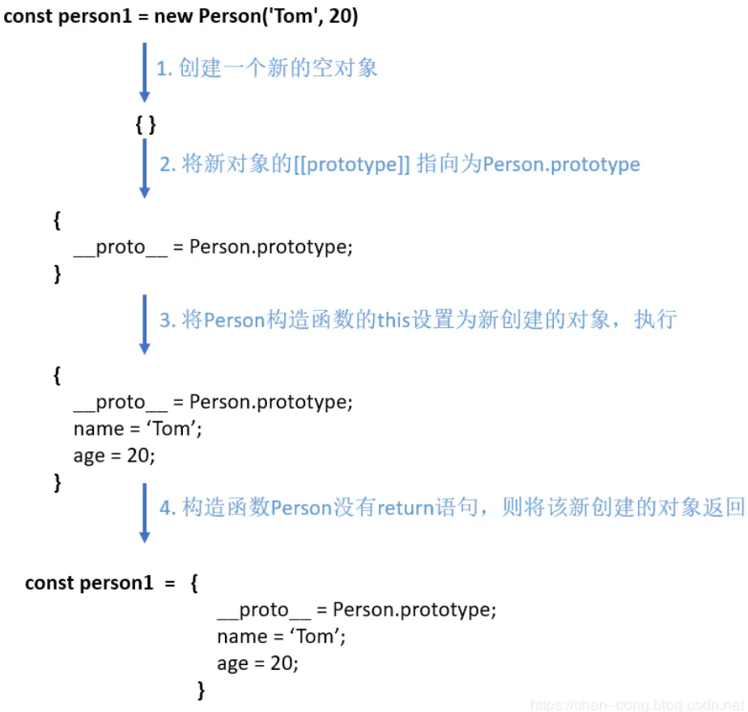


三、手写new操作符

现在我们已经清楚地掌握了`new`的执行过程

那么我们就动手来实现一下`new`

```javascript
function mynew(Func, ...args) {
    // 1.创建一个新对象
    const obj = {}
    // 2.新对象原型指向构造函数原型对象
    obj.__proto__ = Func.prototype
    // 3.将构建函数的this指向新对象
    let result = Func.apply(obj, args)
    // 4.根据返回值判断
    return result instanceof Object ? result : obj
}
```

测试一下

```javascript
function mynew(func, ...args) {
    const obj = {}
    obj.__proto__ = func.prototype
    let result = func.apply(obj, args)
    return result instanceof Object ? result : obj
}
function Person(name, age) {
    this.name = name;
    this.age = age;
}
Person.prototype.say = function () {
    console.log(this.name)
}

let p = mynew(Person, "huihui", 123)
console.log(p) // Person {name: "huihui", age: 123}
p.say() // huihui
```

可以发现，代码虽然很短，但是能够模拟实现`new`


***

## 5. 如何实现上拉加载，下拉刷新？


**参考答案：**


一、前言

下拉刷新和上拉加载这两种交互方式通常出现在移动端中

本质上等同于PC网页中的分页，只是交互形式不同

开源社区也有很多优秀的解决方案，如`iscroll`、`better-scroll`、`pulltorefresh.js`库等等

这些第三方库使用起来非常便捷

我们通过原生的方式实现一次上拉加载，下拉刷新，有助于对第三方库有更好的理解与使用


二、实现原理

上拉加载及下拉刷新都依赖于用户交互

最重要的是要理解在什么场景，什么时机下触发交互动作


上拉加载

首先可以看一张图

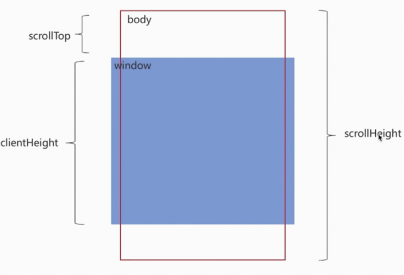

上拉加载的本质是页面触底，或者快要触底时的动作

判断页面触底我们需要先了解一下下面几个属性

* `scrollTop`：滚动视窗的高度距离`window`顶部的距离，它会随着往上滚动而不断增加，初始值是0，它是一个变化的值

* `clientHeight`:它是一个定值，表示屏幕可视区域的高度；

* `scrollHeight`：页面不能滚动时是不存在的，`body`长度超过`window`时才会出现，所表示`body`所有元素的长度

综上我们得出一个触底公式：

```javascript
scrollTop + clientHeight >= scrollHeight
```

简单实现

```javascript
let clientHeight  = document.documentElement.clientHeight; //浏览器高度
let scrollHeight = document.body.scrollHeight;
let scrollTop = document.documentElement.scrollTop;
 
let distance = 50;  //距离视窗还用50的时候，开始触发；

if ((scrollTop + clientHeight) >= (scrollHeight - distance)) {
    console.log("开始加载数据");
}
```


下拉刷新

下拉刷新的本质是页面本身置于顶部时，用户下拉时需要触发的动作

关于下拉刷新的原生实现，主要分成三步：

* 监听原生`touchstart`事件，记录其初始位置的值，`e.touches[0].pageY`；

* 监听原生`touchmove`事件，记录并计算当前滑动的位置值与初始位置值的差值，大于`0`表示向下拉动，并借助CSS3的`translateY`属性使元素跟随手势向下滑动对应的差值，同时也应设置一个允许滑动的最大值；

* 监听原生`touchend`事件，若此时元素滑动达到最大值，则触发`callback`，同时将`translateY`重设为`0`，元素回到初始位置

举个例子：

`Html`结构如下：

```javascript
<main>
    <p class="refreshText"></p >
    <ul id="refreshContainer">
        <li>111</li>
        <li>222</li>
        <li>333</li>
        <li>444</li>
        <li>555</li>
        ...
    </ul>
</main>
```

监听`touchstart`事件，记录初始的值

```javascript
var _element = document.getElementById('refreshContainer'),
    _refreshText = document.querySelector('.refreshText'),
    _startPos = 0,  // 初始的值
    _transitionHeight = 0; // 移动的距离

_element.addEventListener('touchstart', function(e) {
    _startPos = e.touches[0].pageY; // 记录初始位置
    _element.style.position = 'relative';
    _element.style.transition = 'transform 0s';
}, false);
```

监听`touchmove`移动事件，记录滑动差值

```javascript
_element.addEventListener('touchmove', function(e) {
    // e.touches[0].pageY 当前位置
    _transitionHeight = e.touches[0].pageY - _startPos; // 记录差值

    if (_transitionHeight > 0 && _transitionHeight < 60) { 
        _refreshText.innerText = '下拉刷新'; 
        _element.style.transform = 'translateY('+_transitionHeight+'px)';

        if (_transitionHeight > 55) {
            _refreshText.innerText = '释放更新';
        }
    }                
}, false);
```

最后，就是监听`touchend`离开的事件

```javascript
_element.addEventListener('touchend', function(e) {
    _element.style.transition = 'transform 0.5s ease 1s';
    _element.style.transform = 'translateY(0px)';
    _refreshText.innerText = '更新中...';
    // todo...

}, false);
```

从上面可以看到，在下拉到松手的过程中，经历了三个阶段：

* 当前手势滑动位置与初始位置差值大于零时，提示正在进行下拉刷新操作

* 下拉到一定值时，显示松手释放后的操作提示

* 下拉到达设定最大值松手时，执行回调，提示正在进行更新操作


三、案例

在实际开发中，我们更多的是使用第三方库，下面以`better-scroll`进行举例：

HTML结构

```javascript
<div id="position-wrapper">
    <div>
        <p class="refresh">下拉刷新</p >
        <div class="position-list">
   <!--列表内容-->
        </div>
        <p class="more">查看更多</p >
    </div>
</div>
```

实例化上拉下拉插件，通过`use`来注册插件

```javascript
import BScroll from "@better-scroll/core";
import PullDown from "@better-scroll/pull-down";
import PullUp from '@better-scroll/pull-up';
BScroll.use(PullDown);
BScroll.use(PullUp);
```

实例化`BetterScroll`，并传入相关的参数

```javascript
let pageNo = 1,pageSize = 10,dataList = [],isMore = true;  
var scroll= new BScroll("#position-wrapper",{
    scrollY:true,//垂直方向滚动
    click:true,//默认会阻止浏览器的原生click事件，如果需要点击，这里要设为true
    pullUpLoad:true,//上拉加载更多
    pullDownRefresh:{
        threshold:50,//触发pullingDown事件的位置
        stop:0//下拉回弹后停留的位置
    }
});
//监听下拉刷新
scroll.on("pullingDown",pullingDownHandler);
//监测实时滚动
scroll.on("scroll",scrollHandler);
//上拉加载更多
scroll.on("pullingUp",pullingUpHandler);

async function pullingDownHandler(){
    dataList=[];
    pageNo=1;
    isMore=true;
    $(".more").text("查看更多");
    await getlist();//请求数据
    scroll.finishPullDown();//每次下拉结束后，需要执行这个操作
    scroll.refresh();//当滚动区域的dom结构有变化时，需要执行这个操作
}
async function pullingUpHandler(){
    if(!isMore){
        $(".more").text("没有更多数据了");
        scroll.finishPullUp();//每次上拉结束后，需要执行这个操作
        return;
    }
    pageNo++;
    await this.getlist();//请求数据
    scroll.finishPullUp();//每次上拉结束后，需要执行这个操作
    scroll.refresh();//当滚动区域的dom结构有变化时，需要执行这个操作    
}
function scrollHandler(){
    if(this.y>50) $('.refresh').text("松手开始加载");
    else $('.refresh').text("下拉刷新");
}
function getlist(){
    //返回的数据
    let result=....;
    dataList=dataList.concat(result);
    //判断是否已加载完
    if(result.length<pageSize) isMore=false;
    //将dataList渲染到html内容中
}    
```

注意点：

使用`better-scroll `实现下拉刷新、上拉加载时要注意以下几点：

* `wrapper`里必须只有一个子元素

* 子元素的高度要比`wrapper`要高

* 使用的时候，要确定`DOM`元素是否已经生成，必须要等到`DOM`渲染完成后，再`new BScroll()`

* 滚动区域的`DOM`元素结构有变化后，需要执行刷新 `refresh()`

* 上拉或者下拉，结束后，需要执行`finishPullUp()`或者`finishPullDown()`，否则将不会执行下次操作

* `better-scroll`，默认会阻止浏览器的原生`click`事件，如果滚动内容区要添加点击事件，需要在实例化属性里设置`click:true`


小结

下拉刷新、上拉加载原理本身都很简单，真正复杂的是封装过程中，要考虑的兼容性、易用性、性能等诸多细节


***

## 6. 大文件怎么实现断点续传？


**参考答案：**

一、是什么

不管怎样简单的需求，在量级达到一定层次时，都会变得异常复杂

文件上传简单，文件变大就复杂

上传大文件时，以下几个变量会影响我们的用户体验

* 服务器处理数据的能力

* 请求超时

* 网络波动

上传时间会变长，高频次文件上传失败，失败后又需要重新上传等等

为了解决上述问题，我们需要对大文件上传单独处理

这里涉及到分片上传及断点续传两个概念


分片上传

分片上传，就是将所要上传的文件，按照一定的大小，将整个文件分隔成多个数据块（Part）来进行分片上传

如下图

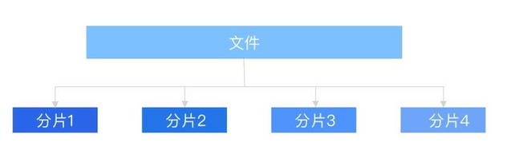

上传完之后再由服务端对所有上传的文件进行汇总整合成原始的文件

大致流程如下：

1. 将需要上传的文件按照一定的分割规则，分割成相同大小的数据块；

2. 初始化一个分片上传任务，返回本次分片上传唯一标识；

3. 按照一定的策略（串行或并行）发送各个分片数据块；

4. 发送完成后，服务端根据判断数据上传是否完整，如果完整，则进行数据块合成得到原始文件


断点续传

断点续传指的是在下载或上传时，将下载或上传任务人为的划分为几个部分

每一个部分采用一个线程进行上传或下载，如果碰到网络故障，可以从已经上传或下载的部分开始继续上传下载未完成的部分，而没有必要从头开始上传下载。用户可以节省时间，提高速度

一般实现方式有两种：

* 服务器端返回，告知从哪开始

* 浏览器端自行处理

上传过程中将文件在服务器写为临时文件，等全部写完了（文件上传完），将此临时文件重命名为正式文件即可

如果中途上传中断过，下次上传的时候根据当前临时文件大小，作为在客户端读取文件的偏移量，从此位置继续读取文件数据块，上传到服务器从此偏移量继续写入文件即可


二、实现思路

整体思路比较简单，拿到文件，保存文件唯一性标识，切割文件，分段上传，每次上传一段，根据唯一性标识判断文件上传进度，直到文件的全部片段上传完毕

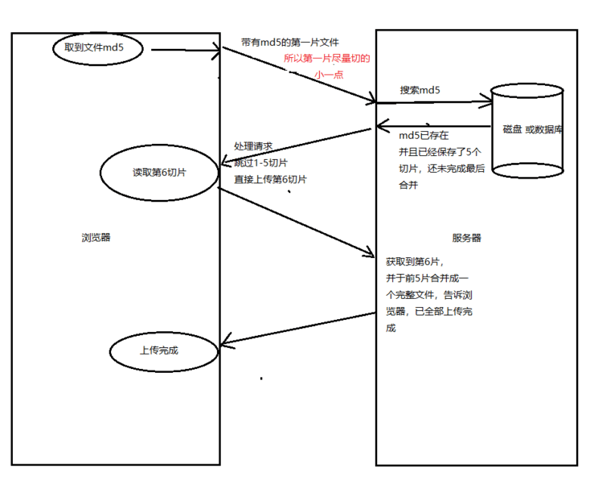

下面的内容都是伪代码

读取文件内容：

```javascript
const input = document.querySelector('input');
input.addEventListener('change', function() {
    var file = this.files[0];
});
```

可以使用`md5`实现文件的唯一性

```javascript
const md5code = md5(file);
```

然后开始对文件进行分割

```javascript
var reader = new FileReader();
reader.readAsArrayBuffer(file);
reader.addEventListener("load", function(e) {
    //每10M切割一段,这里只做一个切割演示，实际切割需要循环切割，
    var slice = e.target.result.slice(0, 10*1024*1024);
});
```

h5上传一个（一片）

```javascript
const formdata = new FormData();
formdata.append('0', slice);
//这里是有一个坑的，部分设备无法获取文件名称，和文件类型，这个在最后给出解决方案
formdata.append('filename', file.filename);
var xhr = new XMLHttpRequest();
xhr.addEventListener('load', function() {
    //xhr.responseText
});
xhr.open('POST', '');
xhr.send(formdata);
xhr.addEventListener('progress', updateProgress);
xhr.upload.addEventListener('progress', updateProgress);

function updateProgress(event) {
    if (event.lengthComputable) {
        //进度条
    }
}
```

这里给出常见的图片和视频的文件类型判断

```javascript
function checkFileType(type, file, back) {
/**
* type png jpg mp4 ...
* file input.change=> this.files[0]
* back callback(boolean)
*/
    var args = arguments;
    if (args.length != 3) {
        back(0);
    }
    var type = args[0]; // type = '(png|jpg)' , 'png'
    var file = args[1];
    var back = typeof args[2] == 'function' ? args[2] : function() {};
    if (file.type == '') {
        // 如果系统无法获取文件类型，则读取二进制流，对二进制进行解析文件类型
        var imgType = [
            'ff d8 ff', //jpg
            '89 50 4e', //png

            '0 0 0 14 66 74 79 70 69 73 6F 6D', //mp4
            '0 0 0 18 66 74 79 70 33 67 70 35', //mp4
            '0 0 0 0 66 74 79 70 33 67 70 35', //mp4
            '0 0 0 0 66 74 79 70 4D 53 4E 56', //mp4
            '0 0 0 0 66 74 79 70 69 73 6F 6D', //mp4

            '0 0 0 18 66 74 79 70 6D 70 34 32', //m4v
            '0 0 0 0 66 74 79 70 6D 70 34 32', //m4v

            '0 0 0 14 66 74 79 70 71 74 20 20', //mov
            '0 0 0 0 66 74 79 70 71 74 20 20', //mov
            '0 0 0 0 6D 6F 6F 76', //mov

            '4F 67 67 53 0 02', //ogg
            '1A 45 DF A3', //ogg

            '52 49 46 46 x x x x 41 56 49 20', //avi (RIFF fileSize fileType LIST)(52 49 46 46,DC 6C 57 09,41 56 49 20,4C 49 53 54)
        ];
        var typeName = [
            'jpg',
            'png',
            'mp4',
            'mp4',
            'mp4',
            'mp4',
            'mp4',
            'm4v',
            'm4v',
            'mov',
            'mov',
            'mov',
            'ogg',
            'ogg',
            'avi',
        ];
        var sliceSize = /png|jpg|jpeg/.test(type) ? 3 : 12;
        var reader = new FileReader();
        reader.readAsArrayBuffer(file);
        reader.addEventListener("load", function(e) {
            var slice = e.target.result.slice(0, sliceSize);
            reader = null;
            if (slice && slice.byteLength == sliceSize) {
                var view = new Uint8Array(slice);
                var arr = [];
                view.forEach(function(v) {
                    arr.push(v.toString(16));
                });
                view = null;
                var idx = arr.join(' ').indexOf(imgType);
                if (idx > -1) {
                    back(typeName[idx]);
                } else {
                    arr = arr.map(function(v) {
                        if (i > 3 && i < 8) {
                            return 'x';
                        }
                        return v;
                    });
                    var idx = arr.join(' ').indexOf(imgType);
                    if (idx > -1) {
                        back(typeName[idx]);
                    } else {
                        back(false);
                    }

                }
            } else {
                back(false);
            }

        });
    } else {
        var type = file.name.match(/\.(\w+)$/)[1];
        back(type);
    }
}
```

调用方法如下

```javascript
checkFileType('(mov|mp4|avi)',file,function(fileType){
    // fileType = mp4,
    // 如果file的类型不在枚举之列，则返回false
});
```

上面上传文件的一步，可以改成：

```javascript
formdata.append('filename', md5code+'.'+fileType);
```

有了切割上传后，也就有了文件唯一标识信息，断点续传变成了后台的一个小小的逻辑判断

后端主要做的内容为：根据前端传给后台的`md5`值，到服务器磁盘查找是否有之前未完成的文件合并信息（也就是未完成的半成品文件切片），取到之后根据上传切片的数量，返回数据告诉前端开始从第几节上传

如果想要暂停切片的上传，可以使用`XMLHttpRequest `的 `abort `方法


三、使用场景

* 大文件加速上传：当文件大小超过预期大小时，使用分片上传可实现并行上传多个 Part， 以加快上传速度

* 网络环境较差：建议使用分片上传。当出现上传失败的时候，仅需重传失败的Part

* 流式上传：可以在需要上传的文件大小还不确定的情况下开始上传。这种场景在视频监控等行业应用中比较常见


小结

当前的伪代码，只是提供一个简单的思路，想要把事情做到极致，我们还需要考虑到更多场景，比如

* 切片上传失败怎么办

* 上传过程中刷新页面怎么办

* 如何进行并行上传

* 切片什么时候按数量切，什么时候按大小切

* 如何结合 Web Work 处理大文件上传

* 如何实现秒传

人生又何尝不是如此，极致的人生体验有无限可能，越是后面才发现越是精彩&#x20;


***

## 7. 什么是防抖和节流，以及如何编码实现？


**参考答案：**


一、是什么

本质上是优化高频率执行代码的一种手段

如：浏览器的 `resize`、`scroll`、`keypress`、`mousemove` 等事件在触发时，会不断地调用绑定在事件上的回调函数，极大地浪费资源，降低前端性能

为了优化体验，需要对这类事件进行调用次数的限制，对此我们就可以采用`throttle`（节流）和`debounce`（防抖）的方式来减少调用频率


定义

* 节流: n 秒内只运行一次，若在 n 秒内重复触发，只有一次生效

* 防抖: n 秒后在执行该事件，若在 n 秒内被重复触发，则重新计时

一个经典的比喻:

想象每天上班大厦底下的电梯。把电梯完成一次运送，类比为一次函数的执行和响应

假设电梯有两种运行策略 `debounce` 和 `throttle`，超时设定为15秒，不考虑容量限制

电梯第一个人进来后，15秒后准时运送一次，这是节流

电梯第一个人进来后，等待15秒。如果过程中又有人进来，15秒等待重新计时，直到15秒后开始运送，这是防抖


代码实现


节流

完成节流可以使用时间戳与定时器的写法

使用时间戳写法，事件会立即执行，停止触发后没有办法再次执行

```javascript
function throttled1(fn, delay = 500) {
    let oldtime = Date.now()
    return function (...args) {
        let newtime = Date.now()
        if (newtime - oldtime >= delay) {
            fn.apply(null, args)
            oldtime = Date.now()
        }
    }
}
```

使用定时器写法，`delay`毫秒后第一次执行，第二次事件停止触发后依然会再一次执行

```javascript
function throttled2(fn, delay = 500) {
    let timer = null
    return function (...args) {
        if (!timer) {
            timer = setTimeout(() => {
                fn.apply(this, args)
                timer = null
            }, delay);
        }
    }
}
```

可以将时间戳写法的特性与定时器写法的特性相结合，实现一个更加精确的节流。实现如下

```javascript
function throttled(fn, delay) {
    let timer = null
    let starttime = Date.now()
    return function () {
        let curTime = Date.now() // 当前时间
        let remaining = delay - (curTime - starttime)  // 从上一次到现在，还剩下多少多余时间
        let context = this
        let args = arguments
        clearTimeout(timer)
        if (remaining <= 0) {
            fn.apply(context, args)
            starttime = Date.now()
        } else {
            timer = setTimeout(fn, remaining);
        }
    }
}
```


防抖

简单版本的实现

```javascript
function debounce(func, wait) {
    let timeout;

    return function () {
        let context = this; // 保存this指向
        let args = arguments; // 拿到event对象

        clearTimeout(timeout)
        timeout = setTimeout(function(){
            func.apply(context, args)
        }, wait);
    }
}
```

防抖如果需要立即执行，可加入第三个参数用于判断，实现如下：

```javascript
function debounce(func, wait, immediate) {

    let timeout;

    return function () {
        let context = this;
        let args = arguments;

        if (timeout) clearTimeout(timeout); // timeout 不为null
        if (immediate) {
            let callNow = !timeout; // 第一次会立即执行，以后只有事件执行后才会再次触发
            timeout = setTimeout(function () {
                timeout = null;
            }, wait)
            if (callNow) {
                func.apply(context, args)
            }
        }
        else {
            timeout = setTimeout(function () {
                func.apply(context, args)
            }, wait);
        }
    }
}
```


二、区别

相同点：

* 都可以通过使用 `setTimeout` 实现

* 目的都是，降低回调执行频率。节省计算资源

不同点：

* 函数防抖，在一段连续操作结束后，处理回调，利用`clearTimeout `和 `setTimeout`实现。函数节流，在一段连续操作中，每一段时间只执行一次，频率较高的事件中使用来提高性能

* 函数防抖关注一定时间连续触发的事件，只在最后执行一次，而函数节流一段时间内只执行一次

例如，都设置时间频率为500ms，在2秒时间内，频繁触发函数，节流，每隔 500ms 就执行一次。防抖，则不管调动多少次方法，在2s后，只会执行一次

如下图所示：

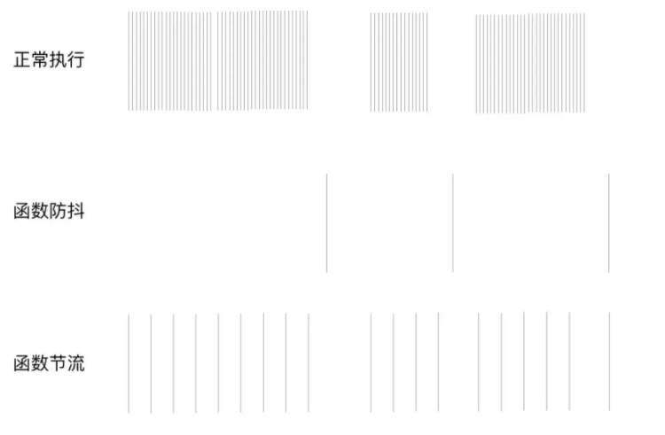


三、应用场景

防抖在连续的事件，只需触发一次回调的场景有：

* 搜索框搜索输入。只需用户最后一次输入完，再发送请求

* 手机号、邮箱验证输入检测

* 窗口大小`resize`。只需窗口调整完成后，计算窗口大小。防止重复渲染。

节流在间隔一段时间执行一次回调的场景有：

* 滚动加载，加载更多或滚到底部监听

* 搜索框，搜索联想功能


***

## 8. 说说ajax的原理，以及如何实现？


**参考答案：**


一、是什么

`AJAX `全称(Async Javascript and XML)

即异步的` JavaScript` 和` XML`，是一种创建交互式网页应用的网页开发技术，可以在不重新加载整个网页的情况下，与服务器交换数据，并且更新部分网页

`Ajax`的原理简单来说通过`XmlHttpRequest`对象来向服务器发异步请求，从服务器获得数据，然后用`JavaScript`来操作`DOM`而更新页面

流程图如下：

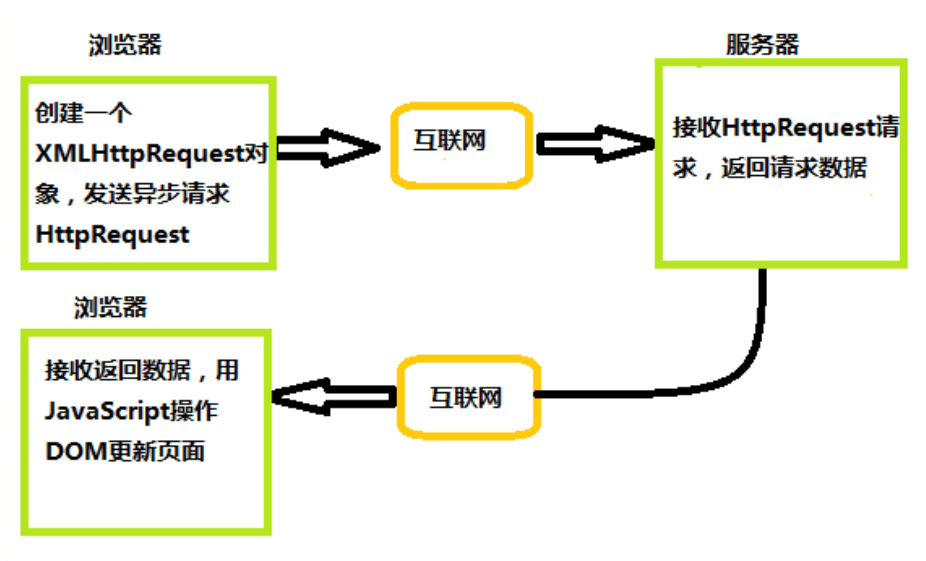

下面举个例子：

领导想找小李汇报一下工作，就委托秘书去叫小李，自己就接着做其他事情，直到秘书告诉他小李已经到了，最后小李跟领导汇报工作

`Ajax`请求数据流程与“领导想找小李汇报一下工作”类似，上述秘书就相当于`XMLHttpRequest`对象，领导相当于浏览器，响应数据相当于小李

浏览器可以发送`HTTP`请求后，接着做其他事情，等收到`XHR`返回来的数据再进行操作


二、实现过程

实现 `Ajax `异步交互需要服务器逻辑进行配合，需要完成以下步骤：

* 创建 `Ajax `的核心对象 `XMLHttpRequest `对象

* 通过 `XMLHttpRequest` 对象的 `open()` 方法与服务端建立连接

* 构建请求所需的数据内容，并通过` XMLHttpRequest` 对象的 `send()` 方法发送给服务器端

* 通过 `XMLHttpRequest` 对象提供的 `onreadystatechange` 事件监听服务器端你的通信状态

* 接受并处理服务端向客户端响应的数据结果

* 将处理结果更新到 `HTML `页面中


创建XMLHttpRequest对象

通过`XMLHttpRequest()` 构造函数用于初始化一个 `XMLHttpRequest` 实例对象

```javascript
const xhr = new XMLHttpRequest();
```


与服务器建立连接

通过 `XMLHttpRequest` 对象的 `open()` 方法与服务器建立连接

```javascript
xhr.open(method, url, [async][, user][, password])
```

参数说明：

* `method`：表示当前的请求方式，常见的有`GET`、`POST`

* `url`：服务端地址

* `async`：布尔值，表示是否异步执行操作，默认为`true`

* `user`: 可选的用户名用于认证用途；默认为\`null

* `password`: 可选的密码用于认证用途，默认为\`null


给服务端发送数据

通过 `XMLHttpRequest` 对象的 `send()` 方法，将客户端页面的数据发送给服务端

```javascript
xhr.send([body])
```

`body`: 在 `XHR` 请求中要发送的数据体，如果不传递数据则为 `null`

如果使用`GET`请求发送数据的时候，需要注意如下：

* 将请求数据添加到`open()`方法中的`url`地址中

* 发送请求数据中的`send()`方法中参数设置为`null`


绑定onreadystatechange事件

`onreadystatechange` 事件用于监听服务器端的通信状态，主要监听的属性为`XMLHttpRequest.readyState` ,

关于`XMLHttpRequest.readyState`属性有五个状态，如下图显示

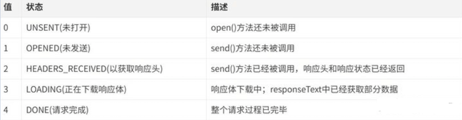

只要 `readyState `属性值一变化，就会触发一次 `readystatechange` 事件

`XMLHttpRequest.responseText`属性用于接收服务器端的响应结果

举个例子：

```javascript
const request = new XMLHttpRequest()
request.onreadystatechange = function(e){
    if(request.readyState === 4){ // 整个请求过程完毕
        if(request.status >= 200 && request.status <= 300){
            console.log(request.responseText) // 服务端返回的结果
        }else if(request.status >=400){
            console.log("错误信息：" + request.status)
        }
    }
}
request.open('POST','http://xxxx')
request.send()
```


三、封装

通过上面对`XMLHttpRequest `对象的了解，下面来封装一个简单的`ajax`请求

```javascript
//封装一个ajax请求
function ajax(options) {
    //创建XMLHttpRequest对象
    const xhr = new XMLHttpRequest()


    //初始化参数的内容
    options = options || {}
    options.type = (options.type || 'GET').toUpperCase()
    options.dataType = options.dataType || 'json'
    const params = options.data

    //发送请求
    if (options.type === 'GET') {
        xhr.open('GET', options.url + '?' + params, true)
        xhr.send(null)
    } else if (options.type === 'POST') {
        xhr.open('POST', options.url, true)
        xhr.send(params)

    //接收请求
    xhr.onreadystatechange = function () {
        if (xhr.readyState === 4) {
            let status = xhr.status
            if (status >= 200 && status < 300) {
                options.success && options.success(xhr.responseText, xhr.responseXML)
            } else {
                options.fail && options.fail(status)
            }
        }
    }
}
```

使用方式如下

```javascript
ajax({
    type: 'post',
    dataType: 'json',
    data: {},
    url: 'https://xxxx',
    success: function(text,xml){//请求成功后的回调函数
        console.log(text)
    },
    fail: function(status){////请求失败后的回调函数
        console.log(status)
    }
})
```


***

## 9. 深拷贝浅拷贝有什么区别？怎么实现深拷贝？


**参考答案：**


一、数据类型存储

前面文章我们讲到，`JavaScript`中存在两大数据类型：

* 基本类型

* 引用类型

基本类型数据保存在在栈内存中

引用类型数据保存在堆内存中，引用数据类型的变量是一个指向堆内存中实际对象的引用，存在栈中


二、浅拷贝

浅拷贝，指的是创建新的数据，这个数据有着原始数据属性值的一份精确拷贝

如果属性是基本类型，拷贝的就是基本类型的值。如果属性是引用类型，拷贝的就是内存地址

即浅拷贝是拷贝一层，深层次的引用类型则共享内存地址

下面简单实现一个浅拷贝

```javascript
function shallowClone(obj) {
    const newObj = {};
    for(let prop in obj) {
        if(obj.hasOwnProperty(prop)){
            newObj[prop] = obj[prop];
        }
    }
    return newObj;
}
```

在`JavaScript`中，存在浅拷贝的现象有：

* `Object.assign`

* `Array.prototype.slice()`, `Array.prototype.concat()`

* 使用拓展运算符实现的复制


Object.assign

```javascript
var obj = {
    age: 18,
    nature: ['smart', 'good'],
    names: {
        name1: 'fx',
        name2: 'xka'
    },
    love: function () {
        console.log('fx is a great girl')
    }
}
var newObj = Object.assign({}, obj);
```


slice()

```javascript
const fxArr = ["One", "Two", "Three"]
const fxArrs = fxArr.slice(0)
fxArrs[1] = "love";
console.log(fxArr) // ["One", "Two", "Three"]
console.log(fxArrs) // ["One", "love", "Three"]
```


concat()

```javascript
const fxArr = ["One", "Two", "Three"]
const fxArrs = fxArr.concat()
fxArrs[1] = "love";
console.log(fxArr) // ["One", "Two", "Three"]
console.log(fxArrs) // ["One", "love", "Three"]
```


拓展运算符

```javascript
const fxArr = ["One", "Two", "Three"]
const fxArrs = [...fxArr]
fxArrs[1] = "love";
console.log(fxArr) // ["One", "Two", "Three"]
console.log(fxArrs) // ["One", "love", "Three"]
```


三、深拷贝

深拷贝开辟一个新的栈，两个对象的属性完全相同，但是对应两个不同的地址，修改一个对象的属性，不会改变另一个对象的属性

常见的深拷贝方式有：

* \_.cloneDeep()

* jQuery.extend()

* JSON.stringify()

* 手写循环递归


\_.cloneDeep()

```javascript
const _ = require('lodash');
const obj1 = {
    a: 1,
    b: { f: { g: 1 } },
    c: [1, 2, 3]
};
const obj2 = _.cloneDeep(obj1);
console.log(obj1.b.f === obj2.b.f);// false
```


jQuery.extend()

```javascript
const $ = require('jquery');
const obj1 = {
    a: 1,
    b: { f: { g: 1 } },
    c: [1, 2, 3]
};
const obj2 = $.extend(true, {}, obj1);
console.log(obj1.b.f === obj2.b.f); // false
```


JSON.stringify()

```javascript
const obj2=JSON.parse(JSON.stringify(obj1));
```

但是这种方式存在弊端，会忽略`undefined`、`symbol`和`函数`

```javascript
const obj = {
    name: 'A',
    name1: undefined,
    name3: function() {},
    name4:  Symbol('A')
}
const obj2 = JSON.parse(JSON.stringify(obj));
console.log(obj2); // {name: "A"}
```


循环递归

```javascript
function deepClone(obj, hash = new WeakMap()) {
  if (obj === null) return obj; // 如果是null或者undefined我就不进行拷贝操作
  if (obj instanceof Date) return new Date(obj);
  if (obj instanceof RegExp) return new RegExp(obj);
  // 可能是对象或者普通的值  如果是函数的话是不需要深拷贝
  if (typeof obj !== "object") return obj;
  // 是对象的话就要进行深拷贝
  if (hash.get(obj)) return hash.get(obj);
  let cloneObj = new obj.constructor();
  // 找到的是所属类原型上的constructor,而原型上的 constructor指向的是当前类本身
  hash.set(obj, cloneObj);
  for (let key in obj) {
    if (obj.hasOwnProperty(key)) {
      // 实现一个递归拷贝
      cloneObj[key] = deepClone(obj[key], hash);
    }
  }
  return cloneObj;
}
```


四、区别

下面首先借助两张图，可以更加清晰看到浅拷贝与深拷贝的区别

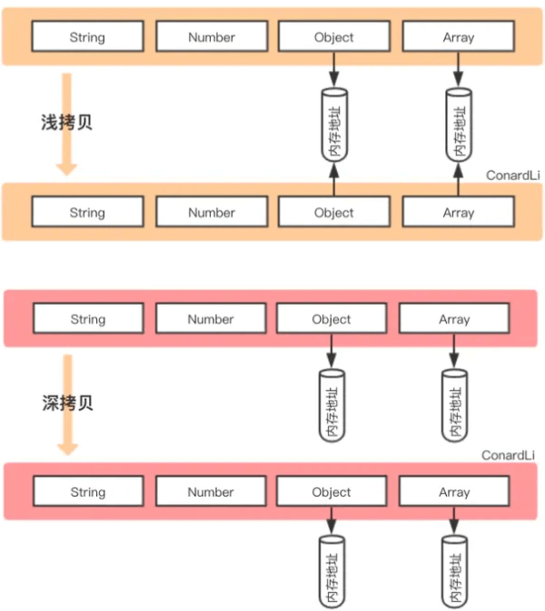

从上图发现，浅拷贝和深拷贝都创建出一个新的对象，但在复制对象属性的时候，行为就不一样

浅拷贝只复制属性指向某个对象的指针，而不复制对象本身，新旧对象还是共享同一块内存，修改对象属性会影响原对象

```javascript
// 浅拷贝
const obj1 = {
    name : 'init',
    arr : [1,[2,3],4],
};
const obj3=shallowClone(obj1) // 一个浅拷贝方法
obj3.name = "update";
obj3.arr[1] = [5,6,7] ; // 新旧对象还是共享同一块内存

console.log('obj1',obj1) // obj1 { name: 'init',  arr: [ 1, [ 5, 6, 7 ], 4 ] }
console.log('obj3',obj3) // obj3 { name: 'update', arr: [ 1, [ 5, 6, 7 ], 4 ] }
```

但深拷贝会另外创造一个一模一样的对象，新对象跟原对象不共享内存，修改新对象不会改到原对象

```javascript
// 深拷贝
const obj1 = {
    name : 'init',
    arr : [1,[2,3],4],
};
const obj4=deepClone(obj1) // 一个深拷贝方法
obj4.name = "update";
obj4.arr[1] = [5,6,7] ; // 新对象跟原对象不共享内存

console.log('obj1',obj1) // obj1 { name: 'init', arr: [ 1, [ 2, 3 ], 4 ] }
console.log('obj4',obj4) // obj4 { name: 'update', arr: [ 1, [ 5, 6, 7 ], 4 ] }
```


小结

前提为拷贝类型为引用类型的情况下：

* 浅拷贝是复制内存中的地址，拷贝前后的对象，因为引用类型共享了同一块内存，修改会相互影响。

* 深拷贝是递归拷贝深层次，属性为对象时，深拷贝是新开栈，两个对象指向不同的地址


***

## 10. 用js实现二叉树的定义和基本操作


**参考答案：**

树是计算机科学中经常用到的一种数据结构。树是一种非线性的数据结构，以分层的方式存储数据。树被用来存储具有层级关系的数据，比如文件系统中的文件；树还被用来存储有序列表。

二叉树具有诸多优点。相对于链表来说，二叉树在进行查找时速度非常快，而相对于数组来说，为二叉树添加或删除元素也非常快。


二叉树

二叉树是一种特殊的树，表现在它的子节点个数不超过两个。且二叉树的子树有左右之分，其次序不能任意颠倒。

在实现二叉树时，采用的存储结构为链式存储结构，链式结构的意思是采用一个链表来存储一颗二叉树，二叉树中每一个节点用链表的一个节点来存储，在二叉树中，节点结构至少有三个域：数据域data，左指针域left，右指针域right，如下图所示：

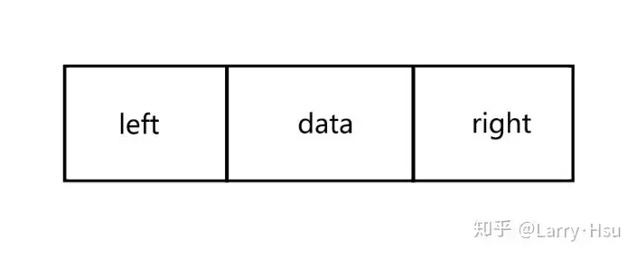

二叉链表的存储结构描述如下：

```javascript
class Node{
    constructor(data, left, right){
        this.data = data;
        this.left = left;
        this.right = right;
        this.count = 1;
    }
}
```

与图1不同之处在于多了一个count变量，这个变量的作用在于，在向二叉排序树中插入节点时，如果发现有已经有相同的节点值了，就放弃插入，但是将该节点的count变量加一，这是为了后面实现统计文本中不同的单词数量而设计的。

使用不同的存储结构，实现二叉树的链表的算法也不同。因此接下来的算法全都基于当前所选的存储结构。

其次，将要实现的并不是普通的二叉树，而是二叉排序树，其定义为：

> 二叉排序树或者是一棵空树，或者是具有下列性质的二叉树：
>
> （1）若左子树不空，则左子树上所有结点的值均小于它的根结点的值；
>
> （2）若右子树不空，则右子树上所有结点的值均大于它的根结点的值；
>
> （3）左、右子树也分别为二叉排序树；
>
> （4）没有键值相等的节点。


二叉排序树

在二叉排序树的实现了一些基本操作：插入节点，删除节点，寻找节点，以及获取最小值和最大值。

代码框架：

```javascript
class BSTree {
    constructor() {
        this.root = null;
    }

    // 删除一个节点
    _removeNode(node, data) {
       
    }

    // 删除给定的数据节点
    remove(data) {
        this.root = this._removeNode(this.root, data);
    }

    // 向二叉树中插入节点
    insert(data) {
        
    }

    // 寻找给定数据的节点
    find(data) {
        
    }

    // 获得最小值的节点
    getMinNode(node = this.root) {
        
    }

    // 获得最大值的节点
    getMaxNode(node = this.root) {
        
    }
}
```


实现二叉排序树的各种方法

首先是insert(data)方法，从总体上来说，插入操作可以分为两步，新建值为data的节点，然后在二叉排序树中找到合适的位置插入即可。

建立以data为值的新的节点比较容易，只要

```javascript
let newNode = new Node(data, null, null);
```

可，关键就在于如何找到正确的插入位置。

这里使用parentNode来记录当前节点的父节点，初始时，该变量为null，当前节点为currNode，初始时为该二叉树的根节点。

* 如果在插入时，root节点为空，则直接将新节点赋给root节点即可。

* 如果新的节点值小于当前节点值，说明待插入的位置应在在当前节点的左子树上，那么在大于时，就应该在当前节点的右子树上。进而更新当前节点所指向的节点，直到当前节点为空时，说明找到了正确的插入位置。

insert()的具体代码如下：

```javascript
    // 向二叉树中插入节点
    insert(data) {
        let newNode = new Node(data, null, null);

        if (this.root == null) {
            this.root = newNode;
        } else {
            let currNode = this.root;
            let parentNode = null;

            while (true) {
                parentNode = currNode;

                if (newNode.data < currNode.data) {
                    currNode = currNode.left;  // 更新当前指点的指向

                    if (!currNode) {  // 当前节点为空时，说明找到了正确的插入位置
                        parentNode.left = newNode;
                        break;
                    }
                } else if (newNode.data > currNode.data) {
                    currNode = currNode.right;   // 更新当前指点的指向

                    if (!currNode) {  // // 当前节点为空时，说明找到了正确的插入位置
                        parentNode.right = newNode;
                        break;
                    }
                } else if (newNode.data == currNode.data) {
                    // 如果给定的数据再次出现，就更新计数值
                    currNode.count++;
                    break;
                }
            }
        }
    }
```

寻找最小值函数getMinNode()，该方法较为简单，因为是一个二叉排序树，所以最小值永远在最左边的分支上，故而一直沿着左分支走到头就是最小值了。

```javascript
   // 获得最小值的节点
    getMinNode(node = this.root) {   // 获得最大值的节点
    getMaxNode(node = this.root) {
        let currNode = node;
        while (currNode.right) {
            currNode = currNode.right;
        }
        return currNode;
    }
        let currNode = node;
        while (currNode.left) {
            currNode = currNode.left;
        }
        return currNode;
    }
```

最大值也是同样的道理：

```javascript
   // 获得最大值的节点
    getMaxNode(node = this.root) {
        let currNode = node;
        while (currNode.right) {
            currNode = currNode.right;
        }
        return currNode;
    }
```

find()方法，在二叉树排序树中寻找给定的数据，比较简单：

```javascript
    // 寻找给定数据的节点
    find(data) {
        let currNode = this.root;
        while (currNode) {
            if (currNode.data == data) {
                return currNode;
            } else if (data < currNode.data) {
                currNode = currNode.left;
            } else {
                currNode = currNode.right;
            }
        }
        return null;
    }
```

接下来时较为复杂一些的remove()方法，由于删除节点操作使用到了递归的操作，所以单独定义了一个函数：

```javascript
_removeNode(node, data){}
```

这里在\_removeNode()的方法中实现真正的删除操作。该函数的功能是删除以data为值的节点，函数名称前面有个下划线表示不应该在实例中调用此函数。

这里在remove()方法中调用了这个函数：

```javascript
remove(data){
    this.root = this._removeNode(this.root, data);
}
```

在删除节点时，一共可以分为三种情况：

1. 待删除的节点是叶子节点。

2. 待删除的节点没有左子节点，或者没有右子节点。

3. 待删除的节点的左右子节点均存在。

当待删除的节点时叶子节点时，这种情况比较简单，直接将待删除的节点置空返回即可。

当待删除的节点没有左子节点时，返回该节点的右孩子节点，并删除该节点。待删除节点没有右节点时类似处理。

比较麻烦的是最后一种情况，待删除的节点的左右子节点均存在时，可以有两种做法：要么查找待删除节点左子树上的最大值，要么查找其右子树上的最小值。

这里使用查找其右子树上的最小值的方法。在找到待删除节点的右子树上的最小值后，创建一个临时节点，将临时节点上的值复制到待删除节点，然后再删除临时节点。

```javascript
    // 删除一个节点
    _removeNode(node, data) {
        if (node == null) {
            return null;
        }
        if (data == node.data) {
            // 叶子节点
            if (node.left == null && node.right == null) {
                return null;
            }

            // 没有左节点的节点
            if (node.left == null) return node.right;


            //没有右节点的节点
            if (node.right == null) return node.left;
     

            // 有两个节点的节点
            /*  
             做法：
                找到待删除节点的右子树上的最小值创建一个临时节点。
                将临时节点上的值复制到待删除节点，然后再删除临时节点
            */

            // 寻找右子树上的最小值
            let tmpNode = this.getMinNode(node.right);
            node.data = tmpNode.data;
            node.right = this._removeNode(node.right, tmpNode.data);
            return node;
        } else if (data < node.data) {  // 待删除节点在左子树上
            node.left = this._removeNode(node.left, data);
            return node;
        } else {  // 待删除节点在右子树上
            node.right = this._removeNode(node.right, data);
            return node;
        }
    }
```

该函数使用了递归的操作来删除一个节点，如果传入待删除的数据值正好等于传入的节点的数据值时，就开始判断是上面提到的3中情况的那一种。如果待删除数据值小于当前节点数据值，则说明待删除的数据在当前节点的左子树上，反之在右子树上。


测试

由于准备将二叉排序树的遍历操作写在下一篇中，所以担心方法可能写错了的小伙伴可能展示无法测试所写的插入和删除操作正确与否。先用写的获取最大值和最小值来测试下吧。

```javascript
let myTree = new BSTree();

myTree.insert(20);
myTree.insert(13);
myTree.insert(7);
myTree.insert(9);
myTree.insert(15);
myTree.insert(14);
myTree.insert(42);
myTree.insert(22);
myTree.insert(21);
myTree.insert(24);
myTree.insert(57);
```

新建后的二叉排序树如下图所示：

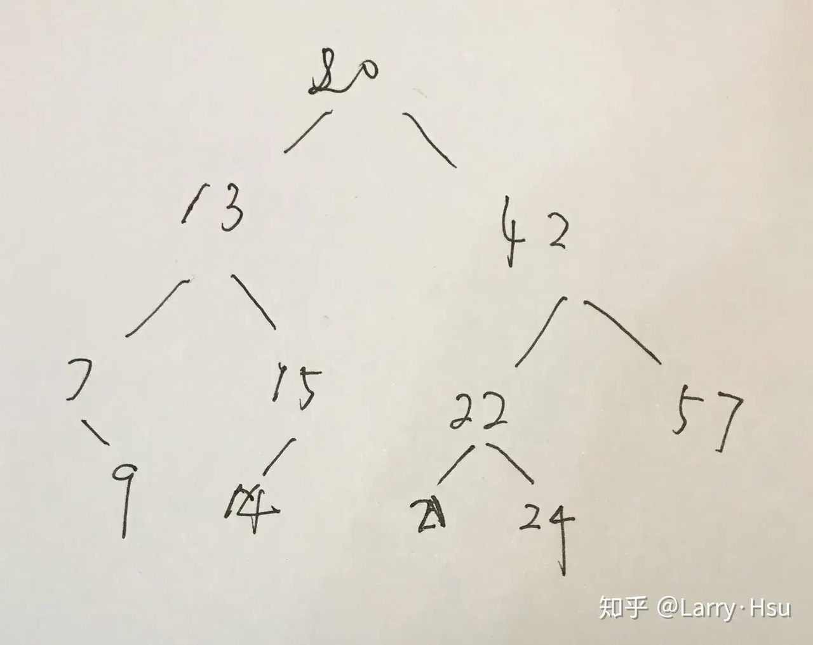

获取最大值试一下：

```javascript
console.log(myTree.getMaxNode());  // Node {data: 57, left: null, right: null, count: 1}
```

可以看到值为57的节点确实没有左右子树。

最小值：

```javascript
console.log(myTree.getMinNode());  // Node {data: 7, left: null, right: Node, count: 1}
```

可以看到值为7的节点只有右子树，与上图所示相同。

删除节点7，模拟下删除时有右子节点的情况：

```javascript
myTree.remove(7);
console.log(myTree.getMinNode());  // Node {data: 9, left: null, right: null, count: 1}
```

可见值为9的节点取代了原来值为7的节点的位置。

删除节点42，模拟下删除时左右子树均存在的情况：

```javascript
myTree.remove(42);
console.log(myTree.getMaxNode());  // Node {data: 57, left: Node, right: null, count: 1}
```

在删除值为42的节点时，使用的方法时寻找其右子树上的最大值，为57。将待删除的节点的值修改为57，然后在其右子树上删除值为57的节点即可。

根据返回的结果来看，删除后最大值为57，其右子树为空。可见是正确的。


***


## 11. 如何实现一个轮播图组件？


**参考答案**


可以按照以下步骤来进行：

1. HTML 结构：首先，在 HTML 中创建一个容器元素，用于包裹轮播图的内容。在容器内部，使用 `<ul>` 元素创建一个无序列表，并为每个轮播项（图片或其他内容）创建一个 `<li>` 元素。

```javascript
<div class="carousel-container">
  <ul class="carousel-list">
    <li></li>
    <li></li>
    <li></li>
  </ul>
</div>
```


CSS 样式：为轮播图容器和轮播项添加必要的 CSS 样式，例如设置容器的宽度和高度，将轮播项设置为水平排列等。

```javascript
.carousel-container {
  width: 500px;
  height: 300px;
  overflow: hidden; /* 隐藏超出容器范围的内容 */
  position: relative;
}

.carousel-list {
  list-style: none;
  margin: 0;
  padding: 0;
  width: 300%; /* 水平排列的轮播项总宽度为 300% */
  position: absolute;
  top: 0;
  left: 0;
}

.carousel-list li {
  float: left;
  width: 33.33%; /* 每个轮播项的宽度为容器宽度的 1/3 */
}
```

JavaScript 功能：使用 JavaScript 来实现轮播图组件的功能，包括自动切换轮播项、导航控制、动画效果等。

* 定义一个计数器变量，用于跟踪当前显示的轮播项索引。

* 创建一个函数，用于自动切换轮播项。可以使用 `setInterval()` 函数来定时调用该函数。

* 创建函数，用于切换到下一个或指定的轮播项。可以使用 `classList` 属性来添加和移除 CSS 类以显示和隐藏轮播项。

* 创建函数，用于处理导航控制（如点击左右箭头或指示器）以切换轮播项。

* 可以使用 CSS 过渡或动画效果来实现平滑的切换效果。

```javascript
const carouselList = document.querySelector('.carousel-list');
let currentIndex = 0;

function autoSwitch() {
  // 切换到下一个轮播项
  currentIndex++;
  if (currentIndex === carouselList.children.length) {
    currentIndex = 0;
  }
  switchTo(currentIndex);
}

function switchTo(index) {
  carouselList.style.transform = `translateX(-${index * 100}%)`;
}

setInterval(autoSwitch, 3000); // 每隔 3 秒自动切换

// 添加导航控制逻辑，例如点击按钮或指示器
// ...

// 可以根据需要添加其他功能，如动画效果等
```

可以根据需求进行定制和扩展，例如添加导航控制、指示器、动画效果等来增强用户体验。


***

## 12. 写出一个函数trans，将数字转换成汉语的输出，输入为不超过10000亿的数字。

```javascript
trans(123456) —— 十二万三千四百五十六
trans（100010001）—— 一亿零一万零一
```

```javascript
function NumToChina(n) {
  n = n.toString();
  let numbers = ['零', '一', '二', '三', '四', '五', '六', '七', '八', '九'];
  if (n === '0') return numbers[0];
  let units = ['', '十', '百', '千'];
  let len = n.length;
  let res = '';
  for (let i = 0; i < len; i++) {
    let num = Number(n[i]);
    if (num != 0) {
      if (n[i - 1] === '0') res = res + numbers[0];
      res = res + numbers[num] + units[len - i - 1];
    }
  }
  if (len == 2 && n[0] == '1') res = res.slice(1);
  return res;
}

function numTo(n) {
  const isLose = n < 0;
  n = Math.abs(n).toString();
  let res = [];
  let len = n.length;
  for (let i = len; i > 0; i -= 4) {
    res.push(NumToChina(n.slice(Math.max(0, i - 4), i)));
  }
  const units = ['', '万', '亿'];
  for (let i = 0; i < res.length; i++) {
    if (res[i] == '') continue;
    res[i] = res[i] + units[i];
  }
  isLose && res.push('负');
  return res.reverse().join('');
}
numTo(12345);
```

以下是原答案：

```javascript
/**
 * 阿拉伯数字转中文数字,
 * 如果传入数字时则最多处理到21位，超过21位js会自动将数字表示成科学计数法，导致精度丢失和处理出错
 * 传入数字字符串则没有限制
 * @param {number|string} digit
 */
function toZhDigit(digit) {
  digit = typeof digit === 'number' ? String(digit) : digit;
  const zh = ['零', '一', '二', '三', '四', '五', '六', '七', '八', '九'];
  const unit = ['千', '百', '十', ''];
  const quot = ['万', '亿', '兆', '京', '垓', '秭', '穰', '沟', '涧', '正', '载', '极', '恒河沙', '阿僧祗', '那由他', '不可思议', '无量', '大数'];

  let breakLen = Math.ceil(digit.length / 4);
  let notBreakSegment = digit.length % 4 || 4;
  let segment;
  let zeroFlag = [], allZeroFlag = [];
  let result = '';

  while (breakLen > 0) {
    if (!result) { // 第一次执行
      segment = digit.slice(0, notBreakSegment);
      let segmentLen = segment.length;
      for (let i = 0; i < segmentLen; i++) {
        if (segment[i] != 0) {
          if (zeroFlag.length > 0) {
            result += '零' + zh[segment[i]] + unit[4 - segmentLen + i];
            // 判断是否需要加上 quot 单位
            if (i === segmentLen - 1 && breakLen > 1) {
              result += quot[breakLen - 2];
            }
            zeroFlag.length = 0;
          } else {
            result += zh[segment[i]] + unit[4 - segmentLen + i];
            if (i === segmentLen - 1 && breakLen > 1) {
              result += quot[breakLen - 2];
            }
          }
        } else {
          // 处理为 0 的情形
          if (segmentLen == 1) {
            result += zh[segment[i]];
            break;
          }
          zeroFlag.push(segment[i]);
          continue;
        }
      }
    } else {
      segment = digit.slice(notBreakSegment, notBreakSegment + 4);
      notBreakSegment += 4;

      for (let j = 0; j < segment.length; j++) {
        if (segment[j] != 0) {
          if (zeroFlag.length > 0) {
            // 第一次执行zeroFlag长度不为0，说明上一个分区最后有0待处理
            if (j === 0) {
              result += quot[breakLen - 1] + zh[segment[j]] + unit[j];
            } else {
              result += '零' + zh[segment[j]] + unit[j];
            }
            zeroFlag.length = 0;
          } else {
            result += zh[segment[j]] + unit[j];
          }
          // 判断是否需要加上 quot 单位
          if (j === segment.length - 1 && breakLen > 1) {
            result += quot[breakLen - 2];
          }
        } else {
          // 第一次执行如果zeroFlag长度不为0, 且上一划分不全为0
          if (j === 0 && zeroFlag.length > 0 && allZeroFlag.length === 0) {
            result += quot[breakLen - 1];
            zeroFlag.length = 0;
            zeroFlag.push(segment[j]);
          } else if (allZeroFlag.length > 0) {
            // 执行到最后
            if (breakLen == 1) {
              result += '';
            } else {
              zeroFlag.length = 0;
            }
          } else {
            zeroFlag.push(segment[j]);
          }

          if (j === segment.length - 1 && zeroFlag.length === 4 && breakLen !== 1) {
            // 如果执行到末尾
            if (breakLen === 1) {
              allZeroFlag.length = 0;
              zeroFlag.length = 0;
              result += quot[breakLen - 1];
            } else {
              allZeroFlag.push(segment[j]);
            }
          }
          continue;
        }
      }

    --breakLen;
  }

  return result;
}
```

从左至右，先把数字按万分位分组，每组加上对应的单位(万，亿, ...)，然后每个分组进行迭代。

breakLen表示能够分成多少个分组，notBreakSegment表示当前已处理过的分组长度。

while循环中有一个if判断，如果不存在result，则说明是第一次处理，那么在处理上是有些不同的。

* 首先，在segment的赋值上，第一次是从0开始，取notBreakSegment的长度，后面每迭代一次notBreakSegment都要在上一个值上加4

* 其次，第一次处理不用判断上一个分组是否全为0的情形，这里zeroFlag表示每一个分组内存在0的个数，allZeroFalg表示当前分组前面出现的全为0的分组的个数。

* 此外，在第一次执行时，还处理了只传入为0的情形。

每次处理segment\[i]时，都要先判断当前值是否为0，为0时则直接记录到zeroFlag，然后进入下一次迭代，如果不为0，首先得判断上一个数字是否为0, 然后还得根据上一个0是否位于上一个分组的末位，来添加quot，最后还需要清空标志位。如果当前分组全为0，则标记allZeroFlag，所以在下一个分组处理时，还需要判断上一个分组是否全为0。


***


## 13. 将下面的数组转成树状结构

根据 `id` 和 `parent_id` 的对应关系，进行下面的转换。

原始数据：

```javascript
[
  { "id": 12, "parent_id": 1, "name": "朝阳区" },
  { "id": 241, "parent_id": 24, "name": "田林街道" },
  { "id": 31, "parent_id": 3, "name": "广州市" },
  { "id": 13, "parent_id": 1, "name": "昌平区" },
  { "id": 2421, "parent_id": 242, "name": "上海科技绿洲" },
  { "id": 21, "parent_id": 2, "name": "静安区" },
  { "id": 242, "parent_id": 24, "name": "漕河泾街道" },
  { "id": 22, "parent_id": 2, "name": "黄浦区" },
  { "id": 11, "parent_id": 1, "name": "顺义区" },
  { "id": 2, "parent_id": 0, "name": "上海市" },
  { "id": 24, "parent_id": 2, "name": "徐汇区" },
  { "id": 1, "parent_id": 0, "name": "北京市" },
  { "id": 2422, "parent_id": 242, "name": "漕河泾开发区" },
  { "id": 32, "parent_id": 3, "name": "深圳市" },
  { "id": 33, "parent_id": 3, "name": "东莞市" },
  { "id": 3, "parent_id": 0, "name": "广东省" }
]
```

转换后的结构：

```javascript
[{
        "id": 2,
        "parent_id": 0,
        "name": "上海市",
        "children": [{
                "id": 21,
                "parent_id": 2,
                "name": "静安区",
                "children": []
        }, {
                "id": 22,
                "parent_id": 2,
                "name": "黄浦区",
                "children": []
        }, {
                "id": 24,
                "parent_id": 2,
                "name": "徐汇区",
                "children": [{
                        "id": 241,
                        "parent_id": 24,
                        "name": "田林街道",
                        "children": []
                }, {
                        "id": 242,
                        "parent_id": 24,
                        "name": "漕河泾街道",
                        "children": [{
                                "id": 2421,
                                "parent_id": 242,
                                "name": "上海科技绿洲",
                                "children": []
                        }, {
                                "id": 2422,
                                "parent_id": 242,
                                "name": "漕河泾开发区",
                                "children": []
                        }]
                }]
        }]
}, {
        "id": 1,
        "parent_id": 0,
        "name": "北京市",
        "children": [{
                "id": 12,
                "parent_id": 1,
                "name": "朝阳区",
                "children": []
        }, {
                "id": 13,
                "parent_id": 1,
                "name": "昌平区",
                "children": []
        }, {
                "id": 11,
                "parent_id": 1,
                "name": "顺义区",
                "children": []
        }]
}, {
        "id": 3,
        "parent_id": 0,
        "name": "广东省",
        "children": [{
                "id": 31,
                "parent_id": 3,
                "name": "广州市",
                "children": []
        }, {
                "id": 32,
                "parent_id": 3,
                "name": "深圳市",
                "children": []
        }, {
                "id": 33,
                "parent_id": 3,
                "name": "东莞市",
                "children": []
        }]
}]
```

**参考答案：**

这种数据和嵌套对象相互转换的题目，在手写题环节很常见，今天我们就来介绍几种解法。

方法一

很容易想到的一个方法就是利用递归：每次遍历时，找到将本次遍历的根节点作为父节点的所有子节点，直至找不到有子节点的。

```javascript
/**
 * 数组转树形结构
 * @param {array} list 被转换的数组
 * @param {number|string} root 根节点（最外层节点）
 * @returns array
 */
function arrayToTree(list, root) {
  return list
    .filter(item => item.parent_id === root)
    .map(item => ({ ...item, children: arrayToTree(list, item.id) }))
}
```

代码很简洁，`filter` 和 `map` 方法也是数组中很常见的方法，相信大家也很好理解。


方法二

可以利用浅拷贝是拷贝对象的内存地址的特性，我们修改拷贝后，所有引用都会同步修改。利用这个特点，我们将子节点依次放入父节点，最后将最外层父节点返回即可。

```javascript
/**
 * 数组转树形结构
 * @param {array} list 被转换的数组
 * @param {number|string} root 根节点（最外层节点）的 id
 * @return array
 */
function arrayToTree(list, root) {
  const result = [] // 用于存放结果
  const map = {} // 用于存放 list 下的节点

  // 1. 遍历 list，将 list 下的所有节点以 id 作为索引存入 map
  for (const item of list) {
    map[item.id] = { ...item } // 浅拷贝
  }

  // 2. 再次遍历，将根节点放入最外层，子节点放入父节点
  for (const item of list) {
    // 3. 获取节点的 id 和 父 id
    const { id, parent_id } = item // ES6 解构赋值
    // 4. 如果是根节点，存入 result
    if (item.parent_id === root) {
      result.push(map[id])
    } else {
      // 5. 反之，存入到父节点
      map[parent_id].children
        ? map[parent_id].children.push(map[id])
        : (map[parent_id].children = [map[id]])
    }
  }

  // 将结果返回
  return result
}
```

代码中有注释，相信大家多读几遍也能理解。


方法三

针对方法二，我们也可以有些优化，只需要一次遍历，就能获取到结果

```javascript
/**
 * 数组转树形结构
 * @param {array} list 被转换的数组
 * @param {number|string} root 根节点（最外层节点）
 * @returns array
 */
function arrayToTree(list, root) {
  const result = [] // 用于存放结果
  const map = {} // 用于存放 list 下的节点

  // 遍历 list
  for (const item of list) {
    // 1. 获取节点的 id 和 父 id
    const { id, parent_id } = item // ES6 解构赋值

    // 2. 将节点存入 map
    if (!map[id]) map[id] = {}

    // 3. 根据 id，将节点与之前存入的子节点合并
    map[id] = map[id].children
      ? { ...item, children: map[id].children }
      : { ...item }

    // 4. 如果是根节点，存入 result
    if (parent_id === root) {
      result.push(map[id])
    } else {
      // 5. 反之，存入父节点
      if (!map[parent_id]) map[parent_id] = {}
      if (!map[parent_id].children) map[parent_id].children = []
      map[parent_id].children.push(map[id])
    }
  }

  // 将结果返回
  return result
}
```


***

## 14. 编写一个vue组件，组件内部使用插槽接收外部内容，v-model双向绑定，实现折叠展开的功能


**参考答案：**

下面是示例代码：

```javascript
<template>
  <div>
    <button @click="toggleCollapse">
      \{{ collapsed ? '展开' : '折叠' \}}
    </button>
    <div v-show="!collapsed">
      <slot></slot>
    </div>
  </div>
</template>

<script>
export default {
  model: {
    prop: 'collapsed',
    event: 'toggle',
  },
  props: {
    collapsed: {
      type: Boolean,
      default: true,
    },
  },
  methods: {
    toggleCollapse() {
      this.$emit('toggle', !this.collapsed);
    },
  },
};
</script>
```

此组件包含一个按钮，根据`collapsed`属性的值显示"折叠"或"展开"文本。在按钮的`click`事件中，调用`toggleCollapse`方法来切换`collapsed`的状态，并通过自定义事件`toggle`将新的状态传递给父组件。

组件内部有一个`v-show`指令，根据`collapsed`属性的值决定是否显示插槽内容。当`collapsed`为`true`时，插槽内容将被隐藏；当`collapsed`为`false`时，插槽内容将显示出来。

在使用该组件时，可以使用`v-model`来进行双向绑定：

```javascript
<template>
  <div>
    <collapse-panel v-model="isCollapsed">
      <!-- 插入要折叠展开的内容 -->
      <p>这是要折叠展开的内容</p>
    </collapse-panel>
  </div>
</template>

<script>
import CollapsePanel from '@/components/CollapsePanel.vue';

export default {
  components: {
    CollapsePanel,
  },
  data() {
    return {
      isCollapsed: true,
    };
  },
};
</script>
```

此外，将`isCollapsed`属性绑定到`v-model`指令上，以实现双向绑定。通过控制`isCollapsed`的值，可以折叠或展开插槽内的内容。


***

## 15. 实现lodash的set和get方法


**参考答案：**

* `set` 方法可以根据提供的路径（以点分隔）设置对象的值，如果路径上的嵌套对象不存在，则会递归创建。

* `get` 方法会根据提供的路径获取对象中的值，如果路径上的某个键不存在或对象中断，返回 `undefined`。

下面是提供的参考：

```javascript
function set(object, path, value) {
  const keys = path.split('.');
  let current = object;

  for (let i = 0; i < keys.length - 1; i++) {
    const key = keys[i];
    if (!(key in current)) {
      // Create nested objects if the key doesn't exist
      current[key] = {};
    }
    current = current[key];
  }

  current[keys[keys.length - 1]] = value;
}

function get(object, path) {
  const keys = path.split('.');
  let current = object;

  for (const key of keys) {
    if (typeof current !== 'object' || !(key in current)) {
      return undefined;
    }
    current = current[key];
  }

  return current;
}
```

下面是使用的示例：

```javascript
const obj = { 
  foo: {
    bar: {
      baz: 'Hello, World!'
    }
  }
};

set(obj, 'foo.bar.baz', 'New Value');
console.log(get(obj, 'foo.bar.baz')); // Output: New Value

console.log(get(obj, 'foo.bar.qux')); // Output: undefined
```


***

## 16. 去除字符串中出现次数最少的字符，不改变原字符串的顺序。

实现删除字符串中出现次数最少的字符，若出现次数最少的字符有多个，则把出现次数最少的字符都删除。输出删除这些单词后的字符串，字符串中其它字符保持原来的顺序。

```javascript
“ababac” —— “ababa”
“aaabbbcceeff” —— “aaabbb”
```


**参考答案：**

可以通过以下步骤使用 JavaScript 去除字符串中出现次数最少的字符，同时不改变原字符串的顺序：

1. 定义一个对象来存储每个字符出现的次数。

2. 遍历字符串，将每个字符出现的次数保存到对象中。

3. 找出出现次数最少的字符，并将其从对象中删除。

4. 遍历字符串并根据存储的次数对象过滤出符合条件的字符。

5. 将符合条件的字符拼接成新的字符串并返回。

下面是代码示例：

```javascript
function removeLeastFrequentChar(str) {
  // 定义存储每个字符出现次数的对象
  const charMap = {};

  // 遍历字符串并将每个字符出现的次数保存到对象中
  for (let i = 0; i < str.length; i++) {
    const char = str[i];
    if (!charMap[char]) {
      charMap[char] = 1;
    } else {
      charMap[char]++;
    }
  }

  // 找出出现次数最少的字符，并将其从对象中删除
  const minCount = Math.min(...Object.values(charMap));
  for (const key in charMap) {
    if (charMap.hasOwnProperty(key)) {
      if (charMap[key] === minCount) {
        delete charMap[key];
      }
    }
  }

  // 遍历字符串并根据存储的次数对象过滤出符合条件的字符
  const filteredChars = [];
  for (let i = 0; i < str.length; i++) {
    const char = str[i];
    if (charMap[char]) {
      filteredChars.push(char);
    }
  }

  // 将符合条件的字符拼接成新的字符串并返回
  return filteredChars.join("");
}
```


***

## 17. 实现一个批量请求函数，要求能够限制并发量


**参考答案：**

这道题比较有意思，其实就是要实现一个限制最大并发的 Promise.all()。

实现思路也比较简单，就是在每个请求结束后，看队列中是否有未完成的请求，如果有，就按顺序进行下一个请求。

```javascript
function multiRequest(urls = [], maxNum) {
    // 请求总数量
    const sum = urls.length;
    // 根据请求数量创建一个数组来保存请求的结果
    const result = new Array(sum).fill(false);
    // 当前完成的数量
    let count = 0;

    return new Promise((resolve, reject) => {
        // 请求maxNum个
        while (count < maxNum) {
            next();
        }
        function next() {
            let current = count++;
            // 处理边界条件
            if (current >= sum) {
                // 请求全部完成就将promise置为成功状态, 然后将result作为promise值返回
                !result.includes(false) && resolve(result);
                return;
            }
            const url = urls[current];
            console.log(`开始 ${current}`, new Date().toLocaleString());
            fetch(url).then(res => {
                // 保存请求结果
                result[current] = res;
                console.log(`完成 ${current}`, new Date().toLocaleString());
                // 请求没有全部完成, 就递归
                if (current < sum) {
                    next();
                }
            }).catch(err => {
                console.log(`结束 ${current}`, new Date().toLocaleString());
                result[current] = err;
                // 请求没有全部完成, 就递归
                if (current < sum) {
                    next();
                }
            });
        }
    });
}

const url = `https://www.baidu.com/s?wd=javascript`;
const urls = new Array(100).fill(url);

(async () => {
    const res = await multiRequest(urls, 10);
    console.log(res);
})();
```


***

## 18. 树转数组

将以下结构的数据转成数组。

```javascript
const listTree = [
  {
    id: 1,
    name: '部门1',
    pid: 0,
    children: [
      {
        id: 2,
        name: '部门1-1',
        pid: 1,
        children: [
          {
            id: 4, 
            name: '部门1-1-1', 
            pid: 2,
            children: []
          }
        ]
      },
      {
        id: 3,
        name: '部门1-2',
        pid: 1,
        children: [
          {
            id: 5, 
            name: '部门1-2-1', 
            pid: 3,
            children: []
          }
        ]
      }
    ]
  },
  {
    id: 6,
    name: '部门2',
    pid: 0,
    children: [
      {
        id: 7, 
        name: '部门2-1', 
        pid: 6,
        children: []
      }
    ]
  },
  {
    id: 8,
    name: '部门3',
    pid: 0,
    children: []
  }
]
```

期望结果：

```javascript
const list = [
  {id: 1, name: '部门1', pid: 0},
  {id: 2, name: '部门1-1', pid: 1},
  {id: 3, name: '部门1-2', pid: 1},
  {id: 4, name: '部门1-1-1', pid: 2},
  {id: 5, name: '部门1-2-1', pid: 3},
  {id: 6, name: '部门2', pid: 0},
  {id: 7, name: '部门2-1', pid: 6},
  {id: 8, name: '部门3', pid: 0},
]
```

**参考答案：**


reduce取树行数据的所有子集

```javascript
function treeTransList(tree, key) {
  return tree.reduce(function(con, item) {
    var callee = arguments.callee;
    con.push(item);
    if (item[key] && item[key].length >0)
      item[key].reduce(callee, con);
    return con;
  }, []).map(function(item){
    item[key] = [];
    return item;
  })
}
treeTransList(listTree, 'children')
```


递归实现

```javascript
function getItem(tree, result) {
  for (let i = 0; i < tree.length; i++) {
    if(tree[i].children) {
      getItem(tree[i].children, result)
      delete tree[i].children;
    }
    result.push(tree[i])
  }
  return result;
}

function treeToList(tree) {
  const result = [];
  getItem(tree, result);
  return result;
}
treeToList(listTree)
```


广度优先遍历法

```javascript
function treeToList(tree, childName = 'children') {
  // 设置临时数组，用来存放队列
  let queen = [];
  // 设置输出数组，用来存放要输出的一维数组
  const result = [];
  queen = queen.concat(tree);
  // 对树对象进行广度优先的遍历
  while(queen.length) {
    const first = queen.shift();
    if (first[childName]) {
      queen = queen.concat(first[childName]);
      delete first[childName]
    }
    result.push(first);
  }
  return result;
}  
treeToList(listTree, 'children')
```


***

## 19. 数组转树


将下列数组进行转换：

```javascript
const list = [
  {id: 1, name: '部门1', pid: 0},
  {id: 2, name: '部门1-1', pid: 1},
  {id: 3, name: '部门1-2', pid: 1},
  {id: 4, name: '部门1-1-1', pid: 2},
  {id: 5, name: '部门1-2-1', pid: 3},
  {id: 6, name: '部门2', pid: 0},
  {id: 7, name: '部门2-1', pid: 6},
  {id: 8, name: '部门3', pid: 0},
]
```

期望结果：

```javascript
const listTree = [
  {
    id: 1,
    name: '部门1',
    pid: 0,
    children: [
      {
        id: 2,
        name: '部门1-1',
        pid: 1,
        children: [
          {
            id: 4, 
            name: '部门1-1-1', 
            pid: 2,
            children: []
          }
        ]
      },
      {
        id: 3,
        name: '部门1-2',
        pid: 1,
        children: [
          {
            id: 5, 
            name: '部门1-2-1', 
            pid: 3,
            children: []
          }
        ]
      }
    ]
  },
  {
    id: 6,
    name: '部门2',
    pid: 0,
    children: [
      {
        id: 7, 
        name: '部门2-1', 
        pid: 6,
        children: []
      }
    ]
  },
  {
    id: 8,
    name: '部门3',
    pid: 0,
    children: []
  }
]
```

**参考答案：**


递归实现

```javascript
// 递归查找获取子节点
const getChild = (list, result, pid) => {
  for(const item of list) {
    if(item.pid === pid) {
      const newItem = { ...item, children: [] };
      result.push(newItem);
      getChild(list, newItem.children, item.id);
    }
  }
}
// 调用递归实现
const listToTree = (list, pid) => {
  const result = [];
  getChild(list, result, pid);
  return result;
}
listToTree(list, 0)
```


Map对象实现

```javascript
const listToTree = (list) => {
  // 最终树形结构输出的结果
  const result = [];
  const itemMap = {};
  for(const item of list) {
    const id = item.id;
    const pid = item.pid;
    if(!itemMap[id]) {
      itemMap[id] = {
        children: [],
      };
    }
    itemMap[id] = {
      ...item,
      children: itemMap[id]["children"],
    };
    const treeItem = itemMap[id];
    if(pid === 0) {
      result.push(treeItem)
    } else {
      if(!itemMap[pid]) {
        itemMap[pid] = {
          children: []
        }
      }
      itemMap[pid].children.push(treeItem);
    }
  }
  return result;
}

listToTree(list, 0)
```


filter实现

```javascript
const listToTree = (list, key) => {
  const tree = list.filter(function(parent) {
    // 返回每一项得的子级数据
    const branchArr = list.filter((child) => parent.id === child[key]);
    parent.children = [];
    // 如果存在子级，则给父级添加一个children属性并赋值
    if (branchArr.length > 0) {
      parent.children = branchArr;
    }
    // 返回第一层
    return parent[key] == 0;
  });
  return tree;
}
// 传入原始数据和父级pid的key
listToTree(list, 'pid')
```


***

## 20. 删除链表的一个节点


**参考答案：**

可以通过以下步骤实现：

1. 遍历链表，找到待删除节点的前一个节点。

2. 将待删除节点的前一个节点的 next 指针指向待删除节点的下一个节点。

3. 将待删除节点置为 null。

下面是示例代码，假设链表的每个节点都有 val 和 next 两个属性：

```javascript
function deleteNode(head, val) {
  // 如果要删除的节点是头节点，则直接返回 head.next
  if (head.val === val) {
    return head.next;
  }

  let prev = head;
  let curr = head.next;

  while (curr !== null) {
    if (curr.val === val) {
      prev.next = curr.next;
      curr = null;
      break;
    } else {
      prev = curr;
      curr = curr.next;
    }
  }

  return head;
}
```

首先检查待删除节点是否为头节点。如果是，则直接返回头节点的下一个节点；否则，我们遍历链表并找到待删除节点的前一个节点和当前节点。

当找到该节点时，我们将前一个节点的 next 指针指向待删除节点的下一个节点，并将待删除节点置为 null，以便 JavaScript 的垃圾回收机制能够回收内存，避免内存泄漏。

最后，我们返回头节点作为函数的结果。


***

## 21. 请实现一个函数，要求能在页面请求很多时，尽可能快地按照顺序输出返回的结果。

```javascript
const promiseList = [
 new Promise((resolve) => {
  setTimeout(resolve, 1000)
 }),
 new Promise((resolve) => {
  setTimeout(resolve, 2000)
 }),
 new Promise((resolve) => {
  setTimeout(resolve, 3000)
 }),
 new Promise((resolve) => {
  setTimeout(resolve, 1500)
 })
]

fn(promiseList);
```


**参考答案：**

要实现在页面请求很多时，尽可能快地按顺序输出返回结果，可以使用 `Promise` 和 `async/await` 来处理异步请求，并通过控制并发请求数量和使用队列来保持请求的顺序。

以下是一个示例函数`processRequests`，该函数接收一个包含请求URL的数组，并按照顺序发起异步请求，等待所有请求完成后按顺序输出返回的结果：

```javascript
function processRequests(urls) {
  const results = [];

  // 并发请求数量
  const concurrentLimit = 5;

  // 创建一个队列来存储请求
  const queue = urls.slice();

  // 递归函数，依次处理队列中的请求
  async function sendRequest() {
    if (queue.length === 0) {
      // 队列为空，所有请求已完成，输出结果
      console.log(results);
      return;
    }

    // 取出队列中的下一个请求
    const url = queue.shift();

    try {
      // 发起异步请求
      const response = await fetch(url);

      // 处理请求结果，这里假设返回的是文本
      const result = await response.text();

      // 将结果存入数组中
      results.push(result);

      // 递归调用自身，继续处理下一个请求
      sendRequest();
    } catch (error) {
      // 处理请求错误
      console.error(`Request failed for ${url}:`, error);

      // 递归调用自身，继续处理下一个请求
      sendRequest();
    }
  }

  // 控制并发请求数量，同时发送多个请求
  for (let i = 0; i < concurrentLimit; i++) {
    sendRequest();
  }
}
```

使用示例：

```javascript
const urls = [
  'https://api.example.com/1',
  'https://api.example.com/2',
  'https://api.example.com/3',
  // ...更多请求URL
];

processRequests(urls);
```

`processRequests`函数将请求URL数组作为参数，并创建一个队列来存储请求。通过控制并发请求数量，每次最多发送`concurrentLimit`个请求，等待这些请求完成后再继续处理下一个请求。当所有请求完成后，按顺序输出返回的结果。


***

## 22. 实现一个请求函数：fetchWithRetry，要求会最多自动重试 3 次，任意一次成功就直接返回


**参考答案：**

下面是一个简单的示例实现，并未包含对异常情况的处理、超时设置等较复杂的功能：

```javascript
function fetchWithRetry(url, options, maxRetry = 3) {
  return new Promise((resolve, reject) => {
    const doFetch = async (attempt) => {
      try {
        const response = await fetch(url, options);
        if (response.ok) {
          resolve(response);
        } else {
          throw new Error('Request failed');
        }
      } catch (error) {
        if (attempt < maxRetry) {
          console.log(`Attempt ${attempt + 1} failed. Retrying...`);
          doFetch(attempt + 1);
        } else {
          reject(new Error('Max retries exceeded'));
        }
      }
    };

    doFetch(0);
  });
}
```


***

## 23. 链表中，环的入口节点

给定一个链表的头节点 `head` ，返回链表开始入环的第一个节点。 *如果链表无环，则返回 `null`。*

如果链表中有某个节点，可以通过连续跟踪 `next` 指针再次到达，则链表中存在环。 为了表示给定链表中的环，评测系统内部使用整数 `pos` 来表示链表尾连接到链表中的位置（索引从 0 开始）。如果 `pos` 是 `-1`，则在该链表中没有环。注意：`pos` 不作为参数进行传递，仅仅是为了标识链表的实际情况。

不允许修改 链表。

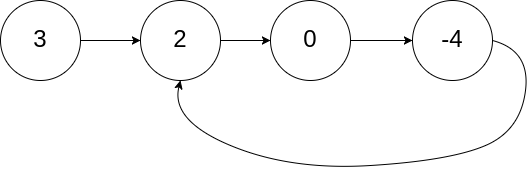

输入： head = \[3,2,0,-4], pos = 1 输出： 返回索引为 1 的链表节点 解释： 链表中有一个环，其尾部连接到第二个节点。

示例 2：

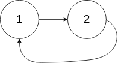

\*\*输入：\*\*head = \[1,2], pos = 0

\*\*输出：\*\*返回索引为 0 的链表节点

\*\*解释：\*\*链表中有一个环，其尾部连接到第一个节点。

示例 3：


输入： head = \[1], pos = -1

输出： 返回 null

解释： 链表中没有环。

提示：

* 链表中节点的数目范围在范围 `[0, 104]` 内

* `-105 <= Node.val <= 105`

* `pos` 的值为 `-1` 或者链表中的一个有效索引

进阶： 你是否可以使用 `O(1)` 空间解决此题？

```javascript
/**
 * Definition for singly-linked list.
 * function ListNode(val) {
 *     this.val = val;
 *     this.next = null;
 * }
 */

/**
 * @param {ListNode} head
 * @return {ListNode}
 */
var detectCycle = function(head) {
    
};
```

**参考答案：**

解题思路：

* 使用快慢指针，每次快指针走两步，慢指针走一步。

* 假设表头到入环点是距离为 D，D 到第一次快慢指针相遇的点为 S1 ，S1 到入环点距离为 S2

* 到第一次相遇点，慢指针走的距离为 D + S1；快指针走的距离为 D + S1 + S2 + S1

* 快指针走的距离是慢指针的两倍，所以 2 \* (D + S1) = D + S1 + S2 + S1，得出：D = S2

* 所以，两个点分别从表头和第一次相遇点出发，每次走一步，相遇的地方就是入环点

示例代码

```javascript
var detectCycle = function(head) {

    // 找出第一次相遇的点
    let fast = head, slow = head, fistMeet = null
    while(slow && fast && fast.next) {
        slow = slow.next
        fast = fast.next.next
        if(slow === fast) {
            fistMeet = slow
            break
        }
    }

    if(!fistMeet) {
        return null
    }

    while(fistMeet && head) {
        if(fistMeet === head) {
            return head
        }
        fistMeet = fistMeet.next
        head = head.next
    }
    return null
}
```


***

## 24. 多叉树指定层节点的个数


**参考答案：**

可以使用递归的方式遍历树，并计算每层节点的数量

```javascript
function getNodeCountAtLevel(tree, level) {
  // 递归终止条件：当当前节点为null时，返回0
  if (!tree) {
    return 0;
  }

  // 当层数为0时，表示找到目标层级，返回1
  if (level === 0) {
    return 1;
  }

  let count = 0;

  // 遍历当前节点的所有子节点，并累加每个子节点的指定层级节点数量
  for (const child of tree.children) {
    count += getNodeCountAtLevel(child, level - 1);
  }

  return count;
}
```

上述代码中，`tree` 表示多叉树的根节点，每个节点都包含一个 `children` 数组，存储了其所有子节点。`level` 表示目标层级，从0开始。


***

## 25. 请手写“快速排序”

**参考答案：**


算法简介

快速排序的基本思想：通过一趟排序将待排记录分隔成独立的两部分，其中一部分记录的关键字均比另一部分的关键字小，则可分别对这两部分记录继续进行排序，以达到整个序列有序。


算法描述和实现

快速排序使用分治法来把一个串（list）分为两个子串（sub-lists）。具体算法描述如下：

* 从数列中挑出一个元素，称为 “基准”（pivot）；

* 重新排序数列，所有元素比基准值小的摆放在基准前面，所有元素比基准值大的摆在基准的后面（相同的数可以到任一边）。在这个分区退出之后，该基准就处于数列的中间位置。这个称为分区（partition）操作；

* 递归地（recursive）把小于基准值元素的子数列和大于基准值元素的子数列排序。


代码实现

```javascript
/*方法说明：快速排序
@param  array 待排序数组*/
//方法一
function quickSort(array, left, right) {
    if (Object.prototype.toString.call(array).slice(8, -1) === 'Array' && typeof left === 'number' && typeof right === 'number') {
        if (left < right) {
            var x = array[right], i = left - 1, temp;
            for (var j = left; j <= right; j++) {
                if (array[j] <= x) {
                    i++;
                    temp = array[i];
                    array[i] = array[j];
                    array[j] = temp;
                }
            }
            quickSort(array, left, i - 1);
            quickSort(array, i + 1, right);
        }
        return array;
    } else {
        return 'array is not an Array or left or right is not a number!';
    }
}

//方法二
var quickSort2 = function(arr) {
    if (arr.length <= 1) {
    return arr;
  }

  const pivotIndex = Math.floor(arr.length / 2);
  const pivot = arr[pivotIndex];
  const less = [];
  const greater = [];

  for (let i = 0; i < arr.length; i++) {
    if (i === pivotIndex) {
      continue;
    }

    if (arr[i] < pivot) {
      less.push(arr[i]);
    } else {
      greater.push(arr[i]);
    }
  }

  return [...quickSort2(less), pivot, ...quickSort2(greater)];
};

var arr=[3,44,38,5,47,15,36,26,27,2,46,4,19,50,48];
console.log(quickSort(arr,0,arr.length-1));//[2, 3, 4, 5, 15, 19, 26, 27, 36, 38, 44, 46, 47, 48, 50]
console.log(quickSort2(arr));//[2, 3, 4, 5, 15, 19, 26, 27, 36, 38, 44, 46, 47, 48, 50]
```


算法分析

* 最佳情况：T(n) = O(nlogn)

* 最差情况：T(n) = O(n2)

* 平均情况：T(n) = O(nlogn)


***

## 26. 使用 js 实现有序数组原地去重


**参考答案：**

原地去重有序数组，也就是在不创建新数组的情况下修改原始数组。

可以使用双指针的方法，以下是一个示例的实现：

```javascript
function removeDuplicates(nums) {
  if (nums.length === 0) {
    return 0;
  }
  
  let slow = 0;
  
  for (let fast = 1; fast < nums.length; fast++) {
    if (nums[fast] !== nums[slow]) {
      slow++;
      nums[slow] = nums[fast];
    }
  }
  
  return slow + 1;
}

// 示例用法
const nums = [1, 1, 2, 2, 2, 3, 4, 4, 5];
const length = removeDuplicates(nums);

console.log("去重后的数组：", nums.slice(0, length));
console.log("数组长度：", length);
```

在上面的代码中，我们定义了一个 `removeDuplicates` 函数，它接受一个有序数组 `nums` 作为参数。通过使用双指针来遍历数组，其中 `slow` 表示慢指针，用于记录当前不重复元素的位置。

我们从数组的第二个元素（即下标为1的元素）开始遍历，将其与慢指针指向的元素进行比较。如果它们不相等，说明遇到了一个新的不重复元素，将慢指针后移一位，并将新的元素放入该位置。如果它们相等，则跳过该元素，继续向后遍历。

最后，返回慢指针的位置加1，即为去重后的数组长度。可以通过 `nums.slice(0, length)` 来获取去重后的数组。


***

## 27. 计算出下面数组中的平均时间

```javascript
const arr = ["8:15", "6:35", "11:22"]
```


**参考答案：**

将时间转换为分钟数，计算平均值后再将结果转换回小时和分钟即可。具体步骤如下：

1. 遍历数组中的每个时间，将其转换为分钟数并求和。

2. 将总分钟数除以时间数量得到平均值，取整数部分作为小时数，余数部分作为分钟数。

3. 如果分钟数小于 10，则在前面添加一个零以保持两位数格式。

4. 将小时数和分钟数组合成字符串形式的时间表示。

```javascript
const arr = ["8:15", "6:35", "11:22"];

// 1. 将时间转换为分钟数并求和
const totalMinutes = arr.reduce((acc, cur) => {
  const [hours, minutes] = cur.split(':');
  return acc + Number(hours) * 60 + Number(minutes);
}, 0);

// 2. 计算平均值并将结果转换回小时和分钟
const averageMinutes = Math.floor(totalMinutes / arr.length);
const hours = Math.floor(averageMinutes / 60);
const minutes = averageMinutes % 60;

// 3. 格式化分钟数
const formattedMinutes = minutes < 10 ? `0${minutes}` : `${minutes}`;

// 4. 组合成字符串形式的时间
const averageTime = `${hours}:${formattedMinutes}`;
console.log(averageTime); // 输出 "8:44"
```

因此，该数组中的时间的平均值为 "8:44"。


***

## 28. 实现 compose 函数, 类似于 koa 的中间件洋葱模型

```javascript
// 题目需求
let middleware = []
middleware.push((next) => {
    console.log(1)
    next()
    console.log(1.1)
})
middleware.push((next) => {
    console.log(2)
    next()
    console.log(2.1)
})
middleware.push((next) => {
    console.log(3)
    next()
    console.log(3.1)
})

let fn = compose(middleware)
fn()


/*
1
2
3
3.1
2.1
1.1
*/

//实现compose函数
function compose(middlewares) {

}
```


**参考答案：**

```javascript
/**
 * Compose `middleware` returning
 * a fully valid middleware comprised
 * of all those which are passed.
 *
 * @param {Array} middleware
 * @return {Function}
 * @api public
 */
function compose (middleware) {
  // 校验传入的参数是数组，校验数组中每一项是函数
  if (!Array.isArray(middleware)) throw new TypeError('Middleware stack must be an array!')
  for (const fn of middleware) {
    if (typeof fn !== 'function') throw new TypeError('Middleware must be composed of functions!')
  }

  /**
   * @param {Object} context
   * @return {Promise}
   * @api public
   */

  return function (context, next) {
    // last called middleware #
    let index = -1
    return dispatch(0)
    function dispatch (i) {
      // 一个函数中多次调用报错
      // await next()
      // await next()
      if (i <= index) return Promise.reject(new Error('next() called multiple times'))
      index = i
      // 取出数组里的 fn1, fn2, fn3...
      let fn = middleware[i]
      // 最后 相等，next 为 undefined
      if (i === middleware.length) fn = next
      // 直接返回 Promise.resolve()
      if (!fn) return Promise.resolve()
      try {
        return Promise.resolve(fn(context, dispatch.bind(null, i + 1)))
      } catch (err) {
        return Promise.reject(err)
      }
    }
  }
}
```


***

## 29. 请按以下要求实现方法 fn ：遇到退格字符就删除前面的字符，遇到两个退格就删除两个字符

```javascript
// 比较含有退格的字符串，"<-"代表退格键，"<"和"-"均为正常字符
// 输入："a<-b<-", "c<-d<-"，结果：true，解释：都为""
// 输入："<-<-ab<-", "<-<-<-<-a"，结果：true，解释：都为"a"
// 输入："<-<ab<-c", "<<-<a<-<-c"，结果：false，解释："<ac" !== "c"

function fn(str1, str2) {

}
```


**参考答案：**

```javascript
function fn(str1, str2) { 

  const doDelete = (str) => {
    let flag = 0;// 0 - 正常字符；1 - <；2 - <-
    const stack = [];
    for(let i = 0; i < str.length; i++) {
      const char = str[i];
      stack.push(char);

      if(char === '<' && !flag) {
        flag += 1
      } else if(flag === 1) {
        if(char === '-') {
          flag += 1
        } else {
          flag -= 1
        }
      }

      if(flag === 2) {
        stack.pop();
        stack.pop();
        stack.pop();
        flag = 0
      }
    }
    // console.log(String(stack))
    return String(stack);
  }

  return doDelete(str1) === doDelete(str2);
}

console.log(fn("a<-b<-", "c<-d<-"))
console.log(fn("<-<-ab<-", "<-<-<-<-a"))
console.log(fn("<-<ab<-c", "<<-<a<-<-c"))
```


***

## 30. Promise 的 finally 怎么实现的？


**参考答案：**

Promise.prototype.finally 方法是 ES2018 引入的一个方法，用于在 Promise 执行结束后无论成功与否都会执行的操作。在实际应用中，finally 方法通常用于释放资源、清理代码或更新 UI 界面等操作。

以下是一个简单的实现方式：

```javascript
Promise.prototype.finally = function(callback) {
  const P = this.constructor;
  return this.then(
    value => P.resolve(callback()).then(() => value),
    reason => P.resolve(callback()).then(() => { throw reason })
  );
}
```

我们定义了一个名为 finally 的函数，它使用了 Promise 原型链的方式实现了 finally 方法。该函数接收一个回调函数作为参数，并返回一个新的 Promise 对象。如果原始 Promise 成功，则会先调用 callback 函数，然后将结果传递给下一个 Promise；如果失败，则会先调用 callback 函数，然后将错误信息抛出。

可以看到，在实现中，我们首先通过 this.constructor 获取当前 Promise 实例的构造函数，然后分别处理 Promise 的 resolved 和 rejected 状态的情况。在 resolved 状态时，我们先调用 callback 函数，然后将结果传递给新创建的 Promise 对象；在 rejected 状态时，我们也是先调用 callback 函数，然后将错误信息抛出。

这样，我们就完成了 Promise.prototype.finally 方法的实现。


***

## 31. 实现一个函数, 可以间隔输出

```javascript
function createRepeat(fn, repeat, interval) {}

const fn = createRepeat(console.log, 3, 4);

fn('helloWorld'); // 每4秒输出一次helloWorld, 输出3次
```


**参考答案：**

可以使用 JavaScript 中的定时器函数 setInterval 来实现，具体如下：

```javascript
function createRepeat(fn, repeat, interval) {
        let count = 0;

        return (param) => {
                const timer = setInterval(() => {
                    fn(param)
                    count++;
                    if (count >= repeat) {
                      clearInterval(timer);
                    }
            }, interval * 1000);
        }
}
```


***

## 32. 不定长二维数组的全排列

给定任意二维数组，输出所有的排列组合项。

比如 `[['A','B'], ['a','b'], [1, 2]]`，输出 `['Aa1','Aa2','Ab1','Ab2','Ba1','Ba2','Bb1','Bb2']`


**参考答案：**

可以采用动态规划的方式，下一次的结果，依赖上一次的结果，比如第一次的结果是 `['A', 'B']`,下一个增加了 `['a', 'b']` 就可以在上一次的基础上变为 `['Aa', 'Ab', 'Ba', 'Bb']`，依次类推


代码实现

```javascript
/**
 * 动态规划，下一次的结果，依赖上一次的结果
 * @param {array} arr 
 */
function permutate(arr) {
    // 第一次的结果就是二维数组的第0项
        let res = arr[0].slice();

        for (let i = 1; i < arr.length; i++) {
                const pre = res.slice();
                res = [];
                pre.forEach(item => {
                        arr[i].forEach(curr => {
                                res.push(item + curr)
                        })
                });
        }
        console.log(res)
        return res;
}
```

多维数组的全排列问题，和全排列问题类似，但是不同于全排类问题。全排列问题使用的是DFS，而多维数组的全排列则使用的是动态规划，后一个结果依赖于前一个结果。


***

## 33. 两个字符串对比, 得出结论都做了什么操作, 比如插入或者删除

```javascript
pre = 'abcde123'
now = '1abc123'
```

a前面插入了1, c后面删除了de

**参考答案：**


思路：编辑距离

* 动态规划求编辑距离

* 倒着将变化输出。dp\[i] === dp\[i - 1] + 1

```javascript
function compareStrings(pre, now) {
  const m = pre.length;
  const n = now.length;
  const dp = new Array(m + 1).fill().map(() => new Array(n + 1).fill(0));
  for (let i = 0; i <= m; i++) {
    dp[i][0] = i;
  }
  for (let j = 0; j <= n; j++) {
    dp[0][j] = j;
  }
  for (let i = 1; i <= m; i++) {
    for (let j = 1; j <= n; j++) {
      if (pre[i - 1] === now[j - 1]) {
        dp[i][j] = dp[i - 1][j - 1];
      } else {
        dp[i][j] = Math.min(dp[i - 1][j], dp[i][j - 1], dp[i - 1][j - 1]) + 1;
      }
    }
  }
  let i = m;
  let j = n;
  let diff = "";
  while (i > 0 || j > 0) {
    if (i > 0 && dp[i][j] === dp[i - 1][j] + 1) {
      diff = `删除${pre[i - 1]}, ${diff}`;
      i--;
    } else if (j > 0 && dp[i][j] === dp[i][j - 1] + 1) {
      diff = `插入${now[j - 1]}, ${diff}`;
      j--;
    } else {
      i--;
      j--;
    }
  }
  return diff;
}
const pre = 'abcde123';
const now = '1abc123';
const diff = compareStrings(pre, now);
console.log(diff); // 输出：插入1, 删除d, 删除e
```

解释：

我们将一个字符串转换成另一个字符串的操作分为三种：插入、删除、替换。在这个函数中，我们将删除操作定义为从 `pre` 字符串中删除一个字符，使得 `pre` 的前缀变为 `now` 的前缀。因此，在 `dp` 数组中，`dp[i][j]` 表示 `pre` 的前缀 `pre[0...i-1]` 变为 `now` 的前缀 `now[0...j-1]` 所需的最小操作次数。如果我们想要将 `pre` 的前缀 `pre[0...i-1]` 变为 `now` 的前缀 `now[0...j-1]`，可以有三种操作方式：

1. 插入一个字符：我们可以在 `pre` 的前缀 `pre[0...i-1]` 的末尾插入一个字符 `now[j-1]`，这样就将 `pre` 的前缀变为 `now` 的前缀。此时，`dp[i][j]` 的值应该为 `dp[i][j-1] + 1`。

2. 删除一个字符：我们可以将 `pre` 的前缀 `pre[0...i-2]` 变为 `now` 的前缀 `now[0...j-1]`，然后再删除字符 `pre[i-1]`，这样也能将 `pre` 的前缀变为 `now` 的前缀。此时，`dp[i][j]` 的值应该为 `dp[i-1][j] + 1`。

3. 替换一个字符：我们可以将 `pre` 的前缀 `pre[0...i-2]` 变为 `now` 的前缀 `now[0...j-2]`，然后再将字符 `pre[i-1]` 替换为字符 `now[j-1]`，这样也能将 `pre` 的前缀变为 `now` 的前缀。此时，`dp[i][j]` 的值应该为 `dp[i-1][j-1] + 1`。 在这个函数中，我们根据 `dp` 数组的值，逆推出从 `pre` 转换成 `now` 的具体操作。如果 `dp[i][j]` 的值是由 `dp[i-1][j]` 转移而来，那么说明我们需要删除字符 `pre[i-1]`，以使得 `pre` 的前缀变为 `now` 的前缀。因此，我们在返回字符串中加入 `删除pre[i-1]` 的操作。


***

## 34. 实现一个方法，从某个数值数组中，获取最小正数（非零非负数）的索引值


**参考答案：**

```javascript
function findNonZeroMinIndex(arr) {
  let min = Infinity;
  let index = -1;
  for (let i = 0; i < arr.length; i++) {
    if (arr[i] > 0 && arr[i] < min) {
      min = arr[i];
      index = i;
    }
  }
  return index;
}
```

使用循环和条件判断来遍历数组，查找满足条件（即非零非负数）并且值最小的元素，并返回其索引。

如果数组中没有满足条件的元素，则返回 -1。


***

## 35. 实现一个等待函数，支持让 async 函数在执行时暂停一段时间，函数的入参为暂停的时间


**参考答案：**

在使用 `async/await` 时，可以用 await 关键字等待一个 Promise 对象的结果，然后执行一些操作。在等待过程中，函数会暂停执行，直到 Promise 对象的状态发生改变。

下面是一个示例代码，其中定义了一个名为 wait 的等待函数，它可以让 async 函数在执行时暂停一段时间：

```javascript
function wait(ms) {
  return new Promise(resolve => setTimeout(resolve, ms));
}

async function run() {
  console.log('start');
  await wait(2000); // 等待2秒钟
  console.log('end');
}

run();
```


***

## 36. 使用正则表达式实现以下需求：筛选出数组中只包含大小写字母的字符串，并将结果转换成大写


**参考答案：**

可以先使用正则表达式 `/^[a-zA-Z]+$/` 来匹配只包含大小写字母的字符串，使用 `Array.prototype.filter()` 方法来筛选符合条件的元素，然后使用 `Array.prototype.map()` 方法将每个元素转换成大写，最终得到了一个新的数组 `filteredArr`。

参考代码如下：

```javascript
const arr = ['Abc', 'DeF', '123', '_ghI'];

const filteredArr = arr.filter(item => /^[a-zA-Z]+$/.test(item))
                       .map(item => item.toUpperCase());

console.log(filteredArr); // ["ABC", "DEF"]
```


***

## 37. 请补充 objToArray 函数

```javascript
/**
 * @file objToArray
 *
 * 将对象按照要求转为数组
 * 注意console示例运行结果
 */
type Obj = Record<string, string>;
interface FormatItem {
  key: string;
  op: string;
  value: string;
}

function objToArray(obj: Record<string, Obj>): FormatItem[] {
  // 补全此处代码
  throw new Error("功能待实现");
}

console.log(
  objToArray({
    key1: {
      op1: "value1",
    },
    key2: {
      op2: "value2",
    },
  })
);
// result示例
// [
//     {key: 'key1', op: 'op1', value: 'value1'},
//     {key: 'key2', op: 'op2', value: 'value2'}
// ]

export default {};
```


**参考答案：**

```javascript
/**
 * @file objToArray
 *
 * 将对象按照要求转为数组
 * 注意console示例运行结果
 */
type Obj = Record<string, string>;
interface FormatItem {
  key: string;
  op: string;
  value: string;
}

function objToArray(obj: Record<string, Obj>): FormatItem[] {
  return Object.keys(obj).reduce((value: Array<FormatItem>, key: string) => {
    var op: string = Object.keys(obj[key])[0];
    value.push({ key: key, op: op, value: obj[key][op] });
    return value;
  }, []);
}

console.log(
  objToArray({
    key1: {
      op1: "value1",
    },
    key2: {
      op2: "value2",
    },
  })
);
// result示例
// [
//     {key: 'key1', op: 'op1', value: 'value1'},
//     {key: 'key2', op: 'op2', value: 'value2'}
// ]

export default {};
```


***

## 38. 实现一个将多维数组展示的方法


**参考答案：**

方法一：ES6新增的数组扩展方法flat()

```javascript
let arr = [1,2,3,[4,5],6];
let res = arr.flat();//[1,2,3,4,5,6]
```

可能会有小伙伴说flat()默认只能拉伸一层，如果需要处理的是多层嵌套数组呢？

```javascript
let arr1 = [1,2,3,[4,5,[6,7]],8];
let res1 = arr.flat(3); //参数3代表三维数组的展开，结果为[1,2,3,4,5,6,7,8]

let arr2 = [1,2,3,[4,5,[6,7,[8]]],9];
let res2 = arr2.flat(4); //参数4代表思维数组的展开，结果为[1,2,3,4,5,6,7,8,9]

......
```

不过这样处理的话，对于已知的数组维度是可以处理的，那么对于未知嵌套层级的数组是相当不友好的，那么针对未知的多维嵌套数组我们应该用什么方法展开呢？看代码：

```javascript
let arr3 = [1,2,3,[4,5,[6,7,[8]]],9];
let res3 = arr3.flat(Infinitlet arr4 = [1,2,3,[4,5],6];
let res4 = [].concat.apply([],arr4);//结果为[1,2,3,4,5,6]y); //参数为Infinity,结果为[1,2,3,4,5,6,7,8,9]
```

这样不管你要处理的数组是几层嵌套关系，都会处理成你想要的一维数组。

方法二：apply()结合concat()使用以展开成一维数组

```javascript
let arr4 = [1,2,3,[4,5],6];
let res4 = [].concat.apply([],arr4);//结果为[1,2,3,4,5,6]
```

这个方法虽然可以处理，不过有一个缺陷需要指出，那就是该方法只能将二维数组展开为一维，二维以上的多维数组的处理就需要循环遍历一层层的使用该方法了，有点麻烦，如果想使用简单的方法，请参考方法一。

方法三：reduce()结合concat()方法

```javascript
let arr5 = [[0, 1], [2, 3]];
let res5 = arr5.reduce(
  (acc, cur) => {
    return acc.concat(cur);
  }
);//结果为[0,2,3,4]
```

需要注意的是此方法和方法二类似，处理多维数组的时候需要进行其他处理。

方法四：针对方法一和方法二的缺陷，可以使用递归的方法进行展开

```javascript
let arr6 = [1,2,[3,4,[5,6],7],8]
function flatten(arr){
        let res6 = [];
        for(let i=0; i < arr.length; i++){
                if(Array.isArray(arr[i])){
                        res6 = res6.concat(flatten(arr[i])) 
                }else{
                        res6.push(arr[i])
                }
        }
        return res6;
}
Flatten(arr6);//结果为[1,2,3,4,5,6,7,8]
```

方法五：使用toString()和split(',')方法

如果数组的元素都是数字，那么我们可以考虑使用 toString 方法，因为：toString会将数组中的数以逗号形式结合起来。toString()之后再split(',')转成数组，并将其转换回数字数组：

```javascript
var arr = [1, [2, [3, 4],[5,[6],[7,8]]]];
var arrStr = arr.toString();
console.log(arrStr);//1,2,3,4,5,6,7,8
var strArr = arrStr.split(',');
console.log(strArr)//["1", "2", "3", "4", "5", "6", "7", "8"]
```

该方法只适用于数组内全部是数字的情况。

方法六：使用reduce和concat方法，结合递归，利用重写原型的另一种方法

```javascript
Array.prototype.flatten=function(){
  return this.reduce(function(prev, cur) {
    var moreArr = [].concat(cur).some(Array.isArray); //判断cur是不是一个数组
    return prev.concat(moreArr ? cur.flatten() : cur);
  },[]);
};
var bbb = [1,2,3,[4,[5,6,[7,8]]]]
var ccc=bbb.flatten();
console.log(ccc);//结果为[1, 2, 3, 4, 5, 6, 7, 8]
```

方法七：es6扩展运算符

```javascript
function flatten(arr){
  while(arr.some(item=>Array.isArray(item))){
    arr = [].concat(...arr);
  }
  return arr;
}
var sunArr = [1,2,3,[4,[5,[6]]]];
flatten(sunArr);//结果为 [1, 2, 3, 4, 5, 6]
```

***

## 39. 使用TS实现一个判断传入参数是否是数组类型的方法


**参考答案：**

unknown 用于变量类型不确定，但肯定可以确定的情形下，比如下面这个示例中，参数总归会有个值，根据这个值的类型进行不同的处理，这里使用 unknown 替代 any 则会更加类型安全。

```javascript
function isArray(x: unknown): boolean {
        return Array.isArray(x)
}
```


***

## 40. 给某个资源的链接，如 https://www.baidu.com/index.html ，请实现一个方法，获取该资源的后缀，如 html


**参考答案：**

本题主要考察字符串相关的方法，实现比较简单，下面列举两个实现方法。

```javascript
var fileName = "https://www.baidu.com/index.html";

function getFileExtension(url){
        if(typeof url !== 'string'){
            return ''
    }
    
    // 方法一
    return url.substring(url.lastIndexOf('.') + 1);
    
    // 方法二
    //return url.split('.').pop().toLowerCase();
}
```

***

## 41. 根据运算优先级添加括号

现已知一个字符串是由正整数和加减乘除四个运算符(+ - \* /)组成。

例如存在字符串 `const str = '11+2-3*4+5/2*4+10/5'`，现在需要将高优先级运算，用小括号包裹起来，例如结果为 `'11+2-(3*4)+(5/2*4)+(10/5)'`。注意可能会出现连续的乘除运算，需要包裹到一起。

请用 `javascript` 实现这一过程


**参考答案：**

介绍一种只需遍历一次的实现方式，思路比较简单，主要用到了2个临时变量，分别用于记录当前是否在高优先级运算范围和临时值，然后根据不同优先级的运算符进行不同的处理操作。

具体的代码如下：

```javascript
function addBrackets(expression) {
 const resultArr = []

 // 定义运算符
 const symbolArr = ['+', '-', '*', '/']

 // 定义高优先级运算符
 const highLevelSymbolArr = ['*', '/']

 // 判断某个字符串是否是运算符
 const isSymbolFn = (str) => symbolArr.includes(str)

 // 判断某个字符串是否是高优先级运算符
 const isHighLevelSymbolFn = (str) => highLevelSymbolArr.includes(str)

 // 输入表达式的长度
 const expLen = expression.length

 // 标记当前的遍历是否处于高优先级运算符范围
 let isInBracket = false
 // 记录临时值
 let currentNum = ''

 for (let i = 0; i < expLen; i++) {
   const isSymbol = isSymbolFn(expression[i])
   const isHighLevelSymbol = isSymbol && isHighLevelSymbolFn(expression[i])

   // 处理当前字符是运算符的场景
   if (isSymbol) {
     //处理当前字符是高优先级运算符
     if (isHighLevelSymbol) {
       // 如果当前没有被标记为高优先运算符，就在前面加个括号
       if (!isInBracket) {
         currentNum = '(' + currentNum
       }

       // 修改标记状态
       isInBracket = true
       currentNum += expression[i]
     } else {
       // 普通运算符

       if (isInBracket) {
         // 如果之前已经在高优先级运算符范围，就需要标记结束
         resultArr.push(currentNum + ')')
         isInBracket = false
       } else {
         resultArr.push(currentNum)
       }
       resultArr.push(expression[i])
       currentNum = ''
     }
   } else {
     // 如果是数字，就直接进行记录
     currentNum = currentNum + expression[i]
   }
 }

 if (currentNum) {
   resultArr.push(currentNum + (isInBracket ? ')' : ''))
 }

 return resultArr.join('')
}
```

另外还可以使用滑动窗口的思路来实现：

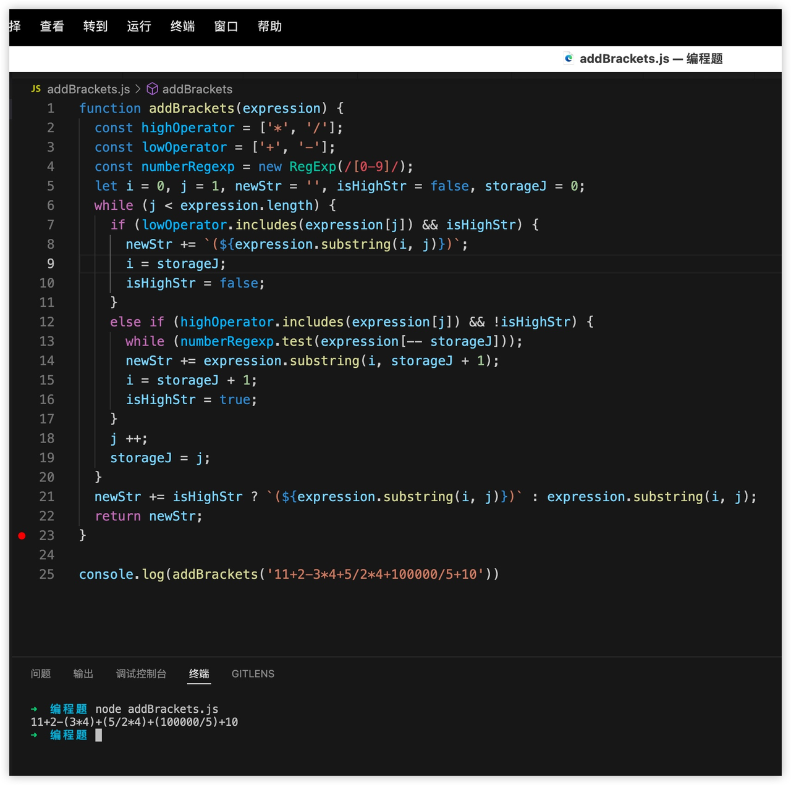

使用正则实现

```javascript
let text = '11+2-34+5/24+10/5+10/512'; 
text.match(/([0-9]{1,}[*|/]){1,}[0-9]{1,}/g).forEach((item)=>{ 
        text = text.replace(item,`(${item})`) 
})
console.log(text); // '11+2-34+(5/24)+(10/5)+(10/512)'
```


***

## 42. 请对以下数组，根据 `born` 的值降序排列

```javascript
const singers = [
  { name: 'Steven Tyler', band: 'Aerosmith', born: 1948 },
  { name: 'Karen Carpenter', band: 'The Carpenters', born: 1950 },
  { name: 'Kurt Cobain', band: 'Nirvana', born: 1967 },
  { name: 'Stevie Nicks', band: 'Fleetwood Mac', born: 1948 },
];
```


**参考答案：**

`Array.prototype.sort()` 方法用原地算法对数组的元素进行排序，并返回数组。在很多排序场景下推荐使用。

语法：

> arr.sort(\[compareFunction])

这道题在实现上也比较简单，我们直接看实现方法：

```javascript
function compare(a, b) {
  return a.born < b.born ? 1: -1 
}

singers.sort(compare);

// 也可以进行简写
singers.sort((a,b) => b.born - a.born)
```


***

## 43. 编程实现温度转换，已知温度转换的关系式是：华氏度＝32＋摄氏度×1.8，现在要求输入摄氏度，输出对应的华氏度，小数保留两位


**参考答案：**

```javascript
function convertTemperature(centigrade){
   if(typeof centigrade !== 'number'){
           throw new Error('Wrong parameter type!')
   }

   return (32 + centigrade * 1.8).toFixed(2)
}
```


***

## 44. 版本号排序

有一组版本号如下`['0.1.1', '2.3.3', '0.302.1', '4.2', '4.3.5', '4.3.4.5']`。

现在需要对其进行排序，排序的结果为 `['4.3.5','4.3.4.5','2.3.3','0.302.1','0.1.1']`


**参考答案：**

本题目的实现有很多不同的思路，在这里先给大家介绍一种非常简洁，也非常有意思的实现方案：

```javascript
const arr=['0.1.1', '2.3.3', '0.302.1', '4.2', '4.3.5', '4.3.4.5'];
arr.sort((a,b)=>a>b?-1:1);
console.log(arr); // ['4.3.5','4.3.4.5','2.3.3','0.302.1','0.1.1']
```


为什么字符串比较能够轻松的实现排序？

在JavaScript中，字符串之间无疑也是可以比较的。猜猜看下面这段代码输出的结果是什么？

```javascript
console.log('5'>'1')
console.log('5'>'10')
```

答案是`true`、`true`。


比较字符串是比较它们的 Unicode 值

这是因为在两个字符串进行比较时，是使用基于标准字典的 Unicode 值来进行比较的。通过`String.prototype.codePointAt()`方法我们能拿到字符串的 Unicode 值。所以`'5'>'1'`的结果是`true`;

而当字符串长度大于1的时候比较则是逐位进行，因此`'5'>'10'`进行比较时，首先比较第一位也就是`'5'>'1'`，如果有结果则返回，没有结果则继续比较第二位。所以`'5'>'10'`的结果与`'5'>'1'`相同，也是`true`。

回过头来看问题，就不难理解了：`.`的 Unicode 值为 46，`0`的 Unicode 值为 48，其它数字在此基础上递增。所以在比较的时候`10.1`是要大于`1.1`的。


字符串比较法适用范围很小

上文解释了为什么题目中的 case 能够通过字符串比较来实现。但是机智如你一定会发现，这种比较是存在问题的：如果修改题目中的arr如下:

```javascript
const arr=[
    '0.5.1',
    '0.1.1',
    '2.3.3',
    '0.302.1',
    '4.2',
    '4.3.5',
    '4.3.4.5'
];
```

那字符串比较法会出错：期望中版本号`'0.302.1'`应该大于`'0.5.1'`，但实际比较的结果则是相反的，原因就在于逐位比较。

所以字符串比较这个技巧需要限定条件为各个版本号均为1位数字，它得出的结果才是准备的，而常见的版本号并不符合这个条件。那么有没有适用性更强又简洁的比较方式呢？


“大数”加权法


比较npm规则版本号

假设版本号遵循 npm 语义化规则，即版本号由`MAJOR.MINOR.PATCH`几个部分组成：：

```javascript
const arr=['2.3.3', '4.3.4', '0.3.1'];
```

通过如下公式得出待比较的目标版本号：

> MAJOR\*p2 + MINOR\*p + PATCH

代码如下：

```javascript
const p = 1000;
const gen = (arr) => 
    arr.split('.').reduce(reducer,0);

const reducer = (acc,value,index) => 
    acc+(+value)*Math.pow(p,arr.length-index-1);

arr.sort((a,b)=> gen(a)>gen(b)?-1:1);

console.log(arr)
```

其中`p`为常量，它的取值要大于`MAJOR/MINOR/PATCH`三者中最大值至少一个量级。譬如待比较的版本号为`1.0.1`、`'0.302.1'`，此时如果`p`取值为 10 那么计算出来的结果显然会不符合预期。而`p`取`1000`就能够避免各个子版本加权之后产生污染。

同理，有类似规则的版本号（如`'1.0.1.12'`）都可以通过上述方法进行排序。


更多的版本号

如果版本号数组如下:

```javascript
const arr=[
    '1.1',
    '2.3.3',
    '4.3.5',
    '0.3.1',
    '0.302.1',
    '4.20.0',
    '4.3.5.1',
    '1.2.3.4.5'
];
```

上述数组不但不遵循`MAJOR.MINOR.PATCH规`则，其长度也没有明显的规则，这时该如何比较呢？

可以在固定规则比较的方法基础上进行扩展，首先需要获取到版本号数组中子版本号最多有几位`maxLen`。这里我们通过`Math.max()`获取：

```javascript
const maxLen = Math.max(
    ...arr.map((item)=>item.split('.').length)
);
```

拿到`maxLen`之后即可改写 reducer 方法:

```javascript
const reducer = (acc,value,index) => 
    acc+(+value)*Math.pow(p,maxLen-index-1);

const gen = (arr) =>
    arr.split('.').reduce(reducer,0);

arr.sort((a,b)=> gen(a)>gen(b)?-1:1);

console.log(arr)
```

上述方法足够用于常规版本号的比较了。但是我们知道，JavaScript 的 number 类型为双精度64位浮点类型，如果`maxLen`特别大、每一位的值又很大（比如某个子版本号用时间戳来标记），那么上述方法则存在溢出而导致比较结果不准确的问题。

不过`BigInt`提案已经进入stage3规范，它能够表示任意大的整数。可以预见的是，在不久的将来我们无需考虑版本号取值范围带来的影响。


循环比较法

相对字符串比较法和大数加权法，循环比较法的适用性更强。思路仍然是逐位比较子版本号：如果当前版本号相同则比较下一位；如果版本号位数不相等而前几位值一致则认为位数多的版本号大。

代码如下：

```javascript
arr.sort((a, b) => {
    let i = 0;
    const arr1 = a.split('.');
    const arr2 = b.split('.');

    while (true) {
        const s1 = arr1[i];
        const s2 = arr2[i++];

        if (s1 === undefined || s2 === undefined) {
            return arr2.length - arr1.length;
        }

        if (s1 === s2) continue;

        return s2 - s1;
    }
});

console.log(arr)
```


思考

我们总结并且对比了几种用来比较版本号的方法，在不同的场景可以选择合适的方式：

* 字符串比较法

* 大数加权法

* 循环比较法


***

## 45. 实现以下转换，合并连续的数字


\[1,2,3,4,6,7,9,13,15]=>\['1->4','6->7','9','13','15']


**参考答案：**

本题是一道比较简单的数组处理题目，主要有两个处理步骤：

* 将超过一个的连续数字元素，合并成 `x->y`，比如 \[1,2,3,4] 转成 `['1->4']`

* 将非连续的数字元素，转成字符串

具体的实现代码如下：

```javascript
function shortenArray(arr) {
  // 处理边界
  if (!Array.isArray(arr) || arr.length <= 1) {
    return arr;
  }

  // 记录结果
  const result = [];

  // 记录连续数字的开始位置
  let start = 0;
  // 记录连续数字的结束位置
  let last = 0;

  function pushArr(arrStart, arrEnd) {
    if (arrStart === arrEnd) {
      result.push(arr[arrStart].toString());
    } else {
      result.push(`${arr[arrStart]}->${arr[arrEnd]}`);
    }
  }

  // 一次循环获取结果
  for (let i = 1; i < arr.length; i++) {
    const temp = arr[i];
    if (arr[last] + 1 === temp) {
      last = i;
    } else {
      pushArr(start, last);
      start = i;
      last = i;
    }
  }

  // 处理剩余数据
  pushArr(start, last);

  return result;
}

shortenArray([1, 2, 3, 4, 6, 7, 9, 13, 15]); // ['1->4','6->7','9','13','15']
```


***

## 46. 使用css实现一个无限循环动画

**参考答案：**

想要实现CSS动画的无限循环，其实主要就是要使用`animation-iteration-count`这个属性，将其设置为`infinite`，动画就会一直循环播放。

例如：

```javascript
<image class="anima" mode="widthFix" @click="nav" src="@/static/1_btn.png"></image>
```

```javascript
.anima {
  animation-name: likes; // 动画名称
  animation-direction: alternate; // 动画在奇数次（1、3、5...）正向播放，在偶数次（2、4、6...）反向播放。
  animation-timing-function: linear; // 动画执行方式，linear：匀速；ease：先慢再快后慢；ease-in：由慢速开始；ease-out：由慢速结束；ease-in-out：由慢速开始和结束；
  animation-delay: 0s; // 动画延迟时间
  animation-iteration-count: infinite; //  动画播放次数，infinite：一直播放
  animation-duration: 1s; // 动画完成时间
}

@keyframes likes {
  0%{
          transform: scale(1);
  }
  25%{
          transform: scale(0.9);
  }
  50%{
          transform: scale(0.85);
  }
  75%{
          transform: scale(0.9);
  }
  100%{
          transform: scale(1);
  }
}
```


***

## 47. 实现一个数字转中文的方法

**参考答案：**

```javascript
//阿拉伯数字转中文数字
function NoToChinese(num) {
    if (!/^\d*(\.\d*)?$/.test(num)) {
        alert("Number is wrong!");
        return "Number is wrong!";
    }
    var AA = new Array("零", "一", "二", "三", "四", "五", "六", "七", "八", "九");
    var BB = new Array("", "十", "百", "千", "万", "亿", "点", "");
    var a = ("" + num).replace(/(^0*)/g, "").split("."),
        k = 0,
        re = "";
    for (var i = a[0].length - 1; i >= 0; i--) {
        switch (k) {
            case 0:
                re = BB[7] + re;
                break;
            case 4:
                if (!new RegExp("0{4}\\d{" + (a[0].length - i - 1) + "}$").test(a[0]))
                    re = BB[4] + re;
                break;
            case 8:
                re = BB[5] + re;
                BB[7] = BB[5];
                k = 0;
                break;
        }
        if (k % 4 == 2 && a[0].charAt(i + 2) != 0 && a[0].charAt(i + 1) == 0) re = AA[0] + re;
        if (a[0].charAt(i) != 0) re = AA[a[0].charAt(i)] + BB[k % 4] + re;
        k++;
    }
    if (a.length > 1) //加上小数部分(如果有小数部分) 
    {
        re += BB[6];
        for (var i = 0; i < a[1].length; i++) re += AA[a[1].charAt(i)];
    }
    return re;
};
```


***

## 48. 用es5如何实现 let 和 const ？

**参考答案：**

实现 let

`let` 大家应该用的非常熟悉了，定义一个仅作用于该代码块的变量。如果去 `babel` 上面在线转换一下，大家可以看到结果是 `var`。在 `es6` 出现以前我们一般使用无限接近闭包的形式或者立即执行函数的形式来定义不会被污染的变量。

我们这也可以做类似的操作。

```plaintext
(function(){
        var a = 1;
    console.log(a)
})();
console.log(a)
```

效果不错，这大概也是使用 es6 的方便之处吧。


实现 const

那么 `const` 该怎么实现呢？

const 声明一个只读的常量。一旦声明，常量的值就不能改变。

有什么方法是可以限制一个值不能发生改变的呢？

是的,需要用到 `Object.defineProperty`。

其中有一个属性是这样的：

> writable：当前对象元素的值是否可修改。

由于 `ES5` 环境没有 `block` 的概念，所以是无法百分百实现 `const`，只能是挂载到某个对象下，要么是全局的 `window`，要么就是自定义一个 `object` 来当容器

```plaintext
var __const = function __const(data, value) {
  window.data = value // 把要定义的data挂载到window下，并赋值value
  Object.defineProperty(window, data, { // 利用Object.defineProperty的能力劫持当前对象，并修改其属性描述符
    enumerable: false,
    configurable: false,
    get: function () {
      return value
    },
    set: function (data) {
      if (data !== value) { // 当要对当前属性进行赋值时，则抛出错误！
        throw new TypeError('Assignment to constant variable.')
      } else {
        return value
      }
    }
  })
}
__const('a', 10)
console.log(a)
delete a
console.log(a)
for (let item in window) { // 因为const定义的属性在global下也是不存在的，所以用到了enumerable: false来模拟这一功能
  if (item === 'a') { // 因为不可枚举，所以不执行
    console.log(window[item])
  }
}
a = 20 // 报错
```

代码有点略长，但是还算通透。那。。还有没有更简单一点的实现方法呢？至少不要这么长的代码demo了。答案是肯定的，只不过没有上面例子那么透彻。我们这次将用到es5的Object.freeze();

```plaintext
var f = Object.freeze({'name':'admin'});
f.name = 'hello'; // 严格模式下是会报错的
f.name; // 打印出admin ,值没有被改变
```

想要的效果还是出来了，可以大概的定义一个常量了。

那么一个新的问题来了，const 真的定义的一定是一个常量嘛？一定是不可变的嘛？我们看看代码的结果

```plaintext
const a ={};
a.name='admin';
a.name // admin;
```

const实际上保证的，并不是变量的值不得改动，而是变量指向的那个内存地址不得改动。

对于简单类型的数据（数值、字符串、布尔值），值就保存在变量指向的那个内存地址，因此等同于常量。

但对于复合类型的数据（主要是对象和数组），变量指向的内存地址，保存的只是一个指向实际数据的指针，const只能保证这个指针是固定的（即总是指向另一个固定的地址），至于它指向的数据结构是不是可变的，就完全不能控制了。

因此，将一个对象声明为常量必须非常小心。


带来的新特性

let,const问世之前，js是没有块级作用域这种特性的，只有函数作用域，导致了很多稀奇古怪的bug。

这里就要理解两个的区别，函数作用域好理解，就是函数{}包裹的区域，其实这里使用var，let，const都一样，外部是不能调用函数内部的变量的。

但是块级就有区别了，最明显的就是if(){}。在函数内使用条件判断，花括号内使用let,const,那么条件外是访问不到条件内的变量的，代码就会更清晰一点。


***

## 49. 写一个返回数据类型的函数，要求自定义的类实例化的对象返回定义的类名


**参考答案：**

Javascript是一门动态类型的语言，一个变量从声明到最后使用，可能经过了很多个函数，而数据类型也会发生改变，那么，对一个变量的数据类型判断就显得尤为重要。


获取数据类型

我们先来看下怎么获取一个数据的类型。


typeof是否能正确判断类型？

由于由于历史原因，在判断原始类型时，`typeof null`会等于`object`。而且对于对象（Object）、数组（Array）来说，都会转换成`object`。例子如下：

```javascript
    typeof 1 // 'number'
    typeof "1" // 'string'
    typeof null // 'object'
    typeof undefined // 'undefined'
    
    typeof [] // 'object'
    typeof {} // 'object'
    typeof function() {} // 'function'
```

所以我们可以发现，typeof可以判断基本数据类型，但是难以判断除了函数以外的复杂数据类型。于是我们可以使用第二种方法，通常用来判断复杂数据类型，也可以用来判断基本数据类型。

对于返回值为`object`，有三种情况：

* 值为null

* 值为object

* 值为array

对于null，我们可以直接用===来进行判断，那么数组和对象呢？不急，我们接着说。


instanceof是否能正确判断类型？

`instanceof`是通过原型链来判断的，但是对于对象来说，`Array`也会被转换成`Object`，而且也不能区分基本类型`string`和`boolean`。可以左边放你要判断的内容，右边放类型来进行JS类型判断，只能用来判断复杂数据类型,因为instanceof 是用于检测构造函数（右边）的 prototype 属性是否出现在某个实例对象（左边）的原型链上。例如：

```javascript
    function Func() {}
    const func = new Func()
    console.log(func instanceof Func) // true
    
    const obj = {}
    const arr = []
    obj instanceof Object // true
    arr instanceof Object // true
    arr instanceof Array // true
    
    const str = "abc"
    const str2 = new String("abc")
    str instanceof String // false
    str2 instanceof String // true
```

单独使用`instanceof`好像也是不行的，但是我们对于typeof已经得出结论，不能区分数组和对象，那么，我们结合下`instanceof`，来写一个完整的判断逻辑

```javascript
    function myTypeof(data) {
        const type = typeof data
        if (data === null) {
            return 'null'
        }
        if (type !== 'object') {
            return type
        }
        if (data instanceof Array) {
            return 'array'
        }
        return 'object'
    }
```


constructor

constructor 判断方法跟instanceof相似,但是constructor检测Object与instanceof不一样,constructor还可以处理基本数据类型的检测,不仅仅是对象类型。

注意:

1. null和undefined没有constructor;

2. 判断数字时使用(),比如 (123).constructor,如果写成123.constructor会报错

3. constructor在类继承时会出错,因为Object被覆盖掉了,检测结果就不对了

```javascript
    function A() {};
    function B() {};
    A.prototype = new B();
    console.log(A.constructor === B)  // false

    var C = new A();
    console.log(C.constructor === B)  // true
    console.log(C.constructor === A)  // false 

    C.constructor = A;
    console.log(C.constructor === A);  // true
    console.log(C.constructor === B);  // false
```


Array.isArray()

Array.isArray() 用于确定传递的值是否是一个 Array。如果对象是 Array ，则返回true，否则为false。

```javascript
    Array.isArray([1, 2, 3]); // true
    Array.isArray({foo: 123}); // false
    Array.isArray("foobar"); // false
    Array.isArray(undefined); // false
```


正则判断

我们可以把对象和数组转成一个字符串，这样就可以做格式判断，从而得到最终的类型。

```javascript
    function myTypeof(data) {
        const str = JSON.stringify(data)
        if (/^{.*}$/.test(data)) {
            return 'object'
        }
        if (/^\[.*\]$/.test(data)) {
            return 'array'
        }
    }
```


Object.prototype.toString.call()

上面我们通过`typeof`和`instanceof`实现了一版类型判断，那么是否有其他渠道，使我们的代码更加简洁吗？答案就是使用`Object.prototype.toString.call()`。

每个对象都有一个`toString()`方法，当要将对象表示为文本值或以预期字符串的方式引用对象时，会自动调用该方法。默认情况下，从`Object`派生的每个对象都会继承`toString()`方法。如果此方法未在自定义对象中被覆盖，则`toString()`返回`[Object type]`，其中`type`是对象类型。所以就有以下例子：

```javascript
    Object.prototype.toString.call(new Date()) // [object Date]
    Object.prototype.toString.call("1") // [object String]
    Object.prototype.toString.call(1) // [object Numer]
    Object.prototype.toString.call(undefined) // [object Undefined]
    Object.prototype.toString.call(null) // [object Null]
```

所以综合上述知识点，我们可以封装出以下通用类型判断方法：

```javascript
    function myTypeof(data) {
        var toString = Object.prototype.toString;
        var dataType = data instanceof Element ? "Element" : toString.call(data).replace(/\[object\s(.+)\]/, "$1")
        return dataType
    };

    myTypeof("a") // String
    myTypeof(1) // Number
    myTypeof(window) // Window
    myTypeof(document.querySelector("h1")) // Element
```


获取实例化对象的类名

题目中的第二个要求，是对于自定义的类实例化的对象，需要返回定义的类名。

这个也比较简单，我们对于上述获取的 Object 类型的数据，直接使用 `xx.constructor.name` 即可获取到这个数据对应的类名。


最终实现

```javascript
function myTypeof(data) {
    var toString = Object.prototype.toString;
    var dataType = data instanceof Element ? "Element" : toString.call(data).replace(/\[object\s(.+)\]/, "$1")

    if(dataType === 'Object'){
        return data.constructor.name
    }

    return dataType
};
```


***

## 50. 手写一个 jsonp


**参考答案：**

JSONP 核心原理：script 标签不受同源策略约束，所以可以用来进行跨域请求，优点是兼容性好，但是只能用于 GET 请求；

```javascript
const jsonp = ({ url, params, callbackName }) => {
    const generateUrl = () => {
        let dataSrc = ''
        for (let key in params) {
            if (params.hasOwnProperty(key)) {
                dataSrc += `${key}=${params[key]}&`
            }
        }
        dataSrc += `callback=${callbackName}`
        return `${url}?${dataSrc}`
    }
    return new Promise((resolve, reject) => {
        const scriptEle = document.createElement('script')
        scriptEle.src = generateUrl()
        document.body.appendChild(scriptEle)
        window[callbackName] = data => {
            resolve(data)
            document.body.removeChild(scriptEle)
        }
    })
}
```

***

