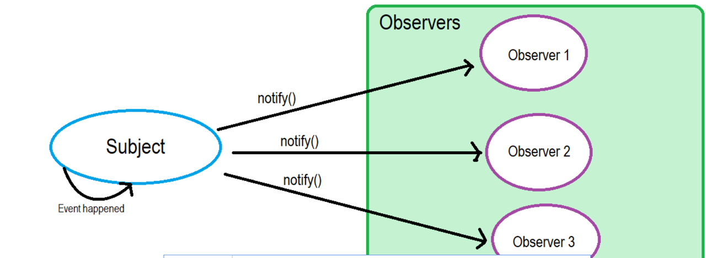
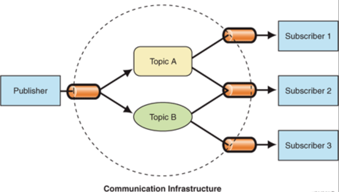
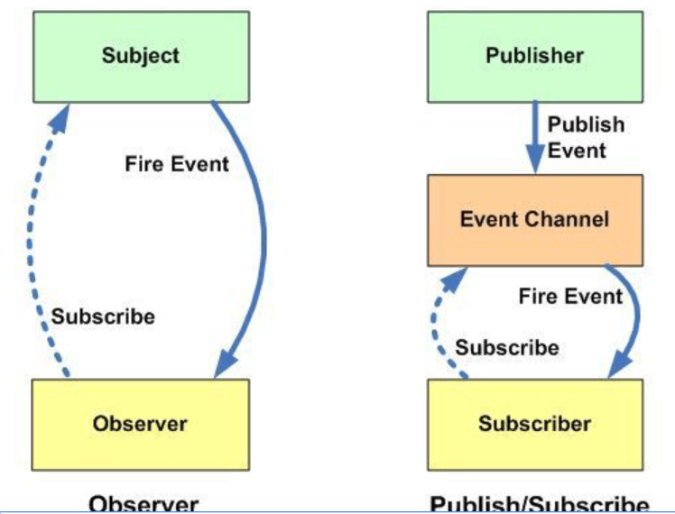

## 1. 观察者模式和发布订阅模式分别是什么？有什么区别？

观察者模式：一个对象（观察者）订阅另一个对象（主题），当主题被激活的时候，触发观察者里面的事件。

发布订阅模式：订阅者把自己想要订阅的事件注册到调度中心，当发布者发布事件到调度中心（就是该事件被触发），再由调度中心统一调度订阅者注册到调度中心的处理代码。

对比一下：

可以发现两种模式下的角色数量不一样：

* 观察者模式里，只有两个角色：观察者 和 被观察者

* 发布订阅模式里，却不仅仅只有发布者和订阅者两个角色，还有一个调度中心

从使用场景上：

* 观察者模式比较适合在单个应用内部使用

* 发布订阅模式则是比较适合跨应用的场景

***

## 2. 开发的过程中你用到过哪些设计模式？

**参考答案：**

设计模式是一种被广泛接受并经过验证的面向对象软件开发中的最佳实践。它们提供了一套解决常见问题的可重用设计方案。

以下是一些常用的设计模式：

1. 单例模式（Singleton）：确保一个类只有一个实例，并提供全局访问点来获取该实例。

2. 工厂模式（Factory）：通过工厂方法创建对象，而不是直接使用`new`操作符。这样可以隐藏具体实现，并根据需要创建所需类型的对象。

3. 观察者模式（Observer）：定义了一种一对多的依赖关系，当一个对象状态发生改变时，它的所有依赖者（观察者）都会收到通知并自动更新。

4. 装饰器模式（Decorator）：动态地将责任附加到对象上。通过将对象包装在装饰器对象中，可以在运行时为对象添加新的行为。

5. 策略模式（Strategy）：定义了一系列算法，将每个算法封装起来并使它们可以相互替换。策略模式可以让算法独立于客户端而变化。

6. 适配器模式（Adapter）：将一个类的接口转换成客户端所期望的另一个接口。适配器模式使得原本由于接口不匹配而无法一起工作的类可以协同工作。

每个设计模式都有其特定的应用场景和优缺点，可以根据具体情况来选择使用。设计模式可以提高代码结构的灵活性、可维护性和可扩展性，并促进重用和解耦。然而，需要根据实际需求慎重选择和应用设计模式，避免过度设计或不必要的复杂性。

***

## 3. 设计模式分类

**参考答案：**

* 创建型模式，共五种：工厂方法模式、抽象工厂模式、单例模式、建造者模式、原型模式。

* 结构型模式，共七种：适配器模式、装饰器模式、代理模式、外观模式、桥接模式、组合模式、享元模式。

* 行为型模式，共十一种：策略模式、模板方法模式、观察者模式、迭代子模式、责任链模式、命令模式、备忘录模式、状态模式、访问者模式、中介者模式、解释器模式。

***

## 4. 什么是 MVVM？比之 MVC 有什么区别？什么又是 MVP ？

**参考答案：**

MVC、MVP 和 MVVM 是三种常见的软件架构设计模式，主要通过分离关注点的方式来组织代码结构，优化我们的开发效率。

比如说我们实验室在以前项目开发的时候，使用单页应用时，往往一个路由页面对应了一个脚本文件，所有的页面逻辑都在一个脚本文件里。页面的渲染、数据的获取，对用户事件的响应所有的应用逻辑都混合在一起，这样在开发简单项目时，可能看不出什么问题，当时一旦项目变得复杂，那么整个文件就会变得冗长，混乱，这样对我们的项目开发和后期的项目维护是非常不利的。

MVC 通过分离 Model、View 和 Controller 的方式来组织代码结构。其中 View 负责页面的显示逻辑，Model 负责存储页面的业务数据，以及对相应数据的操作。并且 View 和 Model 应用了观察者模式，当 Model 层发生改变的时候它会通知有关 View 层更新页面。Controller 层是 View 层和 Model 层的纽带，它主要负责用户与应用的响应操作，当用户与页面产生交互的时候，Co ntroller 中的事件触发器就开始工作了，通过调用 Model 层，来完成对 Model 的修改，然后 Model 层再去通知 View 层更新。

MVP 模式与 MVC 唯一不同的在于 Presenter 和 Controller。在 MVC 模式中我们使用观察者模式，来实现当 Model 层数据发生变化的时候，通知 View 层的更新。这样 View 层和 Model 层耦合在一起，当项目逻辑变得复杂的时候，可能会造成代码的混乱，并且可能会对代码的复用性造成一些问题。MVP 的模式通过使用 Presenter 来实现对 View 层和 Model 层的解耦。MVC 中的 Controller 只知道 Model 的接口，因此它没有办法控制 View 层的更新，MVP 模式中，View 层的接口暴露给了 Presenter 因此我们可以在 Presenter 中将 Model 的变化和 View 的变化绑定在一起，以此来实现 View 和 Model 的同步更新。这样就实现了对 View 和 Model 的解耦，Presenter 还包含了其他的响应逻辑。

MVVM 模式中的 VM，指的是 ViewModel，它和 MVP 的思想其实是相同的，不过它通过双向的数据绑定，将 View 和 Model 的同步更新给自动化了。当 Model 发生变化的时候，ViewModel 就会自动更新；ViewModel 变化了，View 也会更新。这样就将 Presenter 中的工作给自动化了。我了解过一点双向数据绑定的原理，比如 vue 是通过使用数据劫持和发布订阅者模式来实现的这一功 能。

***

## 5. 单例模式

**参考答案：**

1.什么是单例

* 保证一个类只有一个实例，并且提供一个访问该全局访问点

2.那些地方用到了单例模式

1. 网站的计数器，一般也是采用单例模式实现，否则难以同步。

2. 应用程序的日志应用，一般都是单例模式实现，只有一个实例去操作才好，否则内容不好追加显示。

3. 多线程的线程池的设计一般也是采用单例模式，因为线程池要方便对池中的线程进行控制

4. Windows的（任务管理器）就是很典型的单例模式，他不能打开俩个

5. windows的（回收站）也是典型的单例应用。在整个系统运行过程中，回收站只维护一个实例。

3.单例优缺点

优点：

1. 在单例模式中，活动的单例只有一个实例，对单例类的所有实例化得到的都是相同的一个实例。这样就防止其它对象对自己的实例化，确保所有的对象都访问一个实例

2. 单例模式具有一定的伸缩性，类自己来控制实例化进程，类就在改变实例化进程上有相应的伸缩性。

3. 提供了对唯一实例的受控访问。

4. 由于在系统内存中只存在一个对象，因此可以节约系统资源，当需要频繁创建和销毁的对象时单例模式无疑可以提高系统的性能。

5. 允许可变数目的实例。

6. 避免对共享资源的多重占用。

缺点：

1. 不适用于变化的对象，如果同一类型的对象总是要在不同的用例场景发生变化，单例就会引起数据的错误，不能保存彼此的状态。

2. 由于单利模式中没有抽象层，因此单例类的扩展有很大的困难。

3. 单例类的职责过重，在一定程度上违背了“单一职责原则”。

4. 滥用单例将带来一些负面问题，如为了节省资源将数据库连接池对象设计为的单例类，可能会导致共享连接池对象的程序过多而出现连接池溢出；如果实例化的对象长时间不被利用，系统会认为是垃圾而被回收，这将导致对象状态的丢失。

5.单例创建方式

（主要使用懒汉和懒汉式）

1. 饿汉式:类初始化时,会立即加载该对象，线程天生安全,调用效率高。

2. 懒汉式: 类初始化时,不会初始化该对象,真正需要使用的时候才会创建该对象,具备懒加载功能。

***

## 6. 设计模式的六大原则

**参考答案：**

开放封闭原则（Open Close Principle）

* 原则思想：尽量通过扩展软件实体来解决需求变化，而不是通过修改已有的代码来完成变化

* 描述：一个软件产品在生命周期内，都会发生变化，既然变化是一个既定的事实，我们就应该在设计的时候尽量适应这些变化，以提高项目的稳定性和灵活性。

* 优点：单一原则告诉我们，每个类都有自己负责的职责，里氏替换原则不能破坏继承关系的体系。

里氏代换原则（Liskov Substitution Principle）

* 原则思想：使用的基类可以在任何地方使用继承的子类，完美的替换基类。

* 大概意思是：子类可以扩展父类的功能，但不能改变父类原有的功能。子类可以实现父类的抽象方法，但不能覆盖父类的非抽象方法，子类中可以增加自己特有的方法。

* 优点：增加程序的健壮性，即使增加了子类，原有的子类还可以继续运行，互不影响。

依赖倒转原则（Dependence Inversion Principle）

* 依赖倒置原则的核心思想是面向接口编程.

* 依赖倒转原则要求我们在程序代码中传递参数时或在关联关系中，尽量引用层次高的抽象层类，

* 这个是开放封闭原则的基础，具体内容是：对接口编程，依赖于抽象而不依赖于具体。

接口隔离原则（Interface Segregation Principle）

* 这个原则的意思是：使用多个隔离的接口，比使用单个接口要好。还是一个降低类之间的耦合度的意思，从这儿我们看出，其实设计模式就是一个软件的设计思想，从大型软件架构出发，为了升级和维护方便。所以上文中多次出现：降低依赖，降低耦合。

* 例如：支付类的接口和订单类的接口，需要把这俩个类别的接口变成俩个隔离的接口

迪米特法则（最少知道原则）（Demeter Principle）

* 原则思想：一个对象应当对其他对象有尽可能少地了解，简称类间解耦

* 大概意思就是一个类尽量减少自己对其他对象的依赖，原则是低耦合，高内聚，只有使各个模块之间的耦合尽量的低，才能提高代码的复用率。

* 优点：低耦合，高内聚。

单一职责原则（Principle of single responsibility）

* 原则思想：一个方法只负责一件事情。

* 描述：单一职责原则很简单，一个方法 一个类只负责一个职责，各个职责的程序改动，不影响其它程序。 这是常识，几乎所有程序员都会遵循这个原则。

* 优点：降低类和类的耦合，提高可读性，增加可维护性和可拓展性，降低可变性的风险。

***

## 7. 工厂模式

**参考答案：**

1.什么是工厂模式

* 它提供了一种创建对象的最佳方式。在工厂模式中，我们在创建对象时不会对客户端暴露创建逻辑，并且是通过使用一个共同的接口来指向新创建的对象。实现了创建者和调用者分离，工厂模式分为简单工厂、工厂方法、抽象工厂模式

2.工厂模式好处

* 工厂模式是我们最常用的实例化对象模式了，是用工厂方法代替new操作的一种模式。

* 利用工厂模式可以降低程序的耦合性，为后期的维护修改提供了很大的便利。

* 将选择实现类、创建对象统一管理和控制。从而将调用者跟我们的实现类解耦。
