## 1. package.json 文件中的 devDependencies 和 dependencies 对象有什么区别？

**参考答案：**

前端项目的 `package.json` 文件中，`dependencies` 和 `devDependencies` 对象都用于指定项目所依赖的软件包，但它们在项目的开发和生产环境中的使用有所不同。

1. dependencies：

   * `dependencies` 是指定项目在生产环境中运行所需要的依赖项。

   * 这些依赖项通常包括运行时需要的库、框架、工具等。

   * 当你通过 `npm install` 或 `npm ci` 安装依赖时，默认会安装 `dependencies` 中的包。

   * 这些依赖项会被打包和部署到生产环境中，因此它们对于项目的运行是必需的。

2. devDependencies：

   * `devDependencies` 是指定在开发过程中所需要的依赖项。

   * 这些依赖项通常包括开发、测试、构建、部署等过程中所需的工具、库等。

   * 例如，测试框架、构建工具、代码检查工具等通常属于 `devDependencies`。

   * 当你在开发环境中使用 `npm install` 安装依赖时，只会安装 `dependencies` 中的包。要安装 `devDependencies` 中的包，你需要额外使用 `npm install --dev` 或 `npm install --only=dev` 等命令。

   * 这些依赖项不会被打包到生产环境中，因为它们只在开发过程中需要，对于实际部署和运行项目并不需要。

总的来说，`dependencies` 中的依赖项是项目运行所必需的，而 `devDependencies` 中的依赖项则是在开发过程中需要的辅助工具和库。


***

## 2. webpack 5 的主要升级点有哪些？


**参考答案：**

* 持久缓存（Persistent Caching）： Webpack 5引入了更好的持久缓存机制，利用了更稳定的HashedModuleIdsPlugin和NamedChunksPlugin，以改善构建性能。

* Tree-shaking 改进： Webpack 5对Tree-shaking进行了改进，提供了更好的代码优化，以便删除未使用的代码。

* 支持 WebAssembly（WASM）： Webpack 5 对 WebAssembly 提供了原生的支持，使得在项目中使用 WebAssembly 更加方便。

* 支持 ES6 模块导入（Dynamic Import）： Webpack 5对动态导入语法（import()）提供了更好的支持，可以更轻松地进行代码分割。

* 模块联邦（Module Federation）： 这是Webpack 5中的一项重大功能，允许将多个独立的Webpack构建连接在一起，实现模块共享，从而更好地支持微服务架构。

* 缓存组（Caching Groups）： 新的缓存组概念被引入，可以更细粒度地控制模块的缓存策略。

* 内置代码分割优化（optimization.splitChunks）： Webpack 5通过optimization.splitChunks进行了重新设计，提供了更灵活的配置选项，使得代码分割更为强大和易用。

* 默认配置优化： Webpack 5 默认配置中的一些优化，使得开箱即用的性能更好。

* 提高构建性能： Webpack 5引入了一些性能优化，包括更快的持久化缓存、更快的构建速度等。

* 移除废弃特性： 作为更新，Webpack 5移除了一些过时的特性和API，因此在升级时需要注意潜在的破坏性变化。


***

## auto. 说下Vite的原理


这里的背景介绍会从与`Vite`紧密相关的两个概念的发展史说起，一个是`JavaScript`的模块化标准，另一个是前端构建工具。


共存的模块化标准

为什么`JavaScript`会有多种共存的模块化标准？因为js在设计之初并没有模块化的概念，随着前端业务复杂度不断提高，模块化越来越受到开发者的重视，社区开始涌现多种模块化解决方案，它们相互借鉴，也争议不断，形成多个派系，从`CommonJS`开始，到`ES6`正式推出`ES Modules`规范结束，所有争论，终成历史，`ES Modules`也成为前端重要的基础设施。

* CommonJS：现主要用于Node.js（Node@13.2.0开始支持直接使用ES Module）

* AMD：`require.js` 依赖前置，市场存量不建议使用

* CMD：`sea.js` 就近执行，市场存量不建议使用

* ES Module：ES语言规范，标准，趋势，未来

而`Vite`的核心正是依靠浏览器对ES Module规范的实现。


发展中的构建工具

近些年前端工程化发展迅速，各种构建工具层出不穷，目前`Webpack`仍然占据统治地位，npm 每周下载量达到两千多万次。下面是我按 npm 发版时间线列出的开发者比较熟知的一些构建工具。

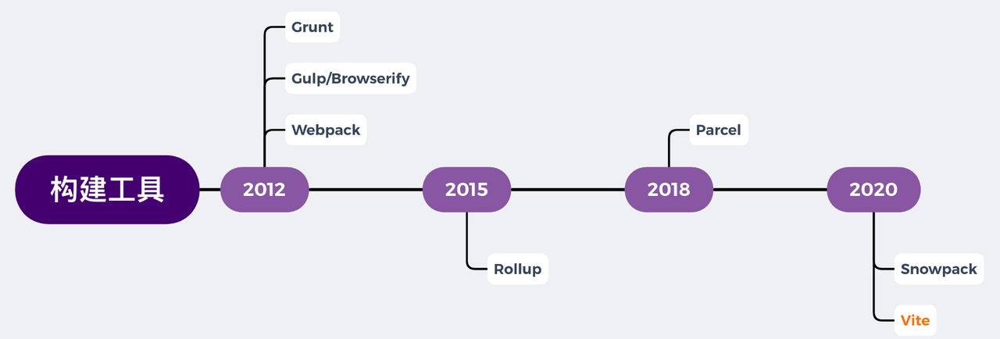


当前工程化痛点

现在常用的构建工具如`Webpack`，主要是通过抓取-编译-构建整个应用的代码（也就是常说的打包过程），生成一份编译、优化后能良好兼容各个浏览器的的生产环境代码。在开发环境流程也基本相同，需要先将整个应用构建打包后，再把打包后的代码交给`dev server`（开发服务器）。

`Webpack`等构建工具的诞生给前端开发带来了极大的便利，但随着前端业务的复杂化，js代码量呈指数增长，打包构建时间越来越久，`dev server`（开发服务器）性能遇到瓶颈：

* 缓慢的服务启动： 大型项目中`dev server`启动时间达到几十秒甚至几分钟。

* 缓慢的HMR热更新： 即使采用了 HMR 模式，其热更新速度也会随着应用规模的增长而显著下降，已达到性能瓶颈，无多少优化空间。

缓慢的开发环境，大大降低了开发者的幸福感，在以上背景下`Vite`应运而生。


***

## 4. 与webpack类似的工具还有哪些？区别？


**参考答案：**


一、模块化工具

模块化是一种处理复杂系统分解为更好的可管理模块的方式

可以用来分割，组织和打包应用。每个模块完成一个特定的子功能，所有的模块按某种方法组装起来，成为一个整体(bundle)

在前端领域中，并非只有`webpack`这一款优秀的模块打包工具，还有其他类似的工具，例如`Rollup`、`Parcel`、`snowpack`，以及最近风头无两的`Vite`

通过这些模块打包工具，能够提高我们的开发效率，减少开发成本

这里没有提及`gulp`、`grunt`是因为它们只是定义为构建工具，不能类比


Rollup

`Rollup` 是一款 `ES Modules` 打包器，从作用上来看，`Rollup` 与 `Webpack` 非常类似。不过相比于 `Webpack`，`Rollup `要小巧的多

现在很多我们熟知的库都都使用它进行打包，比如：`Vue`、`React`和`three.js`等

举个例子：


```javascript
// ./src/messages.js
export default {
  hi: 'Hey Guys, I am zce~'
}

// ./src/logger.js
export const log = msg => {
  console.log('---------- INFO ----------')
  console.log(msg)
  console.log('--------------------------')
}

export const error = msg => {
  console.error('---------- ERROR ----------')
  console.error(msg)
  console.error('---------------------------')
}

// ./src/index.js
import { log } from './logger'
import messages from './messages'
log(messages.hi)
```

然后通过`rollup`进行打包

```javascript
$ npx rollup ./src/index.js --file ./dist/bundle.js
```

打包结果如下图

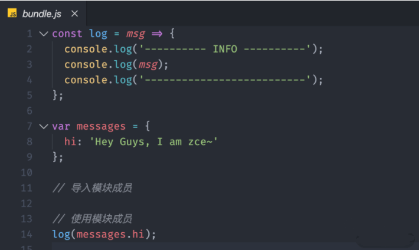

可以看到，代码非常简洁，完全不像`webpack`那样存在大量引导代码和模块函数

并且`error`方法由于没有被使用，输出的结果中并无`error`方法，可以看到，`rollup`默认开始`Tree-shaking` 优化输出结果

因此，可以看到`Rollup`的优点：

* 代码效率更简洁、效率更高

* 默认支持 Tree-shaking

但缺点也十分明显，加载其他类型的资源文件或者支持导入 `CommonJS` 模块，又或是编译 `ES` 新特性，这些额外的需求 `Rollup `需要使用插件去完成

综合来看，`rollup`并不适合开发应用使用，因为需要使用第三方模块，而目前第三方模块大多数使用`CommonJs`方式导出成员，并且`rollup`不支持`HMR`，使开发效率降低

但是在用于打包` JavaScript` 库时，`rollup`比 `webpack` 更有优势，因为其打包出来的代码更小、更快，其存在的缺点可以忽略


Parcel

Parcel ，是一款完全零配置的前端打包器，它提供了 “傻瓜式” 的使用体验，只需了解简单的命令，就能构建前端应用程序

`Parcel` 跟 `Webpack` 一样都支持以任意类型文件作为打包入口，但建议使用`HTML`文件作为入口，该`HTML`文件像平时一样正常编写代码、引用资源。如下所示：

```javascript
<!-- ./src/index.html -->
<!DOCTYPE html>
<html lang="en">
<head>
  <meta charset="UTF-8">
  <title>Parcel Tutorials</title>
</head>
<body>
  <script src="main.js"></script>
</body>
</html>
```

main.js文件通过`ES Moudle`方法导入其他模块成员

```javascript
// ./src/main.js
import { log } from './logger'
log('hello parcel')
// ./src/logger.js
export const log = msg => {
  console.log('---------- INFO ----------')
  console.log(msg)
}
```

运行之后，使用命令打包

```javascript
npx parcel src/index.html
```

执行命令后，`Parcel`不仅打包了应用，同时也启动了一个开发服务器，跟`webpack Dev Server`一样

跟`webpack`类似，也支持模块热替换，但用法更简单

同时，`Parcel`有个十分好用的功能：支持自动安装依赖，像`webpack`开发阶段突然使用安装某个第三方依赖，必然会终止`dev server`然后安装再启动。而`Parcel`则免了这繁琐的工作流程

同时，`Parcel`能够零配置加载其他类型的资源文件，无须像`webpack`那样配置对应的`loader`

打包命令如下：

```javascript
npx parcel src/index.html
```

由于打包过程是多进程同时工作，构建速度会比`Webpack` 快，输出文件也会被压缩，并且样式代码也会被单独提取到单个文件中

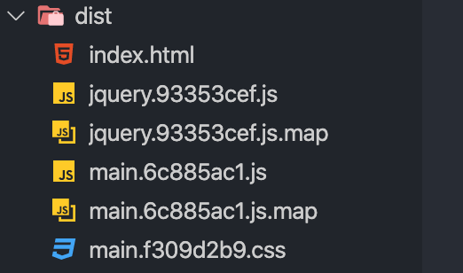

可以感受到，`Parcel `给开发者一种很大的自由度，只管去实现业务代码，其他事情用`Parcel`解决


Snowpack

Snowpack，是一种闪电般快速的前端构建工具，专为现代`Web`设计，较复杂的打包工具（如`Webpack`或`Parcel`）的替代方案，利用`JavaScript`的本机模块系统，避免不必要的工作并保持流畅的开发体验

开发阶段，每次保存单个文件时，`Webpack`和`Parcel`都需要重新构建和重新打包应用程序的整个`bundle`。而`Snowpack`为你的应用程序每个文件构建一次，就可以永久缓存，文件更改时，`Snowpack`会重新构建该单个文件

下图给出`webpack`与`snowpack`打包区别：

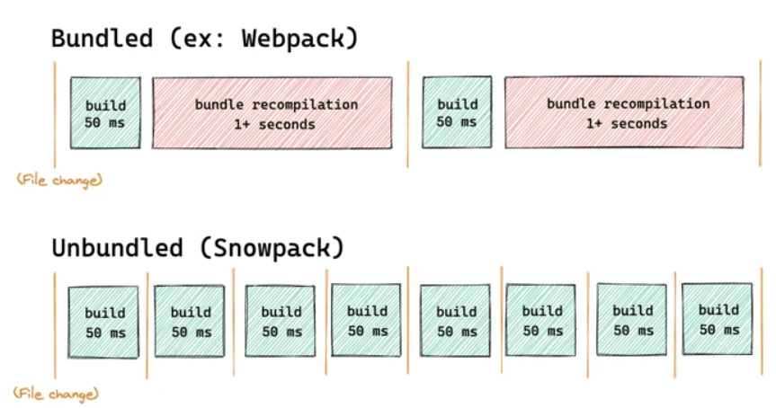

在重新构建每次变更时没有任何的时间浪费，只需要在浏览器中进行HMR更新


Vite

vite ，是一种新型前端构建工具，能够显著提升前端开发体验

它主要由两部分组成：

* 一个开发服务器，它基于 原生 ES 模块 提供了丰富的内建功能，如速度快到惊人的 \[模块热更新HMR

* 一套构建指令，它使用 Rollup打包你的代码，并且它是预配置的，可以输出用于生产环境的优化过的静态资源

其作用类似`webpack `+ `webpack-dev-server`，其特点如下：

* 快速的冷启动

* 即时的模块热更新

* 真正的按需编译

`vite`会直接启动开发服务器，不需要进行打包操作，也就意味着不需要分析模块的依赖、不需要编译，因此启动速度非常快

利用现代浏览器支持`ES Module`的特性，当浏览器请求某个模块的时候，再根据需要对模块的内容进行编译，这种方式大大缩短了编译时间

原理图如下所示：

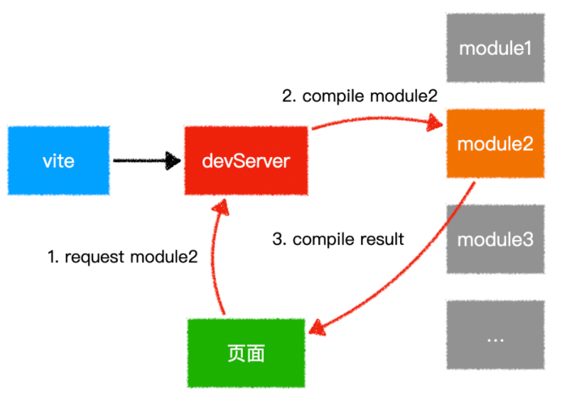

在热模块`HMR`方面，当修改一个模块的时候，仅需让浏览器重新请求该模块即可，无须像`webpack`那样需要把该模块的相关依赖模块全部编译一次，效率更高


webpack

相比上述的模块化工具，`webpack`大而全，很多常用的功能做到开箱即用。有两大最核心的特点：一切皆模块和按需加载

与其他构建工具相比，有如下优势：

* 智能解析：对 CommonJS 、 AMD 、ES6 的语法做了兼容

* 万物模块：对 js、css、图片等资源文件都支持打包

* 开箱即用：HRM、Tree-shaking等功能

* 代码分割：可以将代码切割成不同的 chunk，实现按需加载，降低了初始化时间

* 插件系统，具有强大的 Plugin 接口，具有更好的灵活性和扩展性

* 易于调试：支持 SourceUrls 和 SourceMaps

* 快速运行：webpack 使用异步 IO 并具有多级缓存，这使得 webpack 很快且在增量编译上更加快

* 生态环境好：社区更丰富，出现的问题更容易解决


***

## 5. 说说如何借助webpack来优化前端性能？


**参考答案：**


一、背景

随着前端的项目逐渐扩大，必然会带来的一个问题就是性能

尤其在大型复杂的项目中，前端业务可能因为一个小小的数据依赖，导致整个页面卡顿甚至奔溃

一般项目在完成后，会通过`webpack`进行打包，利用`webpack`对前端项目性能优化是一个十分重要的环节


二、如何优化

通过`webpack`优化前端的手段有：

* JS代码压缩

* CSS代码压缩

* Html文件代码压缩

* 文件大小压缩

* 图片压缩

* Tree Shaking

* 代码分离

* 内联 chunk


JS代码压缩

`terser`是一个`JavaScript`的解释、绞肉机、压缩机的工具集，可以帮助我们压缩、丑化我们的代码，让`bundle`更小

在`production`模式下，`webpack` 默认就是使用 `TerserPlugin` 来处理我们的代码的。如果想要自定义配置它，配置方法如下：

```javascript
const TerserPlugin = require('terser-webpack-plugin')
module.exports = {
    ...
    optimization: {
        minimize: true,
        minimizer: [
            new TerserPlugin({
                parallel: true // 电脑cpu核数-1
            })
        ]
    }
}
```

属性介绍如下：

* extractComments：默认值为true，表示会将注释抽取到一个单独的文件中，开发阶段，我们可设置为 false ，不保留注释

* parallel：使用多进程并发运行提高构建的速度，默认值是true，并发运行的默认数量： os.cpus().length - 1

* terserOptions：设置我们的terser相关的配置：

  * compress：设置压缩相关的选项，mangle：设置丑化相关的选项，可以直接设置为true

  * mangle：设置丑化相关的选项，可以直接设置为true

  * toplevel：底层变量是否进行转换

  * keep\_classnames：保留类的名称

  * keep\_fnames：保留函数的名称


CSS代码压缩

`CSS`压缩通常是去除无用的空格等，因为很难去修改选择器、属性的名称、值等

CSS的压缩我们可以使用另外一个插件：`css-minimizer-webpack-plugin`

```javascript
npm install css-minimizer-webpack-plugin -D
```

配置方法如下：

```javascript
const CssMinimizerPlugin = require('css-minimizer-webpack-plugin')
module.exports = {
    // ...
    optimization: {
        minimize: true,
        minimizer: [
            new CssMinimizerPlugin({
                parallel: true
            })
        ]
    }
}
```


Html文件代码压缩

使用`HtmlWebpackPlugin`插件来生成`HTML`的模板时候，通过配置属性`minify`进行`html`优化

```javascript
module.exports = {
    ...
    plugin:[
        new HtmlwebpackPlugin({
            ...
            minify:{
                minifyCSS:false, // 是否压缩css
                collapseWhitespace:false, // 是否折叠空格
                removeComments:true // 是否移除注释
            }
        })
    ]
}
```

设置了`minify`，实际会使用另一个插件`html-minifier-terser`


文件大小压缩

对文件的大小进行压缩，减少`http`传输过程中宽带的损耗

```javascript
npm install compression-webpack-plugin -D
```

```javascript
new ComepressionPlugin({
    test:/\.(css|js)$/,  // 哪些文件需要压缩
    threshold:500, // 设置文件多大开始压缩
    minRatio:0.7, // 至少压缩的比例
    algorithm:"gzip", // 采用的压缩算法
})
```


图片压缩

一般来说在打包之后，一些图片文件的大小是远远要比 `js` 或者 `css` 文件要来的大，所以图片压缩较为重要

配置方法如下：

```javascript
module: {
  rules: [
    {
      test: /\.(png|jpg|gif)$/,
      use: [
        {
          loader: 'file-loader',
          options: {
            name: '[name]_[hash].[ext]',
            outputPath: 'images/',
          }
        },
        {
          loader: 'image-webpack-loader',
          options: {
            // 压缩 jpeg 的配置
            mozjpeg: {
              progressive: true,
              quality: 65
            },
            // 使用 imagemin**-optipng 压缩 png，enable: false 为关闭
            optipng: {
              enabled: false,
            },
            // 使用 imagemin-pngquant 压缩 png
            pngquant: {
              quality: '65-90',
              speed: 4
            },
            // 压缩 gif 的配置
            gifsicle: {
              interlaced: false,
            },
            // 开启 webp，会把 jpg 和 png 图片压缩为 webp 格式
            webp: {
              quality: 75
            }
          }
        }
      ]
    },
  ]
} 
```


Tree Shaking

`Tree Shaking` 是一个术语，在计算机中表示消除死代码，依赖于`ES Module`的静态语法分析（不执行任何的代码，可以明确知道模块的依赖关系）

在`webpack`实现`Trss shaking`有两种不同的方案：

* usedExports：通过标记某些函数是否被使用，之后通过Terser来进行优化的

* sideEffects：跳过整个模块/文件，直接查看该文件是否有副作用

两种不同的配置方案， 有不同的效果


usedExports

配置方法也很简单，只需要将`usedExports`设为`true`

```javascript
module.exports = {
    ...
    optimization:{
        usedExports
    }
}
```

使用之后，没被用上的代码在`webpack`打包中会加入`unused harmony export mul`注释，用来告知 `Terser` 在优化时，可以删除掉这段代码

如下面`sum`函数没被用到，`webpack`打包会添加注释，`terser`在优化时，则将该函数去掉

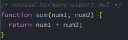


sideEffects

`sideEffects`用于告知`webpack compiler`哪些模块时有副作用，配置方法是在`package.json`中设置`sideEffects`属性

如果`sideEffects`设置为false，就是告知`webpack`可以安全的删除未用到的`exports`

如果有些文件需要保留，可以设置为数组的形式

```javascript
"sideEffecis":[    "./src/util/format.js",    "*.css" // 所有的css文件]
```

上述都是关于`javascript`的`tree shaking`，`css`同样也能够实现`tree shaking`


css tree shaking

`css`进行`tree shaking`优化可以安装`PurgeCss`插件

```javascript
npm install purgecss-plugin-webpack -D
```

```javascript
const PurgeCssPlugin = require('purgecss-webpack-plugin')module.exports = {    ...    plugins:[        new PurgeCssPlugin({            path:glob.sync(`${path.resolve('./src')}/**/*`), {nodir:true}// src里面的所有文件            satelist:function(){                return {                    standard:["html"]                }            }        })    ]}
```

* paths：表示要检测哪些目录下的内容需要被分析，配合使用glob

* 默认情况下，Purgecss会将我们的html标签的样式移除掉，如果我们希望保留，可以添加一个safelist的属性


代码分离

将代码分离到不同的`bundle`中，之后我们可以按需加载，或者并行加载这些文件

默认情况下，所有的`JavaScript`代码（业务代码、第三方依赖、暂时没有用到的模块）在首页全部都加载，就会影响首页的加载速度

代码分离可以分出出更小的`bundle`，以及控制资源加载优先级，提供代码的加载性能

这里通过`splitChunksPlugin`来实现，该插件`webpack`已经默认安装和集成，只需要配置即可

默认配置中，chunks仅仅针对于异步（async）请求，我们可以设置为initial或者all

```javascript
module.exports = {    ...    optimization:{        splitChunks:{            chunks:"all"        }    }}
```

`splitChunks`主要属性有如下：

* Chunks，对同步代码还是异步代码进行处理

* minSize： 拆分包的大小, 至少为minSize，如何包的大小不超过minSize，这个包不会拆分

* maxSize： 将大于maxSize的包，拆分为不小于minSize的包

* minChunks：被引入的次数，默认是1


内联chunk

可以通过`InlineChunkHtmlPlugin`插件将一些`chunk`的模块内联到`html`，如`runtime`的代码（对模块进行解析、加载、模块信息相关的代码），代码量并不大，但是必须加载的

```javascript
const InlineChunkHtmlPlugin = require('react-dev-utils/InlineChunkHtmlPlugin')const HtmlWebpackPlugin = require('html-webpack-plugin')module.exports = {    ...    plugin:[        new InlineChunkHtmlPlugin(HtmlWebpackPlugin,[/runtime.+\.js/]}
```


三、总结

关于`webpack`对前端性能的优化，可以通过文件体积大小入手，其次还可通过分包的形式、减少http请求次数等方式，实现对前端性能的优化


***

## 6. 说说webpack proxy工作原理？为什么能解决跨域?


**参考答案：**


一、是什么

`webpack proxy`，即`webpack`提供的代理服务

基本行为就是接收客户端发送的请求后转发给其他服务器

其目的是为了便于开发者在开发模式下解决跨域问题（浏览器安全策略限制）

想要实现代理首先需要一个中间服务器，`webpack`中提供服务器的工具为`webpack-dev-server`


webpack-dev-server

`webpack-dev-server`是 `webpack` 官方推出的一款开发工具，将自动编译和自动刷新浏览器等一系列对开发友好的功能全部集成在了一起

目的是为了提高开发者日常的开发效率，只适用在开发阶段

关于配置方面，在`webpack`配置对象属性中通过`devServer`属性提供，如下：

```javascript
// ./webpack.config.js
const path = require('path')

module.exports = {
    // ...
    devServer: {
        contentBase: path.join(__dirname, 'dist'),
        compress: true,
        port: 9000,
        proxy: {
            '/api': {
                target: 'https://api.github.com'
            }
        }
        // ...
    }
}
```

`devServetr`里面`proxy`则是关于代理的配置，该属性为对象的形式，对象中每一个属性就是一个代理的规则匹配

属性的名称是需要被代理的请求路径前缀，一般为了辨别都会设置前缀为` /api`，值为对应的代理匹配规则，对应如下：

* target：表示的是代理到的目标地址

* pathRewrite：默认情况下，我们的 /api-hy 也会被写入到URL中，如果希望删除，可以使用pathRewrite

* secure：默认情况下不接收转发到https的服务器上，如果希望支持，可以设置为false

* changeOrigin：它表示是否更新代理后请求的 headers 中host地址


二、工作原理

`proxy`工作原理实质上是利用`http-proxy-middleware` 这个`http`代理中间件，实现请求转发给其他服务器

举个例子：

在开发阶段，本地地址为`http://localhost:3000`，该浏览器发送一个前缀带有`/api`标识的请求到服务端获取数据，但响应这个请求的服务器只是将请求转发到另一台服务器中

```javascript
const express = require('express');
const proxy = require('http-proxy-middleware');

const app = express();

app.use('/api', proxy({target: 'http://www.example.org', changeOrigin: true}));
app.listen(3000);

// http://localhost:3000/api/foo/bar -> http://www.example.org/api/foo/bar
```


三、跨域

在开发阶段， `webpack-dev-server` 会启动一个本地开发服务器，所以我们的应用在开发阶段是独立运行在 `localhost `的一个端口上，而后端服务又是运行在另外一个地址上

所以在开发阶段中，由于浏览器同源策略的原因，当本地访问后端就会出现跨域请求的问题

通过设置`webpack proxy`实现代理请求后，相当于浏览器与服务端中添加一个代理者

当本地发送请求的时候，代理服务器响应该请求，并将请求转发到目标服务器，目标服务器响应数据后再将数据返回给代理服务器，最终再由代理服务器将数据响应给本地

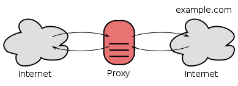

在代理服务器传递数据给本地浏览器的过程中，两者同源，并不存在跨域行为，这时候浏览器就能正常接收数据

注意：服务器与服务器之间请求数据并不会存在跨域行为，跨域行为是浏览器安全策略限制


***

## 7. 说说webpack的热更新是如何做到的？原理是什么？


**参考答案：**


一、是什么

`HMR `全称 `Hot Module Replacement`，可以理解为模块热替换，指在应用程序运行过程中，替换、添加、删除模块，而无需重新刷新整个应用

例如，我们在应用运行过程中修改了某个模块，通过自动刷新会导致整个应用的整体刷新，那页面中的状态信息都会丢失

如果使用的是 `HMR`，就可以实现只将修改的模块实时替换至应用中，不必完全刷新整个应用

在`webpack`中配置开启热模块也非常的简单，如下代码：

```javascript
const webpack = require('webpack')
module.exports = {
  // ...
  devServer: {
    // 开启 HMR 特性
    hot: true
    // hotOnly: true
  }
}
```

通过上述这种配置，如果我们修改并保存`css`文件，确实能够以不刷新的形式更新到页面中

但是，当我们修改并保存`js`文件之后，页面依旧自动刷新了，这里并没有触发热模块

所以，`HMR `并不像 `Webpack` 的其他特性一样可以开箱即用，需要有一些额外的操作

我们需要去指定哪些模块发生更新时进行`HRM`，如下代码：

```javascript
if(module.hot){
    module.hot.accept('./util.js',()=>{
        console.log("util.js更新了")
    })
}
```


二、实现原理

首先来看看一张图，如下：

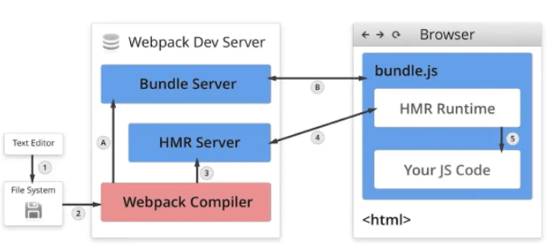

* Webpack Compile：将 JS 源代码编译成 bundle.js

* HMR Server：用来将热更新的文件输出给 HMR Runtime

* Bundle Server：静态资源文件服务器，提供文件访问路径

* HMR Runtime：socket服务器，会被注入到浏览器，更新文件的变化

* bundle.js：构建输出的文件

* 在HMR Runtime 和 HMR Server之间建立 websocket，即图上4号线，用于实时更新文件变化

上面图中，可以分成两个阶段：

* 启动阶段为上图 1 - 2 - A - B

在编写未经过`webpack`打包的源代码后，`Webpack Compile` 将源代码和 `HMR Runtime` 一起编译成 `bundle `文件，传输给` Bundle Server` 静态资源服务器

* 更新阶段为上图 1 - 2 - 3 - 4

当某一个文件或者模块发生变化时，`webpack `监听到文件变化对文件重新编译打包，编译生成唯一的`hash`值，这个`hash `值用来作为下一次热更新的标识

根据变化的内容生成两个补丁文件：`manifest`（包含了 `hash` 和 `chundId `，用来说明变化的内容）和` chunk.js` 模块

由于`socket`服务器在`HMR Runtime` 和 `HMR Server`之间建立 `websocket`链接，当文件发生改动的时候，服务端会向浏览器推送一条消息，消息包含文件改动后生成的`hash`值，如下图的`h`属性，作为下一次热更细的标识

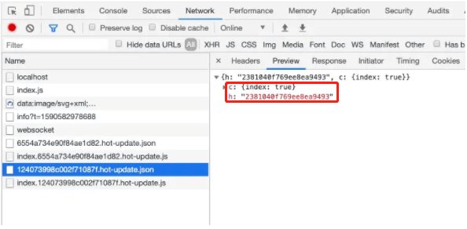

在浏览器接受到这条消息之前，浏览器已经在上一次` socket` 消息中已经记住了此时的` hash` 标识，这时候我们会创建一个 `ajax` 去服务端请求获取到变化内容的 `manifest` 文件

`mainfest`文件包含重新`build`生成的`hash`值，以及变化的模块，对应上图的`c`属性

浏览器根据 `manifest` 文件获取模块变化的内容，从而触发`render`流程，实现局部模块更新

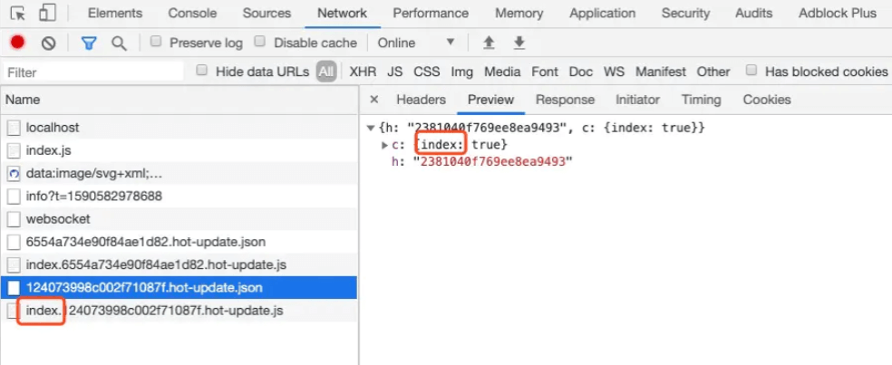


三、总结

关于`webpack`热模块更新的总结如下：

* 通过`webpack-dev-server`创建两个服务器：提供静态资源的服务（express）和Socket服务

* express server 负责直接提供静态资源的服务（打包后的资源直接被浏览器请求和解析）

* socket server 是一个 websocket 的长连接，双方可以通信

* 当 socket server 监听到对应的模块发生变化时，会生成两个文件.json（manifest文件）和.js文件（update chunk）

* 通过长连接，socket server 可以直接将这两个文件主动发送给客户端（浏览器）

* 浏览器拿到两个新的文件后，通过HMR runtime机制，加载这两个文件，并且针对修改的模块进行更新


***

## 8. 面试官：说说Loader和Plugin的区别？编写Loader，Plugin的思路？


一、区别

前面两节我们有提到`Loader`与`Plugin`对应的概念，先来回顾下

* loader 是文件加载器，能够加载资源文件，并对这些文件进行一些处理，诸如编译、压缩等，最终一起打包到指定的文件中

* plugin 赋予了 webpack 各种灵活的功能，例如打包优化、资源管理、环境变量注入等，目的是解决 loader 无法实现的其他事

从整个运行时机上来看，如下图所示：


可以看到，两者在运行时机上的区别：

* loader 运行在打包文件之前

* plugins 在整个编译周期都起作用

在` Webpack` 运行的生命周期中会广播出许多事件，`Plugin` 可以监听这些事件，在合适的时机通过`Webpack`提供的 `API `改变输出结果

对于`loader`，实质是一个转换器，将A文件进行编译形成B文件，操作的是文件，比如将`A.scss`或`A.less`转变为`B.css`，单纯的文件转换过程


二、编写loader

在编写 `loader` 前，我们首先需要了解 `loader` 的本质

其本质为函数，函数中的 `this` 作为上下文会被 `webpack` 填充，因此我们不能将 `loader`设为一个箭头函数

函数接受一个参数，为 `webpack` 传递给 `loader` 的文件源内容

函数中 `this` 是由 `webpack` 提供的对象，能够获取当前 `loader` 所需要的各种信息

函数中有异步操作或同步操作，异步操作通过 `this.callback` 返回，返回值要求为 `string` 或者 `Buffer`

代码如下所示：

```javascript
// 导出一个函数，source为webpack传递给loader的文件源内容
module.exports = function(source) {
    const content = doSomeThing2JsString(source);
    
    // 如果 loader 配置了 options 对象，那么this.query将指向 options
    const options = this.query;
    
    // 可以用作解析其他模块路径的上下文
    console.log('this.context');
    
    /*
     * this.callback 参数：
     * error：Error | null，当 loader 出错时向外抛出一个 error
     * content：String | Buffer，经过 loader 编译后需要导出的内容
     * sourceMap：为方便调试生成的编译后内容的 source map
     * ast：本次编译生成的 AST 静态语法树，之后执行的 loader 可以直接使用这个 AST，进而省去重复生成 AST 的过程
     */
    this.callback(null, content); // 异步
    return content; // 同步
}
```

一般在编写`loader`的过程中，保持功能单一，避免做多种功能

如`less`文件转换成 `css `文件也不是一步到位，而是 `less-loader`、`css-loader`、`style-loader`几个 `loader `的链式调用才能完成转换


三、编写plugin

由于`webpack`基于发布订阅模式，在运行的生命周期中会广播出许多事件，插件通过监听这些事件，就可以在特定的阶段执行自己的插件任务

在之前也了解过，`webpack`编译会创建两个核心对象：

* compiler：包含了 webpack 环境的所有的配置信息，包括 options，loader 和 plugin，和 webpack 整个生命周期相关的钩子

* compilation：作为 plugin 内置事件回调函数的参数，包含了当前的模块资源、编译生成资源、变化的文件以及被跟踪依赖的状态信息。当检测到一个文件变化，一次新的 Compilation 将被创建

如果自己要实现`plugin`，也需要遵循一定的规范：

* 插件必须是一个函数或者是一个包含 `apply` 方法的对象，这样才能访问`compiler`实例

* 传给每个插件的 `compiler` 和 `compilation` 对象都是同一个引用，因此不建议修改

* 异步的事件需要在插件处理完任务时调用回调函数通知 `Webpack` 进入下一个流程，不然会卡住

实现`plugin`的模板如下：

```javascript
class MyPlugin {
    // Webpack 会调用 MyPlugin 实例的 apply 方法给插件实例传入 compiler 对象
  apply (compiler) {
    // 找到合适的事件钩子，实现自己的插件功能
    compiler.hooks.emit.tap('MyPlugin', compilation => {
        // compilation: 当前打包构建流程的上下文
        console.log(compilation);
        
        // do something...
    })
  }
}
```

在 `emit` 事件发生时，代表源文件的转换和组装已经完成，可以读取到最终将输出的资源、代码块、模块及其依赖，并且可以修改输出资源的内容


***

## 9. 说说webpack中常见的Plugin？解决了什么问题？


**参考答案：**


一、是什么

`Plugin`（Plug-in）是一种计算机应用程序，它和主应用程序互相交互，以提供特定的功能

是一种遵循一定规范的应用程序接口编写出来的程序，只能运行在程序规定的系统下，因为其需要调用原纯净系统提供的函数库或者数据

`webpack`中的`plugin`也是如此，`plugin`赋予其各种灵活的功能，例如打包优化、资源管理、环境变量注入等，它们会运行在 `webpack` 的不同阶段（钩子 / 生命周期），贯穿了`webpack`整个编译周期

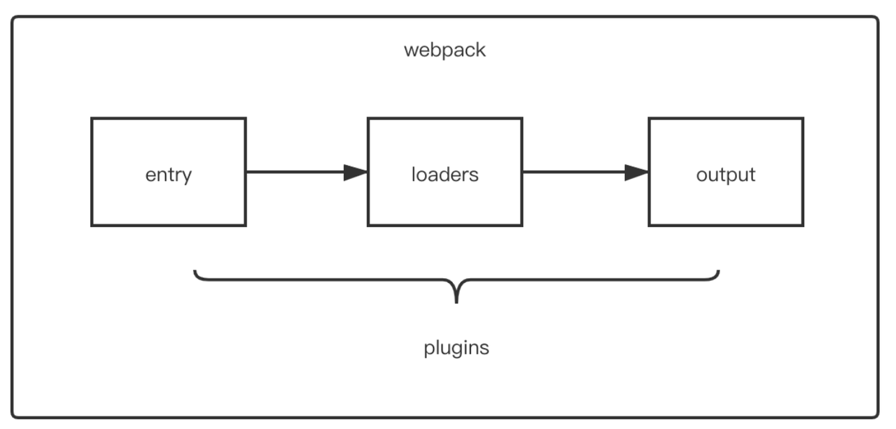

目的在于解决`loader` 无法实现的其他事


配置方式

这里讲述文件的配置方式，一般情况，通过配置文件导出对象中`plugins`属性传入`new`实例对象。如下所示：

```javascript
const HtmlWebpackPlugin = require('html-webpack-plugin'); // 通过 npm 安装
const webpack = require('webpack'); // 访问内置的插件
module.exports = {
  ...
  plugins: [
    new webpack.ProgressPlugin(),
    new HtmlWebpackPlugin({ template: './src/index.html' }),
  ],
};
```


二、特性

其本质是一个具有`apply`方法`javascript`对象

`apply` 方法会被 `webpack compiler `调用，并且在整个编译生命周期都可以访问 `compiler `对象

```javascript
const pluginName = 'ConsoleLogOnBuildWebpackPlugin';

class ConsoleLogOnBuildWebpackPlugin {
  apply(compiler) {
    compiler.hooks.run.tap(pluginName, (compilation) => {
      console.log('webpack 构建过程开始！');
    });
  }
}

module.exports = ConsoleLogOnBuildWebpackPlugin;
```

`compiler hook` 的 `tap `方法的第一个参数，应是驼峰式命名的插件名称

关于整个编译生命周期钩子，有如下：

* entry-option ：初始化 option

* run

* compile： 真正开始的编译，在创建 compilation 对象之前

* compilation ：生成好了 compilation 对象

* make 从 entry 开始递归分析依赖，准备对每个模块进行 build

* after-compile： 编译 build 过程结束

* emit ：在将内存中 assets 内容写到磁盘文件夹之前

* after-emit ：在将内存中 assets 内容写到磁盘文件夹之后

* done： 完成所有的编译过程

* failed： 编译失败的时候


三、常见的Plugin

常见的`plugin`有如图所示：

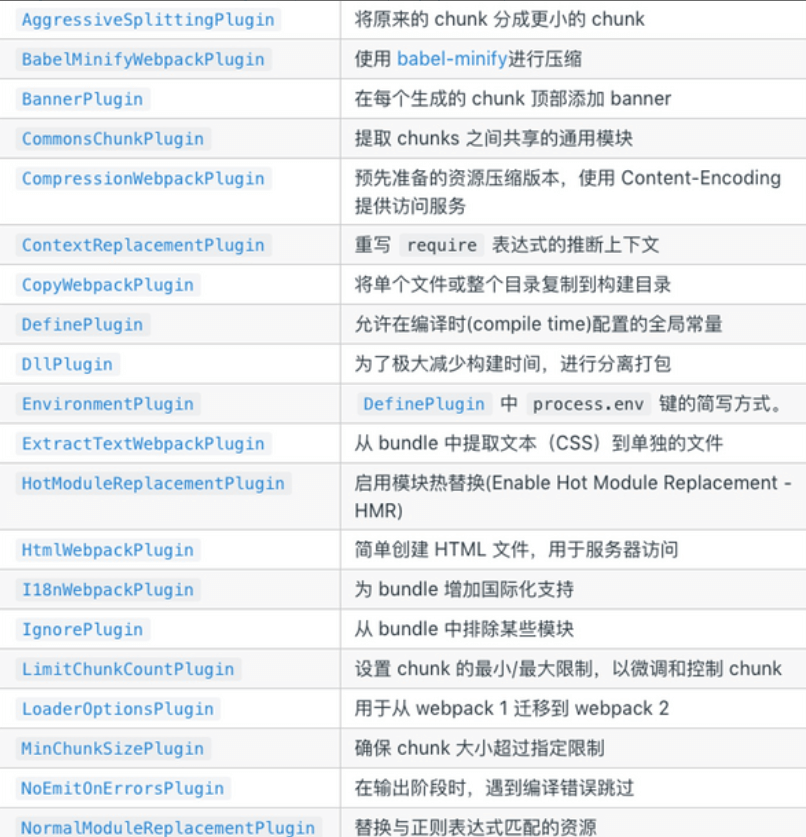

下面介绍几个常用的插件用法：


HtmlWebpackPlugin

在打包结束后，⾃动生成⼀个 `html` ⽂文件，并把打包生成的` js` 模块引⼊到该 `html` 中

```javascript
npm install --save-dev html-webpack-plugin
```

```javascript
// webpack.config.js
const HtmlWebpackPlugin = require("html-webpack-plugin");
module.exports = {
 ...
  plugins: [
     new HtmlWebpackPlugin({
       title: "My App",
       filename: "app.html",
       template: "./src/html/index.html"
     }) 
  ]
};
```

```javascript
<!--./src/html/index.html-->
<!DOCTYPE html>
<html lang="en">
<head>
    <meta charset="UTF-8">
    <meta name="viewport" content="width=device-width, initial-scale=1.0">
    <meta http-equiv="X-UA-Compatible" content="ie=edge">
    <title><%=htmlWebpackPlugin.options.title%></title>
</head>
<body>
    <h1>html-webpack-plugin</h1>
</body>
</html>
```

在 `html` 模板中，可以通过 `<%=htmlWebpackPlugin.options.XXX%>` 的方式获取配置的值

更多的配置可以自寻查找


clean-webpack-plugin

删除（清理）构建目录

```javascript
npm install --save-dev clean-webpack-plugin
```

```javascript
const {CleanWebpackPlugin} = require('clean-webpack-plugin');
module.exports = {
 ...
  plugins: [
    ...,
    new CleanWebpackPlugin(),
    ...
  ]
}
```


mini-css-extract-plugin

提取 `CSS` 到一个单独的文件中

```javascript
npm install --save-dev mini-css-extract-plugin
```

```javascript
const MiniCssExtractPlugin = require('mini-css-extract-plugin');module.exports = { ...,  module: {   rules: [    {     test: /\.s[ac]ss$/,     use: [      {       loader: MiniCssExtractPlugin.loader     },          'css-loader',          'sass-loader'        ]   }   ] },  plugins: [    ...,    new MiniCssExtractPlugin({     filename: '[name].css'    }),    ...  ]}
```


DefinePlugin

允许在编译时创建配置的全局对象，是一个`webpack`内置的插件，不需要安装

```javascript
const { DefinePlugun } = require('webpack')module.exports = { ...    plugins:[        new DefinePlugin({            BASE_URL:'"./"'        })    ]}
```

这时候编译`template`模块的时候，就能通过下述形式获取全局对象

```javascript
<link rel="icon" href="<%= BASE_URL%>favicon.ico>"
```


copy-webpack-plugin

复制文件或目录到执行区域，如`vue`的打包过程中，如果我们将一些文件放到`public`的目录下，那么这个目录会被复制到`dist`文件夹中

```javascript
npm install copy-webpack-plugin -D
```

```javascript
new CopyWebpackPlugin({    parrerns:[        {            from:"public",            globOptions:{                ignore:[                    '**/index.html'                ]            }        }    ]})
```

复制的规则在`patterns`属性中设置：

* from：设置从哪一个源中开始复制

* to：复制到的位置，可以省略，会默认复制到打包的目录下

* globOptions：设置一些额外的选项，其中可以编写需要忽略的文件


***

## 10. 说说webpack中常见的Loader？解决了什么问题？


**参考答案：**


一、是什么

`loader` 用于对模块的"源代码"进行转换，在 `import` 或"加载"模块时预处理文件

`webpack`做的事情，仅仅是分析出各种模块的依赖关系，然后形成资源列表，最终打包生成到指定的文件中。如下图所示：

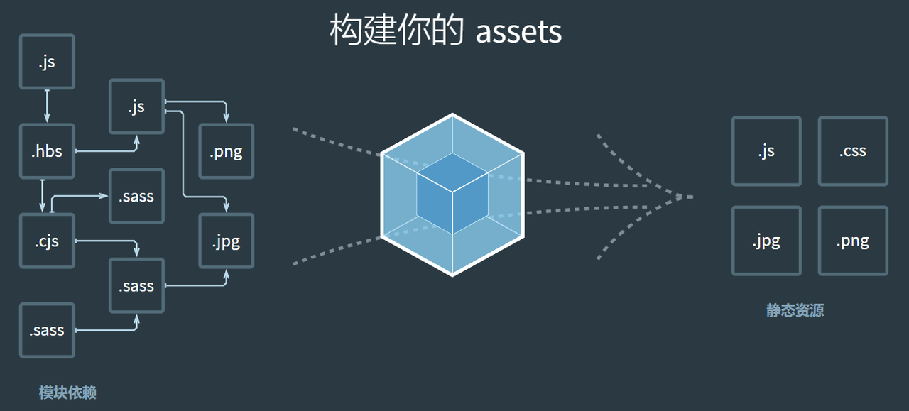

在`webpack`内部中，任何文件都是模块，不仅仅只是`js`文件

默认情况下，在遇到`import`或者`load`加载模块的时候，`webpack`只支持对`js`文件打包

像`css`、`sass`、`png`等这些类型的文件的时候，`webpack`则无能为力，这时候就需要配置对应的`loader`进行文件内容的解析

在加载模块的时候，执行顺序如下：

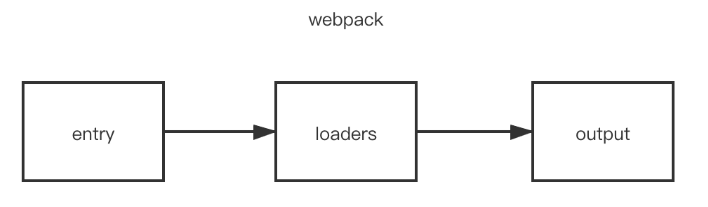

当 `webpack` 碰到不识别的模块的时候，`webpack` 会在配置的中查找该文件解析规则

关于配置`loader`的方式有三种：

* 配置方式（推荐）：在 webpack.config.js文件中指定 loader

* 内联方式：在每个 import 语句中显式指定 loader

* CLI 方式：在 shell 命令中指定它们


配置方式

关于`loader`的配置，我们是写在`module.rules`属性中，属性介绍如下：

* `rules`是一个数组的形式，因此我们可以配置很多个`loader`

* 每一个`loader`对应一个对象的形式，对象属性`test` 为匹配的规则，一般情况为正则表达式

* 属性`use`针对匹配到文件类型，调用对应的 `loader` 进行处理

代码编写，如下形式：

```javascript
module.exports = {
  module: {
    rules: [
      {
        test: /\.css$/,
        use: [
          { loader: 'style-loader' },
          {
            loader: 'css-loader',
            options: {
              modules: true
            }
          },
          { loader: 'sass-loader' }
        ]
      }
    ]
  }
};
```


二、特性

这里继续拿上述代码，来讲讲`loader`的特性

从上述代码可以看到，在处理`css`模块的时候，`use`属性中配置了三个`loader`分别处理`css`文件

因为`loader `支持链式调用，链中的每个`loader`会处理之前已处理过的资源，最终变为`js`代码。顺序为相反的顺序执行，即上述执行方式为`sass-loader`、`css-loader`、`style-loader`

除此之外，`loader`的特性还有如下：

* loader 可以是同步的，也可以是异步的

* loader 运行在 Node.js 中，并且能够执行任何操作

* 除了常见的通过 `package.json` 的 `main` 来将一个 npm 模块导出为 loader，还可以在 module.rules 中使用 `loader` 字段直接引用一个模块

* 插件(plugin)可以为 loader 带来更多特性

* loader 能够产生额外的任意文件

可以通过 loader 的预处理函数，为 JavaScript 生态系统提供更多能力。用户现在可以更加灵活地引入细粒度逻辑，例如：压缩、打包、语言翻译和更多其他特性


三、常见的loader

在页面开发过程中，我们经常性加载除了`js`文件以外的内容，这时候我们就需要配置响应的`loader`进行加载

常见的`loader`如下：

* style-loader: 将css添加到DOM的内联样式标签style里

* css-loader :允许将css文件通过require的方式引入，并返回css代码

* less-loader: 处理less

* sass-loader: 处理sass

* postcss-loader: 用postcss来处理CSS

* autoprefixer-loader: 处理CSS3属性前缀，已被弃用，建议直接使用postcss

* file-loader: 分发文件到output目录并返回相对路径

* url-loader: 和file-loader类似，但是当文件小于设定的limit时可以返回一个Data Url

* html-minify-loader: 压缩HTML

* babel-loader :用babel来转换ES6文件到ES

下面给出一些常见的`loader`的使用：


css-loader

分析 `css` 模块之间的关系，并合成⼀个 `css`

```javascript
npm install --save-dev css-loader
```

```javascript
rules: [
  ...,
 {
  test: /\.css$/,
    use: {
      loader: "css-loader",
      options: {
     // 启用/禁用 url() 处理
     url: true,
     // 启用/禁用 @import 处理
     import: true,
        // 启用/禁用 Sourcemap
        sourceMap: false
      }
    }
 }
]
```

如果只通过`css-loader`加载文件，这时候页面代码设置的样式并没有生效

原因在于，`css-loader`只是负责将`.css`文件进行一个解析，而并不会将解析后的`css`插入到页面中

如果我们希望再完成插入`style`的操作，那么我们还需要另外一个`loader`，就是`style-loader`


style-loader

把 `css-loader` 生成的内容，用 `style` 标签挂载到页面的 `head` 中

```javascript
npm install --save-dev style-loader
```

```javascript
rules: [
  ...,
 {
  test: /\.css$/,
    use: ["style-loader", "css-loader"]
 }
]
```

同一个任务的 `loader` 可以同时挂载多个，处理顺序为：从右到左，从下往上


less-loader

开发中，我们也常常会使用`less`、`sass`、`stylus`预处理器编写`css`样式，使开发效率提高，这里需要使用`less-loader`

```javascript
npm install less-loader -D
```

```javascript
rules: [
  ...,
 {
  test: /\.css$/,
    use: ["style-loader", "css-loader","less-loader"]
 }
]
```


raw-loader

在 `webpack `中通过 `import `方式导入文件内容，该`loader `并不是内置的，所以首先要安装

```javascript
npm install --save-dev raw-loader
```

然后在 webpack.config.js 中进行配置

```javascript
module.exports = {  ...,  module: {      rules: [      {        test: /\.(txt|md)$/,        use: 'raw-loader'     }    ] }}
```


file-loader

把识别出的资源模块，移动到指定的输出⽬目录，并且返回这个资源在输出目录的地址(字符串)

```javascript
npm install --save-dev file-loader
```

```javascript
rules: [  ..., {  test: /\.(png|jpe?g|gif)$/,    use: {      loader: "file-loader",      options: {        // placeholder 占位符 [name] 源资源模块的名称        // [ext] 源资源模块的后缀        name: "[name]_[hash].[ext]",        //打包后的存放位置        outputPath: "./images",        // 打包后文件的 url        publicPath: './images',      }    } }]
```


url-loader

可以处理理 `file-loader` 所有的事情，但是遇到图片格式的模块，可以选择性的把图片转成 `base64` 格式的字符串，并打包到 `js` 中，对小体积的图片比较合适，大图片不合适。

```javascript
npm install --save-dev url-loader
```

```javascript
rules: [  ..., {  test: /\.(png|jpe?g|gif)$/,    use: {      loader: "url-loader",      options: {        // placeholder 占位符 [name] 源资源模块的名称        // [ext] 源资源模块的后缀        name: "[name]_[hash].[ext]",        //打包后的存放位置        outputPath: "./images"        // 打包后文件的 url        publicPath: './images',        // 小于 100 字节转成 base64 格式        limit: 100      }    } }]
```


***

## 11. 说说webpack的构建流程?


**参考答案：**


一、运行流程

`webpack` 的运行流程是一个串行的过程，它的工作流程就是将各个插件串联起来

在运行过程中会广播事件，插件只需要监听它所关心的事件，就能加入到这条`webpack`机制中，去改变`webpack`的运作，使得整个系统扩展性良好

从启动到结束会依次执行以下三大步骤：

* 初始化流程：从配置文件和 `Shell` 语句中读取与合并参数，并初始化需要使用的插件和配置插件等执行环境所需要的参数

* 编译构建流程：从 Entry 发出，针对每个 Module 串行调用对应的 Loader 去翻译文件内容，再找到该 Module 依赖的 Module，递归地进行编译处理

* 输出流程：对编译后的 Module 组合成 Chunk，把 Chunk 转换成文件，输出到文件系统

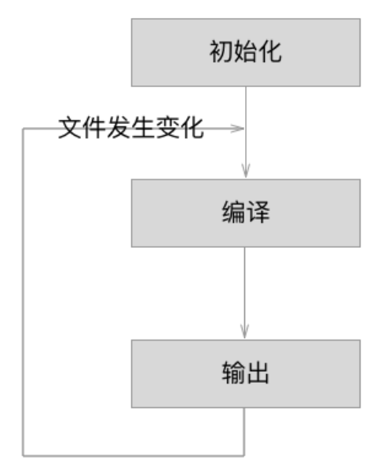


初始化流程

从配置文件和 `Shell` 语句中读取与合并参数，得出最终的参数

配置文件默认下为`webpack.config.js`，也或者通过命令的形式指定配置文件，主要作用是用于激活`webpack`的加载项和插件

关于文件配置内容分析，如下注释：

```javascript
var path = require('path');
var node_modules = path.resolve(__dirname, 'node_modules');
var pathToReact = path.resolve(node_modules, 'react/dist/react.min.js');

module.exports = {
  // 入口文件，是模块构建的起点，同时每一个入口文件对应最后生成的一个 chunk。
  entry: './path/to/my/entry/file.js'，
  // 文件路径指向(可加快打包过程)。
  resolve: {
    alias: {
      'react': pathToReact
    }
  },
  // 生成文件，是模块构建的终点，包括输出文件与输出路径。
  output: {
    path: path.resolve(__dirname, 'build'),
    filename: '[name].js'
  },
  // 这里配置了处理各模块的 loader ，包括 css 预处理 loader ，es6 编译 loader，图片处理 loader。
  module: {
    loaders: [
      {
        test: /\.js$/,
        loader: 'babel',
        query: {
          presets: ['es2015', 'react']
        }
      }
    ],
    noParse: [pathToReact]
  },
  // webpack 各插件对象，在 webpack 的事件流中执行对应的方法。
  plugins: [
    new webpack.HotModuleReplacementPlugin()
  ]
};
```

`webpack` 将 `webpack.config.js` 中的各个配置项拷贝到 `options` 对象中，并加载用户配置的 `plugins`

完成上述步骤之后，则开始初始化`Compiler`编译对象，该对象掌控者`webpack`声明周期，不执行具体的任务，只是进行一些调度工作

```javascript
class Compiler extends Tapable {
    constructor(context) {
        super();
        this.hooks = {
            beforeCompile: new AsyncSeriesHook(["params"]),
            compile: new SyncHook(["params"]),
            afterCompile: new AsyncSeriesHook(["compilation"]),
            make: new AsyncParallelHook(["compilation"]),
            entryOption: new SyncBailHook(["context", "entry"])
            // 定义了很多不同类型的钩子
        };
        // ...
    }
}

function webpack(options) {
  var compiler = new Compiler();
  ...// 检查options,若watch字段为true,则开启watch线程
  return compiler;
}
...
```

`Compiler` 对象继承自 `Tapable`，初始化时定义了很多钩子函数


编译构建流程

根据配置中的 `entry` 找出所有的入口文件

```javascript
module.exports = {
  entry: './src/file.js'
}
```

初始化完成后会调用`Compiler`的`run`来真正启动`webpack`编译构建流程，主要流程如下：

* `compile` 开始编译

* `make` 从入口点分析模块及其依赖的模块，创建这些模块对象

* `build-module` 构建模块

* `seal` 封装构建结果

* `emit` 把各个chunk输出到结果文件


compile 编译

执行了`run`方法后，首先会触发`compile`，主要是构建一个`Compilation`对象

该对象是编译阶段的主要执行者，主要会依次下述流程：执行模块创建、依赖收集、分块、打包等主要任务的对象


make 编译模块

当完成了上述的`compilation`对象后，就开始从`Entry`入口文件开始读取，主要执行`_addModuleChain()`函数，如下：

```javascript
_addModuleChain(context, dependency, onModule, callback) {
   ...
   // 根据依赖查找对应的工厂函数
   const Dep = /** @type {DepConstructor} */ (dependency.constructor);
   const moduleFactory = this.dependencyFactories.get(Dep);
   
   // 调用工厂函数NormalModuleFactory的create来生成一个空的NormalModule对象
   moduleFactory.create({
       dependencies: [dependency]
       ...
   }, (err, module) => {
       ...
       const afterBuild = () => {
        this.processModuleDependencies(module, err => {
         if (err) return callback(err);
         callback(null, module);
           });
    };
       
       this.buildModule(module, false, null, null, err => {
           ...
           afterBuild();
       })
   })
}
```

过程如下：

`_addModuleChain`中接收参数`dependency`传入的入口依赖，使用对应的工厂函数`NormalModuleFactory.create`方法生成一个空的`module`对象

回调中会把此`module`存入`compilation.modules`对象和`dependencies.module`对象中，由于是入口文件，也会存入`compilation.entries`中

随后执行`buildModule`进入真正的构建模块`module`内容的过程


build module 完成模块编译

这里主要调用配置的`loaders`，将我们的模块转成标准的`JS`模块

在用` Loader` 对一个模块转换完后，使用 `acorn` 解析转换后的内容，输出对应的抽象语法树（`AST`），以方便 `Webpack `后面对代码的分析

从配置的入口模块开始，分析其 `AST`，当遇到`require`等导入其它模块语句时，便将其加入到依赖的模块列表，同时对新找出的依赖模块递归分析，最终搞清所有模块的依赖关系


输出流程


seal 输出资源

`seal`方法主要是要生成`chunks`，对`chunks`进行一系列的优化操作，并生成要输出的代码

`webpack` 中的 `chunk` ，可以理解为配置在 `entry` 中的模块，或者是动态引入的模块

根据入口和模块之间的依赖关系，组装成一个个包含多个模块的 `Chunk`，再把每个 `Chunk` 转换成一个单独的文件加入到输出列表


emit 输出完成

在确定好输出内容后，根据配置确定输出的路径和文件名

```javascript
output: {
    path: path.resolve(__dirname, 'build'),
        filename: '[name].js'
}
```

在 `Compiler` 开始生成文件前，钩子 `emit` 会被执行，这是我们修改最终文件的最后一个机会

从而`webpack`整个打包过程则结束了


小结

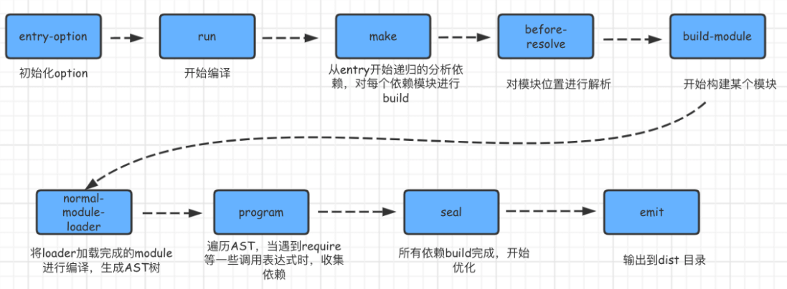


***

## 12. 说说你对webpack的理解？解决了什么问题？


**参考答案：**


一、背景

`Webpack` 最初的目标是实现前端项目的模块化，旨在更高效地管理和维护项目中的每一个资源


模块化

最早的时候，我们会通过文件划分的形式实现模块化，也就是将每个功能及其相关状态数据各自单独放到不同的` JS` 文件中

约定每个文件是一个独立的模块，然后再将这些`js`文件引入到页面，一个`script`标签对应一个模块，然后调用模块化的成员

```javascript
<script src="module-a.js"></script>
<script src="module-b.js"></script>
```

但这种模块弊端十分的明显，模块都是在全局中工作，大量模块成员污染了环境，模块与模块之间并没有依赖关系、维护困难、没有私有空间等问题

项目一旦变大，上述问题会尤其明显

随后，就出现了命名空间方式，规定每个模块只暴露一个全局对象，然后模块的内容都挂载到这个对象中

```javascript
window.moduleA = {
  method1: function () {
    console.log('moduleA#method1')
  }
}
```

这种方式也并没有解决第一种方式的依赖等问题

再后来，我们使用立即执行函数为模块提供私有空间，通过参数的形式作为依赖声明，如下

```javascript
// module-a.js
(function ($) {
  var name = 'module-a'

  function method1 () {
    console.log(name + '#method1')
    $('body').animate({ margin: '200px' })
  }
    
  window.moduleA = {
    method1: method1
  }
})(jQuery)
```

上述的方式都是早期解决模块的方式，但是仍然存在一些没有解决的问题。例如，我们是用过`script`标签在页面引入这些模块的，这些模块的加载并不受代码的控制，时间一久维护起来也十分的麻烦

理想的解决方式是，在页面中引入一个`JS`入口文件，其余用到的模块可以通过代码控制，按需加载进来

除了模块加载的问题以外，还需要规定模块化的规范，如今流行的则是`CommonJS `、`ES Modules`


二、问题

从后端渲染的`JSP`、`PHP`，到前端原生`JavaScript`，再到`jQuery`开发，再到目前的三大框架`Vue`、`React`、`Angular`

开发方式，也从`javascript`到后面的`es5`、`es6、7、8、9、10`，再到`typescript`，包括编写`CSS`的预处理器`less`、`scss`等

现代前端开发已经变得十分的复杂，所以我们开发过程中会遇到如下的问题：

* 需要通过模块化的方式来开发

* 使用一些高级的特性来加快我们的开发效率或者安全性，比如通过ES6+、TypeScript开发脚本逻辑，通过sass、less等方式来编写css样式代码

* 监听文件的变化来并且反映到浏览器上，提高开发的效率

* JavaScript 代码需要模块化，HTML 和 CSS 这些资源文件也会面临需要被模块化的问题

* 开发完成后我们还需要将代码进行压缩、合并以及其他相关的优化

而`webpack`恰巧可以解决以上问题


三、是什么

`webpack` 是一个用于现代`JavaScript`应用程序的静态模块打包工具

* 静态模块

这里的静态模块指的是开发阶段，可以被 `webpack` 直接引用的资源（可以直接被获取打包进`bundle.js`的资源）

当 `webpack `处理应用程序时，它会在内部构建一个依赖图，此依赖图对应映射到项目所需的每个模块（不再局限`js`文件），并生成一个或多个 `bundle`

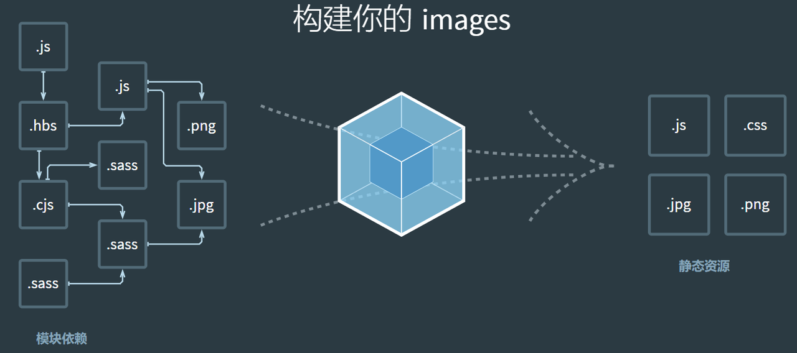


`webpack`的能力：

编译代码能力，提高效率，解决浏览器兼容问题&#x20;

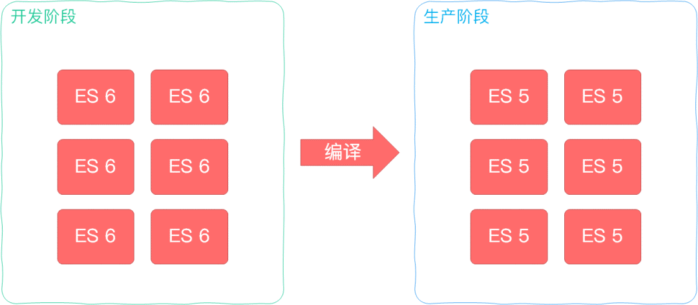

模块整合能力，提高性能，可维护性，解决浏览器频繁请求文件的问题

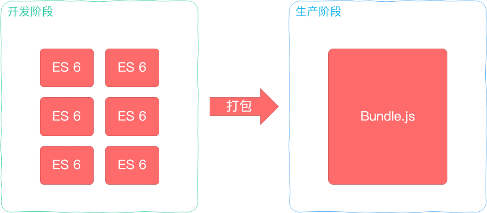

万物皆可模块能力，项目维护性增强，支持不同种类的前端模块类型，统一的模块化方案，所有资源文件的加载都可以通过代码控制

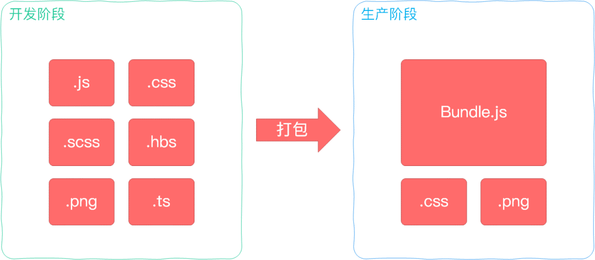


***

## 13. webpack loader 和 plugin 实现原理


**参考答案：**

本文讨论的核心内容如下：

1. `webpack`进行打包的基本原理

2. 如何自己实现一个`loader`和`plugin`

注： 本文使用的`webpack`版本是`v4.43.0`, `webpack-cli`版本是`v3.3.11`，`node`版本是`v12.14.1`，`npm`版本`v6.13.4`(如果你喜欢`yarn`也是可以的)，演示用的`chrome`浏览器版本`81.0.4044.129（正式版本） （64 位）`

* webpack打包基本原理

webpack的一个核心功能就是把我们写的模块化的代码，打包之后，生成可以在浏览器中运行的代码，我们这里也是从简单开始，一步步探索webpack的打包原理


1.1 一个简单的需求

我们首先建立一个空的项目，使用`npm init -y`快速初始化一个`package.json`，然后安装`webpack webpack-cli`

接下来，在根目录下创建`src`目录，`src`目录下创建`index.js`，`add.js`，`minus.js`，根目录下创建`index.html`，其中`index.html`引入`index.js`，在`index.js`引入`add.js`，`minus.js`，

目录结构如下：

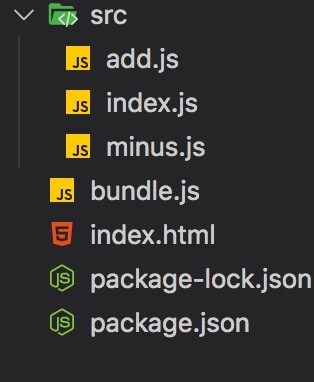

文件内容如下：

```plaintext
// add.js
export default (a, b) => {
    return a + b
}
// minus.js
export const minus = (a, b) => {
    return a - b
}
// index.js
import add from './add.js'
import { minus } from './minus.js'
const sum = add(1, 2)
const division = minus(2, 1)
console.log('sum>>>>>', sum)
console.log('division>>>>>', division)
```

```plaintext
<!--index.html-->
<!DOCTYPE html>
<html lang="en">
<head>
    <meta charset="UTF-8">
    <meta name="viewport" content="width=device-width, initial-scale=1.0">
    <title>demo</title>
</head>
<body>
    <script src="./src/index.js"></script>
</body>
</html>
```

这样直接在`index.html`引入`index.js`的代码，在浏览器中显然是不能运行的，你会看到这样的错误

```plaintext
Uncaught SyntaxError: Cannot use import statement outside a module
```

是的，我们不能在`script`引入的`js`文件里，使用`es6`模块化语法


1.2 实现webpack打包核心功能

我们首先在项目根目录下再建立一个bundle.js，这个文件用来对我们刚刚写的模块化`js`代码文件进行打包

我们首先来看webpack官网对于其打包流程的描述：

`it internally builds a dependency graph which maps every module your project needs and generates one or more bundles（webpack会在内部构建一个 依赖图(dependency graph)，此依赖图会映射项目所需的每个模块，并生成一个或多个 bundle）`

在正式开始之前，结合上面`webpack`官网说明进行分析，明确我们进行打包工作的基本流程如下：

1. 首先，我们需要读到入口文件里的内容（也就是index.js的内容）

2. 其次，分析入口文件，递归的去读取模块所依赖的文件内容，生成依赖图

3. 最后，根据依赖图，生成浏览器能够运行的最终代码

4. 处理单个模块（以入口为例）


1.1 获取模块内容

既然要读取文件内容，我们需要用到`node.js`的核心模块`fs`，我们首先来看读到的内容是什么：

```plaintext
// bundle.js
const fs = require('fs')
const getModuleInfo = file => {
    const body = fs.readFileSync(file, 'utf-8')
    console.log(body)
}
getModuleInfo('./src/index.js')
```

我们定义了一个方法`getModuleInfo`，这个方法里我们读出文件内容，打印出来，输出的结果如下图：

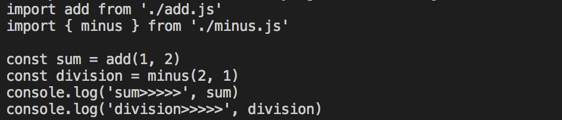

我们可以看到，入口文件`index.js`的所有内容都以字符串形式输出了，我们接下来可以用正则表达式或者其它一些方法，从中提取到`import`以及`export`的内容以及相应的路径文件名，来对入口文件内容进行分析，获取有用的信息。但是如果`import`和`export`的内容非常多，这会是一个很麻烦的过程，这里我们借助`babel`提供的功能，来完成入口文件的分析


1.2 分析模块内容

我们安装`@babel/parser`，演示时安装的版本号为`^7.9.6`

这个babel模块的作用，就是把我们js文件的代码内容，转换成js对象的形式，这种形式的js对象，称做`抽象语法树(Abstract Syntax Tree, 以下简称AST)`

```plaintext
// bundle.js
const fs = require('fs')
const parser = require('@babel/parser')
const getModuleInfo = file => {
    const body = fs.readFileSync(file, 'utf-8')
    const ast = parser.parse(body, {
        // 表示我们要解析的是es6模块
       sourceType: 'module'
    })
    console.log(ast)
    console.log(ast.program.body)
}
getModuleInfo('./src/index.js')
```

使用`@babel/parser`的`parse`方法把入口文件转化称为了`AST`，我们打印出了`ast`，注意文件内容是在`ast.program.body`中，如下图所示：

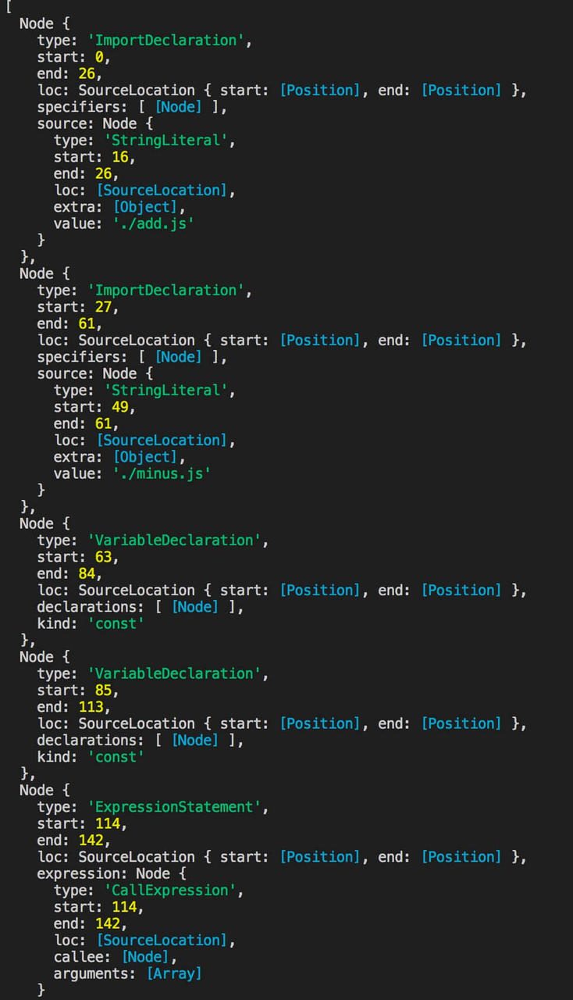

入口文件内容被放到一个数组中，总共有六个`Node`节点，我们可以看到，每个节点有一个`type`属性，其中前两个的`type`属性是`ImportDeclaration`，这对应了我们入口文件的两条`import`语句，并且，每一个`type`属性是`ImportDeclaration`的节点，其`source.value`属性是引入这个模块的相对路径，这样我们就得到了入口文件中对打包有用的重要信息了。

接下来要对得到的ast做处理，返回一份结构化的数据，方便后续使用。


1.3 对模块内容做处理

对`ast.program.body`部分数据的获取和处理，本质上就是对这个数组的遍历，在循环中做数据处理，这里同样引入一个babel的模块`@babel/traverse`来完成这项工作。

安装`@babel/traverse`，演示时安装的版本号为`^7.9.6`

```plaintext
const fs = require('fs')
const path = require('path')
const parser = require('@babel/parser')
const traverse = require('@babel/traverse').default
const getModuleInfo = file => {
    const body = fs.readFileSync(file, 'utf-8')
    const ast = parser.parse(body, {
       sourceType: 'module'
    })
    const deps = {}
    traverse(ast, {
        ImportDeclaration({ node }) {
            const dirname = path.dirname(file);
            const absPath = './' + path.join(dirname, node.source.value)
            deps[node.source.value] = absPath
        }
    })
    console.log(deps)
}
getModuleInfo('./src/index.js')
```

创建一个对象`deps`，用来收集模块自身引入的依赖，使用`traverse`遍历`ast`，我们只需要对`ImportDeclaration`的节点做处理，注意我们做的处理实际上就是把相对路径转化为绝对路径，这里我使用的是`Mac`系统，如果是`windows`系统,注意斜杠的区别

获取依赖之后，我们需要对`ast`做语法转换，把`es6`的语法转化为`es5`的语法，使用`babel`核心模块`@babel/core`以及`@babel/preset-env`完成

安装`@babel/core @babel/preset-env`，演示时安装的版本号均为`^7.9.6`

```plaintext
const fs = require('fs')
const path = require('path')
const parser = require('@babel/parser')
const traverse = require('@babel/traverse').default
const babel = require('@babel/core')
const getModuleInfo = file => {
    const body = fs.readFileSync(file, 'utf-8')
    const ast = parser.parse(body, {
       sourceType: 'module'
    })
    const deps = {}
    traverse(ast, {
        ImportDeclaration({ node }) {
            const dirname = path.dirname(file);
            const absPath = './' + path.join(dirname, node.source.value)
            deps[node.source.value] = absPath
        }
    })
    const { code } = babel.transformFromAst(ast, null, {
        presets: ["@babel/preset-env"]
    })
    const moduleInfo = { file, deps, code }
    console.log(moduleInfo)
    return moduleInfo
}
getModuleInfo('./src/index.js')
```

如下图所示，我们最终把一个模块的代码，转化为一个对象形式的信息，这个对象包含文件的绝对路径，文件所依赖模块的信息，以及模块内部经过`babel`转化后的代码

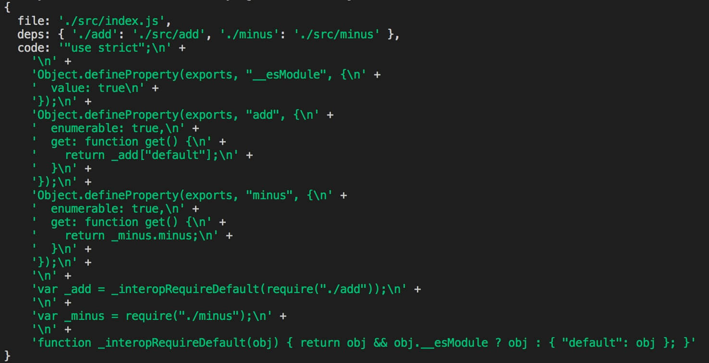

1. 递归的获取所有模块的信息

这个过程，也就是获取`依赖图(dependency graph)`的过程，这个过程就是从入口模块开始，对每个模块以及模块的依赖模块都调用`getModuleInfo`方法就行分析，最终返回一个包含所有模块信息的对象

```plaintext
const parseModules = file => {
    // 定义依赖图
    const depsGraph = {}
    // 首先获取入口的信息
    const entry = getModuleInfo(file)
    const temp = [entry]
    for (let i = 0; i < temp.length; i++) {
        const item = temp[i]
        const deps = item.deps
        if (deps) {
            // 遍历模块的依赖，递归获取模块信息
            for (const key in deps) {
                if (deps.hasOwnProperty(key)) {
                    temp.push(getModuleInfo(deps[key]))
                }
            }
        }
    }
    temp.forEach(moduleInfo => {
        depsGraph[moduleInfo.file] = {
            deps: moduleInfo.deps,
            code: moduleInfo.code
        }
    })
    console.log(depsGraph)
    return depsGraph
}
parseModules('./src/index.js')
```

获得的depsGraph对象如下图：

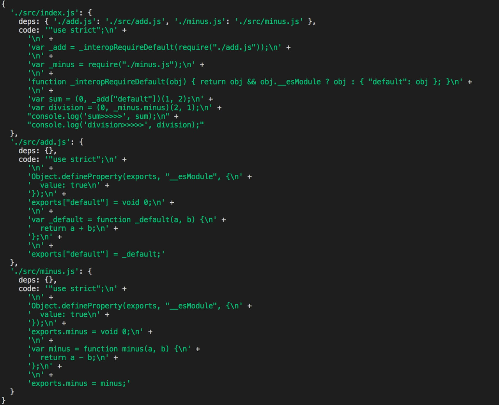

我们最终得到的模块分析数据如上图所示，接下来，我们就要根据这里获得的模块分析数据，来生产最终浏览器运行的代码。

1. 生成最终代码

在我们实现之前，观察上一节最终得到的依赖图，可以看到，最终的code里包含exports以及require这样的语法，所以，我们在生成最终代码时，要对exports和require做一定的实现和处理

我们首先调用之前说的parseModules方法，获得整个应用的依赖图对象：

```plaintext
const bundle = file => {
    const depsGraph = JSON.stringify(parseModules(file))
}
```

接下来我们应该把依赖图对象中的内容，转换成能够执行的代码，以字符串形式输出。 我们把整个代码放在自执行函数中，参数是依赖图对象

```plaintext
const bundle = file => {
    const depsGraph = JSON.stringify(parseModules(file))
    return 
(function(graph){         function require(file) {             var exports = {};             return exports         }         require('${file}')     })(${depsGraph})
}
```

接下来内容其实很简单，就是我们取得入口文件的code信息，去执行它就好了，使用eval函数执行，初步写出代码如下：

```plaintext
const bundle = file => {
    const depsGraph = JSON.stringify(parseModules(file))
    return 
(function(graph){         function require(file) {             var exports = {};             (function(code){                 eval(code)             })(graph[file].code)             return exports         }         require('${file}')     })(${depsGraph})
}
```

上面的写法是有问题的，我们需要对file做绝对路径转化，否则`graph[file].code`是获取不到的，定义adsRequire方法做相对路径转化为绝对路径

```plaintext
const bundle = file => {
    const depsGraph = JSON.stringify(parseModules(file))
    return 
(function(graph){         function require(file) {             var exports = {};             function absRequire(relPath){                 return require(graph[file].deps[relPath])             }             (function(require, exports, code){                 eval(code)             })(absRequire, exports, graph[file].code)             return exports         }         require('${file}')     })(${depsGraph})
}
```

接下来，我们只需要执行bundle方法，然后把生成的内容写入一个JavaScript文件即可

```plaintext
const content = bundle('./src/index.js')
// 写入到dist/bundle.js
fs.mkdirSync('./dist')
fs.writeFileSync('./dist/bundle.js', content)
```

最后，我们在index.html引入这个`./dist/bundle.js`文件，我们可以看到控制台正确输出了我们想要的结果

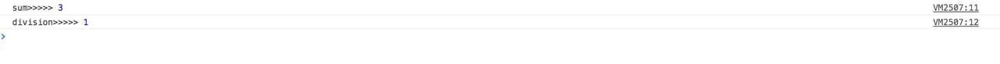

1. bundle.js的完整代码

```plaintext
const fs = require('fs')
const path = require('path')
const parser = require('@babel/parser')
const traverse = require('@babel/traverse').default
const babel = require('@babel/core')
const getModuleInfo = file => {
    const body = fs.readFileSync(file, 'utf-8')
    console.log(body)
    const ast = parser.parse(body, {
       sourceType: 'module'
    })
    // console.log(ast.program.body)
    const deps = {}
    traverse(ast, {
        ImportDeclaration({ node }) {
            const dirname = path.dirname(file);
            const absPath = './' + path.join(dirname, node.source.value)
            deps[node.source.value] = absPath
        }
    })
    const { code } = babel.transformFromAst(ast, null, {
        presets: ["@babel/preset-env"]
    })
    const moduleInfo = { file, deps, code }
    return moduleInfo
}
const parseModules = file => {
    // 定义依赖图
    const depsGraph = {}
    // 首先获取入口的信息
    const entry = getModuleInfo(file)
    const temp = [entry]
    for (let i = 0; i < temp.length; i++) {
        const item = temp[i]
        const deps = item.deps
        if (deps) {
            // 遍历模块的依赖，递归获取模块信息
            for (const key in deps) {
                if (deps.hasOwnProperty(key)) {
                    temp.push(getModuleInfo(deps[key]))
                }
            }
        }
    }
    temp.forEach(moduleInfo => {
        depsGraph[moduleInfo.file] = {
            deps: moduleInfo.deps,
            code: moduleInfo.code
        }
    })
    // console.log(depsGraph)
    return depsGraph
}
// 生成最终可以在浏览器运行的代码
const bundle = file => {
    const depsGraph = JSON.stringify(parseModules(file))
    return 
(function(graph){         function require(file) {             var exports = {};             function absRequire(relPath){                 return require(graph[file].deps[relPath])             }             (function(require, exports, code){                 eval(code)             })(absRequire, exports, graph[file].code)             return exports         }         require('${file}')     })(${depsGraph})
}
const build = file => {
    const content = bundle(file)
    // 写入到dist/bundle.js
    fs.mkdirSync('./dist')
    fs.writeFileSync('./dist/bundle.js', content)
}
build('./src/index.js')
```

* 手写`loader`和`plugin`


2.1 如何自己实现一个`loader`

loader本质上就是一个函数，这个函数会在我们在我们加载一些文件时执行


2.1.1 如何实现一个同步`loader`

首先我们初始化一个项目，项目结构如图所示：

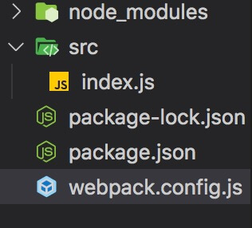

其中index.js和webpack.config.js的文件内容如下：

```plaintext
// index.js
console.log('我要学好前端，因为学好前端可以： ')
// webpack.config.js
const path = require('path')
module.exports = {
    mode: 'development',
    entry: {
        main: './src/index.js'
    },
    output: {
        path: path.resolve(__dirname, 'dist'),
        filename: '[name].js'
    }
}
```

我们在根目录下创建`syncLoader.js`，用来实现一个同步的loader，注意这个函数必须返回一个`buffer`或者`string`

```plaintext
// syncloader.ja
module.exports = function (source) {
    console.log('source>>>>', source)
    return source
}
```

同时，我们在`webpack.config.js`中使用这个`loader`，我们这里使用`resolveLoader`配置项，指定`loader`查找文件路径，这样我们使用`loader`时候可以直接指定`loader`的名字

```plaintext
const path = require('path')
module.exports = {
    mode: 'development',
    entry: {
        main: './src/index.js'
    },
    output: {
        path: path.resolve(__dirname, 'dist'),
        filename: '[name].js'
    },
    resolveLoader: {
        // loader路径查找顺序从左往右
        modules: ['node_modules', './']
    },
    module: {
        rules: [
            {
                test: /\.js$/,
                use: 'syncLoader'
            }
        ]
    }
}
```

接下来我们运行打包命令，可以看到命令行输出了source内容，也就是loader作用文件的内容。

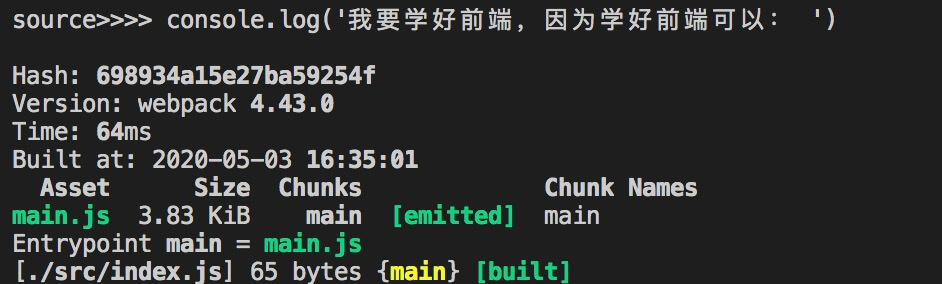

接着我们改造我们的loader:

```plaintext
module.exports = function (source) {
    source += '升值加薪'
    return source
}
```

我们再次运行打包命令，去观察打包后的代码：

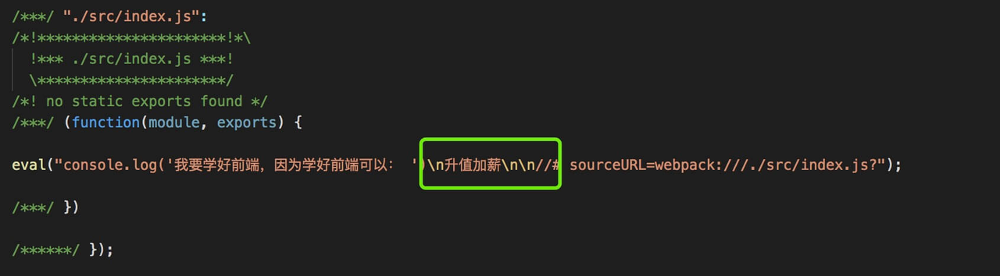

这样，我们就实现了一个简单的loader，为我们的文件增加一条信息。 我们可以尝试在`loader`的函数里打印`this`，发现输出结果是非常长的一串内容，`this`上有很多我们可以在`loader`中使用的有用信息，所以，对于`loader`的编写，一定不要使用箭头函数，那样会改变`this`的指向。

一般来说，我们会去使用官方推荐的`loader-utils`包去完成更加复杂的`loader`的编写

我们继续安装`loader-utils`，版本是`^2.0.0`

我们首先改造`webpack.config.js`：

```plaintext
const path = require('path')
module.exports = {
    mode: 'development',
    entry: {
        main: './src/index.js'
    },
    output: {
        path: path.resolve(__dirname, 'dist'),
        filename: '[name].js'
    },
    resolveLoader: {
        // loader路径查找顺序从左往右
        modules: ['node_modules', './']
    },
    module: {
        rules: [
            {
                test: /\.js$/,
                use: {
                    loader: 'syncLoader',
                    options: {
                        message: '升值加薪'
                    }
                }
            }
        ]
    }
}
```

注意到，我们为我们的`loader`增加了`options`配置项，接下来在loader函数里使用loader-utils获取配置项内容，拼接内容，我们依然可以得到与之前一样的打包结果

```plaintext
// syncLoader.js
const loaderUtils = require('loader-utils')
module.exports = function (source) {
    const options = loaderUtils.getOptions(this)
    console.log(options)
    source += options.message
    // 可以传递更详细的信息
    this.callback(null, source)
}
```

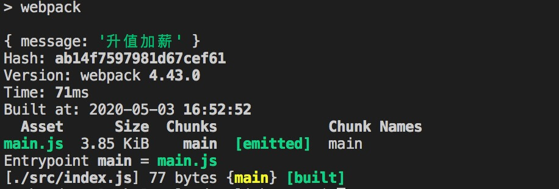

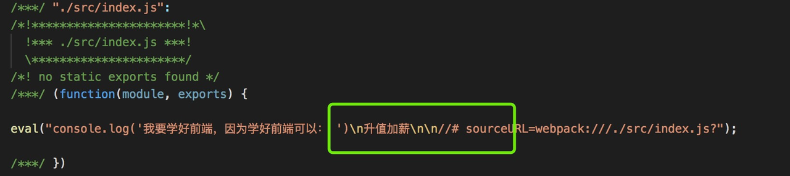

这样，我们就完成了一个简单的同步`loader`的编写


2.1.2 如何实现一个异步`loader`

和同步loader的编写方式非常相似，我们在根目录下建立一个asyncLoader.js的文件，内容如下：

```plaintext
const loaderUtils = require('loader-utils')
module.exports = function (source) {
    const options = loaderUtils.getOptions(this)
    const asyncfunc = this.async()
    setTimeout(() => {
        source += '走上人生颠覆'
        asyncfunc(null, source)
    }, 200)
}
```

注意这里的`this.async()`，用官方的话来说就是`Tells the loader-runner that the loader intends to call back asynchronously. Returns this.callback.`也就是让webpack知道这个loader是异步运行，返回的是和同步使用时一致的`this.callback`

接下来我们修改webpack.config.js

```plaintext
const path = require('path')
module.exports = {
    mode: 'development',
    entry: {
        main: './src/index.js'
    },
    output: {
        path: path.resolve(__dirname, 'dist'),
        filename: '[name].js'
    },
    resolveLoader: {
        // loader路径查找顺序从左往右
        modules: ['node_modules', './']
    },
    module: {
        rules: [
            {
                test: /\.js$/,
                use: [
                    {
                        loader: 'syncLoader',
                        options: {
                            message: '升职加薪'
                        }
                    },
                    {
                        loader: 'asyncLoader'
                    }
                ]
            }
        ]
    }
}
```

注意loader执行顺序是从下网上的，所以首先为文本写入‘升值加薪’，然后写入‘走上人生巅峰’

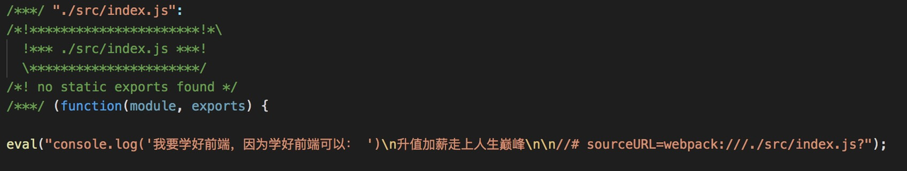

到此，我们简单介绍了如何手写一个`loader`，在实际项目中，可以考虑一部分公共的简单逻辑，可以通过编写一个`loader`来完成(比如国际化文本替换)


2.2 如何自己实现一个`plugin`

`plugin`通常是在`webpack`在打包的某个时间节点做一些操作，我们使用`plugin`的时候，一般都是`new Plugin()`这种形式使用，所以，首先应该明确的是，`plugin`应该是一个类。

我们初始化一个与上一接实现loader时候一样的项目，根目录下创建一个`demo-webpack-plugin.js`的文件，我们首先在`webpack.config.js`中使用它

```plaintext
const path = require('path')
const DemoWebpackPlugin = require('./demo-webpack-plugin')
module.exports = {
    mode: 'development',
    entry: {
        main: './src/index.js'
    },
    output: {
        path: path.resolve(__dirname, 'dist'),
        filename: '[name].js'
    },
    plugins: [
        new DemoWebpackPlugin()
    ]
}
```

再来看`demo-webpack-plugin.js`的实现

```plaintext
class DemoWebpackPlugin {
    constructor () {
        console.log('plugin init')
    }
    apply (compiler) {
    }
}
module.exports = DemoWebpackPlugin
```

我们在`DemoWebpackPlugin`的构造函数打印一条信息，当我们执行打包命令时，这条信息就会输出，`plugin`类里面需要实现一个`apply`方法，`webpack`打包时候，会调用`plugin`的`aplly`方法来执行`plugin`的逻辑，这个方法接受一个`compiler`作为参数，这个`compiler`是`webpack`实例

plugin的核心在于，apply方法执行时，可以操作webpack本次打包的各个时间节点（hooks，也就是生命周期勾子），在不同的时间节点做一些操作

关于webpack编译过程的各个生命周期勾子，可以参考[Compiler Hooks](https://v4.webpack.js.org/api/compiler-hooks/)

同样，这些hooks也有同步和异步之分，下面演示`compiler hooks`的写法，一些重点内容可以参考注释：

```plaintext
class DemoWebpackPlugin {
    constructor () {
        console.log('plugin init')
    }
    // compiler是webpack实例
    apply (compiler) {
        // 一个新的编译(compilation)创建之后（同步）
        // compilation代表每一次执行打包，独立的编译
        compiler.hooks.compile.tap('DemoWebpackPlugin', compilation => {
            console.log(compilation)
        })
        // 生成资源到 output 目录之前（异步）
        compiler.hooks.emit.tapAsync('DemoWebpackPlugin', (compilation, fn) => {
            console.log(compilation)
            compilation.assets['index.md'] = {
                // 文件内容
                source: function () {
                    return 'this is a demo for plugin'
                },
                // 文件尺寸
                size: function () {
                    return 25
                }
            }
            fn()
        })
    }
}
module.exports = DemoWebpackPlugin
```

我们的这个`plugin`的作用就是，打包时候自动生成一个`md`文档，文档内容是很简单的一句话

上述异步hooks的写法也可以是以下两种：

```plaintext
// 第二种写法(promise)
compiler.hooks.emit.tapPromise('DemoWebpackPlugin', (compilation) => {
    return new Promise((resolve, reject) => {
        setTimeout(() => {
            resolve()
        }, 1000)
    }).then(() => {
        console.log(compilation.assets)
        compilation.assets['index.md'] = {
            // 文件内容
            source: function () {
                return 'this is a demo for plugin'
            },
            // 文件尺寸
            size: function () {
                return 25
            }
        }
    })
})
// 第三种写法(async await)
compiler.hooks.emit.tapPromise('DemoWebpackPlugin', async (compilation) => {
    await new Promise((resolve, reject) => {
        setTimeout(() => {
            resolve()
        }, 1000)
    })
    console.log(compilation.assets)
    compilation.assets['index.md'] = {
        // 文件内容
        source: function () {
            return 'this is a demo for plugin'
        },
        // 文件尺寸
        size: function () {
            return 25
        }
    }
})
```

最终的输出结果都是一样的，在每次打包时候生成一个md文档

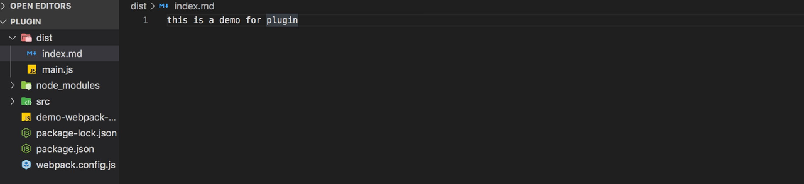


***

## 14. 如何提高webpack的构建速度？


**参考答案：**

以下是一些常用的方法：

1. 升级Webpack版本： 确保使用的是最新版本的Webpack，因为每个新版本都可能包含一些性能优化。

2. 使用DllPlugin： 使用`DllPlugin`和`DllReferencePlugin`来将第三方库的代码预先打包，以减少构建时间。这样就可以将这些库的代码从主要的构建中分离出来，并在它们没有发生变化时不需要重新构建。

3. 使用缓存： 启用Webpack的缓存，以便在后续构建中重复使用之前的结果。你可以通过在配置文件中添加`cache: true`来启用缓存。

```javascript
module.exports = {
  // ...
  cache: true,
};
```

* 多进程/多实例构建： 使用工具如`thread-loader`或`happypack`将构建任务分发到多个子进程中，以利用多核处理器的优势。

* 只加载必要的资源： 确保只加载项目实际需要的资源。使用Webpack的`tree shaking`功能来消除未使用的代码。

* 减小文件搜索范围： 在Webpack配置中指定`resolve`的`modules`和`extensions`，以减小Webpack在文件系统中搜索文件的范围。

```javascript
resolve: {
  modules: ['node_modules'],
  extensions: ['.js', '.jsx', '.json'],
},
```

* 使用高效的loader： 选择性能较好的loader，避免使用过于耗时的loader。如果可能，考虑使用`babel-loader`的`cacheDirectory`选项来缓存Babel的编译结果。

```javascript
{
  loader: 'babel-loader',
  options: {
    cacheDirectory: true,
  },
}
```

* 优化图片： 使用像`image-webpack-loader`这样的loader来优化图像文件，以减小文件大小。

* Webpack性能分析： 使用Webpack Bundle Analyzer等工具来分析你的构建输出，找出体积较大的模块，以便进一步优化。

* 使用更轻量的插件： 可以考虑使用一些轻量级的Webpack插件，避免引入过多的不必要的功能。

* 合理使用source map： 在开发环境中使用较轻量的source map，例如`cheap-module-eval-source-map`，在生产环境中禁用或使用更轻量的source map。

* Webpack Parallel Build： 使用工具如`webpack-parallel-uglify-plugin`来并行地压缩和优化代码。


***

## 15. 说说 webpack-dev-server 的原理


**参考答案：**

webpack-dev-server 是一个基于 Express.js 的开发服务器，它提供了一个用于开发环境的实时重载（live reloading）和热模块替换（Hot Module Replacement，HMR）的解决方案。

其工作原理如下：

1. 启动开发服务器：通过运行 webpack-dev-server 命令或在配置文件中设置 devServer 属性，我们可以启动 webpack-dev-server。它将监听指定的端口，并根据配置文件中的配置进行工作。

2. 编译和构建：当启动 webpack-dev-server 后，它将使用 webpack 来编译和构建项目。它会读取 webpack 配置文件中的配置信息，并根据这些配置进行代码的打包处理。

3. 内存中的文件系统：webpack-dev-server 将所有的项目文件存储在内存中的虚拟文件系统中，而不是写入磁盘。这使得每次修改源代码时，无需重新写入磁盘，可以更快地更新文件。

4. 请求转发：当浏览器请求文件时，例如 HTML、CSS、JavaScript 或静态资源等，webpack-dev-server 会监视这些请求，并将请求路由到内存中的虚拟文件系统中对应的文件。这意味着开发服务器能够直接提供文件，而无需访问实际的物理文件。

5. 自动刷新和热模块替换：一旦文件发生更改，webpack-dev-server 会通过 WebSocket 与浏览器建立连接，并向浏览器发送更新通知。浏览器接收到通知后，可以选择重新加载整个页面或仅更新受影响的模块，从而实现实时重载和热模块替换。

总结起来，webpack-dev-server 的原理是通过在内存中创建虚拟文件系统来提供开发服务器功能。它监听文件变化并通过 WebSocket 与浏览器通信，以实现实时重载和热模块替换，提供高效的开发环境。


***

## 16. 你对 babel 了解吗，能不能说说几个 stage 代表什么意思？


**参考答案：**

Babel 是一个广泛使用的 JavaScript 编译器，它可以将新版本的 JavaScript 代码转换为向后兼容的旧版本代码。

Babel 通过使用不同的插件集合来支持各个 ECMAScript（ES）提案的不同阶段，这些阶段被称为 "stage"。

以下是几个常见的 Babel stage（阶段）及其代表的意思：

1. Stage 0 - Strawman（展示阶段）:

   * 这是提案中最初的阶段，表明该提案还处于初始阶段，可能只是一个想法或草案，并没有正式进入 ECMAScript 规范的流程中。

2. Stage 1 - Proposal（建议阶段）:

   * 在这个阶段，提案已经成为了正式的 ECMAScript 提案，已经有了详细的规范和设计说明，并且正在讨论和收集反馈。

3. Stage 2 - Draft（草案阶段）:

   * 草案阶段表明该提案已经比较成熟，在语言规范中进行了初步定义，并且正在进行实验和实现。

4. Stage 3 - Candidate（候选阶段）:

   * 候选阶段表明该提案已经基本成熟，规范已经稳定，并且已经有了多个浏览器或环境的实现和测试。

5. Stage 4 - Finished（完成阶段）:

   * 完成阶段表明该提案已经准备好被纳入下一个版本的 ECMAScript 规范中，并且已经通过了所有必要的测试和审查。

需要注意的是，不是所有的提案都会按照这个阶段流程发展。一些重要的提案可能直接进入较高的阶段，而其他的提案可能在某个阶段停滞或被废弃。

Babel 提供了一系列插件集合，用于转译各个不同阶段的 ECMAScript 提案。根据你的需求，在 Babel 的配置文件中可以选择不同的插件集合，以支持你希望使用的 ECMAScript 特性。


***

## 17. webpack的module、bundle、chunk分别指的是什么？


**参考答案：**

在Webpack中，`module`、`bundle`和`chunk`是三个不同的概念：

Module（模块）：

* `module`指的是Webpack处理的代码的单个文件。这可以是JavaScript、CSS、图片或其他类型的文件。

* 在Webpack中，每个文件都被视为一个独立的模块，它们可以通过`import`、`require`等方式引入和导出。

* 模块可以包含代码、依赖关系和其他相关资源，它们通常用于组织和管理应用程序的各个部分。

Bundle（捆绑包）：

* `bundle`是由Webpack根据模块之间的依赖关系生成的最终输出文件。它将多个模块打包成一个或多个捆绑包。

* 在开发过程中，Webpack会根据入口文件（entry）和模块之间的依赖关系，递归地构建一个或多个捆绑包。

* 捆绑包通常是用于在浏览器中加载和执行的最终文件，包含了应用程序所需的所有代码和资源。

Chunk（代码块）：

* `chunk`是Webpack在构建过程中生成的代码块，它是一种逻辑上的概念，表示一组相互依赖的模块。

* 当Webpack构建应用程序时，它会根据依赖关系将模块组织成不同的代码块，例如按需加载（懒加载）时生成的分割代码块。

* 默认情况下，Webpack会将所有入口点（entry point）及其依赖的模块打包到一个主要的初始代码块中。但是，通过使用代码分割（code splitting）技术，可以将应用程序拆分成多个代码块，以实现按需加载和优化性能。

综上所述：

* `module`是Webpack处理的单个文件，代表了应用程序的组成部分。

* `bundle`是由Webpack生成的最终输出文件，它包含了所有模块的代码和资源。

* `chunk`是逻辑上的代码块，表示一组相互依赖的模块。它可以根据需要进行拆分和加载。


***

## 18. 什么是 CI/CD？


**参考答案：**

CI/CD是持续集成（Continuous Integration）和持续交付/持续部署（Continuous Delivery/Continuous Deployment）的缩写。

* 持续集成（Continuous Integration，CI）：CI是一种开发实践，通过频繁地将代码集成到共享的版本控制库中，并自动进行构建、测试和静态代码分析等过程，以早期发现和解决代码集成问题。主要目标是减少集成冲突和快速反馈，提高开发团队的协作效率和代码质量。

* 持续交付/持续部署（Continuous Delivery/Continuous Deployment，CD）：CD是在CI的基础上进一步自动化整个软件交付流程的实践。持续交付指将软件交付到可部署环境的过程，包括自动化构建、自动化测试、文档生成和打包等，以确保每次交付都是可靠和可重复的。持续部署则更进一步，指将软件自动部署到生产环境，从而减少人工干预和降低发布的风险。

CI/CD的目标是通过自动化和持续的流程来提高软件开发和交付的效率、质量和可靠性。它帮助团队集中精力于开发新功能，并能够快速、频繁地将这些功能交付给最终用户。CI/CD在现代软件开发中被广泛采用，为团队提供了一种更加可靠和高效的软件交付方式。


***

## 19. 说说你对前端工程化的理解


**参考答案：**

前端工程化是指将前端开发中的设计、开发、测试和部署等环节进行标准化和自动化，以提高开发效率和代码质量，并降低维护成本。

具体而言，前端工程化包括以下方面：

1. 模块化：使用模块化思想可以将复杂的代码拆分成小的可重用的模块，并且使得不同模块之间的依赖关系更加清晰。

2. 自动化构建：通过使用构建工具（如 Gulp、Webpack、Rollup 等），可以自动化地完成代码编译、压缩、打包、转换、优化等任务，从而提高开发效率。

3. 自动化测试：通过使用自动化测试框架和工具（如 Jest、Mocha、Chai、Selenium 等），可以自动化地完成单元测试、集成测试、UI 测试等任务，从而提高代码质量并减少故障。

4. 自动化部署：通过使用自动化部署工具（如 Jenkins、Travis CI、GitLab CI/CD 等），可以自动化地完成代码上传、服务器部署、数据库更新等任务，从而减少手动操作产生的错误和漏洞。

5. 规范化管理：通过使用代码规范（如 ESLint、Stylelint、Prettier 等）和版本控制系统（如 Git），可以规范开发流程和代码风格，提高代码可读性和可维护性。

前端工程化是将前端开发中的设计、开发、测试和部署等环节进行标准化和自动化，以提高开发效率和代码质量，并降低维护成本。

它是一种现代化的开发方式，适用于各种大小项目的开发，并且可以在不断变化的技术环境中保持竞争力。


***

## 20. 说说你对 SSG 的理解


**参考答案：**

SSG（Static Site Generation，静态网站生成）是指在构建时预先生成静态页面，并将这些页面部署到 CDN 或者其他存储服务中，以提升 Web 应用的性能和用户体验。

具体来说，SSG 的实现方式通常包括以下几个步骤：

1. 在开发阶段，使用模板引擎等技术创建静态页面模板；

2. 将需要展示的数据从后台 API 中获取或者通过其他渠道获取，并将其填充到静态页面模板中，生成完整的 HTML 页面；

3. 使用构建工具（例如 Gatsby、Next.js 等）对静态页面进行构建，生成静态 HTML、CSS 和 JavaScript 文件；

4. 部署生成好的静态文件到服务器或者 CDN 上，以供用户访问。

相比于传统的动态网页，SSG 具有如下优势：

1. 加载速度快：由于不需要每次请求都动态地渲染页面，SSG 可以减少页面加载时间，从而提高用户体验和搜索引擎排名；

2. 安全性高：由于没有后台代码和数据库，SSG 不容易受到 SQL 注入等攻击；

3. 成本低：由于不需要动态服务器等设备，SSG 可以降低网站的运维成本和服务器负担。

需要注意的是，SSG 不适用于频繁更新的内容和动态交互等场景，但对于内容较为稳定和更新较少的网站则是一个性能优化的好选择。


***

## 21. 聊聊 vite 和 webpack 的区别


**参考答案：**

Vite 和 Webpack 都是前端打包工具，它们的作用类似，但实现方式和使用方法有所不同。以下是它们之间的一些区别：

1. 构建速度：Vite 的构建速度比 Webpack 更快，因为 Vite 在开发环境下使用了浏览器原生的 ES 模块加载，而不是像 Webpack 一样使用打包后的文件进行模块加载。在 Vite 中，每个模块都可以独立地进行编译和缓存，这意味着它只需要重新编译修改过的模块，而不是整个应用程序。这使得 Vite 开发起来更加高效。

2. 配置复杂度：Vite 的配置相对更简单，因为它无需进行大量的配置，只需指定一些基本的选项就可以开始开发。Webpack 的配置更加复杂，需要针对具体项目进行不同的配置，且需要理解各种插件、Loader 等概念。

3. 生态环境：Webpack 的生态环境更加成熟，在社区中拥有广泛的支持和丰富的插件库。而 Vite 尚处于发展阶段，尽管其已经获得了很多关注，但其生态系统仍然不太完善。

4. 功能特性：Webpack 是一个功能更加全面的打包工具，支持各种 Loader 和插件，可以处理多种类型的文件和资源。而 Vite 的设计初衷是专注于开发环境下的快速构建，因此其对一些高级特性的支持相对较少。

综上所述，Vite 更适合用于开发环境下的快速构建，而 Webpack 则更适合用于生产环境下的复杂应用程序的打包处理。选择使用哪种工具需要根据具体项目需求进行评估。


***

## 22. webpack treeShaking机制的原理是什么？


**参考答案：**

Tree shaking 是一种通过清除多余代码方式来优化项目打包体积的技术，专业术语叫 Dead code elimination


tree shaking如何工作的呢?

虽然 tree shaking 的概念在 1990 就提出了，但直到 ES6 的 ES6-style 模块出现后才真正被利用起来。

在ES6以前，我们可以使用CommonJS引入模块：require()，这种引入是动态的，也意味着我们可以基于条件来导入需要的代码：

```javascript
let dynamicModule;
// 动态导入
if (condition) {
  myDynamicModule = require("foo");
} else {
  myDynamicModule = require("bar");
}
```

但是CommonJS规范无法确定在实际运行前需要或者不需要某些模块，所以CommonJS不适合tree-shaking机制。在 ES6 中，引入了完全静态的导入语法：import。这也意味着下面的导入是不可行的：

```javascript
// 不可行，ES6 的import是完全静态的
if (condition) {
  myDynamicModule = require("foo");
} else {
  myDynamicModule = require("bar");
}
```

我们只能通过导入所有的包后再进行条件获取。如下：

```javascript
import foo from "foo";
import bar from "bar";

if (condition) {
  // foo.xxxx
} else {
  // bar.xxx
}
```

ES6的import语法可以完美使用tree shaking，因为可以在代码不运行的情况下就能分析出不需要的代码。

看完上面的分析，你可能还是有点懵，这里我简单做下总结：因为tree shaking只能在静态modules下工作。ECMAScript 6 模块加载是静态的,因此整个依赖树可以被静态地推导出解析语法树。所以在 ES6 中使用 tree shaking 是非常容易的。


tree shaking的原理是什么?

看完上面的分析，相信这里你可以很容易的得出题目的答案了：

* ES6 Module引入进行静态分析，故而编译的时候正确判断到底加载了那些模块

* 静态分析程序流，判断那些模块和变量未被使用或者引用，进而删除对应代码


common.js 和 es6 中模块引入的区别？

从这道题目我们可以很容易的引申出来另外一道“明星”面试题：common.js 和 es6 中模块引入的区别？

CommonJS 是一种模块规范，最初被应用于 Nodejs，成为 Nodejs 的模块规范。运行在浏览器端的 JavaScript 由于也缺少类似的规范，在 ES6 出来之前，前端也实现了一套相同的模块规范 (例如: AMD)，用来对前端模块进行管理。自 ES6 起，引入了一套新的 ES6 Module 规范，在语言标准的层面上实现了模块功能，而且实现得相当简单，有望成为浏览器和服务器通用的模块解决方案。但目前浏览器对 ES6 Module 兼容还不太好，我们平时在 Webpack 中使用的 export 和 import，会经过 Babel 转换为 CommonJS 规范。在使用上的差别主要有：

1、CommonJS 模块输出的是一个值的拷贝，ES6 模块输出的是值的引用。

2、CommonJS 模块是运行时加载，ES6 模块是编译时输出接口。

3、CommonJs 是单个值导出，ES6 Module可以导出多个

4、CommonJs 是动态语法可以写在判断里，ES6 Module 静态语法只能写在顶层

5、CommonJs 的 this 是当前模块，ES6 Module的 this 是 undefined


***

## 23. 介绍一下 tree shaking 及其工作原理


**参考答案：**

> Tree shaking 是一种通过清除多余代码方式来优化项目打包体积的技术，专业术语叫 Dead code elimination。


tree shaking如何工作的呢？

虽然 tree shaking 的概念在 1990 就提出了，但直到 ES6 的 `ES6-style` 模块出现后才真正被利用起来。

在ES6以前，我们可以使用CommonJS引入模块：require()，这种引入是动态的，也意味着我们可以基于条件来导入需要的代码：

```javascript
let dynamicModule;
// 动态导入
if (condition) {
  myDynamicModule = require("foo");
} else {
  myDynamicModule = require("bar");
}
```

但是CommonJS规范无法确定在实际运行前需要或者不需要某些模块，所以CommonJS不适合tree-shaking机制。在 ES6 中，引入了完全静态的导入语法：import。这也意味着下面的导入是不可行的：

```javascript
// 不可行，ES6 的import是完全静态的
if (condition) {
  myDynamicModule = require("foo");
} else {
  myDynamicModule = require("bar");
}
```

我们只能通过导入所有的包后再进行条件获取。如下：

```plaintext
import foo from "foo";
import bar from "bar";
if (condition) {
  // foo.xxxx
} else {
  // bar.xxx
}
```

ES6的import语法可以完美使用tree shaking，因为可以在代码不运行的情况下就能分析出不需要的代码。

看完上面的分析，你可能还是有点懵，这里我简单做下总结：因为tree shaking只能在静态modules下工作。ECMAScript 6 模块加载是静态的,因此整个依赖树可以被静态地推导出解析语法树。所以在 ES6 中使用 tree shaking 是非常容易的。


tree shaking的原理是什么?

看完上面的分析，相信这里你可以很容易的得出题目的答案了：

* ES6 Module引入进行静态分析，故而编译的时候正确判断到底加载了那些模块

* 静态分析程序流，判断那些模块和变量未被使用或者引用，进而删除对应代码


***

## 24. 前后端分离是什么？


**参考答案：**

前后端分离，顾名思义，就是前端与后端分开。分开什么？分开开发，分开部署。

这里以java web开发作为例子：我们学web开发的时候会接触到spring mvc框架，spring mvc开发时前端一般都用jsp作为展示页面，后端用servlet处理请求。再到springboot框架，前端使用thymeleaf或者freemarker作为模板引擎展示，后端用controller处理请求。

其中jsp和thymeleaf，freemarker都有一个共同点：页面都是可以内嵌java代码的。页面里面嵌入了java（后端程序设计语言）代码，就导致页面和后端服务的耦合度特别高——前后端开发的时候粘在一起了。

而如果我们要部署spring mvc/springboot的项目的话，前后端代码也都是打包在一个war包/jar包里的，部署的时候也是一起部署的，就导致前端要修改/后端要修改的话项目都要重新打包部署——前后端部署也粘在一起了。

怎样才算分开开发呢？那当然就是前端页面只用写html + js + css，后端不用写jsp，不用使用thymeleaf等模板引擎来做html的渲染了。

怎样才算分开部署呢？将前端项目和后端项目分开成两部分分别部署到服务器里。

所以，前端项目和后端项目分开开发，分开部署的都算是前后端分离。


我们为什么要前后端分离

* 项目变大后难以更新维护

我们也都知道，一个项目开发出来之后，都会一直更新维护。

那每次项目更新升级都会添加新功能，代码量也会增加，项目也会越来越大。如果采取前后端不分离的开发方式，前后端的更新迭代对于前端工程师和后端工程师或是全栈工程师而言也是巨大的压力：当一个页面需要前端工程师和后端工程师一起才能做好的时候，对他们而言，沟通可能是比代码更令人头疼的问题；当一个项目开发团队都是全栈工程师，如果项目变大，首先令人头疼的问题应该是：怎样才能招到合格的全栈工程师——毕竟全栈工程师对程序员的要求更高。而且当前端页面或后端接口出现问题时，我们不得不重新打包编译整个项目以进行项目的更新与维护，而项目越大，打包与编译所耗费的时间就越长。

* 项目耦合太严重难以复用

上文也有提到，如果使用模板引擎或是jsp这种特殊的页面，都会出现在页面上写java代码的情况。那么如果想要进行代码复用，难度肯定是特别高的：每次复用后端接口都需要重新修改前端页面，并在上面添加java代码。

* 项目加载更加耗费资源和时间

如果要加载一个使用了thymeleaf的页面，首先我们需要调用thymeleaf引擎来解析页面上的java代码，然后再对页面进行渲染，而一般的静态页面只需要直接渲染就可以。如果我们项目需要承载更多的并发的时候，我们也只能将前后端结合的部署包进行多包部署以扩充系统性能，但这样也浪费了一部分资源。


前后端分离有什么好处

* 提升前端与后端开发效率

前端与后端可以分开干了，各干各的，各自都只需要负责各自擅长的东西：前端只需要管html，css和js，后端只需要管java。只要商量确定好接口文档，甚至连开发进度都可以不统一：前端用js来mock数据进行测试，后端用postman等接口测试工具来做接口测试。

* 项目更新维护变简单

当我们需要更新维护前端页面时，只需要对前端项目的bug进行修缮，然后对前端项目进行打包部署就行，后端也是一样。而当团队需要扩招的时候，擅长单一职责（前端/后端）的人也更好找。

* 提高接口复用率

如果我们需要开发一个相似的项目，或者复用之前项目的后端模块，只需要将模块拿出来后进行小改动就行。而不是像以前一样大费周折，还要将接口对应的旧页面上的相应java代码移植到新的页面上（甚至还会出现不兼容的情况）。

* 让页面加载变得更快

我们将前端页面打包成静态页面进行部署，用户只需要访问静态页面就行，比起需要多一步解析交互代码的thymeleaf等模板引擎，普通的html页面肯定会快上一些，而有的时候这就不只是快上那么一点了。甚至我们可以引入nodejs作为中间岛，将前端页面的渲染放在nodejs上进行处理，直接将结果呈现反馈给浏览器。

* 提升服务器资源利用率

如果我们需要扩充系统并发量，只需要把前端页面在不超过后端接口QPS的情况下进行分包部署，做好负载均衡就行。而不需要将整个项目分包部署，尤其是多部署后端服务——这特别占用服务器资源。而如果超过了后端接口的QPS，后端当然也要分包部署了。


前后端分离带来的问题

* 跨域问题（CORS）

跨域问题应该是最常见的问题了。当我们用到Ajax进行数据请求的时候，跨域问题就会出现。这个问题的解决方法也是特别简单的，后端在返回的请求header中添加Access-Control-Allow-Origin就可以解决了。不同应用场景有不同设置方法，而这个问题百度来答案比什么都快。

* 单点登录问题

这个问题也是最近我在做项目对接的时候遇到的，具体是在对接cas的单点认证时，请求服务的单点登录接口是直接接入门户网站的，而这个接口对接的是后端而不是前端。当我们从门户访问接入应用的单点登录链接时，请求是直接发送到后端的。由于前端没接入nodejs，所以并没有办法将请求直接发送到前端进行登录验证。而整个认证流程都在后端进行的话，前端页面就无法正常获取登录后的jwt了。所以要在第一步请求的时候，将生成的token和jsessionid写入前端的认证处理页面来做页面跳转和登录认证的进一步进行。


***

## 25. Babel的原理是什么


**参考答案：**

babel 的转译过程分为三个阶段，这三步具体是：

* 解析 Parse: 将代码解析生成抽象语法树( 即AST )，即词法分析与语法分析的过程

* 转换 Transform: 对于 AST 进行变换一系列的操作，babel 接受得到 AST 并通过 babel-traverse 对其进行遍历，在此过程中进行添加、更新及移除等操作

* 生成 Generate: 将变换后的 AST 再转换为 JS 代码, 使用到的模块是 babel-generator


***

## 26. webpack的热更新是如何做到的？说明其原理


**参考答案：**

webpack的热更新又称热替换（Hot Module Replacement），缩写为HMR。 这个机制可以做到不用刷新浏览器而将新变更的模块替换掉旧的模块。


首先要知道server端和client端都做了处理工作

1. 第一步，在 webpack 的 watch 模式下，文件系统中某一个文件发生修改，webpack 监听到文件变化，根据配置文件对模块重新编译打包，并将打包后的代码通过简单的 JavaScript 对象保存在内存中。

2. 第二步是 webpack-dev-server 和 webpack 之间的接口交互，而在这一步，主要是 dev-server 的中间件 webpack-dev-middleware 和 webpack 之间的交互，webpack-dev-middleware 调用 webpack 暴露的 API对代码变化进行监控，并且告诉 webpack，将代码打包到内存中。

3. 第三步是 webpack-dev-server 对文件变化的一个监控，这一步不同于第一步，并不是监控代码变化重新打包。当我们在配置文件中配置了devServer.watchContentBase 为 true 的时候，Server 会监听这些配置文件夹中静态文件的变化，变化后会通知浏览器端对应用进行 live reload。注意，这儿是浏览器刷新，和 HMR 是两个概念。

4. 第四步也是 webpack-dev-server 代码的工作，该步骤主要是通过 sockjs（webpack-dev-server 的依赖）在浏览器端和服务端之间建立一个 websocket 长连接，将 webpack 编译打包的各个阶段的状态信息告知浏览器端，同时也包括第三步中 Server 监听静态文件变化的信息。浏览器端根据这些 socket 消息进行不同的操作。当然服务端传递的最主要信息还是新模块的 hash 值，后面的步骤根据这一 hash 值来进行模块热替换。

5. webpack-dev-server/client 端并不能够请求更新的代码，也不会执行热更模块操作，而把这些工作又交回给了 webpack，webpack/hot/dev-server 的工作就是根据 webpack-dev-server/client 传给它的信息以及 dev-server 的配置决定是刷新浏览器呢还是进行模块热更新。当然如果仅仅是刷新浏览器，也就没有后面那些步骤了。

6. HotModuleReplacement.runtime 是客户端 HMR 的中枢，它接收到上一步传递给他的新模块的 hash 值，它通过 JsonpMainTemplate.runtime 向 server 端发送 Ajax 请求，服务端返回一个 json，该 json 包含了所有要更新的模块的 hash 值，获取到更新列表后，该模块再次通过 jsonp 请求，获取到最新的模块代码。这就是上图中 7、8、9 步骤。

7. 而第 10 步是决定 HMR 成功与否的关键步骤，在该步骤中，HotModulePlugin 将会对新旧模块进行对比，决定是否更新模块，在决定更新模块后，检查模块之间的依赖关系，更新模块的同时更新模块间的依赖引用。

8. 最后一步，当 HMR 失败后，回退到 live reload 操作，也就是进行浏览器刷新来获取最新打包代码。


***

## 27. 如何提高webpack的打包速度


**参考答案：**

* happypack: 利用进程并行编译loader,利用缓存来使得 rebuild 更快,遗憾的是作者表示已经不会继续开发此项目,类似的替代者是thread-loader

* 外部扩展(externals): 将不怎么需要更新的第三方库脱离webpack打包，不被打入bundle中，从而减少打包时间,比如jQuery用script标签引入

* dll: 采用webpack的 DllPlugin 和 DllReferencePlugin 引入dll，让一些基本不会改动的代码先打包成静态资源,避免反复编译浪费时间

* 利用缓存: `webpack.cache`、babel-loader.cacheDirectory、`HappyPack.cache`都可以利用缓存提高rebuild效率

* 缩小文件搜索范围: 比如babel-loader插件,如果你的文件仅存在于src中,那么可以`include: path.resolve(__dirname, 'src')`,当然绝大多数情况下这种操作的提升有限,除非不小心build了node\_modules文件


***

## 28. 如何用webpack来优化前端性能


**参考答案：**

用webpack优化前端性能是指优化webpack的输出结果，让打包的最终结果在浏览器运行快速高效。

* 压缩代码:删除多余的代码、注释、简化代码的写法等等方式。可以利用webpack的`UglifyJsPlugin`和`ParallelUglifyPlugin`来压缩JS文件， 利用`cssnano`（css-loader?minimize）来压缩css

*

* 利用CDN加速: 在构建过程中，将引用的静态资源路径修改为CDN上对应的路径。可以利用webpack对于`output`参数和各loader的`publicPath`参数来修改资源路径

* Tree Shaking: 将代码中永远不会走到的片段删除掉。可以通过在启动webpack时追加参数`--optimize-minimize`来实现

* Code Splitting: 将代码按路由维度或者组件分块(chunk),这样做到按需加载,同时可以充分利用浏览器缓存

* 提取公共第三方库: SplitChunksPlugin插件来进行公共模块抽取,利用浏览器缓存可以长期缓存这些无需频繁变动的公共代码


***

## 29. webpack的构建流程是什么


**参考答案：**

Webpack 的运行流程是一个串行的过程，从启动到结束会依次执行以下流程：

1. 初始化参数：从配置文件和 Shell 语句中读取与合并参数，得出最终的参数；

2. 开始编译：用上一步得到的参数初始化 Compiler 对象，加载所有配置的插件，执行对象的 run 方法开始执行编译；

3. 确定入口：根据配置中的 entry 找出所有的入口文件；

4. 编译模块：从入口文件出发，调用所有配置的 Loader 对模块进行翻译，再找出该模块依赖的模块，再递归本步骤直到所有入口依赖的文件都经过了本步骤的处理；

5. 完成模块编译：在经过第4步使用 Loader 翻译完所有模块后，得到了每个模块被翻译后的最终内容以及它们之间的依赖关系；

6. 输出资源：根据入口和模块之间的依赖关系，组装成一个个包含多个模块的 Chunk，再把每个 Chunk 转换成一个单独的文件加入到输出列表，这步是可以修改输出内容的最后机会；

7. 输出完成：在确定好输出内容后，根据配置确定输出的路径和文件名，把文件内容写入到文件系统。


***

## 30. webpack的Loader和Plugin的不同


**参考答案：**

不同的作用:

* Loader直译为"加载器"。Webpack将一切文件视为模块，但是webpack原生是只能解析js文件，如果想将其他文件也打包的话，就会用到`loader`。 所以Loader的作用是让webpack拥有了加载和解析*非JavaScript文件*的能力。

* Plugin直译为"插件"。Plugin可以扩展webpack的功能，让webpack具有更多的灵活性。 在 Webpack 运行的生命周期中会广播出许多事件，Plugin 可以监听这些事件，在合适的时机通过 Webpack 提供的 API 改变输出结果。

不同的用法:

* Loader在`module.rules`中配置，也就是说他作为模块的解析规则而存在。 类型为数组，每一项都是一个`Object`，里面描述了对于什么类型的文件（`test`），使用什么加载(`loader`)和使用的参数（`options`）

* Plugin在`plugins`中单独配置。 类型为数组，每一项是一个`plugin`的实例，参数都通过构造函数传入。


***

## 31. webpack有哪些常见的Plugin


**参考答案：**

* define-plugin：定义环境变量

* html-webpack-plugin：简化html文件创建

* uglifyjs-webpack-plugin：通过`UglifyES`压缩`ES6`代码

* webpack-parallel-uglify-plugin: 多核压缩,提高压缩速度

* webpack-bundle-analyzer: 可视化webpack输出文件的体积

* mini-css-extract-plugin: CSS提取到单独的文件中,支持按需加载


***

## 32. webpack、rollup、parcel优劣


**参考答案：**

* webpack适用于大型复杂的前端站点构建: webpack有强大的loader和插件生态,打包后的文件实际上就是一个立即执行函数，这个立即执行函数接收一个参数，这个参数是模块对象，键为各个模块的路径，值为模块内容。立即执行函数内部则处理模块之间的引用，执行模块等,这种情况更适合文件依赖复杂的应用开发.

* rollup适用于基础库的打包，如vue、d3等: Rollup 就是将各个模块打包进一个文件中，并且通过 Tree-shaking 来删除无用的代码,可以最大程度上降低代码体积,但是rollup没有webpack如此多的的如代码分割、按需加载等高级功能，其更聚焦于库的打包，因此更适合库的开发.

* parcel适用于简单的实验性项目: 他可以满足低门槛的快速看到效果,但是生态差、报错信息不够全面都是他的硬伤，除了一些玩具项目或者实验项目不建议使用

***

## 33. Webpack中 loader的作用是什么，以及常用loader有哪些


**参考答案：**

loader作用：

（1）实现对不同格式文件的处理，比如将Scss转换为CSS，或将 TypeScript转化为Javascript。

（2）可以编译文件，从而使其能够添加到依赖关系中。loader是 WebPack最重要的部分之一。通过使用不同的 loader，我们能够调用外部的脚本或者工具，实现对不同格式文件的处理。loader需要在 webpack.config.js里单独用 module进行配置。

常用的 loader如下：

file-loader：把文件输出到一个文件夹中，在代码中通过相对 URL 去引用输出的文件

url-loader：和 file-loader 类似，但是能在文件很小的情况下以 base64 的方式把文件内容注入到代码中去

source-map-loader：加载额外的 Source Map 文件，以方便断点调试

image-loader：加载并且压缩图片文件

babel-loader：把 ES6 转换成 ES5

css-loader：加载 CSS，支持模块化、压缩、文件导入等特性

style-loader：把 CSS 代码注入到 JavaScript 中，通过 DOM 操作去加载 CSS。

eslint-loader：通过 ESLint 检查 JavaScript 代码


***

## 34. 谈谈你对 Webpack的认识


**参考答案：**

WebPack是一个模块打包工具，可以使用 WebPack管理模块依赖，并编译输岀模块所需的静态文件。它能够很好地管理与打包Web开发中所用到的HTML、 JavaScript 、CSS以及各种静态文件（图片、字体等），让开发过程更加高效。对于不同类型的资源， WebPack有对应的模块加载器。Web Pack模块打包器会分析模块间的依赖关系，最后生成优化且合并后的静态资源。

WebPack的两大特色如下。

（1）代码切割（ code splitting）

（2） loader可以处理各种类型的静态文件，并且支持串行操作WebPack以 CommonJS规范来书写代码，但对 AMD/CMD的支持也很全面，方便对项目进行代码迁移。

WebPack具有 require.js和 browserify的功能，但也有很多自己的新特性，

（1）对 CommonJS、AMD、ES6的语法实现了兼容。

（2）对 JavaScript、CSS、图片等资源文件都支持打包

（3）串联式模块加载器和插件机制，让其具有更好的灵活性和扩展性，例如提供对CoffeeScript、 EMAScript 6的支持

（4）有独立的配置文件 webpack.config. js。

（5）可以将代码切割成不同的块，实现按需加载，缩短了初始化时间。

（6）支持 SourceUrls和 SourceMaps，易于调试。

（7）具有强大的 Plugin接口，大多是内部插件，使用起来比较灵活

（8）使用异步I/O，并具有多级缓存，这使得 WebPack速度很快且在增量编译上更加快。
