## 1. css 中的 animation、transition、transform 有什么区别？

**参考答案：**

在 CSS 中，`animation`、`transition` 和 `transform` 是用来创建动画效果的关键属性，它们各自具有不同的作用和特点。

animation：

* transition：

  * `transition` 属性用于指定在元素状态改变时，要以何种方式过渡到新状态。

  * 通过指定过渡的属性、持续时间、动画方式（timing function）、延迟时间等来控制过渡效果。

  * `transition` 属性适用于元素从一种状态平滑过渡到另一种状态，例如颜色、大小、位置等属性的变化。

* transform：

  * `transform` 属性用于对元素进行变形，例如平移、旋转、缩放、倾斜等。

  * 通过 `transform` 属性，可以改变元素的变形属性来创建动画效果。

  * `transform` 属性通常与 `transition` 或 `animation` 结合使用，使得变形动画更加平滑。

总结：

* `animation` 属性用于创建复杂的动画序列

* `transition` 属性用于在状态变化时平滑过渡

* `transform` 属性用于对元素进行变形


***

## 2. 怎么做移动端的样式适配？


**参考答案：**

以下是一些常见的移动端样式适配方法：

1. 响应式设计（Responsive Design）：

   * 使用CSS媒体查询（Media Queries）来根据设备的特征（如屏幕宽度、高度、方向等）应用不同的样式。

   * 通过设置百分比宽度、最大宽度或相对单位（比如 rem）来确保元素相对于其容器的大小进行自适应。

   ```javascript
   @media only screen and (max-width: 768px) {
     /* 在小屏幕上的样式 */
   }

   @media only screen and (min-width: 769px) and (max-width: 1024px) {
     /* 在中等屏幕上的样式 */
   }

   @media only screen and (min-width: 1025px) {
     /* 在大屏幕上的样式 */
   }
   ```

2. 弹性布局（Flexbox）和网格布局（Grid）：

   * 使用弹性布局和网格布局可以更方便地创建灵活的布局，使页面元素能够根据屏幕大小自动调整位置。

```javascript
.container {
  display: flex;
  flex-wrap: wrap;
}

.item {
  flex: 1;
}
```

* 移动端优先（Mobile-first）：

  * 首先定义移动端的样式，然后使用媒体查询逐渐添加更大屏幕上的样式，以确保基本功能在小屏幕上也能正常工作。

```javascript
/* 移动端样式 */
body {
  font-size: 14px;
}

/* 大屏幕样式 */
@media only screen and (min-width: 768px) {
  body {
    font-size: 16px;
  }
}
```

* 图片和多媒体适配：

  * 使用`max-width: 100%`确保图片和多媒体在小屏幕上不会溢出其容器。

  * 使用`picture`元素或`srcset`属性提供不同尺寸的图片。

```javascript
img {
  max-width: 100%;
  height: auto;
}
```

* 交互友好：

  * 使用合适的尺寸和间距，确保链接、按钮等可点击元素在触摸屏上易于点击。

```javascript
/* 适当的触摸区域大小 */
a, button {
  padding: 10px;
}
```

* 测试和调试：

  * 在不同设备和浏览器上测试你的样式，确保页面在各种情况下都有良好的表现。

  * 使用浏览器开发者工具检查元素并模拟不同设备的情况。


***

## 3. 相邻的两个inline-block节点为什么会出现间隔，该如何解决？


**参考答案：**

一、现象描述

真正意义上的inline-block水平呈现的元素间，换行显示或空格分隔的情况下会有间距，很简单的个例子：

```javascript
<input /> <input type="submit" />
```

间距就来了\~\~

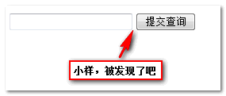

我们使用CSS更改非inline-block水平元素为inline-block水平，也会有该问题：

```javascript
.space a {
    display: inline-block;
    padding: .5em 1em;
    background-color: #cad5eb;
}
```

```javascript
<div class="space">
    <a href="##">惆怅</a>
    <a href="##">淡定</a>
    <a href="##">热血</a>
</div>
```

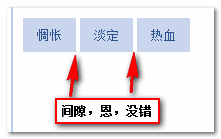

这种表现是符合规范的应该有的表现。

元素被当成行内元素排版的时候，元素之间的空白符（空格、回车换行等）都会被浏览器处理，根据white-space的处理方式（默认是normal，合并多余空白），原来HTML代码中的回车换行被转成一个空白符，在字体不为0的情况下，空白符占据一定宽度，所以inline-block的元素之间就出现了空隙。这些元素之间的间距会随着字体的大小而变化，当行内元素font-size:16px时，间距为8px。

不过，这类间距有时会对我们布局，或是兼容性处理产生影响，以下展示N种方法去掉。

二、方法之移除空格

元素间留白间距出现的原因就是标签段之间的空格，因此，去掉HTML中的空格，自然间距就木有了。考虑到代码可读性，显然连成一行的写法是不可取的，我们可以：

```javascript
<div class="space">
    <a href="##">
    惆怅</a><a href="##">
    淡定</a><a href="##">
    热血</a>
</div>
```

或者是：

```javascript
<div class="space">
    <a href="##">惆怅</a
    ><a href="##">淡定</a
    ><a href="##">热血</a>
</div>
```

或者是借助HTML注释：

```javascript
<div class="space">
    <a href="##">惆怅</a><!--
    --><a href="##">淡定</a><!--
    --><a href="##">热血</a>
</div>
```

三、使用margin负值

```javascript
.space a {
    display: inline-block;
    margin-right: -3px;
}
```

margin负值的大小与上下文的字体和文字大小相关：

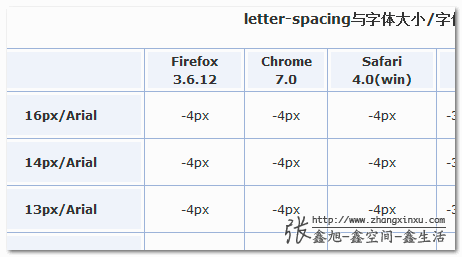

例如，对于12像素大小的上下文，Arial字体的`margin`负值为`-3`像素，Tahoma和Verdana就是`-4`像素，而Geneva为`-6`像素。

由于外部环境的不确定性，以及最后一个元素多出的父margin值等问题，这个方法不适合大规模使用。

四、让闭合标签吃胶囊

如下处理：

```javascript
<div class="space">
    <a href="##">惆怅
    <a href="##">淡定
    <a href="##">热血</a>
</div>
```

注意，为了向下兼容IE6/IE7等喝蒙牛长大的浏览器，最后一个列表的标签的结束（闭合）标签不能丢。

在HTML5中，我们直接：

```javascript
<div class="space">
    <a href="##">惆怅
    <a href="##">淡定
    <a href="##">热血
</div>
```

好吧，虽然感觉上有点怪怪的，但是，这是OK的。

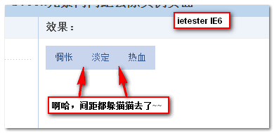

五、使用font-size:0

类似下面的代码：

```javascript
.space {
    font-size: 0;
}
.space a {
    font-size: 12px;
}
```

这个方法，基本上可以解决大部分浏览器下inline-block元素之间的间距(IE7等浏览器有时候会有1像素的间距)。

六、使用letter-spacing

类似下面的代码：

```javascript
.space {
    letter-spacing: -3px;
}
.space a {
    letter-spacing: 0;
}
```

根据我去年的测试，该方法可以搞定基本上所有浏览器。

七、使用word-spacing

类似下面代码：

```javascript
.space {
    word-spacing: -6px;
}
.space a {
    word-spacing: 0;
}
```

一个是字符间距(`letter-spacing`)一个是单词间距(`word-spacing`)，大同小异。据我测试，`word-spacing`的负值只要大到一定程度，其兼容性上的差异就可以被忽略。因为，貌似，`word-spacing`即使负值很大，也不会发生重叠。

与上面demo一样的效果，这里就不截图展示了。如果您使用Chrome浏览器，可能看到的是间距依旧存在。确实是有该问题，原因我是不清楚，不过我知道，可以添加`display: table;`或`display:inline-table;`让Chrome浏览器也变得乖巧。

```javascript
.space {
    display: inline-table;
    word-spacing: -6px;
}
```

八、其他成品方法

下面展示的是YUI 3 CSS Grids 使用`letter-spacing`和`word-spacing`去除格栅单元见间隔方法（注意，其针对的是block水平的元素，因此对IE8-浏览器做了hack处理）：

```javascript
.yui3-g {
    letter-spacing: -0.31em; /* webkit */
    *letter-spacing: normal; /* IE < 8 重置 */
    word-spacing: -0.43em; /* IE < 8 && gecko */
}

.yui3-u {
    display: inline-block;
    zoom: 1; *display: inline; /* IE < 8: 伪造 inline-block */
    letter-spacing: normal;
    word-spacing: normal;
    vertical-align: top;
}
```

以下是一个名叫RayM的人提供的方法：

```javascript
li {
    display:inline-block;
    background: orange;
    padding:10px;
    word-spacing:0;
    }
ul {
    width:100%;
    display:table;  /* 调教webkit*/
    word-spacing:-1em;
}

.nav li { *display:inline;}
```

也就是上面一系列CSS方法的组组合合。


***

## 4. grid网格布局是什么？


**参考答案：**

一、是什么

`Grid` 布局即网格布局，是一个二维的布局方式，由纵横相交的两组网格线形成的框架性布局结构，能够同时处理行与列

擅长将一个页面划分为几个主要区域，以及定义这些区域的大小、位置、层次等关系

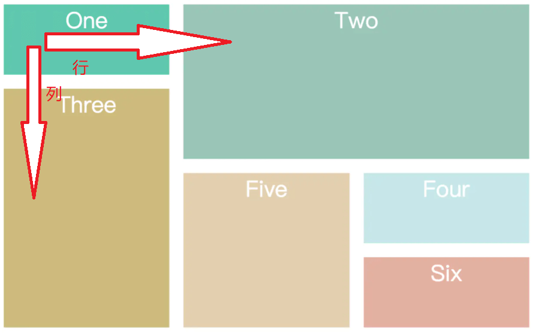

这与之前讲到的`flex`一维布局不相同

设置`display:grid/inline-grid`的元素就是网格布局容器，这样就能出发浏览器渲染引擎的网格布局算法

```javascript
<div class="container">
2    <div class="item item-1">
3        <p class="sub-item"></p >
4 </div>
5    <div class="item item-2"></div>
6    <div class="item item-3"></div>
7</div> 
```

上述代码实例中，`.container`元素就是网格布局容器，`.item`元素就是网格的项目，由于网格元素只能是容器的顶层子元素，所以`p`元素并不是网格元素

这里提一下，网格线概念，有助于下面对`grid-column`系列属性的理解

网格线，即划分网格的线，如下图所示：

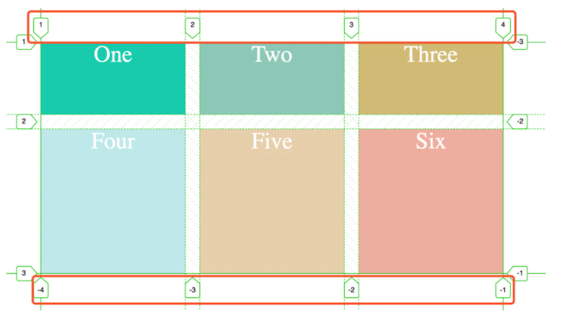

上图是一个 2 x 3 的网格，共有3根水平网格线和4根垂直网格线

二、属性

同样，`Grid` 布局属性可以分为两大类：

* 容器属性，

* 项目属性

关于容器属性有如下：

display 属性

文章开头讲到，在元素上设置`display：grid` 或 `display：inline-grid` 来创建一个网格容器

* display：grid 则该容器是一个块级元素

* display: inline-grid 则容器元素为行内元素

grid-template-columns 属性，grid-template-rows 属性

`grid-template-columns` 属性设置列宽，`grid-template-rows` 属性设置行高

```javascript
.wrapper {
2  display: grid;
3  /*  声明了三列，宽度分别为 200px 200px 200px */
4  grid-template-columns: 200px 200px 200px;
5  grid-gap: 5px;
6  /*  声明了两行，行高分别为 50px 50px  */
7  grid-template-rows: 50px 50px;
8}
```

以上表示固定列宽为 200px 200px 200px，行高为 50px 50px

上述代码可以看到重复写单元格宽高，通过使用`repeat()`函数，可以简写重复的值

* 第一个参数是重复的次数

* 第二个参数是重复的值

所以上述代码可以简写成

```javascript
.wrapper {
2  display: grid;
3  grid-template-columns: repeat(3,200px);
4  grid-gap: 5px;
5  grid-template-rows:repeat(2,50px);
6}
```

除了上述的`repeact`关键字，还有：

* auto-fill：示自动填充，让一行（或者一列）中尽可能的容纳更多的单元格

> `grid-template-columns: repeat(auto-fill, 200px)` 表示列宽是 200 px，但列的数量是不固定的，只要浏览器能够容纳得下，就可以放置元素

* fr：片段，为了方便表示比例关系

> `grid-template-columns: 200px 1fr 2fr` 表示第一个列宽设置为 200px，后面剩余的宽度分为两部分，宽度分别为剩余宽度的 1/3 和 2/3

* minmax：产生一个长度范围，表示长度就在这个范围之中都可以应用到网格项目中。第一个参数就是最小值，第二个参数就是最大值

> `minmax(100px, 1fr)`表示列宽不小于`100px`，不大于`1fr`

* auto：由浏览器自己决定长度

> `grid-template-columns: 100px auto 100px` 表示第一第三列为 100px，中间由浏览器决定长度

grid-row-gap 属性， grid-column-gap 属性， grid-gap 属性

`grid-row-gap` 属性、`grid-column-gap` 属性分别设置行间距和列间距。`grid-gap` 属性是两者的简写形式

`grid-row-gap: 10px` 表示行间距是 10px

`grid-column-gap: 20px` 表示列间距是 20px

`grid-gap: 10px 20px` 等同上述两个属性

grid-template-areas 属性

用于定义区域，一个区域由一个或者多个单元格组成

```javascript
.container {
2  display: grid;
3  grid-template-columns: 100px 100px 100px;
4  grid-template-rows: 100px 100px 100px;
5  grid-template-areas: 'a b c'
6                       'd e f'
7                       'g h i';
8}
```

上面代码先划分出9个单元格，然后将其定名为`a`到`i`的九个区域，分别对应这九个单元格。

多个单元格合并成一个区域的写法如下

```javascript
grid-template-areas: 'a a a'
2                     'b b b'
3                     'c c c';
```

上面代码将9个单元格分成`a`、`b`、`c`三个区域

如果某些区域不需要利用，则使用"点"（`.`）表示

grid-auto-flow 属性

划分网格以后，容器的子元素会按照顺序，自动放置在每一个网格。

顺序就是由`grid-auto-flow`决定，默认为行，代表"先行后列"，即先填满第一行，再开始放入第二行

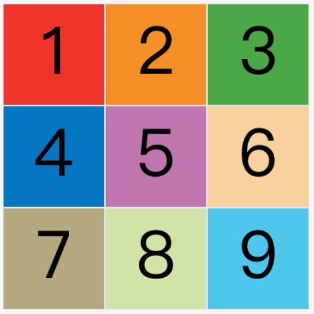

当修改成`column`后，放置变为如下：

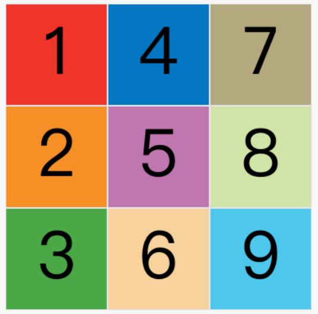

justify-items 属性， align-items 属性， place-items 属性

`justify-items` 属性设置单元格内容的水平位置（左中右），`align-items` 属性设置单元格的垂直位置（上中下）

两者属性的值完成相同

```javascript
.container {
2  justify-items: start | end | center | stretch;
3  align-items: start | end | center | stretch;
4}
```

属性对应如下：

* start：对齐单元格的起始边缘

* end：对齐单元格的结束边缘

* center：单元格内部居中

* stretch：拉伸，占满单元格的整个宽度（默认值）

`place-items`属性是`align-items`属性和`justify-items`属性的合并简写形式

justify-content 属性， align-content 属性， place-content 属性

`justify-content`属性是整个内容区域在容器里面的水平位置（左中右），`align-content`属性是整个内容区域的垂直位置（上中下）

```javascript
.container {
2  justify-content: start | end | center | stretch | space-around | space-between | space-evenly;
3  align-content: start | end | center | stretch | space-around | space-between | space-evenly;  
4}
```

两个属性的写法完全相同，都可以取下面这些值：

* start - 对齐容器的起始边框

* end - 对齐容器的结束边框

* center - 容器内部居中

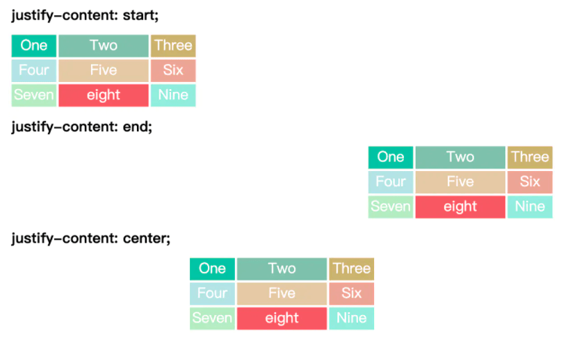

* space-around - 每个项目两侧的间隔相等。所以，项目之间的间隔比项目与容器边框的间隔大一倍

* space-between - 项目与项目的间隔相等，项目与容器边框之间没有间隔

* space-evenly - 项目与项目的间隔相等，项目与容器边框之间也是同样长度的间隔

* stretch - 项目大小没有指定时，拉伸占据整个网格容器

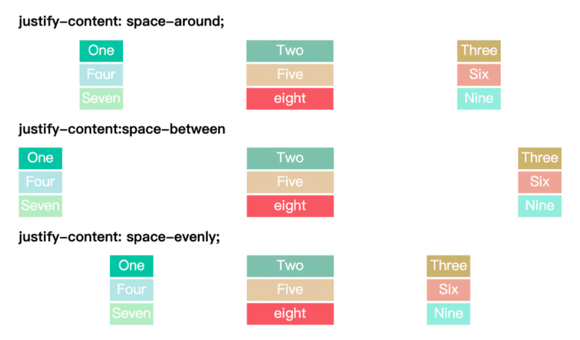

grid-auto-columns 属性和 grid-auto-rows 属性

有时候，一些项目的指定位置，在现有网格的外部，就会产生显示网格和隐式网格

比如网格只有3列，但是某一个项目指定在第5行。这时，浏览器会自动生成多余的网格，以便放置项目。超出的部分就是隐式网格

而`grid-auto-rows`与`grid-auto-columns`就是专门用于指定隐式网格的宽高

关于项目属性，有如下：

grid-column-start 属性、grid-column-end 属性、grid-row-start 属性以及grid-row-end 属性

指定网格项目所在的四个边框，分别定位在哪根网格线，从而指定项目的位置

* grid-column-start 属性：左边框所在的垂直网格线

* grid-column-end 属性：右边框所在的垂直网格线

* grid-row-start 属性：上边框所在的水平网格线

* grid-row-end 属性：下边框所在的水平网格线

举个例子：

```javascript
<style>
2    #container{
3        display: grid;
4        grid-template-columns: 100px 100px 100px;
5        grid-template-rows: 100px 100px 100px;
6    }
7    .item-1 {
8        grid-column-start: 2;
9        grid-column-end: 4;
10    }
11</style>
12
13<div id="container">
14    <div class="item item-1">1</div>
15    <div class="item item-2">2</div>
16    <div class="item item-3">3</div>
17</div>
```

通过设置`grid-column`属性，指定1号项目的左边框是第二根垂直网格线，右边框是第四根垂直网格线

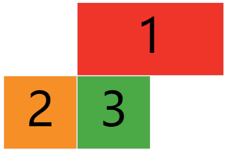

grid-area 属性

`grid-area` 属性指定项目放在哪一个区域

```javascript
.item-1 {
2  grid-area: e;
3}
```

意思为将1号项目位于`e`区域

与上述讲到的`grid-template-areas`搭配使用

justify-self 属性、align-self 属性以及 place-self 属性

`justify-self`属性设置单元格内容的水平位置（左中右），跟`justify-items`属性的用法完全一致，但只作用于单个项目。

`align-self`属性设置单元格内容的垂直位置（上中下），跟`align-items`属性的用法完全一致，也是只作用于单个项目

```javascript
.item {
2  justify-self: start | end | center | stretch;
3  align-self: start | end | center | stretch;
4}
```

这两个属性都可以取下面四个值。

* start：对齐单元格的起始边缘。

* end：对齐单元格的结束边缘。

* center：单元格内部居中。

* stretch：拉伸，占满单元格的整个宽度（默认值）

三、应用场景

文章开头就讲到，`Grid`是一个强大的布局，如一些常见的 CSS 布局，如居中，两列布局，三列布局等等是很容易实现的，在以前的文章中，也有使用`Grid`布局完成对应的功能

关于兼容性问题，结果如下：

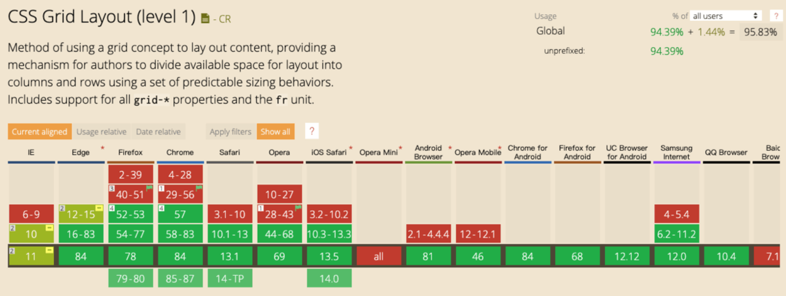

总体兼容性还不错，但在 IE 10 以下不支持

目前，`Grid`布局在手机端支持还不算太友好


***

## 5. CSS3新增了哪些特性？


**参考答案：**

一、是什么

`css`，即层叠样式表（Cascading Style Sheets）的简称，是一种标记语言，由浏览器解释执行用来使页面变得更美观

`css3`是`css`的最新标准，是向后兼容的，`CSS1/2 `的特性在` CSS3` 里都是可以使用的

而` CSS3` 也增加了很多新特性，为开发带来了更佳的开发体验

二、选择器

`css3`中新增了一些选择器，主要为如下图所示：

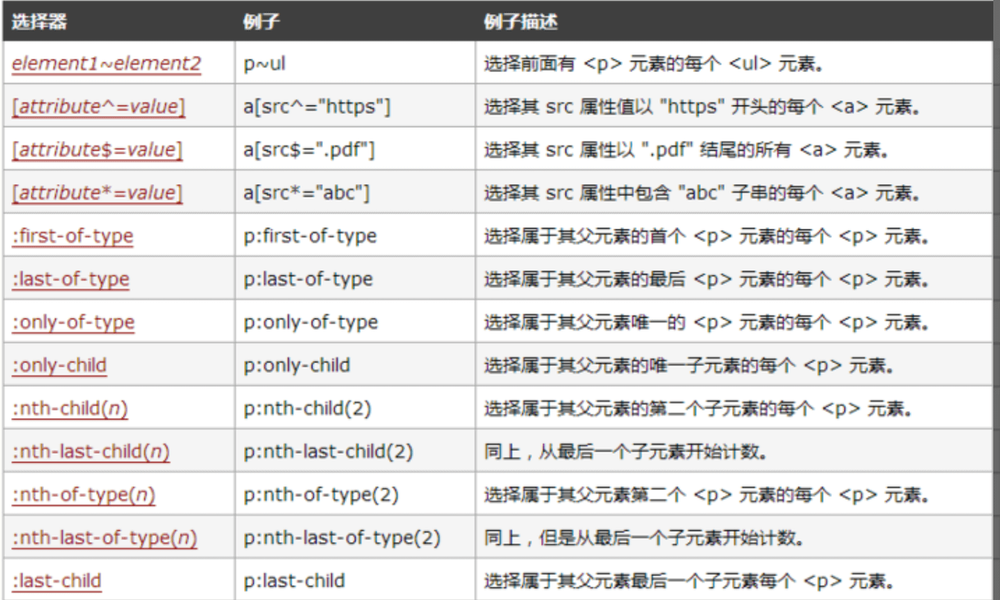

三、新样式

边框

`css3`新增了三个边框属性，分别是：

* border-radius：创建圆角边框

* box-shadow：为元素添加阴影

* border-image：使用图片来绘制边框

box-shadow

设置元素阴影，设置属性如下：

* 水平阴影

* 垂直阴影

* 模糊距离(虚实)

* 阴影尺寸(影子大小)

* 阴影颜色

* 内/外阴影

其中水平阴影和垂直阴影是必须设置的

背景

新增了几个关于背景的属性，分别是`background-clip`、`background-origin`、`background-size`和`background-break`

background-clip

用于确定背景画区，有以下几种可能的属性：

* background-clip: border-box; 背景从border开始显示

* background-clip: padding-box; 背景从padding开始显示

* background-clip: content-box; 背景显content区域开始显示

* background-clip: no-clip; 默认属性，等同于border-box

通常情况，背景都是覆盖整个元素的，利用这个属性可以设定背景颜色或图片的覆盖范围

background-origin

当我们设置背景图片时，图片是会以左上角对齐，但是是以`border`的左上角对齐还是以`padding`的左上角或者`content`的左上角对齐? `border-origin`正是用来设置这个的

* background-origin: border-box; 从border开始计算background-position

* background-origin: padding-box; 从padding开始计算background-position

* background-origin: content-box; 从content开始计算background-position

默认情况是`padding-box`，即以`padding`的左上角为原点

background-size

background-size属性常用来调整背景图片的大小，主要用于设定图片本身。有以下可能的属性：

* background-size: contain; 缩小图片以适合元素（维持像素长宽比）

* background-size: cover; 扩展元素以填补元素（维持像素长宽比）

* background-size: 100px 100px; 缩小图片至指定的大小

* background-size: 50% 100%; 缩小图片至指定的大小，百分比是相对包 含元素的尺寸

background-break

元素可以被分成几个独立的盒子（如使内联元素span跨越多行），`background-break` 属性用来控制背景怎样在这些不同的盒子中显示

* background-break: continuous; 默认值。忽略盒之间的距离（也就是像元素没有分成多个盒子，依然是一个整体一样）

* background-break: bounding-box; 把盒之间的距离计算在内；

* background-break: each-box; 为每个盒子单独重绘背景

文字

word-wrap

语法：`word-wrap: normal|break-word`

* normal：使用浏览器默认的换行

* break-all：允许在单词内换行

text-overflow

`text-overflow`设置或检索当当前行超过指定容器的边界时如何显示，属性有两个值选择：

* clip：修剪文本

* ellipsis：显示省略符号来代表被修剪的文本

text-shadow

`text-shadow`可向文本应用阴影。能够规定水平阴影、垂直阴影、模糊距离，以及阴影的颜色

text-decoration

CSS3里面开始支持对文字的更深层次的渲染，具体有三个属性可供设置：

* text-fill-color: 设置文字内部填充颜色

* text-stroke-color: 设置文字边界填充颜色

* text-stroke-width: 设置文字边界宽度

颜色

`css3`新增了新的颜色表示方式`rgba`与`hsla`

* rgba分为两部分，rgb为颜色值，a为透明度

* hala分为四部分，h为色相，s为饱和度，l为亮度，a为透明度

四、transition 过渡

`transition`属性可以被指定为一个或多个`CSS`属性的过渡效果，多个属性之间用逗号进行分隔，必须规定两项内容：

* 过度效果

* 持续时间

语法如下：

```javascript
transition： CSS属性，花费时间，效果曲线(默认ease)，延迟时间(默认0)
```

上面为简写模式，也可以分开写各个属性

```javascript
transition-property: width; 
2transition-duration: 1s;
3transition-timing-function: linear;
4transition-delay: 2s;
```

五、transform 转换

`transform`属性允许你旋转，缩放，倾斜或平移给定元素

`transform-origin`：转换元素的位置（围绕那个点进行转换），默认值为`(x,y,z):(50%,50%,0)`

使用方式：

* transform: translate(120px, 50%)：位移

* transform: scale(2, 0.5)：缩放

* transform: rotate(0.5turn)：旋转

* transform: skew(30deg, 20deg)：倾斜

六、animation 动画

动画这个平常用的也很多，主要是做一个预设的动画。和一些页面交互的动画效果，结果和过渡应该一样，让页面不会那么生硬

animation也有很多的属性

* animation-name：动画名称

* animation-duration：动画持续时间

* animation-timing-function：动画时间函数

* animation-delay：动画延迟时间

* animation-iteration-count：动画执行次数，可以设置为一个整数，也可以设置为infinite，意思是无限循环

* animation-direction：动画执行方向

* animation-paly-state：动画播放状态

* animation-fill-mode：动画填充模式

七、渐变

颜色渐变是指在两个颜色之间平稳的过渡，`css3`渐变包括

* linear-gradient：线性渐变

> background-image: linear-gradient(direction, color-stop1, color-stop2, ...);

* radial-gradient：径向渐变

> linear-gradient(0deg, red, green);

八、其他

关于`css3`其他的新特性还包括`flex`弹性布局、`Grid`栅格布局，这两个布局在以前就已经讲过，这里就不再展示

除此之外，还包括多列布局、媒体查询、混合模式等等......


***

## 6. 怎么使用 CSS3 实现动画？


**参考答案：**

一、是什么

CSS动画（CSS Animations）是为层叠样式表建议的允许可扩展标记语言（XML）元素使用CSS的动画的模块

即指元素从一种样式逐渐过渡为另一种样式的过程

常见的动画效果有很多，如平移、旋转、缩放等等，复杂动画则是多个简单动画的组合

`css`实现动画的方式，有如下几种：

* transition 实现渐变动画

* transform 转变动画

* animation 实现自定义动画

二、实现方式

transition 实现渐变动画

`transition`的属性如下：

* property:填写需要变化的css属性

* duration:完成过渡效果需要的时间单位(s或者ms)

* timing-function:完成效果的速度曲线

* delay: 动画效果的延迟触发时间

其中`timing-function`的值有如下：

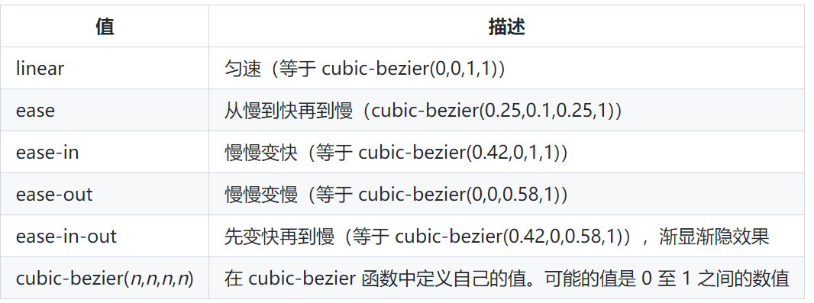

注意：并不是所有的属性都能使用过渡的，如`display:none<->display:block`

举个例子，实现鼠标移动上去发生变化动画效果

```javascript
<style>
2       .base {
3            width: 100px;
4            height: 100px;
5            display: inline-block;
6            background-color: #0EA9FF;
7            border-width: 5px;
8            border-style: solid;
9            border-color: #5daf34;
10            transition-property: width, height, background-color, border-width;
11            transition-duration: 2s;
12            transition-timing-function: ease-in;
13            transition-delay: 500ms;
14        }
1516        /*简写*/
17        /*transition: all 2s ease-in 500ms;*/
18        .base:hover {
19            width: 200px;
20            height: 200px;
21            background-color: #5daf34;
22            border-width: 10px;
23            border-color: #3a8ee6;
24        }
25</style>
26<div class="base"></div>
```

transform 转变动画

包含四个常用的功能：

* translate：位移

* scale：缩放

* rotate：旋转

* skew：倾斜

一般配合`transition`过度使用

注意的是，`transform`不支持`inline`元素，使用前把它变成`block`

举个例子

```javascript
<style>
2    .base {
3        width: 100px;
4        height: 100px;
5        display: inline-block;
6        background-color: #0EA9FF;
7        border-width: 5px;
8        border-style: solid;
9        border-color: #5daf34;
10        transition-property: width, height, background-color, border-width;
11        transition-duration: 2s;
12        transition-timing-function: ease-in;
13        transition-delay: 500ms;
14    }
15    .base2 {
16        transform: none;
17        transition-property: transform;
18        transition-delay: 5ms;
19    }
2021    .base2:hover {
22        transform: scale(0.8, 1.5) rotate(35deg) skew(5deg) translate(15px, 25px);
23    }
24</style>
25 <div class="base base2"></div>
```

可以看到盒子发生了旋转，倾斜，平移，放大

animation 实现自定义动画

`animation`是由 8 个属性的简写，分别如下：

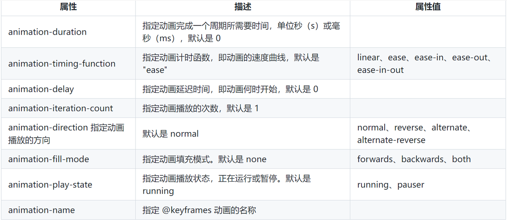

`CSS` 动画只需要定义一些关键的帧，而其余的帧，浏览器会根据计时函数插值计算出来，

通过 `@keyframes` 来定义关键帧

因此，如果我们想要让元素旋转一圈，只需要定义开始和结束两帧即可：

```javascript
@keyframes rotate{
2    from{
3        transform: rotate(0deg);
4    }
5    to{
6        transform: rotate(360deg);
7    }
8}
```

`from` 表示最开始的那一帧，`to` 表示结束时的那一帧

也可以使用百分比刻画生命周期

```javascript
@keyframes rotate{
2    0%{
3        transform: rotate(0deg);
4    }
5    50%{
6        transform: rotate(180deg);
7    }
8    100%{
9        transform: rotate(360deg);
10    }
11}
```

定义好了关键帧后，下来就可以直接用它了：

```javascript
animation: rotate 2s;
```

三、总结

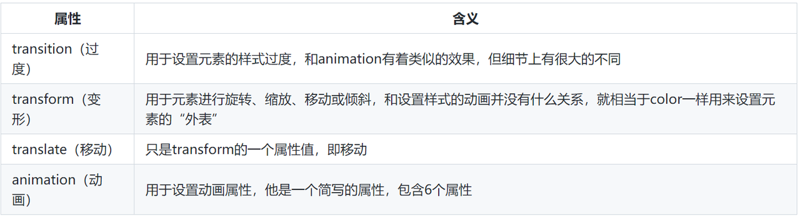


***


## 7. 怎么理解回流跟重绘？什么场景下会触发？


**参考答案：**

一、是什么

在`HTML`中，每个元素都可以理解成一个盒子，在浏览器解析过程中，会涉及到回流与重绘：

* 回流：布局引擎会根据各种样式计算每个盒子在页面上的大小与位置

* 重绘：当计算好盒模型的位置、大小及其他属性后，浏览器根据每个盒子特性进行绘制

具体的浏览器解析渲染机制如下所示：

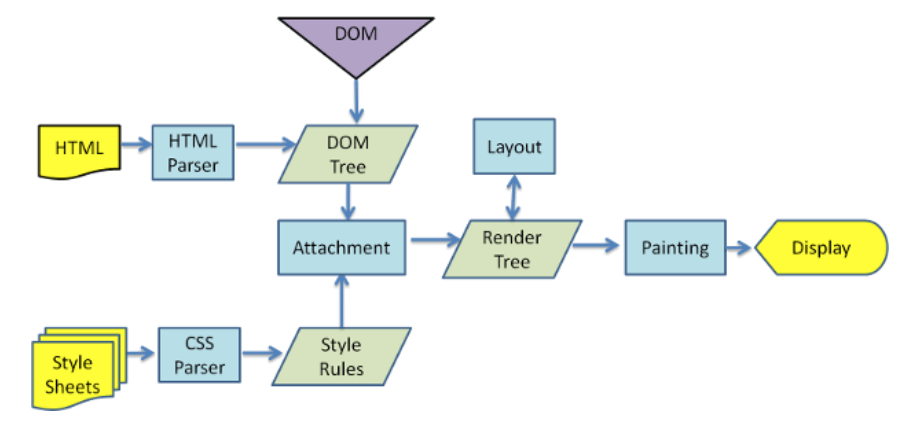

* 解析HTML，生成DOM树，解析CSS，生成CSSOM树

* 将DOM树和CSSOM树结合，生成渲染树(Render Tree)

* Layout(回流):根据生成的渲染树，进行回流(Layout)，得到节点的几何信息（位置，大小）

* Painting(重绘):根据渲染树以及回流得到的几何信息，得到节点的绝对像素

* Display:将像素发送给GPU，展示在页面上

在页面初始渲染阶段，回流不可避免的触发，可以理解成页面一开始是空白的元素，后面添加了新的元素使页面布局发生改变

当我们对 `DOM` 的修改引发了 `DOM `几何尺寸的变化（比如修改元素的宽、高或隐藏元素等）时，浏览器需要重新计算元素的几何属性，然后再将计算的结果绘制出来

当我们对 `DOM `的修改导致了样式的变化（`color`或`background-color`），却并未影响其几何属性时，浏览器不需重新计算元素的几何属性、直接为该元素绘制新的样式，这里就仅仅触发了重绘

二、如何触发

要想减少回流和重绘的次数，首先要了解回流和重绘是如何触发的

回流触发时机

回流这一阶段主要是计算节点的位置和几何信息，那么当页面布局和几何信息发生变化的时候，就需要回流，如下面情况：

* 添加或删除可见的DOM元素

* 元素的位置发生变化

* 元素的尺寸发生变化（包括外边距、内边框、边框大小、高度和宽度等）

* 内容发生变化，比如文本变化或图片被另一个不同尺寸的图片所替代

* 页面一开始渲染的时候（这避免不了）

* 浏览器的窗口尺寸变化（因为回流是根据视口的大小来计算元素的位置和大小的）

还有一些容易被忽略的操作：获取一些特定属性的值

> offsetTop、offsetLeft、 offsetWidth、offsetHeight、scrollTop、scrollLeft、scrollWidth、scrollHeight、clientTop、clientLeft、clientWidth、clientHeight

这些属性有一个共性，就是需要通过即时计算得到。因此浏览器为了获取这些值，也会进行回流

除此还包括`getComputedStyle `方法，原理是一样的

重绘触发时机

触发回流一定会触发重绘

可以把页面理解为一个黑板，黑板上有一朵画好的小花。现在我们要把这朵从左边移到了右边，那我们要先确定好右边的具体位置，画好形状（回流），再画上它原有的颜色（重绘）

除此之外还有一些其他引起重绘行为：

* 颜色的修改

* 文本方向的修改

* 阴影的修改

浏览器优化机制

由于每次重排都会造成额外的计算消耗，因此大多数浏览器都会通过队列化修改并批量执行来优化重排过程。浏览器会将修改操作放入到队列里，直到过了一段时间或者操作达到了一个阈值，才清空队列

当你获取布局信息的操作的时候，会强制队列刷新，包括前面讲到的`offsetTop`等方法都会返回最新的数据

因此浏览器不得不清空队列，触发回流重绘来返回正确的值

三、如何减少

我们了解了如何触发回流和重绘的场景，下面给出避免回流的经验：

* 如果想设定元素的样式，通过改变元素的 `class` 类名 (尽可能在 DOM 树的最里层)

* 避免设置多项内联样式

* 应用元素的动画，使用 `position` 属性的 `fixed` 值或 `absolute` 值(如前文示例所提)

* 避免使用 `table` 布局，`table` 中每个元素的大小以及内容的改动，都会导致整个 `table` 的重新计算

* 对于那些复杂的动画，对其设置 `position: fixed/absolute`，尽可能地使元素脱离文档流，从而减少对其他元素的影响

* 使用css3硬件加速，可以让`transform`、`opacity`、`filters`这些动画不会引起回流重绘

* 避免使用 CSS 的 `JavaScript` 表达式

在使用 `JavaScript` 动态插入多个节点时, 可以使用`DocumentFragment`. 创建后一次插入. 就能避免多次的渲染性能

但有时候，我们会无可避免地进行回流或者重绘，我们可以更好使用它们

例如，多次修改一个把元素布局的时候，我们很可能会如下操作

```javascript
const el = document.getElementById('el')
2for(let i=0;i<10;i++) {
3    el.style.top  = el.offsetTop  + 10 + "px";
4    el.style.left = el.offsetLeft + 10 + "px";
5}
```

每次循环都需要获取多次`offset`属性，比较糟糕，可以使用变量的形式缓存起来，待计算完毕再提交给浏览器发出重计算请求

```javascript
// 缓存offsetLeft与offsetTop的值
2const el = document.getElementById('el') 
3let offLeft = el.offsetLeft, offTop = el.offsetTop
4
5// 在JS层面进行计算
6for(let i=0;i<10;i++) {
7  offLeft += 10
8  offTop  += 10
9}
10
11// 一次性将计算结果应用到DOM上
12el.style.left = offLeft + "px"
13el.style.top = offTop  + "px"
```

我们还可避免改变样式，使用类名去合并样式

```javascript
const container = document.getElementById('container')
2container.style.width = '100px'
3container.style.height = '200px'
4container.style.border = '10px solid red'
5container.style.color = 'red'
```

使用类名去合并样式

```javascript
<style>
    .basic_style {
        width: 100px;
        height: 200px;
        border: 10px solid red;
        color: red;
    }
</style>
<script>
    const container = document.getElementById('container')
    container.classList.add('basic_style')
</script>
```

前者每次单独操作，都去触发一次渲染树更改（新浏览器不会），

都去触发一次渲染树更改，从而导致相应的回流与重绘过程

合并之后，等于我们将所有的更改一次性发出

我们还可以通过通过设置元素属性`display: none`，将其从页面上去掉，然后再进行后续操作，这些后续操作也不会触发回流与重绘，这个过程称为离线操作

```javascript
const container = document.getElementById('container')
container.style.width = '100px'
container.style.height = '200px'
container.style.border = '10px solid red'
container.style.color = 'red'
```

离线操作后

```javascript
let container = document.getElementById('container')
container.style.display = 'none'
container.style.width = '100px'
container.style.height = '200px'
container.style.border = '10px solid red'
container.style.color = 'red'
...（省略了许多类似的后续操作）
container.style.display = 'block'
```

***

## 8. 什么是响应式设计？响应式设计的基本原理是什么？如何进行实现？


**参考答案：**

一、是什么

响应式网站设计（Responsive Web design）是一种网络页面设计布局，页面的设计与开发应当根据用户行为以及设备环境(系统平台、屏幕尺寸、屏幕定向等)进行相应的响应和调整

描述响应式界面最著名的一句话就是“Content is like water”

大白话便是“如果将屏幕看作容器，那么内容就像水一样”

响应式网站常见特点：

* 同时适配PC + 平板 + 手机等

* 标签导航在接近手持终端设备时改变为经典的抽屉式导航

* 网站的布局会根据视口来调整模块的大小和位置

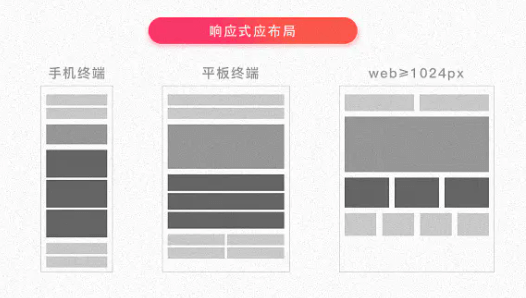

二、实现方式

响应式设计的基本原理是通过媒体查询检测不同的设备屏幕尺寸做处理，为了处理移动端，页面头部必须有`meta`声明`viewport`

```javascript
<meta name="viewport" content="width=device-width, initial-scale=1, maximum-scale=1, user-scalable=no”>
```

属性对应如下：

* width=device-width: 是自适应手机屏幕的尺寸宽度

* maximum-scale:是缩放比例的最大值

* inital-scale:是缩放的初始化

* user-scalable:是用户的可以缩放的操作

实现响应式布局的方式有如下：

* 媒体查询

* 百分比

* vw/vh

* rem

媒体查询

`CSS3 `中的增加了更多的媒体查询，就像`if`条件表达式一样，我们可以设置不同类型的媒体条件，并根据对应的条件，给相应符合条件的媒体调用相对应的样式表

使用`@Media`查询，可以针对不同的媒体类型定义不同的样式，如：

```javascript
@media screen and (max-width: 1920px) { ... }
```

当视口在375px - 600px之间，设置特定字体大小18px

```javascript
@media screen (min-width: 375px) and (max-width: 600px) {
  body {
    font-size: 18px;
  }
}
```

通过媒体查询，可以通过给不同分辨率的设备编写不同的样式来实现响应式的布局，比如我们为不同分辨率的屏幕，设置不同的背景图片

比如给小屏幕手机设置@2x图，为大屏幕手机设置@3x图，通过媒体查询就能很方便的实现

百分比

通过百分比单位 " % " 来实现响应式的效果

比如当浏览器的宽度或者高度发生变化时，通过百分比单位，可以使得浏览器中的组件的宽和高随着浏览器的变化而变化，从而实现响应式的效果

`height`、`width`属性的百分比依托于父标签的宽高，但是其他盒子属性则不完全依赖父元素：

* 子元素的top/left和bottom/right如果设置百分比，则相对于直接非static定位(默认定位)的父元素的高度/宽度

* 子元素的padding如果设置百分比，不论是垂直方向或者是水平方向，都相对于直接父亲元素的width，而与父元素的height无关。

* 子元素的margin如果设置成百分比，不论是垂直方向还是水平方向，都相对于直接父元素的width

* border-radius不一样，如果设置border-radius为百分比，则是相对于自身的宽度

可以看到每个属性都使用百分比，会照成布局的复杂度，所以不建议使用百分比来实现响应式

vw/vh

`vw`表示相对于视图窗口的宽度，`vh`表示相对于视图窗口高度。 任意层级元素，在使用`vw`单位的情况下，`1vw`都等于视图宽度的百分之一

与百分比布局很相似，在以前文章提过与`%`的区别，这里就不再展开述说

rem

在以前也讲到，`rem`是相对于根元素`html`的`font-size`属性，默认情况下浏览器字体大小为`16px`，此时`1rem = 16px`

可以利用前面提到的媒体查询，针对不同设备分辨率改变`font-size`的值，如下：

```javascript
@media screen and (max-width: 414px) {
  html {
    font-size: 18px
  }
}

@media screen and (max-width: 375px) {
  html {
    font-size: 16px
  }
}

@media screen and (max-width: 320px) {
  html {
    font-size: 12px
  }
}
```

为了更准确监听设备可视窗口变化，我们可以在`css`之前插入`script`标签，内容如下：

```javascript
//动态为根元素设置字体大小
function init () {
    // 获取屏幕宽度
    var width = document.documentElement.clientWidth
    // 设置根元素字体大小。此时为宽的10等分
    document.documentElement.style.fontSize = width / 10 + 'px'
}

//首次加载应用，设置一次
init()
// 监听手机旋转的事件的时机，重新设置
window.addEventListener('orientationchange', init)
// 监听手机窗口变化，重新设置
window.addEventListener('resize', init)
```

无论设备可视窗口如何变化，始终设置`rem`为`width`的1/10，实现了百分比布局

除此之外，我们还可以利用主流`UI`框架，如：`element ui`、`antd`提供的栅格布局实现响应式

小结

响应式设计实现通常会从以下几方面思考：

* 弹性盒子（包括图片、表格、视频）和媒体查询等技术

* 使用百分比布局创建流式布局的弹性UI，同时使用媒体查询限制元素的尺寸和内容变更范围

* 使用相对单位使得内容自适应调节

* 选择断点，针对不同断点实现不同布局和内容展示

三、总结

响应式布局优点可以看到：

* 面对不同分辨率设备灵活性强

* 能够快捷解决多设备显示适应问题

缺点：

* 仅适用布局、信息、框架并不复杂的部门类型网站

* 兼容各种设备工作量大，效率低下

* 代码累赘，会出现隐藏无用的元素，加载时间加长

* 其实这是一种折中性质的设计解决方案，多方面因素影响而达不到最佳效果

* 一定程度上改变了网站原有的布局结构，会出现用户混淆的情况


***

## 9. 如果使用CSS提高页面性能？


**参考答案：**

一、前言

每一个网页都离不开`css`，但是很多人又认为，`css`主要是用来完成页面布局的，像一些细节或者优化，就不需要怎么考虑，实际上这种想法是不正确的

作为页面渲染和内容展现的重要环节，`css`影响着用户对整个网站的第一体验

因此，在整个产品研发过程中，`css`性能优化同样需要贯穿全程


二、实现方式

实现方式有很多种，主要有如下：

* 内联首屏关键CSS

* 异步加载CSS

* 资源压缩

* 合理使用选择器

* 减少使用昂贵的属性

* 不要使用@import


内联首屏关键CSS

在打开一个页面，页面首要内容出现在屏幕的时间影响着用户的体验，而通过内联`css`关键代码能够使浏览器在下载完`html`后就能立刻渲染

而如果外部引用`css`代码，在解析`html`结构过程中遇到外部`css`文件，才会开始下载`css`代码，再渲染

所以，`CSS`内联使用使渲染时间提前

注意：但是较大的`css`代码并不合适内联（初始拥塞窗口、没有缓存），而其余代码则采取外部引用方式


异步加载CSS

在`CSS`文件请求、下载、解析完成之前，`CSS`会阻塞渲染，浏览器将不会渲染任何已处理的内容

前面加载内联代码后，后面的外部引用`css`则没必要阻塞浏览器渲染。这时候就可以采取异步加载的方案，主要有如下：

* 使用javascript将link标签插到head标签最后

```javascript
// 创建link标签
const myCSS = document.createElement( "link" );
myCSS.rel = "stylesheet";
myCSS.href = "mystyles.css";
// 插入到header的最后位置
document.head.insertBefore( myCSS, document.head.childNodes[ document.head.childNodes.length - 1 ].nextSibling );
```

* 设置link标签media属性为noexis，浏览器会认为当前样式表不适用当前类型，会在不阻塞页面渲染的情况下再进行下载。加载完成后，将`media`的值设为`screen`或`all`，从而让浏览器开始解析CSS

```javascript
<link rel="stylesheet" href="mystyles.css" media="noexist" onload="this.media='all'">
```

* 通过rel属性将link元素标记为alternate可选样式表，也能实现浏览器异步加载。同样别忘了加载完成之后，将rel设回stylesheet

```javascript
<link rel="alternate stylesheet" href="mystyles.css" onload="this.rel='stylesheet'">
```


资源压缩

利用`webpack`、`gulp/grunt`、`rollup`等模块化工具，将`css`代码进行压缩，使文件变小，大大降低了浏览器的加载时间


合理使用选择器

`css`匹配的规则是从右往左开始匹配，例如`#markdown .content h3`匹配规则如下：

* 先找到h3标签元素

* 然后去除祖先不是.content的元素

* 最后去除祖先不是#markdown的元素

如果嵌套的层级更多，页面中的元素更多，那么匹配所要花费的时间代价自然更高

所以我们在编写选择器的时候，可以遵循以下规则：

* 不要嵌套使用过多复杂选择器，最好不要三层以上

* 使用id选择器就没必要再进行嵌套

* 通配符和属性选择器效率最低，避免使用


减少使用昂贵的属性

在页面发生重绘的时候，昂贵属性如`box-shadow`/`border-radius`/`filter`/透明度/`:nth-child`等，会降低浏览器的渲染性能


不要使用@import

css样式文件有两种引入方式，一种是`link`元素，另一种是`@import`

`@import`会影响浏览器的并行下载，使得页面在加载时增加额外的延迟，增添了额外的往返耗时

而且多个`@import`可能会导致下载顺序紊乱

比如一个css文件`index.css`包含了以下内容：`@import url("reset.css")`

那么浏览器就必须先把`index.css`下载、解析和执行后，才下载、解析和执行第二个文件`reset.css`


其他

* 减少重排操作，以及减少不必要的重绘

* 了解哪些属性可以继承而来，避免对这些属性重复编写

* cssSprite，合成所有icon图片，用宽高加上backgroud-position的背景图方式显现出我们要的icon图，减少了http请求

* 把小的icon图片转成base64编码

* CSS3动画或者过渡尽量使用transform和opacity来实现动画，不要使用left和top属性


总结

`css`实现性能的方式可以从选择器嵌套、属性特性、减少`http`这三面考虑，同时还要注意`css`代码的加载顺序

***

## 10. 如何实现单行／多行文本溢出的省略样式？


**参考答案：**


一、前言

在日常开发展示页面，如果一段文本的数量过长，受制于元素宽度的因素，有可能不能完全显示，为了提高用户的使用体验，这个时候就需要我们把溢出的文本显示成省略号

对于文本的溢出，我们可以分成两种形式：

* 单行文本溢出

* 多行文本溢出


二、实现方式


单行文本溢出省略

理解也很简单，即文本在一行内显示，超出部分以省略号的形式展现

实现方式也很简单，涉及的`css`属性有：

* text-overflow：规定当文本溢出时，显示省略符号来代表被修剪的文本

* white-space：设置文字在一行显示，不能换行

* overflow：文字长度超出限定宽度，则隐藏超出的内容

`overflow`设为`hidden`，普通情况用在块级元素的外层隐藏内部溢出元素，或者配合下面两个属性实现文本溢出省略

`white-space:nowrap`，作用是设置文本不换行，是`overflow:hidden`和`text-overflow：ellipsis`生效的基础

`text-overflow`属性值有如下：

* clip：当对象内文本溢出部分裁切掉

* ellipsis：当对象内文本溢出时显示省略标记（...）

`text-overflow`只有在设置了`overflow:hidden`和`white-space:nowrap`才能够生效的

举个例子

```javascript
<style>
    p{
        overflow: hidden;
        line-height: 40px;
        width:400px;
        height:40px;
        border:1px solid red;
        text-overflow: ellipsis;
        white-space: nowrap;
    }
</style>
<p 这是一些文本这是一些文本这是一些文本这是一些文本这是一些文本这是一些文本这是一些文本这是一些文本这是一些文本这是一些文本</p >
```

效果如下：

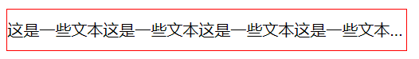

可以看到，设置单行文本溢出较为简单，并且省略号显示的位置较好


多行文本溢出省略

多行文本溢出的时候，我们可以分为两种情况：

* 基于高度截断

* 基于行数截断


基于高度截断


伪元素 + 定位

核心的`css`代码结构如下：

* position: relative：为伪元素绝对定位

* overflow: hidden：文本溢出限定的宽度就隐藏内容）

* position: absolute：给省略号绝对定位

* line-height: 20px：结合元素高度,高度固定的情况下,设定行高, 控制显示行数

* height: 40px：设定当前元素高度

* ::after {} ：设置省略号样式

代码如下所示：

```javascript
<style>
    .demo {
        position: relative;
        line-height: 20px;
        height: 40px;
        overflow: hidden;
    }
    .demo::after {
        content: "...";
        position: absolute;
        bottom: 0;
        right: 0;
        padding: 0 20px 0 10px;
    }
</style>

<body>
    <div class='demo'>这是一段很长的文本</div>
</body>
```

实现原理很好理解，就是通过伪元素绝对定位到行尾并遮住文字，再通过 `overflow: hidden` 隐藏多余文字

这种实现具有以下优点：

* 兼容性好，对各大主流浏览器有好的支持

* 响应式截断，根据不同宽度做出调整

一般文本存在英文的时候，可以设置`word-break: break-all`使一个单词能够在换行时进行拆分


基于行数截断

纯`css`实现也非常简单，核心的`css`代码如下：

* -webkit-line-clamp: 2：用来限制在一个块元素显示的文本的行数，为了实现该效果，它需要组合其他的WebKit属性）

* display: -webkit-box：和1结合使用，将对象作为弹性伸缩盒子模型显示

* -webkit-box-orient: vertical：和1结合使用 ，设置或检索伸缩盒对象的子元素的排列方式

* overflow: hidden：文本溢出限定的宽度就隐藏内容

* text-overflow: ellipsis：多行文本的情况下，用省略号“…”隐藏溢出范围的文本

```javascript
<style>
    p {
        width: 400px;
        border-radius: 1px solid red;
        -webkit-line-clamp: 2;
        display: -webkit-box;
        -webkit-box-orient: vertical;
        overflow: hidden;
        text-overflow: ellipsis;
    }
</style>
<p>
    这是一些文本这是一些文本这是一些文本这是一些文本这是一些文本
    这是一些文本这是一些文本这是一些文本这是一些文本这是一些文本
</p >
```

可以看到，上述使用了`webkit`的`CSS`属性扩展，所以兼容浏览器范围是`PC`端的`webkit`内核的浏览器，由于移动端大多数是使用`webkit`，所以移动端常用该形式

需要注意的是，如果文本为一段很长的英文或者数字，则需要添加`word-wrap: break-word`属性

还能通过使用`javascript`实现配合`css`，实现代码如下所示：

css结构如下：

```javascript
p {
    position: relative;
    width: 400px;
    line-height: 20px;
    overflow: hidden;

}
.p-after:after{
    content: "..."; 
    position: absolute; 
    bottom: 0; 
    right: 0; 
    padding-left: 40px;
    background: -webkit-linear-gradient(left, transparent, #fff 55%);
    background: -moz-linear-gradient(left, transparent, #fff 55%);
    background: -o-linear-gradient(left, transparent, #fff 55%);
    background: linear-gradient(to right, transparent, #fff 55%);
}
```

javascript代码如下：

```javascript
$(function(){
 //获取文本的行高，并获取文本的高度，假设我们规定的行数是五行，那么对超过行数的部分进行限制高度，并加上省略号
   $('p').each(function(i, obj){
        var lineHeight = parseInt($(this).css("line-height"));
        var height = parseInt($(this).height());
        if((height / lineHeight) >3 ){
            $(this).addClass("p-after")
            $(this).css("height","60px");
        }else{
            $(this).removeClass("p-after");
        }
    });
})
```


***

## 11. 如何使用css完成视差滚动效果?

**参考答案：**

是什么

视差滚动（Parallax Scrolling）是指多层背景以不同的速度移动，形成立体的运动效果，带来非常出色的视觉体验

我们可以把网页解刨成：背景层、内容层、悬浮层

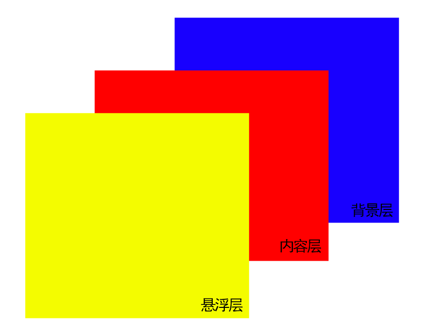

当滚动鼠标滑轮的时候，各个图层以不同的速度移动，形成视觉差的效果


实现方式

使用`css`形式实现视觉差滚动效果的方式有：

* background-attachment

* transform:translate3D


background-attachment

作用是设置背景图像是否固定或者随着页面的其余部分滚动

值分别有如下：

* scroll：默认值，背景图像会随着页面其余部分的滚动而移动

* fixed：当页面的其余部分滚动时，背景图像不会移动

* inherit：继承父元素background-attachment属性的值

完成滚动视觉差就需要将`background-attachment`属性设置为`fixed`，让背景相对于视口固定。及时一个元素有滚动机制，背景也不会随着元素的内容而滚动

也就是说，背景一开始就已经被固定在初始的位置

核心的`css`代码如下：

```javascript
section {
    height: 100vh;
}

.g-img {
    background-image: url(...);
    background-attachment: fixed;
    background-size: cover;
    background-position: center center;
}
```

整体例子如下：

```javascript
<style>
div {
            height: 100vh;
            background: rgba(0, 0, 0, .7);
            color: #fff;
            line-height: 100vh;
            text-align: center;
            font-size: 20vh;
        }

        .a-img1 {
            background-image: url(https://images.pexels.com/photos/1097491/pexels-photo-1097491.jpeg);
            background-attachment: fixed;
            background-size: cover;
            background-position: center center;
        }

        .a-img2 {
            background-image: url(https://images.pexels.com/photos/2437299/pexels-photo-2437299.jpeg);
            background-attachment: fixed;
            background-size: cover;
            background-position: center center;
        }

        .a-img3 {
            background-image: url(https://images.pexels.com/photos/1005417/pexels-photo-1005417.jpeg);
            background-attachment: fixed;
            background-size: cover;
            background-position: center center;
        }
</style>
 <div class="a-text">1</div>
    <div class="a-img1">2</div>
    <div class="a-text">3</div>
    <div class="a-img2">4</div>
    <div class="a-text">5</div>
    <div class="a-img3">6</div>
    <div class="a-text">7</div>
```


transform:translate3D

同样，让我们先来看一下两个概念`transform`和`perspective`：

* transform: css3 属性，可以对元素进行变换(2d/3d)，包括平移 translate,旋转 rotate,缩放 scale,等等

* perspective: css3 属性，当元素涉及 3d 变换时，perspective 可以定义我们眼睛看到的 3d 立体效果，即空间感

`3D`视角示意图如下所示：

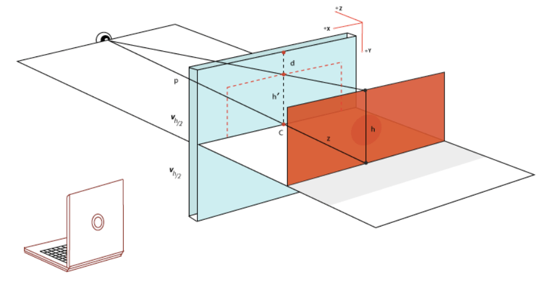

举个例子：

```javascript
<style>
    html {
        overflow: hidden;
        height: 100%
    }

    body {
        /* 视差元素的父级需要3D视角 */
        perspective: 1px;
        transform-style: preserve-3d; 
        height: 100%;
        overflow-y: scroll;
        overflow-x: hidden;
    }
    #app{
        width: 100vw;
        height:200vh;
        background:skyblue;
        padding-top:100px;
    }
    .one{
        width:500px;
        height:200px;
        background:#409eff;
        transform: translateZ(0px);
        margin-bottom: 50px;
    }
    .two{
        width:500px;
        height:200px;
        background:#67c23a;
        transform: translateZ(-1px);
        margin-bottom: 150px;
    }
    .three{
        width:500px;
        height:200px;
        background:#e6a23c;
        transform: translateZ(-2px);
        margin-bottom: 150px;
    }
</style>
<div id="app">
    <div class="one">one</div>
    <div class="two">two</div>
    <div class="three">three</div>
</div>
```

而这种方式实现视觉差动的原理如下：

* 容器设置上 transform-style: preserve-3d 和 perspective: xpx，那么处于这个容器的子元素就将位于3D空间中，

* 子元素设置不同的 transform: translateZ()，这个时候，不同元素在 3D Z轴方向距离屏幕（我们的眼睛）的距离也就不一样

* 滚动滚动条，由于子元素设置了不同的 transform: translateZ()，那么他们滚动的上下距离 translateY 相对屏幕（我们的眼睛），也是不一样的，这就达到了滚动视差的效果


***


## 12. 怎么使用 CSS 如何画一个三角形


**参考答案：**


一、前言

在前端开发的时候，我们有时候会需要用到一个三角形的形状，比如地址选择或者播放器里面播放按钮

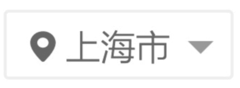

通常情况下，我们会使用图片或者`svg`去完成三角形效果图，但如果单纯使用`css`如何完成一个三角形呢？

实现过程似乎也并不困难，通过边框就可完成


二、实现过程

在以前也讲过盒子模型，默认情况下是一个矩形，实现也很简单

```javascript
<style>
    .border {
        width: 50px;
        height: 50px;
        border: 2px solid;
        border-color: #96ceb4 #ffeead #d9534f #ffad60;
    }
</style>
<div class="border"></div>
```

效果如下图所示：

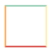

将`border`设置`50px`，效果图如下所示：


白色区域则为`width`、`height`，这时候只需要你将白色区域部分宽高逐渐变小，最终变为0，则变成如下图所示：


这时候就已经能够看到4个不同颜色的三角形，如果需要下方三角形，只需要将上、左、右边框设置为0就可以得到下方的红色三角形


但这种方式，虽然视觉上是实现了三角形，但实际上，隐藏的部分任然占据部分高度，需要将上方的宽度去掉

最终实现代码如下：

```javascript
.border {
    width: 0;
    height: 0;
    border-style:solid;
    border-width: 0 50px 50px;
    border-color: transparent transparent #d9534f;
}
```

如果想要实现一个只有边框是空心的三角形，由于这里不能再使用`border`属性，所以最直接的方法是利用伪类新建一个小一点的三角形定位上去

```bash
.border {
    width: 0;
    height: 0;
    border-style:solid;
    border-width: 0 50px 50px;
    border-color: transparent transparent #d9534f;
    position: relative;
}
.border:after{
    content: '';
    border-style:solid;
    border-width: 0 40px 40px;
    border-color: transparent transparent #96ceb4;
    position: absolute;
    top: 0;
    left: 0;
}
```

效果图如下所示：

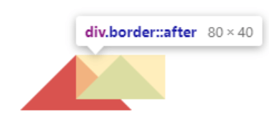

伪类元素定位参照对象的内容区域宽高都为0，则内容区域即可以理解成中心一点，所以伪元素相对中心这点定位

将元素定位进行微调以及改变颜色，就能够完成下方效果图：

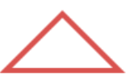

最终代码如下：

```javascript
.border:after {
    content: '';
    border-style: solid;
    border-width: 0 40px 40px;
    border-color: transparent transparent #96ceb4;
    position: absolute;
    top: 6px;
    left: -40px;
}
```


三、原理分析

可以看到，边框是实现三角形的部分，边框实际上并不是一个直线，如果我们将四条边设置不同的颜色，将边框逐渐放大，可以得到每条边框都是一个梯形

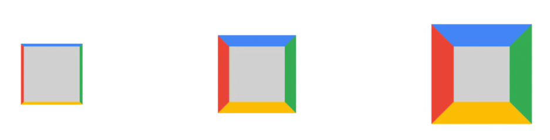

当分别取消边框的时候，发现下面几种情况：

* 取消一条边的时候，与这条边相邻的两条边的接触部分会变成直的

* 当仅有邻边时， 两个边会变成对分的三角

* 当保留边没有其他接触时，极限情况所有东西都会消失

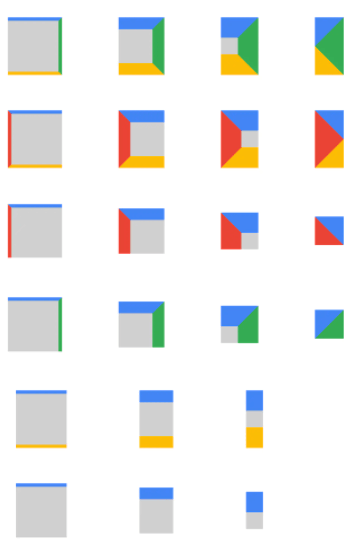

通过上图的变化规则，利用旋转、隐藏，以及设置内容宽高等属性，就能够实现其他类型的三角形

如设置直角三角形，如上图倒数第三行实现过程，我们就能知道整个实现原理

实现代码如下：

```javascript
.box {
    /* 内部大小 */
    width: 0px;
    height: 0px;
    /* 边框大小 只设置两条边*/
    border-top: #4285f4 solid;
    border-right: transparent solid;
    border-width: 85px; 
    /* 其他设置 */
    margin: 50px;
}
```


***

## 13. 说说对 CSS 工程化的理解


**参考答案：**

CSS 工程化是为了解决以下问题：

1. 宏观设计：CSS 代码如何组织、如何拆分、模块结构怎样设计？

2. 编码优化：怎样写出更好的 CSS？

3. 构建：如何处理我的 CSS，才能让它的打包结果最优？

4. 可维护性：代码写完了，如何最小化它后续的变更成本？如何确保任何一个同事都能轻松接手？

以下三个方向都是时下比较流行的、普适性非常好的 CSS 工程化实践：

* 预处理器：Less、 Sass 等；

* 重要的工程化插件： PostCss；

* Webpack loader 等 。

基于这三个方向，可以衍生出一些具有典型意义的子问题，这里我们逐个来看：

（1）预处理器：为什么要用预处理器？它的出现是为了解决什么问题？

预处理器，其实就是 CSS 世界的“轮子”。预处理器支持我们写一种类似 CSS、但实际并不是 CSS 的语言，然后把它编译成 CSS 代码：

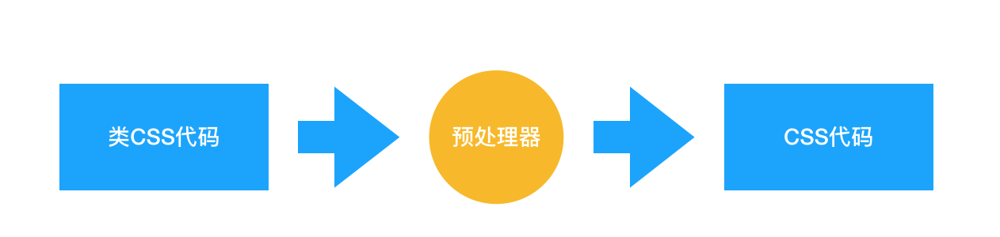

那为什么写 CSS 代码写得好好的，偏偏要转去写“类 CSS”呢？这就和本来用 JS 也可以实现所有功能，但最后却写 React 的 jsx 或者 Vue 的模板语法一样。

随着前端业务复杂度的提高，前端工程中对 CSS 提出了以下的诉求：

1. 宏观设计上：我们希望能优化 CSS 文件的目录结构，对现有的 CSS 文件实现复用；

2. 编码优化上：我们希望能写出结构清晰、简明易懂的 CSS，需要它具有一目了然的嵌套层级关系，而不是无差别的一铺到底写法；我们希望它具有变量特征、计算能力、循环能力等等更强的可编程性，这样我们可以少写一些无用的代码；

3. 可维护性上：更强的可编程性意味着更优质的代码结构，实现复用意味着更简单的目录结构和更强的拓展能力，这两点如果能做到，自然会带来更强的可维护性。

这三点是传统 CSS 所做不到的，也正是预处理器所解决掉的问题。预处理器普遍会具备这样的特性：

* 嵌套代码的能力，通过嵌套来反映不同 css 属性之间的层级关系 ；

* 支持定义 css 变量；

* 提供计算函数；

* 允许对代码片段进行 extend 和 mixin；

* 支持循环语句的使用；

* 支持将 CSS 文件模块化，实现复用。

（2）PostCss：PostCss 是如何工作的？我们在什么场景下会使用 PostCss？

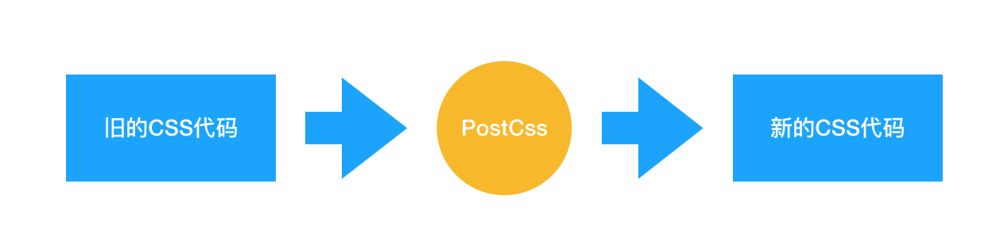

它和预处理器的不同就在于，预处理器处理的是 类CSS，而 PostCss 处理的就是 CSS 本身。Babel 可以将高版本的 JS 代码转换为低版本的 JS 代码。PostCss 做的是类似的事情：它可以编译尚未被浏览器广泛支持的先进的 CSS 语法，还可以自动为一些需要额外兼容的语法增加前缀。更强的是，由于 PostCss 有着强大的插件机制，支持各种各样的扩展，极大地强化了 CSS 的能力。

PostCss 在业务中的使用场景非常多：

* 提高 CSS 代码的可读性：PostCss 其实可以做类似预处理器能做的工作；

* 当我们的 CSS 代码需要适配低版本浏览器时，PostCss 的 [Autoprefixer](https://github.com/postcss/autoprefixer) 插件可以帮助我们自动增加浏览器前缀；

* 允许我们编写面向未来的 CSS：PostCss 能够帮助我们编译 CSS next 代码；

（3）Webpack 能处理 CSS 吗？如何实现？

* Webpack 在裸奔的状态下，是不能处理 CSS 的，Webpack 本身是一个面向 JavaScript 且只能处理 JavaScript 代码的模块化打包工具；

* Webpack 在 loader 的辅助下，是可以处理 CSS 的。

如何用 Webpack 实现对 CSS 的处理：

* Webpack 中操作 CSS 需要使用的两个关键的 loader：css-loader 和 style-loader

* 注意，答出“用什么”有时候可能还不够，面试官会怀疑你是不是在背答案，所以你还需要了解每个 loader 都做了什么事情：

  * css-loader：导入 CSS 模块，对 CSS 代码进行编译处理；

  * style-loader：创建style标签，把 CSS 内容写入标签。

在实际使用中，css-loader 的执行顺序一定要安排在 style-loader 的前面。因为只有完成了编译过程，才可以对 css 代码进行插入；若提前插入了未编译的代码，那么 webpack 是无法理解这坨东西的，它会无情报错。


***


## 14. 怎么触发BFC，BFC有什么应用场景？


**参考答案：**

文档流

在介绍BFC之前，需要先给大家介绍一下文档流。

我们常说的文档流其实分为`定位流`、`浮动流`、`普通流`三种。


绝对定位(Absolute positioning)

如果元素的属性 `position` 为 `absolute` 或 `fixed`，它就是一个绝对定位元素。

在绝对定位布局中，元素会整体脱离普通流，因此绝对定位元素不会对其兄弟元素造成影响，而元素具体的位置由绝对定位的坐标决定。

它的定位相对于它的包含块，相关CSS属性：`top`、`bottom`、`left`、`right`；

对于 `position: absolute`，元素定位将相对于上级元素中最近的一个`relative、fixed、absolute`，如果没有则相对于body；

对于 `position:fixed`，正常来说是相对于浏览器窗口定位的，但是当元素祖先的 `transform` 属性非 `none` 时，会相对于该祖先进行定位。


浮动 (float)

在浮动布局中，元素首先按照普通流的位置出现，然后根据浮动的方向尽可能的向左边或右边偏移，其效果与印刷排版中的文本环绕相似。


普通流 (normal flow)

普通流其实就是指BFC中的FC。FC(Formatting Context)，直译过来是格式化上下文，它是页面中的一块渲染区域，有一套渲染规则，决定了其子元素如何布局，以及和其他元素之间的关系和作用。

在普通流中，元素按照其在 HTML 中的先后位置至上而下布局，在这个过程中，行内元素水平排列，直到当行被占满然后换行。块级元素则会被渲染为完整的一个新行。

除非另外指定，否则所有元素默认都是普通流定位，也可以说，普通流中元素的位置由该元素在 HTML 文档中的位置决定。


BFC 概念

先看下MDN上关于BFC的定义：

> 块格式化上下文（`Block Formatting Context`，`BFC`） 是Web页面的可视CSS渲染的一部分，是块盒子的布局过程发生的区域，也是浮动元素与其他元素交互的区域。

具有 `BFC` 特性的元素可以看作是隔离了的独立容器，容器里面的元素不会在布局上影响到外面的元素，并且 `BFC` 具有普通容器所没有的一些特性。

通俗一点来讲，可以把 `BFC` 理解为一个封闭的大箱子，箱子内部的元素无论如何翻江倒海，都不会影响到外部。

除了 BFC，还有：

* `IFC`（行级格式化上下文）- `inline` 内联

* `GFC`（网格布局格式化上下文）- `display: grid`

* `FFC`（自适应格式化上下文）- `display: flex`或`display: inline-flex`

注意：同一个元素不能同时存在于两个 `BFC` 中。


BFC的触发方式

MDN上对于[BFC的触发条件](https://developer.mozilla.org/zh-CN/docs/Web/Guide/CSS/Block_formatting_context)写的很多，总结一下常见的触发方式有（只需要满足一个条件即可触发 BFC 的特性）：

* 根元素，即 `<html>`

* 浮动元素：`float` 值为 `left` 、`right`

* `overflow` 值不为 `visible`，即为 `auto`、`scroll`、`hidden`

* `display` 值为 `inline-block`、`table-cell`、`table-caption`、`table`、`inline-table`、`flex`、`inline-flex`、`grid`、`inline-grid`

* 绝对定位元素：`position` 值为 `absolute`、`fixed`


BFC的特性

* BFC 是页面上的一个独立容器，容器里面的子元素不会影响外面的元素。

* BFC 内部的块级盒会在垂直方向上一个接一个排列

* 同一 BFC 下的相邻块级元素可能发生外边距折叠，创建新的 BFC 可以避免外边距折叠

* 每个元素的外边距盒（`margin box`）的左边与包含块边框盒（`border box`）的左边相接触（从右向左的格式的话，则相反），即使存在浮动

* 浮动盒的区域不会和 BFC 重叠

* 计算 BFC 的高度时，浮动元素也会参与计算


应用

BFC是页面上的一个隔离的独立容器，容器里面的子元素不会影响到外面元素，反之亦然。我们可以利用BFC的这个特性来做很多事。


自适应两列布局

左列浮动（定宽或不定宽都可以），给右列开启 BFC。

```javascript
<div>
    <div class="left">浮动元素，无固定宽度</div>
    <div class="right">自适应</div>
</div>
```

```javascript
* {
    margin: 0;
    padding: 0;
}
.left {
    float: left;
    height: 200px;
    margin-right: 10px;
    background-color: red;
}
.right {
    overflow: hidden;
    height: 200px;
    background-color: yellow;
}
```

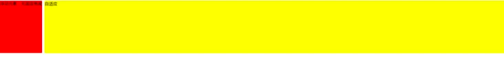

* 将左列设为左浮动，将自身高度塌陷，使得其它块级元素可以和它占据同一行的位置。

* 右列为 div 块级元素，利用其自身的流特性占满整行。

* 右列设置overflow: hidden,触发 BFC 特性，使其自身与左列的浮动元素隔离开，不占满整行。

这即是上面说的 BFC 的特性之一：浮动盒的区域不会和 BFC 重叠


防止外边距（margin）重叠

兄弟元素之间的外边距重叠

```javascript
<div>
    <div class="child1"></div>
    <div class="child2"></div>
</div>
```

```javascript
* {
    margin: 0;
    padding: 0;
}
.child1 {
    width: 100px;
    height: 100px;
    margin-bottom: 10px;
    background-color: red;
}
.child2 {
    width: 100px;
    height: 100px;
    margin-top: 20px;
    background-color: green;
}
```

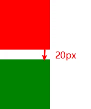

两个块级元素，红色 div 距离底部 10px，绿色 div 距离顶部 20px，按道理应该两个块级元素相距 30px 才对，但实际却是取距离较大的一个，即 20px。

> 块级元素的上外边距和下外边距有时会合并（或折叠）为一个外边距，其大小取其中的较大者，这种行为称为外边距折叠（重叠），注意这个是发生在属于同一 BFC 下的块级元素之间

根据 BFC 特性，创建一个新的 BFC 就不会发生 margin 折叠了。比如我们在他们两个 div 外层再包裹一层容器，加属性 `overflow: hidden`，触发 BFC，那么两个 div 就不属于同个 BFC 了。

```javascript
<div>
    <div class="parent">
        <div class="child1"></div>
    </div>
    <div class="parent">
        <div class="child2"></div>
    </div>
</div>
```

```javascript
.parent {
    overflow: hidden;
}

/* ... */
```

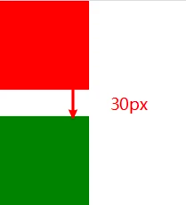

这个关于兄弟元素外边距叠加的问题，除了触发 BFC 也有其他方案，比如你统一只用上边距或下边距，就不会有上面的问题。


父子元素的外边距重叠

这种情况存在父元素与其第一个或最后一个子元素之间（嵌套元素）。

如果在父元素与其第一个/最后一个子元素之间不存在边框、内边距、行内内容，也没有创建块格式化上下文、或者清除浮动将两者的外边距 分开，此时子元素的外边距会“溢出”到父元素的外面。

```javascript
<div id="parent">
  <div id="child"></div>
</div>
```

```javascript
* {
    margin: 0;
    padding: 0;
}
#parent {
    width: 200px;
    height: 200px;
    background-color: green;
    margin-top: 20px;
}
#child {
    width: 100px;
    height: 100px;
    background-color: red;
    margin-top: 30px;
}
```

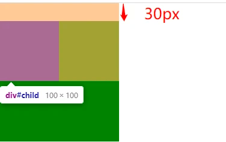

如上图，红色的 div 在绿色的 div 内部，且设置了 `margin-top` 为 30px，但我们发现红色 div 的顶部与绿色 div 顶部重合，并没有距离顶部 30px，而是溢出到父元素的外面计算。即本来父元素距离顶部只有 20px，被子元素溢出影响，外边距重叠，取较大的值，则距离顶部 30px。

解决办法：

* 给父元素触发 BFC（如添加overflow: hidden）

* 给父元素添加 border

* 给父元素添加 padding

这样就能实现我们期望的效果了：

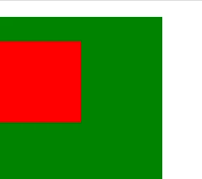


清除浮动解决令父元素高度坍塌的问题

当容器内子元素设置浮动时，脱离了文档流，容器中总父元素高度只有边框部分高度。

```javascript
<div class="parent">
  <div class="child"></div>
</div>
```

```javascript
* {
    margin: 0;
    padding: 0;
}
.parent {
    border: 4px solid red;
}
.child {
    float: left;
    width: 200px;
    height: 200px;
    background-color: blue;
}
```

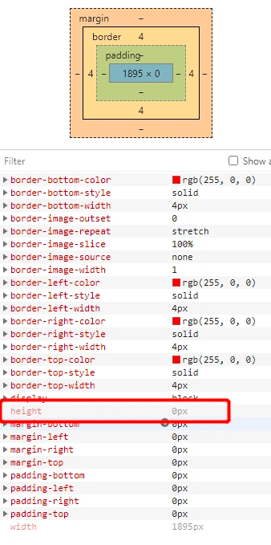

解决办法：给父元素触发 BFC，使其有 BFC 特性：计算 BFC 的高度时，浮动元素也会参与计算

```javascript
.parent {
    overflow: hidden;
    border: 4px solid red;
}
```

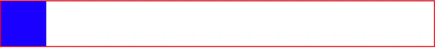

上面我们都是用的 `overflow: hidden` 触发 BFC，因为确实常用，但是触发 BFC 也不止是只有这一种方法。

如上面写的所示，可以设置`float: left;`，`float: right;`，`display: inline-block;`，`overflow: auto;`，`display: flex;`，`display: table;`，`position` 为 `absolute` 或 `fixed` 等等，这些都可以触发，不过父元素宽度表现不一定相同，但父元素高度都被撑出来了。

当然实际运用可不是随便挑一个走，还是根据场景选择。


***

## 15. 单行文本怎么实现两端对齐？


**参考答案：**

说起两端对齐，大家首先想到的可能是 `text-align: justify;`，但justify对最后一行无效。

通常这样的排版对整段文字是极好的，我们并不希望当最后一行只有两个字时也两端对齐，毕竟这是不便于阅读的，那么当我们只有一行文本，但要实现单行文本两端对齐怎么解决？


方法一：添加一行

根据justify对最后一行无效，我们可以新增一行，使该行文本不是最后一行，实现如下：

```javascript
//html
<div class="item">
    <span class="label" >\{{item.label\}}</span>：
    <span class="value">\{{item.value\}}</span>
</div>
```

```javascript
//scss
.item {
    height: 32px;
    line-height: 32px;
    margin-bottom: 8px;
    .label {
        display: inline-block;
        height: 100%;
        width: 100px;
        text-align: justify;
        vertical-align: top;
        &::after {
            display: inline-block;
            width: 100%;
            content: '';
            height: 0;
        }
    }
    .value {
        padding-right: 10px;
    }
}
```


方法二： text-align-last

text-align-last，该属性定义的是一段文本中最后一行在被强制换行之前的对齐规则。

```javascript
//scss
.item {
    margin-bottom: 8px;
    .label {
        display: inline-block;
        height: 100%;
        min-width: 100px;
        text-align: justify;
        text-align-last: justify;
    }
    .value {
        padding-right: 10px;
    }
}
```

现在的浏览器基本都支持该属性。

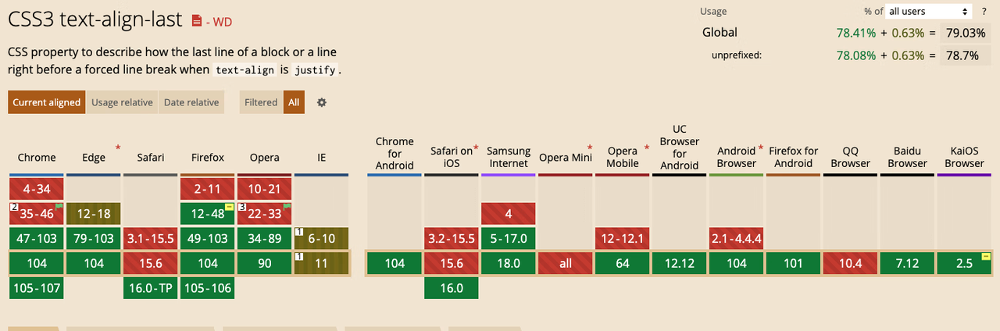


***

## 16. 说说你对 CSS 模块化的理解


**参考答案：**

CSS 发展

我们在书写 css 的时候其实经历了以下几个阶段：

* 手写源生 CSS

* 使用预处理器 Sass/Less

* 使用后处理器 PostCSS

* 使用 css modules

* 使用 css in js


手写源生 CSS

在我们最初学习写页面的时候，大家都学过怎么去写 css，也就以下几种情况：

* 行内样式，即直接在 html 中的 style 属性里编写 css 代码。

* 内嵌样式，即在 html h 中的 style 标签内编写 class，提供给当前页面使用。

* 导入样式，即在内联样式中 通过 @import 方法，导入其他样式，提供给当前页面使用。

* 外部样式，即使用 html 中的 link 标签，加载样式，提供给当前页面使用。

我们在不断摸索中，逐渐形成了以编写内嵌样式和外部样式为主要的编写习惯。

读到这里大家肯定有所疑问，为什么不建议使用行内样式？

> 使用行内样式的缺点
>
> * 样式不能复用。
>
> * 样式权重太高，样式不好覆盖。
>
> * 表现层与结构层没有分离。
>
> * 不能进行缓存，影响加载效率。

然后我们继续剖析一下，为什么不建议使用导入样式？

经测试，在 css 中使用 @import 会有以下两种情况：

1、在 IE6-8 下，@import 声明指向的样式表并不会与页面其他资源并发加载，而是等页面所有资源加载完成后才开始下载。

2、如果在 link 标签中去 @import 其他 css，页面会等到所有资源加载完成后，才开始解析 link 标签中 @import 的 css。

> 使用导入样式的缺点
>
> * 导入样式，只能放在 style 标签的第一行，放其他行则会无效。
>
> * @import 声明的样式表不能充分利用浏览器并发请求资源的行为，其加载行为往往会延后触发或被其他资源加载挂起。
>
> * 由于 @import 样式表的延后加载，可能会导致页面样式闪烁。


使用预处理器 Sass/Less

随着时间的不断发展，我们逐渐发现，编写源生的 css 其实并不友好，例如：源生的 css 不支持变量，不支持嵌套，不支持父选择器等等，这些种种问题，催生出了像 sass/less 这样的预处理器。

预处理器主要是强化了 css 的语法，弥补了上文说了这些问题，但本质上，打包出来的结果和源生的 css 都是一样的，只是对开发者友好，写起来更顺滑。


后处理器 PostCSS

随着前端工程化的不断发展，越来越多的工具被前端大佬们开发出来，愿景是把所有的重复性的工作都交给机器去做，在 css 领域就产生了 postcss。

postcss 可以称作为 css 界的 babel，它的实现原理是通过 ast 去分析我们的 css 代码，然后将分析的结果进行处理，从而衍生出了许多种处理 css 的使用场景。

常用的 postcss 使用场景有：

* 配合 stylelint 校验 css 语法

* 自动增加浏览器前缀 autoprefixer

* 编译 css next 的语法


CSS 模块化迅速发展

随着 react、vue 等基于模块化的框架的普及使用，我们编写源生 css 的机会也越来越少。我们常常将页面拆分成许多个小组件，然后像搭积木一样将多个小组件组成最终呈现的页面。

但是我们知道，css 是根据类名去匹配元素的，如果有两个组件使用了一个相同的类名，后者就会把前者的样式给覆盖掉，看来解决样式命名的冲突是个大问题。

为了解决这个问题，产生出了 CSS 模块化的概念。


CSS 模块化定义

* 你是否为 class 命名而感到苦恼？

* 你是否有怕跟别人使用同样 class 名而感到担忧？

* 你是否因层级结构不清晰而感到烦躁？

* 你是否因代码难以复用而感到不爽？

* 你是否因为 common.css 的庞大而感到恐惧？

你如果遇到如上问题，那么就很有必要使用 css 模块化。

***

## 17. CSS 模块化的实现方式


**参考答案：**


BEM 命名规范

BEM 的意思就是块（block）、元素（element）、修饰符（modifier）。是由 Yandex 团队提出的一种前端命名方法论。这种巧妙的命名方法让你的 css 类对其他开发者来说更加透明而且更有意义。

BEM 的命名规范如下：

```javascript
/* 块即是通常所说的 Web 应用开发中的组件或模块。每个块在逻辑上和功能上都是相互独立的。 */
.block {
}

/* 元素是块中的组成部分。元素不能离开块来使用。BEM 不推荐在元素中嵌套其他元素。 */
.block__element {
}

/* 修饰符用来定义块或元素的外观和行为。同样的块在应用不同的修饰符之后，会有不同的外观 */
.block--modifier {
}复制代码
```

通过 bem 的命名方式，可以让我们的 css 代码层次结构清晰，通过严格的命名也可以解决命名冲突的问题，但也不能完全避免，毕竟只是一个命名约束，不按规范写照样能运行。


CSS Modules

CSS Modules 指的是我们像 import js 一样去引入我们的 css 代码，代码中的每一个类名都是引入对象的一个属性，通过这种方式，即可在使用时明确指定所引用的 css 样式。

并且 CSS Modules 在打包的时候会自动将类名转换成 hash 值，完全杜绝 css 类名冲突的问题。

使用方式如下：

1、定义 css 文件。

```javascript
.className {
  color: green;
}
/* 编写全局样式 */
:global(.className) {
  color: red;
}

/* 样式复用 */
.otherClassName {
  composes: className;
  color: yellow;
}

.otherClassName {
  composes: className from "./style.css";
}
```

2、在 js 模块中导入 css 文件。

```javascript
import styles from "./style.css";

element.innerHTML = '<div class="' + styles.className + '">';
```

3、配置 css-loader 打包。

CSS Modules 不能直接使用，而是需要进行打包，一般通过配置 css-loader 中的 modules 属性即可完成 css modules 的配置。

```javascript
// webpack.config.js
module.exports = {
  module: {
    rules: [
      {
        test: /\.css$/,
        use:{
          loader: 'css-loader',
          options: {
            modules: {
              // 自定义 hash 名称
              localIdentName: '[path][name]__[local]--[hash:base64:5]',
            }
          }
       }
    ]
  }
};
```

4、最终打包出来的 css 类名就是由一长串 hash 值生成。

```javascript
._2DHwuiHWMnKTOYG45T0x34 {
  color: red;
}

._10B-buq6_BEOTOl9urIjf8 {
  background-color: blue;
}
```


CSS In JS

CSS in JS，意思就是使用 js 语言写 css，完全不需要些单独的 css 文件，所有的 css 代码全部放在组件内部，以实现 css 的模块化。

CSS in JS 其实是一种编写思想，目前已经有超过 40 多种方案的实现，最出名的是 styled-components。

使用方式如下：

```javascript
import React from "react";
import styled from "styled-components";

// 创建一个带样式的 h1 标签
const Title = styled.h1`
  font-size: 1.5em;
  text-align: center;
  color: palevioletred;
`;

// 创建一个带样式的 section 标签
const Wrapper = styled.section`
  padding: 4em;
  background: papayawhip;
`;

// 通过属性动态定义样式
const Button = styled.button`
  background: ${props => (props.primary ? "palevioletred" : "white")};
  color: ${props => (props.primary ? "white" : "palevioletred")};

  font-size: 1em;
  margin: 1em;
  padding: 0.25em 1em;
  border: 2px solid palevioletred;
  border-radius: 3px;
`;

// 样式复用
const TomatoButton = styled(Button)`
  color: tomato;
  border-color: tomato;
`;

<Wrapper>
  <Title>Hello World, this is my first styled component!</Title>
  <Button primary>Primary</Button>
</Wrapper>;
```

可以看到，我们直接在 js 中编写 css，案例中在定义源生 html 时就创建好了样式，在使用的时候就可以渲染出带样式的组件了。

除此之外，还有其他比较出名的库：

* emotion

* radium

* glamorous


总结

最后放一张总结好的图。


***

## 18. 怎么让Chrome支持小于12px 的文字？


**参考答案：**

在默认情况下，Chrome 浏览器的最小字体大小限制为 12px，因此无法直接设置小于 12px 的文字大小。然而，可以通过以下方法绕过这个限制：

1. 使用缩放比例：可以使用 CSS 的 `transform` 属性来缩放文本元素以达到小于 12px 的效果。例如，使用 `transform: scale(0.8)` 将文本缩放为 80% 的原始大小。请注意，这可能会导致文本外观变得模糊或失真。

```javascript
.small-text {
  transform: scale(0.8);
}
```

* 使用 zoom：将容器或文本元素的 zoom 属性设置为小于 1 的值，例如 zoom: 0.8;。这会缩小文本元素及其容器，使得文本看起来更小。请注意，zoom 是非标准的 CSS 属性，不一定在所有浏览器中都有效。

```javascript
.small-text {
  zoom: 0.8;
}
```

* 使用 -webkit-text-size-adjust：将容器或文本元素的 -webkit-text-size-adjust 属性设置为 "none" 或 "auto" 可以控制 Chrome 浏览器对文本大小的调整行为。通过将其设置为 "none"，可以禁用 Chrome 浏览器的最小字体大小限制。请注意，-webkit-text-size-adjust 是针对 WebKit 内核（包括 Chrome 和 Safari）的私有属性。

```javascript
.small-text {
  -webkit-text-size-adjust: none;
}
```

* 使用图片替代：如果需要应用较小的文字大小，并且无法使用缩放，可以将文本转换为图像，并将其作为背景图像或内联图像插入到元素中。这样可以绕过浏览器的最小字体大小限制。但要注意，这将增加页面加载时间并且不利于可访问性和响应式设计。

```javascript
<div class="small-text">
  
</div>
```


***

## 19. 怎么让Chrome支持小于12px 的文字？


**参考答案：**

在默认情况下，Chrome 浏览器的最小字体大小限制为 12px，因此无法直接设置小于 12px 的文字大小。然而，可以通过以下方法绕过这个限制：

1. 使用缩放比例：可以使用 CSS 的 `transform` 属性来缩放文本元素以达到小于 12px 的效果。例如，使用 `transform: scale(0.8)` 将文本缩放为 80% 的原始大小。请注意，这可能会导致文本外观变得模糊或失真。

```javascript
.small-text {
  transform: scale(0.8);
}
```

* 使用 zoom：将容器或文本元素的 zoom 属性设置为小于 1 的值，例如 zoom: 0.8;。这会缩小文本元素及其容器，使得文本看起来更小。请注意，zoom 是非标准的 CSS 属性，不一定在所有浏览器中都有效。

```javascript
.small-text {
  zoom: 0.8;
}
```

* 使用 -webkit-text-size-adjust：将容器或文本元素的 -webkit-text-size-adjust 属性设置为 "none" 或 "auto" 可以控制 Chrome 浏览器对文本大小的调整行为。通过将其设置为 "none"，可以禁用 Chrome 浏览器的最小字体大小限制。请注意，-webkit-text-size-adjust 是针对 WebKit 内核（包括 Chrome 和 Safari）的私有属性。

```javascript
.small-text {
  -webkit-text-size-adjust: none;
}
```

* 使用图片替代：如果需要应用较小的文字大小，并且无法使用缩放，可以将文本转换为图像，并将其作为背景图像或内联图像插入到元素中。这样可以绕过浏览器的最小字体大小限制。但要注意，这将增加页面加载时间并且不利于可访问性和响应式设计。

```javascript
<div class="small-text">
  
</div>
```


***

## 20. flexbox（弹性盒布局模型）是什么，适用什么场景？


**参考答案：**

Flexbox（弹性盒布局模型）是一种用于创建灵活且自适应的网页布局的 CSS 模块。它提供了一种在容器和其子元素之间建立灵活关系的方式，以实现多个元素的对齐、分布和调整大小。


适用场景

* 等高的多列布局：Flexbox 可以轻松创建等高的多列布局，使得每一列的高度相等，无论其内容的长度如何。

* 水平和垂直居中：Flexbox 提供了强大的对齐和居中功能，可以在容器中轻松实现水平和垂直居中元素。

* 自适应布局：Flexbox 具有弹性特性，可以根据可用空间自动调整项目的大小和位置，从而实现自适应的布局。

* 等间距的分布：通过使用 Flexbox 的 `justify-content` 和 `align-items` 属性，可以轻松地在容器中创建等间距的分布，使项目之间具有相等的间距。

* 响应式布局：Flexbox 是响应式设计的有力工具，可以通过简单的 CSS 更改来构建适应不同屏幕尺寸和设备类型的布局。


总结

Flexbox 是一种强大的 CSS 布局模块，适用于创建各种灵活和自适应的网页布局。它可以解决传统布局方式中的很多问题，并提供了更强大的对齐、居中和分布控制功能，使开发者能够更轻松地实现复杂的布局需求。


***

## 21. 如何实现两栏布局，右侧自适应？三栏布局中间自适应呢？


**参考答案：**


一、背景

在日常布局中，无论是两栏布局还是三栏布局，使用的频率都非常高


两栏布局

两栏布局实现效果就是将页面分割成左右宽度不等的两列，宽度较小的列设置为固定宽度，剩余宽度由另一列撑满，

比如 `Ant Design` 文档，蓝色区域为主要内容布局容器，侧边栏为次要内容布局容器

> 这里称宽度较小的列父元素为次要布局容器，宽度较大的列父元素为主要布局容器

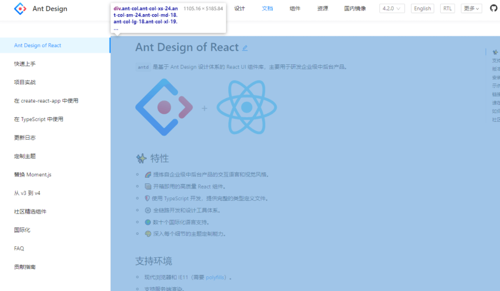

这种布局适用于内容上具有明显主次关系的网页


三栏布局

三栏布局按照左中右的顺序进行排列，通常中间列最宽，左右两列次之

大家最常见的就是`github`：

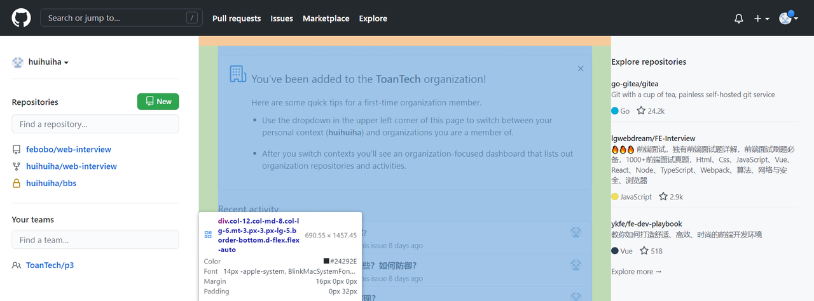


二、双栏布局

双栏布局非常常见，往往是以一个定宽栏和一个自适应的栏并排展示存在

实现思路也非常的简单：

* 使用 float 左浮左边栏

* 右边模块使用 margin-left 撑出内容块做内容展示

* 为父级元素添加BFC，防止下方元素飞到上方内容

代码如下：

```javascript
<style>
    .box{
        overflow: hidden; 添加BFC
    }
    .left {
        float: left;
        width: 200px;
        background-color: gray;
        height: 400px;
    }
    .right {
        margin-left: 210px;
        background-color: lightgray;
        height: 200px;
    }
</style>
<div class="box">
    <div class="left">左边</div>
    <div class="right">右边</div>
</div>
```

还有一种更为简单的使用则是采取：flex弹性布局


flex弹性布局

```javascript
<style>
    .box{
        display: flex;
    }
    .left {
        width: 100px;
    }
    .right {
        flex: 1;
    }
</style>
<div class="box">
    <div class="left">左边</div>
    <div class="right">右边</div>
</div>
```

`flex`可以说是最好的方案了，代码少，使用简单

注意的是，`flex`容器的一个默认属性值:`align-items: stretch;`

这个属性导致了列等高的效果。 为了让两个盒子高度自动，需要设置: `align-items: flex-start`


三、三栏布局

实现三栏布局中间自适应的布局方式有：

* 两边使用 float，中间使用 margin

* 两边使用 absolute，中间使用 margin

* 两边使用 float 和负 margin

* display: table 实现

* flex实现

* grid网格布局


两边使用 float，中间使用 margin

需要将中间的内容放在`html`结构最后，否则右侧会臣在中间内容的下方

实现代码如下：

```javascript
<style>
    .wrap {
        background: #eee;
        overflow: hidden; <!-- 生成BFC，计算高度时考虑浮动的元素 -->
        padding: 20px;
        height: 200px;
    }
    .left {
        width: 200px;
        height: 200px;
        float: left;
        background: coral;
    }
    .right {
        width: 120px;
        height: 200px;
        float: right;
        background: lightblue;
    }
    .middle {
        margin-left: 220px;
        height: 200px;
        background: lightpink;
        margin-right: 140px;
    }
</style>
<div class="wrap">
    <div class="left">左侧</div>
    <div class="right">右侧</div>
    <div class="middle">中间</div>
</div>
```

原理如下：

* 两边固定宽度，中间宽度自适应。

* 利用中间元素的margin值控制两边的间距

* 宽度小于左右部分宽度之和时，右侧部分会被挤下去

这种实现方式存在缺陷：

* 主体内容是最后加载的。

* 右边在主体内容之前，如果是响应式设计，不能简单的换行展示


两边使用 absolute，中间使用 margin

基于绝对定位的三栏布局：注意绝对定位的元素脱离文档流，相对于最近的已经定位的祖先元素进行定位。无需考虑HTML中结构的顺序

```javascript
<style>
  .container {
    position: relative;
  }
  
  .left,
  .right,
  .main {
    height: 200px;
    line-height: 200px;
    text-align: center;
  }

  .left {
    position: absolute;
    top: 0;
    left: 0;
    width: 100px;
    background: green;
  }

  .right {
    position: absolute;
    top: 0;
    right: 0;
    width: 100px;
    background: green;
  }

  .main {
    margin: 0 110px;
    background: black;
    color: white;
  }
</style>

<div class="container">
  <div class="left">左边固定宽度</div>
  <div class="right">右边固定宽度</div>
  <div class="main">中间自适应</div>
</div>
```

实现流程：

* 左右两边使用绝对定位，固定在两侧。

* 中间占满一行，但通过 margin和左右两边留出10px的间隔


两边使用 float 和负 margin

```javascript
<style>
  .left,
  .right,
  .main {
    height: 200px;
    line-height: 200px;
    text-align: center;
  }

  .main-wrapper {
    float: left;
    width: 100%;
  }

  .main {
    margin: 0 110px;
    background: black;
    color: white;
  }

  .left,
  .right {
    float: left;
    width: 100px;
    margin-left: -100%;
    background: green;
  }

  .right {
    margin-left: -100px; /* 同自身宽度 */
  }
</style>

<div class="main-wrapper">
  <div class="main">中间自适应</div>
</div>
<div class="left">左边固定宽度</div>
<div class="right">右边固定宽度</div>
```

实现过程：

* 中间使用了双层标签，外层是浮动的，以便左中右能在同一行展示

* 左边通过使用负 margin-left:-100%，相当于中间的宽度，所以向上偏移到左侧

* 右边通过使用负 margin-left:-100px，相当于自身宽度，所以向上偏移到最右侧

缺点：

* 增加了 .main-wrapper 一层，结构变复杂

* 使用负 margin，调试也相对麻烦


使用 display: table 实现

`<table>` 标签用于展示行列数据，不适合用于布局。但是可以使用 `display: table` 来实现布局的效果

```javascript
<style>
  .container {
    height: 200px;
    line-height: 200px;
    text-align: center;
    display: table;
    table-layout: fixed;
    width: 100%;
  }

  .left,
  .right,
  .main {
    display: table-cell;
  }

  .left,
  .right {
    width: 100px;
    background: green;
  }

  .main {
    background: black;
    color: white;
    width: 100%;
  }
</style>

<div class="container">
  <div class="left">左边固定宽度</div>
  <div class="main">中间自适应</div>
  <div class="right">右边固定宽度</div>
</div>
```

实现原理：

* 层通过 display: table设置为表格，设置 table-layout: fixed\`表示列宽自身宽度决定，而不是自动计算。

* 内层的左中右通过 display: table-cell设置为表格单元。

* 左右设置固定宽度，中间设置 width: 100% 填充剩下的宽度


使用flex实现

利用`flex`弹性布局，可以简单实现中间自适应

代码如下：

```javascript
<style type="text/css">
    .wrap {
        display: flex;
        justify-content: space-between;
    }

    .left,
    .right,
    .middle {
        height: 100px;
    }

    .left {
        width: 200px;
        background: coral;
    }

    .right {
        width: 120px;
        background: lightblue;
    }

    .middle {
        background: #555;
        width: 100%;
        margin: 0 20px;
    }
</style>
<div class="wrap">
    <div class="left">左侧</div>
    <div class="middle">中间</div>
    <div class="right">右侧</div>
</div>
```

实现过程：

* 仅需将容器设置为`display:flex;`，

* 盒内元素两端对其，将中间元素设置为`100%`宽度，或者设为`flex:1`，即可填充空白

* 盒内元素的高度撑开容器的高度

优点：

* 结构简单直观

* 可以结合 flex的其他功能实现更多效果，例如使用 order属性调整显示顺序，让主体内容优先加载，但展示在中间


grid网格布局

代码如下：

```javascript
<style>
    .wrap {
        display: grid;
        width: 100%;
        grid-template-columns: 300px auto 300px;
    }

    .left,
    .right,
    .middle {
        height: 100px;
    }

    .left {
        background: coral;
    }

    .right {
        width: 300px;
        background: lightblue;
    }

    .middle {
        background: #555;
    }
</style>
<div class="wrap">
    <div class="left">左侧</div>
    <div class="middle">中间</div>
    <div class="right">右侧</div>
</div>
```

跟`flex`弹性布局一样的简单


***

## 22. 设备像素、css像素、设备独立像素、dpr、ppi 之间有什么区别？


**参考答案：**

设备像素、CSS 像素、设备独立像素 (DIP)、设备像素比 (DPR) 和每英寸像素密度 (PPI) 是与屏幕分辨率和显示质量相关的概念。它们之间的区别如下：

* 设备像素：设备像素是物理屏幕上的最小可见单元，用于实际渲染图像或文本。它表示硬件像素点的数量，通常用于描述屏幕的分辨率。设备像素的数量确定了屏幕的细节和清晰度。

* CSS 像素：CSS 像素是在 Web 开发中使用的抽象单位，用于定义网页上的布局和样式。它是一个相对单位，不直接对应物理屏幕上的像素。CSS 像素可以通过缩放和变换来适应不同的设备和分辨率。

* 设备独立像素 (DIP)：设备独立像素是一种逻辑像素单位，用于将 CSS 像素与实际渲染的设备像素进行关联。DIP 可以看作是在 CSS 像素与设备像素之间建立了一个转换层。在标准的 96 DPI（dots per inch）的情况下，1 DIP 等于 1 CSS 像素。

* 设备像素比 (DPR)：设备像素比是设备的物理像素与 CSS 像素之间的比例关系。它表示在一个 CSS 像素中有多少个设备像素。例如，如果设备像素比为 2，那么 1 CSS 像素将对应 2 个设备像素。DPR 可以用来判断屏幕的高清程度，即 Retina 屏幕。

* 每英寸像素密度 (PPI)：每英寸像素密度表示屏幕上每英寸区域内的像素数量。它是一个描述屏幕分辨率的物理指标。更高的 PPI 值通常意味着更高的像素密度和更细腻的图像显示。

总结：

* 设备像素是物理屏幕上的最小可见单元。

* CSS 像素是 Web 开发中使用的抽象单位，用于布局和样式。

* 设备独立像素是逻辑像素单位，建立了 CSS 像素与设备像素之间的转换关系。

* 设备像素比是设备的物理像素与 CSS 像素之间的比例关系。

* 每英寸像素密度表示屏幕上每英寸区域内的像素数量，反映了屏幕的分辨率和显示质量。


***

## 23. 说说你对盒子模型的理解


**参考答案：**

一、是什么

当对一个文档进行布局（layout）的时候，浏览器的渲染引擎会根据标准之一的 CSS 基础框盒模型（CSS basic box model），将所有元素表示为一个个矩形的盒子（box）

一个盒子由四个部分组成：`content`、`padding`、`border`、`margin`


显示文本和图像

* `boreder`，即边框，围绕元素内容的内边距的一条或多条线，由粗细、样式、颜色三部分组成

* `padding`，即内边距，清除内容周围的区域，内边距是透明的，取值不能为负，受盒子的`background`属性影响

* `margin`，即外边距，在元素外创建额外的空白，空白通常指不能放其他元素的区域

上述是一个从二维的角度观察盒子，下面再看看看三维图：

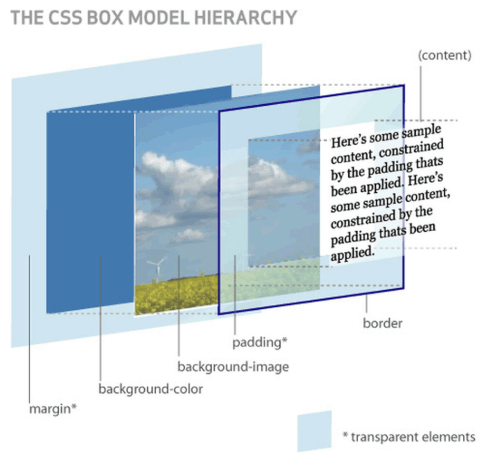

下面来段代码：

```javascript
<style>
.box {
        width: 200px;
        height: 100px;
        padding: 20px;
}
</style>

<div class=\"box\">
盒子模型
</div>
```

当我们在浏览器查看元素时，却发现元素的大小变成了`240px`

这是因为，在`CSS`中，盒子模型可以分成：

* W3C 标准盒子模型

* IE 怪异盒子模型

默认情况下，盒子模型为`W3C` 标准盒子模型


二、标准盒子模型

标准盒子模型，是浏览器默认的盒子模型

下面看看标准盒子模型的模型图：

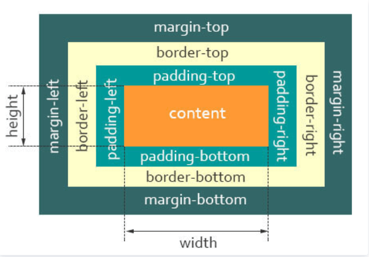

从上图可以看到：

* 盒子总宽度 = width + padding + border + margin;

* 盒子总高度 = height + padding + border + margin

也就是，`width/height` 只是内容高度，不包含 `padding` 和 `border `值

所以上面问题中，设置`width`为200px，但由于存在`padding`，但实际上盒子的宽度有240px


三、IE 怪异盒子模型

同样看看IE 怪异盒子模型的模型图：

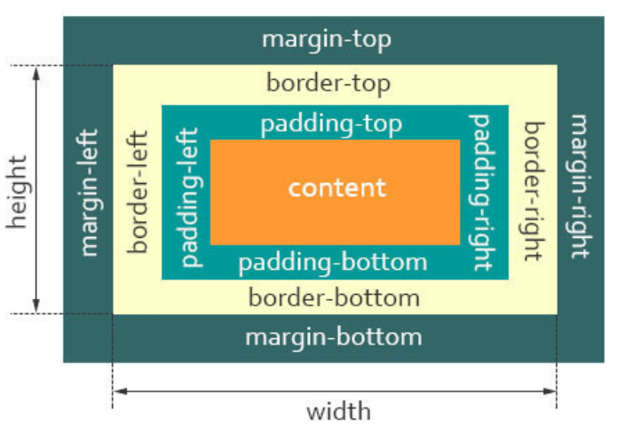

从上图可以看到：

* 盒子总宽度 = width + margin;

* 盒子总高度 = height + margin;

也就是，`width/height` 包含了 `padding `和 `border `值


Box-sizing

CSS 中的 box-sizing 属性定义了引擎应该如何计算一个元素的总宽度和总高度

语法：

```javascript
box-sizing: content-box|border-box|inherit;
```

* content-box 默认值，元素的 width/height 不包含padding，border，与标准盒子模型表现一致

* border-box 元素的 width/height 包含 padding，border，与怪异盒子模型表现一致

* inherit 指定 box-sizing 属性的值，应该从父元素继承

回到上面的例子里，设置盒子为 border-box 模型

```javascript
<style>
.box {
        width: 200px;
        height: 100px;
    padding: 20px;
    box-sizing: border-box;
}
</style>
<div class=\"box\">
盒子模型
</div>
```

这时候，就可以发现盒子的所占据的宽度为200px


***

## 24. 怎么实现样式隔离？


**参考答案：**

要实现样式的隔离，你可以考虑以下几种常见的方法：

1. 作用域样式（Scoped Styles）：

   * 在 Vue 单文件组件中，可以使用 `scoped` 特性将样式限定于当前组件的作用域。

   * 使用`<style scoped>`标签包裹的样式只对当前组件起作用，不会影响其他组件或全局样式。

   * Vue 会通过给每个选择器添加一个唯一的属性选择器来实现作用域样式，确保样式仅适用于当前组件。

2. CSS Modules：

   * Vue 支持使用 CSS Modules 来实现样式的模块化和隔离。

   * 在 Vue 单文件组件中，可以借助 `module` 特性启用 CSS Modules 功能，在样式文件中使用类似 `:local(.className)` 的语法来定义局部样式。

   * CSS Modules 会自动生成唯一的类名，并在编译时将类名与元素关联起来，从而实现样式的隔离和局部作用域。

3. 命名约定：

   * 可以通过使用特定的命名约定来实现样式的隔离。

   * 为了避免样式冲突，可以采用特定的命名规则或前缀，例如 BEM（Block Element Modifier）命名规范或基于组件名称的前缀。

   * 通过在样式类名中添加前缀或特定的命名约定，可以减少样式冲突的可能性。

4. CSS-in-JS 方案：

   * Vue 也可以结合 CSS-in-JS 库（如 `styled-components`、`emotion` 等）来实现样式的隔离。

   * 使用这种方式，可以直接在组件代码中编写样式，并通过 JavaScript 对象或模板字符串的形式动态生成样式。

   * CSS-in-JS 方案将样式与组件紧密关联，实现了更高程度的样式隔离和可重用性。

根据项目需求和个人偏好，选择适合的方式来实现样式的隔离。以上方法各有优点和适用场景，可以根据具体情况选择最合适的方式。


***

## 25. flex 布局下，怎么改变元素的顺序？


**参考答案：**

可以使用`order`属性来改变Flex布局下元素的顺序。`order`属性指定了Flex容器内部各个项目的排列顺序，其默认值为0。

通过调整`order`属性的值，可以改变元素的顺序。具体步骤如下：

1. 将元素定义为Flex容器，使用`display: flex;`或者`display: inline-flex;`。

2. 为每个子元素设置`order`属性，根据需要设置不同的值，值越小的元素会在前面，值相等的元素按照文档流原始顺序排列。

以下是一个示例代码：

```javascript
<div class="flex-container">
  <div class="item">1</div>
  <div class="item">2</div>
  <div class="item">3</div>
</div>
```

```javascript
.flex-container {
  display: flex;
}

.item {
  order: 2; /* 改变顺序 */
}
```

在上述代码中，通过将第二个子元素的`order`属性设置为2，可以将其放置在其他子元素之后。

请注意，`order`属性接受任意整数值，负数也可以使用。同时，当多个元素的`order`值相同时，它们会按照它们在文档流中的位置进行排序。


***

## 26. ”flex: auto;“是什么意思？


**参考答案：**

`flex` 是复合属性，是`flex-grow`,`flex-shrink` 和 `flex-basis`的简写，默认值为`0 1 auto`，后两个属性可选。

* flex-grow 属性定义项目的放大比例，默认为0，即如果存在剩余空间也不放大

* flex-shrink 属性定义了项目的缩小比例，默认为1，即如果空间不足，该项目将缩小

* flex-basis 属性定义了在分配多余空间之前，项目占据的主轴空间（相当于我们设置的width）

而 `flex: auto;` 是 `flex:1 1 auto;` 的简写，即元素尺寸可以弹性增大，也可以弹性变小，具有十足的弹性，但在尺寸不足时会优先最大化内容尺寸。

再介绍下使用场景：

当希望元素充分利用剩余空间，但是各自的尺寸按照各自内容进行分配的时候，适合使用 `flex:auto`。

`flex:auto` 多用于内容固定，或者内容可控的布局场景，例如导航数量不固定，每个导航文字数量也不固定的导航效果就适合使用 `flex:auto` 效果来实现


***

## 27. object-fit 用法


**参考答案：**

object-fit

`object-fit` [CSS](https://developer.mozilla.org/zh-CN/docs/Web/CSS) 属性指定[可替换元素](https://developer.mozilla.org/zh-CN/docs/Web/CSS/Replaced_element)（例如：[``](https://developer.mozilla.org/zh-CN/docs/Web/HTML/Element/img) 或 [`<video>`](https://developer.mozilla.org/zh-CN/docs/Web/HTML/Element/video)）的内容应该如何适应到其使用高度和宽度确定的框。


你可以通过使用 [`object-position`](https://developer.mozilla.org/zh-CN/docs/Web/CSS/object-position) 属性来切换被替换元素的内容对象在元素框内的对齐方式。


[语法](https://developer.mozilla.org/zh-CN/docs/Web/CSS/object-fit#%E8%AF%AD%E6%B3%95)

```plaintext

object-fit: contain; 
object-fit: cover; 
object-fit: fill; 
object-fit: none; 
object-fit: scale-down; /* Global values */ 
object-fit: inherit; 
object-fit: initial; 
object-fit: revert; 
object-fit: revert-layer; 
object-fit: unset;
```

object-fit 属性由下列的值中的单独一个关键字来指定。

`contain`

被替换的内容将被缩放，以在填充元素的内容框时保持其宽高比。整个对象在填充盒子的同时保留其长宽比，因此如果宽高比与框的宽高比不匹配，该对象将被添加“[黑边](https://zh.wikipedia.org/wiki/%E9%BB%91%E9%82%8A)”。

`cover`

被替换的内容在保持其宽高比的同时填充元素的整个内容框。如果对象的宽高比与内容框不相匹配，该对象将被剪裁以适应内容框。

`fill`

被替换的内容正好填充元素的内容框。整个对象将完全填充此框。如果对象的宽高比与内容框不相匹配，那么该对象将被拉伸以适应内容框。

`none`

被替换的内容将保持其原有的尺寸。

`scale-down`

内容的尺寸与 `none` 或 `contain` 中的一个相同，取决于它们两个之间谁得到的对象尺寸会更小一些


***

## 28. 行内元素和块级元素有什么区别


**参考答案：**

行内元素（Inline Elements）：

* 默认情况下，行内元素在水平方向上以行内的方式显示，不会独占一行。

* 行内元素只能容纳文本或其他行内元素，不能容纳块级元素。

* 行内元素的宽度和高度由其内容决定，无法设置固定的宽度和高度。

* 行内元素可以设置左右的外边距（margin）和内边距（padding），但上下外边距和内边距对行内元素不起作用。

* 常见的行内元素包括 `<span>`、`<a>`、`<strong>`、`<em>`、`` 等。

块级元素（Block-level Elements）：

* 默认情况下，块级元素会独占一行的空间，即使它们宽度没有填满父元素的水平空间。

* 块级元素可以包含其他块级元素和行内元素。

* 块级元素的宽度、高度、内外边距都可以通过 CSS 设置。

* 块级元素会自动在其前后创建换行。

* 常见的块级元素包括 `<div>`、`<p>`、`<h1>`-`<h6>`、`<ul>`、`<ol>`、`<li>`、`<table>` 等。

通过 CSS 的 `display` 属性可以修改元素的显示方式，例如将行内元素设置为块级元素或将块级元素设置为行内元素，这样可以改变元素在页面中的布局和显示效果。


***

## 29. em/px/rem/vh/vw 这些单位有什么区别？


**参考答案：**


一、介绍

传统的项目开发中，我们只会用到`px`、`%`、`em`这几个单位，它可以适用于大部分的项目开发，且拥有比较良好的兼容性

从`CSS3`开始，浏览器对计量单位的支持又提升到了另外一个境界，新增了`rem`、`vh`、`vw`、`vm`等一些新的计量单位

利用这些新的单位开发出比较良好的响应式页面，适应多种不同分辨率的终端，包括移动设备等


二、单位

在`css`单位中，可以分为长度单位、绝对单位，如下表所指示

这里我们主要讲述px、em、rem、vh、vw


px

px，表示像素，所谓像素就是呈现在我们显示器上的一个个小点，每个像素点都是大小等同的，所以像素为计量单位被分在了绝对长度单位中

有些人会把`px`认为是相对长度，原因在于在移动端中存在设备像素比，`px`实际显示的大小是不确定

这里之所以认为`px`为绝对单位，在于`px`的大小和元素的其他属性无关


em

em是相对长度单位。相对于当前对象内文本的字体尺寸。如当前对行内文本的字体尺寸未被人为设置，则相对于浏览器的默认字体尺寸（`1em = 16px`）

为了简化 `font-size` 的换算，我们需要在`css`中的 `body` 选择器中声明`font-size`= `62.5%`，这就使 em 值变为 `16px*62.5% = 10px`

这样 `12px = 1.2em`, `10px = 1em`, 也就是说只需要将你的原来的` px` 数值除以 10，然后换上 `em `作为单位就行了

特点：

* em 的值并不是固定的

* em 会继承父级元素的字体大小

* em 是相对长度单位。相对于当前对象内文本的字体尺寸。如当前对行内文本的字体尺寸未被人为设置，则相对于浏览器的默认字体尺寸

* 任意浏览器的默认字体高都是 16px

举个例子

```javascript
<div class="big">
    我是14px=1.4em
    <div class="small">我是12px=1.2em</div>
</div>
```

样式为

```javascript
<style>
html {font-size: 10px;  } /*  公式16px*62.5%=10px  */  
.big{font-size: 1.4em}
.small{font-size: 1.2em}
</style>
```

这时候`.big`元素的`font-size`为14px，而`.small`元素的`font-size`为12px


rem

rem，相对单位，相对的只是HTML根元素`font-size`的值

同理，如果想要简化`font-size`的转化，我们可以在根元素`html`中加入`font-size: 62.5%`

```javascript
html {font-size: 62.5%;  } /*  公式16px*62.5%=10px  */ 
```

这样页面中1rem=10px、1.2rem=12px、1.4rem=14px、1.6rem=16px;使得视觉、使用、书写都得到了极大的帮助

特点：

* rem单位可谓集相对大小和绝对大小的优点于一身

* 和em不同的是rem总是相对于根元素，而不像em一样使用级联的方式来计算尺寸


vh、vw

vw ，就是根据窗口的宽度，分成100等份，100vw就表示满宽，50vw就表示一半宽。（vw 始终是针对窗口的宽），同理，`vh`则为窗口的高度

这里的窗口分成几种情况：

* 在桌面端，指的是浏览器的可视区域

* 移动端指的就是布局视口

像`vw`、`vh`，比较容易混淆的一个单位是`%`，不过百分比宽泛的讲是相对于父元素：

对于普通定位元素就是我们理解的父元素

* 对于position: absolute;的元素是相对于已定位的父元素

* 对于position: fixed;的元素是相对于 ViewPort（可视窗口）


三、总结

px：绝对单位，页面按精确像素展示

em：相对单位，基准点为父节点字体的大小，如果自身定义了`font-size`按自身来计算，整个页面内`1em`不是一个固定的值

rem：相对单位，可理解为`root em`, 相对根节点`html`的字体大小来计算

vh、vw：主要用于页面视口大小布局，在页面布局上更加方便简单


***

## 30. html和css中的图片加载与渲染规则是什么样的？


**参考答案：**

Web浏览器先会把获取到的HTML代码解析成一个DOM树，HTML中的每个标签都是DOM树中的一个节点，包括`display: none`隐藏的标签，还有JavaScript动态添加的元素等。

浏览器会获取到所有样式，并会把所有样式解析成样式规则，在解析的过程中会去掉浏览器不能识别的样式。

浏览器将会把DOM树和样式规则组合在一起（DOM元素和样式规则匹配）后将会合建一个渲染树（Render Tree），渲染树类似于DOM树，但两者别还是很大的：

渲染树能识别样式，渲染树中每个节点（NODE）都有自己的样式，而且渲染树不包含隐藏的节点（比如display:none的节点，还有`</head>`内的一些节点），因为这些节点不会用于渲染，也不会影响节点的渲染，因此不会包含到渲染树中。一旦渲染树构建完毕后，浏览器就可以根据渲染树来绘制页面了。

简单的归纳就是浏览器渲染Web页面大约会经过六个过程：

* 解析HTML，构成DOM树

* 解析加载的样式，构建样式规则树

* 加载JavaScript，执行JavaScript代码

* DOM树和样式规则树进行匹配，构成渲染树

* 计算元素位置进行页面布局

* 绘制页面，最终在浏览器中呈现

是不是会感觉这个和我们图像加载渲染没啥关系一样，事实并非如此，因为img、picture或者background-image都是DOM树或样式规则中的一部分，那么咱们套用进来，图片加载和渲染的时机有可能是下面这样：

* 解析HTML时，如果遇到img或picture标签，将会加载图片

* 解析加载的样式，遇到background-image时，并不会加载图片，而会构建样式规则树

* 加载JavaScript，执行JavaScript代码，如果代码中有创建img元素之类，会添加到DOM树中；如查有添加background-image规则，将会添加到样式规则树中

* DOM树和样式规则匹配时构建渲染树，如果DOM树节点匹配到样式规则中的backgorund-image，则会加载背景图片

* 计算元素（图片）位置进行布局

* 开始渲染图片，浏览器将呈现渲染出来的图片

上面套用浏览器渲染页面的机制，但图片加载与渲染还是有一定的规则。因为，页面中不是所有的``（或picture）元素引入的图片和background-image引入的背景图片都会加载的。那么就引发出新问题了，什么时候会真正的加载，加载规则又是什么？

先概括一点：

> Web页面中不是所有的图片都会加载和渲染！

我们可以归纳为：

* ``、`<picture>`和设置background-image的元素遇到display:none时，图片会加载，但不会渲染。

* ``、`<picture>`和设置background-image的元素祖先元素设置display:none时，background-image不会渲染也不会加载，而img和picture引入的图片不会渲染但会加载

* ``、`<picture>`和background-image引入相同路径相同图片文件名时，图片只会加载一次

* 样式文件中background-image引入的图片，如果匹配不到DOM元素，图片不会加载

* 伪类引入的background-image，比如:hover，只有当伪类被触发时，图片才会加载


***

## 31. CSS中，有哪些方式可以隐藏页面元素？有什么区别?


**参考答案：**


一、前言

在平常的样式排版中，我们经常遇到将某个模块隐藏的场景

通过`css`隐藏元素的方法有很多种，它们看起来实现的效果是一致的

但实际上每一种方法都有一丝轻微的不同，这些不同决定了在一些特定场合下使用哪一种方法


二、实现方式

通过`css`实现隐藏元素方法有如下：

* display:none

* visibility:hidden

* opacity:0

* 设置height、width模型属性为0

* position:absolute

* clip-path


display:none

设置元素的`display`为`none`是最常用的隐藏元素的方法

```javascript
.hide {
    display:none;
}
```

将元素设置为`display:none`后，元素在页面上将彻底消失

元素本身占有的空间就会被其他元素占有，也就是说它会导致浏览器的重排和重绘

消失后，自身绑定的事件不会触发，也不会有过渡效果

特点：元素不可见，不占据空间，无法响应点击事件


visibility:hidden

设置元素的`visibility`为`hidden`也是一种常用的隐藏元素的方法

从页面上仅仅是隐藏该元素，DOM结果均会存在，只是当时在一个不可见的状态，不会触发重排，但是会触发重绘

```javascript
.hidden{
    visibility:hidden
}
```

给人的效果是隐藏了，所以他自身的事件不会触发

特点：元素不可见，占据页面空间，无法响应点击事件


opacity:0

`opacity`属性表示元素的透明度，将元素的透明度设置为0后，在我们用户眼中，元素也是隐藏的

不会引发重排，一般情况下也会引发重绘

> 如果利用 animation 动画，对 opacity 做变化（animation会默认触发GPU加速），则只会触发 GPU 层面的 composite，不会触发重绘

```javascript
.transparent {
    opacity:0;
}
```

由于其仍然是存在于页面上的，所以他自身的的事件仍然是可以触发的，但被他遮挡的元素是不能触发其事件的

需要注意的是：其子元素不能设置opacity来达到显示的效果

特点：改变元素透明度，元素不可见，占据页面空间，可以响应点击事件


设置height、width属性为0

将元素的`margin`，`border`，`padding`，`height`和`width`等影响元素盒模型的属性设置成0，如果元素内有子元素或内容，还应该设置其`overflow:hidden`来隐藏其子元素

```javascript
.hiddenBox {
    margin:0;     
    border:0;
    padding:0;
    height:0;
    width:0;
    overflow:hidden;
}
```

特点：元素不可见，不占据页面空间，无法响应点击事件


position:absolute

将元素移出可视区域

```javascript
.hide {
   position: absolute;
   top: -9999px;
   left: -9999px;
}
```

特点：元素不可见，不影响页面布局


clip-path

通过裁剪的形式

```javascript
.hide {
  clip-path: polygon(0px 0px,0px 0px,0px 0px,0px 0px);
}
```

特点：元素不可见，占据页面空间，无法响应点击事件


小结

最常用的还是`display:none`和`visibility:hidden`，其他的方式只能认为是奇招，它们的真正用途并不是用于隐藏元素，所以并不推荐使用它们


三、区别

关于`display: none`、` visibility: hidden`、`opacity: 0`的区别，如下表所示：


***

## 32. CSS3 中 transition 和 animation 的属性分别有哪些？

```javascript
const vnode = {
    tag: 'DIV',
    attrs: {
        id: 'app'
    },
    children: [{
            tag: 'SPAN',
            children: [{
                tag: 'A',
                children: []
            }]
        },
        {
            tag: 'SPAN',
            children: [{
                    tag: 'A',
                    children: []
                },
                {
                    tag: 'A',
                    children: []
                }
            ]
        }
    ]
}

function render(vnode) {

}
```


**参考答案：**

在 CSS3 中，`transition` 和 `animation` 是两种用于实现动画效果的属性。它们分别用于不同的动画需求和实现方式。


Transition 属性：

`transition` 属性用于定义元素在状态改变时从一个样式转换到另一个样式的过渡效果。它包含以下几个属性：

* `transition-property`：指定过渡效果应用的 CSS 属性名称，多个属性可以用逗号分隔。

* `transition-duration`：指定过渡效果的持续时间，单位可以是秒(s)或毫秒(ms)。

* `transition-timing-function`：指定过渡效果的时间曲线，也就是过渡的速度变化函数。

* `transition-delay`：指定过渡效果开始之前的延迟时间，单位可以是秒(s)或毫秒(ms)。

示例：

```javascript
/* 定义一个简单的过渡效果 */
.box {
  width: 100px;
  height: 100px;
  background-color: red;
  transition: width 1s ease-in-out;
}

.box:hover {
  width: 200px;
}
```

在上面的示例中，当鼠标悬停在 `.box` 元素上时，宽度从 100px 过渡到 200px，过渡持续时间为 1 秒，过渡速度为 ease-in-out。


Animation 属性：

`animation` 属性用于定义复杂的动画效果，可以自定义关键帧（keyframes）来实现更复杂的动画效果。它包含以下几个属性：

* `animation-name`：指定定义动画的关键帧名称。

* `animation-duration`：指定动画的持续时间，单位可以是秒(s)或毫秒(ms)。

* `animation-timing-function`：指定动画的时间曲线，也就是动画的速度变化函数。

* `animation-delay`：指定动画开始之前的延迟时间，单位可以是秒(s)或毫秒(ms)。

* `animation-iteration-count`：指定动画的重复次数，可以使用一个整数值或 `infinite`（表示无限循环）。

* `animation-direction`：指定动画的播放方向，可以是 `normal`（默认），`reverse`（反向播放），`alternate`（正向再反向循环），或 `alternate-reverse`（反向再正向循环）。

* `animation-fill-mode`：指定动画在非运行时的样式，可以是 `none`（默认），`forwards`（保持最后一帧的样式），`backwards`（应用第一帧的样式），或 `both`（同时应用第一帧和最后一帧的样式）。

* `animation-play-state`：指定动画的播放状态，可以是 `running`（默认，动画正在播放）或 `paused`（动画暂停）。

示例：

```javascript
/* 定义一个简单的动画 */
@keyframes slide-in {
  0% {
    transform: translateX(-100%);
  }
  100% {
    transform: translateX(0);
  }
}

.box {
  width: 100px;
  height: 100px;
  background-color: red;
  animation: slide-in 1s ease-in-out infinite alternate;
}
```

在上面的示例中，`.box` 元素会应用一个名为 `slide-in` 的动画，从左侧滑动进入容器，动画持续时间为 1 秒，以 ease-in-out 时间曲线播放，无限循环，并且往返运动。


***

## 33. 说说对 CSS 预编语言的理解，以及它们之间的区别


**参考答案：**

CSS 预编语言是一种基于 CSS 的扩展语言，可以更加方便和高效地编写 CSS 代码。其主要作用是为 CSS 提供了变量、函数、嵌套、继承、混合等功能，以及更加易于维护和组织的代码结构。

常见的 CSS 预编语言有 Sass、Less 和 Stylus 等，它们之间的区别如下：

1. 语法不同：Sass 和 Less 使用类似于 CSS 的语法规则，而 Stylus 则使用了更加简洁和灵活的缩进式语法。

2. 变量定义方式不同：Sass 使用 `$` 符号来定义变量，Less 使用 `@` 符号，Stylus 则直接使用变量名即可。

3. 操作符和函数库不同：Sass 和 Less 支持常见的操作符和函数库，例如运算符、颜色处理、字符串处理等，而 Stylus 的函数库更加强大，支持更多的特性和功能。

4. 编译方式不同：Sass 和 Less 都需要通过编译器进行编译，可以将预编译的代码转换成标准的 CSS 代码。而 Stylus 则可以直接在浏览器中解析和执行，可以动态调整样式和布局。

总之，CSS 预编语言是一种非常有用的工具，可以提高 CSS 开发的效率和可维护性。选择哪种预编语言取决于项目需求和个人喜好，需要根据具体情况来进行选择。


***

## 34. ::before 和::after 中双冒号和单冒号有什么区别、作用？


**参考答案：**

在 CSS 中伪类一直用 : 表示，如 :hover, :active 等

伪元素在 CSS1 中已存在，当时语法是用 `:` 表示，如 `:before` 和 `:after`

后来在 CSS3 中修订，伪元素用 `::` 表示，如 `::before` 和 `::after`，以此区分伪元素和伪类

由于低版本 IE 对双冒号不兼容，开发者为了兼容性各浏览器，可以继续使用 `:after` 这种老语法表示伪元素

* 单冒号（:）用于 css3 的伪类

* 双冒号（::）用于 css3 的伪元素

作用：`::before` 和 `::after` 的主要作用是在元素内容前后加上指定内容。

另外，伪类与伪元素的区别有：

* 伪类与伪元素都是用于向选择器加特殊效果

* 伪类与伪元素的本质区别就是是否抽象创造了新元素

* 伪类只要不是互斥可以叠加使用

* 伪元素在一个选择器中只能出现一次，并且只能出现在末尾

* 伪类与伪元素优先级分别与类、标签优先级相同


***

## 35. z-index属性在什么情况下会失效？


**参考答案：**

通常 z-index 的使用是在有两个重叠的标签，在一定的情况下控制其中一个在另一个的上方或者下方出现。z-index值越大就越是在上层。z-index元素的position属性需要是relative，absolute或是fixed。

z-index属性在下列情况下会失效：

* 父元素position为relative时，子元素的z-index失效。解决：父元素position改为absolute或static；

* 元素没有设置position属性为非static属性。解决：设置该元素的position属性为relative，absolute或是fixed中的一种；

* 元素在设置z-index的同时还设置了float浮动。解决：float去除，改为`display：inline-block`；


***

## 36. 使用原生js实现以下效果：点击容器内的图标，图标边框变成border:1px solid red，点击空白处重置


**参考答案：**

```javascript


const box = document.getElementById('box');

function isIcon(target) {
 return target.className.includes('icon');
}

box.onclick = function(e) {
 e.stopPropagation();
 const target = e.target;
 if (isIcon(target)) {
   target.style.border = '1px solid red';
 }
}

const doc = document;

doc.onclick = function(e) {
 const children = box.children;
 for(let i = 0; i < children.length; i++) {
   if (isIcon(children[i])) {
     children[i].style.border = 'none';
   }
 }
}
```


***

## 37. position: fixed 一定是相对于浏览器窗口进行定位吗？


**参考答案：**

不一定。

`position:fixed;`的元素会被移出正常文档流，并不为元素预留空间，而是通过指定元素相对于屏幕视口（viewport）的位置来指定元素位置，元素的位置在屏幕滚动时不会改变。`fixed` 属性会创建新的层叠上下文。

当元素祖先的 `transform`, `perspective` 或 `filter` 属性`非 none` 时，容器由视口改为该祖先。

***

## 38. css选择器有哪些？优先级分别是什么？哪些属性可以继承？


**参考答案：**


一、选择器

CSS选择器是CSS规则的第一部分

它是元素和其他部分组合起来告诉浏览器哪个HTML元素应当是被选为应用规则中的CSS属性值的方式

选择器所选择的元素，叫做“选择器的对象”

我们从一个`Html`结构开始

```javascript
<div id="box">
        <div class="one">
            <p class="one_1"></p>
            <p class="one_1"></p>
        </div>
        <div class="two"></div>
        <div class="two"></div>
        <div class="two"></div>
</div>
```

关于`css`属性选择器常用的有：

```javascript
- id选择器（#box），选择id为box的元素
- 类选择器（.one），选择类名为one的所有元素
- 标签选择器（div），选择标签为div的所有元素
- 后代选择器（#box div），选择id为box元素内部所有的div元素
- 子选择器（.one>one_1），选择父元素为.one的所有.one_1的元素
- 相邻同胞选择器（.one+.two），选择紧接在.one之后的所有.two元素
- 群组选择器（div,p），选择div、p的所有元素
```

还有一些使用频率相对没那么多的选择器：

* 伪类选择器

```javascript
:link ：选择未被访问的链接
:visited：选取已被访问的链接
:active：选择活动链接
:hover ：鼠标指针浮动在上面的元素
:focus ：选择具有焦点的
:first-child：父元素的首个子元素
```

* 伪元素选择器

```javascript
:first-letter ：用于选取指定选择器的首字母
:first-line ：选取指定选择器的首行
:before : 选择器在被选元素的内容前面插入内容
:after : 选择器在被选元素的内容后面插入内容
```

* 属性选择器

```javascript
[attribute] 选择带有attribute属性的元素
[attribute=value] 选择所有使用attribute=value的元素
[attribute~=value] 选择attribute属性包含value的元素
[attribute|=value]：选择attribute属性以value开头的元素
```

在`CSS3`中新增的选择器有如下：

* 层次选择器（p\~ul），选择前面有p元素的每个ul元素

* 伪类选择器

```javascript
:first-of-type 父元素的首个元素
:last-of-type 父元素的最后一个元素
:only-of-type 父元素的特定类型的唯一子元素
:only-child 父元素中唯一子元素
:nth-child(n) 选择父元素中第N个子元素
:nth-last-of-type(n) 选择父元素中第N个子元素，从后往前
:last-child 父元素的最后一个元素
:root 设置HTML文档
:empty 指定空的元素
:enabled 选择被禁用元素
:disabled 选择被禁用元素
:checked 选择选中的元素
:not(selector) 选择非 <selector> 元素的所有元素
```

* 属性选择器

```javascript
[attribute*=value]：选择attribute属性值包含value的所有元素
[attribute^=value]：选择attribute属性开头为value的所有元素
[attribute$=value]：选择attribute属性结尾为value的所有元素
```


二、优先级

相信大家对`CSS`选择器的优先级都不陌生：

> 内联 > ID选择器 > 类选择器 > 标签选择器

到具体的计算层⾯，优先级是由 A 、B、C、D 的值来决定的，其中它们的值计算规则如下：

* 如果存在内联样式，那么 A = 1, 否则 A = 0

* B的值等于 ID选择器出现的次数

* C的值等于 类选择器 和 属性选择器 和 伪类 出现的总次数

* D 的值等于 标签选择器 和 伪元素 出现的总次数

这里举个例子：

```javascript
#nav-global > ul > li > a.nav-link
```

用上面的算法，依次求出 `A` `B` `C` `D` 的值：

* 因为没有内联样式 ，所以 A = 0

* ID选择器总共出现了1次， B = 1

* 类选择器出现了1次， 属性选择器出现了0次，伪类选择器出现0次，所以 C = (1 + 0 + 0) = 1

* 标签选择器出现了3次， 伪元素出现了0次，所以 D = (3 + 0) = 3

上面算出的`A` 、 `B`、`C`、`D` 可以简记作：`(0, 1, 1, 3)`

知道了优先级是如何计算之后，就来看看比较规则：

* 从左往右依次进行比较 ，较大者优先级更高

* 如果相等，则继续往右移动一位进行比较

* 如果4位全部相等，则后面的会覆盖前面的

经过上面的优先级计算规则，我们知道内联样式的优先级最高，如果外部样式需要覆盖内联样式，就需要使用`!important`


三、继承属性

在`css`中，继承是指的是给父元素设置一些属性，后代元素会自动拥有这些属性 关于继承属性，可以分成：

* 字体系列属性

```javascript
font:组合字体
font-family:规定元素的字体系列
font-weight:设置字体的粗细
font-size:设置字体的尺寸
font-style:定义字体的风格
font-variant:偏大或偏小的字体
```

* 文本系列属性

```javascript
text-indent：文本缩进
text-align：文本水平对齐
line-height：行高
word-spacing：增加或减少单词间的空白
letter-spacing：增加或减少字符间的空白
text-transform：控制文本大小写
direction：规定文本的书写方向
color：文本颜色
```

* 元素可见性

```javascript
visibility
```

* 表格布局属性

```javascript
caption-side：定位表格标题位置
border-collapse：合并表格边框
border-spacing：设置相邻单元格的边框间的距离
empty-cells：单元格的边框的出现与消失
table-layout：表格的宽度由什么决定
```

* 列表属性

```javascript
list-style-type：文字前面的小点点样式
list-style-position：小点点位置
list-style：以上的属性可通过这属性集合
```

* 引用

```javascript
quotes：设置嵌套引用的引号类型
```

* 光标属性

```javascript
cursor：箭头可以变成需要的形状
```

继承中比较特殊的几点：

* a 标签的字体颜色不能被继承

* h1-h6标签字体的大下也是不能被继承的


无继承的属性

* display

* 文本属性：vertical-align、text-decoration

* 盒子模型的属性：宽度、高度、内外边距、边框等

* 背景属性：背景图片、颜色、位置等

* 定位属性：浮动、清除浮动、定位position等

* 生成内容属性：content、counter-reset、counter-increment

* 轮廓样式属性：outline-style、outline-width、outline-color、outline

* 页面样式属性：size、page-break-before、page-break-after


***

## 39. 使用css实现一个无限循环动画


**参考答案：**

想要实现CSS动画的无限循环，其实主要就是要使用`animation-iteration-count`这个属性，将其设置为`infinite`，动画就会一直循环播放。

例如：

```javascript
<image class="anima" mode="widthFix" @click="nav" src="@/static/1_btn.png"></image>
```

```javascript
.anima {
  animation-name: likes; // 动画名称
  animation-direction: alternate; // 动画在奇数次（1、3、5...）正向播放，在偶数次（2、4、6...）反向播放。
  animation-timing-function: linear; // 动画执行方式，linear：匀速；ease：先慢再快后慢；ease-in：由慢速开始；ease-out：由慢速结束；ease-in-out：由慢速开始和结束；
  animation-delay: 0s; // 动画延迟时间
  animation-iteration-count: infinite; //  动画播放次数，infinite：一直播放
  animation-duration: 1s; // 动画完成时间
}

@keyframes likes {
  0%{
          transform: scale(1);
  }
  25%{
          transform: scale(0.9);
  }
  50%{
          transform: scale(0.85);
  }
  75%{
          transform: scale(0.9);
  }
  100%{
          transform: scale(1);
  }
}
```


***

## 40. 怎么实现一个宽高自适应的正方形？


**参考答案：**

* 利用vw来实现：

```javascript
.square {
  width: 10%;
  height: 10vw;
  background: tomato;
}
```

* 利用元素的margin/padding百分比是相对父元素width的性质来实现：

```javascript
.square {
  width: 20%;
  height: 0;
  padding-top: 20%;
  background: orange;
}
```

* 利用子元素的margin-top的值来实现：

```javascript
.square {
  width: 30%;
  overflow: hidden;
  background: yellow;
}
.square::after {
  content: '';
  display: block;
  margin-top: 100%;
}
```


***

## 41. Sass、Less 是什么？为什么要使用他们？


**参考答案：**

他们都是 CSS 预处理器，是 CSS 上的一种抽象层。他们是一种特殊的语法/语言编译成 CSS。 例如 Less 是一种动态样式语言，将 CSS 赋予了动态语言的特性，如变量，继承，运算， 函数，LESS 既可以在客户端上运行 (支持 IE 6+, Webkit, Firefox)，也可以在服务端运行 (借助 Node.js)。

为什么要使用它们？

* 结构清晰，便于扩展。 可以方便地屏蔽浏览器私有语法差异。封装对浏览器语法差异的重复处理， 减少无意义的机械劳动。

* 可以轻松实现多重继承。 完全兼容 CSS 代码，可以方便地应用到老项目中。LESS 只是在 CSS 语法上做了扩展，所以老的 CSS 代码也可以与 LESS 代码一同编译。


***

## 42. CSS预处理器/后处理器是什么？为什么要使用它们？


**参考答案：**

预处理器， 如：`less`，`sass`，`stylus`，用来预编译`sass`或者`less`，增加了`css`代码的复用性。层级，`mixin`， 变量，循环， 函数等对编写以及开发UI组件都极为方便。

后处理器， 如： `postCss`，通常是在完成的样式表中根据`css`规范处理`css`，让其更加有效。目前最常做的是给`css`属性添加浏览器私有前缀，实现跨浏览器兼容性的问题。

`css`预处理器为`css`增加一些编程特性，无需考虑浏览器的兼容问题，可以在`CSS`中使用变量，简单的逻辑程序，函数等在编程语言中的一些基本的性能，可以让`css`更加的简洁，增加适应性以及可读性，可维护性等。

其它`css`预处理器语言：`Sass（Scss）`, `Less`, `Stylus`, `Turbine`, `Swithch css`, `CSS Cacheer`, `DT Css`。

使用原因：

* 结构清晰， 便于扩展

* 可以很方便的屏蔽浏览器私有语法的差异

* 可以轻松实现多重继承

* 完美的兼容了`CSS`代码，可以应用到老项目中


***

## 43. 为什么有时候⽤translate来改变位置⽽不是使用position进行定位？


**参考答案：**

translate 是 transform 属性的⼀个值。

改变transform或opacity不会触发浏览器重新布局（reflow）或重绘（repaint），只会触发复合（compositions）。

⽽改变绝对定位会触发重新布局，进⽽触发重绘和复合。

transform使浏览器为元素创建⼀个 GPU 图层，但改变绝对定位会使⽤到 CPU。

因此translate()更⾼效，可以缩短平滑动画的绘制时间。

⽽translate改变位置时，元素依然会占据其原始空间，绝对定位就不会发⽣这种情况。


***

## 44. transition和animation的区别


**参考答案：**

* transition是过度属性，强调过度，它的实现需要触发一个事件（比如鼠标移动上去，焦点，点击等）才执行动画。它类似于flash的补间动画，设置一个开始关键帧，一个结束关键帧。

* animation是动画属性，它的实现不需要触发事件，设定好时间之后可以自己执行，且可以循环一个动画。它也类似于flash的补间动画，但是它可以设置多个关键帧（用@keyframe定义）完成动画。


***

## 45. 下面这段代码中，class为content的元素，实际高度是100px吗？

```javascript
<!DOCTYPE html>
<html lang="en">
  <head>
    <meta charset="UTF-8" />
    <meta name="viewport" content="width=device-width, initial-scale=1.0" />
    <meta http-equiv="X-UA-Compatible" content="ie=edge" />
    <title>Static Template</title>

    <style>
      .parent {
        display: flex;
        flex-direction: column;
        height: 600px;
        width: 300px;
        background: yellow;
      }
      div {
        width: 100%;
      }
      .header {
        height: 200px;
        background: red;
      }
      .content {
        height: 100%;
        background: blue;
      }
      .footer {
        height: 200px;
        background: black;
      }
    </style>
  </head>
  <body>
    <div class="parent">
      <div class="header"></div>
      <div class="content"></div>
      <div class="footer"></div>
    </div>
  </body>
</html>
```


**参考答案：**

答案： 不是

首先，content元素的 height 设置为 “100%”，在父级的高度为固定值时，直接继承该高度，也就是600px。

但父级设置了 display:flex ，在高度固定的前提下，子元素的高度会按比例进行缩放，所以content元素最后的高度应该是 600 \* (600/(200+600+200)) = 360px


***

## 46. 硬件加速的原理是什么？


**参考答案：**

面试中可能会经常会碰到怎么解决动画卡顿的问题，然后会引导到硬件加速。那么究竟什么是硬件加速，为什么它可以提高咱们的动画效率？我们今天就来一探究竟。

首先，我们先从 CPU 和 GPU 开始了解。


CPU 和 GPU 的区别

`CPU` 即中央处理器，`GPU` 即图形处理器。

`CPU`是计算机的大脑，它提供了一套指令集，我们写的程序最终会通过 `CPU` 指令来控制的计算机的运行。它会对指令进行译码，然后通过逻辑电路执行该指令。整个执行的流程分为了多个阶段，叫做流水线。指令流水线包括取`指令、译码、执行、取数、写回`五步，这是一个指令周期。`CPU`会不断的执行指令周期来完成各种任务。

`GPU`，是`Graphics ProcessingUnit`的简写，是现代显卡中非常重要的一个部分，其地位与`CPU`在主板上的地位一致，主要负责的任务是加速图形处理速度。GPU是显卡的“大脑”，它决定了该显卡的档次和大部分性能，同时也是2D显示卡和3D显示卡的区别依据。2D显示芯片在处理3D图像和特效时主要依赖CPU的处理能力，称为“软加速”。3D显示芯片是将三维图像和特效处理功能集中在显示芯片内，也即所谓的“硬件加速”功能。

要解释两者的区别，要先明白两者的相同之处：两者都有总线和外界联系，有自己的缓存体系，以及数字和逻辑运算单元。

一句话，两者都为了完成计算任务而设计。

两者的区别在于存在于片内的缓存体系和数字逻辑运算单元的结构差异：

* `CPU`虽然有多核，但总数没有超过两位数，每个核都有足够大的缓存和足够多的数字和逻辑运算单元，并辅助有很多加速分支判断甚至更复杂的逻辑判断的硬件；

* `GPU` 的核数远超`CPU`，被称为众核（NVIDIA Fermi有512个核）。每个核拥有的缓存大小相对小，数字逻辑运算单元也少而简单（`GPU`初始时在浮点计算上一直弱于`CPU`）。

从结果上导致`CPU`擅长处理具有复杂计算步骤和复杂数据依赖的计算任务，如分布式计算，数据压缩，人工智能，物理模拟，以及其他很多很多计算任务等。

`GPU`由于历史原因，是为了视频游戏而产生的（至今其主要驱动力还是不断增长的视频游戏市场），在三维游戏中常常出现的一类操作是对海量数据进行相同的操作，如：对每一个顶点进行同样的坐标变换，对每一个顶点按照同样的光照模型计算颜色值。

GPU的众核架构非常适合把同样的指令流并行发送到众核上，采用不同的输入数据执行。在通用计算领域有广泛应用，包括：数值分析，海量数据处理（排序，Map-Reduce等），金融分析等等。

简而言之，当程序员为CPU编写程序时，他们倾向于利用复杂的逻辑结构优化算法从而减少计算任务的运行时间，即 `Latency`。当程序员为GPU编写程序时，则利用其处理海量数据的优势，通过提高总的数据吞吐量（`Throughput`）来掩盖 `Lantency`。

目前，`CPU` 和 `GPU` 的区别正在逐渐缩小，因为GPU也在处理不规则任务和线程间通信方面有了长足的进步。


每一帧的执行步骤

一般浏览器的刷新率为60HZ，即1秒钟刷新60次。

1000ms / 60hz = 16.6 ，也就是大概每过 `16.6ms` 浏览器就会渲染一帧画面。

浏览器对每一帧画面的渲染工作都要在 16ms 内完成，超出这个时间，页面的渲染就会出现卡顿现象，影响用户体验。

简单概括下，浏览器在每一帧里会依次执行以下这些动作：

* `JavaScript`：JavaScript 实现动画效果，DOM 元素操作等。

* `Style`（计算样式）：确定每个 DOM 元素应该应用什么 CSS 规则。

* `Layout`（布局）：计算每个 DOM 元素在最终屏幕上显示的大小和位置。由于 web 页面的元素布局是相对的，所以其中任意一个元素的位置发生变化，都会联动的引起其他元素发生变化，这个过程叫 reflow。

* `Paint`（绘制）：在多个层上绘制 DOM 元素的的文字、颜色、图像、边框和阴影等。

* `Composite`（渲染层合并）：按照合理的顺序合并图层然后显示到屏幕上。

减少或者避免 `layout`，`paint` 可以让页面减少卡顿，动画效果更加流畅。


完整的渲染流程

更具体一些，一个完整的渲染步骤大致可总结为如下：

* 渲染进程将HTML内容转换为能够读懂的DOM树结构。

* 渲染引擎将CSS样式表转化为浏览器可以理解的 `styleSheets` ，计算出DOM节点的样式。

* 创建布局树，并计算元素的布局信息。

* 对布局树进行分层，并生成分层树。

* 为每个图层生成绘制列表，并将其提交到合成线程。

* 合成线程将图层分成图块，并在光栅化线程池中将图块转换成位图。

* 合成线程发送绘制图块命令DrawQuad给浏览器进程。

* 浏览器进程根据DrawQuad消息生成页面，并显示到显示器上


普通图层和复合图层

上面的介绍中，提到了 `composite` 概念。

可以简单的这样理解，浏览器渲染的图层一般包含两大类：`渲染图层（普通图层）`以及`复合图层`

* 渲染图层：又称默认复合层，是页面普通的文档流。我们虽然可以通过绝对定位，相对定位，浮动定位脱离文档流，但它仍然属于默认复合层，共用同一个绘图上下文对象（`GraphicsContext`）。

* 复合图层，它会单独分配资源（当然也会脱离普通文档流，这样一来，不管这个复合图层中怎么变化，也不会影响默认复合层里的回流重绘）

某些特殊的渲染层会被提升为复合成层（`Compositing Layers`），复合图层拥有单独的 `GraphicsLayer`，而其他不是复合图层的渲染层，则和其第一个拥有 `GraphicsLayer` 父层共用一个。

每个 `GraphicsLayer` 都有一个 `GraphicsContext`，`GraphicsContext` 会负责输出该层的位图，位图是存储在共享内存中，作为纹理上传到 GPU 中，最后由 GPU 将多个位图进行合成，然后 draw 到屏幕上，此时，我们的页面也就展现到了屏幕上。

可以 `Chrome源码调试 -> More Tools -> Rendering -> Layer borders`中看到，黄色的就是复合图层信息。


硬件加速

硬件加速，直观上说就是依赖 GPU 实现图形绘制加速，软硬件加速的区别主要是图形的绘制究竟是 GPU 来处理还是 CPU，如果是 GPU，就认为是硬件加速绘制，反之，则为软件绘制。

一般一个元素开启硬件加速后会变成复合图层，可以独立于普通文档流中，改动后可以避免整个页面重绘，提升性能。

常用的硬件加速方法有：

* 最常用的方式：`translate3d`、`translateZ`

* `opacity` 属性/过渡动画（需要动画执行的过程中才会创建合成层，动画没有开始或结束后元素还会回到之前的状态）

* `will-change`属性（这个知识点比较冷僻），一般配合 `opacity` 与 `translate` 使用（而且经测试，除了上述可以引发硬件加速的属性外，其它属性并不会变成复合层），作用是提前告诉浏览器要变化，这样浏览器会开始做一些优化工作（这个最好用完后就释放）

* `<video>`、`<iframe>`、`<canvas>`、`<webgl>`等元素

* 其它，譬如以前的 `flash` 插件

当然，有的时候我们想强制触发硬件渲染，就可以通过上面的属性，比如

```javascript
will-change: transform; 
```

或者

```javascript
transform:translate3d(0, 0, 0);
```


使用硬件加速的注意事项

使用硬件加速并不是十全十美的事情，比如：

* 内存。如果GPU加载了大量的纹理，那么很容易就会发生内容问题，这一点在移动端浏览器上尤为明显，所以，一定要牢记不要让页面的每个元素都使用硬件加速。

* 使用GPU渲染会影响字体的抗锯齿效果。这是因为GPU和CPU具有不同的渲染机制。即使最终硬件加速停止了，文本还是会在动画期间显示得很模糊。

所以不要大量使用复合图层，否则由于资源消耗过度，页面可能会变的更加卡顿。

同时，在使用硬件加速时，尽可能的使用`z-index`，防止浏览器默认给后续的元素创建复合层渲染。

具体的原理是这样的：

> webkit CSS3中，如果一个元素添加了硬件加速，并且`z-index`层级比较低，那么在这个元素的后面其它元素（层级比这个元素高的，或者相同的，并且`releative`或`absolute`属性相同的），会默认变为复合层渲染，如果处理不当会极大的影响性能。

简单点理解，其实可以认为是一个隐式合成的概念：如果a是一个复合图层，而且b在a上面，那么b也会被隐式转为一个复合图层，这点需要特别注意。


***

## 47. 什么是硬件加速？


**参考答案：**

硬件加速就是将浏览器的渲染过程交给GPU处理，而不是使用自带的比较慢的渲染器。这样就可以使得 `animation` 与 `transition` 更加顺畅。

我们可以在浏览器中用css开启硬件加速，使GPU (Graphics Processing Unit) 发挥功能，从而提升性能。

现在大多数电脑的显卡都支持硬件加速。鉴于此，我们可以发挥GPU的力量，从而使我们的网站或应用表现的更为流畅


***

## 48. CSS动画和JS实现的动画分别有哪些优缺点？


**参考答案：**

CSS动画

优点

* 浏览器可以对动画进行优化

* 代码相对简单,性能调优方向固定

* 对于帧速表现不好的低版本浏览器，`CSS3`可以做到自然降级，而`JS`则需要撰写额外代码

缺点

* 运行过程控制较弱,无法附加事件绑定回调函数

* 代码冗长，想用`CSS`实现稍微复杂一点动画,最后`CSS`代码都会变得非常笨重


JS动画

优点

* 控制能力很强, 可以在动画播放过程中对动画进行控制：开始、暂停、回放、终止、取消都是可以做到的。

* 动画效果比`css3`动画丰富,有些动画效果，比如曲线运动,冲击闪烁,视差滚动效果，只有`js`动画才能完成

* `CSS3`有兼容性问题，而`JS`大多时候没有兼容性问题

缺点

* 代码的复杂度高于`CSS`动画

* `JavaScript`在浏览器的主线程中运行，而主线程中还有其它需要运行的`JavaScript`脚本、样式计算、布局、绘制任务等,对其干扰导致线程可能出现阻塞，从而造成丢帧的情况


***

## 49. 下面代码中，p标签的背景色是什么？

```javascript
<style type="text/css">
     #parent p { background-color: red;  }
      div .a.b.c.d.e.f.g.h.i.j.k p{ background-color: green;  
</style>
......
<div id="parent">
     <div class="a b c d e f g h i j k">
         <p>xxxx</p>
     </div>
</div>
```


**参考答案：**

大家需要注意，权重是按优先级进行比较的，而不是相加规则。

答案是 `red`。


***

## 50. 假设下面样式都作用于同一个节点元素`span`，判断下面哪个样式会生效


**参考答案：**

本题考察css的样式优先级权重，大家需要记住：

当两个权值进行比较的时候，是从高到低逐级将等级位上的权重值（如 权值 1,0,0,0 对应--> 第一等级权重值，第二等级权重值，第三等级权重值，第四等级权重值）来进行比较的，而不是简单的 1000个数 + 100个数 + 10个数 + 1个数 的总和来进行比较的，换句话说，低等级的选择器，个数再多也不会越等级超过高等级的选择器的优先级的。

所以本题的分析思路是：

* 先比较高权重位，即第一个样式的高权重为 `#god` = 100

* 第二个样式的高权重为 `#god` + `#text` = 200

* 100 < 200

* 所以最终计算结果是取 `width: 250px;`

* 若两个样式的高权重数量一样的话，则需要比较下一较高权重！

答案是 `width: 250px;`


***

## 51. 为何CSS不支持父选择器？


**参考答案：**

这个问题的答案和“为何CSS相邻兄弟选择器只支持后面的元素，而不支持前面的兄弟元素？”是一样的。

浏览器解析HTML文档，是从前往后，由外及里的。所以，我们时常会看到页面先出现头部然后主体内容再出现的加载情况。

但是，如果CSS支持了父选择器，那就必须要页面所有子元素加载完毕才能渲染HTML文档，因为所谓“父选择器”，就是后代元素影响祖先元素，如果后代元素还没加载处理，如何影响祖先元素的样式？于是，网页渲染呈现速度就会大大减慢，浏览器会出现长时间的白板。加载多少HTML就可以渲染多少HTML，在网速不是很快的时候，就显得尤为的必要。比方说你现在看的这篇文章，只要文章内容加载出来就可以了，就算后面的广告脚本阻塞了后续HTML文档的加载，我们也是可以阅读和体验。但是，如果支持父选择器，则整个文档不能有阻塞，页面的可访问性则要大大降低。

有人可能会说，要不采取加载到哪里就渲染到哪里的策略？这样子问题更大，因为会出现加载到子元素的时候，父元素本来渲染的样式突然变成了另外一个样式的情况，体验非常不好。

“相邻选择器只能选择后面的元素”也是一样的道理，不可能说后面的HTML加载好了，还会影响前面HTML的样式。

所以，从这一点来讲，CSS支持“父选择器”或者“前兄弟选择器”的可能性要比其他炫酷的CSS特性要低，倒不是技术层面，而是CSS和HTML本身的渲染机制决定的。当然，以后的事情谁都说不准，说不定以后网速都是每秒几个G的，网页加载速度完全就忽略不计，说不定就会支持了。


***

## 52. 脱离文档流有哪些方法？


**参考答案：**

一、什么是文档流？

将窗体自上而下分成一行一行，并在每行中按从左至右依次排放元素，称为文档流，也称为普通流。

这个应该不难理解，HTML中全部元素都是盒模型，盒模型占用一定的空间，依次排放在HTML中，形成了文档流。

二、什么是脱离文档流？

元素脱离文档流之后，将不再在文档流中占据空间，而是处于浮动状态（可以理解为漂浮在文档流的上方）。脱离文档流的元素的定位基于正常的文档流，当一个元素脱离文档流后，依然在文档流中的其他元素将忽略该元素并填补其原先的空间。

三、怎么脱离文档流？

float

使用float可以脱离文档流。

注意！！！：使用float脱离文档流时，其他盒子会无视这个元素，但其他盒子内的文本依然会为这个元素让出位置，环绕在该元素的周围。

absolute

absolute称为绝对定位，其实博主觉得应该称为相对定位，因为使用absolute脱离文档流后的元素，是相对于该元素的父类（及以上，如果直系父类元素不满足条件则继续向上查询）元素进行定位的，并且这个父类元素的position必须是非static定位的（static是默认定位方式）。

fixed

完全脱离文档流，相对于浏览器窗口进行定位。（相对于浏览器窗口就是相对于html）。


***

## 53. 第二个子元素的高度是多少

```javascript
<div class="container">
    <div style="height: 100px"></div>
    <div style="min-height: 10px"></div>
</div>
<style>
    .container{
        display: flex;
    }
    .container > div {
        width: 100px;
    }
</style>
```


**参考答案：**

答案：100px

Flex 布局会默认：

* 把所有子项变成水平排列。

* 默认不自动换行。

* 让子项与其内容等宽，并把所有子项的高度变为最高子项的高度。


***

## 54. 如何从html元素继承box-sizing？


**参考答案：**

在大多数情况下我们在设置元素的 border 和 padding 并不希望改变元素的 width,height值，这个时候我们就可以为该元素设置 `box-sizing:border-box;`。

如果不希望每次都重写一遍，而是希望他是继承而来的，那么我们可以使用如下代码：

```javascript
html {
  box-sizing: border-box;
}
*, *:before, *:after {
  box-sizing: inherit;
}
```

这样的好处在于他不会覆盖其他组件的 box-sizing 值，又无需为每一个元素重复设置 box-sizing:border-box;


***

## 55. js和css是如何影响DOM树构建的？


**参考答案：**

先做个总结，然后再进行具体的分析：

CSS不会阻塞DOM的解析，但是会影响JAVAScript的运行，javaSscript会阻止DOM树的解析，最终css（CSSOM）会影响DOM树的渲染，也可以说最终会影响渲染树的生成。

接下来我们先看javascript对DOM树构建和渲染是如何造成影响的，分成三种类型来讲解：

JavaScript脚本在html页面中

```javascript
<html>
  <body>
    <div>1</div>
    <script>
      let div1 = document.getElementsByTagName('div')[0]
      div1.innerText = 'time.geekbang'
    </script>
    <div>test</div>
  </body>
</html>
```

两段div中间插入一段JavaScript脚本，这段脚本的解析过程就有点不一样了。

当解析到script脚本标签时，HTML解析器暂停工作，javascript引擎介入，并执行script标签中的这段脚本。

因为这段javascript脚本修改了DOM中第一个div中的内容，所以执行这段脚本之后，div节点内容已经修改为time.geekbang了。脚本执行完成之后，HTML解析器回复解析过程，继续解析后续的内容，直至生成最终的DOM。


html页面中引入javaScript文件

```javascript
//foo.js
let div1 = document.getElementsByTagName('div')[0]
div1.innerText = 'time.geekbang'
```

```javascript
<html>
  <body>
    <div>1</div>
    <script type="text/javascript" src='foo.js'></script>
    <div>test</div>
  </body>
</html>
```

这段代码的功能还是和前面那段代码是一样的，只是把内嵌JavaScript脚本修改成了通过javaScript文件加载。

其整个执行流程还是一样的，执行到JAVAScript标签时，暂停整个DOM的解析，执行javascript代码，不过这里执行javascript时，需要现在在这段代码。这里需要重点关注下载环境，因为javascript文件的下载过程会阻塞DOM解析，而通常下载又是非常耗时的，会受到网络环境、javascript文件大小等因素的影响。

优化机制：

谷歌浏览器做了很多优化，其中一个主要的优化就是预解析操作。当渲染引擎收到字节流之后，会开启一个预解析线程，用来分析HTML文件中包含的JavaScript、CSS等相关文件，解析到相关文件之后，会开启一个预解析线程，用来分析HTML文件中包含的javascprit、css等相关文件、解析到相关文件之后，预解析线程会提前下载这些文件。

再回到 DOM 解析上，我们知道引入 JavaScript 线程会阻塞 DOM，不过也有一些相关的策略来规避，比如使用 CDN 来加速 JavaScript 文件的加载，压缩 JavaScript 文件的体积。

另外，如果 JavaScript 文件中没有操作 DOM 相关代码，就可以将该 JavaScript 脚本设置为异步加载，通过 async 或 defer 来标记代码，使用方式如下所示：

```plaintext
<script async type="text/javascript" src='foo.js'></script>
<script defer type="text/javascript" src='foo.js'></script>
```

async和defer区别：

* async：脚本并行加载，加载完成之后立即执行，执行时机不确定，仍有可能阻塞HTML解析，执行时机在load事件派发之前。

* defer：脚本并行加载，等待HTML解析完成之后，按照加载顺序执行脚本，执行时机DOMContentLoaded事件派发之前。


html页面中有css样式

```javascript
//theme.css
div {color:blue}
```

```javascript
<html>
<head>
    <style src='theme.css'></style>
</head>
<body>
  <div>1</div>
  <script>
      let div1 = document.getElementsByTagName('div')[0]
      div1.innerText = 'time.geekbang' // 需要 DOM
      div1.style.color = 'red' // 需要 CSSOM
  </script>
  <div>test</div>
</body>
</html>
```

该示例中，JavaScript 代码出现了 `div1.style.color = ‘red’` 的语句，它是用来操纵 CSSOM 的，所以在执行 JavaScript 之前，需要先解析 JavaScript 语句之上所有的CSS 样式。所以如果代码里引用了外部的 CSS 文件，那么在执行 JavaScript 之前，还需要等待外部的 CSS 文件下载完成，并解析生成 CSSOM 对象之后，才能执行 JavaScript 脚本。

而 JavaScript 引擎在解析 JavaScript 之前，是不知道 JavaScript 是否操纵了 CSSOM的，所以渲染引擎在遇到 JavaScript 脚本时，不管该脚本是否操纵了 CSSOM，都会执行CSS 文件下载，解析操作，再执行 JavaScript 脚本。所以说 JavaScript 脚本是依赖样式表的，这又多了一个阻塞过程。

总结：通过上面三点的分析，我们知道了 JavaScript 会阻塞 DOM 生成，而样式文件又会阻塞js的执行。


***

## 56. CSSOM树和DOM树是同时解析的吗？


**参考答案：**

浏览器会下下载HTML解析页面生成DOM树，遇到CSS标签就开始解析CSS，这个过程不会阻塞，但是如果遇到了JS脚本，此时假如CSSOM还没有构建完，需要等待CSSOM构建完，再去执行JS脚本，然后再执行DOM解析，此时会阻塞。


***

## 57. position：absolute绝对定位，是相对于谁的定位？


**参考答案：**

CSS position属性用于指定一个元素在文档中的定位方式。top，right，bottom 和 left 属性则决定了该元素的最终位置。

absolute的元素会被移出正常文档流，并不为元素预留空间，通过指定元素相对于最近的 非 static 定位祖先元素 的偏移，来确定元素位置。绝对定位的元素可以设置外边距（margins），且不会与其他边距合并。


***

## 58. CSS 垂直居中有哪些实现方式？


**参考答案：**

我们在布局一个页面时，通常都会用到水平居中和垂直居中，处理水平居中很好处理，不外乎就是设定margin:0 auto;或是text-align:center;,就可以轻松解决掉水平居中的问题，但一直以来最麻烦对齐问题就是「垂直居中」，以下将介绍几种单纯利用CSS垂直居中的方式，只需要理解背后的原理就可以轻松应用。

下面为公共代码：

```javascript
<div class="box">
    <div class="small">small</div>
</div>
```

```javascript
.box {
    width: 300px;
    height: 300px;
    background: #ddd;
}
.small {
    background: red;
}
```


absolute + margin实现

方法一：

```javascript
.box {
    position: relative;
}
.small {
    position: absolute;
    top: 50%;
    left: 50%;
    margin: -50px 0 0 -50px;
    width: 100px;
    height: 100px;
}
```

方法二：

```javascript
.box {
    position: relative;
}
.small {
    position: absolute;
    top: 0;
    right: 0;
    bottom: 0;
    left: 0;
    margin: auto;
    width: 100px;
    height: 100px;
}
```


absolute + calc 实现

```javascript
.box {
    position: relative;
}
.small {
    position: absolute;
    top: calc(50% - 50px);
    left: calc(50% - 50px);
    width: 100px;
    height: 100px;
}
```


absolute + transform 实现

```javascript
.box {
    position: relative;
}
.small {
    position: absolute;
    top: 50%;
    left: 50%;
    transform: translate3d(-50%,-50%,0);
    width: 100px;
    height: 100px;
}
```


转行内元素

```javascript
.box {
    line-height: 300px;
    text-align: center;
    font-size: 0px;
}
.small {
    padding: 6px 10px;
    font-size: 16px;
    display: inline-block;
    vertical-align: middle;
    line-height: 16px;
}
```


table-cell

```plaintext
.box {
    display: table-cell;
    text-align: center;
    vertical-align: middle;
}
.small {
    padding: 6px 10px;
    display: inline-block;
}
```


flex

方法一：

```javascript
.box {
    display: flex;
    justify-content: center;
    align-items: center;
}
```

方法二：

```javascript
.box {
    display: flex;
    justify-content: center;
}
.small {
    align-self: center;
}
```


grid

网格布局（Grid）是最强大的 CSS 布局方案。

它将网页划分成一个个网格，可以任意组合不同的网格，做出各种各样的布局。以前，只能通过复杂的 CSS 框架达到的效果，现在浏览器内置了。

下面是4种使用grid实现水平垂直居中的例子。

方法一：

```javascript
.box {
    display: grid;
    justify-items: center;
    align-items: center;
}
```

方法二：

```javascript
.box {
    display: grid;
}
.small {
    justify-self: center;
    align-self: center;
}
```

方法三：

```css
.box {
    display: grid;
    justify-items: center;
}
.small {
    align-self: center;
}
```

方法四：

```javascript
.box {
    display: grid;
    align-items: center;
}
.small {
    justify-self: center;
}
```


***

## 59. 如何使用css来实现禁止移动端页面的左右划动手势？


**参考答案：**

CSS属性 `touch-action` 用于设置触摸屏用户如何操纵元素的区域(例如，浏览器内置的缩放功能)。

最简单方法是：

```javascript
html{
 touch-action: none;
 touch-action: pan-y;
}
```

还可以直接指定对应元素的宽度和overflow：

```javascript
html{
 width: 100vw;
 overflow-x: hidden;
}
```


***

## 60. 如何检测浏览器所支持的最小字体大小？


**参考答案：**

可以使用 JS 设置 DOM 的字体为某一个值，然后再取出来，如果值设置成功，就说明支持。

***

## 61. Js 动画与 CSS 动画区别及相应实现


**参考答案：**

* CSS3 的动画的优点

  * 在性能上会稍微好一些，浏览器会对 CSS3 的动画做一些优化

  * 代码相对简单

* 缺点

  * 在动画控制上不够灵活

  * 兼容性不好

JavaScript 的动画正好弥补了这两个缺点，控制能力很强，可以单帧的控制、变换，同时写得好完全可以兼容 IE6，并且功能强大。对于一些复杂控制的动画，使用 javascript 会比较靠谱。而在实现一些小的交互动效的时候，就多考虑考虑 CSS 吧

