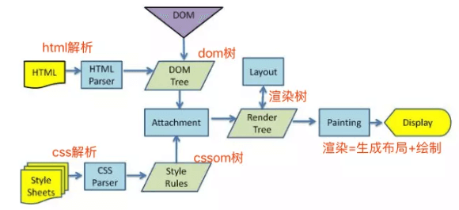
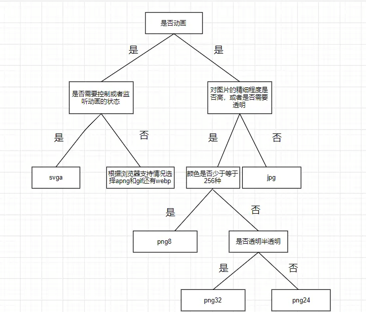
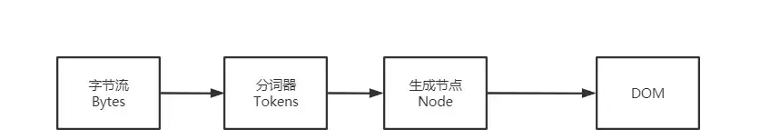

## 1. 什么是 DOM 和 BOM？

**参考答案：**

DOM（Document Object Model）和 BOM（Browser Object Model）是 JavaScript 中常用的两个概念，用于描述浏览器中的不同对象模型。

1. DOM（Document Object Model）:

   * DOM 是表示 HTML 和 XML 文档的标准的对象模型。它将文档中的每个组件（如元素、属性、文本等）都看作是一个对象，开发者可以使用 JavaScript 来操作这些对象，从而动态地改变页面的内容、结构和样式。

   * DOM 以树状结构组织文档的内容，其中树的根节点是 `document` 对象，它代表整个文档。`document` 对象有各种方法和属性，可以用来访问和修改文档的内容和结构。

2. BOM（Browser Object Model）:

   * BOM 是表示浏览器窗口及其各个组件的对象模型。它提供了一组对象，用于访问和控制浏览器窗口及其各个部分，如地址栏、历史记录等。

   * BOM 的核心对象是 `window` 对象，它表示浏览器窗口，并且是 JavaScript 中的全局对象。`window` 对象提供了许多属性和方法，用于控制浏览器窗口的各个方面，如页面导航、定时器、对话框等。

   * BOM 还提供了其他一些对象，如 `navigator`（提供浏览器相关信息）、`location`（提供当前文档的 URL 信息）、`history`（提供浏览器历史记录）、`screen`（提供屏幕信息）等。

总的来说，DOM 是用于访问和操作网页文档的对象模型，而 BOM 是用于控制浏览器窗口及其各个组件的对象模型。在 JavaScript 编程中，开发者通常会同时使用 DOM 和 BOM 来完成各种任务，如操作网页元素、导航控制、事件处理等。


***

## 2. 简单描述从输入网址到页面显示的过程


**参考答案：**

很多大公司面试喜欢问这样一道面试题，输入URL到看见页面发生了什么？

简单来说，共有以下几个过程：

* DNS解析

* 发起TCP连接

* 发送HTTP请求

* 服务器处理请求并返回HTTP报文

* 浏览器解析渲染页面

* 连接结束

下面我们来看看具体的细节。

**DNS解析**

DNS解析实际上就是寻找你所需要的资源的过程。假设你输入`www.baidu.com`，而这个网址并不是百度的真实地址，互联网中每一台机器都有唯一标识的IP地址，这个才是关键，但是它不好记，乱七八糟一串数字谁记得住啊，所以就需要一个网址和IP地址的转换，也就是DNS解析。

DNS解析其实是一个递归的过程。

输入`www.google.com`网址后，首先在本地的域名服务器中查找，没找到去根域名服务器查找，没有再去com顶级域名服务器查找，，如此的类推下去，直到找到IP地址，然后把它记录在本地，供下次使用。大致过程就是.-> .com ->google.com. -> www.google.com.。 (最后这个.对应的就是根域名服务器，默认情况下所有的网址的最后一位都是.，为了方便用户，通常都会省略，浏览器在请求DNS的时候会自动加上)

**DNS优化**

既然已经懂得了解析的具体过程，我们可以看到上述一共经过了N个过程，每个过程有一定的消耗和时间的等待，因此我们得想办法解决一下这个问题！

* DNS缓存

DNS存在着多级缓存，从离浏览器的距离排序的话，有以下几种: 浏览器缓存，系统缓存，路由器缓存，ISP服务器缓存，根域名服务器缓存，顶级域名服务器缓存，主域名服务器缓存。

* DNS负载均衡

比如访问baidu.com的时候，每次响应的并非是同一个服务器（IP地址不同），一般大公司都有成百上千台服务器来支撑访问。DNS可以返回一个合适的机器的IP给用户，例如可以根据每台机器的负载量，该机器离用户地理位置的距离等等，这种过程就是DNS负载均衡。

**发起TCP连接**

TCP提供一种可靠的传输，这个过程涉及到三次握手，四次挥手。

**三次握手**


* 第一次握手：

客户端发送syn包(Seq=x)到服务器，并进入SYN\_SEND状态，等待服务器确认；

* 第二次握手：

服务器收到syn包，必须确认客户的SYN（ack=x+1），同时自己也发送一个SYN包（Seq=y），即SYN+ACK包，此时服务器进入SYN\_RECV状态；

* 第三次握手：

客户端收到服务器的SYN＋ACK包，向服务器发送确认包ACK(ack=y+1)，此包发送完毕，客户端和服务器进入ESTABLISHED状态，完成三次握手。

握手过程中传送的包里不包含数据，三次握手完毕后，客户端与服务器才正式开始传送数据。理想状态下，TCP连接一旦建立，在通信双方中的任何一方主动关闭连接之前，TCP 连接都将被一直保持下去。

**四次挥手**

数据传输完毕后，双方都可释放连接。最开始的时候，客户端和服务器都是处于ESTABLISHED状态，假设客户端主动关闭，服务器被动关闭。

* 第一次挥手：

客户端发送一个FIN，用来关闭客户端到服务器的数据传送，也就是客户端告诉服务器：我已经不 会再给你发数据了(当然，在fin包之前发送出去的数据，如果没有收到对应的ack确认报文，客户端依然会重发这些数据)，但是，此时客户端还可以接受数据。

FIN=1，其序列号为seq=u（等于前面已经传送过来的数据的最后一个字节的序号加1），此时，客户端进入FIN-WAIT-1（终止等待1）状态。 TCP规定，FIN报文段即使不携带数据，也要消耗一个序号。

* 第二次挥手：

服务器收到FIN包后，发送一个ACK给对方并且带上自己的序列号seq，确认序号为收到序号+1（与SYN相同，一个FIN占用一个序号）。此时，服务端就进入了CLOSE-WAIT（关闭等待）状态。TCP服务器通知高层的应用进程，客户端向服务器的方向就释放了，这时候处于半关闭状态，即客户端已经没有数据要发送了，但是服务器若发送数据，客户端依然要接受。这个状态还要持续一段时间，也就是整个CLOSE-WAIT状态持续的时间。

此时，客户端就进入FIN-WAIT-2（终止等待2）状态，等待服务器发送连接释放报文（在这之前还需要接受服务器发送的最后的数据）。

* 第三次挥手：

服务器发送一个FIN，用来关闭服务器到客户端的数据传送，也就是告诉客户端，我的数据也发送完了，不会再给你发数据了。由于在半关闭状态，服务器很可能又发送了一些数据，假定此时的序列号为seq=w，此时，服务器就进入了LAST-ACK（最后确认）状态，等待客户端的确认。

* 第四次挥手：

主动关闭方收到FIN后，发送一个ACK给被动关闭方，确认序号为收到序号+1，此时，客户端就进入了TIME-WAIT（时间等待）状态。注意此时TCP连接还没有释放，必须经过2∗MSL（最长报文段寿命）的时间后，当客户端撤销相应的TCB后，才进入CLOSED状态。

服务器只要收到了客户端发出的确认，立即进入CLOSED状态。同样，撤销TCB后，就结束了这次的TCP连接。可以看到，服务器结束TCP连接的时间要比客户端早一些。

至此，完成四次挥手。

**发送HTTP请求**

发送HTTP请求，就是构建HTTP请求报文，并通过TCP协议，发送到服务器指定端口。

请求报文由`请求行`，`请求报头`，`请求正文`组成。

**服务器处理请求并返回HTTP报文**

对TCP连接进行处理，对HTTP协议进行解析，并按照报文格式进一步封装成HTTP Request对象，供上层使用。这一部分工作一般是由Web服务器去进行，比如Tomcat, Nginx和Apache等Web服务器。

HTTP报文也分成三段：`状态码`，`响应报头`和`响应报文`。

**浏览器解析渲染页面**



这个图就是Webkit解析渲染页面的过程。

* 解析HTML形成DOM树

* 解析CSS形成CSSOM 树

* 合并DOM树和CSSOM树形成渲染树

* 浏览器开始渲染并绘制页面


***

## 3. 一台设备的dpr，是否是可变的？


**参考答案：**

`devicePixelRatio`，中文名称是设备像素比。这个概念在移动开发的时候会被特别关注，因为它关系到了整个画面的观感、布局甚至是清晰度。在JavaScript BOM中，它是window全局对象下的一个属性，它的定义如下：

> dpr = 设备像素 / CSS像素

也有文章把设备像素称为物理像素，把CSS像素称为独立像素（DIPs），但所指的都是同样概念：

(1) 首先说设备像素。举手机的例子来说，设备像素也就是在手机广告上经常会看到的1920*1080像素或1280*720像素，也就是常说的分辨率为1080p或720p。它所指的是设备上有多少个能够显示一种特定颜色的最小区域，在任何设备中这个数值都是不会变的。

(2) 再说CSS像素，它的一种更广义的叫法是独立像素。CSS像素是为web开发者所打造的，是在CSS和JavaScript中使用的一个抽象的层，我们在CSS中定义的width: 100px;、font-size: 16px;等属性都是指CSS像素。而相对于CSS像素，设备像素这个概念在前端中几乎用不上（除了screen.width/height）。

那么，从定义来看，dpr的意义就是：在一个设备（的每个方向）上，每个CSS像素会被多少个实际的物理像素来显示。


上图中，一个蓝色方块代表一个设备像素，一个黄色方块代表一个CSS像素。我们可以通过这张图来理清dpr的概念：

* 如图左，一个设备像素覆盖了多个CSS像素，dpr < 1，对应用户的缩小操作；

* 如图右，一个CSS像素覆盖了多个设备像素，dpr > 1，对应用户的放大操作。

由于用户的缩放操作会改变dpr，所以设备dpr是在默认缩放为100%的情况下定义的。


***

## 4. 前端该如何选择图片的格式？


**参考答案：**

\##图片的类型

图片的类型目前就分为两种：

* 位图

* 矢量图

**位图**

所谓位图就是用像素点拼起来的图也叫点阵图，平时我们用到的png、jpg等图片就是位图。

**矢量图**

矢量图，也叫做向量图。矢量图并不纪录画面上每一点的信息，而是纪录了元素形状及颜色的算法，当你打开一幅矢量图的时候，软件对图形对应的函数进行运算，将运算结果图形的形状和颜色显示给你看。

无论显示画面是大还是小，画面上的对象对应的算法是不变的，所以，即使对画面进行倍数相当大的缩放，它也不会像位图那样会失真。

常见的就是svg格式的。

**图片的压缩类型**

* 无压缩

* 有损压缩

* 无损压缩

**无压缩**

无压缩的图片格式不对图片数据进行压缩处理，能准确地呈现原图片。例如BMP格式的图片。

**有损压缩**

指在压缩文件大小的过程中，损失了一部分图片的信息，也即降低了图片的质量（即图片被压糊了），并且这种损失是不可逆的。

常见的有损压缩手段是按照一定的算法将临近的像素点进行合并。压缩算法不会对图片所有的数据进行编码压缩，而是在压缩的时候，去除了人眼无法识别的图片细节。因此有损压缩可以在同等图片质量的情况下大幅降低图片的体积。例如jpg格式的图片使用的就是有损压缩。

**无损压缩**

在压缩图片的过程中，图片的质量没有任何损耗。我们任何时候都可以从无损压缩过的图片中恢复出原来的信息。

压缩算法对图片的所有的数据进行编码压缩，能在保证图片的质量的同时降低图片的体积。例如png、gif使用的就是无损压缩。

**图片位数**

图片位数通常分为8、16、24、32

* 图片位数越大，能表示的颜色越多，同时占用的体积也约大。例如8位图片支持256种颜色，即2的8次方。

* 图片位数越大，颜色过渡也就越细腻，携带的色彩信息可以更加丰富。

* 32位跟24位的区别就是多了一个Alpha通道，用来支持半透明，其他的跟24位基本一样。

**常见的图片的格式**

**GIF**

GIF的全称是`Graphics Interchange Format`，可译为图形交换格式，是在1987年由Compu Serve公司为了填补跨平台图像格式的空白而发展起来的。

GIF采用的是Lempel-Zev-Welch（LZW）压缩算法，最高支持256种颜色。由于这种特性，GIF比较适用于色彩较少的图片，比如卡通造型、公司标志等等。如果碰到需要用24位真彩色的场合，那么GIF的表现力就有限了。

GIF格式图片最大的特性是帧动画，相比古老的bmp格式，尺寸较小，而且支持透明(不支持半透明，因为不支持 Alpha 透明通道 )和动画。

优点：

* 体积小

* 支持动画

缺点：

* 由于采用了8位压缩，最多只能处理256种颜色

**JPEG/JPG**

JPEG是`Joint Photographic Experts Group`(联合图像专家组)的缩写，文件后辍名为"．jpg"或"．jpeg"，是常用的图像文件格式，由一个软件开发联合会组织制定，是一种有损压缩格式，能够将图像压缩在很小的储存空间，图像中重复或不重要的资料会被丢失，因此容易造成图像数据的损伤。尤其是使用过高的压缩比例，将使最终解压缩后恢复的图像质量明显降低，如果追求高品质图像，不宜采用过高压缩比例。

优点：

* 采用有损压缩，压缩后体积更小

* 支持24位真彩色

* 支持渐进式加载

缺点：

* 有损压缩会损坏图片的质量

* 不支持透明/半透明

**渐进式jpeg(progressive jpeg)**

渐进式jpg文件包含多次扫描，这些扫描顺寻的存储在jpg文件中。打开文件过程中，会先显示整个图片的模糊轮廓，随着扫描次数的增加，图片变得越来越清晰。

**PNG**

png，即便携式网络图形是一种无损压缩的位图片形格式，其设计目的是试图替代GIF和TIFF文件格式，同时增加一些GIF文件格式所不具备的特性。PNG使用从LZ77派生的无损数据压缩算法，一般应用于JAVA程序、网页或S60程序中，原因是它压缩比高，生成文件体积小。

png支持8位、24位、32位3种，我们通常叫它们png8、png24、png32。

优点：

* 无损压缩

* 支持透明、半透明

* 最高支持24位真彩色图像以及8位灰度图像，从而彻底地消除锯齿边缘。

缺点：

* 与jpg的有损耗压缩相比，png提供的压缩量较少

* 不支持动画，如需支持动画还得使用apng

**APNG**

APNG（Animated Portable Network Graphics）是一个基于PNG（Portable Network Graphics）的位图动画格式。实际上就是多张png组成的动图。MAC电脑打开可以看到组成apng的每一张图。

优点：

* 支持png的所有优点

* 支持动画

缺点：

* 浏览器支持情况较差

**WEBP**

WebP是由Google最初在2010年发布，目标是减少文件大小。它能同时支持无损压缩和有损压缩。

它几乎集成了以上所有图片的优点，并且能够拥有更高的压缩率，但是浏览器支持率还不够理想。

**SVG**

SVG是一种用XML定义的语言，用来描述二维矢量及矢量/栅格图形。SVG提供了3种类型的图形对象：矢量图形（例如：由直线和曲线组成的路径）、图象、文本。图形对象还可进行分组、添加样式、变换、组合等操作，特征集包括嵌套变换、剪切路径、alpha蒙板、滤镜效果、模板对象和其它扩展。

SVG图形是可交互的和动态的，可以在SVG文件中嵌入动画元素或通过脚本来定义动画。

SVG与上面图片不同的是它是矢量图，无论你怎么放大，它都不会失真；同时，SVG文件通常要比比JPEG和PNG格式的文件要小很多。

优点：

* SVG 可被非常多的工具读取和修改（比如记事本）

* SVG 与 JPEG 和 GIF 图像比起来，尺寸更小，且可压缩性更强。

* SVG 是可伸缩

* SVG 图像可在任何的分辨率下被高质量地打印

* SVG 可在图像质量不下降的情况下被放大

* SVG 可以与 JavaScript 技术一起运行

* SVG 文件是纯粹的 XML

缺点：

* 渲染成本相对于其他格式图片比较高，对于性能有影响。

* 需要学习成本，因为SVG是一种用XML定义的语言。

**如何选择图片的格式**




***

## 5. 前端跨页面通信，你知道哪些方法？


**参考答案：**

在前端中，有几种方法可用于实现跨页面通信：

1. LocalStorage 或 SessionStorage：这两个 Web 存储 API 可以在不同页面之间共享数据。一个页面可以将数据存储在本地存储中，另一个页面则可以读取该数据并进行相应处理。通过监听 storage 事件，可以实现数据的实时更新。

2. Cookies：使用 Cookies 也可以在不同页面之间传递数据。通过设置和读取 Cookie 值，可以在同一域名下的不同页面之间交换信息。

3. PostMessage：`window.postMessage()` 方法允许从一个窗口向另一个窗口发送消息，并在目标窗口上触发 message 事件。通过指定目标窗口的 origin，可以确保只有特定窗口能够接收和处理消息。

4. Broadcast Channel：Broadcast Channel API 允许在同一浏览器下的不同上下文（例如，在不同标签页或 iframe 中）之间进行双向通信。它提供了一个类似于发布-订阅模式的机制，通过创建一个广播频道，并在不同上下文中加入该频道，可以实现消息的广播和接收。

5. SharedWorker：SharedWorker 是一个可由多个窗口或标签页共享的 Web Worker，它可以在不同页面之间进行跨页面通信。通过 SharedWorker，多个页面可以通过 postMessage 进行双向通信，并共享数据和执行操作。

6. IndexedDB：IndexedDB 是浏览器提供的一个客户端数据库，可以在不同页面之间存储和共享数据。通过在一个页面中写入数据，另一个页面可以读取该数据。

7. WebSockets：WebSockets 提供了全双工的、双向通信通道，可以在客户端和服务器之间进行实时通信。通过建立 WebSocket 连接，可以在不同页面之间通过服务器传递数据并实现实时更新。

这些方法各有特点，适用于不同的场景。根据具体需求和使用环境，选择合适的跨页面通信方法可以实现数据传递和协作。


***

## 6. 说说你对 Dom 树的理解


**参考答案：**

**什么是 DOM**

从网络传给渲染引擎的 HTML 文件字节流是无法直接被渲染引擎理解的，所以要将其转化为渲染引擎能够理解的内部结构，这个结构就是 DOM。

DOM 提供了对 HTML 文档结构化的表述。

在渲染引擎中，DOM 有三个层面的作用：

* 从页面的视角来看，DOM 是生成页面的基础数据结构。

* 从 JavaScript 脚本视角来看，DOM 提供给 JavaScript 脚本操作的接口，通过这套接口，JavaScript 可以对 DOM 结构进行访问，从而改变文档的结构、样式和内容。

* 从安全视角来看，DOM 是一道安全防护线，一些不安全的内容在 DOM 解析阶段就被拒之门外了。

简言之，DOM 是表述 HTML 的内部数据结构，它会将 Web 页面和 JavaScript 脚本连接起来，并过滤一些不安全的内容。

**DOM树如何生成**

HTML 解析器（HTMLParser）： 负责将 HTML 字节流转换为 DOM 结构。

那么网络进程是如何将数据传给HTML解析器的呢？

网络进程和渲染进程之间有一个共享数据通道，网络进程加载了多少数据， 就将数据传给HTML解析器进行解析。

HTML解析器接收到数据（字节流）之后，字节流将转化成DOM，过程如下：



有三个阶段：

1、通过分词器将字节流转化为Token。 分词器先将字节流转换为一个个 Token，分为 Tag Token 和文本 Token。

注意，这里的Token并不是我们之前理解的Token，这里就是一个片段。

2、Token解析为DOM节点。

3、将 DOM节点添加到DOM树中。

**JavaScript影响DOM的生成**

我们知道，JavaScript可以修改DOM，它也会影响DOM的生成。

1、内嵌 JavaScript 脚本 比如我们嵌入了一段`<script>`标签的代码，之前的解析过程都一样，但是解析到script标签时， 渲染引擎判断这是一段脚本，此时 HTML 解析器就会暂停 DOM 的解析， 因为接下来的 JavaScript 可能要修改当前已经生成的 DOM 结构。

暂停解析之后，JavaScript 引擎介入，并执行`<script>`标签中的这段脚本。 脚本执行完成之后，HTML 解析器恢复解析过程，继续解析后续的内容，直至生成最终的 DOM。

2、引入 JavaScript 文件 基本上跟之前是一致的，不同点在于，暂停解析之后执行JavaScript 代码，需要先下载这段 JavaScript 代码。


***

## 7. 行内元素有哪些？块级元素有哪些？ 空(void)元素有那些？


**参考答案：**

HTML 中的行内元素（inline elements）通常用于在一行内显示，不会独占一行的空间。常见的行内元素有：

* `<span>`：用于对文本或其他内联元素进行分组或添加样式。

* `<strong>`：表示强调的文本。

* `<em>`：表示斜体强调的文本。

* `<a>`：用于创建超链接。

* ``：用于插入图像。

* `<input>`：用于创建用户输入字段。

块级元素（block-level elements）通常会独占一行的空间，并且会在前后创建换行。常见的块级元素有：

* `<div>`：用于将内容分组。

* `<p>`：用于段落。

* `<h1>`-`<h6>`：用于标题。

* `<ul>` 和 `<ol>`：用于无序和有序列表。

* `<li>`：用于列表项。

* `<table>`：用于创建表格。

空元素（void elements）是指没有闭合标签的元素。它们在 HTML 中没有内容，只有一个开启标签。常见的空元素有：

* `<br>`：用于插入换行符。

* ``：用于插入图像。

* `<input>`：用于创建用户输入字段。

* `<meta>`：用于指定页面元数据。

* `<link>`：用于引入外部资源。

* `<hr>`：用于创建水平分隔线。

注意，HTML5 中的空元素可以使用自闭合的格式，例如 `<br />`、``。


***

## 8. html和css中的图片加载与渲染规则是什么样的？


**参考答案：**

Web浏览器先会把获取到的HTML代码解析成一个DOM树，HTML中的每个标签都是DOM树中的一个节点，包括`display: none`隐藏的标签，还有JavaScript动态添加的元素等。

浏览器会获取到所有样式，并会把所有样式解析成样式规则，在解析的过程中会去掉浏览器不能识别的样式。

浏览器将会把DOM树和样式规则组合在一起（DOM元素和样式规则匹配）后将会合建一个渲染树（Render Tree），渲染树类似于DOM树，但两者别还是很大的：

渲染树能识别样式，渲染树中每个节点（NODE）都有自己的样式，而且渲染树不包含隐藏的节点（比如display:none的节点，还有`</head>`内的一些节点），因为这些节点不会用于渲染，也不会影响节点的渲染，因此不会包含到渲染树中。一旦渲染树构建完毕后，浏览器就可以根据渲染树来绘制页面了。

简单的归纳就是浏览器渲染Web页面大约会经过六个过程：

* 解析HTML，构成DOM树

* 解析加载的样式，构建样式规则树

* 加载JavaScript，执行JavaScript代码

* DOM树和样式规则树进行匹配，构成渲染树

* 计算元素位置进行页面布局

* 绘制页面，最终在浏览器中呈现

是不是会感觉这个和我们图像加载渲染没啥关系一样，事实并非如此，因为img、picture或者background-image都是DOM树或样式规则中的一部分，那么咱们套用进来，图片加载和渲染的时机有可能是下面这样：

* 解析HTML时，如果遇到img或picture标签，将会加载图片

* 解析加载的样式，遇到background-image时，并不会加载图片，而会构建样式规则树

* 加载JavaScript，执行JavaScript代码，如果代码中有创建img元素之类，会添加到DOM树中；如查有添加background-image规则，将会添加到样式规则树中

* DOM树和样式规则匹配时构建渲染树，如果DOM树节点匹配到样式规则中的backgorund-image，则会加载背景图片

* 计算元素（图片）位置进行布局

* 开始渲染图片，浏览器将呈现渲染出来的图片

上面套用浏览器渲染页面的机制，但图片加载与渲染还是有一定的规则。因为，页面中不是所有的``（或picture）元素引入的图片和background-image引入的背景图片都会加载的。那么就引发出新问题了，什么时候会真正的加载，加载规则又是什么？

先概括一点：

> Web页面中不是所有的图片都会加载和渲染！

我们可以归纳为：

* ``、`<picture>`和设置background-image的元素遇到display:none时，图片会加载，但不会渲染。

* ``、`<picture>`和设置background-image的元素祖先元素设置display:none时，background-image不会渲染也不会加载，而img和picture引入的图片不会渲染但会加载

* ``、`<picture>`和background-image引入相同路径相同图片文件名时，图片只会加载一次

* 样式文件中background-image引入的图片，如果匹配不到DOM元素，图片不会加载

* 伪类引入的background-image，比如:hover，只有当伪类被触发时，图片才会加载


***

## 9. title与h1的区别、b与strong的区别、i与em的区别？


**参考答案：**

在 HTML 中，title、h1、b、strong、i 和 em 都是文本相关的标记，它们之间有一些相似之处，但也有一些重要的区别。

**title 和 h1 的区别**

1. 用途不同：title 标签用于定义 HTML 文档的标题，通常会显示在浏览器的标签页上或者窗口的标题栏上，对于搜索引擎优化（SEO）也非常重要。而 h1 标签用于表示文档的主标题，通常显示在页面内容区域的顶部。

2. 所在位置不同：title 标签应该放在 `<head>` 标签内，而 h1 标签则应该放在 `<body>` 标签内。

3. 格式和样式不同：title 标签中的文本通常比较短，并且不需要进行格式化、排版等操作；而 h1 标签中的文本通常比较长，并且需要进行合适的格式化、排版和样式设置，以便使其适应页面布局和设计风格。

**b 和 strong 的区别**

b 标记用于指定文本加粗的外观效果，通常只是为了强调关键词或短语，没有特别强的语义化含义。而 strong 标记则表示文本的强调重点，具有更强的语义化含义，并且可以改变文本的语调和读音等方面。

**i 和 em 的区别**

i 标记用于指定文本斜体的外观效果，通常只是为了强调关键词或短语，没有特别强的语义化含义。而 em 标记则表示文本的重要性，具有更强的语义化含义，并且可以改变文本的语调和读音等方面。

**最后**

需要注意的是，在 HTML5 中，b 和 i 标记已经被废弃，推荐使用 strong 和 em 标记来代替。同时，随着搜索引擎的发展和语义化网页的兴起，h1-h6 标记也被赋予了更重要的语义化含义，应该根据具体情况来选择使用不同的标记。


***

## 10. script 标签为什么建议放在 body 标签的底部（defer、async）


**参考答案：**

因为浏览器在渲染html的时候是从上到下执行的，当遇到js文件的时候就会停止当前页面的渲染，转而去下载js文件。

如果将script标签放在头部，在文件很大的情况下将导致首屏加载时间延长，影响用户体验。

**解决办法**

* 将script标签放在body的底部

* 通过defer、async属性将js文件转为异步加载


***

## 11. 说说你对 SSG 的理解


**参考答案：**

SSG（Static Site Generation，静态网站生成）是指在构建时预先生成静态页面，并将这些页面部署到 CDN 或者其他存储服务中，以提升 Web 应用的性能和用户体验。

具体来说，SSG 的实现方式通常包括以下几个步骤：

1. 在开发阶段，使用模板引擎等技术创建静态页面模板；

2. 将需要展示的数据从后台 API 中获取或者通过其他渠道获取，并将其填充到静态页面模板中，生成完整的 HTML 页面；

3. 使用构建工具（例如 Gatsby、Next.js 等）对静态页面进行构建，生成静态 HTML、CSS 和 JavaScript 文件；

4. 部署生成好的静态文件到服务器或者 CDN 上，以供用户访问。

相比于传统的动态网页，SSG 具有如下优势：

1. 加载速度快：由于不需要每次请求都动态地渲染页面，SSG 可以减少页面加载时间，从而提高用户体验和搜索引擎排名；

2. 安全性高：由于没有后台代码和数据库，SSG 不容易受到 SQL 注入等攻击；

3. 成本低：由于不需要动态服务器等设备，SSG 可以降低网站的运维成本和服务器负担。

需要注意的是，SSG 不适用于频繁更新的内容和动态交互等场景，但对于内容较为稳定和更新较少的网站则是一个性能优化的好选择。


***

## 12. 什么是HTML5，以及和HTML的区别是什么？


**参考答案：**

HTML5是HTML的新标准，其主要目标是无需任何额外的插件如Flash、Silverlight等，就可以传输所有内容。它囊括了动画、视频、丰富的图形用户界面等。

HTML5是由万维网联盟（W3C）和 `Web Hypertext Application Technology Working Group` 合作创建的HTML新版本。

**区别**

从文档声明类型上看：

HTML是很长的一段代码，很难记住。如下代码：

```javascript
<!DOCTYPE html PUBLIC "-//W3C//DTD XHTML 1.0 Transitional//EN"
"http://www.w3.org/TR/xhtml1/DTD/xhtml1-transitional.dtd">
<html xmlns="http://www.w3.org/1999/xhtml">
```

HTML5却只有简简单单的声明，方便记忆。如下：

```plaintext
<!DOCTYPE html>
```

从语义结构上看：

* HTML4.0：没有体现结构语义化的标签，通常都是这样来命名的 `<div id="header"></div>`，这样表示网站的头部。

* HTML5：在语义上却有很大的优势。提供了一些新的标签，比如：`<header><article><footer>`。

**拓展**

不输入\<!DOCTYPE html>，浏览器将无法识别html文件，因此html将无法正常工作。


***

## 13. 什么是渐进增强和优雅降级？


**参考答案：**

渐进增强（progressive enhancement）：主要是针对低版本的浏览器进行页面重构，保证基本的功能情况下，再针对高级浏览器进行效果，交互等方面的改进和追加功能，以达到更好的用户体验。

优雅降级 graceful degradation： 一开始就构建完整的功能，然后再针对低版本的浏览器进行兼容。

**区别**

* 优雅降级是从复杂的现状开始的，并试图减少用户体验的供给；而渐进增强是从一个非常基础的，能够起作用的版本开始的，并在此基础上不断扩充，以适应未来环境的需要；

* 优雅降级（功能衰竭）意味着往回看，而渐进增强则意味着往前看，同时保证其根基处于安全地带。


***

## 14. Node 和 Element 是什么关系？


**参考答案：**

**Node与Element的关系**

Node与Element的关系，从继承方面思考可能清晰很多。

Element 继承于 Node，具有Node的方法，同时又拓展了很多自己的特有方法。

在Element的一些方法里，是明确区分了Node和Element的。比如说：childNodes与 children, parentNode与parentElement等方法。

Node的一些方法，返回值为Node，比如说文本节点，注释节点之类的，而Element的一些方法，返回值则一定是Element。

区分清楚这点了，也能避免很多低级问题。

简单的说就是Node是一个基类，DOM中的`Element`，`Text和Comment`都继承于它。换句话说，`Element`，`Text`和`Comment`是三种特殊的Node，它们分别叫做`ELEMENT_NODE`,`TEXT_NODE`和`COMMENT_NODE`。

所以我们平时使用的 html上的元素，即`Element`，是类型为`ELEMENT_NODE`的`Node`。


***

## 15. 导致页面加载白屏时间长的原因有哪些，怎么进行优化？


**参考答案：**

**一、白屏时间**

白屏时间：即用户点击一个链接或打开浏览器输入URL地址后，从屏幕空白到显示第一个画面的时间。

**二、白屏时间的重要性**

当用户点开一个链接或者是直接在浏览器中输入URL开始进行访问时，就开始等待页面的展示。页面渲染的时间越短，用户等待的时间就越短，用户感知到页面的速度就越快。这样可以极大的提升用户的体验，减少用户的跳出，提升页面的留存率。

**三、白屏的过程**

从输入url，到页面的画面展示的过程

1、首先，在浏览器地址栏中输入url

2、浏览器先查看浏览器缓存-系统缓存-路由器缓存，如果缓存中有，会直接在屏幕中显示页面内容。若没有，则跳到第三步操作。

3、在发送http请求前，需要域名解析(DNS解析)，解析获取相应的IP地址。

4、浏览器向服务器发起tcp连接，与浏览器建立tcp三次握手。

5、握手成功后，浏览器向服务器发送http请求，请求数据包。

6、服务器处理收到的请求，将数据返回至浏览器

7、浏览器收到HTTP响应

8、读取页面内容，浏览器渲染，解析html源码

9、生成Dom树、解析css样式、js交互,渲染显示页面

浏览器下载HTML后，首先解析头部代码，进行样式表下载，然后继续向下解析HTML代码，构建DOM树，同时进行样式下载。当DOM树构建完成后，立即开始构造CSSOM树。理想情况下，样式表下载速度够快，DOM树和CSSOM树进入一个并行的过程，当两棵树构建完毕，构建渲染树，然后进行绘制。

Tips:浏览器安全解析策略对解析HTML造成的影响：

当解析HTML时遇到内联JS代码，会阻塞DOM树的构建，会先执行完JS代码;当CSS样式文件没有下载完成时，浏览器解析HTML遇到了内联JS代码，此时，浏览器暂停JS脚本执行，暂停HTML解析。直到CSS文件下载完成，完成CSSOM树构建，重新恢复原来的解析。

JavaScript 会阻塞 DOM 生成，而样式文件又会阻塞 JavaScript 的执行，所以在实际的工程中需要重点关注 JavaScript 文件和样式表文件，使用不当会影响到页面性能的。

**四、白屏-性能优化**

1. DNS解析优化

针对DNS Lookup环节，我们可以针对性的进行DNS解析优化。

* DNS缓存优化

* DNS预加载策略

* 稳定可靠的DNS服务器

- TCP网络链路优化

多花点钱吧

* 服务端处理优化

服务端的处理优化，是一个非常庞大的话题，会涉及到如Redis缓存、数据库存储优化或是系统内的各种中间件以及Gzip压缩等…

* 浏览器下载、解析、渲染页面优化

根据浏览器对页面的下载、解析、渲染过程，可以考虑一下的优化处理：

* 尽可能的精简HTML的代码和结构

* 尽可能的优化CSS文件和结构

* 一定要合理的放置JS代码，尽量不要使用内联的JS代码

* 将渲染首屏内容所需的关键CSS内联到HTML中，能使CSS更快速地下载。在HTML下载完成之后就能渲染了，页面渲染的时间提前，从而缩短首屏渲染时间；

* 延迟首屏不需要的图片加载，而优先加载首屏所需图片（offsetTop\<clientHeight）

```javascript
document.documentElement.clientHeight//获取屏幕可视区域的高度
element.offsetTop//获取元素相对于文档顶部的高度
```

因为JavaScript 会阻塞 DOM 生成，而样式文件又会阻塞 JavaScript 的执行，所以在实际的工程中需要重点关注 JavaScript 文件和样式表文件，使用不当会影响到页面性能的。


***

## 16. 如何控制 input 输入框的输入字数？


**参考答案：**

一般是通过 maxlength 属性进行限制：

```javascript
<input maxlength="5" />
```

另外还可以通过监听 `οninput` 事件，对输入值进行处理。


***

## 17. 渐进式jpg有了解过吗？


**参考答案：**

渐进式 JPEG（Progressive JPEG），即PJPEG，是该标准的三种流行压缩模式之一。

渐进式 JPEG 以特定方式压缩照片和图形，与基线 JPEG 不同，PJPEG 在 Web 浏览器中呈现时，会首先给出模糊图像的外观。然后一点一点地开始图片渲染，直到它显示完全渲染的图像。浏览器实际上是逐行解释图像，但在占位符中提供了完整图像的模糊预览。随着 Web 浏览器的渲染引擎处理数据，图像的对比度开始变得更清晰、更详细。直到最后渲染完毕，用户将看到完整的清晰图像。

PJPEG 能够起到一种很有意义的心理效果，让用户有东西可看，而不必坐着干等大型图像慢慢显示在屏幕上。

PJPEG 适用于大部分常用的浏览器，包括 `Chrome`、`Firefox` 和 `Internet Explorer 9` 及更高版本。旧版本的 Internet Explorer 在显示渐进式 JPEG 时存在一些问题，不过这只是很小一部分用户。而不支持渐进式 JPEG 格式的浏览器会像普通 JPEG 一样加载照片。


***

## 18. 假设我要上传图片，怎么在选择图片后，通过浏览器预览待上传的图片？


**参考答案：**

实现预览有两种方式：

* 一种是用 `window.URL.createObjectURl` 方法对选择的图片数据（可以勉强理解为input的value）生成一个blob对象路径

* 第二种是使用 `FileReader` 读取器

那么无论那种方法，首先都得得到文件数据，获得文件数据是从files集合中获取。

先来看下 `window.URL.createObjectURl` 的实现方法：

```javascript
function imgChange(img) {
 document.querySelector("img").src=window.URL.cteateObejectURL(img.files[0]);
}
```

而使用 `FileRader` 读取文件.可分为四步；

1. 创建 `FileReader` 对像；

2. 调用 `readAsDataURL` 方法读取文件；

3. 调用 `onload` 事件监听。因为我们需要拿到完整的数据，但我们又不知道文件何时读完，所以需要第三步监听；

4. 通过 `FileReader` 的 `result` 属性拿到读取结果。

```javascript
function imgChange(img) {
    // 生成一个文件读取的对象
    const reader = new FileReader();
    reader.onload = function (ev) {
        document.querySelector("img").src = imgFile;
    }
    //发起异步读取文件请求，读取结果为data:url的字符串形式，
    reader.readAsDataURL(img.files[0]);
}
```


***

## 19. 怎么实现“点击回到顶部”的功能？


**参考答案：**

下面介绍5种方法进行实现。

**1、锚点**

使用锚点链接是一种简单的返回顶部的功能实现。

该实现主要在页面顶部放置一个指定名称的锚点链接，然后在页面下方放置一个返回到该锚点的链接，用户点击该链接即可返回到该锚点所在的顶部位置。

```javascript
<body style="height:2000px;">
    <div id="topAnchor"></div>
    <a href="#topAnchor" style="position:fixed;right:0;bottom:0">回到顶部</a>
</body>
```

**2、scrollTop**

scrollTop属性表示被隐藏在内容区域上方的像素数。

元素未滚动时，scrollTop的值为0，如果元素被垂直滚动了，scrollTop的值大于0，且表示元素上方不可见内容的像素宽度

由于scrollTop是可写的，可以利用scrollTop来实现回到顶部的功能

```javascript
<body style="height:2000px;">
    <button id="test" style="position:fixed;right:0;bottom:0">回到顶部</button>
    <script>
        test.onclick = function(){
            document.body.scrollTop = document.documentElement.scrollTop = 0;
        }
    </script>
</body>
```

**3、scrollTo**

scrollTo(x,y)方法滚动当前window中显示的文档，让文档中由坐标x和y指定的点位于显示区域的左上角

设置scrollTo(0,0)可以实现回到顶部的效果

```javascript
<body style="height:2000px;">
    <button id="test" style="position:fixed;right:0;bottom:0">回到顶部</button>
    <script>
        test.onclick = function(){
            scrollTo(0,0);
        }
    </script>
</body>
```

**4、scrollBy()**

scrollBy(x,y)方法滚动当前window中显示的文档，x和y指定滚动的相对量

只要把当前页面的滚动长度作为参数，逆向滚动，则可以实现回到顶部的效果

```javascript
<body style="height:2000px;">
    <button id="test" style="position:fixed;right:0;bottom:0">回到顶部</button>
    <script>
        test.onclick = function(){
            var top = document.body.scrollTop || document.documentElement.scrollTop
            scrollBy(0,-top);
        }
    </script>
</body>
```

**5、scrollIntoView()**

Element.scrollIntoView方法滚动当前元素，进入浏览器的可见区域　

该方法可以接受一个布尔值作为参数。如果为true，表示元素的顶部与当前区域的可见部分的顶部对齐（前提是当前区域可滚动）；如果为false，表示元素的底部与当前区域的可见部分的尾部对齐（前提是当前区域可滚动）。如果没有提供该参数，默认为true

使用该方法的原理与使用锚点的原理类似，在页面最上方设置目标元素，当页面滚动时，目标元素被滚动到页面区域以外，点击回到顶部按钮，使目标元素重新回到原来位置，则达到预期效果

```javascript
<body style="height:2000px;">
    <div id="target"></div>
    <button id="test" style="position:fixed;right:0;bottom:0">回到顶部</button>
    <script>
        test.onclick = function(){
            target.scrollIntoView();
        }
    </script>
</body>
```


***

## 20. SPA应用怎么进行SEO？


**参考答案：**

**概述**

SPA全名是`Single Page Application`，指的是单页面应用。

SEO全称为`Search Engine Optimization`，指的是搜索引擎优化。

SPA技术将产出html的逻辑从服务器转移到了客户端，在进入React, Vue等UI框架进行开发时，我们开发的页面更多的是在客户端进行脚本执行、数据请求和UI动态装载。

那么搜索引擎爬虫在抓取这样的页面的时，在未做任何优化的情况下，通常拿到的是类似下面的字符文本：

```javascript
<!DOCTYPE html>
<html lang="zh-CN">
<head>
    <meta charset="UTF-8">
    <title>title</title>
</head>
<body>
<div id="root"></div>
<script src="index.js"></script>
</body>
</html>
```

除了可以事先定义的title（可能title也不能事先确定），在SPA下很多内容需要通过ajax请求server拿到数据通过脚本执行产生。通常爬虫不会有类似浏览器的执行环境去产生这些内容。

那么如何让爬虫拿到的数据和用户通过浏览器看到的数据尽量是一致？

**SPA的优缺点**

优点：用户体验好，前后端代码分离，利于后期的维护

缺点：seo不好，首次加载时长比较久，导航需要自己去实现前进后退。

**SPA如何解决SEO的问题**

* SSR 服务端渲染

优点：首屏加载快(因为服务器返回的网页已经包含数据, 所以之下载完JS/CSS就可以直接渲染)。每次请求返回的都是一个独立完成的网页, 更利于SEO。

缺点就是服务器压力会比较大，对网络要求比较大，

**预渲染**

无需服务器实时动态编译，采用预渲染，在构建时针对特定路由简单的生成静态HTML文件

本质就是客户端渲染, 只不过和SPA不同的是预渲染有多个界面

最大优点: 由于有多个界面, 所以更利于SEO

最大缺点: 首屏加载慢, 预编译会非常的慢


***

## 21. 如何实现SEO优化


**参考答案：**

SEO主要分为内部和外部两个方向。

**一、内部优化**

* META 标签优化：例如：TITLE，KEYWORDS，DESCRIPTION （TDK）等的优化

* 内部链接的优化，包括相关性链接（Tag 标签），锚文本链接，各导航链接，及图片链接

* 网站内容更新：每天保持站内的更新(主要是文章的更新等)

* 服务器端渲染（SSR）

**二、外部优化**

* 外部链接类别：博客、论坛、B2B、新闻、分类信息、贴吧、知道、百科、相关信息网等尽量保持链接的多样性

* 外链运营：每天添加一定数量的外部链接，使关键词排名稳定提升。

* 外链选择：与一些和你网站相关性比较高,整体质量比较好的网站交换友情链接,巩固稳定关键词排名


***

## 22. SEO是什么？


**参考答案：**

SEO（Search Engine Optimization），汉译为搜索引擎优化。

搜索引擎优化是一种利用搜索引擎的搜索规则来提高目前网站在有关搜索引擎内的自然排名的方式。

SEO是指为了从搜索引擎中获得更多的免费流量，从网站结构、内容建设方案、用户互动传播、页面等角度进行合理规划，使网站更适合搜索引擎的索引原则的行为。


***

## 23. SEO的原理是什么？


**参考答案：**

搜索引擎排名大致上可以分为四个步骤。

**爬行和抓取**

搜索引擎派出一个能够在网上发现新网页并抓取文件的程序，这个程序通常被称为蜘蛛或机器人。

搜索引擎蜘蛛从数据库中已知的网页开始出发，就像正常用户的浏览器一样访问这些网页并抓取文件。

并且搜索引擎蜘蛛会跟踪网页上的链接，访问更多网页，这个过程就叫爬行。

当通过链接发现有新的网址时，蜘蛛将把新网址记录入数据库等待抓取。

跟踪网页链接是搜索引擎蜘蛛发现新网址的最基本方法，所以反向链接成为搜索引擎优化的最基本因素之一。

没有反向链接，搜索引擎连页面都发现不了，就更谈不上排名了。

搜索引擎蜘蛛抓取的页面文件与用户浏览器得到的完全一样，抓取的文件存入数据库。

**索引**

搜索引擎索引程序把蜘蛛抓取的网页文件分解、分析，并以巨大表格的形式存入数据库，这个过程就是索引。在索引数据库中，网页文字内容，关键词出现的位置、字体、颜色、加粗、斜体等相关信息都有相应记录。

搜索引擎索引数据库存储巨量数据，主流搜索引擎通常都存有几十亿级别的网页。

**搜索词处理**

用户在搜索引擎界面输入关键词，单击“搜索”按钮后，搜索引擎程序即对输入的搜索词进行处理，如中文特有的分词处理，对关键词词序的分别，去除停止词，判断是否需要启动整合搜索，判断是否有拼写错误或错别字等情况。搜索词的处理必须十分快速。

**排序**

对搜索词进行处理后，搜索引擎排序程序开始工作，从索引数据库中找出所有包含搜索词的网页，并且根据排名计算法计算出哪些网页应该排在前面，然后按一定格式返回“搜索”页面。

排序过程虽然在一两秒之内就完成返回用户所要的搜索结果，实际上这是一个非常复杂的过程。排名算法需要实时从索引数据库中找出所有相关页面，实时计算相关性，加入过滤算法，其复杂程度是外人无法想象的。搜索引擎是当今规模最大、最复杂的计算系统之一。

但是即使最好的搜素引擎在鉴别网页上也还无法与人相比，这就是为什么网站需要搜索引擎优化。没有 SEO 的帮助，搜索引擎常常并不能正确返回最相关、最权威、最有用的信息。


***

## 24. DNS 预解析是什么？怎么实现？


**参考答案：**

**DNS优化**

在介绍`dns-prefetch`之前，先要提下当前对于DNS优化主流方法。

一般来说，一次DNS解析需要耗费 20-120ms，所以为了优化DNS，我们可以考虑两个方向：

1. 减少DNS请求次数

2. 缩短DNS解析时间`dns-prefetch`

**什么是dns-prefetch？**

`dns-prefetch`(DNS预获取)是前端网络性能优化的一种措施。它根据浏览器定义的规则，提前解析之后可能会用到的域名，使解析结果缓存到系统缓存中，缩短DNS解析时间，进而提高网站的访问速度。

**为什么要用dns-prefetch？**

每当浏览器从（第三方）服务器发送一次请求时，都要先通过DNS解析将该跨域域名解析为 IP地址，然后浏览器才能发出请求。

如果某一时间内，有多个请求都发送给同一个服务器，那么DNS解析会多次并且重复触发。这样会导致整体的网页加载有延迟的情况。

我们知道，虽然DNS解析占用不了多大带宽，但是它会产生很高的延迟，尤其是对于移动网络会更为明显。

因此，为了减少DNS解析产生的延迟，我们可以通过`dns-prefetch`预解析技术有效地缩短DNS解析时间。

```plaintext
<link rel="dns-prefetch" href="https://baidu.com/"> 
```

**dns-prefetch背后原理**

当浏览器访问一个域名的时候，需要解析一次DNS，获得对应域名的ip地址。 在解析过程中，按照:

* 浏览器缓存

* 系统缓存

* 路由器缓存

* ISP(运营商)DNS缓存

* 根域名服务器

* 顶级域名服务器

* 主域名服务器

的顺序逐步读取缓存，直到拿到IP地址。

`dns-prefetch`就是在将解析后的IP缓存在系统中。

这样，`dns-prefetch`就有效地缩短了DNS解析时间。因为，在本地操作系统做了DNS缓存，使得DNS在解析的过程中，提前在系统缓存中找到了对应IP。

这样一来， 后续的解析步骤就不用执行了，进而也就缩短了DNS解析时间。

假如浏览器首次将一个域名解析为IP地址，并缓存至操作系统，那么下一次DNS解析时间可以低至0-1ms。

倘若结果不缓存在系统，那么就需要读取路由器的缓存，进而后续的解析时间最小也要约15ms。

如果路由器缓存也不存在，则需要读取ISP（运营商）DNS缓存，一般像`taobao.com`、`baidu.com`这些常见的域名，读取ISP（运营商）DNS缓存需要的时间在80-120ms，如果是不常见的域名，平均需要200-300ms。

一般来说，大部分的网站到运营商这块都能找到IP。

那也就是说，`dns-prefetch`可以给DNS解析过程带来15-300ms的提升，尤其是一些大量引用很多其他域名资源的网站，提升效果就更加明显了

**浏览器DNS缓存与dns-prefetch**

现代浏览器为了优化DNS解析，也设有了浏览器DNS缓存。

每当在首次DNS解析后会对其IP进行缓存。至于缓存时长，每种浏览器都不一样，比如Chrome的过期时间是1分钟，在这个期限内不会重新请求DNS。

> Tip:
>
> 每当Chrome浏览器启动的时候，就会自动的快速解析浏览器最近一次启动时记录的前10个域名。所以经常访问的网址就不存在DNS解析的延迟，进而打开速度更快。

而`dns-prefetch` 相当于在浏览器缓存之后，在本地操作系统中做了DNS缓存，个人理解，为的是给浏览器缓存做保障，尽量让DNS解析出本地，以此来做了又一层DNS解析优化。

一般来说，DNS在系统的缓存时间是大于浏览器的。

**浏览器与系统DNS缓存时间**

> TTL(Time-To-Live)，就是一条域名解析记录在DNS服务器中的存留时间

* 浏览器DNS缓存的时间跟DNS服务器返回的TTL值无关, 它的缓存时间取决于浏览器自身设置。

* 系统缓存会参考DNS服务器响应的TTL值，但是不完全等于TTL值。

国内和国际上很多平台的TTL值都是以秒为单位的，很多的默认值都是3600，也就是默认缓存1小时。

**`dns-prefetch`缺点**

`dns-prefetch`最大的缺点就是使用它太多。

过多的预获取会导致过量的DNS解析，对网络是一种负担。

**最佳实践**

请记住以下三点：

1. `dns-prefetch` 仅对[跨域](https://developer.mozilla.org/zh-CN/docs/Web/HTTP/CORS)域上的 DNS查找有效，因此请避免使用它来指向相同域。这是因为，到浏览器看到提示时，您站点域背后的IP已经被解析。

2. 除了link 还可以通过使用 [HTTP链接字段](https://developer.mozilla.org/zh-CN/docs/Web/HTTP/Headers/Link)将 `dns-prefetch`（以及其他资源提示）指定为 [HTTP标头](https://developer.mozilla.org/zh-CN/docs/Web/HTTP/Headers)：

Link: <https://fonts.gstatic.com/>; rel=dns-prefetch

1. 考虑将 `dns-prefetch` 与 `preconnect(`预连接`)`提示配对。

由于`dns-prefetch` 仅执行 DNS查找，不像`preconnect` 会建立与服务器的连接。

如果站点是通过HTTPS服务的，两者的组合会涵盖DNS解析，建立TCP连接以及执行TLS握手。将两者结合起来可提供进一步减少[跨域请求](https://developer.mozilla.org/zh-CN/docs/Web/HTTP/CORS)的感知延迟的机会。如下所示：

\<link rel="preconnect" href="https://fonts.gstatic.com/" crossorigin>
\<link rel="dns-prefetch" href="https://fonts.gstatic.com/">

Note: 如果页面需要建立与许多第三方域的连接，则将它们预先连接会适得其反。 `preconnect` 提示最好仅用于最关键的连接。对于其他的，只需使用 `<link rel="dns-prefetch">` 即可节省第一步的时间DNS查找。


***

## 25. HTML5 有哪些 drag 相关的 API ？


**参考答案：**

* dragstart：事件主体是被拖放元素，在开始拖放被拖放元素时触发。

* darg：事件主体是被拖放元素，在正在拖放被拖放元素时触发。

* dragenter：事件主体是目标元素，在被拖放元素进入某元素时触发。

* dragover：事件主体是目标元素，在被拖放在某元素内移动时触发。

* dragleave：事件主体是目标元素，在被拖放元素移出目标元素是触发。

* drop：事件主体是目标元素，在目标元素完全接受被拖放元素时触发。

* dragend：事件主体是被拖放元素，在整个拖放操作结束时触发。


***

## 26. 浏览器乱码的原因是什么？如何解决？


**参考答案：**

产生乱码的原因：

* 网页源代码是`gbk`的编码，而内容中的中文字是`utf-8`编码的，这样浏览器打开即会出现`html`乱码，反之也会出现乱码；

* `html`网页编码是`gbk`，而程序从数据库中调出呈现是`utf-8`编码的内容也会造成编码乱码；

* 浏览器不能自动检测网页编码，造成网页乱码。

解决办法：

* 使用软件编辑HTML网页内容；

* 如果网页设置编码是`gbk`，而数据库储存数据编码格式是`UTF-8`，此时需要程序查询数据库数据显示数据前进程序转码；

* 如果浏览器浏览时候出现网页乱码，在浏览器中找到转换编码的菜单进行转换。


***

## 27. Canvas和SVG有什么区别？


**参考答案：**

（1）SVG： SVG可缩放矢量图形（Scalable Vector Graphics）是基于可扩展标记语言XML描述的2D图形的语言，SVG基于XML就意味着SVG DOM中的每个元素都是可用的，可以为某个元素附加Javascript事件处理器。在 SVG 中，每个被绘制的图形均被视为对象。如果 SVG 对象的属性发生变化，那么浏览器能够自动重现图形。

其特点如下：

* 不依赖分辨率

* 支持事件处理器

* 最适合带有大型渲染区域的应用程序（比如谷歌地图）

* 复杂度高会减慢渲染速度（任何过度使用 DOM 的应用都不快）

* 不适合游戏应用

（2）Canvas： Canvas是画布，通过Javascript来绘制2D图形，是逐像素进行渲染的。其位置发生改变，就会重新进行绘制。

其特点如下：

* 依赖分辨率

* 不支持事件处理器

* 弱的文本渲染能力

* 能够以 .png 或 .jpg 格式保存结果图像

* 最适合图像密集型的游戏，其中的许多对象会被频繁重绘

注：矢量图，也称为面向对象的图像或绘图图像，在数学上定义为一系列由线连接的点。矢量文件中的图形元素称为对象。每个对象都是一个自成一体的实体，它具有颜色、形状、轮廓、大小和屏幕位置等属性。


***

## 28. 浏览器是如何对 HTML5 的离线储存资源进行管理和加载？


**参考答案：**

* 在线的情况下，浏览器发现 html 头部有 manifest 属性，它会请求 manifest 文件，如果是第一次访问页面 ，那么浏览器就会根据 manifest 文件的内容下载相应的资源并且进行离线存储。如果已经访问过页面并且资源已经进行离线存储了，那么浏览器就会使用离线的资源加载页面，然后浏览器会对比新的 manifest 文件与旧的 manifest 文件，如果文件没有发生改变，就不做任何操作，如果文件改变了，就会重新下载文件中的资源并进行离线存储。

* 离线的情况下，浏览器会直接使用离线存储的资源。


***

## 29. HTML5的离线储存怎么使用，它的工作原理是什么


**参考答案：**

离线存储指的是：在用户没有与因特网连接时，可以正常访问站点或应用，在用户与因特网连接时，更新用户机器上的缓存文件。

\*\*原理：\*\*HTML5的离线存储是基于一个新建的 `.appcache` 文件的缓存机制(不是存储技术)，通过这个文件上的解析清单离线存储资源，这些资源就会像cookie一样被存储了下来。之后当网络在处于离线状态下时，浏览器会通过被离线存储的数据进行页面展示

使用方法： （1）创建一个和 html 同名的 manifest 文件，然后在页面头部加入 manifest 属性：

```javascript
<html lang="en" manifest="index.manifest">
```

（2）在 `cache.manifest` 文件中编写需要离线存储的资源：

```javascript
CACHE MANIFEST
    #v0.11
    CACHE:
    js/app.js
    css/style.css
    NETWORK:
    resourse/logo.png
    FALLBACK:
    / /offline.html
```

* CACHE: 表示需要离线存储的资源列表，由于包含 manifest 文件的页面将被自动离线存储，所以不需要把页面自身也列出来。

* NETWORK: 表示在它下面列出来的资源只有在在线的情况下才能访问，他们不会被离线存储，所以在离线情况下无法使用这些资源。不过，如果在 CACHE 和 NETWORK 中有一个相同的资源，那么这个资源还是会被离线存储，也就是说 CACHE 的优先级更高。

* FALLBACK: 表示如果访问第一个资源失败，那么就使用第二个资源来替换他，比如上面这个文件表示的就是如果访问根目录下任何一个资源失败了，那么就去访问 offline.html 。

（3）在离线状态时，操作 `window.applicationCache` 进行离线缓存的操作。

如何更新缓存：

（1）更新 manifest 文件

（2）通过 javascript 操作

（3）清除浏览器缓存

注意事项：

（1）浏览器对缓存数据的容量限制可能不太一样（某些浏览器设置的限制是每个站点 5MB）。

（2）如果 manifest 文件，或者内部列举的某一个文件不能正常下载，整个更新过程都将失败，浏览器继续全部使用老的缓存。

（3）引用 manifest 的 html 必须与 manifest 文件同源，在同一个域下。

（4）FALLBACK 中的资源必须和 manifest 文件同源。

（5）当一个资源被缓存后，该浏览器直接请求这个绝对路径也会访问缓存中的资源。

（6）站点中的其他页面即使没有设置 manifest 属性，请求的资源如果在缓存中也从缓存中访问。

（7）当 manifest 文件发生改变时，资源请求本身也会触发更新。


***

## 30. img的srcset属性的作⽤？


**参考答案：**

响应式页面中经常用到根据屏幕密度设置不同的图片。这时就用到了 img 标签的srcset属性。srcset属性用于设置不同屏幕密度下，img 会自动加载不同的图片。用法如下：

```javascript

```

使用上面的代码，就能实现在屏幕密度为1x的情况下加载image-128.png, 屏幕密度为2x时加载image-256.png。

按照上面的实现，不同的屏幕密度都要设置图片地址，目前的屏幕密度有1x,2x,3x,4x四种，如果每一个图片都设置4张图片，加载就会很慢。所以就有了新的srcset标准。代码如下：

```javascript

```

其中srcset指定图片的地址和对应的图片质量。sizes用来设置图片的尺寸零界点。对于 srcset 中的 w 单位，可以理解成图片质量。如果可视区域小于这个质量的值，就可以使用。浏览器会自动选择一个最小的可用图片。

sizes语法如下：

```javascript
sizes="[media query] [length], [media query] [length] ... "
```

sizes就是指默认显示128px, 如果视区宽度大于360px, 则显示340px。


***

## 31. label标签有什么用？


**参考答案：**

label标签来定义表单控制间的关系。当用户选择该标签时，浏览器会自动将焦点转到和标签相关的表单控件上。

```javascript
<label for="Name">Number:</label>
<input type='text' name="Name" id="Name"/>

<label>Date:<input type="text" name="B"/></label>
```


***

## 32. js和css是如何影响DOM树构建的？


**参考答案：**

先做个总结，然后再进行具体的分析：

CSS不会阻塞DOM的解析，但是会影响JAVAScript的运行，javaSscript会阻止DOM树的解析，最终css（CSSOM）会影响DOM树的渲染，也可以说最终会影响渲染树的生成。

接下来我们先看javascript对DOM树构建和渲染是如何造成影响的，分成三种类型来讲解：

**JavaScript脚本在html页面中**

```javascript
<html>
  <body>
    <div>1</div>
    <script>
      let div1 = document.getElementsByTagName('div')[0]
      div1.innerText = 'time.geekbang'
    </script>
    <div>test</div>
  </body>
</html>
```

两段div中间插入一段JavaScript脚本，这段脚本的解析过程就有点不一样了。

当解析到script脚本标签时，HTML解析器暂停工作，javascript引擎介入，并执行script标签中的这段脚本。

因为这段javascript脚本修改了DOM中第一个div中的内容，所以执行这段脚本之后，div节点内容已经修改为time.geekbang了。脚本执行完成之后，HTML解析器回复解析过程，继续解析后续的内容，直至生成最终的DOM。

**html页面中引入javaScript文件**

```javascript
//foo.js
let div1 = document.getElementsByTagName('div')[0]
div1.innerText = 'time.geekbang'
```

```javascript
<html>
  <body>
    <div>1</div>
    <script type="text/javascript" src='foo.js'></script>
    <div>test</div>
  </body>
</html>
```

这段代码的功能还是和前面那段代码是一样的，只是把内嵌JavaScript脚本修改成了通过javaScript文件加载。

其整个执行流程还是一样的，执行到JAVAScript标签时，暂停整个DOM的解析，执行javascript代码，不过这里执行javascript时，需要现在在这段代码。这里需要重点关注下载环境，因为javascript文件的下载过程会阻塞DOM解析，而通常下载又是非常耗时的，会受到网络环境、javascript文件大小等因素的影响。

优化机制：

谷歌浏览器做了很多优化，其中一个主要的优化就是预解析操作。当渲染引擎收到字节流之后，会开启一个预解析线程，用来分析HTML文件中包含的JavaScript、CSS等相关文件，解析到相关文件之后，会开启一个预解析线程，用来分析HTML文件中包含的javascprit、css等相关文件、解析到相关文件之后，预解析线程会提前下载这些文件。

再回到 DOM 解析上，我们知道引入 JavaScript 线程会阻塞 DOM，不过也有一些相关的策略来规避，比如使用 CDN 来加速 JavaScript 文件的加载，压缩 JavaScript 文件的体积。

另外，如果 JavaScript 文件中没有操作 DOM 相关代码，就可以将该 JavaScript 脚本设置为异步加载，通过 async 或 defer 来标记代码，使用方式如下所示：

```plaintext
<script async type="text/javascript" src='foo.js'></script>
<script defer type="text/javascript" src='foo.js'></script>
```

async和defer区别：

* async：脚本并行加载，加载完成之后立即执行，执行时机不确定，仍有可能阻塞HTML解析，执行时机在load事件派发之前。

* defer：脚本并行加载，等待HTML解析完成之后，按照加载顺序执行脚本，执行时机DOMContentLoaded事件派发之前。

**html页面中有css样式**

```javascript
//theme.css
div {color:blue}
```

```javascript
<html>
<head>
    <style src='theme.css'></style>
</head>
<body>
  <div>1</div>
  <script>
      let div1 = document.getElementsByTagName('div')[0]
      div1.innerText = 'time.geekbang' // 需要 DOM
      div1.style.color = 'red' // 需要 CSSOM
  </script>
  <div>test</div>
</body>
</html>
```

该示例中，JavaScript 代码出现了 `div1.style.color = ‘red’` 的语句，它是用来操纵 CSSOM 的，所以在执行 JavaScript 之前，需要先解析 JavaScript 语句之上所有的CSS 样式。所以如果代码里引用了外部的 CSS 文件，那么在执行 JavaScript 之前，还需要等待外部的 CSS 文件下载完成，并解析生成 CSSOM 对象之后，才能执行 JavaScript 脚本。

而 JavaScript 引擎在解析 JavaScript 之前，是不知道 JavaScript 是否操纵了 CSSOM的，所以渲染引擎在遇到 JavaScript 脚本时，不管该脚本是否操纵了 CSSOM，都会执行CSS 文件下载，解析操作，再执行 JavaScript 脚本。所以说 JavaScript 脚本是依赖样式表的，这又多了一个阻塞过程。

总结：通过上面三点的分析，我们知道了 JavaScript 会阻塞 DOM 生成，而样式文件又会阻塞js的执行。


***

## 33. CSSOM树和DOM树是同时解析的吗？


**参考答案：**

浏览器会下下载HTML解析页面生成DOM树，遇到CSS标签就开始解析CSS，这个过程不会阻塞，但是如果遇到了JS脚本，此时假如CSSOM还没有构建完，需要等待CSSOM构建完，再去执行JS脚本，然后再执行DOM解析，此时会阻塞。


***

## 34. 如何实现浏览器内多个标签页之间的通信？


**参考答案：**

**Broadcast Channel**

顾名思义，“广播频道”，官方文档里的解释为“用于同源不同页面之间完成通信的功能”，在其中某个页面发送的消息会被其他页面监听到。

注意“同源”二字，该方法无法完成跨域的数据传输。

**localStorage**

localStorage是浏览器多个标签共用的存储空间，所以可以用来实现多标签之间的通信(ps：session是会话级的存储空间，每个标签页都是单独的）。

**SharedWorker**

SharedWorker可以被多个window共同使用，但必须保证这些标签页都是同源的(相同的协议，主机和端口号)

**WebSocket通讯**

全双工（full-duplex）通信自然可以实现多个标签之间的通信

**定时器setInterval+cookie**

* 在页面A设置一个使用setInterval定时器不断刷新，检查Cookies的值是否发生变化，如果变化就进行刷新的操作。

* 由于Cookies是在同域可读的，所以在页面B审核的时候改变Cookies的值，页面A自然是可以拿到的。

这样做确实可以实现我想要的功能，但是这样的方法相当浪费资源。虽然在这个性能过盛的时代，浪费不浪费也感觉不出来，但是这种实现方案，确实不够优雅。

**postMessage**

两个需要交互的tab页面具有依赖关系。

如 A页面中通过JavaScript的window.open打开B页面，或者B页面通过iframe嵌入至A页面，此种情形最简单，可以通过HTML5的 window.postMessage API完成通信，由于postMessage函数是绑定在 window 全局对象下，因此通信的页面中必须有一个页面（如A页面）可以获取另一个页面（如B页面）的window对象，这样才可以完成单向通信；B页面无需获取A页面的window对象，如果需要B页面对A页面的通信，只需要在B页面侦听message事件，获取事件中传递的source对象，该对象即为A页面window对象的引用：

```javascript
//B页面
window.addEventListner('message',(e)=>{
    let {data,source,origin} = e;
    source.postMessage('message echo','/');
});
```

postMessage的第一个参数为消息实体，它是一个结构化对象，即可以通过“JSON.stringify和JSON.parse”函数还原的对象；第二个参数为消息发送范围选择器，设置为“/”意味着只发送消息给同源的页面，设置为“\*”则发送全部页面。


***

## 35. 说说你对以下几个页面生命周期事件的理解：DOMContentLoaded，load，beforeunload，unload


**参考答案：**

HTML 页面的生命周期包含三个重要事件：

* DOMContentLoaded —— 浏览器已完全加载 HTML，并构建了 DOM 树，但像 \ 和样式表之类的外部资源可能尚未加载完成。

* load —— 浏览器不仅加载完成了 HTML，还加载完成了所有外部资源：图片，样式等。

* beforeunload/unload —— 当用户正在离开页面时。

每个事件都是有用的：

* DOMContentLoaded 事件 —— DOM 已经就绪，因此处理程序可以查找 DOM 节点，并初始化接口。

* load 事件 —— 外部资源已加载完成，样式已被应用，图片大小也已知了。

* beforeunload 事件 —— 用户正在离开：我们可以检查用户是否保存了更改，并询问他是否真的要离开。

* unload 事件 —— 用户几乎已经离开了，但是我们仍然可以启动一些操作，例如发送统计数据。

**DOMContentLoaded 和脚本**

当浏览器处理一个 HTML 文档，并在文档中遇到 \<script> 标签时，就会在继续构建 DOM 之前运行它。这是一种防范措施，因为脚本可能想要修改 DOM，甚至对其执行 document.write 操作，所以 DOMContentLoaded 必须等待脚本执行结束。

因此，DOMContentLoaded 肯定在下面的这些脚本执行结束之后发生。

此规则有两个例外：

* 具有 async 特性（attribute）的脚本不会阻塞 DOMContentLoaded，稍后 我们会讲到。

* 使用 document.createElement('script') 动态生成并添加到网页的脚本也不会阻塞 DOMContentLoaded。

**DOMContentLoaded 和样式**

外部样式表不会影响 DOM，因此 DOMContentLoaded 不会等待它们。

但这里有一个陷阱。如果在样式后面有一个脚本，那么该脚本必须等待样式表加载完成。原因是，脚本可能想要获取元素的坐标和其他与样式相关的属性。因此，它必须等待样式加载完成。

当 DOMContentLoaded 等待脚本时，它现在也在等待脚本前面的样式。

**浏览器内建的自动填充**

Firefox，Chrome 和 Opera 都会在 DOMContentLoaded 中自动填充表单。

例如，如果页面有一个带有登录名和密码的表单，并且浏览器记住了这些值，那么在 DOMContentLoaded 上，浏览器会尝试自动填充它们（如果得到了用户允许）。

因此，如果 DOMContentLoaded 被需要加载很长时间的脚本延迟触发，那么自动填充也会等待。你可能在某些网站上看到过（如果你使用浏览器自动填充）—— 登录名/密码字段不会立即自动填充，而是在页面被完全加载前会延迟填充。这实际上是 DOMContentLoaded 事件之前的延迟。

**window.onload**

当整个页面，包括样式、图片和其他资源被加载完成时，会触发 window 对象上的 load 事件。可以通过 onload 属性获取此事件。

**window.onunload**

当访问者离开页面时，window 对象上的 unload 事件就会被触发。我们可以在那里做一些不涉及延迟的操作，例如关闭相关的弹出窗口。

有一个值得注意的特殊情况是发送分析数据。

假设我们收集有关页面使用情况的数据：鼠标点击，滚动，被查看的页面区域等。

自然地，当用户要离开的时候，我们希望通过 unload 事件将数据保存到我们的服务器上。

有一个特殊的 navigator.sendBeacon(url, data) 方法可以满足这种需求

它在后台发送数据，转换到另外一个页面不会有延迟：浏览器离开页面，但仍然在执行 sendBeacon。

当 sendBeacon 请求完成时，浏览器可能已经离开了文档，所以就无法获取服务器响应（对于分析数据来说通常为空）。

还有一个 keep-alive 标志，该标志用于在 fetch 方法中为通用的网络请求执行此类“离开页面后”的请求。你可以在 Fetch API 一章中找到更多相关信息。

如果我们要取消跳转到另一页面的操作，在这里做不到。但是我们可以使用另一个事件 —— onbeforeunload。

**window.onbeforeunload**

如果访问者触发了离开页面的导航（navigation）或试图关闭窗口，beforeunload 处理程序将要求进行更多确认。

如果我们要取消事件，浏览器会询问用户是否确定。

**总结**

页面生命周期事件：

* 当 DOM 准备就绪时，document 上的 DOMContentLoaded 事件就会被触发。在这个阶段，我们可以将 JavaScript 应用于元素。

  * 诸如 `<script>...</script>` 或 `<script src="..."></script>` 之类的脚本会阻塞 DOMContentLoaded，浏览器将等待它们执行结束。

  * 图片和其他资源仍然可以继续被加载。

* 当页面和所有资源都加载完成时，window 上的 load 事件就会被触发。我们很少使用它，因为通常无需等待那么长时间。

* 当用户想要离开页面时，window 上的 beforeunload 事件就会被触发。如果我们取消这个事件，浏览器就会询问我们是否真的要离开（例如，我们有未保存的更改）。

* 当用户最终离开时，window 上的 unload 事件就会被触发。在处理程序中，我们只能执行不涉及延迟或询问用户的简单操作。正是由于这个限制，它很少被使用。我们可以使用 navigator.sendBeacon 来发送网络请求。


***

## 36. 使用input标签上传图片时，怎样触发默认拍照功能？


**参考答案：**

capture 属性用于指定文件上传控件中媒体拍摄的方式。

可选值：

* user 前置

* environment 后置

* camera 相机

* camcorder 摄像机

* microphone 录音

```javascript
<input type='file' accept='image/*;' capture='camera'>
```


***

## 37. input上传文件可以同时选择多张吗？怎么设置？


**参考答案：**

可以，通过给input标签设置multiple属性。

```javascript
<input type="file" name="files" multiple/>
```


***

## 38. 如何禁止input展示输入的历史记录？


**参考答案：**

在输入input时会提示原来输入过的内容，还会出现下拉的历史记录，禁止这种情况只需在input中加入： autocomplete=“off”

```javascript
<input type="text"  autocomplete="off" />
```

autocomplete 属性是用来规定输入字段是否启用自动完成的功能。、


***

## 39. 能否使用自闭合script标签引入脚本文件?


**参考答案：**

不能。自闭合标签来自于XML语法，而不是HTML语法。

根据现在的HTML语法，只有不需要结束标签的void element（如img之类的），或者是外部元素（如svg）可以使用自闭合。script标签显然不在此列。

```javascript
// 正确写法
<script src="..."></script>

// 错误写法
<script src="..."/>
```


***

## 40. iconfont是什么？有什么优缺点？


**参考答案：**

**什么是 IconFont**

> 顾名思义，IconFont 就是字体图标。严格地说，就是一种字体，但是，它们不包含字母或数字，而是包含符号和字形。您可以使用 CSS 设置样式，就像设置常规文本一样，这使得 IconFont 成为 Web 开发时图标的热门选择。

**优点**

* 可以方便地将任何 CSS 效果应用于它们。

* 因为它们是矢量图形，所以它们是可伸缩的。这意味着我们可以在不降低质量的情况下伸缩它们。

* 我们只需要发送一个或少量 HTTP 请求来加载它们，而不是像图片，可能需要多个 HTTP 请求。

* 由于尺寸小，它们加载速度快。

* 它们在所有浏览器中都得到支持（甚至支持到 IE6）。

**不足**

* 不能用来显示复杂图像

* 通常只限于一种颜色，除非应用一些 CSS 技巧

* 字体图标通常是根据特定的网格设计的，例如 16x16, 32×32, 48×48等。如果由于某种原因将网格系统改为25×25，可能不会得到清晰的结果


***

## 41. 页面统计数据中，常用的 PV、UV 指标分别是什么？


**参考答案：**

**PV(页面访问量)**

即页面浏览量或点击量，用户每1次对网站中的每个网页访问均被记录1个PV。

用户对同一页面的多次访问，访问量累计，用以衡量网站用户访问的网页数量。

**UV(独立访客)**

是指通过互联网访问、浏览这个网页的自然人。访问您网站的一台电脑客户端为一个访客。

00:00-24:00内相同的客户端只被计算一次。


***

## 42. mete标签中的viewport 有什么用？


**参考答案：**

**什么是 Viewport?**

viewport 是用户网页的可视区域。

viewport 翻译为中文可以叫做"视区"。

手机浏览器是把页面放在一个虚拟的"窗口"（viewport）中，通常这个虚拟的"窗口"（viewport）比屏幕宽，这样就不用把每个网页挤到很小的窗口中（这样会破坏没有针对手机浏览器优化的网页的布局），用户可以通过平移和缩放来看网页的不同部分。

**设置 Viewport**

一个常用的针对移动网页优化过的页面的 viewport meta 标签大致如下：

```javascript
<meta name="viewport" content="width=device-width, initial-scale=1.0">
```

* width：控制 viewport 的大小，可以指定的一个值，如 600，或者特殊的值，如 device-width 为设备的宽度（单位为缩放为 100% 时的 CSS 的像素）。

* height：和 width 相对应，指定高度。

* initial-scale：初始缩放比例，也即是当页面第一次 load 的时候缩放比例。

* maximum-scale：允许用户缩放到的最大比例。

* minimum-scale：允许用户缩放到的最小比例。

* user-scalable：用户是否可以手动缩放。


***

## 43. style标签写在body后与body前有什么区别？


**参考答案：**

页面加载自上而下 当然是先加载样式。

写在body标签后由于浏览器以逐行方式对HTML文档进行解析，当解析到写在尾部的样式表（外联或写在style标签）会导致浏览器停止之前的渲染，等待加载且解析样式表完成之后重新渲染，在windows的IE下可能会出现FOUC现象（即样式失效导致的页面闪烁问题）


***

## 44. webSocket如何兼容低浏览器


**参考答案：**

* Adobe Flash Socket；

* ActiveX HTMLFile (IE) ；

* 基于 multipart 编码发送 XHR；

* 基于长轮询的 XHR；


***

## 45. 说说 HTML、XML、XHTML 的区别


**参考答案：**

* HTML：超文本标记语言，是语法较为松散的、不严格的Web语言；

* XML：可扩展的标记语言，主要用于存储数据和结构，可扩展；

* XHTML：可扩展的超文本标记语言，基于XML，作用与HTML类似，但语法更严格。


***

## 46. 标签上title属性与alt属性的区别是什么？


**参考答案：**

* alt 是为了在图片未能正常显示时（屏幕阅读器）给予文字说明。且长度必须少于100个英文字符或者用户必须保证替换文字尽可能的短。

* title 属性为设置该属性的元素提供建议性的信息。使用title属性提供非本质的额外信息。


***

## 47. 页面导入样式时，使用link和@import有什么区别？


**参考答案：**

link属于HTML标签，而@import是css提供的；

页面被加载时，link会同时被加载，而@import引用的css会等到页面被加载完再加载；

@import只在IE5以上才能识别，而link是XHTML标签，无兼容问题；

link方式的样式的权重高于@import的权重。


***

## 48. 简述 html 页面渲染过程


**参考答案：**

整个渲染过程其实就是将URL对应的各种资源，通过浏览器渲染引擎的解析，输出可视化的图像。

**基本概念**

* HTML解释器：解释HTML语言的解释器，本质是将HTML文本解释成DOM树（文档对象模型）。

* CSS解释器：解释样式表的解释器，其作用是将DOM中的各个元素对象加上样式信息，从而为计算最后结果的布局提供依据。

* 布局：将DOM和css样式信息结合起来，计算它们的大小位置等布局信息，形成一个能够表示这所有信息的内部表示模型即渲染树。

* JavaScript引擎：JavaScript可以修改网页的内容，也能修改CSS的信息，JavaScript引擎解释JavaScript代码并把代码的逻辑和对DOM和CSS的改动信息应用到布局中去，从而改变渲染的结果。

**基本过程**

* 1.解析HTML文件，创建DOM树

浏览器解析html源码，然后创建一个 DOM树。并行请求 css/image/js在DOM树中，每一个HTML标签都有一个对应的节点，并且每一个文本也都会有一个对应的文本节点。DOM树的根节点就是 documentElement，对应的是html标签。

* 2.解析CSS,形成CSS对象模型

浏览器解析CSS代码，计算出最终的样式数据。构建CSSOM树。对CSS代码中非法的语法它会直接忽略掉。解析CSS的时候会按照如下顺序来定义优先级：

> 浏览器默认设置 < 用户设置 < 外链样式 < 内联样式 < html中的style。

* 3.将CSS与DOM合并，构建渲染树（renderingtree）

DOM Tree + CSSOM –> 渲染树（rendering tree）。渲染树和DOM树有点像，但是是有区别的。DOM树完全和html标签一一对应，但是渲染树会忽略掉不需要渲染的元素，比如head、display:none的元素等。而且一大段文本中的每一个行在渲染树中都是独立的一个节点。渲染树中的每一个节点都存储有对应的css属性。

* 4.布局和绘制

一旦渲染树创建好了，浏览器就可以根据渲染树直接把页面绘制到屏幕上。

以上四个步骤并不是一次性顺序完成的。如果DOM或者CSSOM被修改，以上过程会被重复执行。实际上，CSS和JavaScript往往会多次修改DOM或者CSSOM。

**Repaint(重绘)**

重绘是改变不影响元素在网页中的位置的元素样式时，譬如background-color(背景色)， border-color(边框色)，visibility(可见性)，浏览器会根据元素的新属性重新绘制一次(这就是重绘，或者说重新构造样式)，使元素呈现新的外观。

重绘不会带来重新布局，所以并不一定伴随重排。

**Reflow（重排）**

渲染对象在创建完成并添加到渲染树时，并不包含位置和大小信息。计算这些值的过程称为布局或重排。

"重绘"不一定需要"重排"，比如改变某个网页元素的颜色，就只会触发"重绘"，不会触发"重排"，因为布局没有改变。

但是，"重排"必然导致"重绘"，比如改变一个网页元素的位置，就会同时触发"重排"和"重绘"，因为布局改变了。

**引申问题：浏览器如何优化渲染？**

* 将多次改变样式属性的操作合并成一次操作

* 将需要多次重排的元素，position属性设为absolute或fixed，这样此元素就脱离了文档流，它的变化不会影响到其他元素。例如有动画效果的元素就最好设置为绝对定位。

* 由于display属性为none的元素不在渲染树中，对隐藏的元素操作不会引发其他元素的重排。如果要对一个元素进行复杂的操作时，可以先隐藏它，操作完成后再显示。这样只在隐藏和显示时触发2次重排。


***

## 49. HTML5 有哪些新特性？


**参考答案：**

* 新增语义化标签：nav、header、footer、aside、section、article

* 音频、视频标签：audio、video

* 数据存储：localStorage、sessionStorage

* canvas（画布）、Geolocation（地理定位）、websocket（通信协议）

* input标签新增属性：placeholder、autocomplete、autofocus、required

* history API

  * go、forward、back、pushstate


***

## 50. DOCTYPE 标签有什么用？


**参考答案：**

DOCTYPE声明于文档最前面，告诉浏览器以何种方式来渲染页面。

HTML5中的声明方式如下：

```javascript
<!DOCTYPE html>
```


***

## 51. HTML 标签中的 src 和 href 有什么区别


**参考答案：**

* href 是超文本引用，它是指向资源的位置，建立与目标文件的联系；

* src 目的是把资源下载到页面中；

浏览器解析 href 不会阻塞对文档的处理（这就是官方建议使用 link 引入而不是 @ import 的原因），src 会阻塞对文档的处理。


***

## 52. iframe是什么？有哪些优缺点？


**参考答案：**

iframe 可以在一个网站里面嵌入另一个网站的内容。

**iframe的优点**

* iframe能够原封不动的把嵌入的网页展现出来。

* 如果有多个网页引用iframe，那么你只需要修改iframe的内容，就可以实现调用的每一个页面内容的更改，方便快捷。

* 网页如果为了统一风格，头部和版本都是一样的，就可以写成一个页面，用iframe来嵌套，可以增加代码的可重用。

* 如果遇到加载缓慢的第三方内容如图标和广告，这些问题可以由iframe来解决。

**iframe的缺点**

* 会产生很多页面，不容易管理。

* iframe框架结构有时会让人感到迷惑，如果框架个数多的话，可能会出现上下、左右滚动条，会分散访问者的注意力，用户体验度差。 \* 代码复杂，无法被一些搜索引擎索引到，这一点很关键，现在的搜索引擎爬虫还不能很好的处理iframe中的内容，所以使用iframe会不利于搜索引擎优化。

* 很多的移动设备（PDA 手机）无法完全显示框架，设备兼容性差。

* iframe 里面的样式、脚本资源，会增加请求次数，对于大型网站是不可取的。

* iframe 会阻碍页面的 onload 事件，给用户页面加载很慢的感觉。

iframe 已经渐渐的退出了前端开发的舞台。


***

## 53. canvas在标签上设置宽高，与在style中设置宽高有什么区别？


**参考答案：**

canvas标签的width和height是画布实际宽度和高度，绘制的图形都是在这个上面。

而style的width和height是canvas在浏览器中被渲染的高度和宽度。

如果canvas的width和height没指定或值不正确，就被设置成默认值。


***

## 54. 如何禁用a标签跳转页面或定位链接?


**参考答案：**

当页面中a标签不需要任何跳转时，从原理上来讲，可分如下两种方法：

* 标签属性href，使其指向空或不返回任何内容。如：

```javascript
<a href="javascript:void(0);" >点此无反应javascript:void(0)</a>

<a href="javascript:;" >点此无反应javascript:</a>
```

* 从标签事件入手，阻止其默认行为。如：

html方法：

```javascript
<a href="" onclick="return false;">return false;</a>
<a href="#" onclick="return false;">return false;</a>
```

或者在js文件中阻止默认点击事件：

```javascript
Event.preventDefault()
```

还可以在css文件中处理点击，不响应任何鼠标事件：

```javascript
pointer-events: none;
```


***

## 55. 什么是 HTML 语义化？


**参考答案：**

先看下什么是HTML：

> 超文本标记语言（英语：HyperText Markup Language，简称：HTML）是一种用于创建网页的标准标记语言。
> HTML元素是构建网站的基石。HTML允许嵌入图像与对象，并且可以用于创建交互式表单，它被用来结构化信息——例如标题、段落和列表等等，也可用来在一定程度上描述文档的外观和语义。

那么如何理解 Web 语义化？

通俗的来讲就是从代码上来展示页面的结构，而不是从最终视觉上来展示结构。

单纯的HTML代码是不带任何样式的只是用来标记这一段是标题、这一块是代码、那一个是要强调的内容等等。

但是为什么我们只写HTML在浏览器中不同的标签也是有不同的样式呢？

那是因为各个浏览器都自带的有相应标签的默认样式，为了方便在没有设定样式的情况下友好的展示页面。

良好的语义化代码可以直接从代码上就能看出来那一块到底是要表达什么内容。

**为什么要使用语义化标签？**

有伙伴会认为，我用DIV+CSS也能做出来一样的效果，虽然单纯看实现效果，两者并没有什么区别。

但是页面不止是给人看的，机器也要看爬虫也要看，网页结构更清晰方便开发维护。

特别是在网络或其他原因页面样式文件丢失的时候，良好语义结构组成的页面，肯定比全是div的页面对用户更友好。

总结下语义化的优点：

* 标签语义化有助于构架良好的HTML结构，有利于搜索引擎的建立索引、抓取。简单来说。

* 有利于不同设备的解析（屏幕阅读器，盲人阅读器等）

* 有利于构建清晰的机构，有利于团队的开发、维护


***

## 56. script 标签中， async 和 defer 两个属性有什么用途和区别？


**参考答案：**

在 HTML 中会遇到以下三类 script：

\<script src='xxx'>\</script>
\<script src='xxx' async>\</script>
\<script src='xxx' defer>\</script>

script标签用于加载脚本与执行脚本，直接使用script脚本时，html会按照顺序来加载并执行脚本，在脚本加载&执行的过程中，会阻塞后续的DOM渲染。

比如现在大家习惯于在页面中引用各种第三方脚本，但如果第三方服务商出现了一些小问题，比如延迟之类的，就会使得页面白屏。

针对上述情况，script标签提供了两种方式来解决问题，就是加入属性async以及defer，这两个属性使得script标签加载都不会阻塞DOM的渲染。

defer：此布尔属性被设置为向浏览器指示脚本在文档被解析后执行。
async：设置此布尔属性，以指示浏览器如果可能的话，应异步执行脚本。

**defer**

如果script标签设置了defer属性，则浏览器会异步下载该文件并且不会影响后续DOM的渲染。

如果有多个设置了defer属性的script标签存在，则会按照顺序执行所有的script，defer脚本会在文档渲染完毕后，DOMContentLoaded事件调用前执行。

**async**

async属性会使得script脚本异步的加载并在允许的情况下执行，而async的执行并不会按照script标签在页面中的顺序来执行，而是谁先加载完谁先执行。


***

## 57. 常用的 meta 元素有哪些？


**参考答案：**

> The \<meta> tag provides metadata about the HTML document. Metadata will not be displayed on the page, but will be machine parsable.

\<meta> 元素标签是提供有关HTML文档的元数据，元数据不会显示在页面上，但是能够被机器识别。

总而言之, meta标签是用来让机器识别的，同时它对SEO起着重要的作用。

**charset**

指定了html文档的编码格式，常用的是utf-8(Unicode的字符编码)，还有ISO-8859-1(拉丁字母的字符编码)。当然还有其他的，但是一般不常用也就不介绍了

```javascript
<meta charset="utf-8">
```

**name & content**

指定元数据的名称(这部分对SEO非常有用)

* author——定义了页面的作者

```javascript
<meta name="author" content="Tony">
```

* keywords——为搜索引擎提供关键字

```javascript
<meta name="keywords" content="HTML, CSS, JavaScript">
```

* description——对网页整体的描述

```javascript
<meta name="description" content="My tutorials on HTML, CSS and JavaScript">
```

* viewport——对页面视图相关进行定义

width=device-width——将页面宽度设置为跟随屏幕宽度变化而变化
initial-scale=1.0——设置浏览器首次加载页面时的初始缩放比例(0.0-10.0正数)
maximum-scale=1.0——允许用户缩放的最大比例(0.0-10.0正数)，必须大于等于minimum-scale
minimum-scale=1.0——允许用户缩放的最小比例(0.0-10.0正数)，必须小于等于maximum-scale
user-scalable=no——是否允许用户手动缩放(yes或者no)

```javascript
<meta name="viewport" content="width=device-width, initial-scale=1.0, maximum-scale=1.0, minmum-scale=1.0">
```

* generator——包含生成页面软件的标识符

> which contains the identifier of the software that generated the page.

```javascript
<meta name="generator" content="Hexo 3.8.0">
```

* theme-color——定义主题颜色

```javascript
<meta name="theme-color" content="#222">
```

* http-equiv & content

> Provides an HTTP header for the information/value of the content attribute

* refresh——每30s刷新一次文档

```javascript
<meta http-equiv="refresh" content="30">
```

* X-UA-Compatible——告知浏览器以何种版本渲染界面。下面的例子有限使用IE最新版本

```javascript
<meta http-equiv="X-UA-Compatible" content="ie=edge">
```

关于是否有必要使用这一条在stack overflow尚且有争议。个人认为如果不想兼容低版本的IE，可以直接忽略这一条。

* Cache-Control——请求和响应遵循的缓存机制，可以声明缓存的内容，修改过期时间，可多次声明

> no-transform——不得对资源进行转换或转变。
> no-siteapp——禁止百度进行转码

```javascript
<meta http-equiv="Cache-Control" content="no-transform">
<meta http-equiv="Cache-Control" content="no-siteapp">
```

* property & content

可以让网页成为一个富媒体对象，同意网页内容被其他网站引用，同时在应用的时候不会只是一个链接，会提取相应的信息展现给用户。

```javascript
<meta property="og:type" content="website">
<meta property="og:url" content="https://zjgyb.github.io/index.html">
<meta property="og:site_name" content="tony's blog">
```

***

