## 1. 下面代码中，点击 “+3” 按钮后，age 的值是什么？


```javascript
import { useState } from 'react';

export default function Counter() {
  const [age, setAge] = useState(42);
  function increment() {
    setAge(age + 1); 
  }
  return (
    <>
      <h1>Your age: {age}</h1>
      <button onClick={() => {
        increment();
        increment();
        increment();
      }}>+3</button>
    </>
  );
}
```


**参考答案：**

点击 +3 时，可能只更新为 43。

这是因为 `setAge(age + 1)` 即使多次调用，也不会立即更新组件状态，而是会进行合并，最终只触发一次重新渲染。

如果要实现调用三次就增加 3 ，可以将 `increment` 改为函数式更新：

```javascript
function increment() {
    setAge(a => a + 1); // 函数式更新
}
```


***

## 2. React Portals 有什么用？


**参考答案：**

React Portals 是 React 提供的一种机制，用于将子组件渲染到父组件 DOM 层次结构之外的位置。它在处理一些特殊情况下的 UI 布局或交互时非常有用。以下是一些使用 React Portals 的常见情况：

1. 在模态框中使用： 当你需要在应用的根 DOM 结构之外显示模态框（对话框）时，React Portals 可以帮助你将模态框的内容渲染到根 DOM 之外的地方，而不影响布局。

2. 处理 z-index 问题： 在一些复杂的布局中，可能存在 z-index 的层级关系导致组件无法按照预期的方式叠加显示。使用 React Portals 可以将组件渲染到具有更高 z-index 的容器中，以解决这些问题。

3. 在全局位置显示组件： 如果你希望某个组件在页面的固定位置显示，而不受父组件的定位影响，React Portals 可以将该组件渲染到 body 或其他容器中。

4. 在动画中使用： 当你需要在页面中的某个位置执行动画时，React Portals 可以帮助你将动画的内容渲染到离该位置更近的 DOM 结构中，以提高动画性能。

使用 React Portals 的基本步骤如下：

```javascript
import React from 'react';
import ReactDOM from 'react-dom';

function MyPortalComponent() {
  return ReactDOM.createPortal(
    // 子组件的内容
    <div>
      This is rendered using a portal!
    </div>,
    // 渲染目标的 DOM 元素
    document.getElementById('portal-root')
  );
}

// 在应用的根组件中渲染 MyPortalComponent
function App() {
  return (
    <div>
      {/* 此处的内容在正常的 DOM 结构中 */}
      <p>This is a normal component.</p>

      {/* 使用 React Portals 渲染到 'portal-root' 元素外 */}
      <MyPortalComponent />
    </div>
  );
}

export default App;
```

在上面的例子中，`MyPortalComponent` 中的内容会被渲染到具有 id 为 'portal-root' 的 DOM 元素外。


***

## 3. react 和 react-dom 是什么关系？


**参考答案：**

`react` 和 `react-dom` 是 React 库的两个主要部分，它们分别负责处理不同的事务。它们之间的关系可以理解为：

1. `react`： 这是 React 库的核心部分，包含了 React 的核心功能，如组件、状态、生命周期等。它提供了构建用户界面所需的基本构建块。当你编写 React 组件时，你实际上是在使用 `react` 包。

2. `react-dom`： 这是 React 专门为 DOM 环境提供的包，它包含了与浏览器 DOM 相关的功能。`react-dom` 提供了用于在浏览器中渲染 React 组件的方法，包括 `ReactDOM.render`。在 Web 开发中，`react-dom` 被用于将 React 应用渲染到浏览器的 DOM 中。

基本上，`react` 和 `react-dom` 是为了分离 React 的核心功能，以便更好地处理不同的环境和平台。这种分离使得 React 更加灵活，可以适应不同的渲染目标，而不仅仅局限于浏览器环境。

在使用 React 开发 Web 应用时，通常会同时安装和引入这两个包：

```javascript
npm install react react-dom
```

然后在代码中引入：

```javascript
import React from 'react';
import ReactDOM from 'react-dom';

const App = () => {
  return <h1>Hello, React!</h1>;
};

ReactDOM.render(<App />, document.getElementById('root'));
```

在上面的例子中，`react` 库提供了 `App` 组件的定义，而 `react-dom` 库提供了 `ReactDOM.render` 方法，用于将组件渲染到 HTML 页面中。这种分工让 React 在不同平台上能够更灵活地适应各种渲染目标。


***

## 4. React 中为什么不直接使用 requestIdleCallback？


**参考答案：**

在React中，使用`requestIdleCallback`直接可能会导致一些问题，因此React并没有直接采用这个API。`requestIdleCallback`是一个浏览器提供的API，用于在浏览器空闲时执行任务，但在React中，有一些特殊的考虑：

1. 一致性问题： `requestIdleCallback`的执行时机不是完全可控的，这可能导致在不同环境中表现不一致。React希望提供一致的行为，以确保开发者在不同浏览器和设备上获得可预测的性能表现。

2. 实时性问题： React通常希望能够响应用户输入并立即更新UI，而`requestIdleCallback`执行的时机不一定能够满足实时性的需求。这可能导致用户体验上的问题，特别是在需要快速响应的场景中。

3. 调度器控制： React内部有一个任务调度器，负责管理和调度任务的执行。直接使用`requestIdleCallback`可能破坏React的任务调度策略，导致不可预测的结果。

为了解决这些问题，React引入了`Scheduler`模块，该模块允许React更好地控制任务的调度和执行。React可以根据自身的需要在不同优先级下安排任务，并确保在保证实时性的同时，提供一致的性能表现。

虽然`requestIdleCallback`是一个有趣的浏览器API，但在React这样的复杂UI库中，需要更高度的控制和一致性，因此React选择了自己实现任务调度和执行的机制。


***

## 5. 为什么 react 需要 fiber 架构，而 Vue 却不需要？


**参考答案：**

React引入Fiber架构的主要原因是为了实现更好的异步渲染和更高效的任务调度。Fiber架构使得React能够更细粒度地控制和中断渲染过程，以便更好地响应用户交互、实现懒加载等功能。Vue在设计上采用了不同的策略，因此并不需要类似于Fiber的架构。

以下是一些原因解释为什么React选择了Fiber架构，而Vue没有类似的架构：

1. 异步渲染和任务优先级： React的Fiber架构使得实现异步渲染和任务优先级变得更加容易。这对于复杂的用户界面和大规模应用中的性能优化非常重要。React可以通过中断和恢复渲染过程，根据任务的优先级调度渲染工作，从而更好地响应用户输入和满足实时性要求。

2. 更好的中断和恢复机制： Fiber架构提供了一种更灵活的中断和恢复机制，允许React在渲染过程中暂停、中断，然后根据优先级恢复。这使得React能够更好地处理复杂的渲染逻辑，并在需要时放弃低优先级的工作。

3. 增量更新： Fiber允许React实现增量更新，即只更新变化的部分而不必重新渲染整个组件树。这对于提高渲染性能和减少不必要的工作非常有帮助。

Vue在设计上采用了一种不同的响应式系统和渲染机制，不需要像React那样进行复杂的中断和任务调度。Vue的设计目标可能更注重简洁性和开发体验，而React的目标之一是提供更灵活和强大的性能优化工具。每个框架在设计上都有权衡和取舍，选择适合其目标和使用场景的策略。


***

## 6. 子组件是一个 Portal，发生点击事件能冒泡到父组件吗？


**参考答案：**

React 的 Portal 通过 React 的 context 和事件冒泡的机制工作。

在理解这个问题之前，首先要了解一些基本知识：

1. React Context：React 使用 context 来存储组件树的一些信息，比如事件处理程序。当组件使用 Portal 时，Portal 在 React 内部仍然保持在父组件树中，即使在 DOM 上渲染到其他地方。也就是说，Portal 的 context 依然从其父组件继承而来。

2. DOM 事件冒泡：DOM 中的事件（例如点击事件）通常会从触发事件的元素开始，然后逐步向上冒泡到父元素，直到 document 元素。在这个过程中，事件会按照 DOM 树的层级一层层地向上传递。

3. React 的事件代理：React 使用事件代理模式将所有事件都代理到顶层（`document` 或者 `root` DOM 节点）进行处理。这意味着当在子组件中触发一个事件时，无论子组件是否使用了 Portal，React 都会将事件传递到其父组件，然后逐级往上冒泡，直到到达代理事件的顶层。

在 React 中，当一个子组件使用 Portal 将其内容渲染到其他 DOM 节点时，尽管在 DOM 结构上子组件不再是父组件的直接子节点，但在 React 的组件树中，子组件仍然是父组件的子节点。这意味着 React 在监听和处理事件时，会沿着组件树的路径（而不是 DOM 树的路径）冒泡事件。因此，子组件中触发的事件仍然会冒泡到父组件。

总结：Portal 在 DOM 结构上将子组件渲染到其他位置，但在 React 的组件树中，它仍然是父组件的子组件。这使得事件可以从子组件沿着组件树冒泡到父组件。


***

## 7. React 为什么要废弃 componentWillMount、componentWillReceiveProps、componentWillUpdate 这三个生命周期钩子？它们有哪些问题呢？React 又是如何解决的呢？


**参考答案：**

React 在 16.3 版本中：

* 将 `componentWillMount`、`componentWillReceiveProps`、`componentWillUpdate` 三个生命周期钩子加上了 `UNSAFE` 前缀，变为 `UNSAFE_componentWillMount`、`UNSAFE_componentWillReceiveProps` 和 `UNSAFE_componentWillUpdate`。

* 并引入了一个新的生命周期钩子：`getDerivedStateFromProps`。

并在 17.0 以及之后的版本中：

* 删除了 `componentWillMount`、`componentWillReceiveProps`、`componentWillUpdate` 这三个生命周期钩子。

* 不过 `UNSAFE_componentWillMount`、`UNSAFE_componentWillReceiveProps` 和 `UNSAFE_componentWillUpdate` 还是可以用的。

我们知道 React 的更新流程分为：render 阶段和 commit 阶段。

`componentWillMount`、`componentWillReceiveProps`、`componentWillUpdate` 这三个生命周期钩子都是在 render 阶段执行的。

在 fiber 架构被应用之前，render 阶段是不能被打断的。当页面逐渐复杂之后，就有可能会阻塞页面的渲染，于是 React 推出了 fiber 架构。在应用 fiber 架构之后，低优先级任务的 render 阶段可以被高优先级任务打断。

而这导致的问题就是：在 render 阶段执行的生命周期函数可能被执行多次。

componentWillMount、componentWillReceiveProps、componentWillUpdate 这三个生命周期钩子，如果我们在其中执行一些具有副作用的操作，例如发送网络请求，就有可能导致一个同样的网络请求被执行多次，这显然不是我们想看到的。

而 React 又没法强迫开发者不去这样做，因为怎么样使用 React 是开发者的自由，所以 React 就新增了一个静态的生命周期 `getDerivedStateFromProps`，来解决这个问题。

用一个静态函数 `getDerivedStateFromProps `来取代被废弃的几个生命周期函数，这样开发者就无法通过 this 获取到组件的实例，也不能发送网络请求以及调用 this.setState。它就是强制开发者在 render 之前只做无副作用的操作，间接强制我们无法进行这些不合理不规范的操作，从而避免对生命周期的滥用。


***

## 8. 说说React render方法的原理？在什么时候会被触发？


**参考答案：**

**一、原理**

首先，`render`函数在`react`中有两种形式：

在类组件中，指的是`render`方法：

```javascript
class Foo extends React.Component {
    render() {
        return <h1> Foo </h1>;
    }
}
```

在函数组件中，指的是函数组件本身：

```javascript
function Foo() {
    return <h1> Foo </h1>;
}
```

在`render`中，我们会编写`jsx`，`jsx`通过`babel`编译后就会转化成我们熟悉的`js`格式，如下：

```javascript
return (
  <div className='cn'>
    <Header> hello </Header>
    <div> start </div>
    Right Reserve
  </div>
)
```

`babel`编译后：

```javascript
return (
  React.createElement(
    'div',
    {
      className : 'cn'
    },
    React.createElement(
      Header,
      null,
      'hello'
    ),
    React.createElement(
      'div',
      null,
      'start'
    ),
    'Right Reserve'
  )
)
```

从名字上来看，`createElement`方法用来创建元素的。

在`react`中，这个元素就是虚拟`DOM`树的节点，接收三个参数：

* type：标签

* attributes：标签属性，若无则为null

* children：标签的子节点

这些虚拟`DOM`树最终会渲染成真实`DOM`

在`render`过程中，`React` 将新调用的 `render `函数返回的树与旧版本的树进行比较，这一步是决定如何更新 `DOM` 的必要步骤，然后进行 `diff` 比较，更新 `DOM `树

**二、触发时机**

`render`的执行时机主要分成了两部分：

* 类组件调用 setState 修改状态

```javascript
class Foo extends React.Component {
  state = { count: 0 };

  increment = () => {
    const { count } = this.state;

    const newCount = count < 10 ? count + 1 : count;

    this.setState({ count: newCount });
  };

  render() {
    const { count } = this.state;
    console.log("Foo render");

    return (
      <div>
        <h1> {count} </h1>
        <button onClick={this.increment}>Increment</button>
      </div>
    );
  }
}
```

点击按钮，则调用`setState`方法，无论`count`是否发生变化，控制台都会输出`Foo render`，这就证明`render`执行了

* 函数组件通过`useState hook`修改状态

```javascript
function Foo() {
  const [count, setCount] = useState(0);

  function increment() {
    const newCount = count < 10 ? count + 1 : count;
    setCount(newCount);
  }

  console.log("Foo render");
  
  return (
    <div>
      <h1> {count} </h1>
      <button onClick={increment}>Increment</button>
    </div>
  );
}
```

函数组件通过`useState`这种形式更新数据，当数组的值不发生改变了，就不会触发`render`

* 类组件重新渲染

```javascript
class App extends React.Component {
  state = { name: "App" };
  render() {
    return (
      <div className="App">
        <Foo />
        <button onClick={() => this.setState({ name: "App" })}>
          Change name
        </button>
      </div>
    );
  }
}

function Foo() {
  console.log("Foo render");

  return (
    <div>
      <h1> Foo </h1>
    </div>
  );
}
```

只要点击了 `App` 组件内的 `Change name` 按钮，不管 `Foo` 具体实现是什么，都会被重新`render`渲染

* 函数组件重新渲染

```javascript
function App(){
    const [name,setName] = useState('App')

    return (
        <div className="App">
            <Foo />
            <button onClick={() => setName("aaa")}>
                { name }
            </button>
      </div>
    )
}

function Foo() {
  console.log("Foo render");

  return (
    <div>
      <h1> Foo </h1>
    </div>
  );
}
```

可以发现，使用`useState`来更新状态的时候，只有首次会触发`Foo render`，后面并不会导致`Foo render`

**三、总结**

`render`函数里面可以编写`JSX`，转化成`createElement`这种形式，用于生成虚拟`DOM`，最终转化成真实`DOM`

在` React` 中，类组件只要执行了 `setState` 方法，就一定会触发 `render` 函数执行，函数组件使用`useState`更改状态不一定导致重新`render`

组件的` props` 改变了，不一定触发 `render` 函数的执行，但是如果 `props` 的值来自于父组件或者祖先组件的 `state`

在这种情况下，父组件或者祖先组件的 `state` 发生了改变，就会导致子组件的重新渲染

所以，一旦执行了`setState`就会执行`render`方法，`useState` 会判断当前值有无发生改变确定是否执行`render`方法，一旦父组件发生渲染，子组件也会渲染

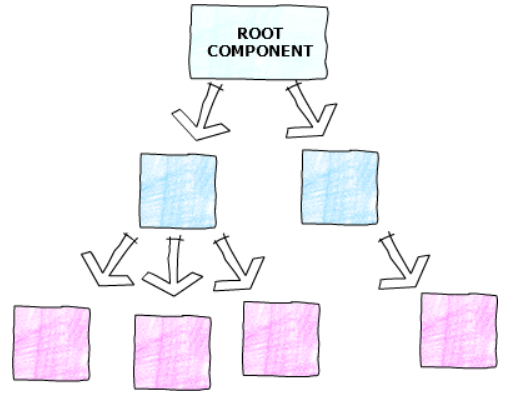


***

## 9. 说说React事件和原生事件的执行顺序


**参考答案：**

我们知道，`React`在内部对事件做了统一的处理，合成事件是一个比较大的概念

**为什么要有合成事件**

1. 在传统的事件里，不同的浏览器需要兼容不同的写法，在合成事件中`React`提供统一的事件对象，抹平了浏览器的兼容性差异

2. `React`通过顶层监听的形式，通过事件委托的方式来统一管理所有的事件，可以在事件上区分事件优先级，优化用户体验

`React`在合成事件上对于`16`版本和`17`版本的合成事件有很大不同，我们也会简单聊聊区别。

**概念**

**事件委托**

事件委托的意思就是可以通过给父元素绑定事件委托，通过事件对象的`target`属性可以获取到当前触发目标阶段的`dom`元素，来进行统一管理

比如写原生`dom`循环渲染的时候，我们要给每一个子元素都添加`dom`事件，这种情况最简单的方式就是通过事件委托在父元素做一次委托，通过`target`属性判断区分做不同的操作

**事件监听**

事件监听主要用到了`addEventListener`这个函数，具体怎么用可以点击进行查看 事件监听和事件绑定的最大区别就是事件监听可以给一个事件监听多个函数操作，而事件绑定只有一次

```javascript
// 可以监听多个，不会被覆盖
eventTarget.addEventListener('click', () => {});
eventTarget.addEventListener('click', () => {});

eventTarget.onclick = function () {};
eventTarget.onclick = function () {}; // 第二个会把第一个覆盖
```

事件执行顺序

```javascript
<div>
  <span>点我</span>
</div>
```

当我们点击`span`标签的时候会经过这么三个过程，在路径内的元素绑定的事件都会进行触发

捕获阶段 => 目标阶段 => 冒泡阶段

**合成事件**

在看之前先看一下这几个问题

* 原生事件和合成事件的执行顺序是什么？

* 合成事件在什么阶段下会被执行？

* 阻止原生事件的冒泡，会影响到合成事件的执行吗？

* 阻止合成事件的冒泡，会影响到原生事件的执行吗？

下面一个例子说清楚，

```javascript
import React, { useRef, useEffect } from "react";
import "./styles.css";

const logFunc = (target, isSynthesizer, isCapture = false) => {
    const info = `${isSynthesizer ? "合成" : "原生"}事件，${
        isCapture ? "捕获" : "冒泡"}阶段，${target}元素执行了`;
    
    console.log(info);
};

const batchManageEvent = (targets, funcs, isRemove = false) => {
    targets.forEach((target, targetIndex) => {
        funcs[targetIndex].forEach((func, funcIndex) => {
            target[isRemove ? "removeEventListener" : "addEventListener"](
                "click",
                func,
                !funcIndex
            );
        });
    });
};

export default function App() {
    const divDom = useRef();
    const h1Dom = useRef();
    useEffect(() => {
    
        const docClickCapFunc = () => logFunc("document", false, true);
        const divClickCapFunc = () => logFunc("div", false, true);
        const h1ClickCapFunc = () => logFunc("h1", false, true);
        const docClickFunc = () => logFunc("document", false);
        const divClickFunc = () => logFunc("div", false);
        const h1ClickFunc = () => logFunc("h1", false);

        batchManageEvent(
            [document, divDom.current, h1Dom.current],
            [
                [docClickCapFunc, docClickFunc],
                [divClickCapFunc, divClickFunc],
                [h1ClickCapFunc, h1ClickFunc]
            ]
        );

        return () => {
            batchManageEvent(
                   [document, divDom.current, h1Dom.current],
                [
                    [docClickCapFunc, docClickFunc],
                    [divClickCapFunc, divClickFunc],
                    [h1ClickCapFunc, h1ClickFunc]
                ],
                true
            );
        };
    }, []);

    return (
        <div
          ref={divDom}
          className="App1"
          onClickCapture={() => logFunc("div", true, true)}
          onClick={() => logFunc("div", true)}
        >
          <h1
            ref={h1Dom}
            onClickCapture={() => logFunc("h1", true, true)}
            onClick={() => logFunc("h1", true)}
          >
            Hello CodeSandbox
          </h1>
        </div>
    );
}
```

当我们点击`h1`的时候

会先执行原生事件事件流，当执行到`document`的冒泡阶段的时候做了个拦截，在这个阶段开始执行合成事件

当我们把上面的`demo`的原生`div`的`stopPropagation()`  方法调用阻止捕获和冒泡阶段中当前事件的进一步传播，会阻止后续的所有事件执行

```javascript
// ...
const divClickCapFunc = (e) => {
    e.stopPropagation(); // 增加原生捕获阶段的阻止事件
    logFunc("div", false, true);
};
// ...
```

**模拟阶段**

```javascript
<!DOCTYPE html>
<html lang="en">
  <head>
    <meta charset="utf-8" />
    <meta name="viewport" content="width=device-width, initial-scale=1.0, maximum-scale=1.0, maximum-scale=1, user-scalable=no" />
    <meta name="theme-color" content="#000000" />
    <meta name="description" content="Web site created using create-react-app" />
    <link href="favicon.ico" type="image/x-icon" rel="icon" />
    <title>浅谈React合成事件</title>
  </head>
  <body>
    <div id="wrapper">
      <h1 id="content">hello</h1>
    </div>
  </body>
  <script>
    const logFunc = (target, isSynthesizer, isCapture = false) => {
      const info = `${isSynthesizer ? '合成' : '原生'}事件，${isCapture ? '捕获' : '冒泡'}阶段，${target}元素执行了`;
      console.log(info);
    };
    // document的派发事件函数
    const dispatchEvent = currentDom => {
      let current = currentDom;
      let eventCallbacks = []; // 存储冒泡事件回调函数
      let eventCaptureCallbacks = []; // 存储冒泡事件回调函数
      // 收集事件流一路上的所有回调函数
      while (current) {
        if (current.onClick) {
          eventCallbacks.push(current.onClick);
        }
        if (current.onClickCapture) {
          // 捕获阶段由外到内，所以需要把回调函数放到数组的最前面
          eventCaptureCallbacks.unshift(current.onClickCapture);
        }
        current = current.parentNode;
      }
      // 执行调用
      eventCaptureCallbacks.forEach(callback => callback());
      eventCallbacks.forEach(callback => callback());
    };
    const wrapperDom = document.getElementById('wrapper');
    const contentDom = document.getElementById('content');

    // 一路上注册原生事件
    document.addEventListener('click', () => logFunc('document', false, true), true);
    wrapperDom.addEventListener('click', () => logFunc('div', false, true), true);
    contentDom.addEventListener('click', () => logFunc('h1', false, true), true);
    contentDom.addEventListener('click', () => logFunc('h1', false));
    wrapperDom.addEventListener('click', () => logFunc('div', false));
    document.addEventListener('click', e => {
      dispatchEvent(e.target); // 这里收集一路上的事件进行派发
      logFunc('document', false);
    });

    // 模拟合成事件
    wrapperDom.onClick = () => logFunc('div', true);
    wrapperDom.onClickCapture = () => logFunc('div', true, true);
    contentDom.onClick = () => logFunc('h1', true);
    contentDom.onClickCapture = () => logFunc('h1', true, true);
  </script>
</html>
```

点击`h1`可以看到一路上的注册的所有事件已经执行了

`React16`给`document`上加的统一的拦截判发事件会在一定情况下出问题，下面举个例子简单说明一下

**16案例**

点我查看在线案例

```javascript
import React, { useEffect, useState } from 'react';
import './styles.css';

const Modal = ({ onClose }) => {
  useEffect(() => {
    document.addEventListener('click', onClose);
    return () => {
      document.removeEventListener('click', onClose);
    };
  }, [onClose]);
  return (
    <div
      style={{ width: 300, height: 300, backgroundColor: 'red' }}
      onClick={e => {
        e.stopPropagation();
        // e.nativeEvent.stopImmediatePropagation();
      }}
    >
      Modal
    </div>
  );
};

function App() {
  const [visible, setVisible] = useState(false);
  return (
    <div className="App">
      <button
        onClick={() => {
          setVisible(true);
        }}
      >
        点我弹出modal
      </button>
      {visible && <Modal onClose={() => setVisible(false)} />}
    </div>
  );
}
export default App;
```

写完之后点击按钮`Modal`被弹出来, 但是点击`modal`里面的内容`modal`就隐藏了，添加阻止事件流函数还是不行

原因就是点击之后，事件冒泡到`document`上，同时也执行了他身上挂载的方法，解决办法就是给点击事件添加 `e.nativeEvent.stopImmediatePropagation();`

`stopImmediatePropagation`和`stopPropagation`的区别就是，前者会阻止当前节点下所有的事件监听的函数，后者不会

那`react17`及之后做了什么改变呢

**16和17的区别**

在`17`版本中，`React`把事件节点绑定函数绑定在了`render`的根节点上，避免了上述的问题,

用上面的`demo`的在线案例把版本改成17之后，可以发现事件的执行顺序变了

**模拟17版本**

```javascript
<!DOCTYPE html>
<html lang="en">
  <head>
    <meta charset="utf-8" />
    <meta name="viewport" content="width=device-width, initial-scale=1.0, maximum-scale=1.0, maximum-scale=1, user-scalable=no" />
    <meta name="theme-color" content="#000000" />
    <meta name="description" content="Web site created using create-react-app" />
    <link href="favicon.ico" type="image/x-icon" rel="icon" />
    <title>浅谈React合成事件</title>
  </head>
  <body>
    <div id="root">
      <div id="wrapper">
        <h1 id="content">hello</h1>
      </div>
    </div>
  </body>
  <script>
    const logFunc = (target, isSynthesizer, isCapture = false) => {
      const info = `${isSynthesizer ? '合成' : '原生'}事件，${isCapture ? '捕获' : '冒泡'}阶段，${target}元素执行了`;
      console.log(info);
    };
    // document的派发事件函数
    const dispatchEvent = (currentDom, useCapture = false) => {
      let current = currentDom;
      let eventCallbacks = []; // 存储冒泡事件回调函数
      const eventTypeName = useCapture ? 'onClickCapture' : 'onClick'; // 冒泡事件或者捕获事件的名称
      const actionName = useCapture ? 'unshift' : 'push';
      while (current) {
        if (current[eventTypeName]) {
          eventCallbacks[actionName](current[eventTypeName]);
        }
        current = current.parentNode;
      }
      eventCallbacks.forEach(callback => callback());
    };
    const wrapperDom = document.getElementById('wrapper');
    const contentDom = document.getElementById('content');
    const root = document.getElementById('root');

    // 一路上注册原生事件
    document.addEventListener('click', () => logFunc('document', false, true), true);
    root.addEventListener(
      'click',
      e => {
        dispatchEvent(e.target, true);
        logFunc('root', false, true);
      },
      true
    );
    wrapperDom.addEventListener('click', () => logFunc('div', false, true), true);
    contentDom.addEventListener('click', () => logFunc('h1', false, true), true);
    contentDom.addEventListener('click', () => logFunc('h1', false));
    wrapperDom.addEventListener('click', () => logFunc('div', false));
    root.addEventListener('click', e => {
      dispatchEvent(e.target); // 这里收集一路上的事件进行派发
      logFunc('root', false);
    });
    document.addEventListener('click', () => logFunc('document', false));
    // 模拟合成事件
    wrapperDom.onClick = () => logFunc('div', true);
    wrapperDom.onClickCapture = () => logFunc('div', true, true);
    contentDom.onClick = () => logFunc('h1', true);
    contentDom.onClickCapture = () => logFunc('h1', true, true);
  </script>
</html>
```

区别就是在外层增加了一个`root`模拟根节点，修改了`dispatchEvent`的逻辑

可以看到，效果已经和`17`版本的一样了

回看`16demo`，切换版本到`17`，当我们切换到`17`的时候，用`stopPropagation`就可以解决问题了, 原因就是他在`root`节点上绑定的事件冒泡函数，`stopPropagation`切断了事件流，不会流向到`document`身上了

**总结**

* `16`版本先执行原生事件，当冒泡到`document`时，统一执行合成事件，

* `17`版本在原生事件执行前先执行合成事件捕获阶段，原生事件执行完毕执行冒泡阶段的合成事件,通过根节点来管理所有的事件

原生的阻止事件流会阻断合成事件的执行，合成事件阻止后也会影响到后续的原生执行


***

## 10. 说说对受控组件和非受控组件的理解，以及应用场景？


**参考答案：**

**一、受控组件**

受控组件，简单来讲，就是受我们控制的组件，组件的状态全程响应外部数据

举个简单的例子：

```javascript
class TestComponent extends React.Component {
  constructor (props) {
    super(props);
    this.state = { username: 'lindaidai' };
  }
  render () {
    return <input name="username" value={this.state.username} />
  }
}
```

这时候当我们在输入框输入内容的时候，会发现输入的内容并无法显示出来，也就是`input`标签是一个可读的状态

这是因为`value`被`this.state.username`所控制住。当用户输入新的内容时，`this.state.username`并不会自动更新，这样的话`input`内的内容也就不会变了

如果想要解除被控制，可以为`input`标签设置`onChange`事件，输入的时候触发事件函数，在函数内部实现`state`的更新，从而导致`input`框的内容页发现改变

因此，受控组件我们一般需要初始状态和一个状态更新事件函数

**二、非受控组件**

非受控组件，简单来讲，就是不受我们控制的组件

一般情况是在初始化的时候接受外部数据，然后自己在内部存储其自身状态

当需要时，可以使用`ref` 查询 `DOM `并查找其当前值，如下：

```javascript
import React, { Component } from 'react';

export class UnControll extends Component {
  constructor (props) {
    super(props);
    this.inputRef = React.createRef();
  }
  handleSubmit = (e) => {
    console.log('我们可以获得input内的值为', this.inputRef.current.value);
    e.preventDefault();
  }
  render () {
    return (
      <form onSubmit={e => this.handleSubmit(e)}>
        <input defaultValue="lindaidai" ref={this.inputRef} />
        <input type="submit" value="提交" />
      </form>
    )
  }
}
```

关于`refs`的详情使用可以参考之前文章

**三、应用场景**

大部分时候推荐使用受控组件来实现表单，因为在受控组件中，表单数据由`React`组件负责处理

如果选择非受控组件的话，控制能力较弱，表单数据就由`DOM`本身处理，但更加方便快捷，代码量少

针对两者的区别，其应用场景如下图所示：

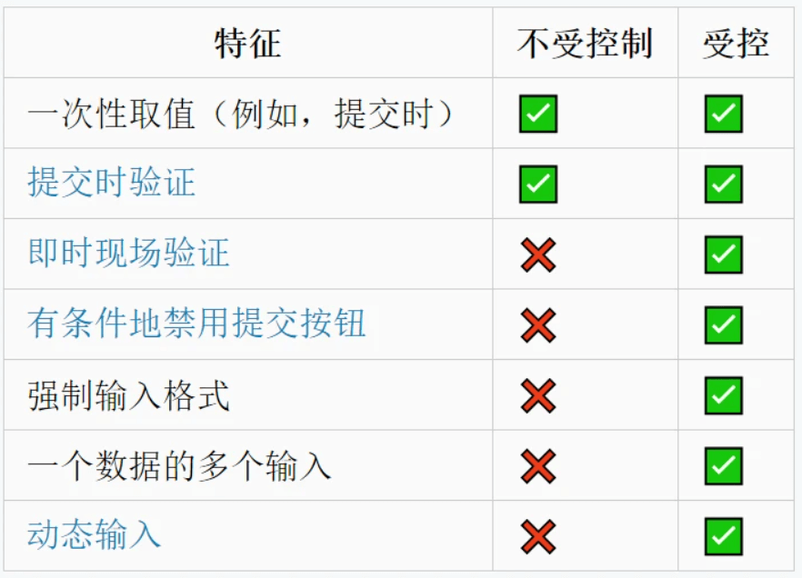


***

## 11. 你在React项目中是如何使用Redux的? 项目结构是如何划分的？


**参考答案：**

**一、背景**

`redux`是用于数据状态管理，而`react`是一个视图层面的库

如果将两者连接在一起，可以使用官方推荐`react-redux`库，其具有高效且灵活的特性

`react-redux`将组件分成：

* 容器组件：存在逻辑处理

* UI 组件：只负责现显示和交互，内部不处理逻辑，状态由外部控制

通过`redux`将整个应用状态存储到`store`中，组件可以派发`dispatch`行为`action`给`store`

其他组件通过订阅`store`中的状态`state`来更新自身的视图

**二、如何做**

使用`react-redux`分成了两大核心：

* Provider

* connection

**Provider**

在`redux`中存在一个`store`用于存储`state`，如果将这个`store`存放在顶层元素中，其他组件都被包裹在顶层元素之上

那么所有的组件都能够受到`redux`的控制，都能够获取到`redux`中的数据

使用方式如下：

```javascript
<Provider store = {store}>
    <App />
<Provider>
```

**connection**

`connect`方法将`store`上的`getState `和 `dispatch `包装成组件的`props`

导入`conect`如下：

```javascript
import { connect } from "react-redux";
```

用法如下：

```javascript
connect(mapStateToProps, mapDispatchToProps)(MyComponent)
```

可以传递两个参数：

* mapStateToProps

* mapDispatchToProps

**mapStateToProps**

把`redux`中的数据映射到`react`中的`props`中去

如下：

```javascript
const mapStateToProps = (state) => {
    return {
        // prop : state.xxx  | 意思是将state中的某个数据映射到props中
        foo: state.bar
    }
}
```

组件内部就能够通过`props`获取到`store`中的数据

```javascript
class Foo extends Component {
    constructor(props){
        super(props);
    }
    render(){
        return(
         // 这样子渲染的其实就是state.bar的数据了
            <div>this.props.foo</div>
        )
    }
}
Foo = connect()(Foo)
export default Foo
```

**mapDispatchToProps**

将`redux`中的`dispatch`映射到组件内部的`props`中

```javascript
const mapDispatchToProps = (dispatch) => { // 默认传递参数就是dispatch
  return {
    onClick: () => {
      dispatch({
        type: 'increatment'
      });
    }
  };
}
```

```javascript
class Foo extends Component {
    constructor(props){
        super(props);
    }
    render(){
        return(
         
             <button onClick = {this.props.onClick}>点击increase</button>
        )
    }
}
Foo = connect()(Foo);
export default Foo;
```

**小结**

整体流程图大致如下所示：


**三、项目结构**

可以根据项目具体情况进行选择，以下列出两种常见的组织结构

**按角色组织（MVC）**

角色如下：

* reducers

* actions

* components

* containers

参考如下：

```javascript
reducers/
  todoReducer.js
  filterReducer.js
actions/
  todoAction.js
  filterActions.js
components/
  todoList.js
  todoItem.js
  filter.js
containers/
  todoListContainer.js
  todoItemContainer.js
  filterContainer.js
```

**按功能组织**

使用`redux`使用功能组织项目，也就是把完成同一应用功能的代码放在一个目录下，一个应用功能包含多个角色的代码

`Redux`中，不同的角色就是`reducer`、`actions`和视图，而应用功能对应的就是用户界面的交互模块

参考如下：

```javascript
todoList/
  actions.js
  actionTypes.js
  index.js
  reducer.js
  views/
    components.js
    containers.js
filter/
  actions.js
  actionTypes.js
  index.js
  reducer.js
  views/
    components.js
    container.js
```

每个功能模块对应一个目录，每个目录下包含同样的角色文件：

* actionTypes.js 定义action类型

* actions.js 定义action构造函数

* reducer.js 定义这个功能模块如果响应actions.js定义的动作

* views 包含功能模块中所有的React组件，包括展示组件和容器组件

* index.js 把所有的角色导入，统一导出

其中`index`模块用于导出对外的接口

```javascript
import * as actions from './actions.js';
import reducer from './reducer.js';
import view from './views/container.js';

export { actions, reducer, view };
```

导入方法如下：

```javascript
import { actions, reducer, view as TodoList } from './xxxx'
```


***

## 12. 说说对Redux中间件的理解？常用的中间件有哪些？实现原理？


**参考答案：**

**一、是什么**

中间件（Middleware）是介于应用系统和系统软件之间的一类软件，它使用系统软件所提供的基础服务（功能），衔接网络上应用系统的各个部分或不同的应用，能够达到资源共享、功能共享的目的

在上篇文章中，了解到了`Redux`整个工作流程，当`action`发出之后，`reducer`立即算出`state`，整个过程是一个同步的操作

那么如果需要支持异步操作，或者支持错误处理、日志监控，这个过程就可以用上中间件

`Redux`中，中间件就是放在就是在`dispatch`过程，在分发`action`进行拦截处理，如下图：


其本质上一个函数，对`store.dispatch`方法进行了改造，在发出 `Action `和执行 `Reducer `这两步之间，添加了其他功能

**二、常用的中间件**

有很多优秀的`redux`中间件，如：

* redux-thunk：用于异步操作

* redux-logger：用于日志记录

上述的中间件都需要通过`applyMiddlewares`进行注册，作用是将所有的中间件组成一个数组，依次执行

然后作为第二个参数传入到`createStore`中

```javascript
const store = createStore(
  reducer,
  applyMiddleware(thunk, logger)
);
```

**redux-thunk**

`redux-thunk`是官网推荐的异步处理中间件

默认情况下的`dispatch(action)`，`action`需要是一个`JavaScript`的对象

`redux-thunk`中间件会判断你当前传进来的数据类型，如果是一个函数，将会给函数传入参数值（dispatch，getState）

* dispatch函数用于我们之后再次派发action

* getState函数考虑到我们之后的一些操作需要依赖原来的状态，用于让我们可以获取之前的一些状态

所以`dispatch`可以写成下述函数的形式：

```javascript
const getHomeMultidataAction = () => {
  return (dispatch) => {
    axios.get("http://xxx.xx.xx.xx/test").then(res => {
      const data = res.data.data;
      dispatch(changeBannersAction(data.banner.list));
      dispatch(changeRecommendsAction(data.recommend.list));
    })
  }
}
```

**redux-logger**

如果想要实现一个日志功能，则可以使用现成的`redux-logger`

```javascript
import { applyMiddleware, createStore } from 'redux';
import createLogger from 'redux-logger';
const logger = createLogger();

const store = createStore(
  reducer,
  applyMiddleware(logger)
);
```

这样我们就能简单通过中间件函数实现日志记录的信息

**三、实现原理**

首先看看`applyMiddlewares`的源码

```javascript
export default function applyMiddleware(...middlewares) {
  return (createStore) => (reducer, preloadedState, enhancer) => {
    var store = createStore(reducer, preloadedState, enhancer);
    var dispatch = store.dispatch;
    var chain = [];

    var middlewareAPI = {
      getState: store.getState,
      dispatch: (action) => dispatch(action)
    };
    chain = middlewares.map(middleware => middleware(middlewareAPI));
    dispatch = compose(...chain)(store.dispatch);

    return {...store, dispatch}
  }
}
```

所有中间件被放进了一个数组`chain`，然后嵌套执行，最后执行`store.dispatch`。可以看到，中间件内部（`middlewareAPI`）可以拿到`getState`和`dispatch`这两个方法

在上面的学习中，我们了解到了`redux-thunk`的基本使用

内部会将`dispatch`进行一个判断，然后执行对应操作，原理如下：

```javascript
function patchThunk(store) {
    let next = store.dispatch;

    function dispatchAndThunk(action) {
        if (typeof action === "function") {
            action(store.dispatch, store.getState);
        } else {
            next(action);
        }
    }

    store.dispatch = dispatchAndThunk;
}
```

实现一个日志输出的原理也非常简单，如下：

```javascript
let next = store.dispatch;

function dispatchAndLog(action) {
  console.log("dispatching:", addAction(10));
  next(addAction(5));
  console.log("新的state:", store.getState());
}

store.dispatch = dispatchAndLog;
```


***

## 13. 说说你对Redux的理解？其工作原理？


**参考答案：**

**一、是什么**

`React`是用于构建用户界面的，帮助我们解决渲染`DOM`的过程

而在整个应用中会存在很多个组件，每个组件的`state`是由自身进行管理，包括组件定义自身的`state`、组件之间的通信通过`props`传递、使用`Context`实现数据共享

如果让每个组件都存储自身相关的状态，理论上来讲不会影响应用的运行，但在开发及后续维护阶段，我们将花费大量精力去查询状态的变化过程

这种情况下，如果将所有的状态进行集中管理，当需要更新状态的时候，仅需要对这个管理集中处理，而不用去关心状态是如何分发到每一个组件内部的

`redux`就是一个实现上述集中管理的容器，遵循三大基本原则：

* 单一数据源

* state 是只读的

* 使用纯函数来执行修改

注意的是，`redux`并不是只应用在`react`中，还与其他界面库一起使用，如`Vue`

**二、工作原理**

`redux `要求我们把数据都放在 `store `公共存储空间

一个组件改变了 `store` 里的数据内容，其他组件就能感知到 `store `的变化，再来取数据，从而间接的实现了这些数据传递的功能

工作流程图如下所示：

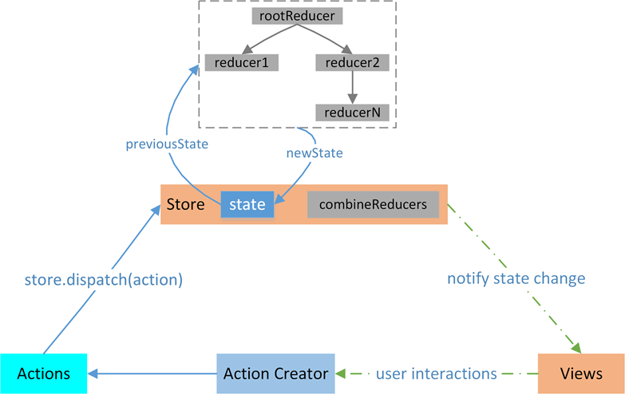

根据流程图，可以想象，`React Components` 是借书的用户， `Action Creactor` 是借书时说的话(借什么书)， `Store` 是图书馆管理员，`Reducer` 是记录本(借什么书，还什么书，在哪儿，需要查一下)， `state` 是书籍信息

整个流程就是借书的用户需要先存在，然后需要借书，需要一句话来描述借什么书，图书馆管理员听到后需要查一下记录本，了解图书的位置，最后图书馆管理员会把这本书给到这个借书人

转换为代码是，`React Components` 需要获取一些数据, 然后它就告知 `Store` 需要获取数据，这就是就是 `Action Creactor` , `Store` 接收到之后去 `Reducer` 查一下， `Reducer` 会告诉 `Store` 应该给这个组件什么数据

**三、如何使用**

创建一个`store`的公共数据区域

```javascript
import { createStore } from 'redux' // 引入一个第三方的方法
const store = createStore() // 创建数据的公共存储区域（管理员）
```

还需要创建一个记录本去辅助管理数据，也就是`reduecer`，本质就是一个函数，接收两个参数`state`，`action`，返回`state`

```javascript
// 设置默认值
const initialState = {
  counter: 0
}

const reducer = (state = initialState, action) => {
}
```

然后就可以将记录本传递给`store`，两者建立连接。如下：

```javascript
const store = createStore(reducer)
```

如果想要获取`store`里面的数据，则通过`store.getState()`来获取当前`state`

```javascript
console.log(store.getState());
```

下面再看看如何更改`store`里面数据，是通过`dispatch`来派发`action`，通常`action`中都会有`type`属性，也可以携带其他的数据

```javascript
store.dispatch({
  type: "INCREMENT"
})

store.dispath({
  type: "DECREMENT"
})

store.dispatch({
  type: "ADD_NUMBER",
  number: 5
})
```

下面再来看看修改`reducer`中的处理逻辑：

```javascript
const reducer = (state = initialState, action) => {
  switch (action.type) {
    case "INCREMENT":
      return {...state, counter: state.counter + 1};
    case "DECREMENT":
      return {...state, counter: state.counter - 1};
    case "ADD_NUMBER":
      return {...state, counter: state.counter + action.number}
    default: 
      return state;
  }
}
```

注意，`reducer`是一个纯函数，不需要直接修改`state`

这样派发`action`之后，既可以通过`store.subscribe`监听`store`的变化，如下：

```javascript
store.subscribe(() => {
  console.log(store.getState());
})
```

在`React`项目中，会搭配`react-redux`进行使用

完整代码如下：

```javascript
const redux = require('redux');

const initialState = {
  counter: 0
}

// 创建reducer
const reducer = (state = initialState, action) => {
  switch (action.type) {
    case "INCREMENT":
      return {...state, counter: state.counter + 1};
    case "DECREMENT":
      return {...state, counter: state.counter - 1};
    case "ADD_NUMBER":
      return {...state, counter: state.counter + action.number}
    default: 
      return state;
  }
}

// 根据reducer创建store
const store = redux.createStore(reducer);

store.subscribe(() => {
  console.log(store.getState());
})

// 修改store中的state
store.dispatch({
  type: "INCREMENT"
})
// console.log(store.getState());

store.dispatch({
  type: "DECREMENT"
})
// console.log(store.getState());

store.dispatch({
  type: "ADD_NUMBER",
  number: 5
})
// console.log(store.getState());
```

**小结**

* createStore可以帮助创建 store

* store.dispatch 帮助派发 action , action 会传递给 store

* store.getState 这个方法可以帮助获取 store 里边所有的数据内容

* store.subscrible 方法订阅 store 的改变，只要 store 发生改变， store.subscrible 这个函数接收的这个回调函数就会被执行


***

## 14. 说说你对immutable的理解？如何应用在react项目中？


**参考答案：**

**一、是什么**

Immutable，不可改变的，在计算机中，即指一旦创建，就不能再被更改的数据

对 `Immutable `对象的任何修改或添加删除操作都会返回一个新的 `Immutable `对象

`Immutable` 实现的原理是 `Persistent Data Structure`（持久化数据结构）:

* 用一种数据结构来保存数据

* 当数据被修改时，会返回一个对象，但是新的对象会尽可能的利用之前的数据结构而不会对内存造成浪费

也就是使用旧数据创建新数据时，要保证旧数据同时可用且不变，同时为了避免 `deepCopy `把所有节点都复制一遍带来的性能损耗，`Immutable` 使用了 `Structural Sharing`（结构共享）

如果对象树中一个节点发生变化，只修改这个节点和受它影响的父节点，其它节点则进行共享

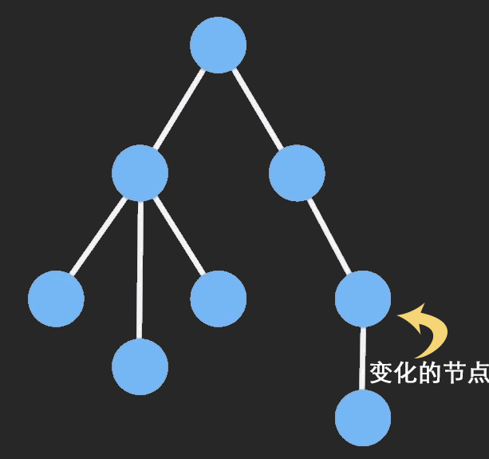

**二、如何使用**

使用`Immutable`对象最主要的库是`immutable.js`

immutable.js 是一个完全独立的库，无论基于什么框架都可以用它

其出现场景在于弥补 Javascript 没有不可变数据结构的问题，通过 structural sharing来解决的性能问题

内部提供了一套完整的 Persistent Data Structure，还有很多易用的数据类型，如`Collection`、`List`、`Map`、`Set`、`Record`、`Seq`，其中：

* List: 有序索引集，类似 JavaScript 中的 Array

* Map: 无序索引集，类似 JavaScript 中的 Object

* Set: 没有重复值的集合

主要的方法如下：

* fromJS()：将一个js数据转换为Immutable类型的数据

```javascript
const obj = Immutable.fromJS({a:'123',b:'234'})
```

* toJS()：将一个Immutable数据转换为JS类型的数据

* is()：对两个对象进行比较

```javascript
import { Map, is } from 'immutable'
const map1 = Map({ a: 1, b: 1, c: 1 })
const map2 = Map({ a: 1, b: 1, c: 1 })
map1 === map2   //false
Object.is(map1, map2) // false
is(map1, map2) // true
```

* get(key)：对数据或对象取值

* getIn(\[]) ：对嵌套对象或数组取值，传参为数组，表示位置

```javascript
let abs = Immutable.fromJS({a: {b:2}});
abs.getIn(['a', 'b']) // 2
abs.getIn(['a', 'c']) // 子级没有值

let arr = Immutable.fromJS([1 ,2, 3, {a: 5}]);
arr.getIn([3, 'a']); // 5
arr.getIn([3, 'c']); // 子级没有值
```

如下例子：使用方法如下：

```javascript
import Immutable from 'immutable';
foo = Immutable.fromJS({a: {b: 1}});
bar = foo.setIn(['a', 'b'], 2);   // 使用 setIn 赋值
console.log(foo.getIn(['a', 'b']));  // 使用 getIn 取值，打印 1
console.log(foo === bar);  //  打印 false
```

如果换到原生的`js`，则对应如下：

```javascript
let foo = {a: {b: 1}};
let bar = foo;
bar.a.b = 2;
console.log(foo.a.b);  // 打印 2
console.log(foo === bar);  //  打印 true
```

**三、在React中应用**

使用 `Immutable `可以给 `React` 应用带来性能的优化，主要体现在减少渲染的次数

在做`react`性能优化的时候，为了避免重复渲染，我们会在`shouldComponentUpdate()`中做对比，当返回`true`执行`render`方法

`Immutable`通过`is`方法则可以完成对比，而无需像一样通过深度比较的方式比较

在使用`redux`过程中也可以结合`Immutable`，不使用`Immutable`前修改一个数据需要做一个深拷贝

```javascript
import '_' from 'lodash';

const Component = React.createClass({
  getInitialState() {
    return {
      data: { times: 0 }
    }
  },
  handleAdd() {
    let data = _.cloneDeep(this.state.data);
    data.times = data.times + 1;
    this.setState({ data: data });
  }
}
```

使用 Immutable 后：

```javascript
getInitialState() {
  return {
    data: Map({ times: 0 })
  }
},
  handleAdd() {
    this.setState({ data: this.state.data.update('times', v => v + 1) });
    // 这时的 times 并不会改变
    console.log(this.state.data.get('times'));
  }
```

同理，在`redux`中也可以将数据进行`fromJS`处理

```javascript
import * as constants from './constants'
import {fromJS} from 'immutable'
const defaultState = fromJS({ //将数据转化成immutable数据
    home:true,
    focused:false,
    mouseIn:false,
    list:[],
    page:1,
    totalPage:1
})
export default(state=defaultState,action)=>{
    switch(action.type){
        case constants.SEARCH_FOCUS:
            return state.set('focused',true) //更改immutable数据
        case constants.CHANGE_HOME_ACTIVE:
            return state.set('home',action.value)
        case constants.SEARCH_BLUR:
            return state.set('focused',false)
        case constants.CHANGE_LIST:
            // return state.set('list',action.data).set('totalPage',action.totalPage)
            //merge效率更高，执行一次改变多个数据
            return state.merge({
                list:action.data,
                totalPage:action.totalPage
            })
        case constants.MOUSE_ENTER:
            return state.set('mouseIn',true)
        case constants.MOUSE_LEAVE:
            return state.set('mouseIn',false)
        case constants.CHANGE_PAGE:
            return state.set('page',action.page)
        default:
            return state
    }
}
```


***

## 15. 说说React Jsx转换成真实DOM过程？


**参考答案：**

**一、是什么**

`react`通过将组件编写的`JSX`映射到屏幕，以及组件中的状态发生了变化之后 `React`会将这些「变化」更新到屏幕上

在前面文章了解中，`JSX`通过`babel`最终转化成`React.createElement`这种形式，例如：

```javascript
<div>
  
  <Hello />
</div>
```

会被`babel`转化成如下：

```javascript
React.createElement(
  "div",
  null,
  React.createElement("img", {
    src: "avatar.png",
    className: "profile"
  }),
  React.createElement(Hello, null)
);
```

在转化过程中，`babel`在编译时会判断 JSX 中组件的首字母：

* 当首字母为小写时，其被认定为原生 `DOM` 标签，`createElement` 的第一个变量被编译为字符串

* 当首字母为大写时，其被认定为自定义组件，createElement 的第一个变量被编译为对象

最终都会通过`RenderDOM.render(...)`方法进行挂载，如下：

```javascript
ReactDOM.render(<App />,  document.getElementById("root"));
```

**二、过程**

在`react`中，节点大致可以分成四个类别：

* 原生标签节点

* 文本节点

* 函数组件

* 类组件

如下所示：

```javascript
class ClassComponent extends Component {
  static defaultProps = {
    color: "pink"
  };
  render() {
    return (
      <div className="border">
        <h3>ClassComponent</h3>
        <p className={this.props.color}>{this.props.name}</p >
      </div>
    );
  }
}

function FunctionComponent(props) {
  return (
    <div className="border">
      FunctionComponent
      <p>{props.name}</p >
    </div>
  );
}

const jsx = (
  <div className="border">
    <p>xx</p >
    < a href=" ">xxx</ a>
    <FunctionComponent name="函数组件" />
    <ClassComponent name="类组件" color="red" />
  </div>
);
```

这些类别最终都会被转化成`React.createElement`这种形式

`React.createElement`其被调用时会传⼊标签类型`type`，标签属性`props`及若干子元素`children`，作用是生成一个虚拟`Dom`对象，如下所示：

```javascript
function createElement(type, config, ...children) {
    if (config) {
        delete config.__self;
        delete config.__source;
    }
    // ! 源码中做了详细处理，⽐如过滤掉key、ref等
    const props = {
        ...config,
        children: children.map(child =>
   typeof child === "object" ? child : createTextNode(child)
  )
    };
    return {
        type,
        props
    };
}
function createTextNode(text) {
    return {
        type: TEXT,
        props: {
            children: [],
            nodeValue: text
        }
    };
}
export default {
    createElement
};
```

`createElement`会根据传入的节点信息进行一个判断：

* 如果是原生标签节点， type 是字符串，如div、span

* 如果是文本节点， type就没有，这里是 TEXT

* 如果是函数组件，type 是函数名

* 如果是类组件，type 是类名

虚拟`DOM`会通过`ReactDOM.render`进行渲染成真实`DOM`，使用方法如下：

```javascript
ReactDOM.render(element, container[, callback])
```

当首次调用时，容器节点里的所有 `DOM` 元素都会被替换，后续的调用则会使用 `React` 的 `diff`算法进行高效的更新

如果提供了可选的回调函数`callback`，该回调将在组件被渲染或更新之后被执行

`render`大致实现方法如下：

```javascript
function render(vnode, container) {
    console.log("vnode", vnode); // 虚拟DOM对象
    // vnode _> node
    const node = createNode(vnode, container);
    container.appendChild(node);
}

// 创建真实DOM节点
function createNode(vnode, parentNode) {
    let node = null;
    const {type, props} = vnode;
    if (type === TEXT) {
        node = document.createTextNode("");
    } else if (typeof type === "string") {
        node = document.createElement(type);
    } else if (typeof type === "function") {
        node = type.isReactComponent
            ? updateClassComponent(vnode, parentNode)
        : updateFunctionComponent(vnode, parentNode);
    } else {
        node = document.createDocumentFragment();
    }
    reconcileChildren(props.children, node);
    updateNode(node, props);
    return node;
}

// 遍历下子vnode，然后把子vnode->真实DOM节点，再插入父node中
function reconcileChildren(children, node) {
    for (let i = 0; i < children.length; i++) {
        let child = children[i];
        if (Array.isArray(child)) {
            for (let j = 0; j < child.length; j++) {
                render(child[j], node);
            }
        } else {
            render(child, node);
        }
    }
}
function updateNode(node, nextVal) {
    Object.keys(nextVal)
        .filter(k => k !== "children")
        .forEach(k => {
        if (k.slice(0, 2) === "on") {
            let eventName = k.slice(2).toLocaleLowerCase();
            node.addEventListener(eventName, nextVal[k]);
        } else {
            node[k] = nextVal[k];
        }
    });
}

// 返回真实dom节点
// 执行函数
function updateFunctionComponent(vnode, parentNode) {
    const {type, props} = vnode;
    let vvnode = type(props);
    const node = createNode(vvnode, parentNode);
    return node;
}

// 返回真实dom节点
// 先实例化，再执行render函数
function updateClassComponent(vnode, parentNode) {
    const {type, props} = vnode;
    let cmp = new type(props);
    const vvnode = cmp.render();
    const node = createNode(vvnode, parentNode);
    return node;
}
export default {
    render
};
```

**三、总结**

在`react`源码中，虚拟`Dom`转化成真实`Dom`整体流程如下图所示：

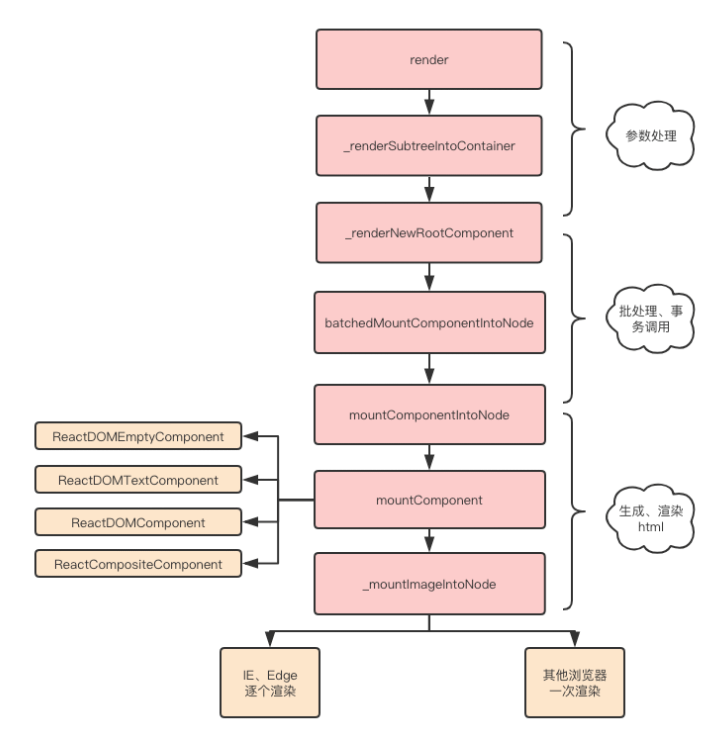

其渲染流程如下所示：

* 使用React.createElement或JSX编写React组件，实际上所有的 JSX 代码最后都会转换成React.createElement(...) ，Babel帮助我们完成了这个转换的过程。

* createElement函数对key和ref等特殊的props进行处理，并获取defaultProps对默认props进行赋值，并且对传入的孩子节点进行处理，最终构造成一个虚拟DOM对象

* ReactDOM.render将生成好的虚拟DOM渲染到指定容器上，其中采用了批处理、事务等机制并且对特定浏览器进行了性能优化，最终转换为真实DOM

***

## 16. 说说你在React项目是如何捕获错误的？


**参考答案：**

**一、是什么**

错误在我们日常编写代码是非常常见的

举个例子，在`react`项目中去编写组件内`JavaScript`代码错误会导致 `React` 的内部状态被破坏，导致整个应用崩溃，这是不应该出现的现象

作为一个框架，`react`也有自身对于错误的处理的解决方案

**二、如何做**

为了解决出现的错误导致整个应用崩溃的问题，`react16`引用了错误边界新的概念

错误边界是一种 `React` 组件，这种组件可以捕获发生在其子组件树任何位置的 `JavaScript` 错误，并打印这些错误，同时展示降级 `UI`，而并不会渲染那些发生崩溃的子组件树

错误边界在渲染期间、生命周期方法和整个组件树的构造函数中捕获错误

形成错误边界组件的两个条件：

* 使用了 static getDerivedStateFromError()

* 使用了 componentDidCatch()

抛出错误后，请使用 `static getDerivedStateFromError()` 渲染备用 UI ，使用 `componentDidCatch()` 打印错误信息，如下：

```javascript
class ErrorBoundary extends React.Component {
  constructor(props) {
    super(props);
    this.state = { hasError: false };
  }

  static getDerivedStateFromError(error) {
    // 更新 state 使下一次渲染能够显示降级后的 UI
    return { hasError: true };
  }

  componentDidCatch(error, errorInfo) {
    // 你同样可以将错误日志上报给服务器
    logErrorToMyService(error, errorInfo);
  }

  render() {
    if (this.state.hasError) {
      // 你可以自定义降级后的 UI 并渲染
      return <h1>Something went wrong.</h1>;
    }

    return this.props.children; 
  }
}
```

然后就可以把自身组件的作为错误边界的子组件，如下：

```javascript
<ErrorBoundary>
  <MyWidget />
</ErrorBoundary>
```

下面这些情况无法捕获到异常：

* 事件处理

* 异步代码

* 服务端渲染

* 自身抛出来的错误

在`react 16`版本之后，会把渲染期间发生的所有错误打印到控制台

除了错误信息和 JavaScript 栈外，React 16 还提供了组件栈追踪。现在你可以准确地查看发生在组件树内的错误信息：

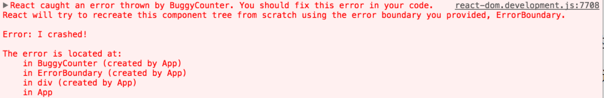

可以看到在错误信息下方文字中存在一个组件栈，便于我们追踪错误

对于错误边界无法捕获的异常，如事件处理过程中发生问题并不会捕获到，是因为其不会在渲染期间触发，并不会导致渲染时候问题

这种情况可以使用`js`的`try...catch...`语法，如下：

```javascript
class MyComponent extends React.Component {
  constructor(props) {
    super(props);
    this.state = { error: null };
    this.handleClick = this.handleClick.bind(this);
  }

  handleClick() {
    try {
      // 执行操作，如有错误则会抛出
    } catch (error) {
      this.setState({ error });
    }
  }

  render() {
    if (this.state.error) {
      return <h1>Caught an error.</h1>
    }
    return <button onClick={this.handleClick}>Click Me</button>
  }
}
```

除此之外还可以通过监听`onerror`事件

```javascript
window.addEventListener('error', function(event) { ... })
```


***

## 17. 说说React服务端渲染怎么做？原理是什么？


**参考答案：**

**一、是什么**

服务端渲染（`Server-Side Rendering` ，简称`SSR`），指由服务侧完成页面的 `HTML` 结构拼接的页面处理技术，发送到浏览器，然后为其绑定状态与事件，成为完全可交互页面的过程


其解决的问题主要有两个：

* SEO，由于搜索引擎爬虫抓取工具可以直接查看完全渲染的页面

* 加速首屏加载，解决首屏白屏问题

**二、如何做**

在`react`中，实现`SSR`主要有两种形式：

* 手动搭建一个 SSR 框架

* 使用成熟的SSR 框架，如 Next.JS

这里主要以手动搭建一个`SSR`框架进行实现

首先通过`express`启动一个`app.js`文件，用于监听3000端口的请求，当请求根目录时，返回`HTML`，如下：

```javascript
const express = require('express')
const app = express()
app.get('/', (req,res) => res.send(`
<html>
   <head>
       <title>ssr demo</title>
   </head>
   <body>
       Hello world
   </body>
</html>
`))

app.listen(3000, () => console.log('Exampleapp listening on port 3000!'))
```

然后再服务器中编写`react`代码，在`app.js`中进行应引用

```javascript
import React from 'react'

const Home = () =>{

    return <div>home</div>

}

export default Home
```

为了让服务器能够识别`JSX`，这里需要使用`webpakc`对项目进行打包转换，创建一个配置文件`webpack.server.js`并进行相关配置，如下：

```javascript
const path = require('path')    //node的path模块
const nodeExternals = require('webpack-node-externals')

module.exports = {
    target:'node',
    mode:'development',           //开发模式
    entry:'./app.js',             //入口
    output: {                     //打包出口
        filename:'bundle.js',     //打包后的文件名
        path:path.resolve(__dirname,'build')    //存放到根目录的build文件夹
    },
    externals: [nodeExternals()],  //保持node中require的引用方式
    module: {
        rules: [{                  //打包规则
           test:   /\.js?$/,       //对所有js文件进行打包
           loader:'babel-loader',  //使用babel-loader进行打包
           exclude: /node_modules/,//不打包node_modules中的js文件
           options: {
               presets: ['react','stage-0',['env', { 
                                  //loader时额外的打包规则,对react,JSX，ES6进行转换
                    targets: {
                        browsers: ['last 2versions']   //对主流浏览器最近两个版本进行兼容
                    }
               }]]
           }
       }]
    }
}
```

接着借助`react-dom`提供了服务端渲染的 `renderToString`方法，负责把`React`组件解析成`html`

```javascript
import express from 'express'
import React from 'react'//引入React以支持JSX的语法
import { renderToString } from 'react-dom/server'//引入renderToString方法
import Home from'./src/containers/Home'

const app= express()
const content = renderToString(<Home/>)
app.get('/',(req,res) => res.send(`
<html>
   <head>
       <title>ssr demo</title>
   </head>
   <body>
        ${content}
   </body>
</html>
`))

app.listen(3001, () => console.log('Exampleapp listening on port 3001!'))
```

上面的过程中，已经能够成功将组件渲染到了页面上

但是像一些事件处理的方法，是无法在服务端完成，因此需要将组件代码在浏览器中再执行一遍，这种服务器端和客户端共用一套代码的方式就称之为同构

通俗讲，“同构”就是一套React代码在服务器上运行一遍，到达浏览器又运行一遍：

* 服务端渲染完成页面结构

* 浏览器端渲染完成事件绑定

浏览器实现事件绑定的方式为让浏览器去拉取`JS`文件执行，让`JS`代码来控制，因此需要引入`script`标签

通过`script`标签为页面引入客户端执行的`react`代码，并通过`express`的`static`中间件为`js`文件配置路由，修改如下：

```javascript
import express from 'express'
import React from 'react'//引入React以支持JSX的语法
import { renderToString } from'react-dom/server'//引入renderToString方法
import Home from './src/containers/Home'
 
const app = express()
app.use(express.static('public'));
//使用express提供的static中间件,中间件会将所有静态文件的路由指向public文件夹
 const content = renderToString(<Home/>)
 
app.get('/',(req,res)=>res.send(`
<html>
   <head>
       <title>ssr demo</title>
   </head>
   <body>
        ${content}
   <script src="/index.js"></script>
   </body>
</html>
`))

 app.listen(3001, () =>console.log('Example app listening on port 3001!'))
```

然后再客户端执行以下`react`代码，新建`webpack.client.js`作为客户端React代码的`webpack`配置文件如下：

```javascript
const path = require('path')                    //node的path模块

module.exports = {
    mode:'development',                         //开发模式
    entry:'./src/client/index.js',              //入口
    output: {                                   //打包出口
        filename:'index.js',                    //打包后的文件名
        path:path.resolve(__dirname,'public')   //存放到根目录的build文件夹
    },
    module: {
        rules: [{                               //打包规则
           test:   /\.js?$/,                    //对所有js文件进行打包
           loader:'babel-loader',               //使用babel-loader进行打包
           exclude: /node_modules/,             //不打包node_modules中的js文件
           options: {
               presets: ['react','stage-0',['env', {     
                    //loader时额外的打包规则,这里对react,JSX进行转换
                    targets: {
                        browsers: ['last 2versions']   //对主流浏览器最近两个版本进行兼容
                    }
               }]]
           }
       }]
    }
}
```

这种方法就能够简单实现首页的`react`服务端渲染，过程对应如下图：

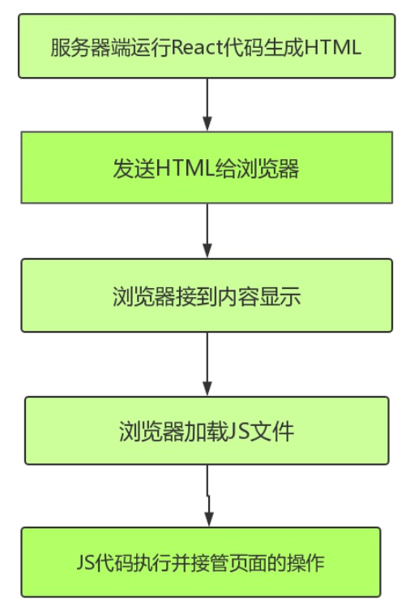

在做完初始渲染的时候，一个应用会存在路由的情况，配置信息如下：

```javascript
import React from 'react'                   //引入React以支持JSX
import { Route } from 'react-router-dom'    //引入路由
import Home from './containers/Home'        //引入Home组件

export default (
    <div>
        <Route path="/" exact component={Home}></Route>
    </div>
)
```

然后可以通过`index.js`引用路由信息，如下：

```javascript
import React from 'react'
import ReactDom from 'react-dom'
import { BrowserRouter } from'react-router-dom'
import Router from'../Routers'

const App= () => {
    return (
        <BrowserRouter>
           {Router}
        </BrowserRouter>
    )
}

ReactDom.hydrate(<App/>, document.getElementById('root'))
```

这时候控制台会存在报错信息，原因在于每个`Route`组件外面包裹着一层`div`，但服务端返回的代码中并没有这个`div`

解决方法只需要将路由信息在服务端执行一遍，使用使用`StaticRouter`来替代`BrowserRouter`，通过`context`进行参数传递

```javascript
import express from 'express'
import React from 'react'//引入React以支持JSX的语法
import { renderToString } from 'react-dom/server'//引入renderToString方法
import { StaticRouter } from 'react-router-dom'
import Router from '../Routers'
 
const app = express()
app.use(express.static('public'));
//使用express提供的static中间件,中间件会将所有静态文件的路由指向public文件夹

app.get('/',(req,res)=>{
    const content  = renderToString((
        //传入当前path
        //context为必填参数,用于服务端渲染参数传递
        <StaticRouter location={req.path} context={{}}>
           {Router}
        </StaticRouter>
    ))
    res.send(`
   <html>
       <head>
           <title>ssr demo</title>
       </head>
       <body>
       <div id="root">${content}</div>
       <script src="/index.js"></script>
       </body>
   </html>
    `)
})


app.listen(3001, () => console.log('Exampleapp listening on port 3001!'))
```

这样也就完成了路由的服务端渲染

**三、原理**

整体`react`服务端渲染原理并不复杂，具体如下：

`node server` 接收客户端请求，得到当前的请求`url` 路径，然后在已有的路由表内查找到对应的组件，拿到需要请求的数据，将数据作为 `props`、`context`或者`store` 形式传入组件

然后基于 `react` 内置的服务端渲染方法 `renderToString()`把组件渲染为 `html`字符串在把最终的 `html `进行输出前需要将数据注入到浏览器端

浏览器开始进行渲染和节点对比，然后执行完成组件内事件绑定和一些交互，浏览器重用了服务端输出的 `html` 节点，整个流程结束

***

## 18. React Fiber 是如何实现更新过程可控？


**参考答案：**

更新过程的可控主要体现在下面几个方面：

* 任务拆分

* 任务挂起、恢复、终止

* 任务具备优先级

**任务拆分**

在 React Fiber 机制中，它采用"化整为零"的思想，将调和阶段（Reconciler）递归遍历 VDOM 这个大任务分成若干小任务，每个任务只负责一个节点的处理。

**任务挂起、恢复、终止**

* workInProgress tree

workInProgress 代表当前正在执行更新的 Fiber 树。在 render 或者 setState 后，会构建一颗 Fiber 树，也就是 workInProgress tree，这棵树在构建每一个节点的时候会收集当前节点的副作用，整棵树构建完成后，会形成一条完整的副作用链。

* currentFiber tree

currentFiber 表示上次渲染构建的 Filber 树。在每一次更新完成后 workInProgress 会赋值给 currentFiber。在新一轮更新时 workInProgress tree 再重新构建，新 workInProgress 的节点通过 alternate 属性和 currentFiber 的节点建立联系。

在新 workInProgress tree 的创建过程中，会同 currentFiber 的对应节点进行 Diff 比较，收集副作用。同时也会复用和 currentFiber 对应的节点对象，减少新创建对象带来的开销。也就是说无论是创建还是更新、挂起、恢复以及终止操作都是发生在 workInProgress tree 创建过程中的。workInProgress tree 构建过程其实就是循环的执行任务和创建下一个任务。

**挂起**

当第一个小任务完成后，先判断这一帧是否还有空闲时间，没有就挂起下一个任务的执行，记住当前挂起的节点，让出控制权给浏览器执行更高优先级的任务。

**恢复**

在浏览器渲染完一帧后，判断当前帧是否有剩余时间，如果有就恢复执行之前挂起的任务。如果没有任务需要处理，代表调和阶段完成，可以开始进入渲染阶段。

* 如何判断一帧是否有空闲时间的呢？

使用前面提到的 RIC (RequestIdleCallback) 浏览器原生 API，React 源码中为了兼容低版本的浏览器，对该方法进行了 Polyfill。

* 恢复执行的时候又是如何知道下一个任务是什么呢？

答案是在前面提到的链表。在 React Fiber 中每个任务其实就是在处理一个 FiberNode 对象，然后又生成下一个任务需要处理的 FiberNode。

**终止**

其实并不是每次更新都会走到提交阶段。当在调和过程中触发了新的更新，在执行下一个任务的时候，判断是否有优先级更高的执行任务，如果有就终止原来将要执行的任务，开始新的 workInProgressFiber 树构建过程，开始新的更新流程。这样可以避免重复更新操作。这也是在 React 16 以后生命周期函数 componentWillMount 有可能会执行多次的原因。

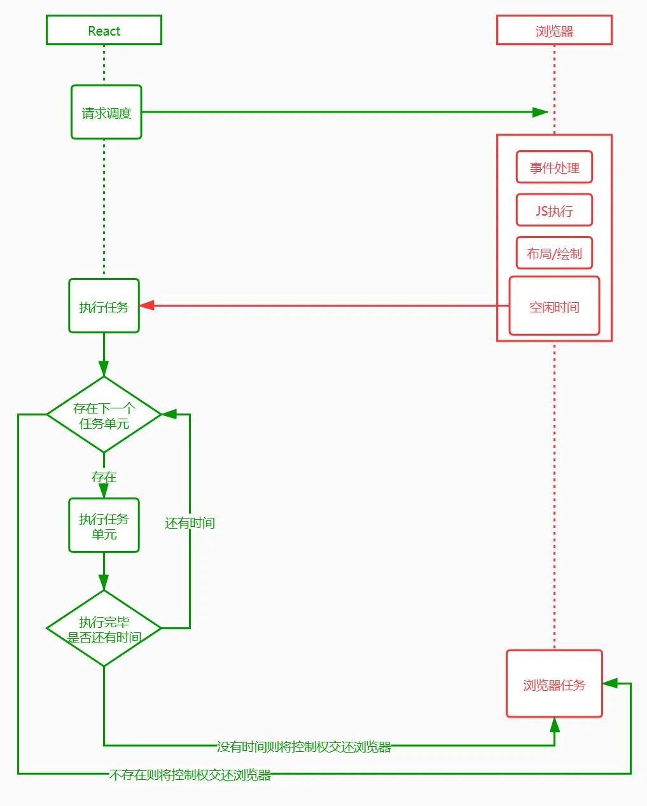

**任务具备优先级**

React Fiber 除了通过挂起，恢复和终止来控制更新外，还给每个任务分配了优先级。具体点就是在创建或者更新 FiberNode 的时候，通过算法给每个任务分配一个到期时间（expirationTime）。在每个任务执行的时候除了判断剩余时间，如果当前处理节点已经过期，那么无论现在是否有空闲时间都必须执行该任务。过期时间的大小还代表着任务的优先级。

任务在执行过程中顺便收集了每个 FiberNode 的副作用，将有副作用的节点通过 firstEffect、lastEffect、nextEffect 形成一条副作用单链表 A1(TEXT)-B1(TEXT)-C1(TEXT)-C1-C2(TEXT)-C2-B1-B2(TEXT)-B2-A。

其实最终都是为了收集到这条副作用链表，有了它，在接下来的渲染阶段就通过遍历副作用链完成 DOM 更新。这里需要注意，更新真实 DOM 的这个动作是一气呵成的，不能中断，不然会造成视觉上的不连贯（commit）。


***

## 19. Fiber 为什么是 React 性能的一个飞跃？


**参考答案：**

**什么是 Fiber**

Fiber 的英文含义是“纤维”，它是比线程（Thread）更细的线，比线程（Thread）控制得更精密的执行模型。在广义计算机科学概念中，Fiber 又是一种协作的（Cooperative）编程模型（协程），帮助开发者用一种【既模块化又协作化】的方式来编排代码。

在 React 中，Fiber 就是 React 16 实现的一套新的更新机制，让 React 的更新过程变得可控，避免了之前采用递归需要一气呵成影响性能的做法。

**React Fiber 中的时间分片**

把一个耗时长的任务分成很多小片，每一个小片的运行时间很短，虽然总时间依然很长，但是在每个小片执行完之后，都给其他任务一个执行的机会，这样唯一的线程就不会被独占，其他任务依然有运行的机会。

React Fiber 把更新过程碎片化，每执行完一段更新过程，就把控制权交还给 React 负责任务协调的模块，看看有没有其他紧急任务要做，如果没有就继续去更新，如果有紧急任务，那就去做紧急任务。

**Stack Reconciler**

基于栈的 Reconciler，浏览器引擎会从执行栈的顶端开始执行，执行完毕就弹出当前执行上下文，开始执行下一个函数，直到执行栈被清空才会停止。然后将执行权交还给浏览器。由于 React 将页面视图视作一个个函数执行的结果。每一个页面往往由多个视图组成，这就意味着多个函数的调用。

如果一个页面足够复杂，形成的函数调用栈就会很深。每一次更新，执行栈需要一次性执行完成，中途不能干其他的事儿，只能"一心一意"。结合前面提到的浏览器刷新率，JS 一直执行，浏览器得不到控制权，就不能及时开始下一帧的绘制。如果这个时间超过 16ms，当页面有动画效果需求时，动画因为浏览器不能及时绘制下一帧，这时动画就会出现卡顿。不仅如此，因为事件响应代码是在每一帧开始的时候执行，如果不能及时绘制下一帧，事件响应也会延迟。

**Fiber Reconciler**

**链表结构**

在 React Fiber 中用链表遍历的方式替代了 React 16 之前的栈递归方案。在 React 16 中使用了大量的链表。

* 使用多向链表的形式替代了原来的树结构；

```javascript
<div id="A">
A1
<div id="B1">
  B1
  <div id="C1"></div>
</div>
<div id="B2">
  B2
</div>
</div>
```

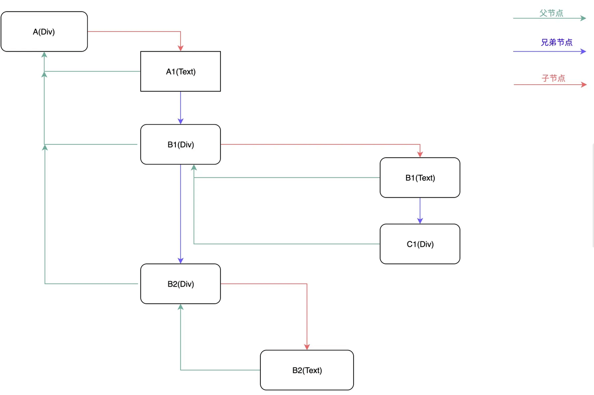

* 副作用单链表；

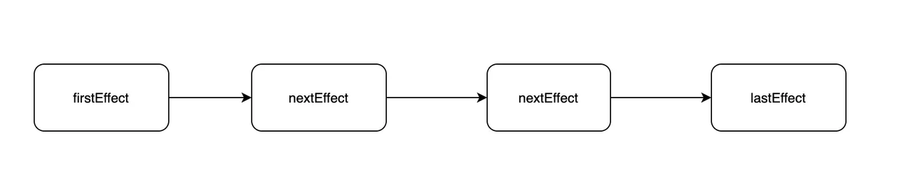

* 状态更新单链表；

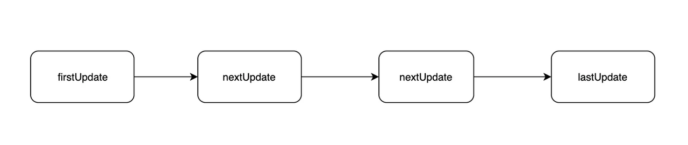

链表是一种简单高效的数据结构，它在当前节点中保存着指向下一个节点的指针；遍历的时候，通过操作指针找到下一个元素。

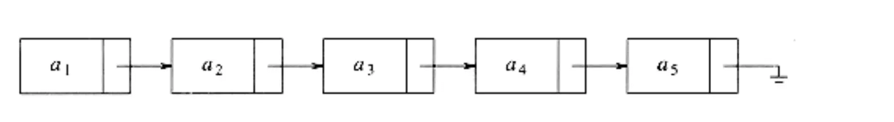

链表相比顺序结构数据格式的好处就是：

* 操作更高效，比如顺序调整、删除，只需要改变节点的指针指向就好了。

* 不仅可以根据当前节点找到下一个节点，在多向链表中，还可以找到他的父节点或者兄弟节点。

但链表也不是完美的，缺点就是：

* 比顺序结构数据更占用空间，因为每个节点对象还保存有指向下一个对象的指针。

* 不能自由读取，必须找到他的上一个节点。

React 用空间换时间，更高效的操作可以方便根据优先级进行操作。同时可以根据当前节点找到其他节点，在下面提到的挂起和恢复过程中起到了关键作用。

***

## 20. setState 是同步，还是异步的？


**参考答案：**

PS: 2022年10月更新答案

**react18之前。**

setState在不同情况下可以表现为异步或同步。

在Promise的状态更新、js原生事件、setTimeout、setInterval..中是同步的。

在react的合成事件中，是异步的。

***

**react18之后。**

setState都会表现为异步（即批处理）

**react18之前版本的解释**

在React中，如果是由React引发的事件处理（比如通过onClick引发的事件处理），调用setState不会同步更新this.state，除此之外的setState调用会同步执行this.state 。所谓“除此之外”，指的是绕过React通过addEventListener直接添加的事件处理函数，还有通过setTimeout/setInterval产生的异步调用。

原因： 在React的setState函数实现中，会根据一个变量isBatchingUpdates判断是直接更新this.state还是放到队列中回头再说，而isBatchingUpdates默认是false，也就表示setState会同步更新this.state，但是，有一个函数batchedUpdates，这个函数会把isBatchingUpdates修改为true，而当React在调用事件处理函数之前就会调用这个batchedUpdates，造成的后果，就是由React控制的事件处理过程setState不会同步更新this.state。

注意： setState的“异步”并不是说内部由异步代码实现，其实本身执行的过程和代码都是同步的，只是合成事件和钩子函数的调用顺序在更新之前，导致在合成事件和钩子函数中没法立马拿到更新后的值，形式了所谓的“异步”，当然可以通过第二个参数 setState(partialState, callback) 中的callback拿到更新后的结果。

综上，setState 只在合成事件和 hook() 中是“异步”的，在 原生事件和 setTimeout 中都是同步的。


***

## 21. 简述下 React 的事件代理机制？


**参考答案：**

React 并不会把所有的处理函数直接绑定在真实的节点上。而是把所有的事件绑定到结构的最外层，使用一个统一的事件监听器，这个事件监听器上维持了一个映射来保存所有组件内部的事件监听和处理函数。

当组件挂载或卸载时，只是在这个统一的事件监听器上插入或删除一些对象。

当事件发生时，首先被这个统一的事件监听器处理，然后在映射里找到真正的事件处理函数并调用。

这样做的优点是解决了兼容性问题，并且简化了事件处理和回收机制（不需要手动的解绑事件，React 已经在内部处理了）。但是有些事件 React 并没有实现，比如 window 的 resize 事件。


在`React@17.0.3`版本中：

* 所有事件都是委托在`id = root`的DOM元素中（网上很多说是在`document`中，`17`版本不是了）；

* 在应用中所有节点的事件监听其实都是在`id = root`的DOM元素中触发；

* `React`自身实现了一套事件冒泡捕获机制；

* `React`实现了合成事件`SyntheticEvent`；

* `React`在`17`版本不再使用事件池了（网上很多说使用了对象池来管理合成事件对象的创建销毁，那是`16`版本及之前）；

* 事件一旦在`id = root`的DOM元素中委托，其实是一直在触发的，只是没有绑定对应的回调函数；

之所以会将事件委托从`document`中移到`id = root`的DOM元素，是为了可以更加安全地进行新旧版本 React 树的嵌套。


***

## 22. 简述下 React 的生命周期？每个生命周期都做了什么？


**参考答案：**

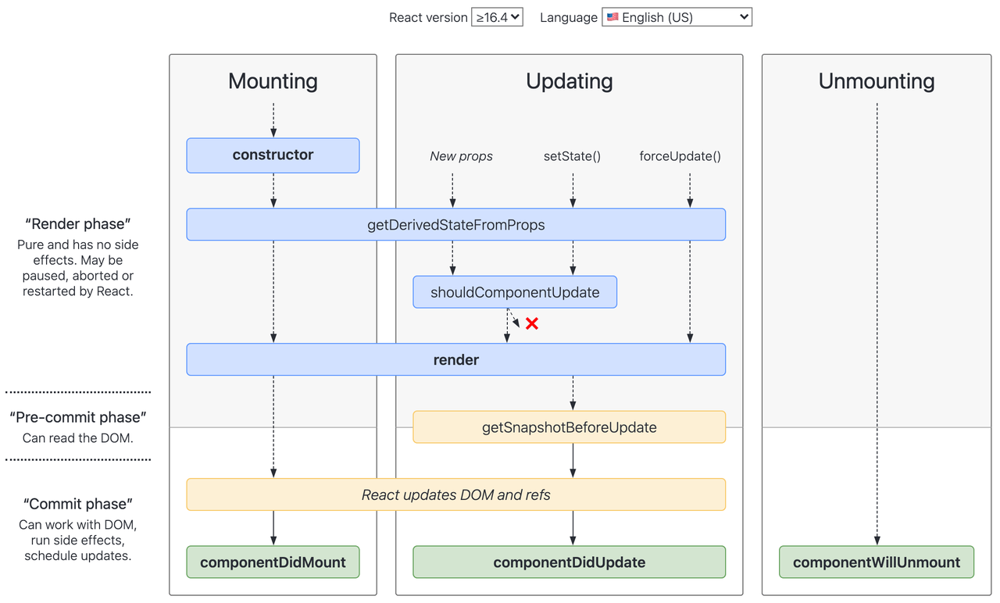

**挂载**

当组件实例被创建并插入 DOM 中时，其生命周期调用顺序如下：

* constructor()

* static getDerivedStateFromProps()

* render()

* componentDidMount()

**更新**

当组件的 props 或 state 发生变化时会触发更新。组件更新的生命周期调用顺序如下：

* static getDerivedStateFromProps()

* shouldComponentUpdate()

* render()

* getSnapshotBeforeUpdate()

* componentDidUpdate()

**卸载**

当组件从 DOM 中移除时会调用如下方法：

* componentWillUnmount()

**错误处理**

渲染过程，生命周期，或子组件的构造函数中抛出错误时，会调用如下方法：

* static getDerivedStateFromError()

* componentDidCatch()

**具体介绍**

**render()**

render() 方法是 class 组件中唯一必须实现的方法。

当 render 被调用时，它会检查 this.props 和 this.state 的变化并返回以下类型之一：

* React 元素。通常通过 JSX 创建。例如，\<div /> 会被 React 渲染为 DOM 节点，\<MyComponent /> 会被 React 渲染为自定义组件，无论是 \<div /> 还是 \<MyComponent /> 均为 React 元素。

* 数组或 fragments。 使得 render 方法可以返回多个元素。欲了解更多详细信息，请参阅 fragments 文档。

* Portals。可以渲染子节点到不同的 DOM 子树中。欲了解更多详细信息，请参阅有关 portals 的文档

* 字符串或数值类型。它们在 DOM 中会被渲染为文本节点

* 布尔类型或 null。什么都不渲染。（主要用于支持返回 test && \<Child /> 的模式，其中 test 为布尔类型。）

render() 函数应该为纯函数，这意味着在不修改组件 state 的情况下，每次调用时都返回相同的结果，并且它不会直接与浏览器交互。

如需与浏览器进行交互，请在 componentDidMount() 或其他生命周期方法中执行你的操作。保持 render() 为纯函数，可以使组件更容易思考。

**constructor()**

如果不初始化 state 或不进行方法绑定，则不需要为 React 组件实现构造函数。

在 React 组件挂载之前，会调用它的构造函数。在为 React.Component 子类实现构造函数时，应在其他语句之前前调用 super(props)。否则，this.props 在构造函数中可能会出现未定义的 bug。

通常，在 React 中，构造函数仅用于以下两种情况：

通过给 this.state 赋值对象来初始化内部 state。

* 为事件处理函数绑定实例

* 在 constructor() 函数中不要调用 setState() 方法。如果你的组件需要使用内部 state，请直接在构造函数中为 this.state 赋值初始 state。

只能在构造函数中直接为 this.state 赋值。如需在其他方法中赋值，你应使用 this.setState() 替代。

要避免在构造函数中引入任何副作用或订阅。如遇到此场景，请将对应的操作放置在 componentDidMount 中。

**componentDidMount()**

componentDidMount() 会在组件挂载后（插入 DOM 树中）立即调用。依赖于 DOM 节点的初始化应该放在这里。如需通过网络请求获取数据，此处是实例化请求的好地方。

这个方法是比较适合添加订阅的地方。如果添加了订阅，请不要忘记在 componentWillUnmount() 里取消订阅

你可以在 componentDidMount() 里直接调用 setState()。它将触发额外渲染，但此渲染会发生在浏览器更新屏幕之前。如此保证了即使在 render() 两次调用的情况下，用户也不会看到中间状态。请谨慎使用该模式，因为它会导致性能问题。通常，你应该在 constructor() 中初始化 state。如果你的渲染依赖于 DOM 节点的大小或位置，比如实现 modals 和 tooltips 等情况下，你可以使用此方式处理。

**componentDidUpdate()**

componentDidUpdate() 会在更新后会被立即调用。首次渲染不会执行此方法。

当组件更新后，可以在此处对 DOM 进行操作。如果你对更新前后的 props 进行了比较，也可以选择在此处进行网络请求。（例如，当 props 未发生变化时，则不会执行网络请求）。

```javascript
componentDidUpdate(prevProps) {
  // 典型用法（不要忘记比较 props）：
  if (this.props.userID !== prevProps.userID) {
    this.fetchData(this.props.userID);
  }
}
```

你也可以在 componentDidUpdate() 中直接调用 setState()，但请注意它必须被包裹在一个条件语句里，正如上述的例子那样进行处理，否则会导致死循环。它还会导致额外的重新渲染，虽然用户不可见，但会影响组件性能。不要将 props “镜像”给 state，请考虑直接使用 props。 欲了解更多有关内容，请参阅为什么 props 复制给 state 会产生 bug。

如果组件实现了 getSnapshotBeforeUpdate() 生命周期（不常用），则它的返回值将作为 componentDidUpdate() 的第三个参数 “snapshot” 参数传递。否则此参数将为 undefined。

**componentWillUnmount()**

componentWillUnmount() 会在组件卸载及销毁之前直接调用。在此方法中执行必要的清理操作，例如，清除 timer，取消网络请求或清除在 componentDidMount() 中创建的订阅等。

componentWillUnmount() 中不应调用 setState()，因为该组件将永远不会重新渲染。组件实例卸载后，将永远不会再挂载它。

**shouldComponentUpdate()**

根据 shouldComponentUpdate() 的返回值，判断 React 组件的输出是否受当前 state 或 props 更改的影响。默认行为是 state 每次发生变化组件都会重新渲染。大部分情况下，你应该遵循默认行为。

当 props 或 state 发生变化时，shouldComponentUpdate() 会在渲染执行之前被调用。返回值默认为 true。首次渲染或使用 forceUpdate() 时不会调用该方法。

此方法仅作为性能优化的方式而存在。不要企图依靠此方法来“阻止”渲染，因为这可能会产生 bug。你应该考虑使用内置的 PureComponent 组件，而不是手动编写 shouldComponentUpdate()。PureComponent 会对 props 和 state 进行浅层比较，并减少了跳过必要更新的可能性。

如果你一定要手动编写此函数，可以将 this.props 与 nextProps 以及 this.state 与nextState 进行比较，并返回 false 以告知 React 可以跳过更新。请注意，返回 false 并不会阻止子组件在 state 更改时重新渲染。

我们不建议在 shouldComponentUpdate() 中进行深层比较或使用 JSON.stringify()。这样非常影响效率，且会损害性能。

目前，如果 shouldComponentUpdate() 返回 false，则不会调用 UNSAFE\_componentWillUpdate()，render() 和 componentDidUpdate()。后续版本，React 可能会将 shouldComponentUpdate 视为提示而不是严格的指令，并且，当返回 false 时，仍可能导致组件重新渲染。

**static getDerivedStateFromProps()**

getDerivedStateFromProps 会在调用 render 方法之前调用，并且在初始挂载及后续更新时都会被调用。它应返回一个对象来更新 state，如果返回 null 则不更新任何内容。

此方法适用于罕见的用例，即 state 的值在任何时候都取决于 props。例如，实现 \<Transition> 组件可能很方便，该组件会比较当前组件与下一组件，以决定针对哪些组件进行转场动画。

派生状态会导致代码冗余，并使组件难以维护。 确保你已熟悉这些简单的替代方案：

* 如果你需要执行副作用（例如，数据提取或动画）以响应 props 中的更改，请改用 componentDidUpdate。

* 如果只想在 prop 更改时重新计算某些数据，请使用 memoization helper 代替。

* 如果你想在 prop 更改时“重置”某些 state，请考虑使组件完全受控或使用 key 使组件完全不受控代替。

此方法无权访问组件实例。如果你需要，可以通过提取组件 props 的纯函数及 class 之外的状态，在getDerivedStateFromProps()和其他 class 方法之间重用代码。

请注意，不管原因是什么，都会在每次渲染前触发此方法。这与 UNSAFE\_componentWillReceiveProps 形成对比，后者仅在父组件重新渲染时触发，而不是在内部调用 setState 时。

**getSnapshotBeforeUpdate()**

getSnapshotBeforeUpdate() 在最近一次渲染输出（提交到 DOM 节点）之前调用。它使得组件能在发生更改之前从 DOM 中捕获一些信息（例如，滚动位置）。此生命周期方法的任何返回值将作为参数传递给 componentDidUpdate()。

此用法并不常见，但它可能出现在 UI 处理中，如需要以特殊方式处理滚动位置的聊天线程等。

应返回 snapshot 的值（或 null）。

**Error boundaries**

Error boundaries 是 React 组件，它会在其子组件树中的任何位置捕获 JavaScript 错误，并记录这些错误，展示降级 UI 而不是崩溃的组件树。Error boundaries 组件会捕获在渲染期间，在生命周期方法以及其整个树的构造函数中发生的错误。

如果 class 组件定义了生命周期方法 static getDerivedStateFromError() 或 componentDidCatch() 中的任何一个（或两者），它就成为了 Error boundaries。通过生命周期更新 state 可让组件捕获树中未处理的 JavaScript 错误并展示降级 UI。

仅使用 Error boundaries 组件来从意外异常中恢复的情况；不要将它们用于流程控制。

**static getDerivedStateFromError()**

此生命周期会在后代组件抛出错误后被调用。 它将抛出的错误作为参数，并返回一个值以更新 state。

**componentDidCatch()**

此生命周期在后代组件抛出错误后被调用。 它接收两个参数：

* error —— 抛出的错误。

* info —— 带有 componentStack key 的对象，其中包含有关组件引发错误的栈信息。

componentDidCatch() 会在“提交”阶段被调用，因此允许执行副作用。 它应该用于记录错误之类的情况。

React 的开发和生产构建版本在 componentDidCatch() 的方式上有轻微差别。

在开发模式下，错误会冒泡至 window，这意味着任何 window.onerror 或 window.addEventListener('error', callback) 会中断这些已经被 componentDidCatch() 捕获的错误。

相反，在生产模式下，错误不会冒泡，这意味着任何根错误处理器只会接受那些没有显式地被 componentDidCatch() 捕获的错误。


***

## 23. 为什么不能在循环、条件或嵌套函数中调用 Hooks？


**参考答案：**

如果在条件语句中使用hooks，React会抛出 error。

这与React Hooks的底层设计的数据结构相关，先抛出结论：react用链表来严格保证hooks的顺序。

一个典型的useState使用场景：

```javascript
const [name,setName] = useState('leo');

......

setName('Lily');
```

简而言之，这个初始化了一个hooks，并且将其追加到链表结尾。

```javascript
// 进入 mounState 逻辑

function mountState(initialState) {

  // 将新的 hook 对象追加进链表尾部
  var hook = mountWorkInProgressHook();

  // initialState 可以是一个回调，若是回调，则取回调执行后的值

  if (typeof initialState === 'function') {

    // $FlowFixMe: Flow doesn't like mixed types

    initialState = initialState();
  }

  // 创建当前 hook 对象的更新队列，这一步主要是为了能够依序保留 dispatch

  const queue = hook.queue = {

    last: null,

    dispatch: null,

    lastRenderedReducer: basicStateReducer,

    lastRenderedState: (initialState: any),

  };

  // 将 initialState 作为一个“记忆值”存下来

  hook.memoizedState = hook.baseState = initialState;

  // dispatch 是由上下文中一个叫 dispatchAction 的方法创建的，这里不必纠结这个方法具体做了什么

  var dispatch = queue.dispatch = dispatchAction.bind(null, currentlyRenderingFiber$1, queue);

  // 返回目标数组，dispatch 其实就是示例中常常见到的 setXXX 这个函数，想不到吧？哈哈

  return [hook.memoizedState, dispatch];
}
```

从这段源码中我们可以看出，mounState 的主要工作是初始化 Hooks。在整段源码中，最需要关注的是 `mountWorkInProgressHook` 方法，它为我们道出了 Hooks 背后的数据结构组织形式。以下是 `mountWorkInProgressHook` 方法的源码：

```javascript
function mountWorkInProgressHook() {

  // 注意，单个 hook 是以对象的形式存在的
  var hook = {

    memoizedState: null,

    baseState: null,

    baseQueue: null,

    queue: null,

    next: null

  };

  if (workInProgressHook === null) {
    // 这行代码每个 React 版本不太一样，但做的都是同一件事：将 hook 作为链表的头节点处理
    firstWorkInProgressHook = workInProgressHook = hook;
  } else {
    // 若链表不为空，则将 hook 追加到链表尾部
    workInProgressHook = workInProgressHook.next = hook;
  }
  // 返回当前的 hook
  return workInProgressHook;
}
```

到这里可以看出，hook 相关的所有信息收敛在一个 hook 对象里，而 hook 对象之间以单向链表的形式相互串联。

接着，我们来看更新过程

需要注意的是updateState的过程：按顺序去遍历之前构建好的链表，取出对应的数据信息进行渲染。

我们把 mountState 和 updateState 做的事情放在一起来看：mountState（首次渲染）构建链表并渲染；updateState 依次遍历链表并渲染。

hooks 的渲染是通过“依次遍历”来定位每个 hooks 内容的。如果前后两次读到的链表在顺序上出现差异，那么渲染的结果自然是不可控的。

这个现象有点像我们构建了一个长度确定的数组，数组中的每个坑位都对应着一块确切的信息，后续每次从数组里取值的时候，只能够通过索引（也就是位置）来定位数据。也正因为如此，在许多文章里，都会直截了当地下这样的定义：Hooks 的本质就是数组。但读完这一课时的内容你就会知道，Hooks 的本质其实是链表。

我们举个例子：

```javascript
    let mounted = false;
    
    if(!mounted){
        // eslint-disable-next-line
        const [name,setName] = useState('leo');
        const [age,setAge] = useState(18);
        mounted = true;
    }
    const [career,setCareer] = useState('码农');
    console.log('career',career);
    ......
    
    <div onClick={()=>setName('Lily')}>
    点我点我点我
    <div>
```

点击div后，我们期望的输出是 "码农"，然而事实上(尽管会error，但是打印还是执行)打印的为 "Lily"

原因是，三个useState在初始化的时候已经构建好了一个三个节点的链表结构，依次为： `name('leo') --> age(18) --> career('码农')`

每个节点都已经派发了一个与之对应的update操作，因此执行setName时候，三个节点就修改为了 `name('Lily') --> age(18) --> career('码农')`

然后执行update渲染操作，从链表依次取出值，此时，条件语句的不再执行，第一个取值操作会从链表的第一个，也就是name对应的hooks对象进行取值：此时取到的为 `name:Lily`

必须按照顺序调用从根本上来说是因为 useState 这个钩子在设计层面并没有“状态命名”这个动作，也就是说你每生成一个新的状态，React 并不知道这个状态名字叫啥，所以需要通过顺序来索引到对应的状态值


***

## 24. 说说你对 useContext 的理解


**参考答案：**

**什么是Context**

`context`（上下文）可以看成是扩大版的`props`，它可以将全局的数据通过`provider`接口传递value给局部的组件，让包围在`provider`中的局部组件可以获取到全局数据的读写接口

全局变量可以看成是全局的上下文

而上下文则是局部的全局变量，因为只有包围在`provider`中的局部组件才可以获取到这些全局变量的读写接口

**用法**

* 创建context

* 设置`provider`并通过value接口传递state

* 局部组件获取读写接口


案例理解是最快的方式，我在下面的代码中，将设置一个父组件，一个子组件，通过useContext来传递state，并在子组件上设置一个按钮来改变全局state

```javascript
import React, { createContext, useContext, useState } from \"react\";
const initialState = { m: 100, n: 50 }; // 定义初始state
const X = createContext(); // 创建Context
let a = 0;
export default function App() {
  console.log(`render了${a}次`);//用来检查执行App函数多少次
  const [state, setState] = useState(initialState); // 创建state读写接口
  a += 1;
  return (
    <X.Provider value={{ state, setState }}> // 通过provider提供value给包围里内部组件，只有包围里的组件才有效
      <Father></Father>
    </X.Provider>
  );
}

const Father = (props) => {
  const { state, setState } = useContext(X);//拿到 名字为X的上下文的value，用两个变量来接收读写接口
  const addN = () => {
    setState((state) => {
      return { ...state, n: state.n + 1 };
    });
  };
  const addM = () => {
    setState((state) => {
      return { ...state, m: state.m + 1 };
    });
  };
  return (
    <div>
      爸爸组件
      <div>n:{state.n}</div>
      <Child />
      <button onClick={addN}>设置n</button>
      <button onClick={addM}>设置m</button>
    </div>
  );
};
const Child = (props) => {
  const { state } = useContext(X); // 读取state
  return (
    <div>
      儿子组件
      <div>m:{state.m}</div>
    </div>
  );
};
```

拿到读写接口的组件就可以控制state数据

> tips：注意到最上层的变量a没？这是我用来测试的，我发现点击按钮后会触发App函数并更新页面，说明react下使用`context`来修改数据的时候，都会重新进行全局执行，而不是数据响应式的。

**总结**

我们学习到`Context`上下文的基本概念和作用，并且通过小案例总结得出`context`的使用方法：

* 使用`creacteContext`创建一个上下文

* 设置`provider`并通过`value`接口传递`state`数据

* 局部组件从`value`接口中传递的数据对象中获取读写接口


***

## 25. 说说你对 useMemo 的理解


**参考答案：**

**Memo**

在class的时代，我们一般是通过pureComponent来对数据进行一次浅比较，引入Hook特性后，我们可以使用Memo进行性能提升。

在此之前，我们来做一个实验

```javascript
import React, { useState } from "react";
import ReactDOM from "react-dom";

import "./styles.css";

function App() {
  const [n, setN] = useState(0);
  const [m, setM] = useState(10);
  console.log("执行最外层盒子了");
  return (
    <>
      <div>
        最外层盒子
        <Child1 value={n} />
        <Child2 value={m} />
        <button
          onClick={() => {
            setN(n + 1);
          }}
        >
          n+1
        </button>
        <button
          onClick={() => {
            setM(m + 1);
          }}
        >
          m+1
        </button>
      </div>
    </>
  );
}
function Child1(props) {
  console.log("执行子组件1了");
  return <div>子组件1上的n：{props.value}</div>;
}
function Child2(props) {
  console.log("执行子组件2了");
  return <div>子组件2上的m：{props.value}</div>;
}

const rootElement = document.getElementById("root");
ReactDOM.render(<App />, rootElement);
```

上面的代码我设置了两个子组件，分别读取父组件上的n跟m，然后父组件上面设置两个点击按钮，当点击后分别让设置的n、m加1。以下是第一次渲染时log控制台的结果

```plain&#x20;text
执行最外层盒子了 
执行子组件1了 
执行子组件2了 
```

跟想象中一样，render时先进入App函数，执行，发现里面的两个child函数，执行，创建虚拟dom，创建实体dom，最后将画面渲染到页面上。

**使用Memo优化**

当我点击n+1按钮时，此时state里面的n必然+1，也会重新引发render渲染，并把新的n更新到视图中。

我们再看控制台

* 执行最外层盒子了&#x20;
  执行子组件1了&#x20;
  执行子组件2了&#x20;
  执行最外层盒子了&#x20;
  执行子组件1了&#x20;
  执行子组件2了 //为什么组件2也渲染了，里面的m没有变化&#x20;

你会发现子组件2也渲染了，显然react重新把所有的函数都执行了一遍，把未曾有n数据的子组件2也重新执行了。

如何优化？我们可以使用`memo`把子组件改成以下代码

```javascript
const Child1 = React.memo((props) => {
  console.log("执行子组件1了");
  return <div>子组件1上的n：{props.value}</div>;
});

const Child2 = React.memo((props) => {
  console.log("执行子组件2了");
  return <div>子组件2上的m：{props.value}</div>;
});
```

再重新点击试试？

* 执行最外层盒子了&#x20;
  执行子组件1了&#x20;
  执行子组件2了&#x20;
  执行最外层盒子了&#x20;
  执行子组件1了&#x20;

会发现没有执行子组件2了

这样的话react就会只执行对应state变化的组件，而没有变化的组件，则复用上一次的函数，也许memo也有memory的意思，代表记忆上一次的函数，不重新执行（我瞎猜的- -！！）

**出现bug**

上面的代码虽然已经优化好了性能，但是会有一个bug

上面的代码是由父组件控制`<button>`的，如果我把控制state的函数传递给子组件，会怎样呢？

```javascript
 <Child2 value={m} onClick={addM} /> //addM是修改M的函数
```

点击按钮让n+1

* 执行最外层盒子了&#x20;
  执行子组件1了&#x20;
  执行子组件2了&#x20;
  执行最外层盒子了&#x20;
  执行子组件1了&#x20;
  执行子组件2了&#x20;

又重新执行子组件2。

为什么会这样？因为App重新执行了，它会修改addM函数的地址（函数是复杂数据类型），而addM又作为props传递给子组件2，那么就会引发子组件2函数的重新执行。

**useMemo**

这时候就要用useMemo解决问题。

`useMemo(()=>{},[])`

useMemo接收两个参数，分别是函数和一个数组（实际上是依赖），函数里return 函数,数组内存放依赖。

```javascript
const addM = useMemo(() => {
    return () => {
      setM({ m: m.m + 1 });
    };
  }, [m]); //表示监控m变化
```

使用方式就跟useEffect似的。

**useCallback**

上面的代码很奇怪有没有

```javascript
useMemo(() => {
    return () => {
      setM({ m: m.m + 1 });
    };
  }, [m])
```

react就给我们准备了语法糖，useCallback。它是这样写的

```javascript
  const addM = useCallback(() => {
    setM({ m: m.m + 1 });
  }, [m]);
```

是不是看上去正常多了？

**最终代码**

```javascript
import React, { useCallback, useMemo, useState } from "react";
import ReactDOM from "react-dom";

import "./styles.css";

function App() {
  const [n, setN] = useState(0);
  const [m, setM] = useState({ m: 1 });
  console.log("执行最外层盒子了");
  const addN = useMemo(() => {
    return () => {
      setN(n + 1);
    };
  }, [n]);
  const addM = useCallback(() => {
    setM({ m: m.m + 1 });
  }, [m]);
  return (
    <>
      <div>
        最外层盒子
        <Child1 value={n} click={addN} />
        <Child2 value={m} click={addM} />
        <button onClick={addN}>n+1</button>
        <button onClick={addM}>m+1</button>
      </div>
    </>
  );
}
const Child1 = React.memo((props) => {
  console.log("执行子组件1了");
  return <div>子组件1上的n：{props.value}</div>;
});

const Child2 = React.memo((props) => {
  console.log("执行子组件2了");
  return <div>子组件2上的m：{props.value.m}</div>;
});

const rootElement = document.getElementById("root");
ReactDOM.render(<App />, rootElement);
```

**总结**

* 使用`memo`可以帮助我们优化性能，让`react`没必要执行不必要的函数

* 由于复杂数据类型的地址可能发生改变，于是传递给子组件的`props`也会发生变化，这样还是会执行不必要的函数，所以就用到了`useMemo`这个api

* `useCallback`是`useMemo`的语法糖


***

## 26. 说说你对自定义hook的理解


**参考答案：**

**自定义Hook**

通过自定义 Hook，可以将组件逻辑提取到可重用的函数中。

可以理解成Hook就是用来放一些重复代码的函数。

下面我将做手动实现一个列表渲染、删除的组件，然后把它做成自定义Hook。

**示例**

定义数据列表

```javascript
const initialState = [
  { id: 1, name: "qiu" },
  { id: 2, name: "yan" },
  { id: 2, name: "xi" }
];
```

创建一个App组件并渲染它

```javascript
function App(props) {
  const [state, setState] = useState(initialState);
  const deleteLi = (index) => {
    setState((state) => {
      const newState = JSON.parse(JSON.stringify(state));//深拷贝数据
      newState.splice(index, 1);
      return newState;
    });
  };
  return (
    <>
      <ul>
        {state
          ? state.map((v, index) => {
              return (
                <li key={index}>
                  {index + "、"}
                  {v.name}
                  <button
                    onClick={() => {
                      deleteLi(index);
                    }}
                  >
                    X
                  </button>
                </li>
              );
            })
          : \"加载中\"}
      </ul>
    </>
  );
}
```

上面的代码，我对一个数组进行渲染+删除操作，当点击按钮时，就会删除数组的对应index的数据，从而执行页面更新

**封装成Hook**

```javascript
const useList = () => {
  const [state, setState] = useState(initialState);
  const deleteLi = (index) => {
    setState((state) => {
      const newState = JSON.parse(JSON.stringify(state));
      newState.splice(index, 1);
      return newState;
    });
  };
  return { state, setState, deleteLi };//返回查、改、删
};
```

我把上面的业务逻辑都放在`useList`这个函数中，并将查、改、删的API给放在一个对象中return出去。这样就形成了一个自定义Hook

**使用自定义Hook**

一般可以将自定义Hook给单独放在一个文件中，如果要使用，就引过来

```javascript
+ import useList from \"./useList\";
```

在需要使用的App组件中执行自定义Hook并接收API

```javascript
function App(props) {
  const { state, deleteLi } = useList();//这里接收return出来的查、删API
  return (
         ... //这里跟最开始的App组件里是一样的，为了页面整洁，就不贴代码了
  );
}
```

**总结**

所谓的自定义Hook，实际上就是把很多重复的逻辑都放在一个函数里面，通过闭包的方式给`return`出来，这是非常高级的方式，程序员崇尚代码简洁，如果说以后业务开发时需要大量的重复代码，我们就可以将它封装成自定义Hook。


***

## 27. 如何让 useEffect 支持 async/await？


**参考答案：**

大家在使用 `useEffect` 的时候，假如回调函数中使用 `async...await...` 的时候，会报错如下。

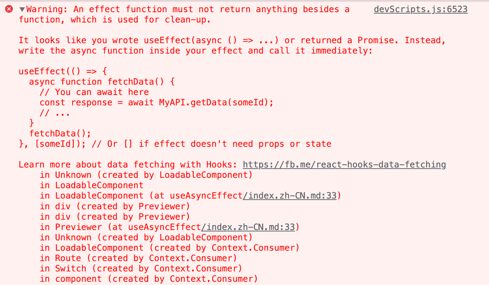

看报错，我们知道 `effect function` 应该返回一个销毁函数（`return`返回的 `cleanup` 函数），如果 `useEffect` 第一个参数传入 `async`，返回值则变成了 `Promise`，会导致 `react` 在调用销毁函数的时候报错\*\*。

**React 为什么要这么做？**

`useEffect` 作为 `Hooks` 中一个很重要的 `Hooks`，可以让你在函数组件中执行副作用操作。

它能够完成之前 `Class Component` 中的生命周期的职责。它返回的函数的执行时机如下：

* 首次渲染不会进行清理，会在下一次渲染，清除上一次的副作用。

* 卸载阶段也会执行清除操作。

不管是哪个，我们都不希望这个返回值是异步的，这样我们无法预知代码的执行情况，很容易出现难以定位的 Bug。

所以 React 就直接限制了不能 useEffect 回调函数中不能支持 async...await...

**useEffect 怎么支持 async...await...**

竟然 useEffect 的回调函数不能使用 `async...await`，那我直接在它内部使用。

做法一：创建一个异步函数（`async...await` 的方式），然后执行该函数。

```javascript
useEffect(() => {
  const asyncFun = async () => {
    setPass(await mockCheck());
  };
  asyncFun();
}, []);
```

法二：也可以使用 `IIFE`，如下所示：

```javascript
useEffect(() => {
  (async () => {
    setPass(await mockCheck());
  })();
}, []);
```

**自定义 hooks**

既然知道了怎么解决，我们完全可以将其封装成一个 hook，让使用更加的优雅。我们来看下 ahooks 的 `useAsyncEffect`，它支持所有的异步写法，包括 `generator function`。

思路跟上面一样，入参跟 useEffect 一样，一个回调函数（不过这个回调函数支持异步），另外一个依赖项 deps。内部还是 useEffect，将异步的逻辑放入到它的回调函数里面。

```javascript
function useAsyncEffect(
  effect: () => AsyncGenerator<void, void, void> | Promise<void>,
  // 依赖项
  deps?: DependencyList,
) {
  // 判断是 AsyncGenerator
  function isAsyncGenerator(
    val: AsyncGenerator<void, void, void> | Promise<void>,
  ): val is AsyncGenerator<void, void, void> {
    // Symbol.asyncIterator: https://developer.mozilla.org/zh-CN/docs/Web/JavaScript/Reference/Global_Objects/Symbol/asyncIterator
    // Symbol.asyncIterator 符号指定了一个对象的默认异步迭代器。如果一个对象设置了这个属性，它就是异步可迭代对象，可用于for await...of循环。
    return isFunction(val[Symbol.asyncIterator]);
  }
  useEffect(() => {
    const e = effect();
    // 这个标识可以通过 yield 语句可以增加一些检查点
    // 如果发现当前 effect 已经被清理，会停止继续往下执行。
    let cancelled = false;
    // 执行函数
    async function execute() {
      // 如果是 Generator 异步函数，则通过 next() 的方式全部执行
      if (isAsyncGenerator(e)) {
        while (true) {
          const result = await e.next();
          // Generate function 全部执行完成
          // 或者当前的 effect 已经被清理
          if (result.done || cancelled) {
            break;
          }
        }
      } else {
        await e;
      }
    }
    execute();
    return () => {
      // 当前 effect 已经被清理
      cancelled = true;
    };
  }, deps);
}
```

`async...await` 我们之前已经提到了，重点看看实现中变量 `cancelled` 的实现的功能。 它的作用是中断执行。

> 通过 `yield` 语句可以增加一些检查点，如果发现当前 `effect` 已经被清理，会停止继续往下执行。

试想一下，有一个场景，用户频繁的操作，可能现在这一轮操作 a 执行还没完成，就已经开始开始下一轮操作 b。这个时候，操作 a 的逻辑已经失去了作用了，那么我们就可以停止往后执行，直接进入下一轮操作 b 的逻辑执行。这个 `cancelled` 就是用来取消当前正在执行的一个标识符。

**还可以支持 useEffect 的清除机制么？**

可以看到上面的 `useAsyncEffect`，内部的 `useEffect` 返回函数只返回了如下：

```javascript
return () => {
  // 当前 effect 已经被清理
  cancelled = true;
};
```

这说明，你通过 useAsyncEffect 没有 useEffect 返回函数中执行清除副作用的功能。

你可能会觉得，我们将 `effect`(`useAsyncEffect` 的回调函数)的结果，放入到 `useAsyncEffect` 中不就可以了？

实现最终类似如下：

```javascript
function useAsyncEffect(effect: () => Promise<void | (() => void)>, dependencies?: any[]) {
  return useEffect(() => {
    const cleanupPromise = effect()
    return () => { cleanupPromise.then(cleanup => cleanup && cleanup()) }
  }, dependencies)
}
```

这种做法在github上也有讨论，上面有个大神的说法我表示很赞同：

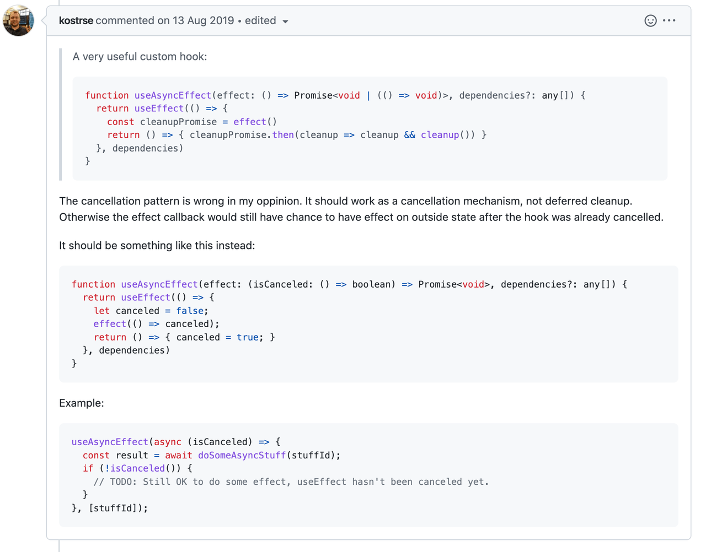

他认为这种延迟清除机制是不对的，应该是一种取消机制。否则，在钩子已经被取消之后，回调函数仍然有机会对外部状态产生影响。他的实现和例子我也贴一下，跟 `useAsyncEffect` 其实思路是一样的，如下：

实现：

```plaintext
function useAsyncEffect(effect: (isCanceled: () => boolean) => Promise<void>, dependencies?: any[]) {
  return useEffect(() => {
    let canceled = false;
    effect(() => canceled);
    return () => { canceled = true; }
  }, dependencies)
}
```

Demo:

```javascript
useAsyncEffect(async (isCanceled) => {
  const result = await doSomeAsyncStuff(stuffId);
  if (!isCanceled()) {
    // TODO: Still OK to do some effect, useEffect hasn't been canceled yet.
  }
}, [stuffId]);
```

其实归根结底，我们的清除机制不应该依赖于异步函数，否则很容易出现难以定位的 bug。

**总结与思考**

由于 `useEffect` 是在函数式组件中承担执行副作用操作的职责，它的返回值的执行操作应该是可以预期的，而不能是一个异步函数，所以不支持回调函数 `async...await` 的写法。

我们可以将 `async...await` 的逻辑封装在 `useEffect` 回调函数的内部，这就是 ahooks `useAsyncEffect` 的实现思路，而且它的范围更加广，它支持的是所有的异步函数，包括 `generator function`。

***

## 28. 我们应该在什么场景下使用 useMemo 和 useCallback ？


**参考答案：**

**前言**

useMemo 和 useCallback 是 React 的内置 Hook，通常作为优化性能的手段被使用。他们可以用来缓存函数、组件、变量，以避免两次渲染间的重复计算。但是实践过程中，他们经常被过度使用：担心性能的开发者给每个组件、函数、变量、计算过程都套上了 memo，以至于它们在代码里好像失控了一样，无处不在。

本文希望通过分析 useMemo/useCallback 的目的、方式、成本，以及具体使用场景，帮助开发者正确的决定如何适时的使用他们。赶时间的读者可以直接拉到底部看结论。

我们先从 useMemo/useCallback 的目的说起。

**为什么使用 useMemo 和 useCallback**

使用 memo 通常有三个原因：

1. ✅ 防止不必要的 effect。

2. ❗️防止不必要的 re-render。

3. ❗️防止不必要的重复计算。

后两种优化往往被误用，导致出现大量的无效优化或冗余优化。下面详细介绍这三个优化方式。

**防止不必要的 effect**

如果一个值被 useEffect 依赖，那它可能需要被缓存，这样可以避免重复执行 effect。

```javascript
const Component = () => {
  // 在 re-renders 之间缓存 a 的引用
  const a = useMemo(() => ({ test: 1 }), []);

  useEffect(() => {
    // 只有当 a 的值变化时，这里才会被触发
    doSomething();
  }, [a]);

  // the rest of the code
};
```

useCallback 同理：

```javascript
const Component = () => {
  // 在 re-renders 之间缓存 fetch 函数
  const fetch = useCallback(() => {
    console.log('fetch some data here');
  }, []);

  useEffect(() => {
    // 仅fetch函数的值被改变时，这里才会被触发
    fetch();
  }, [fetch]);

  // the rest of the code

};
```

当变量直接或者通过依赖链成为 useEffect 的依赖项时，那它可能需要被缓存。这是 useMemo 和 useCallback 最基本的用法。

**防止不必要的 re-render**

进入重点环节了🔔。正确的阻止 re-render 需要我们明确三个问题：

1. 组件什么时候会 re-render。

2. 如何防止子组件 re-render。

3. 如何判断子组件需要缓存。

4. 组件什么时候会 re-render

三种情况：

1. 当本身的 props 或 state 改变时。

2. Context value 改变时，使用该值的组件会 re-render。

3. 当父组件重新渲染时，它所有的子组件都会 re-render，形成一条 re-render 链。

第三个 re-render 时机经常被开发者忽视，导致代码中存在大量的无效缓存。

例如：

```javascript
const App = () => {
  const [state, setState] = useState(1);

  const onClick = useCallback(() => {
    console.log('Do something on click');
  }, []);

  return (
        // 无论 onClick 是否被缓存，Page 都会 re-render 
    <Page onClick={onClick} />
  );
};
```

当使用 setState 改变 state 时，App 会 re-render，作为子组件的 Page 也会跟着 re-render。这里 useCallback 是完全无效的，它并不能阻止 Page 的 re-render。

1. 如何防止子组件 re-render

必须同时缓存 onClick 和组件本身，才能实现 Page 不触发 re-render。

```javascript
const PageMemoized = React.memo(Page);

const App = () => {
  const [state, setState] = useState(1);

  const onClick = useCallback(() => {
    console.log('Do something on click');
  }, []);

  return (
    // Page 和 onClick 同时 memorize
    <PageMemoized onClick={onClick} />
  );
};
```

由于使用了React.memo，PageMemoized 会浅比较 props 的变化后再决定是否 re-render。onClick 被缓存后不会再变化，所以 PageMemoized 不再 re-render。

然而，如果 PageMemoized 再添加一个未被缓存的 props，一切就前功尽弃 🤯 ：

```javascript
const PageMemoized = React.memo(Page);

const App = () => {
  const [state, setState] = useState(1);

  const onClick = useCallback(() => {
    console.log('Do something on click');
  }, []);

  return (
    // page WILL re-render because value is not memoized
    <PageMemoized onClick={onClick} value={[1, 2, 3]} />
  );
};
```

由于 value 会随着 App 的 re-render 重新定义，引用值发生变化，导致 PageMemoized 仍然会触发 re-render。

现在可以得出结论了，必须同时满足以下两个条件，子组件才不会 re-render：

1. 子组件自身被缓存。

2. 子组件所有的 prop 都被缓存。

3. 如何判断子组件需要缓存

我们已经了解，为了防止子组件 re-render，需要以下成本：

1. 开发者工作量的增加： 一旦使用缓存，就必须保证组件本身以及所有 props 都缓存，后续添加的所有 props 都要缓存。

2. 代码复杂度和可读性的变化：代码中出现大量缓存函数，这会增加代码复杂度，并降低易读性。

除此之外还有另外一个成本：性能成本。 组件的缓存是在初始化时进行，虽然每个组件缓存的性能耗费很低，通常不足1ms，但大型程序里成百上千的组件如果同时初始化缓存，成本可能会变得很可观。

所以局部使用 memo，比全局使用显的更优雅、性能更好，坏处是需要开发者主动去判断是否需要缓存该子组件。

🤨 那应该什么时候缓存组件，怎么判断一个组件的渲染是昂贵的？

很遗憾，似乎没有一个简单&无侵入&自动的衡量方式。通常来说有两个方式：

1. 人肉判断，开发或者测试人员在研发过程中感知到渲染性能问题，并进行判断。

2. 通过工具，目前有一些工具协助开发者在查看组件性能:

   1. 如 [React Dev Tools Profiler](https://zh-hans.reactjs.org/blog/2018/09/10/introducing-the-react-profiler.html)，[这篇文章](https://medium.com/@ashr81/react-performance-code-changes-part-i-fc8f2fddb37)介绍了使用方式

   2. 如这个 hooks：[useRenderTimes](https://ecomfe.github.io/react-hooks/#/hook/debug/use-render-times)

另外，React 在 16.5版本后提供了 [Profiler API](https://reactjs.org/docs/profiler.html)：*它可以识别出应用中渲染较慢的部分，或是可以使用类似 memoization 优化的部分*。所以可以通过 puppeteer 或 cypress 在自动化集成中测试组件性能，这很适合核心组件的性能测试。

**防止不必要的重复计算**

如 [React 文档](https://zh-hans.reactjs.org/docs/hooks-reference.html#usememo)所说，useMemo 的基本作用是，避免在每次渲染时都进行高开销的计算。

🤨 那什么是“高开销的计算”？

高开销的计算其实极少出现，如下示例，对包含 250 个 item 的数组 countries 进行排序、渲染，并计算耗时。

```javascript
const List = ({ countries }) => {
  const before = performance.now();
  const sortedCountries = orderBy(countries, 'name', sort);
  // this is the number we're after
  const after = performance.now() - before;

  return (
    // same
  )
};
```

大部分情况下，我们的计算量要比这个 250 个 item 的数组少，而组件渲染要比这个 List 组件复杂的多，所以真实程序中，计算和渲染的性能差距会更大。

可见，组件渲染才是性能的瓶颈，应该把 useMemo 用在程序里渲染昂贵的组件上，而不是数值计算上。当然，除非这个计算真的很昂贵，比如阶乘计算。

至于为什么不给所有的组件都使用 useMemo，上文已经解释了。useMemo 是有成本的，它会增加整体程序初始化的耗时，并不适合全局全面使用，它更适合做局部的优化。

**为什么 React 没有把缓存组件作为默认配置？**

&#x20;简而言之：

1. 缓存是有成本的，小的成本可能会累加过高。

2. 默认缓存无法保证足够的正确性。

> 原因 2 的原文：correctness is not guaranteed for everything because people can mutate things. Christopher Chedeau 未给出进一步解释。或许他是指可能会导致跟 purecomponent相同的问题，即浅比较 mutate things 时，由于浅比较相等，导致组件未能 update 的问题。

**结论**

讲到这里我们可以总结出 useMemo/useCallback 使用准则了：

1. 大部分的 useMemo 和 useCallback 都应该移除，他们可能没有带来任何性能上的优化，反而增加了程序首次渲染的负担，并增加程序的复杂性。

2. 使用 useMemo 和 useCallback 优化子组件 re-render 时，必须同时满足以下条件才有效。

   1. 子组件已通过 React.memo 或 useMemo 被缓存

   2. 子组件所有的 prop 都被缓存

3. 不推荐默认给所有组件都使用缓存，大量组件初始化时被缓存，可能导致过多的内存消耗，并影响程序初始化渲染的速度。


***

## 29. 说说你对 React Hook的闭包陷阱的理解，有哪些解决方案？


**参考答案：**

本文从 一个hooks中 “奇怪”（其实符合逻辑） 的 “闭包陷阱” 的场景切入，试图讲清楚其背后的因果。同时，在许多 react hooks 奇技淫巧的文章里，也能看到 `useRef` 的身影，那么为什么使用 `useRef` 又能摆脱 这个 “闭包陷阱” ？ 搞清楚这些问题，将能较大的提升对 react hooks 的理解。

react hooks 一出现便受到了许多开发人员的追捧,或许在使用react hooks 的时候遇到 “闭包陷阱” 是每个开发人员在开发的时候都遇到过的事情，有的两眼懵逼、有的则稳如老狗瞬间就定义到了问题出现在何处。

(以下react示范demo，均为react 16.8.3 版本)

你一定遭遇过以下这个场景：

```javascript
function App(){
    const [count, setCount] = useState(1);
    useEffect(()=>{
        setInterval(()=>{
            console.log(count)
        }, 1000)
    }, [])
}
```

在这个定时器里面去打印 `count` 的值，会发现，不管在这个组件中的其他地方使用 `setCount` 将 `count` 设置为任何值，还是设置多少次，打印的都是1。是不是有一种，尽管历经千帆，我记得的还是你当初的模样的感觉？ hhh... 接下来，我将尽力的尝试将我理解的，为什么会发生这么个情况说清楚，并且浅谈一些hooks其他的特性。如果有错误，希望各位同学能救救孩子，不要让我带着错误的认知活下去了。。。

**1、一个熟悉的闭包场景**

首先从一个各位jser都很熟悉的场景入手。

```javascript
for ( var i=0; i<5; i++ ) {
    setTimeout(()=>{
        console.log(i)
    }, 0)
}
```

我就不说为什么最终，打印的都是5的原因了。直接贴出使用闭包打印 0...4的代码：

```javascript
for ( var i=0; i<5; i++ ) {
   (function(i){
         setTimeout(()=>{
            console.log(i)
        }, 0)
   })(i)
}
```

这个原理其实就是使用闭包，定时器的回调函数去引用立即执行函数里定义的变量，形成闭包保存了立即执行函数执行时 i 的值，异步定时器的回调函数才如我们想要的打印了顺序的值。

其实，`useEffect` 的哪个场景的原因，跟这个，简直是一样的，`useEffect` 闭包陷阱场景的出现，是 react 组件更新流程以及 `useEffect` 的实现的自然而然结果。

**2 浅谈hooks原理，理解useEffect 的 “闭包陷阱” 出现原因。**

首先，可能都听过react的 Fiber 架构，其实可以认为一个 Fiber节点就对应的是一个组件。对于 `classComponent` 而言，有 `state` 是一件很正常的事情，Fiber对象上有一个 `memoizedState` 用于存放组件的 `state`。ok，现在看 hooks 所针对的 `FunctionComponnet`。 无论开发者怎么折腾，一个对象都只能有一个 `state` 属性或者 `memoizedState` 属性，可是，谁知道可爱的开发者们会在 `FunctionComponent` 里写上多少个 `useState`，`useEffect` 等等 ? 所以，react用了链表这种数据结构来存储 `FunctionComponent` 里面的 hooks。比如：

```javascript
function App(){
    const [count, setCount] = useState(1)
    const [name, setName] = useState('chechengyi')
    useEffect(()=>{
        
    }, [])
    const text = useMemo(()=>{
        return 'ddd'
    }, [])
}
```

在组件第一次渲染的时候，为每个hooks都创建了一个对象

```javascript
type Hook = {
  memoizedState: any,
  baseState: any,
  baseUpdate: Update<any, any> | null,
  queue: UpdateQueue<any, any> | null,
  next: Hook | null,
};
```

最终形成了一个链表。


这个对象的`memoizedState`属性就是用来存储组件上一次更新后的 `state`,`next`毫无疑问是指向下一个hook对象。在组件更新的过程中，hooks函数执行的顺序是不变的，就可以根据这个链表拿到当前hooks对应的`Hook`对象，函数式组件就是这样拥有了state的能力。当前，具体的实现肯定比这三言两语复杂很多。

所以，知道为什么不能将hooks写到if else语句中了把？因为这样可能会导致顺序错乱，导致当前hooks拿到的不是自己对应的Hook对象。

`useEffect` 接收了两个参数，一个回调函数和一个数组。数组里面就是 `useEffect` 的依赖，当为 \[] 的时候，回调函数只会在组件第一次渲染的时候执行一次。如果有依赖其他项，react 会判断其依赖是否改变，如果改变了就会执行回调函数。说回最初的场景：

```javascript
function App(){
    const [count, setCount] = useState(1);
    useEffect(()=>{
        setInterval(()=>{
            console.log(count)
        }, 1000)
    }, [])
    function click(){ setCount(2) }
}
```

好，开动脑袋开始想象起来，组件第一次渲染执行 `App()`，执行 `useState` 设置了初始状态为1，所以此时的 `count` 为1。然后执行了 `useEffect`，回调函数执行，设置了一个定时器每隔 1s 打印一次 `count`。

接着想象如果 `click` 函数被触发了，调用 `setCount(2)` 肯定会触发react的更新，更新到当前组件的时候也是执行 `App()`，之前说的链表已经形成了哈，此时 `useState` 将 `Hook` 对象 上保存的状态置为2， 那么此时 `count` 也为2了。然后在执行 `useEffect` 由于依赖数组是一个空的数组，所以此时回调并不会被执行。

ok，这次更新的过程中根本就没有涉及到这个定时器，这个定时器还在坚持的，默默的，每隔1s打印一次 `count`。 注意这里打印的 `count` ，是组件第一次渲染的时候 `App()` 时的 `count`， `count`的值为1，因为在定时器的回调函数里面被引用了，形成了闭包一直被保存。

**2 难道真的要在依赖数组里写上的值，才能拿到新鲜的值？**

仿佛都习惯性都去认为，只有在依赖数组里写上我们所需要的值，才能在更新的过程中拿到最新鲜的值。那么看一下这个场景：

```javascript
function App() {
  return <Demo1 />
}

function Demo1(){
  const [num1, setNum1] = useState(1)
  const [num2, setNum2] = useState(10)

  const text = useMemo(()=>{
    return `num1: ${num1} | num2:${num2}`
  }, [num2])

  function handClick(){
    setNum1(2)
    setNum2(20)
  }

  return (
    <div>
      {text}
      <div><button onClick={handClick}>click!</button></div>
    </div>
  )
}
```

`text` 是一个 `useMemo` ，它的依赖数组里面只有num2，没有num1，却同时使用了这两个state。当点击button 的时候，num1和num2的值都改变了。那么，只写明了依赖num2的 text 中能否拿到 num1 最新鲜的值呢？

如果你装了 `react` 的 eslint 插件，这里也许会提示你错误，因为在text中你使用了 num1 却没有在依赖数组中添加它。 但是执行这段代码会发现，是可以正常拿到num1最新鲜的值的。

如果理解了之前第一点说的“闭包陷阱”问题，肯定也能理解这个问题。

为什么呢，再说一遍，这个依赖数组存在的意义，是react为了判定，在本次更新中，是否需要执行其中的回调函数，这里依赖了的num2，而num2改变了。回调函数自然会执行， 这时形成的闭包引用的就是最新的num1和num2，所以，自然能够拿到新鲜的值。问题的关键，在于回调函数执行的时机，闭包就像是一个照相机，把回调函数执行的那个时机的那些值保存了下来。之前说的定时器的回调函数我想就像是一个从1000年前穿越到现代的人，虽然来到了现代，但是身上的血液、头发都是1000年前的。

**3 为什么使用useRef能够每次拿到新鲜的值？**

大白话说：因为初始化的 `useRef` 执行之后，返回的都是同一个对象。写到这里宝宝又不禁回忆起刚学js那会儿，捧着红宝书啃时候的场景了：

```javascript
var A = {name: 'chechengyi'}
var B = A
B.name = 'baobao'
console.log(A.name) // baobao
```

对，这就是这个场景成立的最根本原因。

也就是说，在组件每一次渲染的过程中。 比如 `ref = useRef()` 所返回的都是同一个对象，每次组件更新所生成的`ref`指向的都是同一片内存空间， 那么当然能够每次都拿到最新鲜的值了。犬夜叉看过把？一口古井连接了现代世界与500年前的战国时代，这个同一个对象也将这些个被保存于不同闭包时机的变量了联系了起来。

使用一个例子或许好理解一点：

```javascript
/* 将这些相关的变量写在函数外 以模拟react hooks对应的对象 */
let isC = false
let isInit = true; // 模拟组件第一次加载
let ref = {
        current: null
}

function useEffect(cb){
// 这里用来模拟 useEffect 依赖为 [] 的时候只执行一次。
if (isC) return
isC = truet
cb()
}

function useRef(value){
// 组件是第一次加载的话设置值 否则直接返回对象
        if ( isInit ) {
                ref.current = value
                isInit = false
        }
        return ref
}

function App(){
        let ref_ = useRef(1)
        ref_.current++
        useEffect(()=>{
                setInterval(()=>{
                        console.log(ref.current) // 3
                }, 2000)
        })
}

// 连续执行两次 第一次组件加载 第二次组件更新
App()
App()
```

所以，提出一个合理的设想。只要我们能保证每次组件更新的时候，`useState` 返回的是同一个对象的话？我们也能绕开闭包陷阱这个情景吗？ 试一下吧。

```javascript
function App() {
  // return <Demo1 />
  return <Demo2 />
}

function Demo2(){
  const [obj, setObj] = useState({name: 'chechengyi'})

  useEffect(()=>{
    setInterval(()=>{
      console.log(obj)
    }, 2000)
  }, [])
  
  function handClick(){
    setObj((prevState)=> {
      var nowObj = Object.assign(prevState, {
        name: 'baobao',
        age: 24
      })
      console.log(nowObj == prevState)
      return nowObj
    })
  }
  return (
    <div>
      <div>
        <span>name: {obj.name} | age: {obj.age}</span>
        <div><button onClick={handClick}>click!</button></div>
      </div>
    </div>
  )
}
```

简单说下这段代码，在执行 `setObj` 的时候，传入的是一个函数。这种用法就不用我多说了把？然后 `Object.assign` 返回的就是传入的第一个对象。总而言之，就是在设置的时候返回了同一个对象。

执行这段代码发现，确实点击button后，定时器打印的值也变成了：

```javascript
{
    name: 'baobao',
    age: 24 
}
```


***

## 30. React18新特性


**参考答案：**

React 团队在 2022 年 3 月 29 日正式发布了 React 的第 18 个版本。 我将在这篇文章里简单介绍 React 18 的新特性，React Concurrent Mode（并发模式）的实现，以及简要的升级指南。

**New Features**

**Automatic Batching**

早在 React 18 之前，React 就已经可以对 state 更新进行批处理了：

```javascript
function App() {
  const [count, setCount] = useState(0);

  const [flag, setFlag] = useState(false);

  function handleClick() {
    setCount((c) => c + 1); // Does not re-render yet

    setFlag((f) => !f); // Does not re-render yet

    // React will only re-render once at the end (that's batching!)
  }

  return (
    <div>
      <div>{count}</div>
      <button onClick={handleClick}>Next</button>
    </div>
  );
}
```

上面这个例子中，用户点击按钮时会产生两次 state 的更新，按理来说每次 state 更新都会导致一次 re-render。但是，这两次更新完全可以合成一次，从而减少无谓的 re-render 带来的性能损失。

这种批处理只限于 React 原生事件内部的更新。

在 React 18 中，批处理支持处理的操作范围扩大了：Promise，setTimeout，native event handlers 等这些非 React 原生的事件内部的更新也会得到合并：

```javascript
// Before: only React events were batched.

setTimeout(() => {
  setCount((c) => c + 1);

  setFlag((f) => !f);

  // React will render twice, once for each state update (no batching)
}, 1000);

// After: updates inside of timeouts, promises,

// native event handlers or any other event are batched.

setTimeout(() => {
  setCount((c) => c + 1);

  setFlag((f) => !f);

  // React will only re-render once at the end (that's batching!)
}, 1000);
```

**Transitions**

Transitions 是 React 中一个用于区分高优更新和非高优更新的新概念。

* 高优的更新/渲染：包括鼠标点击、打字等对实时交互性要求很高的更新场景，卡顿时会影响用户的交互行为，使用户明显感到整个页面卡顿。

* 非高优的更新/渲染：普通的 UI 更新，不与用户的交互相关，一些对更新实时性要求没那么高的场景。

这里有一个 [demo](https://react-fractals-git-react-18-swizec.vercel.app/)，上方是一个滑动条用于控制下方树的倾角，最顶上的扇区展示了当前的掉帧情况，当用户拉动滚动条时，下方的树的每一个节点都会重新渲染，这会带来明显的卡顿，不仅是下方树的渲染卡顿，上方的滚动条也会无法实时跟着用户的交互移动，这会给用户带来明显的卡顿感。

类似场景下常见的做法应该是 `debounce` 或 `throttle` ，React 18 为我们提供了原生的方式来解决这个问题：使用 `starTransition` 和 `useTransition`。

* `starTransition`：用于标记非紧急的更新，用 `starTransition` 包裹起来就是告诉 React，这部分代码渲染的优先级不高，可以优先处理其它更重要的渲染。用法如下：

```javascript
import { startTransition } from "react";

// Urgent
setSliderValue(input);

// Mark any state updates inside as transitions
startTransition(() => {
  // Transition: Show the results, non-urgent
  setGraphValue(input);
});
```

* useTransition：除了能提供 startTransition 以外，还能提供一个变量来跟踪当前渲染的执行状态：

```javascript
import { useTransition } from "react";

const [isPending, startTransition] = useTransition();

return isPending && <Spinner />;
```

在勾选了 Use startTransition 后 ，滑动条的更新渲染不会再被树的渲染阻塞了，尽管树叶的渲染仍然需要较多的时间，但是用户使用起来不再有之前那么卡顿了。

**Suspense**

Suspense 是 React 提供的用于声明 UI 加载状态的 API：

```javascript
<Suspense fallback={<Loading />}>
  <ComponentThatSuspends />
  <Sibling />
</Suspense>
```

\<ComponentThatSuspends /> \<Sibling /> \</Suspense>

上面这串代码里，组件 `ComponentThatSuspends` 在请求处理数据过程中，React 会在它的位置上展示 Loading 组件。

React 16 和 17 中也已经有 Suspense 了，但是它不是完全体，有许多功能仍未就绪。在 React 团队的计划中，Suspense 的完全体是基于 Concurrent React 的，所以在 React 18，Suspense 相较之前有了一些变化。

**`ComponentThatSuspends` 的兄弟组件会被中断**

还是上面那个例子：

```javascript
<Suspense fallback={<Loading />}>
  <ComponentThatSuspends />
  <Sibling />
</Suspense>
```

\<ComponentThatSuspends /> \<Sibling /> \</Suspense>

* Legacy Suspense 中，同级兄弟组件会立即挂载（mounted）到 DOM，相关的 effects 和生命周期会被触发，最后会隐藏这个组件。具体可以查看 [代码示例](https://codesandbox.io/s/keen-banach-nzut8?file=/src/App.js)。

* Concurrent Suspense 中，同级兄弟组件并不会从 DOM 上卸载，相关的 effects 和生命周期会在 ComponentThatSuspends 处理完成时触发。具体可以查看 [代码示例](https://codesandbox.io/s/romantic-architecture-ht3qi?file=/src/App.js)。

**Suspense 边界之外的 ref**

另一个差异是父级 ref 传入的时间：

```javascript
<Suspense fallback={<Loading />}>
  <ComponentThatSuspends />
  <Sibling />
</Suspense>
```

\</Suspense>

* 在 Legacy Suspense 中，在渲染之初 `refPassedFromParent.current` 立即指向 DOM 节点，此时 `ComponentThatSuspends` 还未处理完成。

* 在 Concurrent Suspense 中，在 `ComponentThatSuspends` 完成处理、Suspense 边界解除锁定之前 `refPassedFromParent.current` 一直为 null。

也就是说，在父级代码中访问此类 ref 都需要关注当前 ref 是否已经指向相应的节点。

**Suspense for SSR**

React 18 之前的 SSR， 客户端必须一次性的等待 HTML 数据加载到服务器上并且等待所有 JavaScript 加载完毕之后再开始 hydration， 等待所有组件 hydration 后，才能进行交互。即整个过程需要完成从获取数据（服务器）→ 渲染到 HTML（服务器）→ 加载代码（客户端）→ 水合物（客户端）这一套流程。这样的 SSR 并不能使我们的完全可交互变快，只是提高了用户的感知静态页面内容的速度。

React 18 的 Suspense：

* 服务器不需要等待被 Suspense 包裹组件是否加载到完毕，即可发送 HTML，而代替 Suspense 包裹的组件是 fallback 中的内容，一般是一个占位符（spinner），以最小内联 `<script>` 标签标记此 HTML 的位置。等待服务器上组件的数据准备好后，React 再将剩余的 HTML 发送到同一个流中。

* hydration 的过程是逐步的，不需要等待所有的 js 加载完毕再开始 hydration，避免了页面的卡顿。

* React 会提前监听页面上交互事件（如鼠标的点击），对发生交互的区域优先进行 hydration。

**New Client and Server Rendering APIs**

**Client**

* `createRoot`

  * 新的 root API，在 React 就版本中都是通过 `ReactDom.render` 将应用组件渲染到页面的根元素，在 React 18 中，只有使用 `ReactDom.createRoot` 才能使用新特性。

```javascript
import * as ReactDOM from "react-dom";
import App from "./App";

// before React 18
const root = document.getElementById("app");
ReactDOM.render(<App />, root);

// React 18
const root = ReactDOM.createRoot(document.getElementById("app"));
root.render(<App />, root);
```

* `hydrateRoot`：同理，用于替代 ReactDOM.hydrate。

**Server**

`renderToPipeableStream` 用于 Node 环境，实现流式传输；`renderToReadableStream` 用于 Deno 或 Cloudflare workers 等更现代的运行时中。

**New Hooks**

* `useTransition`：见上

* `useDeferredValue`

  * startTransition 可以用来标记低优先的 state 更新；而 useDeferredValue 可以用来标记低优先的变量。

  * 下方代码的具体效果是当 `input` 的值改变时，返回的 `graphValue` 并不会立即改变，会首先返回上一次的 `input` 值，如果当前不存在更紧急的更新，才会变成最新的 `input`，因此可以通过 `graphValue` 是否改变来进行一些低优先级的更新。可以在渲染比较耗时的情况下把优先级滞后，在多数情况不会存在不必要的延迟。在较快的机器上，滞后会更少或者根本不存在，在较慢的机器上，会变得更明显。但不论哪种情况，应用都会保持可响应。

```javascript
import { useDeferredValue } from "react";

const Comp = (input) => {
  const graphValue = useDeferredValue(input); // ...updating depends on graphValue
};
```

**不常用的 hooks**

以下的新 hook 主要用于解决 SSR 相关的问题或者是为第三方库的开发设计的，对于普通 React 应用开发者来说几乎用不到：

* `useId` 用于解决 SSR 时客户端与服务端难以生成统一的 ID 的问题。

* `useSyncExternalStore` 是一个为第三方库编写提供的新 hook，主要用于支持 React 18 在 concurrent rendering 下与第三方 store 的数据同步问题。

* `useInsertionEffect` 主要用于提高第三方 CSS in JS 库渲染过程中样式注入的性能。

**Concurrent Rendering**

React 18 最重要的更新就是全面启用了 concurrent rendering。它不能算是新功能，实际上是 React 内部工作方式的重大变化。为了最终实现 concurrent rendering，React 布局已久。

**问题**

在页面元素很多，且需要频繁 re-render 的场景下，React 15 会出现掉帧的现象。其根本原因是大量的同步计算任务阻塞了浏览器的 UI 渲染。JS 运算、页面布局和绘制都是运行在浏览器的主线程当中，他们之间是互斥的。如果 JS 运算持续占用主线程，页面就没法得到及时的更新。当我们更新 state 触发 re-render 时，React 会遍历应用的所有节点，计算出差异，然后再更新 UI。更新一旦开始，中途就无法中断，直到遍历完整棵树，才能释放主线程。如果页面元素很多，整个过程占用的时机就可能超过 16ms，造成浏览器卡顿。

可以看到，React 15 的实现导致浏览器卡顿的关键在于每一次 re-render 开始了就无法停止，所以 React 团队想了一种解决方法：把 re-render 变成 可中断 的。

**实现**

**思路**

* 将 re-render 时的 JS 计算拆分成更小粒度的任务，可以随时暂停、继续和丢弃执行的任务。

* 当 JS 计算的时间达到 16 毫秒之后使其暂停，把主线程让给 UI 绘制，防止出现渲染掉帧的问题。

* 在浏览器空闲的时候继续执行之前没执行完的小任务。

**架构演进**

React 15 时期还没有 concurrent 的概念。它主要分为 Reconciler 和 Renderer 两部分：Reconciler 负责生成虚拟 DOM 并进行 diff，找出变动的虚拟 DOM，然后 Renderer 负责将变化的组件渲染到不同的宿主环境中。

React 16 的架构改动较大，多了一层 Scheduler，并且 Reconciler 的部分基于 Fiber 完成了重构。

React 17 相较先前并没有在架构上有大的改动，它是一个用以稳定 concurrent mode 的过渡版本，另外，它使用 Lanes 重构了优先级算法。

**Reconciler**

重构以前的 React Reconciler 是基于栈实现的，重构后的 React Reconciler 是基于 Fiber 实现的。

**Fiber**

Fiber 是一种数据结构，简单来讲，它的主要结构如下：

```javascript
{
    ...
    stateNode, // 一般为 ReactComponent
               // 的实例或者 DOM 元素
    child,     // 子 Fiber 节点
    sibling,   // 同层的下一个 Fiber 节点
    return,    // 指向父节点
    alternate, // 连接 Current Fiber 树和
               // workInProgress Fiber 树
    ...
}
```

ReactElement，Fiber，DOM 三者的关系：

* ReactElement：所有采用 JSX 语法书写的节点都会被转译，最终会以`React.createElement(...)` 的方式，创建出来一个与之对应的 ReactElement 对象。

* Fiber：Fiber 对象是通过 ReactElement 对象进行创建的，多个 Fiber 对象构成了一棵 Fiber 树，Fiber 树是构造 DOM 树的数据模型，Fiber 树的任何改动，最后都体现到 DOM 树上。

* DOM：将文档解析为一个由节点和对象（包含属性和方法的对象）组成的结构集合，也就是常说的 DOM 树。JS 可以访问和操作存储在 DOM 中的内容，也就是操作 DOM 对象，进而触发 UI 渲染。

开发人员通过编程只能控制 ReactElement 树的结构，ReactElement 树驱动 Fiber 树，Fiber 树再驱动 DOM 树，最后展现到页面上。所以 Fiber 树的构造过程，其核心就是 ReactElement 对象到 Fiber 对象的转换过程。（因为篇幅问题，此处不做过多展开。）

**双缓存**

React 应用中最多同时存在两棵 Fiber 树。当前屏幕上显示内容对应的 Fiber 树叫做 Current Fiber，正在内存中构建的 Fiber 树叫做 workInProgress Fiber，他们通过 alternate 属性相互连接。当 workInProgress Fiber 树构建好了以后，只需要切换一下 current 指针的指向，这两棵树的身份就会完成互换。

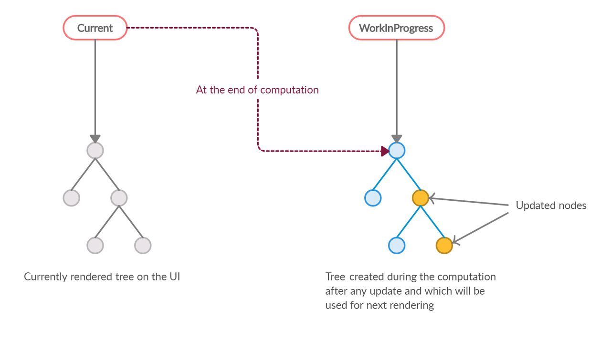

在这种双缓存的机制下，我们可以随时暂停或放弃对 workInProgress Fiber 树的修改，这就使得 React 更新的 中断 成为了可能。

**流程**

整个 Reconciliation 的流程可以简单地分为两个阶段：

* Render 阶段：当 React 需要进行 re-render 时，会遍历 Fiber 树的节点，根据 diff 算法将变化应用到 workInProgress 树上，这个阶段是随时可中断的。

* Commit 阶段：当 workInProgress 树构建完成之后，将其作为 Current 树，并把 DOM 变动绘制到页面上，这个阶段是不可中断的，必须一气呵成，类似操作系统中「原语」的概念。

**Scheduler**

对于大部分浏览器来说，每 1s 会有 60 帧，所以每一帧差不多是 16.6 ms，如果 Reconciliation 的 Render 阶段的更新时间过长，挤占了主线程其它任务的执行时间，就会导致页面卡顿。

> 思路
>
> * 将 re-render 时的 JS 计算拆分成更小粒度的任务，可以随时暂停、继续和丢弃执行的任务。
>
> * 当 JS 计算的时间达到 16 毫秒之后使其暂停，把主线程让给 UI 绘制，防止出现渲染掉帧的问题。
>
> * 在浏览器空闲的时候继续执行之前没执行完的小任务。

让我们回看一下回看上面的解决思路，React 给出的解决方案是将整次 Render 阶段的长任务拆分成多个小任务：

* 每个任务执行的时间控制在 5ms。

* 把每一帧 5ms 内未执行的任务分配到后面的帧中。

* 给任务划分优先级，同时进行时优先执行高优任务。

这就留下了三个问题。

> 如何把每个任务执行的时间控制在 5ms？

**中断 - `shouldYield()`**

Reconciler 的设计使 re-render 具备了 可中断 的特性，而 Scheduler 用于控制 何时中断。

```javascript
// Sync Mode，即 React 原本的不可中断的更新模式

function workLoopSync() {
  // Already timed out, so perform work without checking if we need to yield.

  while (workInProgress !== null) {
    performUnitOfWork(workInProgress);
  }
}

// Concurrent Mode

function workLoopConcurrent() {
  // Perform work until Scheduler asks us to yield

  while (workInProgress !== null && !shouldYield()) {
    performUnitOfWork(workInProgress);
  }
}
```

可以看到在每次遍历前，都会通过 Scheduler 提供的 `shouldYield` 方法判断是否需要中断遍历。

Scheduler 提供的 `shouldYield` 方法在 源码中叫 shouldtohost，它通过综合判断已消耗的时间（是否超过 5ms）、是否有用户输入等高优事件来决定是否需要中断遍历，给浏览器渲染和处理其它任务的时间，防止页面卡顿。源码中的注释对于哪些条件/情况下 yield 写得非常清晰。

```javascript
function shouldYieldToHost() {
  const timeElapsed = getCurrentTime() - startTime;

  if (timeElapsed < frameInterval) {
    // frameInterval = 5ms
    // The main thread has only been blocked for a really short amount of time;
    // smaller than a single frame. Don't yield yet.
    return false;
  }
  // The main thread has been blocked for a non-negligible amount of time. We
  // may want to yield control of the main thread, so the browser can perform
  // high priority tasks. The main ones are painting and user input. If there's
  // a pending paint or a pending input, then we should yield. But if there's
  // neither, then we can yield less often while remaining responsive. We'll
  // eventually yield regardless, since there could be a pending paint that
  // wasn't accompanied by a call to `requestPaint`, or other main thread tasks
  // like network events.
  if (enableIsInputPending) {
    if (needsPaint) {
      // There's a pending paint (signaled by `requestPaint`). Yield now.
      return true;
    }
    if (timeElapsed < continuousInputInterval) {
      // We haven't blocked the thread for that long. Only yield if there's a
      // pending discrete input (e.g. click). It's OK if there's pending
      // continuous input (e.g. mouseover).
      if (isInputPending !== null) {
        return isInputPending();
      }
    } else if (timeElapsed < maxInterval) {
      // Yield if there's either a pending discrete or continuous input.
      if (isInputPending !== null) {
        return isInputPending(continuousOptions);
      }
    } else {
      // We've blocked the thread for a long time. Even if there's no pending
      // input, there may be some other scheduled work that we don't know about,
      // like a network event. Yield now.
      return true;
    }
  }
  // `isInputPending` isn't available. Yield now.
  return true;
}
```

如何把每一帧 5ms 内未执行的任务分配到后面的帧中？

**时间切片**

如果任务的执行因为超过了 5ms 等被中断了，那么 React Scheduler 会借助一种效果接近于 `setTimeout` 的方式来开启一个宏任务，预定下一次的更新：

```javascript
let schedulePerformWorkUntilDeadline;

if (typeof localSetImmediate === "function") {
  // Node.js and old IE.
  // There's a few reasons for why we prefer setImmediate.

  // Unlike MessageChannel, it doesn't prevent a Node.js process from exiting.
  // (Even though this is a DOM fork of the Scheduler, you could get here
  // with a mix of Node.js 15+, which has a MessageChannel, and jsdom.)
  // [Bug: using MessageChannel prevents node.js process from exiting · Issue #20756 · facebook/react · GitHub](https://github.com/facebook/react/issues/20756)

  // But also, it runs earlier which is the semantic we want.
  // If other browsers ever implement it, it's better to use it.
  // Although both of these would be inferior to native scheduling.
  schedulePerformWorkUntilDeadline = () => {
    localSetImmediate(performWorkUntilDeadline);
  };
} else if (typeof MessageChannel !== "undefined") {
  // DOM and Worker environments.
  // We prefer MessageChannel because of the 4ms setTimeout clamping.
  const channel = new MessageChannel();
  const port = channel.port2;
  channel.port1.onmessage = performWorkUntilDeadline;
  schedulePerformWorkUntilDeadline = () => {
    port.postMessage(null);
  };
} else {
  // We should only fallback here in non-browser environments.
  schedulePerformWorkUntilDeadline = () => {
    localSetTimeout(performWorkUntilDeadline, 0);
  };
}
```

`requestIdleCallback`？

在其它的很多文章中，都提到了 `requestIdleCallback` 这个 API，然后说 React 团队考虑到兼容性和刷新帧率的问题，没有直接采用它，而是基于 `MessageChannel` 进行了模拟实现。但是从我看到的源码来说，React 是在借助 `MessageChannel` 模拟 `setTimeout` 的行为，将未完成的任务以宏任务的形式发放给浏览器，被动地让浏览器自行安排执行时间，而 `requestIdleCallback` 是主动从浏览器处获取空闲信息并执行任务，个人感觉不太像是一种对 `requestIdleCallback` 的 polyfill。

其它文章大多引用的是这部分源码，可以看到这是在 v17 的分支上的，目前最新的 React 源码中已经没有了这个文件，应该是 React 更换了实现方式（#20025，#20915），那些文章里的说法感觉有些过时？

在 Reconciliation 的 Render 阶段，假设它耗时比较长，为 150ms，那么我们可以把他拆分为单个节点的计算时间之和。单个节点的计算非常快，假设都为 0.1ms。那么可以根据宏任务在帧中执行的特点（一帧里可以执行多个宏任务，同时浏览器还会将宏任务合理分配到不同帧中），将渲染过程改为如下过程：

```javascript
// 假设 Render 阶段的计算拆分为 m 个节点，在第 n 帧结束

第 1 帧开始

宏任务开始

执行第 1 个节点，耗时 0.1ms

执行第 2 个节点，耗时 0.1ms

执行第 3 个节点，耗时 0.1ms

执行第 4 个节点，耗时 0.1ms

...

执行第 50 个节点，耗时 0.1ms

总耗时 5ms，开始下一个宏任务

渲染开始

由于更新是在内存中计算的，节点没有任何更新，那么不进行重新渲染

第 1 帧结束

第 2 帧开始

宏任务开始

执行第 51 个节点，耗时 0.1ms

执行第 52 个节点，耗时 0.1ms

执行第 53 个节点，耗时 0.1ms

...

执行第 100 个节点，耗时 0.1ms

总耗时 5ms，开始下一个宏任务

渲染开始

由于更新是在内存中计算的，节点没有任何更新，那么不进行重新渲染

第 2 帧结束

...

第 n 帧开始

宏任务开始

执行第 m-2 个节点，耗时 0.1 ms

执行第 m-1 个节点，耗时 0.1 ms

执行第 m 个节点，耗时 0.1 ms

所有节点计算完毕！

开始更新创建真实节点

渲染开始

真实节点更新，将其渲染到浏览器上

第 n 帧结束
```

> 如何给任务划分优先级？

**基于 Lanes 的优先级控制**

React 17 开始采用基于 Lanes 的优先级控制方案：

不同的 Lanes 可以简单理解为不同的数值，数值越小，表明优先级越高。比如用户事件比较紧急，那么可以对应比较高的优先级如 `SyncLane`；UI 界面过渡的更新不那么紧急，可以对应比较低的优先级如 `TransitionLane`；网络加载的更新也不那么紧急，可以对应低优先级 RetryLane。

通过这种优先级，我们就能判断哪些更新优先执行，哪些更新会被中断滞后执行了。举个例子来讲：假如有两个更新，他们同时对 App 组件的一个 `count` 属性更新：

```javascript
<p>You clicked {count} times</p>

<button onClick={() => setCount(count + 1)}>
    DefaultLane
</button>

<button onClick={() => startTransition(() => { setCount(count + 1) })}>
    TransitionLane1
</button>
```

\</button>

假设 `TransitionLane1` 按钮先点击， `TransitionLane1` 更新开始，按照之前提到时间切片的形式进行更新。中途触发了 `DefaultLane` 按钮点击，进而触发 `DefaultLane` 更新。那么此时就会通过 lane 进行对比，发现 `DefaultLane` 优先级高于 `TransitionLane1`。此时会中断 `TransitionLane1` 更新，开始 `DefaultLane` 更新。直到 `DefaultLane` 更新完成时，再重新开始 `TransitionLane1` 更新。

**升级指南**

* 改变根节点的挂载方式使用新的 API `createRoot`，使用旧的 API 仍然兼容，只有在使用 `createRoot` 了之后才会有 React 18 的新特性。

* React 18 会启用上面提到的全自动批处理，这算是一个 breaking change，不过 React 也提供了一个 `flushSync` API 用于退出全自动批处理，用法如下：

```javascript
import { flushSync } from "react-dom";

function handleClick() {
  flushSync(() => {
    setCounter((c) => c + 1);
  });
  // React has updated the DOM by now

  flushSync(() => {
    setFlag((f) => !f);
  });
  // React has updated the DOM by now
}
```

* 如果不用 `flushSync` 的话两个 setState 只会进行一次 re-render，用了之后会触发两次。

* TS 类型定义上的较大变化：如果有用到 children，需要在组件 props 的定义中写明它的类型，这在以往是可以忽略不写的。

```javascript
interface MyButtonProps {
  color: string;

  children?: React.ReactNode;
}
```

* React 18 不再支持 IE。


***

## 31. React 中，怎么实现父组件调用子组件中的方法？


**参考答案：**

要实现父组件调用子组件中的方法，需要通过以下步骤进行操作：

1 在子组件中，创建一个公开的方法。这可以通过在子组件类中定义一个方法或者使用 React Hooks 中的 `useImperativeHandle` 来实现。

```javascript
class ChildComponent extends React.Component {
  childMethod() {
    // 子组件中需要执行的操作
  }

  render() {
    // 子组件的渲染逻辑
  }
}
```

如果是函数式组件，可以使用 `useImperativeHandle` Hook 将指定的方法暴露给父组件。例如：

```javascript
import { forwardRef, useImperativeHandle } from 'react';

function ChildComponent(props, ref) {
  useImperativeHandle(ref, () => ({
    childMethod() {
      // 子组件中需要执行的操作
    }
  }));

  // 子组件的渲染逻辑
}

export default forwardRef(ChildComponent);
```

2 在父组件中，首先引用或创建对子组件的引用。可以使用 `ref` 对象来保存对子组件的引用。

* 如果是类组件，可以使用 `createRef` 创建一个 `ref` 对象，并将其传递给子组件的 `ref` prop。例如：

```javascript
class ParentComponent extends React.Component {
  constructor(props) {
    super(props);
    this.childRef = React.createRef();
  }

  handleClick() {
    // 调用子组件的方法
    this.childRef.current.childMethod();
  }

  render() {
    return (
      <div>
        <ChildComponent ref={this.childRef} />
        <button onClick={() => this.handleClick()}>调用子组件方法</button>
      </div>
    );
  }
}
```

如果是函数式组件，可以使用 `useRef` 创建一个 `ref` 对象，并将其传递给子组件的 `ref` prop。例如：

```javascript
function ParentComponent() {
  const childRef = useRef(null);

  const handleClick = () => {
    // 调用子组件的方法
    childRef.current.childMethod();
  };

  return (
    <div>
      <ChildComponent ref={childRef} />
      <button onClick={handleClick}>调用子组件方法</button>
    </div>
  );
}
```

通过以上步骤，父组件就能够成功调用子组件中暴露的方法了。请注意，在函数式组件中，需要使用 `forwardRef` 来包裹子组件，并通过 `ref` 参数来定义暴露的方法。


***

## 32. 你常用的 React Hooks 有哪些？


**参考答案：**

React 提供了一系列的 Hooks，用于在函数组件中添加和管理状态、副作用等功能。

以下是一些常用的 React Hooks：

1. `useState`：用于在函数组件中添加状态管理。

2. `useEffect`：用于处理副作用操作（如数据获取、订阅、事件监听等）。

3. `useContext`：用于在组件树中获取和使用共享的上下文。

4. `useReducer`：用于管理复杂状态逻辑的替代方案，类似于 Redux 的 reducer。

5. `useCallback`：用于缓存回调函数，以便在依赖未变化时避免重复创建新的函数实例。

6. `useMemo`：用于缓存计算结果，以便在依赖未变化时避免重复计算。

7. `useRef`：用于在函数组件之间保存可变的值，并且不会引发重新渲染。

8. `useLayoutEffect`：与 `useEffect` 类似，但在浏览器完成绘制之前同步执行。

9. `useImperativeHandle`：用于自定义暴露给父组件的实例值或方法。

10. `useDebugValue`：用于在开发者工具中显示自定义的钩子相关标签。


***

## 33. 说说你对 useReducer 的理解


**参考答案：**

`useReducer` 是 React Hooks 中的一个函数，用于管理和更新组件的状态。它可以被视为 `useState` 的一种替代方案，适用于处理更复杂的状态逻辑。

使用 `useReducer`，我们首先需要定义一个 reducer 函数，该函数接收当前状态（state）和动作（action）作为参数，并返回新的状态。在组件中，可以通过调用 `useReducer` 来创建一个状态值以及与之配套的派发（dispatch）方法。

下面是一个简单的示例：

```javascript
import { useReducer } from 'react';

const initialState = {
  count: 0,
};

const reducer = (state, action) => {
  switch (action.type) {
    case 'increment':
      return { count: state.count + 1 };
    case 'decrement':
      return { count: state.count - 1 };
    default:
      throw new Error('Unsupported action type');
  }
};

function Counter() {
  const [state, dispatch] = useReducer(reducer, initialState);

  const increment = () => {
    dispatch({ type: 'increment' });
  };

  const decrement = () => {
    dispatch({ type: 'decrement' });
  };

  return (
    <div>
      <p>Count: {state.count}</p>
      <button onClick={increment}>Increment</button>
      <button onClick={decrement}>Decrement</button>
    </div>
  );
}
```

上面的代码定义了一个初始状态对象 `initialState` 和一个 reducer 函数 `reducer`。`reducer` 接收当前状态和动作类型，然后根据动作类型返回新的状态对象。

组件中使用 `useReducer` 创建了一个名为 `state` 的状态值和一个 `dispatch` 方法。通过调用 `dispatch` 方法，我们可以向 reducer 发送一个动作，从而触发状态的更新。在示例中，点击 "Increment" 或 "Decrement" 按钮会分别派发 `increment` 和 `decrement` 动作。

最后，组件渲染时会展示当前计数器的值以及两个按钮，用于增加或减少计数器的值。

相比于 `useState`，`useReducer` 在处理复杂状态逻辑时更有优势，因为它允许我们将状态更新的逻辑封装在 reducer 函数中，并根据不同的动作类型执行相应的逻辑。这样可以使代码更具可读性和可维护性，并且更容易进行状态追踪和调试。


***

## 34. useMemo 和 useCallback 有什么区别？


**参考答案：**

在 React 中，`useMemo` 和 `useCallback` 都是用来优化性能的钩子函数，但它们的用途和作用稍有不同。

1 useMemo: `useMemo` 的主要作用是在组件重新渲染时，用来缓存计算结果，以避免不必要的重复计算。它接收两个参数：一个回调函数和一个依赖数组。回调函数用于进行计算，而依赖数组用于指定在数组中列出的依赖项发生变化时，才重新计算并返回新的值，否则会返回上一次缓存的值。

```javascript
const memoizedValue = useMemo(() => {
  // 进行耗时的计算
  return someValue;
}, [dependency1, dependency2]);
```

在上面的示例中，只有当 `dependency1` 或者 `dependency2` 发生变化时，`useMemo` 才会重新计算并返回新的值，否则会复用之前的值。

2 useCallback: `useCallback` 的作用是在组件重新渲染时，返回一个记忆化的回调函数，以避免不必要的函数重新创建。它也接收两个参数：一个回调函数和一个依赖数组。当依赖项发生变化时，会返回一个新的回调函数，否则会复用之前的回调函数。

```javascript
const memoizedCallback = useCallback(() => {
  // 处理事件的回调函数
}, [dependency1, dependency2]);
```

在这个示例中，只有当 `dependency1` 或者 `dependency2` 发生变化时，`useCallback` 才会返回一个新的回调函数，否则会返回之前的回调函数。

总结区别：

* `useMemo` 主要用于缓存计算结果，适用于任何需要缓存值的场景。

* `useCallback` 主要用于缓存回调函数，适用于需要传递给子组件的事件处理函数，以避免不必要的重新渲染。

另外，在大多数情况下，你不必在每个函数组件中都使用 `useMemo` 或 `useCallback`。

只有当你在性能测试中发现了性能问题，或者在特定情况下需要优化函数的创建和计算时，再考虑使用这些钩子。


***

## 35. 怎么在代码中判断一个 React 组件是 class component 还是 function component？


**参考答案：**

可以使用JavaScript的`typeof`运算符和React的`Component`类来进行判断。

下面是一个示例的判断方法：

```javascript
function isClassComponent(component) {
  return (
    typeof component === 'function' &&
    !!component.prototype.isReactComponent
  );
}

// 示例用法
const MyComponent = () => <div>Hello, I'm a function component!</div>;
const MyClassComponent = class extends React.Component {
  render() {
    return <div>Hello, I'm a class component!</div>;
  }
};

console.log(isClassComponent(MyComponent)); // false
console.log(isClassComponent(MyClassComponent)); // true
```

上面定义了一个名为`isClassComponent`的函数，它接受一个组件作为参数。函数内部使用`typeof`运算符来判断该组件是否为函数类型，并通过检查`component.prototype.isReactComponent`属性来确定是否为Class组件。


***

## 36. useRef / ref / forwardsRef 的区别是什么?


**参考答案：**

useRef 和 ref 都是 React 中用于操作 DOM 元素或自定义组件实例的工具，而 forwardRef 则是用于访问嵌套子组件中的 DOM 元素或自定义组件实例。

它们之间的区别如下：

1. useRef 是一个 hook 函数，可以在函数组件中使用；ref 是一个对象属性，只能在类组件中使用。

2. useRef 返回一个可变的 ref 对象，可以在组件的整个生命周期内保持不变，也就是说不会因为重新渲染而改变。而 ref 每次渲染都会被重新创建。

3. useRef 主要用于存储和更新组件内部状态，以及操作 DOM 元素。而 ref 主要用于获取 DOM 元素或自定义组件实例。

4. forwardRef 是用于将 ref 属性“向下传递”给一个函数式子组件或自定义组件的工具函数。它允许父组件调用子组件中的 DOM 元素或自定义组件实例。

综上所述，useRef 和 ref 都是用于操作 DOM 元素或自定义组件实例的工具，与之相比，forwardRef 则是一个更高级的工具，用于处理专门的情况，即访问嵌套子组件中的 DOM 元素或自定义组件实例。


***

## 37. useEffect 的第二个参数, 传空数组和传依赖数组有什么区别


**参考答案：**

在 React 中，useEffect 是一个常用的 Hook，它用于处理组件生命周期中的副作用。

useEffect 接收两个参数，第一个是要执行的函数，第二个是依赖数组（可选）。

当传递空数组 \[] 时，useEffect 只会在组件挂载和卸载时调用一次。这种情况下，useEffect 不会监听任何变量，并且不会对组件进行重新渲染。

```javascript
useEffect(() => {
  // 只在挂载和卸载时执行
}, []);
```

当传递依赖数组时，useEffect 会在组件挂载和依赖项更新时调用。当依赖项中的任何一个值发生变化时，useEffect 都将被重新调用。如果依赖数组为空，则每次组件重新渲染时都会调用 useEffect。

```javascript
useEffect(() => {
  // 在挂载、依赖列表变化及卸载时执行
}, [dep1, dep2]);
```

下面是这两种情况的总结：

* 当传递空数组 \[] 时，useEffect 只会在组件挂载和卸载时调用一次，不会对组件进行重新渲染。

* 当传递依赖数组时，useEffect 会在组件挂载和依赖项更新时调用，每次更新时都会检查依赖项列表是否有变化，如果有变化则重新执行。

如果 useEffect 中使用了闭包函数，则应该确保所有引用的变量都在依赖项中被显示声明，否则可能会导致不必要的重新渲染或者无法获取最新的状态。


***

## 38. 如果在 useEffect 的第一个参数中 return 了一个函数，那么第二个参数分别传空数组和传依赖数组，该函数分别是在什么时候执行？


**参考答案：**

在 React 中，当 useEffect 第一个参数中返回一个函数时，这个函数会在组件卸载时执行。当传递空数组 \[] 时，useEffect 只会在组件挂载和卸载时调用一次，因此返回的函数也只会在组件卸载时执行一次。

```javascript
useEffect(() => {
  // 在挂载时执行

  return () => {
    // 在卸载时执行
  }
}, []);
```

当传递依赖数组时，useEffect 会在组件挂载和依赖项更新时调用，因此返回的函数也会随着组件更新而执行。每次组件重新渲染时都会检查依赖项列表是否有变化，如果有变化则重新执行 useEffect，并在执行新的 useEffect 前先执行上一个 useEffect 返回的函数（如果存在）。

```javascript
useEffect(() => {
  // 在挂载、依赖列表变化及卸载时执行

  return () => {
    // 在下一次 useEffect 执行前执行
  }
}, [dep1, dep2]);
```

需要注意，这个函数的作用通常是清除 effect 留下的副作用，例如取消定时器、取消订阅等等。在函数中应该清理掉之前设置的任何 effect，在组件卸载时避免不必要的内存泄漏和资源浪费。


***

## 39. 讲讲 React.memo 和 JS 的 memorize 函数的区别


**参考答案：**

React.memo() 和 JS 的 memorize 函数都是用来对函数进行结果缓存，提高函数的性能表现。不过，它们之间还是有一些区别的：

1. 适用范围不同：React.memo() 主要适用于优化 React 组件的性能表现，而 memorize 函数可以用于任何 JavaScript 函数的结果缓存。

2. 实现方式不同：React.memo() 是一个 React 高阶组件（HOC），通过浅层比较 props 是否发生变化来决定是否重新渲染组件。而 memorize 函数则是通过将函数的输入参数及其计算结果保存到一个缓存对象中，以避免重复计算相同的结果。

3. 缓存策略不同：React.memo() 的缓存策略是浅比较（shallow compare），只比较props 的第一层属性值是否相等，不会递归比较深层嵌套对象或数组的内容。而 memorize 函数的缓存策略是将输入参数转换成字符串后，作为缓存的键值。如果传入的参数不是基本类型时，则需要自己实现缓存键值的计算。

4. 应用场景不同：React.memo() 主要适用于对不经常变化的组件进行性能优化，而 memorize 函数则主要适用于对计算量大、执行时间长的函数进行结果缓存。例如，对于状态不变的组件或纯函数，可以使用 React.memo() 进行优化；对于递归计算、复杂数学运算等耗时操作，可以使用 memorize 函数进行结果缓存。

综上所述，React.memo() 和 JS 的 memorize 函数虽然都是用于提高函数的性能表现，但其适用范围、实现方式、缓存策略和应用场景等方面还是有一定的区别。开发者需要根据具体情况来选择合适的性能优化手段，以提高应用程序的性能和响应速度。


***

## 40. 怎么判断一个对象是否是 React 元素？


**参考答案：**

如果想要判断一个对象是否是 React 元素，可以使用 `React.isValidElement()` 方法进行判断。该方法接收一个参数，返回一个布尔值，用于表示指定的对象是否是 React 元素。

以下是一个示例代码：

```javascript
import React from 'react';

const MyComponent = () => {
  return <div>Hello, world!</div>;
}

const elem = <MyComponent />;

console.log(React.isValidElement(elem)); // true
console.log(React.isValidElement({}));   // false
```

在上述代码中，定义了一个简单的组件 `MyComponent`，并通过 JSX 语法创建了一个 React 元素 `elem`。然后，使用 `React.isValidElement()` 方法对 `elem` 和一个普通对象 `{}` 进行判断，并输出结果。

需要注意的是，`React.isValidElement()` 方法只能用于判断是否为 React 元素，并不能判断元素的类型和其他属性。如果需要获取元素的类型或其他属性，可以直接访问元素的属性，例如 `type`、`props`、`key` 等。


***

## 41. 说说对 React 中Element、Component、Node、Instance 四个概念的理解


**参考答案：**

在 React 中，Element、Component、Node、Instance 是四个重要的概念。

1. Element：Element 是 React 应用中最基本的构建块，它是一个普通的 JavaScript 对象，用来描述 UI 的一部分。Element 可以是原生的 DOM 元素，也可以是自定义的组件。它的作用是用来向 React 描述开发者想在页面上 render 什么内容。Element 是不可变的，一旦创建就不能被修改。

2. Component：Component 是 React 中的一个概念，它是由 Element 构成的，可以是函数组件或者类组件。Component 可以接收输入的数据（props），并返回一个描述 UI 的 Element。Component 可以被复用，可以在应用中多次使用。分为 `Class Component` 以及 `Function Component`。

3. Node：Node 是指 React 应用中的一个虚拟节点，它是 Element 的实例。Node 包含了 Element 的所有信息，包括类型、属性、子节点等。Node 是 React 内部用来描述 UI 的一种数据结构，它可以被渲染成真实的 DOM 元素。

4. Instance：Instance 是指 React 应用中的一个组件实例，它是 Component 的实例。每个 Component 在应用中都会有一个对应的 Instance，它包含了 Component 的所有状态和方法。Instance 可以被用来操作组件的状态，以及处理用户的交互事件等。


***

## 42. React 和 Vue 在技术层面有哪些区别？


**参考答案：**

React 和 Vue 是当前比较流行的前端框架，它们在技术层面有以下区别：

* 组件化方式不同：React 是基于组件实现的，组件包含了状态和行为，所有组件共享一个状态树。Vue 也是基于组件实现的，但是每个组件都有自己的状态，并且可以很容易地将数据和行为绑定在一起。

* 数据驱动方式不同：React 使用单向数据流来管理数据，即从父组件到子组件的传递，所以 React 中组件之间的数据交互相对更加复杂。Vue 则使用双向数据绑定来管理数据，使得组件之间的数据交互更加简洁。

* 模板语法不同：React 使用 JSX 语法，将 HTML 和 JavaScript 结合在一起，使得编写组件更加直观和灵活。Vue 则使用模板语法，并且支持模板内的表达式和指令，使得编写组件具有更高的可读性和可维护性。

* 生命周期不同：React 组件的生命周期分为三个阶段：初始化、更新和卸载。Vue 组件的生命周期分为八个阶段：创建、挂载、更新、销毁等。

* 状态管理方式不同：React 使用 Redux 或者 MobX 来管理应用程序的状态。Vue 则提供了自己的状态管理库 Vuex，可以更方便地管理组件之间的共享状态。

* 性能优化方式不同：React 使用虚拟 DOM 技术来实现高效的渲染性能，可以减少每次渲染时需要操作真实 DOM 的次数。Vue 则使用模板编译和响应式系统来实现高效的渲染性能，并且还提供了一些优化技术，例如懒加载和缓存等。

开发人员可以根据项目需求和个人喜好选择合适的框架。


***

## 43. 实现 useUpdate 方法，调用时强制组件重新渲染


**参考答案：**

可以利用 `useReducer` 每次调用 `updateReducer` 方法，来达到强制组件重新渲染的目的。

```javascript
import { useReducer } from 'react';

const updateReducer = (num: number): number => (num + 1) % 1_000_000;

export default function useUpdate(): () => void {
  const [, update] = useReducer(updateReducer, 0);

  return update;
}
```


***

## 44. taro 的实现原理是怎么样的？


**参考答案：**

Taro 是一个多端统一开发框架，可以使用一套代码编译成微信小程序、支付宝小程序、百度智能小程序、字节跳动小程序、QQ 小程序、快应用、H5 等多个平台的应用。

Taro 的实现原理主要基于以下几个方面：

1. JSX 转换：Taro 使用 Babel 插件将类似 HTML 的语法转换为 React 组件。在编译过程中，Taro 还会对 JSX 语法进行优化和压缩，以避免生成不必要的代码。

2. 多端适配：Taro 通过封装原生 API 和提供不同的 Polyfill 实现多端适配。例如，在微信小程序中，Taro 封装了 wx 对象，使得可以使用类似 React Native 的组件化开发方式；在 H5 中，Taro 则提供了针对浏览器的 Polyfill。

3. 跨端样式处理：Taro 通过 CSS Modules 技术和 PostCSS 插件来处理 CSS 样式。在编译过程中，Taro 会将样式文件转换为 JavaScript 对象，并按需导入到组件中。同时，Taro 提供了 @import 指令或 scss 语法等方式来支持复杂的样式表达。

4. 构建系统：Taro 使用 webpack 构建工具来打包编译后的代码，并提供了一系列开箱即用的插件、规则和配置项，例如自动化导入组件、静态资源压缩、TypeScript 支持等。

5. 运行时性能优化：Taro 在运行时对代码进行了一些优化，例如使用字典树实现 JSX 解析、避免使用内置事件监听器、减少对原生 API 的调用等方式来优化性能。

Taro 利用 Babel、React、Webpack 等技术，通过封装原生 API 和提供不同的 Polyfill 实现了多端适配，同时也支持复杂的样式表达和自动化导入组件等特性。这些技术的应用使得 Taro 框架在性能、可维护性、跨平台等方面都表现出色。


***

## 45. taro 2.x 和 taro 3 最大区别是什么？


**参考答案：**

`Taro 2.x` 和 `Taro 3` 的最大区别可以总结为以下几个方面：

1. 编译方式：Taro 2.x 使用 Gulp 构建工具进行编译，而 Taro 3 改为使用 Webpack 进行构建。这使得 Taro 3 在编译速度、可扩展性、构建配置等方面有了更好的表现。

2. React 版本升级：Taro 2.x 使用的是 React 16 版本，而 Taro 3 升级到了 React 17 版本。React 17 引入了一些新特性，例如以初始渲染器为基础的事件处理、重新设计的事件系统等，从而提高了性能和稳定性。

3. API 改进：Taro 3 对 API 进行了改进，并引入了新的特性。例如，在 JSX 中可以使用 class 关键字来定义 CSS 样式；增加 useReady 钩子函数在小程序生命周期 onReady 被触发时执行；引入了快应用和 H5 等新平台的支持等。

4. 插件机制：Taro 3 引入了插件机制，使得开发者可以通过插件实现更多的功能和特性，例如对 TypeScript 支持的扩展、国际化支持等。

5. 性能优化：Taro 3 在性能方面进行了优化，例如使用虚拟 DOM 进行局部更新，减少对原生 API 的调用等。同时，Taro 3 可以根据平台的不同生成更小的代码包。

`Taro 3` 引入了一些新特性和优化，并提高了性能、可扩展性和稳定性。

如果需要使用 Taro 框架开发多端应用，建议选择 Taro 3。


***

## 46. 单页应用如何提高加载速度？


**参考答案：**

* 使用代码分割：将代码拆分成小块并按需加载（懒加载），以避免不必要的网络请求和减少加载时间。

* 缓存资源：利用浏览器缓存来存储重复使用的文件，例如 CSS 和 JS 文件、图片等。

* 预加载关键资源：在首次渲染之前，先提前加载关键资源，例如首页所需的 JS、CSS 或数据，以保证关键内容的快速呈现。

* 使用合适的图片格式：选择合适的图片格式（例如 JPEG、PNG、WebP 等），并根据需要进行压缩以减少文件大小。对于一些小图标，可以使用 `iconfont` 等字体文件来代替。

* 启用 Gzip 压缩：使用服务器端的 Gzip 压缩算法对文件进行压缩，以减少传输时间和带宽消耗。

* 使用 CDN：使用内容分发网络（CDN）来缓存和传递文件，以提高文件的下载速度和可靠性。

* 优化 API 请求：尽可能地减少 API 调用的数量，并使用缓存和延迟加载等技术来优化 API 请求的效率。

* 使用服务器端渲染：使用服务器端渲染（SSR）来生成 HTML，以减少客户端渲染所需的时间和资源。但需要注意，SSR 也可能增加了服务器的负担并使网站更复杂。


***

## 47. React 中的 ref 有什么用？


**参考答案：**

使用 refs 获取。组件被调用时会新建一个该组件的实例。refs 会指向这个实例，可以是一个回调函数，回调函数会在组件被挂载后立即执行。

如果把 refs 放到原生 DOM 组件的 input 中，我们就可以通过 refs 得到 DOM 节点；如果把 refs 放到 React 组件中，那么我们获得的就是组件的实例，因此就可以调用实例的方法（如果想访问该组件的真实 DOM，那么可以用 React.findDOMNode 来找到 DOM 节点，但是不推崇此方法）。

refs 无法用于无状态组件，无状态组件挂载时只是方法调用，没有新建实例。在 v16 之后，可以使用 useRef。

***

## 48. react-router 里的 \<Link> 标签和 \<a> 标签有什么区别？


**参考答案：**

对比 \<a> 标签, Link 避免了不必要的重新渲染。

react-router是伴随着react框架出现的路由系统，它也是公认的一种优秀的路由解决方案。在使用react-router时候，我们常常会使用其自带的路径跳转组件Link,通过实现跳转；

react-router 接管了其默认的链接跳转行为，与传统的页面跳转有区别的是，Link 的 “跳转” 行为只会触发相匹配的对应的页面内容更新，而不会刷新整个页面。

Link 跳转做了三件事情：

* 有onclick那就执行onclick

* click的时候阻止a标签默认事件

* 根据跳转 href，用 history 跳转，此时只是链接变了，并没有刷新页面

而 a 标签就是普通的超链接了，用于从当前页面跳转到href指向的另一个页面（非锚点情况）。


***

## 49. 说说你对React Router的理解？常用的Router组件有哪些？


**参考答案：**

**一、是什么**

`react-router`等前端路由的原理大致相同，可以实现无刷新的条件下切换显示不同的页面

路由的本质就是页面的`URL`发生改变时，页面的显示结果可以根据`URL`的变化而变化，但是页面不会刷新

因此，可以通过前端路由可以实现单页(SPA)应用

`react-router`主要分成了几个不同的包：

* react-router: 实现了路由的核心功能

* react-router-dom： 基于 react-router，加入了在浏览器运行环境下的一些功能

* react-router-native：基于 react-router，加入了 react-native 运行环境下的一些功能

* react-router-config: 用于配置静态路由的工具库

**二、有哪些**

这里主要讲述的是`react-router-dom`的常用`API`，主要是提供了一些组件：

* BrowserRouter、HashRouter

* Route

* Link、NavLink

* switch

* redirect

**BrowserRouter、HashRouter**

`Router`中包含了对路径改变的监听，并且会将相应的路径传递给子组件

`BrowserRouter`是`history`模式，`HashRouter`模式

使用两者作为最顶层组件包裹其他组件

```javascript
import { BrowserRouter as Router } from "react-router-dom";

export default function App() {
  return (
    <Router>
      <main>
        <nav>
          <ul>
            <li>
              < a href=" ">Home</ a>
            </li>
            <li>
              < a href="/about">About</ a>
            </li>
            <li>
              < a href="/contact">Contact</ a>
            </li>
          </ul>
        </nav>
      </main>
    </Router>
  );
}
```

**Route**

`Route`用于路径的匹配，然后进行组件的渲染，对应的属性如下：

* path 属性：用于设置匹配到的路径

* component 属性：设置匹配到路径后，渲染的组件

* render 属性：设置匹配到路径后，渲染的内容

* exact 属性：开启精准匹配，只有精准匹配到完全一致的路径，才会渲染对应的组件

```javascript
import { BrowserRouter as Router, Route } from "react-router-dom";

export default function App() {
  return (
    <Router>
      <main>
        <nav>
          <ul>
            <li>
              < a href="/">Home</ a>
            </li>
            <li>
              < a href="/about">About</ a>
            </li>
            <li>
              < a href="/contact">Contact</ a>
            </li>
          </ul>
        </nav>
        <Route path="/" render={() => <h1>Welcome!</h1>} />
      </main>
    </Router>
  );
}
```

**Link、NavLink**

通常路径的跳转是使用`Link`组件，最终会被渲染成`a`元素，其中属性`to`代替`a`标题的`href`属性

`NavLink`是在`Link`基础之上增加了一些样式属性，例如组件被选中时，发生样式变化，则可以设置`NavLink`的一下属性：

* activeStyle：活跃时（匹配时）的样式

* activeClassName：活跃时添加的class

如下：

```javascript
<NavLink to="/" exact activeStyle={{color: "red"}}>首页</NavLink>
<NavLink to="/about" activeStyle={{color: "red"}}>关于</NavLink>
<NavLink to="/profile" activeStyle={{color: "red"}}>我的</NavLink>
```

如果需要实现`js`实现页面的跳转，那么可以通过下面的形式：

通过`Route`作为顶层组件包裹其他组件后,页面组件就可以接收到一些路由相关的东西，比如`props.history`

```javascript
const Contact = ({ history }) => (
  <Fragment>
    <h1>Contact</h1>
    <button onClick={() => history.push("/")}>Go to home</button>
    <FakeText />
  </Fragment>
);
```

`props `中接收到的`history`对象具有一些方便的方法，如`goBack`，`goForward`,`push`

**redirect**

用于路由的重定向，当这个组件出现时，就会执行跳转到对应的`to`路径中，如下例子：

```javascript
const About = ({
  match: {
    params: { name },
  },
}) => (
  // props.match.params.name
  <Fragment>
    {name !== "tom" ? <Redirect to="/" /> : null}
    <h1>About {name}</h1>
    <FakeText />
  </Fragment>
)
```

上述组件当接收到的路由参数`name` 不等于 `tom` 的时候，将会自动重定向到首页

**switch**

`swich`组件的作用适用于当匹配到第一个组件的时候，后面的组件就不应该继续匹配

如下例子：

```javascript
<Switch>
  <Route exact path="/" component={Home} />
  <Route path="/about" component={About} />
  <Route path="/profile" component={Profile} />
  <Route path="/:userid" component={User} />
  <Route component={NoMatch} />
</Switch>
```

如果不使用`switch`组件进行包裹，相同 path 的就会被匹配到，然后一起展示。

除了一些路由相关的组件之外，`react-router`还提供一些`hooks`，如下：

* useHistory

* useParams

* useLocation

**useHistory**

`useHistory`可以让组件内部直接访问`history`，无须通过`props`获取

```javascript
import { useHistory } from "react-router-dom";

const Contact = () => {
  const history = useHistory();
  return (
    <Fragment>
      <h1>Contact</h1>
      <button onClick={() => history.push("/")}>Go to home</button>
    </Fragment>
  );
};
```

**useParams**

```javascript
const About = () => {
  const { name } = useParams();
  return (
    // props.match.params.name
    <Fragment>
      {name !== "John Doe" ? <Redirect to="/" /> : null}
      <h1>About {name}</h1>
      <Route component={Contact} />
    </Fragment>
  );
};
```

**useLocation**

`useLocation` 会返回当前 `URL `的 `location `对象

```javascript
import { useLocation } from "react-router-dom";

const Contact = () => {
  const { pathname } = useLocation();

  return (
    <Fragment>
      <h1>Contact</h1>
      <p>Current URL: {pathname}</p >
    </Fragment>
  );
};
```

**三、参数传递**

这些路由传递参数主要分成了三种形式：

* 动态路由的方式

* search传递参数

* to传入对象

**动态路由**

动态路由的概念指的是路由中的路径并不会固定

例如将`path`在`Route`匹配时写成`/detail/:id`，那么 `/detail/abc`、`/detail/123`都可以匹配到该`Route`

```javascript
<NavLink to="/detail/abc123">详情</NavLink>

<Switch>
    ... 其他Route
    <Route path="/detail/:id" component={Detail}/>
    <Route component={NoMatch} />
</Switch>
```

获取参数方式如下：

```javascript
console.log(props.match.params.xxx)
```

**search传递参数**

在跳转的路径中添加了一些query参数；

```javascript
<NavLink to="/detail2?name=why&age=18">详情2</NavLink>

<Switch>
  <Route path="/detail2" component={Detail2}/>
</Switch>
```

获取形式如下：

```javascript
console.log(props.location.search)
```

**to传入对象**

传递方式如下：

```javascript
<NavLink to={{
    pathname: "/detail2", 
    query: {name: "kobe", age: 30},
    state: {height: 1.98, address: "洛杉矶"},
    search: "?apikey=123"
  }}>
  详情2
</NavLink>
```

获取参数的形式如下：

```javascript
console.log(props.location)
```


***

## 50. 说说React Router有几种模式，以及实现原理？


**参考答案：**

**一、是什么**

在单页应用中，一个`web`项目只有一个`html`页面，一旦页面加载完成之后，就不用因为用户的操作而进行页面的重新加载或者跳转，其特性如下：

* 改变 url 且不让浏览器向服务器发送请求

* 在不刷新页面的前提下动态改变浏览器地址栏中的URL地址

其中主要分成了两种模式：

* hash 模式：在url后面加上#，如<http://127.0.0.1:5500/home/#/page1>

* history 模式：允许操作浏览器的曾经在标签页或者框架里访问的会话历史记录

**二、使用**

`React Router`对应的`hash`模式和`history`模式对应的组件为：

* HashRouter

* BrowserRouter

这两个组件的使用都十分的简单，作为最顶层组件包裹其他组件，如下所示

```javascript
// 1.import { BrowserRouter as Router } from "react-router-dom";
// 2.import { HashRouter as Router } from "react-router-dom";

import React from 'react';
import {
  BrowserRouter as Router,
  // HashRouter as Router  
  Switch,
  Route,
} from "react-router-dom";
import Home from './pages/Home';
import Login from './pages/Login';
import Backend from './pages/Backend';
import Admin from './pages/Admin';


function App() {
  return (
    <Router>
        <Route path="/login" component={Login}/>
        <Route path="/backend" component={Backend}/>
        <Route path="/admin" component={Admin}/>
        <Route path="/" component={Home}/>
    </Router>
  );
}

export default App;
```

**三、实现原理**

路由描述了 `URL` 与 `UI `之间的映射关系，这种映射是单向的，即 URL 变化引起 UI 更新（无需刷新页面）

下面以`hash`模式为例子，改变`hash`值并不会导致浏览器向服务器发送请求，浏览器不发出请求，也就不会刷新页面

`hash` 值改变，触发全局 `window` 对象上的 `hashchange` 事件。所以 `hash` 模式路由就是利用 `hashchange` 事件监听 `URL` 的变化，从而进行 `DOM` 操作来模拟页面跳转

`react-router`也是基于这个特性实现路由的跳转

下面以`HashRouter`组件分析进行展开：

**HashRouter**

`HashRouter`包裹了整应用，

通过`window.addEventListener('hashChange',callback)`监听`hash`值的变化，并传递给其嵌套的组件

然后通过`context`将`location`数据往后代组件传递，如下：

```javascript
import React, { Component } from 'react';
import { Provider } from './context'
// 该组件下Api提供给子组件使用
class HashRouter extends Component {
  constructor() {
    super()
    this.state = {
      location: {
        pathname: window.location.hash.slice(1) || '/'
      }
    }
  }
  // url路径变化 改变location
  componentDidMount() {
    window.location.hash = window.location.hash || '/'
    window.addEventListener('hashchange', () => {
      this.setState({
        location: {
          ...this.state.location,
          pathname: window.location.hash.slice(1) || '/'
        }
      }, () => console.log(this.state.location))
    })
  }
  render() {
    let value = {
      location: this.state.location
    }
    return (
      <Provider value={value}>
        {
          this.props.children
        }
      </Provider>
    );
  }
}

export default HashRouter;
```

**Router**

`Router`组件主要做的是通过`BrowserRouter`传过来的当前值，通过`props`传进来的`path`与`context`传进来的`pathname`进行匹配，然后决定是否执行渲染组件

```javascript
import React, { Component } from 'react';
import { Consumer } from './context'
const { pathToRegexp } = require("path-to-regexp");
class Route extends Component {
  render() {
    return (
      <Consumer>
        {
          state => {
            console.log(state)
            let {path, component: Component} = this.props
            let pathname = state.location.pathname
            let reg = pathToRegexp(path, [], {end: false})
            // 判断当前path是否包含pathname
            if(pathname.match(reg)) {
              return <Component></Component>
            }
            return null
          }
        }
      </Consumer>
    );
  }
}
export default Route;
```


***

## 51. 使用 useState （const \[test, setTest] = useState(\[])）时，为什么连续调用 setTest({...test, newValue}) 会出现值的丢失？


**参考答案：**

useState是异步执行的，也就是执行 setTest 后，不会立即更新 test 的结果，多次调用时，出现了值覆盖的情况。

如果本次的状态更新依赖于上一次最近的状态更新，那么我们可以给 setTest 传递一个函数进去，函数的参数即为最后一次更新的状态的值：

```javascript
setTest(prevState => ([
        ...prevState,
    newValue
]))
```


***

## 52. 实现一个 useTimeout Hook


**参考答案：**

`useTimeout` 是可以在函数式组件中，处理 `setTimeout` 计时器函数

**解决了什么问题？**

如果直接在函数式组件中使用 `setTimeout` ，会遇到以下问题：

* 多次调用setTimeout

```javascript
 function App() {  
    const [state, setState] = useState(1);  
    setTimeout(() => {  
        setState(state + 1);  
    }, 3000);  
    return (  
        // 我们原本的目的是在页面渲染完3s后修改一下state，但是你会发现当state+1后，触发了页面的重新渲染，就会重新有一个3s的定时器出现来给state+1，既而变成了每3秒+1。  
        <div> {state} </div>  
    );  
  }; 
```

* hooks 的闭包缺陷

```javascript
function App() {  
  const [count, setCount] = useState(0)  
  const [countTimeout, setCountTimeout] = useState(0)  
  useEffect(() => {  
      setTimeout(() => {  
          setCountTimeout(count)  
      }, 3000)  
      setCount(5)  
  }, [])  
  return (  
       //count发生了变化，但是3s后setTimout的count却还是0  
      <div>  
          Count: {count}  
          <br />  
          setTimeout Count: {countTimeout}  
      </div>  
  )  
}
```

**useTimeout 实现**

```javascript
function useTimeout(callback, delay) {
  const memorizeCallback = useRef();

  useEffect(() => {
    memorizeCallback.current = callback;
  }, [callback]);

  useEffect(() => {
    if (delay !== null) {
      const timer = setTimeout(() => {
        memorizeCallback.current();
      }, delay);
      return () => {
        clearTimeout(timer);
      };
    }
  }, [delay]);
};
```

**如何使用**

```javascript
  // callback 回调函数， delay 延迟时间
  useTimeout(callback, delay);
```

***

## 53. react 中怎么捕获异常？


**参考答案：**

**ErrorBoundary**

`EerrorBoundary` 是16版本出来的，之前的 15 版本有`unstable_handleError`。

关于 `ErrorBoundary` 官网介绍比较详细，它能捕捉以下异常：

* 子组件的渲染

* 生命周期函数

* 构造函数

```javascript
class ErrorBoundary extends React.Component {
  constructor(props) {
    super(props);
    this.state = { hasError: false };
  }

  componentDidCatch(error, info) {
    // Display fallback UI
    this.setState({ hasError: true });
    // You can also log the error to an error reporting service
    logErrorToMyService(error, info);
  }

  render() {
    if (this.state.hasError) {
      // You can render any custom fallback UI
      return <h1>Something went wrong.</h1>;
    }
    return this.props.children;
  }
}


<ErrorBoundary>
  <MyWidget />
</ErrorBoundary>
```

可以考虑直接使用开源库：react-error-boundary，对开发者来说，只需要关心出现错误后的处理。

```javascript
import {ErrorBoundary} from 'react-error-boundary'

function ErrorFallback({error, resetErrorBoundary}) {
  return (
    <div role="alert">
      <p>Something went wrong:</p>
      <pre>{error.message}</pre>
      <button onClick={resetErrorBoundary}>Try again</button>
    </div>
  )
}

const ui = (
  <ErrorBoundary
    FallbackComponent={ErrorFallback}
    onReset={() => {
      // reset the state of your app so the error doesn't happen again
    }}
  >
    <ComponentThatMayError />
  </ErrorBoundary>
)
```

遗憾的是，`error boundaries` 并不会捕捉这些错误：

* 事件处理程序

* 异步代码 (e.g. setTimeout or requestAnimationFrame callbacks)

* 服务端的渲染代码

* error boundaries自己抛出的错误

```javascript
  handleClick() {
    try {
      // Do something that could throw
    } catch (error) {
      this.setState({ error });
    }
  }
```

**Error Boundary 之外**

我们先看看一张表格，罗列了我们能捕获异常的手段和范围。

**try/catch**

可以捕获同步和async/await的异常。

**window.onerror , error事件**

```javascript
    window.addEventListener('error', this.onError, true);
    window.onerror = this.onError
```

`window.addEventListener('error')` 这种可以比 `window.onerror` 多捕获资源记载异常.

请注意最后一个参数是 `true`, `false`的话可能就不如你期望。

当然你如果问题这第三个参数的含义，我就有点不想理你了。拜。

**unhandledrejection**

请注意最后一个参数是 `true`。

```javascript
1window.removeEventListener('unhandledrejection', this.onReject, true)
```

其捕获未被捕获的Promise的异常。

**XMLHttpRequest 与 fetch**

`XMLHttpRequest` 很好处理，自己有onerror事件。

当然你99.99%也不会自己基于`XMLHttpRequest`封装一个库， `axios` 真香，有这完毕的错误处理机制。

至于`fetch`, 自己带着catch跑，不处理就是你自己的问题了。

其实有一个库 react-error-catch 是基于ErrorBoudary,error与unhandledrejection封装的一个组件。

其核心如下

```javascript
   ErrorBoundary.prototype.componentDidMount = function () {
        // event catch
        window.addEventListener('error', this.catchError, true);
        // async code
        window.addEventListener('unhandledrejection', this.catchRejectEvent, true);
    };
```

使用：

```javascript
import ErrorCatch from 'react-error-catch'

const App = () => {
  return (
  <ErrorCatch
      app="react-catch"
      user="cxyuns"
      delay={5000}
      max={1}
      filters={[]}
      onCatch={(errors) => {
        console.log('报错咯');
        // 上报异常信息到后端，动态创建标签方式
        new Image().src = `http://localhost:3000/log/report?info=${JSON.stringify(errors)}`
      }}
    >
      <Main />
    </ErrorCatch>)
}

export default 
```

利用error捕获的错误，其最主要的是提供了错误堆栈信息，对于分析错误相当不友好，尤其打包之后。

**事件处理程序的异常捕获**

**示例**

使用decorator来重写原来的方法。

先看一下使用：

```javascript


   @methodCatch({ message: "创建订单失败", toast: true, report:true, log:true })
    async createOrder() {
        const data = {...};
        const res = await createOrder();
        if (!res || res.errCode !== 0) {
            return Toast.error("创建订单失败");
        }
        
        .......
        其他可能产生异常的代码
        .......
        
       Toast.success("创建订单成功");
    }
```

注意四个参数：

* message： 出现错误时，打印的错误

* toast： 出现错误，是否Toast

* report: 出现错误，是否上报

* log: 使用使用console.error打印

再看一段代码

```javascript
  @methodCatch({ message: "创建订单失败", toast: true, report:true, log:true })
    async createOrder() {
        const data = {...};
        const res = await createOrder();
        if (!res || res.errCode !== 0) {
            return Toast.error("创建订单失败");
        }
       
        .......
        其他可能产生异常的代码
        .......
        
       throw new CatchError("创建订单失败了，请联系管理员", {
           toast: true,
           report: true,
           log: false
       })
       
       Toast.success("创建订单成功");

    }
```

是都，没错，你可以通过抛出 自定义的`CatchError`来覆盖之前的默认选项。

这个`methodCatch`可以捕获，同步和异步的错误，我们来一起看看全部的代码。

**类型定义**

```javascript
export interface CatchOptions {
    report?: boolean;
    message?: string;
    log?: boolean;
    toast?: boolean;
}

// 这里写到 const.ts更合理
export const DEFAULT_ERROR_CATCH_OPTIONS: CatchOptions = {
    report: true,
    message: "未知异常",
    log: true,
    toast: false
}
```

**自定义的CatchError**

```javascript
import { CatchOptions, DEFAULT_ERROR_CATCH_OPTIONS } from "@typess/errorCatch";

export class CatchError extends Error {

    public __type__ = "__CATCH_ERROR__";
    /**
     * 捕捉到的错误
     * @param message 消息
     * @options 其他参数
     */
    constructor(message: string, public options: CatchOptions = DEFAULT_ERROR_CATCH_OPTIONS) {
        super(message);
    }
}
```

**装饰器**

```javascript
import Toast from "@components/Toast";
import { CatchOptions, DEFAULT_ERROR_CATCH_OPTIONS } from "@typess/errorCatch";
import { CatchError } from "@util/error/CatchError";


const W_TYPES = ["string", "object"];
export function methodCatch(options: string | CatchOptions = DEFAULT_ERROR_CATCH_OPTIONS) {

    const type = typeof options;

    let opt: CatchOptions;

    
    if (options == null || !W_TYPES.includes(type)) { // null 或者 不是字符串或者对象
        opt = DEFAULT_ERROR_CATCH_OPTIONS;
    } else if (typeof options === "string") {  // 字符串
        opt = {
            ...DEFAULT_ERROR_CATCH_OPTIONS,
            message: options || DEFAULT_ERROR_CATCH_OPTIONS.message,
        }
    } else { // 有效的对象
        opt = { ...DEFAULT_ERROR_CATCH_OPTIONS, ...options }
    }

    return function (_target: any, _name: string, descriptor: PropertyDescriptor): any {

        const oldFn = descriptor.value;

        Object.defineProperty(descriptor, "value", {
            get() {
                async function proxy(...args: any[]) {
                    try {
                        const res = await oldFn.apply(this, args);
                        return res;
                    } catch (err) {
                        // if (err instanceof CatchError) {
                        if(err.__type__ == "__CATCH_ERROR__"){
                            err = err as CatchError;
                            const mOpt = { ...opt, ...(err.options || {}) };

                            if (mOpt.log) {
                                console.error("asyncMethodCatch:", mOpt.message || err.message , err);
                            }

                            if (mOpt.report) {
                                // TODO::
                            }

                            if (mOpt.toast) {
                                Toast.error(mOpt.message);
                            }

                        } else {
                            
                            const message = err.message || opt.message;
                            console.error("asyncMethodCatch:", message, err);

                            if (opt.toast) {
                                Toast.error(message);
                            }
                        }
                    }
                }
                proxy._bound = true;
                return proxy;
            }
        })
        return descriptor;
    }
}
```

**总结一下**

1. 利用装饰器重写原方法，达到捕获错误的目的

2. 自定义错误类，抛出它，就能达到覆盖默认选项的目的。增加了灵活性。

```javascript
  @methodCatch({ message: "创建订单失败", toast: true, report:true, log:true })
    async createOrder() {
        const data = {...};
        const res = await createOrder();
        if (!res || res.errCode !== 0) {
            return Toast.error("创建订单失败");
        }
       Toast.success("创建订单成功");
       
        .......
        其他可能产生异常的代码
        .......
        
       throw new CatchError("创建订单失败了，请联系管理员", {
           toast: true,
           report: true,
           log: false
       })
    }
```

**下一步**

1. 扩大成果，支持更多类型，以及hooks版本。

```javascript


@XXXCatch
classs AAA{
    @YYYCatch
    method = ()=> {
    }
}
```

1. 抽象，再抽象，再抽象

当前方案存在的问题:

1. 功能局限

2. 抽象不够
   获取选项,代理函数, 错误处理函数完全可以分离，变成通用方法。

3. 同步方法经过转换后会变为异步方法。
   所以理论上，要区分同步和异步方案。

4. 错误处理函数再异常怎么办

之后，我们会围绕着这些问题，继续展开。

**Hooks版本**

Hook的名字就叫useCatch

```javascript


const TestView: React.FC<Props> = function (props) {

    const [count, setCount] = useState(0);

    
    const doSomething  = useCatch(async function(){
        console.log("doSomething: begin");
        throw new CatchError("doSomething error")
        console.log("doSomething: end");
    }, [], {
        toast: true
    })

    const onClick = useCatch(async (ev) => {
        console.log(ev.target);
        setCount(count + 1);

        doSomething();

        const d = delay(3000, () => {
            setCount(count => count + 1);
            console.log()
        });
        console.log("delay begin:", Date.now())

        await d.run();
        
        console.log("delay end:", Date.now())
        console.log("TestView", this)
        throw new CatchError("自定义的异常，你知道不")
    },
        [count],
        {
            message: "I am so sorry",
            toast: true
        });

    return <div>
        <div><button onClick={onClick}>点我</button></div>
        <div>{count}</div>
    </div>
}

export default React.memo(TestView);
```

至于思路，基于`useMemo`,可以先看一下代码：

```javascript
export function useCatch<T extends (...args: any[]) => any>(callback: T, deps: DependencyList, options: CatchOptions =DEFAULT_ERRPR_CATCH_OPTIONS): T {    

    const opt =  useMemo( ()=> getOptions(options), [options]);
    
    const fn = useMemo((..._args: any[]) => {
        const proxy = observerHandler(callback, undefined, function (error: Error) {
            commonErrorHandler(error, opt)
        });
        return proxy;

    }, [callback, deps, opt]) as T;

    return fn;
}
```


***

## 54. 最大子序和


给你一个整数数组 `nums` ，请你找出一个具有最大和的连续子数组（子数组最少包含一个元素），返回其最大和。

**子数组** 是数组中的一个连续部分。

**示例 1**：

输入： nums = \[-2,1,-3,4,-1,2,1,-5,4] 输出： 6 解释： 连续子数组 \[4,-1,2,1] 的和最大，为 6 。

**示例 2**：

输入： nums = \[1] 输出： 1

**示例 3**：

**输入**： nums = \[5,4,-1,7,8] 输出： 23

**提示**：

* `1 <= nums.length <= 105`

* `-104 <= nums[i] <= 104`

\*\*进阶：\*\*如果你已经实现复杂度为 `O(n)` 的解法，尝试使用更为精妙的 分治法 求解。

```javascript
/**
 * @param {number[]} nums
 * @return {number}
 */
var maxSubArray = function(nums) {

};
```

**参考答案：**

方法一：动态规划

**思路和算法**

假设 `nums` 数组的长度是 `n`，下标从 `0` 到 `n-1`。

我们用 `f(i)` 代表以第 `i` 个数结尾的「连续子数组的最大和」，那么很显然我们要求的答案就是：

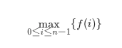

因此我们只需要求出每个位置的 `f(i)`，然后返回 `f` 数组中的最大值即可。那么我们如何求 `f(i)` 呢？我们可以考虑 `nums[i]` 单独成为一段还是加入 `f(i-1)` 对应的那一段，这取决于 `nums[i]` 和 `f(i-1) + nums[i]` 的大小，我们希望获得一个比较大的，于是可以写出这样的动态规划转移方程：

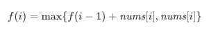

不难给出一个时间复杂度 `O(n)`、空间复杂度 `O(n)` 的实现，即用一个 `f` 数组来保存 `f(i)` 的值，用一个循环求出所有 `f(i)`。考虑到 `f(i)` 只和 `f(i-1)` 相关，于是我们可以只用一个变量 `pre` 来维护对于当前 `f(i)` 的 `f(i-1)` 的值是多少，从而让空间复杂度降低到 `O(1)`，这有点类似「滚动数组」的思想。

**代码**

```javascript
1var maxSubArray = function(nums) {
    let pre = 0, maxAns = nums[0];
    nums.forEach((x) => {
        pre = Math.max(pre + x, x);
        maxAns = Math.max(maxAns, pre);
    });
    return maxAns;
};
```

**复杂度**

* 时间复杂度：`O(n)`，其中 `n` 为 `nums` 数组的长度。我们只需要遍历一遍数组即可求得答案。

* 空间复杂度：`O(1)`。我们只需要常数空间存放若干变量。

方法二：分治

**思路和算法**

**这个分治方法类似于「线段树求解最长公共上升子序列问题」的 `pushUp` 操作。**

我们定义一个操作 `get(a, l, r)` 表示查询 `a` 序列 `[l,r]` 区间内的最大子段和，那么最终我们要求的答案就是 `get(nums, 0, nums.size() - 1)`。如何分治实现这个操作呢？对于一个区间 `[l,r]`，我们取 `m = (l + r)/2`，对区间 `[l,m]` 和 `[m+1,r]` 分治求解。当递归逐层深入直到区间长度缩小为 `1` 的时候，递归「开始回升」。这个时候我们考虑如何通过 `[l,m]` 区间的信息和 `[m+1,r]` 区间的信息合并成区间 `[l,r]` 的信息。最关键的两个问题是：

* 我们要维护区间的哪些信息呢？

* 我们如何合并这些信息呢？

对于一个区间 `[l,r]`，我们可以维护四个量：

* `lSum` 表示 `[l,r]` 内以 `l` 为左端点的最大子段和

* `rSum` 表示 `[l,r]` 内以 `r` 为右端点的最大子段和

* `mSum` 表示 `[l,r]` 内的最大子段和

* `iSum` 表示 `[l,r]` 的区间和

以下简称 `[l,m]` 为 `[l,r]` 的「左子区间」，`[m+1,r]` 为 `[l,r]` 的「右子区间」。我们考虑如何维护这些量呢（如何通过左右子区间的信息合并得到 `[l,r]` 的信息）？对于长度为 `1` 的区间 `[i, i]`，四个量的值都和 `nums}[i]` 相等。对于长度大于 `1` 的区间：

* 首先最好维护的是 `iSum`，区间 `[l,r]` 的 `iSum` 就等于「左子区间」的 `iSum` 加上「右子区间」的 `iSum`。

* 对于 `[l,r]` 的 `lSum`，存在两种可能，它要么等于「左子区间」的 `lSum`，要么等于「左子区间」的 `iSum` 加上「右子区间」的 `lSum`，二者取大。

* 对于 `[l,r]` 的 `rSum`，同理，它要么等于「右子区间」的 `rSum`，要么等于「右子区间」的 `iSum` 加上「左子区间」的 `rSum`，二者取大。

* 当计算好上面的三个量之后，就很好计算 `[l,r]` 的 `mSum` 了。我们可以考虑 `[l,r]` 的 `mSum` 对应的区间是否跨越 `m`——它可能不跨越 `m`，也就是说 `[l,r]` 的 `mSum` 可能是「左子区间」的 `mSum` 和 「右子区间」的 `mSum` 中的一个；它也可能跨越 `m`，可能是「左子区间」的 `rSum` 和 「右子区间」的 `lSum` 求和。三者取大。

这样问题就得到了解决。

**代码**

```javascript
function Status(l, r, m, i) {
    this.lSum = l;
    this.rSum = r;
    this.mSum = m;
    this.iSum = i;
}

const pushUp = (l, r) => {
    const iSum = l.iSum + r.iSum;
    const lSum = Math.max(l.lSum, l.iSum + r.lSum);
    const rSum = Math.max(r.rSum, r.iSum + l.rSum);
    const mSum = Math.max(Math.max(l.mSum, r.mSum), l.rSum + r.lSum);
    return new Status(lSum, rSum, mSum, iSum);
}

const getInfo = (a, l, r) => {
    if (l === r) {
        return new Status(a[l], a[l], a[l], a[l]);
    }
    const m = (l + r) >> 1;
    const lSub = getInfo(a, l, m);
    const rSub = getInfo(a, m + 1, r);
    return pushUp(lSub, rSub);
}

var maxSubArray = function(nums) {
    return getInfo(nums, 0, nums.length - 1).mSum;
};
```

**复杂度分析**

假设序列 `a` 的长度为 `n`。

* 时间复杂度：假设我们把递归的过程看作是一颗二叉树的先序遍历，那么这颗二叉树的深度的渐进上界为 `O(log n)`，这里的总时间相当于遍历这颗二叉树的所有节点，故总时间的渐进上界是 `O(\sum_{i=1}^{\log n} 2^{i-1})=O(n)`，故渐进时间复杂度为 `O(n)`。

* 空间复杂度：递归会使用 `O(log n)` 的栈空间，故渐进空间复杂度为 `O(log n)`。


题外话

「方法二」相较于「方法一」来说，时间复杂度相同，但是因为使用了递归，并且维护了四个信息的结构体，运行的时间略长，空间复杂度也不如方法一优秀，而且难以理解。那么这种方法存在的意义是什么呢？


对于这道题而言，确实是如此的。但是仔细观察「方法二」，它不仅可以解决区间 `[0, n-1]`，还可以用于解决任意的子区间 `[l,r]` 的问题。如果我们把 `[0, n-1]` 分治下去出现的所有子区间的信息都用堆式存储的方式记忆化下来，即建成一颗真正的树之后，我们就可以在 `O(log n)` 的时间内求到任意区间内的答案，我们甚至可以修改序列中的值，做一些简单的维护，之后仍然可以在 `O(log n)` 的时间内求到任意区间内的答案，对于大规模查询的情况下，这种方法的优势便体现了出来。这棵树就是上文提及的一种神奇的数据结构——线段树。


***

## 55. 说说 https 的握手过程


**参考答案：**

https的详细握手过程

https在七层协议里面属于应用层，他基于tcp协议，所以，https握手的过程，一定先经过tcp的三次握手，tcp链接建立好之后，才进入https的对称密钥协商过程，对称密钥协商好之后，就开始正常的收发数据流程。

接下来拿实际网络数据包来解释https的整个详细的握手过程

打开wireshark抓包工具，并随手打开命令行，输入了如下一行命令

```plaintext
curl https://www.baidu.com
```

上面其实涉及到两个问题：

1. 为什么是wireshark，而不是fiddler 或者 charles

> fiddler 和charles主要是用于抓取应用层协议https/http等上层的应用数据，都是建立链接成功后的数据，而wireshark是可以抓取所有协议的数据包（直接读取网卡数据）,我们的目的是抓取https建立链接成功前的过程，所以我们选择wireshark

1. 为什么是用curl， 而不是在浏览器打开[https://www.baidu.com](https://www.baidu.com/)

> curl是只发送一个请求，如果是用浏览器打开百度，那百度页面里面的各种资源也会发送请求，容易造成很多不必要的数据包

好，重点来了，开始上图：


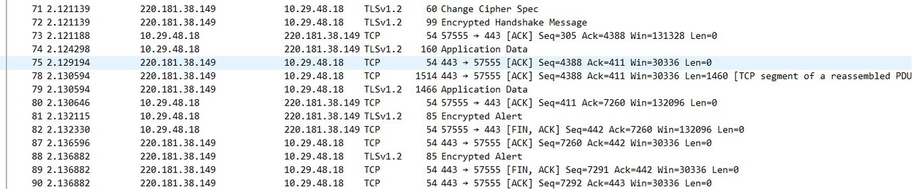

遇到凡事不要慌，接下来待我给你慢慢道来（ack消息属于tcp协议里面的确认报文，不做解释）


第一步


解释说明：tcp三次握手，这个不做解释，如果这块不清楚，比如ack，seq,mss,win都代表什么意思，这个可以在互动区留言，我视情况专门写几篇tcp的文章（这块太大了，没几篇是介绍不完的）


第二步：客户端发送client\_hello


解释说明：客户端发送client\_hello，包含以下内容（请自行对照上图） 1. 包含TLS版本信息 2. 随机数（用于后续的密钥协商）random\_C 3. 加密套件候选列表 4. 压缩算法候选列表 5. 扩展字段 6. 其他


第三步：服务端发送server\_hello


解释说明：服务端收到客户端的client\_hello之后，发送server\_hello，并返回协商的信息结果 1. 选择使用的TLS协议版本 version 2. 选择的加密套件 cipher suite 3. 选择的压缩算法 compression method 4. 随机数 random\_S 5. 其他


第四步：服务端发送证书


解释说明：服务端发送完server\_hello后，紧接着开始发送自己的证书（不清楚证书是什么的，可以移步到[上一篇文章](https://juejin.cn/post/6845166890675863559)），从图可知：因包含证书的报文长度是3761，所以此报文在tcp这块做了分段，分了3个报文把证书发送完了

问自己： 1. 分段的标准是什么？ 2. 什么时候叫分段，什么时候叫分片？ 3. 什么是MTU，什么是MSS


第五步：服务端发送Server Key Exchange


解释说明:对于使用DHE/ECDHE非对称密钥协商算法的SSL握手，将发送该类型握手。RSA算法不会进行该握手流程（DH、ECDH也不会发送server key exchange）,也就是说此报文不一定要发送，视加密算法而定。SSL中的RSA、DHE、ECDHE、ECDH流程与区别可以参考[此篇文章](https://blog.csdn.net/mrpre/article/details/78025940)


第六步：服务端发送Server Hello Done

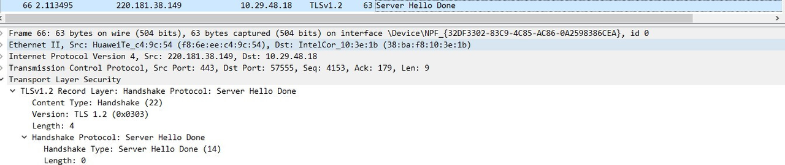

解释说明: 1. client\_key\_exchange，合法性验证通过之后，向服务器发送自己的公钥参数，这里客户端实际上已经计算出了密钥 2. change\_cipher\_spec，客户端通知服务器后续的通信都采用协商的通信密钥和加密算法进行加密通信 3. encrypted\_handshake\_message，主要是用来测试密钥的有效性和一致性


第八步：服务端发送New Session Ticket

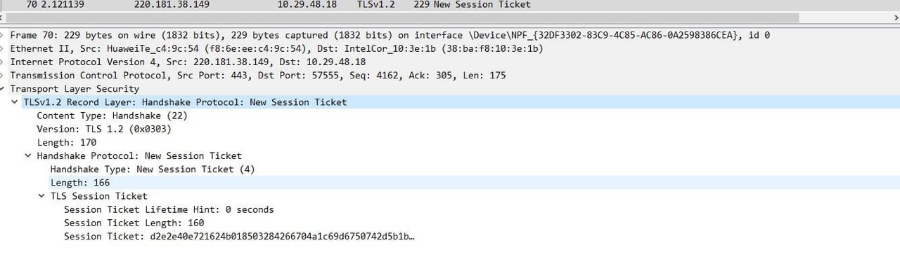

解释说明:服务器给客户端一个会话，用处就是在一段时间之内（超时时间到来之前），双方都以协商的密钥进行通信。

第九步：服务端发送change\_cipher\_spec


解释说明:服务端解密客户端发送的参数，然后按照同样的算法计算出协商密钥，并通过客户端发送的encrypted\_handshake\_message验证有效性，验证通过，发送该报文，告知客户端，以后可以拿协商的密钥来通信了


第十步：服务端发送encrypted\_handshake\_message

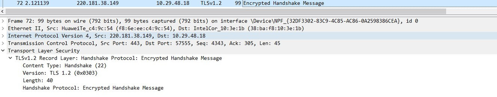

解释说明:目的同样是测试密钥的有效性，客户端发送该报文是为了验证服务端能正常解密，客户端能正常加密，相反：服务端发送该报文是为了验证客户端能正常解密，服务端能正常加密


第十一步：完成密钥协商，开始发送数据

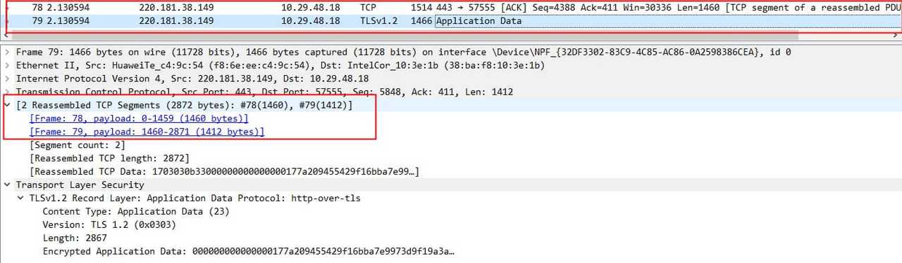

解释说明：数据同样是分段发送的


第十二步：完成数据发送，4次tcp挥手


解释说明：红框的意思是：客户端或服务器发送的，意味着加密通信因为某些原因需要中断，警告对方不要再发送敏感的数据,服务端数据发送完成也会有此数据包，可不关注


结语

最后用一张图来说明以下过程

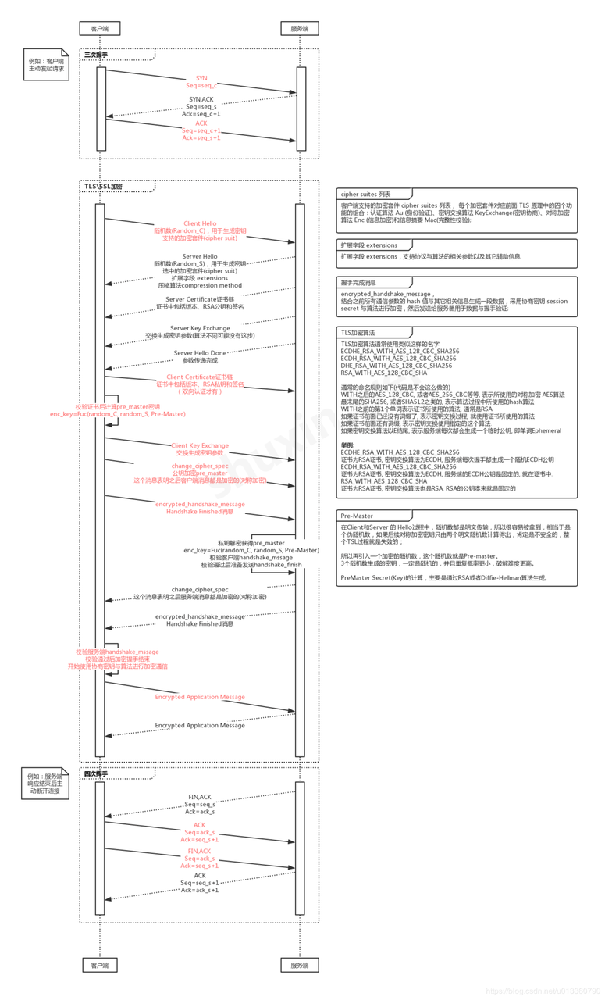


***

## 56. HTTP2中，多路复用的原理是什么？


**参考答案：**

HTTP/2是一个二进制协议，其基于“帧”的结构设计，改进了很多HTTP/1.1痛点问题。


什么是多路复用？


HTTP/1.1协议的请求-响应模型大家都是熟悉的，我们用“HTTP消息”来表示一个请求-响应的过程，那么HTTP/1.1中的消息是“管道串形化”的：只有等一个消息完成之后，才能进行下一条消息；而HTTP/2中多个消息交织在了一起，这无疑提高了“通信”的效率。这就是多路复用：在一个HTTP的连接上，多路“HTTP消息”同时工作。


为什么 `HTTP/1.1` 不能实现“多路复用”？

简单回答就是：`HTTP/2` 是基于二进制“帧”的协议，HTTP/1.1是基于“文本分割”解析的协议。

`HTTP/1.1` 发送请求消息的文本格式：以换行符分割每一条 `key:value` 的内容，解析这种数据用不着什么高科技，相反的，解析这种数据往往速度慢且容易出错。“服务端”需要不断的读入字节，直到遇到分隔符（这里指换行符，代码中可能使用/n或者/r/n表示），这种解析方式是可行的，并且 `HTTP/1.1` 已经被广泛使用了二十多年，这事已经做过无数次了，问题一直都是存在的：

* 一次只能处理一个请求或响应，因为这种以分隔符分割消息的数据，在完成之前不能停止解析。

* 解析这种数据无法预知需要多少内存，这会带给“服务端”很大的压力，因为它不知道要把一行要解析的内容读到多大的“缓冲区”中，在保证解析效率和速度的前提下：内存该如何分配？


HTTP/2帧结构设计和多路复用实现

前边提到：HTTP/2设计是基于“二进制帧”进行设计的，这种设计无疑是一种“高超的艺术”，因为它实现了一个目的：一切可预知，一切可控。

帧是一个数据单元，实现了对消息的封装。下面是HTTP/2的帧结构：


帧的字节中保存了不同的信息，前9个字节对于每个帧都是一致的，“服务器”解析HTTP/2的数据帧时只需要解析这些字节，就能准确的知道整个帧期望多少字节数来进行处理信息。

如果使用HTTP/1.1的话，你需要发送完上一个请求，才能发送下一个；由于HTTP/2是分帧的，请求和响应可以交错甚至可以复用。 为了能够发送不同的“数据信息”，通过帧数据传递不同的内容，HTTP/2中定义了10种不同类型的帧。

有了以上对HTTP/2帧的了解，我们就可以解释多路复用是怎样实现的了，不过在这之前我们先来了解“流”的概念：HTTP/2连接上独立的、双向的帧序列交换。流ID（帧首部的6-9字节）用来标识帧所属的流

下面两张图分别表示了HTTP/2协议上POST请求数据流“复用”的过程，很容易看的明白：


***

## 57. 说说你对“三次握手”、“四次挥手”的理解


**参考答案：**

我们都知道TCP是面向连接的，`三次握手`就是用来建立连接的，`四次握手`就是用来断开连接的。


三次握手

先上图：

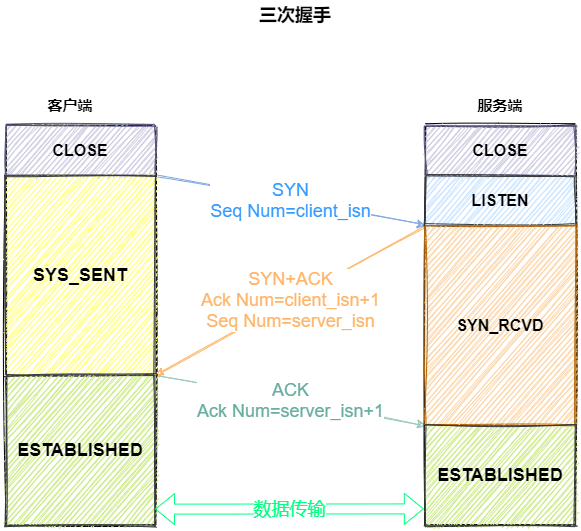

我们来看一下三次握手的过程：

* 一开始，客户端和服务端都处于 `CLOSED` 状态。客户端主动打开连接，服务端被动打卡连接，结束`CLOSED` z状态，开始监听，进入 `LISTEN `状态。

**一次握手**

* 客户端会随机初始化序号（`client_isn`），将此序号置于 TCP 首部的「序号」字段中，同时把 `SYN` 标志位置为 `1` ，表示 `SYN` 报文。接着把第一个 SYN 报文发送给服务端，表示向服务端发起连接，该报文不包含应用层数据，之后客户端处于 `SYN-SENT` 状态。

**二次握手**

* 服务端收到客户端的 `SYN` 报文后，首先服务端也随机初始化自己的序号（`server_isn`），将此序号填入 TCP 首部的「序号」字段中，其次把 TCP 首部的「确认应答号」字段填入 `client_isn + 1`, 接着把 `SYN` 和 `ACK` 标志位置为 `1`。最后把该报文发给客户端，该报文也不包含应用层数据，之后服务端处于 `SYN-RCVD` 状态。

**三次握手**

* 客户端收到服务端报文后，还要向服务端回应最后一个应答报文，首先该应答报文 TCP 首部 `ACK` 标志位置为 `1` ，其次「确认应答号」字段填入 `server_isn + 1` ，最后把报文发送给服务端，这次报文可以携带客户到服务器的数据，之后客户端处于 `ESTABLISHED` 状态。

好了，经过三次握手的过程，客户端和服务端之间的确定连接正常，接下来进入`ESTABLISHED`状态，服务端和客户端就可以快乐地通信了。

这里有个小细节，第三次握手是可以携带数据的，这是面试常问的点。

> 那么为什么要三次握手呢？两次不行吗？

* 为了防止服务器端开启一些无用的连接增加服务器开销

* 防止已失效的连接请求报文段突然又传送到了服务端，因而产生错误。

由于网络传输是有延时的(要通过网络光纤和各种中间代理服务器)，在传输的过程中，比如客户端发起了 SYN=1 的第一次握手。

如果服务器端就直接创建了这个连接并返回包含 SYN、ACK 和 Seq 等内容的数据包给客户端，这个数据包因为网络传输的原因丢失了，丢失之后客户端就一直没有接收到服务器返回的数据包。

如果没有第三次握手告诉服务器端客户端收的到服务器端传输的数据的话，服务器端是不知道客户端有没有接收到服务器端返回的信息的。服务端就认为这个连接是可用的，端口就一直开着，等到客户端因超时重新发出请求时，服务器就会重新开启一个端口连接。

这样一来，就会有很多无效的连接端口白白地开着，导致资源的浪费。

这个过程可理解为：

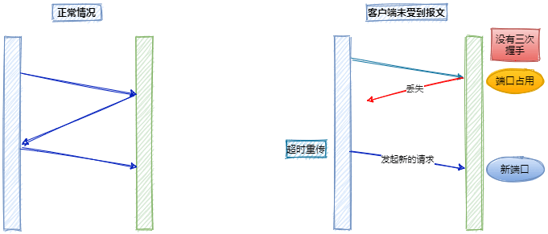

还有一种情况是已经失效的客户端发出的请求信息，由于某种原因传输到了服务器端，服务器端以为是客户端发出的有效请求，接收后产生错误。


所以我们需要“第三次握手”来确认这个过程：

通过第三次握手的数据告诉服务端，客户端有没有收到服务器“第二次握手”时传过去的数据，以及这个连接的序号是不是有效的。若发送的这个数据是“`收到且没有问题`”的信息，接收后服务器就正常建立 TCP 连接，否则建立 TCP 连接失败，服务器关闭连接端口。由此减少服务器开销和接收到失效请求发生的错误。


四次挥手

还是先上图：


聚散终有时，TCP 断开连接是通过四次挥手方式。

`双方`都可以主动断开连接，断开连接后主机中的「资源」将被释放。

上图是客户端主动关闭连接 ：

**一次挥手**

* 客户端打算关闭连接，此时会发送一个 TCP 首部 `FIN` 标志位被置为 `1` 的报文，也即 `FIN` 报文，之后客户端进入 `FIN_WAIT_1` 状态。

**二次挥手**

* 服务端收到该报文后，就向客户端发送 `ACK` 应答报文，接着服务端进入 `CLOSED_WAIT` 状态。

**三次挥手**

* 客户端收到服务端的 `ACK` 应答报文后，之后进入 `FIN_WAIT_2` 状态。等待服务端处理完数据后，也向客户端发送 `FIN` 报文，之后服务端进入 `LAST_ACK` 状态。

**四次挥手**

* 客户端收到服务端的 `FIN` 报文后，回一个 `ACK` 应答报文，之后进入 `TIME_WAIT` 状态

* 服务器收到了 `ACK` 应答报文后，就进入了 `CLOSED` 状态，至此服务端已经完成连接的关闭。

* 客户端在经过 `2MSL` 一段时间后，自动进入 `CLOSED` 状态，至此客户端也完成连接的关闭。

你可以看到，每个方向都需要一个 FIN 和一个 ACK，因此通常被称为四次挥手。

> 为什么要挥手四次？

再来回顾下四次挥手双方发 `FIN` 包的过程，就能理解为什么需要四次了。

* 关闭连接时，客户端向服务端发送 `FIN` 时，仅仅表示客户端不再发送数据了但是还能接收数据。

* 服务器收到客户端的 `FIN` 报文时，先回一个 `ACK` 应答报文，而服务端可能还有数据需要处理和发送，等服务端不再发送数据时，才发送 `FIN` 报文给客户端来表示同意现在关闭连接。

从上面过程可知，服务端通常需要等待完成数据的发送和处理，所以服务端的 `ACK` 和 `FIN` 一般都会分开发送，从而比三次握手导致多了一次。

> 为什么客户端在TIME-WAIT阶段要等2MSL？

为的是确认服务器端是否收到客户端发出的 ACK 确认报文，当客户端发出最后的 ACK 确认报文时，并不能确定服务器端能够收到该段报文。

所以客户端在发送完 ACK 确认报文之后，会设置一个时长为 2MSL 的计时器。

MSL 指的是 Maximum Segment Lifetime：一段 TCP 报文在传输过程中的最大生命周期。

2MSL 即是服务器端发出为 FIN 报文和客户端发出的 ACK 确认报文所能保持有效的最大时长。

服务器端在 1MSL 内没有收到客户端发出的 ACK 确认报文，就会再次向客户端发出 FIN 报文：

* 如果客户端在 2MSL 内，再次收到了来自服务器端的 FIN 报文，说明服务器端由于各种原因没有接收到客户端发出的 ACK 确认报文。

客户端再次向服务器端发出 ACK 确认报文，计时器重置，重新开始 2MSL 的计时。

* 否则客户端在 2MSL 内没有再次收到来自服务器端的 FIN 报文，说明服务器端正常接收了 ACK 确认报文，客户端可以进入 CLOSED 阶段，完成“四次挥手”。

所以，客户端要经历时长为 2SML 的 TIME-WAIT 阶段;这也是为什么客户端比服务器端晚进入 CLOSED 阶段的原因。


***

## 58. 如何确保你的构造函数只能被new调用，而不能被普通调用？


**参考答案：**


明确函数的双重用途

`JavaScript` 中的函数一般有两种使用方式:

* 当作构造函数使用: `new Func()`

* 当作普通函数使用: `Func()`

但 `JavaScript` 内部并没有区分两者的方式，我们人为规定构造函数名首字母要大写作为区分。也就是说，构造函数被当成普通函数调用不会有报错提示。

下面来举个栗子:

```javascript
// 定义构造函数 Person
function Person(firstName, lastName) {
    this.firstName = firstName;
    this.lastName = lastName;
    this.fullName = this.firstName + this.lastName;
}
// 使用 new 调用
console.log(new Person("战场", "小包"));
// 当作普通函数调用
console.log(Person("战场", "小包"))
```

输出结果:

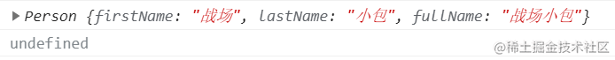

通过输出结果可以发现，定义的构造函数被当作普通函数来调用，没有任何错误提示。


使用 instanceof 实现


instanceof 基础知识

`instanceof` 运算符用于检测构造函数的 `prototype` 属性是否出现在某个实例对象的原型链上。

使用语法:

```javascript
object instanceof constructor
```

我们可以使用 `instanceof` 检测某个对象是不是另一个对象的实例，例如 `new Person() instanceof Person --> true`


new 绑定/ 默认绑定

* 通过 `new` 来调用构造函数，会生成一个新对象，并且把这个新对象绑定为调用函数的 `this` 。

* 如果普通调用函数，非严格模式 `this` 指向 `window`，严格模式指向 `undefined`

```javascript
function Test() {
    console.log(this)
}
// Window {...}
console.log(Test())
// Test {}
console.log(new Test())
```

使用 `new` 调用函数和普通调用函数最大的区别在于函数内部 `this` 指向不同: `new` 调用后 `this` 指向实例，普通调用则会指向 `window`。

`instanceof` 可以检测某个对象是不是另一个对象的实例。如果为 `new` 调用， `this` 指向实例，this instanceof 构造函数 返回值为 `true` ，普通调用返回值为 `false`。


代码实现

```javascript
function Person(firstName, lastName) {
    // this instanceof Person
    // 如果返回值为 false，说明为普通调用
    // 返回类型错误信息——当前构造函数需要使用 new 调用
    if (!(this instanceof Person)) {
        throw new TypeError('Function constructor A cannot be invoked without "new"')
    }
    this.firstName = firstName;
    this.lastName = lastName;
    this.fullName = this.firstName + this.lastName;
}
// 当作普通函数调用
// Uncaught TypeError: Function constructor A cannot be invoked without "new"
console.log(Person("战场", "小包"));
```

通过输出结果，我们可以发现，定义的 `Person` 构造函数已经无法被普通调用了。撒花\~\~\~

但这种方案并不是完美的，存在一点小小的瑕疵。我们可以通过伪造实例的方法骗过构造函数里的判断。

具体实现: `JavaScript` 提供的 `apply/call` 方法可以修改 `this` 指向，如果调用时将 `this` 指向修改为 `Person` 实例，就可以成功骗过上面的语法。

```javascript
// 输出结果 undefined
console.log(Person.call(new Person(), "战场", "小包"));
```

这点瑕疵虽说无伤大雅，但经过小包的学习，`ES6` 中提供了更好的方案。


new.target

`JavaScript` 官方也发现了这个让人棘手的问题，因此 `ES6` 中提供了 `new.target` 属性。

《ECMAScript 6 入门》中讲到: `ES6` 为 `new` 命令引入了一个 `new.target` 属性，该属性一般用在构造函数之中，返回 `new` 命令作用于的那个构造函数。如果构造函数不是通过 `new` 命令或 `Reflect.construct()` 调用的，`new.target` 会返回 `undefined` ，因此这个属性可以用来确定构造函数是怎么调用的。

`new.target` 就是为确定构造函数的调用方式而生的，太符合这个场景了，我们来试一下 `new.target` 的用法。

```javascript
function Person() {
    console.log(new.target);
}
// new: Person {}
console.log("new: ",new Person())
// not new: undefined
console.log("not new:", Person())
```

所以我们就可以使用 `new.target` 来非常简单的实现对构造函数的限制。

```javascript
function Person() {
    if (!(new.target)) {
        throw new TypeError('Function constructor A cannot be invoked without "new"')
    }
}
// Uncaught TypeError: Function constructor A cannot be invoked without "new"
console.log("not new:", Person())
```


使用ES6 Class

类也具备限制构造函数只能用 `new` 调用的作用。

`ES6` 提供 `Class` 作为构造函数的语法糖，来实现语义化更好的面向对象编程，并且对 `Class` 进行了规定：类的构造器必须使用 new 来调用。

因此后续在进行面向对象编程时，强烈推荐使用 `ES6` 的 `Class`。 `Class` 修复了很多 `ES5` 面向对象编程的缺陷，例如类中的所有方法都是不可枚举的；类的所有方法都无法被当作构造函数使用等。

```javascript
class Person {
    constructor (name) {
        this.name = name;
    }
}
// Uncaught TypeError: Class constructor Person cannot be invoked without 'new'
console.log(Person())
```

学到这里我就不由得好奇了，既然 `Class` 必须使用 `new` 来调用，那提供 `new.target` 属性的意义在哪里？


new.target 实现抽象类

首先来看一下 `new.target` 在类中使用会返回什么？

```javascript
class Person {
    constructor (name) {
        this.name = name;
        console.log(new.target)
    }
}
new Person()
```

输出结果:

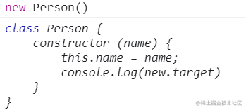

`Class` 内部调用 `new.target`，会返回当前 `Class`。

《ECMAScript 6 入门》中又讲到: 需要注意的是，子类继承父类时，`new.target`会返回子类。继承中的 `new.target` 好像有不一样的花样，我们来试一下。

```javascript
class Animal {
    constructor (type, name, age) {
        this.type = type;
        this.name = name;
        this.age = age;
        console.log(new.target)
    }
}
// extends 是 Class 中实现继承的关键字
class Dog extends Animal {
    constructor(name, age) {
        super("dog", "baobao", "1")
    }
}
const dog = new Dog()
```

输出结果:

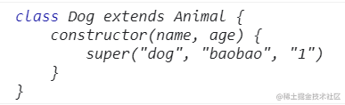

通过上面案例，我们可以发现子类调用和父类调用的返回结果是不同的，我们利用这个特性，就可以实现父类不可调用而子类可以调用的情况——面向对象中的抽象类


抽象类实现

什么是抽象类那？我们以动物世界为例。

我们定义了一个动物类 `Animal`，并且通过这个类来创建动物，动物是个抽象概念，当你提到动物类时，你并不知道我会创建什么动物。只有将动物实体化，比如说猫，狗，猪啊，这才是具体的动物，并且每个动物的行为都会有所不同。因此我们不应该通过创建 `Animal` 实例来生成动物，`Animal` 只是动物抽象概念的集合。

`Animal` 就是一个抽象类，我们不应该通过它来生成动物，而是通过它的子类，例如 `Dog、Cat` 等来生成对应的 `dog/cat` 实例。

`new.target` 子类调用和父类调用的返回值是不同的，所以我们可以借助 `new.target` 实现抽象类

> 抽象类也可以理解为不能独立使用、必须继承后才能使用的类。

```javascript
class Animal {
    constructor (type, name, age) {
        if (new.target === Animal) {
            throw new TypeError("abstract class cannot new")
        }
        this.type = type;
        this.name = name;
        this.age = age;
    }
}
// extends 是 Class 中实现继承的关键字
class Dog extends Animal {
    constructor(name, age) {
        super("dog", "baobao", "1")
    }
}
// Uncaught TypeError: abstract class cannot new
const dog = new Animal("dog", "baobao", 18)
```


总结

本文介绍了三种限制构造函数只能被 `new` 调用的方案

* 借助 `instanceof` 和 `new` 绑定的原理，适用于低版本浏览器

* 借助 `new.target` 属性，可与 `class` 配合定义抽象类

* 面向对象编程使用 `ES6 class`——最佳方案


***

## 59. 为什么推荐将静态资源放到cdn上？


**参考答案：**


静态资源是什么

静态资源

静态资源是指在不同请求中访问到的数据都相同的静态文件。例如：图片、视频、网站中的文件（html、css、js）、软件安装包、apk文件、压缩包文件等。


动态资源

动态资源是指在不同请求中访问到的数据不相同的动态内容。例如：网站中的文件（asp、jsp、php、perl、cgi）、API接口、数据库交互请求等。


CDN是什么

内容分发网络，Content Delivery Network或Content Ddistribute Network，简称CDN，是建立并覆盖在承载网之上，由分布在不同区域的边缘节点服务器群组成的分布式网络。

CDN加速的本质是缓存加速。将服务器上存储的静态内容缓存在CDN节点上，当访问这些静态内容时，无需访问服务器源站，就近访问CDN节点即可获取相同内容，从而达到加速的效果，同时减轻服务器源站的压力。

CDN应用广泛，解决因分布、带宽、服务器性能带来的访问延迟问题，适用于站点加速、点播、直播等场景。使用户可就近取得所需内容，解决 Internet网络拥挤的状况，提高用户访问网站的响应速度和成功率。

由于访问动态内容时，每次都需要访问服务器，由服务器动态生成实时的数据并返回。因此CDN的缓存加速不适用于加速动态内容，CDN无法缓存实时变化的动态内容。对于动态内容请求，CDN节点只能转发回服务器源站，没有加速效果。


CDN的作用

1. 加速网站的访问

2. 为了实现跨运营商、跨地域的全网覆盖

互联不互通、区域ISP地域局限、出口带宽受限制等种种因素都造成了网站的区域性无法访问。CDN加速可以覆盖全球的线路，通过和运营商合作，部署IDC资源，在全国骨干节点商，合理部署CDN边缘分发存储节点，充分利用带宽资源，平衡源站流量。

* 为了保障你的网站安全

CDN的负载均衡和分布式存储技术，可以加强网站的可靠性，相当无无形中给你的网站添加了一把保护伞，应对绝大部分的互联网攻击事件。防攻击系统也能避免网站遭到恶意攻击。

* 为了异地备援

当某个服务器发生意外故障时，系统将会调用其他临近的健康服务器节点进行服务，进而提供接近100%的可靠性，这就让你的网站可以做到永不宕机。

* 为了节约成本投入

使用CDN加速可以实现网站的全国铺设，你根据不用考虑购买服务器与后续的托管运维，服务器之间镜像同步，也不用为了管理维护技术人员而烦恼，节省了人力、精力和财力。

* 为了让你更专注业务本身

CDN加速厂商一般都会提供一站式服务，业务不仅限于CDN，还有配套的云存储、大数据服务、视频云服务等，而且一般会提供7x24运维监控支持，保证网络随时畅通，你可以放心使用。并且将更多的精力投入到发展自身的核心业务之上。


CDN工作原理

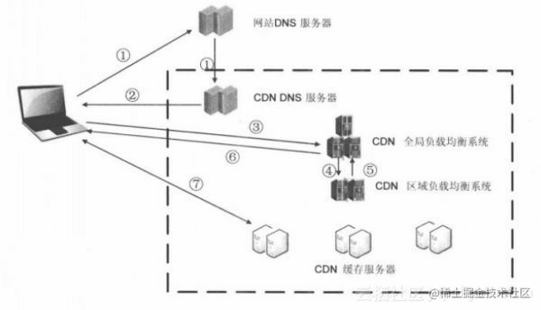

* 当用户点击网站页面上的内容URL，经过本地DNS系统解析，DNS系统会最终将域名的解析权交给CNAME指向的CDN专用DNS服务器。

* CDN的DNS服务器将CDN的全局负载均衡设备IP地址返回用户。

* 用户向CDN的全局负载均衡设备发起内容URL访问请求。

* CDN全局负载均衡设备根据用户IP地址，以及用户请求的内容URL，选择一台用户所属区域的区域负载均衡设备，告诉用户向这台设备发起请求。

* 区域负载均衡设备会为用户选择一台合适的缓存服务器提供服务，选择的依据包括：根据用户IP地址，判断哪一台服务器距用户最近；根据用户所请求的URL中携带的内容名称，判断哪一台服务器上有用户所需内容；查询各个服务器当前的负载情况，判断哪一台服务器尚有服务能力。基于以上这些条件的综合分析之后，区域负载均衡设备会向全局负载均衡设备返回一台缓存服务器的IP地址。

* 全局负载均衡设备把服务器的IP地址返回给用户。

* 用户向缓存服务器发起请求，缓存服务器响应用户请求，将用户所需内容传送到用户终端。如果这台缓存服务器上并没有用户想要的内容，而区域均衡设备依然将它分配给了用户，那么这台服务器就要向它的上一级缓存服务器请求内容，直至追溯到网站的源服务器将内容拉到本地。

DNS服务器根据用户IP地址，将域名解析成相应节点的缓存服务器IP地址，实现用户就近访问。使用CDN服务的网站，只需将其域名解析权交给CDN的GSLB设备，将需要分发的内容注入CDN，就可以实现内容加速了。


当没有CDN时

今天我们看到的网站系统基本上都是基于B/S架构的。B/S架构，即Browser-Server（浏览器 服务器）架构。

用户通过浏览器等方式访问网站的过程：

* 用户在自己的浏览器中输入要访问的网站域名。

* 浏览器向本地DNS服务器请求对该域名的解析。

* 本地DNS服务器中如果缓存有这个域名的解析结果，则直接响应用户的解析请求。

* 本地DNS服务器中如果没有关于这个域名的解析结果的缓存，则以递归方式向整个DNS系统请求解析，获得应答后将结果反馈给浏览器。

* 浏览器得到域名解析结果，就是该域名相应的服务设备的IP地址。

* 浏览器向服务器请求内容。

* 服务器将用户请求内容传送给浏览器。


***

## 60. 说说React事件和原生事件的执行顺序


**参考答案：**

我们知道，`React`在内部对事件做了统一的处理，合成事件是一个比较大的概念


为什么要有合成事件

1. 在传统的事件里，不同的浏览器需要兼容不同的写法，在合成事件中`React`提供统一的事件对象，抹平了浏览器的兼容性差异

2. `React`通过顶层监听的形式，通过事件委托的方式来统一管理所有的事件，可以在事件上区分事件优先级，优化用户体验

`React`在合成事件上对于`16`版本和`17`版本的合成事件有很大不同，我们也会简单聊聊区别。


概念


事件委托

事件委托的意思就是可以通过给父元素绑定事件委托，通过事件对象的`target`属性可以获取到当前触发目标阶段的`dom`元素，来进行统一管理

比如写原生`dom`循环渲染的时候，我们要给每一个子元素都添加`dom`事件，这种情况最简单的方式就是通过事件委托在父元素做一次委托，通过`target`属性判断区分做不同的操作


事件监听

事件监听主要用到了`addEventListener`这个函数，具体怎么用可以[点击](https://developer.mozilla.org/zh-CN/docs/Web/API/EventTarget/addEventListener)进行查看 事件监听和事件绑定的最大区别就是事件监听可以给一个事件监听多个函数操作，而事件绑定只有一次

```javascript
// 可以监听多个，不会被覆盖
eventTarget.addEventListener('click', () => {});
eventTarget.addEventListener('click', () => {});

eventTarget.onclick = function () {};
eventTarget.onclick = function () {}; // 第二个会把第一个覆盖
```

事件执行顺序

```javascript
<div>
  <span>点我</span>
</div>
```

当我们点击`span`标签的时候会经过这么三个过程，在路径内的元素绑定的事件都会进行触发

> 捕获阶段 => 目标阶段 => 冒泡阶段

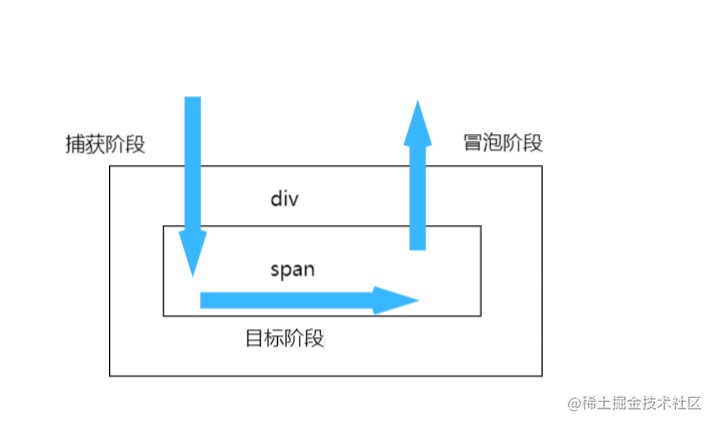

合成事件

在看之前先看一下这几个问题

* 原生事件和合成事件的执行顺序是什么？

* 合成事件在什么阶段下会被执行？

* 阻止原生事件的冒泡，会影响到合成事件的执行吗？

* 阻止合成事件的冒泡，会影响到原生事件的执行吗？

下面一个例子说清楚，[点击在线查看编辑](https://codesandbox.io/s/determined-glitter-oxh8kj?file=/src/App.js)

```javascript
import React, { useRef, useEffect } from "react";
import "./styles.css";

const logFunc = (target, isSynthesizer, isCapture = false) => {
    const info = `${isSynthesizer ? "合成" : "原生"}事件，${
        isCapture ? "捕获" : "冒泡"}阶段，${target}元素执行了`;
    
    console.log(info);
};

const batchManageEvent = (targets, funcs, isRemove = false) => {
    targets.forEach((target, targetIndex) => {
        funcs[targetIndex].forEach((func, funcIndex) => {
            target[isRemove ? "removeEventListener" : "addEventListener"](
                "click",
                func,
                !funcIndex
            );
        });
    });
};

export default function App() {
    const divDom = useRef();
    const h1Dom = useRef();
    useEffect(() => {
    
        const docClickCapFunc = () => logFunc("document", false, true);
        const divClickCapFunc = () => logFunc("div", false, true);
        const h1ClickCapFunc = () => logFunc("h1", false, true);
        const docClickFunc = () => logFunc("document", false);
        const divClickFunc = () => logFunc("div", false);
        const h1ClickFunc = () => logFunc("h1", false);

        batchManageEvent(
            [document, divDom.current, h1Dom.current],
            [
                [docClickCapFunc, docClickFunc],
                [divClickCapFunc, divClickFunc],
                [h1ClickCapFunc, h1ClickFunc]
            ]
        );

        return () => {
            batchManageEvent(
                   [document, divDom.current, h1Dom.current],
                [
                    [docClickCapFunc, docClickFunc],
                    [divClickCapFunc, divClickFunc],
                    [h1ClickCapFunc, h1ClickFunc]
                ],
                true
            );
        };
    }, []);

    return (
        <div
          ref={divDom}
          className="App1"
          onClickCapture={() => logFunc("div", true, true)}
          onClick={() => logFunc("div", true)}
        >
          <h1
            ref={h1Dom}
            onClickCapture={() => logFunc("h1", true, true)}
            onClick={() => logFunc("h1", true)}
          >
            Hello CodeSandbox
          </h1>
        </div>
    );
}
```

看这个例子，当我们点击`h1`的时候

会先执行原生事件事件流，当执行到`document`的冒泡阶段的时候做了个拦截，在这个阶段开始执行合成事件

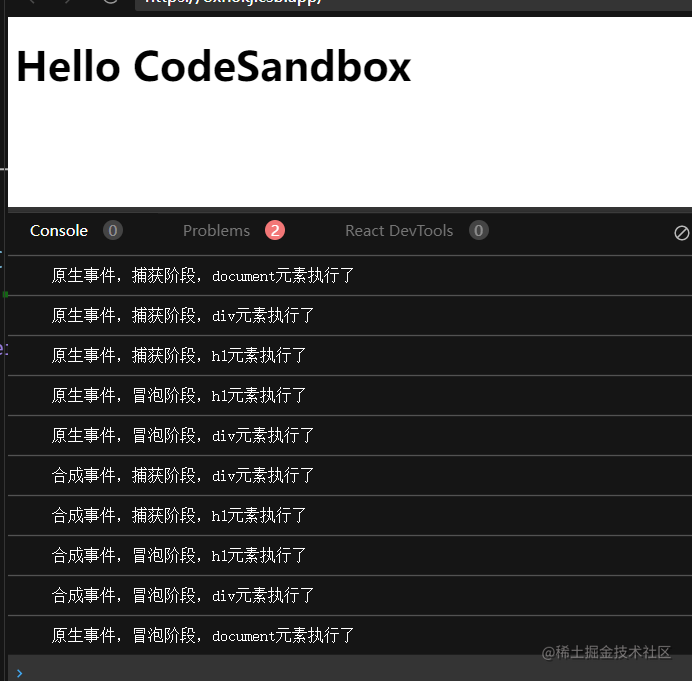

我们用一个图简单描述一下

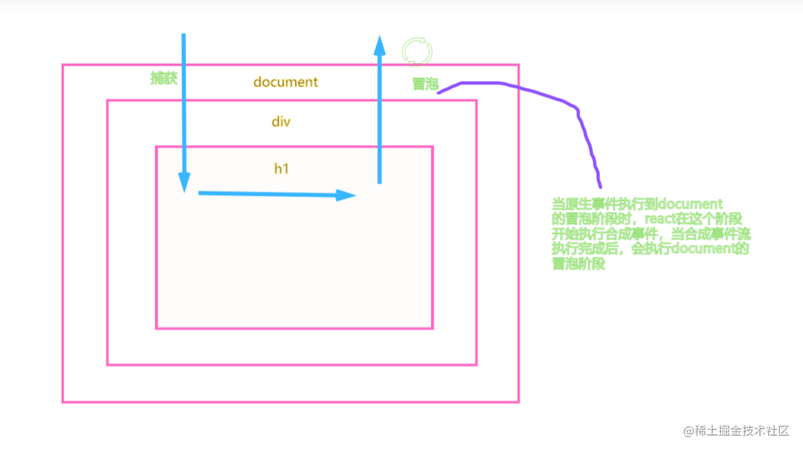

知道上面的概念，那我们回答开始阶段的后面两个问题

当我们把上面的`demo`的原生`div`的`stopPropagation()`  方法调用阻止捕获和冒泡阶段中当前事件的进一步传播，会阻止后续的所有事件执行

```javascript
// ...
const divClickCapFunc = (e) => {
    e.stopPropagation(); // 增加原生捕获阶段的阻止事件
    logFunc("div", false, true);
};
// ...
```

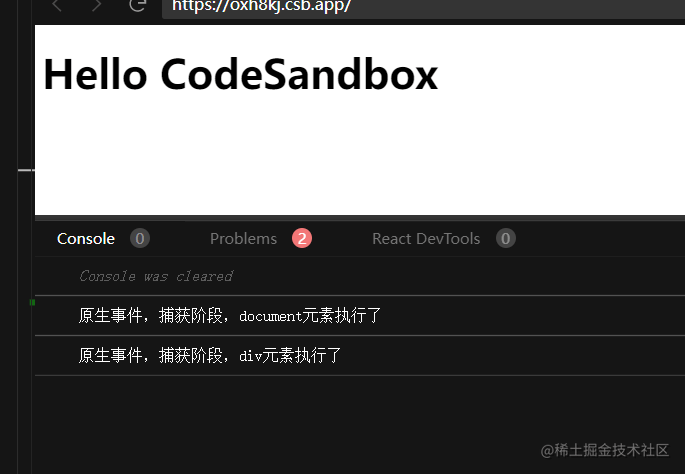

我们可以看到，当阻止之后，我们点击`h1`，事件流运行到`div`的捕获阶段就不触发了，后续的所有的包括合成事件也都不会触发

那当我们给合成事件的事件流中断了会发生什么呢？

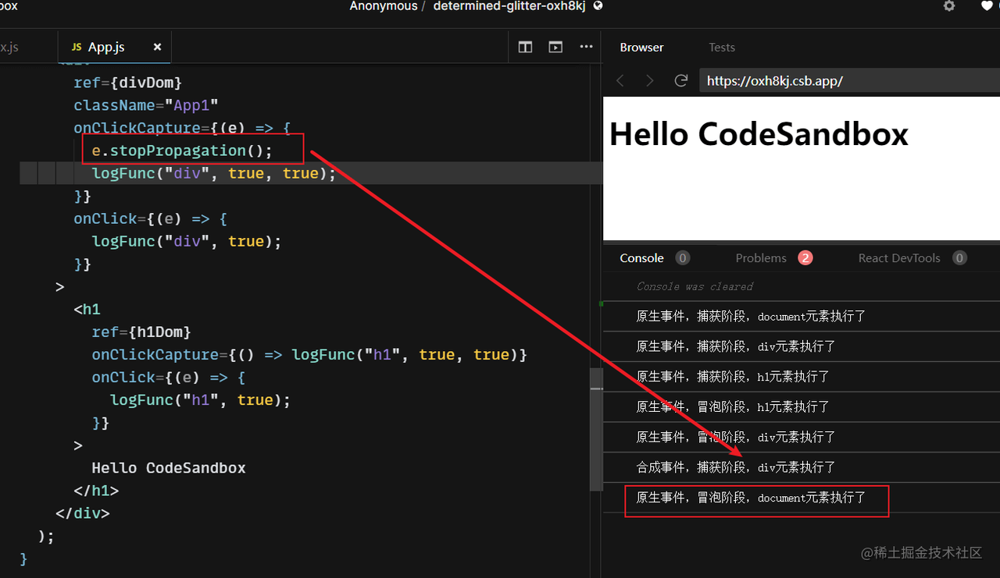

可以看到运行到捕获阶段的`div`之后被阻止传播了，后续的所有合成事件都不会执行了，但是原生的`document`冒泡还是会执行完。


模拟阶段

```javascript
<!DOCTYPE html>
<html lang="en">
  <head>
    <meta charset="utf-8" />
    <meta name="viewport" content="width=device-width, initial-scale=1.0, maximum-scale=1.0, maximum-scale=1, user-scalable=no" />
    <meta name="theme-color" content="#000000" />
    <meta name="description" content="Web site created using create-react-app" />
    <link href="favicon.ico" type="image/x-icon" rel="icon" />
    <title>浅谈React合成事件</title>
  </head>
  <body>
    <div id="wrapper">
      <h1 id="content">hello</h1>
    </div>
  </body>
  <script>
    const logFunc = (target, isSynthesizer, isCapture = false) => {
      const info = `${isSynthesizer ? '合成' : '原生'}事件，${isCapture ? '捕获' : '冒泡'}阶段，${target}元素执行了`;
      console.log(info);
    };
    // document的派发事件函数
    const dispatchEvent = currentDom => {
      let current = currentDom;
      let eventCallbacks = []; // 存储冒泡事件回调函数
      let eventCaptureCallbacks = []; // 存储冒泡事件回调函数
      // 收集事件流一路上的所有回调函数
      while (current) {
        if (current.onClick) {
          eventCallbacks.push(current.onClick);
        }
        if (current.onClickCapture) {
          // 捕获阶段由外到内，所以需要把回调函数放到数组的最前面
          eventCaptureCallbacks.unshift(current.onClickCapture);
        }
        current = current.parentNode;
      }
      // 执行调用
      eventCaptureCallbacks.forEach(callback => callback());
      eventCallbacks.forEach(callback => callback());
    };
    const wrapperDom = document.getElementById('wrapper');
    const contentDom = document.getElementById('content');

    // 一路上注册原生事件
    document.addEventListener('click', () => logFunc('document', false, true), true);
    wrapperDom.addEventListener('click', () => logFunc('div', false, true), true);
    contentDom.addEventListener('click', () => logFunc('h1', false, true), true);
    contentDom.addEventListener('click', () => logFunc('h1', false));
    wrapperDom.addEventListener('click', () => logFunc('div', false));
    document.addEventListener('click', e => {
      dispatchEvent(e.target); // 这里收集一路上的事件进行派发
      logFunc('document', false);
    });

    // 模拟合成事件
    wrapperDom.onClick = () => logFunc('div', true);
    wrapperDom.onClickCapture = () => logFunc('div', true, true);
    contentDom.onClick = () => logFunc('h1', true);
    contentDom.onClickCapture = () => logFunc('h1', true, true);
  </script>
</html>
```

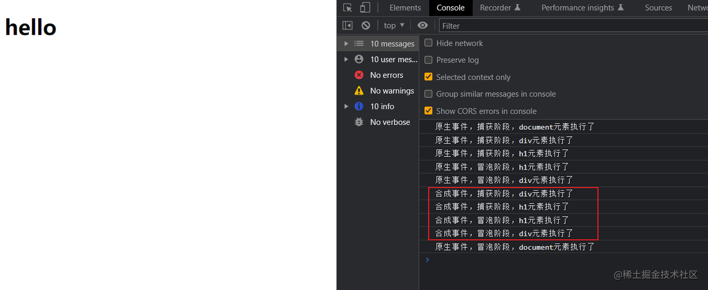

`React16`给`document`上加的统一的拦截判发事件会在一定情况下出问题，下面举个例子简单说明一下


16案例

[点我](https://codesandbox.io/s/practical-lichterman-1lhvb1?file=/src/App.js:0-924)查看在线案例

```javascript
import React, { useEffect, useState } from 'react';
import './styles.css';

const Modal = ({ onClose }) => {
  useEffect(() => {
    document.addEventListener('click', onClose);
    return () => {
      document.removeEventListener('click', onClose);
    };
  }, [onClose]);
  return (
    <div
      style={{ width: 300, height: 300, backgroundColor: 'red' }}
      onClick={e => {
        e.stopPropagation();
        // e.nativeEvent.stopImmediatePropagation();
      }}
    >
      Modal
    </div>
  );
};

function App() {
  const [visible, setVisible] = useState(false);
  return (
    <div className="App">
      <button
        onClick={() => {
          setVisible(true);
        }}
      >
        点我弹出modal
      </button>
      {visible && <Modal onClose={() => setVisible(false)} />}
    </div>
  );
}
export default App;
```

写完之后点击按钮`Modal`被弹出来, 但是点击`modal`里面的内容`modal`就隐藏了，添加阻止事件流函数还是不行

原因就是点击之后，事件冒泡到`document`上，同时也执行了他身上挂载的方法，解决办法就是给点击事件添加 `e.nativeEvent.stopImmediatePropagation();`

`stopImmediatePropagation`和`stopPropagation`的区别就是，前者会阻止当前节点下所有的事件监听的函数，后者不会

那`react17`及之后做了什么改变呢


16和17的区别

在`17`版本中，`React`把事件节点绑定函数绑定在了`render`的根节点上，避免了上述的问题,

用上面的`demo`的在线案例把版本改成17之后，可以发现事件的执行顺序变了

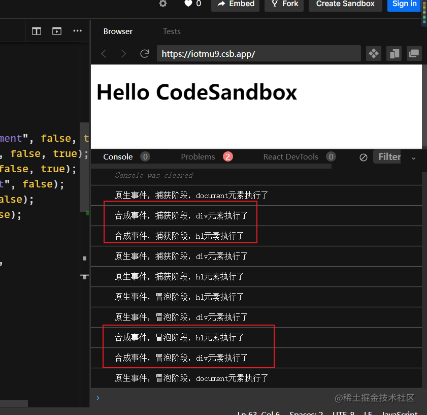


模拟17版本

```javascript
<!DOCTYPE html>
<html lang="en">
  <head>
    <meta charset="utf-8" />
    <meta name="viewport" content="width=device-width, initial-scale=1.0, maximum-scale=1.0, maximum-scale=1, user-scalable=no" />
    <meta name="theme-color" content="#000000" />
    <meta name="description" content="Web site created using create-react-app" />
    <link href="favicon.ico" type="image/x-icon" rel="icon" />
    <title>浅谈React合成事件</title>
  </head>
  <body>
    <div id="root">
      <div id="wrapper">
        <h1 id="content">hello</h1>
      </div>
    </div>
  </body>
  <script>
    const logFunc = (target, isSynthesizer, isCapture = false) => {
      const info = `${isSynthesizer ? '合成' : '原生'}事件，${isCapture ? '捕获' : '冒泡'}阶段，${target}元素执行了`;
      console.log(info);
    };
    // document的派发事件函数
    const dispatchEvent = (currentDom, useCapture = false) => {
      let current = currentDom;
      let eventCallbacks = []; // 存储冒泡事件回调函数
      const eventTypeName = useCapture ? 'onClickCapture' : 'onClick'; // 冒泡事件或者捕获事件的名称
      const actionName = useCapture ? 'unshift' : 'push';
      while (current) {
        if (current[eventTypeName]) {
          eventCallbacks[actionName](current[eventTypeName]);
        }
        current = current.parentNode;
      }
      eventCallbacks.forEach(callback => callback());
    };
    const wrapperDom = document.getElementById('wrapper');
    const contentDom = document.getElementById('content');
    const root = document.getElementById('root');

    // 一路上注册原生事件
    document.addEventListener('click', () => logFunc('document', false, true), true);
    root.addEventListener(
      'click',
      e => {
        dispatchEvent(e.target, true);
        logFunc('root', false, true);
      },
      true
    );
    wrapperDom.addEventListener('click', () => logFunc('div', false, true), true);
    contentDom.addEventListener('click', () => logFunc('h1', false, true), true);
    contentDom.addEventListener('click', () => logFunc('h1', false));
    wrapperDom.addEventListener('click', () => logFunc('div', false));
    root.addEventListener('click', e => {
      dispatchEvent(e.target); // 这里收集一路上的事件进行派发
      logFunc('root', false);
    });
    document.addEventListener('click', () => logFunc('document', false));
    // 模拟合成事件
    wrapperDom.onClick = () => logFunc('div', true);
    wrapperDom.onClickCapture = () => logFunc('div', true, true);
    contentDom.onClick = () => logFunc('h1', true);
    contentDom.onClickCapture = () => logFunc('h1', true, true);
  </script>
</html>
```

区别就是在外层增加了一个`root`模拟根节点，修改了`dispatchEvent`的逻辑

可以看到，效果已经和`17`版本的一样了

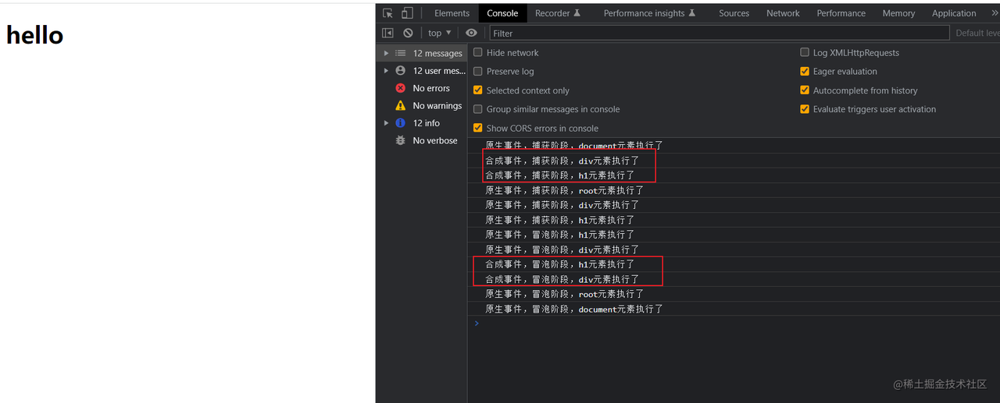

回看`16demo`，切换版本到`17`，当我们切换到`17`的时候，用`stopPropagation`就可以解决问题了, 原因就是他在`root`节点上绑定的事件冒泡函数，`stopPropagation`切断了事件流，不会流向到`document`身上了


总结

* `16`版本先执行原生事件，当冒泡到`document`时，统一执行合成事件，

* `17`版本在原生事件执行前先执行合成事件捕获阶段，原生事件执行完毕执行冒泡阶段的合成事件,通过根节点来管理所有的事件

原生的阻止事件流会阻断合成事件的执行，合成事件阻止后也会影响到后续的原生执行


***

## 61. Vue2.0为什么不能检查数组的变化，该怎么解决？


**参考答案：**


前言

我们都知道，Vue2.0对于响应式数据的实现有一些不足：

* 无法检测数组/对象的新增

* 无法检测通过索引改变数组的操作。


分析

* 无法检测数组/对象的新增？

Vue检测数据的变动是通过Object.defineProperty实现的，所以无法监听数组的添加操作是可以理解的，因为是在构造函数中就已经为所有属性做了这个检测绑定操作。

* 无法检测通过索引改变数组的操作。即vm.items\[indexOfItem] = newValue？

[官方文档](https://cn.vuejs.org/v2/guide/list.html#%E6%B3%A8%E6%84%8F%E4%BA%8B%E9%A1%B9)中对于这两点都是简要的概括为“由于JavaScript的限制”无法实现，而Object.defineProperty是实现检测数据改变的方案，这个限制是指Object.defineProperty


思考


vm.items\[indexOfItem] = newValue真的不能被监听么？

> Vue对数组的7个变异方法（push、pop、shift、unshift、splice、sort、reverse）实现了响应式。这里就不做测试了。我们测试一下通过索引改变数组的操作，能不能被监听到。
>
> 遍历数组，用Object.defineProperty对每一项进行监测

```javascript
function defineReactive(data, key, value) {
         Object.defineProperty(data, key, {
                 enumerable: true,
                 configurable: true,
                 get: function defineGet() {
                         console.log(`get key: ${key} value: ${value}`)
                         return value
                 },
                 set: function defineSet(newVal) {
                         console.log(`set key: ${key} value: ${newVal}`)
                         value = newVal
                 }
         })
}
 
function observe(data) {
        Object.keys(data).forEach(function(key) {
                defineReactive(data, key, data[key])
        })
}
 
let arr = [1, 2, 3]
observe(arr)
```


测试说明

通过索引改变arr\[1]，我们发现触发了set，也就是Object.defineProperty是可以检测到通过索引改变数组的操作的，那Vue2.0为什么没有实现呢？是尤大能力不行？这肯定毋庸置疑。那他为什么不实现呢？


小结：是出于对性能原因的考虑，没有去实现它。而不是不能实现。

对于对象而言，每一次的数据变更都会对对象的属性进行一次枚举，一般对象本身的属性数量有限，所以对于遍历枚举等方式产生的性能损耗可以忽略不计，但是对于数组而言呢？数组包含的元素量是可能达到成千上万，假设对于每一次数组元素的更新都触发了枚举/遍历，其带来的性能损耗将与获得的用户体验不成正比，故vue无法检测数组的变动。

不过Vue3.0用proxy代替了defineProperty之后就解决了这个问题。

***


解决方案


数组

1. this.$set(array, index, data)

```javascript
//这是个深度的修改，某些情况下可能导致你不希望的结果，因此最好还是慎用
this.dataArr = this.originArr
this.$set(this.dataArr, 0, {data: '修改第一个元素'})
console.log(this.dataArr)        
console.log(this.originArr)  //同样的 源数组也会被修改 在某些情况下会导致你不希望的结果 
```

2.splice

```javascript
//因为splice会被监听有响应式，而splice又可以做到增删改。
```

3.利用临时变量进行中转

```javascript
let tempArr = [...this.targetArr]
tempArr[0] = {data: 'test'}
this.targetArr = tempArr
```


对象

1. this.$set(obj, key ,value) - 可实现增、改

2. watch时添加`deep：true`深度监听，只能监听到属性值的变化，新增、删除属性无法监听

```javascript
this.$watch('blog', this.getCatalog, {
    deep: true
    // immediate: true // 是否第一次触发
  });
```

3。watch时直接监听某个key

```javascript
watch: {
  'obj.name'(curVal, oldVal) {
    // TODO
  }
}
```


***

## 62. 说说Vue 页面渲染流程


**参考答案：**

前言

在 `Vue` 核心中除了响应式原理外，视图渲染也是重中之重。我们都知道每次更新数据，都会走视图渲染的逻辑，而这当中牵扯的逻辑也是十分繁琐。

本文主要解析的是初始化视图渲染流程，你将会了解到从挂载组件开始，`Vue` 是如何构建 `VNode`，又是如何将 `VNode` 转为真实节点并挂载到页面。


挂载组件($mount)

`Vue` 是一个构造函数，通过 `new` 关键字进行实例化。

```javascript
// src/core/instance/index.js
function Vue (options) {
  if (process.env.NODE_ENV !== 'production' &&
    !(this instanceof Vue)
  ) {
    warn('Vue is a constructor and should be called with the `new` keyword')
  }
  this._init(options)
}
```

在实例化时，会调用 `_init` 进行初始化。

```javascript
// src/core/instance/init.js
Vue.prototype._init = function (options?: Object) {
    const vm: Component = this
    // ...
    if (vm.$options.el) {
      vm.$mount(vm.$options.el)
    }
  }
```

`_init` 内会调用 `$mount` 来挂载组件，而 `$mount` 方法实际调用的是 `mountComponent`。

```javascript
// src/core/instance/lifecycle.js
export function mountComponent (
  vm: Component,
  el: ?Element,
  hydrating?: boolean
): Component {
  vm.$el = el
  // ...
  callHook(vm, 'beforeMount')

  let updateComponent
  /* istanbul ignore if */
  if (process.env.NODE_ENV !== 'production' && config.performance && mark) {
    // ...
  } else {
    updateComponent = () => {
      vm._update(vm._render(), hydrating)  // 渲染页面函数
    }
  }

  // we set this to vm._watcher inside the watcher's constructor
  // since the watcher's initial patch may call $forceUpdate (e.g. inside child
  // component's mounted hook), which relies on vm._watcher being already defined
  new Watcher(vm, updateComponent, noop, { //  渲染watcher
    before () {
      if (vm._isMounted && !vm._isDestroyed) {
        callHook(vm, 'beforeUpdate')
      }
    }
  }, true /* isRenderWatcher */)
  hydrating = false

  // manually mounted instance, call mounted on self
  // mounted is called for render-created child components in its inserted hook
  if (vm.$vnode == null) {
    vm._isMounted = true
    callHook(vm, 'mounted')
  }
  return vm
}
```

`mountComponent` 除了调用一些生命周期的钩子函数外，最主要是 `updateComponent`，它就是负责渲染视图的核心方法，其只有一行核心代码：

```javascript
vm._update(vm._render(), hydrating)
```

`vm._render` 创建并返回 `VNode`，`vm._update` 接受 `VNode` 将其转为真实节点。

`updateComponent` 会被传入 `渲染Watcher`，每当数据变化触发 `Watcher` 更新就会执行该函数，重新渲染视图。`updateComponent` 在传入 `渲染Watcher` 后会被执行一次进行初始化页面渲染。

所以我们着重分析的是 `vm._render` 和 `vm._update` 两个方法，这也是本文主要了解的原理——`Vue` 视图渲染流程。


构建VNode(\_render)

首先是 `_render` 方法，它用来构建组件的 `VNode`。

```javascript
// src/core/instance/render.js
Vue.prototype._render = function () {
    const { render, _parentVnode } = vm.$options
    vnode = render.call(vm._renderProxy, vm.$createElement)
    return vnode
}
```

`_render` 内部会执行 `render` 方法并返回构建好的 `VNode`。`render` 一般是模板编译后生成的方法，也有可能是用户自定义。

```javascript
// src/core/instance/render.js
export function initRender (vm) {
    vm._c = (a, b, c, d) => createElement(vm, a, b, c, d, false)
    vm.$createElement = (a, b, c, d) => createElement(vm, a, b, c, d, true)
}
```

`initRender` 在初始化就会执行为实例上绑定两个方法，分别是 `vm._c` 和 `vm.$createElement`。它们两者都是调用 `createElement` 方法，它是创建 `VNode` 的核心方法，最后一个参数用于区别是否为用户自定义。

`vm._c` 应用场景是在编译生成的 `render` 函数中调用，`vm.$createElement` 则用于用户自定义 `render` 函数的场景。就像上面 `render` 在调用时会传入参数 `vm.$createElement`，我们在自定义 `render` 函数接收到的参数就是它。


createElement

```javascript
// src/core/vdom/create-elemenet.js
export function createElement (
  context: Component,
  tag: any,
  data: any,
  children: any,
  normalizationType: any,
  alwaysNormalize: boolean
): VNode | Array<VNode> {
  if (Array.isArray(data) || isPrimitive(data)) {
    normalizationType = children
    children = data
    data = undefined
  }
  if (isTrue(alwaysNormalize)) {
    normalizationType = ALWAYS_NORMALIZE
  }
  return _createElement(context, tag, data, children, normalizationType)
}
```

`createElement` 方法实际上是对 `_createElement` 方法的封装，它允许传入的参数更加灵活。

```javascript
export function _createElement (
  context: Component,
  tag?: string | Class<Component> | Function | Object,
  data?: VNodeData,
  children?: any,
  normalizationType?: number
): VNode | Array<VNode> {
  if (isDef(data) && isDef(data.is)) {
    tag = data.is
  }
  if (!tag) {
    // in case of component :is set to falsy value
    return createEmptyVNode()
  }
  // support single function children as default scoped slot
  if (Array.isArray(children) &&
    typeof children[0] === 'function'
  ) {
    data = data || {}
    data.scopedSlots = { default: children[0] }
    children.length = 0
  }
  if (normalizationType === ALWAYS_NORMALIZE) {
    children = normalizeChildren(children)
  } else if (normalizationType === SIMPLE_NORMALIZE) {
    children = simpleNormalizeChildren(children)
  }
  let vnode, ns
  if (typeof tag === 'string') {
    let Ctor
    ns = (context.$vnode && context.$vnode.ns) || config.getTagNamespace(tag)
    if (config.isReservedTag(tag)) {
      // platform built-in elements
      vnode = new VNode(
        config.parsePlatformTagName(tag), data, children,
        undefined, undefined, context
      )
    } else if (isDef(Ctor = resolveAsset(context.$options, 'components', tag))) {
      // component
      vnode = createComponent(Ctor, data, context, children, tag)
    } else {
      // unknown or unlisted namespaced elements
      // check at runtime because it may get assigned a namespace when its
      // parent normalizes children
      vnode = new VNode(
        tag, data, children,
        undefined, undefined, context
      )
    }
  } else {
    // direct component options / constructor
    vnode = createComponent(tag, data, context, children)
  }
  if (Array.isArray(vnode)) {
    return vnode
  } else if (isDef(vnode)) {
    if (isDef(ns)) applyNS(vnode, ns)
    if (isDef(data)) registerDeepBindings(data)
    return vnode
  } else {
    return createEmptyVNode()
  }
}
```

`_createElement` 参数中会接收 `children`，它表示当前 `VNode` 的子节点，因为它是任意类型的，所以接下来需要将其规范为标准的 `VNode` 数组；

```javascript
// 这里规范化 children
if (normalizationType === ALWAYS_NORMALIZE) {
  children = normalizeChildren(children)
} else if (normalizationType === SIMPLE_NORMALIZE) {
  children = simpleNormalizeChildren(children)
}
```

`simpleNormalizeChildren` 和 `normalizeChildren` 均用于规范化 `children`。由 `normalizationType` 判断 `render` 函数是编译生成的还是用户自定义的。

```javascript
// 1. When the children contains components - because a functional component
// may return an Array instead of a single root. In this case, just a simple
// normalization is needed - if any child is an Array, we flatten the whole
// thing with Array.prototype.concat. It is guaranteed to be only 1-level deep
// because functional components already normalize their own children.
export function simpleNormalizeChildren (children: any) {
  for (let i = 0; i < children.length; i++) {
    if (Array.isArray(children[i])) {
      return Array.prototype.concat.apply([], children)
    }
  }
  return children
}

// 2. When the children contains constructs that always generated nested Arrays,
// e.g. <template>, <slot>, v-for, or when the children is provided by user
// with hand-written render functions / JSX. In such cases a full normalization
// is needed to cater to all possible types of children values.
export function normalizeChildren (children: any): ?Array<VNode> {
  return isPrimitive(children)
    ? [createTextVNode(children)]
    : Array.isArray(children)
      ? normalizeArrayChildren(children)
      : undefined
}
```

`simpleNormalizeChildren` 方法调用场景是 render 函数当函数是编译生成的。`normalizeChildren` 方法的调用场景主要是 render 函数是用户手写的。

经过对 `children` 的规范化，`children` 变成了一个类型为 `VNode` 的数组。之后就是创建 `VNode` 的逻辑。

```javascript
// src/core/vdom/patch.js
let vnode, ns
if (typeof tag === 'string') {
  let Ctor
  ns = (context.$vnode && context.$vnode.ns) || config.getTagNamespace(tag)
  if (config.isReservedTag(tag)) {
    // platform built-in elements
    vnode = new VNode(
      config.parsePlatformTagName(tag), data, children,
      undefined, undefined, context
    )
  } else if (isDef(Ctor = resolveAsset(context.$options, 'components', tag))) {
    // component
    vnode = createComponent(Ctor, data, context, children, tag)
  } else {
    // unknown or unlisted namespaced elements
    // check at runtime because it may get assigned a namespace when its
    // parent normalizes children
    vnode = new VNode(
      tag, data, children,
      undefined, undefined, context
    )
  }
} else {
  // direct component options / constructor
  vnode = createComponent(tag, data, context, children)
}
```

如果 `tag` 是 `string` 类型，则接着判断如果是内置的一些节点，创建一个普通 `VNode`；如果是为已注册的组件名，则通过 `createComponent` 创建一个组件类型的 `VNode`；否则创建一个未知的标签的 `VNode`。

如果 `tag` 不是 `string` 类型，那就是 `Component` 类型, 则直接调用 `createComponent` 创建一个组件类型的 `VNode` 节点。

最后 `_createElement` 会返回一个 `VNode`，也就是调用 `vm._render` 时创建得到的`VNode`。之后 `VNode` 会传递给 `vm._update` 函数，用于生成真实dom。


生成真实dom(\_update)

```javascript
// src/core/instance/lifecycle.js
Vue.prototype._update = function (vnode: VNode, hydrating?: boolean) {
  const vm: Component = this
  const prevEl = vm.$el
  const prevVnode = vm._vnode
  const prevActiveInstance = activeInstance
  activeInstance = vm
  vm._vnode = vnode
  // Vue.prototype.__patch__ is injected in entry points
  // based on the rendering backend used.
  if (!prevVnode) {
    // initial render
    vm.$el = vm.__patch__(vm.$el, vnode, hydrating, false /* removeOnly */)
  } else {
    // updates
    vm.$el = vm.__patch__(prevVnode, vnode)
  }
  activeInstance = prevActiveInstance
  // update __vue__ reference
  if (prevEl) {
    prevEl.__vue__ = null
  }
  if (vm.$el) {
    vm.$el.__vue__ = vm
  }
  // if parent is an HOC, update its $el as well
  if (vm.$vnode && vm.$parent && vm.$vnode === vm.$parent._vnode) {
    vm.$parent.$el = vm.$el
  }
  // updated hook is called by the scheduler to ensure that children are
  // updated in a parent's updated hook.
}
```

`_update` 里最核心的方法就是 `vm.__patch__` 方法，不同平台的 `patch` 方法的定义会稍有不同，在 web 平台中它是这样定义的：

```javascript
// src/platforms/web/runtime/index.js
import { patch } from './patch'
// install platform patch function
Vue.prototype.__patch__ = inBrowser ? patch : noop
```

可以看到 `patch` 实际调用的是 `patch` 方法。

```javascript
// src/platforms/web/runtime/patch.js
import * as nodeOps from 'web/runtime/node-ops'
import { createPatchFunction } from 'core/vdom/patch'
import baseModules from 'core/vdom/modules/index'
import platformModules from 'web/runtime/modules/index'

// the directive module should be applied last, after all
// built-in modules have been applied.
const modules = platformModules.concat(baseModules)

export const patch: Function = createPatchFunction({ nodeOps, modules })
```

而 `patch` 方法是由 `createPatchFunction` 方法创建返回出来的函数。

```javascript
// src/core/vdom/patch.js
const hooks = ['create', 'activate', 'update', 'remove', 'destroy']

export function createPatchFunction (backend) {
  let i, j
  const cbs = {}
  const { modules, nodeOps } = backend

  for (i = 0; i < hooks.length; ++i) {
    cbs[hooks[i]] = []
    for (j = 0; j < modules.length; ++j) {
      if (isDef(modules[j][hooks[i]])) {
        cbs[hooks[i]].push(modules[j][hooks[i]])
      }
    }
  }
  
  // ...
  return function patch (oldVnode, vnode, hydrating, removeOnly){}
}
```

这里有两个比较重要的对象 `nodeOps` 和 `modules`。`nodeOps` 是封装的原生dom操作方法，在生成真实节点树的过程中，dom相关操作都是调用 `nodeOps` 内的方法。

`modules` 是待执行的钩子函数。在进入函数时，会将不同模块的钩子函数分类放置到 `cbs` 中，其中包括自定义指令钩子函数，ref 钩子函数。在 `patch` 阶段，会根据操作节点的行为取出对应类型进行调用。


patch

```javascript
// initial render
vm.$el = vm.__patch__(vm.$el, vnode, hydrating, false /* removeOnly */)
```

在首次渲染时，`vm.$el` 对应的是根节点 dom 对象，也就是我们熟知的 id 为 app 的 div。它作为 `oldVNode` 参数传入 `patch`：

```javascript
return function patch (oldVnode, vnode, hydrating, removeOnly) {
  if (isUndef(vnode)) {
    if (isDef(oldVnode)) invokeDestroyHook(oldVnode)
    return
  }

  let isInitialPatch = false
  const insertedVnodeQueue = []

  if (isUndef(oldVnode)) {
    // empty mount (likely as component), create new root element
    isInitialPatch = true
    createElm(vnode, insertedVnodeQueue)
  } else {
    const isRealElement = isDef(oldVnode.nodeType)
    if (!isRealElement && sameVnode(oldVnode, vnode)) {
      // patch existing root node
      patchVnode(oldVnode, vnode, insertedVnodeQueue, null, null, removeOnly)
    } else {
      if (isRealElement) {
        // mounting to a real element
        // check if this is server-rendered content and if we can perform
        // a successful hydration.
        if (oldVnode.nodeType === 1 && oldVnode.hasAttribute(SSR_ATTR)) {
          oldVnode.removeAttribute(SSR_ATTR)
          hydrating = true
        }
        if (isTrue(hydrating)) {
          if (hydrate(oldVnode, vnode, insertedVnodeQueue)) {
            invokeInsertHook(vnode, insertedVnodeQueue, true)
            return oldVnode
          } else if (process.env.NODE_ENV !== 'production') {
            warn(
              'The client-side rendered virtual DOM tree is not matching ' +
              'server-rendered content. This is likely caused by incorrect ' +
              'HTML markup, for example nesting block-level elements inside ' +
              '<p>, or missing <tbody>. Bailing hydration and performing ' +
              'full client-side render.'
            )
          }
        }
        // either not server-rendered, or hydration failed.
        // create an empty node and replace it
        oldVnode = emptyNodeAt(oldVnode)
      }

      // replacing existing element
      const oldElm = oldVnode.elm
      const parentElm = nodeOps.parentNode(oldElm)

      // create new node
      createElm(
        vnode,
        insertedVnodeQueue,
        // extremely rare edge case: do not insert if old element is in a
        // leaving transition. Only happens when combining transition +
        // keep-alive + HOCs. (#4590)
        oldElm._leaveCb ? null : parentElm,
        nodeOps.nextSibling(oldElm)
      )

      // update parent placeholder node element, recursively
      if (isDef(vnode.parent)) {
        let ancestor = vnode.parent
        const patchable = isPatchable(vnode)
        while (ancestor) {
          for (let i = 0; i < cbs.destroy.length; ++i) {
            cbs.destroy[i](ancestor)
          }
          ancestor.elm = vnode.elm
          if (patchable) {
            for (let i = 0; i < cbs.create.length; ++i) {
              cbs.create[i](emptyNode, ancestor)
            }
            // #6513
            // invoke insert hooks that may have been merged by create hooks.
            // e.g. for directives that uses the "inserted" hook.
            const insert = ancestor.data.hook.insert
            if (insert.merged) {
              // start at index 1 to avoid re-invoking component mounted hook
              for (let i = 1; i < insert.fns.length; i++) {
                insert.fns[i]()
              }
            }
          } else {
            registerRef(ancestor)
          }
          ancestor = ancestor.parent
        }
      }

      // destroy old node
      if (isDef(parentElm)) {
        removeVnodes([oldVnode], 0, 0)
      } else if (isDef(oldVnode.tag)) {
        invokeDestroyHook(oldVnode)
      }
    }
  }

  invokeInsertHook(vnode, insertedVnodeQueue, isInitialPatch)
  return vnode.elm
}
```

通过检查属性 `nodeType`（真实节点才有的属性）， 判断 `oldVnode` 是否为真实节点。

```javascript
const isRealElement = isDef(oldVnode.nodeType)
if (isRealElement) {
  // ...
  oldVnode = emptyNodeAt(oldVnode)
}
```

很明显第一次的 `isRealElement` 是为 `true`，因此会调用 `emptyNodeAt` 将其转为 `VNode`：

```javascript
function emptyNodeAt (elm) {
  return new VNode(nodeOps.tagName(elm).toLowerCase(), {}, [], undefined, elm)
}
```

接着会调用 `createElm` 方法，它就是将 `VNode` 转为真实dom 的核心方法：

```javascript
function createElm (
  vnode,
  insertedVnodeQueue,
  parentElm,
  refElm,
  nested,
  ownerArray,
  index
) {
  if (isDef(vnode.elm) && isDef(ownerArray)) {
    // This vnode was used in a previous render!
    // now it's used as a new node, overwriting its elm would cause
    // potential patch errors down the road when it's used as an insertion
    // reference node. Instead, we clone the node on-demand before creating
    // associated DOM element for it.
    vnode = ownerArray[index] = cloneVNode(vnode)
  }

  vnode.isRootInsert = !nested // for transition enter check
  if (createComponent(vnode, insertedVnodeQueue, parentElm, refElm)) {
    return
  }

  const data = vnode.data
  const children = vnode.children
  const tag = vnode.tag
  if (isDef(tag)) {
    vnode.elm = vnode.ns
      ? nodeOps.createElementNS(vnode.ns, tag)
      : nodeOps.createElement(tag, vnode)
    setScope(vnode)

    /* istanbul ignore if */
    if (__WEEX__) {
      // ...
    } else {
      createChildren(vnode, children, insertedVnodeQueue)
      if (isDef(data)) {
        invokeCreateHooks(vnode, insertedVnodeQueue)
      }
      insert(parentElm, vnode.elm, refElm)
    }

    if (process.env.NODE_ENV !== 'production' && data && data.pre) {
      creatingElmInVPre--
    }
  } else if (isTrue(vnode.isComment)) {
    vnode.elm = nodeOps.createComment(vnode.text)
    insert(parentElm, vnode.elm, refElm)
  } else {
    vnode.elm = nodeOps.createTextNode(vnode.text)
    insert(parentElm, vnode.elm, refElm)
  }
}
```

一开始会调用 `createComponent` 尝试创建组件类型的节点，如果成功会返回 `true`。在创建过程中也会调用 `$mount` 进行组件范围内的挂载，所以走的还是 `patch` 这套流程。

```javascript
if (createComponent(vnode, insertedVnodeQueue, parentElm, refElm)) {
  return
}
```

如果没有完成创建，代表该 `VNode` 对应的是真实节点，往下继续创建真实节点的逻辑。

```javascript
vnode.elm = vnode.ns
    ? nodeOps.createElementNS(vnode.ns, tag)
    : nodeOps.createElement(tag, vnode)
```

根据 `tag` 创建对应类型真实节点，赋值给 `vnode.elm`，它作为父节点容器，创建的子节点会被放到里面。

然后调用 `createChildren` 创建子节点：

```javascript
function createChildren (vnode, children, insertedVnodeQueue) {
  if (Array.isArray(children)) {
    if (process.env.NODE_ENV !== 'production') {
      checkDuplicateKeys(children)
    }
    for (let i = 0; i < children.length; ++i) {
      createElm(children[i], insertedVnodeQueue, vnode.elm, null, true, children, i)
    }
  } else if (isPrimitive(vnode.text)) {
    nodeOps.appendChild(vnode.elm, nodeOps.createTextNode(String(vnode.text)))
  }
}
```

内部进行遍历子节点数组，再次调用 `createElm` 创建节点，而上面创建的 `vnode.elm` 作为父节点传入。如此循环，直到没有子节点，就会创建文本节点插入到 `vnode.elm` 中。

执行完成后出来，会调用 `invokeCreateHooks`，它负责执行 dom 操作时的 `create` 钩子函数，同时将 `VNode` 加入到 `insertedVnodeQueue` 中：

```javascript
function invokeCreateHooks (vnode, insertedVnodeQueue) {
  for (let i = 0; i < cbs.create.length; ++i) {
    cbs.create[i](emptyNode, vnode)
  }
  i = vnode.data.hook // Reuse variable
  if (isDef(i)) {
    if (isDef(i.create)) i.create(emptyNode, vnode)
    if (isDef(i.insert)) insertedVnodeQueue.push(vnode)
  }
}
```

最后一步就是调用 `insert` 方法将节点插入到父节点：

```javascript
function insert (parent, elm, ref) {
  if (isDef(parent)) {
    if (isDef(ref)) {
      if (nodeOps.parentNode(ref) === parent) {
        nodeOps.insertBefore(parent, elm, ref)
      }
    } else {
      nodeOps.appendChild(parent, elm)
    }
  }
}
```

以看到 `Vue` 是通过递归调用 `createElm` 来创建节点树的。同时也说明最深的子节点会先调用 `insert` 插入节点。所以整个节点树的插入顺序是“先子后父”。插入节点方法就是原生dom的方法 `insertBefore` 和 `appendChild`。

```javascript
if (isDef(parentElm)) {
  removeVnodes([oldVnode], 0, 0)
}
```

`createElm` 流程走完后，构建完成的节点树已经插入到页面上了。其实 `Vue` 在初始化渲染页面时，并不是把原来的根节点 `app` 给真正替换掉，而是在其后面插入一个新的节点，接着再把旧节点给移除掉。

所以在 `createElm` 之后会调用 `removeVnodes` 来移除旧节点，它里面同样是调用的原生dom方法 `removeChild`。

```javascript
invokeInsertHook(vnode, insertedVnodeQueue, isInitialPatch)
```

```javascript
function invokeInsertHook (vnode, queue, initial) {
  // delay insert hooks for component root nodes, invoke them after the
  // element is really inserted
  if (isTrue(initial) && isDef(vnode.parent)) {
    vnode.parent.data.pendingInsert = queue
  } else {
    for (let i = 0; i < queue.length; ++i) {
      queue[i].data.hook.insert(queue[i])
    }
  }
}
```

在 `patch` 的最后就是调用 `invokeInsertHook` 方法，触发节点插入的钩子函数。

至此整个页面渲染的流程完毕\~


总结


初始化调用 `$mount` 挂载组件。

`_render` 开始构建 `VNode`，核心方法为 `createElement`，一般会创建普通的 `VNode` ，遇到组件就创建组件类型的 `VNode`，否则就是未知标签的 `VNode`，构建完成传递给 `_update`。

`patch` 阶段根据 `VNode` 创建真实节点树，核心方法为 `createElm`，首先遇到组件类型的 `VNode`，内部会执行 `$mount`，再走一遍相同的流程。普通节点类型则创建一个真实节点，如果它有子节点开始递归调用 `createElm`，使用 `insert` 插入子节点，直到没有子节点就填充内容节点。最后递归完成后，同样也是使用 `insert` 将整个节点树插入到页面中，再将旧的根节点移除。


***

## 63. 请简述 == 的机制


**参考答案：**

大家知道，==是JavaScript中比较复杂的一个运算符。它的运算规则奇怪，容易让人犯错，从而成为JavaScript中“最糟糕的特性”之一。

在仔细阅读了ECMAScript规范的基础上，我画了一张图，我想通过它你会彻底地搞清楚关于==的一切。同时，我也试图通过此文向大家证明==并不是那么糟糕的东西，它很容易掌握，甚至看起来很合理。

先上图：


图1 ==运算规则的图形化表示

规范毕竟是给JavaScript运行环境的开发人员看的(比如V8引擎的开发人员们)，而不是给语言的使用者看的。而上图正是将规范中复杂的描述翻译成了更容易看懂的形式。

在详细介绍图1中的每个部分前，我们来复习一下JS中关于类型的知识：

1. JS中的值有两种类型：原始类型(Primitive)、对象类型(Object)。

2. 原始类型包括：Undefined、Null、Boolean、Number和String等五种。

3. Undefined类型和Null类型的都只有一个值，即undefined和null；Boolean类型有两个值：true和false；Number类型的值有很多很多；String类型的值理论上有无数个。

4. 所有对象都有valueOf()和toString()方法，它们继承自Object，当然也可能被子类重写。

现在考虑表达式：

```javascript
x == y
```

其中x和y是上述六种类型中某一种类型的值。

当x和y的类型相同时，x == y可以转化为x === y，而后者是很简单的(唯一需要注意的可能是NaN)，所以下面我们只考虑x和y的类型不同的情况。


一. 有和无

在图1中，JavaScript值的六种类型用蓝底色的矩形表示。它们首先被分成了两组：

* String、Number、Boolean和Object (对应左侧的大矩形框)

* Undefined和Null (对应右侧的矩形框)

分组的依据是什么？我们来看一下，右侧的Undefined和Null是用来表示不确定、无或者空的，而右侧的四种类型都是确定的、有和非空。我们可以这样说：

> 左侧是一个存在的世界，右侧是一个空的世界。

所以，左右两个世界中的任意值做==比较的结果都是false是很合理的。(见图1中连接两个矩形的水平线上标的false)


二. 空和空

JavaScript中的undefined和null是另一个经常让我们崩溃的地方。通常它被认为是一个设计缺陷，这一点我们不去深究。不过我曾听说，JavaScript的作者最初是这样想的：

> 假如你打算把一个变量赋予对象类型的值，但是现在还没有赋值，那么你可以用null表示此时的状态(证据之一就是typeof null 的结果是'object')；相反，假如你打算把一个变量赋予原始类型的值，但是现在还没有赋值，那么你可以用undefined表示此时的状态。

不管这个传闻是否可信，它们两者做==比较的结果是true是很合理的。(见图1中右侧垂直线上标的true)

在进行下一步之前，我们先来说一下图1中的两个符号：大写字母N和P。这两个符号并不是PN结中正和负的意思。而是：

* N表示ToNumber操作，即将操作数转为数字。它是规范中的抽象操作，但我们可以用JS中的Number()函数来等价替代。

* P表示ToPrimitive操作，即将操作数转为原始类型的值。它也是规范中的抽象操作，同样也可以翻译成等价的JS代码。不过稍微复杂一些，简单说来，对于一个对象obj：

> ToPrimitive(obj)等价于：先计算obj.valueOf()，如果结果为原始值，则返回此结果；否则，计算obj.toString()，如果结果是原始值，则返回此结果；否则，抛出异常。

注：此处有个例外，即Date类型的对象，它会先调用toString()方法，后调用valueOf()方法。

在图1中，标有N或P的线表示：当它连接的两种类型的数据做==运算时，标有N或P的那一边的操作数要先执行ToNumber或ToPrimitive变换。


三. 真与假

从图1可以看出，当布尔值与其他类型的值作比较时，布尔值会转化为数字，具体来说

```javascript
true -> 1
false -> 0
```

这一点也不需浪费过多口舌。想一下在C语言中，根本没有布尔类型，通常用来表示逻辑真假的正是整数1和0。


四. 字符的序列

在图1中，我们把String和Number类型分成了一组。为什么呢？在六种类型中，String和Number都是字符的序列(至少在字面上如此)。字符串是所有合法的字符的序列，而数字可以看成是符合特定条件的字符的序列。所以，数字可以看成字符串的一个子集。

根据图1，在字符串和数字做==运算时，需要使用ToNumber操作，把字符串转化为数字。假设x是字符串，y是数字，那么：

```javascript
x == y -> Number(x) == y
```

那么字符串转化为数字的规则是怎样的呢？规范中描述得很复杂，但是大致说来，就是把字符串两边的空白字符去掉，然后把两边的引号去掉，看它能否组成一个合法的数字。如果是，转化结果就是这个数字；否则，结果是NaN。例如：

```javascript
Number('123') // 结果123
Number('1.2e3') // 结果1200
Number('123abc') // 结果NaN
Number('123\v\f') // 结果123
```

当然也有例外，比如空白字符串转化为数字的结果是0。即

```javascript
Number('') // 结果0
Number('\v\f') // 结果0
```


五. 单纯与复杂

原始类型是一种单纯的类型，它们直接了当、容易理解。然而缺点是表达能力有限，难以扩展，所以就有了对象。对象是属性的集合，而属性本身又可以是对象。所以对象可以被构造得任意复杂，足以表示各种各样的事物。

但是，有时候事情复杂了也不是好事。比如一篇冗长的论文，并不是每个人都有时间、有耐心或有必要从头到尾读一遍，通常只了解其中心思想就够了。于是论文就有了关键字、概述。JavaScript中的对象也一样，我们需要有一种手段了解它的主要特征，于是对象就有了toString()和valueOf()方法。

> toString()方法用来得到对象的一段文字描述；而valueOf()方法用来得到对象的特征值。

当然，这只是我自己的理解。顾名思义，toString()方法倾向于返回一个字符串。那么valueOf()方法呢？根据规范中的描述，它倾向于返回一个数字——尽管内置类型中，valueOf()方法返回数字的只有Number和Date。

根据图1，当一个对象与一个非对象比较时，需要将对象转化为原始类型(虽然与布尔类型比较时，需要先将布尔类型变成数字类型，但是接下来还是要将对象类型变成原始类型)。这也是合理的，毕竟==是不严格的相等比较，我们只需要取出对象的主要特征来参与运算，次要特征放在一边就行了。


六. 万物皆数

我们回过头来看一下图1。里面标有N或P的那几条连线是没有方向的。假如我们在这些线上标上箭头，使得连线从标有N或P的那一端指向另一端，那么会得到(不考虑undefined和null)：


图2 ==运算过程中类型转化的趋势

发现什么了吗？对，在运算过程中，所有类型的值都有一种向数字类型转化的趋势。毕竟曾经有名言曰：

> 万物皆数。


七. 举个栗子

前面废话太多了，这里还是举个例子，来证明图1确实是方便有效可以指导实践的。

例，计算下面表达式的值：

```javascript
[''] == false
```

首先，两个操作数分别是对象类型、布尔类型。根据图1，需要将布尔类型转为数字类型，而false转为数字的结果是0，所以表达式变为：

```javascript
[''] == 0
```

两个操作数变成了对象类型、数字类型。根据图1，需要将对象类型转为原始类型：

* 首先调用\[].valueOf()，由于数组的valueOf()方法返回自身，所以结果不是原始类型，继续调用\[].toString()。

* 对于数组来说，toString()方法的算法，是将每个元素都转为字符串类型，然后用逗号','依次连接起来，所以最终结果是空字符串''，它是一个原始类型的值。

此时，表达式变为：

```javascript
'' == 0
```

两个操作数变成了字符串类型、数字类型。根据图1，需要将字符串类型转为数字类型，前面说了空字符串变成数字是0。于是表达式变为：

```javascript
0 == 0
```

到此为止，两个操作数的类型终于相同了，结果明显是true。

从这个例子可以看出，要想掌握==运算的规则，除了牢记图1外，还需要记住那些内置对象的toString()和valueOf()方法的规则。包括Object、Array、Date、Number、String、Boolean等，幸好这没有什么难度。


八. 再次变形

其实，图一还不够完美。为什么呢？因为对象与字符串/数字比较时都由对象来转型，但是与同样是原始类型的布尔类型比较时却需要布尔类型转型。实际上，只要稍稍分析一下，全部让对象来转为原始类型也是等价的。所以我们得到了最终的更加完美的图形：

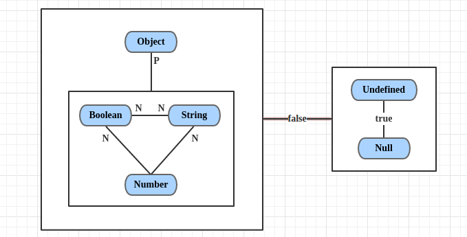

图3 更完美的==运算规则的图形化表示

有一个地方可能让你疑惑：为什么Boolean与String之间标了两个N？虽然按照规则应该是由Boolean转为数字，但是下一步String就要转为数字了，所以干脆不如两边同时转成数字。


九. 总结一下

前面说得很乱，根据我们得到的最终的图3，我们总结一下==运算的规则：

* undefined == null，结果是true。且它俩与所有其他值比较的结果都是false。

* String == Boolean，需要两个操作数同时转为Number。

* String/Boolean == Number，需要String/Boolean转为Number。

* Object == Primitive，需要Object转为Primitive(具体通过valueOf和toString方法)。

瞧见没有，一共只有4条规则！是不是很清晰、很简单。


***

## 64. 怎么做移动端的样式适配？


**参考答案：**

以下是一些常见的移动端样式适配方法：

1. 响应式设计（Responsive Design）：

   * 使用CSS媒体查询（Media Queries）来根据设备的特征（如屏幕宽度、高度、方向等）应用不同的样式。

   * 通过设置百分比宽度、最大宽度或相对单位（比如 rem）来确保元素相对于其容器的大小进行自适应。

   ```javascript
   @media only screen and (max-width: 768px) {
     /* 在小屏幕上的样式 */
   }

   @media only screen and (min-width: 769px) and (max-width: 1024px) {
     /* 在中等屏幕上的样式 */
   }

   @media only screen and (min-width: 1025px) {
     /* 在大屏幕上的样式 */
   }
   ```

2. 弹性布局（Flexbox）和网格布局（Grid）：

   * 使用弹性布局和网格布局可以更方便地创建灵活的布局，使页面元素能够根据屏幕大小自动调整位置。

   ```javascript
   .container {
     display: flex;
     flex-wrap: wrap;
   }

   .item {
     flex: 1;
   }
   ```

3. 移动端优先（Mobile-first）：

   * 首先定义移动端的样式，然后使用媒体查询逐渐添加更大屏幕上的样式，以确保基本功能在小屏幕上也能正常工作。

   ```javascript
   /* 移动端样式 */
   body {
     font-size: 14px;
   }

   /* 大屏幕样式 */
   @media only screen and (min-width: 768px) {
     body {
       font-size: 16px;
     }
   }
   ```

4. 图片和多媒体适配：

   * 使用`max-width: 100%`确保图片和多媒体在小屏幕上不会溢出其容器。

   * 使用`picture`元素或`srcset`属性提供不同尺寸的图片。

   ```javascript
   img {
     max-width: 100%;
     height: auto;
   }
   ```

5. 交互友好：

   * 使用合适的尺寸和间距，确保链接、按钮等可点击元素在触摸屏上易于点击。

```css
1/* 适当的触摸区域大小 */
a, button {
  padding: 10px;
}
```

6.测试和调试：


***

## 65. 说说sourcemap的原理？


**参考答案：**

Source map 想必大家都不陌生。线上的代码多是压缩后的，如果线上有报错却只能调试那个代码多半是个噩梦。因此我们需要有一个桥梁帮助我们搭建起源代码及压缩后代码的联系，source map 就是起了这个作用。

以下是 MDN 对于 source map 的解释：

> 调试原始源代码会比浏览器下载的转换后的代码更加容易。 [source map](https://www.html5rocks.com/en/tutorials/developertools/sourcemaps/) 是从已转换的代码映射到原始源的文件，使浏览器能够重构原始源并在调试器中显示重建的原始源。

但是不知道大家有没有对 source map 的原理产生过疑问？先列出了四个疑问，不知道各位是不是也存在过这样的问题：


接下来的内容会逐步为读者解答这四问。


source map 文件是否影响网页性能

这个答案肯定是不会影响，否则构建相关的优化就肯定会涉及到对于 source map 的处理了，毕竟 source map 文件也不小。

其实 source map 只有在打开 dev tools 的情况下才会开始下载，相信大部分用户都不会去打开这个面板，所以这也就不是问题了。

这时可能会有读者想说：哎，但是我好像从来没有在 Network 里看到 source map 文件的加载呀？其实这只是浏览器隐藏了而已，如果大家使用抓包工具的话就能发现在打开 dev tools 的时候开始下载 source map 了。


source map 存在标准嘛？

source map 是存在一个标准的，为 Google 及 Mozilla 的工程师制定，[文档地址](https://docs.google.com/document/d/1U1RGAehQwRypUTovF1KRlpiOFze0b-_2gc6fAH0KY0k/edit)。正是因为存在这份标准，各个打包器及浏览器才能生成及使用 source map，否则就乱套了。

各个打包器基本都基于[该库](https://github.com/mozilla/source-map)来生成 source map，当然也存在一些魔改的方案，但是标准都是统一的。

通过上面的库生成出来的 source map 格式大致如下，大家也可以对比各个打包器的产物，格式及内容大部分都是一致的：

```javascript
{
  version: 3,
  file: "min.js",
  names: ["bar", "baz", "n"],
  sources: ["one.js", "two.js"],
  sourceRoot: "http://example.com/www/js/",
  mappings: "CAAC,IAAI,IAAM,SAAUA,GAClB,OAAOC,IAAID;CCDb,IAAI,IAAM,SAAUE,GAClB,OAAOA"
}
```

接下来介绍下重要字段的作用：

* version：顾名思义，指代了版本号，目前 source map 标准的版本为 3，也就是说这份 source map 使用的是第三版标准产出的

* file：编译后的文件名

* names：一个优化用的字段，后续会在 mappings 中用到

* sources：多个源文件名

* mappings：这是最重要的内容，表示了源代码及编译后代码的关系，但是先略过这块，下文中会详细解释

另外大部分应用都是由 webpack 来打包的，可能有些读者会发现 webpack 的 source map 产出的字段于上面的略微有些不一致。

这是因为 webpack 魔改了一些东西，但是底下还是基于这个库实现的，只是变动了一些不涉及核心的字段，[具体代码](https://github.com/webpack/webpack-sources/blob/master/lib/SourceMapSource.js)。


浏览器怎么知道源文件和 source map 的关系？

这里我们以 webpack 做个实验，通过 webpack5 对于以下代码进行打包：

```javascript
// index.js
const a = 1
console.log(a);
```

当我们开启 source map 选项以后，产物应该为两个文件，分别为 `bundle.js` 以及 `bundle.js.map`。

查看 `bundle.js` 文件以后我们会发现代码中存在这一一段注释：

```javascript
console.log(1);
//# sourceMappingURL=bundle.js.map
```

`sourceMappingURL` 就是标记了该文件的 source map 地址。

当然除此之外还有别的方式，通过查阅 [MDN 文档](https://developer.mozilla.org/zh-CN/docs/Web/HTTP/Headers/SourceMap) 发现还可以通过 response header 的 `SourceMap: <url>` 字段来表明。


source map 是如何对应到源代码的？

这是 source map 最核心的功能，也是最涉及知识盲区的一块内容。

大家应该还记得上文中没介绍的 `mapping` 字段吧，接下来我们就来详细了解这个字段的用处。

我们还是以刚才打包的文件为例，来看看产出的 source map 长啥样（去掉了无关紧要的）：

```javascript
{
  sources:["webpack://webpack-source-demo/./src/index.js"],
  names: ['console', 'log'],
  mappings: 'AACAA,QAAQC,IADE',
}
```

首先 `mappings` 的内容其实是 Base64 VLQ 的编码表示。

内容由三部分组成，分别为：

* 英文，表示源码及压缩代码的位置关联

* 逗号，分隔一行代码中的内容。比如说 `console.log(a)` 就由 `console` 、`log` 及 `a` 三部分组成，所以存在两个逗号。

* 分号，代表换行

逗号和分号想必大家没啥疑问，但是对于这几个英文内容应该会很困惑。

其实这就是一种压缩数字内容的编码方式，毕竟源代码可能很庞大，用数字表示行数及列数的话 source map 文件将也会很庞大，因此选用 Base 64 来代表数字用以减少文件体积。

比如说 `A` 代表了数字 0，`C` 代表了数字 2 等等，有兴趣的读者可以通过[该网站](https://www.murzwin.com/base64vlq.html)了解映射关系。

了解了这层编码的映射关系，我们再来聊聊这一串串英文到底代表了什么。

其实这每串英文中的字母都代表了一个位置：

1. 压缩代码的第几列

2. 哪个源代码文件，毕竟可以多个文件打包成一个，对应 `sources` 字段

3. 源代码第几行

4. 源代码第几列

5. `names` 字段里的索引

这时读者可能有个疑惑，为啥没有压缩代码的第几行表示？这是因为压缩后的代码就一行，所以只需要表示第几列就行了。

***

更新：有读者询问 Base64 表达的数字是有上限的，如果需要表示的数字很大的话该怎么办。实际上除了每个分号中的第一串英文是用来表示代码的第几行第几列的绝对位置之外，后面的都是相对于之前的位置来做加减法的。

***

了解完以上知识以后，我们就来根据上文的内容解析下 `AACAA` 的具体含义吧，通过[该网站](https://www.murzwin.com/base64vlq.html)我们可以知道 `AACAA` 对应了 `[0,0,1,0,0]`，这里需要注意的是数字都从 0 开始，笔者表述的时候会自动加一，毕竟代码第零行听起来怪怪的。

1. 压缩代码的第一列

2. 第一个源代码文件，也就是 `index.js` 文件了

3. 源代码第二行了

4. 源代码的第一列

5. `names` 数组中的第一个索引，也就是 `console`

通过以上的解析，我们就能知道 `console` 在源代码及压缩文件中的具体位置了。

但是为什么 source map 会知道编译后的代码具体在什么位置呢？这里就要用到 AST 了。让我们打开[网站](https://astexplorer.net/)输入 `console.log(a)` 后观察右边的内容，你应该会发现如图所示的数据：

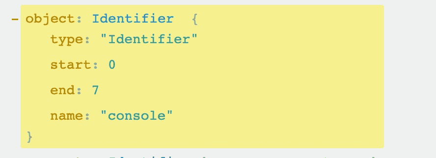

因为 source map 是由 AST 产出的，所以我们能用上 AST 中的这个数据。


source map 的应用

一般来说 source map 的应用都是在监控系统中，开发者构建完应用后，通过插件将源代码及 source map 上传至平台中。一旦客户端上报错误后，我们就可以通过[该库](https://github.com/mozilla/source-map)来还原源代码的报错位置（具体 API 看文档即可），方便开发者快速定位线上问题。


***

## 66. vue中computed和watch区别


**参考答案：**

computed 和 watch看似都能实现对数据的监听，但还是有区别。

以下通过一个小栗子来理解一下这两者的区别。


computed 计算属性

计算属性基于 data 中声明过或者父组件传递的 props 中的数据通过计算得到的一个新值，这个新值只会根据已知值的变化而变化，简言之：这个属性依赖其他属性，由其他属性计算而来的。

```javascript
<p>姓名：{{ fullName }}</p>
... ...
data: {
    firstName: 'David',
    lastName: 'Beckham'
},
computed: {
    fullName: function() { //方法的返回值作为属性值
            return this.firstName + ' ' + this.lastName
    }
}
```

在 computed 属性对象中定义计算属性的方法，和取data对象里的数据属性一样以属性访问的形式调用，即在页面中使用 {{ 方法名 }} 来显示计算的结果。

注：计算属性 fullName 不能在 data 中定义，而计算属性值的相关已知值在data中；

如果 fullName 在 data 中定义了会报错如下图：

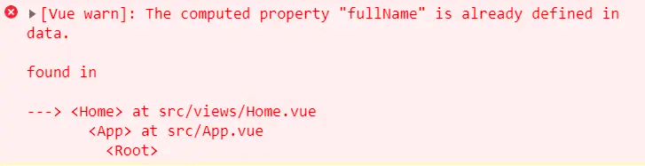

因为如果 computed 属性值是一个函数，那么默认会走 get 方法，必须要有一个返回值，函数的返回值就是属性的属性值。计算属性定义了 fullName 并返回对应的结果给这个变量，变量不可被重复定义和赋值。

在官方文档中，还强调了 computed 一个重要的特点，就是 computed 带有缓存功能。比如我在页面中多次显示 fullName：

```javascript
<p>姓名：{{ fullName }}</p>
<p>姓名：{{ fullName }}</p>
<p>姓名：{{ fullName }}</p>
<p>姓名：{{ fullName }}</p>
<p>姓名：{{ fullName }}</p>
... ... 

computed: {
    fullName: function () {
         console.log('computed') // 在控制台只打印了一次
         return this.firstName + ' ' + this.lastName
    }
}
```

我们知道 computed 内定义的 function 只执行一次，仅当初始化显示或者相关的 data、props 等属性数据发生变化的时候调用；

而 computed 属性值默认会缓存计算结果，计算属性是基于它们的响应式依赖进行缓存的；

只有当 computed 属性被使用后，才会执行 computed 的代码，在重复的调用中，只要依赖数据不变，直接取缓存中的计算结果。只有依赖型数据发生改变，computed 才会重新计算。


计算属性的高级：

在computed 中的属性都有一个 get 和一个 set 方法，当数据变化时，调用 set 方法。下面我们通过计算属性的 getter/setter 方法来实现对属性数据的显示和监视，即双向绑定。

```javascript
computed: {
    fullName: {
        get() { //读取当前属性值的回调，根据相关的数据计算并返回当前属性的值
            return this.firstName + ' ' + this.lastName
        },
        set(val) { // 当属性值发生改变时回调，更新相关的属性数据，val就是fullName的最新属性值
            const names = val ? val.split(' ') : [];
            this.firstName = names[0]
            this.lastName = names[1]
        }
    }
}
```


watch 监听属性

通过 vm 对象的 $watch() 或 watch 配置来监听 Vue 实例上的属性变化，或某些特定数据的变化，然后执行某些具体的业务逻辑操作。当属性变化时，回调函数自动调用，在函数内部进行计算。其可以监听的数据来源：data，props，computed 内的数据。

以上示例通过 watch 来实现：

```javascript
watch: {
    // 监听 data 中的 firstName，如果发生了变化，就把变化的值给 data 中的 fullName， val 就是 firstName 的最新值
    firstName: function(val) { 
        this.fullName = val + ' ' + this.lastName
    },
    lastName: function(val) {
        this.fullName = this.firstName + ' ' + val
    }    
}
// 由上可以看出 watch 要监听两个数据，而且代码是同类型的重复的，所以相比用 computed 更简洁
```

注： 监听函数有两个参数，第一个参数是最新的值，第二个参数是输入之前的值，顺序一定是新值，旧值，如果只写一个参数，那就是最新属性值。

在使用时选择 watch 还是 computed，还有一个参考点就是官网说的：当需要在数据变化时执行异步或开销较大的操作时，watch方式是最有用的。所以 watch 一定是支持异步的。

上面仅限监听简单数据类型，监听复杂数据类型就需要用到深度监听 deep。

\*\*deep：\*\*为了发现对象内部值的变化，可以在选项参数中指定 deep: true。注意监听数组的变更不需要这么做。

```javascript
data: {
    fullName: {
        firstName: 'David',
        lastName: 'Beckham'
    }
},
watch: {
    fullName: {
        handler(newVal, oldVal) {
            console.log(newVal);
            console.log(oldVal);
        },
        deep: true
    }
}
```

以上打印结果：

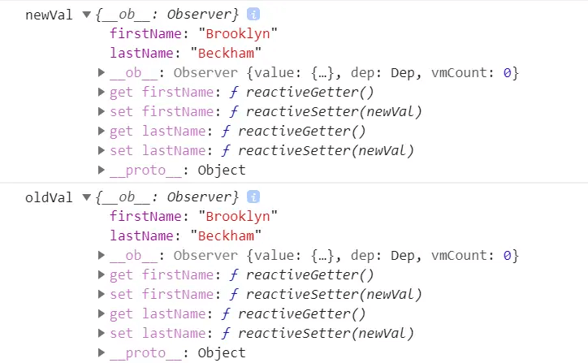

打印出来的 newVal 和 oldVal 值是一样的，所以深度监听虽然可以监听到对象的变化，但是无法监听到对象里面哪个具体属性的变化。这是因为它们的引用指向同一个对象/数组。Vue 不会保留变更之前值的副本。

若果要监听对象的单个属性的变化，有两种方法：

1.直接监听对象的属性

```javascript
watch:{
    fullName.firstName: function(newVal,oldVal){
        console.log(newVal,oldVal);
    }
}
```

2.与 computed 属性配合使用，computed 返回想要监听的属性值，watch 用来监听

```javascript
computed: {
    firstNameChange() {
    return this.fullName.firstName
    }
},
watch: {
    firstNameChange() {
        console.log(this.fullName)
    }
}
```


总结：

watch和computed都是以Vue的依赖追踪机制为基础的，当某一个依赖型数据（依赖型数据：简单理解即放在 data 等对象下的实例数据）发生变化的时候，所有依赖这个数据的相关数据会自动发生变化，即自动调用相关的函数，来实现数据的变动。

当依赖的值变化时，在watch中，是可以做一些复杂的操作的，而computed中的依赖，仅仅是一个值依赖于另一个值，是值上的依赖。


应用场景：

computed：用于处理复杂的逻辑运算；一个数据受一个或多个数据影响；用来处理watch和methods无法处理的，或处理起来不方便的情况。例如处理模板中的复杂表达式、购物车里面的商品数量和总金额之间的变化关系等。

watch：用来处理当一个属性发生变化时，需要执行某些具体的业务逻辑操作，或要在数据变化时执行异步或开销较大的操作；一个数据改变影响多个数据。例如用来监控路由、inpurt 输入框值的特殊处理等。


区别：

computed

* 初始化显示或者相关的 data、props 等属性数据发生变化的时候调用；

* 计算属性不在 data 中，它是基于data 或 props 中的数据通过计算得到的一个新值，这个新值根据已知值的变化而变化；

* 在 computed 属性对象中定义计算属性的方法，和取data对象里的数据属性一样，以属性访问的形式调用；

* 如果 computed 属性值是函数，那么默认会走 get 方法，必须要有一个返回值，函数的返回值就是属性的属性值；

* computed 属性值默认会缓存计算结果，在重复的调用中，只要依赖数据不变，直接取缓存中的计算结果，只有依赖型数据发生改变，computed 才会重新计算；

* 在computed中的，属性都有一个 get 和一个 set 方法，当数据变化时，调用 set 方法。

watch

* 主要用来监听某些特定数据的变化，从而进行某些具体的业务逻辑操作，可以看作是 computed 和 methods 的结合体；

* 可以监听的数据来源：data，props，computed内的数据；

* watch支持异步；

* 不支持缓存，监听的数据改变，直接会触发相应的操作；

* 监听函数有两个参数，第一个参数是最新的值，第二个参数是输入之前的值，顺序一定是新值，旧值。


***

## 67. 什么是DNS劫持？


**参考答案：**

DNS 劫持作为最常见的网络攻击方式，是每个站长或者运维团队最为头疼的事情。苦心经营的网站受到 DNS 劫持后，不仅会影响网站流量、权重，还会让用户置身于危险之中，泄露隐私造成财产损失。

就是这样一个简单到不能再简单的攻击方式，在 2009 年制造了轰动全球的“银行劫持案”，导致巴西最大银行 Banco Bradesco 银行近 1% 客户受到攻击而导致账户被盗。黑客利用宽带路由器缺陷对用户 DNS 进行篡改——用户浏览黑客所制作的 Web 页面，其宽带路由器 DNS 就会被黑客篡改，由于该 Web 页面设有巧妙设计的恶意代码，成功躲过安全软件检测，导致大量用户被 DNS 钓鱼诈骗。


网站被黑、被歹意镜像、被植入垃圾代码，现象屡见不鲜，其危害还包括：

* 钓鱼诈骗网上购物,网上支付有可能会被恶意指向别的网站，更加加大了个人账户泄密的风险；

* 网站内出现恶意广告；

* 轻则影响网速，重则不能上网。

但面对DNS劫持时，只能束手就擒吗？


知己知彼，什么是 DNS？

DNS 即 Domain Name System 的缩写，域名系统以分布式数据库的形式将域名和 IP 地址相互映射。简单的说，DNS 是用来解析域名的，在正常环境下，用户的每一个上网请求会通过 DNS 解析指向到与之相匹配的 IP 地址，从而完成一次上网行为。DNS 作为应用层协议，主要是为其他应用层协议工作的，包括不限于 HTTP、SMTP、FTP，用于将用户提供的主机名解析为 IP 地址，具体过程如下：

（1）用户主机（PC 端或手机端）上运行着 DNS 的客户端；

（2）浏览器将接收到的 URL 中抽取出域名字段，即访问的主机名，比如 <http://www.aliyun.com/> , 并将这个主机名传送给 DNS 应用的客户端；

（3）DNS 客户机端向 DNS 服务器端发送一份查询报文，报文中包含着要访问的主机名字段（中间包括一些列缓存查询以及分布式 DNS 集群的工作）；

（4）该 DNS 客户机最终会收到一份回答报文，其中包含有该主机名对应的 IP 地址；

（5）一旦该浏览器收到来自 DNS 的 IP 地址，就可以向该 IP 地址定位的 HTTP 服务器发起 TCP 连接。


（图片源自网络，仅作示意）

可以看到想要获取目标网站 IP，除了在本机中查找行为，还需要第三方服务器(DNS)参与。但只要经过第三方服务，网络就不属于可控制范围，那么就有可能产生 DNS 挟持，比如获取的 IP 并不是实际想要的 IP，从而打开非目标网站。网站在经过本地 DNS 解析时，黑客将本地 DNS 缓存中的目标网站替换成其他网站的 IP 返回，而客户端并不知情，依旧按照正常流程寻址建并立连接。如果一些黑客想要盗取用户账号及密码时，黑客可以做跟目标网站一模一样的木马页面，让用户登录，当用户输入完密码提交的时候就中招了。


常见 DNS 劫持手段又有哪些？

（1）利用 DNS 服务器进行 DDoS 攻击

正常 DNS 服务器递归询问过程被利用，变成 DDoS 攻击。假设黑客知晓被攻击机器 IP 地址，攻击者使用该地址作为发送解析命令的源地址。当使用 DNS 服务器递归查询后会响应给最初用户。如果黑客控制了足够规模的肉鸡进行上述操作。那么，这个最初用户就会受到来自于 DNS 服务器的响应信息 DDoS 攻击，成为被攻击者。

（2）DNS 缓存感染

黑客使用 DNS 请求将数据注入具有漏洞的 DNS 服务器缓存中。这些缓存信息会在客户进行 DNS 访问时返回给用户，把用户对正常域名的访问引导到入侵者所设置挂马、钓鱼等页面上，或通过伪造邮件和其他服务获取用户口令信息，导致客户遭遇进一步侵害。

（3）DNS 信息劫持

原则上 TCP/IP 体系通过序列号等多种方式避免仿冒数据插入，但黑客通过监听客户端和 DNS 服务器对话，就可以解析服务器响应给客户端的 DNS 查询 ID。每个 DNS 报文包括一个相关联的 16 位 ID，DNS 服务器根据这个 ID 获取请求源位置。黑客在 DNS 服务器之前将虚假响应交给用户，欺骗客户端去访问恶意网站。假设当提交给某个域名服务器域名解析请求的数据包被截获，然后按黑客的意图将虚假 IP 地址作为应答信息返回给请求者。这时，原始请求者就会把这个虚假 IP 地址作为它所要请求的域名而进行连接，显然它被引导到了别处而根本连接不上自己想要连接的那个域名。

（4）ARP 欺骗

通过伪造 IP 地址和 MAC 地址实现 ARP 欺骗，在网络中产生大量 ARP 通信量使网络阻塞，黑客只要持续不断发出伪造的 ARP 响应包就能更改目标主机 ARP 缓存中的 IP-MAC 条目，造成网络中断或中间人攻击。ARP 攻击主要是存在于局域网网络中，局域网中若有一台计算机感染 ARP 木马，则感染该 ARP 木马的系统将会试图通过"ARP 欺骗”手段截获所在网络内其它计算机的通信信息，并因此造成网内其它计算机的通信故障。ARP 欺骗通常是在用户局网中，造成用户访问域名的错误指向，但在 IDC 机房被入侵后，则也可能出现攻击者采用 ARP 包压制正常主机、或者压制 DNS 服务器，以使访问导向错误指向。


DNS 劫持对业务造成哪些影响？

一旦被劫持，相关用户查询就没办法获取到正确 IP 解析，这就很容易造成：

（1）很多用户习惯依赖书签或者易记域名进入，一旦被劫持会使这类用户无法打开网站，更换域名又没办法及时告知变更情况，导致用户大量流失。

（2）用户流量主要是通过搜索引擎 SEO 进入，DNS 被劫持后会导致搜索引擎蜘蛛抓取不到正确 IP，网站就可能会被百度 ban 掉。

（3）一些域名使用在手机应用 APP 调度上，这些域名不需要可以给客户访问，但这些域名的解析关系到应用 APP 访问，如果解析出现劫持就会导致应用 APP 无法访问。这时候更换域名就可能会导致 APP 的下架，重新上架需要审核并且不一定可以重新上架。这就会导致应用 APP 会有用户无法访问或者下载的空窗期。

可以看到，DNS 劫持对业务有着巨大影响，不仅仅是用户体验的损失，更是对用户资产安全、数据安全的造成潜在的巨大风险。


***

## 68. 爬楼梯

假设你正在爬楼梯。需要 `n` 阶你才能到达楼顶。

每次你可以爬 `1` 或 `2` 个台阶。你有多少种不同的方法可以爬到楼顶呢？

示例 1：

输入： n = 2

输出： 2

解释： 有两种方法可以爬到楼顶。

1. 1 阶 + 1 阶

2. 2 阶

示例 2：

输入： n = 3

输出： 3

解释： 有三种方法可以爬到楼顶。

1. 1 阶 + 1 阶 + 1 阶

2. 1 阶 + 2 阶

3. 2 阶 + 1 阶

提示：

* `1 <= n <= 45`

```javascript
/**
 * @param {number} n
 * @return {number}
 */
var climbStairs = function(n) {

};
```


**参考答案：**


方法一：动态规划

思路和算法

我们用 `f(x)` 表示爬到第 x 级台阶的方案数，考虑最后一步可能跨了一级台阶，也可能跨了两级台阶，所以我们可以列出如下式子：

`f(x)=f(x−1)+f(x−2)`

它意味着爬到第 x 级台阶的方案数是爬到第 `x−1` 级台阶的方案数和爬到第 `x−2` 级台阶的方案数的和。

很好理解，因为每次只能爬 1 级或 2 级，所以 f(x) 只能从 `f(x - 1)` 和 `f(x - 2)` 转移过来，而这里要统计方案总数，我们就需要对这两项的贡献求和。

以上是动态规划的转移方程，下面我们来讨论边界条件。我们是从第 0 级开始爬的，所以从第 0 级爬到第 0 级我们可以看作只有一种方案，即 `f(0) = 1`；从第 0 级到第 1 级也只有一种方案，即爬一级，`f(1) = 1`。这两个作为边界条件就可以继续向后推导出第 n 级的正确结果。我们不妨写几项来验证一下，根据转移方程得到 `f(2) = 2`，`f(3) = 3`，`f(4) = 5`，……，我们把这些情况都枚举出来，发现计算的结果是正确的。

我们不难通过转移方程和边界条件给出一个时间复杂度和空间复杂度都是 `O(n)` 的实现，但是由于这里的 f(x) 只和 `f(x - 1)` 与 `f(x - 2)` 有关，所以我们可以用「滚动数组思想」把空间复杂度优化成 O(1)。下面的代码中给出的就是这种实现。

```javascript
var climbStairs = function(n) {
    let p = 0, q = 0, r = 1;
    for (let i = 1; i <= n; ++i) {
        p = q;
        q = r;
        r = p + q;
    }
    return r;
};
```


复杂度分析

* 时间复杂度：循环执行 n 次，每次花费常数的时间代价，故渐进时间复杂度为 O(n)。

* 空间复杂度：这里只用了常数个变量作为辅助空间，故渐进空间复杂度为 O(1)。


方法二：通项公式

思路

之前的方法我们已经讨论了 f(n) 是齐次线性递推，根据递推方程 `f(n) = f(n - 1) + f(n - 2)`，我们可以写出这样的特征方程： `x^2=x+1`

我们得到了这个递推数列的通项公式：

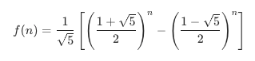

```javascript
var climbStairs = function(n) {
    const sqrt5 = Math.sqrt(5);
    const fibn = Math.pow((1 + sqrt5) / 2, n + 1) - Math.pow((1 - sqrt5) / 2, n + 1);
    return Math.round(fibn / sqrt5);
};
```

复杂度分析

代码中使用的 pow 函数的时空复杂度与 CPU 支持的指令集相关，这里不深入分析。


总结

这里形成的数列正好是斐波那契数列，答案要求的 f(n) 即是斐波那契数列的第 n 项（下标从 0 开始）。我们来总结一下斐波那契数列第 n 项的求解方法：

* n 比较小的时候，可以直接使用过递归法求解，不做任何记忆化操作，时间复杂度是 O(2^n)，存在很多冗余计算。

* 一般情况下，我们使用「记忆化搜索」或者「迭代」的方法，实现这个转移方程，时间复杂度和空间复杂度都可以做到 O(n)。

* 为了优化空间复杂度，我们可以不用保存 `f(x - 2)` 之前的项，我们只用三个变量来维护 `f(x)`、`f(x - 1)` 和 `f(x - 2)`，你可以理解成是把「滚动数组思想」应用在了动态规划中，也可以理解成是一种递推，这样把空间复杂度优化到了 O(1)。

* 随着 n 的不断增大 O(n) 可能已经不能满足我们的需要了，我们可以用「矩阵快速幂」的方法把算法加速到 O(logn)。

* 我们也可以把 n 代入斐波那契数列的通项公式计算结果，但是如果我们用浮点数计算来实现，可能会产生精度误差。


***

## 69. 怎么实现图片懒加载？


**参考答案：**

懒加载是一种网页性能优化的方式，它能极大的提升用户体验。就比如说图片，图片一直是影响网页性能的主要元凶，现在一张图片超过几兆已经是很经常的事了。如果每次进入页面就请求所有的图片资源，那么可能等图片加载出来用户也早就走了。所以，我们需要懒加载，进入页面的时候，只请求可视区域的图片资源。

总结出来就两个点：

1. 全部加载的话会影响用户体验

2. 浪费用户的流量，有些用户并不想全部看完，全部加载会耗费大量流量。


实现方式


html 实现

最简单的实现方式是给 `img` 标签加上 `loading="lazy"`，比如

```javascript

```

该属性的兼容性也还行，大家生产环境可以使用。

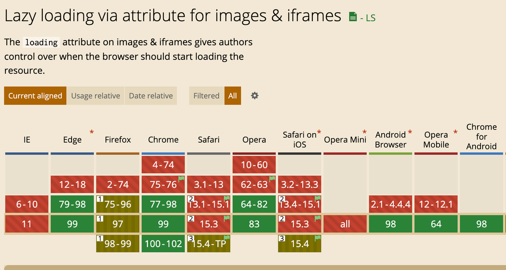


js实现原理

我们通过js监听页面的滚动也能实现。

使用js实现的原理主要是判断当前图片是否到了可视区域：

* 拿到所有的图片 dom 。

* 遍历每个图片判断当前图片是否到了可视区范围内。

* 如果到了就设置图片的 src 属性。

* 绑定 window 的 scroll 事件，对其进行事件监听。

在页面初始化的时候，\图片的src实际上是放在data-src属性上的，当元素处于可视范围内的时候，就把data-src赋值给src属性，完成图片加载。

```javascript
// 在一开始加载的时候


// 在进入可视范围内时

```

\<div>使用背景图来实现，原理也是一样的，把图片链接存放在 `data-src` 中，在可视范围时，就把data-src赋值给 `background-image` 属性，完成图片加载。

```javascript
// 在一开始加载的时候
<div
  data-src="http://xx.com/xx.png"
  style="background-image: none;background-size: cover;"
></div>

// 在进入可视范围内时
<div
  data-src="http://xx.com/xx.png"
  style="background-image: url(http://xx.com/xx.png);background-size: cover;"
></div>
```

下面展示一个demo：

```javascript
<html lang="en">
  <head>
    <meta charset="UTF-8" />
    <title>Lazyload</title>
    <style>
      img {
        display: block;
        margin-bottom: 50px;
        height: 200px;
        width: 400px;
      }
    </style>
  </head>
  <body>
    
    
    
    
    
    
    
    
    
    
  </body>
</html>
```

先获取所有图片的 dom，通过 `window.innerHeight || document.documentElement.clientHeight|| document.body.clientHeight` 获取可视区高度，再使用 `element.getBoundingClientRect()` API 直接得到元素相对浏览的 top 值， 遍历每个图片判断当前图片是否到了可视区范围内。代码如下：

```javascript
function lazyload() {
  let viewHeight = window.innerHeight || document.documentElement.clientHeight|| document.body.clientHeight //获取可视区高度，兼容不同浏览器
  let imgs = document.querySelectorAll('img[data-src]')
  imgs.forEach((item, index) => {
    if (item.dataset.src === '') return

    // 用于获得页面中某个元素的左，上，右和下分别相对浏览器视窗的位置
    let rect = item.getBoundingClientRect()
    if (rect.bottom >= 0 && rect.top < viewHeight) {
      item.src = item.dataset.src
      item.removeAttribute('data-src')
    }
  })
}
```

最后给 window 绑定 onscroll 事件

```javascript
window.addEventListener('scroll', lazyload)
```

主要就完成了一个图片懒加载的操作了。但是这样存在较大的性能问题，因为 scroll 事件会在很短的时间内触发很多次，严重影响页面性能，为了提高网页性能，我们需要一个节流函数来控制函数的多次触发，在一段时间内（如 200ms）只执行一次回调。

下面实现一个节流函数

```javascript
function throttle(fn, delay) {
  let timer
  let prevTime
  return function (...args) {
    const currTime = Date.now()
    const context = this
    if (!prevTime) prevTime = currTime
    clearTimeout(timer)

    if (currTime - prevTime > delay) {
      prevTime = currTime
      fn.apply(context, args)
      clearTimeout(timer)
      return
    }

    timer = setTimeout(function () {
      prevTime = Date.now()
      timer = null
      fn.apply(context, args)
    }, delay)
  }
}
```

然后修改一下 srcoll 事件

```javascript
window.addEventListener('scroll', throttle(lazyload, 200))
```


拓展： IntersectionObserver

通过上面例子的实现，我们要实现懒加载都需要去监听 scroll 事件，尽管我们可以通过函数节流的方式来阻止高频率的执行函数，但是我们还是需要去计算 scrollTop，offsetHeight 等属性，有没有简单的不需要计算这些属性的方式呢，答案就是 `IntersectionObserver`。

`IntersectionObserver` 是一个比较新的 API，可以自动"观察"元素是否可见，Chrome 51+ 已经支持。由于可见（visible）的本质是，目标元素与视口产生一个交叉区，所以这个 API 叫做"交叉观察器"。我们来看一下它的用法：

```javascript
var io = new IntersectionObserver(callback, option)

// 开始观察
io.observe(document.getElementById('example'))

// 停止观察
io.unobserve(element)

// 关闭观察器
io.disconnect()
```

IntersectionObserver 是浏览器原生提供的构造函数，接受两个参数：callback 是可见性变化时的回调函数，option 是配置对象（该参数可选）。

目标元素的可见性变化时，就会调用观察器的回调函数 callback。callback 一般会触发两次。一次是目标元素刚刚进入视口（开始可见），另一次是完全离开视口（开始不可见）。

下面我们用 IntersectionObserver 实现图片懒加载


```javascript
const imgs = document.querySelectorAll('img[data-src]')
const config = {
  rootMargin: '0px',
  threshold: 0,
}
let observer = new IntersectionObserver((entries, self) => {
  entries.forEach((entry) => {
    if (entry.isIntersecting) {
      let img = entry.target
      let src = img.dataset.src
      if (src) {
        img.src = src
        img.removeAttribute('data-src')
      }
      // 解除观察
      self.unobserve(entry.target)
    }
  })
}, config)

imgs.forEach((image) => {
  observer.observe(image)
})
```


***

## 70. HTTP 报文结构是怎样的？


**参考答案：**

对于 TCP 而言，在传输的时候分为两个部分:TCP头和数据部分。

而 HTTP 类似，也是header + body的结构，具体而言:

> 起始行 + 头部 + 空行 + 实体

由于 http 请求报文和响应报文是有一定区别，因此我们分开介绍。


起始行

对于请求报文来说，起始行类似下面这样:

> GET /home HTTP/1.1

也就是方法 + 路径 + http版本。

对于响应报文来说，起始行一般长这个样:

> HTTP/1.1 200 OK

响应报文的起始行也叫做状态行，由http版本、状态码和原因三部分组成。

值得注意的是，在起始行中，每两个部分之间用空格隔开，最后一个部分后面应该接一个换行，严格遵循ABNF语法规范。


头部

展示一下请求头和响应头在报文中的位置:

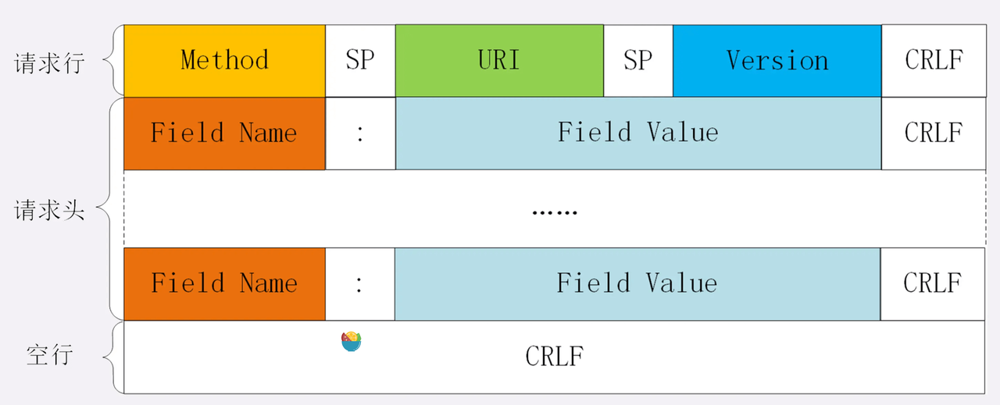

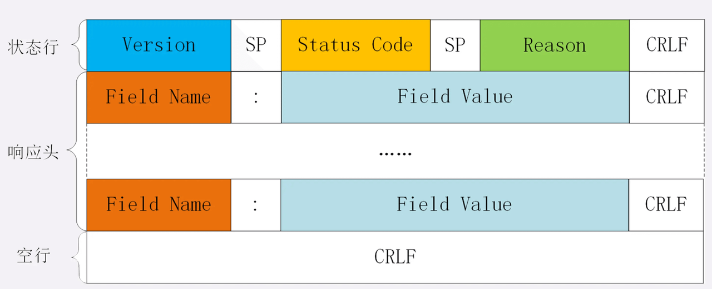

不管是请求头还是响应头，其中的字段是相当多的，而且牵扯到http非常多的特性，这里就不一一列举的，重点看看这些头部字段的格式：

* 字段名不区分大小写

* 字段名不允许出现空格，不可以出现下划线\_

* 字段名后面必须紧接着冒号 :


空行

很重要，用来区分开头部和实体。

如果说在头部中间故意加一个空行，那么空行后的内容全部被视为实体。


实体

就是具体的数据了，也就是body部分。请求报文对应请求体, 响应报文对应响应体。


***

## 71. 如果使用Vue3.0实现一个 Modal，你会怎么进行设计？


**参考答案：**

一、组件设计

组件就是把图形、非图形的各种逻辑均抽象为一个统一的概念（组件）来实现开发的模式

现在有一个场景，点击新增与编辑都弹框出来进行填写，功能上大同小异，可能只是标题内容或者是显示的主体内容稍微不同

这时候就没必要写两个组件，只需要根据传入的参数不同，组件显示不同内容即可

这样，下次开发相同界面程序时就可以写更少的代码，意义着更高的开发效率，更少的 `Bug `和更少的程序体积


二、需求分析

实现一个`Modal`组件，首先确定需要完成的内容：

* 遮罩层

* 标题内容

* 主体内容

* 确定和取消按钮

主体内容需要灵活，所以可以是字符串，也可以是一段 `html` 代码

特点是它们在当前`vue`实例之外独立存在，通常挂载于`body`之上

除了通过引入`import`的形式，我们还可通过`API`的形式进行组件的调用

还可以包括配置全局样式、国际化、与`typeScript`结合


三、实现流程

首先看看大致流程：

* 目录结构

* 组件内容

* 实现 API 形式

* 事件处理

* 其他完善


目录结构

`Modal`组件相关的目录结构

```plaintext
├── plugins
│   └── modal
│       ├── Content.tsx // 维护 Modal 的内容，用于 h 函数和 jsx 语法
│       ├── Modal.vue // 基础组件
│       ├── config.ts // 全局默认配置
│       ├── index.ts // 入口
│       ├── locale // 国际化相关
│       │   ├── index.ts
│       │   └── lang
│       │       ├── en-US.ts
│       │       ├── zh-CN.ts
│       │       └── zh-TW.ts
│       └── modal.type.ts // ts类型声明相关
```

因为 Modal 会被 `app.use(Modal)` 调用作为一个插件，所以都放在`plugins`目录下


组件内容

首先实现`modal.vue`的主体显示内容大致如下

```javascript
<Teleport to="body" :disabled="!isTeleport">
    <div v-if="modelValue" class="modal">
        <div
             class="mask"
             :style="style"
             @click="maskClose && !loading && handleCancel()"
             ></div>
        <div class="modal__main">
            <div class="modal__title line line--b">
                <span>{{ title || t("r.title") }}</span>
                <span
                      v-if="close"
                      :title="t('r.close')"
                      class="close"
                      @click="!loading && handleCancel()"
                      >✕</span
                    >
            </div>
            <div class="modal__content">
                <Content v-if="typeof content === 'function'" :render="content" />
                <slot v-else>
                    {{ content }}
                </slot>
            </div>
            <div class="modal__btns line line--t">
                <button :disabled="loading" @click="handleConfirm">
                    <span class="loading" v-if="loading"> ❍ </span>{{ t("r.confirm") }}
                </button>
                <button @click="!loading && handleCancel()">
                    {{ t("r.cancel") }}
                </button>
            </div>
        </div>
    </div>
</Teleport>
```

最外层上通过Vue3 `Teleport` 内置组件进行包裹，其相当于传送门，将里面的内容传送至`body`之上

并且从`DOM`结构上来看，把`modal`该有的内容（遮罩层、标题、内容、底部按钮）都实现了

关于主体内容

```javascript
<div class="modal__content">
    <Content v-if="typeof content==='function'"
             :render="content" />
    <slot v-else>
        {{content}}
    </slot>
</div>
```

可以看到根据传入`content`的类型不同，对应显示不同得到内容

最常见的则是通过调用字符串和默认插槽的形式

```javascript
// 默认插槽
<Modal v-model="show"
       title="演示 slot">
    <div>hello world~</div>
</Modal>

// 字符串
<Modal v-model="show"
       title="演示 content"
       content="hello world~" />
```

通过 API 形式调用`Modal`组件的时候，`content`可以使用下面两种

* h 函数

```javascript
$modal.show({
  title: '演示 h 函数',
  content(h) {
    return h(
      'div',
      {
        style: 'color:red;',
        onClick: ($event: Event) => console.log('clicked', $event.target)
      },
      'hello world ~'
    );
  }
});
```

* JSX

```javascript
$modal.show({
  title: '演示 jsx 语法',
  content() {
    return (
      <div
        onClick={($event: Event) => console.log('clicked', $event.target)}
      >
        hello world ~
      </div>
    );
  }
});
```


实现 API 形式

那么组件如何实现`API`形式调用`Modal`组件呢？

在`Vue2`中，我们可以借助`Vue`实例以及`Vue.extend`的方式获得组件实例，然后挂载到`body`上

```javascript
import Modal from './Modal.vue';
const ComponentClass = Vue.extend(Modal);
const instance = new ComponentClass({ el: document.createElement("div") });
document.body.appendChild(instance.$el);
```

虽然`Vue3`移除了`Vue.extend`方法，但可以通过`createVNode`实现

```javascript
import Modal from './Modal.vue';
const container = document.createElement('div');
const vnode = createVNode(Modal);
render(vnode, container);
const instance = vnode.component;
document.body.appendChild(container);
```

在`Vue2`中，可以通过`this`的形式调用全局 API

```javascript
export default {
    install(vue) {
       vue.prototype.$create = create
    }
}
```

而在 Vue3 的 `setup` 中已经没有 `this `概念了，需要调用`app.config.globalProperties`挂载到全局

```javascript
export default {
    install(app) {
        app.config.globalProperties.$create = create
    }
}
```


事件处理

下面再看看看`Modal`组件内部是如何处理「确定」「取消」事件的，既然是`Vue3`，当然采用`Compositon API` 形式

```javascript
// Modal.vue
setup(props, ctx) {
  let instance = getCurrentInstance(); // 获得当前组件实例
  onBeforeMount(() => {
    instance._hub = {
      'on-cancel': () => {},
      'on-confirm': () => {}
    };
  });

  const handleConfirm = () => {
    ctx.emit('on-confirm');
    instance._hub['on-confirm']();
  };
  const handleCancel = () => {
    ctx.emit('on-cancel');
    ctx.emit('update:modelValue', false);
    instance._hub['on-cancel']();
  };

  return {
    handleConfirm,
    handleCancel
  };
}
```

在上面代码中，可以看得到除了使用传统`emit`的形式使父组件监听，还可通过`_hub`属性中添加 `on-cancel`，`on-confirm`方法实现在`API`中进行监听

```javascript
app.config.globalProperties.$modal = {
   show({}) {
     /* 监听 确定、取消 事件 */
   }
}
```

下面再来目睹下`_hub`是如何实现

```javascript
// index.ts
app.config.globalProperties.$modal = {
    show({
        /* 其他选项 */
        onConfirm,
        onCancel
    }) {
        /* ... */

        const { props, _hub } = instance;

        const _closeModal = () => {
            props.modelValue = false;
            container.parentNode!.removeChild(container);
        };
        // 往 _hub 新增事件的具体实现
        Object.assign(_hub, {
            async 'on-confirm'() {
            if (onConfirm) {
                const fn = onConfirm();
                // 当方法返回为 Promise
                if (fn && fn.then) {
                    try {
                        props.loading = true;
                        await fn;
                        props.loading = false;
                        _closeModal();
                    } catch (err) {
                        // 发生错误时，不关闭弹框
                        console.error(err);
                        props.loading = false;
                    }
                } else {
                    _closeModal();
                }
            } else {
                _closeModal();
            }
        },
            'on-cancel'() {
                onCancel && onCancel();
                _closeModal();
            }
    });
}
};
```


其他完善

关于组件实现国际化、与`typsScript`结合，大家可以根据自身情况在此基础上进行更改


***

## 72. js中数组是如何在内存中存储的？


**参考答案：**

数组不是以一组连续的区域存储在内存中，而是一种哈希映射的形式。它可以通过多种数据结构来实现，其中一种是链表。

js分为基本类型和引用类型：

* 基本类型是保存在栈内存中的简单数据段，它们的值都有固定的大小，保存在栈空间，通过按值访问；

* 引用类型是保存在堆内存中的对象，值大小不固定，栈内存中存放的该对象的访问地址指向堆内存中的对象，JavaScript不允许直接访问堆内存中的位置，因此操作对象时，实际操作对象的引用


js的数据类型

js的数据分为两种， 一种是原始类型（Boolean,Null,Undefined,Number,BigInt,String,Symbol）， 一种是对象（Object）。

原始类型的数据放在栈中，对象的数据放在堆中。


堆栈的区别

* 堆（heap）是不连续的内存区域，即数据可以任意存放， 主要存放的是对象等。

( 栈（stack）是一块连续的内存区域，每个区块按照一定次序存放（后进先出），栈中主要存放的是基本类型的变量的值以及指向堆中的数组或者对象的地址。


为什么要区分堆栈

> 变量主要是两种形式，一种内容短小（比如一个int整数），需要频繁访问，但是生命周期很短，通常只在一个方法内存活，而另一种内容可能很多（比如很长一个字符串），可能不需要太频繁的访问，但生命周期较长，通常很多个方法中可能都要用到，那么自然将这两类变量分开就显得比较理性，一类存储\* 区，通常是局部变量、操作符栈、函数参数传递和返回值，另一类存储在堆区，通常是较大的结构体（或者OOP中的对象）、需要反复访问的全局变量。 堆区就是各种慢，申请内存慢，访问慢，修改慢，释放慢，整理慢（或者说GC垃圾回收），但优点也不言而喻，访问随机灵活，空间超大，在不超可用内存的情况下你要多大就给多大。 栈区就像临时工，干完就跑，所以超快，但是缺点也很多，比如生命周期短，一般只能在一个方法内存活，又比如你需要事先知道需要多大的栈（事实上绝大多数语言栈区要分配的大小编译期就确定了，Java就是这样），而且通常最大栈区可用内存都很小，你不可能往栈区里堆很多数据。


原始类型

原始类型有一个特点就是不可变。示例代码如下

```javascript
// 例子1
var str = "abc";
str[0] = "d";
console.log(str) // abc  

// 例子2
var str2 = "abc";
str2 = "dbc";
console.log(str2) // dbc
```

例子1的数据没有改变， 例子2的数据却改变了， 实际上例子2是创建了一个新的字符串， 也就是内存开辟了一个新的区域给"dbc"使用。

简单点来讲， 就是假设栈中存放了一个数据如"abc"， 那么这个数据就永远不会改变， 而如果是如例子2中赋值了一个其他的字符串或者任何其他改变值的情况下， 栈中都会保留原来的"abc"， 然后新开一个地方存放"dbc"。 类似下图：

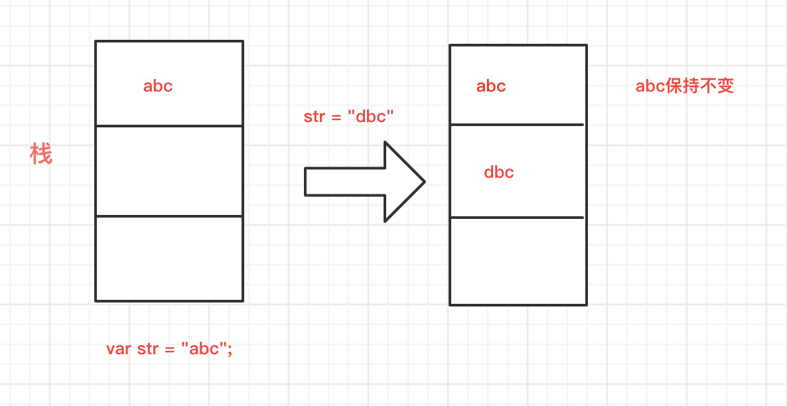

为什么要把基础类型的值设成不可变

1. 为了安全
   假设基础类型的值是可变的， 那么下面的代码会变得很奇怪

```plaintext
var strTest = "varaiable";
var fun = (str) => { str + "---ok" };
fun(strTest);
console.log(strTest) // varaiable---ok
// 可以看到strTest的值被改变了， 特别是在map之类的对象中更为显著  
var map = new Map()
var strTest = "t1";
map.set(strTest, 10);
strTest = "notT1";
map.get("t1"); // undefined;
map.get("notT1"); // 10
```

这样的代码容易造成更多的bug，特别是像java之类的多线程语言， 更有可能造成线程不安全的问题。

1. 为了共享
   实际上， 基础类型中， 值一样的变量是共享一个内存区域的。

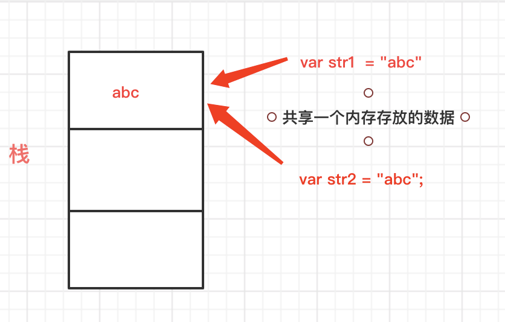

这样做的好处是避免额外的内存开销，提升效能。

当然， 这个前提是基础类型不可变， 不然如果str1的值变化了， str2的值也会跟着变化（实际上并没有对其操作）。


对象类型

V8中的对象（数组也是对象）存储相对来说比较复杂，他们是存放在堆里面的数据。并且格式大致如下:

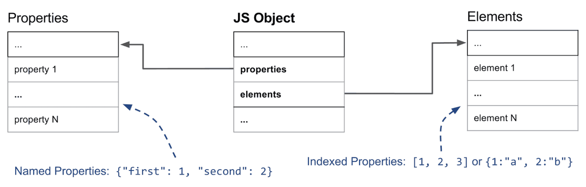

这和很多资料说的是用Map实现不同， 很明显， 根据上图（[来自v8的博客](https://v8.dev/blog/fast-properties)）,起码可以说明不是使用Map来处理的。

V8是把对象中的属性分成两类， 一类是字符常量， 一类是数字or数字字符串（如"1"这种），并分别放在了两个数组，Properties和Elements。

普通的字符常量

先从普通的字符常量说起， 字符常量的存放方式又细分为三类。

第一类： In-object

实际上， 在生成一个对象的时候， v8会给该对象留下一些空间以分配属性（数量由对象的初始大小预先确定），这些属性直接存储在对象本身上。这些是V8中最快的属性，因为无需任何间接访问即可访问它们，如下图：

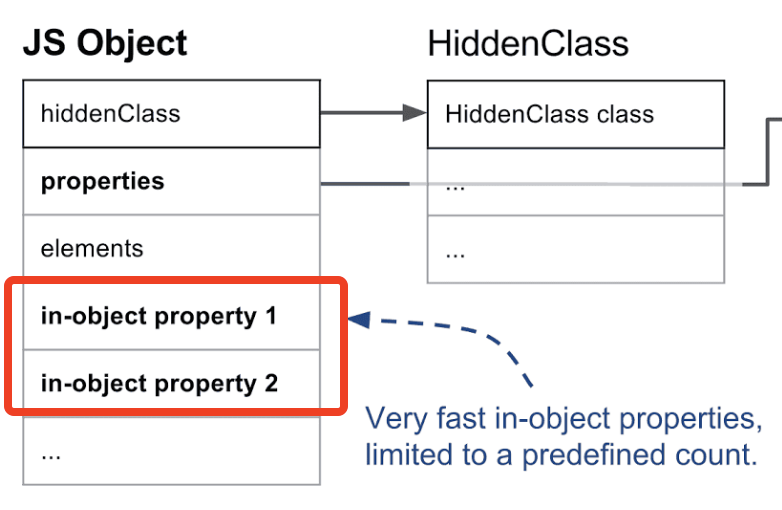

第二类： Fast properties

v8的In-object空间并不多，通过对象字面量创建的无属性对象分配 4 个对象内属性存储（inobject\_properties）空间。当这些空间被使用完之后， 即会通过HideClass(隐藏类，有些也叫Map，这里统一叫隐藏类)来协助完成属性的快速访问。

HiddenClasses and DescriptorArrays

HiddenClass存储有关对象的元信息，包括该对象上的属性数量以及对该对象原型的引用。除此之外，HiddenClasses里面还有一个DescriptorArrays数组， 该数组存储了对象属性的信息。

即如下图：

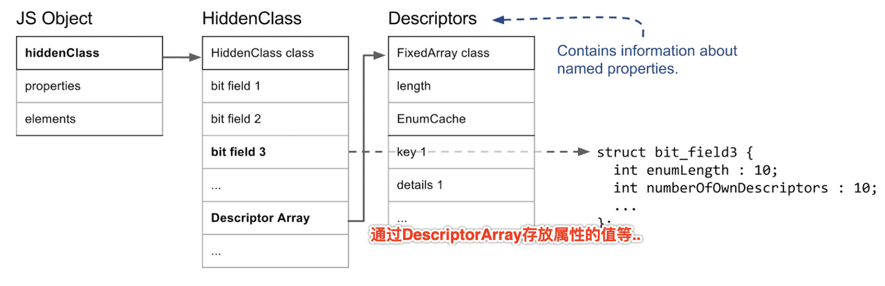

这里一般会有一个疑惑， 为什么需要一个隐藏类， 我直接搞一个hashTable不是更快吗？
关于隐藏类及ICs的概率， 推荐阅读这一篇文章[JavaScript 引擎基础：Shapes 和 Inline Caches](https://zhuanlan.zhihu.com/p/38202123), 概念清晰易懂，图文并茂。
这里简单说一下概念：
首先看下， 隐藏类是怎么来的

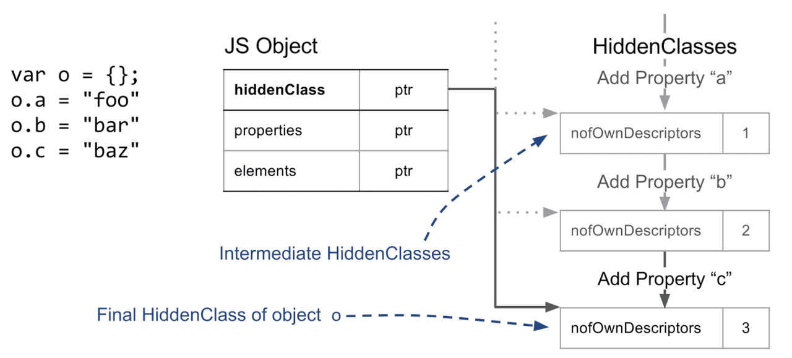

从图中可以看出， 隐藏类是通过一颗树来不断生成的，每添加一个属性都会新生成一个隐藏类节点（添加数组索引属性不会创建新的）， 然后呢， 具有相同结构（相同属性，顺序相同）的对象具有相同的隐藏类。也就是说， 如果在上面的代码中加一个代码如下：

```plaintext
var a = {};
a.a = "ddd";
var b = {};
b.a = "3";
b.b = "test";
```

那么a的隐藏类是右边的第一个nofOwnDescriptors， b是第二个。对于程序代码来说， 实际上很多对象都是拥有相同的隐藏类。而隐藏类背后的主要动机是 Inline Caches 或 ICs 的概念。ICs 是促使 JavaScript 快速运行的关键因素！JavaScript 引擎利用 ICs 来记忆去哪里寻找对象属性的信息，以减少昂贵的查找次数。

大致就是每次将代码编译成字节码并读取属性时，都会根据隐藏类把该属性的位置保存起来，在下一次读取或者遇到拥有相同隐藏类的对象读取时，可以根据隐藏类提供的属性位置直接读取，而避免查找过程。

第三类： Slow properties

最后一种方式即是字典存储方式。字典存储模式相对来说比较简单， 先看下官方提供的图：

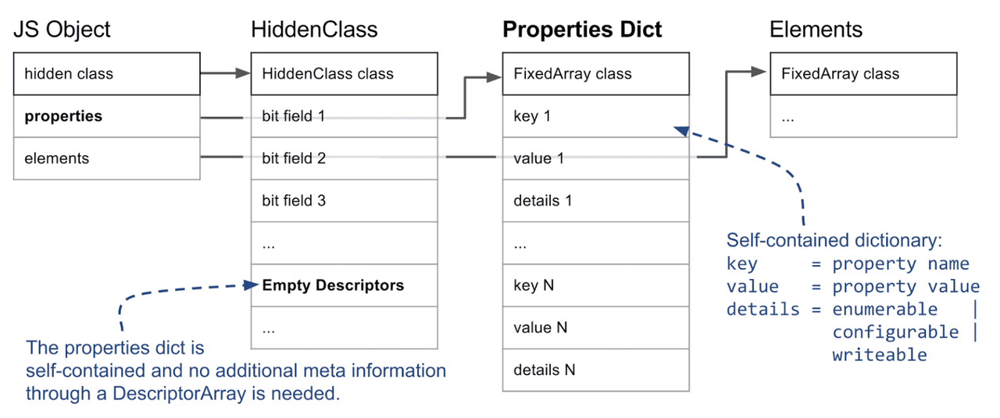

简单点说， 就是隐藏类里面的DescriptorArrays会直接置为空， 然后把属性的值和元信息直接存储在properties数组中，并通过hash的方式进行get和set。

既然上面说了拥有隐藏类可以带来效能的提升， 为什么还要提供字典方式？

v8的原文如下：

> However, if many properties get added and deleted from an object, it can generate a lot of time and memory overhead to maintain the descriptor array and HiddenClasses

大致意思是说，增加删除属性的操作过多会使用大量的时间和内存开销来维护descriptorArray 和 HiddenClasses。

最后， 什么时候是Fast properties（隐藏类）， 什么时候是slow properties(字典模式)?
关于这一方面，推荐该系列文章[奇技淫巧学 V8 之一，对象访问模式优化](https://zhuanlan.zhihu.com/p/28777722), 以下部分为引用 新创建的小对象为Fast properties。执行如下操作的时候会变成slow properties

1. 动态添加过多的属性

2. 删除属性（delete）

3. 删除非最后添加的属性（V8 >= 6.0）

数组类型

数组的话种类比较多， 按官方的话说多达20种类型。

实际上， 数组一般是放到了一开始提的elements数组里面， 然后按索引读值， 这个比较简单， 说下其中比较典型的两种。

1. 存在缺失的元素，会按原型链串上去拿值，实际上就是对象原型链..

```plaintext
const o = ['a', 'b', 'c'];
console.log(o[1]);          // Prints 'b'.
delete o[1];                // Introduces a hole in the elements store.
console.log(o[1]);          // Prints 'undefined'; property 1 does not exist.
o.
__proto__
 = {1: 'B'};     // Define property 1 on the prototype.
console.log(o[0]);          // Prints 'a'.
console.log(o[1]);          // Prints 'B'.
console.log(o[2]);          // Prints 'c'.
console.log(o[3]);          // Prints undefined
```

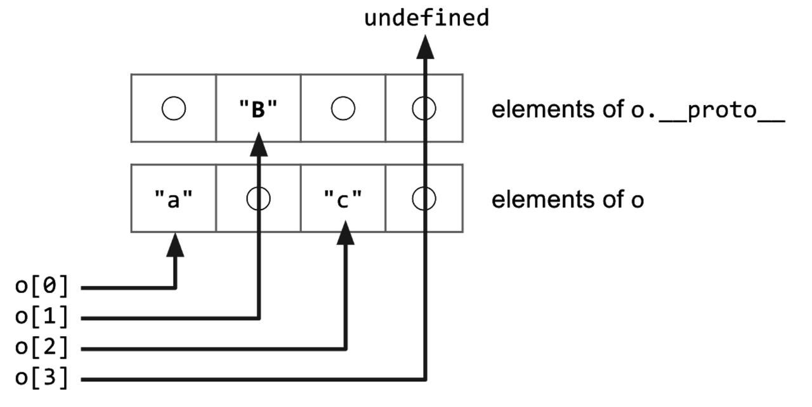

1. 稀疏数组， 如果存在这种情况， 那么elements会存在大量的内存没有使用， 所以v8优化成字典模式，也就是和上面的字符串一样。

```plaintext
const sparseArray = [];
sparseArray[9999] = 'foo'; // Creates an array with dictionary elements.
```

除此之外， v8还在数组上做了各种优化，如Gc等， 这里不赘述。


***

## 73. setTimeout 为什么不能保证能够及时执行？


**参考答案：**

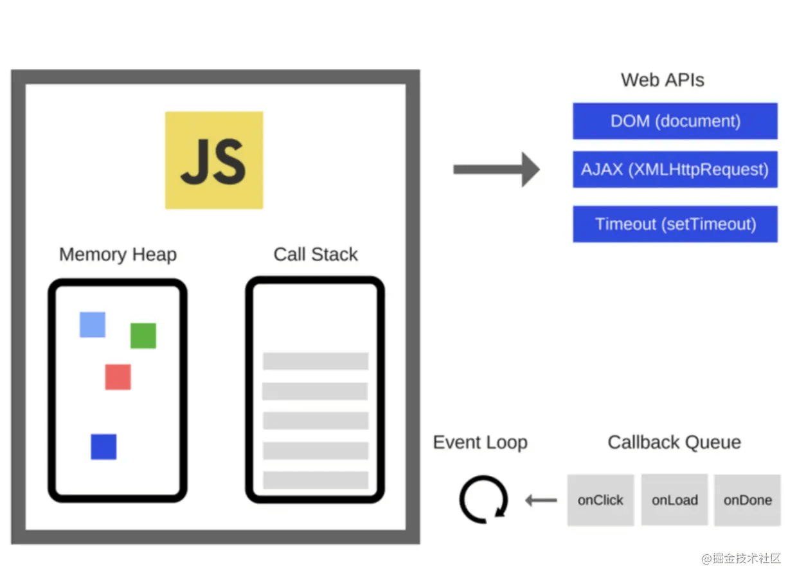

> 主线程从任务队列中读取事件，这个过程是循环不断的，所以整个的这种运行机制又称为Event Loop。

setTimeout 并不能保证执行的时间，是否及时执行取决于 JavaScript 线程是拥挤还是空闲。

浏览器的JS引擎遇到setTimeout，拿走之后不会立即放入异步队列，同步任务执行之后，timer模块会到设置时间之后放到异步队列中。js引擎发现同步队列中没有要执行的东西了，即运行栈空了就从异步队列中读取，然后放到运行栈中执行。所以setTimeout可能会多了等待线程的时间。

这时setTimeout函数体就变成了运行栈中的执行任务，运行栈空了，再监听异步队列中有没有要执行的任务，如果有就继续执行，如此循环，就叫Event Loop。


***

## 74. 说说对 TypeScript 中命名空间与模块的理解？区别？


**参考答案：**

一、模块

`TypeScript` 与` ECMAScript` 2015 一样，任何包含顶级 `import` 或者 `export` 的文件都被当成一个模块

相反地，如果一个文件不带有顶级的`import`或者`export`声明，那么它的内容被视为全局可见的

例如我们在在一个 `TypeScript` 工程下建立一个文件 `1.ts`，声明一个变量`a`，如下：

```javascript
const a = 1
```

然后在另一个文件同样声明一个变量`a`，这时候会出现错误信息

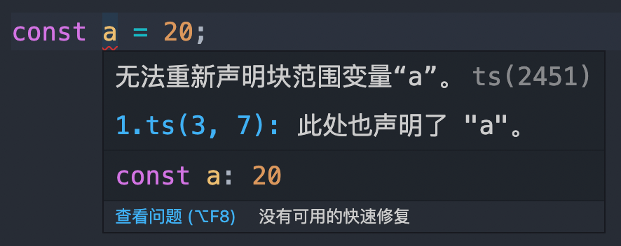

提示重复声明`a`变量，但是所处的空间是全局的

如果需要解决这个问题，则通过`import`或者`export`引入模块系统即可，如下：

```javascript
const a = 10;

export default a
```

在`typescript`中，`export`关键字可以导出变量或者类型，用法与`es6`模块一致，如下：

```javascript
export const a = 1
export type Person = {
    name: String
}
```

通过`import` 引入模块，如下：

```javascript
import { a, Person } from './export';
```


二、命名空间

命名空间一个最明确的目的就是解决重名问题

命名空间定义了标识符的可见范围，一个标识符可在多个名字空间中定义，它在不同名字空间中的含义是互不相干的

这样，在一个新的名字空间中可定义任何标识符，它们不会与任何已有的标识符发生冲突，因为已有的定义都处于其他名字空间中

`TypeScript` 中命名空间使用 `namespace` 来定义，语法格式如下：

```javascript
namespace SomeNameSpaceName {
   export interface ISomeInterfaceName {      }
   export class SomeClassName {      }
}
```

以上定义了一个命名空间 `SomeNameSpaceName`，如果我们需要在外部可以调用 `SomeNameSpaceName` 中的类和接口，则需要在类和接口添加 `export` 关键字

使用方式如下：

```javascript
SomeNameSpaceName.SomeClassName
```

命名空间本质上是一个对象，作用是将一系列相关的全局变量组织到一个对象的属性，如下：

```javascript
namespace Letter {
  export let a = 1;
  export let b = 2;
  export let c = 3;
  // ...
  export let z = 26;
}
```

编译成`js`如下：

```javascript
var Letter;
(function (Letter) {
    Letter.a = 1;
    Letter.b = 2;
    Letter.c = 3;
    // ...
    Letter.z = 26;
})(Letter || (Letter = {}));
```


三、区别

* 命名空间是位于全局命名空间下的一个普通的带有名字的 JavaScript 对象，使用起来十分容易。但就像其它的全局命名空间污染一样，它很难去识别组件之间的依赖关系，尤其是在大型的应用中

* 像命名空间一样，模块可以包含代码和声明。 不同的是模块可以声明它的依赖

* 在正常的TS项目开发过程中并不建议用命名空间，但通常在通过 d.ts 文件标记 js 库类型的时候使用命名空间，主要作用是给编译器编写代码的时候参考使用


***

## 75. 说说对受控组件和非受控组件的理解，以及应用场景？


**参考答案：**

一、受控组件

受控组件，简单来讲，就是受我们控制的组件，组件的状态全程响应外部数据

举个简单的例子：

```javascript
class TestComponent extends React.Component {
  constructor (props) {
    super(props);
    this.state = { username: 'lindaidai' };
  }
  render () {
    return <input name="username" value={this.state.username} />
  }
}
```

这时候当我们在输入框输入内容的时候，会发现输入的内容并无法显示出来，也就是`input`标签是一个可读的状态

这是因为`value`被`this.state.username`所控制住。当用户输入新的内容时，`this.state.username`并不会自动更新，这样的话`input`内的内容也就不会变了

如果想要解除被控制，可以为`input`标签设置`onChange`事件，输入的时候触发事件函数，在函数内部实现`state`的更新，从而导致`input`框的内容页发现改变

因此，受控组件我们一般需要初始状态和一个状态更新事件函数


二、非受控组件

非受控组件，简单来讲，就是不受我们控制的组件

一般情况是在初始化的时候接受外部数据，然后自己在内部存储其自身状态

当需要时，可以使用`ref` 查询 `DOM `并查找其当前值，如下：

```javascript
import React, { Component } from 'react';

export class UnControll extends Component {
  constructor (props) {
    super(props);
    this.inputRef = React.createRef();
  }
  handleSubmit = (e) => {
    console.log('我们可以获得input内的值为', this.inputRef.current.value);
    e.preventDefault();
  }
  render () {
    return (
      <form onSubmit={e => this.handleSubmit(e)}>
        <input defaultValue="lindaidai" ref={this.inputRef} />
        <input type="submit" value="提交" />
      </form>
    )
  }
}
```

关于`refs`的详情使用可以参考[之前文章](https://mp.weixin.qq.com/s/ZBKWcslVBi0IKQgz7lYzbA)


三、应用场景

大部分时候推荐使用受控组件来实现表单，因为在受控组件中，表单数据由`React`组件负责处理

如果选择非受控组件的话，控制能力较弱，表单数据就由`DOM`本身处理，但更加方便快捷，代码量少

针对两者的区别，其应用场景如下图所示：


***

## 76. 你在React项目中是如何使用Redux的? 项目结构是如何划分的？


**参考答案：**

一、背景

`redux`是用于数据状态管理，而`react`是一个视图层面的库

如果将两者连接在一起，可以使用官方推荐`react-redux`库，其具有高效且灵活的特性

`react-redux`将组件分成：

* 容器组件：存在逻辑处理

* UI 组件：只负责现显示和交互，内部不处理逻辑，状态由外部控制

通过`redux`将整个应用状态存储到`store`中，组件可以派发`dispatch`行为`action`给`store`

其他组件通过订阅`store`中的状态`state`来更新自身的视图


二、如何做

使用`react-redux`分成了两大核心：

* Provider

* connection


Provider

在`redux`中存在一个`store`用于存储`state`，如果将这个`store`存放在顶层元素中，其他组件都被包裹在顶层元素之上

那么所有的组件都能够受到`redux`的控制，都能够获取到`redux`中的数据

使用方式如下：

```javascript
1<Provider store = {store}>
    <App />
<Provider>
```


connection

`connect`方法将`store`上的`getState `和 `dispatch `包装成组件的`props`

导入`conect`如下：

```javascript
import { connect } from "react-redux";
```

用法如下：

```javascript
connect(mapStateToProps, mapDispatchToProps)(MyComponent)
```

可以传递两个参数：

* mapStateToProps

* mapDispatchToProps


mapStateToProps

把`redux`中的数据映射到`react`中的`props`中去

如下：

```javascript
const mapStateToProps = (state) => {
    return {
        // prop : state.xxx  | 意思是将state中的某个数据映射到props中
        foo: state.bar
    }
}
```

组件内部就能够通过`props`获取到`store`中的数据

```javascript
class Foo extends Component {
    constructor(props){
        super(props);
    }
    render(){
        return(
         // 这样子渲染的其实就是state.bar的数据了
            <div>this.props.foo</div>
        )
    }
}
Foo = connect()(Foo)
export default Foo
```


mapDispatchToProps

将`redux`中的`dispatch`映射到组件内部的`props`中

```javascript
const mapDispatchToProps = (dispatch) => { // 默认传递参数就是dispatch
  return {
    onClick: () => {
      dispatch({
        type: 'increatment'
      });
    }
  };
}
```

```javascript
class Foo extends Component {
    constructor(props){
        super(props);
    }
    render(){
        return(
         
             <button onClick = {this.props.onClick}>点击increase</button>
        )
    }
}
Foo = connect()(Foo);
export default Foo;
```


小结

整体流程图大致如下所示：

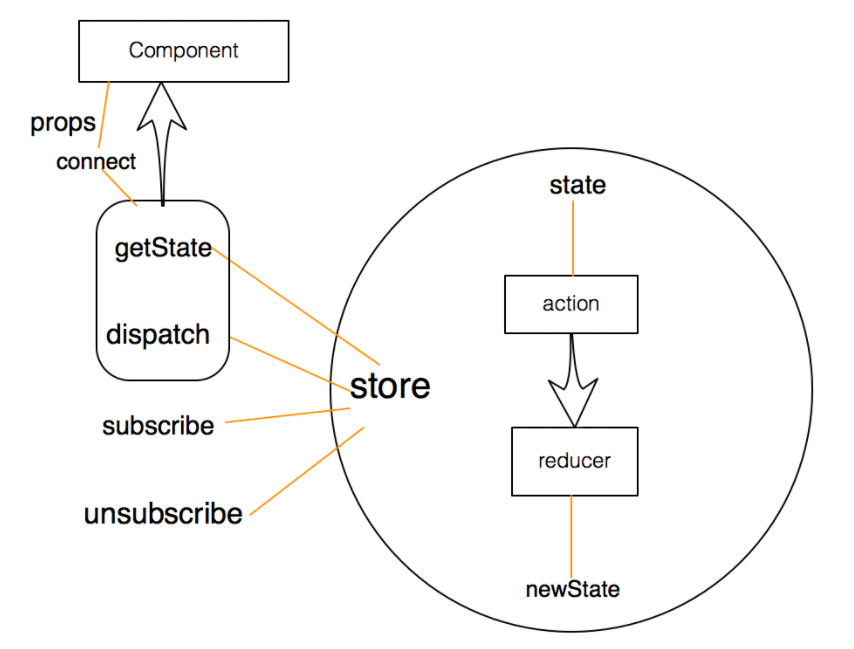


三、项目结构

可以根据项目具体情况进行选择，以下列出两种常见的组织结构


按角色组织（MVC）

角色如下：

* reducers

* actions

* components

* containers

参考如下：

```javascript
reducers/
  todoReducer.js
  filterReducer.js
actions/
  todoAction.js
  filterActions.js
components/
  todoList.js
  todoItem.js
  filter.js
containers/
  todoListContainer.js
  todoItemContainer.js
  filterContainer.js
```


按功能组织

使用`redux`使用功能组织项目，也就是把完成同一应用功能的代码放在一个目录下，一个应用功能包含多个角色的代码

`Redux`中，不同的角色就是`reducer`、`actions`和视图，而应用功能对应的就是用户界面的交互模块

参考如下：

```javascript
todoList/
  actions.js
  actionTypes.js
  index.js
  reducer.js
  views/
    components.js
    containers.js
filter/
  actions.js
  actionTypes.js
  index.js
  reducer.js
  views/
    components.js
    container.js
```

每个功能模块对应一个目录，每个目录下包含同样的角色文件：

* actionTypes.js 定义action类型

* actions.js 定义action构造函数

* reducer.js 定义这个功能模块如果响应actions.js定义的动作

* views 包含功能模块中所有的React组件，包括展示组件和容器组件

* index.js 把所有的角色导入，统一导出

其中`index`模块用于导出对外的接口

```javascript
import * as actions from './actions.js';
import reducer from './reducer.js';
import view from './views/container.js';

export { actions, reducer, view };
```

导入方法如下：

```javascript
import { actions, reducer, view as TodoList } from './xxxx'
```


***

## 77. 说说对Redux中间件的理解？常用的中间件有哪些？实现原理？


**参考答案：**

一、是什么

中间件（Middleware）是介于应用系统和系统软件之间的一类软件，它使用系统软件所提供的基础服务（功能），衔接网络上应用系统的各个部分或不同的应用，能够达到资源共享、功能共享的目的

在上篇文章中，了解到了`Redux`整个工作流程，当`action`发出之后，`reducer`立即算出`state`，整个过程是一个同步的操作

那么如果需要支持异步操作，或者支持错误处理、日志监控，这个过程就可以用上中间件

`Redux`中，中间件就是放在就是在`dispatch`过程，在分发`action`进行拦截处理，如下图：


其本质上一个函数，对`store.dispatch`方法进行了改造，在发出 `Action `和执行 `Reducer `这两步之间，添加了其他功能


二、常用的中间件

有很多优秀的`redux`中间件，如：

* redux-thunk：用于异步操作

* redux-logger：用于日志记录

上述的中间件都需要通过`applyMiddlewares`进行注册，作用是将所有的中间件组成一个数组，依次执行

然后作为第二个参数传入到`createStore`中

```javascript
const store = createStore(
  reducer,
  applyMiddleware(thunk, logger)
);
```


redux-thunk

`redux-thunk`是官网推荐的异步处理中间件

默认情况下的`dispatch(action)`，`action`需要是一个`JavaScript`的对象

`redux-thunk`中间件会判断你当前传进来的数据类型，如果是一个函数，将会给函数传入参数值（dispatch，getState）

* dispatch函数用于我们之后再次派发action

* getState函数考虑到我们之后的一些操作需要依赖原来的状态，用于让我们可以获取之前的一些状态

所以`dispatch`可以写成下述函数的形式：

```javascript
const getHomeMultidataAction = () => {
  return (dispatch) => {
    axios.get("http://xxx.xx.xx.xx/test").then(res => {
      const data = res.data.data;
      dispatch(changeBannersAction(data.banner.list));
      dispatch(changeRecommendsAction(data.recommend.list));
    })
  }
}
```


redux-logger

如果想要实现一个日志功能，则可以使用现成的`redux-logger`

```javascript
import { applyMiddleware, createStore } from 'redux';
import createLogger from 'redux-logger';
const logger = createLogger();

const store = createStore(
  reducer,
  applyMiddleware(logger)
);
```

这样我们就能简单通过中间件函数实现日志记录的信息


三、实现原理

首先看看`applyMiddlewares`的源码

```javascript
export default function applyMiddleware(...middlewares) {
  return (createStore) => (reducer, preloadedState, enhancer) => {
    var store = createStore(reducer, preloadedState, enhancer);
    var dispatch = store.dispatch;
    var chain = [];

    var middlewareAPI = {
      getState: store.getState,
      dispatch: (action) => dispatch(action)
    };
    chain = middlewares.map(middleware => middleware(middlewareAPI));
    dispatch = compose(...chain)(store.dispatch);

    return {...store, dispatch}
  }
}
```

所有中间件被放进了一个数组`chain`，然后嵌套执行，最后执行`store.dispatch`。可以看到，中间件内部（`middlewareAPI`）可以拿到`getState`和`dispatch`这两个方法

在上面的学习中，我们了解到了`redux-thunk`的基本使用

内部会将`dispatch`进行一个判断，然后执行对应操作，原理如下：

```javascript
function patchThunk(store) {
    let next = store.dispatch;

    function dispatchAndThunk(action) {
        if (typeof action === "function") {
            action(store.dispatch, store.getState);
        } else {
            next(action);
        }
    }

    store.dispatch = dispatchAndThunk;
}
```

实现一个日志输出的原理也非常简单，如下：

```javascript
let next = store.dispatch;

function dispatchAndLog(action) {
  console.log("dispatching:", addAction(10));
  next(addAction(5));
  console.log("新的state:", store.getState());
}

store.dispatch = dispatchAndLog;
```


***

## 78. 说说你对Redux的理解？其工作原理？


**参考答案：**

一、是什么

`React`是用于构建用户界面的，帮助我们解决渲染`DOM`的过程

而在整个应用中会存在很多个组件，每个组件的`state`是由自身进行管理，包括组件定义自身的`state`、组件之间的通信通过`props`传递、使用`Context`实现数据共享

如果让每个组件都存储自身相关的状态，理论上来讲不会影响应用的运行，但在开发及后续维护阶段，我们将花费大量精力去查询状态的变化过程

这种情况下，如果将所有的状态进行集中管理，当需要更新状态的时候，仅需要对这个管理集中处理，而不用去关心状态是如何分发到每一个组件内部的

`redux`就是一个实现上述集中管理的容器，遵循三大基本原则：

* 单一数据源

* state 是只读的

* 使用纯函数来执行修改

注意的是，`redux`并不是只应用在`react`中，还与其他界面库一起使用，如`Vue`


二、工作原理

`redux `要求我们把数据都放在 `store `公共存储空间

一个组件改变了 `store` 里的数据内容，其他组件就能感知到 `store `的变化，再来取数据，从而间接的实现了这些数据传递的功能

工作流程图如下所示：


根据流程图，可以想象，`React Components` 是借书的用户， `Action Creactor` 是借书时说的话(借什么书)， `Store` 是图书馆管理员，`Reducer` 是记录本(借什么书，还什么书，在哪儿，需要查一下)， `state` 是书籍信息

整个流程就是借书的用户需要先存在，然后需要借书，需要一句话来描述借什么书，图书馆管理员听到后需要查一下记录本，了解图书的位置，最后图书馆管理员会把这本书给到这个借书人

转换为代码是，`React Components` 需要获取一些数据, 然后它就告知 `Store` 需要获取数据，这就是就是 `Action Creactor` , `Store` 接收到之后去 `Reducer` 查一下， `Reducer` 会告诉 `Store` 应该给这个组件什么数据


三、如何使用

创建一个`store`的公共数据区域

```javascript
import { createStore } from 'redux' // 引入一个第三方的方法
const store = createStore() // 创建数据的公共存储区域（管理员）
```

还需要创建一个记录本去辅助管理数据，也就是`reduecer`，本质就是一个函数，接收两个参数`state`，`action`，返回`state`

```javascript
// 设置默认值
const initialState = {
  counter: 0
}

const reducer = (state = initialState, action) => {
}
```

然后就可以将记录本传递给`store`，两者建立连接。如下：

```javascript
const store = createStore(reducer)
```

如果想要获取`store`里面的数据，则通过`store.getState()`来获取当前`state`

```javascript
console.log(store.getState());
```

下面再看看如何更改`store`里面数据，是通过`dispatch`来派发`action`，通常`action`中都会有`type`属性，也可以携带其他的数据

```javascript
store.dispatch({
  type: "INCREMENT"
})

store.dispath({
  type: "DECREMENT"
})

store.dispatch({
  type: "ADD_NUMBER",
  number: 5
})
```

下面再来看看修改`reducer`中的处理逻辑：

```javascript
const reducer = (state = initialState, action) => {
  switch (action.type) {
    case "INCREMENT":
      return {...state, counter: state.counter + 1};
    case "DECREMENT":
      return {...state, counter: state.counter - 1};
    case "ADD_NUMBER":
      return {...state, counter: state.counter + action.number}
    default: 
      return state;
  }
}
```

注意，`reducer`是一个纯函数，不需要直接修改`state`

这样派发`action`之后，既可以通过`store.subscribe`监听`store`的变化，如下：

```javascript
store.subscribe(() => {
  console.log(store.getState());
})
```

在`React`项目中，会搭配`react-redux`进行使用

完整代码如下：

```javascript
const redux = require('redux');

const initialState = {
  counter: 0
}

// 创建reducer
const reducer = (state = initialState, action) => {
  switch (action.type) {
    case "INCREMENT":
      return {...state, counter: state.counter + 1};
    case "DECREMENT":
      return {...state, counter: state.counter - 1};
    case "ADD_NUMBER":
      return {...state, counter: state.counter + action.number}
    default: 
      return state;
  }
}

// 根据reducer创建store
const store = redux.createStore(reducer);

store.subscribe(() => {
  console.log(store.getState());
})

// 修改store中的state
store.dispatch({
  type: "INCREMENT"
})
// console.log(store.getState());

store.dispatch({
  type: "DECREMENT"
})
// console.log(store.getState());

store.dispatch({
  type: "ADD_NUMBER",
  number: 5
})
// console.log(store.getState());
```


小结

* createStore可以帮助创建 store

* store.dispatch 帮助派发 action , action 会传递给 store

* store.getState 这个方法可以帮助获取 store 里边所有的数据内容

* store.subscrible 方法订阅 store 的改变，只要 store 发生改变， store.subscrible 这个函数接收的这个回调函数就会被执行


***

## 79. 说说你对immutable的理解？如何应用在react项目中？


**参考答案：**


一、是什么

Immutable，不可改变的，在计算机中，即指一旦创建，就不能再被更改的数据

对 `Immutable `对象的任何修改或添加删除操作都会返回一个新的 `Immutable `对象

`Immutable` 实现的原理是 `Persistent Data Structure`（持久化数据结构）:

* 用一种数据结构来保存数据

* 当数据被修改时，会返回一个对象，但是新的对象会尽可能的利用之前的数据结构而不会对内存造成浪费

也就是使用旧数据创建新数据时，要保证旧数据同时可用且不变，同时为了避免 `deepCopy `把所有节点都复制一遍带来的性能损耗，`Immutable` 使用了 `Structural Sharing`（结构共享）

如果对象树中一个节点发生变化，只修改这个节点和受它影响的父节点，其它节点则进行共享


二、如何使用

使用`Immutable`对象最主要的库是`immutable.js`

immutable.js 是一个完全独立的库，无论基于什么框架都可以用它

其出现场景在于弥补 Javascript 没有不可变数据结构的问题，通过 structural sharing来解决的性能问题

内部提供了一套完整的 Persistent Data Structure，还有很多易用的数据类型，如`Collection`、`List`、`Map`、`Set`、`Record`、`Seq`，其中：

* List: 有序索引集，类似 JavaScript 中的 Array

* Map: 无序索引集，类似 JavaScript 中的 Object

* Set: 没有重复值的集合

主要的方法如下：

* fromJS()：将一个js数据转换为Immutable类型的数据

```javascript
const obj = Immutable.fromJS({a:'123',b:'234'})
```

* toJS()：将一个Immutable数据转换为JS类型的数据

* is()：对两个对象进行比较

```javascript
import { Map, is } from 'immutable'
const map1 = Map({ a: 1, b: 1, c: 1 })
const map2 = Map({ a: 1, b: 1, c: 1 })
map1 === map2   //false
Object.is(map1, map2) // false
is(map1, map2) // true
```

* get(key)：对数据或对象取值

* getIn(\[]) ：对嵌套对象或数组取值，传参为数组，表示位置

```javascript
let abs = Immutable.fromJS({a: {b:2}});
abs.getIn(['a', 'b']) // 2
abs.getIn(['a', 'c']) // 子级没有值

let arr = Immutable.fromJS([1 ,2, 3, {a: 5}]);
arr.getIn([3, 'a']); // 5
arr.getIn([3, 'c']); // 子级没有值
```

如下例子：使用方法如下：

```javascript
import Immutable from 'immutable';
foo = Immutable.fromJS({a: {b: 1}});
bar = foo.setIn(['a', 'b'], 2);   // 使用 setIn 赋值
console.log(foo.getIn(['a', 'b']));  // 使用 getIn 取值，打印 1
console.log(foo === bar);  //  打印 false
```

如果换到原生的`js`，则对应如下：

```javascript
let foo = {a: {b: 1}};
let bar = foo;
bar.a.b = 2;
console.log(foo.a.b);  // 打印 2
console.log(foo === bar);  //  打印 true
```


三、在React中应用

使用 `Immutable `可以给 `React` 应用带来性能的优化，主要体现在减少渲染的次数

在做`react`性能优化的时候，为了避免重复渲染，我们会在`shouldComponentUpdate()`中做对比，当返回`true`执行`render`方法

`Immutable`通过`is`方法则可以完成对比，而无需像一样通过深度比较的方式比较

在使用`redux`过程中也可以结合`Immutable`，不使用`Immutable`前修改一个数据需要做一个深拷贝

```javascript
import '_' from 'lodash';

const Component = React.createClass({
  getInitialState() {
    return {
      data: { times: 0 }
    }
  },
  handleAdd() {
    let data = _.cloneDeep(this.state.data);
    data.times = data.times + 1;
    this.setState({ data: data });
  }
}
```

使用 Immutable 后：

```javascript
getInitialState() {
  return {
    data: Map({ times: 0 })
  }
},
  handleAdd() {
    this.setState({ data: this.state.data.update('times', v => v + 1) });
    // 这时的 times 并不会改变
    console.log(this.state.data.get('times'));
  }
```

同理，在`redux`中也可以将数据进行`fromJS`处理

```javascript
import * as constants from './constants'
import {fromJS} from 'immutable'
const defaultState = fromJS({ //将数据转化成immutable数据
    home:true,
    focused:false,
    mouseIn:false,
    list:[],
    page:1,
    totalPage:1
})
export default(state=defaultState,action)=>{
    switch(action.type){
        case constants.SEARCH_FOCUS:
            return state.set('focused',true) //更改immutable数据
        case constants.CHANGE_HOME_ACTIVE:
            return state.set('home',action.value)
        case constants.SEARCH_BLUR:
            return state.set('focused',false)
        case constants.CHANGE_LIST:
            // return state.set('list',action.data).set('totalPage',action.totalPage)
            //merge效率更高，执行一次改变多个数据
            return state.merge({
                list:action.data,
                totalPage:action.totalPage
            })
        case constants.MOUSE_ENTER:
            return state.set('mouseIn',true)
        case constants.MOUSE_LEAVE:
            return state.set('mouseIn',false)
        case constants.CHANGE_PAGE:
            return state.set('page',action.page)
        default:
            return state
    }
}
```


***

## 80. 说说React Jsx转换成真实DOM过程？


**参考答案：**

一、是什么

`react`通过将组件编写的`JSX`映射到屏幕，以及组件中的状态发生了变化之后 `React`会将这些「变化」更新到屏幕上

在前面文章了解中，`JSX`通过`babel`最终转化成`React.createElement`这种形式，例如：

```javascript
<div>
  
  <Hello />
</div>
```

会被`babel`转化成如下：

```javascript
React.createElement(
  "div",
  null,
  React.createElement("img", {
    src: "avatar.png",
    className: "profile"
  }),
  React.createElement(Hello, null)
);
```

在转化过程中，`babel`在编译时会判断 JSX 中组件的首字母：

* 当首字母为小写时，其被认定为原生 `DOM` 标签，`createElement` 的第一个变量被编译为字符串

* 当首字母为大写时，其被认定为自定义组件，createElement 的第一个变量被编译为对象

最终都会通过`RenderDOM.render(...)`方法进行挂载，如下：

```javascript
ReactDOM.render(<App />,  document.getElementById("root"));
```


二、过程

在`react`中，节点大致可以分成四个类别：

* 原生标签节点

* 文本节点

* 函数组件

* 类组件

如下所示：

```javascript
class ClassComponent extends Component {
  static defaultProps = {
    color: "pink"
  };
  render() {
    return (
      <div className="border">
        <h3>ClassComponent</h3>
        <p className={this.props.color}>{this.props.name}</p >
      </div>
    );
  }
}

function FunctionComponent(props) {
  return (
    <div className="border">
      FunctionComponent
      <p>{props.name}</p >
    </div>
  );
}

const jsx = (
  <div className="border">
    <p>xx</p >
    < a href=" ">xxx</ a>
    <FunctionComponent name="函数组件" />
    <ClassComponent name="类组件" color="red" />
  </div>
);
```

这些类别最终都会被转化成`React.createElement`这种形式

`React.createElement`其被调用时会传⼊标签类型`type`，标签属性`props`及若干子元素`children`，作用是生成一个虚拟`Dom`对象，如下所示：

```javascript
function createElement(type, config, ...children) {
    if (config) {
        delete config.__self;
        delete config.__source;
    }
    // ! 源码中做了详细处理，⽐如过滤掉key、ref等
    const props = {
        ...config,
        children: children.map(child =>
   typeof child === "object" ? child : createTextNode(child)
  )
    };
    return {
        type,
        props
    };
}
function createTextNode(text) {
    return {
        type: TEXT,
        props: {
            children: [],
            nodeValue: text
        }
    };
}
export default {
    createElement
};
```

`createElement`会根据传入的节点信息进行一个判断：

* 如果是原生标签节点， type 是字符串，如div、span

* 如果是文本节点， type就没有，这里是 TEXT

* 如果是函数组件，type 是函数名

* 如果是类组件，type 是类名

虚拟`DOM`会通过`ReactDOM.render`进行渲染成真实`DOM`，使用方法如下：

```javascript
ReactDOM.render(element, container[, callback])
```

当首次调用时，容器节点里的所有 `DOM` 元素都会被替换，后续的调用则会使用 `React` 的 `diff`算法进行高效的更新

如果提供了可选的回调函数`callback`，该回调将在组件被渲染或更新之后被执行

`render`大致实现方法如下：

```javascript
function render(vnode, container) {
    console.log("vnode", vnode); // 虚拟DOM对象
    // vnode _> node
    const node = createNode(vnode, container);
    container.appendChild(node);
}

// 创建真实DOM节点
function createNode(vnode, parentNode) {
    let node = null;
    const {type, props} = vnode;
    if (type === TEXT) {
        node = document.createTextNode("");
    } else if (typeof type === "string") {
        node = document.createElement(type);
    } else if (typeof type === "function") {
        node = type.isReactComponent
            ? updateClassComponent(vnode, parentNode)
        : updateFunctionComponent(vnode, parentNode);
    } else {
        node = document.createDocumentFragment();
    }
    reconcileChildren(props.children, node);
    updateNode(node, props);
    return node;
}

// 遍历下子vnode，然后把子vnode->真实DOM节点，再插入父node中
function reconcileChildren(children, node) {
    for (let i = 0; i < children.length; i++) {
        let child = children[i];
        if (Array.isArray(child)) {
            for (let j = 0; j < child.length; j++) {
                render(child[j], node);
            }
        } else {
            render(child, node);
        }
    }
}
function updateNode(node, nextVal) {
    Object.keys(nextVal)
        .filter(k => k !== "children")
        .forEach(k => {
        if (k.slice(0, 2) === "on") {
            let eventName = k.slice(2).toLocaleLowerCase();
            node.addEventListener(eventName, nextVal[k]);
        } else {
            node[k] = nextVal[k];
        }
    });
}

// 返回真实dom节点
// 执行函数
function updateFunctionComponent(vnode, parentNode) {
    const {type, props} = vnode;
    let vvnode = type(props);
    const node = createNode(vvnode, parentNode);
    return node;
}

// 返回真实dom节点
// 先实例化，再执行render函数
function updateClassComponent(vnode, parentNode) {
    const {type, props} = vnode;
    let cmp = new type(props);
    const vvnode = cmp.render();
    const node = createNode(vvnode, parentNode);
    return node;
}
export default {
    render
};
```


三、总结

在`react`源码中，虚拟`Dom`转化成真实`Dom`整体流程如下图所示：


其渲染流程如下所示：

* 使用React.createElement或JSX编写React组件，实际上所有的 JSX 代码最后都会转换成React.createElement(...) ，Babel帮助我们完成了这个转换的过程。

* createElement函数对key和ref等特殊的props进行处理，并获取defaultProps对默认props进行赋值，并且对传入的孩子节点进行处理，最终构造成一个虚拟DOM对象

* ReactDOM.render将生成好的虚拟DOM渲染到指定容器上，其中采用了批处理、事务等机制并且对特定浏览器进行了性能优化，最终转换为真实DOM


***

## 81. 说说你在React项目是如何捕获错误的？


**参考答案：**

一、是什么

错误在我们日常编写代码是非常常见的

举个例子，在`react`项目中去编写组件内`JavaScript`代码错误会导致 `React` 的内部状态被破坏，导致整个应用崩溃，这是不应该出现的现象

作为一个框架，`react`也有自身对于错误的处理的解决方案

二、如何做

为了解决出现的错误导致整个应用崩溃的问题，`react16`引用了错误边界新的概念

错误边界是一种 `React` 组件，这种组件可以捕获发生在其子组件树任何位置的 `JavaScript` 错误，并打印这些错误，同时展示降级 `UI`，而并不会渲染那些发生崩溃的子组件树

错误边界在渲染期间、生命周期方法和整个组件树的构造函数中捕获错误

形成错误边界组件的两个条件：

* 使用了 static getDerivedStateFromError()

* 使用了 componentDidCatch()

抛出错误后，请使用 `static getDerivedStateFromError()` 渲染备用 UI ，使用 `componentDidCatch()` 打印错误信息，如下：

```javascript
class ErrorBoundary extends React.Component {
  constructor(props) {
    super(props);
    this.state = { hasError: false };
  }

  static getDerivedStateFromError(error) {
    // 更新 state 使下一次渲染能够显示降级后的 UI
    return { hasError: true };
  }

  componentDidCatch(error, errorInfo) {
    // 你同样可以将错误日志上报给服务器
    logErrorToMyService(error, errorInfo);
  }

  render() {
    if (this.state.hasError) {
      // 你可以自定义降级后的 UI 并渲染
      return <h1>Something went wrong.</h1>;
    }

    return this.props.children; 
  }
}
```

然后就可以把自身组件的作为错误边界的子组件，如下：

```javascript
<ErrorBoundary>
  <MyWidget />
</ErrorBoundary>
```

下面这些情况无法捕获到异常：

* 事件处理

* 异步代码

* 服务端渲染

* 自身抛出来的错误

在`react 16`版本之后，会把渲染期间发生的所有错误打印到控制台

除了错误信息和 JavaScript 栈外，React 16 还提供了组件栈追踪。现在你可以准确地查看发生在组件树内的错误信息：


可以看到在错误信息下方文字中存在一个组件栈，便于我们追踪错误

对于错误边界无法捕获的异常，如事件处理过程中发生问题并不会捕获到，是因为其不会在渲染期间触发，并不会导致渲染时候问题

这种情况可以使用`js`的`try...catch...`语法，如下：

```javascript
class MyComponent extends React.Component {
  constructor(props) {
    super(props);
    this.state = { error: null };
    this.handleClick = this.handleClick.bind(this);
  }

  handleClick() {
    try {
      // 执行操作，如有错误则会抛出
    } catch (error) {
      this.setState({ error });
    }
  }

  render() {
    if (this.state.error) {
      return <h1>Caught an error.</h1>
    }
    return <button onClick={this.handleClick}>Click Me</button>
  }
}
```

除此之外还可以通过监听`onerror`事件

```javascript
window.addEventListener('error', function(event) { ... })
```


***

## 82. 说说React服务端渲染怎么做？原理是什么？


**参考答案：**

一、是什么

服务端渲染（`Server-Side Rendering` ，简称`SSR`），指由服务侧完成页面的 `HTML` 结构拼接的页面处理技术，发送到浏览器，然后为其绑定状态与事件，成为完全可交互页面的过程

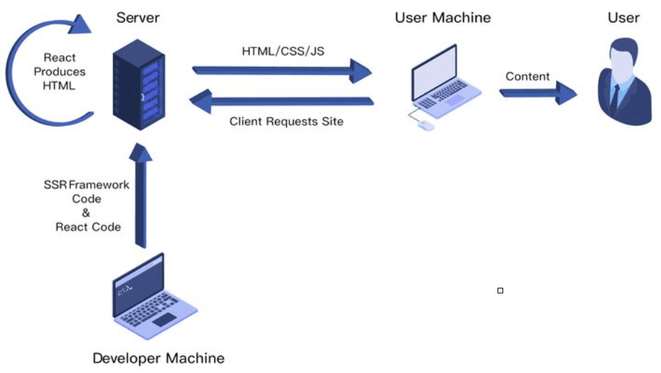

其解决的问题主要有两个：

* SEO，由于搜索引擎爬虫抓取工具可以直接查看完全渲染的页面

* 加速首屏加载，解决首屏白屏问题


二、如何做

在`react`中，实现`SSR`主要有两种形式：

* 手动搭建一个 SSR 框架

* 使用成熟的SSR 框架，如 Next.JS

这里主要以手动搭建一个`SSR`框架进行实现

首先通过`express`启动一个`app.js`文件，用于监听3000端口的请求，当请求根目录时，返回`HTML`，如下：

```javascript
const express = require('express')
const app = express()
app.get('/', (req,res) => res.send(`
<html>
   <head>
       <title>ssr demo</title>
   </head>
   <body>
       Hello world
   </body>
</html>
`))

app.listen(3000, () => console.log('Exampleapp listening on port 3000!'))
```

然后再服务器中编写`react`代码，在`app.js`中进行应引用

```javascript
import React from 'react'

const Home = () =>{

    return <div>home</div>

}

export default Home
```

为了让服务器能够识别`JSX`，这里需要使用`webpakc`对项目进行打包转换，创建一个配置文件`webpack.server.js`并进行相关配置，如下：

```javascript
const path = require('path')    //node的path模块
const nodeExternals = require('webpack-node-externals')

module.exports = {
    target:'node',
    mode:'development',           //开发模式
    entry:'./app.js',             //入口
    output: {                     //打包出口
        filename:'bundle.js',     //打包后的文件名
        path:path.resolve(__dirname,'build')    //存放到根目录的build文件夹
    },
    externals: [nodeExternals()],  //保持node中require的引用方式
    module: {
        rules: [{                  //打包规则
           test:   /\.js?$/,       //对所有js文件进行打包
           loader:'babel-loader',  //使用babel-loader进行打包
           exclude: /node_modules/,//不打包node_modules中的js文件
           options: {
               presets: ['react','stage-0',['env', { 
                                  //loader时额外的打包规则,对react,JSX，ES6进行转换
                    targets: {
                        browsers: ['last 2versions']   //对主流浏览器最近两个版本进行兼容
                    }
               }]]
           }
       }]
    }
}
```

接着借助`react-dom`提供了服务端渲染的 `renderToString`方法，负责把`React`组件解析成`html`

```javascript
import express from 'express'
import React from 'react'//引入React以支持JSX的语法
import { renderToString } from 'react-dom/server'//引入renderToString方法
import Home from'./src/containers/Home'

const app= express()
const content = renderToString(<Home/>)
app.get('/',(req,res) => res.send(`
<html>
   <head>
       <title>ssr demo</title>
   </head>
   <body>
        ${content}
   </body>
</html>
`))

app.listen(3001, () => console.log('Exampleapp listening on port 3001!'))
```

上面的过程中，已经能够成功将组件渲染到了页面上

但是像一些事件处理的方法，是无法在服务端完成，因此需要将组件代码在浏览器中再执行一遍，这种服务器端和客户端共用一套代码的方式就称之为同构

通俗讲，“同构”就是一套React代码在服务器上运行一遍，到达浏览器又运行一遍：

* 服务端渲染完成页面结构

* 浏览器端渲染完成事件绑定

浏览器实现事件绑定的方式为让浏览器去拉取`JS`文件执行，让`JS`代码来控制，因此需要引入`script`标签

通过`script`标签为页面引入客户端执行的`react`代码，并通过`express`的`static`中间件为`js`文件配置路由，修改如下：

```javascript
1import express from 'express'import express from 'express'
import React from 'react'//引入React以支持JSX的语法
import { renderToString } from'react-dom/server'//引入renderToString方法
import Home from './src/containers/Home'
 
const app = express()
app.use(express.static('public'));
//使用express提供的static中间件,中间件会将所有静态文件的路由指向public文件夹
 const content = renderToString(<Home/>)
 
app.get('/',(req,res)=>res.send(`
<html>
   <head>
       <title>ssr demo</title>
   </head>
   <body>
        ${content}
   <script src="/index.js"></script>
   </body>
</html>
`))

 app.listen(3001, () =>console.log('Example app listening on port 3001!'))
```

然后再客户端执行以下`react`代码，新建`webpack.client.js`作为客户端React代码的`webpack`配置文件如下：

```javascript
const path = require('path')                    //node的path模块

module.exports = {
    mode:'development',                         //开发模式
    entry:'./src/client/index.js',              //入口
    output: {                                   //打包出口
        filename:'index.js',                    //打包后的文件名
        path:path.resolve(__dirname,'public')   //存放到根目录的build文件夹
    },
    module: {
        rules: [{                               //打包规则
           test:   /\.js?$/,                    //对所有js文件进行打包
           loader:'babel-loader',               //使用babel-loader进行打包
           exclude: /node_modules/,             //不打包node_modules中的js文件
           options: {
               presets: ['react','stage-0',['env', {     
                    //loader时额外的打包规则,这里对react,JSX进行转换
                    targets: {
                        browsers: ['last 2versions']   //对主流浏览器最近两个版本进行兼容
                    }
               }]]
           }
       }]
    }
}
```

这种方法就能够简单实现首页的`react`服务端渲染，过程对应如下图：


在做完初始渲染的时候，一个应用会存在路由的情况，配置信息如下：

```javascript
import React from 'react'                   //引入React以支持JSX
import { Route } from 'react-router-dom'    //引入路由
import Home from './containers/Home'        //引入Home组件

export default (
    <div>
        <Route path="/" exact component={Home}></Route>
    </div>
)
```

然后可以通过`index.js`引用路由信息，如下：

```javascript
import React from 'react'
import ReactDom from 'react-dom'
import { BrowserRouter } from'react-router-dom'
import Router from'../Routers'

const App= () => {
    return (
        <BrowserRouter>
           {Router}
        </BrowserRouter>
    )
}

ReactDom.hydrate(<App/>, document.getElementById('root'))
```

这时候控制台会存在报错信息，原因在于每个`Route`组件外面包裹着一层`div`，但服务端返回的代码中并没有这个`div`

解决方法只需要将路由信息在服务端执行一遍，使用使用`StaticRouter`来替代`BrowserRouter`，通过`context`进行参数传递

```javascript
import express from 'express'
import React from 'react'//引入React以支持JSX的语法
import { renderToString } from 'react-dom/server'//引入renderToString方法
import { StaticRouter } from 'react-router-dom'
import Router from '../Routers'
 
const app = express()
app.use(express.static('public'));
//使用express提供的static中间件,中间件会将所有静态文件的路由指向public文件夹

app.get('/',(req,res)=>{
    const content  = renderToString((
        //传入当前path
        //context为必填参数,用于服务端渲染参数传递
        <StaticRouter location={req.path} context={{}}>
           {Router}
        </StaticRouter>
    ))
    res.send(`
   <html>
       <head>
           <title>ssr demo</title>
       </head>
       <body>
       <div id="root">${content}</div>
       <script src="/index.js"></script>
       </body>
   </html>
    `)
})


app.listen(3001, () => console.log('Exampleapp listening on port 3001!'))
```

这样也就完成了路由的服务端渲染


三、原理

整体`react`服务端渲染原理并不复杂，具体如下：

`node server` 接收客户端请求，得到当前的请求`url` 路径，然后在已有的路由表内查找到对应的组件，拿到需要请求的数据，将数据作为 `props`、`context`或者`store` 形式传入组件

然后基于 `react` 内置的服务端渲染方法 `renderToString()`把组件渲染为 `html`字符串在把最终的 `html `进行输出前需要将数据注入到浏览器端

浏览器开始进行渲染和节点对比，然后执行完成组件内事件绑定和一些交互，浏览器重用了服务端输出的 `html` 节点，整个流程结束


***

## 83. 说说你对 typescript 的理解？与 javascript 的区别？


**参考答案：**

一、是什么

`TypeScript` 是 `JavaScript` 的类型的超集，支持`ES6`语法，支持面向对象编程的概念，如类、接口、继承、泛型等

> 超集，不得不说另外一个概念，子集，怎么理解这两个呢，举个例子，如果一个集合A里面的的所有元素集合B里面都存在，那么我们可以理解集合B是集合A的超集，集合A为集合B的子集


其是一种静态类型检查的语言，提供了类型注解，在代码编译阶段就可以检查出数据类型的错误

同时扩展了` JavaScript` 的语法，所以任何现有的` JavaScript` 程序可以不加改变的在 `TypeScript` 下工作

为了保证兼容性，`typescript`在编译阶段需要编译器编译成纯`Javascript`来运行，是为大型应用之开发而设计的语言，如下：

`tsx`文件如下：

```javascript
const hello : string = "Hello World!"
console.log(hello)
```

编译文件后：

```javascript
const hello = "Hello World!"
console.log(hello)
```


二、特性

`typescript`的特性主要有如下：

* 类型批注和编译时类型检查 ：在编译时批注变量类型

* 类型推断：ts中没有批注变量类型会自动推断变量的类型

* 类型擦除：在编译过程中批注的内容和接口会在运行时利用工具擦除

* 接口：ts中用接口来定义对象类型

* 枚举：用于取值被限定在一定范围内的场景

* Mixin：可以接受任意类型的值

* 泛型编程：写代码时使用一些以后才指定的类型

* 名字空间：名字只在该区域内有效，其他区域可重复使用该名字而不冲突

* 元组：元组合并了不同类型的对象，相当于一个可以装不同类型数据的数组

* ...


类型批注

通过类型批注提供在编译时启动类型检查的静态类型，这是可选的，而且可以忽略而使用`JavaScript`常规的动态类型

```javascript
function Add(left: number, right: number): number {
 return left + right;
}
```

对于基本类型的批注是`number`、`bool`和`string`，而弱或动态类型的结构则是`any`类型


类型推断

当类型没有给出时，TypeScript编译器利用类型推断来推断类型，如下：

```javascript
let str = 'string'
```

变量`str`被推断为字符串类型，这种推断发生在初始化变量和成员，设置默认参数值和决定函数返回值时

如果由于缺乏声明而不能推断出类型，那么它的类型被视作默认的动态`any`类型
